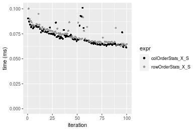
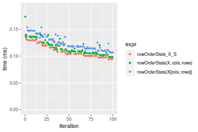
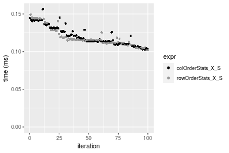
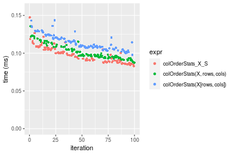
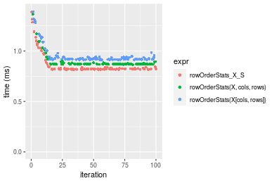

[matrixStats]: Benchmark report

---------------------------------------


# colOrderStats() and rowOrderStats() benchmarks on subsetted computation

This report benchmark the performance of colOrderStats() and rowOrderStats() on subsetted computation.


## Data type "integer"

### Data
```r
> rmatrix <- function(nrow, ncol, mode = c("logical", "double", "integer", "index"), range = c(-100, 
+     +100), na_prob = 0) {
+     mode <- match.arg(mode)
+     n <- nrow * ncol
+     if (mode == "logical") {
+         x <- sample(c(FALSE, TRUE), size = n, replace = TRUE)
+     }     else if (mode == "index") {
+         x <- seq_len(n)
+         mode <- "integer"
+     }     else {
+         x <- runif(n, min = range[1], max = range[2])
+     }
+     storage.mode(x) <- mode
+     if (na_prob > 0) 
+         x[sample(n, size = na_prob * n)] <- NA
+     dim(x) <- c(nrow, ncol)
+     x
+ }
> rmatrices <- function(scale = 10, seed = 1, ...) {
+     set.seed(seed)
+     data <- list()
+     data[[1]] <- rmatrix(nrow = scale * 1, ncol = scale * 1, ...)
+     data[[2]] <- rmatrix(nrow = scale * 10, ncol = scale * 10, ...)
+     data[[3]] <- rmatrix(nrow = scale * 100, ncol = scale * 1, ...)
+     data[[4]] <- t(data[[3]])
+     data[[5]] <- rmatrix(nrow = scale * 10, ncol = scale * 100, ...)
+     data[[6]] <- t(data[[5]])
+     names(data) <- sapply(data, FUN = function(x) paste(dim(x), collapse = "x"))
+     data
+ }
> data <- rmatrices(mode = mode)
```

### Results

#### 10x10 integer matrix


```r
> X <- data[["10x10"]]
> rows <- sample.int(nrow(X), size = nrow(X) * 0.7)
> cols <- sample.int(ncol(X), size = ncol(X) * 0.7)
> X_S <- X[rows, cols]
> gc()
           used  (Mb) gc trigger  (Mb) max used  (Mb)
Ncells  5277353 281.9    7916910 422.9  7916910 422.9
Vcells 10274025  78.4   33191153 253.3 53339345 407.0
> probs <- 0.3
> which <- round(probs * nrow(X))
> colStats <- microbenchmark(colOrderStats_X_S = colOrderStats(X_S, which = which, na.rm = FALSE), 
+     `colOrderStats(X, rows, cols)` = colOrderStats(X, rows = rows, cols = cols, which = which, na.rm = FALSE), 
+     `colOrderStats(X[rows, cols])` = colOrderStats(X[rows, cols], which = which, na.rm = FALSE), 
+     unit = "ms")
> X <- t(X)
> X_S <- t(X_S)
> gc()
           used  (Mb) gc trigger  (Mb) max used  (Mb)
Ncells  5264641 281.2    7916910 422.9  7916910 422.9
Vcells 10231873  78.1   33191153 253.3 53339345 407.0
> rowStats <- microbenchmark(rowOrderStats_X_S = rowOrderStats(X_S, which = which, na.rm = FALSE), 
+     `rowOrderStats(X, cols, rows)` = rowOrderStats(X, rows = cols, cols = rows, which = which, na.rm = FALSE), 
+     `rowOrderStats(X[cols, rows])` = rowOrderStats(X[cols, rows], which = which, na.rm = FALSE), 
+     unit = "ms")
```


_Table: Benchmarking of colOrderStats_X_S(), colOrderStats(X, rows, cols)() and colOrderStats(X[rows, cols])() on integer+10x10 data. The top panel shows times in milliseconds and the bottom panel shows relative times._


|   |expr                         |      min|        lq|      mean|    median|       uq|      max|
|:--|:----------------------------|--------:|---------:|---------:|---------:|--------:|--------:|
|1  |colOrderStats_X_S            | 0.003616| 0.0037545| 0.0056962| 0.0038560| 0.003970| 0.182701|
|2  |colOrderStats(X, rows, cols) | 0.003986| 0.0041660| 0.0043677| 0.0042425| 0.004378| 0.010111|
|3  |colOrderStats(X[rows, cols]) | 0.004595| 0.0049685| 0.0051760| 0.0050925| 0.005231| 0.010444|


|   |expr                         |      min|       lq|      mean|   median|       uq|       max|
|:--|:----------------------------|--------:|--------:|---------:|--------:|--------:|---------:|
|1  |colOrderStats_X_S            | 1.000000| 1.000000| 1.0000000| 1.000000| 1.000000| 1.0000000|
|2  |colOrderStats(X, rows, cols) | 1.102323| 1.109602| 0.7667695| 1.100233| 1.102771| 0.0553418|
|3  |colOrderStats(X[rows, cols]) | 1.270741| 1.323345| 0.9086691| 1.320669| 1.317632| 0.0571644|

_Table: Benchmarking of rowOrderStats_X_S(), rowOrderStats(X, cols, rows)() and rowOrderStats(X[cols, rows])() on integer+10x10 data (transposed). The top panel shows times in milliseconds and the bottom panel shows relative times._


|   |expr                         |      min|        lq|      mean|    median|        uq|      max|
|:--|:----------------------------|--------:|---------:|---------:|---------:|---------:|--------:|
|1  |rowOrderStats_X_S            | 0.003660| 0.0037585| 0.0040019| 0.0038765| 0.0040085| 0.007108|
|2  |rowOrderStats(X, cols, rows) | 0.003997| 0.0041305| 0.0061349| 0.0042230| 0.0043530| 0.183028|
|3  |rowOrderStats(X[cols, rows]) | 0.004692| 0.0050095| 0.0053540| 0.0051855| 0.0053625| 0.009327|


|   |expr                         |      min|       lq|     mean|   median|       uq|       max|
|:--|:----------------------------|--------:|--------:|--------:|--------:|--------:|---------:|
|1  |rowOrderStats_X_S            | 1.000000| 1.000000| 1.000000| 1.000000| 1.000000|  1.000000|
|2  |rowOrderStats(X, cols, rows) | 1.092076| 1.098976| 1.532992| 1.089385| 1.085942| 25.749578|
|3  |rowOrderStats(X[cols, rows]) | 1.281967| 1.332846| 1.337848| 1.337676| 1.337782|  1.312183|

_Figure: Benchmarking of colOrderStats_X_S(), colOrderStats(X, rows, cols)() and colOrderStats(X[rows, cols])() on integer+10x10 data  as well as rowOrderStats_X_S(), rowOrderStats(X, cols, rows)() and rowOrderStats(X[cols, rows])() on the same data transposed.  Outliers are displayed as crosses.  Times are in milliseconds._


_Table: Benchmarking of colOrderStats_X_S() and rowOrderStats_X_S() on integer+10x10 data (original and transposed).  The top panel shows times in milliseconds and the bottom panel shows relative times._


|   |expr              |   min|     lq|    mean| median|     uq|     max|
|:--|:-----------------|-----:|------:|-------:|------:|------:|-------:|
|1  |colOrderStats_X_S | 3.616| 3.7545| 5.69621| 3.8560| 3.9700| 182.701|
|2  |rowOrderStats_X_S | 3.660| 3.7585| 4.00192| 3.8765| 4.0085|   7.108|


|   |expr              |      min|       lq|      mean|   median|       uq|       max|
|:--|:-----------------|--------:|--------:|---------:|--------:|--------:|---------:|
|1  |colOrderStats_X_S | 1.000000| 1.000000| 1.0000000| 1.000000| 1.000000| 1.0000000|
|2  |rowOrderStats_X_S | 1.012168| 1.001065| 0.7025584| 1.005316| 1.009698| 0.0389051|

_Figure: Benchmarking of colOrderStats_X_S() and rowOrderStats_X_S() on integer+10x10 data (original and transposed).  Outliers are displayed as crosses. Times are in milliseconds._


#### 100x100 integer matrix


```r
> X <- data[["100x100"]]
> rows <- sample.int(nrow(X), size = nrow(X) * 0.7)
> cols <- sample.int(ncol(X), size = ncol(X) * 0.7)
> X_S <- X[rows, cols]
> gc()
          used  (Mb) gc trigger  (Mb) max used  (Mb)
Ncells 5263392 281.1    7916910 422.9  7916910 422.9
Vcells 9900461  75.6   33191153 253.3 53339345 407.0
> probs <- 0.3
> which <- round(probs * nrow(X))
> colStats <- microbenchmark(colOrderStats_X_S = colOrderStats(X_S, which = which, na.rm = FALSE), 
+     `colOrderStats(X, rows, cols)` = colOrderStats(X, rows = rows, cols = cols, which = which, na.rm = FALSE), 
+     `colOrderStats(X[rows, cols])` = colOrderStats(X[rows, cols], which = which, na.rm = FALSE), 
+     unit = "ms")
> X <- t(X)
> X_S <- t(X_S)
> gc()
          used  (Mb) gc trigger  (Mb) max used  (Mb)
Ncells 5263385 281.1    7916910 422.9  7916910 422.9
Vcells 9905543  75.6   33191153 253.3 53339345 407.0
> rowStats <- microbenchmark(rowOrderStats_X_S = rowOrderStats(X_S, which = which, na.rm = FALSE), 
+     `rowOrderStats(X, cols, rows)` = rowOrderStats(X, rows = cols, cols = rows, which = which, na.rm = FALSE), 
+     `rowOrderStats(X[cols, rows])` = rowOrderStats(X[cols, rows], which = which, na.rm = FALSE), 
+     unit = "ms")
```


_Table: Benchmarking of colOrderStats_X_S(), colOrderStats(X, rows, cols)() and colOrderStats(X[rows, cols])() on integer+100x100 data. The top panel shows times in milliseconds and the bottom panel shows relative times._


|   |expr                         |      min|       lq|      mean|    median|        uq|      max|
|:--|:----------------------------|--------:|--------:|---------:|---------:|---------:|--------:|
|1  |colOrderStats_X_S            | 0.061322| 0.064847| 0.0721261| 0.0701925| 0.0771660| 0.101020|
|3  |colOrderStats(X[rows, cols]) | 0.070737| 0.075486| 0.0827852| 0.0801990| 0.0873930| 0.142387|
|2  |colOrderStats(X, rows, cols) | 0.069765| 0.073349| 0.0815369| 0.0804635| 0.0868975| 0.109363|


|   |expr                         |      min|       lq|     mean|   median|       uq|      max|
|:--|:----------------------------|--------:|--------:|--------:|--------:|--------:|--------:|
|1  |colOrderStats_X_S            | 1.000000| 1.000000| 1.000000| 1.000000| 1.000000| 1.000000|
|3  |colOrderStats(X[rows, cols]) | 1.153534| 1.164063| 1.147784| 1.142558| 1.132532| 1.409493|
|2  |colOrderStats(X, rows, cols) | 1.137683| 1.131109| 1.130478| 1.146326| 1.126111| 1.082588|

_Table: Benchmarking of rowOrderStats_X_S(), rowOrderStats(X, cols, rows)() and rowOrderStats(X[cols, rows])() on integer+100x100 data (transposed). The top panel shows times in milliseconds and the bottom panel shows relative times._


|   |expr                         |      min|        lq|      mean|    median|        uq|      max|
|:--|:----------------------------|--------:|---------:|---------:|---------:|---------:|--------:|
|1  |rowOrderStats_X_S            | 0.063019| 0.0668105| 0.0735779| 0.0715980| 0.0791005| 0.100120|
|2  |rowOrderStats(X, cols, rows) | 0.068286| 0.0719095| 0.0779849| 0.0762765| 0.0805660| 0.132876|
|3  |rowOrderStats(X[cols, rows]) | 0.073546| 0.0776135| 0.0835979| 0.0809965| 0.0866615| 0.109036|


|   |expr                         |      min|       lq|     mean|   median|       uq|      max|
|:--|:----------------------------|--------:|--------:|--------:|--------:|--------:|--------:|
|1  |rowOrderStats_X_S            | 1.000000| 1.000000| 1.000000| 1.000000| 1.000000| 1.000000|
|2  |rowOrderStats(X, cols, rows) | 1.083578| 1.076320| 1.059896| 1.065344| 1.018527| 1.327167|
|3  |rowOrderStats(X[cols, rows]) | 1.167045| 1.161696| 1.136183| 1.131268| 1.095587| 1.089053|

_Figure: Benchmarking of colOrderStats_X_S(), colOrderStats(X, rows, cols)() and colOrderStats(X[rows, cols])() on integer+100x100 data  as well as rowOrderStats_X_S(), rowOrderStats(X, cols, rows)() and rowOrderStats(X[cols, rows])() on the same data transposed.  Outliers are displayed as crosses.  Times are in milliseconds._


_Table: Benchmarking of colOrderStats_X_S() and rowOrderStats_X_S() on integer+100x100 data (original and transposed).  The top panel shows times in milliseconds and the bottom panel shows relative times._


|   |expr              |    min|      lq|     mean|  median|      uq|    max|
|:--|:-----------------|------:|-------:|--------:|-------:|-------:|------:|
|1  |colOrderStats_X_S | 61.322| 64.8470| 72.12609| 70.1925| 77.1660| 101.02|
|2  |rowOrderStats_X_S | 63.019| 66.8105| 73.57786| 71.5980| 79.1005| 100.12|


|   |expr              |      min|       lq|     mean|   median|       uq|       max|
|:--|:-----------------|--------:|--------:|--------:|--------:|--------:|---------:|
|1  |colOrderStats_X_S | 1.000000| 1.000000| 1.000000| 1.000000| 1.000000| 1.0000000|
|2  |rowOrderStats_X_S | 1.027674| 1.030279| 1.020128| 1.020023| 1.025069| 0.9910909|

_Figure: Benchmarking of colOrderStats_X_S() and rowOrderStats_X_S() on integer+100x100 data (original and transposed).  Outliers are displayed as crosses. Times are in milliseconds._




#### 1000x10 integer matrix


```r
> X <- data[["1000x10"]]
> rows <- sample.int(nrow(X), size = nrow(X) * 0.7)
> cols <- sample.int(ncol(X), size = ncol(X) * 0.7)
> X_S <- X[rows, cols]
> gc()
          used  (Mb) gc trigger  (Mb) max used  (Mb)
Ncells 5264127 281.2    7916910 422.9  7916910 422.9
Vcells 9904802  75.6   33191153 253.3 53339345 407.0
> probs <- 0.3
> which <- round(probs * nrow(X))
> colStats <- microbenchmark(colOrderStats_X_S = colOrderStats(X_S, which = which, na.rm = FALSE), 
+     `colOrderStats(X, rows, cols)` = colOrderStats(X, rows = rows, cols = cols, which = which, na.rm = FALSE), 
+     `colOrderStats(X[rows, cols])` = colOrderStats(X[rows, cols], which = which, na.rm = FALSE), 
+     unit = "ms")
> X <- t(X)
> X_S <- t(X_S)
> gc()
          used  (Mb) gc trigger  (Mb) max used  (Mb)
Ncells 5264129 281.2    7916910 422.9  7916910 422.9
Vcells 9909899  75.7   33191153 253.3 53339345 407.0
> rowStats <- microbenchmark(rowOrderStats_X_S = rowOrderStats(X_S, which = which, na.rm = FALSE), 
+     `rowOrderStats(X, cols, rows)` = rowOrderStats(X, rows = cols, cols = rows, which = which, na.rm = FALSE), 
+     `rowOrderStats(X[cols, rows])` = rowOrderStats(X[cols, rows], which = which, na.rm = FALSE), 
+     unit = "ms")
```


_Table: Benchmarking of colOrderStats_X_S(), colOrderStats(X, rows, cols)() and colOrderStats(X[rows, cols])() on integer+1000x10 data. The top panel shows times in milliseconds and the bottom panel shows relative times._


|   |expr                         |      min|       lq|      mean|    median|        uq|      max|
|:--|:----------------------------|--------:|--------:|---------:|---------:|---------:|--------:|
|1  |colOrderStats_X_S            | 0.057181| 0.062759| 0.0665630| 0.0648220| 0.0701965| 0.090253|
|2  |colOrderStats(X, rows, cols) | 0.066728| 0.069157| 0.0752446| 0.0739160| 0.0793055| 0.101274|
|3  |colOrderStats(X[rows, cols]) | 0.067331| 0.069691| 0.0779140| 0.0754075| 0.0827005| 0.158377|


|   |expr                         |      min|       lq|     mean|   median|       uq|      max|
|:--|:----------------------------|--------:|--------:|--------:|--------:|--------:|--------:|
|1  |colOrderStats_X_S            | 1.000000| 1.000000| 1.000000| 1.000000| 1.000000| 1.000000|
|2  |colOrderStats(X, rows, cols) | 1.166961| 1.101946| 1.130427| 1.140292| 1.129764| 1.122112|
|3  |colOrderStats(X[rows, cols]) | 1.177507| 1.110454| 1.170532| 1.163301| 1.178128| 1.754811|

_Table: Benchmarking of rowOrderStats_X_S(), rowOrderStats(X, cols, rows)() and rowOrderStats(X[cols, rows])() on integer+1000x10 data (transposed). The top panel shows times in milliseconds and the bottom panel shows relative times._


|   |expr                         |      min|        lq|      mean|    median|        uq|      max|
|:--|:----------------------------|--------:|---------:|---------:|---------:|---------:|--------:|
|1  |rowOrderStats_X_S            | 0.060967| 0.0649265| 0.0702981| 0.0693365| 0.0762260| 0.093326|
|2  |rowOrderStats(X, cols, rows) | 0.066306| 0.0719005| 0.0777383| 0.0789750| 0.0833890| 0.097306|
|3  |rowOrderStats(X[cols, rows]) | 0.072841| 0.0780170| 0.0859004| 0.0853080| 0.0920185| 0.144732|


|   |expr                         |      min|       lq|     mean|   median|       uq|      max|
|:--|:----------------------------|--------:|--------:|--------:|--------:|--------:|--------:|
|1  |rowOrderStats_X_S            | 1.000000| 1.000000| 1.000000| 1.000000| 1.000000| 1.000000|
|2  |rowOrderStats(X, cols, rows) | 1.087572| 1.107414| 1.105837| 1.139010| 1.093971| 1.042646|
|3  |rowOrderStats(X[cols, rows]) | 1.194761| 1.201620| 1.221945| 1.230348| 1.207180| 1.550822|

_Figure: Benchmarking of colOrderStats_X_S(), colOrderStats(X, rows, cols)() and colOrderStats(X[rows, cols])() on integer+1000x10 data  as well as rowOrderStats_X_S(), rowOrderStats(X, cols, rows)() and rowOrderStats(X[cols, rows])() on the same data transposed.  Outliers are displayed as crosses.  Times are in milliseconds._


_Table: Benchmarking of colOrderStats_X_S() and rowOrderStats_X_S() on integer+1000x10 data (original and transposed).  The top panel shows times in milliseconds and the bottom panel shows relative times._


|   |expr              |    min|      lq|     mean|  median|      uq|    max|
|:--|:-----------------|------:|-------:|--------:|-------:|-------:|------:|
|1  |colOrderStats_X_S | 57.181| 62.7590| 66.56295| 64.8220| 70.1965| 90.253|
|2  |rowOrderStats_X_S | 60.967| 64.9265| 70.29812| 69.3365| 76.2260| 93.326|


|   |expr              |      min|       lq|     mean|   median|       uq|      max|
|:--|:-----------------|--------:|--------:|--------:|--------:|--------:|--------:|
|1  |colOrderStats_X_S | 1.000000| 1.000000| 1.000000| 1.000000| 1.000000| 1.000000|
|2  |rowOrderStats_X_S | 1.066211| 1.034537| 1.056115| 1.069645| 1.085895| 1.034049|

_Figure: Benchmarking of colOrderStats_X_S() and rowOrderStats_X_S() on integer+1000x10 data (original and transposed).  Outliers are displayed as crosses. Times are in milliseconds._


#### 10x1000 integer matrix


```r
> X <- data[["10x1000"]]
> rows <- sample.int(nrow(X), size = nrow(X) * 0.7)
> cols <- sample.int(ncol(X), size = ncol(X) * 0.7)
> X_S <- X[rows, cols]
> gc()
          used  (Mb) gc trigger  (Mb) max used  (Mb)
Ncells 5264340 281.2    7916910 422.9  7916910 422.9
Vcells 9905755  75.6   33191153 253.3 53339345 407.0
> probs <- 0.3
> which <- round(probs * nrow(X))
> colStats <- microbenchmark(colOrderStats_X_S = colOrderStats(X_S, which = which, na.rm = FALSE), 
+     `colOrderStats(X, rows, cols)` = colOrderStats(X, rows = rows, cols = cols, which = which, na.rm = FALSE), 
+     `colOrderStats(X[rows, cols])` = colOrderStats(X[rows, cols], which = which, na.rm = FALSE), 
+     unit = "ms")
> X <- t(X)
> X_S <- t(X_S)
> gc()
          used  (Mb) gc trigger  (Mb) max used  (Mb)
Ncells 5264333 281.2    7916910 422.9  7916910 422.9
Vcells 9910837  75.7   33191153 253.3 53339345 407.0
> rowStats <- microbenchmark(rowOrderStats_X_S = rowOrderStats(X_S, which = which, na.rm = FALSE), 
+     `rowOrderStats(X, cols, rows)` = rowOrderStats(X, rows = cols, cols = rows, which = which, na.rm = FALSE), 
+     `rowOrderStats(X[cols, rows])` = rowOrderStats(X[cols, rows], which = which, na.rm = FALSE), 
+     unit = "ms")
```


_Table: Benchmarking of colOrderStats_X_S(), colOrderStats(X, rows, cols)() and colOrderStats(X[rows, cols])() on integer+10x1000 data. The top panel shows times in milliseconds and the bottom panel shows relative times._


|   |expr                         |      min|       lq|      mean|    median|        uq|      max|
|:--|:----------------------------|--------:|--------:|---------:|---------:|---------:|--------:|
|1  |colOrderStats_X_S            | 0.051076| 0.058166| 0.0682762| 0.0636880| 0.0726705| 0.133429|
|2  |colOrderStats(X, rows, cols) | 0.063770| 0.069036| 0.0795347| 0.0752845| 0.0830425| 0.168673|
|3  |colOrderStats(X[rows, cols]) | 0.061585| 0.072031| 0.0809872| 0.0774075| 0.0848065| 0.138243|


|   |expr                         |      min|       lq|     mean|   median|       uq|      max|
|:--|:----------------------------|--------:|--------:|--------:|--------:|--------:|--------:|
|1  |colOrderStats_X_S            | 1.000000| 1.000000| 1.000000| 1.000000| 1.000000| 1.000000|
|2  |colOrderStats(X, rows, cols) | 1.248532| 1.186879| 1.164896| 1.182083| 1.142726| 1.264140|
|3  |colOrderStats(X[rows, cols]) | 1.205752| 1.238369| 1.186170| 1.215417| 1.167000| 1.036079|

_Table: Benchmarking of rowOrderStats_X_S(), rowOrderStats(X, cols, rows)() and rowOrderStats(X[cols, rows])() on integer+10x1000 data (transposed). The top panel shows times in milliseconds and the bottom panel shows relative times._


|   |expr                         |      min|        lq|      mean|    median|        uq|      max|
|:--|:----------------------------|--------:|---------:|---------:|---------:|---------:|--------:|
|1  |rowOrderStats_X_S            | 0.053012| 0.0620965| 0.0666572| 0.0656160| 0.0704080| 0.091902|
|2  |rowOrderStats(X, cols, rows) | 0.060500| 0.0717115| 0.0774322| 0.0770045| 0.0831090| 0.128663|
|3  |rowOrderStats(X[cols, rows]) | 0.062208| 0.0748235| 0.0788250| 0.0791910| 0.0832385| 0.097954|


|   |expr                         |      min|       lq|     mean|   median|       uq|      max|
|:--|:----------------------------|--------:|--------:|--------:|--------:|--------:|--------:|
|1  |rowOrderStats_X_S            | 1.000000| 1.000000| 1.000000| 1.000000| 1.000000| 1.000000|
|2  |rowOrderStats(X, cols, rows) | 1.141251| 1.154840| 1.161648| 1.173563| 1.180391| 1.400002|
|3  |rowOrderStats(X[cols, rows]) | 1.173470| 1.204955| 1.182542| 1.206886| 1.182231| 1.065853|

_Figure: Benchmarking of colOrderStats_X_S(), colOrderStats(X, rows, cols)() and colOrderStats(X[rows, cols])() on integer+10x1000 data  as well as rowOrderStats_X_S(), rowOrderStats(X, cols, rows)() and rowOrderStats(X[cols, rows])() on the same data transposed.  Outliers are displayed as crosses.  Times are in milliseconds._


_Table: Benchmarking of colOrderStats_X_S() and rowOrderStats_X_S() on integer+10x1000 data (original and transposed).  The top panel shows times in milliseconds and the bottom panel shows relative times._


|   |expr              |    min|      lq|     mean| median|      uq|     max|
|:--|:-----------------|------:|-------:|--------:|------:|-------:|-------:|
|1  |colOrderStats_X_S | 51.076| 58.1660| 68.27622| 63.688| 72.6705| 133.429|
|2  |rowOrderStats_X_S | 53.012| 62.0965| 66.65722| 65.616| 70.4080|  91.902|


|   |expr              |      min|       lq|      mean|   median|        uq|       max|
|:--|:-----------------|--------:|--------:|---------:|--------:|---------:|---------:|
|1  |colOrderStats_X_S | 1.000000| 1.000000| 1.0000000| 1.000000| 1.0000000| 1.0000000|
|2  |rowOrderStats_X_S | 1.037904| 1.067574| 0.9762875| 1.030273| 0.9688663| 0.6887708|

_Figure: Benchmarking of colOrderStats_X_S() and rowOrderStats_X_S() on integer+10x1000 data (original and transposed).  Outliers are displayed as crosses. Times are in milliseconds._


#### 100x1000 integer matrix


```r
> X <- data[["100x1000"]]
> rows <- sample.int(nrow(X), size = nrow(X) * 0.7)
> cols <- sample.int(ncol(X), size = ncol(X) * 0.7)
> X_S <- X[rows, cols]
> gc()
          used  (Mb) gc trigger  (Mb) max used  (Mb)
Ncells 5264553 281.2    7916910 422.9  7916910 422.9
Vcells 9928505  75.8   33191153 253.3 53339345 407.0
> probs <- 0.3
> which <- round(probs * nrow(X))
> colStats <- microbenchmark(colOrderStats_X_S = colOrderStats(X_S, which = which, na.rm = FALSE), 
+     `colOrderStats(X, rows, cols)` = colOrderStats(X, rows = rows, cols = cols, which = which, na.rm = FALSE), 
+     `colOrderStats(X[rows, cols])` = colOrderStats(X[rows, cols], which = which, na.rm = FALSE), 
+     unit = "ms")
> X <- t(X)
> X_S <- t(X_S)
> gc()
          used  (Mb) gc trigger  (Mb) max used  (Mb)
Ncells 5264546 281.2    7916910 422.9  7916910 422.9
Vcells 9978587  76.2   33191153 253.3 53339345 407.0
> rowStats <- microbenchmark(rowOrderStats_X_S = rowOrderStats(X_S, which = which, na.rm = FALSE), 
+     `rowOrderStats(X, cols, rows)` = rowOrderStats(X, rows = cols, cols = rows, which = which, na.rm = FALSE), 
+     `rowOrderStats(X[cols, rows])` = rowOrderStats(X[cols, rows], which = which, na.rm = FALSE), 
+     unit = "ms")
```


_Table: Benchmarking of colOrderStats_X_S(), colOrderStats(X, rows, cols)() and colOrderStats(X[rows, cols])() on integer+100x1000 data. The top panel shows times in milliseconds and the bottom panel shows relative times._


|   |expr                         |      min|        lq|      mean|    median|        uq|      max|
|:--|:----------------------------|--------:|---------:|---------:|---------:|---------:|--------:|
|1  |colOrderStats_X_S            | 0.572323| 0.5754330| 0.6353914| 0.5819950| 0.6417175| 1.041475|
|2  |colOrderStats(X, rows, cols) | 0.625324| 0.6289180| 0.6977233| 0.6394415| 0.7555640| 1.134006|
|3  |colOrderStats(X[rows, cols]) | 0.639455| 0.6432375| 0.7222737| 0.6578575| 0.7746640| 1.073283|


|   |expr                         |      min|       lq|     mean|   median|       uq|      max|
|:--|:----------------------------|--------:|--------:|--------:|--------:|--------:|--------:|
|1  |colOrderStats_X_S            | 1.000000| 1.000000| 1.000000| 1.000000| 1.000000| 1.000000|
|2  |colOrderStats(X, rows, cols) | 1.092607| 1.092947| 1.098100| 1.098706| 1.177409| 1.088846|
|3  |colOrderStats(X[rows, cols]) | 1.117297| 1.117832| 1.136738| 1.130349| 1.207173| 1.030541|

_Table: Benchmarking of rowOrderStats_X_S(), rowOrderStats(X, cols, rows)() and rowOrderStats(X[cols, rows])() on integer+100x1000 data (transposed). The top panel shows times in milliseconds and the bottom panel shows relative times._


|   |expr                         |      min|       lq|      mean|    median|        uq|      max|
|:--|:----------------------------|--------:|--------:|---------:|---------:|---------:|--------:|
|1  |rowOrderStats_X_S            | 0.584002| 0.586726| 0.6468922| 0.5902910| 0.6538235| 1.000678|
|2  |rowOrderStats(X, cols, rows) | 0.622037| 0.626002| 0.6791005| 0.6288115| 0.6762895| 1.050924|
|3  |rowOrderStats(X[cols, rows]) | 0.648965| 0.651364| 0.7145244| 0.6556600| 0.7094695| 1.108783|


|   |expr                         |      min|       lq|     mean|   median|       uq|      max|
|:--|:----------------------------|--------:|--------:|--------:|--------:|--------:|--------:|
|1  |rowOrderStats_X_S            | 1.000000| 1.000000| 1.000000| 1.000000| 1.000000| 1.000000|
|2  |rowOrderStats(X, cols, rows) | 1.065128| 1.066941| 1.049789| 1.065257| 1.034361| 1.050212|
|3  |rowOrderStats(X[cols, rows]) | 1.111238| 1.110167| 1.104549| 1.110740| 1.085109| 1.108032|

_Figure: Benchmarking of colOrderStats_X_S(), colOrderStats(X, rows, cols)() and colOrderStats(X[rows, cols])() on integer+100x1000 data  as well as rowOrderStats_X_S(), rowOrderStats(X, cols, rows)() and rowOrderStats(X[cols, rows])() on the same data transposed.  Outliers are displayed as crosses.  Times are in milliseconds._


_Table: Benchmarking of colOrderStats_X_S() and rowOrderStats_X_S() on integer+100x1000 data (original and transposed).  The top panel shows times in milliseconds and the bottom panel shows relative times._


|   |expr              |     min|      lq|     mean|  median|       uq|      max|
|:--|:-----------------|-------:|-------:|--------:|-------:|--------:|--------:|
|1  |colOrderStats_X_S | 572.323| 575.433| 635.3914| 581.995| 641.7175| 1041.475|
|2  |rowOrderStats_X_S | 584.002| 586.726| 646.8922| 590.291| 653.8235| 1000.678|


|   |expr              |      min|       lq|   mean|   median|       uq|       max|
|:--|:-----------------|--------:|--------:|------:|--------:|--------:|---------:|
|1  |colOrderStats_X_S | 1.000000| 1.000000| 1.0000| 1.000000| 1.000000| 1.0000000|
|2  |rowOrderStats_X_S | 1.020406| 1.019625| 1.0181| 1.014254| 1.018865| 0.9608277|

_Figure: Benchmarking of colOrderStats_X_S() and rowOrderStats_X_S() on integer+100x1000 data (original and transposed).  Outliers are displayed as crosses. Times are in milliseconds._


#### 1000x100 integer matrix


```r
> X <- data[["1000x100"]]
> rows <- sample.int(nrow(X), size = nrow(X) * 0.7)
> cols <- sample.int(ncol(X), size = ncol(X) * 0.7)
> X_S <- X[rows, cols]
> gc()
          used  (Mb) gc trigger  (Mb) max used  (Mb)
Ncells 5264763 281.2    7916910 422.9  7916910 422.9
Vcells 9929272  75.8   33191153 253.3 53339345 407.0
> probs <- 0.3
> which <- round(probs * nrow(X))
> colStats <- microbenchmark(colOrderStats_X_S = colOrderStats(X_S, which = which, na.rm = FALSE), 
+     `colOrderStats(X, rows, cols)` = colOrderStats(X, rows = rows, cols = cols, which = which, na.rm = FALSE), 
+     `colOrderStats(X[rows, cols])` = colOrderStats(X[rows, cols], which = which, na.rm = FALSE), 
+     unit = "ms")
> X <- t(X)
> X_S <- t(X_S)
> gc()
          used  (Mb) gc trigger  (Mb) max used  (Mb)
Ncells 5264756 281.2    7916910 422.9  7916910 422.9
Vcells 9979354  76.2   33191153 253.3 53339345 407.0
> rowStats <- microbenchmark(rowOrderStats_X_S = rowOrderStats(X_S, which = which, na.rm = FALSE), 
+     `rowOrderStats(X, cols, rows)` = rowOrderStats(X, rows = cols, cols = rows, which = which, na.rm = FALSE), 
+     `rowOrderStats(X[cols, rows])` = rowOrderStats(X[cols, rows], which = which, na.rm = FALSE), 
+     unit = "ms")
```


_Table: Benchmarking of colOrderStats_X_S(), colOrderStats(X, rows, cols)() and colOrderStats(X[rows, cols])() on integer+1000x100 data. The top panel shows times in milliseconds and the bottom panel shows relative times._


|   |expr                         |      min|        lq|      mean|    median|        uq|      max|
|:--|:----------------------------|--------:|---------:|---------:|---------:|---------:|--------:|
|1  |colOrderStats_X_S            | 0.514908| 0.5175070| 0.5519374| 0.5189595| 0.5244655| 0.868542|
|2  |colOrderStats(X, rows, cols) | 0.567678| 0.5706165| 0.6175886| 0.5723645| 0.5784130| 0.930544|
|3  |colOrderStats(X[rows, cols]) | 0.579886| 0.5820565| 0.6234843| 0.5855000| 0.6307305| 1.004655|


|   |expr                         |      min|       lq|     mean|   median|       uq|      max|
|:--|:----------------------------|--------:|--------:|--------:|--------:|--------:|--------:|
|1  |colOrderStats_X_S            | 1.000000| 1.000000| 1.000000| 1.000000| 1.000000| 1.000000|
|2  |colOrderStats(X, rows, cols) | 1.102484| 1.102626| 1.118947| 1.102908| 1.102862| 1.071386|
|3  |colOrderStats(X[rows, cols]) | 1.126193| 1.124732| 1.129629| 1.128219| 1.202616| 1.156714|

_Table: Benchmarking of rowOrderStats_X_S(), rowOrderStats(X, cols, rows)() and rowOrderStats(X[cols, rows])() on integer+1000x100 data (transposed). The top panel shows times in milliseconds and the bottom panel shows relative times._


|   |expr                         |      min|        lq|      mean|    median|        uq|      max|
|:--|:----------------------------|--------:|---------:|---------:|---------:|---------:|--------:|
|1  |rowOrderStats_X_S            | 0.536899| 0.5393750| 0.5784599| 0.5410535| 0.5456905| 0.884385|
|2  |rowOrderStats(X, cols, rows) | 0.574155| 0.5752820| 0.6145146| 0.5763745| 0.5825920| 0.978926|
|3  |rowOrderStats(X[cols, rows]) | 0.603700| 0.6074875| 0.6521745| 0.6100435| 0.6357425| 1.000979|


|   |expr                         |      min|       lq|     mean|   median|       uq|      max|
|:--|:----------------------------|--------:|--------:|--------:|--------:|--------:|--------:|
|1  |rowOrderStats_X_S            | 1.000000| 1.000000| 1.000000| 1.000000| 1.000000| 1.000000|
|2  |rowOrderStats(X, cols, rows) | 1.069391| 1.066572| 1.062329| 1.065282| 1.067624| 1.106900|
|3  |rowOrderStats(X[cols, rows]) | 1.124420| 1.126280| 1.127433| 1.127511| 1.165024| 1.131836|

_Figure: Benchmarking of colOrderStats_X_S(), colOrderStats(X, rows, cols)() and colOrderStats(X[rows, cols])() on integer+1000x100 data  as well as rowOrderStats_X_S(), rowOrderStats(X, cols, rows)() and rowOrderStats(X[cols, rows])() on the same data transposed.  Outliers are displayed as crosses.  Times are in milliseconds._


_Table: Benchmarking of colOrderStats_X_S() and rowOrderStats_X_S() on integer+1000x100 data (original and transposed).  The top panel shows times in milliseconds and the bottom panel shows relative times._


|   |expr              |     min|      lq|     mean|   median|       uq|     max|
|:--|:-----------------|-------:|-------:|--------:|--------:|--------:|-------:|
|1  |colOrderStats_X_S | 514.908| 517.507| 551.9374| 518.9595| 524.4655| 868.542|
|2  |rowOrderStats_X_S | 536.899| 539.375| 578.4599| 541.0535| 545.6905| 884.385|


|   |expr              |      min|       lq|     mean|   median|      uq|      max|
|:--|:-----------------|--------:|--------:|--------:|--------:|-------:|--------:|
|1  |colOrderStats_X_S | 1.000000| 1.000000| 1.000000| 1.000000| 1.00000| 1.000000|
|2  |rowOrderStats_X_S | 1.042709| 1.042256| 1.048053| 1.042574| 1.04047| 1.018241|

_Figure: Benchmarking of colOrderStats_X_S() and rowOrderStats_X_S() on integer+1000x100 data (original and transposed).  Outliers are displayed as crosses. Times are in milliseconds._


## Data type "double"

### Data
```r
> rmatrix <- function(nrow, ncol, mode = c("logical", "double", "integer", "index"), range = c(-100, 
+     +100), na_prob = 0) {
+     mode <- match.arg(mode)
+     n <- nrow * ncol
+     if (mode == "logical") {
+         x <- sample(c(FALSE, TRUE), size = n, replace = TRUE)
+     }     else if (mode == "index") {
+         x <- seq_len(n)
+         mode <- "integer"
+     }     else {
+         x <- runif(n, min = range[1], max = range[2])
+     }
+     storage.mode(x) <- mode
+     if (na_prob > 0) 
+         x[sample(n, size = na_prob * n)] <- NA
+     dim(x) <- c(nrow, ncol)
+     x
+ }
> rmatrices <- function(scale = 10, seed = 1, ...) {
+     set.seed(seed)
+     data <- list()
+     data[[1]] <- rmatrix(nrow = scale * 1, ncol = scale * 1, ...)
+     data[[2]] <- rmatrix(nrow = scale * 10, ncol = scale * 10, ...)
+     data[[3]] <- rmatrix(nrow = scale * 100, ncol = scale * 1, ...)
+     data[[4]] <- t(data[[3]])
+     data[[5]] <- rmatrix(nrow = scale * 10, ncol = scale * 100, ...)
+     data[[6]] <- t(data[[5]])
+     names(data) <- sapply(data, FUN = function(x) paste(dim(x), collapse = "x"))
+     data
+ }
> data <- rmatrices(mode = mode)
```

### Results

#### 10x10 double matrix


```r
> X <- data[["10x10"]]
> rows <- sample.int(nrow(X), size = nrow(X) * 0.7)
> cols <- sample.int(ncol(X), size = ncol(X) * 0.7)
> X_S <- X[rows, cols]
> gc()
           used  (Mb) gc trigger  (Mb) max used  (Mb)
Ncells  5264981 281.2    7916910 422.9  7916910 422.9
Vcells 10020400  76.5   33191153 253.3 53339345 407.0
> probs <- 0.3
> which <- round(probs * nrow(X))
> colStats <- microbenchmark(colOrderStats_X_S = colOrderStats(X_S, which = which, na.rm = FALSE), 
+     `colOrderStats(X, rows, cols)` = colOrderStats(X, rows = rows, cols = cols, which = which, na.rm = FALSE), 
+     `colOrderStats(X[rows, cols])` = colOrderStats(X[rows, cols], which = which, na.rm = FALSE), 
+     unit = "ms")
> X <- t(X)
> X_S <- t(X_S)
> gc()
           used  (Mb) gc trigger  (Mb) max used  (Mb)
Ncells  5264965 281.2    7916910 422.9  7916910 422.9
Vcells 10020567  76.5   33191153 253.3 53339345 407.0
> rowStats <- microbenchmark(rowOrderStats_X_S = rowOrderStats(X_S, which = which, na.rm = FALSE), 
+     `rowOrderStats(X, cols, rows)` = rowOrderStats(X, rows = cols, cols = rows, which = which, na.rm = FALSE), 
+     `rowOrderStats(X[cols, rows])` = rowOrderStats(X[cols, rows], which = which, na.rm = FALSE), 
+     unit = "ms")
```


_Table: Benchmarking of colOrderStats_X_S(), colOrderStats(X, rows, cols)() and colOrderStats(X[rows, cols])() on double+10x10 data. The top panel shows times in milliseconds and the bottom panel shows relative times._


|   |expr                         |      min|        lq|      mean|    median|        uq|      max|
|:--|:----------------------------|--------:|---------:|---------:|---------:|---------:|--------:|
|1  |colOrderStats_X_S            | 0.003904| 0.0040060| 0.0044219| 0.0041150| 0.0042165| 0.030449|
|2  |colOrderStats(X, rows, cols) | 0.004254| 0.0044695| 0.0045873| 0.0045250| 0.0046280| 0.007658|
|3  |colOrderStats(X[rows, cols]) | 0.005066| 0.0054500| 0.0057162| 0.0055705| 0.0057075| 0.012020|


|   |expr                         |      min|       lq|     mean|   median|       uq|       max|
|:--|:----------------------------|--------:|--------:|--------:|--------:|--------:|---------:|
|1  |colOrderStats_X_S            | 1.000000| 1.000000| 1.000000| 1.000000| 1.000000| 1.0000000|
|2  |colOrderStats(X, rows, cols) | 1.089652| 1.115701| 1.037398| 1.099635| 1.097593| 0.2515025|
|3  |colOrderStats(X[rows, cols]) | 1.297643| 1.360459| 1.292698| 1.353706| 1.353611| 0.3947584|

_Table: Benchmarking of rowOrderStats_X_S(), rowOrderStats(X, cols, rows)() and rowOrderStats(X[cols, rows])() on double+10x10 data (transposed). The top panel shows times in milliseconds and the bottom panel shows relative times._


|   |expr                         |      min|        lq|      mean|   median|        uq|      max|
|:--|:----------------------------|--------:|---------:|---------:|--------:|---------:|--------:|
|1  |rowOrderStats_X_S            | 0.003936| 0.0040855| 0.0042524| 0.004200| 0.0043205| 0.007714|
|2  |rowOrderStats(X, cols, rows) | 0.004276| 0.0044880| 0.0049958| 0.004612| 0.0047450| 0.038825|
|3  |rowOrderStats(X[cols, rows]) | 0.005145| 0.0054035| 0.0056098| 0.005518| 0.0056915| 0.009826|


|   |expr                         |      min|       lq|     mean|   median|       uq|      max|
|:--|:----------------------------|--------:|--------:|--------:|--------:|--------:|--------:|
|1  |rowOrderStats_X_S            | 1.000000| 1.000000| 1.000000| 1.000000| 1.000000| 1.000000|
|2  |rowOrderStats(X, cols, rows) | 1.086382| 1.098519| 1.174830| 1.098095| 1.098253| 5.033057|
|3  |rowOrderStats(X[cols, rows]) | 1.307165| 1.322604| 1.319213| 1.313810| 1.317324| 1.273788|

_Figure: Benchmarking of colOrderStats_X_S(), colOrderStats(X, rows, cols)() and colOrderStats(X[rows, cols])() on double+10x10 data  as well as rowOrderStats_X_S(), rowOrderStats(X, cols, rows)() and rowOrderStats(X[cols, rows])() on the same data transposed.  Outliers are displayed as crosses.  Times are in milliseconds._


_Table: Benchmarking of colOrderStats_X_S() and rowOrderStats_X_S() on double+10x10 data (original and transposed).  The top panel shows times in milliseconds and the bottom panel shows relative times._


|   |expr              |   min|     lq|    mean| median|     uq|    max|
|:--|:-----------------|-----:|------:|-------:|------:|------:|------:|
|1  |colOrderStats_X_S | 3.904| 4.0060| 4.42193|  4.115| 4.2165| 30.449|
|2  |rowOrderStats_X_S | 3.936| 4.0855| 4.25237|  4.200| 4.3205|  7.714|


|   |expr              |      min|       lq|      mean|   median|       uq|       max|
|:--|:-----------------|--------:|--------:|---------:|--------:|--------:|---------:|
|1  |colOrderStats_X_S | 1.000000| 1.000000| 1.0000000| 1.000000| 1.000000| 1.0000000|
|2  |rowOrderStats_X_S | 1.008197| 1.019845| 0.9616548| 1.020656| 1.024665| 0.2533417|

_Figure: Benchmarking of colOrderStats_X_S() and rowOrderStats_X_S() on double+10x10 data (original and transposed).  Outliers are displayed as crosses. Times are in milliseconds._


#### 100x100 double matrix


```r
> X <- data[["100x100"]]
> rows <- sample.int(nrow(X), size = nrow(X) * 0.7)
> cols <- sample.int(ncol(X), size = ncol(X) * 0.7)
> X_S <- X[rows, cols]
> gc()
           used  (Mb) gc trigger  (Mb) max used  (Mb)
Ncells  5265179 281.2    7916910 422.9  7916910 422.9
Vcells 10026342  76.5   33191153 253.3 53339345 407.0
> probs <- 0.3
> which <- round(probs * nrow(X))
> colStats <- microbenchmark(colOrderStats_X_S = colOrderStats(X_S, which = which, na.rm = FALSE), 
+     `colOrderStats(X, rows, cols)` = colOrderStats(X, rows = rows, cols = cols, which = which, na.rm = FALSE), 
+     `colOrderStats(X[rows, cols])` = colOrderStats(X[rows, cols], which = which, na.rm = FALSE), 
+     unit = "ms")
> X <- t(X)
> X_S <- t(X_S)
> gc()
           used  (Mb) gc trigger  (Mb) max used  (Mb)
Ncells  5265172 281.2    7916910 422.9  7916910 422.9
Vcells 10036424  76.6   33191153 253.3 53339345 407.0
> rowStats <- microbenchmark(rowOrderStats_X_S = rowOrderStats(X_S, which = which, na.rm = FALSE), 
+     `rowOrderStats(X, cols, rows)` = rowOrderStats(X, rows = cols, cols = rows, which = which, na.rm = FALSE), 
+     `rowOrderStats(X[cols, rows])` = rowOrderStats(X[cols, rows], which = which, na.rm = FALSE), 
+     unit = "ms")
```


_Table: Benchmarking of colOrderStats_X_S(), colOrderStats(X, rows, cols)() and colOrderStats(X[rows, cols])() on double+100x100 data. The top panel shows times in milliseconds and the bottom panel shows relative times._


|   |expr                         |      min|        lq|      mean|    median|        uq|      max|
|:--|:----------------------------|--------:|---------:|---------:|---------:|---------:|--------:|
|1  |colOrderStats_X_S            | 0.094464| 0.1009355| 0.1112849| 0.1054160| 0.1205230| 0.140196|
|2  |colOrderStats(X, rows, cols) | 0.098651| 0.1055150| 0.1153140| 0.1115515| 0.1251875| 0.141380|
|3  |colOrderStats(X[rows, cols]) | 0.106627| 0.1143875| 0.1261644| 0.1203205| 0.1362010| 0.190108|


|   |expr                         |      min|       lq|     mean|   median|       uq|      max|
|:--|:----------------------------|--------:|--------:|--------:|--------:|--------:|--------:|
|1  |colOrderStats_X_S            | 1.000000| 1.000000| 1.000000| 1.000000| 1.000000| 1.000000|
|2  |colOrderStats(X, rows, cols) | 1.044324| 1.045371| 1.036205| 1.058203| 1.038702| 1.008445|
|3  |colOrderStats(X[rows, cols]) | 1.128758| 1.133273| 1.133707| 1.141387| 1.130083| 1.356016|

_Table: Benchmarking of rowOrderStats_X_S(), rowOrderStats(X, cols, rows)() and rowOrderStats(X[cols, rows])() on double+100x100 data (transposed). The top panel shows times in milliseconds and the bottom panel shows relative times._


|   |expr                         |      min|        lq|      mean|    median|       uq|      max|
|:--|:----------------------------|--------:|---------:|---------:|---------:|--------:|--------:|
|1  |rowOrderStats_X_S            | 0.093952| 0.1006295| 0.1108625| 0.1045450| 0.120420| 0.142034|
|2  |rowOrderStats(X, cols, rows) | 0.098229| 0.1055945| 0.1160436| 0.1114285| 0.124568| 0.173771|
|3  |rowOrderStats(X[cols, rows]) | 0.106347| 0.1144835| 0.1245918| 0.1186005| 0.135810| 0.153948|


|   |expr                         |      min|       lq|     mean|   median|       uq|      max|
|:--|:----------------------------|--------:|--------:|--------:|--------:|--------:|--------:|
|1  |rowOrderStats_X_S            | 1.000000| 1.000000| 1.000000| 1.000000| 1.000000| 1.000000|
|2  |rowOrderStats(X, cols, rows) | 1.045523| 1.049339| 1.046734| 1.065843| 1.034446| 1.223447|
|3  |rowOrderStats(X[cols, rows]) | 1.131929| 1.137673| 1.123840| 1.134445| 1.127803| 1.083881|

_Figure: Benchmarking of colOrderStats_X_S(), colOrderStats(X, rows, cols)() and colOrderStats(X[rows, cols])() on double+100x100 data  as well as rowOrderStats_X_S(), rowOrderStats(X, cols, rows)() and rowOrderStats(X[cols, rows])() on the same data transposed.  Outliers are displayed as crosses.  Times are in milliseconds._



_Table: Benchmarking of colOrderStats_X_S() and rowOrderStats_X_S() on double+100x100 data (original and transposed).  The top panel shows times in milliseconds and the bottom panel shows relative times._


|   |expr              |    min|       lq|     mean|  median|      uq|     max|
|:--|:-----------------|------:|--------:|--------:|-------:|-------:|-------:|
|2  |rowOrderStats_X_S | 93.952| 100.6295| 110.8625| 104.545| 120.420| 142.034|
|1  |colOrderStats_X_S | 94.464| 100.9355| 111.2849| 105.416| 120.523| 140.196|


|   |expr              |     min|       lq|    mean|   median|       uq|       max|
|:--|:-----------------|-------:|--------:|-------:|--------:|--------:|---------:|
|2  |rowOrderStats_X_S | 1.00000| 1.000000| 1.00000| 1.000000| 1.000000| 1.0000000|
|1  |colOrderStats_X_S | 1.00545| 1.003041| 1.00381| 1.008331| 1.000855| 0.9870594|

_Figure: Benchmarking of colOrderStats_X_S() and rowOrderStats_X_S() on double+100x100 data (original and transposed).  Outliers are displayed as crosses. Times are in milliseconds._


#### 1000x10 double matrix


```r
> X <- data[["1000x10"]]
> rows <- sample.int(nrow(X), size = nrow(X) * 0.7)
> cols <- sample.int(ncol(X), size = ncol(X) * 0.7)
> X_S <- X[rows, cols]
> gc()
           used  (Mb) gc trigger  (Mb) max used  (Mb)
Ncells  5265378 281.3    7916910 422.9  7916910 422.9
Vcells 10027844  76.6   33191153 253.3 53339345 407.0
> probs <- 0.3
> which <- round(probs * nrow(X))
> colStats <- microbenchmark(colOrderStats_X_S = colOrderStats(X_S, which = which, na.rm = FALSE), 
+     `colOrderStats(X, rows, cols)` = colOrderStats(X, rows = rows, cols = cols, which = which, na.rm = FALSE), 
+     `colOrderStats(X[rows, cols])` = colOrderStats(X[rows, cols], which = which, na.rm = FALSE), 
+     unit = "ms")
> X <- t(X)
> X_S <- t(X_S)
> gc()
           used  (Mb) gc trigger  (Mb) max used  (Mb)
Ncells  5265371 281.3    7916910 422.9  7916910 422.9
Vcells 10037926  76.6   33191153 253.3 53339345 407.0
> rowStats <- microbenchmark(rowOrderStats_X_S = rowOrderStats(X_S, which = which, na.rm = FALSE), 
+     `rowOrderStats(X, cols, rows)` = rowOrderStats(X, rows = cols, cols = rows, which = which, na.rm = FALSE), 
+     `rowOrderStats(X[cols, rows])` = rowOrderStats(X[cols, rows], which = which, na.rm = FALSE), 
+     unit = "ms")
```


_Table: Benchmarking of colOrderStats_X_S(), colOrderStats(X, rows, cols)() and colOrderStats(X[rows, cols])() on double+1000x10 data. The top panel shows times in milliseconds and the bottom panel shows relative times._


|   |expr                         |      min|        lq|      mean|    median|        uq|      max|
|:--|:----------------------------|--------:|---------:|---------:|---------:|---------:|--------:|
|1  |colOrderStats_X_S            | 0.102591| 0.1104990| 0.1205792| 0.1157580| 0.1311365| 0.156502|
|2  |colOrderStats(X, rows, cols) | 0.104593| 0.1152375| 0.1243236| 0.1195345| 0.1335335| 0.155428|
|3  |colOrderStats(X[rows, cols]) | 0.112712| 0.1205205| 0.1329536| 0.1275745| 0.1471700| 0.206760|


|   |expr                         |      min|       lq|     mean|   median|       uq|       max|
|:--|:----------------------------|--------:|--------:|--------:|--------:|--------:|---------:|
|1  |colOrderStats_X_S            | 1.000000| 1.000000| 1.000000| 1.000000| 1.000000| 1.0000000|
|2  |colOrderStats(X, rows, cols) | 1.019514| 1.042883| 1.031054| 1.032624| 1.018279| 0.9931375|
|3  |colOrderStats(X[rows, cols]) | 1.098654| 1.090693| 1.102625| 1.102079| 1.122266| 1.3211333|

_Table: Benchmarking of rowOrderStats_X_S(), rowOrderStats(X, cols, rows)() and rowOrderStats(X[cols, rows])() on double+1000x10 data (transposed). The top panel shows times in milliseconds and the bottom panel shows relative times._


|   |expr                         |      min|        lq|      mean|   median|        uq|      max|
|:--|:----------------------------|--------:|---------:|---------:|--------:|---------:|--------:|
|1  |rowOrderStats_X_S            | 0.101797| 0.1113970| 0.1192335| 0.115402| 0.1245635| 0.155396|
|2  |rowOrderStats(X, cols, rows) | 0.107713| 0.1173140| 0.1268770| 0.123452| 0.1357595| 0.153610|
|3  |rowOrderStats(X[cols, rows]) | 0.115836| 0.1252035| 0.1365156| 0.131762| 0.1451595| 0.215118|


|   |expr                         |      min|       lq|     mean|   median|       uq|       max|
|:--|:----------------------------|--------:|--------:|--------:|--------:|--------:|---------:|
|1  |rowOrderStats_X_S            | 1.000000| 1.000000| 1.000000| 1.000000| 1.000000| 1.0000000|
|2  |rowOrderStats(X, cols, rows) | 1.058116| 1.053116| 1.064105| 1.069756| 1.089882| 0.9885068|
|3  |rowOrderStats(X[cols, rows]) | 1.137912| 1.123940| 1.144944| 1.141765| 1.165345| 1.3843213|

_Figure: Benchmarking of colOrderStats_X_S(), colOrderStats(X, rows, cols)() and colOrderStats(X[rows, cols])() on double+1000x10 data  as well as rowOrderStats_X_S(), rowOrderStats(X, cols, rows)() and rowOrderStats(X[cols, rows])() on the same data transposed.  Outliers are displayed as crosses.  Times are in milliseconds._


_Table: Benchmarking of colOrderStats_X_S() and rowOrderStats_X_S() on double+1000x10 data (original and transposed).  The top panel shows times in milliseconds and the bottom panel shows relative times._


|   |expr              |     min|      lq|     mean|  median|       uq|     max|
|:--|:-----------------|-------:|-------:|--------:|-------:|--------:|-------:|
|2  |rowOrderStats_X_S | 101.797| 111.397| 119.2335| 115.402| 124.5635| 155.396|
|1  |colOrderStats_X_S | 102.591| 110.499| 120.5791| 115.758| 131.1365| 156.502|


|   |expr              |    min|        lq|     mean|   median|       uq|      max|
|:--|:-----------------|------:|---------:|--------:|--------:|--------:|--------:|
|2  |rowOrderStats_X_S | 1.0000| 1.0000000| 1.000000| 1.000000| 1.000000| 1.000000|
|1  |colOrderStats_X_S | 1.0078| 0.9919387| 1.011286| 1.003085| 1.052768| 1.007117|

_Figure: Benchmarking of colOrderStats_X_S() and rowOrderStats_X_S() on double+1000x10 data (original and transposed).  Outliers are displayed as crosses. Times are in milliseconds._




#### 10x1000 double matrix


```r
> X <- data[["10x1000"]]
> rows <- sample.int(nrow(X), size = nrow(X) * 0.7)
> cols <- sample.int(ncol(X), size = ncol(X) * 0.7)
> X_S <- X[rows, cols]
> gc()
           used  (Mb) gc trigger  (Mb) max used  (Mb)
Ncells  5265582 281.3    7916910 422.9  7916910 422.9
Vcells 10027979  76.6   33191153 253.3 53339345 407.0
> probs <- 0.3
> which <- round(probs * nrow(X))
> colStats <- microbenchmark(colOrderStats_X_S = colOrderStats(X_S, which = which, na.rm = FALSE), 
+     `colOrderStats(X, rows, cols)` = colOrderStats(X, rows = rows, cols = cols, which = which, na.rm = FALSE), 
+     `colOrderStats(X[rows, cols])` = colOrderStats(X[rows, cols], which = which, na.rm = FALSE), 
+     unit = "ms")
> X <- t(X)
> X_S <- t(X_S)
> gc()
           used  (Mb) gc trigger  (Mb) max used  (Mb)
Ncells  5265575 281.3    7916910 422.9  7916910 422.9
Vcells 10038061  76.6   33191153 253.3 53339345 407.0
> rowStats <- microbenchmark(rowOrderStats_X_S = rowOrderStats(X_S, which = which, na.rm = FALSE), 
+     `rowOrderStats(X, cols, rows)` = rowOrderStats(X, rows = cols, cols = rows, which = which, na.rm = FALSE), 
+     `rowOrderStats(X[cols, rows])` = rowOrderStats(X[cols, rows], which = which, na.rm = FALSE), 
+     unit = "ms")
```


_Table: Benchmarking of colOrderStats_X_S(), colOrderStats(X, rows, cols)() and colOrderStats(X[rows, cols])() on double+10x1000 data. The top panel shows times in milliseconds and the bottom panel shows relative times._


|   |expr                         |      min|       lq|      mean|    median|        uq|      max|
|:--|:----------------------------|--------:|--------:|---------:|---------:|---------:|--------:|
|2  |colOrderStats(X, rows, cols) | 0.087589| 0.094345| 0.1008426| 0.0969325| 0.1070260| 0.135756|
|1  |colOrderStats_X_S            | 0.082890| 0.089464| 0.0985037| 0.0979525| 0.1055020| 0.147357|
|3  |colOrderStats(X[rows, cols]) | 0.097820| 0.107330| 0.1147176| 0.1122835| 0.1207835| 0.143532|


|   |expr                         |       min|        lq|      mean|   median|        uq|      max|
|:--|:----------------------------|---------:|---------:|---------:|--------:|---------:|--------:|
|2  |colOrderStats(X, rows, cols) | 1.0000000| 1.0000000| 1.0000000| 1.000000| 1.0000000| 1.000000|
|1  |colOrderStats_X_S            | 0.9463517| 0.9482643| 0.9768069| 1.010523| 0.9857605| 1.085455|
|3  |colOrderStats(X[rows, cols]) | 1.1168069| 1.1376332| 1.1375916| 1.158368| 1.1285435| 1.057279|

_Table: Benchmarking of rowOrderStats_X_S(), rowOrderStats(X, cols, rows)() and rowOrderStats(X[cols, rows])() on double+10x1000 data (transposed). The top panel shows times in milliseconds and the bottom panel shows relative times._


|   |expr                         |      min|        lq|      mean|    median|        uq|      max|
|:--|:----------------------------|--------:|---------:|---------:|---------:|---------:|--------:|
|1  |rowOrderStats_X_S            | 0.084162| 0.0881770| 0.0963855| 0.0925725| 0.1032690| 0.126251|
|2  |rowOrderStats(X, cols, rows) | 0.089149| 0.0955140| 0.1027313| 0.0990140| 0.1081535| 0.158213|
|3  |rowOrderStats(X[cols, rows]) | 0.096536| 0.1016685| 0.1104923| 0.1067070| 0.1189915| 0.138199|


|   |expr                         |      min|       lq|     mean|   median|       uq|      max|
|:--|:----------------------------|--------:|--------:|--------:|--------:|--------:|--------:|
|1  |rowOrderStats_X_S            | 1.000000| 1.000000| 1.000000| 1.000000| 1.000000| 1.000000|
|2  |rowOrderStats(X, cols, rows) | 1.059255| 1.083208| 1.065838| 1.069583| 1.047299| 1.253162|
|3  |rowOrderStats(X[cols, rows]) | 1.147026| 1.153005| 1.146358| 1.152686| 1.152248| 1.094637|

_Figure: Benchmarking of colOrderStats_X_S(), colOrderStats(X, rows, cols)() and colOrderStats(X[rows, cols])() on double+10x1000 data  as well as rowOrderStats_X_S(), rowOrderStats(X, cols, rows)() and rowOrderStats(X[cols, rows])() on the same data transposed.  Outliers are displayed as crosses.  Times are in milliseconds._





_Table: Benchmarking of colOrderStats_X_S() and rowOrderStats_X_S() on double+10x1000 data (original and transposed).  The top panel shows times in milliseconds and the bottom panel shows relative times._


|   |expr              |    min|     lq|     mean|  median|      uq|     max|
|:--|:-----------------|------:|------:|--------:|-------:|-------:|-------:|
|2  |rowOrderStats_X_S | 84.162| 88.177| 96.38549| 92.5725| 103.269| 126.251|
|1  |colOrderStats_X_S | 82.890| 89.464| 98.50370| 97.9525| 105.502| 147.357|


|   |expr              |       min|       lq|     mean|   median|       uq|      max|
|:--|:-----------------|---------:|--------:|--------:|--------:|--------:|--------:|
|2  |rowOrderStats_X_S | 1.0000000| 1.000000| 1.000000| 1.000000| 1.000000| 1.000000|
|1  |colOrderStats_X_S | 0.9848863| 1.014596| 1.021976| 1.058117| 1.021623| 1.167175|

_Figure: Benchmarking of colOrderStats_X_S() and rowOrderStats_X_S() on double+10x1000 data (original and transposed).  Outliers are displayed as crosses. Times are in milliseconds._


#### 100x1000 double matrix


```r
> X <- data[["100x1000"]]
> rows <- sample.int(nrow(X), size = nrow(X) * 0.7)
> cols <- sample.int(ncol(X), size = ncol(X) * 0.7)
> X_S <- X[rows, cols]
> gc()
           used  (Mb) gc trigger  (Mb) max used  (Mb)
Ncells  5265795 281.3    7916910 422.9  7916910 422.9
Vcells 10073555  76.9   33191153 253.3 53339345 407.0
> probs <- 0.3
> which <- round(probs * nrow(X))
> colStats <- microbenchmark(colOrderStats_X_S = colOrderStats(X_S, which = which, na.rm = FALSE), 
+     `colOrderStats(X, rows, cols)` = colOrderStats(X, rows = rows, cols = cols, which = which, na.rm = FALSE), 
+     `colOrderStats(X[rows, cols])` = colOrderStats(X[rows, cols], which = which, na.rm = FALSE), 
+     unit = "ms")
> X <- t(X)
> X_S <- t(X_S)
> gc()
           used  (Mb) gc trigger  (Mb) max used  (Mb)
Ncells  5265788 281.3    7916910 422.9  7916910 422.9
Vcells 10173637  77.7   33191153 253.3 53339345 407.0
> rowStats <- microbenchmark(rowOrderStats_X_S = rowOrderStats(X_S, which = which, na.rm = FALSE), 
+     `rowOrderStats(X, cols, rows)` = rowOrderStats(X, rows = cols, cols = rows, which = which, na.rm = FALSE), 
+     `rowOrderStats(X[cols, rows])` = rowOrderStats(X[cols, rows], which = which, na.rm = FALSE), 
+     unit = "ms")
```


_Table: Benchmarking of colOrderStats_X_S(), colOrderStats(X, rows, cols)() and colOrderStats(X[rows, cols])() on double+100x1000 data. The top panel shows times in milliseconds and the bottom panel shows relative times._


|   |expr                         |      min|        lq|      mean|    median|        uq|      max|
|:--|:----------------------------|--------:|---------:|---------:|---------:|---------:|--------:|
|1  |colOrderStats_X_S            | 0.819349| 0.8340360| 0.8773995| 0.8453270| 0.8667675| 1.338789|
|2  |colOrderStats(X, rows, cols) | 0.849799| 0.8551355| 0.8932116| 0.8737875| 0.8867615| 1.400386|
|3  |colOrderStats(X[rows, cols]) | 0.914899| 0.9242135| 0.9907769| 0.9457145| 0.9982195| 1.372013|


|   |expr                         |      min|       lq|     mean|   median|       uq|      max|
|:--|:----------------------------|--------:|--------:|--------:|--------:|--------:|--------:|
|1  |colOrderStats_X_S            | 1.000000| 1.000000| 1.000000| 1.000000| 1.000000| 1.000000|
|2  |colOrderStats(X, rows, cols) | 1.037164| 1.025298| 1.018021| 1.033668| 1.023067| 1.046010|
|3  |colOrderStats(X[rows, cols]) | 1.116617| 1.108122| 1.129220| 1.118756| 1.151658| 1.024817|

_Table: Benchmarking of rowOrderStats_X_S(), rowOrderStats(X, cols, rows)() and rowOrderStats(X[cols, rows])() on double+100x1000 data (transposed). The top panel shows times in milliseconds and the bottom panel shows relative times._


|   |expr                         |      min|        lq|      mean|    median|        uq|      max|
|:--|:----------------------------|--------:|---------:|---------:|---------:|---------:|--------:|
|1  |rowOrderStats_X_S            | 0.814827| 0.8186180| 0.8658999| 0.8216705| 0.8322845| 1.388204|
|2  |rowOrderStats(X, cols, rows) | 0.865654| 0.8692440| 0.8902475| 0.8708105| 0.8735820| 1.363458|
|3  |rowOrderStats(X[cols, rows]) | 0.912602| 0.9167395| 0.9613423| 0.9227685| 0.9406105| 1.389746|


|   |expr                         |      min|       lq|     mean|   median|       uq|       max|
|:--|:----------------------------|--------:|--------:|--------:|--------:|--------:|---------:|
|1  |rowOrderStats_X_S            | 1.000000| 1.000000| 1.000000| 1.000000| 1.000000| 1.0000000|
|2  |rowOrderStats(X, cols, rows) | 1.062378| 1.061843| 1.028118| 1.059805| 1.049619| 0.9821741|
|3  |rowOrderStats(X[cols, rows]) | 1.119995| 1.119862| 1.110223| 1.123040| 1.130155| 1.0011108|

_Figure: Benchmarking of colOrderStats_X_S(), colOrderStats(X, rows, cols)() and colOrderStats(X[rows, cols])() on double+100x1000 data  as well as rowOrderStats_X_S(), rowOrderStats(X, cols, rows)() and rowOrderStats(X[cols, rows])() on the same data transposed.  Outliers are displayed as crosses.  Times are in milliseconds._



_Table: Benchmarking of colOrderStats_X_S() and rowOrderStats_X_S() on double+100x1000 data (original and transposed).  The top panel shows times in milliseconds and the bottom panel shows relative times._


|   |expr              |     min|      lq|     mean|   median|       uq|      max|
|:--|:-----------------|-------:|-------:|--------:|--------:|--------:|--------:|
|2  |rowOrderStats_X_S | 814.827| 818.618| 865.8999| 821.6705| 832.2845| 1388.204|
|1  |colOrderStats_X_S | 819.349| 834.036| 877.3995| 845.3270| 866.7675| 1338.789|


|   |expr              |     min|       lq|     mean|   median|       uq|       max|
|:--|:-----------------|-------:|--------:|--------:|--------:|--------:|---------:|
|2  |rowOrderStats_X_S | 1.00000| 1.000000| 1.000000| 1.000000| 1.000000| 1.0000000|
|1  |colOrderStats_X_S | 1.00555| 1.018834| 1.013281| 1.028791| 1.041432| 0.9644036|

_Figure: Benchmarking of colOrderStats_X_S() and rowOrderStats_X_S() on double+100x1000 data (original and transposed).  Outliers are displayed as crosses. Times are in milliseconds._


#### 1000x100 double matrix


```r
> X <- data[["1000x100"]]
> rows <- sample.int(nrow(X), size = nrow(X) * 0.7)
> cols <- sample.int(ncol(X), size = ncol(X) * 0.7)
> X_S <- X[rows, cols]
> gc()
           used  (Mb) gc trigger  (Mb) max used  (Mb)
Ncells  5266005 281.3    7916910 422.9  7916910 422.9
Vcells 10073696  76.9   33191153 253.3 53339345 407.0
> probs <- 0.3
> which <- round(probs * nrow(X))
> colStats <- microbenchmark(colOrderStats_X_S = colOrderStats(X_S, which = which, na.rm = FALSE), 
+     `colOrderStats(X, rows, cols)` = colOrderStats(X, rows = rows, cols = cols, which = which, na.rm = FALSE), 
+     `colOrderStats(X[rows, cols])` = colOrderStats(X[rows, cols], which = which, na.rm = FALSE), 
+     unit = "ms")
> X <- t(X)
> X_S <- t(X_S)
> gc()
           used  (Mb) gc trigger  (Mb) max used  (Mb)
Ncells  5265998 281.3    7916910 422.9  7916910 422.9
Vcells 10173778  77.7   33191153 253.3 53339345 407.0
> rowStats <- microbenchmark(rowOrderStats_X_S = rowOrderStats(X_S, which = which, na.rm = FALSE), 
+     `rowOrderStats(X, cols, rows)` = rowOrderStats(X, rows = cols, cols = rows, which = which, na.rm = FALSE), 
+     `rowOrderStats(X[cols, rows])` = rowOrderStats(X[cols, rows], which = which, na.rm = FALSE), 
+     unit = "ms")
```


_Table: Benchmarking of colOrderStats_X_S(), colOrderStats(X, rows, cols)() and colOrderStats(X[rows, cols])() on double+1000x100 data. The top panel shows times in milliseconds and the bottom panel shows relative times._


|   |expr                         |      min|        lq|      mean|    median|        uq|      max|
|:--|:----------------------------|--------:|---------:|---------:|---------:|---------:|--------:|
|1  |colOrderStats_X_S            | 0.775578| 0.7945815| 0.8745413| 0.8205695| 0.8648730| 1.437603|
|2  |colOrderStats(X, rows, cols) | 0.797845| 0.8236065| 0.8998168| 0.8495205| 0.9290245| 1.285925|
|3  |colOrderStats(X[rows, cols]) | 0.865855| 0.9018925| 0.9894324| 0.9411725| 1.0109860| 1.686101|


|   |expr                         |     min|       lq|     mean|   median|       uq|       max|
|:--|:----------------------------|-------:|--------:|--------:|--------:|--------:|---------:|
|1  |colOrderStats_X_S            | 1.00000| 1.000000| 1.000000| 1.000000| 1.000000| 1.0000000|
|2  |colOrderStats(X, rows, cols) | 1.02871| 1.036529| 1.028901| 1.035282| 1.074175| 0.8944924|
|3  |colOrderStats(X[rows, cols]) | 1.11640| 1.135053| 1.131373| 1.146975| 1.168942| 1.1728558|

_Table: Benchmarking of rowOrderStats_X_S(), rowOrderStats(X, cols, rows)() and rowOrderStats(X[cols, rows])() on double+1000x100 data (transposed). The top panel shows times in milliseconds and the bottom panel shows relative times._


|   |expr                         |      min|        lq|      mean|    median|        uq|      max|
|:--|:----------------------------|--------:|---------:|---------:|---------:|---------:|--------:|
|1  |rowOrderStats_X_S            | 0.784720| 0.7873150| 0.8369458| 0.7940230| 0.8208840| 1.212338|
|2  |rowOrderStats(X, cols, rows) | 0.827479| 0.8319310| 0.8777515| 0.8357085| 0.8608890| 1.430542|
|3  |rowOrderStats(X[cols, rows]) | 0.882302| 0.8892765| 0.9376307| 0.8980630| 0.9368985| 1.450236|


|   |expr                         |      min|       lq|     mean|   median|       uq|      max|
|:--|:----------------------------|--------:|--------:|--------:|--------:|--------:|--------:|
|1  |rowOrderStats_X_S            | 1.000000| 1.000000| 1.000000| 1.000000| 1.000000| 1.000000|
|2  |rowOrderStats(X, cols, rows) | 1.054490| 1.056669| 1.048756| 1.052499| 1.048734| 1.179986|
|3  |rowOrderStats(X[cols, rows]) | 1.124353| 1.129505| 1.120300| 1.131029| 1.141329| 1.196231|

_Figure: Benchmarking of colOrderStats_X_S(), colOrderStats(X, rows, cols)() and colOrderStats(X[rows, cols])() on double+1000x100 data  as well as rowOrderStats_X_S(), rowOrderStats(X, cols, rows)() and rowOrderStats(X[cols, rows])() on the same data transposed.  Outliers are displayed as crosses.  Times are in milliseconds._


_Table: Benchmarking of colOrderStats_X_S() and rowOrderStats_X_S() on double+1000x100 data (original and transposed).  The top panel shows times in milliseconds and the bottom panel shows relative times._


|   |expr              |     min|       lq|     mean|   median|      uq|      max|
|:--|:-----------------|-------:|--------:|--------:|--------:|-------:|--------:|
|2  |rowOrderStats_X_S | 784.720| 787.3150| 836.9458| 794.0230| 820.884| 1212.338|
|1  |colOrderStats_X_S | 775.578| 794.5815| 874.5413| 820.5695| 864.873| 1437.603|


|   |expr              |     min|      lq|    mean|   median|       uq|     max|
|:--|:-----------------|-------:|-------:|-------:|--------:|--------:|-------:|
|2  |rowOrderStats_X_S | 1.00000| 1.00000| 1.00000| 1.000000| 1.000000| 1.00000|
|1  |colOrderStats_X_S | 0.98835| 1.00923| 1.04492| 1.033433| 1.053587| 1.18581|

_Figure: Benchmarking of colOrderStats_X_S() and rowOrderStats_X_S() on double+1000x100 data (original and transposed).  Outliers are displayed as crosses. Times are in milliseconds._


## Appendix

### Session information
```r
R version 4.1.1 Patched (2021-08-10 r80727)
Platform: x86_64-pc-linux-gnu (64-bit)
Running under: Ubuntu 18.04.5 LTS

Matrix products: default
BLAS:   /home/hb/software/R-devel/R-4-1-branch/lib/R/lib/libRblas.so
LAPACK: /home/hb/software/R-devel/R-4-1-branch/lib/R/lib/libRlapack.so

locale:
 [1] LC_CTYPE=en_US.UTF-8       LC_NUMERIC=C              
 [3] LC_TIME=en_US.UTF-8        LC_COLLATE=en_US.UTF-8    
 [5] LC_MONETARY=en_US.UTF-8    LC_MESSAGES=en_US.UTF-8   
 [7] LC_PAPER=en_US.UTF-8       LC_NAME=C                 
 [9] LC_ADDRESS=C               LC_TELEPHONE=C            
[11] LC_MEASUREMENT=en_US.UTF-8 LC_IDENTIFICATION=C       

attached base packages:
[1] stats     graphics  grDevices utils     datasets  methods   base     

other attached packages:
[1] microbenchmark_1.4-7   matrixStats_0.60.0     ggplot2_3.3.5         
[4] knitr_1.33             R.devices_2.17.0       R.utils_2.10.1        
[7] R.oo_1.24.0            R.methodsS3_1.8.1-9001 history_0.0.1-9000    

loaded via a namespace (and not attached):
 [1] Biobase_2.52.0          httr_1.4.2              splines_4.1.1          
 [4] bit64_4.0.5             network_1.17.1          assertthat_0.2.1       
 [7] highr_0.9               stats4_4.1.1            blob_1.2.2             
[10] GenomeInfoDbData_1.2.6  robustbase_0.93-8       pillar_1.6.2           
[13] RSQLite_2.2.8           lattice_0.20-44         glue_1.4.2             
[16] digest_0.6.27           XVector_0.32.0          colorspace_2.0-2       
[19] Matrix_1.3-4            XML_3.99-0.7            pkgconfig_2.0.3        
[22] zlibbioc_1.38.0         genefilter_1.74.0       purrr_0.3.4            
[25] ergm_4.1.2              xtable_1.8-4            scales_1.1.1           
[28] tibble_3.1.4            annotate_1.70.0         KEGGREST_1.32.0        
[31] farver_2.1.0            generics_0.1.0          IRanges_2.26.0         
[34] ellipsis_0.3.2          cachem_1.0.6            withr_2.4.2            
[37] BiocGenerics_0.38.0     mime_0.11               survival_3.2-13        
[40] magrittr_2.0.1          crayon_1.4.1            statnet.common_4.5.0   
[43] memoise_2.0.0           laeken_0.5.1            fansi_0.5.0            
[46] R.cache_0.15.0          MASS_7.3-54             R.rsp_0.44.0           
[49] progressr_0.8.0         tools_4.1.1             lifecycle_1.0.0        
[52] S4Vectors_0.30.0        trust_0.1-8             munsell_0.5.0          
[55] tabby_0.0.1-9001        AnnotationDbi_1.54.1    Biostrings_2.60.2      
[58] compiler_4.1.1          GenomeInfoDb_1.28.1     rlang_0.4.11           
[61] grid_4.1.1              RCurl_1.98-1.4          cwhmisc_6.6            
[64] rstudioapi_0.13         rappdirs_0.3.3          startup_0.15.0         
[67] labeling_0.4.2          bitops_1.0-7            base64enc_0.1-3        
[70] boot_1.3-28             gtable_0.3.0            DBI_1.1.1              
[73] markdown_1.1            R6_2.5.1                lpSolveAPI_5.5.2.0-17.7
[76] rle_0.9.2               dplyr_1.0.7             fastmap_1.1.0          
[79] bit_4.0.4               utf8_1.2.2              parallel_4.1.1         
[82] Rcpp_1.0.7              vctrs_0.3.8             png_0.1-7              
[85] DEoptimR_1.0-9          tidyselect_1.1.1        xfun_0.25              
[88] coda_0.19-4            
```
Total processing time was 25.85 secs.


### Reproducibility
To reproduce this report, do:
```r
html <- matrixStats:::benchmark('colRowOrderStats_subset')
```

[RSP]: https://cran.r-project.org/package=R.rsp
[matrixStats]: https://cran.r-project.org/package=matrixStats

[StackOverflow:colMins?]: https://stackoverflow.com/questions/13676878 "Stack Overflow: fastest way to get Min from every column in a matrix?"
[StackOverflow:colSds?]: https://stackoverflow.com/questions/17549762 "Stack Overflow: Is there such 'colsd' in R?"
[StackOverflow:rowProds?]: https://stackoverflow.com/questions/20198801/ "Stack Overflow: Row product of matrix and column sum of matrix"

---------------------------------------
Copyright Dongcan Jiang. Last updated on 2021-08-25 22:22:20 (+0200 UTC). Powered by [RSP].

<script>
 var link = document.createElement('link');
 link.rel = 'icon';
 link.href = "data:image/png;base64,iVBORw0KGgoAAAANSUhEUgAAACAAAAAgCAMAAABEpIrGAAAA21BMVEUAAAAAAP8AAP8AAP8AAP8AAP8AAP8AAP8AAP8AAP8AAP8AAP8AAP8AAP8AAP8AAP8AAP8AAP8AAP8AAP8AAP8AAP8AAP8AAP8AAP8AAP8AAP8AAP8AAP8AAP8AAP8AAP8AAP8AAP8AAP8AAP8AAP8AAP8AAP8AAP8AAP8AAP8BAf4CAv0DA/wdHeIeHuEfH+AgIN8hId4lJdomJtknJ9g+PsE/P8BAQL9yco10dIt1dYp3d4h4eIeVlWqWlmmXl2iYmGeZmWabm2Tn5xjo6Bfp6Rb39wj4+Af//wA2M9hbAAAASXRSTlMAAQIJCgsMJSYnKD4/QGRlZmhpamtsbautrrCxuru8y8zN5ebn6Pn6+///////////////////////////////////////////LsUNcQAAAS9JREFUOI29k21XgkAQhVcFytdSMqMETU26UVqGmpaiFbL//xc1cAhhwVNf6n5i5z67M2dmYOyfJZUqlVLhkKucG7cgmUZTybDz6g0iDeq51PUr37Ds2cy2/C9NeES5puDjxuUk1xnToZsg8pfA3avHQ3lLIi7iWRrkv/OYtkScxBIMgDee0ALoyxHQBJ68JLCjOtQIMIANF7QG9G9fNnHvisCHBVMKgSJgiz7nE+AoBKrAPA3MgepvgR9TSCasrCKH0eB1wBGBFdCO+nAGjMVGPcQb5bd6mQRegN6+1axOs9nGfYcCtfi4NQosdtH7dB+txFIpXQqN1p9B/asRHToyS0jRgpV7nk4nwcq1BJ+x3Gl/v7S9Wmpp/aGquum7w3ZDyrADFYrl8vHBH+ev9AUASW1dmU4h4wAAAABJRU5ErkJggg=="
 document.getElementsByTagName('head')[0].appendChild(link);
</script>


