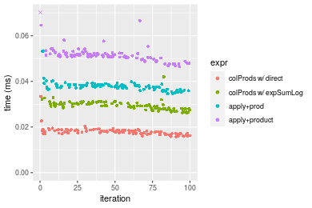
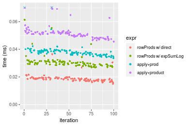

[matrixStats]: Benchmark report

---------------------------------------


# colProds() and rowProds() benchmarks

This report benchmark the performance of colProds() and rowProds() against alternative methods.

## Alternative methods

* colProds()/rowProds() using method="expSumLog"
* apply() + prod()
* apply() + product()


## Data
```r
> rmatrix <- function(nrow, ncol, mode = c("logical", "double", "integer", "index"), range = c(-100, 
+     +100), na_prob = 0) {
+     mode <- match.arg(mode)
+     n <- nrow * ncol
+     if (mode == "logical") {
+         x <- sample(c(FALSE, TRUE), size = n, replace = TRUE)
+     }     else if (mode == "index") {
+         x <- seq_len(n)
+         mode <- "integer"
+     }     else {
+         x <- runif(n, min = range[1], max = range[2])
+     }
+     storage.mode(x) <- mode
+     if (na_prob > 0) 
+         x[sample(n, size = na_prob * n)] <- NA
+     dim(x) <- c(nrow, ncol)
+     x
+ }
> rmatrices <- function(scale = 10, seed = 1, ...) {
+     set.seed(seed)
+     data <- list()
+     data[[1]] <- rmatrix(nrow = scale * 1, ncol = scale * 1, ...)
+     data[[2]] <- rmatrix(nrow = scale * 10, ncol = scale * 10, ...)
+     data[[3]] <- rmatrix(nrow = scale * 100, ncol = scale * 1, ...)
+     data[[4]] <- t(data[[3]])
+     data[[5]] <- rmatrix(nrow = scale * 10, ncol = scale * 100, ...)
+     data[[6]] <- t(data[[5]])
+     names(data) <- sapply(data, FUN = function(x) paste(dim(x), collapse = "x"))
+     data
+ }
> data <- rmatrices(mode = "double")
```

## Results

### 10x10 matrix


```r
> X <- data[["10x10"]]
> colStats <- microbenchmark(`colProds w/ direct` = colProds(X, method = "direct", na.rm = FALSE), 
+     `colProds w/ expSumLog` = colProds(X, method = "expSumLog", na.rm = FALSE), `apply+prod` = apply(X, 
+         MARGIN = 2L, FUN = prod, na.rm = FALSE), `apply+product` = apply(X, MARGIN = 2L, FUN = product, 
+         na.rm = FALSE), unit = "ms")
> X <- t(X)
> rowStats <- microbenchmark(`rowProds w/ direct` = rowProds(X, method = "direct", na.rm = FALSE), 
+     `rowProds w/ expSumLog` = rowProds(X, method = "expSumLog", na.rm = FALSE), `apply+prod` = apply(X, 
+         MARGIN = 1L, FUN = prod, na.rm = FALSE), `apply+product` = apply(X, MARGIN = 1L, FUN = product, 
+         na.rm = FALSE), unit = "ms")
```

_Table: Benchmarking of colProds w/ direct(), colProds w/ expSumLog(), apply+prod() and apply+product() on 10x10 data. The top panel shows times in milliseconds and the bottom panel shows relative times._


|   |expr                  |      min|        lq|      mean|    median|        uq|      max|
|:--|:---------------------|--------:|---------:|---------:|---------:|---------:|--------:|
|1  |colProds w/ direct    | 0.015791| 0.0170935| 0.0179873| 0.0178220| 0.0186235| 0.033431|
|2  |colProds w/ expSumLog | 0.026177| 0.0280410| 0.0292996| 0.0292300| 0.0303530| 0.041994|
|3  |apply+prod            | 0.034605| 0.0366820| 0.0377462| 0.0377885| 0.0384030| 0.053230|
|4  |apply+product         | 0.046416| 0.0504970| 0.0523317| 0.0513315| 0.0522370| 0.139212|


|   |expr                  |      min|       lq|     mean|   median|       uq|      max|
|:--|:---------------------|--------:|--------:|--------:|--------:|--------:|--------:|
|1  |colProds w/ direct    | 1.000000| 1.000000| 1.000000| 1.000000| 1.000000| 1.000000|
|2  |colProds w/ expSumLog | 1.657716| 1.640448| 1.628905| 1.640108| 1.629822| 1.256139|
|3  |apply+prod            | 2.191438| 2.145962| 2.098487| 2.120329| 2.062072| 1.592235|
|4  |apply+product         | 2.939396| 2.954164| 2.909363| 2.880232| 2.804897| 4.164159|

_Table: Benchmarking of rowProds w/ direct(), rowProds w/ expSumLog(), apply+prod() and apply+product() on 10x10 data (transposed). The top panel shows times in milliseconds and the bottom panel shows relative times._


|   |expr                  |      min|        lq|      mean|   median|        uq|      max|
|:--|:---------------------|--------:|---------:|---------:|--------:|---------:|--------:|
|1  |rowProds w/ direct    | 0.015061| 0.0173315| 0.0186616| 0.018441| 0.0192500| 0.036447|
|2  |rowProds w/ expSumLog | 0.026770| 0.0285790| 0.0306978| 0.029877| 0.0311205| 0.061372|
|3  |apply+prod            | 0.033669| 0.0363210| 0.0391764| 0.037578| 0.0390500| 0.141999|
|4  |apply+product         | 0.045592| 0.0490915| 0.0518252| 0.051090| 0.0522790| 0.088668|


|   |expr                  |      min|       lq|     mean|   median|       uq|      max|
|:--|:---------------------|--------:|--------:|--------:|--------:|--------:|--------:|
|1  |rowProds w/ direct    | 1.000000| 1.000000| 1.000000| 1.000000| 1.000000| 1.000000|
|2  |rowProds w/ expSumLog | 1.777438| 1.648963| 1.644970| 1.620140| 1.616649| 1.683870|
|3  |apply+prod            | 2.235509| 2.095664| 2.099305| 2.037742| 2.028571| 3.896041|
|4  |apply+product         | 3.027156| 2.832501| 2.777103| 2.770457| 2.715792| 2.432793|

_Figure: Benchmarking of colProds w/ direct(), colProds w/ expSumLog(), apply+prod() and apply+product() on 10x10 data  as well as rowProds w/ direct(), rowProds w/ expSumLog(), apply+prod() and apply+product() on the same data transposed.  Outliers are displayed as crosses.  Times are in milliseconds._





_Table: Benchmarking of colProds w/ direct() and rowProds w/ direct() on 10x10 data (original and transposed).  The top panel shows times in milliseconds and the bottom panel shows relative times._


|   |expr               |    min|      lq|     mean| median|      uq|    max|
|:--|:------------------|------:|-------:|--------:|------:|-------:|------:|
|1  |colProds w/ direct | 15.791| 17.0935| 17.98733| 17.822| 18.6235| 33.431|
|2  |rowProds w/ direct | 15.061| 17.3315| 18.66162| 18.441| 19.2500| 36.447|


|   |expr               |       min|       lq|     mean|   median|      uq|      max|
|:--|:------------------|---------:|--------:|--------:|--------:|-------:|--------:|
|1  |colProds w/ direct | 1.0000000| 1.000000| 1.000000| 1.000000| 1.00000| 1.000000|
|2  |rowProds w/ direct | 0.9537711| 1.013923| 1.037487| 1.034732| 1.03364| 1.090216|

_Figure: Benchmarking of colProds w/ direct() and rowProds w/ direct() on 10x10 data (original and transposed).  Outliers are displayed as crosses. Times are in milliseconds._


### 100x100 matrix


```r
> X <- data[["100x100"]]
> colStats <- microbenchmark(`colProds w/ direct` = colProds(X, method = "direct", na.rm = FALSE), 
+     `colProds w/ expSumLog` = colProds(X, method = "expSumLog", na.rm = FALSE), `apply+prod` = apply(X, 
+         MARGIN = 2L, FUN = prod, na.rm = FALSE), `apply+product` = apply(X, MARGIN = 2L, FUN = product, 
+         na.rm = FALSE), unit = "ms")
> X <- t(X)
> rowStats <- microbenchmark(`rowProds w/ direct` = rowProds(X, method = "direct", na.rm = FALSE), 
+     `rowProds w/ expSumLog` = rowProds(X, method = "expSumLog", na.rm = FALSE), `apply+prod` = apply(X, 
+         MARGIN = 1L, FUN = prod, na.rm = FALSE), `apply+product` = apply(X, MARGIN = 1L, FUN = product, 
+         na.rm = FALSE), unit = "ms")
```

_Table: Benchmarking of colProds w/ direct(), colProds w/ expSumLog(), apply+prod() and apply+product() on 100x100 data. The top panel shows times in milliseconds and the bottom panel shows relative times._


|   |expr                  |      min|        lq|      mean|    median|        uq|      max|
|:--|:---------------------|--------:|---------:|---------:|---------:|---------:|--------:|
|1  |colProds w/ direct    | 0.113837| 0.1164835| 0.1350380| 0.1286595| 0.1430325| 0.241196|
|3  |apply+prod            | 0.163253| 0.1703875| 0.1966820| 0.1866755| 0.2154080| 0.327832|
|2  |colProds w/ expSumLog | 0.387009| 0.3906525| 0.4500226| 0.4218350| 0.4815725| 0.678125|
|4  |apply+product         | 0.442763| 0.4510660| 0.5258223| 0.4897290| 0.5699340| 0.897574|


|   |expr                  |      min|       lq|     mean|   median|       uq|      max|
|:--|:---------------------|--------:|--------:|--------:|--------:|--------:|--------:|
|1  |colProds w/ direct    | 1.000000| 1.000000| 1.000000| 1.000000| 1.000000| 1.000000|
|3  |apply+prod            | 1.434094| 1.462761| 1.456494| 1.450927| 1.506007| 1.359193|
|2  |colProds w/ expSumLog | 3.399677| 3.353715| 3.332564| 3.278693| 3.366875| 2.811510|
|4  |apply+product         | 3.889447| 3.872360| 3.893885| 3.806396| 3.984647| 3.721347|

_Table: Benchmarking of rowProds w/ direct(), rowProds w/ expSumLog(), apply+prod() and apply+product() on 100x100 data (transposed). The top panel shows times in milliseconds and the bottom panel shows relative times._


|   |expr                  |      min|       lq|      mean|    median|        uq|      max|
|:--|:---------------------|--------:|--------:|---------:|---------:|---------:|--------:|
|1  |rowProds w/ direct    | 0.141042| 0.143503| 0.1743457| 0.1587805| 0.1932770| 0.288520|
|3  |apply+prod            | 0.164034| 0.170025| 0.1959542| 0.1748620| 0.2111945| 0.314313|
|2  |rowProds w/ expSumLog | 0.415211| 0.418217| 0.4750252| 0.4259075| 0.5101235| 0.789069|
|4  |apply+product         | 0.445640| 0.452045| 0.5095773| 0.4617895| 0.5543310| 0.860640|


|   |expr                  |      min|       lq|     mean|   median|       uq|      max|
|:--|:---------------------|--------:|--------:|--------:|--------:|--------:|--------:|
|1  |rowProds w/ direct    | 1.000000| 1.000000| 1.000000| 1.000000| 1.000000| 1.000000|
|3  |apply+prod            | 1.163015| 1.184818| 1.123940| 1.101281| 1.092704| 1.089398|
|2  |rowProds w/ expSumLog | 2.943882| 2.914343| 2.724616| 2.682367| 2.639339| 2.734885|
|4  |apply+product         | 3.159626| 3.150073| 2.922798| 2.908352| 2.868065| 2.982947|

_Figure: Benchmarking of colProds w/ direct(), colProds w/ expSumLog(), apply+prod() and apply+product() on 100x100 data  as well as rowProds w/ direct(), rowProds w/ expSumLog(), apply+prod() and apply+product() on the same data transposed.  Outliers are displayed as crosses.  Times are in milliseconds._


_Table: Benchmarking of colProds w/ direct() and rowProds w/ direct() on 100x100 data (original and transposed).  The top panel shows times in milliseconds and the bottom panel shows relative times._


|   |expr               |     min|       lq|     mean|   median|       uq|     max|
|:--|:------------------|-------:|--------:|--------:|--------:|--------:|-------:|
|1  |colProds w/ direct | 113.837| 116.4835| 135.0380| 128.6595| 143.0325| 241.196|
|2  |rowProds w/ direct | 141.042| 143.5030| 174.3457| 158.7805| 193.2770| 288.520|


|   |expr               |      min|      lq|     mean|   median|      uq|      max|
|:--|:------------------|--------:|-------:|--------:|--------:|-------:|--------:|
|1  |colProds w/ direct | 1.000000| 1.00000| 1.000000| 1.000000| 1.00000| 1.000000|
|2  |rowProds w/ direct | 1.238982| 1.23196| 1.291087| 1.234114| 1.35128| 1.196206|

_Figure: Benchmarking of colProds w/ direct() and rowProds w/ direct() on 100x100 data (original and transposed).  Outliers are displayed as crosses. Times are in milliseconds._


### 1000x10 matrix


```r
> X <- data[["1000x10"]]
> colStats <- microbenchmark(`colProds w/ direct` = colProds(X, method = "direct", na.rm = FALSE), 
+     `colProds w/ expSumLog` = colProds(X, method = "expSumLog", na.rm = FALSE), `apply+prod` = apply(X, 
+         MARGIN = 2L, FUN = prod, na.rm = FALSE), `apply+product` = apply(X, MARGIN = 2L, FUN = product, 
+         na.rm = FALSE), unit = "ms")
> X <- t(X)
> rowStats <- microbenchmark(`rowProds w/ direct` = rowProds(X, method = "direct", na.rm = FALSE), 
+     `rowProds w/ expSumLog` = rowProds(X, method = "expSumLog", na.rm = FALSE), `apply+prod` = apply(X, 
+         MARGIN = 1L, FUN = prod, na.rm = FALSE), `apply+product` = apply(X, MARGIN = 1L, FUN = product, 
+         na.rm = FALSE), unit = "ms")
```

_Table: Benchmarking of colProds w/ direct(), colProds w/ expSumLog(), apply+prod() and apply+product() on 1000x10 data. The top panel shows times in milliseconds and the bottom panel shows relative times._


|   |expr                  |      min|        lq|      mean|    median|        uq|      max|
|:--|:---------------------|--------:|---------:|---------:|---------:|---------:|--------:|
|1  |colProds w/ direct    | 0.049070| 0.0526690| 0.0630100| 0.0603840| 0.0714750| 0.108102|
|3  |apply+prod            | 0.088524| 0.0916415| 0.1100393| 0.1024025| 0.1186560| 0.241756|
|2  |colProds w/ expSumLog | 0.264126| 0.2686695| 0.3111351| 0.2914875| 0.3416465| 0.545174|
|4  |apply+product         | 0.304561| 0.3091380| 0.3627528| 0.3417810| 0.3860410| 0.786870|


|   |expr                  |      min|       lq|     mean|   median|       uq|      max|
|:--|:---------------------|--------:|--------:|--------:|--------:|--------:|--------:|
|1  |colProds w/ direct    | 1.000000| 1.000000| 1.000000| 1.000000| 1.000000| 1.000000|
|3  |apply+prod            | 1.804035| 1.739951| 1.746379| 1.695855| 1.660105| 2.236369|
|2  |colProds w/ expSumLog | 5.382637| 5.101094| 4.937868| 4.827231| 4.779944| 5.043144|
|4  |apply+product         | 6.206664| 5.869449| 5.757066| 5.660125| 5.401063| 7.278959|

_Table: Benchmarking of rowProds w/ direct(), rowProds w/ expSumLog(), apply+prod() and apply+product() on 1000x10 data (transposed). The top panel shows times in milliseconds and the bottom panel shows relative times._


|   |expr                  |      min|        lq|      mean|    median|        uq|      max|
|:--|:---------------------|--------:|---------:|---------:|---------:|---------:|--------:|
|1  |rowProds w/ direct    | 0.075937| 0.0794735| 0.0905472| 0.0842065| 0.0995830| 0.172085|
|3  |apply+prod            | 0.087590| 0.0923550| 0.1080249| 0.0995745| 0.1183560| 0.231943|
|2  |rowProds w/ expSumLog | 0.293066| 0.2966660| 0.3540579| 0.3286040| 0.3873645| 0.540402|
|4  |apply+product         | 0.306161| 0.3101580| 0.3653697| 0.3394815| 0.3963800| 0.597943|


|   |expr                  |      min|       lq|     mean|   median|       uq|      max|
|:--|:---------------------|--------:|--------:|--------:|--------:|--------:|--------:|
|1  |rowProds w/ direct    | 1.000000| 1.000000| 1.000000| 1.000000| 1.000000| 1.000000|
|3  |apply+prod            | 1.153456| 1.162086| 1.193023| 1.182504| 1.188516| 1.347840|
|2  |rowProds w/ expSumLog | 3.859331| 3.732892| 3.910204| 3.902359| 3.889866| 3.140320|
|4  |apply+product         | 4.031776| 3.902659| 4.035131| 4.031536| 3.980398| 3.474696|

_Figure: Benchmarking of colProds w/ direct(), colProds w/ expSumLog(), apply+prod() and apply+product() on 1000x10 data  as well as rowProds w/ direct(), rowProds w/ expSumLog(), apply+prod() and apply+product() on the same data transposed.  Outliers are displayed as crosses.  Times are in milliseconds._


_Table: Benchmarking of colProds w/ direct() and rowProds w/ direct() on 1000x10 data (original and transposed).  The top panel shows times in milliseconds and the bottom panel shows relative times._


|   |expr               |    min|      lq|     mean|  median|     uq|     max|
|:--|:------------------|------:|-------:|--------:|-------:|------:|-------:|
|1  |colProds w/ direct | 49.070| 52.6690| 63.01001| 60.3840| 71.475| 108.102|
|2  |rowProds w/ direct | 75.937| 79.4735| 90.54718| 84.2065| 99.583| 172.085|


|   |expr               |      min|       lq|     mean|   median|       uq|      max|
|:--|:------------------|--------:|--------:|--------:|--------:|--------:|--------:|
|1  |colProds w/ direct | 1.000000| 1.000000| 1.000000| 1.000000| 1.000000| 1.000000|
|2  |rowProds w/ direct | 1.547524| 1.508924| 1.437029| 1.394517| 1.393256| 1.591876|

_Figure: Benchmarking of colProds w/ direct() and rowProds w/ direct() on 1000x10 data (original and transposed).  Outliers are displayed as crosses. Times are in milliseconds._


### 10x1000 matrix


```r
> X <- data[["10x1000"]]
> colStats <- microbenchmark(`colProds w/ direct` = colProds(X, method = "direct", na.rm = FALSE), 
+     `colProds w/ expSumLog` = colProds(X, method = "expSumLog", na.rm = FALSE), `apply+prod` = apply(X, 
+         MARGIN = 2L, FUN = prod, na.rm = FALSE), `apply+product` = apply(X, MARGIN = 2L, FUN = product, 
+         na.rm = FALSE), unit = "ms")
> X <- t(X)
> rowStats <- microbenchmark(`rowProds w/ direct` = rowProds(X, method = "direct", na.rm = FALSE), 
+     `rowProds w/ expSumLog` = rowProds(X, method = "expSumLog", na.rm = FALSE), `apply+prod` = apply(X, 
+         MARGIN = 1L, FUN = prod, na.rm = FALSE), `apply+product` = apply(X, MARGIN = 1L, FUN = product, 
+         na.rm = FALSE), unit = "ms")
```

_Table: Benchmarking of colProds w/ direct(), colProds w/ expSumLog(), apply+prod() and apply+product() on 10x1000 data. The top panel shows times in milliseconds and the bottom panel shows relative times._


|   |expr                  |      min|        lq|      mean|    median|        uq|      max|
|:--|:---------------------|--------:|---------:|---------:|---------:|---------:|--------:|
|1  |colProds w/ direct    | 0.751358| 0.7882705| 0.9177609| 0.8220155| 0.8769515| 6.225013|
|3  |apply+prod            | 0.911552| 0.9569475| 1.0583675| 1.0062390| 1.0926425| 2.096431|
|2  |colProds w/ expSumLog | 1.541540| 1.5928045| 1.7582215| 1.6518780| 1.7917575| 7.133810|
|4  |apply+product         | 1.758959| 1.8146390| 1.9636134| 1.8816515| 2.0484005| 2.979021|


|   |expr                  |      min|       lq|     mean|   median|       uq|       max|
|:--|:---------------------|--------:|--------:|--------:|--------:|--------:|---------:|
|1  |colProds w/ direct    | 1.000000| 1.000000| 1.000000| 1.000000| 1.000000| 1.0000000|
|3  |apply+prod            | 1.213206| 1.213984| 1.153206| 1.224112| 1.245955| 0.3367754|
|2  |colProds w/ expSumLog | 2.051672| 2.020632| 1.915773| 2.009546| 2.043166| 1.1459912|
|4  |apply+product         | 2.341040| 2.302051| 2.139570| 2.289071| 2.335820| 0.4785566|

_Table: Benchmarking of rowProds w/ direct(), rowProds w/ expSumLog(), apply+prod() and apply+product() on 10x1000 data (transposed). The top panel shows times in milliseconds and the bottom panel shows relative times._


|   |expr                  |      min|        lq|      mean|    median|       uq|      max|
|:--|:---------------------|--------:|---------:|---------:|---------:|--------:|--------:|
|1  |rowProds w/ direct    | 0.794336| 0.8372795| 0.9815607| 0.9137745| 1.014061| 2.190136|
|3  |apply+prod            | 0.921813| 1.0025895| 1.1289391| 1.0809000| 1.195852| 2.046786|
|2  |rowProds w/ expSumLog | 1.574138| 1.6650940| 1.8879979| 1.8134725| 2.040895| 2.817356|
|4  |apply+product         | 1.759603| 1.9124230| 2.4569115| 2.1927255| 2.439204| 7.756790|


|   |expr                  |      min|       lq|     mean|   median|       uq|       max|
|:--|:---------------------|--------:|--------:|--------:|--------:|--------:|---------:|
|1  |rowProds w/ direct    | 1.000000| 1.000000| 1.000000| 1.000000| 1.000000| 1.0000000|
|3  |apply+prod            | 1.160483| 1.197437| 1.150147| 1.182896| 1.179270| 0.9345474|
|2  |rowProds w/ expSumLog | 1.981703| 1.988695| 1.923465| 1.984595| 2.012596| 1.2863840|
|4  |apply+product         | 2.215187| 2.284092| 2.503066| 2.399635| 2.405381| 3.5416933|

_Figure: Benchmarking of colProds w/ direct(), colProds w/ expSumLog(), apply+prod() and apply+product() on 10x1000 data  as well as rowProds w/ direct(), rowProds w/ expSumLog(), apply+prod() and apply+product() on the same data transposed.  Outliers are displayed as crosses.  Times are in milliseconds._


_Table: Benchmarking of colProds w/ direct() and rowProds w/ direct() on 10x1000 data (original and transposed).  The top panel shows times in milliseconds and the bottom panel shows relative times._


|   |expr               |     min|       lq|     mean|   median|        uq|      max|
|:--|:------------------|-------:|--------:|--------:|--------:|---------:|--------:|
|1  |colProds w/ direct | 751.358| 788.2705| 917.7609| 822.0155|  876.9515| 6225.013|
|2  |rowProds w/ direct | 794.336| 837.2795| 981.5607| 913.7745| 1014.0610| 2190.136|


|   |expr               |    min|       lq|     mean|   median|       uq|       max|
|:--|:------------------|------:|--------:|--------:|--------:|--------:|---------:|
|1  |colProds w/ direct | 1.0000| 1.000000| 1.000000| 1.000000| 1.000000| 1.0000000|
|2  |rowProds w/ direct | 1.0572| 1.062173| 1.069517| 1.111627| 1.156348| 0.3518283|

_Figure: Benchmarking of colProds w/ direct() and rowProds w/ direct() on 10x1000 data (original and transposed).  Outliers are displayed as crosses. Times are in milliseconds._


### 100x1000 matrix


```r
> X <- data[["100x1000"]]
> colStats <- microbenchmark(`colProds w/ direct` = colProds(X, method = "direct", na.rm = FALSE), 
+     `colProds w/ expSumLog` = colProds(X, method = "expSumLog", na.rm = FALSE), `apply+prod` = apply(X, 
+         MARGIN = 2L, FUN = prod, na.rm = FALSE), `apply+product` = apply(X, MARGIN = 2L, FUN = product, 
+         na.rm = FALSE), unit = "ms")
> X <- t(X)
> rowStats <- microbenchmark(`rowProds w/ direct` = rowProds(X, method = "direct", na.rm = FALSE), 
+     `rowProds w/ expSumLog` = rowProds(X, method = "expSumLog", na.rm = FALSE), `apply+prod` = apply(X, 
+         MARGIN = 1L, FUN = prod, na.rm = FALSE), `apply+product` = apply(X, MARGIN = 1L, FUN = product, 
+         na.rm = FALSE), unit = "ms")
```

_Table: Benchmarking of colProds w/ direct(), colProds w/ expSumLog(), apply+prod() and apply+product() on 100x1000 data. The top panel shows times in milliseconds and the bottom panel shows relative times._


|   |expr                  |      min|       lq|     mean|   median|       uq|       max|
|:--|:---------------------|--------:|--------:|--------:|--------:|--------:|---------:|
|1  |colProds w/ direct    | 1.106045| 1.143137| 1.214882| 1.175420| 1.219490|  1.974226|
|3  |apply+prod            | 1.507445| 1.578699| 2.110888| 1.615665| 1.728613| 23.450982|
|2  |colProds w/ expSumLog | 3.834681| 3.943871| 4.387280| 4.052522| 4.140837| 25.718991|
|4  |apply+product         | 4.333414| 4.435840| 4.775045| 4.564342| 4.692711|  7.107002|


|   |expr                  |      min|       lq|     mean|   median|       uq|       max|
|:--|:---------------------|--------:|--------:|--------:|--------:|--------:|---------:|
|1  |colProds w/ direct    | 1.000000| 1.000000| 1.000000| 1.000000| 1.000000|  1.000000|
|3  |apply+prod            | 1.362915| 1.381023| 1.737525| 1.374544| 1.417488| 11.878570|
|2  |colProds w/ expSumLog | 3.467021| 3.450042| 3.611281| 3.447724| 3.395548| 13.027379|
|4  |apply+product         | 3.917936| 3.880410| 3.930460| 3.883160| 3.848093|  3.599893|

_Table: Benchmarking of rowProds w/ direct(), rowProds w/ expSumLog(), apply+prod() and apply+product() on 100x1000 data (transposed). The top panel shows times in milliseconds and the bottom panel shows relative times._


|   |expr                  |      min|       lq|     mean|   median|       uq|       max|
|:--|:---------------------|--------:|--------:|--------:|--------:|--------:|---------:|
|1  |rowProds w/ direct    | 1.393349| 1.469850| 1.627374| 1.529261| 1.694172|  2.842822|
|3  |apply+prod            | 1.510528| 1.637811| 1.974972| 1.681142| 1.854321| 22.809185|
|2  |rowProds w/ expSumLog | 4.141459| 4.376250| 4.870789| 4.442355| 4.680246| 26.129751|
|4  |apply+product         | 4.332329| 4.588649| 5.150038| 4.675591| 4.992879| 26.645973|


|   |expr                  |      min|       lq|     mean|   median|       uq|      max|
|:--|:---------------------|--------:|--------:|--------:|--------:|--------:|--------:|
|1  |rowProds w/ direct    | 1.000000| 1.000000| 1.000000| 1.000000| 1.000000| 1.000000|
|3  |apply+prod            | 1.084099| 1.114271| 1.213594| 1.099316| 1.094529| 8.023431|
|2  |rowProds w/ expSumLog | 2.972306| 2.977345| 2.993035| 2.904903| 2.762557| 9.191483|
|4  |apply+product         | 3.109292| 3.121849| 3.164630| 3.057418| 2.947091| 9.373071|

_Figure: Benchmarking of colProds w/ direct(), colProds w/ expSumLog(), apply+prod() and apply+product() on 100x1000 data  as well as rowProds w/ direct(), rowProds w/ expSumLog(), apply+prod() and apply+product() on the same data transposed.  Outliers are displayed as crosses.  Times are in milliseconds._


_Table: Benchmarking of colProds w/ direct() and rowProds w/ direct() on 100x1000 data (original and transposed).  The top panel shows times in milliseconds and the bottom panel shows relative times._


|   |expr               |      min|       lq|     mean|   median|       uq|      max|
|:--|:------------------|--------:|--------:|--------:|--------:|--------:|--------:|
|1  |colProds w/ direct | 1.106045| 1.143137| 1.214882| 1.175420| 1.219490| 1.974226|
|2  |rowProds w/ direct | 1.393349| 1.469850| 1.627374| 1.529261| 1.694172| 2.842822|


|   |expr               |      min|       lq|     mean|   median|       uq|      max|
|:--|:------------------|--------:|--------:|--------:|--------:|--------:|--------:|
|1  |colProds w/ direct | 1.000000| 1.000000| 1.000000| 1.000000| 1.000000| 1.000000|
|2  |rowProds w/ direct | 1.259758| 1.285804| 1.339533| 1.301034| 1.389246| 1.439968|

_Figure: Benchmarking of colProds w/ direct() and rowProds w/ direct() on 100x1000 data (original and transposed).  Outliers are displayed as crosses. Times are in milliseconds._


### 1000x100 matrix


```r
> X <- data[["1000x100"]]
> colStats <- microbenchmark(`colProds w/ direct` = colProds(X, method = "direct", na.rm = FALSE), 
+     `colProds w/ expSumLog` = colProds(X, method = "expSumLog", na.rm = FALSE), `apply+prod` = apply(X, 
+         MARGIN = 2L, FUN = prod, na.rm = FALSE), `apply+product` = apply(X, MARGIN = 2L, FUN = product, 
+         na.rm = FALSE), unit = "ms")
> X <- t(X)
> rowStats <- microbenchmark(`rowProds w/ direct` = rowProds(X, method = "direct", na.rm = FALSE), 
+     `rowProds w/ expSumLog` = rowProds(X, method = "expSumLog", na.rm = FALSE), `apply+prod` = apply(X, 
+         MARGIN = 1L, FUN = prod, na.rm = FALSE), `apply+product` = apply(X, MARGIN = 1L, FUN = product, 
+         na.rm = FALSE), unit = "ms")
```

_Table: Benchmarking of colProds w/ direct(), colProds w/ expSumLog(), apply+prod() and apply+product() on 1000x100 data. The top panel shows times in milliseconds and the bottom panel shows relative times._


|   |expr                  |      min|        lq|      mean|    median|        uq|       max|
|:--|:---------------------|--------:|---------:|---------:|---------:|---------:|---------:|
|1  |colProds w/ direct    | 0.450941| 0.4666235| 0.5062665| 0.4916765| 0.5188500|  0.769587|
|3  |apply+prod            | 0.736291| 0.7661985| 0.9059135| 0.7910270| 0.8444345|  8.768338|
|2  |colProds w/ expSumLog | 2.618784| 2.7103005| 2.8940867| 2.7765815| 2.8978030|  4.991079|
|4  |apply+product         | 2.911127| 2.9746260| 3.3861137| 3.0809740| 3.2610560| 12.189658|


|   |expr                  |      min|       lq|     mean|   median|       uq|       max|
|:--|:---------------------|--------:|--------:|--------:|--------:|--------:|---------:|
|1  |colProds w/ direct    | 1.000000| 1.000000| 1.000000| 1.000000| 1.000000|  1.000000|
|3  |apply+prod            | 1.632788| 1.642006| 1.789401| 1.608836| 1.627512| 11.393563|
|2  |colProds w/ expSumLog | 5.807376| 5.808324| 5.716528| 5.647171| 5.585050|  6.485399|
|4  |apply+product         | 6.455672| 6.374788| 6.688402| 6.266262| 6.285161| 15.839220|

_Table: Benchmarking of rowProds w/ direct(), rowProds w/ expSumLog(), apply+prod() and apply+product() on 1000x100 data (transposed). The top panel shows times in milliseconds and the bottom panel shows relative times._


|   |expr                  |      min|        lq|      mean|    median|        uq|       max|
|:--|:---------------------|--------:|---------:|---------:|---------:|---------:|---------:|
|1  |rowProds w/ direct    | 0.730858| 0.7568740| 0.9185949| 0.7778645| 0.9321885|  8.771738|
|3  |apply+prod            | 0.768788| 0.8009725| 0.9692730| 0.8206430| 0.9079340|  9.412551|
|2  |rowProds w/ expSumLog | 2.896170| 3.0285865| 3.3758957| 3.0956415| 3.6680915|  5.058126|
|4  |apply+product         | 2.936074| 3.0350740| 3.3611604| 3.1208320| 3.3335610| 11.858223|


|   |expr                  |      min|       lq|     mean|   median|        uq|      max|
|:--|:---------------------|--------:|--------:|--------:|--------:|---------:|--------:|
|1  |rowProds w/ direct    | 1.000000| 1.000000| 1.000000| 1.000000| 1.0000000| 1.000000|
|3  |apply+prod            | 1.051898| 1.058264| 1.055169| 1.054995| 0.9739811| 1.073054|
|2  |rowProds w/ expSumLog | 3.962699| 4.001441| 3.675065| 3.979667| 3.9349246| 0.576639|
|4  |apply+product         | 4.017297| 4.010012| 3.659024| 4.012051| 3.5760589| 1.351867|

_Figure: Benchmarking of colProds w/ direct(), colProds w/ expSumLog(), apply+prod() and apply+product() on 1000x100 data  as well as rowProds w/ direct(), rowProds w/ expSumLog(), apply+prod() and apply+product() on the same data transposed.  Outliers are displayed as crosses.  Times are in milliseconds._


_Table: Benchmarking of colProds w/ direct() and rowProds w/ direct() on 1000x100 data (original and transposed).  The top panel shows times in milliseconds and the bottom panel shows relative times._


|   |expr               |     min|       lq|     mean|   median|       uq|      max|
|:--|:------------------|-------:|--------:|--------:|--------:|--------:|--------:|
|1  |colProds w/ direct | 450.941| 466.6235| 506.2665| 491.6765| 518.8500|  769.587|
|2  |rowProds w/ direct | 730.858| 756.8740| 918.5949| 777.8645| 932.1885| 8771.738|


|   |expr               |     min|       lq|     mean|   median|       uq|      max|
|:--|:------------------|-------:|--------:|--------:|--------:|--------:|--------:|
|1  |colProds w/ direct | 1.00000| 1.000000| 1.000000| 1.000000| 1.000000|  1.00000|
|2  |rowProds w/ direct | 1.62074| 1.622023| 1.814449| 1.582066| 1.796644| 11.39798|

_Figure: Benchmarking of colProds w/ direct() and rowProds w/ direct() on 1000x100 data (original and transposed).  Outliers are displayed as crosses. Times are in milliseconds._


## Appendix

### Session information
```r
R version 4.1.1 Patched (2021-08-10 r80727)
Platform: x86_64-pc-linux-gnu (64-bit)
Running under: Ubuntu 18.04.5 LTS

Matrix products: default
BLAS:   /home/hb/software/R-devel/R-4-1-branch/lib/R/lib/libRblas.so
LAPACK: /home/hb/software/R-devel/R-4-1-branch/lib/R/lib/libRlapack.so

locale:
 [1] LC_CTYPE=en_US.UTF-8       LC_NUMERIC=C              
 [3] LC_TIME=en_US.UTF-8        LC_COLLATE=en_US.UTF-8    
 [5] LC_MONETARY=en_US.UTF-8    LC_MESSAGES=en_US.UTF-8   
 [7] LC_PAPER=en_US.UTF-8       LC_NAME=C                 
 [9] LC_ADDRESS=C               LC_TELEPHONE=C            
[11] LC_MEASUREMENT=en_US.UTF-8 LC_IDENTIFICATION=C       

attached base packages:
[1] stats     graphics  grDevices utils     datasets  methods   base     

other attached packages:
[1] microbenchmark_1.4-7   matrixStats_0.60.0     ggplot2_3.3.5         
[4] knitr_1.33             R.devices_2.17.0       R.utils_2.10.1        
[7] R.oo_1.24.0            R.methodsS3_1.8.1-9001 history_0.0.1-9000    

loaded via a namespace (and not attached):
 [1] Biobase_2.52.0          httr_1.4.2              splines_4.1.1          
 [4] bit64_4.0.5             network_1.17.1          assertthat_0.2.1       
 [7] highr_0.9               stats4_4.1.1            blob_1.2.2             
[10] GenomeInfoDbData_1.2.6  robustbase_0.93-8       pillar_1.6.2           
[13] RSQLite_2.2.8           lattice_0.20-44         glue_1.4.2             
[16] digest_0.6.27           XVector_0.32.0          colorspace_2.0-2       
[19] Matrix_1.3-4            XML_3.99-0.7            pkgconfig_2.0.3        
[22] zlibbioc_1.38.0         genefilter_1.74.0       purrr_0.3.4            
[25] ergm_4.1.2              xtable_1.8-4            scales_1.1.1           
[28] tibble_3.1.4            annotate_1.70.0         KEGGREST_1.32.0        
[31] farver_2.1.0            generics_0.1.0          IRanges_2.26.0         
[34] ellipsis_0.3.2          cachem_1.0.6            withr_2.4.2            
[37] BiocGenerics_0.38.0     mime_0.11               survival_3.2-13        
[40] magrittr_2.0.1          crayon_1.4.1            statnet.common_4.5.0   
[43] memoise_2.0.0           laeken_0.5.1            fansi_0.5.0            
[46] R.cache_0.15.0          MASS_7.3-54             R.rsp_0.44.0           
[49] progressr_0.8.0         tools_4.1.1             lifecycle_1.0.0        
[52] S4Vectors_0.30.0        trust_0.1-8             munsell_0.5.0          
[55] tabby_0.0.1-9001        AnnotationDbi_1.54.1    Biostrings_2.60.2      
[58] compiler_4.1.1          GenomeInfoDb_1.28.1     rlang_0.4.11           
[61] grid_4.1.1              RCurl_1.98-1.4          cwhmisc_6.6            
[64] rstudioapi_0.13         rappdirs_0.3.3          startup_0.15.0         
[67] labeling_0.4.2          bitops_1.0-7            base64enc_0.1-3        
[70] boot_1.3-28             gtable_0.3.0            DBI_1.1.1              
[73] markdown_1.1            R6_2.5.1                lpSolveAPI_5.5.2.0-17.7
[76] rle_0.9.2               dplyr_1.0.7             fastmap_1.1.0          
[79] bit_4.0.4               utf8_1.2.2              parallel_4.1.1         
[82] Rcpp_1.0.7              vctrs_0.3.8             png_0.1-7              
[85] DEoptimR_1.0-9          tidyselect_1.1.1        xfun_0.25              
[88] coda_0.19-4            
```
Total processing time was 18.39 secs.


### Reproducibility
To reproduce this report, do:
```r
html <- matrixStats:::benchmark('colProds')
```

[RSP]: https://cran.r-project.org/package=R.rsp
[matrixStats]: https://cran.r-project.org/package=matrixStats

[StackOverflow:colMins?]: https://stackoverflow.com/questions/13676878 "Stack Overflow: fastest way to get Min from every column in a matrix?"
[StackOverflow:colSds?]: https://stackoverflow.com/questions/17549762 "Stack Overflow: Is there such 'colsd' in R?"
[StackOverflow:rowProds?]: https://stackoverflow.com/questions/20198801/ "Stack Overflow: Row product of matrix and column sum of matrix"

---------------------------------------
Copyright Henrik Bengtsson. Last updated on 2021-08-25 22:25:06 (+0200 UTC). Powered by [RSP].

<script>
 var link = document.createElement('link');
 link.rel = 'icon';
 link.href = "data:image/png;base64,iVBORw0KGgoAAAANSUhEUgAAACAAAAAgCAMAAABEpIrGAAAA21BMVEUAAAAAAP8AAP8AAP8AAP8AAP8AAP8AAP8AAP8AAP8AAP8AAP8AAP8AAP8AAP8AAP8AAP8AAP8AAP8AAP8AAP8AAP8AAP8AAP8AAP8AAP8AAP8AAP8AAP8AAP8AAP8AAP8AAP8AAP8AAP8AAP8AAP8AAP8AAP8AAP8AAP8AAP8BAf4CAv0DA/wdHeIeHuEfH+AgIN8hId4lJdomJtknJ9g+PsE/P8BAQL9yco10dIt1dYp3d4h4eIeVlWqWlmmXl2iYmGeZmWabm2Tn5xjo6Bfp6Rb39wj4+Af//wA2M9hbAAAASXRSTlMAAQIJCgsMJSYnKD4/QGRlZmhpamtsbautrrCxuru8y8zN5ebn6Pn6+///////////////////////////////////////////LsUNcQAAAS9JREFUOI29k21XgkAQhVcFytdSMqMETU26UVqGmpaiFbL//xc1cAhhwVNf6n5i5z67M2dmYOyfJZUqlVLhkKucG7cgmUZTybDz6g0iDeq51PUr37Ds2cy2/C9NeES5puDjxuUk1xnToZsg8pfA3avHQ3lLIi7iWRrkv/OYtkScxBIMgDee0ALoyxHQBJ68JLCjOtQIMIANF7QG9G9fNnHvisCHBVMKgSJgiz7nE+AoBKrAPA3MgepvgR9TSCasrCKH0eB1wBGBFdCO+nAGjMVGPcQb5bd6mQRegN6+1axOs9nGfYcCtfi4NQosdtH7dB+txFIpXQqN1p9B/asRHToyS0jRgpV7nk4nwcq1BJ+x3Gl/v7S9Wmpp/aGquum7w3ZDyrADFYrl8vHBH+ev9AUASW1dmU4h4wAAAABJRU5ErkJggg=="
 document.getElementsByTagName('head')[0].appendChild(link);
</script>


