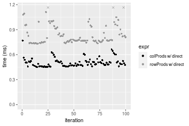

[matrixStats]: Benchmark report

---------------------------------------


# colProds() and rowProds() benchmarks

This report benchmark the performance of colProds() and rowProds() against alternative methods.

## Alternative methods

* colProds()/rowProds() using method="expSumLog"
* apply() + prod()
* apply() + product()


## Data
```r
> rmatrix <- function(nrow, ncol, mode = c("logical", "double", "integer", "index"), range = c(-100, 
+     +100), na_prob = 0) {
+     mode <- match.arg(mode)
+     n <- nrow * ncol
+     if (mode == "logical") {
+         x <- sample(c(FALSE, TRUE), size = n, replace = TRUE)
+     }     else if (mode == "index") {
+         x <- seq_len(n)
+         mode <- "integer"
+     }     else {
+         x <- runif(n, min = range[1], max = range[2])
+     }
+     storage.mode(x) <- mode
+     if (na_prob > 0) 
+         x[sample(n, size = na_prob * n)] <- NA
+     dim(x) <- c(nrow, ncol)
+     x
+ }
> rmatrices <- function(scale = 10, seed = 1, ...) {
+     set.seed(seed)
+     data <- list()
+     data[[1]] <- rmatrix(nrow = scale * 1, ncol = scale * 1, ...)
+     data[[2]] <- rmatrix(nrow = scale * 10, ncol = scale * 10, ...)
+     data[[3]] <- rmatrix(nrow = scale * 100, ncol = scale * 1, ...)
+     data[[4]] <- t(data[[3]])
+     data[[5]] <- rmatrix(nrow = scale * 10, ncol = scale * 100, ...)
+     data[[6]] <- t(data[[5]])
+     names(data) <- sapply(data, FUN = function(x) paste(dim(x), collapse = "x"))
+     data
+ }
> data <- rmatrices(mode = "double")
```

## Results

### 10x10 matrix


```r
> X <- data[["10x10"]]
> colStats <- microbenchmark(`colProds w/ direct` = colProds(X, method = "direct", na.rm = FALSE), 
+     `colProds w/ expSumLog` = colProds(X, method = "expSumLog", na.rm = FALSE), `apply+prod` = apply(X, 
+         MARGIN = 2L, FUN = prod, na.rm = FALSE), `apply+product` = apply(X, MARGIN = 2L, FUN = product, 
+         na.rm = FALSE), unit = "ms")
> X <- t(X)
> rowStats <- microbenchmark(`rowProds w/ direct` = rowProds(X, method = "direct", na.rm = FALSE), 
+     `rowProds w/ expSumLog` = rowProds(X, method = "expSumLog", na.rm = FALSE), `apply+prod` = apply(X, 
+         MARGIN = 1L, FUN = prod, na.rm = FALSE), `apply+product` = apply(X, MARGIN = 1L, FUN = product, 
+         na.rm = FALSE), unit = "ms")
```

_Table: Benchmarking of colProds w/ direct(), colProds w/ expSumLog(), apply+prod() and apply+product() on 10x10 data. The top panel shows times in milliseconds and the bottom panel shows relative times._


|   |expr                  |      min|        lq|      mean|    median|        uq|      max|
|:--|:---------------------|--------:|---------:|---------:|---------:|---------:|--------:|
|1  |colProds w/ direct    | 0.014666| 0.0160090| 0.0171194| 0.0167200| 0.0179920| 0.032929|
|2  |colProds w/ expSumLog | 0.023802| 0.0254910| 0.0276493| 0.0269065| 0.0290025| 0.065504|
|3  |apply+prod            | 0.032525| 0.0342775| 0.0363425| 0.0356275| 0.0374010| 0.051938|
|4  |apply+product         | 0.043876| 0.0462350| 0.0497613| 0.0489680| 0.0503915| 0.132571|


|   |expr                  |      min|       lq|     mean|   median|       uq|      max|
|:--|:---------------------|--------:|--------:|--------:|--------:|--------:|--------:|
|1  |colProds w/ direct    | 1.000000| 1.000000| 1.000000| 1.000000| 1.000000| 1.000000|
|2  |colProds w/ expSumLog | 1.622937| 1.592292| 1.615086| 1.609240| 1.611966| 1.989250|
|3  |apply+prod            | 2.217714| 2.141139| 2.122881| 2.130831| 2.078757| 1.577272|
|4  |apply+product         | 2.991681| 2.888063| 2.906712| 2.928708| 2.800773| 4.025965|

_Table: Benchmarking of rowProds w/ direct(), rowProds w/ expSumLog(), apply+prod() and apply+product() on 10x10 data (transposed). The top panel shows times in milliseconds and the bottom panel shows relative times._


|   |expr                  |      min|        lq|      mean|    median|        uq|      max|
|:--|:---------------------|--------:|---------:|---------:|---------:|---------:|--------:|
|1  |rowProds w/ direct    | 0.015122| 0.0169520| 0.0195393| 0.0179285| 0.0189825| 0.037965|
|2  |rowProds w/ expSumLog | 0.025017| 0.0271775| 0.0297388| 0.0284340| 0.0295765| 0.060361|
|3  |apply+prod            | 0.032984| 0.0352055| 0.0399426| 0.0364905| 0.0381945| 0.118674|
|4  |apply+product         | 0.044507| 0.0471190| 0.0534688| 0.0487320| 0.0513270| 0.114396|


|   |expr                  |      min|       lq|     mean|   median|       uq|      max|
|:--|:---------------------|--------:|--------:|--------:|--------:|--------:|--------:|
|1  |rowProds w/ direct    | 1.000000| 1.000000| 1.000000| 1.000000| 1.000000| 1.000000|
|2  |rowProds w/ expSumLog | 1.654345| 1.603203| 1.522000| 1.585967| 1.558093| 1.589912|
|3  |apply+prod            | 2.181193| 2.076776| 2.044217| 2.035335| 2.012090| 3.125879|
|4  |apply+product         | 2.943195| 2.779554| 2.736474| 2.718130| 2.703911| 3.013196|

_Figure: Benchmarking of colProds w/ direct(), colProds w/ expSumLog(), apply+prod() and apply+product() on 10x10 data  as well as rowProds w/ direct(), rowProds w/ expSumLog(), apply+prod() and apply+product() on the same data transposed.  Outliers are displayed as crosses.  Times are in milliseconds._


_Table: Benchmarking of colProds w/ direct() and rowProds w/ direct() on 10x10 data (original and transposed).  The top panel shows times in milliseconds and the bottom panel shows relative times._


|   |expr               |    min|     lq|     mean|  median|      uq|    max|
|:--|:------------------|------:|------:|--------:|-------:|-------:|------:|
|1  |colProds w/ direct | 14.666| 16.009| 17.11943| 16.7200| 17.9920| 32.929|
|2  |rowProds w/ direct | 15.122| 16.952| 19.53929| 17.9285| 18.9825| 37.965|


|   |expr               |      min|       lq|     mean|   median|       uq|      max|
|:--|:------------------|--------:|--------:|--------:|--------:|--------:|--------:|
|1  |colProds w/ direct | 1.000000| 1.000000| 1.000000| 1.000000| 1.000000| 1.000000|
|2  |rowProds w/ direct | 1.031092| 1.058904| 1.141352| 1.072279| 1.055052| 1.152935|

_Figure: Benchmarking of colProds w/ direct() and rowProds w/ direct() on 10x10 data (original and transposed).  Outliers are displayed as crosses. Times are in milliseconds._


### 100x100 matrix


```r
> X <- data[["100x100"]]
> colStats <- microbenchmark(`colProds w/ direct` = colProds(X, method = "direct", na.rm = FALSE), 
+     `colProds w/ expSumLog` = colProds(X, method = "expSumLog", na.rm = FALSE), `apply+prod` = apply(X, 
+         MARGIN = 2L, FUN = prod, na.rm = FALSE), `apply+product` = apply(X, MARGIN = 2L, FUN = product, 
+         na.rm = FALSE), unit = "ms")
> X <- t(X)
> rowStats <- microbenchmark(`rowProds w/ direct` = rowProds(X, method = "direct", na.rm = FALSE), 
+     `rowProds w/ expSumLog` = rowProds(X, method = "expSumLog", na.rm = FALSE), `apply+prod` = apply(X, 
+         MARGIN = 1L, FUN = prod, na.rm = FALSE), `apply+product` = apply(X, MARGIN = 1L, FUN = product, 
+         na.rm = FALSE), unit = "ms")
```

_Table: Benchmarking of colProds w/ direct(), colProds w/ expSumLog(), apply+prod() and apply+product() on 100x100 data. The top panel shows times in milliseconds and the bottom panel shows relative times._


|   |expr                  |      min|        lq|      mean|    median|        uq|      max|
|:--|:---------------------|--------:|---------:|---------:|---------:|---------:|--------:|
|1  |colProds w/ direct    | 0.117297| 0.1188705| 0.1336562| 0.1227280| 0.1421295| 0.239406|
|3  |apply+prod            | 0.164115| 0.1695300| 0.1957173| 0.1853950| 0.2124000| 0.345624|
|2  |colProds w/ expSumLog | 0.386153| 0.3934445| 0.4417253| 0.4066300| 0.4637355| 0.673935|
|4  |apply+product         | 0.443215| 0.4537160| 0.5225833| 0.4664545| 0.5779820| 1.030573|


|   |expr                  |      min|       lq|     mean|   median|       uq|      max|
|:--|:---------------------|--------:|--------:|--------:|--------:|--------:|--------:|
|1  |colProds w/ direct    | 1.000000| 1.000000| 1.000000| 1.000000| 1.000000| 1.000000|
|3  |apply+prod            | 1.399141| 1.426174| 1.464334| 1.510617| 1.494412| 1.443673|
|2  |colProds w/ expSumLog | 3.292096| 3.309858| 3.304938| 3.313262| 3.262767| 2.815030|
|4  |apply+product         | 3.778571| 3.816893| 3.909908| 3.800718| 4.066587| 4.304708|

_Table: Benchmarking of rowProds w/ direct(), rowProds w/ expSumLog(), apply+prod() and apply+product() on 100x100 data (transposed). The top panel shows times in milliseconds and the bottom panel shows relative times._


|   |expr                  |      min|        lq|      mean|    median|        uq|      max|
|:--|:---------------------|--------:|---------:|---------:|---------:|---------:|--------:|
|1  |rowProds w/ direct    | 0.142108| 0.1447425| 0.1681776| 0.1506635| 0.1857575| 0.277883|
|3  |apply+prod            | 0.164080| 0.1683080| 0.1893954| 0.1729625| 0.1981895| 0.296001|
|2  |rowProds w/ expSumLog | 0.415372| 0.4190995| 0.4653930| 0.4234425| 0.4979250| 0.765178|
|4  |apply+product         | 0.445068| 0.4511655| 0.4969940| 0.4570090| 0.5228555| 0.840634|


|   |expr                  |      min|       lq|     mean|   median|       uq|      max|
|:--|:---------------------|--------:|--------:|--------:|--------:|--------:|--------:|
|1  |rowProds w/ direct    | 1.000000| 1.000000| 1.000000| 1.000000| 1.000000| 1.000000|
|3  |apply+prod            | 1.154615| 1.162810| 1.126163| 1.148005| 1.066926| 1.065200|
|2  |rowProds w/ expSumLog | 2.922932| 2.895483| 2.767271| 2.810518| 2.680511| 2.753598|
|4  |apply+product         | 3.131900| 3.117022| 2.955173| 3.033309| 2.814721| 3.025136|

_Figure: Benchmarking of colProds w/ direct(), colProds w/ expSumLog(), apply+prod() and apply+product() on 100x100 data  as well as rowProds w/ direct(), rowProds w/ expSumLog(), apply+prod() and apply+product() on the same data transposed.  Outliers are displayed as crosses.  Times are in milliseconds._


_Table: Benchmarking of colProds w/ direct() and rowProds w/ direct() on 100x100 data (original and transposed).  The top panel shows times in milliseconds and the bottom panel shows relative times._


|   |expr               |     min|       lq|     mean|   median|       uq|     max|
|:--|:------------------|-------:|--------:|--------:|--------:|--------:|-------:|
|1  |colProds w/ direct | 117.297| 118.8705| 133.6562| 122.7280| 142.1295| 239.406|
|2  |rowProds w/ direct | 142.108| 144.7425| 168.1776| 150.6635| 185.7575| 277.883|


|   |expr               |      min|       lq|     mean|   median|      uq|      max|
|:--|:------------------|--------:|--------:|--------:|--------:|-------:|--------:|
|1  |colProds w/ direct | 1.000000| 1.000000| 1.000000| 1.000000| 1.00000| 1.000000|
|2  |rowProds w/ direct | 1.211523| 1.217649| 1.258286| 1.227621| 1.30696| 1.160719|

_Figure: Benchmarking of colProds w/ direct() and rowProds w/ direct() on 100x100 data (original and transposed).  Outliers are displayed as crosses. Times are in milliseconds._


### 1000x10 matrix


```r
> X <- data[["1000x10"]]
> colStats <- microbenchmark(`colProds w/ direct` = colProds(X, method = "direct", na.rm = FALSE), 
+     `colProds w/ expSumLog` = colProds(X, method = "expSumLog", na.rm = FALSE), `apply+prod` = apply(X, 
+         MARGIN = 2L, FUN = prod, na.rm = FALSE), `apply+product` = apply(X, MARGIN = 2L, FUN = product, 
+         na.rm = FALSE), unit = "ms")
> X <- t(X)
> rowStats <- microbenchmark(`rowProds w/ direct` = rowProds(X, method = "direct", na.rm = FALSE), 
+     `rowProds w/ expSumLog` = rowProds(X, method = "expSumLog", na.rm = FALSE), `apply+prod` = apply(X, 
+         MARGIN = 1L, FUN = prod, na.rm = FALSE), `apply+product` = apply(X, MARGIN = 1L, FUN = product, 
+         na.rm = FALSE), unit = "ms")
```

_Table: Benchmarking of colProds w/ direct(), colProds w/ expSumLog(), apply+prod() and apply+product() on 1000x10 data. The top panel shows times in milliseconds and the bottom panel shows relative times._


|   |expr                  |      min|        lq|      mean|    median|        uq|      max|
|:--|:---------------------|--------:|---------:|---------:|---------:|---------:|--------:|
|1  |colProds w/ direct    | 0.051638| 0.0536485| 0.0632169| 0.0595215| 0.0732370| 0.092276|
|3  |apply+prod            | 0.090523| 0.0934780| 0.1083251| 0.1036145| 0.1179425| 0.162009|
|2  |colProds w/ expSumLog | 0.274787| 0.2782360| 0.3187260| 0.2957765| 0.3545170| 0.464807|
|4  |apply+product         | 0.315474| 0.3198240| 0.3669119| 0.3478285| 0.3926555| 0.615811|


|   |expr                  |      min|       lq|     mean|   median|       uq|      max|
|:--|:---------------------|--------:|--------:|--------:|--------:|--------:|--------:|
|1  |colProds w/ direct    | 1.000000| 1.000000| 1.000000| 1.000000| 1.000000| 1.000000|
|3  |apply+prod            | 1.753031| 1.742416| 1.713546| 1.740791| 1.610422| 1.755700|
|2  |colProds w/ expSumLog | 5.321411| 5.186277| 5.041783| 4.969238| 4.840682| 5.037139|
|4  |apply+product         | 6.109338| 5.961471| 5.804015| 5.843745| 5.361436| 6.673577|

_Table: Benchmarking of rowProds w/ direct(), rowProds w/ expSumLog(), apply+prod() and apply+product() on 1000x10 data (transposed). The top panel shows times in milliseconds and the bottom panel shows relative times._


|   |expr                  |      min|        lq|      mean|    median|        uq|      max|
|:--|:---------------------|--------:|---------:|---------:|---------:|---------:|--------:|
|1  |rowProds w/ direct    | 0.079245| 0.0814380| 0.0922723| 0.0861920| 0.1032985| 0.147936|
|3  |apply+prod            | 0.091098| 0.0938485| 0.1115375| 0.1028405| 0.1215375| 0.199870|
|2  |rowProds w/ expSumLog | 0.303974| 0.3069760| 0.3649053| 0.3482085| 0.4034195| 0.508500|
|4  |apply+product         | 0.315719| 0.3192315| 0.3757537| 0.3537995| 0.4120315| 0.647268|


|   |expr                  |      min|       lq|     mean|   median|       uq|      max|
|:--|:---------------------|--------:|--------:|--------:|--------:|--------:|--------:|
|1  |rowProds w/ direct    | 1.000000| 1.000000| 1.000000| 1.000000| 1.000000| 1.000000|
|3  |apply+prod            | 1.149574| 1.152392| 1.208787| 1.193156| 1.176566| 1.351057|
|2  |rowProds w/ expSumLog | 3.835876| 3.769444| 3.954659| 4.039917| 3.905376| 3.437297|
|4  |apply+product         | 3.984087| 3.919933| 4.072229| 4.104783| 3.988746| 4.375324|

_Figure: Benchmarking of colProds w/ direct(), colProds w/ expSumLog(), apply+prod() and apply+product() on 1000x10 data  as well as rowProds w/ direct(), rowProds w/ expSumLog(), apply+prod() and apply+product() on the same data transposed.  Outliers are displayed as crosses.  Times are in milliseconds._


_Table: Benchmarking of colProds w/ direct() and rowProds w/ direct() on 1000x10 data (original and transposed).  The top panel shows times in milliseconds and the bottom panel shows relative times._


|   |expr               |    min|      lq|     mean|  median|       uq|     max|
|:--|:------------------|------:|-------:|--------:|-------:|--------:|-------:|
|1  |colProds w/ direct | 51.638| 53.6485| 63.21692| 59.5215|  73.2370|  92.276|
|2  |rowProds w/ direct | 79.245| 81.4380| 92.27226| 86.1920| 103.2985| 147.936|


|   |expr               |      min|       lq|     mean|   median|       uq|     max|
|:--|:------------------|--------:|--------:|--------:|--------:|--------:|-------:|
|1  |colProds w/ direct | 1.000000| 1.000000| 1.000000| 1.000000| 1.000000| 1.00000|
|2  |rowProds w/ direct | 1.534626| 1.517992| 1.459613| 1.448082| 1.410469| 1.60319|

_Figure: Benchmarking of colProds w/ direct() and rowProds w/ direct() on 1000x10 data (original and transposed).  Outliers are displayed as crosses. Times are in milliseconds._


### 10x1000 matrix


```r
> X <- data[["10x1000"]]
> colStats <- microbenchmark(`colProds w/ direct` = colProds(X, method = "direct", na.rm = FALSE), 
+     `colProds w/ expSumLog` = colProds(X, method = "expSumLog", na.rm = FALSE), `apply+prod` = apply(X, 
+         MARGIN = 2L, FUN = prod, na.rm = FALSE), `apply+product` = apply(X, MARGIN = 2L, FUN = product, 
+         na.rm = FALSE), unit = "ms")
> X <- t(X)
> rowStats <- microbenchmark(`rowProds w/ direct` = rowProds(X, method = "direct", na.rm = FALSE), 
+     `rowProds w/ expSumLog` = rowProds(X, method = "expSumLog", na.rm = FALSE), `apply+prod` = apply(X, 
+         MARGIN = 1L, FUN = prod, na.rm = FALSE), `apply+product` = apply(X, MARGIN = 1L, FUN = product, 
+         na.rm = FALSE), unit = "ms")
```

_Table: Benchmarking of colProds w/ direct(), colProds w/ expSumLog(), apply+prod() and apply+product() on 10x1000 data. The top panel shows times in milliseconds and the bottom panel shows relative times._


|   |expr                  |      min|        lq|      mean|    median|        uq|      max|
|:--|:---------------------|--------:|---------:|---------:|---------:|---------:|--------:|
|1  |colProds w/ direct    | 0.755603| 0.8142415| 0.9240539| 0.8672555| 0.8935175| 6.031638|
|3  |apply+prod            | 0.909242| 0.9806000| 1.0441420| 1.0337055| 1.0634235| 1.513380|
|2  |colProds w/ expSumLog | 1.499688| 1.5744665| 1.6363502| 1.6274645| 1.6813350| 2.005071|
|4  |apply+product         | 1.679340| 1.8195665| 1.9170488| 1.9126020| 1.9681915| 2.693558|


|   |expr                  |      min|       lq|     mean|   median|       uq|       max|
|:--|:---------------------|--------:|--------:|--------:|--------:|--------:|---------:|
|1  |colProds w/ direct    | 1.000000| 1.000000| 1.000000| 1.000000| 1.000000| 1.0000000|
|3  |apply+prod            | 1.203333| 1.204311| 1.129958| 1.191927| 1.190154| 0.2509070|
|2  |colProds w/ expSumLog | 1.984757| 1.933660| 1.770838| 1.876569| 1.881703| 0.3324256|
|4  |apply+product         | 2.222516| 2.234677| 2.074607| 2.205350| 2.202745| 0.4465716|

_Table: Benchmarking of rowProds w/ direct(), rowProds w/ expSumLog(), apply+prod() and apply+product() on 10x1000 data (transposed). The top panel shows times in milliseconds and the bottom panel shows relative times._


|   |expr                  |      min|        lq|      mean|    median|       uq|      max|
|:--|:---------------------|--------:|---------:|---------:|---------:|--------:|--------:|
|1  |rowProds w/ direct    | 0.770233| 0.8263705| 0.8740204| 0.8711195| 0.909196| 1.262463|
|3  |apply+prod            | 0.912054| 0.9696005| 1.0719746| 1.0189690| 1.065537| 6.072709|
|2  |rowProds w/ expSumLog | 1.496284| 1.6090205| 1.6693671| 1.6673435| 1.720177| 2.410280|
|4  |apply+product         | 1.729761| 1.8108150| 1.9247944| 1.9087080| 1.984231| 2.668972|


|   |expr                  |      min|       lq|     mean|   median|       uq|      max|
|:--|:---------------------|--------:|--------:|--------:|--------:|--------:|--------:|
|1  |rowProds w/ direct    | 1.000000| 1.000000| 1.000000| 1.000000| 1.000000| 1.000000|
|3  |apply+prod            | 1.184127| 1.173324| 1.226487| 1.169724| 1.171955| 4.810207|
|2  |rowProds w/ expSumLog | 1.942638| 1.947093| 1.909986| 1.914024| 1.891976| 1.909189|
|4  |apply+product         | 2.245763| 2.191287| 2.202230| 2.191098| 2.182401| 2.114099|

_Figure: Benchmarking of colProds w/ direct(), colProds w/ expSumLog(), apply+prod() and apply+product() on 10x1000 data  as well as rowProds w/ direct(), rowProds w/ expSumLog(), apply+prod() and apply+product() on the same data transposed.  Outliers are displayed as crosses.  Times are in milliseconds._


_Table: Benchmarking of colProds w/ direct() and rowProds w/ direct() on 10x1000 data (original and transposed).  The top panel shows times in milliseconds and the bottom panel shows relative times._


|   |expr               |     min|       lq|     mean|   median|       uq|      max|
|:--|:------------------|-------:|--------:|--------:|--------:|--------:|--------:|
|1  |colProds w/ direct | 755.603| 814.2415| 924.0539| 867.2555| 893.5175| 6031.638|
|2  |rowProds w/ direct | 770.233| 826.3705| 874.0204| 871.1195| 909.1960| 1262.463|


|   |expr               |      min|       lq|      mean|   median|       uq|       max|
|:--|:------------------|--------:|--------:|---------:|--------:|--------:|---------:|
|1  |colProds w/ direct | 1.000000| 1.000000| 1.0000000| 1.000000| 1.000000| 1.0000000|
|2  |rowProds w/ direct | 1.019362| 1.014896| 0.9458544| 1.004455| 1.017547| 0.2093068|

_Figure: Benchmarking of colProds w/ direct() and rowProds w/ direct() on 10x1000 data (original and transposed).  Outliers are displayed as crosses. Times are in milliseconds._


### 100x1000 matrix


```r
> X <- data[["100x1000"]]
> colStats <- microbenchmark(`colProds w/ direct` = colProds(X, method = "direct", na.rm = FALSE), 
+     `colProds w/ expSumLog` = colProds(X, method = "expSumLog", na.rm = FALSE), `apply+prod` = apply(X, 
+         MARGIN = 2L, FUN = prod, na.rm = FALSE), `apply+product` = apply(X, MARGIN = 2L, FUN = product, 
+         na.rm = FALSE), unit = "ms")
> X <- t(X)
> rowStats <- microbenchmark(`rowProds w/ direct` = rowProds(X, method = "direct", na.rm = FALSE), 
+     `rowProds w/ expSumLog` = rowProds(X, method = "expSumLog", na.rm = FALSE), `apply+prod` = apply(X, 
+         MARGIN = 1L, FUN = prod, na.rm = FALSE), `apply+product` = apply(X, MARGIN = 1L, FUN = product, 
+         na.rm = FALSE), unit = "ms")
```

_Table: Benchmarking of colProds w/ direct(), colProds w/ expSumLog(), apply+prod() and apply+product() on 100x1000 data. The top panel shows times in milliseconds and the bottom panel shows relative times._


|   |expr                  |      min|       lq|     mean|   median|       uq|      max|
|:--|:---------------------|--------:|--------:|--------:|--------:|--------:|--------:|
|1  |colProds w/ direct    | 1.135909| 1.176271| 1.364307| 1.203241| 1.239904| 13.64371|
|3  |apply+prod            | 1.517597| 1.580592| 2.175564| 1.635423| 1.814954| 13.80237|
|2  |colProds w/ expSumLog | 3.852461| 3.985932| 4.369938| 4.103262| 4.407711| 15.86202|
|4  |apply+product         | 4.370540| 4.501773| 5.166766| 4.633484| 5.101385| 16.64228|


|   |expr                  |      min|       lq|     mean|   median|       uq|      max|
|:--|:---------------------|--------:|--------:|--------:|--------:|--------:|--------:|
|1  |colProds w/ direct    | 1.000000| 1.000000| 1.000000| 1.000000| 1.000000| 1.000000|
|3  |apply+prod            | 1.336020| 1.343731| 1.594630| 1.359182| 1.463787| 1.011629|
|2  |colProds w/ expSumLog | 3.391523| 3.388616| 3.203047| 3.410174| 3.554882| 1.162588|
|4  |apply+product         | 3.847615| 3.827154| 3.787100| 3.850836| 4.114340| 1.219776|

_Table: Benchmarking of rowProds w/ direct(), rowProds w/ expSumLog(), apply+prod() and apply+product() on 100x1000 data (transposed). The top panel shows times in milliseconds and the bottom panel shows relative times._


|   |expr                  |      min|       lq|     mean|   median|       uq|       max|
|:--|:---------------------|--------:|--------:|--------:|--------:|--------:|---------:|
|1  |rowProds w/ direct    | 1.413178| 1.473821| 1.667738| 1.495203| 1.542394| 12.691064|
|3  |apply+prod            | 1.529913| 1.615346| 2.157320| 1.643403| 1.701925| 13.853254|
|2  |rowProds w/ expSumLog | 4.155682| 4.271633| 4.520379| 4.391388| 4.572595|  6.618365|
|4  |apply+product         | 4.353749| 4.568256| 5.394267| 4.657215| 5.010249| 17.577833|


|   |expr                  |      min|       lq|     mean|   median|       uq|      max|
|:--|:---------------------|--------:|--------:|--------:|--------:|--------:|--------:|
|1  |rowProds w/ direct    | 1.000000| 1.000000| 1.000000| 1.000000| 1.000000| 1.000000|
|3  |apply+prod            | 1.082605| 1.096026| 1.293561| 1.099117| 1.103431| 1.091576|
|2  |rowProds w/ expSumLog | 2.940664| 2.898339| 2.710486| 2.936984| 2.964609| 0.521498|
|4  |apply+product         | 3.080821| 3.099600| 3.234482| 3.114771| 3.248359| 1.385056|

_Figure: Benchmarking of colProds w/ direct(), colProds w/ expSumLog(), apply+prod() and apply+product() on 100x1000 data  as well as rowProds w/ direct(), rowProds w/ expSumLog(), apply+prod() and apply+product() on the same data transposed.  Outliers are displayed as crosses.  Times are in milliseconds._


_Table: Benchmarking of colProds w/ direct() and rowProds w/ direct() on 100x1000 data (original and transposed).  The top panel shows times in milliseconds and the bottom panel shows relative times._


|   |expr               |      min|       lq|     mean|   median|       uq|      max|
|:--|:------------------|--------:|--------:|--------:|--------:|--------:|--------:|
|1  |colProds w/ direct | 1.135909| 1.176271| 1.364307| 1.203241| 1.239904| 13.64371|
|2  |rowProds w/ direct | 1.413178| 1.473821| 1.667738| 1.495203| 1.542394| 12.69106|


|   |expr               |      min|      lq|     mean|   median|       uq|       max|
|:--|:------------------|--------:|-------:|--------:|--------:|--------:|---------:|
|1  |colProds w/ direct | 1.000000| 1.00000| 1.000000| 1.000000| 1.000000| 1.0000000|
|2  |rowProds w/ direct | 1.244094| 1.25296| 1.222407| 1.242646| 1.243963| 0.9301766|

_Figure: Benchmarking of colProds w/ direct() and rowProds w/ direct() on 100x1000 data (original and transposed).  Outliers are displayed as crosses. Times are in milliseconds._


### 1000x100 matrix


```r
> X <- data[["1000x100"]]
> colStats <- microbenchmark(`colProds w/ direct` = colProds(X, method = "direct", na.rm = FALSE), 
+     `colProds w/ expSumLog` = colProds(X, method = "expSumLog", na.rm = FALSE), `apply+prod` = apply(X, 
+         MARGIN = 2L, FUN = prod, na.rm = FALSE), `apply+product` = apply(X, MARGIN = 2L, FUN = product, 
+         na.rm = FALSE), unit = "ms")
> X <- t(X)
> rowStats <- microbenchmark(`rowProds w/ direct` = rowProds(X, method = "direct", na.rm = FALSE), 
+     `rowProds w/ expSumLog` = rowProds(X, method = "expSumLog", na.rm = FALSE), `apply+prod` = apply(X, 
+         MARGIN = 1L, FUN = prod, na.rm = FALSE), `apply+product` = apply(X, MARGIN = 1L, FUN = product, 
+         na.rm = FALSE), unit = "ms")
```

_Table: Benchmarking of colProds w/ direct(), colProds w/ expSumLog(), apply+prod() and apply+product() on 1000x100 data. The top panel shows times in milliseconds and the bottom panel shows relative times._


|   |expr                  |      min|        lq|      mean|    median|        uq|       max|
|:--|:---------------------|--------:|---------:|---------:|---------:|---------:|---------:|
|1  |colProds w/ direct    | 0.478729| 0.4942595| 0.5877993| 0.5097005| 0.5328985|  6.587514|
|3  |apply+prod            | 0.750763| 0.7909880| 1.0016267| 0.8126780| 0.8546210|  6.965235|
|2  |colProds w/ expSumLog | 2.726293| 2.7996185| 3.1268706| 2.8884050| 3.0393730|  8.904639|
|4  |apply+product         | 3.026220| 3.0708495| 3.3692803| 3.1646865| 3.3048375| 11.364522|


|   |expr                  |      min|       lq|     mean|   median|       uq|      max|
|:--|:---------------------|--------:|--------:|--------:|--------:|--------:|--------:|
|1  |colProds w/ direct    | 1.000000| 1.000000| 1.000000| 1.000000| 1.000000| 1.000000|
|3  |apply+prod            | 1.568242| 1.600350| 1.704028| 1.594423| 1.603722| 1.057339|
|2  |colProds w/ expSumLog | 5.694857| 5.664269| 5.319623| 5.666867| 5.703474| 1.351745|
|4  |apply+product         | 6.321363| 6.213031| 5.732025| 6.208914| 6.201627| 1.725161|

_Table: Benchmarking of rowProds w/ direct(), rowProds w/ expSumLog(), apply+prod() and apply+product() on 1000x100 data (transposed). The top panel shows times in milliseconds and the bottom panel shows relative times._


|   |expr                  |      min|       lq|      mean|    median|       uq|       max|
|:--|:---------------------|--------:|--------:|---------:|---------:|--------:|---------:|
|1  |rowProds w/ direct    | 0.758983| 0.785217| 0.8239964| 0.8084195| 0.840490|  1.093985|
|3  |apply+prod            | 0.792567| 0.820981| 0.9230179| 0.8411065| 0.872219|  7.160765|
|2  |rowProds w/ expSumLog | 3.032427| 3.081546| 3.5353973| 3.2038175| 3.381654| 10.044243|
|4  |apply+product         | 3.056509| 3.110991| 3.5018893| 3.2123310| 3.290778|  9.961064|


|   |expr                  |      min|       lq|     mean|   median|       uq|      max|
|:--|:---------------------|--------:|--------:|--------:|--------:|--------:|--------:|
|1  |rowProds w/ direct    | 1.000000| 1.000000| 1.000000| 1.000000| 1.000000| 1.000000|
|3  |apply+prod            | 1.044249| 1.045547| 1.120172| 1.040433| 1.037751| 6.545579|
|2  |rowProds w/ expSumLog | 3.995382| 3.924451| 4.290550| 3.963063| 4.023432| 9.181335|
|4  |apply+product         | 4.027111| 3.961951| 4.249884| 3.973594| 3.915309| 9.105302|

_Figure: Benchmarking of colProds w/ direct(), colProds w/ expSumLog(), apply+prod() and apply+product() on 1000x100 data  as well as rowProds w/ direct(), rowProds w/ expSumLog(), apply+prod() and apply+product() on the same data transposed.  Outliers are displayed as crosses.  Times are in milliseconds._


_Table: Benchmarking of colProds w/ direct() and rowProds w/ direct() on 1000x100 data (original and transposed).  The top panel shows times in milliseconds and the bottom panel shows relative times._


|   |expr               |     min|       lq|     mean|   median|       uq|      max|
|:--|:------------------|-------:|--------:|--------:|--------:|--------:|--------:|
|1  |colProds w/ direct | 478.729| 494.2595| 587.7993| 509.7005| 532.8985| 6587.514|
|2  |rowProds w/ direct | 758.983| 785.2170| 823.9964| 808.4195| 840.4900| 1093.985|


|   |expr               |      min|       lq|     mean|   median|       uq|       max|
|:--|:------------------|--------:|--------:|--------:|--------:|--------:|---------:|
|1  |colProds w/ direct | 1.000000| 1.000000| 1.000000| 1.000000| 1.000000| 1.0000000|
|2  |rowProds w/ direct | 1.585413| 1.588674| 1.401833| 1.586068| 1.577205| 0.1660695|

_Figure: Benchmarking of colProds w/ direct() and rowProds w/ direct() on 1000x100 data (original and transposed).  Outliers are displayed as crosses. Times are in milliseconds._





## Appendix

### Session information
```r
R version 4.1.1 Patched (2021-08-10 r80727)
Platform: x86_64-pc-linux-gnu (64-bit)
Running under: Ubuntu 18.04.5 LTS

Matrix products: default
BLAS:   /home/hb/software/R-devel/R-4-1-branch/lib/R/lib/libRblas.so
LAPACK: /home/hb/software/R-devel/R-4-1-branch/lib/R/lib/libRlapack.so

locale:
 [1] LC_CTYPE=en_US.UTF-8       LC_NUMERIC=C              
 [3] LC_TIME=en_US.UTF-8        LC_COLLATE=en_US.UTF-8    
 [5] LC_MONETARY=en_US.UTF-8    LC_MESSAGES=en_US.UTF-8   
 [7] LC_PAPER=en_US.UTF-8       LC_NAME=C                 
 [9] LC_ADDRESS=C               LC_TELEPHONE=C            
[11] LC_MEASUREMENT=en_US.UTF-8 LC_IDENTIFICATION=C       

attached base packages:
[1] stats     graphics  grDevices utils     datasets  methods   base     

other attached packages:
[1] microbenchmark_1.4-7   matrixStats_0.60.1     ggplot2_3.3.5         
[4] knitr_1.33             R.devices_2.17.0       R.utils_2.10.1        
[7] R.oo_1.24.0            R.methodsS3_1.8.1-9001 history_0.0.1-9000    

loaded via a namespace (and not attached):
 [1] Biobase_2.52.0          httr_1.4.2              splines_4.1.1          
 [4] bit64_4.0.5             network_1.17.1          assertthat_0.2.1       
 [7] highr_0.9               stats4_4.1.1            blob_1.2.2             
[10] GenomeInfoDbData_1.2.6  robustbase_0.93-8       pillar_1.6.2           
[13] RSQLite_2.2.8           lattice_0.20-44         glue_1.4.2             
[16] digest_0.6.27           XVector_0.32.0          colorspace_2.0-2       
[19] Matrix_1.3-4            XML_3.99-0.7            pkgconfig_2.0.3        
[22] zlibbioc_1.38.0         genefilter_1.74.0       purrr_0.3.4            
[25] ergm_4.1.2              xtable_1.8-4            scales_1.1.1           
[28] tibble_3.1.4            annotate_1.70.0         KEGGREST_1.32.0        
[31] farver_2.1.0            generics_0.1.0          IRanges_2.26.0         
[34] ellipsis_0.3.2          cachem_1.0.6            withr_2.4.2            
[37] BiocGenerics_0.38.0     mime_0.11               survival_3.2-13        
[40] magrittr_2.0.1          crayon_1.4.1            statnet.common_4.5.0   
[43] memoise_2.0.0           laeken_0.5.1            fansi_0.5.0            
[46] R.cache_0.15.0          MASS_7.3-54             R.rsp_0.44.0           
[49] progressr_0.8.0         tools_4.1.1             lifecycle_1.0.0        
[52] S4Vectors_0.30.0        trust_0.1-8             munsell_0.5.0          
[55] tabby_0.0.1-9001        AnnotationDbi_1.54.1    Biostrings_2.60.2      
[58] compiler_4.1.1          GenomeInfoDb_1.28.1     rlang_0.4.11           
[61] grid_4.1.1              RCurl_1.98-1.4          cwhmisc_6.6            
[64] rappdirs_0.3.3          startup_0.15.0          labeling_0.4.2         
[67] bitops_1.0-7            base64enc_0.1-3         boot_1.3-28            
[70] gtable_0.3.0            DBI_1.1.1               markdown_1.1           
[73] R6_2.5.1                lpSolveAPI_5.5.2.0-17.7 rle_0.9.2              
[76] dplyr_1.0.7             fastmap_1.1.0           bit_4.0.4              
[79] utf8_1.2.2              parallel_4.1.1          Rcpp_1.0.7             
[82] vctrs_0.3.8             png_0.1-7               DEoptimR_1.0-9         
[85] tidyselect_1.1.1        xfun_0.25               coda_0.19-4            
```
Total processing time was 17.33 secs.


### Reproducibility
To reproduce this report, do:
```r
html <- matrixStats:::benchmark('colProds')
```

[RSP]: https://cran.r-project.org/package=R.rsp
[matrixStats]: https://cran.r-project.org/package=matrixStats

[StackOverflow:colMins?]: https://stackoverflow.com/questions/13676878 "Stack Overflow: fastest way to get Min from every column in a matrix?"
[StackOverflow:colSds?]: https://stackoverflow.com/questions/17549762 "Stack Overflow: Is there such 'colsd' in R?"
[StackOverflow:rowProds?]: https://stackoverflow.com/questions/20198801/ "Stack Overflow: Row product of matrix and column sum of matrix"

---------------------------------------
Copyright Henrik Bengtsson. Last updated on 2021-08-25 18:11:30 (+0200 UTC). Powered by [RSP].

<script>
 var link = document.createElement('link');
 link.rel = 'icon';
 link.href = "data:image/png;base64,iVBORw0KGgoAAAANSUhEUgAAACAAAAAgCAMAAABEpIrGAAAA21BMVEUAAAAAAP8AAP8AAP8AAP8AAP8AAP8AAP8AAP8AAP8AAP8AAP8AAP8AAP8AAP8AAP8AAP8AAP8AAP8AAP8AAP8AAP8AAP8AAP8AAP8AAP8AAP8AAP8AAP8AAP8AAP8AAP8AAP8AAP8AAP8AAP8AAP8AAP8AAP8AAP8AAP8AAP8BAf4CAv0DA/wdHeIeHuEfH+AgIN8hId4lJdomJtknJ9g+PsE/P8BAQL9yco10dIt1dYp3d4h4eIeVlWqWlmmXl2iYmGeZmWabm2Tn5xjo6Bfp6Rb39wj4+Af//wA2M9hbAAAASXRSTlMAAQIJCgsMJSYnKD4/QGRlZmhpamtsbautrrCxuru8y8zN5ebn6Pn6+///////////////////////////////////////////LsUNcQAAAS9JREFUOI29k21XgkAQhVcFytdSMqMETU26UVqGmpaiFbL//xc1cAhhwVNf6n5i5z67M2dmYOyfJZUqlVLhkKucG7cgmUZTybDz6g0iDeq51PUr37Ds2cy2/C9NeES5puDjxuUk1xnToZsg8pfA3avHQ3lLIi7iWRrkv/OYtkScxBIMgDee0ALoyxHQBJ68JLCjOtQIMIANF7QG9G9fNnHvisCHBVMKgSJgiz7nE+AoBKrAPA3MgepvgR9TSCasrCKH0eB1wBGBFdCO+nAGjMVGPcQb5bd6mQRegN6+1axOs9nGfYcCtfi4NQosdtH7dB+txFIpXQqN1p9B/asRHToyS0jRgpV7nk4nwcq1BJ+x3Gl/v7S9Wmpp/aGquum7w3ZDyrADFYrl8vHBH+ev9AUASW1dmU4h4wAAAABJRU5ErkJggg=="
 document.getElementsByTagName('head')[0].appendChild(link);
</script>


