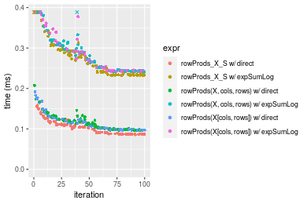
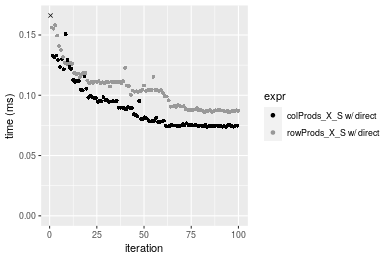
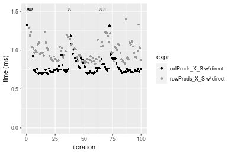

[matrixStats]: Benchmark report

---------------------------------------


# colProds() and rowProds() benchmarks on subsetted computation

This report benchmark the performance of colProds() and rowProds() on subsetted computation.


## Data
```r
> rmatrix <- function(nrow, ncol, mode = c("logical", "double", "integer", "index"), range = c(-100, 
+     +100), na_prob = 0) {
+     mode <- match.arg(mode)
+     n <- nrow * ncol
+     if (mode == "logical") {
+         x <- sample(c(FALSE, TRUE), size = n, replace = TRUE)
+     }     else if (mode == "index") {
+         x <- seq_len(n)
+         mode <- "integer"
+     }     else {
+         x <- runif(n, min = range[1], max = range[2])
+     }
+     storage.mode(x) <- mode
+     if (na_prob > 0) 
+         x[sample(n, size = na_prob * n)] <- NA
+     dim(x) <- c(nrow, ncol)
+     x
+ }
> rmatrices <- function(scale = 10, seed = 1, ...) {
+     set.seed(seed)
+     data <- list()
+     data[[1]] <- rmatrix(nrow = scale * 1, ncol = scale * 1, ...)
+     data[[2]] <- rmatrix(nrow = scale * 10, ncol = scale * 10, ...)
+     data[[3]] <- rmatrix(nrow = scale * 100, ncol = scale * 1, ...)
+     data[[4]] <- t(data[[3]])
+     data[[5]] <- rmatrix(nrow = scale * 10, ncol = scale * 100, ...)
+     data[[6]] <- t(data[[5]])
+     names(data) <- sapply(data, FUN = function(x) paste(dim(x), collapse = "x"))
+     data
+ }
> data <- rmatrices(mode = "double")
```

## Results

### 10x10 matrix


```r
> X <- data[["10x10"]]
> rows <- sample.int(nrow(X), size = nrow(X) * 0.7)
> cols <- sample.int(ncol(X), size = ncol(X) * 0.7)
> X_S <- X[rows, cols]
> colStats <- microbenchmark(`colProds_X_S w/ direct` = colProds(X_S, method = "direct", na.rm = FALSE), 
+     `colProds_X_S w/ expSumLog` = colProds(X_S, method = "expSumLog", na.rm = FALSE), `colProds(X, rows, cols) w/ direct` = colProds(X, 
+         rows = rows, cols = cols, method = "direct", na.rm = FALSE), `colProds(X, rows, cols) w/ expSumLog` = colProds(X, 
+         rows = rows, cols = cols, method = "expSumLog", na.rm = FALSE), `colProds(X[rows, cols]) w/ direct` = colProds(X[rows, 
+         cols], method = "direct", na.rm = FALSE), `colProds(X[rows, cols]) w/ expSumLog` = colProds(X[rows, 
+         cols], method = "expSumLog", na.rm = FALSE), unit = "ms")
> X <- t(X)
> X_S <- t(X_S)
> rowStats <- microbenchmark(`rowProds_X_S w/ direct` = rowProds(X_S, method = "direct", na.rm = FALSE), 
+     `rowProds_X_S w/ expSumLog` = rowProds(X_S, method = "expSumLog", na.rm = FALSE), `rowProds(X, cols, rows) w/ direct` = rowProds(X, 
+         rows = cols, cols = rows, method = "direct", na.rm = FALSE), `rowProds(X, cols, rows) w/ expSumLog` = rowProds(X, 
+         rows = cols, cols = rows, method = "expSumLog", na.rm = FALSE), `rowProds(X[cols, rows]) w/ direct` = rowProds(X[cols, 
+         rows], method = "direct", na.rm = FALSE), `rowProds(X[cols, rows]) w/ expSumLog` = rowProds(X[cols, 
+         rows], method = "expSumLog", na.rm = FALSE), unit = "ms")
```

_Table: Benchmarking of colProds_X_S w/ direct(), colProds_X_S w/ expSumLog(), colProds(X, rows, cols) w/ direct(), colProds(X, rows, cols) w/ expSumLog(), colProds(X[rows, cols]) w/ direct() and colProds(X[rows, cols]) w/ expSumLog() on 10x10 data. The top panel shows times in milliseconds and the bottom panel shows relative times._


|   |expr                                 |      min|        lq|      mean|    median|        uq|      max|
|:--|:------------------------------------|--------:|---------:|---------:|---------:|---------:|--------:|
|1  |colProds_X_S w/ direct               | 0.011879| 0.0124325| 0.0140737| 0.0133025| 0.0141455| 0.031345|
|5  |colProds(X[rows, cols]) w/ direct    | 0.013209| 0.0137590| 0.0178803| 0.0145055| 0.0155440| 0.248899|
|3  |colProds(X, rows, cols) w/ direct    | 0.013240| 0.0136715| 0.0156682| 0.0146685| 0.0157800| 0.031885|
|2  |colProds_X_S w/ expSumLog            | 0.018187| 0.0186280| 0.0210262| 0.0200490| 0.0208005| 0.046608|
|4  |colProds(X, rows, cols) w/ expSumLog | 0.019356| 0.0200475| 0.0226332| 0.0214085| 0.0227915| 0.059330|
|6  |colProds(X[rows, cols]) w/ expSumLog | 0.019324| 0.0200555| 0.0244071| 0.0215885| 0.0235255| 0.075424|


|   |expr                                 |      min|       lq|     mean|   median|       uq|      max|
|:--|:------------------------------------|--------:|--------:|--------:|--------:|--------:|--------:|
|1  |colProds_X_S w/ direct               | 1.000000| 1.000000| 1.000000| 1.000000| 1.000000| 1.000000|
|5  |colProds(X[rows, cols]) w/ direct    | 1.111962| 1.106696| 1.270474| 1.090434| 1.098865| 7.940628|
|3  |colProds(X, rows, cols) w/ direct    | 1.114572| 1.099658| 1.113300| 1.102688| 1.115549| 1.017228|
|2  |colProds_X_S w/ expSumLog            | 1.531021| 1.498331| 1.494010| 1.507160| 1.470468| 1.486936|
|4  |colProds(X, rows, cols) w/ expSumLog | 1.629430| 1.612507| 1.608194| 1.609359| 1.611219| 1.892806|
|6  |colProds(X[rows, cols]) w/ expSumLog | 1.626736| 1.613151| 1.734237| 1.622890| 1.663108| 2.406253|

_Table: Benchmarking of rowProds_X_S w/ direct(), rowProds_X_S w/ expSumLog(), rowProds(X, cols, rows) w/ direct(), rowProds(X, cols, rows) w/ expSumLog(), rowProds(X[cols, rows]) w/ direct() and rowProds(X[cols, rows]) w/ expSumLog() on 10x10 data (transposed). The top panel shows times in milliseconds and the bottom panel shows relative times._


|   |expr                                 |      min|        lq|      mean|    median|        uq|      max|
|:--|:------------------------------------|--------:|---------:|---------:|---------:|---------:|--------:|
|1  |rowProds_X_S w/ direct               | 0.011736| 0.0124320| 0.0128894| 0.0127750| 0.0133125| 0.015238|
|5  |rowProds(X[cols, rows]) w/ direct    | 0.012872| 0.0135175| 0.0147296| 0.0140470| 0.0146415| 0.050591|
|3  |rowProds(X, cols, rows) w/ direct    | 0.013022| 0.0136590| 0.0142243| 0.0140560| 0.0146510| 0.017603|
|2  |rowProds_X_S w/ expSumLog            | 0.018033| 0.0187305| 0.0197546| 0.0197125| 0.0201935| 0.039023|
|6  |rowProds(X[cols, rows]) w/ expSumLog | 0.019407| 0.0200495| 0.0212758| 0.0207360| 0.0216500| 0.036103|
|4  |rowProds(X, cols, rows) w/ expSumLog | 0.019154| 0.0203090| 0.0240003| 0.0210720| 0.0215380| 0.280317|


|   |expr                                 |      min|       lq|     mean|   median|       uq|       max|
|:--|:------------------------------------|--------:|--------:|--------:|--------:|--------:|---------:|
|1  |rowProds_X_S w/ direct               | 1.000000| 1.000000| 1.000000| 1.000000| 1.000000|  1.000000|
|5  |rowProds(X[cols, rows]) w/ direct    | 1.096796| 1.087315| 1.142770| 1.099570| 1.099831|  3.320055|
|3  |rowProds(X, cols, rows) w/ direct    | 1.109577| 1.098697| 1.103565| 1.100274| 1.100545|  1.155204|
|2  |rowProds_X_S w/ expSumLog            | 1.536554| 1.506636| 1.532623| 1.543053| 1.516883|  2.560900|
|6  |rowProds(X[cols, rows]) w/ expSumLog | 1.653630| 1.612733| 1.650643| 1.623170| 1.626291|  2.369274|
|4  |rowProds(X, cols, rows) w/ expSumLog | 1.632072| 1.633607| 1.862017| 1.649472| 1.617878| 18.395918|

_Figure: Benchmarking of colProds_X_S w/ direct(), colProds_X_S w/ expSumLog(), colProds(X, rows, cols) w/ direct(), colProds(X, rows, cols) w/ expSumLog(), colProds(X[rows, cols]) w/ direct() and colProds(X[rows, cols]) w/ expSumLog() on 10x10 data  as well as rowProds_X_S w/ direct(), rowProds_X_S w/ expSumLog(), rowProds(X, cols, rows) w/ direct(), rowProds(X, cols, rows) w/ expSumLog(), rowProds(X[cols, rows]) w/ direct() and rowProds(X[cols, rows]) w/ expSumLog() on the same data transposed.  Outliers are displayed as crosses.  Times are in milliseconds._


_Table: Benchmarking of colProds_X_S w/ direct() and rowProds_X_S w/ direct() on 10x10 data (original and transposed).  The top panel shows times in milliseconds and the bottom panel shows relative times._


|   |expr                   |    min|      lq|     mean|  median|      uq|    max|
|:--|:----------------------|------:|-------:|--------:|-------:|-------:|------:|
|2  |rowProds_X_S w/ direct | 11.736| 12.4320| 12.88943| 12.7750| 13.3125| 15.238|
|1  |colProds_X_S w/ direct | 11.879| 12.4325| 14.07369| 13.3025| 14.1455| 31.345|


|   |expr                   |      min|      lq|     mean|   median|       uq|      max|
|:--|:----------------------|--------:|-------:|--------:|--------:|--------:|--------:|
|2  |rowProds_X_S w/ direct | 1.000000| 1.00000| 1.000000| 1.000000| 1.000000| 1.000000|
|1  |colProds_X_S w/ direct | 1.012185| 1.00004| 1.091878| 1.041292| 1.062573| 2.057028|

_Figure: Benchmarking of colProds_X_S w/ direct() and rowProds_X_S w/ direct() on 10x10 data (original and transposed).  Outliers are displayed as crosses. Times are in milliseconds._


### 100x100 matrix


```r
> X <- data[["100x100"]]
> rows <- sample.int(nrow(X), size = nrow(X) * 0.7)
> cols <- sample.int(ncol(X), size = ncol(X) * 0.7)
> X_S <- X[rows, cols]
> colStats <- microbenchmark(`colProds_X_S w/ direct` = colProds(X_S, method = "direct", na.rm = FALSE), 
+     `colProds_X_S w/ expSumLog` = colProds(X_S, method = "expSumLog", na.rm = FALSE), `colProds(X, rows, cols) w/ direct` = colProds(X, 
+         rows = rows, cols = cols, method = "direct", na.rm = FALSE), `colProds(X, rows, cols) w/ expSumLog` = colProds(X, 
+         rows = rows, cols = cols, method = "expSumLog", na.rm = FALSE), `colProds(X[rows, cols]) w/ direct` = colProds(X[rows, 
+         cols], method = "direct", na.rm = FALSE), `colProds(X[rows, cols]) w/ expSumLog` = colProds(X[rows, 
+         cols], method = "expSumLog", na.rm = FALSE), unit = "ms")
> X <- t(X)
> X_S <- t(X_S)
> rowStats <- microbenchmark(`rowProds_X_S w/ direct` = rowProds(X_S, method = "direct", na.rm = FALSE), 
+     `rowProds_X_S w/ expSumLog` = rowProds(X_S, method = "expSumLog", na.rm = FALSE), `rowProds(X, cols, rows) w/ direct` = rowProds(X, 
+         rows = cols, cols = rows, method = "direct", na.rm = FALSE), `rowProds(X, cols, rows) w/ expSumLog` = rowProds(X, 
+         rows = cols, cols = rows, method = "expSumLog", na.rm = FALSE), `rowProds(X[cols, rows]) w/ direct` = rowProds(X[cols, 
+         rows], method = "direct", na.rm = FALSE), `rowProds(X[cols, rows]) w/ expSumLog` = rowProds(X[cols, 
+         rows], method = "expSumLog", na.rm = FALSE), unit = "ms")
```

_Table: Benchmarking of colProds_X_S w/ direct(), colProds_X_S w/ expSumLog(), colProds(X, rows, cols) w/ direct(), colProds(X, rows, cols) w/ expSumLog(), colProds(X[rows, cols]) w/ direct() and colProds(X[rows, cols]) w/ expSumLog() on 100x100 data. The top panel shows times in milliseconds and the bottom panel shows relative times._


|   |expr                                 |      min|        lq|      mean|    median|        uq|      max|
|:--|:------------------------------------|--------:|---------:|---------:|---------:|---------:|--------:|
|1  |colProds_X_S w/ direct               | 0.073523| 0.0754410| 0.0876579| 0.0791305| 0.0954815| 0.169680|
|3  |colProds(X, rows, cols) w/ direct    | 0.084659| 0.0862920| 0.0989782| 0.0906025| 0.1066365| 0.156641|
|5  |colProds(X[rows, cols]) w/ direct    | 0.084971| 0.0863280| 0.0994156| 0.0911125| 0.1075360| 0.182674|
|2  |colProds_X_S w/ expSumLog            | 0.216507| 0.2197665| 0.2541004| 0.2315515| 0.2785490| 0.408021|
|6  |colProds(X[rows, cols]) w/ expSumLog | 0.227537| 0.2306700| 0.2634491| 0.2368805| 0.2879535| 0.389107|
|4  |colProds(X, rows, cols) w/ expSumLog | 0.227123| 0.2312365| 0.2608983| 0.2412000| 0.2758640| 0.409414|


|   |expr                                 |      min|       lq|     mean|   median|       uq|       max|
|:--|:------------------------------------|--------:|--------:|--------:|--------:|--------:|---------:|
|1  |colProds_X_S w/ direct               | 1.000000| 1.000000| 1.000000| 1.000000| 1.000000| 1.0000000|
|3  |colProds(X, rows, cols) w/ direct    | 1.151463| 1.143834| 1.129142| 1.144976| 1.116829| 0.9231554|
|5  |colProds(X[rows, cols]) w/ direct    | 1.155706| 1.144311| 1.134132| 1.151421| 1.126250| 1.0765794|
|2  |colProds_X_S w/ expSumLog            | 2.944752| 2.913091| 2.898774| 2.926198| 2.917309| 2.4046499|
|6  |colProds(X[rows, cols]) w/ expSumLog | 3.094773| 3.057621| 3.005424| 2.993542| 3.015804| 2.2931813|
|4  |colProds(X, rows, cols) w/ expSumLog | 3.089142| 3.065130| 2.976325| 3.048129| 2.889188| 2.4128595|

_Table: Benchmarking of rowProds_X_S w/ direct(), rowProds_X_S w/ expSumLog(), rowProds(X, cols, rows) w/ direct(), rowProds(X, cols, rows) w/ expSumLog(), rowProds(X[cols, rows]) w/ direct() and rowProds(X[cols, rows]) w/ expSumLog() on 100x100 data (transposed). The top panel shows times in milliseconds and the bottom panel shows relative times._


|   |expr                                 |      min|        lq|      mean|    median|        uq|      max|
|:--|:------------------------------------|--------:|---------:|---------:|---------:|---------:|--------:|
|1  |rowProds_X_S w/ direct               | 0.087428| 0.0884055| 0.1005548| 0.0956485| 0.1100400| 0.161651|
|5  |rowProds(X[cols, rows]) w/ direct    | 0.098287| 0.0992560| 0.1112126| 0.1003275| 0.1210850| 0.180878|
|3  |rowProds(X, cols, rows) w/ direct    | 0.098316| 0.0995035| 0.1077124| 0.1007360| 0.1079755| 0.201053|
|2  |rowProds_X_S w/ expSumLog            | 0.232498| 0.2341260| 0.2701732| 0.2388910| 0.2927070| 0.451625|
|6  |rowProds(X[cols, rows]) w/ expSumLog | 0.242879| 0.2451035| 0.2708972| 0.2466055| 0.2895050| 0.442851|
|4  |rowProds(X, cols, rows) w/ expSumLog | 0.242905| 0.2453140| 0.2765173| 0.2531515| 0.3010835| 0.415499|


|   |expr                                 |      min|       lq|     mean|   median|        uq|      max|
|:--|:------------------------------------|--------:|--------:|--------:|--------:|---------:|--------:|
|1  |rowProds_X_S w/ direct               | 1.000000| 1.000000| 1.000000| 1.000000| 1.0000000| 1.000000|
|5  |rowProds(X[cols, rows]) w/ direct    | 1.124205| 1.122736| 1.105989| 1.048919| 1.1003726| 1.118941|
|3  |rowProds(X, cols, rows) w/ direct    | 1.124537| 1.125535| 1.071180| 1.053190| 0.9812386| 1.243747|
|2  |rowProds_X_S w/ expSumLog            | 2.659308| 2.648319| 2.686825| 2.497593| 2.6600055| 2.793827|
|6  |rowProds(X[cols, rows]) w/ expSumLog | 2.778046| 2.772492| 2.694024| 2.578247| 2.6309069| 2.739550|
|4  |rowProds(X, cols, rows) w/ expSumLog | 2.778343| 2.774873| 2.749916| 2.646685| 2.7361278| 2.570346|

_Figure: Benchmarking of colProds_X_S w/ direct(), colProds_X_S w/ expSumLog(), colProds(X, rows, cols) w/ direct(), colProds(X, rows, cols) w/ expSumLog(), colProds(X[rows, cols]) w/ direct() and colProds(X[rows, cols]) w/ expSumLog() on 100x100 data  as well as rowProds_X_S w/ direct(), rowProds_X_S w/ expSumLog(), rowProds(X, cols, rows) w/ direct(), rowProds(X, cols, rows) w/ expSumLog(), rowProds(X[cols, rows]) w/ direct() and rowProds(X[cols, rows]) w/ expSumLog() on the same data transposed.  Outliers are displayed as crosses.  Times are in milliseconds._



_Table: Benchmarking of colProds_X_S w/ direct() and rowProds_X_S w/ direct() on 100x100 data (original and transposed).  The top panel shows times in milliseconds and the bottom panel shows relative times._


|   |expr                   |    min|      lq|      mean|  median|       uq|     max|
|:--|:----------------------|------:|-------:|---------:|-------:|--------:|-------:|
|1  |colProds_X_S w/ direct | 73.523| 75.4410|  87.65788| 79.1305|  95.4815| 169.680|
|2  |rowProds_X_S w/ direct | 87.428| 88.4055| 100.55484| 95.6485| 110.0400| 161.651|


|   |expr                   |      min|       lq|     mean|   median|       uq|       max|
|:--|:----------------------|--------:|--------:|--------:|--------:|--------:|---------:|
|1  |colProds_X_S w/ direct | 1.000000| 1.000000| 1.000000| 1.000000| 1.000000| 1.0000000|
|2  |rowProds_X_S w/ direct | 1.189124| 1.171849| 1.147128| 1.208744| 1.152475| 0.9526815|

_Figure: Benchmarking of colProds_X_S w/ direct() and rowProds_X_S w/ direct() on 100x100 data (original and transposed).  Outliers are displayed as crosses. Times are in milliseconds._




### 1000x10 matrix


```r
> X <- data[["1000x10"]]
> rows <- sample.int(nrow(X), size = nrow(X) * 0.7)
> cols <- sample.int(ncol(X), size = ncol(X) * 0.7)
> X_S <- X[rows, cols]
> colStats <- microbenchmark(`colProds_X_S w/ direct` = colProds(X_S, method = "direct", na.rm = FALSE), 
+     `colProds_X_S w/ expSumLog` = colProds(X_S, method = "expSumLog", na.rm = FALSE), `colProds(X, rows, cols) w/ direct` = colProds(X, 
+         rows = rows, cols = cols, method = "direct", na.rm = FALSE), `colProds(X, rows, cols) w/ expSumLog` = colProds(X, 
+         rows = rows, cols = cols, method = "expSumLog", na.rm = FALSE), `colProds(X[rows, cols]) w/ direct` = colProds(X[rows, 
+         cols], method = "direct", na.rm = FALSE), `colProds(X[rows, cols]) w/ expSumLog` = colProds(X[rows, 
+         cols], method = "expSumLog", na.rm = FALSE), unit = "ms")
> X <- t(X)
> X_S <- t(X_S)
> rowStats <- microbenchmark(`rowProds_X_S w/ direct` = rowProds(X_S, method = "direct", na.rm = FALSE), 
+     `rowProds_X_S w/ expSumLog` = rowProds(X_S, method = "expSumLog", na.rm = FALSE), `rowProds(X, cols, rows) w/ direct` = rowProds(X, 
+         rows = cols, cols = rows, method = "direct", na.rm = FALSE), `rowProds(X, cols, rows) w/ expSumLog` = rowProds(X, 
+         rows = cols, cols = rows, method = "expSumLog", na.rm = FALSE), `rowProds(X[cols, rows]) w/ direct` = rowProds(X[cols, 
+         rows], method = "direct", na.rm = FALSE), `rowProds(X[cols, rows]) w/ expSumLog` = rowProds(X[cols, 
+         rows], method = "expSumLog", na.rm = FALSE), unit = "ms")
```

_Table: Benchmarking of colProds_X_S w/ direct(), colProds_X_S w/ expSumLog(), colProds(X, rows, cols) w/ direct(), colProds(X, rows, cols) w/ expSumLog(), colProds(X[rows, cols]) w/ direct() and colProds(X[rows, cols]) w/ expSumLog() on 1000x10 data. The top panel shows times in milliseconds and the bottom panel shows relative times._


|   |expr                                 |      min|        lq|      mean|    median|        uq|      max|
|:--|:------------------------------------|--------:|---------:|---------:|---------:|---------:|--------:|
|1  |colProds_X_S w/ direct               | 0.027845| 0.0305375| 0.0366759| 0.0365685| 0.0394215| 0.060439|
|5  |colProds(X[rows, cols]) w/ direct    | 0.039097| 0.0427005| 0.0497955| 0.0485680| 0.0547120| 0.098210|
|3  |colProds(X, rows, cols) w/ direct    | 0.039055| 0.0428685| 0.0510251| 0.0511710| 0.0564350| 0.081082|
|2  |colProds_X_S w/ expSumLog            | 0.138134| 0.1472795| 0.1672383| 0.1600480| 0.1822810| 0.235628|
|6  |colProds(X[rows, cols]) w/ expSumLog | 0.149715| 0.1602365| 0.1826068| 0.1730125| 0.1972790| 0.314818|
|4  |colProds(X, rows, cols) w/ expSumLog | 0.149802| 0.1615500| 0.1865419| 0.1859780| 0.2039590| 0.256842|


|   |expr                                 |      min|       lq|     mean|   median|       uq|      max|
|:--|:------------------------------------|--------:|--------:|--------:|--------:|--------:|--------:|
|1  |colProds_X_S w/ direct               | 1.000000| 1.000000| 1.000000| 1.000000| 1.000000| 1.000000|
|5  |colProds(X[rows, cols]) w/ direct    | 1.404094| 1.398297| 1.357718| 1.328138| 1.387872| 1.624944|
|3  |colProds(X, rows, cols) w/ direct    | 1.402586| 1.403799| 1.391245| 1.399319| 1.431579| 1.341551|
|2  |colProds_X_S w/ expSumLog            | 4.960819| 4.822906| 4.559896| 4.376663| 4.623898| 3.898608|
|6  |colProds(X[rows, cols]) w/ expSumLog | 5.376728| 5.247204| 4.978934| 4.731189| 5.004350| 5.208855|
|4  |colProds(X, rows, cols) w/ expSumLog | 5.379853| 5.290217| 5.086227| 5.085743| 5.173801| 4.249607|

_Table: Benchmarking of rowProds_X_S w/ direct(), rowProds_X_S w/ expSumLog(), rowProds(X, cols, rows) w/ direct(), rowProds(X, cols, rows) w/ expSumLog(), rowProds(X[cols, rows]) w/ direct() and rowProds(X[cols, rows]) w/ expSumLog() on 1000x10 data (transposed). The top panel shows times in milliseconds and the bottom panel shows relative times._


|   |expr                                 |      min|        lq|      mean|    median|        uq|      max|
|:--|:------------------------------------|--------:|---------:|---------:|---------:|---------:|--------:|
|1  |rowProds_X_S w/ direct               | 0.040932| 0.0420685| 0.0497150| 0.0469240| 0.0541310| 0.078151|
|5  |rowProds(X[cols, rows]) w/ direct    | 0.054038| 0.0554645| 0.0641877| 0.0615110| 0.0699435| 0.089756|
|3  |rowProds(X, cols, rows) w/ direct    | 0.054075| 0.0576280| 0.0656342| 0.0634200| 0.0697805| 0.100349|
|2  |rowProds_X_S w/ expSumLog            | 0.152563| 0.1615800| 0.1868576| 0.1827240| 0.2017655| 0.292776|
|6  |rowProds(X[cols, rows]) w/ expSumLog | 0.165147| 0.1686910| 0.1937697| 0.1851555| 0.2100655| 0.301050|
|4  |rowProds(X, cols, rows) w/ expSumLog | 0.165131| 0.1671925| 0.1976374| 0.1857470| 0.2174040| 0.275455|


|   |expr                                 |      min|       lq|     mean|   median|       uq|      max|
|:--|:------------------------------------|--------:|--------:|--------:|--------:|--------:|--------:|
|1  |rowProds_X_S w/ direct               | 1.000000| 1.000000| 1.000000| 1.000000| 1.000000| 1.000000|
|5  |rowProds(X[cols, rows]) w/ direct    | 1.320190| 1.318433| 1.291114| 1.310864| 1.292115| 1.148495|
|3  |rowProds(X, cols, rows) w/ direct    | 1.321093| 1.369861| 1.320210| 1.351547| 1.289104| 1.284040|
|2  |rowProds_X_S w/ expSumLog            | 3.727231| 3.840879| 3.758575| 3.894041| 3.727356| 3.746286|
|6  |rowProds(X[cols, rows]) w/ expSumLog | 4.034667| 4.009912| 3.897608| 3.945859| 3.880688| 3.852158|
|4  |rowProds(X, cols, rows) w/ expSumLog | 4.034276| 3.974292| 3.975407| 3.958465| 4.016257| 3.524651|

_Figure: Benchmarking of colProds_X_S w/ direct(), colProds_X_S w/ expSumLog(), colProds(X, rows, cols) w/ direct(), colProds(X, rows, cols) w/ expSumLog(), colProds(X[rows, cols]) w/ direct() and colProds(X[rows, cols]) w/ expSumLog() on 1000x10 data  as well as rowProds_X_S w/ direct(), rowProds_X_S w/ expSumLog(), rowProds(X, cols, rows) w/ direct(), rowProds(X, cols, rows) w/ expSumLog(), rowProds(X[cols, rows]) w/ direct() and rowProds(X[cols, rows]) w/ expSumLog() on the same data transposed.  Outliers are displayed as crosses.  Times are in milliseconds._


_Table: Benchmarking of colProds_X_S w/ direct() and rowProds_X_S w/ direct() on 1000x10 data (original and transposed).  The top panel shows times in milliseconds and the bottom panel shows relative times._


|   |expr                   |    min|      lq|     mean|  median|      uq|    max|
|:--|:----------------------|------:|-------:|--------:|-------:|-------:|------:|
|1  |colProds_X_S w/ direct | 27.845| 30.5375| 36.67589| 36.5685| 39.4215| 60.439|
|2  |rowProds_X_S w/ direct | 40.932| 42.0685| 49.71502| 46.9240| 54.1310| 78.151|


|   |expr                   |      min|       lq|     mean|   median|       uq|      max|
|:--|:----------------------|--------:|--------:|--------:|--------:|--------:|--------:|
|1  |colProds_X_S w/ direct | 1.000000| 1.000000| 1.000000| 1.000000| 1.000000| 1.000000|
|2  |rowProds_X_S w/ direct | 1.469995| 1.377601| 1.355523| 1.283181| 1.373134| 1.293056|

_Figure: Benchmarking of colProds_X_S w/ direct() and rowProds_X_S w/ direct() on 1000x10 data (original and transposed).  Outliers are displayed as crosses. Times are in milliseconds._


### 10x1000 matrix


```r
> X <- data[["10x1000"]]
> rows <- sample.int(nrow(X), size = nrow(X) * 0.7)
> cols <- sample.int(ncol(X), size = ncol(X) * 0.7)
> X_S <- X[rows, cols]
> colStats <- microbenchmark(`colProds_X_S w/ direct` = colProds(X_S, method = "direct", na.rm = FALSE), 
+     `colProds_X_S w/ expSumLog` = colProds(X_S, method = "expSumLog", na.rm = FALSE), `colProds(X, rows, cols) w/ direct` = colProds(X, 
+         rows = rows, cols = cols, method = "direct", na.rm = FALSE), `colProds(X, rows, cols) w/ expSumLog` = colProds(X, 
+         rows = rows, cols = cols, method = "expSumLog", na.rm = FALSE), `colProds(X[rows, cols]) w/ direct` = colProds(X[rows, 
+         cols], method = "direct", na.rm = FALSE), `colProds(X[rows, cols]) w/ expSumLog` = colProds(X[rows, 
+         cols], method = "expSumLog", na.rm = FALSE), unit = "ms")
> X <- t(X)
> X_S <- t(X_S)
> rowStats <- microbenchmark(`rowProds_X_S w/ direct` = rowProds(X_S, method = "direct", na.rm = FALSE), 
+     `rowProds_X_S w/ expSumLog` = rowProds(X_S, method = "expSumLog", na.rm = FALSE), `rowProds(X, cols, rows) w/ direct` = rowProds(X, 
+         rows = cols, cols = rows, method = "direct", na.rm = FALSE), `rowProds(X, cols, rows) w/ expSumLog` = rowProds(X, 
+         rows = cols, cols = rows, method = "expSumLog", na.rm = FALSE), `rowProds(X[cols, rows]) w/ direct` = rowProds(X[cols, 
+         rows], method = "direct", na.rm = FALSE), `rowProds(X[cols, rows]) w/ expSumLog` = rowProds(X[cols, 
+         rows], method = "expSumLog", na.rm = FALSE), unit = "ms")
```

_Table: Benchmarking of colProds_X_S w/ direct(), colProds_X_S w/ expSumLog(), colProds(X, rows, cols) w/ direct(), colProds(X, rows, cols) w/ expSumLog(), colProds(X[rows, cols]) w/ direct() and colProds(X[rows, cols]) w/ expSumLog() on 10x1000 data. The top panel shows times in milliseconds and the bottom panel shows relative times._


|   |expr                                 |      min|        lq|      mean|    median|       uq|      max|
|:--|:------------------------------------|--------:|---------:|---------:|---------:|--------:|--------:|
|1  |colProds_X_S w/ direct               | 0.514849| 0.5549765| 0.5920531| 0.5995670| 0.618265| 0.857641|
|3  |colProds(X, rows, cols) w/ direct    | 0.527041| 0.5718395| 0.6062205| 0.6016860| 0.633072| 0.816721|
|5  |colProds(X[rows, cols]) w/ direct    | 0.533493| 0.5773990| 0.6015982| 0.6097315| 0.622511| 0.677936|
|2  |colProds_X_S w/ expSumLog            | 0.974624| 1.0449880| 1.1008359| 1.1022710| 1.142480| 1.543816|
|4  |colProds(X, rows, cols) w/ expSumLog | 0.973778| 1.0369290| 1.1574082| 1.1079255| 1.142408| 6.103080|
|6  |colProds(X[rows, cols]) w/ expSumLog | 0.972519| 1.0449825| 1.1043839| 1.1084285| 1.132539| 1.651709|


|   |expr                                 |      min|       lq|     mean|   median|       uq|       max|
|:--|:------------------------------------|--------:|--------:|--------:|--------:|--------:|---------:|
|1  |colProds_X_S w/ direct               | 1.000000| 1.000000| 1.000000| 1.000000| 1.000000| 1.0000000|
|3  |colProds(X, rows, cols) w/ direct    | 1.023681| 1.030385| 1.023929| 1.003534| 1.023949| 0.9522877|
|5  |colProds(X[rows, cols]) w/ direct    | 1.036213| 1.040403| 1.016122| 1.016953| 1.006868| 0.7904659|
|2  |colProds_X_S w/ expSumLog            | 1.893029| 1.882941| 1.859353| 1.838445| 1.847881| 1.8000725|
|4  |colProds(X, rows, cols) w/ expSumLog | 1.891386| 1.868420| 1.954906| 1.847876| 1.847763| 7.1161243|
|6  |colProds(X[rows, cols]) w/ expSumLog | 1.888940| 1.882931| 1.865346| 1.848715| 1.831802| 1.9258746|

_Table: Benchmarking of rowProds_X_S w/ direct(), rowProds_X_S w/ expSumLog(), rowProds(X, cols, rows) w/ direct(), rowProds(X, cols, rows) w/ expSumLog(), rowProds(X[cols, rows]) w/ direct() and rowProds(X[cols, rows]) w/ expSumLog() on 10x1000 data (transposed). The top panel shows times in milliseconds and the bottom panel shows relative times._


|   |expr                                 |      min|       lq|      mean|    median|        uq|      max|
|:--|:------------------------------------|--------:|--------:|---------:|---------:|---------:|--------:|
|1  |rowProds_X_S w/ direct               | 0.526348| 0.569408| 0.5983711| 0.5923450| 0.6221500| 0.868826|
|5  |rowProds(X[cols, rows]) w/ direct    | 0.534584| 0.579610| 0.6130669| 0.6107605| 0.6325835| 0.834490|
|3  |rowProds(X, cols, rows) w/ direct    | 0.536617| 0.580382| 0.6614913| 0.6119870| 0.6319650| 5.728811|
|2  |rowProds_X_S w/ expSumLog            | 0.987154| 1.044999| 1.0998410| 1.1120475| 1.1268070| 1.588458|
|6  |rowProds(X[cols, rows]) w/ expSumLog | 0.992673| 1.062739| 1.1024540| 1.1183790| 1.1363260| 1.590457|
|4  |rowProds(X, cols, rows) w/ expSumLog | 0.993212| 1.071645| 1.1213356| 1.1257665| 1.1483605| 1.584648|


|   |expr                                 |      min|       lq|     mean|   median|       uq|      max|
|:--|:------------------------------------|--------:|--------:|--------:|--------:|--------:|--------:|
|1  |rowProds_X_S w/ direct               | 1.000000| 1.000000| 1.000000| 1.000000| 1.000000| 1.000000|
|5  |rowProds(X[cols, rows]) w/ direct    | 1.015647| 1.017917| 1.024560| 1.031089| 1.016770| 0.960480|
|3  |rowProds(X, cols, rows) w/ direct    | 1.019510| 1.019273| 1.105487| 1.033160| 1.015776| 6.593738|
|2  |rowProds_X_S w/ expSumLog            | 1.875478| 1.835238| 1.838059| 1.877365| 1.811150| 1.828281|
|6  |rowProds(X[cols, rows]) w/ expSumLog | 1.885963| 1.866394| 1.842425| 1.888053| 1.826450| 1.830582|
|4  |rowProds(X, cols, rows) w/ expSumLog | 1.886987| 1.882034| 1.873980| 1.900525| 1.845794| 1.823896|

_Figure: Benchmarking of colProds_X_S w/ direct(), colProds_X_S w/ expSumLog(), colProds(X, rows, cols) w/ direct(), colProds(X, rows, cols) w/ expSumLog(), colProds(X[rows, cols]) w/ direct() and colProds(X[rows, cols]) w/ expSumLog() on 10x1000 data  as well as rowProds_X_S w/ direct(), rowProds_X_S w/ expSumLog(), rowProds(X, cols, rows) w/ direct(), rowProds(X, cols, rows) w/ expSumLog(), rowProds(X[cols, rows]) w/ direct() and rowProds(X[cols, rows]) w/ expSumLog() on the same data transposed.  Outliers are displayed as crosses.  Times are in milliseconds._


_Table: Benchmarking of colProds_X_S w/ direct() and rowProds_X_S w/ direct() on 10x1000 data (original and transposed).  The top panel shows times in milliseconds and the bottom panel shows relative times._


|   |expr                   |     min|       lq|     mean|  median|      uq|     max|
|:--|:----------------------|-------:|--------:|--------:|-------:|-------:|-------:|
|2  |rowProds_X_S w/ direct | 526.348| 569.4080| 598.3711| 592.345| 622.150| 868.826|
|1  |colProds_X_S w/ direct | 514.849| 554.9765| 592.0531| 599.567| 618.265| 857.641|


|   |expr                   |       min|        lq|      mean|   median|        uq|       max|
|:--|:----------------------|---------:|---------:|---------:|--------:|---------:|---------:|
|2  |rowProds_X_S w/ direct | 1.0000000| 1.0000000| 1.0000000| 1.000000| 1.0000000| 1.0000000|
|1  |colProds_X_S w/ direct | 0.9781532| 0.9746553| 0.9894414| 1.012192| 0.9937555| 0.9871263|

_Figure: Benchmarking of colProds_X_S w/ direct() and rowProds_X_S w/ direct() on 10x1000 data (original and transposed).  Outliers are displayed as crosses. Times are in milliseconds._


### 100x1000 matrix


```r
> X <- data[["100x1000"]]
> rows <- sample.int(nrow(X), size = nrow(X) * 0.7)
> cols <- sample.int(ncol(X), size = ncol(X) * 0.7)
> X_S <- X[rows, cols]
> colStats <- microbenchmark(`colProds_X_S w/ direct` = colProds(X_S, method = "direct", na.rm = FALSE), 
+     `colProds_X_S w/ expSumLog` = colProds(X_S, method = "expSumLog", na.rm = FALSE), `colProds(X, rows, cols) w/ direct` = colProds(X, 
+         rows = rows, cols = cols, method = "direct", na.rm = FALSE), `colProds(X, rows, cols) w/ expSumLog` = colProds(X, 
+         rows = rows, cols = cols, method = "expSumLog", na.rm = FALSE), `colProds(X[rows, cols]) w/ direct` = colProds(X[rows, 
+         cols], method = "direct", na.rm = FALSE), `colProds(X[rows, cols]) w/ expSumLog` = colProds(X[rows, 
+         cols], method = "expSumLog", na.rm = FALSE), unit = "ms")
> X <- t(X)
> X_S <- t(X_S)
> rowStats <- microbenchmark(`rowProds_X_S w/ direct` = rowProds(X_S, method = "direct", na.rm = FALSE), 
+     `rowProds_X_S w/ expSumLog` = rowProds(X_S, method = "expSumLog", na.rm = FALSE), `rowProds(X, cols, rows) w/ direct` = rowProds(X, 
+         rows = cols, cols = rows, method = "direct", na.rm = FALSE), `rowProds(X, cols, rows) w/ expSumLog` = rowProds(X, 
+         rows = cols, cols = rows, method = "expSumLog", na.rm = FALSE), `rowProds(X[cols, rows]) w/ direct` = rowProds(X[cols, 
+         rows], method = "direct", na.rm = FALSE), `rowProds(X[cols, rows]) w/ expSumLog` = rowProds(X[cols, 
+         rows], method = "expSumLog", na.rm = FALSE), unit = "ms")
```

_Table: Benchmarking of colProds_X_S w/ direct(), colProds_X_S w/ expSumLog(), colProds(X, rows, cols) w/ direct(), colProds(X, rows, cols) w/ expSumLog(), colProds(X[rows, cols]) w/ direct() and colProds(X[rows, cols]) w/ expSumLog() on 100x1000 data. The top panel shows times in milliseconds and the bottom panel shows relative times._


|   |expr                                 |      min|        lq|      mean|    median|       uq|       max|
|:--|:------------------------------------|--------:|---------:|---------:|---------:|--------:|---------:|
|1  |colProds_X_S w/ direct               | 0.717603| 0.7534140| 0.8099986| 0.7765005| 0.844426|  1.127402|
|5  |colProds(X[rows, cols]) w/ direct    | 0.815706| 0.8352820| 0.9112632| 0.8799450| 0.924171|  1.642024|
|3  |colProds(X, rows, cols) w/ direct    | 0.815935| 0.8619205| 1.1976916| 0.8856785| 0.998290| 14.538521|
|2  |colProds_X_S w/ expSumLog            | 2.155196| 2.2309665| 2.6598341| 2.3356705| 2.521720| 15.944197|
|4  |colProds(X, rows, cols) w/ expSumLog | 2.262033| 2.3172930| 2.6050432| 2.4041615| 2.514598| 15.033764|
|6  |colProds(X[rows, cols]) w/ expSumLog | 2.257923| 2.3236495| 2.7547776| 2.4250645| 2.539267| 15.823786|


|   |expr                                 |      min|       lq|     mean|   median|       uq|       max|
|:--|:------------------------------------|--------:|--------:|--------:|--------:|--------:|---------:|
|1  |colProds_X_S w/ direct               | 1.000000| 1.000000| 1.000000| 1.000000| 1.000000|  1.000000|
|5  |colProds(X[rows, cols]) w/ direct    | 1.136709| 1.108663| 1.125018| 1.133219| 1.094437|  1.456467|
|3  |colProds(X, rows, cols) w/ direct    | 1.137028| 1.144020| 1.478634| 1.140603| 1.182211| 12.895596|
|2  |colProds_X_S w/ expSumLog            | 3.003326| 2.961143| 3.283752| 3.007945| 2.986313| 14.142424|
|4  |colProds(X, rows, cols) w/ expSumLog | 3.152207| 3.075723| 3.216108| 3.096149| 2.977879| 13.334874|
|6  |colProds(X[rows, cols]) w/ expSumLog | 3.146479| 3.084160| 3.400966| 3.123069| 3.007093| 14.035620|

_Table: Benchmarking of rowProds_X_S w/ direct(), rowProds_X_S w/ expSumLog(), rowProds(X, cols, rows) w/ direct(), rowProds(X, cols, rows) w/ expSumLog(), rowProds(X[cols, rows]) w/ direct() and rowProds(X[cols, rows]) w/ expSumLog() on 100x1000 data (transposed). The top panel shows times in milliseconds and the bottom panel shows relative times._


|   |expr                                 |      min|       lq|     mean|    median|       uq|       max|
|:--|:------------------------------------|--------:|--------:|--------:|---------:|--------:|---------:|
|1  |rowProds_X_S w/ direct               | 0.854257| 0.900528| 1.248901| 0.9466295| 1.042189| 14.465722|
|3  |rowProds(X, cols, rows) w/ direct    | 1.024658| 1.065621| 1.137948| 1.0895595| 1.162626|  2.260833|
|5  |rowProds(X[cols, rows]) w/ direct    | 1.027448| 1.068107| 1.265583| 1.0961860| 1.179778| 14.151035|
|2  |rowProds_X_S w/ expSumLog            | 2.307104| 2.402499| 2.550859| 2.4629340| 2.629256|  3.382680|
|6  |rowProds(X[cols, rows]) w/ expSumLog | 2.493135| 2.547074| 2.985795| 2.6288155| 2.722334| 16.159918|
|4  |rowProds(X, cols, rows) w/ expSumLog | 2.482879| 2.586888| 3.020300| 2.6521045| 2.874439| 16.481383|


|   |expr                                 |      min|       lq|      mean|   median|       uq|       max|
|:--|:------------------------------------|--------:|--------:|---------:|--------:|--------:|---------:|
|1  |rowProds_X_S w/ direct               | 1.000000| 1.000000| 1.0000000| 1.000000| 1.000000| 1.0000000|
|3  |rowProds(X, cols, rows) w/ direct    | 1.199473| 1.183329| 0.9111594| 1.150988| 1.115561| 0.1562890|
|5  |rowProds(X[cols, rows]) w/ direct    | 1.202739| 1.186090| 1.0133574| 1.157988| 1.132019| 0.9782460|
|2  |rowProds_X_S w/ expSumLog            | 2.700714| 2.667878| 2.0424835| 2.601793| 2.522821| 0.2338411|
|6  |rowProds(X[cols, rows]) w/ expSumLog | 2.918483| 2.828423| 2.3907385| 2.777027| 2.612131| 1.1171180|
|4  |rowProds(X, cols, rows) w/ expSumLog | 2.906478| 2.872635| 2.4183663| 2.801629| 2.758078| 1.1393405|

_Figure: Benchmarking of colProds_X_S w/ direct(), colProds_X_S w/ expSumLog(), colProds(X, rows, cols) w/ direct(), colProds(X, rows, cols) w/ expSumLog(), colProds(X[rows, cols]) w/ direct() and colProds(X[rows, cols]) w/ expSumLog() on 100x1000 data  as well as rowProds_X_S w/ direct(), rowProds_X_S w/ expSumLog(), rowProds(X, cols, rows) w/ direct(), rowProds(X, cols, rows) w/ expSumLog(), rowProds(X[cols, rows]) w/ direct() and rowProds(X[cols, rows]) w/ expSumLog() on the same data transposed.  Outliers are displayed as crosses.  Times are in milliseconds._


_Table: Benchmarking of colProds_X_S w/ direct() and rowProds_X_S w/ direct() on 100x1000 data (original and transposed).  The top panel shows times in milliseconds and the bottom panel shows relative times._


|   |expr                   |     min|      lq|      mean|   median|       uq|       max|
|:--|:----------------------|-------:|-------:|---------:|--------:|--------:|---------:|
|1  |colProds_X_S w/ direct | 717.603| 753.414|  809.9986| 776.5005|  844.426|  1127.402|
|2  |rowProds_X_S w/ direct | 854.257| 900.528| 1248.9008| 946.6295| 1042.189| 14465.722|


|   |expr                   |      min|       lq|     mean|   median|       uq|      max|
|:--|:----------------------|--------:|--------:|--------:|--------:|--------:|--------:|
|1  |colProds_X_S w/ direct | 1.000000| 1.000000| 1.000000| 1.000000| 1.000000|  1.00000|
|2  |rowProds_X_S w/ direct | 1.190431| 1.195263| 1.541856| 1.219097| 1.234198| 12.83102|

_Figure: Benchmarking of colProds_X_S w/ direct() and rowProds_X_S w/ direct() on 100x1000 data (original and transposed).  Outliers are displayed as crosses. Times are in milliseconds._




### 1000x100 matrix


```r
> X <- data[["1000x100"]]
> rows <- sample.int(nrow(X), size = nrow(X) * 0.7)
> cols <- sample.int(ncol(X), size = ncol(X) * 0.7)
> X_S <- X[rows, cols]
> colStats <- microbenchmark(`colProds_X_S w/ direct` = colProds(X_S, method = "direct", na.rm = FALSE), 
+     `colProds_X_S w/ expSumLog` = colProds(X_S, method = "expSumLog", na.rm = FALSE), `colProds(X, rows, cols) w/ direct` = colProds(X, 
+         rows = rows, cols = cols, method = "direct", na.rm = FALSE), `colProds(X, rows, cols) w/ expSumLog` = colProds(X, 
+         rows = rows, cols = cols, method = "expSumLog", na.rm = FALSE), `colProds(X[rows, cols]) w/ direct` = colProds(X[rows, 
+         cols], method = "direct", na.rm = FALSE), `colProds(X[rows, cols]) w/ expSumLog` = colProds(X[rows, 
+         cols], method = "expSumLog", na.rm = FALSE), unit = "ms")
> X <- t(X)
> X_S <- t(X_S)
> rowStats <- microbenchmark(`rowProds_X_S w/ direct` = rowProds(X_S, method = "direct", na.rm = FALSE), 
+     `rowProds_X_S w/ expSumLog` = rowProds(X_S, method = "expSumLog", na.rm = FALSE), `rowProds(X, cols, rows) w/ direct` = rowProds(X, 
+         rows = cols, cols = rows, method = "direct", na.rm = FALSE), `rowProds(X, cols, rows) w/ expSumLog` = rowProds(X, 
+         rows = cols, cols = rows, method = "expSumLog", na.rm = FALSE), `rowProds(X[cols, rows]) w/ direct` = rowProds(X[cols, 
+         rows], method = "direct", na.rm = FALSE), `rowProds(X[cols, rows]) w/ expSumLog` = rowProds(X[cols, 
+         rows], method = "expSumLog", na.rm = FALSE), unit = "ms")
```

_Table: Benchmarking of colProds_X_S w/ direct(), colProds_X_S w/ expSumLog(), colProds(X, rows, cols) w/ direct(), colProds(X, rows, cols) w/ expSumLog(), colProds(X[rows, cols]) w/ direct() and colProds(X[rows, cols]) w/ expSumLog() on 1000x100 data. The top panel shows times in milliseconds and the bottom panel shows relative times._


|   |expr                                 |      min|        lq|      mean|    median|       uq|      max|
|:--|:------------------------------------|--------:|---------:|---------:|---------:|--------:|--------:|
|1  |colProds_X_S w/ direct               | 0.246879| 0.2597100| 0.2870511| 0.2738155| 0.292136| 0.776938|
|5  |colProds(X[rows, cols]) w/ direct    | 0.342695| 0.3581130| 0.3965441| 0.3767125| 0.415229| 0.786255|
|3  |colProds(X, rows, cols) w/ direct    | 0.342416| 0.3578785| 0.5237675| 0.3846765| 0.419455| 6.972380|
|2  |colProds_X_S w/ expSumLog            | 1.356057| 1.3848510| 1.6867816| 1.4497345| 1.632799| 8.100976|
|6  |colProds(X[rows, cols]) w/ expSumLog | 1.450163| 1.4712375| 1.6465505| 1.5266960| 1.618016| 7.974314|
|4  |colProds(X, rows, cols) w/ expSumLog | 1.451345| 1.4761680| 1.6766971| 1.5461340| 1.693925| 8.468713|


|   |expr                                 |      min|       lq|     mean|   median|       uq|       max|
|:--|:------------------------------------|--------:|--------:|--------:|--------:|--------:|---------:|
|1  |colProds_X_S w/ direct               | 1.000000| 1.000000| 1.000000| 1.000000| 1.000000|  1.000000|
|5  |colProds(X[rows, cols]) w/ direct    | 1.388109| 1.378896| 1.381441| 1.375789| 1.421355|  1.011992|
|3  |colProds(X, rows, cols) w/ direct    | 1.386979| 1.377993| 1.824649| 1.404875| 1.435821|  8.974178|
|2  |colProds_X_S w/ expSumLog            | 5.492800| 5.332298| 5.876241| 5.294567| 5.589176| 10.426799|
|6  |colProds(X[rows, cols]) w/ expSumLog | 5.873983| 5.664924| 5.736088| 5.575638| 5.538569| 10.263771|
|4  |colProds(X, rows, cols) w/ expSumLog | 5.878771| 5.683909| 5.841109| 5.646627| 5.798411| 10.900114|

_Table: Benchmarking of rowProds_X_S w/ direct(), rowProds_X_S w/ expSumLog(), rowProds(X, cols, rows) w/ direct(), rowProds(X, cols, rows) w/ expSumLog(), rowProds(X[cols, rows]) w/ direct() and rowProds(X[cols, rows]) w/ expSumLog() on 1000x100 data (transposed). The top panel shows times in milliseconds and the bottom panel shows relative times._


|   |expr                                 |      min|        lq|     mean|    median|        uq|      max|
|:--|:------------------------------------|--------:|---------:|--------:|---------:|---------:|--------:|
|1  |rowProds_X_S w/ direct               | 0.380296| 0.3996345| 0.536663| 0.4362310| 0.4982905| 7.145924|
|3  |rowProds(X, cols, rows) w/ direct    | 0.490794| 0.5046140| 0.707291| 0.5299290| 0.5988930| 7.255147|
|5  |rowProds(X[cols, rows]) w/ direct    | 0.490359| 0.5140535| 0.747651| 0.5563675| 0.6422900| 7.918335|
|2  |rowProds_X_S w/ expSumLog            | 1.507409| 1.5391230| 1.834465| 1.6113010| 1.8557760| 8.346409|
|4  |rowProds(X, cols, rows) w/ expSumLog | 1.613281| 1.6325610| 1.788957| 1.7048160| 1.9349510| 2.453966|
|6  |rowProds(X[cols, rows]) w/ expSumLog | 1.615485| 1.6377825| 1.871126| 1.7435615| 1.9909115| 3.309181|


|   |expr                                 |      min|       lq|     mean|   median|       uq|       max|
|:--|:------------------------------------|--------:|--------:|--------:|--------:|--------:|---------:|
|1  |rowProds_X_S w/ direct               | 1.000000| 1.000000| 1.000000| 1.000000| 1.000000| 1.0000000|
|3  |rowProds(X, cols, rows) w/ direct    | 1.290558| 1.262689| 1.317943| 1.214790| 1.201895| 1.0152847|
|5  |rowProds(X[cols, rows]) w/ direct    | 1.289414| 1.286309| 1.393148| 1.275397| 1.288987| 1.1080911|
|2  |rowProds_X_S w/ expSumLog            | 3.963778| 3.851327| 3.418281| 3.693687| 3.724285| 1.1679958|
|4  |rowProds(X, cols, rows) w/ expSumLog | 4.242172| 4.085135| 3.333484| 3.908058| 3.883179| 0.3434078|
|6  |rowProds(X[cols, rows]) w/ expSumLog | 4.247967| 4.098201| 3.486594| 3.996877| 3.995484| 0.4630865|

_Figure: Benchmarking of colProds_X_S w/ direct(), colProds_X_S w/ expSumLog(), colProds(X, rows, cols) w/ direct(), colProds(X, rows, cols) w/ expSumLog(), colProds(X[rows, cols]) w/ direct() and colProds(X[rows, cols]) w/ expSumLog() on 1000x100 data  as well as rowProds_X_S w/ direct(), rowProds_X_S w/ expSumLog(), rowProds(X, cols, rows) w/ direct(), rowProds(X, cols, rows) w/ expSumLog(), rowProds(X[cols, rows]) w/ direct() and rowProds(X[cols, rows]) w/ expSumLog() on the same data transposed.  Outliers are displayed as crosses.  Times are in milliseconds._


_Table: Benchmarking of colProds_X_S w/ direct() and rowProds_X_S w/ direct() on 1000x100 data (original and transposed).  The top panel shows times in milliseconds and the bottom panel shows relative times._


|   |expr                   |     min|       lq|     mean|   median|       uq|      max|
|:--|:----------------------|-------:|--------:|--------:|--------:|--------:|--------:|
|1  |colProds_X_S w/ direct | 246.879| 259.7100| 287.0511| 273.8155| 292.1360|  776.938|
|2  |rowProds_X_S w/ direct | 380.296| 399.6345| 536.6630| 436.2310| 498.2905| 7145.924|


|   |expr                   |      min|       lq|     mean|   median|      uq|      max|
|:--|:----------------------|--------:|--------:|--------:|--------:|-------:|--------:|
|1  |colProds_X_S w/ direct | 1.000000| 1.000000| 1.000000| 1.000000| 1.00000| 1.000000|
|2  |rowProds_X_S w/ direct | 1.540415| 1.538772| 1.869573| 1.593157| 1.70568| 9.197547|

_Figure: Benchmarking of colProds_X_S w/ direct() and rowProds_X_S w/ direct() on 1000x100 data (original and transposed).  Outliers are displayed as crosses. Times are in milliseconds._


## Appendix

### Session information
```r
R version 4.1.1 Patched (2021-08-10 r80727)
Platform: x86_64-pc-linux-gnu (64-bit)
Running under: Ubuntu 18.04.5 LTS

Matrix products: default
BLAS:   /home/hb/software/R-devel/R-4-1-branch/lib/R/lib/libRblas.so
LAPACK: /home/hb/software/R-devel/R-4-1-branch/lib/R/lib/libRlapack.so

locale:
 [1] LC_CTYPE=en_US.UTF-8       LC_NUMERIC=C              
 [3] LC_TIME=en_US.UTF-8        LC_COLLATE=en_US.UTF-8    
 [5] LC_MONETARY=en_US.UTF-8    LC_MESSAGES=en_US.UTF-8   
 [7] LC_PAPER=en_US.UTF-8       LC_NAME=C                 
 [9] LC_ADDRESS=C               LC_TELEPHONE=C            
[11] LC_MEASUREMENT=en_US.UTF-8 LC_IDENTIFICATION=C       

attached base packages:
[1] stats     graphics  grDevices utils     datasets  methods   base     

other attached packages:
[1] microbenchmark_1.4-7   matrixStats_0.60.1     ggplot2_3.3.5         
[4] knitr_1.33             R.devices_2.17.0       R.utils_2.10.1        
[7] R.oo_1.24.0            R.methodsS3_1.8.1-9001 history_0.0.1-9000    

loaded via a namespace (and not attached):
 [1] Biobase_2.52.0          httr_1.4.2              splines_4.1.1          
 [4] bit64_4.0.5             network_1.17.1          assertthat_0.2.1       
 [7] highr_0.9               stats4_4.1.1            blob_1.2.2             
[10] GenomeInfoDbData_1.2.6  robustbase_0.93-8       pillar_1.6.2           
[13] RSQLite_2.2.8           lattice_0.20-44         glue_1.4.2             
[16] digest_0.6.27           XVector_0.32.0          colorspace_2.0-2       
[19] Matrix_1.3-4            XML_3.99-0.7            pkgconfig_2.0.3        
[22] zlibbioc_1.38.0         genefilter_1.74.0       purrr_0.3.4            
[25] ergm_4.1.2              xtable_1.8-4            scales_1.1.1           
[28] tibble_3.1.4            annotate_1.70.0         KEGGREST_1.32.0        
[31] farver_2.1.0            generics_0.1.0          IRanges_2.26.0         
[34] ellipsis_0.3.2          cachem_1.0.6            withr_2.4.2            
[37] BiocGenerics_0.38.0     mime_0.11               survival_3.2-13        
[40] magrittr_2.0.1          crayon_1.4.1            statnet.common_4.5.0   
[43] memoise_2.0.0           laeken_0.5.1            fansi_0.5.0            
[46] R.cache_0.15.0          MASS_7.3-54             R.rsp_0.44.0           
[49] progressr_0.8.0         tools_4.1.1             lifecycle_1.0.0        
[52] S4Vectors_0.30.0        trust_0.1-8             munsell_0.5.0          
[55] tabby_0.0.1-9001        AnnotationDbi_1.54.1    Biostrings_2.60.2      
[58] compiler_4.1.1          GenomeInfoDb_1.28.1     rlang_0.4.11           
[61] grid_4.1.1              RCurl_1.98-1.4          cwhmisc_6.6            
[64] rappdirs_0.3.3          startup_0.15.0          labeling_0.4.2         
[67] bitops_1.0-7            base64enc_0.1-3         boot_1.3-28            
[70] gtable_0.3.0            DBI_1.1.1               markdown_1.1           
[73] R6_2.5.1                lpSolveAPI_5.5.2.0-17.7 rle_0.9.2              
[76] dplyr_1.0.7             fastmap_1.1.0           bit_4.0.4              
[79] utf8_1.2.2              parallel_4.1.1          Rcpp_1.0.7             
[82] vctrs_0.3.8             png_0.1-7               DEoptimR_1.0-9         
[85] tidyselect_1.1.1        xfun_0.25               coda_0.19-4            
```
Total processing time was 16.85 secs.


### Reproducibility
To reproduce this report, do:
```r
html <- matrixStats:::benchmark('colRowProds_subset')
```

[RSP]: https://cran.r-project.org/package=R.rsp
[matrixStats]: https://cran.r-project.org/package=matrixStats

[StackOverflow:colMins?]: https://stackoverflow.com/questions/13676878 "Stack Overflow: fastest way to get Min from every column in a matrix?"
[StackOverflow:colSds?]: https://stackoverflow.com/questions/17549762 "Stack Overflow: Is there such 'colsd' in R?"
[StackOverflow:rowProds?]: https://stackoverflow.com/questions/20198801/ "Stack Overflow: Row product of matrix and column sum of matrix"

---------------------------------------
Copyright Dongcan Jiang. Last updated on 2021-08-25 18:11:11 (+0200 UTC). Powered by [RSP].

<script>
 var link = document.createElement('link');
 link.rel = 'icon';
 link.href = "data:image/png;base64,iVBORw0KGgoAAAANSUhEUgAAACAAAAAgCAMAAABEpIrGAAAA21BMVEUAAAAAAP8AAP8AAP8AAP8AAP8AAP8AAP8AAP8AAP8AAP8AAP8AAP8AAP8AAP8AAP8AAP8AAP8AAP8AAP8AAP8AAP8AAP8AAP8AAP8AAP8AAP8AAP8AAP8AAP8AAP8AAP8AAP8AAP8AAP8AAP8AAP8AAP8AAP8AAP8AAP8AAP8BAf4CAv0DA/wdHeIeHuEfH+AgIN8hId4lJdomJtknJ9g+PsE/P8BAQL9yco10dIt1dYp3d4h4eIeVlWqWlmmXl2iYmGeZmWabm2Tn5xjo6Bfp6Rb39wj4+Af//wA2M9hbAAAASXRSTlMAAQIJCgsMJSYnKD4/QGRlZmhpamtsbautrrCxuru8y8zN5ebn6Pn6+///////////////////////////////////////////LsUNcQAAAS9JREFUOI29k21XgkAQhVcFytdSMqMETU26UVqGmpaiFbL//xc1cAhhwVNf6n5i5z67M2dmYOyfJZUqlVLhkKucG7cgmUZTybDz6g0iDeq51PUr37Ds2cy2/C9NeES5puDjxuUk1xnToZsg8pfA3avHQ3lLIi7iWRrkv/OYtkScxBIMgDee0ALoyxHQBJ68JLCjOtQIMIANF7QG9G9fNnHvisCHBVMKgSJgiz7nE+AoBKrAPA3MgepvgR9TSCasrCKH0eB1wBGBFdCO+nAGjMVGPcQb5bd6mQRegN6+1axOs9nGfYcCtfi4NQosdtH7dB+txFIpXQqN1p9B/asRHToyS0jRgpV7nk4nwcq1BJ+x3Gl/v7S9Wmpp/aGquum7w3ZDyrADFYrl8vHBH+ev9AUASW1dmU4h4wAAAABJRU5ErkJggg=="
 document.getElementsByTagName('head')[0].appendChild(link);
</script>


