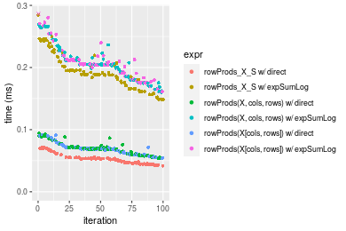

[matrixStats]: Benchmark report

---------------------------------------


# colProds() and rowProds() benchmarks on subsetted computation

This report benchmark the performance of colProds() and rowProds() on subsetted computation.


## Data
```r
> rmatrix <- function(nrow, ncol, mode = c("logical", "double", "integer", "index"), range = c(-100, 
+     +100), na_prob = 0) {
+     mode <- match.arg(mode)
+     n <- nrow * ncol
+     if (mode == "logical") {
+         x <- sample(c(FALSE, TRUE), size = n, replace = TRUE)
+     }     else if (mode == "index") {
+         x <- seq_len(n)
+         mode <- "integer"
+     }     else {
+         x <- runif(n, min = range[1], max = range[2])
+     }
+     storage.mode(x) <- mode
+     if (na_prob > 0) 
+         x[sample(n, size = na_prob * n)] <- NA
+     dim(x) <- c(nrow, ncol)
+     x
+ }
> rmatrices <- function(scale = 10, seed = 1, ...) {
+     set.seed(seed)
+     data <- list()
+     data[[1]] <- rmatrix(nrow = scale * 1, ncol = scale * 1, ...)
+     data[[2]] <- rmatrix(nrow = scale * 10, ncol = scale * 10, ...)
+     data[[3]] <- rmatrix(nrow = scale * 100, ncol = scale * 1, ...)
+     data[[4]] <- t(data[[3]])
+     data[[5]] <- rmatrix(nrow = scale * 10, ncol = scale * 100, ...)
+     data[[6]] <- t(data[[5]])
+     names(data) <- sapply(data, FUN = function(x) paste(dim(x), collapse = "x"))
+     data
+ }
> data <- rmatrices(mode = "double")
```

## Results

### 10x10 matrix


```r
> X <- data[["10x10"]]
> rows <- sample.int(nrow(X), size = nrow(X) * 0.7)
> cols <- sample.int(ncol(X), size = ncol(X) * 0.7)
> X_S <- X[rows, cols]
> colStats <- microbenchmark(`colProds_X_S w/ direct` = colProds(X_S, method = "direct", na.rm = FALSE), 
+     `colProds_X_S w/ expSumLog` = colProds(X_S, method = "expSumLog", na.rm = FALSE), `colProds(X, rows, cols) w/ direct` = colProds(X, 
+         rows = rows, cols = cols, method = "direct", na.rm = FALSE), `colProds(X, rows, cols) w/ expSumLog` = colProds(X, 
+         rows = rows, cols = cols, method = "expSumLog", na.rm = FALSE), `colProds(X[rows, cols]) w/ direct` = colProds(X[rows, 
+         cols], method = "direct", na.rm = FALSE), `colProds(X[rows, cols]) w/ expSumLog` = colProds(X[rows, 
+         cols], method = "expSumLog", na.rm = FALSE), unit = "ms")
> X <- t(X)
> X_S <- t(X_S)
> rowStats <- microbenchmark(`rowProds_X_S w/ direct` = rowProds(X_S, method = "direct", na.rm = FALSE), 
+     `rowProds_X_S w/ expSumLog` = rowProds(X_S, method = "expSumLog", na.rm = FALSE), `rowProds(X, cols, rows) w/ direct` = rowProds(X, 
+         rows = cols, cols = rows, method = "direct", na.rm = FALSE), `rowProds(X, cols, rows) w/ expSumLog` = rowProds(X, 
+         rows = cols, cols = rows, method = "expSumLog", na.rm = FALSE), `rowProds(X[cols, rows]) w/ direct` = rowProds(X[cols, 
+         rows], method = "direct", na.rm = FALSE), `rowProds(X[cols, rows]) w/ expSumLog` = rowProds(X[cols, 
+         rows], method = "expSumLog", na.rm = FALSE), unit = "ms")
```

_Table: Benchmarking of colProds_X_S w/ direct(), colProds_X_S w/ expSumLog(), colProds(X, rows, cols) w/ direct(), colProds(X, rows, cols) w/ expSumLog(), colProds(X[rows, cols]) w/ direct() and colProds(X[rows, cols]) w/ expSumLog() on 10x10 data. The top panel shows times in milliseconds and the bottom panel shows relative times._


|   |expr                                 |      min|        lq|      mean|    median|        uq|      max|
|:--|:------------------------------------|--------:|---------:|---------:|---------:|---------:|--------:|
|1  |colProds_X_S w/ direct               | 0.013104| 0.0134945| 0.0140341| 0.0137760| 0.0140640| 0.030411|
|3  |colProds(X, rows, cols) w/ direct    | 0.014451| 0.0149205| 0.0153308| 0.0151895| 0.0154840| 0.022014|
|5  |colProds(X[rows, cols]) w/ direct    | 0.014543| 0.0150400| 0.0179708| 0.0152405| 0.0155285| 0.256450|
|2  |colProds_X_S w/ expSumLog            | 0.020571| 0.0210500| 0.0216345| 0.0213085| 0.0217850| 0.036162|
|4  |colProds(X, rows, cols) w/ expSumLog | 0.021690| 0.0224525| 0.0228605| 0.0226650| 0.0229620| 0.034539|
|6  |colProds(X[rows, cols]) w/ expSumLog | 0.022037| 0.0225500| 0.0239190| 0.0227200| 0.0231395| 0.077964|


|   |expr                                 |      min|       lq|     mean|   median|       uq|       max|
|:--|:------------------------------------|--------:|--------:|--------:|--------:|--------:|---------:|
|1  |colProds_X_S w/ direct               | 1.000000| 1.000000| 1.000000| 1.000000| 1.000000| 1.0000000|
|3  |colProds(X, rows, cols) w/ direct    | 1.102793| 1.105673| 1.092397| 1.102606| 1.100967| 0.7238828|
|5  |colProds(X[rows, cols]) w/ direct    | 1.109814| 1.114528| 1.280507| 1.106308| 1.104131| 8.4328039|
|2  |colProds_X_S w/ expSumLog            | 1.569826| 1.559895| 1.541564| 1.546784| 1.548990| 1.1891092|
|4  |colProds(X, rows, cols) w/ expSumLog | 1.655220| 1.663826| 1.628918| 1.645253| 1.632679| 1.1357404|
|6  |colProds(X[rows, cols]) w/ expSumLog | 1.681700| 1.671051| 1.704344| 1.649245| 1.645300| 2.5636776|

_Table: Benchmarking of rowProds_X_S w/ direct(), rowProds_X_S w/ expSumLog(), rowProds(X, cols, rows) w/ direct(), rowProds(X, cols, rows) w/ expSumLog(), rowProds(X[cols, rows]) w/ direct() and rowProds(X[cols, rows]) w/ expSumLog() on 10x10 data (transposed). The top panel shows times in milliseconds and the bottom panel shows relative times._


|   |expr                                 |      min|        lq|      mean|    median|        uq|      max|
|:--|:------------------------------------|--------:|---------:|---------:|---------:|---------:|--------:|
|1  |rowProds_X_S w/ direct               | 0.013297| 0.0136985| 0.0141482| 0.0140395| 0.0144565| 0.016972|
|3  |rowProds(X, cols, rows) w/ direct    | 0.014541| 0.0152750| 0.0159843| 0.0155035| 0.0160040| 0.030366|
|5  |rowProds(X[cols, rows]) w/ direct    | 0.014723| 0.0152890| 0.0157780| 0.0155515| 0.0158600| 0.025774|
|2  |rowProds_X_S w/ expSumLog            | 0.020789| 0.0214310| 0.0220587| 0.0217115| 0.0221525| 0.046059|
|6  |rowProds(X[cols, rows]) w/ expSumLog | 0.022018| 0.0227455| 0.0234463| 0.0230640| 0.0235200| 0.038802|
|4  |rowProds(X, cols, rows) w/ expSumLog | 0.022227| 0.0227205| 0.0259758| 0.0230840| 0.0235160| 0.290159|


|   |expr                                 |      min|       lq|     mean|   median|       uq|       max|
|:--|:------------------------------------|--------:|--------:|--------:|--------:|--------:|---------:|
|1  |rowProds_X_S w/ direct               | 1.000000| 1.000000| 1.000000| 1.000000| 1.000000|  1.000000|
|3  |rowProds(X, cols, rows) w/ direct    | 1.093555| 1.115086| 1.129781| 1.104277| 1.107045|  1.789182|
|5  |rowProds(X[cols, rows]) w/ direct    | 1.107242| 1.116108| 1.115198| 1.107696| 1.097084|  1.518619|
|2  |rowProds_X_S w/ expSumLog            | 1.563435| 1.564478| 1.559125| 1.546458| 1.532356|  2.713823|
|6  |rowProds(X[cols, rows]) w/ expSumLog | 1.655862| 1.660437| 1.657196| 1.642794| 1.626950|  2.286236|
|4  |rowProds(X, cols, rows) w/ expSumLog | 1.671580| 1.658612| 1.835986| 1.644218| 1.626673| 17.096335|

_Figure: Benchmarking of colProds_X_S w/ direct(), colProds_X_S w/ expSumLog(), colProds(X, rows, cols) w/ direct(), colProds(X, rows, cols) w/ expSumLog(), colProds(X[rows, cols]) w/ direct() and colProds(X[rows, cols]) w/ expSumLog() on 10x10 data  as well as rowProds_X_S w/ direct(), rowProds_X_S w/ expSumLog(), rowProds(X, cols, rows) w/ direct(), rowProds(X, cols, rows) w/ expSumLog(), rowProds(X[cols, rows]) w/ direct() and rowProds(X[cols, rows]) w/ expSumLog() on the same data transposed.  Outliers are displayed as crosses.  Times are in milliseconds._


_Table: Benchmarking of colProds_X_S w/ direct() and rowProds_X_S w/ direct() on 10x10 data (original and transposed).  The top panel shows times in milliseconds and the bottom panel shows relative times._


|   |expr                   |    min|      lq|     mean|  median|      uq|    max|
|:--|:----------------------|------:|-------:|--------:|-------:|-------:|------:|
|1  |colProds_X_S w/ direct | 13.104| 13.4945| 14.03414| 13.7760| 14.0640| 30.411|
|2  |rowProds_X_S w/ direct | 13.297| 13.6985| 14.14816| 14.0395| 14.4565| 16.972|


|   |expr                   |      min|       lq|     mean|   median|       uq|       max|
|:--|:----------------------|--------:|--------:|--------:|--------:|--------:|---------:|
|1  |colProds_X_S w/ direct | 1.000000| 1.000000| 1.000000| 1.000000| 1.000000| 1.0000000|
|2  |rowProds_X_S w/ direct | 1.014728| 1.015117| 1.008125| 1.019127| 1.027908| 0.5580875|

_Figure: Benchmarking of colProds_X_S w/ direct() and rowProds_X_S w/ direct() on 10x10 data (original and transposed).  Outliers are displayed as crosses. Times are in milliseconds._


### 100x100 matrix


```r
> X <- data[["100x100"]]
> rows <- sample.int(nrow(X), size = nrow(X) * 0.7)
> cols <- sample.int(ncol(X), size = ncol(X) * 0.7)
> X_S <- X[rows, cols]
> colStats <- microbenchmark(`colProds_X_S w/ direct` = colProds(X_S, method = "direct", na.rm = FALSE), 
+     `colProds_X_S w/ expSumLog` = colProds(X_S, method = "expSumLog", na.rm = FALSE), `colProds(X, rows, cols) w/ direct` = colProds(X, 
+         rows = rows, cols = cols, method = "direct", na.rm = FALSE), `colProds(X, rows, cols) w/ expSumLog` = colProds(X, 
+         rows = rows, cols = cols, method = "expSumLog", na.rm = FALSE), `colProds(X[rows, cols]) w/ direct` = colProds(X[rows, 
+         cols], method = "direct", na.rm = FALSE), `colProds(X[rows, cols]) w/ expSumLog` = colProds(X[rows, 
+         cols], method = "expSumLog", na.rm = FALSE), unit = "ms")
> X <- t(X)
> X_S <- t(X_S)
> rowStats <- microbenchmark(`rowProds_X_S w/ direct` = rowProds(X_S, method = "direct", na.rm = FALSE), 
+     `rowProds_X_S w/ expSumLog` = rowProds(X_S, method = "expSumLog", na.rm = FALSE), `rowProds(X, cols, rows) w/ direct` = rowProds(X, 
+         rows = cols, cols = rows, method = "direct", na.rm = FALSE), `rowProds(X, cols, rows) w/ expSumLog` = rowProds(X, 
+         rows = cols, cols = rows, method = "expSumLog", na.rm = FALSE), `rowProds(X[cols, rows]) w/ direct` = rowProds(X[cols, 
+         rows], method = "direct", na.rm = FALSE), `rowProds(X[cols, rows]) w/ expSumLog` = rowProds(X[cols, 
+         rows], method = "expSumLog", na.rm = FALSE), unit = "ms")
```

_Table: Benchmarking of colProds_X_S w/ direct(), colProds_X_S w/ expSumLog(), colProds(X, rows, cols) w/ direct(), colProds(X, rows, cols) w/ expSumLog(), colProds(X[rows, cols]) w/ direct() and colProds(X[rows, cols]) w/ expSumLog() on 100x100 data. The top panel shows times in milliseconds and the bottom panel shows relative times._


|   |expr                                 |      min|        lq|      mean|    median|        uq|      max|
|:--|:------------------------------------|--------:|---------:|---------:|---------:|---------:|--------:|
|1  |colProds_X_S w/ direct               | 0.073709| 0.0749175| 0.0905664| 0.0809315| 0.0977605| 0.200449|
|3  |colProds(X, rows, cols) w/ direct    | 0.083946| 0.0864785| 0.1019647| 0.0934380| 0.1096635| 0.172019|
|5  |colProds(X[rows, cols]) w/ direct    | 0.084412| 0.0861960| 0.1026389| 0.0947585| 0.1104975| 0.189805|
|2  |colProds_X_S w/ expSumLog            | 0.220354| 0.2223560| 0.2641322| 0.2398320| 0.2857195| 0.428113|
|6  |colProds(X[rows, cols]) w/ expSumLog | 0.230429| 0.2335475| 0.2738112| 0.2508620| 0.2991160| 0.402502|
|4  |colProds(X, rows, cols) w/ expSumLog | 0.231497| 0.2343245| 0.2724815| 0.2576330| 0.2907995| 0.420745|


|   |expr                                 |      min|       lq|     mean|   median|       uq|       max|
|:--|:------------------------------------|--------:|--------:|--------:|--------:|--------:|---------:|
|1  |colProds_X_S w/ direct               | 1.000000| 1.000000| 1.000000| 1.000000| 1.000000| 1.0000000|
|3  |colProds(X, rows, cols) w/ direct    | 1.138884| 1.154316| 1.125855| 1.154532| 1.121757| 0.8581684|
|5  |colProds(X[rows, cols]) w/ direct    | 1.145206| 1.150546| 1.133299| 1.170848| 1.130288| 0.9468992|
|2  |colProds_X_S w/ expSumLog            | 2.989513| 2.968011| 2.916447| 2.963395| 2.922648| 2.1357702|
|6  |colProds(X[rows, cols]) w/ expSumLog | 3.126199| 3.117396| 3.023318| 3.099683| 3.059682| 2.0080020|
|4  |colProds(X, rows, cols) w/ expSumLog | 3.140688| 3.127767| 3.008636| 3.183346| 2.974611| 2.0990127|

_Table: Benchmarking of rowProds_X_S w/ direct(), rowProds_X_S w/ expSumLog(), rowProds(X, cols, rows) w/ direct(), rowProds(X, cols, rows) w/ expSumLog(), rowProds(X[cols, rows]) w/ direct() and rowProds(X[cols, rows]) w/ expSumLog() on 100x100 data (transposed). The top panel shows times in milliseconds and the bottom panel shows relative times._


|   |expr                                 |      min|        lq|      mean|    median|        uq|      max|
|:--|:------------------------------------|--------:|---------:|---------:|---------:|---------:|--------:|
|1  |rowProds_X_S w/ direct               | 0.085764| 0.0880185| 0.1047172| 0.1042270| 0.1113325| 0.158051|
|5  |rowProds(X[cols, rows]) w/ direct    | 0.096795| 0.0980180| 0.1143780| 0.1058170| 0.1240545| 0.191773|
|3  |rowProds(X, cols, rows) w/ direct    | 0.096302| 0.0986680| 0.1129483| 0.1094275| 0.1206955| 0.207510|
|6  |rowProds(X[cols, rows]) w/ expSumLog | 0.242107| 0.2439025| 0.2871896| 0.2593440| 0.3062615| 0.826660|
|2  |rowProds_X_S w/ expSumLog            | 0.231956| 0.2341890| 0.2838343| 0.2658600| 0.3061985| 0.720162|
|4  |rowProds(X, cols, rows) w/ expSumLog | 0.240587| 0.2451280| 0.2930772| 0.2885740| 0.3132735| 0.456473|


|   |expr                                 |      min|       lq|     mean|   median|       uq|      max|
|:--|:------------------------------------|--------:|--------:|--------:|--------:|--------:|--------:|
|1  |rowProds_X_S w/ direct               | 1.000000| 1.000000| 1.000000| 1.000000| 1.000000| 1.000000|
|5  |rowProds(X[cols, rows]) w/ direct    | 1.128620| 1.113607| 1.092256| 1.015255| 1.114270| 1.213361|
|3  |rowProds(X, cols, rows) w/ direct    | 1.122872| 1.120992| 1.078603| 1.049896| 1.084099| 1.312931|
|6  |rowProds(X[cols, rows]) w/ expSumLog | 2.822944| 2.771037| 2.742526| 2.488261| 2.750872| 5.230337|
|2  |rowProds_X_S w/ expSumLog            | 2.704585| 2.660679| 2.710485| 2.550779| 2.750307| 4.556517|
|4  |rowProds(X, cols, rows) w/ expSumLog | 2.805221| 2.784960| 2.798750| 2.768707| 2.813855| 2.888137|

_Figure: Benchmarking of colProds_X_S w/ direct(), colProds_X_S w/ expSumLog(), colProds(X, rows, cols) w/ direct(), colProds(X, rows, cols) w/ expSumLog(), colProds(X[rows, cols]) w/ direct() and colProds(X[rows, cols]) w/ expSumLog() on 100x100 data  as well as rowProds_X_S w/ direct(), rowProds_X_S w/ expSumLog(), rowProds(X, cols, rows) w/ direct(), rowProds(X, cols, rows) w/ expSumLog(), rowProds(X[cols, rows]) w/ direct() and rowProds(X[cols, rows]) w/ expSumLog() on the same data transposed.  Outliers are displayed as crosses.  Times are in milliseconds._


_Table: Benchmarking of colProds_X_S w/ direct() and rowProds_X_S w/ direct() on 100x100 data (original and transposed).  The top panel shows times in milliseconds and the bottom panel shows relative times._


|   |expr                   |    min|      lq|      mean|   median|       uq|     max|
|:--|:----------------------|------:|-------:|---------:|--------:|--------:|-------:|
|1  |colProds_X_S w/ direct | 73.709| 74.9175|  90.56644|  80.9315|  97.7605| 200.449|
|2  |rowProds_X_S w/ direct | 85.764| 88.0185| 104.71719| 104.2270| 111.3325| 158.051|


|   |expr                   |      min|       lq|     mean|   median|       uq|       max|
|:--|:----------------------|--------:|--------:|--------:|--------:|--------:|---------:|
|1  |colProds_X_S w/ direct | 1.000000| 1.000000| 1.000000| 1.000000| 1.000000| 1.0000000|
|2  |rowProds_X_S w/ direct | 1.163549| 1.174872| 1.156247| 1.287842| 1.138829| 0.7884849|

_Figure: Benchmarking of colProds_X_S w/ direct() and rowProds_X_S w/ direct() on 100x100 data (original and transposed).  Outliers are displayed as crosses. Times are in milliseconds._


### 1000x10 matrix


```r
> X <- data[["1000x10"]]
> rows <- sample.int(nrow(X), size = nrow(X) * 0.7)
> cols <- sample.int(ncol(X), size = ncol(X) * 0.7)
> X_S <- X[rows, cols]
> colStats <- microbenchmark(`colProds_X_S w/ direct` = colProds(X_S, method = "direct", na.rm = FALSE), 
+     `colProds_X_S w/ expSumLog` = colProds(X_S, method = "expSumLog", na.rm = FALSE), `colProds(X, rows, cols) w/ direct` = colProds(X, 
+         rows = rows, cols = cols, method = "direct", na.rm = FALSE), `colProds(X, rows, cols) w/ expSumLog` = colProds(X, 
+         rows = rows, cols = cols, method = "expSumLog", na.rm = FALSE), `colProds(X[rows, cols]) w/ direct` = colProds(X[rows, 
+         cols], method = "direct", na.rm = FALSE), `colProds(X[rows, cols]) w/ expSumLog` = colProds(X[rows, 
+         cols], method = "expSumLog", na.rm = FALSE), unit = "ms")
> X <- t(X)
> X_S <- t(X_S)
> rowStats <- microbenchmark(`rowProds_X_S w/ direct` = rowProds(X_S, method = "direct", na.rm = FALSE), 
+     `rowProds_X_S w/ expSumLog` = rowProds(X_S, method = "expSumLog", na.rm = FALSE), `rowProds(X, cols, rows) w/ direct` = rowProds(X, 
+         rows = cols, cols = rows, method = "direct", na.rm = FALSE), `rowProds(X, cols, rows) w/ expSumLog` = rowProds(X, 
+         rows = cols, cols = rows, method = "expSumLog", na.rm = FALSE), `rowProds(X[cols, rows]) w/ direct` = rowProds(X[cols, 
+         rows], method = "direct", na.rm = FALSE), `rowProds(X[cols, rows]) w/ expSumLog` = rowProds(X[cols, 
+         rows], method = "expSumLog", na.rm = FALSE), unit = "ms")
```

_Table: Benchmarking of colProds_X_S w/ direct(), colProds_X_S w/ expSumLog(), colProds(X, rows, cols) w/ direct(), colProds(X, rows, cols) w/ expSumLog(), colProds(X[rows, cols]) w/ direct() and colProds(X[rows, cols]) w/ expSumLog() on 1000x10 data. The top panel shows times in milliseconds and the bottom panel shows relative times._


|   |expr                                 |      min|        lq|      mean|    median|        uq|      max|
|:--|:------------------------------------|--------:|---------:|---------:|---------:|---------:|--------:|
|1  |colProds_X_S w/ direct               | 0.030052| 0.0340035| 0.0390363| 0.0376965| 0.0416195| 0.059581|
|5  |colProds(X[rows, cols]) w/ direct    | 0.042652| 0.0467585| 0.0543521| 0.0518050| 0.0613195| 0.090626|
|3  |colProds(X, rows, cols) w/ direct    | 0.042472| 0.0467015| 0.0546875| 0.0526190| 0.0611205| 0.086783|
|2  |colProds_X_S w/ expSumLog            | 0.148410| 0.1601030| 0.1790544| 0.1712910| 0.1900625| 0.301234|
|6  |colProds(X[rows, cols]) w/ expSumLog | 0.160447| 0.1735535| 0.1978269| 0.1889030| 0.2119135| 0.332199|
|4  |colProds(X, rows, cols) w/ expSumLog | 0.161044| 0.1750000| 0.1971329| 0.1917990| 0.2140610| 0.286676|


|   |expr                                 |      min|       lq|     mean|   median|       uq|      max|
|:--|:------------------------------------|--------:|--------:|--------:|--------:|--------:|--------:|
|1  |colProds_X_S w/ direct               | 1.000000| 1.000000| 1.000000| 1.000000| 1.000000| 1.000000|
|5  |colProds(X[rows, cols]) w/ direct    | 1.419273| 1.375108| 1.392346| 1.374265| 1.473336| 1.521055|
|3  |colProds(X, rows, cols) w/ direct    | 1.413284| 1.373432| 1.400938| 1.395859| 1.468554| 1.456555|
|2  |colProds_X_S w/ expSumLog            | 4.938440| 4.708427| 4.586869| 4.543950| 4.566669| 5.055873|
|6  |colProds(X[rows, cols]) w/ expSumLog | 5.338979| 5.103989| 5.067766| 5.011155| 5.091688| 5.575586|
|4  |colProds(X, rows, cols) w/ expSumLog | 5.358845| 5.146529| 5.049988| 5.087979| 5.143286| 4.811534|

_Table: Benchmarking of rowProds_X_S w/ direct(), rowProds_X_S w/ expSumLog(), rowProds(X, cols, rows) w/ direct(), rowProds(X, cols, rows) w/ expSumLog(), rowProds(X[cols, rows]) w/ direct() and rowProds(X[cols, rows]) w/ expSumLog() on 1000x10 data (transposed). The top panel shows times in milliseconds and the bottom panel shows relative times._


|   |expr                                 |      min|        lq|      mean|    median|        uq|      max|
|:--|:------------------------------------|--------:|---------:|---------:|---------:|---------:|--------:|
|1  |rowProds_X_S w/ direct               | 0.041595| 0.0454475| 0.0525412| 0.0525010| 0.0550535| 0.071829|
|5  |rowProds(X[cols, rows]) w/ direct    | 0.053410| 0.0611800| 0.0688919| 0.0690400| 0.0718465| 0.092042|
|3  |rowProds(X, cols, rows) w/ direct    | 0.053330| 0.0643215| 0.0701024| 0.0696200| 0.0723155| 0.094215|
|2  |rowProds_X_S w/ expSumLog            | 0.148190| 0.1758040| 0.1940258| 0.1891415| 0.2081830| 0.284685|
|6  |rowProds(X[cols, rows]) w/ expSumLog | 0.161066| 0.1798505| 0.2034044| 0.2043790| 0.2124210| 0.287890|
|4  |rowProds(X, cols, rows) w/ expSumLog | 0.160327| 0.1801010| 0.2069060| 0.2047570| 0.2254720| 0.269866|


|   |expr                                 |      min|       lq|     mean|   median|       uq|      max|
|:--|:------------------------------------|--------:|--------:|--------:|--------:|--------:|--------:|
|1  |rowProds_X_S w/ direct               | 1.000000| 1.000000| 1.000000| 1.000000| 1.000000| 1.000000|
|5  |rowProds(X[cols, rows]) w/ direct    | 1.284049| 1.346169| 1.311198| 1.315023| 1.305031| 1.281404|
|3  |rowProds(X, cols, rows) w/ direct    | 1.282125| 1.415292| 1.334236| 1.326070| 1.313549| 1.311657|
|2  |rowProds_X_S w/ expSumLog            | 3.562688| 3.868288| 3.692829| 3.602627| 3.781467| 3.963371|
|6  |rowProds(X[cols, rows]) w/ expSumLog | 3.872244| 3.957324| 3.871329| 3.892859| 3.858447| 4.007991|
|4  |rowProds(X, cols, rows) w/ expSumLog | 3.854478| 3.962836| 3.937975| 3.900059| 4.095507| 3.757062|

_Figure: Benchmarking of colProds_X_S w/ direct(), colProds_X_S w/ expSumLog(), colProds(X, rows, cols) w/ direct(), colProds(X, rows, cols) w/ expSumLog(), colProds(X[rows, cols]) w/ direct() and colProds(X[rows, cols]) w/ expSumLog() on 1000x10 data  as well as rowProds_X_S w/ direct(), rowProds_X_S w/ expSumLog(), rowProds(X, cols, rows) w/ direct(), rowProds(X, cols, rows) w/ expSumLog(), rowProds(X[cols, rows]) w/ direct() and rowProds(X[cols, rows]) w/ expSumLog() on the same data transposed.  Outliers are displayed as crosses.  Times are in milliseconds._



_Table: Benchmarking of colProds_X_S w/ direct() and rowProds_X_S w/ direct() on 1000x10 data (original and transposed).  The top panel shows times in milliseconds and the bottom panel shows relative times._


|   |expr                   |    min|      lq|     mean|  median|      uq|    max|
|:--|:----------------------|------:|-------:|--------:|-------:|-------:|------:|
|1  |colProds_X_S w/ direct | 30.052| 34.0035| 39.03631| 37.6965| 41.6195| 59.581|
|2  |rowProds_X_S w/ direct | 41.595| 45.4475| 52.54123| 52.5010| 55.0535| 71.829|


|   |expr                   |      min|       lq|     mean|   median|       uq|      max|
|:--|:----------------------|--------:|--------:|--------:|--------:|--------:|--------:|
|1  |colProds_X_S w/ direct | 1.000000| 1.000000| 1.000000| 1.000000| 1.000000| 1.000000|
|2  |rowProds_X_S w/ direct | 1.384101| 1.336554| 1.345958| 1.392729| 1.322781| 1.205569|

_Figure: Benchmarking of colProds_X_S w/ direct() and rowProds_X_S w/ direct() on 1000x10 data (original and transposed).  Outliers are displayed as crosses. Times are in milliseconds._


### 10x1000 matrix


```r
> X <- data[["10x1000"]]
> rows <- sample.int(nrow(X), size = nrow(X) * 0.7)
> cols <- sample.int(ncol(X), size = ncol(X) * 0.7)
> X_S <- X[rows, cols]
> colStats <- microbenchmark(`colProds_X_S w/ direct` = colProds(X_S, method = "direct", na.rm = FALSE), 
+     `colProds_X_S w/ expSumLog` = colProds(X_S, method = "expSumLog", na.rm = FALSE), `colProds(X, rows, cols) w/ direct` = colProds(X, 
+         rows = rows, cols = cols, method = "direct", na.rm = FALSE), `colProds(X, rows, cols) w/ expSumLog` = colProds(X, 
+         rows = rows, cols = cols, method = "expSumLog", na.rm = FALSE), `colProds(X[rows, cols]) w/ direct` = colProds(X[rows, 
+         cols], method = "direct", na.rm = FALSE), `colProds(X[rows, cols]) w/ expSumLog` = colProds(X[rows, 
+         cols], method = "expSumLog", na.rm = FALSE), unit = "ms")
> X <- t(X)
> X_S <- t(X_S)
> rowStats <- microbenchmark(`rowProds_X_S w/ direct` = rowProds(X_S, method = "direct", na.rm = FALSE), 
+     `rowProds_X_S w/ expSumLog` = rowProds(X_S, method = "expSumLog", na.rm = FALSE), `rowProds(X, cols, rows) w/ direct` = rowProds(X, 
+         rows = cols, cols = rows, method = "direct", na.rm = FALSE), `rowProds(X, cols, rows) w/ expSumLog` = rowProds(X, 
+         rows = cols, cols = rows, method = "expSumLog", na.rm = FALSE), `rowProds(X[cols, rows]) w/ direct` = rowProds(X[cols, 
+         rows], method = "direct", na.rm = FALSE), `rowProds(X[cols, rows]) w/ expSumLog` = rowProds(X[cols, 
+         rows], method = "expSumLog", na.rm = FALSE), unit = "ms")
```

_Table: Benchmarking of colProds_X_S w/ direct(), colProds_X_S w/ expSumLog(), colProds(X, rows, cols) w/ direct(), colProds(X, rows, cols) w/ expSumLog(), colProds(X[rows, cols]) w/ direct() and colProds(X[rows, cols]) w/ expSumLog() on 10x1000 data. The top panel shows times in milliseconds and the bottom panel shows relative times._


|   |expr                                 |      min|        lq|      mean|    median|       uq|      max|
|:--|:------------------------------------|--------:|---------:|---------:|---------:|--------:|--------:|
|1  |colProds_X_S w/ direct               | 0.523648| 0.5356855| 0.5759407| 0.5537635| 0.587121| 0.875800|
|5  |colProds(X[rows, cols]) w/ direct    | 0.535452| 0.5474045| 0.5743448| 0.5597895| 0.585659| 0.784047|
|3  |colProds(X, rows, cols) w/ direct    | 0.534339| 0.5455865| 0.5873932| 0.5609605| 0.589269| 0.891698|
|2  |colProds_X_S w/ expSumLog            | 1.024895| 1.0426410| 1.1222524| 1.0650560| 1.158451| 1.669401|
|6  |colProds(X[rows, cols]) w/ expSumLog | 1.037188| 1.0502250| 1.1209347| 1.0700640| 1.135411| 1.583419|
|4  |colProds(X, rows, cols) w/ expSumLog | 1.032517| 1.0540280| 1.2408611| 1.0860820| 1.169466| 6.607324|


|   |expr                                 |      min|       lq|     mean|   median|        uq|       max|
|:--|:------------------------------------|--------:|--------:|--------:|--------:|---------:|---------:|
|1  |colProds_X_S w/ direct               | 1.000000| 1.000000| 1.000000| 1.000000| 1.0000000| 1.0000000|
|5  |colProds(X[rows, cols]) w/ direct    | 1.022542| 1.021877| 0.997229| 1.010882| 0.9975099| 0.8952352|
|3  |colProds(X, rows, cols) w/ direct    | 1.020416| 1.018483| 1.019885| 1.012997| 1.0036585| 1.0181525|
|2  |colProds_X_S w/ expSumLog            | 1.957221| 1.946368| 1.948555| 1.923305| 1.9731044| 1.9061441|
|6  |colProds(X[rows, cols]) w/ expSumLog | 1.980697| 1.960525| 1.946267| 1.932348| 1.9338620| 1.8079687|
|4  |colProds(X, rows, cols) w/ expSumLog | 1.971777| 1.967625| 2.154494| 1.961274| 1.9918645| 7.5443298|

_Table: Benchmarking of rowProds_X_S w/ direct(), rowProds_X_S w/ expSumLog(), rowProds(X, cols, rows) w/ direct(), rowProds(X, cols, rows) w/ expSumLog(), rowProds(X[cols, rows]) w/ direct() and rowProds(X[cols, rows]) w/ expSumLog() on 10x1000 data (transposed). The top panel shows times in milliseconds and the bottom panel shows relative times._


|   |expr                                 |      min|       lq|      mean|    median|       uq|      max|
|:--|:------------------------------------|--------:|--------:|---------:|---------:|--------:|--------:|
|1  |rowProds_X_S w/ direct               | 0.525206| 0.537019| 0.5949731| 0.5571330| 0.598142| 1.321915|
|3  |rowProds(X, cols, rows) w/ direct    | 0.538670| 0.548481| 0.6469377| 0.5689670| 0.599152| 5.934930|
|5  |rowProds(X[cols, rows]) w/ direct    | 0.536763| 0.549954| 0.6483152| 0.5736465| 0.600296| 5.872529|
|6  |rowProds(X[cols, rows]) w/ expSumLog | 1.036684| 1.057124| 1.1446338| 1.0820275| 1.148299| 2.715708|
|4  |rowProds(X, cols, rows) w/ expSumLog | 1.033060| 1.060096| 1.1304942| 1.0821795| 1.141911| 1.701270|
|2  |rowProds_X_S w/ expSumLog            | 1.024732| 1.051346| 1.1299487| 1.0837890| 1.145460| 1.937171|


|   |expr                                 |      min|       lq|     mean|   median|       uq|      max|
|:--|:------------------------------------|--------:|--------:|--------:|--------:|--------:|--------:|
|1  |rowProds_X_S w/ direct               | 1.000000| 1.000000| 1.000000| 1.000000| 1.000000| 1.000000|
|3  |rowProds(X, cols, rows) w/ direct    | 1.025636| 1.021344| 1.087339| 1.021241| 1.001689| 4.489646|
|5  |rowProds(X[cols, rows]) w/ direct    | 1.022005| 1.024087| 1.089655| 1.029640| 1.003601| 4.442441|
|6  |rowProds(X[cols, rows]) w/ expSumLog | 1.973862| 1.968504| 1.923841| 1.942135| 1.919777| 2.054374|
|4  |rowProds(X, cols, rows) w/ expSumLog | 1.966962| 1.974037| 1.900076| 1.942408| 1.909096| 1.286974|
|2  |rowProds_X_S w/ expSumLog            | 1.951105| 1.957744| 1.899159| 1.945297| 1.915031| 1.465428|

_Figure: Benchmarking of colProds_X_S w/ direct(), colProds_X_S w/ expSumLog(), colProds(X, rows, cols) w/ direct(), colProds(X, rows, cols) w/ expSumLog(), colProds(X[rows, cols]) w/ direct() and colProds(X[rows, cols]) w/ expSumLog() on 10x1000 data  as well as rowProds_X_S w/ direct(), rowProds_X_S w/ expSumLog(), rowProds(X, cols, rows) w/ direct(), rowProds(X, cols, rows) w/ expSumLog(), rowProds(X[cols, rows]) w/ direct() and rowProds(X[cols, rows]) w/ expSumLog() on the same data transposed.  Outliers are displayed as crosses.  Times are in milliseconds._


_Table: Benchmarking of colProds_X_S w/ direct() and rowProds_X_S w/ direct() on 10x1000 data (original and transposed).  The top panel shows times in milliseconds and the bottom panel shows relative times._


|   |expr                   |     min|       lq|     mean|   median|      uq|      max|
|:--|:----------------------|-------:|--------:|--------:|--------:|-------:|--------:|
|1  |colProds_X_S w/ direct | 523.648| 535.6855| 575.9407| 553.7635| 587.121|  875.800|
|2  |rowProds_X_S w/ direct | 525.206| 537.0190| 594.9731| 557.1330| 598.142| 1321.915|


|   |expr                   |      min|       lq|     mean|   median|       uq|     max|
|:--|:----------------------|--------:|--------:|--------:|--------:|--------:|-------:|
|1  |colProds_X_S w/ direct | 1.000000| 1.000000| 1.000000| 1.000000| 1.000000| 1.00000|
|2  |rowProds_X_S w/ direct | 1.002975| 1.002489| 1.033046| 1.006085| 1.018771| 1.50938|

_Figure: Benchmarking of colProds_X_S w/ direct() and rowProds_X_S w/ direct() on 10x1000 data (original and transposed).  Outliers are displayed as crosses. Times are in milliseconds._


### 100x1000 matrix


```r
> X <- data[["100x1000"]]
> rows <- sample.int(nrow(X), size = nrow(X) * 0.7)
> cols <- sample.int(ncol(X), size = ncol(X) * 0.7)
> X_S <- X[rows, cols]
> colStats <- microbenchmark(`colProds_X_S w/ direct` = colProds(X_S, method = "direct", na.rm = FALSE), 
+     `colProds_X_S w/ expSumLog` = colProds(X_S, method = "expSumLog", na.rm = FALSE), `colProds(X, rows, cols) w/ direct` = colProds(X, 
+         rows = rows, cols = cols, method = "direct", na.rm = FALSE), `colProds(X, rows, cols) w/ expSumLog` = colProds(X, 
+         rows = rows, cols = cols, method = "expSumLog", na.rm = FALSE), `colProds(X[rows, cols]) w/ direct` = colProds(X[rows, 
+         cols], method = "direct", na.rm = FALSE), `colProds(X[rows, cols]) w/ expSumLog` = colProds(X[rows, 
+         cols], method = "expSumLog", na.rm = FALSE), unit = "ms")
> X <- t(X)
> X_S <- t(X_S)
> rowStats <- microbenchmark(`rowProds_X_S w/ direct` = rowProds(X_S, method = "direct", na.rm = FALSE), 
+     `rowProds_X_S w/ expSumLog` = rowProds(X_S, method = "expSumLog", na.rm = FALSE), `rowProds(X, cols, rows) w/ direct` = rowProds(X, 
+         rows = cols, cols = rows, method = "direct", na.rm = FALSE), `rowProds(X, cols, rows) w/ expSumLog` = rowProds(X, 
+         rows = cols, cols = rows, method = "expSumLog", na.rm = FALSE), `rowProds(X[cols, rows]) w/ direct` = rowProds(X[cols, 
+         rows], method = "direct", na.rm = FALSE), `rowProds(X[cols, rows]) w/ expSumLog` = rowProds(X[cols, 
+         rows], method = "expSumLog", na.rm = FALSE), unit = "ms")
```

_Table: Benchmarking of colProds_X_S w/ direct(), colProds_X_S w/ expSumLog(), colProds(X, rows, cols) w/ direct(), colProds(X, rows, cols) w/ expSumLog(), colProds(X[rows, cols]) w/ direct() and colProds(X[rows, cols]) w/ expSumLog() on 100x1000 data. The top panel shows times in milliseconds and the bottom panel shows relative times._


|   |expr                                 |      min|        lq|      mean|    median|       uq|       max|
|:--|:------------------------------------|--------:|---------:|---------:|---------:|--------:|---------:|
|1  |colProds_X_S w/ direct               | 0.693250| 0.7210880| 1.0752459| 0.7540725| 0.861600| 24.251464|
|5  |colProds(X[rows, cols]) w/ direct    | 0.786981| 0.8192815| 0.9336942| 0.8533490| 0.962303|  2.250769|
|3  |colProds(X, rows, cols) w/ direct    | 0.796398| 0.8288000| 0.9344435| 0.8703645| 0.991692|  1.634443|
|2  |colProds_X_S w/ expSumLog            | 2.137575| 2.2014775| 2.4854195| 2.2775650| 2.559591|  5.828753|
|6  |colProds(X[rows, cols]) w/ expSumLog | 2.258601| 2.2933745| 2.5132972| 2.3563435| 2.601824|  5.138715|
|4  |colProds(X, rows, cols) w/ expSumLog | 2.254370| 2.3022690| 2.7948370| 2.3669620| 2.582371| 25.151733|


|   |expr                                 |      min|       lq|      mean|   median|       uq|       max|
|:--|:------------------------------------|--------:|--------:|---------:|--------:|--------:|---------:|
|1  |colProds_X_S w/ direct               | 1.000000| 1.000000| 1.0000000| 1.000000| 1.000000| 1.0000000|
|5  |colProds(X[rows, cols]) w/ direct    | 1.135205| 1.136174| 0.8683541| 1.131654| 1.116879| 0.0928096|
|3  |colProds(X, rows, cols) w/ direct    | 1.148789| 1.149374| 0.8690509| 1.154219| 1.150989| 0.0673956|
|2  |colProds_X_S w/ expSumLog            | 3.083411| 3.052994| 2.3114894| 3.020353| 2.970742| 0.2403464|
|6  |colProds(X[rows, cols]) w/ expSumLog | 3.257989| 3.180436| 2.3374163| 3.124824| 3.019758| 0.2118930|
|4  |colProds(X, rows, cols) w/ expSumLog | 3.251886| 3.192771| 2.5992538| 3.138905| 2.997180| 1.0371223|

_Table: Benchmarking of rowProds_X_S w/ direct(), rowProds_X_S w/ expSumLog(), rowProds(X, cols, rows) w/ direct(), rowProds(X, cols, rows) w/ expSumLog(), rowProds(X[cols, rows]) w/ direct() and rowProds(X[cols, rows]) w/ expSumLog() on 100x1000 data (transposed). The top panel shows times in milliseconds and the bottom panel shows relative times._


|   |expr                                 |      min|        lq|     mean|    median|       uq|       max|
|:--|:------------------------------------|--------:|---------:|--------:|---------:|--------:|---------:|
|1  |rowProds_X_S w/ direct               | 0.826818| 0.8845375| 1.008451| 0.9732775| 1.076523|  1.749637|
|5  |rowProds(X[cols, rows]) w/ direct    | 0.980743| 1.0651300| 1.194578| 1.1332255| 1.265120|  2.544259|
|3  |rowProds(X, cols, rows) w/ direct    | 0.996019| 1.0702235| 1.184752| 1.1399655| 1.265089|  1.923425|
|2  |rowProds_X_S w/ expSumLog            | 2.294785| 2.4054455| 2.691871| 2.5605495| 2.800074|  4.140237|
|4  |rowProds(X, cols, rows) w/ expSumLog | 2.469234| 2.5475565| 2.855325| 2.7065260| 3.093694|  4.504706|
|6  |rowProds(X[cols, rows]) w/ expSumLog | 2.457406| 2.5713975| 3.324232| 2.7079870| 2.940023| 27.454912|


|   |expr                                 |      min|       lq|     mean|   median|       uq|       max|
|:--|:------------------------------------|--------:|--------:|--------:|--------:|--------:|---------:|
|1  |rowProds_X_S w/ direct               | 1.000000| 1.000000| 1.000000| 1.000000| 1.000000|  1.000000|
|5  |rowProds(X[cols, rows]) w/ direct    | 1.186165| 1.204166| 1.184567| 1.164340| 1.175191|  1.454164|
|3  |rowProds(X, cols, rows) w/ direct    | 1.204641| 1.209924| 1.174823| 1.171265| 1.175163|  1.099328|
|2  |rowProds_X_S w/ expSumLog            | 2.775441| 2.719439| 2.669312| 2.630853| 2.601035|  2.366341|
|4  |rowProds(X, cols, rows) w/ expSumLog | 2.986430| 2.880100| 2.831397| 2.780837| 2.873784|  2.574652|
|6  |rowProds(X[cols, rows]) w/ expSumLog | 2.972125| 2.907053| 3.296374| 2.782338| 2.731036| 15.691776|

_Figure: Benchmarking of colProds_X_S w/ direct(), colProds_X_S w/ expSumLog(), colProds(X, rows, cols) w/ direct(), colProds(X, rows, cols) w/ expSumLog(), colProds(X[rows, cols]) w/ direct() and colProds(X[rows, cols]) w/ expSumLog() on 100x1000 data  as well as rowProds_X_S w/ direct(), rowProds_X_S w/ expSumLog(), rowProds(X, cols, rows) w/ direct(), rowProds(X, cols, rows) w/ expSumLog(), rowProds(X[cols, rows]) w/ direct() and rowProds(X[cols, rows]) w/ expSumLog() on the same data transposed.  Outliers are displayed as crosses.  Times are in milliseconds._


_Table: Benchmarking of colProds_X_S w/ direct() and rowProds_X_S w/ direct() on 100x1000 data (original and transposed).  The top panel shows times in milliseconds and the bottom panel shows relative times._


|   |expr                   |     min|       lq|     mean|   median|       uq|       max|
|:--|:----------------------|-------:|--------:|--------:|--------:|--------:|---------:|
|1  |colProds_X_S w/ direct | 693.250| 721.0880| 1075.246| 754.0725|  861.600| 24251.464|
|2  |rowProds_X_S w/ direct | 826.818| 884.5375| 1008.451| 973.2775| 1076.523|  1749.637|


|   |expr                   |      min|       lq|      mean|   median|       uq|       max|
|:--|:----------------------|--------:|--------:|---------:|--------:|--------:|---------:|
|1  |colProds_X_S w/ direct | 1.000000| 1.000000| 1.0000000| 1.000000| 1.000000| 1.0000000|
|2  |rowProds_X_S w/ direct | 1.192669| 1.226671| 0.9378796| 1.290695| 1.249446| 0.0721456|

_Figure: Benchmarking of colProds_X_S w/ direct() and rowProds_X_S w/ direct() on 100x1000 data (original and transposed).  Outliers are displayed as crosses. Times are in milliseconds._


### 1000x100 matrix


```r
> X <- data[["1000x100"]]
> rows <- sample.int(nrow(X), size = nrow(X) * 0.7)
> cols <- sample.int(ncol(X), size = ncol(X) * 0.7)
> X_S <- X[rows, cols]
> colStats <- microbenchmark(`colProds_X_S w/ direct` = colProds(X_S, method = "direct", na.rm = FALSE), 
+     `colProds_X_S w/ expSumLog` = colProds(X_S, method = "expSumLog", na.rm = FALSE), `colProds(X, rows, cols) w/ direct` = colProds(X, 
+         rows = rows, cols = cols, method = "direct", na.rm = FALSE), `colProds(X, rows, cols) w/ expSumLog` = colProds(X, 
+         rows = rows, cols = cols, method = "expSumLog", na.rm = FALSE), `colProds(X[rows, cols]) w/ direct` = colProds(X[rows, 
+         cols], method = "direct", na.rm = FALSE), `colProds(X[rows, cols]) w/ expSumLog` = colProds(X[rows, 
+         cols], method = "expSumLog", na.rm = FALSE), unit = "ms")
> X <- t(X)
> X_S <- t(X_S)
> rowStats <- microbenchmark(`rowProds_X_S w/ direct` = rowProds(X_S, method = "direct", na.rm = FALSE), 
+     `rowProds_X_S w/ expSumLog` = rowProds(X_S, method = "expSumLog", na.rm = FALSE), `rowProds(X, cols, rows) w/ direct` = rowProds(X, 
+         rows = cols, cols = rows, method = "direct", na.rm = FALSE), `rowProds(X, cols, rows) w/ expSumLog` = rowProds(X, 
+         rows = cols, cols = rows, method = "expSumLog", na.rm = FALSE), `rowProds(X[cols, rows]) w/ direct` = rowProds(X[cols, 
+         rows], method = "direct", na.rm = FALSE), `rowProds(X[cols, rows]) w/ expSumLog` = rowProds(X[cols, 
+         rows], method = "expSumLog", na.rm = FALSE), unit = "ms")
```

_Table: Benchmarking of colProds_X_S w/ direct(), colProds_X_S w/ expSumLog(), colProds(X, rows, cols) w/ direct(), colProds(X, rows, cols) w/ expSumLog(), colProds(X[rows, cols]) w/ direct() and colProds(X[rows, cols]) w/ expSumLog() on 1000x100 data. The top panel shows times in milliseconds and the bottom panel shows relative times._


|   |expr                                 |      min|        lq|      mean|    median|        uq|       max|
|:--|:------------------------------------|--------:|---------:|---------:|---------:|---------:|---------:|
|1  |colProds_X_S w/ direct               | 0.238667| 0.2472480| 0.2776331| 0.2557235| 0.2985885|  0.482010|
|5  |colProds(X[rows, cols]) w/ direct    | 0.335498| 0.3433565| 0.4005840| 0.3552270| 0.4297075|  0.723056|
|3  |colProds(X, rows, cols) w/ direct    | 0.335107| 0.3439390| 0.3864759| 0.3559160| 0.3932580|  0.688277|
|2  |colProds_X_S w/ expSumLog            | 1.307053| 1.3253225| 1.4385322| 1.3494585| 1.4848140|  2.302503|
|6  |colProds(X[rows, cols]) w/ expSumLog | 1.408062| 1.4204860| 1.7333478| 1.4364855| 1.6093775| 11.177601|
|4  |colProds(X, rows, cols) w/ expSumLog | 1.403216| 1.4319280| 1.6079715| 1.4876970| 1.7257095|  2.530356|


|   |expr                                 |      min|       lq|     mean|   median|       uq|       max|
|:--|:------------------------------------|--------:|--------:|--------:|--------:|--------:|---------:|
|1  |colProds_X_S w/ direct               | 1.000000| 1.000000| 1.000000| 1.000000| 1.000000|  1.000000|
|5  |colProds(X[rows, cols]) w/ direct    | 1.405716| 1.388713| 1.442854| 1.389106| 1.439129|  1.500085|
|3  |colProds(X, rows, cols) w/ direct    | 1.404078| 1.391069| 1.392038| 1.391800| 1.317057|  1.427931|
|2  |colProds_X_S w/ expSumLog            | 5.476471| 5.360296| 5.181414| 5.277022| 4.972777|  4.776878|
|6  |colProds(X[rows, cols]) w/ expSumLog | 5.899693| 5.745187| 6.243303| 5.617339| 5.389951| 23.189563|
|4  |colProds(X, rows, cols) w/ expSumLog | 5.879388| 5.791464| 5.791713| 5.817600| 5.779558|  5.249592|

_Table: Benchmarking of rowProds_X_S w/ direct(), rowProds_X_S w/ expSumLog(), rowProds(X, cols, rows) w/ direct(), rowProds(X, cols, rows) w/ expSumLog(), rowProds(X[cols, rows]) w/ direct() and rowProds(X[cols, rows]) w/ expSumLog() on 1000x100 data (transposed). The top panel shows times in milliseconds and the bottom panel shows relative times._


|   |expr                                 |      min|        lq|      mean|    median|        uq|       max|
|:--|:------------------------------------|--------:|---------:|---------:|---------:|---------:|---------:|
|1  |rowProds_X_S w/ direct               | 0.374254| 0.3786410| 0.4088243| 0.3835165| 0.4063745|  0.701556|
|5  |rowProds(X[cols, rows]) w/ direct    | 0.481832| 0.4918155| 0.5228188| 0.4981410| 0.5193815|  0.813087|
|3  |rowProds(X, cols, rows) w/ direct    | 0.484074| 0.4920385| 0.6275272| 0.5000475| 0.5806940|  8.926097|
|2  |rowProds_X_S w/ expSumLog            | 1.463210| 1.4706190| 1.6064194| 1.4935535| 1.6759630|  2.421766|
|6  |rowProds(X[cols, rows]) w/ expSumLog | 1.570197| 1.5803785| 1.7876741| 1.5888510| 1.7326515| 10.818760|
|4  |rowProds(X, cols, rows) w/ expSumLog | 1.567760| 1.5828360| 1.6866927| 1.6057930| 1.7217105|  2.216337|


|   |expr                                 |      min|       lq|     mean|   median|       uq|       max|
|:--|:------------------------------------|--------:|--------:|--------:|--------:|--------:|---------:|
|1  |rowProds_X_S w/ direct               | 1.000000| 1.000000| 1.000000| 1.000000| 1.000000|  1.000000|
|5  |rowProds(X[cols, rows]) w/ direct    | 1.287446| 1.298897| 1.278835| 1.298878| 1.278086|  1.158977|
|3  |rowProds(X, cols, rows) w/ direct    | 1.293437| 1.299486| 1.534956| 1.303849| 1.428963| 12.723285|
|2  |rowProds_X_S w/ expSumLog            | 3.909671| 3.883940| 3.929364| 3.894366| 4.124184|  3.451992|
|6  |rowProds(X[cols, rows]) w/ expSumLog | 4.195538| 4.173818| 4.372719| 4.142849| 4.263682| 15.421093|
|4  |rowProds(X, cols, rows) w/ expSumLog | 4.189027| 4.180308| 4.125715| 4.187024| 4.236758|  3.159173|

_Figure: Benchmarking of colProds_X_S w/ direct(), colProds_X_S w/ expSumLog(), colProds(X, rows, cols) w/ direct(), colProds(X, rows, cols) w/ expSumLog(), colProds(X[rows, cols]) w/ direct() and colProds(X[rows, cols]) w/ expSumLog() on 1000x100 data  as well as rowProds_X_S w/ direct(), rowProds_X_S w/ expSumLog(), rowProds(X, cols, rows) w/ direct(), rowProds(X, cols, rows) w/ expSumLog(), rowProds(X[cols, rows]) w/ direct() and rowProds(X[cols, rows]) w/ expSumLog() on the same data transposed.  Outliers are displayed as crosses.  Times are in milliseconds._


_Table: Benchmarking of colProds_X_S w/ direct() and rowProds_X_S w/ direct() on 1000x100 data (original and transposed).  The top panel shows times in milliseconds and the bottom panel shows relative times._


|   |expr                   |     min|      lq|     mean|   median|       uq|     max|
|:--|:----------------------|-------:|-------:|--------:|--------:|--------:|-------:|
|1  |colProds_X_S w/ direct | 238.667| 247.248| 277.6331| 255.7235| 298.5885| 482.010|
|2  |rowProds_X_S w/ direct | 374.254| 378.641| 408.8243| 383.5165| 406.3745| 701.556|


|   |expr                   |      min|       lq|     mean|   median|       uq|     max|
|:--|:----------------------|--------:|--------:|--------:|--------:|--------:|-------:|
|1  |colProds_X_S w/ direct | 1.000000| 1.000000| 1.000000| 1.000000| 1.000000| 1.00000|
|2  |rowProds_X_S w/ direct | 1.568101| 1.531422| 1.472534| 1.499731| 1.360985| 1.45548|

_Figure: Benchmarking of colProds_X_S w/ direct() and rowProds_X_S w/ direct() on 1000x100 data (original and transposed).  Outliers are displayed as crosses. Times are in milliseconds._


## Appendix

### Session information
```r
R version 4.1.1 Patched (2021-08-10 r80727)
Platform: x86_64-pc-linux-gnu (64-bit)
Running under: Ubuntu 18.04.5 LTS

Matrix products: default
BLAS:   /home/hb/software/R-devel/R-4-1-branch/lib/R/lib/libRblas.so
LAPACK: /home/hb/software/R-devel/R-4-1-branch/lib/R/lib/libRlapack.so

locale:
 [1] LC_CTYPE=en_US.UTF-8       LC_NUMERIC=C              
 [3] LC_TIME=en_US.UTF-8        LC_COLLATE=en_US.UTF-8    
 [5] LC_MONETARY=en_US.UTF-8    LC_MESSAGES=en_US.UTF-8   
 [7] LC_PAPER=en_US.UTF-8       LC_NAME=C                 
 [9] LC_ADDRESS=C               LC_TELEPHONE=C            
[11] LC_MEASUREMENT=en_US.UTF-8 LC_IDENTIFICATION=C       

attached base packages:
[1] stats     graphics  grDevices utils     datasets  methods   base     

other attached packages:
[1] microbenchmark_1.4-7   matrixStats_0.60.0     ggplot2_3.3.5         
[4] knitr_1.33             R.devices_2.17.0       R.utils_2.10.1        
[7] R.oo_1.24.0            R.methodsS3_1.8.1-9001 history_0.0.1-9000    

loaded via a namespace (and not attached):
 [1] Biobase_2.52.0          httr_1.4.2              splines_4.1.1          
 [4] bit64_4.0.5             network_1.17.1          assertthat_0.2.1       
 [7] highr_0.9               stats4_4.1.1            blob_1.2.2             
[10] GenomeInfoDbData_1.2.6  robustbase_0.93-8       pillar_1.6.2           
[13] RSQLite_2.2.8           lattice_0.20-44         glue_1.4.2             
[16] digest_0.6.27           XVector_0.32.0          colorspace_2.0-2       
[19] Matrix_1.3-4            XML_3.99-0.7            pkgconfig_2.0.3        
[22] zlibbioc_1.38.0         genefilter_1.74.0       purrr_0.3.4            
[25] ergm_4.1.2              xtable_1.8-4            scales_1.1.1           
[28] tibble_3.1.4            annotate_1.70.0         KEGGREST_1.32.0        
[31] farver_2.1.0            generics_0.1.0          IRanges_2.26.0         
[34] ellipsis_0.3.2          cachem_1.0.6            withr_2.4.2            
[37] BiocGenerics_0.38.0     mime_0.11               survival_3.2-13        
[40] magrittr_2.0.1          crayon_1.4.1            statnet.common_4.5.0   
[43] memoise_2.0.0           laeken_0.5.1            fansi_0.5.0            
[46] R.cache_0.15.0          MASS_7.3-54             R.rsp_0.44.0           
[49] progressr_0.8.0         tools_4.1.1             lifecycle_1.0.0        
[52] S4Vectors_0.30.0        trust_0.1-8             munsell_0.5.0          
[55] tabby_0.0.1-9001        AnnotationDbi_1.54.1    Biostrings_2.60.2      
[58] compiler_4.1.1          GenomeInfoDb_1.28.1     rlang_0.4.11           
[61] grid_4.1.1              RCurl_1.98-1.4          cwhmisc_6.6            
[64] rstudioapi_0.13         rappdirs_0.3.3          startup_0.15.0         
[67] labeling_0.4.2          bitops_1.0-7            base64enc_0.1-3        
[70] boot_1.3-28             gtable_0.3.0            DBI_1.1.1              
[73] markdown_1.1            R6_2.5.1                lpSolveAPI_5.5.2.0-17.7
[76] rle_0.9.2               dplyr_1.0.7             fastmap_1.1.0          
[79] bit_4.0.4               utf8_1.2.2              parallel_4.1.1         
[82] Rcpp_1.0.7              vctrs_0.3.8             png_0.1-7              
[85] DEoptimR_1.0-9          tidyselect_1.1.1        xfun_0.25              
[88] coda_0.19-4            
```
Total processing time was 17.82 secs.


### Reproducibility
To reproduce this report, do:
```r
html <- matrixStats:::benchmark('colRowProds_subset')
```

[RSP]: https://cran.r-project.org/package=R.rsp
[matrixStats]: https://cran.r-project.org/package=matrixStats

[StackOverflow:colMins?]: https://stackoverflow.com/questions/13676878 "Stack Overflow: fastest way to get Min from every column in a matrix?"
[StackOverflow:colSds?]: https://stackoverflow.com/questions/17549762 "Stack Overflow: Is there such 'colsd' in R?"
[StackOverflow:rowProds?]: https://stackoverflow.com/questions/20198801/ "Stack Overflow: Row product of matrix and column sum of matrix"

---------------------------------------
Copyright Dongcan Jiang. Last updated on 2021-08-25 22:24:46 (+0200 UTC). Powered by [RSP].

<script>
 var link = document.createElement('link');
 link.rel = 'icon';
 link.href = "data:image/png;base64,iVBORw0KGgoAAAANSUhEUgAAACAAAAAgCAMAAABEpIrGAAAA21BMVEUAAAAAAP8AAP8AAP8AAP8AAP8AAP8AAP8AAP8AAP8AAP8AAP8AAP8AAP8AAP8AAP8AAP8AAP8AAP8AAP8AAP8AAP8AAP8AAP8AAP8AAP8AAP8AAP8AAP8AAP8AAP8AAP8AAP8AAP8AAP8AAP8AAP8AAP8AAP8AAP8AAP8AAP8BAf4CAv0DA/wdHeIeHuEfH+AgIN8hId4lJdomJtknJ9g+PsE/P8BAQL9yco10dIt1dYp3d4h4eIeVlWqWlmmXl2iYmGeZmWabm2Tn5xjo6Bfp6Rb39wj4+Af//wA2M9hbAAAASXRSTlMAAQIJCgsMJSYnKD4/QGRlZmhpamtsbautrrCxuru8y8zN5ebn6Pn6+///////////////////////////////////////////LsUNcQAAAS9JREFUOI29k21XgkAQhVcFytdSMqMETU26UVqGmpaiFbL//xc1cAhhwVNf6n5i5z67M2dmYOyfJZUqlVLhkKucG7cgmUZTybDz6g0iDeq51PUr37Ds2cy2/C9NeES5puDjxuUk1xnToZsg8pfA3avHQ3lLIi7iWRrkv/OYtkScxBIMgDee0ALoyxHQBJ68JLCjOtQIMIANF7QG9G9fNnHvisCHBVMKgSJgiz7nE+AoBKrAPA3MgepvgR9TSCasrCKH0eB1wBGBFdCO+nAGjMVGPcQb5bd6mQRegN6+1axOs9nGfYcCtfi4NQosdtH7dB+txFIpXQqN1p9B/asRHToyS0jRgpV7nk4nwcq1BJ+x3Gl/v7S9Wmpp/aGquum7w3ZDyrADFYrl8vHBH+ev9AUASW1dmU4h4wAAAABJRU5ErkJggg=="
 document.getElementsByTagName('head')[0].appendChild(link);
</script>


