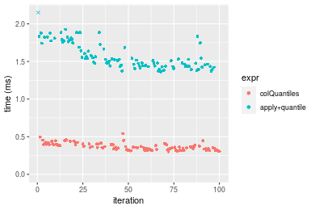
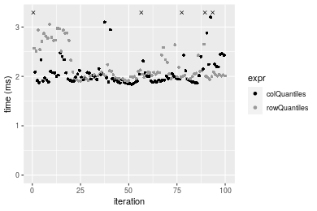
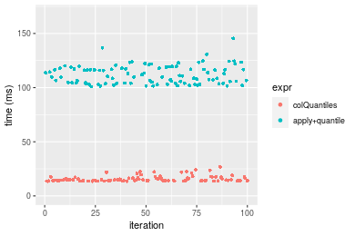
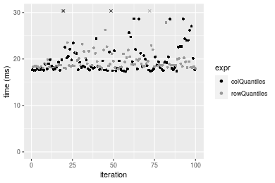
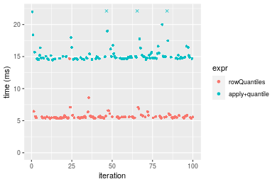

[matrixStats]: Benchmark report

---------------------------------------


# colQuantiles() and rowQuantiles() benchmarks

This report benchmark the performance of colQuantiles() and rowQuantiles() against alternative methods.

## Alternative methods

* apply() + quantile()


## Data
```r
> rmatrix <- function(nrow, ncol, mode = c("logical", "double", "integer", "index"), range = c(-100, 
+     +100), na_prob = 0) {
+     mode <- match.arg(mode)
+     n <- nrow * ncol
+     if (mode == "logical") {
+         x <- sample(c(FALSE, TRUE), size = n, replace = TRUE)
+     }     else if (mode == "index") {
+         x <- seq_len(n)
+         mode <- "integer"
+     }     else {
+         x <- runif(n, min = range[1], max = range[2])
+     }
+     storage.mode(x) <- mode
+     if (na_prob > 0) 
+         x[sample(n, size = na_prob * n)] <- NA
+     dim(x) <- c(nrow, ncol)
+     x
+ }
> rmatrices <- function(scale = 10, seed = 1, ...) {
+     set.seed(seed)
+     data <- list()
+     data[[1]] <- rmatrix(nrow = scale * 1, ncol = scale * 1, ...)
+     data[[2]] <- rmatrix(nrow = scale * 10, ncol = scale * 10, ...)
+     data[[3]] <- rmatrix(nrow = scale * 100, ncol = scale * 1, ...)
+     data[[4]] <- t(data[[3]])
+     data[[5]] <- rmatrix(nrow = scale * 10, ncol = scale * 100, ...)
+     data[[6]] <- t(data[[5]])
+     names(data) <- sapply(data, FUN = function(x) paste(dim(x), collapse = "x"))
+     data
+ }
> data <- rmatrices(mode = "double")
```

## Results

### 10x10 matrix


```r
> X <- data[["10x10"]]
> gc()
           used  (Mb) gc trigger  (Mb) max used  (Mb)
Ncells  5283699 282.2    7916910 422.9  7916910 422.9
Vcells 10537175  80.4   33191153 253.3 53339345 407.0
> probs <- seq(from = 0, to = 1, by = 0.25)
> colStats <- microbenchmark(colQuantiles = colQuantiles(X, probs = probs, na.rm = FALSE), `apply+quantile` = apply(X, 
+     MARGIN = 2L, FUN = quantile, probs = probs, na.rm = FALSE), unit = "ms")
> X <- t(X)
> gc()
           used  (Mb) gc trigger  (Mb) max used  (Mb)
Ncells  5283507 282.2    7916910 422.9  7916910 422.9
Vcells 10536953  80.4   33191153 253.3 53339345 407.0
> rowStats <- microbenchmark(rowQuantiles = rowQuantiles(X, probs = probs, na.rm = FALSE), `apply+quantile` = apply(X, 
+     MARGIN = 1L, FUN = quantile, probs = probs, na.rm = FALSE), unit = "ms")
```

_Table: Benchmarking of colQuantiles() and apply+quantile() on 10x10 data. The top panel shows times in milliseconds and the bottom panel shows relative times._


|   |expr           |      min|       lq|      mean|   median|        uq|      max|
|:--|:--------------|--------:|--------:|---------:|--------:|---------:|--------:|
|1  |colQuantiles   | 0.302906| 0.329424| 0.3677154| 0.359026| 0.3966375| 0.540448|
|2  |apply+quantile | 1.364473| 1.438469| 1.5741078| 1.511068| 1.7432090| 2.199361|


|   |expr           |      min|       lq|     mean|   median|       uq|      max|
|:--|:--------------|--------:|--------:|--------:|--------:|--------:|--------:|
|1  |colQuantiles   | 1.000000| 1.000000| 1.000000| 1.000000| 1.000000| 1.000000|
|2  |apply+quantile | 4.504609| 4.366619| 4.280778| 4.208797| 4.394968| 4.069515|

_Table: Benchmarking of rowQuantiles() and apply+quantile() on 10x10 data (transposed). The top panel shows times in milliseconds and the bottom panel shows relative times._


|   |expr           |      min|       lq|      mean|    median|        uq|      max|
|:--|:--------------|--------:|--------:|---------:|---------:|---------:|--------:|
|1  |rowQuantiles   | 0.239440| 0.258194| 0.3004935| 0.2638625| 0.3232105| 0.561646|
|2  |apply+quantile | 1.063889| 1.103623| 1.2585152| 1.1329855| 1.3459045| 2.063830|


|   |expr           |      min|       lq|     mean|   median|       uq|     max|
|:--|:--------------|--------:|--------:|--------:|--------:|--------:|-------:|
|1  |rowQuantiles   | 1.000000| 1.000000| 1.000000| 1.000000| 1.000000| 1.00000|
|2  |apply+quantile | 4.443238| 4.274394| 4.188162| 4.293848| 4.164173| 3.67461|

_Figure: Benchmarking of colQuantiles() and apply+quantile() on 10x10 data  as well as rowQuantiles() and apply+quantile() on the same data transposed.  Outliers are displayed as crosses.  Times are in milliseconds._





_Table: Benchmarking of colQuantiles() and rowQuantiles() on 10x10 data (original and transposed).  The top panel shows times in milliseconds and the bottom panel shows relative times._


|   |expr         |     min|      lq|     mean|   median|       uq|     max|
|:--|:------------|-------:|-------:|--------:|--------:|--------:|-------:|
|2  |rowQuantiles | 239.440| 258.194| 300.4935| 263.8625| 323.2105| 561.646|
|1  |colQuantiles | 302.906| 329.424| 367.7154| 359.0260| 396.6375| 540.448|


|   |expr         |     min|       lq|     mean|   median|      uq|       max|
|:--|:------------|-------:|--------:|--------:|--------:|-------:|---------:|
|2  |rowQuantiles | 1.00000| 1.000000| 1.000000| 1.000000| 1.00000| 1.0000000|
|1  |colQuantiles | 1.26506| 1.275878| 1.223705| 1.360656| 1.22718| 0.9622574|

_Figure: Benchmarking of colQuantiles() and rowQuantiles() on 10x10 data (original and transposed).  Outliers are displayed as crosses. Times are in milliseconds._


### 100x100 matrix


```r
> X <- data[["100x100"]]
> gc()
           used  (Mb) gc trigger  (Mb) max used  (Mb)
Ncells  5282073 282.1    7916910 422.9  7916910 422.9
Vcells 10153396  77.5   33191153 253.3 53339345 407.0
> probs <- seq(from = 0, to = 1, by = 0.25)
> colStats <- microbenchmark(colQuantiles = colQuantiles(X, probs = probs, na.rm = FALSE), `apply+quantile` = apply(X, 
+     MARGIN = 2L, FUN = quantile, probs = probs, na.rm = FALSE), unit = "ms")
> X <- t(X)
> gc()
           used  (Mb) gc trigger  (Mb) max used  (Mb)
Ncells  5282061 282.1    7916910 422.9  7916910 422.9
Vcells 10163429  77.6   33191153 253.3 53339345 407.0
> rowStats <- microbenchmark(rowQuantiles = rowQuantiles(X, probs = probs, na.rm = FALSE), `apply+quantile` = apply(X, 
+     MARGIN = 1L, FUN = quantile, probs = probs, na.rm = FALSE), unit = "ms")
```

_Table: Benchmarking of colQuantiles() and apply+quantile() on 100x100 data. The top panel shows times in milliseconds and the bottom panel shows relative times._


|   |expr           |       min|       lq|     mean|   median|       uq|      max|
|:--|:--------------|---------:|--------:|--------:|--------:|--------:|--------:|
|1  |colQuantiles   |  1.843692|  1.90874|  2.24609|  1.97988|  2.13335|   8.8629|
|2  |apply+quantile | 10.674418| 10.90321| 15.60727| 11.17651| 12.21271| 381.8870|


|   |expr           |      min|       lq|     mean|   median|       uq|      max|
|:--|:--------------|--------:|--------:|--------:|--------:|--------:|--------:|
|1  |colQuantiles   | 1.000000| 1.000000| 1.000000| 1.000000| 1.000000|  1.00000|
|2  |apply+quantile | 5.789697| 5.712257| 6.948642| 5.645043| 5.724664| 43.08827|

_Table: Benchmarking of rowQuantiles() and apply+quantile() on 100x100 data (transposed). The top panel shows times in milliseconds and the bottom panel shows relative times._


|   |expr           |       min|       lq|     mean|    median|        uq|       max|
|:--|:--------------|---------:|--------:|--------:|---------:|---------:|---------:|
|1  |rowQuantiles   |  1.901765|  1.98259|  2.19478|  2.039334|  2.332585|  3.054295|
|2  |apply+quantile | 10.722477| 11.10321| 12.93694| 11.629099| 14.161271| 24.969997|


|   |expr           |      min|       lq|     mean|   median|       uq|      max|
|:--|:--------------|--------:|--------:|--------:|--------:|--------:|--------:|
|1  |rowQuantiles   | 1.000000| 1.000000| 1.000000| 1.000000| 1.000000| 1.000000|
|2  |apply+quantile | 5.638171| 5.600357| 5.894414| 5.702402| 6.071062| 8.175372|

_Figure: Benchmarking of colQuantiles() and apply+quantile() on 100x100 data  as well as rowQuantiles() and apply+quantile() on the same data transposed.  Outliers are displayed as crosses.  Times are in milliseconds._


_Table: Benchmarking of colQuantiles() and rowQuantiles() on 100x100 data (original and transposed).  The top panel shows times in milliseconds and the bottom panel shows relative times._


|   |expr         |      min|      lq|    mean|   median|       uq|      max|
|:--|:------------|--------:|-------:|-------:|--------:|--------:|--------:|
|1  |colQuantiles | 1.843692| 1.90874| 2.24609| 1.979880| 2.133350| 8.862900|
|2  |rowQuantiles | 1.901765| 1.98259| 2.19478| 2.039334| 2.332585| 3.054295|


|   |expr         |      min|       lq|      mean|   median|       uq|       max|
|:--|:------------|--------:|--------:|---------:|--------:|--------:|---------:|
|1  |colQuantiles | 1.000000| 1.000000| 1.0000000| 1.000000| 1.000000| 1.0000000|
|2  |rowQuantiles | 1.031498| 1.038691| 0.9771561| 1.030029| 1.093391| 0.3446158|

_Figure: Benchmarking of colQuantiles() and rowQuantiles() on 100x100 data (original and transposed).  Outliers are displayed as crosses. Times are in milliseconds._




### 1000x10 matrix


```r
> X <- data[["1000x10"]]
> gc()
           used  (Mb) gc trigger  (Mb) max used  (Mb)
Ncells  5282815 282.2    7916910 422.9  7916910 422.9
Vcells 10156922  77.5   33191153 253.3 53339345 407.0
> probs <- seq(from = 0, to = 1, by = 0.25)
> colStats <- microbenchmark(colQuantiles = colQuantiles(X, probs = probs, na.rm = FALSE), `apply+quantile` = apply(X, 
+     MARGIN = 2L, FUN = quantile, probs = probs, na.rm = FALSE), unit = "ms")
> X <- t(X)
> gc()
           used  (Mb) gc trigger  (Mb) max used  (Mb)
Ncells  5282791 282.2    7916910 422.9  7916910 422.9
Vcells 10166935  77.6   33191153 253.3 53339345 407.0
> rowStats <- microbenchmark(rowQuantiles = rowQuantiles(X, probs = probs, na.rm = FALSE), `apply+quantile` = apply(X, 
+     MARGIN = 1L, FUN = quantile, probs = probs, na.rm = FALSE), unit = "ms")
```

_Table: Benchmarking of colQuantiles() and apply+quantile() on 1000x10 data. The top panel shows times in milliseconds and the bottom panel shows relative times._


|   |expr           |      min|        lq|     mean|    median|       uq|      max|
|:--|:--------------|--------:|---------:|--------:|---------:|--------:|--------:|
|1  |colQuantiles   | 0.590347| 0.6104945| 0.681985| 0.6246515| 0.678449| 1.248694|
|2  |apply+quantile | 1.476754| 1.5267405| 1.687743| 1.5651400| 1.762205| 2.788720|


|   |expr           |      min|       lq|     mean|   median|       uq|      max|
|:--|:--------------|--------:|--------:|--------:|--------:|--------:|--------:|
|1  |colQuantiles   | 1.000000| 1.000000| 1.000000| 1.000000| 1.000000| 1.000000|
|2  |apply+quantile | 2.501502| 2.500826| 2.474751| 2.505621| 2.597402| 2.233309|

_Table: Benchmarking of rowQuantiles() and apply+quantile() on 1000x10 data (transposed). The top panel shows times in milliseconds and the bottom panel shows relative times._


|   |expr           |      min|        lq|     mean|   median|       uq|      max|
|:--|:--------------|--------:|---------:|--------:|--------:|--------:|--------:|
|1  |rowQuantiles   | 0.626120| 0.6527315| 0.736542| 0.691613| 0.807727| 1.219093|
|2  |apply+quantile | 1.494004| 1.5361655| 1.707736| 1.597339| 1.789035| 2.667647|


|   |expr           |      min|       lq|     mean|   median|       uq|      max|
|:--|:--------------|--------:|--------:|--------:|--------:|--------:|--------:|
|1  |rowQuantiles   | 1.000000| 1.000000| 1.000000| 1.000000| 1.000000| 1.000000|
|2  |apply+quantile | 2.386131| 2.353442| 2.318586| 2.309586| 2.214901| 2.188223|

_Figure: Benchmarking of colQuantiles() and apply+quantile() on 1000x10 data  as well as rowQuantiles() and apply+quantile() on the same data transposed.  Outliers are displayed as crosses.  Times are in milliseconds._


_Table: Benchmarking of colQuantiles() and rowQuantiles() on 1000x10 data (original and transposed).  The top panel shows times in milliseconds and the bottom panel shows relative times._


|   |expr         |     min|       lq|    mean|   median|      uq|      max|
|:--|:------------|-------:|--------:|-------:|--------:|-------:|--------:|
|1  |colQuantiles | 590.347| 610.4945| 681.985| 624.6515| 678.449| 1248.694|
|2  |rowQuantiles | 626.120| 652.7315| 736.542| 691.6130| 807.727| 1219.093|


|   |expr         |      min|       lq|     mean|   median|       uq|       max|
|:--|:------------|--------:|--------:|--------:|--------:|--------:|---------:|
|1  |colQuantiles | 1.000000| 1.000000| 1.000000| 1.000000| 1.000000| 1.0000000|
|2  |rowQuantiles | 1.060597| 1.069185| 1.079997| 1.107198| 1.190549| 0.9762944|

_Figure: Benchmarking of colQuantiles() and rowQuantiles() on 1000x10 data (original and transposed).  Outliers are displayed as crosses. Times are in milliseconds._


### 10x1000 matrix


```r
> X <- data[["10x1000"]]
> gc()
           used  (Mb) gc trigger  (Mb) max used  (Mb)
Ncells  5282991 282.2    7916910 422.9  7916910 422.9
Vcells 10157622  77.5   33191153 253.3 53339345 407.0
> probs <- seq(from = 0, to = 1, by = 0.25)
> colStats <- microbenchmark(colQuantiles = colQuantiles(X, probs = probs, na.rm = FALSE), `apply+quantile` = apply(X, 
+     MARGIN = 2L, FUN = quantile, probs = probs, na.rm = FALSE), unit = "ms")
> X <- t(X)
> gc()
           used  (Mb) gc trigger  (Mb) max used  (Mb)
Ncells  5282979 282.2    7916910 422.9  7916910 422.9
Vcells 10167655  77.6   33191153 253.3 53339345 407.0
> rowStats <- microbenchmark(rowQuantiles = rowQuantiles(X, probs = probs, na.rm = FALSE), `apply+quantile` = apply(X, 
+     MARGIN = 1L, FUN = quantile, probs = probs, na.rm = FALSE), unit = "ms")
```

_Table: Benchmarking of colQuantiles() and apply+quantile() on 10x1000 data. The top panel shows times in milliseconds and the bottom panel shows relative times._


|   |expr           |       min|        lq|     mean|    median|        uq|      max|
|:--|:--------------|---------:|---------:|--------:|---------:|---------:|--------:|
|1  |colQuantiles   |  13.55287|  14.01786|  15.7543|  14.57951|  16.36505|  26.8499|
|2  |apply+quantile | 100.83011| 104.24423| 112.1036| 110.51778| 117.83936| 145.3915|


|   |expr           |     min|       lq|     mean|   median|       uq|      max|
|:--|:--------------|-------:|--------:|--------:|--------:|--------:|--------:|
|1  |colQuantiles   | 1.00000| 1.000000| 1.000000| 1.000000| 1.000000| 1.000000|
|2  |apply+quantile | 7.43976| 7.436527| 7.115746| 7.580347| 7.200672| 5.414975|

_Table: Benchmarking of rowQuantiles() and apply+quantile() on 10x1000 data (transposed). The top panel shows times in milliseconds and the bottom panel shows relative times._


|   |expr           |      min|        lq|      mean|    median|        uq|      max|
|:--|:--------------|--------:|---------:|---------:|---------:|---------:|--------:|
|1  |rowQuantiles   | 13.58450|  13.81358|  15.58997|  14.30125|  15.59021|  32.9124|
|2  |apply+quantile | 99.82761| 104.50799| 114.91728| 112.48729| 121.21521| 178.8486|


|   |expr           |     min|       lq|     mean|   median|       uq|     max|
|:--|:--------------|-------:|--------:|--------:|--------:|--------:|-------:|
|1  |rowQuantiles   | 1.00000| 1.000000| 1.000000| 1.000000| 1.000000| 1.00000|
|2  |apply+quantile | 7.34864| 7.565596| 7.371232| 7.865559| 7.775085| 5.43408|

_Figure: Benchmarking of colQuantiles() and apply+quantile() on 10x1000 data  as well as rowQuantiles() and apply+quantile() on the same data transposed.  Outliers are displayed as crosses.  Times are in milliseconds._





_Table: Benchmarking of colQuantiles() and rowQuantiles() on 10x1000 data (original and transposed).  The top panel shows times in milliseconds and the bottom panel shows relative times._


|   |expr         |      min|       lq|     mean|   median|       uq|     max|
|:--|:------------|--------:|--------:|--------:|--------:|--------:|-------:|
|2  |rowQuantiles | 13.58450| 13.81358| 15.58997| 14.30125| 15.59021| 32.9124|
|1  |colQuantiles | 13.55287| 14.01786| 15.75430| 14.57951| 16.36505| 26.8499|


|   |expr         |       min|       lq|     mean|   median|     uq|       max|
|:--|:------------|---------:|--------:|--------:|--------:|------:|---------:|
|2  |rowQuantiles | 1.0000000| 1.000000| 1.000000| 1.000000| 1.0000| 1.0000000|
|1  |colQuantiles | 0.9976717| 1.014788| 1.010541| 1.019458| 1.0497| 0.8157989|

_Figure: Benchmarking of colQuantiles() and rowQuantiles() on 10x1000 data (original and transposed).  Outliers are displayed as crosses. Times are in milliseconds._


### 100x1000 matrix


```r
> X <- data[["100x1000"]]
> gc()
           used  (Mb) gc trigger  (Mb) max used  (Mb)
Ncells  5283181 282.2    7916910 422.9  7916910 422.9
Vcells 10158119  77.6   33191153 253.3 53339345 407.0
> probs <- seq(from = 0, to = 1, by = 0.25)
> colStats <- microbenchmark(colQuantiles = colQuantiles(X, probs = probs, na.rm = FALSE), `apply+quantile` = apply(X, 
+     MARGIN = 2L, FUN = quantile, probs = probs, na.rm = FALSE), unit = "ms")
> X <- t(X)
> gc()
           used  (Mb) gc trigger  (Mb) max used  (Mb)
Ncells  5283163 282.2    7916910 422.9  7916910 422.9
Vcells 10258142  78.3   33191153 253.3 53339345 407.0
> rowStats <- microbenchmark(rowQuantiles = rowQuantiles(X, probs = probs, na.rm = FALSE), `apply+quantile` = apply(X, 
+     MARGIN = 1L, FUN = quantile, probs = probs, na.rm = FALSE), unit = "ms")
```

_Table: Benchmarking of colQuantiles() and apply+quantile() on 100x1000 data. The top panel shows times in milliseconds and the bottom panel shows relative times._


|   |expr           |       min|        lq|      mean|    median|        uq|      max|
|:--|:--------------|---------:|---------:|---------:|---------:|---------:|--------:|
|1  |colQuantiles   |  17.29224|  17.73178|  23.86813|  18.47384|  21.20117| 412.5931|
|2  |apply+quantile | 106.29891| 109.58439| 123.38824| 121.01874| 130.89134| 196.2455|


|   |expr           |      min|       lq|     mean|   median|      uq|       max|
|:--|:--------------|--------:|--------:|--------:|--------:|-------:|---------:|
|1  |colQuantiles   | 1.000000| 1.000000| 1.000000| 1.000000| 1.00000| 1.0000000|
|2  |apply+quantile | 6.147205| 6.180113| 5.169581| 6.550816| 6.17378| 0.4756392|

_Table: Benchmarking of rowQuantiles() and apply+quantile() on 100x1000 data (transposed). The top panel shows times in milliseconds and the bottom panel shows relative times._


|   |expr           |       min|       lq|      mean|    median|        uq|       max|
|:--|:--------------|---------:|--------:|---------:|---------:|---------:|---------:|
|1  |rowQuantiles   |  17.89716|  18.4045|  19.64489|  18.70136|  20.01506|  31.27969|
|2  |apply+quantile | 106.93395| 111.9668| 123.09826| 121.39408| 131.45883| 161.34232|


|   |expr           |      min|       lq|     mean|   median|       uq|      max|
|:--|:--------------|--------:|--------:|--------:|--------:|--------:|--------:|
|1  |rowQuantiles   | 1.000000| 1.000000| 1.000000| 1.000000| 1.000000| 1.000000|
|2  |apply+quantile | 5.974913| 6.083664| 6.266172| 6.491189| 6.567997| 5.158054|

_Figure: Benchmarking of colQuantiles() and apply+quantile() on 100x1000 data  as well as rowQuantiles() and apply+quantile() on the same data transposed.  Outliers are displayed as crosses.  Times are in milliseconds._


_Table: Benchmarking of colQuantiles() and rowQuantiles() on 100x1000 data (original and transposed).  The top panel shows times in milliseconds and the bottom panel shows relative times._


|   |expr         |      min|       lq|     mean|   median|       uq|       max|
|:--|:------------|--------:|--------:|--------:|--------:|--------:|---------:|
|1  |colQuantiles | 17.29224| 17.73178| 23.86813| 18.47384| 21.20117| 412.59314|
|2  |rowQuantiles | 17.89716| 18.40450| 19.64489| 18.70136| 20.01506|  31.27969|


|   |expr         |      min|       lq|      mean|   median|        uq|       max|
|:--|:------------|--------:|--------:|---------:|--------:|---------:|---------:|
|1  |colQuantiles | 1.000000| 1.000000| 1.0000000| 1.000000| 1.0000000| 1.0000000|
|2  |rowQuantiles | 1.034982| 1.037939| 0.8230594| 1.012316| 0.9440544| 0.0758124|

_Figure: Benchmarking of colQuantiles() and rowQuantiles() on 100x1000 data (original and transposed).  Outliers are displayed as crosses. Times are in milliseconds._




### 1000x100 matrix


```r
> X <- data[["1000x100"]]
> gc()
           used  (Mb) gc trigger  (Mb) max used  (Mb)
Ncells  5283373 282.2    7916910 422.9  7916910 422.9
Vcells 10158745  77.6   33191153 253.3 53339345 407.0
> probs <- seq(from = 0, to = 1, by = 0.25)
> colStats <- microbenchmark(colQuantiles = colQuantiles(X, probs = probs, na.rm = FALSE), `apply+quantile` = apply(X, 
+     MARGIN = 2L, FUN = quantile, probs = probs, na.rm = FALSE), unit = "ms")
> X <- t(X)
> gc()
           used  (Mb) gc trigger  (Mb) max used  (Mb)
Ncells  5283355 282.2    7916910 422.9  7916910 422.9
Vcells 10258768  78.3   33191153 253.3 53339345 407.0
> rowStats <- microbenchmark(rowQuantiles = rowQuantiles(X, probs = probs, na.rm = FALSE), `apply+quantile` = apply(X, 
+     MARGIN = 1L, FUN = quantile, probs = probs, na.rm = FALSE), unit = "ms")
```

_Table: Benchmarking of colQuantiles() and apply+quantile() on 1000x100 data. The top panel shows times in milliseconds and the bottom panel shows relative times._


|   |expr           |       min|       lq|     mean|    median|       uq|       max|
|:--|:--------------|---------:|--------:|--------:|---------:|--------:|---------:|
|1  |colQuantiles   |  4.951451|  5.02867|  5.23471|  5.110415|  5.16578|  8.446151|
|2  |apply+quantile | 14.330868| 14.50606| 15.34585| 14.602870| 14.90682| 25.848297|


|   |expr           |      min|       lq|     mean|   median|       uq|      max|
|:--|:--------------|--------:|--------:|--------:|--------:|--------:|--------:|
|1  |colQuantiles   | 1.000000| 1.000000| 1.000000| 1.000000| 1.000000| 1.000000|
|2  |apply+quantile | 2.894276| 2.884672| 2.931556| 2.857473| 2.885687| 3.060364|

_Table: Benchmarking of rowQuantiles() and apply+quantile() on 1000x100 data (transposed). The top panel shows times in milliseconds and the bottom panel shows relative times._


|   |expr           |       min|        lq|      mean|    median|        uq|      max|
|:--|:--------------|---------:|---------:|---------:|---------:|---------:|--------:|
|1  |rowQuantiles   |  5.324899|  5.445932|  5.764332|  5.531068|  5.691759| 14.66775|
|2  |apply+quantile | 14.449878| 14.704087| 15.582007| 14.877622| 15.320830| 26.38245|


|   |expr           |      min|       lq|     mean|   median|       uq|     max|
|:--|:--------------|--------:|--------:|--------:|--------:|--------:|-------:|
|1  |rowQuantiles   | 1.000000| 1.000000| 1.000000| 1.000000| 1.000000| 1.00000|
|2  |apply+quantile | 2.713644| 2.700013| 2.703177| 2.689828| 2.691756| 1.79867|

_Figure: Benchmarking of colQuantiles() and apply+quantile() on 1000x100 data  as well as rowQuantiles() and apply+quantile() on the same data transposed.  Outliers are displayed as crosses.  Times are in milliseconds._



_Table: Benchmarking of colQuantiles() and rowQuantiles() on 1000x100 data (original and transposed).  The top panel shows times in milliseconds and the bottom panel shows relative times._


|   |expr         |      min|       lq|     mean|   median|       uq|       max|
|:--|:------------|--------:|--------:|--------:|--------:|--------:|---------:|
|1  |colQuantiles | 4.951451| 5.028670| 5.234710| 5.110415| 5.165780|  8.446151|
|2  |rowQuantiles | 5.324899| 5.445932| 5.764332| 5.531068| 5.691759| 14.667752|


|   |expr         |      min|       lq|     mean|   median|      uq|     max|
|:--|:------------|--------:|--------:|--------:|--------:|-------:|-------:|
|1  |colQuantiles | 1.000000| 1.000000| 1.000000| 1.000000| 1.00000| 1.00000|
|2  |rowQuantiles | 1.075422| 1.082977| 1.101175| 1.082313| 1.10182| 1.73662|

_Figure: Benchmarking of colQuantiles() and rowQuantiles() on 1000x100 data (original and transposed).  Outliers are displayed as crosses. Times are in milliseconds._


## Appendix

### Session information
```r
R version 4.1.1 Patched (2021-08-10 r80727)
Platform: x86_64-pc-linux-gnu (64-bit)
Running under: Ubuntu 18.04.5 LTS

Matrix products: default
BLAS:   /home/hb/software/R-devel/R-4-1-branch/lib/R/lib/libRblas.so
LAPACK: /home/hb/software/R-devel/R-4-1-branch/lib/R/lib/libRlapack.so

locale:
 [1] LC_CTYPE=en_US.UTF-8       LC_NUMERIC=C              
 [3] LC_TIME=en_US.UTF-8        LC_COLLATE=en_US.UTF-8    
 [5] LC_MONETARY=en_US.UTF-8    LC_MESSAGES=en_US.UTF-8   
 [7] LC_PAPER=en_US.UTF-8       LC_NAME=C                 
 [9] LC_ADDRESS=C               LC_TELEPHONE=C            
[11] LC_MEASUREMENT=en_US.UTF-8 LC_IDENTIFICATION=C       

attached base packages:
[1] stats     graphics  grDevices utils     datasets  methods   base     

other attached packages:
[1] microbenchmark_1.4-7   matrixStats_0.60.0     ggplot2_3.3.5         
[4] knitr_1.33             R.devices_2.17.0       R.utils_2.10.1        
[7] R.oo_1.24.0            R.methodsS3_1.8.1-9001 history_0.0.1-9000    

loaded via a namespace (and not attached):
 [1] Biobase_2.52.0          httr_1.4.2              splines_4.1.1          
 [4] bit64_4.0.5             network_1.17.1          assertthat_0.2.1       
 [7] highr_0.9               stats4_4.1.1            blob_1.2.2             
[10] GenomeInfoDbData_1.2.6  robustbase_0.93-8       pillar_1.6.2           
[13] RSQLite_2.2.8           lattice_0.20-44         glue_1.4.2             
[16] digest_0.6.27           XVector_0.32.0          colorspace_2.0-2       
[19] Matrix_1.3-4            XML_3.99-0.7            pkgconfig_2.0.3        
[22] zlibbioc_1.38.0         genefilter_1.74.0       purrr_0.3.4            
[25] ergm_4.1.2              xtable_1.8-4            scales_1.1.1           
[28] tibble_3.1.4            annotate_1.70.0         KEGGREST_1.32.0        
[31] farver_2.1.0            generics_0.1.0          IRanges_2.26.0         
[34] ellipsis_0.3.2          cachem_1.0.6            withr_2.4.2            
[37] BiocGenerics_0.38.0     mime_0.11               survival_3.2-13        
[40] magrittr_2.0.1          crayon_1.4.1            statnet.common_4.5.0   
[43] memoise_2.0.0           laeken_0.5.1            fansi_0.5.0            
[46] R.cache_0.15.0          MASS_7.3-54             R.rsp_0.44.0           
[49] progressr_0.8.0         tools_4.1.1             lifecycle_1.0.0        
[52] S4Vectors_0.30.0        trust_0.1-8             munsell_0.5.0          
[55] tabby_0.0.1-9001        AnnotationDbi_1.54.1    Biostrings_2.60.2      
[58] compiler_4.1.1          GenomeInfoDb_1.28.1     rlang_0.4.11           
[61] grid_4.1.1              RCurl_1.98-1.4          cwhmisc_6.6            
[64] rstudioapi_0.13         rappdirs_0.3.3          startup_0.15.0         
[67] labeling_0.4.2          bitops_1.0-7            base64enc_0.1-3        
[70] boot_1.3-28             gtable_0.3.0            DBI_1.1.1              
[73] markdown_1.1            R6_2.5.1                lpSolveAPI_5.5.2.0-17.7
[76] rle_0.9.2               dplyr_1.0.7             fastmap_1.1.0          
[79] bit_4.0.4               utf8_1.2.2              parallel_4.1.1         
[82] Rcpp_1.0.7              vctrs_0.3.8             png_0.1-7              
[85] DEoptimR_1.0-9          tidyselect_1.1.1        xfun_0.25              
[88] coda_0.19-4            
```
Total processing time was 1.25 mins.


### Reproducibility
To reproduce this report, do:
```r
html <- matrixStats:::benchmark('colQuantiles')
```

[RSP]: https://cran.r-project.org/package=R.rsp
[matrixStats]: https://cran.r-project.org/package=matrixStats

[StackOverflow:colMins?]: https://stackoverflow.com/questions/13676878 "Stack Overflow: fastest way to get Min from every column in a matrix?"
[StackOverflow:colSds?]: https://stackoverflow.com/questions/17549762 "Stack Overflow: Is there such 'colsd' in R?"
[StackOverflow:rowProds?]: https://stackoverflow.com/questions/20198801/ "Stack Overflow: Row product of matrix and column sum of matrix"

---------------------------------------
Copyright Henrik Bengtsson. Last updated on 2021-08-25 22:26:54 (+0200 UTC). Powered by [RSP].

<script>
 var link = document.createElement('link');
 link.rel = 'icon';
 link.href = "data:image/png;base64,iVBORw0KGgoAAAANSUhEUgAAACAAAAAgCAMAAABEpIrGAAAA21BMVEUAAAAAAP8AAP8AAP8AAP8AAP8AAP8AAP8AAP8AAP8AAP8AAP8AAP8AAP8AAP8AAP8AAP8AAP8AAP8AAP8AAP8AAP8AAP8AAP8AAP8AAP8AAP8AAP8AAP8AAP8AAP8AAP8AAP8AAP8AAP8AAP8AAP8AAP8AAP8AAP8AAP8AAP8BAf4CAv0DA/wdHeIeHuEfH+AgIN8hId4lJdomJtknJ9g+PsE/P8BAQL9yco10dIt1dYp3d4h4eIeVlWqWlmmXl2iYmGeZmWabm2Tn5xjo6Bfp6Rb39wj4+Af//wA2M9hbAAAASXRSTlMAAQIJCgsMJSYnKD4/QGRlZmhpamtsbautrrCxuru8y8zN5ebn6Pn6+///////////////////////////////////////////LsUNcQAAAS9JREFUOI29k21XgkAQhVcFytdSMqMETU26UVqGmpaiFbL//xc1cAhhwVNf6n5i5z67M2dmYOyfJZUqlVLhkKucG7cgmUZTybDz6g0iDeq51PUr37Ds2cy2/C9NeES5puDjxuUk1xnToZsg8pfA3avHQ3lLIi7iWRrkv/OYtkScxBIMgDee0ALoyxHQBJ68JLCjOtQIMIANF7QG9G9fNnHvisCHBVMKgSJgiz7nE+AoBKrAPA3MgepvgR9TSCasrCKH0eB1wBGBFdCO+nAGjMVGPcQb5bd6mQRegN6+1axOs9nGfYcCtfi4NQosdtH7dB+txFIpXQqN1p9B/asRHToyS0jRgpV7nk4nwcq1BJ+x3Gl/v7S9Wmpp/aGquum7w3ZDyrADFYrl8vHBH+ev9AUASW1dmU4h4wAAAABJRU5ErkJggg=="
 document.getElementsByTagName('head')[0].appendChild(link);
</script>


