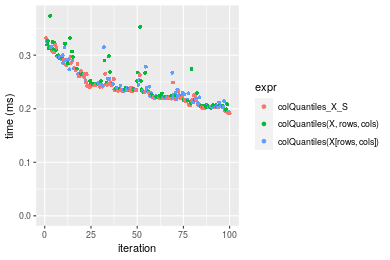
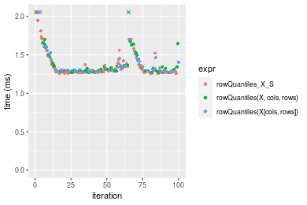
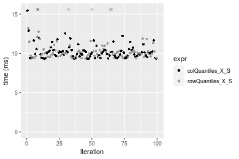

[matrixStats]: Benchmark report

---------------------------------------


# colQuantiles() and rowQuantiles() benchmarks on subsetted computation

This report benchmark the performance of colQuantiles() and rowQuantiles() on subsetted computation.


## Data
```r
> rmatrix <- function(nrow, ncol, mode = c("logical", "double", "integer", "index"), range = c(-100, 
+     +100), na_prob = 0) {
+     mode <- match.arg(mode)
+     n <- nrow * ncol
+     if (mode == "logical") {
+         x <- sample(c(FALSE, TRUE), size = n, replace = TRUE)
+     }     else if (mode == "index") {
+         x <- seq_len(n)
+         mode <- "integer"
+     }     else {
+         x <- runif(n, min = range[1], max = range[2])
+     }
+     storage.mode(x) <- mode
+     if (na_prob > 0) 
+         x[sample(n, size = na_prob * n)] <- NA
+     dim(x) <- c(nrow, ncol)
+     x
+ }
> rmatrices <- function(scale = 10, seed = 1, ...) {
+     set.seed(seed)
+     data <- list()
+     data[[1]] <- rmatrix(nrow = scale * 1, ncol = scale * 1, ...)
+     data[[2]] <- rmatrix(nrow = scale * 10, ncol = scale * 10, ...)
+     data[[3]] <- rmatrix(nrow = scale * 100, ncol = scale * 1, ...)
+     data[[4]] <- t(data[[3]])
+     data[[5]] <- rmatrix(nrow = scale * 10, ncol = scale * 100, ...)
+     data[[6]] <- t(data[[5]])
+     names(data) <- sapply(data, FUN = function(x) paste(dim(x), collapse = "x"))
+     data
+ }
> data <- rmatrices(mode = "double")
```

## Results

### 10x10 matrix


```r
> X <- data[["10x10"]]
> rows <- sample.int(nrow(X), size = nrow(X) * 0.7)
> cols <- sample.int(ncol(X), size = ncol(X) * 0.7)
> X_S <- X[rows, cols]
> gc()
           used  (Mb) gc trigger  (Mb) max used  (Mb)
Ncells  5291916 282.7    7916910 422.9  7916910 422.9
Vcells 10501223  80.2   33191153 253.3 53339345 407.0
> probs <- seq(from = 0, to = 1, by = 0.25)
> colStats <- microbenchmark(colQuantiles_X_S = colQuantiles(X_S, probs = probs, na.rm = FALSE), `colQuantiles(X, rows, cols)` = colQuantiles(X, 
+     rows = rows, cols = cols, probs = probs, na.rm = FALSE), `colQuantiles(X[rows, cols])` = colQuantiles(X[rows, 
+     cols], probs = probs, na.rm = FALSE), unit = "ms")
> X <- t(X)
> X_S <- t(X_S)
> gc()
           used  (Mb) gc trigger  (Mb) max used  (Mb)
Ncells  5280058 282.0    7916910 422.9  7916910 422.9
Vcells 10461111  79.9   33191153 253.3 53339345 407.0
> rowStats <- microbenchmark(rowQuantiles_X_S = rowQuantiles(X_S, probs = probs, na.rm = FALSE), `rowQuantiles(X, cols, rows)` = rowQuantiles(X, 
+     rows = cols, cols = rows, probs = probs, na.rm = FALSE), `rowQuantiles(X[cols, rows])` = rowQuantiles(X[cols, 
+     rows], probs = probs, na.rm = FALSE), unit = "ms")
```

_Table: Benchmarking of colQuantiles_X_S(), colQuantiles(X, rows, cols)() and colQuantiles(X[rows, cols])() on 10x10 data. The top panel shows times in milliseconds and the bottom panel shows relative times._


|   |expr                        |      min|        lq|      mean|    median|       uq|      max|
|:--|:---------------------------|--------:|---------:|---------:|---------:|--------:|--------:|
|3  |colQuantiles(X[rows, cols]) | 0.193864| 0.2191920| 0.2395020| 0.2338630| 0.250885| 0.325129|
|1  |colQuantiles_X_S            | 0.191803| 0.2195265| 0.2481782| 0.2345925| 0.259328| 1.006207|
|2  |colQuantiles(X, rows, cols) | 0.198249| 0.2212015| 0.2476609| 0.2365175| 0.268017| 0.373556|


|   |expr                        |       min|       lq|     mean|   median|       uq|      max|
|:--|:---------------------------|---------:|--------:|--------:|--------:|--------:|--------:|
|3  |colQuantiles(X[rows, cols]) | 1.0000000| 1.000000| 1.000000| 1.000000| 1.000000| 1.000000|
|1  |colQuantiles_X_S            | 0.9893688| 1.001526| 1.036226| 1.003119| 1.033653| 3.094793|
|2  |colQuantiles(X, rows, cols) | 1.0226189| 1.009168| 1.034066| 1.011351| 1.068286| 1.148947|

_Table: Benchmarking of rowQuantiles_X_S(), rowQuantiles(X, cols, rows)() and rowQuantiles(X[cols, rows])() on 10x10 data (transposed). The top panel shows times in milliseconds and the bottom panel shows relative times._


|   |expr                        |      min|        lq|      mean|    median|        uq|      max|
|:--|:---------------------------|--------:|---------:|---------:|---------:|---------:|--------:|
|3  |rowQuantiles(X[cols, rows]) | 0.190332| 0.2057045| 0.2267560| 0.2148715| 0.2395465| 0.401357|
|1  |rowQuantiles_X_S            | 0.187668| 0.2024100| 0.2304964| 0.2232495| 0.2462815| 0.376155|
|2  |rowQuantiles(X, cols, rows) | 0.190403| 0.1996565| 0.2419617| 0.2276835| 0.2496985| 0.889379|


|   |expr                        |       min|        lq|     mean|   median|       uq|      max|
|:--|:---------------------------|---------:|---------:|--------:|--------:|--------:|--------:|
|3  |rowQuantiles(X[cols, rows]) | 1.0000000| 1.0000000| 1.000000| 1.000000| 1.000000| 1.000000|
|1  |rowQuantiles_X_S            | 0.9860034| 0.9839843| 1.016495| 1.038991| 1.028116| 0.937208|
|2  |rowQuantiles(X, cols, rows) | 1.0003730| 0.9705986| 1.067057| 1.059626| 1.042380| 2.215930|

_Figure: Benchmarking of colQuantiles_X_S(), colQuantiles(X, rows, cols)() and colQuantiles(X[rows, cols])() on 10x10 data  as well as rowQuantiles_X_S(), rowQuantiles(X, cols, rows)() and rowQuantiles(X[cols, rows])() on the same data transposed.  Outliers are displayed as crosses.  Times are in milliseconds._





_Table: Benchmarking of colQuantiles_X_S() and rowQuantiles_X_S() on 10x10 data (original and transposed).  The top panel shows times in milliseconds and the bottom panel shows relative times._


|   |expr             |     min|       lq|     mean|   median|       uq|      max|
|:--|:----------------|-------:|--------:|--------:|--------:|--------:|--------:|
|2  |rowQuantiles_X_S | 187.668| 202.4100| 230.4964| 223.2495| 246.2815|  376.155|
|1  |colQuantiles_X_S | 191.803| 219.5265| 248.1782| 234.5925| 259.3280| 1006.207|


|   |expr             |      min|       lq|     mean|   median|       uq|     max|
|:--|:----------------|--------:|--------:|--------:|--------:|--------:|-------:|
|2  |rowQuantiles_X_S | 1.000000| 1.000000| 1.000000| 1.000000| 1.000000| 1.00000|
|1  |colQuantiles_X_S | 1.022034| 1.084564| 1.076712| 1.050809| 1.052974| 2.67498|

_Figure: Benchmarking of colQuantiles_X_S() and rowQuantiles_X_S() on 10x10 data (original and transposed).  Outliers are displayed as crosses. Times are in milliseconds._


### 100x100 matrix


```r
> X <- data[["100x100"]]
> rows <- sample.int(nrow(X), size = nrow(X) * 0.7)
> cols <- sample.int(ncol(X), size = ncol(X) * 0.7)
> X_S <- X[rows, cols]
> gc()
           used  (Mb) gc trigger  (Mb) max used  (Mb)
Ncells  5279660 282.0    7916910 422.9  7916910 422.9
Vcells 10134066  77.4   33191153 253.3 53339345 407.0
> probs <- seq(from = 0, to = 1, by = 0.25)
> colStats <- microbenchmark(colQuantiles_X_S = colQuantiles(X_S, probs = probs, na.rm = FALSE), `colQuantiles(X, rows, cols)` = colQuantiles(X, 
+     rows = rows, cols = cols, probs = probs, na.rm = FALSE), `colQuantiles(X[rows, cols])` = colQuantiles(X[rows, 
+     cols], probs = probs, na.rm = FALSE), unit = "ms")
> X <- t(X)
> X_S <- t(X_S)
> gc()
           used  (Mb) gc trigger  (Mb) max used  (Mb)
Ncells  5279648 282.0    7916910 422.9  7916910 422.9
Vcells 10144139  77.4   33191153 253.3 53339345 407.0
> rowStats <- microbenchmark(rowQuantiles_X_S = rowQuantiles(X_S, probs = probs, na.rm = FALSE), `rowQuantiles(X, cols, rows)` = rowQuantiles(X, 
+     rows = cols, cols = rows, probs = probs, na.rm = FALSE), `rowQuantiles(X[cols, rows])` = rowQuantiles(X[cols, 
+     rows], probs = probs, na.rm = FALSE), unit = "ms")
```

_Table: Benchmarking of colQuantiles_X_S(), colQuantiles(X, rows, cols)() and colQuantiles(X[rows, cols])() on 100x100 data. The top panel shows times in milliseconds and the bottom panel shows relative times._


|   |expr                        |      min|       lq|     mean|   median|       uq|       max|
|:--|:---------------------------|--------:|--------:|--------:|--------:|--------:|---------:|
|1  |colQuantiles_X_S            | 1.225778| 1.252869| 1.354780| 1.286105| 1.353386|  2.311531|
|2  |colQuantiles(X, rows, cols) | 1.245639| 1.269805| 1.376652| 1.304566| 1.387719|  2.182813|
|3  |colQuantiles(X[rows, cols]) | 1.244523| 1.264433| 1.471976| 1.311001| 1.435142| 10.505936|


|   |expr                        |      min|       lq|     mean|   median|       uq|       max|
|:--|:---------------------------|--------:|--------:|--------:|--------:|--------:|---------:|
|1  |colQuantiles_X_S            | 1.000000| 1.000000| 1.000000| 1.000000| 1.000000| 1.0000000|
|2  |colQuantiles(X, rows, cols) | 1.016203| 1.013517| 1.016144| 1.014354| 1.025369| 0.9443148|
|3  |colQuantiles(X[rows, cols]) | 1.015292| 1.009230| 1.086506| 1.019358| 1.060408| 4.5450119|

_Table: Benchmarking of rowQuantiles_X_S(), rowQuantiles(X, cols, rows)() and rowQuantiles(X[cols, rows])() on 100x100 data (transposed). The top panel shows times in milliseconds and the bottom panel shows relative times._


|   |expr                        |      min|       lq|     mean|   median|       uq|       max|
|:--|:---------------------------|--------:|--------:|--------:|--------:|--------:|---------:|
|1  |rowQuantiles_X_S            | 1.255388| 1.272221| 1.379842| 1.289094| 1.372680|  2.192171|
|3  |rowQuantiles(X[cols, rows]) | 1.268772| 1.281665| 1.369053| 1.296639| 1.364815|  2.194366|
|2  |rowQuantiles(X, cols, rows) | 1.265596| 1.282952| 1.477202| 1.300990| 1.368350| 10.359479|


|   |expr                        |      min|       lq|      mean|   median|        uq|      max|
|:--|:---------------------------|--------:|--------:|---------:|--------:|---------:|--------:|
|1  |rowQuantiles_X_S            | 1.000000| 1.000000| 1.0000000| 1.000000| 1.0000000| 1.000000|
|3  |rowQuantiles(X[cols, rows]) | 1.010661| 1.007423| 0.9921812| 1.005853| 0.9942700| 1.001001|
|2  |rowQuantiles(X, cols, rows) | 1.008131| 1.008434| 1.0705588| 1.009229| 0.9968452| 4.725671|

_Figure: Benchmarking of colQuantiles_X_S(), colQuantiles(X, rows, cols)() and colQuantiles(X[rows, cols])() on 100x100 data  as well as rowQuantiles_X_S(), rowQuantiles(X, cols, rows)() and rowQuantiles(X[cols, rows])() on the same data transposed.  Outliers are displayed as crosses.  Times are in milliseconds._



_Table: Benchmarking of colQuantiles_X_S() and rowQuantiles_X_S() on 100x100 data (original and transposed).  The top panel shows times in milliseconds and the bottom panel shows relative times._


|   |expr             |      min|       lq|     mean|   median|       uq|      max|
|:--|:----------------|--------:|--------:|--------:|--------:|--------:|--------:|
|1  |colQuantiles_X_S | 1.225778| 1.252869| 1.354780| 1.286105| 1.353386| 2.311531|
|2  |rowQuantiles_X_S | 1.255388| 1.272221| 1.379842| 1.289094| 1.372680| 2.192171|


|   |expr             |      min|       lq|     mean|   median|       uq|       max|
|:--|:----------------|--------:|--------:|--------:|--------:|--------:|---------:|
|1  |colQuantiles_X_S | 1.000000| 1.000000| 1.000000| 1.000000| 1.000000| 1.0000000|
|2  |rowQuantiles_X_S | 1.024156| 1.015446| 1.018499| 1.002324| 1.014256| 0.9483632|

_Figure: Benchmarking of colQuantiles_X_S() and rowQuantiles_X_S() on 100x100 data (original and transposed).  Outliers are displayed as crosses. Times are in milliseconds._


### 1000x10 matrix


```r
> X <- data[["1000x10"]]
> rows <- sample.int(nrow(X), size = nrow(X) * 0.7)
> cols <- sample.int(ncol(X), size = ncol(X) * 0.7)
> X_S <- X[rows, cols]
> gc()
           used  (Mb) gc trigger  (Mb) max used  (Mb)
Ncells  5280409 282.1    7916910 422.9  7916910 422.9
Vcells 10138126  77.4   33191153 253.3 53339345 407.0
> probs <- seq(from = 0, to = 1, by = 0.25)
> colStats <- microbenchmark(colQuantiles_X_S = colQuantiles(X_S, probs = probs, na.rm = FALSE), `colQuantiles(X, rows, cols)` = colQuantiles(X, 
+     rows = rows, cols = cols, probs = probs, na.rm = FALSE), `colQuantiles(X[rows, cols])` = colQuantiles(X[rows, 
+     cols], probs = probs, na.rm = FALSE), unit = "ms")
> X <- t(X)
> X_S <- t(X_S)
> gc()
           used  (Mb) gc trigger  (Mb) max used  (Mb)
Ncells  5280391 282.1    7916910 422.9  7916910 422.9
Vcells 10148189  77.5   33191153 253.3 53339345 407.0
> rowStats <- microbenchmark(rowQuantiles_X_S = rowQuantiles(X_S, probs = probs, na.rm = FALSE), `rowQuantiles(X, cols, rows)` = rowQuantiles(X, 
+     rows = cols, cols = rows, probs = probs, na.rm = FALSE), `rowQuantiles(X[cols, rows])` = rowQuantiles(X[cols, 
+     rows], probs = probs, na.rm = FALSE), unit = "ms")
```

_Table: Benchmarking of colQuantiles_X_S(), colQuantiles(X, rows, cols)() and colQuantiles(X[rows, cols])() on 1000x10 data. The top panel shows times in milliseconds and the bottom panel shows relative times._


|   |expr                        |      min|        lq|      mean|   median|        uq|      max|
|:--|:---------------------------|--------:|---------:|---------:|--------:|---------:|--------:|
|1  |colQuantiles_X_S            | 0.370728| 0.3727030| 0.4200224| 0.381484| 0.4541030| 0.617224|
|3  |colQuantiles(X[rows, cols]) | 0.382117| 0.3861615| 0.4301175| 0.390001| 0.4528365| 0.825006|
|2  |colQuantiles(X, rows, cols) | 0.381225| 0.3864250| 0.4304690| 0.390269| 0.4602770| 0.692628|


|   |expr                        |      min|       lq|     mean|   median|       uq|      max|
|:--|:---------------------------|--------:|--------:|--------:|--------:|--------:|--------:|
|1  |colQuantiles_X_S            | 1.000000| 1.000000| 1.000000| 1.000000| 1.000000| 1.000000|
|3  |colQuantiles(X[rows, cols]) | 1.030721| 1.036110| 1.024035| 1.022326| 0.997211| 1.336639|
|2  |colQuantiles(X, rows, cols) | 1.028315| 1.036817| 1.024872| 1.023028| 1.013596| 1.122166|

_Table: Benchmarking of rowQuantiles_X_S(), rowQuantiles(X, cols, rows)() and rowQuantiles(X[cols, rows])() on 1000x10 data (transposed). The top panel shows times in milliseconds and the bottom panel shows relative times._


|   |expr                        |      min|       lq|      mean|    median|        uq|      max|
|:--|:---------------------------|--------:|--------:|---------:|---------:|---------:|--------:|
|1  |rowQuantiles_X_S            | 0.385827| 0.388216| 0.4227291| 0.3912555| 0.4255555| 0.616402|
|3  |rowQuantiles(X[cols, rows]) | 0.399713| 0.404013| 0.4412166| 0.4061035| 0.4605050| 0.817110|
|2  |rowQuantiles(X, cols, rows) | 0.402190| 0.404894| 0.4423714| 0.4122980| 0.4760700| 0.621445|


|   |expr                        |     min|       lq|     mean|   median|       uq|      max|
|:--|:---------------------------|-------:|--------:|--------:|--------:|--------:|--------:|
|1  |rowQuantiles_X_S            | 1.00000| 1.000000| 1.000000| 1.000000| 1.000000| 1.000000|
|3  |rowQuantiles(X[cols, rows]) | 1.03599| 1.040691| 1.043734| 1.037950| 1.082127| 1.325612|
|2  |rowQuantiles(X, cols, rows) | 1.04241| 1.042961| 1.046465| 1.053782| 1.118702| 1.008181|

_Figure: Benchmarking of colQuantiles_X_S(), colQuantiles(X, rows, cols)() and colQuantiles(X[rows, cols])() on 1000x10 data  as well as rowQuantiles_X_S(), rowQuantiles(X, cols, rows)() and rowQuantiles(X[cols, rows])() on the same data transposed.  Outliers are displayed as crosses.  Times are in milliseconds._


_Table: Benchmarking of colQuantiles_X_S() and rowQuantiles_X_S() on 1000x10 data (original and transposed).  The top panel shows times in milliseconds and the bottom panel shows relative times._


|   |expr             |     min|      lq|     mean|   median|       uq|     max|
|:--|:----------------|-------:|-------:|--------:|--------:|--------:|-------:|
|1  |colQuantiles_X_S | 370.728| 372.703| 420.0224| 381.4840| 454.1030| 617.224|
|2  |rowQuantiles_X_S | 385.827| 388.216| 422.7291| 391.2555| 425.5555| 616.402|


|   |expr             |      min|       lq|     mean|   median|        uq|       max|
|:--|:----------------|--------:|--------:|--------:|--------:|---------:|---------:|
|1  |colQuantiles_X_S | 1.000000| 1.000000| 1.000000| 1.000000| 1.0000000| 1.0000000|
|2  |rowQuantiles_X_S | 1.040728| 1.041623| 1.006444| 1.025614| 0.9371343| 0.9986682|

_Figure: Benchmarking of colQuantiles_X_S() and rowQuantiles_X_S() on 1000x10 data (original and transposed).  Outliers are displayed as crosses. Times are in milliseconds._


### 10x1000 matrix


```r
> X <- data[["10x1000"]]
> rows <- sample.int(nrow(X), size = nrow(X) * 0.7)
> cols <- sample.int(ncol(X), size = ncol(X) * 0.7)
> X_S <- X[rows, cols]
> gc()
           used  (Mb) gc trigger  (Mb) max used  (Mb)
Ncells  5280608 282.1    7916910 422.9  7916910 422.9
Vcells 10139102  77.4   33191153 253.3 53339345 407.0
> probs <- seq(from = 0, to = 1, by = 0.25)
> colStats <- microbenchmark(colQuantiles_X_S = colQuantiles(X_S, probs = probs, na.rm = FALSE), `colQuantiles(X, rows, cols)` = colQuantiles(X, 
+     rows = rows, cols = cols, probs = probs, na.rm = FALSE), `colQuantiles(X[rows, cols])` = colQuantiles(X[rows, 
+     cols], probs = probs, na.rm = FALSE), unit = "ms")
> X <- t(X)
> X_S <- t(X_S)
> gc()
           used  (Mb) gc trigger  (Mb) max used  (Mb)
Ncells  5280596 282.1    7916910 422.9  7916910 422.9
Vcells 10149175  77.5   33191153 253.3 53339345 407.0
> rowStats <- microbenchmark(rowQuantiles_X_S = rowQuantiles(X_S, probs = probs, na.rm = FALSE), `rowQuantiles(X, cols, rows)` = rowQuantiles(X, 
+     rows = cols, cols = rows, probs = probs, na.rm = FALSE), `rowQuantiles(X[cols, rows])` = rowQuantiles(X[cols, 
+     rows], probs = probs, na.rm = FALSE), unit = "ms")
```

_Table: Benchmarking of colQuantiles_X_S(), colQuantiles(X, rows, cols)() and colQuantiles(X[rows, cols])() on 10x1000 data. The top panel shows times in milliseconds and the bottom panel shows relative times._


|   |expr                        |      min|       lq|     mean|    median|       uq|      max|
|:--|:---------------------------|--------:|--------:|--------:|---------:|--------:|--------:|
|2  |colQuantiles(X, rows, cols) | 9.311982| 9.526577| 10.76101|  9.882511| 10.57142| 18.86934|
|3  |colQuantiles(X[rows, cols]) | 9.336797| 9.664976| 10.59511|  9.965283| 10.35032| 17.60338|
|1  |colQuantiles_X_S            | 9.322680| 9.623390| 10.29404| 10.035808| 10.43551| 16.82942|


|   |expr                        |      min|       lq|      mean|   median|        uq|       max|
|:--|:---------------------------|--------:|--------:|---------:|--------:|---------:|---------:|
|2  |colQuantiles(X, rows, cols) | 1.000000| 1.000000| 1.0000000| 1.000000| 1.0000000| 1.0000000|
|3  |colQuantiles(X[rows, cols]) | 1.002665| 1.014528| 0.9845829| 1.008376| 0.9790849| 0.9329090|
|1  |colQuantiles_X_S            | 1.001149| 1.010162| 0.9566059| 1.015512| 0.9871438| 0.8918923|

_Table: Benchmarking of rowQuantiles_X_S(), rowQuantiles(X, cols, rows)() and rowQuantiles(X[cols, rows])() on 10x1000 data (transposed). The top panel shows times in milliseconds and the bottom panel shows relative times._


|   |expr                        |      min|       lq|     mean|    median|       uq|      max|
|:--|:---------------------------|--------:|--------:|--------:|---------:|--------:|--------:|
|3  |rowQuantiles(X[cols, rows]) | 9.318816| 9.671371| 10.38362|  9.922601| 10.47725| 18.05593|
|2  |rowQuantiles(X, cols, rows) | 9.418175| 9.712003| 11.03026| 10.020728| 10.98179| 24.69222|
|1  |rowQuantiles_X_S            | 9.355191| 9.644142| 10.40783| 10.024606| 10.32139| 16.76068|


|   |expr                        |      min|        lq|     mean|   median|        uq|       max|
|:--|:---------------------------|--------:|---------:|--------:|--------:|---------:|---------:|
|3  |rowQuantiles(X[cols, rows]) | 1.000000| 1.0000000| 1.000000| 1.000000| 1.0000000| 1.0000000|
|2  |rowQuantiles(X, cols, rows) | 1.010662| 1.0042013| 1.062275| 1.009889| 1.0481553| 1.3675403|
|1  |rowQuantiles_X_S            | 1.003903| 0.9971846| 1.002331| 1.010280| 0.9851235| 0.9282643|

_Figure: Benchmarking of colQuantiles_X_S(), colQuantiles(X, rows, cols)() and colQuantiles(X[rows, cols])() on 10x1000 data  as well as rowQuantiles_X_S(), rowQuantiles(X, cols, rows)() and rowQuantiles(X[cols, rows])() on the same data transposed.  Outliers are displayed as crosses.  Times are in milliseconds._


_Table: Benchmarking of colQuantiles_X_S() and rowQuantiles_X_S() on 10x1000 data (original and transposed).  The top panel shows times in milliseconds and the bottom panel shows relative times._


|   |expr             |      min|       lq|     mean|   median|       uq|      max|
|:--|:----------------|--------:|--------:|--------:|--------:|--------:|--------:|
|2  |rowQuantiles_X_S | 9.355191| 9.644142| 10.40783| 10.02461| 10.32139| 16.76068|
|1  |colQuantiles_X_S | 9.322680| 9.623390| 10.29404| 10.03581| 10.43551| 16.82942|


|   |expr             |       min|        lq|      mean|   median|       uq|      max|
|:--|:----------------|---------:|---------:|---------:|--------:|--------:|--------:|
|2  |rowQuantiles_X_S | 1.0000000| 1.0000000| 1.0000000| 1.000000| 1.000000| 1.000000|
|1  |colQuantiles_X_S | 0.9965248| 0.9978482| 0.9890675| 1.001118| 1.011057| 1.004102|

_Figure: Benchmarking of colQuantiles_X_S() and rowQuantiles_X_S() on 10x1000 data (original and transposed).  Outliers are displayed as crosses. Times are in milliseconds._




### 100x1000 matrix


```r
> X <- data[["100x1000"]]
> rows <- sample.int(nrow(X), size = nrow(X) * 0.7)
> cols <- sample.int(ncol(X), size = ncol(X) * 0.7)
> X_S <- X[rows, cols]
> gc()
           used  (Mb) gc trigger  (Mb) max used  (Mb)
Ncells  5280818 282.1    7916910 422.9  7916910 422.9
Vcells 10183847  77.7   33191153 253.3 53339345 407.0
> probs <- seq(from = 0, to = 1, by = 0.25)
> colStats <- microbenchmark(colQuantiles_X_S = colQuantiles(X_S, probs = probs, na.rm = FALSE), `colQuantiles(X, rows, cols)` = colQuantiles(X, 
+     rows = rows, cols = cols, probs = probs, na.rm = FALSE), `colQuantiles(X[rows, cols])` = colQuantiles(X[rows, 
+     cols], probs = probs, na.rm = FALSE), unit = "ms")
> X <- t(X)
> X_S <- t(X_S)
> gc()
           used  (Mb) gc trigger  (Mb) max used  (Mb)
Ncells  5280806 282.1    7916910 422.9  7916910 422.9
Vcells 10283920  78.5   33191153 253.3 53339345 407.0
> rowStats <- microbenchmark(rowQuantiles_X_S = rowQuantiles(X_S, probs = probs, na.rm = FALSE), `rowQuantiles(X, cols, rows)` = rowQuantiles(X, 
+     rows = cols, cols = rows, probs = probs, na.rm = FALSE), `rowQuantiles(X[cols, rows])` = rowQuantiles(X[cols, 
+     rows], probs = probs, na.rm = FALSE), unit = "ms")
```

_Table: Benchmarking of colQuantiles_X_S(), colQuantiles(X, rows, cols)() and colQuantiles(X[rows, cols])() on 100x1000 data. The top panel shows times in milliseconds and the bottom panel shows relative times._


|   |expr                        |      min|       lq|     mean|   median|       uq|      max|
|:--|:---------------------------|--------:|--------:|--------:|--------:|--------:|--------:|
|1  |colQuantiles_X_S            | 11.52600| 12.38966| 14.61118| 13.30258| 14.56454| 38.26557|
|3  |colQuantiles(X[rows, cols]) | 11.69649| 12.47478| 14.41368| 13.47034| 14.54926| 26.50288|
|2  |colQuantiles(X, rows, cols) | 11.78100| 12.46030| 15.42942| 13.92336| 15.77830| 28.62961|


|   |expr                        |      min|       lq|      mean|   median|        uq|       max|
|:--|:---------------------------|--------:|--------:|---------:|--------:|---------:|---------:|
|1  |colQuantiles_X_S            | 1.000000| 1.000000| 1.0000000| 1.000000| 1.0000000| 1.0000000|
|3  |colQuantiles(X[rows, cols]) | 1.014791| 1.006870| 0.9864831| 1.012611| 0.9989507| 0.6926037|
|2  |colQuantiles(X, rows, cols) | 1.022124| 1.005702| 1.0560009| 1.046666| 1.0833364| 0.7481819|

_Table: Benchmarking of rowQuantiles_X_S(), rowQuantiles(X, cols, rows)() and rowQuantiles(X[cols, rows])() on 100x1000 data (transposed). The top panel shows times in milliseconds and the bottom panel shows relative times._


|   |expr                        |      min|       lq|     mean|   median|       uq|      max|
|:--|:---------------------------|--------:|--------:|--------:|--------:|--------:|--------:|
|2  |rowQuantiles(X, cols, rows) | 12.36452| 13.40608| 14.51832| 13.71598| 14.47456| 30.05745|
|1  |rowQuantiles_X_S            | 12.16054| 13.33660| 14.59470| 13.80858| 15.02680| 24.57460|
|3  |rowQuantiles(X[cols, rows]) | 12.19137| 13.44041| 14.51761| 13.81128| 14.67734| 26.34513|


|   |expr                        |       min|        lq|      mean|   median|       uq|       max|
|:--|:---------------------------|---------:|---------:|---------:|--------:|--------:|---------:|
|2  |rowQuantiles(X, cols, rows) | 1.0000000| 1.0000000| 1.0000000| 1.000000| 1.000000| 1.0000000|
|1  |rowQuantiles_X_S            | 0.9835027| 0.9948169| 1.0052609| 1.006751| 1.038153| 0.8175878|
|3  |rowQuantiles(X[cols, rows]) | 0.9859963| 1.0025601| 0.9999514| 1.006948| 1.014010| 0.8764925|

_Figure: Benchmarking of colQuantiles_X_S(), colQuantiles(X, rows, cols)() and colQuantiles(X[rows, cols])() on 100x1000 data  as well as rowQuantiles_X_S(), rowQuantiles(X, cols, rows)() and rowQuantiles(X[cols, rows])() on the same data transposed.  Outliers are displayed as crosses.  Times are in milliseconds._


_Table: Benchmarking of colQuantiles_X_S() and rowQuantiles_X_S() on 100x1000 data (original and transposed).  The top panel shows times in milliseconds and the bottom panel shows relative times._


|   |expr             |      min|       lq|     mean|   median|       uq|      max|
|:--|:----------------|--------:|--------:|--------:|--------:|--------:|--------:|
|1  |colQuantiles_X_S | 11.52600| 12.38966| 14.61118| 13.30258| 14.56454| 38.26557|
|2  |rowQuantiles_X_S | 12.16054| 13.33660| 14.59470| 13.80858| 15.02680| 24.57460|


|   |expr             |      min|      lq|      mean|   median|       uq|       max|
|:--|:----------------|--------:|-------:|---------:|--------:|--------:|---------:|
|1  |colQuantiles_X_S | 1.000000| 1.00000| 1.0000000| 1.000000| 1.000000| 1.0000000|
|2  |rowQuantiles_X_S | 1.055052| 1.07643| 0.9988718| 1.038038| 1.031739| 0.6422119|

_Figure: Benchmarking of colQuantiles_X_S() and rowQuantiles_X_S() on 100x1000 data (original and transposed).  Outliers are displayed as crosses. Times are in milliseconds._


### 1000x100 matrix


```r
> X <- data[["1000x100"]]
> rows <- sample.int(nrow(X), size = nrow(X) * 0.7)
> cols <- sample.int(ncol(X), size = ncol(X) * 0.7)
> X_S <- X[rows, cols]
> gc()
           used  (Mb) gc trigger  (Mb) max used  (Mb)
Ncells  5281031 282.1    7916910 422.9  7916910 422.9
Vcells 10184677  77.8   33191153 253.3 53339345 407.0
> probs <- seq(from = 0, to = 1, by = 0.25)
> colStats <- microbenchmark(colQuantiles_X_S = colQuantiles(X_S, probs = probs, na.rm = FALSE), `colQuantiles(X, rows, cols)` = colQuantiles(X, 
+     rows = rows, cols = cols, probs = probs, na.rm = FALSE), `colQuantiles(X[rows, cols])` = colQuantiles(X[rows, 
+     cols], probs = probs, na.rm = FALSE), unit = "ms")
> X <- t(X)
> X_S <- t(X_S)
> gc()
           used  (Mb) gc trigger  (Mb) max used  (Mb)
Ncells  5281019 282.1    7916910 422.9  7916910 422.9
Vcells 10284750  78.5   33191153 253.3 53339345 407.0
> rowStats <- microbenchmark(rowQuantiles_X_S = rowQuantiles(X_S, probs = probs, na.rm = FALSE), `rowQuantiles(X, cols, rows)` = rowQuantiles(X, 
+     rows = cols, cols = rows, probs = probs, na.rm = FALSE), `rowQuantiles(X[cols, rows])` = rowQuantiles(X[cols, 
+     rows], probs = probs, na.rm = FALSE), unit = "ms")
```

_Table: Benchmarking of colQuantiles_X_S(), colQuantiles(X, rows, cols)() and colQuantiles(X[rows, cols])() on 1000x100 data. The top panel shows times in milliseconds and the bottom panel shows relative times._


|   |expr                        |      min|       lq|     mean|   median|       uq|       max|
|:--|:---------------------------|--------:|--------:|--------:|--------:|--------:|---------:|
|1  |colQuantiles_X_S            | 2.880728| 3.120188| 3.413697| 3.210253| 3.330167| 13.560352|
|3  |colQuantiles(X[rows, cols]) | 3.061107| 3.220135| 3.391236| 3.334631| 3.465556|  4.785324|
|2  |colQuantiles(X, rows, cols) | 3.096268| 3.252244| 3.522540| 3.346129| 3.467803| 13.800664|


|   |expr                        |      min|       lq|      mean|   median|       uq|       max|
|:--|:---------------------------|--------:|--------:|---------:|--------:|--------:|---------:|
|1  |colQuantiles_X_S            | 1.000000| 1.000000| 1.0000000| 1.000000| 1.000000| 1.0000000|
|3  |colQuantiles(X[rows, cols]) | 1.062616| 1.032032| 0.9934202| 1.038744| 1.040655| 0.3528908|
|2  |colQuantiles(X, rows, cols) | 1.074821| 1.042323| 1.0318841| 1.042326| 1.041330| 1.0177217|

_Table: Benchmarking of rowQuantiles_X_S(), rowQuantiles(X, cols, rows)() and rowQuantiles(X[cols, rows])() on 1000x100 data (transposed). The top panel shows times in milliseconds and the bottom panel shows relative times._


|   |expr                        |      min|       lq|     mean|   median|       uq|       max|
|:--|:---------------------------|--------:|--------:|--------:|--------:|--------:|---------:|
|1  |rowQuantiles_X_S            | 3.090674| 3.472739| 3.580201| 3.557223| 3.642758|  4.549436|
|3  |rowQuantiles(X[cols, rows]) | 3.337567| 3.637268| 3.807218| 3.754910| 3.893598|  6.240238|
|2  |rowQuantiles(X, cols, rows) | 3.339166| 3.652345| 4.036156| 3.765739| 3.932219| 15.623647|


|   |expr                        |      min|       lq|     mean|   median|       uq|      max|
|:--|:---------------------------|--------:|--------:|--------:|--------:|--------:|--------:|
|1  |rowQuantiles_X_S            | 1.000000| 1.000000| 1.000000| 1.000000| 1.000000| 1.000000|
|3  |rowQuantiles(X[cols, rows]) | 1.079883| 1.047378| 1.063409| 1.055573| 1.068860| 1.371651|
|2  |rowQuantiles(X, cols, rows) | 1.080401| 1.051719| 1.127355| 1.058618| 1.079462| 3.434194|

_Figure: Benchmarking of colQuantiles_X_S(), colQuantiles(X, rows, cols)() and colQuantiles(X[rows, cols])() on 1000x100 data  as well as rowQuantiles_X_S(), rowQuantiles(X, cols, rows)() and rowQuantiles(X[cols, rows])() on the same data transposed.  Outliers are displayed as crosses.  Times are in milliseconds._


_Table: Benchmarking of colQuantiles_X_S() and rowQuantiles_X_S() on 1000x100 data (original and transposed).  The top panel shows times in milliseconds and the bottom panel shows relative times._


|   |expr             |      min|       lq|     mean|   median|       uq|       max|
|:--|:----------------|--------:|--------:|--------:|--------:|--------:|---------:|
|1  |colQuantiles_X_S | 2.880728| 3.120188| 3.413697| 3.210253| 3.330167| 13.560352|
|2  |rowQuantiles_X_S | 3.090674| 3.472739| 3.580201| 3.557223| 3.642758|  4.549436|


|   |expr             |      min|      lq|     mean|   median|       uq|       max|
|:--|:----------------|--------:|-------:|--------:|--------:|--------:|---------:|
|1  |colQuantiles_X_S | 1.000000| 1.00000| 1.000000| 1.000000| 1.000000| 1.0000000|
|2  |rowQuantiles_X_S | 1.072879| 1.11299| 1.048775| 1.108082| 1.093867| 0.3354954|

_Figure: Benchmarking of colQuantiles_X_S() and rowQuantiles_X_S() on 1000x100 data (original and transposed).  Outliers are displayed as crosses. Times are in milliseconds._


## Appendix

### Session information
```r
R version 4.1.1 Patched (2021-08-10 r80727)
Platform: x86_64-pc-linux-gnu (64-bit)
Running under: Ubuntu 18.04.5 LTS

Matrix products: default
BLAS:   /home/hb/software/R-devel/R-4-1-branch/lib/R/lib/libRblas.so
LAPACK: /home/hb/software/R-devel/R-4-1-branch/lib/R/lib/libRlapack.so

locale:
 [1] LC_CTYPE=en_US.UTF-8       LC_NUMERIC=C              
 [3] LC_TIME=en_US.UTF-8        LC_COLLATE=en_US.UTF-8    
 [5] LC_MONETARY=en_US.UTF-8    LC_MESSAGES=en_US.UTF-8   
 [7] LC_PAPER=en_US.UTF-8       LC_NAME=C                 
 [9] LC_ADDRESS=C               LC_TELEPHONE=C            
[11] LC_MEASUREMENT=en_US.UTF-8 LC_IDENTIFICATION=C       

attached base packages:
[1] stats     graphics  grDevices utils     datasets  methods   base     

other attached packages:
[1] microbenchmark_1.4-7   matrixStats_0.60.0     ggplot2_3.3.5         
[4] knitr_1.33             R.devices_2.17.0       R.utils_2.10.1        
[7] R.oo_1.24.0            R.methodsS3_1.8.1-9001 history_0.0.1-9000    

loaded via a namespace (and not attached):
 [1] Biobase_2.52.0          httr_1.4.2              splines_4.1.1          
 [4] bit64_4.0.5             network_1.17.1          assertthat_0.2.1       
 [7] highr_0.9               stats4_4.1.1            blob_1.2.2             
[10] GenomeInfoDbData_1.2.6  robustbase_0.93-8       pillar_1.6.2           
[13] RSQLite_2.2.8           lattice_0.20-44         glue_1.4.2             
[16] digest_0.6.27           XVector_0.32.0          colorspace_2.0-2       
[19] Matrix_1.3-4            XML_3.99-0.7            pkgconfig_2.0.3        
[22] zlibbioc_1.38.0         genefilter_1.74.0       purrr_0.3.4            
[25] ergm_4.1.2              xtable_1.8-4            scales_1.1.1           
[28] tibble_3.1.4            annotate_1.70.0         KEGGREST_1.32.0        
[31] farver_2.1.0            generics_0.1.0          IRanges_2.26.0         
[34] ellipsis_0.3.2          cachem_1.0.6            withr_2.4.2            
[37] BiocGenerics_0.38.0     mime_0.11               survival_3.2-13        
[40] magrittr_2.0.1          crayon_1.4.1            statnet.common_4.5.0   
[43] memoise_2.0.0           laeken_0.5.1            fansi_0.5.0            
[46] R.cache_0.15.0          MASS_7.3-54             R.rsp_0.44.0           
[49] progressr_0.8.0         tools_4.1.1             lifecycle_1.0.0        
[52] S4Vectors_0.30.0        trust_0.1-8             munsell_0.5.0          
[55] tabby_0.0.1-9001        AnnotationDbi_1.54.1    Biostrings_2.60.2      
[58] compiler_4.1.1          GenomeInfoDb_1.28.1     rlang_0.4.11           
[61] grid_4.1.1              RCurl_1.98-1.4          cwhmisc_6.6            
[64] rstudioapi_0.13         rappdirs_0.3.3          startup_0.15.0         
[67] labeling_0.4.2          bitops_1.0-7            base64enc_0.1-3        
[70] boot_1.3-28             gtable_0.3.0            DBI_1.1.1              
[73] markdown_1.1            R6_2.5.1                lpSolveAPI_5.5.2.0-17.7
[76] rle_0.9.2               dplyr_1.0.7             fastmap_1.1.0          
[79] bit_4.0.4               utf8_1.2.2              parallel_4.1.1         
[82] Rcpp_1.0.7              vctrs_0.3.8             png_0.1-7              
[85] DEoptimR_1.0-9          tidyselect_1.1.1        xfun_0.25              
[88] coda_0.19-4            
```
Total processing time was 30.22 secs.


### Reproducibility
To reproduce this report, do:
```r
html <- matrixStats:::benchmark('colRowQuantiles_subset')
```

[RSP]: https://cran.r-project.org/package=R.rsp
[matrixStats]: https://cran.r-project.org/package=matrixStats

[StackOverflow:colMins?]: https://stackoverflow.com/questions/13676878 "Stack Overflow: fastest way to get Min from every column in a matrix?"
[StackOverflow:colSds?]: https://stackoverflow.com/questions/17549762 "Stack Overflow: Is there such 'colsd' in R?"
[StackOverflow:rowProds?]: https://stackoverflow.com/questions/20198801/ "Stack Overflow: Row product of matrix and column sum of matrix"

---------------------------------------
Copyright Dongcan Jiang. Last updated on 2021-08-25 22:25:37 (+0200 UTC). Powered by [RSP].

<script>
 var link = document.createElement('link');
 link.rel = 'icon';
 link.href = "data:image/png;base64,iVBORw0KGgoAAAANSUhEUgAAACAAAAAgCAMAAABEpIrGAAAA21BMVEUAAAAAAP8AAP8AAP8AAP8AAP8AAP8AAP8AAP8AAP8AAP8AAP8AAP8AAP8AAP8AAP8AAP8AAP8AAP8AAP8AAP8AAP8AAP8AAP8AAP8AAP8AAP8AAP8AAP8AAP8AAP8AAP8AAP8AAP8AAP8AAP8AAP8AAP8AAP8AAP8AAP8AAP8BAf4CAv0DA/wdHeIeHuEfH+AgIN8hId4lJdomJtknJ9g+PsE/P8BAQL9yco10dIt1dYp3d4h4eIeVlWqWlmmXl2iYmGeZmWabm2Tn5xjo6Bfp6Rb39wj4+Af//wA2M9hbAAAASXRSTlMAAQIJCgsMJSYnKD4/QGRlZmhpamtsbautrrCxuru8y8zN5ebn6Pn6+///////////////////////////////////////////LsUNcQAAAS9JREFUOI29k21XgkAQhVcFytdSMqMETU26UVqGmpaiFbL//xc1cAhhwVNf6n5i5z67M2dmYOyfJZUqlVLhkKucG7cgmUZTybDz6g0iDeq51PUr37Ds2cy2/C9NeES5puDjxuUk1xnToZsg8pfA3avHQ3lLIi7iWRrkv/OYtkScxBIMgDee0ALoyxHQBJ68JLCjOtQIMIANF7QG9G9fNnHvisCHBVMKgSJgiz7nE+AoBKrAPA3MgepvgR9TSCasrCKH0eB1wBGBFdCO+nAGjMVGPcQb5bd6mQRegN6+1axOs9nGfYcCtfi4NQosdtH7dB+txFIpXQqN1p9B/asRHToyS0jRgpV7nk4nwcq1BJ+x3Gl/v7S9Wmpp/aGquum7w3ZDyrADFYrl8vHBH+ev9AUASW1dmU4h4wAAAABJRU5ErkJggg=="
 document.getElementsByTagName('head')[0].appendChild(link);
</script>


