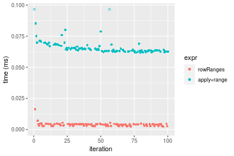
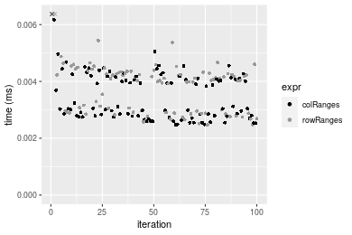
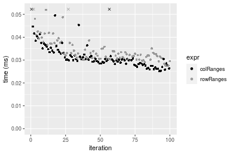
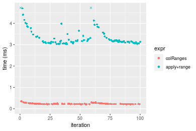
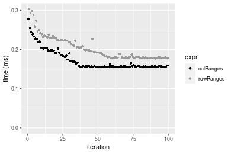
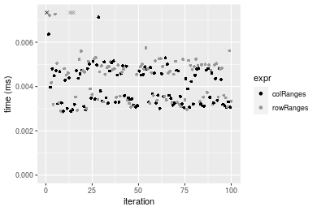
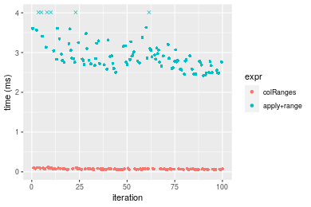
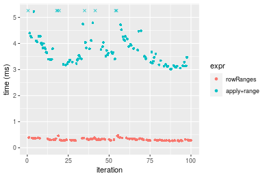
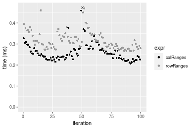
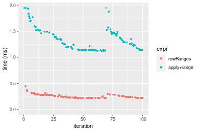

[matrixStats]: Benchmark report

---------------------------------------


# colRanges() and rowRanges() benchmarks

This report benchmark the performance of colRanges() and rowRanges() against alternative methods.

## Alternative methods

* apply() + range()


## Data type "integer"

### Data
```r
> rmatrix <- function(nrow, ncol, mode = c("logical", "double", "integer", "index"), range = c(-100, 
+     +100), na_prob = 0) {
+     mode <- match.arg(mode)
+     n <- nrow * ncol
+     if (mode == "logical") {
+         x <- sample(c(FALSE, TRUE), size = n, replace = TRUE)
+     }     else if (mode == "index") {
+         x <- seq_len(n)
+         mode <- "integer"
+     }     else {
+         x <- runif(n, min = range[1], max = range[2])
+     }
+     storage.mode(x) <- mode
+     if (na_prob > 0) 
+         x[sample(n, size = na_prob * n)] <- NA
+     dim(x) <- c(nrow, ncol)
+     x
+ }
> rmatrices <- function(scale = 10, seed = 1, ...) {
+     set.seed(seed)
+     data <- list()
+     data[[1]] <- rmatrix(nrow = scale * 1, ncol = scale * 1, ...)
+     data[[2]] <- rmatrix(nrow = scale * 10, ncol = scale * 10, ...)
+     data[[3]] <- rmatrix(nrow = scale * 100, ncol = scale * 1, ...)
+     data[[4]] <- t(data[[3]])
+     data[[5]] <- rmatrix(nrow = scale * 10, ncol = scale * 100, ...)
+     data[[6]] <- t(data[[5]])
+     names(data) <- sapply(data, FUN = function(x) paste(dim(x), collapse = "x"))
+     data
+ }
> data <- rmatrices(mode = mode)
```

### Results

#### 10x10 integer matrix

```r
> X <- data[["10x10"]]
> gc()
           used  (Mb) gc trigger  (Mb) max used  (Mb)
Ncells  5290711 282.6    7916910 422.9  7916910 422.9
Vcells 10476589  80.0   33191153 253.3 53339345 407.0
> colStats <- microbenchmark(colRanges = colRanges(X, na.rm = FALSE), `apply+range` = apply(X, MARGIN = 2L, 
+     FUN = range, na.rm = FALSE), unit = "ms")
> X <- t(X)
> gc()
           used  (Mb) gc trigger  (Mb) max used  (Mb)
Ncells  5290306 282.6    7916910 422.9  7916910 422.9
Vcells 10475612  80.0   33191153 253.3 53339345 407.0
> rowStats <- microbenchmark(rowRanges = rowRanges(X, na.rm = FALSE), `apply+range` = apply(X, MARGIN = 1L, 
+     FUN = range, na.rm = FALSE), unit = "ms")
```

_Table: Benchmarking of colRanges() and apply+range() on integer+10x10 data. The top panel shows times in milliseconds and the bottom panel shows relative times._


|   |expr        |      min|       lq|      mean|    median|        uq|      max|
|:--|:-----------|--------:|--------:|---------:|---------:|---------:|--------:|
|1  |colRanges   | 0.002473| 0.002782| 0.0036021| 0.0030815| 0.0041665| 0.016364|
|2  |apply+range | 0.061796| 0.063297| 0.0673617| 0.0647410| 0.0672345| 0.165235|


|   |expr        |      min|       lq|     mean|   median|       uq|      max|
|:--|:-----------|--------:|--------:|--------:|--------:|--------:|--------:|
|1  |colRanges   |  1.00000|  1.00000|  1.00000|  1.00000|  1.00000|  1.00000|
|2  |apply+range | 24.98827| 22.75234| 18.70048| 21.00957| 16.13693| 10.09747|

_Table: Benchmarking of rowRanges() and apply+range() on integer+10x10 data (transposed). The top panel shows times in milliseconds and the bottom panel shows relative times._


|   |expr        |      min|        lq|      mean|    median|       uq|      max|
|:--|:-----------|--------:|---------:|---------:|---------:|--------:|--------:|
|1  |rowRanges   | 0.002468| 0.0029030| 0.0038761| 0.0040395| 0.004299| 0.016288|
|2  |apply+range | 0.061815| 0.0630775| 0.0670372| 0.0641105| 0.067389| 0.163298|


|   |expr        |     min|       lq|     mean|  median|       uq|      max|
|:--|:-----------|-------:|--------:|--------:|-------:|--------:|--------:|
|1  |rowRanges   |  1.0000|  1.00000|  1.00000|  1.0000|  1.00000|  1.00000|
|2  |apply+range | 25.0466| 21.72838| 17.29502| 15.8709| 15.67551| 10.02566|

_Figure: Benchmarking of colRanges() and apply+range() on integer+10x10 data  as well as rowRanges() and apply+range() on the same data transposed.  Outliers are displayed as crosses.  Times are in milliseconds._



_Table: Benchmarking of colRanges() and rowRanges() on integer+10x10 data (original and transposed).  The top panel shows times in milliseconds and the bottom panel shows relative times._


|   |expr      |   min|    lq|    mean| median|     uq|    max|
|:--|:---------|-----:|-----:|-------:|------:|------:|------:|
|1  |colRanges | 2.473| 2.782| 3.60214| 3.0815| 4.1665| 16.364|
|2  |rowRanges | 2.468| 2.903| 3.87610| 4.0395| 4.2990| 16.288|


|   |expr      |       min|       lq|     mean|   median|       uq|       max|
|:--|:---------|---------:|--------:|--------:|--------:|--------:|---------:|
|1  |colRanges | 1.0000000| 1.000000| 1.000000| 1.000000| 1.000000| 1.0000000|
|2  |rowRanges | 0.9979782| 1.043494| 1.076055| 1.310888| 1.031801| 0.9953557|

_Figure: Benchmarking of colRanges() and rowRanges() on integer+10x10 data (original and transposed).  Outliers are displayed as crosses. Times are in milliseconds._




#### 100x100 integer matrix

```r
> X <- data[["100x100"]]
> gc()
           used  (Mb) gc trigger  (Mb) max used  (Mb)
Ncells  5288866 282.5    7916910 422.9  7916910 422.9
Vcells 10092114  77.0   33191153 253.3 53339345 407.0
> colStats <- microbenchmark(colRanges = colRanges(X, na.rm = FALSE), `apply+range` = apply(X, MARGIN = 2L, 
+     FUN = range, na.rm = FALSE), unit = "ms")
> X <- t(X)
> gc()
           used  (Mb) gc trigger  (Mb) max used  (Mb)
Ncells  5288860 282.5    7916910 422.9  7916910 422.9
Vcells 10097157  77.1   33191153 253.3 53339345 407.0
> rowStats <- microbenchmark(rowRanges = rowRanges(X, na.rm = FALSE), `apply+range` = apply(X, MARGIN = 1L, 
+     FUN = range, na.rm = FALSE), unit = "ms")
```

_Table: Benchmarking of colRanges() and apply+range() on integer+100x100 data. The top panel shows times in milliseconds and the bottom panel shows relative times._


|   |expr        |      min|        lq|      mean|    median|       uq|      max|
|:--|:-----------|--------:|---------:|---------:|---------:|--------:|--------:|
|1  |colRanges   | 0.025231| 0.0285145| 0.0320065| 0.0301910| 0.033218| 0.079283|
|2  |apply+range | 0.374070| 0.4097785| 0.4503690| 0.4266275| 0.488610| 0.667680|


|   |expr        |      min|       lq|     mean|   median|       uq|      max|
|:--|:-----------|--------:|--------:|--------:|--------:|--------:|--------:|
|1  |colRanges   |  1.00000|  1.00000|  1.00000|  1.00000|  1.00000| 1.000000|
|2  |apply+range | 14.82581| 14.37088| 14.07116| 14.13095| 14.70919| 8.421477|

_Table: Benchmarking of rowRanges() and apply+range() on integer+100x100 data (transposed). The top panel shows times in milliseconds and the bottom panel shows relative times._


|   |expr        |      min|        lq|      mean|    median|        uq|      max|
|:--|:-----------|--------:|---------:|---------:|---------:|---------:|--------:|
|1  |rowRanges   | 0.027509| 0.0307135| 0.0349542| 0.0324365| 0.0366515| 0.087596|
|2  |apply+range | 0.387839| 0.4097395| 0.4576021| 0.4304910| 0.4923930| 0.732246|


|   |expr        |      min|      lq|     mean|   median|       uq|      max|
|:--|:-----------|--------:|-------:|--------:|--------:|--------:|--------:|
|1  |rowRanges   |  1.00000|  1.0000|  1.00000|  1.00000|  1.00000| 1.000000|
|2  |apply+range | 14.09862| 13.3407| 13.09146| 13.27181| 13.43446| 8.359354|

_Figure: Benchmarking of colRanges() and apply+range() on integer+100x100 data  as well as rowRanges() and apply+range() on the same data transposed.  Outliers are displayed as crosses.  Times are in milliseconds._


_Table: Benchmarking of colRanges() and rowRanges() on integer+100x100 data (original and transposed).  The top panel shows times in milliseconds and the bottom panel shows relative times._


|   |expr      |    min|      lq|     mean|  median|      uq|    max|
|:--|:---------|------:|-------:|--------:|-------:|-------:|------:|
|1  |colRanges | 25.231| 28.5145| 32.00652| 30.1910| 33.2180| 79.283|
|2  |rowRanges | 27.509| 30.7135| 34.95425| 32.4365| 36.6515| 87.596|


|   |expr      |      min|       lq|     mean|   median|       uq|      max|
|:--|:---------|--------:|--------:|--------:|--------:|--------:|--------:|
|1  |colRanges | 1.000000| 1.000000| 1.000000| 1.000000| 1.000000| 1.000000|
|2  |rowRanges | 1.090286| 1.077119| 1.092098| 1.074377| 1.103363| 1.104852|

_Figure: Benchmarking of colRanges() and rowRanges() on integer+100x100 data (original and transposed).  Outliers are displayed as crosses. Times are in milliseconds._




#### 1000x10 integer matrix

```r
> X <- data[["1000x10"]]
> gc()
           used  (Mb) gc trigger  (Mb) max used  (Mb)
Ncells  5289602 282.5    7916910 422.9  7916910 422.9
Vcells 10095627  77.1   33191153 253.3 53339345 407.0
> colStats <- microbenchmark(colRanges = colRanges(X, na.rm = FALSE), `apply+range` = apply(X, MARGIN = 2L, 
+     FUN = range, na.rm = FALSE), unit = "ms")
> X <- t(X)
> gc()
           used  (Mb) gc trigger  (Mb) max used  (Mb)
Ncells  5289590 282.5    7916910 422.9  7916910 422.9
Vcells 10100660  77.1   33191153 253.3 53339345 407.0
> rowStats <- microbenchmark(rowRanges = rowRanges(X, na.rm = FALSE), `apply+range` = apply(X, MARGIN = 1L, 
+     FUN = range, na.rm = FALSE), unit = "ms")
```

_Table: Benchmarking of colRanges() and apply+range() on integer+1000x10 data. The top panel shows times in milliseconds and the bottom panel shows relative times._


|   |expr        |      min|       lq|      mean|    median|       uq|      max|
|:--|:-----------|--------:|--------:|---------:|---------:|--------:|--------:|
|1  |colRanges   | 0.021882| 0.023777| 0.0266113| 0.0255570| 0.027650| 0.050962|
|2  |apply+range | 0.158220| 0.171353| 0.1913571| 0.1858885| 0.200442| 0.364808|


|   |expr        |      min|      lq|     mean|   median|       uq|      max|
|:--|:-----------|--------:|-------:|--------:|--------:|--------:|--------:|
|1  |colRanges   | 1.000000| 1.00000| 1.000000| 1.000000| 1.000000| 1.000000|
|2  |apply+range | 7.230601| 7.20667| 7.190815| 7.273487| 7.249259| 7.158432|

_Table: Benchmarking of rowRanges() and apply+range() on integer+1000x10 data (transposed). The top panel shows times in milliseconds and the bottom panel shows relative times._


|   |expr        |      min|        lq|      mean|   median|        uq|      max|
|:--|:-----------|--------:|---------:|---------:|--------:|---------:|--------:|
|1  |rowRanges   | 0.024865| 0.0274885| 0.0300131| 0.029600| 0.0318100| 0.048732|
|2  |apply+range | 0.158219| 0.1735090| 0.1857822| 0.182612| 0.1987155| 0.287092|


|   |expr        |      min|       lq|     mean|   median|       uq|      max|
|:--|:-----------|--------:|--------:|--------:|--------:|--------:|--------:|
|1  |rowRanges   | 1.000000| 1.000000| 1.000000| 1.000000| 1.000000| 1.000000|
|2  |apply+range | 6.363121| 6.312058| 6.190035| 6.169324| 6.246951| 5.891242|

_Figure: Benchmarking of colRanges() and apply+range() on integer+1000x10 data  as well as rowRanges() and apply+range() on the same data transposed.  Outliers are displayed as crosses.  Times are in milliseconds._


_Table: Benchmarking of colRanges() and rowRanges() on integer+1000x10 data (original and transposed).  The top panel shows times in milliseconds and the bottom panel shows relative times._


|   |expr      |    min|      lq|     mean| median|    uq|    max|
|:--|:---------|------:|-------:|--------:|------:|-----:|------:|
|1  |colRanges | 21.882| 23.7770| 26.61132| 25.557| 27.65| 50.962|
|2  |rowRanges | 24.865| 27.4885| 30.01311| 29.600| 31.81| 48.732|


|   |expr      |      min|       lq|     mean|   median|       uq|       max|
|:--|:---------|--------:|--------:|--------:|--------:|--------:|---------:|
|1  |colRanges | 1.000000| 1.000000| 1.000000| 1.000000| 1.000000| 1.0000000|
|2  |rowRanges | 1.136322| 1.156096| 1.127832| 1.158195| 1.150452| 0.9562419|

_Figure: Benchmarking of colRanges() and rowRanges() on integer+1000x10 data (original and transposed).  Outliers are displayed as crosses. Times are in milliseconds._


#### 10x1000 integer matrix

```r
> X <- data[["10x1000"]]
> gc()
           used  (Mb) gc trigger  (Mb) max used  (Mb)
Ncells  5289784 282.6    7916910 422.9  7916910 422.9
Vcells 10096288  77.1   33191153 253.3 53339345 407.0
> colStats <- microbenchmark(colRanges = colRanges(X, na.rm = FALSE), `apply+range` = apply(X, MARGIN = 2L, 
+     FUN = range, na.rm = FALSE), unit = "ms")
> X <- t(X)
> gc()
           used  (Mb) gc trigger  (Mb) max used  (Mb)
Ncells  5289778 282.6    7916910 422.9  7916910 422.9
Vcells 10101331  77.1   33191153 253.3 53339345 407.0
> rowStats <- microbenchmark(rowRanges = rowRanges(X, na.rm = FALSE), `apply+range` = apply(X, MARGIN = 1L, 
+     FUN = range, na.rm = FALSE), unit = "ms")
```

_Table: Benchmarking of colRanges() and apply+range() on integer+10x1000 data. The top panel shows times in milliseconds and the bottom panel shows relative times._


|   |expr        |      min|        lq|      mean|    median|        uq|      max|
|:--|:-----------|--------:|---------:|---------:|---------:|---------:|--------:|
|1  |colRanges   | 0.048760| 0.0515365| 0.0574253| 0.0539435| 0.0624505| 0.093977|
|2  |apply+range | 2.286009| 2.3110690| 2.5454226| 2.3890505| 2.5688840| 8.147520|


|   |expr        |      min|       lq|     mean|   median|       uq|      max|
|:--|:-----------|--------:|--------:|--------:|--------:|--------:|--------:|
|1  |colRanges   |  1.00000|  1.00000|  1.00000|  1.00000|  1.00000|  1.00000|
|2  |apply+range | 46.88288| 44.84334| 44.32583| 44.28801| 41.13472| 86.69696|

_Table: Benchmarking of rowRanges() and apply+range() on integer+10x1000 data (transposed). The top panel shows times in milliseconds and the bottom panel shows relative times._


|   |expr        |      min|       lq|     mean|   median|        uq|      max|
|:--|:-----------|--------:|--------:|--------:|--------:|---------:|--------:|
|1  |rowRanges   | 0.045986| 0.048111| 0.054664| 0.051825| 0.0588115| 0.086165|
|2  |apply+range | 2.239152| 2.324964| 2.571745| 2.401298| 2.6230155| 8.277417|


|   |expr        |      min|     lq|     mean|   median|       uq|      max|
|:--|:-----------|--------:|------:|--------:|--------:|--------:|--------:|
|1  |rowRanges   |  1.00000|  1.000|  1.00000|  1.00000|  1.00000|  1.00000|
|2  |apply+range | 48.69204| 48.325| 47.04642| 46.33475| 44.60038| 96.06472|

_Figure: Benchmarking of colRanges() and apply+range() on integer+10x1000 data  as well as rowRanges() and apply+range() on the same data transposed.  Outliers are displayed as crosses.  Times are in milliseconds._


_Table: Benchmarking of colRanges() and rowRanges() on integer+10x1000 data (original and transposed).  The top panel shows times in milliseconds and the bottom panel shows relative times._


|   |expr      |    min|      lq|     mean|  median|      uq|    max|
|:--|:---------|------:|-------:|--------:|-------:|-------:|------:|
|2  |rowRanges | 45.986| 48.1110| 54.66398| 51.8250| 58.8115| 86.165|
|1  |colRanges | 48.760| 51.5365| 57.42527| 53.9435| 62.4505| 93.977|


|   |expr      |      min|     lq|     mean|   median|       uq|      max|
|:--|:---------|--------:|------:|--------:|--------:|--------:|--------:|
|2  |rowRanges | 1.000000| 1.0000| 1.000000| 1.000000| 1.000000| 1.000000|
|1  |colRanges | 1.060323| 1.0712| 1.050514| 1.040878| 1.061876| 1.090663|

_Figure: Benchmarking of colRanges() and rowRanges() on integer+10x1000 data (original and transposed).  Outliers are displayed as crosses. Times are in milliseconds._


#### 100x1000 integer matrix

```r
> X <- data[["100x1000"]]
> gc()
           used  (Mb) gc trigger  (Mb) max used  (Mb)
Ncells  5289980 282.6    7916910 422.9  7916910 422.9
Vcells 10096785  77.1   33191153 253.3 53339345 407.0
> colStats <- microbenchmark(colRanges = colRanges(X, na.rm = FALSE), `apply+range` = apply(X, MARGIN = 2L, 
+     FUN = range, na.rm = FALSE), unit = "ms")
> X <- t(X)
> gc()
           used  (Mb) gc trigger  (Mb) max used  (Mb)
Ncells  5289962 282.6    7916910 422.9  7916910 422.9
Vcells 10146808  77.5   33191153 253.3 53339345 407.0
> rowStats <- microbenchmark(rowRanges = rowRanges(X, na.rm = FALSE), `apply+range` = apply(X, MARGIN = 1L, 
+     FUN = range, na.rm = FALSE), unit = "ms")
```

_Table: Benchmarking of colRanges() and apply+range() on integer+100x1000 data. The top panel shows times in milliseconds and the bottom panel shows relative times._


|   |expr        |      min|       lq|      mean|   median|        uq|       max|
|:--|:-----------|--------:|--------:|---------:|--------:|---------:|---------:|
|1  |colRanges   | 0.213473| 0.218363| 0.2367702| 0.223724| 0.2457605|  0.355539|
|2  |apply+range | 3.030555| 3.097857| 3.4724992| 3.166438| 3.3794380| 18.319767|


|   |expr        |      min|       lq|     mean|   median|       uq|      max|
|:--|:-----------|--------:|--------:|--------:|--------:|--------:|--------:|
|1  |colRanges   |  1.00000|  1.00000|  1.00000|  1.00000|  1.00000|  1.00000|
|2  |apply+range | 14.19643| 14.18673| 14.66612| 14.15332| 13.75094| 51.52674|

_Table: Benchmarking of rowRanges() and apply+range() on integer+100x1000 data (transposed). The top panel shows times in milliseconds and the bottom panel shows relative times._


|   |expr        |      min|        lq|      mean|    median|        uq|       max|
|:--|:-----------|--------:|---------:|---------:|---------:|---------:|---------:|
|1  |rowRanges   | 0.224587| 0.2279005| 0.2460298| 0.2299505| 0.2401315|  0.387467|
|2  |apply+range | 3.043226| 3.0889425| 3.6265368| 3.1390335| 3.4800580| 26.799406|


|   |expr        |      min|       lq|     mean|   median|      uq|      max|
|:--|:-----------|--------:|--------:|--------:|--------:|-------:|--------:|
|1  |rowRanges   |  1.00000|  1.00000|  1.00000|  1.00000|  1.0000|  1.00000|
|2  |apply+range | 13.55032| 13.55391| 14.74023| 13.65091| 14.4923| 69.16565|

_Figure: Benchmarking of colRanges() and apply+range() on integer+100x1000 data  as well as rowRanges() and apply+range() on the same data transposed.  Outliers are displayed as crosses.  Times are in milliseconds._





_Table: Benchmarking of colRanges() and rowRanges() on integer+100x1000 data (original and transposed).  The top panel shows times in milliseconds and the bottom panel shows relative times._


|   |expr      |     min|       lq|     mean|   median|       uq|     max|
|:--|:---------|-------:|--------:|--------:|--------:|--------:|-------:|
|1  |colRanges | 213.473| 218.3630| 236.7702| 223.7240| 245.7605| 355.539|
|2  |rowRanges | 224.587| 227.9005| 246.0298| 229.9505| 240.1315| 387.467|


|   |expr      |      min|       lq|     mean|   median|        uq|      max|
|:--|:---------|--------:|--------:|--------:|--------:|---------:|--------:|
|1  |colRanges | 1.000000| 1.000000| 1.000000| 1.000000| 1.0000000| 1.000000|
|2  |rowRanges | 1.052063| 1.043677| 1.039108| 1.027831| 0.9770956| 1.089802|

_Figure: Benchmarking of colRanges() and rowRanges() on integer+100x1000 data (original and transposed).  Outliers are displayed as crosses. Times are in milliseconds._


#### 1000x100 integer matrix

```r
> X <- data[["1000x100"]]
> gc()
           used  (Mb) gc trigger  (Mb) max used  (Mb)
Ncells  5290172 282.6    7916910 422.9  7916910 422.9
Vcells 10097343  77.1   33191153 253.3 53339345 407.0
> colStats <- microbenchmark(colRanges = colRanges(X, na.rm = FALSE), `apply+range` = apply(X, MARGIN = 2L, 
+     FUN = range, na.rm = FALSE), unit = "ms")
> X <- t(X)
> gc()
           used  (Mb) gc trigger  (Mb) max used  (Mb)
Ncells  5290154 282.6    7916910 422.9  7916910 422.9
Vcells 10147366  77.5   33191153 253.3 53339345 407.0
> rowStats <- microbenchmark(rowRanges = rowRanges(X, na.rm = FALSE), `apply+range` = apply(X, MARGIN = 1L, 
+     FUN = range, na.rm = FALSE), unit = "ms")
```

_Table: Benchmarking of colRanges() and apply+range() on integer+1000x100 data. The top panel shows times in milliseconds and the bottom panel shows relative times._


|   |expr        |      min|       lq|      mean|   median|        uq|      max|
|:--|:-----------|--------:|--------:|---------:|--------:|---------:|--------:|
|1  |colRanges   | 0.154839| 0.155973| 0.1723323| 0.157236| 0.1852475| 0.277939|
|2  |apply+range | 1.009848| 1.019756| 1.1499305| 1.031660| 1.2281775| 1.818271|


|   |expr        |      min|       lq|    mean|  median|       uq|      max|
|:--|:-----------|--------:|--------:|-------:|-------:|--------:|--------:|
|1  |colRanges   | 1.000000| 1.000000| 1.00000| 1.00000| 1.000000| 1.000000|
|2  |apply+range | 6.521923| 6.538032| 6.67275| 6.56122| 6.629927| 6.541979|

_Table: Benchmarking of rowRanges() and apply+range() on integer+1000x100 data (transposed). The top panel shows times in milliseconds and the bottom panel shows relative times._


|   |expr        |      min|        lq|      mean|   median|        uq|      max|
|:--|:-----------|--------:|---------:|---------:|--------:|---------:|--------:|
|1  |rowRanges   | 0.176820| 0.1792245| 0.2032811| 0.192065| 0.2231835| 0.302751|
|2  |apply+range | 1.006984| 1.0160345| 1.1601044| 1.032503| 1.2505930| 1.839541|


|   |expr        |      min|      lq|     mean| median|       uq|      max|
|:--|:-----------|--------:|-------:|--------:|------:|--------:|--------:|
|1  |rowRanges   | 1.000000| 1.00000| 1.000000| 1.0000| 1.000000| 1.000000|
|2  |apply+range | 5.694967| 5.66906| 5.706898| 5.3758| 5.603429| 6.076086|

_Figure: Benchmarking of colRanges() and apply+range() on integer+1000x100 data  as well as rowRanges() and apply+range() on the same data transposed.  Outliers are displayed as crosses.  Times are in milliseconds._


_Table: Benchmarking of colRanges() and rowRanges() on integer+1000x100 data (original and transposed).  The top panel shows times in milliseconds and the bottom panel shows relative times._


|   |expr      |     min|       lq|     mean|  median|       uq|     max|
|:--|:---------|-------:|--------:|--------:|-------:|--------:|-------:|
|1  |colRanges | 154.839| 155.9730| 172.3323| 157.236| 185.2475| 277.939|
|2  |rowRanges | 176.820| 179.2245| 203.2811| 192.065| 223.1835| 302.751|


|   |expr      |     min|       lq|     mean|   median|       uq|      max|
|:--|:---------|-------:|--------:|--------:|--------:|--------:|--------:|
|1  |colRanges | 1.00000| 1.000000| 1.000000| 1.000000| 1.000000| 1.000000|
|2  |rowRanges | 1.14196| 1.149074| 1.179588| 1.221508| 1.204786| 1.089271|

_Figure: Benchmarking of colRanges() and rowRanges() on integer+1000x100 data (original and transposed).  Outliers are displayed as crosses. Times are in milliseconds._





## Data type "double"

### Data
```r
> rmatrix <- function(nrow, ncol, mode = c("logical", "double", "integer", "index"), range = c(-100, 
+     +100), na_prob = 0) {
+     mode <- match.arg(mode)
+     n <- nrow * ncol
+     if (mode == "logical") {
+         x <- sample(c(FALSE, TRUE), size = n, replace = TRUE)
+     }     else if (mode == "index") {
+         x <- seq_len(n)
+         mode <- "integer"
+     }     else {
+         x <- runif(n, min = range[1], max = range[2])
+     }
+     storage.mode(x) <- mode
+     if (na_prob > 0) 
+         x[sample(n, size = na_prob * n)] <- NA
+     dim(x) <- c(nrow, ncol)
+     x
+ }
> rmatrices <- function(scale = 10, seed = 1, ...) {
+     set.seed(seed)
+     data <- list()
+     data[[1]] <- rmatrix(nrow = scale * 1, ncol = scale * 1, ...)
+     data[[2]] <- rmatrix(nrow = scale * 10, ncol = scale * 10, ...)
+     data[[3]] <- rmatrix(nrow = scale * 100, ncol = scale * 1, ...)
+     data[[4]] <- t(data[[3]])
+     data[[5]] <- rmatrix(nrow = scale * 10, ncol = scale * 100, ...)
+     data[[6]] <- t(data[[5]])
+     names(data) <- sapply(data, FUN = function(x) paste(dim(x), collapse = "x"))
+     data
+ }
> data <- rmatrices(mode = mode)
```

### Results

#### 10x10 double matrix

```r
> X <- data[["10x10"]]
> gc()
           used  (Mb) gc trigger  (Mb) max used  (Mb)
Ncells  5290360 282.6    7916910 422.9  7916910 422.9
Vcells 10213698  78.0   33191153 253.3 53339345 407.0
> colStats <- microbenchmark(colRanges = colRanges(X, na.rm = FALSE), `apply+range` = apply(X, MARGIN = 2L, 
+     FUN = range, na.rm = FALSE), unit = "ms")
> X <- t(X)
> gc()
           used  (Mb) gc trigger  (Mb) max used  (Mb)
Ncells  5290345 282.6    7916910 422.9  7916910 422.9
Vcells 10213826  78.0   33191153 253.3 53339345 407.0
> rowStats <- microbenchmark(rowRanges = rowRanges(X, na.rm = FALSE), `apply+range` = apply(X, MARGIN = 1L, 
+     FUN = range, na.rm = FALSE), unit = "ms")
```

_Table: Benchmarking of colRanges() and apply+range() on double+10x10 data. The top panel shows times in milliseconds and the bottom panel shows relative times._


|   |expr        |      min|        lq|      mean|    median|        uq|      max|
|:--|:-----------|--------:|---------:|---------:|---------:|---------:|--------:|
|1  |colRanges   | 0.002879| 0.0032545| 0.0041415| 0.0038460| 0.0047245| 0.017094|
|2  |apply+range | 0.065756| 0.0679330| 0.0706799| 0.0690135| 0.0701160| 0.156967|


|   |expr        |      min|       lq|     mean|   median|       uq|      max|
|:--|:-----------|--------:|--------:|--------:|--------:|--------:|--------:|
|1  |colRanges   |  1.00000|  1.00000|  1.00000|  1.00000|  1.00000| 1.000000|
|2  |apply+range | 22.83987| 20.87356| 17.06629| 17.94423| 14.84094| 9.182579|

_Table: Benchmarking of rowRanges() and apply+range() on double+10x10 data (transposed). The top panel shows times in milliseconds and the bottom panel shows relative times._


|   |expr        |      min|        lq|      mean|    median|        uq|      max|
|:--|:-----------|--------:|---------:|---------:|---------:|---------:|--------:|
|1  |rowRanges   | 0.002863| 0.0034115| 0.0046455| 0.0047015| 0.0049960| 0.018058|
|2  |apply+range | 0.068222| 0.0696690| 0.0723556| 0.0702260| 0.0710085| 0.187341|


|   |expr        |      min|       lq|     mean|   median|       uq|     max|
|:--|:-----------|--------:|--------:|--------:|--------:|--------:|-------:|
|1  |rowRanges   |  1.00000|  1.00000|  1.00000|  1.00000|  1.00000|  1.0000|
|2  |apply+range | 23.82885| 20.42181| 15.57539| 14.93694| 14.21307| 10.3744|

_Figure: Benchmarking of colRanges() and apply+range() on double+10x10 data  as well as rowRanges() and apply+range() on the same data transposed.  Outliers are displayed as crosses.  Times are in milliseconds._


_Table: Benchmarking of colRanges() and rowRanges() on double+10x10 data (original and transposed).  The top panel shows times in milliseconds and the bottom panel shows relative times._


|   |expr      |   min|     lq|    mean| median|     uq|    max|
|:--|:---------|-----:|------:|-------:|------:|------:|------:|
|1  |colRanges | 2.879| 3.2545| 4.14149| 3.8460| 4.7245| 17.094|
|2  |rowRanges | 2.863| 3.4115| 4.64551| 4.7015| 4.9960| 18.058|


|   |expr      |       min|       lq|   mean|   median|       uq|      max|
|:--|:---------|---------:|--------:|------:|--------:|--------:|--------:|
|1  |colRanges | 1.0000000| 1.000000| 1.0000| 1.000000| 1.000000| 1.000000|
|2  |rowRanges | 0.9944425| 1.048241| 1.1217| 1.222439| 1.057466| 1.056394|

_Figure: Benchmarking of colRanges() and rowRanges() on double+10x10 data (original and transposed).  Outliers are displayed as crosses. Times are in milliseconds._




#### 100x100 double matrix

```r
> X <- data[["100x100"]]
> gc()
           used  (Mb) gc trigger  (Mb) max used  (Mb)
Ncells  5290540 282.6    7916910 422.9  7916910 422.9
Vcells 10213810  78.0   33191153 253.3 53339345 407.0
> colStats <- microbenchmark(colRanges = colRanges(X, na.rm = FALSE), `apply+range` = apply(X, MARGIN = 2L, 
+     FUN = range, na.rm = FALSE), unit = "ms")
> X <- t(X)
> gc()
           used  (Mb) gc trigger  (Mb) max used  (Mb)
Ncells  5290534 282.6    7916910 422.9  7916910 422.9
Vcells 10223853  78.1   33191153 253.3 53339345 407.0
> rowStats <- microbenchmark(rowRanges = rowRanges(X, na.rm = FALSE), `apply+range` = apply(X, MARGIN = 1L, 
+     FUN = range, na.rm = FALSE), unit = "ms")
```

_Table: Benchmarking of colRanges() and apply+range() on double+100x100 data. The top panel shows times in milliseconds and the bottom panel shows relative times._


|   |expr        |      min|        lq|      mean|    median|        uq|      max|
|:--|:-----------|--------:|---------:|---------:|---------:|---------:|--------:|
|1  |colRanges   | 0.023408| 0.0258655| 0.0287942| 0.0273385| 0.0300845| 0.058754|
|2  |apply+range | 0.384650| 0.4139755| 0.4521284| 0.4273005| 0.4828200| 0.670138|


|   |expr        |      min|       lq|     mean|   median|      uq|      max|
|:--|:-----------|--------:|--------:|--------:|--------:|-------:|--------:|
|1  |colRanges   |  1.00000|  1.00000|  1.00000|  1.00000|  1.0000|  1.00000|
|2  |apply+range | 16.43242| 16.00493| 15.70205| 15.62999| 16.0488| 11.40583|

_Table: Benchmarking of rowRanges() and apply+range() on double+100x100 data (transposed). The top panel shows times in milliseconds and the bottom panel shows relative times._


|   |expr        |      min|        lq|      mean|   median|        uq|      max|
|:--|:-----------|--------:|---------:|---------:|--------:|---------:|--------:|
|1  |rowRanges   | 0.031904| 0.0350040| 0.0384628| 0.036666| 0.0398435| 0.061222|
|2  |apply+range | 0.385608| 0.4120555| 0.4509709| 0.430714| 0.4840040| 0.687707|


|   |expr        |      min|       lq|     mean|   median|       uq|    max|
|:--|:-----------|--------:|--------:|--------:|--------:|--------:|------:|
|1  |rowRanges   |  1.00000|  1.00000|  1.00000|  1.00000|  1.00000|  1.000|
|2  |apply+range | 12.08651| 11.77167| 11.72487| 11.74696| 12.14763| 11.233|

_Figure: Benchmarking of colRanges() and apply+range() on double+100x100 data  as well as rowRanges() and apply+range() on the same data transposed.  Outliers are displayed as crosses.  Times are in milliseconds._


_Table: Benchmarking of colRanges() and rowRanges() on double+100x100 data (original and transposed).  The top panel shows times in milliseconds and the bottom panel shows relative times._


|   |expr      |    min|      lq|     mean|  median|      uq|    max|
|:--|:---------|------:|-------:|--------:|-------:|-------:|------:|
|1  |colRanges | 23.408| 25.8655| 28.79422| 27.3385| 30.0845| 58.754|
|2  |rowRanges | 31.904| 35.0040| 38.46277| 36.6660| 39.8435| 61.222|


|   |expr      |      min|       lq|     mean|   median|       uq|      max|
|:--|:---------|--------:|--------:|--------:|--------:|--------:|--------:|
|1  |colRanges | 1.000000| 1.000000| 1.000000| 1.000000| 1.000000| 1.000000|
|2  |rowRanges | 1.362953| 1.353309| 1.335781| 1.341185| 1.324386| 1.042006|

_Figure: Benchmarking of colRanges() and rowRanges() on double+100x100 data (original and transposed).  Outliers are displayed as crosses. Times are in milliseconds._


#### 1000x10 double matrix

```r
> X <- data[["1000x10"]]
> gc()
           used  (Mb) gc trigger  (Mb) max used  (Mb)
Ncells  5290730 282.6    7916910 422.9  7916910 422.9
Vcells 10214686  78.0   33191153 253.3 53339345 407.0
> colStats <- microbenchmark(colRanges = colRanges(X, na.rm = FALSE), `apply+range` = apply(X, MARGIN = 2L, 
+     FUN = range, na.rm = FALSE), unit = "ms")
> X <- t(X)
> gc()
           used  (Mb) gc trigger  (Mb) max used  (Mb)
Ncells  5290724 282.6    7916910 422.9  7916910 422.9
Vcells 10224729  78.1   33191153 253.3 53339345 407.0
> rowStats <- microbenchmark(rowRanges = rowRanges(X, na.rm = FALSE), `apply+range` = apply(X, MARGIN = 1L, 
+     FUN = range, na.rm = FALSE), unit = "ms")
```

_Table: Benchmarking of colRanges() and apply+range() on double+1000x10 data. The top panel shows times in milliseconds and the bottom panel shows relative times._


|   |expr        |      min|        lq|      mean|    median|       uq|      max|
|:--|:-----------|--------:|---------:|---------:|---------:|--------:|--------:|
|1  |colRanges   | 0.020682| 0.0233455| 0.0255574| 0.0247460| 0.026293| 0.052913|
|2  |apply+range | 0.174358| 0.1907640| 0.2073045| 0.2074195| 0.218942| 0.319710|


|   |expr        |      min|       lq|     mean|   median|       uq|      max|
|:--|:-----------|--------:|--------:|--------:|--------:|--------:|--------:|
|1  |colRanges   | 1.000000| 1.000000| 1.000000| 1.000000| 1.000000| 1.000000|
|2  |apply+range | 8.430423| 8.171339| 8.111329| 8.381941| 8.327007| 6.042183|

_Table: Benchmarking of rowRanges() and apply+range() on double+1000x10 data (transposed). The top panel shows times in milliseconds and the bottom panel shows relative times._


|   |expr        |      min|        lq|      mean|    median|        uq|      max|
|:--|:-----------|--------:|---------:|---------:|---------:|---------:|--------:|
|1  |rowRanges   | 0.030284| 0.0338570| 0.0409032| 0.0367230| 0.0414865| 0.105211|
|2  |apply+range | 0.177154| 0.1985895| 0.2311509| 0.2174635| 0.2393390| 0.692905|


|   |expr        |      min|       lq|     mean|   median|       uq|      max|
|:--|:-----------|--------:|--------:|--------:|--------:|--------:|--------:|
|1  |rowRanges   | 1.000000| 1.000000| 1.000000| 1.000000| 1.000000| 1.000000|
|2  |apply+range | 5.849756| 5.865537| 5.651173| 5.921725| 5.769082| 6.585861|

_Figure: Benchmarking of colRanges() and apply+range() on double+1000x10 data  as well as rowRanges() and apply+range() on the same data transposed.  Outliers are displayed as crosses.  Times are in milliseconds._


_Table: Benchmarking of colRanges() and rowRanges() on double+1000x10 data (original and transposed).  The top panel shows times in milliseconds and the bottom panel shows relative times._


|   |expr      |    min|      lq|     mean| median|      uq|     max|
|:--|:---------|------:|-------:|--------:|------:|-------:|-------:|
|1  |colRanges | 20.682| 23.3455| 25.55740| 24.746| 26.2930|  52.913|
|2  |rowRanges | 30.284| 33.8570| 40.90318| 36.723| 41.4865| 105.211|


|   |expr      |      min|       lq|     mean|   median|       uq|      max|
|:--|:---------|--------:|--------:|--------:|--------:|--------:|--------:|
|1  |colRanges | 1.000000| 1.000000| 1.000000| 1.000000| 1.000000| 1.000000|
|2  |rowRanges | 1.464268| 1.450258| 1.600444| 1.483997| 1.577853| 1.988377|

_Figure: Benchmarking of colRanges() and rowRanges() on double+1000x10 data (original and transposed).  Outliers are displayed as crosses. Times are in milliseconds._


#### 10x1000 double matrix

```r
> X <- data[["10x1000"]]
> gc()
           used  (Mb) gc trigger  (Mb) max used  (Mb)
Ncells  5290918 282.6    7916910 422.9  7916910 422.9
Vcells 10215717  78.0   33191153 253.3 53339345 407.0
> colStats <- microbenchmark(colRanges = colRanges(X, na.rm = FALSE), `apply+range` = apply(X, MARGIN = 2L, 
+     FUN = range, na.rm = FALSE), unit = "ms")
> X <- t(X)
> gc()
           used  (Mb) gc trigger  (Mb) max used  (Mb)
Ncells  5290912 282.6    7916910 422.9  7916910 422.9
Vcells 10225760  78.1   33191153 253.3 53339345 407.0
> rowStats <- microbenchmark(rowRanges = rowRanges(X, na.rm = FALSE), `apply+range` = apply(X, MARGIN = 1L, 
+     FUN = range, na.rm = FALSE), unit = "ms")
```

_Table: Benchmarking of colRanges() and apply+range() on double+10x1000 data. The top panel shows times in milliseconds and the bottom panel shows relative times._


|   |expr        |      min|       lq|      mean|    median|       uq|      max|
|:--|:-----------|--------:|--------:|---------:|---------:|--------:|--------:|
|1  |colRanges   | 0.051686| 0.060895| 0.0718143| 0.0692865| 0.079079| 0.119015|
|2  |apply+range | 2.420775| 2.699049| 3.0359467| 2.8332520| 3.124196| 9.275332|


|   |expr        |      min|     lq|     mean|   median|       uq|      max|
|:--|:-----------|--------:|------:|--------:|--------:|--------:|--------:|
|1  |colRanges   |  1.00000|  1.000|  1.00000|  1.00000|  1.00000|  1.00000|
|2  |apply+range | 46.83618| 44.323| 42.27496| 40.89183| 39.50728| 77.93414|

_Table: Benchmarking of rowRanges() and apply+range() on double+10x1000 data (transposed). The top panel shows times in milliseconds and the bottom panel shows relative times._


|   |expr        |      min|        lq|      mean|   median|       uq|      max|
|:--|:-----------|--------:|---------:|---------:|--------:|--------:|--------:|
|1  |rowRanges   | 0.051484| 0.0540105| 0.0623394| 0.058000| 0.067957| 0.106699|
|2  |apply+range | 2.201806| 2.3151420| 2.5563392| 2.441146| 2.631711| 8.012906|


|   |expr        |     min|       lq|     mean|   median|       uq|      max|
|:--|:-----------|-------:|--------:|--------:|--------:|--------:|--------:|
|1  |rowRanges   |  1.0000|  1.00000|  1.00000|  1.00000|  1.00000|  1.00000|
|2  |apply+range | 42.7668| 42.86467| 41.00682| 42.08872| 38.72612| 75.09823|

_Figure: Benchmarking of colRanges() and apply+range() on double+10x1000 data  as well as rowRanges() and apply+range() on the same data transposed.  Outliers are displayed as crosses.  Times are in milliseconds._





_Table: Benchmarking of colRanges() and rowRanges() on double+10x1000 data (original and transposed).  The top panel shows times in milliseconds and the bottom panel shows relative times._


|   |expr      |    min|      lq|     mean|  median|     uq|     max|
|:--|:---------|------:|-------:|--------:|-------:|------:|-------:|
|2  |rowRanges | 51.484| 54.0105| 62.33937| 58.0000| 67.957| 106.699|
|1  |colRanges | 51.686| 60.8950| 71.81431| 69.2865| 79.079| 119.015|


|   |expr      |      min|       lq|    mean|   median|       uq|      max|
|:--|:---------|--------:|--------:|-------:|--------:|--------:|--------:|
|2  |rowRanges | 1.000000| 1.000000| 1.00000| 1.000000| 1.000000| 1.000000|
|1  |colRanges | 1.003923| 1.127466| 1.15199| 1.194595| 1.163662| 1.115428|

_Figure: Benchmarking of colRanges() and rowRanges() on double+10x1000 data (original and transposed).  Outliers are displayed as crosses. Times are in milliseconds._


#### 100x1000 double matrix

```r
> X <- data[["100x1000"]]
> gc()
           used  (Mb) gc trigger  (Mb) max used  (Mb)
Ncells  5291114 282.6    7916910 422.9  7916910 422.9
Vcells 10215858  78.0   33191153 253.3 53339345 407.0
> colStats <- microbenchmark(colRanges = colRanges(X, na.rm = FALSE), `apply+range` = apply(X, MARGIN = 2L, 
+     FUN = range, na.rm = FALSE), unit = "ms")
> X <- t(X)
> gc()
           used  (Mb) gc trigger  (Mb) max used  (Mb)
Ncells  5291096 282.6    7916910 422.9  7916910 422.9
Vcells 10315881  78.8   33191153 253.3 53339345 407.0
> rowStats <- microbenchmark(rowRanges = rowRanges(X, na.rm = FALSE), `apply+range` = apply(X, MARGIN = 1L, 
+     FUN = range, na.rm = FALSE), unit = "ms")
```

_Table: Benchmarking of colRanges() and apply+range() on double+100x1000 data. The top panel shows times in milliseconds and the bottom panel shows relative times._


|   |expr        |      min|        lq|      mean|   median|        uq|       max|
|:--|:-----------|--------:|---------:|---------:|--------:|---------:|---------:|
|1  |colRanges   | 0.207962| 0.2318125| 0.2615825| 0.251070| 0.2766675|  0.474887|
|2  |apply+range | 3.020312| 3.1727460| 3.8239588| 3.310179| 3.8593650| 24.960700|


|   |expr        |      min|       lq|     mean|   median|       uq|      max|
|:--|:-----------|--------:|--------:|--------:|--------:|--------:|--------:|
|1  |colRanges   |  1.00000|  1.00000|  1.00000|  1.00000|  1.00000|  1.00000|
|2  |apply+range | 14.52338| 13.68669| 14.61856| 13.18429| 13.94947| 52.56135|

_Table: Benchmarking of rowRanges() and apply+range() on double+100x1000 data (transposed). The top panel shows times in milliseconds and the bottom panel shows relative times._


|   |expr        |      min|       lq|     mean|   median|       uq|       max|
|:--|:-----------|--------:|--------:|--------:|--------:|--------:|---------:|
|1  |rowRanges   | 0.265632| 0.286015| 0.318320| 0.306714| 0.342155|  0.469355|
|2  |apply+range | 3.015830| 3.304992| 4.087795| 3.660667| 4.109141| 23.201915|


|   |expr        |      min|       lq|     mean|   median|       uq|      max|
|:--|:-----------|--------:|--------:|--------:|--------:|--------:|--------:|
|1  |rowRanges   |  1.00000|  1.00000|  1.00000|  1.00000|  1.00000|  1.00000|
|2  |apply+range | 11.35341| 11.55531| 12.84178| 11.93512| 12.00959| 49.43362|

_Figure: Benchmarking of colRanges() and apply+range() on double+100x1000 data  as well as rowRanges() and apply+range() on the same data transposed.  Outliers are displayed as crosses.  Times are in milliseconds._



_Table: Benchmarking of colRanges() and rowRanges() on double+100x1000 data (original and transposed).  The top panel shows times in milliseconds and the bottom panel shows relative times._


|   |expr      |     min|       lq|     mean|  median|       uq|     max|
|:--|:---------|-------:|--------:|--------:|-------:|--------:|-------:|
|1  |colRanges | 207.962| 231.8125| 261.5825| 251.070| 276.6675| 474.887|
|2  |rowRanges | 265.632| 286.0150| 318.3200| 306.714| 342.1550| 469.355|


|   |expr      |     min|      lq|     mean|   median|       uq|       max|
|:--|:---------|-------:|-------:|--------:|--------:|--------:|---------:|
|1  |colRanges | 1.00000| 1.00000| 1.000000| 1.000000| 1.000000| 1.0000000|
|2  |rowRanges | 1.27731| 1.23382| 1.216901| 1.221627| 1.236701| 0.9883509|

_Figure: Benchmarking of colRanges() and rowRanges() on double+100x1000 data (original and transposed).  Outliers are displayed as crosses. Times are in milliseconds._




#### 1000x100 double matrix

```r
> X <- data[["1000x100"]]
> gc()
           used  (Mb) gc trigger  (Mb) max used  (Mb)
Ncells  5291306 282.6    7916910 422.9  7916910 422.9
Vcells 10217072  78.0   33191153 253.3 53339345 407.0
> colStats <- microbenchmark(colRanges = colRanges(X, na.rm = FALSE), `apply+range` = apply(X, MARGIN = 2L, 
+     FUN = range, na.rm = FALSE), unit = "ms")
> X <- t(X)
> gc()
           used  (Mb) gc trigger  (Mb) max used  (Mb)
Ncells  5291288 282.6    7916910 422.9  7916910 422.9
Vcells 10317095  78.8   33191153 253.3 53339345 407.0
> rowStats <- microbenchmark(rowRanges = rowRanges(X, na.rm = FALSE), `apply+range` = apply(X, MARGIN = 1L, 
+     FUN = range, na.rm = FALSE), unit = "ms")
```

_Table: Benchmarking of colRanges() and apply+range() on double+1000x100 data. The top panel shows times in milliseconds and the bottom panel shows relative times._


|   |expr        |      min|       lq|      mean|   median|        uq|      max|
|:--|:-----------|--------:|--------:|---------:|--------:|---------:|--------:|
|1  |colRanges   | 0.142391| 0.152734| 0.1735739| 0.167516| 0.1864305| 0.280665|
|2  |apply+range | 1.100118| 1.188143| 1.4283477| 1.299945| 1.4674575| 9.004336|


|   |expr        |      min|       lq|     mean|   median|       uq|      max|
|:--|:-----------|--------:|--------:|--------:|--------:|--------:|--------:|
|1  |colRanges   | 1.000000| 1.000000| 1.000000| 1.000000| 1.000000|  1.00000|
|2  |apply+range | 7.726036| 7.779162| 8.229048| 7.760121| 7.871338| 32.08215|

_Table: Benchmarking of rowRanges() and apply+range() on double+1000x100 data (transposed). The top panel shows times in milliseconds and the bottom panel shows relative times._


|   |expr        |      min|        lq|      mean|    median|        uq|      max|
|:--|:-----------|--------:|---------:|---------:|---------:|---------:|--------:|
|1  |rowRanges   | 0.219919| 0.2248505| 0.2570479| 0.2453945| 0.2789315| 0.444242|
|2  |apply+range | 1.124972| 1.1448900| 1.4296463| 1.2933755| 1.4817175| 8.798881|


|   |expr        |      min|       lq|    mean|   median|      uq|     max|
|:--|:-----------|--------:|--------:|-------:|--------:|-------:|-------:|
|1  |rowRanges   | 1.000000| 1.000000| 1.00000| 1.000000| 1.00000|  1.0000|
|2  |apply+range | 5.115392| 5.091783| 5.56179| 5.270597| 5.31212| 19.8065|

_Figure: Benchmarking of colRanges() and apply+range() on double+1000x100 data  as well as rowRanges() and apply+range() on the same data transposed.  Outliers are displayed as crosses.  Times are in milliseconds._



_Table: Benchmarking of colRanges() and rowRanges() on double+1000x100 data (original and transposed).  The top panel shows times in milliseconds and the bottom panel shows relative times._


|   |expr      |     min|       lq|     mean|   median|       uq|     max|
|:--|:---------|-------:|--------:|--------:|--------:|--------:|-------:|
|1  |colRanges | 142.391| 152.7340| 173.5739| 167.5160| 186.4305| 280.665|
|2  |rowRanges | 219.919| 224.8505| 257.0479| 245.3945| 278.9315| 444.242|


|   |expr      |      min|       lq|     mean|   median|       uq|      max|
|:--|:---------|--------:|--------:|--------:|--------:|--------:|--------:|
|1  |colRanges | 1.000000| 1.000000| 1.000000| 1.000000| 1.000000| 1.000000|
|2  |rowRanges | 1.544473| 1.472171| 1.480913| 1.464902| 1.496169| 1.582819|

_Figure: Benchmarking of colRanges() and rowRanges() on double+1000x100 data (original and transposed).  Outliers are displayed as crosses. Times are in milliseconds._


## Appendix

### Session information
```r
R version 4.1.1 Patched (2021-08-10 r80727)
Platform: x86_64-pc-linux-gnu (64-bit)
Running under: Ubuntu 18.04.5 LTS

Matrix products: default
BLAS:   /home/hb/software/R-devel/R-4-1-branch/lib/R/lib/libRblas.so
LAPACK: /home/hb/software/R-devel/R-4-1-branch/lib/R/lib/libRlapack.so

locale:
 [1] LC_CTYPE=en_US.UTF-8       LC_NUMERIC=C              
 [3] LC_TIME=en_US.UTF-8        LC_COLLATE=en_US.UTF-8    
 [5] LC_MONETARY=en_US.UTF-8    LC_MESSAGES=en_US.UTF-8   
 [7] LC_PAPER=en_US.UTF-8       LC_NAME=C                 
 [9] LC_ADDRESS=C               LC_TELEPHONE=C            
[11] LC_MEASUREMENT=en_US.UTF-8 LC_IDENTIFICATION=C       

attached base packages:
[1] stats     graphics  grDevices utils     datasets  methods   base     

other attached packages:
[1] microbenchmark_1.4-7   matrixStats_0.60.0     ggplot2_3.3.5         
[4] knitr_1.33             R.devices_2.17.0       R.utils_2.10.1        
[7] R.oo_1.24.0            R.methodsS3_1.8.1-9001 history_0.0.1-9000    

loaded via a namespace (and not attached):
 [1] Biobase_2.52.0          httr_1.4.2              splines_4.1.1          
 [4] bit64_4.0.5             network_1.17.1          assertthat_0.2.1       
 [7] highr_0.9               stats4_4.1.1            blob_1.2.2             
[10] GenomeInfoDbData_1.2.6  robustbase_0.93-8       pillar_1.6.2           
[13] RSQLite_2.2.8           lattice_0.20-44         glue_1.4.2             
[16] digest_0.6.27           XVector_0.32.0          colorspace_2.0-2       
[19] Matrix_1.3-4            XML_3.99-0.7            pkgconfig_2.0.3        
[22] zlibbioc_1.38.0         genefilter_1.74.0       purrr_0.3.4            
[25] ergm_4.1.2              xtable_1.8-4            scales_1.1.1           
[28] tibble_3.1.4            annotate_1.70.0         KEGGREST_1.32.0        
[31] farver_2.1.0            generics_0.1.0          IRanges_2.26.0         
[34] ellipsis_0.3.2          cachem_1.0.6            withr_2.4.2            
[37] BiocGenerics_0.38.0     mime_0.11               survival_3.2-13        
[40] magrittr_2.0.1          crayon_1.4.1            statnet.common_4.5.0   
[43] memoise_2.0.0           laeken_0.5.1            fansi_0.5.0            
[46] R.cache_0.15.0          MASS_7.3-54             R.rsp_0.44.0           
[49] progressr_0.8.0         tools_4.1.1             lifecycle_1.0.0        
[52] S4Vectors_0.30.0        trust_0.1-8             munsell_0.5.0          
[55] tabby_0.0.1-9001        AnnotationDbi_1.54.1    Biostrings_2.60.2      
[58] compiler_4.1.1          GenomeInfoDb_1.28.1     rlang_0.4.11           
[61] grid_4.1.1              RCurl_1.98-1.4          cwhmisc_6.6            
[64] rstudioapi_0.13         rappdirs_0.3.3          startup_0.15.0         
[67] labeling_0.4.2          bitops_1.0-7            base64enc_0.1-3        
[70] boot_1.3-28             gtable_0.3.0            DBI_1.1.1              
[73] markdown_1.1            R6_2.5.1                lpSolveAPI_5.5.2.0-17.7
[76] rle_0.9.2               dplyr_1.0.7             fastmap_1.1.0          
[79] bit_4.0.4               utf8_1.2.2              parallel_4.1.1         
[82] Rcpp_1.0.7              vctrs_0.3.8             png_0.1-7              
[85] DEoptimR_1.0-9          tidyselect_1.1.1        xfun_0.25              
[88] coda_0.19-4            
```
Total processing time was 27.25 secs.


### Reproducibility
To reproduce this report, do:
```r
html <- matrixStats:::benchmark('colRanges')
```

[RSP]: https://cran.r-project.org/package=R.rsp
[matrixStats]: https://cran.r-project.org/package=matrixStats

[StackOverflow:colMins?]: https://stackoverflow.com/questions/13676878 "Stack Overflow: fastest way to get Min from every column in a matrix?"
[StackOverflow:colSds?]: https://stackoverflow.com/questions/17549762 "Stack Overflow: Is there such 'colsd' in R?"
[StackOverflow:rowProds?]: https://stackoverflow.com/questions/20198801/ "Stack Overflow: Row product of matrix and column sum of matrix"

---------------------------------------
Copyright Henrik Bengtsson. Last updated on 2021-08-25 22:27:48 (+0200 UTC). Powered by [RSP].

<script>
 var link = document.createElement('link');
 link.rel = 'icon';
 link.href = "data:image/png;base64,iVBORw0KGgoAAAANSUhEUgAAACAAAAAgCAMAAABEpIrGAAAA21BMVEUAAAAAAP8AAP8AAP8AAP8AAP8AAP8AAP8AAP8AAP8AAP8AAP8AAP8AAP8AAP8AAP8AAP8AAP8AAP8AAP8AAP8AAP8AAP8AAP8AAP8AAP8AAP8AAP8AAP8AAP8AAP8AAP8AAP8AAP8AAP8AAP8AAP8AAP8AAP8AAP8AAP8AAP8BAf4CAv0DA/wdHeIeHuEfH+AgIN8hId4lJdomJtknJ9g+PsE/P8BAQL9yco10dIt1dYp3d4h4eIeVlWqWlmmXl2iYmGeZmWabm2Tn5xjo6Bfp6Rb39wj4+Af//wA2M9hbAAAASXRSTlMAAQIJCgsMJSYnKD4/QGRlZmhpamtsbautrrCxuru8y8zN5ebn6Pn6+///////////////////////////////////////////LsUNcQAAAS9JREFUOI29k21XgkAQhVcFytdSMqMETU26UVqGmpaiFbL//xc1cAhhwVNf6n5i5z67M2dmYOyfJZUqlVLhkKucG7cgmUZTybDz6g0iDeq51PUr37Ds2cy2/C9NeES5puDjxuUk1xnToZsg8pfA3avHQ3lLIi7iWRrkv/OYtkScxBIMgDee0ALoyxHQBJ68JLCjOtQIMIANF7QG9G9fNnHvisCHBVMKgSJgiz7nE+AoBKrAPA3MgepvgR9TSCasrCKH0eB1wBGBFdCO+nAGjMVGPcQb5bd6mQRegN6+1axOs9nGfYcCtfi4NQosdtH7dB+txFIpXQqN1p9B/asRHToyS0jRgpV7nk4nwcq1BJ+x3Gl/v7S9Wmpp/aGquum7w3ZDyrADFYrl8vHBH+ev9AUASW1dmU4h4wAAAABJRU5ErkJggg=="
 document.getElementsByTagName('head')[0].appendChild(link);
</script>


