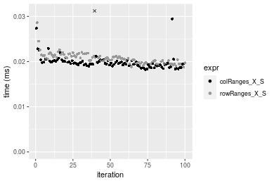
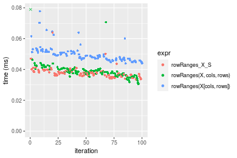
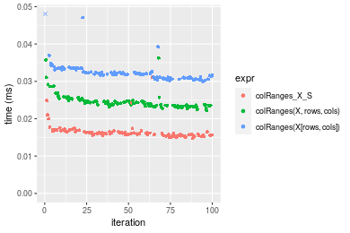
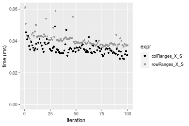

[matrixStats]: Benchmark report

---------------------------------------


# colRanges() and rowRanges() benchmarks on subsetted computation

This report benchmark the performance of colRanges() and rowRanges() on subsetted computation.


## Data type "integer"

### Data
```r
> rmatrix <- function(nrow, ncol, mode = c("logical", "double", "integer", "index"), range = c(-100, 
+     +100), na_prob = 0) {
+     mode <- match.arg(mode)
+     n <- nrow * ncol
+     if (mode == "logical") {
+         x <- sample(c(FALSE, TRUE), size = n, replace = TRUE)
+     }     else if (mode == "index") {
+         x <- seq_len(n)
+         mode <- "integer"
+     }     else {
+         x <- runif(n, min = range[1], max = range[2])
+     }
+     storage.mode(x) <- mode
+     if (na_prob > 0) 
+         x[sample(n, size = na_prob * n)] <- NA
+     dim(x) <- c(nrow, ncol)
+     x
+ }
> rmatrices <- function(scale = 10, seed = 1, ...) {
+     set.seed(seed)
+     data <- list()
+     data[[1]] <- rmatrix(nrow = scale * 1, ncol = scale * 1, ...)
+     data[[2]] <- rmatrix(nrow = scale * 10, ncol = scale * 10, ...)
+     data[[3]] <- rmatrix(nrow = scale * 100, ncol = scale * 1, ...)
+     data[[4]] <- t(data[[3]])
+     data[[5]] <- rmatrix(nrow = scale * 10, ncol = scale * 100, ...)
+     data[[6]] <- t(data[[5]])
+     names(data) <- sapply(data, FUN = function(x) paste(dim(x), collapse = "x"))
+     data
+ }
> data <- rmatrices(mode = mode)
```

### Results

#### 10x10 integer matrix

```r
> X <- data[["10x10"]]
> rows <- sample.int(nrow(X), size = nrow(X) * 0.7)
> cols <- sample.int(ncol(X), size = ncol(X) * 0.7)
> X_S <- X[rows, cols]
> gc()
          used  (Mb) gc trigger  (Mb) max used  (Mb)
Ncells 5235130 279.6   10014072 534.9 10014072 534.9
Vcells 9995989  76.3   18204443 138.9 18204443 138.9
> colStats <- microbenchmark(colRanges_X_S = colRanges(X_S, na.rm = FALSE), `colRanges(X, rows, cols)` = colRanges(X, 
+     rows = rows, cols = cols, na.rm = FALSE), `colRanges(X[rows, cols])` = colRanges(X[rows, cols], 
+     na.rm = FALSE), unit = "ms")
> X <- t(X)
> X_S <- t(X_S)
> gc()
          used  (Mb) gc trigger  (Mb) max used  (Mb)
Ncells 5221056 278.9   10014072 534.9 10014072 534.9
Vcells 9949677  76.0   18204443 138.9 18204443 138.9
> rowStats <- microbenchmark(rowRanges_X_S = rowRanges(X_S, na.rm = FALSE), `rowRanges(X, cols, rows)` = rowRanges(X, 
+     rows = cols, cols = rows, na.rm = FALSE), `rowRanges(X[cols, rows])` = rowRanges(X[cols, rows], 
+     na.rm = FALSE), unit = "ms")
```

_Table: Benchmarking of colRanges_X_S(), colRanges(X, rows, cols)() and colRanges(X[rows, cols])() on integer+10x10 data. The top panel shows times in milliseconds and the bottom panel shows relative times._


|   |expr                     |      min|        lq|      mean|   median|       uq|      max|
|:--|:------------------------|--------:|---------:|---------:|--------:|--------:|--------:|
|1  |colRanges_X_S            | 0.002012| 0.0021035| 0.0031134| 0.002171| 0.002253| 0.087894|
|2  |colRanges(X, rows, cols) | 0.002330| 0.0024310| 0.0026403| 0.002476| 0.002569| 0.007927|
|3  |colRanges(X[rows, cols]) | 0.002825| 0.0030835| 0.0033444| 0.003196| 0.003311| 0.010487|


|   |expr                     |      min|       lq|      mean|   median|       uq|       max|
|:--|:------------------------|--------:|--------:|---------:|--------:|--------:|---------:|
|1  |colRanges_X_S            | 1.000000| 1.000000| 1.0000000| 1.000000| 1.000000| 1.0000000|
|2  |colRanges(X, rows, cols) | 1.158052| 1.155693| 0.8480335| 1.140488| 1.140257| 0.0901882|
|3  |colRanges(X[rows, cols]) | 1.404076| 1.465890| 1.0741685| 1.472133| 1.469596| 0.1193142|

_Table: Benchmarking of rowRanges_X_S(), rowRanges(X, cols, rows)() and rowRanges(X[cols, rows])() on integer+10x10 data (transposed). The top panel shows times in milliseconds and the bottom panel shows relative times._


|   |expr                     |      min|        lq|      mean|    median|        uq|      max|
|:--|:------------------------|--------:|---------:|---------:|---------:|---------:|--------:|
|1  |rowRanges_X_S            | 0.002005| 0.0020875| 0.0022065| 0.0021385| 0.0022550| 0.004913|
|2  |rowRanges(X, cols, rows) | 0.002354| 0.0024430| 0.0033989| 0.0025140| 0.0025990| 0.082997|
|3  |rowRanges(X[cols, rows]) | 0.002864| 0.0030890| 0.0032535| 0.0031745| 0.0033535| 0.005173|


|   |expr                     |      min|       lq|     mean|   median|      uq|       max|
|:--|:------------------------|--------:|--------:|--------:|--------:|-------:|---------:|
|1  |rowRanges_X_S            | 1.000000| 1.000000| 1.000000| 1.000000| 1.00000|  1.000000|
|2  |rowRanges(X, cols, rows) | 1.174065| 1.170299| 1.540438| 1.175590| 1.15255| 16.893344|
|3  |rowRanges(X[cols, rows]) | 1.428429| 1.479761| 1.474536| 1.484452| 1.48714|  1.052921|

_Figure: Benchmarking of colRanges_X_S(), colRanges(X, rows, cols)() and colRanges(X[rows, cols])() on integer+10x10 data  as well as rowRanges_X_S(), rowRanges(X, cols, rows)() and rowRanges(X[cols, rows])() on the same data transposed.  Outliers are displayed as crosses.  Times are in milliseconds._


_Table: Benchmarking of colRanges_X_S() and rowRanges_X_S() on integer+10x10 data (original and transposed).  The top panel shows times in milliseconds and the bottom panel shows relative times._


|   |expr          |   min|     lq|    mean| median|    uq|    max|
|:--|:-------------|-----:|------:|-------:|------:|-----:|------:|
|2  |rowRanges_X_S | 2.005| 2.0875| 2.20647| 2.1385| 2.255|  4.913|
|1  |colRanges_X_S | 2.012| 2.1035| 3.11345| 2.1710| 2.253| 87.894|


|   |expr          |      min|       lq|     mean|   median|        uq|      max|
|:--|:-------------|--------:|--------:|--------:|--------:|---------:|--------:|
|2  |rowRanges_X_S | 1.000000| 1.000000| 1.000000| 1.000000| 1.0000000|  1.00000|
|1  |colRanges_X_S | 1.003491| 1.007665| 1.411055| 1.015198| 0.9991131| 17.89009|

_Figure: Benchmarking of colRanges_X_S() and rowRanges_X_S() on integer+10x10 data (original and transposed).  Outliers are displayed as crosses. Times are in milliseconds._


#### 100x100 integer matrix

```r
> X <- data[["100x100"]]
> rows <- sample.int(nrow(X), size = nrow(X) * 0.7)
> cols <- sample.int(ncol(X), size = ncol(X) * 0.7)
> X_S <- X[rows, cols]
> gc()
          used  (Mb) gc trigger  (Mb) max used  (Mb)
Ncells 5219676 278.8   10014072 534.9 10014072 534.9
Vcells 9618554  73.4   18204443 138.9 18204443 138.9
> colStats <- microbenchmark(colRanges_X_S = colRanges(X_S, na.rm = FALSE), `colRanges(X, rows, cols)` = colRanges(X, 
+     rows = rows, cols = cols, na.rm = FALSE), `colRanges(X[rows, cols])` = colRanges(X[rows, cols], 
+     na.rm = FALSE), unit = "ms")
> X <- t(X)
> X_S <- t(X_S)
> gc()
          used  (Mb) gc trigger  (Mb) max used  (Mb)
Ncells 5219652 278.8   10014072 534.9 10014072 534.9
Vcells 9623607  73.5   18204443 138.9 18204443 138.9
> rowStats <- microbenchmark(rowRanges_X_S = rowRanges(X_S, na.rm = FALSE), `rowRanges(X, cols, rows)` = rowRanges(X, 
+     rows = cols, cols = rows, na.rm = FALSE), `rowRanges(X[cols, rows])` = rowRanges(X[cols, rows], 
+     na.rm = FALSE), unit = "ms")
```

_Table: Benchmarking of colRanges_X_S(), colRanges(X, rows, cols)() and colRanges(X[rows, cols])() on integer+100x100 data. The top panel shows times in milliseconds and the bottom panel shows relative times._


|   |expr                     |      min|        lq|      mean|    median|        uq|      max|
|:--|:------------------------|--------:|---------:|---------:|---------:|---------:|--------:|
|1  |colRanges_X_S            | 0.019851| 0.0217780| 0.0223574| 0.0224045| 0.0229725| 0.027769|
|2  |colRanges(X, rows, cols) | 0.022888| 0.0243200| 0.0253248| 0.0249700| 0.0256230| 0.040140|
|3  |colRanges(X[rows, cols]) | 0.030650| 0.0328975| 0.0342720| 0.0338710| 0.0351025| 0.076202|


|   |expr                     |      min|       lq|     mean|   median|       uq|      max|
|:--|:------------------------|--------:|--------:|--------:|--------:|--------:|--------:|
|1  |colRanges_X_S            | 1.000000| 1.000000| 1.000000| 1.000000| 1.000000| 1.000000|
|2  |colRanges(X, rows, cols) | 1.152990| 1.116723| 1.132726| 1.114508| 1.115377| 1.445497|
|3  |colRanges(X[rows, cols]) | 1.544003| 1.510584| 1.532914| 1.511794| 1.528023| 2.744139|

_Table: Benchmarking of rowRanges_X_S(), rowRanges(X, cols, rows)() and rowRanges(X[cols, rows])() on integer+100x100 data (transposed). The top panel shows times in milliseconds and the bottom panel shows relative times._


|   |expr                     |      min|        lq|      mean|    median|        uq|      max|
|:--|:------------------------|--------:|---------:|---------:|---------:|---------:|--------:|
|2  |rowRanges(X, cols, rows) | 0.019141| 0.0202500| 0.0213730| 0.0209035| 0.0214090| 0.046046|
|1  |rowRanges_X_S            | 0.020006| 0.0207845| 0.0219542| 0.0218620| 0.0224525| 0.037172|
|3  |rowRanges(X[cols, rows]) | 0.030498| 0.0318345| 0.0333816| 0.0329985| 0.0344340| 0.056544|


|   |expr                     |      min|       lq|     mean|   median|       uq|       max|
|:--|:------------------------|--------:|--------:|--------:|--------:|--------:|---------:|
|2  |rowRanges(X, cols, rows) | 1.000000| 1.000000| 1.000000| 1.000000| 1.000000| 1.0000000|
|1  |rowRanges_X_S            | 1.045191| 1.026395| 1.027192| 1.045854| 1.048741| 0.8072797|
|3  |rowRanges(X[cols, rows]) | 1.593334| 1.572074| 1.561858| 1.578611| 1.608389| 1.2279894|

_Figure: Benchmarking of colRanges_X_S(), colRanges(X, rows, cols)() and colRanges(X[rows, cols])() on integer+100x100 data  as well as rowRanges_X_S(), rowRanges(X, cols, rows)() and rowRanges(X[cols, rows])() on the same data transposed.  Outliers are displayed as crosses.  Times are in milliseconds._


_Table: Benchmarking of colRanges_X_S() and rowRanges_X_S() on integer+100x100 data (original and transposed).  The top panel shows times in milliseconds and the bottom panel shows relative times._


|   |expr          |    min|      lq|     mean|  median|      uq|    max|
|:--|:-------------|------:|-------:|--------:|-------:|-------:|------:|
|2  |rowRanges_X_S | 20.006| 20.7845| 21.95420| 21.8620| 22.4525| 37.172|
|1  |colRanges_X_S | 19.851| 21.7780| 22.35741| 22.4045| 22.9725| 27.769|


|   |expr          |       min|     lq|     mean|   median|      uq|       max|
|:--|:-------------|---------:|------:|--------:|--------:|-------:|---------:|
|2  |rowRanges_X_S | 1.0000000| 1.0000| 1.000000| 1.000000| 1.00000| 1.0000000|
|1  |colRanges_X_S | 0.9922523| 1.0478| 1.018366| 1.024815| 1.02316| 0.7470408|

_Figure: Benchmarking of colRanges_X_S() and rowRanges_X_S() on integer+100x100 data (original and transposed).  Outliers are displayed as crosses. Times are in milliseconds._




#### 1000x10 integer matrix

```r
> X <- data[["1000x10"]]
> rows <- sample.int(nrow(X), size = nrow(X) * 0.7)
> cols <- sample.int(ncol(X), size = ncol(X) * 0.7)
> X_S <- X[rows, cols]
> gc()
          used  (Mb) gc trigger  (Mb) max used  (Mb)
Ncells 5220419 278.9   10014072 534.9 10014072 534.9
Vcells 9622605  73.5   18204443 138.9 18204443 138.9
> colStats <- microbenchmark(colRanges_X_S = colRanges(X_S, na.rm = FALSE), `colRanges(X, rows, cols)` = colRanges(X, 
+     rows = rows, cols = cols, na.rm = FALSE), `colRanges(X[rows, cols])` = colRanges(X[rows, cols], 
+     na.rm = FALSE), unit = "ms")
> X <- t(X)
> X_S <- t(X_S)
> gc()
          used  (Mb) gc trigger  (Mb) max used  (Mb)
Ncells 5220395 278.8   10014072 534.9 10014072 534.9
Vcells 9627658  73.5   18204443 138.9 18204443 138.9
> rowStats <- microbenchmark(rowRanges_X_S = rowRanges(X_S, na.rm = FALSE), `rowRanges(X, cols, rows)` = rowRanges(X, 
+     rows = cols, cols = rows, na.rm = FALSE), `rowRanges(X[cols, rows])` = rowRanges(X[cols, rows], 
+     na.rm = FALSE), unit = "ms")
```

_Table: Benchmarking of colRanges_X_S(), colRanges(X, rows, cols)() and colRanges(X[rows, cols])() on integer+1000x10 data. The top panel shows times in milliseconds and the bottom panel shows relative times._


|   |expr                     |      min|        lq|      mean|    median|        uq|      max|
|:--|:------------------------|--------:|---------:|---------:|---------:|---------:|--------:|
|1  |colRanges_X_S            | 0.014022| 0.0146555| 0.0151562| 0.0148355| 0.0153045| 0.029049|
|2  |colRanges(X, rows, cols) | 0.018711| 0.0196085| 0.0203109| 0.0200130| 0.0206185| 0.034948|
|3  |colRanges(X[rows, cols]) | 0.024800| 0.0258400| 0.0271271| 0.0264230| 0.0276130| 0.067263|


|   |expr                     |      min|       lq|     mean|   median|       uq|      max|
|:--|:------------------------|--------:|--------:|--------:|--------:|--------:|--------:|
|1  |colRanges_X_S            | 1.000000| 1.000000| 1.000000| 1.000000| 1.000000| 1.000000|
|2  |colRanges(X, rows, cols) | 1.334403| 1.337962| 1.340098| 1.348994| 1.347218| 1.203071|
|3  |colRanges(X[rows, cols]) | 1.768649| 1.763161| 1.789829| 1.781066| 1.804241| 2.315501|

_Table: Benchmarking of rowRanges_X_S(), rowRanges(X, cols, rows)() and rowRanges(X[cols, rows])() on integer+1000x10 data (transposed). The top panel shows times in milliseconds and the bottom panel shows relative times._


|   |expr                     |      min|        lq|      mean|    median|       uq|      max|
|:--|:------------------------|--------:|---------:|---------:|---------:|--------:|--------:|
|1  |rowRanges_X_S            | 0.018245| 0.0191040| 0.0202302| 0.0197060| 0.020315| 0.035008|
|2  |rowRanges(X, cols, rows) | 0.018464| 0.0195495| 0.0202468| 0.0200325| 0.020703| 0.025487|
|3  |rowRanges(X[cols, rows]) | 0.030223| 0.0319045| 0.0333712| 0.0326960| 0.033544| 0.081391|


|   |expr                     |      min|       lq|     mean|   median|       uq|       max|
|:--|:------------------------|--------:|--------:|--------:|--------:|--------:|---------:|
|1  |rowRanges_X_S            | 1.000000| 1.000000| 1.000000| 1.000000| 1.000000| 1.0000000|
|2  |rowRanges(X, cols, rows) | 1.012003| 1.023320| 1.000822| 1.016569| 1.019099| 0.7280336|
|3  |rowRanges(X[cols, rows]) | 1.656509| 1.670043| 1.649572| 1.659190| 1.651194| 2.3249257|

_Figure: Benchmarking of colRanges_X_S(), colRanges(X, rows, cols)() and colRanges(X[rows, cols])() on integer+1000x10 data  as well as rowRanges_X_S(), rowRanges(X, cols, rows)() and rowRanges(X[cols, rows])() on the same data transposed.  Outliers are displayed as crosses.  Times are in milliseconds._


_Table: Benchmarking of colRanges_X_S() and rowRanges_X_S() on integer+1000x10 data (original and transposed).  The top panel shows times in milliseconds and the bottom panel shows relative times._


|   |expr          |    min|      lq|     mean|  median|      uq|    max|
|:--|:-------------|------:|-------:|--------:|-------:|-------:|------:|
|1  |colRanges_X_S | 14.022| 14.6555| 15.15625| 14.8355| 15.3045| 29.049|
|2  |rowRanges_X_S | 18.245| 19.1040| 20.23021| 19.7060| 20.3150| 35.008|


|   |expr          |     min|       lq|     mean| median|       uq|      max|
|:--|:-------------|-------:|--------:|--------:|------:|--------:|--------:|
|1  |colRanges_X_S | 1.00000| 1.000000| 1.000000| 1.0000| 1.000000| 1.000000|
|2  |rowRanges_X_S | 1.30117| 1.303538| 1.334777| 1.3283| 1.327387| 1.205136|

_Figure: Benchmarking of colRanges_X_S() and rowRanges_X_S() on integer+1000x10 data (original and transposed).  Outliers are displayed as crosses. Times are in milliseconds._


#### 10x1000 integer matrix

```r
> X <- data[["10x1000"]]
> rows <- sample.int(nrow(X), size = nrow(X) * 0.7)
> cols <- sample.int(ncol(X), size = ncol(X) * 0.7)
> X_S <- X[rows, cols]
> gc()
          used  (Mb) gc trigger  (Mb) max used  (Mb)
Ncells 5220624 278.9   10014072 534.9 10014072 534.9
Vcells 9623461  73.5   18204443 138.9 18204443 138.9
> colStats <- microbenchmark(colRanges_X_S = colRanges(X_S, na.rm = FALSE), `colRanges(X, rows, cols)` = colRanges(X, 
+     rows = rows, cols = cols, na.rm = FALSE), `colRanges(X[rows, cols])` = colRanges(X[rows, cols], 
+     na.rm = FALSE), unit = "ms")
> X <- t(X)
> X_S <- t(X_S)
> gc()
          used  (Mb) gc trigger  (Mb) max used  (Mb)
Ncells 5220600 278.9   10014072 534.9 10014072 534.9
Vcells 9628514  73.5   18204443 138.9 18204443 138.9
> rowStats <- microbenchmark(rowRanges_X_S = rowRanges(X_S, na.rm = FALSE), `rowRanges(X, cols, rows)` = rowRanges(X, 
+     rows = cols, cols = rows, na.rm = FALSE), `rowRanges(X[cols, rows])` = rowRanges(X[cols, rows], 
+     na.rm = FALSE), unit = "ms")
```

_Table: Benchmarking of colRanges_X_S(), colRanges(X, rows, cols)() and colRanges(X[rows, cols])() on integer+10x1000 data. The top panel shows times in milliseconds and the bottom panel shows relative times._


|   |expr                     |      min|        lq|      mean|   median|        uq|      max|
|:--|:------------------------|--------:|---------:|---------:|--------:|---------:|--------:|
|1  |colRanges_X_S            | 0.035523| 0.0386320| 0.0409872| 0.040168| 0.0421240| 0.066279|
|2  |colRanges(X, rows, cols) | 0.041495| 0.0448915| 0.0480171| 0.047265| 0.0508235| 0.072679|
|3  |colRanges(X[rows, cols]) | 0.046918| 0.0516540| 0.0537267| 0.053150| 0.0556095| 0.080991|


|   |expr                     |      min|       lq|     mean|   median|       uq|      max|
|:--|:------------------------|--------:|--------:|--------:|--------:|--------:|--------:|
|1  |colRanges_X_S            | 1.000000| 1.000000| 1.000000| 1.000000| 1.000000| 1.000000|
|2  |colRanges(X, rows, cols) | 1.168116| 1.162029| 1.171516| 1.176683| 1.206521| 1.096561|
|3  |colRanges(X[rows, cols]) | 1.320778| 1.337078| 1.310818| 1.323193| 1.320138| 1.221971|

_Table: Benchmarking of rowRanges_X_S(), rowRanges(X, cols, rows)() and rowRanges(X[cols, rows])() on integer+10x1000 data (transposed). The top panel shows times in milliseconds and the bottom panel shows relative times._


|   |expr                     |      min|       lq|      mean|    median|        uq|      max|
|:--|:------------------------|--------:|--------:|---------:|---------:|---------:|--------:|
|1  |rowRanges_X_S            | 0.032060| 0.034388| 0.0359216| 0.0354915| 0.0369040| 0.051243|
|2  |rowRanges(X, cols, rows) | 0.030077| 0.036106| 0.0381697| 0.0377550| 0.0397455| 0.062610|
|3  |rowRanges(X[cols, rows]) | 0.040814| 0.044296| 0.0467107| 0.0458755| 0.0489590| 0.070674|


|   |expr                     |       min|       lq|     mean|   median|       uq|      max|
|:--|:------------------------|---------:|--------:|--------:|--------:|--------:|--------:|
|1  |rowRanges_X_S            | 1.0000000| 1.000000| 1.000000| 1.000000| 1.000000| 1.000000|
|2  |rowRanges(X, cols, rows) | 0.9381472| 1.049959| 1.062581| 1.063776| 1.076997| 1.221825|
|3  |rowRanges(X[cols, rows]) | 1.2730505| 1.288124| 1.300350| 1.292577| 1.326658| 1.379193|

_Figure: Benchmarking of colRanges_X_S(), colRanges(X, rows, cols)() and colRanges(X[rows, cols])() on integer+10x1000 data  as well as rowRanges_X_S(), rowRanges(X, cols, rows)() and rowRanges(X[cols, rows])() on the same data transposed.  Outliers are displayed as crosses.  Times are in milliseconds._



_Table: Benchmarking of colRanges_X_S() and rowRanges_X_S() on integer+10x1000 data (original and transposed).  The top panel shows times in milliseconds and the bottom panel shows relative times._


|   |expr          |    min|     lq|     mean|  median|     uq|    max|
|:--|:-------------|------:|------:|--------:|-------:|------:|------:|
|2  |rowRanges_X_S | 32.060| 34.388| 35.92165| 35.4915| 36.904| 51.243|
|1  |colRanges_X_S | 35.523| 38.632| 40.98715| 40.1680| 42.124| 66.279|


|   |expr          |      min|       lq|     mean|   median|       uq|      max|
|:--|:-------------|--------:|--------:|--------:|--------:|--------:|--------:|
|2  |rowRanges_X_S | 1.000000| 1.000000| 1.000000| 1.000000| 1.000000| 1.000000|
|1  |colRanges_X_S | 1.108016| 1.123415| 1.141015| 1.131764| 1.141448| 1.293425|

_Figure: Benchmarking of colRanges_X_S() and rowRanges_X_S() on integer+10x1000 data (original and transposed).  Outliers are displayed as crosses. Times are in milliseconds._


#### 100x1000 integer matrix

```r
> X <- data[["100x1000"]]
> rows <- sample.int(nrow(X), size = nrow(X) * 0.7)
> cols <- sample.int(ncol(X), size = ncol(X) * 0.7)
> X_S <- X[rows, cols]
> gc()
          used  (Mb) gc trigger  (Mb) max used  (Mb)
Ncells 5220834 278.9   10014072 534.9 10014072 534.9
Vcells 9646136  73.6   18204443 138.9 18204443 138.9
> colStats <- microbenchmark(colRanges_X_S = colRanges(X_S, na.rm = FALSE), `colRanges(X, rows, cols)` = colRanges(X, 
+     rows = rows, cols = cols, na.rm = FALSE), `colRanges(X[rows, cols])` = colRanges(X[rows, cols], 
+     na.rm = FALSE), unit = "ms")
> X <- t(X)
> X_S <- t(X_S)
> gc()
          used  (Mb) gc trigger  (Mb) max used  (Mb)
Ncells 5220810 278.9   10014072 534.9 10014072 534.9
Vcells 9696189  74.0   18204443 138.9 18204443 138.9
> rowStats <- microbenchmark(rowRanges_X_S = rowRanges(X_S, na.rm = FALSE), `rowRanges(X, cols, rows)` = rowRanges(X, 
+     rows = cols, cols = rows, na.rm = FALSE), `rowRanges(X[cols, rows])` = rowRanges(X[cols, rows], 
+     na.rm = FALSE), unit = "ms")
```

_Table: Benchmarking of colRanges_X_S(), colRanges(X, rows, cols)() and colRanges(X[rows, cols])() on integer+100x1000 data. The top panel shows times in milliseconds and the bottom panel shows relative times._


|   |expr                     |      min|        lq|      mean|    median|        uq|      max|
|:--|:------------------------|--------:|---------:|---------:|---------:|---------:|--------:|
|1  |colRanges_X_S            | 0.130901| 0.1388050| 0.1605805| 0.1545935| 0.1757175| 0.240557|
|2  |colRanges(X, rows, cols) | 0.147290| 0.1556710| 0.1772729| 0.1716845| 0.1921115| 0.300820|
|3  |colRanges(X[rows, cols]) | 0.201016| 0.2124915| 0.2446053| 0.2398385| 0.2624780| 0.340007|


|   |expr                     |      min|       lq|     mean|   median|       uq|      max|
|:--|:------------------------|--------:|--------:|--------:|--------:|--------:|--------:|
|1  |colRanges_X_S            | 1.000000| 1.000000| 1.000000| 1.000000| 1.000000| 1.000000|
|2  |colRanges(X, rows, cols) | 1.125201| 1.121509| 1.103950| 1.110555| 1.093298| 1.250514|
|3  |colRanges(X[rows, cols]) | 1.535634| 1.530863| 1.523257| 1.551414| 1.493750| 1.413415|

_Table: Benchmarking of rowRanges_X_S(), rowRanges(X, cols, rows)() and rowRanges(X[cols, rows])() on integer+100x1000 data (transposed). The top panel shows times in milliseconds and the bottom panel shows relative times._


|   |expr                     |      min|        lq|      mean|    median|        uq|      max|
|:--|:------------------------|--------:|---------:|---------:|---------:|---------:|--------:|
|2  |rowRanges(X, cols, rows) | 0.121806| 0.1285665| 0.1454525| 0.1402765| 0.1593545| 0.250023|
|1  |rowRanges_X_S            | 0.126400| 0.1398315| 0.1574351| 0.1586775| 0.1698145| 0.228325|
|3  |rowRanges(X[cols, rows]) | 0.189491| 0.2050475| 0.2323666| 0.2317285| 0.2480300| 0.305606|


|   |expr                     |      min|       lq|     mean|   median|       uq|      max|
|:--|:------------------------|--------:|--------:|--------:|--------:|--------:|--------:|
|2  |rowRanges(X, cols, rows) | 1.000000| 1.000000| 1.000000| 1.000000| 1.000000| 1.000000|
|1  |rowRanges_X_S            | 1.037716| 1.087620| 1.082382| 1.131177| 1.065640| 0.913216|
|3  |rowRanges(X[cols, rows]) | 1.555679| 1.594875| 1.597544| 1.651941| 1.556467| 1.222311|

_Figure: Benchmarking of colRanges_X_S(), colRanges(X, rows, cols)() and colRanges(X[rows, cols])() on integer+100x1000 data  as well as rowRanges_X_S(), rowRanges(X, cols, rows)() and rowRanges(X[cols, rows])() on the same data transposed.  Outliers are displayed as crosses.  Times are in milliseconds._


_Table: Benchmarking of colRanges_X_S() and rowRanges_X_S() on integer+100x1000 data (original and transposed).  The top panel shows times in milliseconds and the bottom panel shows relative times._


|   |expr          |     min|       lq|     mean|   median|       uq|     max|
|:--|:-------------|-------:|--------:|--------:|--------:|--------:|-------:|
|1  |colRanges_X_S | 130.901| 138.8050| 160.5805| 154.5935| 175.7175| 240.557|
|2  |rowRanges_X_S | 126.400| 139.8315| 157.4351| 158.6775| 169.8145| 228.325|


|   |expr          |       min|       lq|      mean|   median|        uq|       max|
|:--|:-------------|---------:|--------:|---------:|--------:|---------:|---------:|
|1  |colRanges_X_S | 1.0000000| 1.000000| 1.0000000| 1.000000| 1.0000000| 1.0000000|
|2  |rowRanges_X_S | 0.9656152| 1.007395| 0.9804126| 1.026418| 0.9664063| 0.9491513|

_Figure: Benchmarking of colRanges_X_S() and rowRanges_X_S() on integer+100x1000 data (original and transposed).  Outliers are displayed as crosses. Times are in milliseconds._


#### 1000x100 integer matrix

```r
> X <- data[["1000x100"]]
> rows <- sample.int(nrow(X), size = nrow(X) * 0.7)
> cols <- sample.int(ncol(X), size = ncol(X) * 0.7)
> X_S <- X[rows, cols]
> gc()
          used  (Mb) gc trigger  (Mb) max used  (Mb)
Ncells 5221047 278.9   10014072 534.9 10014072 534.9
Vcells 9646922  73.7   18204443 138.9 18204443 138.9
> colStats <- microbenchmark(colRanges_X_S = colRanges(X_S, na.rm = FALSE), `colRanges(X, rows, cols)` = colRanges(X, 
+     rows = rows, cols = cols, na.rm = FALSE), `colRanges(X[rows, cols])` = colRanges(X[rows, cols], 
+     na.rm = FALSE), unit = "ms")
> X <- t(X)
> X_S <- t(X_S)
> gc()
          used  (Mb) gc trigger  (Mb) max used  (Mb)
Ncells 5221023 278.9   10014072 534.9 10014072 534.9
Vcells 9696975  74.0   18204443 138.9 18204443 138.9
> rowStats <- microbenchmark(rowRanges_X_S = rowRanges(X_S, na.rm = FALSE), `rowRanges(X, cols, rows)` = rowRanges(X, 
+     rows = cols, cols = rows, na.rm = FALSE), `rowRanges(X[cols, rows])` = rowRanges(X[cols, rows], 
+     na.rm = FALSE), unit = "ms")
```

_Table: Benchmarking of colRanges_X_S(), colRanges(X, rows, cols)() and colRanges(X[rows, cols])() on integer+1000x100 data. The top panel shows times in milliseconds and the bottom panel shows relative times._


|   |expr                     |      min|        lq|      mean|    median|        uq|      max|
|:--|:------------------------|--------:|---------:|---------:|---------:|---------:|--------:|
|1  |colRanges_X_S            | 0.090694| 0.0994580| 0.1111738| 0.1066285| 0.1180650| 0.179843|
|2  |colRanges(X, rows, cols) | 0.105896| 0.1152700| 0.1279112| 0.1263315| 0.1355745| 0.167570|
|3  |colRanges(X[rows, cols]) | 0.157940| 0.1728185| 0.1936214| 0.1924345| 0.2063180| 0.282727|


|   |expr                     |      min|       lq|     mean|   median|       uq|       max|
|:--|:------------------------|--------:|--------:|--------:|--------:|--------:|---------:|
|1  |colRanges_X_S            | 1.000000| 1.000000| 1.000000| 1.000000| 1.000000| 1.0000000|
|2  |colRanges(X, rows, cols) | 1.167619| 1.158982| 1.150552| 1.184782| 1.148304| 0.9317571|
|3  |colRanges(X[rows, cols]) | 1.741460| 1.737603| 1.741610| 1.804719| 1.747495| 1.5720768|

_Table: Benchmarking of rowRanges_X_S(), rowRanges(X, cols, rows)() and rowRanges(X[cols, rows])() on integer+1000x100 data (transposed). The top panel shows times in milliseconds and the bottom panel shows relative times._


|   |expr                     |      min|        lq|      mean|    median|       uq|      max|
|:--|:------------------------|--------:|---------:|---------:|---------:|--------:|--------:|
|2  |rowRanges(X, cols, rows) | 0.099035| 0.1120730| 0.1263451| 0.1225745| 0.130991| 0.251007|
|1  |rowRanges_X_S            | 0.105747| 0.1153585| 0.1353162| 0.1284205| 0.144505| 0.249117|
|3  |rowRanges(X[cols, rows]) | 0.174259| 0.1927415| 0.2246790| 0.2103095| 0.247270| 0.397292|


|   |expr                     |      min|       lq|     mean|   median|       uq|       max|
|:--|:------------------------|--------:|--------:|--------:|--------:|--------:|---------:|
|2  |rowRanges(X, cols, rows) | 1.000000| 1.000000| 1.000000| 1.000000| 1.000000| 1.0000000|
|1  |rowRanges_X_S            | 1.067774| 1.029316| 1.071005| 1.047693| 1.103167| 0.9924703|
|3  |rowRanges(X[cols, rows]) | 1.759570| 1.719785| 1.778295| 1.715769| 1.887687| 1.5827925|

_Figure: Benchmarking of colRanges_X_S(), colRanges(X, rows, cols)() and colRanges(X[rows, cols])() on integer+1000x100 data  as well as rowRanges_X_S(), rowRanges(X, cols, rows)() and rowRanges(X[cols, rows])() on the same data transposed.  Outliers are displayed as crosses.  Times are in milliseconds._


_Table: Benchmarking of colRanges_X_S() and rowRanges_X_S() on integer+1000x100 data (original and transposed).  The top panel shows times in milliseconds and the bottom panel shows relative times._


|   |expr          |     min|       lq|     mean|   median|      uq|     max|
|:--|:-------------|-------:|--------:|--------:|--------:|-------:|-------:|
|1  |colRanges_X_S |  90.694|  99.4580| 111.1738| 106.6285| 118.065| 179.843|
|2  |rowRanges_X_S | 105.747| 115.3585| 135.3162| 128.4205| 144.505| 249.117|


|   |expr          |      min|       lq|     mean|   median|       uq|      max|
|:--|:-------------|--------:|--------:|--------:|--------:|--------:|--------:|
|1  |colRanges_X_S | 1.000000| 1.000000| 1.000000| 1.000000| 1.000000| 1.000000|
|2  |rowRanges_X_S | 1.165976| 1.159871| 1.217159| 1.204373| 1.223944| 1.385191|

_Figure: Benchmarking of colRanges_X_S() and rowRanges_X_S() on integer+1000x100 data (original and transposed).  Outliers are displayed as crosses. Times are in milliseconds._


## Data type "double"

### Data
```r
> rmatrix <- function(nrow, ncol, mode = c("logical", "double", "integer", "index"), range = c(-100, 
+     +100), na_prob = 0) {
+     mode <- match.arg(mode)
+     n <- nrow * ncol
+     if (mode == "logical") {
+         x <- sample(c(FALSE, TRUE), size = n, replace = TRUE)
+     }     else if (mode == "index") {
+         x <- seq_len(n)
+         mode <- "integer"
+     }     else {
+         x <- runif(n, min = range[1], max = range[2])
+     }
+     storage.mode(x) <- mode
+     if (na_prob > 0) 
+         x[sample(n, size = na_prob * n)] <- NA
+     dim(x) <- c(nrow, ncol)
+     x
+ }
> rmatrices <- function(scale = 10, seed = 1, ...) {
+     set.seed(seed)
+     data <- list()
+     data[[1]] <- rmatrix(nrow = scale * 1, ncol = scale * 1, ...)
+     data[[2]] <- rmatrix(nrow = scale * 10, ncol = scale * 10, ...)
+     data[[3]] <- rmatrix(nrow = scale * 100, ncol = scale * 1, ...)
+     data[[4]] <- t(data[[3]])
+     data[[5]] <- rmatrix(nrow = scale * 10, ncol = scale * 100, ...)
+     data[[6]] <- t(data[[5]])
+     names(data) <- sapply(data, FUN = function(x) paste(dim(x), collapse = "x"))
+     data
+ }
> data <- rmatrices(mode = mode)
```

### Results

#### 10x10 double matrix

```r
> X <- data[["10x10"]]
> rows <- sample.int(nrow(X), size = nrow(X) * 0.7)
> cols <- sample.int(ncol(X), size = ncol(X) * 0.7)
> X_S <- X[rows, cols]
> gc()
          used  (Mb) gc trigger  (Mb) max used  (Mb)
Ncells 5221264 278.9   10014072 534.9 10014072 534.9
Vcells 9738037  74.3   18204443 138.9 18204443 138.9
> colStats <- microbenchmark(colRanges_X_S = colRanges(X_S, na.rm = FALSE), `colRanges(X, rows, cols)` = colRanges(X, 
+     rows = rows, cols = cols, na.rm = FALSE), `colRanges(X[rows, cols])` = colRanges(X[rows, cols], 
+     na.rm = FALSE), unit = "ms")
> X <- t(X)
> X_S <- t(X_S)
> gc()
          used  (Mb) gc trigger  (Mb) max used  (Mb)
Ncells 5221231 278.9   10014072 534.9 10014072 534.9
Vcells 9738175  74.3   18204443 138.9 18204443 138.9
> rowStats <- microbenchmark(rowRanges_X_S = rowRanges(X_S, na.rm = FALSE), `rowRanges(X, cols, rows)` = rowRanges(X, 
+     rows = cols, cols = rows, na.rm = FALSE), `rowRanges(X[cols, rows])` = rowRanges(X[cols, rows], 
+     na.rm = FALSE), unit = "ms")
```

_Table: Benchmarking of colRanges_X_S(), colRanges(X, rows, cols)() and colRanges(X[rows, cols])() on double+10x10 data. The top panel shows times in milliseconds and the bottom panel shows relative times._


|   |expr                     |      min|        lq|      mean|    median|        uq|      max|
|:--|:------------------------|--------:|---------:|---------:|---------:|---------:|--------:|
|1  |colRanges_X_S            | 0.001974| 0.0020620| 0.0023061| 0.0021075| 0.0022390| 0.016437|
|2  |colRanges(X, rows, cols) | 0.002362| 0.0024395| 0.0025639| 0.0024815| 0.0025925| 0.005178|
|3  |colRanges(X[rows, cols]) | 0.002838| 0.0030090| 0.0033199| 0.0031820| 0.0033360| 0.007430|


|   |expr                     |      min|       lq|     mean|   median|       uq|      max|
|:--|:------------------------|--------:|--------:|--------:|--------:|--------:|--------:|
|1  |colRanges_X_S            | 1.000000| 1.000000| 1.000000| 1.000000| 1.000000| 1.000000|
|2  |colRanges(X, rows, cols) | 1.196555| 1.183075| 1.111767| 1.177461| 1.157883| 0.315021|
|3  |colRanges(X[rows, cols]) | 1.437690| 1.459263| 1.439596| 1.509846| 1.489951| 0.452029|

_Table: Benchmarking of rowRanges_X_S(), rowRanges(X, cols, rows)() and rowRanges(X[cols, rows])() on double+10x10 data (transposed). The top panel shows times in milliseconds and the bottom panel shows relative times._


|   |expr                     |      min|        lq|      mean|   median|       uq|      max|
|:--|:------------------------|--------:|---------:|---------:|--------:|--------:|--------:|
|1  |rowRanges_X_S            | 0.002013| 0.0021055| 0.0022321| 0.002161| 0.002290| 0.004894|
|2  |rowRanges(X, cols, rows) | 0.002373| 0.0024510| 0.0027198| 0.002502| 0.002623| 0.018840|
|3  |rowRanges(X[cols, rows]) | 0.002913| 0.0030815| 0.0033373| 0.003225| 0.003419| 0.005721|


|   |expr                     |      min|       lq|     mean|   median|       uq|      max|
|:--|:------------------------|--------:|--------:|--------:|--------:|--------:|--------:|
|1  |rowRanges_X_S            | 1.000000| 1.000000| 1.000000| 1.000000| 1.000000| 1.000000|
|2  |rowRanges(X, cols, rows) | 1.178838| 1.164094| 1.218459| 1.157797| 1.145415| 3.849612|
|3  |rowRanges(X[cols, rows]) | 1.447094| 1.463548| 1.495126| 1.492365| 1.493013| 1.168982|

_Figure: Benchmarking of colRanges_X_S(), colRanges(X, rows, cols)() and colRanges(X[rows, cols])() on double+10x10 data  as well as rowRanges_X_S(), rowRanges(X, cols, rows)() and rowRanges(X[cols, rows])() on the same data transposed.  Outliers are displayed as crosses.  Times are in milliseconds._


_Table: Benchmarking of colRanges_X_S() and rowRanges_X_S() on double+10x10 data (original and transposed).  The top panel shows times in milliseconds and the bottom panel shows relative times._


|   |expr          |   min|     lq|    mean| median|    uq|    max|
|:--|:-------------|-----:|------:|-------:|------:|-----:|------:|
|1  |colRanges_X_S | 1.974| 2.0620| 2.30614| 2.1075| 2.239| 16.437|
|2  |rowRanges_X_S | 2.013| 2.1055| 2.23214| 2.1610| 2.290|  4.894|


|   |expr          |      min|       lq|      mean|   median|       uq|       max|
|:--|:-------------|--------:|--------:|---------:|--------:|--------:|---------:|
|1  |colRanges_X_S | 1.000000| 1.000000| 1.0000000| 1.000000| 1.000000| 1.0000000|
|2  |rowRanges_X_S | 1.019757| 1.021096| 0.9679117| 1.025386| 1.022778| 0.2977429|

_Figure: Benchmarking of colRanges_X_S() and rowRanges_X_S() on double+10x10 data (original and transposed).  Outliers are displayed as crosses. Times are in milliseconds._


#### 100x100 double matrix

```r
> X <- data[["100x100"]]
> rows <- sample.int(nrow(X), size = nrow(X) * 0.7)
> cols <- sample.int(ncol(X), size = ncol(X) * 0.7)
> X_S <- X[rows, cols]
> gc()
          used  (Mb) gc trigger  (Mb) max used  (Mb)
Ncells 5221461 278.9   10014072 534.9 10014072 534.9
Vcells 9743994  74.4   18204443 138.9 18204443 138.9
> colStats <- microbenchmark(colRanges_X_S = colRanges(X_S, na.rm = FALSE), `colRanges(X, rows, cols)` = colRanges(X, 
+     rows = rows, cols = cols, na.rm = FALSE), `colRanges(X[rows, cols])` = colRanges(X[rows, cols], 
+     na.rm = FALSE), unit = "ms")
> X <- t(X)
> X_S <- t(X_S)
> gc()
          used  (Mb) gc trigger  (Mb) max used  (Mb)
Ncells 5221437 278.9   10014072 534.9 10014072 534.9
Vcells 9754047  74.5   18204443 138.9 18204443 138.9
> rowStats <- microbenchmark(rowRanges_X_S = rowRanges(X_S, na.rm = FALSE), `rowRanges(X, cols, rows)` = rowRanges(X, 
+     rows = cols, cols = rows, na.rm = FALSE), `rowRanges(X[cols, rows])` = rowRanges(X[cols, rows], 
+     na.rm = FALSE), unit = "ms")
```

_Table: Benchmarking of colRanges_X_S(), colRanges(X, rows, cols)() and colRanges(X[rows, cols])() on double+100x100 data. The top panel shows times in milliseconds and the bottom panel shows relative times._


|   |expr                     |      min|        lq|      mean|    median|        uq|      max|
|:--|:------------------------|--------:|---------:|---------:|---------:|---------:|--------:|
|2  |colRanges(X, rows, cols) | 0.020723| 0.0220805| 0.0234259| 0.0230085| 0.0239595| 0.038089|
|1  |colRanges_X_S            | 0.021610| 0.0228065| 0.0237359| 0.0238390| 0.0245315| 0.029832|
|3  |colRanges(X[rows, cols]) | 0.036219| 0.0380625| 0.0401325| 0.0395215| 0.0411615| 0.071946|


|   |expr                     |      min|       lq|     mean|   median|       uq|       max|
|:--|:------------------------|--------:|--------:|--------:|--------:|--------:|---------:|
|2  |colRanges(X, rows, cols) | 1.000000| 1.000000| 1.000000| 1.000000| 1.000000| 1.0000000|
|1  |colRanges_X_S            | 1.042803| 1.032880| 1.013235| 1.036095| 1.023874| 0.7832183|
|3  |colRanges(X[rows, cols]) | 1.747768| 1.723806| 1.713173| 1.717691| 1.717962| 1.8888918|

_Table: Benchmarking of rowRanges_X_S(), rowRanges(X, cols, rows)() and rowRanges(X[cols, rows])() on double+100x100 data (transposed). The top panel shows times in milliseconds and the bottom panel shows relative times._


|   |expr                     |      min|        lq|      mean|    median|        uq|      max|
|:--|:------------------------|--------:|---------:|---------:|---------:|---------:|--------:|
|2  |rowRanges(X, cols, rows) | 0.023988| 0.0253855| 0.0272718| 0.0262650| 0.0276335| 0.059287|
|1  |rowRanges_X_S            | 0.025732| 0.0271515| 0.0283072| 0.0279185| 0.0293455| 0.038080|
|3  |rowRanges(X[cols, rows]) | 0.040706| 0.0424655| 0.0440252| 0.0432900| 0.0458765| 0.061164|


|   |expr                     |      min|       lq|     mean|   median|       uq|       max|
|:--|:------------------------|--------:|--------:|--------:|--------:|--------:|---------:|
|2  |rowRanges(X, cols, rows) | 1.000000| 1.000000| 1.000000| 1.000000| 1.000000| 1.0000000|
|1  |rowRanges_X_S            | 1.072703| 1.069567| 1.037965| 1.062955| 1.061954| 0.6422993|
|3  |rowRanges(X[cols, rows]) | 1.696932| 1.672825| 1.614312| 1.648201| 1.660177| 1.0316596|

_Figure: Benchmarking of colRanges_X_S(), colRanges(X, rows, cols)() and colRanges(X[rows, cols])() on double+100x100 data  as well as rowRanges_X_S(), rowRanges(X, cols, rows)() and rowRanges(X[cols, rows])() on the same data transposed.  Outliers are displayed as crosses.  Times are in milliseconds._





_Table: Benchmarking of colRanges_X_S() and rowRanges_X_S() on double+100x100 data (original and transposed).  The top panel shows times in milliseconds and the bottom panel shows relative times._


|   |expr          |    min|      lq|     mean|  median|      uq|    max|
|:--|:-------------|------:|-------:|--------:|-------:|-------:|------:|
|1  |colRanges_X_S | 21.610| 22.8065| 23.73589| 23.8390| 24.5315| 29.832|
|2  |rowRanges_X_S | 25.732| 27.1515| 28.30716| 27.9185| 29.3455| 38.080|


|   |expr          |      min|       lq|     mean|   median|       uq|      max|
|:--|:-------------|--------:|--------:|--------:|--------:|--------:|--------:|
|1  |colRanges_X_S | 1.000000| 1.000000| 1.000000| 1.000000| 1.000000| 1.000000|
|2  |rowRanges_X_S | 1.190745| 1.190516| 1.192589| 1.171127| 1.196238| 1.276482|

_Figure: Benchmarking of colRanges_X_S() and rowRanges_X_S() on double+100x100 data (original and transposed).  Outliers are displayed as crosses. Times are in milliseconds._


#### 1000x10 double matrix

```r
> X <- data[["1000x10"]]
> rows <- sample.int(nrow(X), size = nrow(X) * 0.7)
> cols <- sample.int(ncol(X), size = ncol(X) * 0.7)
> X_S <- X[rows, cols]
> gc()
          used  (Mb) gc trigger  (Mb) max used  (Mb)
Ncells 5221661 278.9   10014072 534.9 10014072 534.9
Vcells 9745415  74.4   18204443 138.9 18204443 138.9
> colStats <- microbenchmark(colRanges_X_S = colRanges(X_S, na.rm = FALSE), `colRanges(X, rows, cols)` = colRanges(X, 
+     rows = rows, cols = cols, na.rm = FALSE), `colRanges(X[rows, cols])` = colRanges(X[rows, cols], 
+     na.rm = FALSE), unit = "ms")
> X <- t(X)
> X_S <- t(X_S)
> gc()
          used  (Mb) gc trigger  (Mb) max used  (Mb)
Ncells 5221637 278.9   10014072 534.9 10014072 534.9
Vcells 9755468  74.5   18204443 138.9 18204443 138.9
> rowStats <- microbenchmark(rowRanges_X_S = rowRanges(X_S, na.rm = FALSE), `rowRanges(X, cols, rows)` = rowRanges(X, 
+     rows = cols, cols = rows, na.rm = FALSE), `rowRanges(X[cols, rows])` = rowRanges(X[cols, rows], 
+     na.rm = FALSE), unit = "ms")
```

_Table: Benchmarking of colRanges_X_S(), colRanges(X, rows, cols)() and colRanges(X[rows, cols])() on double+1000x10 data. The top panel shows times in milliseconds and the bottom panel shows relative times._


|   |expr                     |      min|        lq|      mean|    median|        uq|      max|
|:--|:------------------------|--------:|---------:|---------:|---------:|---------:|--------:|
|1  |colRanges_X_S            | 0.017782| 0.0188225| 0.0191955| 0.0193420| 0.0195735| 0.022398|
|2  |colRanges(X, rows, cols) | 0.019087| 0.0199175| 0.0207812| 0.0207125| 0.0212755| 0.034280|
|3  |colRanges(X[rows, cols]) | 0.033639| 0.0341220| 0.0361588| 0.0355915| 0.0368200| 0.067759|


|   |expr                     |      min|       lq|     mean|   median|       uq|      max|
|:--|:------------------------|--------:|--------:|--------:|--------:|--------:|--------:|
|1  |colRanges_X_S            | 1.000000| 1.000000| 1.000000| 1.000000| 1.000000| 1.000000|
|2  |colRanges(X, rows, cols) | 1.073389| 1.058175| 1.082611| 1.070856| 1.086954| 1.530494|
|3  |colRanges(X[rows, cols]) | 1.891744| 1.812830| 1.883716| 1.840115| 1.881115| 3.025225|

_Table: Benchmarking of rowRanges_X_S(), rowRanges(X, cols, rows)() and rowRanges(X[cols, rows])() on double+1000x10 data (transposed). The top panel shows times in milliseconds and the bottom panel shows relative times._


|   |expr                     |      min|        lq|      mean|    median|        uq|      max|
|:--|:------------------------|--------:|---------:|---------:|---------:|---------:|--------:|
|1  |rowRanges_X_S            | 0.023975| 0.0249745| 0.0258991| 0.0252805| 0.0263230| 0.046625|
|2  |rowRanges(X, cols, rows) | 0.024460| 0.0255640| 0.0264750| 0.0265635| 0.0271845| 0.032940|
|3  |rowRanges(X[cols, rows]) | 0.042009| 0.0437050| 0.0455300| 0.0452910| 0.0458030| 0.080222|


|   |expr                     |      min|       lq|     mean|   median|       uq|       max|
|:--|:------------------------|--------:|--------:|--------:|--------:|--------:|---------:|
|1  |rowRanges_X_S            | 1.000000| 1.000000| 1.000000| 1.000000| 1.000000| 1.0000000|
|2  |rowRanges(X, cols, rows) | 1.020229| 1.023604| 1.022238| 1.050751| 1.032728| 0.7064879|
|3  |rowRanges(X[cols, rows]) | 1.752200| 1.749985| 1.757978| 1.791539| 1.740037| 1.7205791|

_Figure: Benchmarking of colRanges_X_S(), colRanges(X, rows, cols)() and colRanges(X[rows, cols])() on double+1000x10 data  as well as rowRanges_X_S(), rowRanges(X, cols, rows)() and rowRanges(X[cols, rows])() on the same data transposed.  Outliers are displayed as crosses.  Times are in milliseconds._


_Table: Benchmarking of colRanges_X_S() and rowRanges_X_S() on double+1000x10 data (original and transposed).  The top panel shows times in milliseconds and the bottom panel shows relative times._


|   |expr          |    min|      lq|     mean|  median|      uq|    max|
|:--|:-------------|------:|-------:|--------:|-------:|-------:|------:|
|1  |colRanges_X_S | 17.782| 18.8225| 19.19548| 19.3420| 19.5735| 22.398|
|2  |rowRanges_X_S | 23.975| 24.9745| 25.89906| 25.2805| 26.3230| 46.625|


|   |expr          |      min|       lq|     mean|   median|       uq|      max|
|:--|:-------------|--------:|--------:|--------:|--------:|--------:|--------:|
|1  |colRanges_X_S | 1.000000| 1.000000| 1.000000| 1.000000| 1.000000| 1.000000|
|2  |rowRanges_X_S | 1.348273| 1.326843| 1.349227| 1.307026| 1.344828| 2.081659|

_Figure: Benchmarking of colRanges_X_S() and rowRanges_X_S() on double+1000x10 data (original and transposed).  Outliers are displayed as crosses. Times are in milliseconds._


#### 10x1000 double matrix

```r
> X <- data[["10x1000"]]
> rows <- sample.int(nrow(X), size = nrow(X) * 0.7)
> cols <- sample.int(ncol(X), size = ncol(X) * 0.7)
> X_S <- X[rows, cols]
> gc()
          used  (Mb) gc trigger  (Mb) max used  (Mb)
Ncells 5221866 278.9   10014072 534.9 10014072 534.9
Vcells 9745551  74.4   18204443 138.9 18204443 138.9
> colStats <- microbenchmark(colRanges_X_S = colRanges(X_S, na.rm = FALSE), `colRanges(X, rows, cols)` = colRanges(X, 
+     rows = rows, cols = cols, na.rm = FALSE), `colRanges(X[rows, cols])` = colRanges(X[rows, cols], 
+     na.rm = FALSE), unit = "ms")
> X <- t(X)
> X_S <- t(X_S)
> gc()
          used  (Mb) gc trigger  (Mb) max used  (Mb)
Ncells 5221842 278.9   10014072 534.9 10014072 534.9
Vcells 9755604  74.5   18204443 138.9 18204443 138.9
> rowStats <- microbenchmark(rowRanges_X_S = rowRanges(X_S, na.rm = FALSE), `rowRanges(X, cols, rows)` = rowRanges(X, 
+     rows = cols, cols = rows, na.rm = FALSE), `rowRanges(X[cols, rows])` = rowRanges(X[cols, rows], 
+     na.rm = FALSE), unit = "ms")
```

_Table: Benchmarking of colRanges_X_S(), colRanges(X, rows, cols)() and colRanges(X[rows, cols])() on double+10x1000 data. The top panel shows times in milliseconds and the bottom panel shows relative times._


|   |expr                     |      min|        lq|      mean|    median|        uq|      max|
|:--|:------------------------|--------:|---------:|---------:|---------:|---------:|--------:|
|1  |colRanges_X_S            | 0.037342| 0.0409155| 0.0435171| 0.0428210| 0.0455710| 0.070875|
|2  |colRanges(X, rows, cols) | 0.035456| 0.0454225| 0.0498548| 0.0484225| 0.0546055| 0.085405|
|3  |colRanges(X[rows, cols]) | 0.054580| 0.0598460| 0.0631224| 0.0631905| 0.0657105| 0.080145|


|   |expr                     |       min|       lq|     mean|   median|       uq|      max|
|:--|:------------------------|---------:|--------:|--------:|--------:|--------:|--------:|
|1  |colRanges_X_S            | 1.0000000| 1.000000| 1.000000| 1.000000| 1.000000| 1.000000|
|2  |colRanges(X, rows, cols) | 0.9494939| 1.110154| 1.145638| 1.130812| 1.198251| 1.205009|
|3  |colRanges(X[rows, cols]) | 1.4616250| 1.462673| 1.450520| 1.475690| 1.441937| 1.130794|

_Table: Benchmarking of rowRanges_X_S(), rowRanges(X, cols, rows)() and rowRanges(X[cols, rows])() on double+10x1000 data (transposed). The top panel shows times in milliseconds and the bottom panel shows relative times._


|   |expr                     |      min|        lq|      mean|    median|        uq|      max|
|:--|:------------------------|--------:|---------:|---------:|---------:|---------:|--------:|
|1  |rowRanges_X_S            | 0.036464| 0.0399735| 0.0427112| 0.0422820| 0.0441665| 0.060867|
|2  |rowRanges(X, cols, rows) | 0.029241| 0.0412690| 0.0448371| 0.0446540| 0.0478125| 0.085348|
|3  |rowRanges(X[cols, rows]) | 0.048895| 0.0562205| 0.0589214| 0.0588015| 0.0613800| 0.075015|


|   |expr                     |       min|       lq|     mean|   median|       uq|      max|
|:--|:------------------------|---------:|--------:|--------:|--------:|--------:|--------:|
|1  |rowRanges_X_S            | 1.0000000| 1.000000| 1.000000| 1.000000| 1.000000| 1.000000|
|2  |rowRanges(X, cols, rows) | 0.8019142| 1.032409| 1.049775| 1.056099| 1.082551| 1.402205|
|3  |rowRanges(X[cols, rows]) | 1.3409116| 1.406444| 1.379531| 1.390698| 1.389741| 1.232441|

_Figure: Benchmarking of colRanges_X_S(), colRanges(X, rows, cols)() and colRanges(X[rows, cols])() on double+10x1000 data  as well as rowRanges_X_S(), rowRanges(X, cols, rows)() and rowRanges(X[cols, rows])() on the same data transposed.  Outliers are displayed as crosses.  Times are in milliseconds._


_Table: Benchmarking of colRanges_X_S() and rowRanges_X_S() on double+10x1000 data (original and transposed).  The top panel shows times in milliseconds and the bottom panel shows relative times._


|   |expr          |    min|      lq|     mean| median|      uq|    max|
|:--|:-------------|------:|-------:|--------:|------:|-------:|------:|
|2  |rowRanges_X_S | 36.464| 39.9735| 42.71116| 42.282| 44.1665| 60.867|
|1  |colRanges_X_S | 37.342| 40.9155| 43.51708| 42.821| 45.5710| 70.875|


|   |expr          |      min|       lq|     mean|   median|     uq|      max|
|:--|:-------------|--------:|--------:|--------:|--------:|------:|--------:|
|2  |rowRanges_X_S | 1.000000| 1.000000| 1.000000| 1.000000| 1.0000| 1.000000|
|1  |colRanges_X_S | 1.024078| 1.023566| 1.018869| 1.012748| 1.0318| 1.164424|

_Figure: Benchmarking of colRanges_X_S() and rowRanges_X_S() on double+10x1000 data (original and transposed).  Outliers are displayed as crosses. Times are in milliseconds._




#### 100x1000 double matrix

```r
> X <- data[["100x1000"]]
> rows <- sample.int(nrow(X), size = nrow(X) * 0.7)
> cols <- sample.int(ncol(X), size = ncol(X) * 0.7)
> X_S <- X[rows, cols]
> gc()
          used  (Mb) gc trigger  (Mb) max used  (Mb)
Ncells 5222076 278.9   10014072 534.9 10014072 534.9
Vcells 9791025  74.7   18204443 138.9 18204443 138.9
> colStats <- microbenchmark(colRanges_X_S = colRanges(X_S, na.rm = FALSE), `colRanges(X, rows, cols)` = colRanges(X, 
+     rows = rows, cols = cols, na.rm = FALSE), `colRanges(X[rows, cols])` = colRanges(X[rows, cols], 
+     na.rm = FALSE), unit = "ms")
> X <- t(X)
> X_S <- t(X_S)
> gc()
          used  (Mb) gc trigger  (Mb) max used  (Mb)
Ncells 5222052 278.9   10014072 534.9 10014072 534.9
Vcells 9891078  75.5   18204443 138.9 18204443 138.9
> rowStats <- microbenchmark(rowRanges_X_S = rowRanges(X_S, na.rm = FALSE), `rowRanges(X, cols, rows)` = rowRanges(X, 
+     rows = cols, cols = rows, na.rm = FALSE), `rowRanges(X[cols, rows])` = rowRanges(X[cols, rows], 
+     na.rm = FALSE), unit = "ms")
```

_Table: Benchmarking of colRanges_X_S(), colRanges(X, rows, cols)() and colRanges(X[rows, cols])() on double+100x1000 data. The top panel shows times in milliseconds and the bottom panel shows relative times._


|   |expr                     |      min|        lq|      mean|    median|        uq|      max|
|:--|:------------------------|--------:|---------:|---------:|---------:|---------:|--------:|
|1  |colRanges_X_S            | 0.148249| 0.1505600| 0.1757619| 0.1666970| 0.1943785| 0.269381|
|2  |colRanges(X, rows, cols) | 0.157718| 0.1604335| 0.1877778| 0.1779575| 0.2064985| 0.352094|
|3  |colRanges(X[rows, cols]) | 0.244577| 0.2886535| 0.3202656| 0.3159745| 0.3608535| 0.410916|


|   |expr                     |      min|       lq|     mean|   median|       uq|      max|
|:--|:------------------------|--------:|--------:|--------:|--------:|--------:|--------:|
|1  |colRanges_X_S            | 1.000000| 1.000000| 1.000000| 1.000000| 1.000000| 1.000000|
|2  |colRanges(X, rows, cols) | 1.063872| 1.065578| 1.068365| 1.067551| 1.062353| 1.307048|
|3  |colRanges(X[rows, cols]) | 1.649772| 1.917199| 1.822157| 1.895502| 1.856448| 1.525408|

_Table: Benchmarking of rowRanges_X_S(), rowRanges(X, cols, rows)() and rowRanges(X[cols, rows])() on double+100x1000 data (transposed). The top panel shows times in milliseconds and the bottom panel shows relative times._


|   |expr                     |      min|        lq|      mean|    median|        uq|      max|
|:--|:------------------------|--------:|---------:|---------:|---------:|---------:|--------:|
|2  |rowRanges(X, cols, rows) | 0.176665| 0.1782740| 0.2014554| 0.1838120| 0.2180995| 0.393531|
|1  |rowRanges_X_S            | 0.180026| 0.1836525| 0.2160508| 0.2089745| 0.2351195| 0.324056|
|3  |rowRanges(X[cols, rows]) | 0.273830| 0.2785635| 0.3221340| 0.3039205| 0.3569650| 0.477667|


|   |expr                     |      min|       lq|     mean|   median|       uq|       max|
|:--|:------------------------|--------:|--------:|--------:|--------:|--------:|---------:|
|2  |rowRanges(X, cols, rows) | 1.000000| 1.000000| 1.000000| 1.000000| 1.000000| 1.0000000|
|1  |rowRanges_X_S            | 1.019025| 1.030170| 1.072450| 1.136893| 1.078038| 0.8234574|
|3  |rowRanges(X[cols, rows]) | 1.549996| 1.562558| 1.599033| 1.653431| 1.636707| 1.2137976|

_Figure: Benchmarking of colRanges_X_S(), colRanges(X, rows, cols)() and colRanges(X[rows, cols])() on double+100x1000 data  as well as rowRanges_X_S(), rowRanges(X, cols, rows)() and rowRanges(X[cols, rows])() on the same data transposed.  Outliers are displayed as crosses.  Times are in milliseconds._


_Table: Benchmarking of colRanges_X_S() and rowRanges_X_S() on double+100x1000 data (original and transposed).  The top panel shows times in milliseconds and the bottom panel shows relative times._


|   |expr          |     min|       lq|     mean|   median|       uq|     max|
|:--|:-------------|-------:|--------:|--------:|--------:|--------:|-------:|
|1  |colRanges_X_S | 148.249| 150.5600| 175.7619| 166.6970| 194.3785| 269.381|
|2  |rowRanges_X_S | 180.026| 183.6525| 216.0508| 208.9745| 235.1195| 324.056|


|   |expr          |      min|       lq|     mean|   median|       uq|      max|
|:--|:-------------|--------:|--------:|--------:|--------:|--------:|--------:|
|1  |colRanges_X_S | 1.000000| 1.000000| 1.000000| 1.000000| 1.000000| 1.000000|
|2  |rowRanges_X_S | 1.214349| 1.219796| 1.229225| 1.253619| 1.209596| 1.202965|

_Figure: Benchmarking of colRanges_X_S() and rowRanges_X_S() on double+100x1000 data (original and transposed).  Outliers are displayed as crosses. Times are in milliseconds._


#### 1000x100 double matrix

```r
> X <- data[["1000x100"]]
> rows <- sample.int(nrow(X), size = nrow(X) * 0.7)
> cols <- sample.int(ncol(X), size = ncol(X) * 0.7)
> X_S <- X[rows, cols]
> gc()
          used  (Mb) gc trigger  (Mb) max used  (Mb)
Ncells 5222289 279.0   10014072 534.9 10014072 534.9
Vcells 9791169  74.8   18204443 138.9 18204443 138.9
> colStats <- microbenchmark(colRanges_X_S = colRanges(X_S, na.rm = FALSE), `colRanges(X, rows, cols)` = colRanges(X, 
+     rows = rows, cols = cols, na.rm = FALSE), `colRanges(X[rows, cols])` = colRanges(X[rows, cols], 
+     na.rm = FALSE), unit = "ms")
> X <- t(X)
> X_S <- t(X_S)
> gc()
          used  (Mb) gc trigger  (Mb) max used  (Mb)
Ncells 5222265 278.9   10014072 534.9 10014072 534.9
Vcells 9891222  75.5   18204443 138.9 18204443 138.9
> rowStats <- microbenchmark(rowRanges_X_S = rowRanges(X_S, na.rm = FALSE), `rowRanges(X, cols, rows)` = rowRanges(X, 
+     rows = cols, cols = rows, na.rm = FALSE), `rowRanges(X[cols, rows])` = rowRanges(X[cols, rows], 
+     na.rm = FALSE), unit = "ms")
```

_Table: Benchmarking of colRanges_X_S(), colRanges(X, rows, cols)() and colRanges(X[rows, cols])() on double+1000x100 data. The top panel shows times in milliseconds and the bottom panel shows relative times._


|   |expr                     |      min|        lq|      mean|    median|       uq|      max|
|:--|:------------------------|--------:|---------:|---------:|---------:|--------:|--------:|
|1  |colRanges_X_S            | 0.109177| 0.1191605| 0.1335096| 0.1294065| 0.140551| 0.204396|
|2  |colRanges(X, rows, cols) | 0.103779| 0.1153480| 0.1305871| 0.1304375| 0.138429| 0.204771|
|3  |colRanges(X[rows, cols]) | 0.201580| 0.2231815| 0.2534932| 0.2534955| 0.274178| 0.442667|


|   |expr                     |       min|        lq|      mean|   median|        uq|      max|
|:--|:------------------------|---------:|---------:|---------:|--------:|---------:|--------:|
|1  |colRanges_X_S            | 1.0000000| 1.0000000| 1.0000000| 1.000000| 1.0000000| 1.000000|
|2  |colRanges(X, rows, cols) | 0.9505574| 0.9680053| 0.9781103| 1.007967| 0.9849023| 1.001835|
|3  |colRanges(X[rows, cols]) | 1.8463596| 1.8729487| 1.8986889| 1.958909| 1.9507367| 2.165732|

_Table: Benchmarking of rowRanges_X_S(), rowRanges(X, cols, rows)() and rowRanges(X[cols, rows])() on double+1000x100 data (transposed). The top panel shows times in milliseconds and the bottom panel shows relative times._


|   |expr                     |      min|        lq|      mean|    median|       uq|      max|
|:--|:------------------------|--------:|---------:|---------:|---------:|--------:|--------:|
|2  |rowRanges(X, cols, rows) | 0.140670| 0.1493000| 0.1693028| 0.1656660| 0.183109| 0.341052|
|1  |rowRanges_X_S            | 0.151236| 0.1561665| 0.1796223| 0.1733935| 0.196287| 0.251903|
|3  |rowRanges(X[cols, rows]) | 0.245772| 0.2537060| 0.2932516| 0.2792140| 0.322146| 0.410290|


|   |expr                     |      min|       lq|     mean|   median|       uq|       max|
|:--|:------------------------|--------:|--------:|--------:|--------:|--------:|---------:|
|2  |rowRanges(X, cols, rows) | 1.000000| 1.000000| 1.000000| 1.000000| 1.000000| 1.0000000|
|1  |rowRanges_X_S            | 1.075112| 1.045991| 1.060953| 1.046645| 1.071968| 0.7386058|
|3  |rowRanges(X[cols, rows]) | 1.747153| 1.699303| 1.732113| 1.685403| 1.759313| 1.2030130|

_Figure: Benchmarking of colRanges_X_S(), colRanges(X, rows, cols)() and colRanges(X[rows, cols])() on double+1000x100 data  as well as rowRanges_X_S(), rowRanges(X, cols, rows)() and rowRanges(X[cols, rows])() on the same data transposed.  Outliers are displayed as crosses.  Times are in milliseconds._


_Table: Benchmarking of colRanges_X_S() and rowRanges_X_S() on double+1000x100 data (original and transposed).  The top panel shows times in milliseconds and the bottom panel shows relative times._


|   |expr          |     min|       lq|     mean|   median|      uq|     max|
|:--|:-------------|-------:|--------:|--------:|--------:|-------:|-------:|
|1  |colRanges_X_S | 109.177| 119.1605| 133.5096| 129.4065| 140.551| 204.396|
|2  |rowRanges_X_S | 151.236| 156.1665| 179.6223| 173.3935| 196.287| 251.903|


|   |expr          |      min|       lq|     mean|   median|       uq|      max|
|:--|:-------------|--------:|--------:|--------:|--------:|--------:|--------:|
|1  |colRanges_X_S | 1.000000| 1.000000| 1.000000| 1.000000| 1.000000| 1.000000|
|2  |rowRanges_X_S | 1.385237| 1.310556| 1.345388| 1.339913| 1.396554| 1.232426|

_Figure: Benchmarking of colRanges_X_S() and rowRanges_X_S() on double+1000x100 data (original and transposed).  Outliers are displayed as crosses. Times are in milliseconds._


## Appendix

### Session information
```r
R version 4.1.1 Patched (2021-08-10 r80727)
Platform: x86_64-pc-linux-gnu (64-bit)
Running under: Ubuntu 18.04.5 LTS

Matrix products: default
BLAS:   /home/hb/software/R-devel/R-4-1-branch/lib/R/lib/libRblas.so
LAPACK: /home/hb/software/R-devel/R-4-1-branch/lib/R/lib/libRlapack.so

locale:
 [1] LC_CTYPE=en_US.UTF-8       LC_NUMERIC=C              
 [3] LC_TIME=en_US.UTF-8        LC_COLLATE=en_US.UTF-8    
 [5] LC_MONETARY=en_US.UTF-8    LC_MESSAGES=en_US.UTF-8   
 [7] LC_PAPER=en_US.UTF-8       LC_NAME=C                 
 [9] LC_ADDRESS=C               LC_TELEPHONE=C            
[11] LC_MEASUREMENT=en_US.UTF-8 LC_IDENTIFICATION=C       

attached base packages:
[1] stats     graphics  grDevices utils     datasets  methods   base     

other attached packages:
[1] microbenchmark_1.4-7   matrixStats_0.60.1     ggplot2_3.3.5         
[4] knitr_1.33             R.devices_2.17.0       R.utils_2.10.1        
[7] R.oo_1.24.0            R.methodsS3_1.8.1-9001 history_0.0.1-9000    

loaded via a namespace (and not attached):
 [1] Biobase_2.52.0          httr_1.4.2              splines_4.1.1          
 [4] bit64_4.0.5             network_1.17.1          assertthat_0.2.1       
 [7] highr_0.9               stats4_4.1.1            blob_1.2.2             
[10] GenomeInfoDbData_1.2.6  robustbase_0.93-8       pillar_1.6.2           
[13] RSQLite_2.2.8           lattice_0.20-44         glue_1.4.2             
[16] digest_0.6.27           XVector_0.32.0          colorspace_2.0-2       
[19] Matrix_1.3-4            XML_3.99-0.7            pkgconfig_2.0.3        
[22] zlibbioc_1.38.0         genefilter_1.74.0       purrr_0.3.4            
[25] ergm_4.1.2              xtable_1.8-4            scales_1.1.1           
[28] tibble_3.1.4            annotate_1.70.0         KEGGREST_1.32.0        
[31] farver_2.1.0            generics_0.1.0          IRanges_2.26.0         
[34] ellipsis_0.3.2          cachem_1.0.6            withr_2.4.2            
[37] BiocGenerics_0.38.0     mime_0.11               survival_3.2-13        
[40] magrittr_2.0.1          crayon_1.4.1            statnet.common_4.5.0   
[43] memoise_2.0.0           laeken_0.5.1            fansi_0.5.0            
[46] R.cache_0.15.0          MASS_7.3-54             R.rsp_0.44.0           
[49] progressr_0.8.0         tools_4.1.1             lifecycle_1.0.0        
[52] S4Vectors_0.30.0        trust_0.1-8             munsell_0.5.0          
[55] tabby_0.0.1-9001        AnnotationDbi_1.54.1    Biostrings_2.60.2      
[58] compiler_4.1.1          GenomeInfoDb_1.28.1     rlang_0.4.11           
[61] grid_4.1.1              RCurl_1.98-1.4          cwhmisc_6.6            
[64] rappdirs_0.3.3          startup_0.15.0          labeling_0.4.2         
[67] bitops_1.0-7            base64enc_0.1-3         boot_1.3-28            
[70] gtable_0.3.0            DBI_1.1.1               markdown_1.1           
[73] R6_2.5.1                lpSolveAPI_5.5.2.0-17.7 rle_0.9.2              
[76] dplyr_1.0.7             fastmap_1.1.0           bit_4.0.4              
[79] utf8_1.2.2              parallel_4.1.1          Rcpp_1.0.7             
[82] vctrs_0.3.8             png_0.1-7               DEoptimR_1.0-9         
[85] tidyselect_1.1.1        xfun_0.25               coda_0.19-4            
```
Total processing time was 22.6 secs.


### Reproducibility
To reproduce this report, do:
```r
html <- matrixStats:::benchmark('colRowRanges_subset')
```

[RSP]: https://cran.r-project.org/package=R.rsp
[matrixStats]: https://cran.r-project.org/package=matrixStats

[StackOverflow:colMins?]: https://stackoverflow.com/questions/13676878 "Stack Overflow: fastest way to get Min from every column in a matrix?"
[StackOverflow:colSds?]: https://stackoverflow.com/questions/17549762 "Stack Overflow: Is there such 'colsd' in R?"
[StackOverflow:rowProds?]: https://stackoverflow.com/questions/20198801/ "Stack Overflow: Row product of matrix and column sum of matrix"

---------------------------------------
Copyright Dongcan Jiang. Last updated on 2021-08-25 18:13:35 (+0200 UTC). Powered by [RSP].

<script>
 var link = document.createElement('link');
 link.rel = 'icon';
 link.href = "data:image/png;base64,iVBORw0KGgoAAAANSUhEUgAAACAAAAAgCAMAAABEpIrGAAAA21BMVEUAAAAAAP8AAP8AAP8AAP8AAP8AAP8AAP8AAP8AAP8AAP8AAP8AAP8AAP8AAP8AAP8AAP8AAP8AAP8AAP8AAP8AAP8AAP8AAP8AAP8AAP8AAP8AAP8AAP8AAP8AAP8AAP8AAP8AAP8AAP8AAP8AAP8AAP8AAP8AAP8AAP8AAP8BAf4CAv0DA/wdHeIeHuEfH+AgIN8hId4lJdomJtknJ9g+PsE/P8BAQL9yco10dIt1dYp3d4h4eIeVlWqWlmmXl2iYmGeZmWabm2Tn5xjo6Bfp6Rb39wj4+Af//wA2M9hbAAAASXRSTlMAAQIJCgsMJSYnKD4/QGRlZmhpamtsbautrrCxuru8y8zN5ebn6Pn6+///////////////////////////////////////////LsUNcQAAAS9JREFUOI29k21XgkAQhVcFytdSMqMETU26UVqGmpaiFbL//xc1cAhhwVNf6n5i5z67M2dmYOyfJZUqlVLhkKucG7cgmUZTybDz6g0iDeq51PUr37Ds2cy2/C9NeES5puDjxuUk1xnToZsg8pfA3avHQ3lLIi7iWRrkv/OYtkScxBIMgDee0ALoyxHQBJ68JLCjOtQIMIANF7QG9G9fNnHvisCHBVMKgSJgiz7nE+AoBKrAPA3MgepvgR9TSCasrCKH0eB1wBGBFdCO+nAGjMVGPcQb5bd6mQRegN6+1axOs9nGfYcCtfi4NQosdtH7dB+txFIpXQqN1p9B/asRHToyS0jRgpV7nk4nwcq1BJ+x3Gl/v7S9Wmpp/aGquum7w3ZDyrADFYrl8vHBH+ev9AUASW1dmU4h4wAAAABJRU5ErkJggg=="
 document.getElementsByTagName('head')[0].appendChild(link);
</script>


