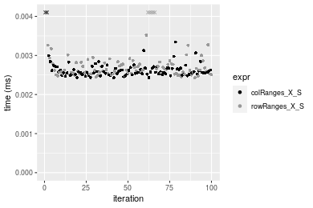
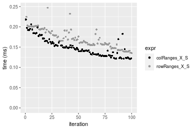
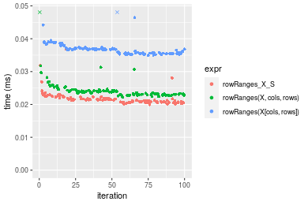

[matrixStats]: Benchmark report

---------------------------------------


# colRanges() and rowRanges() benchmarks on subsetted computation

This report benchmark the performance of colRanges() and rowRanges() on subsetted computation.


## Data type "integer"

### Data
```r
> rmatrix <- function(nrow, ncol, mode = c("logical", "double", "integer", "index"), range = c(-100, 
+     +100), na_prob = 0) {
+     mode <- match.arg(mode)
+     n <- nrow * ncol
+     if (mode == "logical") {
+         x <- sample(c(FALSE, TRUE), size = n, replace = TRUE)
+     }     else if (mode == "index") {
+         x <- seq_len(n)
+         mode <- "integer"
+     }     else {
+         x <- runif(n, min = range[1], max = range[2])
+     }
+     storage.mode(x) <- mode
+     if (na_prob > 0) 
+         x[sample(n, size = na_prob * n)] <- NA
+     dim(x) <- c(nrow, ncol)
+     x
+ }
> rmatrices <- function(scale = 10, seed = 1, ...) {
+     set.seed(seed)
+     data <- list()
+     data[[1]] <- rmatrix(nrow = scale * 1, ncol = scale * 1, ...)
+     data[[2]] <- rmatrix(nrow = scale * 10, ncol = scale * 10, ...)
+     data[[3]] <- rmatrix(nrow = scale * 100, ncol = scale * 1, ...)
+     data[[4]] <- t(data[[3]])
+     data[[5]] <- rmatrix(nrow = scale * 10, ncol = scale * 100, ...)
+     data[[6]] <- t(data[[5]])
+     names(data) <- sapply(data, FUN = function(x) paste(dim(x), collapse = "x"))
+     data
+ }
> data <- rmatrices(mode = mode)
```

### Results

#### 10x10 integer matrix

```r
> X <- data[["10x10"]]
> rows <- sample.int(nrow(X), size = nrow(X) * 0.7)
> cols <- sample.int(ncol(X), size = ncol(X) * 0.7)
> X_S <- X[rows, cols]
> gc()
           used  (Mb) gc trigger  (Mb) max used  (Mb)
Ncells  5286540 282.4    7916910 422.9  7916910 422.9
Vcells 10399958  79.4   33191153 253.3 53339345 407.0
> colStats <- microbenchmark(colRanges_X_S = colRanges(X_S, na.rm = FALSE), `colRanges(X, rows, cols)` = colRanges(X, 
+     rows = rows, cols = cols, na.rm = FALSE), `colRanges(X[rows, cols])` = colRanges(X[rows, cols], 
+     na.rm = FALSE), unit = "ms")
> X <- t(X)
> X_S <- t(X_S)
> gc()
           used  (Mb) gc trigger  (Mb) max used  (Mb)
Ncells  5286494 282.4    7916910 422.9  7916910 422.9
Vcells 10400187  79.4   33191153 253.3 53339345 407.0
> rowStats <- microbenchmark(rowRanges_X_S = rowRanges(X_S, na.rm = FALSE), `rowRanges(X, cols, rows)` = rowRanges(X, 
+     rows = cols, cols = rows, na.rm = FALSE), `rowRanges(X[cols, rows])` = rowRanges(X[cols, rows], 
+     na.rm = FALSE), unit = "ms")
```

_Table: Benchmarking of colRanges_X_S(), colRanges(X, rows, cols)() and colRanges(X[rows, cols])() on integer+10x10 data. The top panel shows times in milliseconds and the bottom panel shows relative times._


|   |expr                     |      min|        lq|      mean|    median|        uq|      max|
|:--|:------------------------|--------:|---------:|---------:|---------:|---------:|--------:|
|1  |colRanges_X_S            | 0.002429| 0.0025230| 0.0045352| 0.0025705| 0.0026750| 0.192259|
|2  |colRanges(X, rows, cols) | 0.002760| 0.0029060| 0.0030436| 0.0029765| 0.0030885| 0.005978|
|3  |colRanges(X[rows, cols]) | 0.003300| 0.0035505| 0.0037769| 0.0036605| 0.0038130| 0.008942|


|   |expr                     |      min|       lq|      mean|   median|       uq|       max|
|:--|:------------------------|--------:|--------:|---------:|--------:|--------:|---------:|
|1  |colRanges_X_S            | 1.000000| 1.000000| 1.0000000| 1.000000| 1.000000| 1.0000000|
|2  |colRanges(X, rows, cols) | 1.136270| 1.151803| 0.6711163| 1.157946| 1.154579| 0.0310935|
|3  |colRanges(X[rows, cols]) | 1.358584| 1.407253| 0.8327964| 1.424042| 1.425421| 0.0465102|

_Table: Benchmarking of rowRanges_X_S(), rowRanges(X, cols, rows)() and rowRanges(X[cols, rows])() on integer+10x10 data (transposed). The top panel shows times in milliseconds and the bottom panel shows relative times._


|   |expr                     |      min|        lq|      mean|    median|        uq|      max|
|:--|:------------------------|--------:|---------:|---------:|---------:|---------:|--------:|
|1  |rowRanges_X_S            | 0.002432| 0.0025395| 0.0028104| 0.0026275| 0.0028200| 0.005653|
|2  |rowRanges(X, cols, rows) | 0.002707| 0.0028760| 0.0050589| 0.0029800| 0.0031490| 0.198719|
|3  |rowRanges(X[cols, rows]) | 0.003381| 0.0036620| 0.0041524| 0.0038220| 0.0041005| 0.009042|


|   |expr                     |      min|       lq|     mean|   median|       uq|       max|
|:--|:------------------------|--------:|--------:|--------:|--------:|--------:|---------:|
|1  |rowRanges_X_S            | 1.000000| 1.000000| 1.000000| 1.000000| 1.000000|  1.000000|
|2  |rowRanges(X, cols, rows) | 1.113076| 1.132506| 1.800041| 1.134158| 1.116667| 35.152839|
|3  |rowRanges(X[cols, rows]) | 1.390214| 1.442016| 1.477482| 1.454615| 1.454078|  1.599505|

_Figure: Benchmarking of colRanges_X_S(), colRanges(X, rows, cols)() and colRanges(X[rows, cols])() on integer+10x10 data  as well as rowRanges_X_S(), rowRanges(X, cols, rows)() and rowRanges(X[cols, rows])() on the same data transposed.  Outliers are displayed as crosses.  Times are in milliseconds._


_Table: Benchmarking of colRanges_X_S() and rowRanges_X_S() on integer+10x10 data (original and transposed).  The top panel shows times in milliseconds and the bottom panel shows relative times._


|   |expr          |   min|     lq|    mean| median|    uq|     max|
|:--|:-------------|-----:|------:|-------:|------:|-----:|-------:|
|1  |colRanges_X_S | 2.429| 2.5230| 4.53519| 2.5705| 2.675| 192.259|
|2  |rowRanges_X_S | 2.432| 2.5395| 2.81043| 2.6275| 2.820|   5.653|


|   |expr          |      min|      lq|     mean|   median|       uq|      max|
|:--|:-------------|--------:|-------:|--------:|--------:|--------:|--------:|
|1  |colRanges_X_S | 1.000000| 1.00000| 1.000000| 1.000000| 1.000000| 1.000000|
|2  |rowRanges_X_S | 1.001235| 1.00654| 0.619694| 1.022175| 1.054206| 0.029403|

_Figure: Benchmarking of colRanges_X_S() and rowRanges_X_S() on integer+10x10 data (original and transposed).  Outliers are displayed as crosses. Times are in milliseconds._




#### 100x100 integer matrix

```r
> X <- data[["100x100"]]
> rows <- sample.int(nrow(X), size = nrow(X) * 0.7)
> cols <- sample.int(ncol(X), size = ncol(X) * 0.7)
> X_S <- X[rows, cols]
> gc()
           used  (Mb) gc trigger  (Mb) max used  (Mb)
Ncells  5285199 282.3    7916910 422.9  7916910 422.9
Vcells 10069267  76.9   33191153 253.3 53339345 407.0
> colStats <- microbenchmark(colRanges_X_S = colRanges(X_S, na.rm = FALSE), `colRanges(X, rows, cols)` = colRanges(X, 
+     rows = rows, cols = cols, na.rm = FALSE), `colRanges(X[rows, cols])` = colRanges(X[rows, cols], 
+     na.rm = FALSE), unit = "ms")
> X <- t(X)
> X_S <- t(X_S)
> gc()
           used  (Mb) gc trigger  (Mb) max used  (Mb)
Ncells  5285193 282.3    7916910 422.9  7916910 422.9
Vcells 10074350  76.9   33191153 253.3 53339345 407.0
> rowStats <- microbenchmark(rowRanges_X_S = rowRanges(X_S, na.rm = FALSE), `rowRanges(X, cols, rows)` = rowRanges(X, 
+     rows = cols, cols = rows, na.rm = FALSE), `rowRanges(X[cols, rows])` = rowRanges(X[cols, rows], 
+     na.rm = FALSE), unit = "ms")
```

_Table: Benchmarking of colRanges_X_S(), colRanges(X, rows, cols)() and colRanges(X[rows, cols])() on integer+100x100 data. The top panel shows times in milliseconds and the bottom panel shows relative times._


|   |expr                     |      min|        lq|      mean|    median|        uq|      max|
|:--|:------------------------|--------:|---------:|---------:|---------:|---------:|--------:|
|1  |colRanges_X_S            | 0.018263| 0.0191235| 0.0199667| 0.0195985| 0.0201090| 0.032874|
|2  |colRanges(X, rows, cols) | 0.024193| 0.0250990| 0.0262194| 0.0258730| 0.0264135| 0.036460|
|3  |colRanges(X[rows, cols]) | 0.028780| 0.0298775| 0.0324142| 0.0306310| 0.0317825| 0.119464|


|   |expr                     |      min|       lq|     mean|   median|       uq|      max|
|:--|:------------------------|--------:|--------:|--------:|--------:|--------:|--------:|
|1  |colRanges_X_S            | 1.000000| 1.000000| 1.000000| 1.000000| 1.000000| 1.000000|
|2  |colRanges(X, rows, cols) | 1.324700| 1.312469| 1.313156| 1.320152| 1.313516| 1.109083|
|3  |colRanges(X[rows, cols]) | 1.575864| 1.562345| 1.623414| 1.562926| 1.580511| 3.633996|

_Table: Benchmarking of rowRanges_X_S(), rowRanges(X, cols, rows)() and rowRanges(X[cols, rows])() on integer+100x100 data (transposed). The top panel shows times in milliseconds and the bottom panel shows relative times._


|   |expr                     |      min|        lq|      mean|    median|        uq|      max|
|:--|:------------------------|--------:|---------:|---------:|---------:|---------:|--------:|
|2  |rowRanges(X, cols, rows) | 0.018723| 0.0197620| 0.0210402| 0.0205205| 0.0212820| 0.053944|
|1  |rowRanges_X_S            | 0.018643| 0.0197330| 0.0206572| 0.0205820| 0.0212820| 0.028640|
|3  |rowRanges(X[cols, rows]) | 0.029805| 0.0306285| 0.0321890| 0.0315595| 0.0329135| 0.046549|


|   |expr                     |       min|        lq|      mean|   median|       uq|       max|
|:--|:------------------------|---------:|---------:|---------:|--------:|--------:|---------:|
|2  |rowRanges(X, cols, rows) | 1.0000000| 1.0000000| 1.0000000| 1.000000| 1.000000| 1.0000000|
|1  |rowRanges_X_S            | 0.9957272| 0.9985325| 0.9817963| 1.002997| 1.000000| 0.5309210|
|3  |rowRanges(X[cols, rows]) | 1.5918923| 1.5498684| 1.5298830| 1.537950| 1.546542| 0.8629134|

_Figure: Benchmarking of colRanges_X_S(), colRanges(X, rows, cols)() and colRanges(X[rows, cols])() on integer+100x100 data  as well as rowRanges_X_S(), rowRanges(X, cols, rows)() and rowRanges(X[cols, rows])() on the same data transposed.  Outliers are displayed as crosses.  Times are in milliseconds._


_Table: Benchmarking of colRanges_X_S() and rowRanges_X_S() on integer+100x100 data (original and transposed).  The top panel shows times in milliseconds and the bottom panel shows relative times._


|   |expr          |    min|      lq|     mean|  median|     uq|    max|
|:--|:-------------|------:|-------:|--------:|-------:|------:|------:|
|1  |colRanges_X_S | 18.263| 19.1235| 19.96671| 19.5985| 20.109| 32.874|
|2  |rowRanges_X_S | 18.643| 19.7330| 20.65718| 20.5820| 21.282| 28.640|


|   |expr          |      min|       lq|     mean|   median|       uq|       max|
|:--|:-------------|--------:|--------:|--------:|--------:|--------:|---------:|
|1  |colRanges_X_S | 1.000000| 1.000000| 1.000000| 1.000000| 1.000000| 1.0000000|
|2  |rowRanges_X_S | 1.020807| 1.031872| 1.034581| 1.050182| 1.058332| 0.8712052|

_Figure: Benchmarking of colRanges_X_S() and rowRanges_X_S() on integer+100x100 data (original and transposed).  Outliers are displayed as crosses. Times are in milliseconds._


#### 1000x10 integer matrix

```r
> X <- data[["1000x10"]]
> rows <- sample.int(nrow(X), size = nrow(X) * 0.7)
> cols <- sample.int(ncol(X), size = ncol(X) * 0.7)
> X_S <- X[rows, cols]
> gc()
           used  (Mb) gc trigger  (Mb) max used  (Mb)
Ncells  5285942 282.3    7916910 422.9  7916910 422.9
Vcells 10073307  76.9   33191153 253.3 53339345 407.0
> colStats <- microbenchmark(colRanges_X_S = colRanges(X_S, na.rm = FALSE), `colRanges(X, rows, cols)` = colRanges(X, 
+     rows = rows, cols = cols, na.rm = FALSE), `colRanges(X[rows, cols])` = colRanges(X[rows, cols], 
+     na.rm = FALSE), unit = "ms")
> X <- t(X)
> X_S <- t(X_S)
> gc()
           used  (Mb) gc trigger  (Mb) max used  (Mb)
Ncells  5285936 282.3    7916910 422.9  7916910 422.9
Vcells 10078390  76.9   33191153 253.3 53339345 407.0
> rowStats <- microbenchmark(rowRanges_X_S = rowRanges(X_S, na.rm = FALSE), `rowRanges(X, cols, rows)` = rowRanges(X, 
+     rows = cols, cols = rows, na.rm = FALSE), `rowRanges(X[cols, rows])` = rowRanges(X[cols, rows], 
+     na.rm = FALSE), unit = "ms")
```

_Table: Benchmarking of colRanges_X_S(), colRanges(X, rows, cols)() and colRanges(X[rows, cols])() on integer+1000x10 data. The top panel shows times in milliseconds and the bottom panel shows relative times._


|   |expr                     |      min|        lq|      mean|    median|        uq|      max|
|:--|:------------------------|--------:|---------:|---------:|---------:|---------:|--------:|
|1  |colRanges_X_S            | 0.014292| 0.0148750| 0.0152153| 0.0150390| 0.0152155| 0.029705|
|2  |colRanges(X, rows, cols) | 0.020695| 0.0214260| 0.0217751| 0.0218355| 0.0220275| 0.026319|
|3  |colRanges(X[rows, cols]) | 0.025865| 0.0264345| 0.0275296| 0.0272225| 0.0274980| 0.057222|


|   |expr                     |      min|       lq|     mean|   median|       uq|       max|
|:--|:------------------------|--------:|--------:|--------:|--------:|--------:|---------:|
|1  |colRanges_X_S            | 1.000000| 1.000000| 1.000000| 1.000000| 1.000000| 1.0000000|
|2  |colRanges(X, rows, cols) | 1.448013| 1.440403| 1.431134| 1.451925| 1.447701| 0.8860125|
|3  |colRanges(X[rows, cols]) | 1.809754| 1.777109| 1.809345| 1.810127| 1.807236| 1.9263424|

_Table: Benchmarking of rowRanges_X_S(), rowRanges(X, cols, rows)() and rowRanges(X[cols, rows])() on integer+1000x10 data (transposed). The top panel shows times in milliseconds and the bottom panel shows relative times._


|   |expr                     |      min|        lq|      mean|    median|        uq|      max|
|:--|:------------------------|--------:|---------:|---------:|---------:|---------:|--------:|
|1  |rowRanges_X_S            | 0.016498| 0.0170325| 0.0187920| 0.0171910| 0.0174425| 0.038112|
|2  |rowRanges(X, cols, rows) | 0.019760| 0.0203165| 0.0215158| 0.0204675| 0.0207180| 0.041567|
|3  |rowRanges(X[cols, rows]) | 0.030434| 0.0309375| 0.0334244| 0.0312260| 0.0317680| 0.065033|


|   |expr                     |      min|       lq|     mean|   median|       uq|      max|
|:--|:------------------------|--------:|--------:|--------:|--------:|--------:|--------:|
|1  |rowRanges_X_S            | 1.000000| 1.000000| 1.000000| 1.000000| 1.000000| 1.000000|
|2  |rowRanges(X, cols, rows) | 1.197721| 1.192808| 1.144944| 1.190594| 1.187788| 1.090654|
|3  |rowRanges(X[cols, rows]) | 1.844708| 1.816380| 1.778650| 1.816416| 1.821299| 1.706365|

_Figure: Benchmarking of colRanges_X_S(), colRanges(X, rows, cols)() and colRanges(X[rows, cols])() on integer+1000x10 data  as well as rowRanges_X_S(), rowRanges(X, cols, rows)() and rowRanges(X[cols, rows])() on the same data transposed.  Outliers are displayed as crosses.  Times are in milliseconds._


_Table: Benchmarking of colRanges_X_S() and rowRanges_X_S() on integer+1000x10 data (original and transposed).  The top panel shows times in milliseconds and the bottom panel shows relative times._


|   |expr          |    min|      lq|     mean| median|      uq|    max|
|:--|:-------------|------:|-------:|--------:|------:|-------:|------:|
|1  |colRanges_X_S | 14.292| 14.8750| 15.21526| 15.039| 15.2155| 29.705|
|2  |rowRanges_X_S | 16.498| 17.0325| 18.79199| 17.191| 17.4425| 38.112|


|   |expr          |      min|       lq|     mean|   median|       uq|      max|
|:--|:-------------|--------:|--------:|--------:|--------:|--------:|--------:|
|1  |colRanges_X_S | 1.000000| 1.000000| 1.000000| 1.000000| 1.000000| 1.000000|
|2  |rowRanges_X_S | 1.154352| 1.145042| 1.235075| 1.143095| 1.146364| 1.283016|

_Figure: Benchmarking of colRanges_X_S() and rowRanges_X_S() on integer+1000x10 data (original and transposed).  Outliers are displayed as crosses. Times are in milliseconds._


#### 10x1000 integer matrix

```r
> X <- data[["10x1000"]]
> rows <- sample.int(nrow(X), size = nrow(X) * 0.7)
> cols <- sample.int(ncol(X), size = ncol(X) * 0.7)
> X_S <- X[rows, cols]
> gc()
           used  (Mb) gc trigger  (Mb) max used  (Mb)
Ncells  5286147 282.4    7916910 422.9  7916910 422.9
Vcells 10074184  76.9   33191153 253.3 53339345 407.0
> colStats <- microbenchmark(colRanges_X_S = colRanges(X_S, na.rm = FALSE), `colRanges(X, rows, cols)` = colRanges(X, 
+     rows = rows, cols = cols, na.rm = FALSE), `colRanges(X[rows, cols])` = colRanges(X[rows, cols], 
+     na.rm = FALSE), unit = "ms")
> X <- t(X)
> X_S <- t(X_S)
> gc()
           used  (Mb) gc trigger  (Mb) max used  (Mb)
Ncells  5286141 282.4    7916910 422.9  7916910 422.9
Vcells 10079267  76.9   33191153 253.3 53339345 407.0
> rowStats <- microbenchmark(rowRanges_X_S = rowRanges(X_S, na.rm = FALSE), `rowRanges(X, cols, rows)` = rowRanges(X, 
+     rows = cols, cols = rows, na.rm = FALSE), `rowRanges(X[cols, rows])` = rowRanges(X[cols, rows], 
+     na.rm = FALSE), unit = "ms")
```

_Table: Benchmarking of colRanges_X_S(), colRanges(X, rows, cols)() and colRanges(X[rows, cols])() on integer+10x1000 data. The top panel shows times in milliseconds and the bottom panel shows relative times._


|   |expr                     |      min|        lq|      mean|    median|        uq|      max|
|:--|:------------------------|--------:|---------:|---------:|---------:|---------:|--------:|
|1  |colRanges_X_S            | 0.036287| 0.0399420| 0.0417527| 0.0414315| 0.0427125| 0.069458|
|2  |colRanges(X, rows, cols) | 0.046975| 0.0496465| 0.0530047| 0.0525550| 0.0560960| 0.072611|
|3  |colRanges(X[rows, cols]) | 0.048037| 0.0532930| 0.0559516| 0.0557955| 0.0575620| 0.070806|


|   |expr                     |      min|       lq|     mean|   median|       uq|      max|
|:--|:------------------------|--------:|--------:|--------:|--------:|--------:|--------:|
|1  |colRanges_X_S            | 1.000000| 1.000000| 1.000000| 1.000000| 1.000000| 1.000000|
|2  |colRanges(X, rows, cols) | 1.294541| 1.242965| 1.269492| 1.268479| 1.313339| 1.045394|
|3  |colRanges(X[rows, cols]) | 1.323807| 1.334260| 1.340071| 1.346693| 1.347662| 1.019407|

_Table: Benchmarking of rowRanges_X_S(), rowRanges(X, cols, rows)() and rowRanges(X[cols, rows])() on integer+10x1000 data (transposed). The top panel shows times in milliseconds and the bottom panel shows relative times._


|   |expr                     |      min|        lq|      mean|    median|        uq|      max|
|:--|:------------------------|--------:|---------:|---------:|---------:|---------:|--------:|
|1  |rowRanges_X_S            | 0.033575| 0.0362075| 0.0379317| 0.0375405| 0.0388425| 0.063951|
|2  |rowRanges(X, cols, rows) | 0.030558| 0.0362890| 0.0390079| 0.0385115| 0.0403125| 0.084435|
|3  |rowRanges(X[cols, rows]) | 0.043924| 0.0468115| 0.0501583| 0.0489815| 0.0516125| 0.077777|


|   |expr                     |       min|       lq|     mean|   median|       uq|      max|
|:--|:------------------------|---------:|--------:|--------:|--------:|--------:|--------:|
|1  |rowRanges_X_S            | 1.0000000| 1.000000| 1.000000| 1.000000| 1.000000| 1.000000|
|2  |rowRanges(X, cols, rows) | 0.9101415| 1.002251| 1.028371| 1.025865| 1.037845| 1.320308|
|3  |rowRanges(X[cols, rows]) | 1.3082353| 1.292868| 1.322332| 1.304764| 1.328764| 1.216197|

_Figure: Benchmarking of colRanges_X_S(), colRanges(X, rows, cols)() and colRanges(X[rows, cols])() on integer+10x1000 data  as well as rowRanges_X_S(), rowRanges(X, cols, rows)() and rowRanges(X[cols, rows])() on the same data transposed.  Outliers are displayed as crosses.  Times are in milliseconds._


_Table: Benchmarking of colRanges_X_S() and rowRanges_X_S() on integer+10x1000 data (original and transposed).  The top panel shows times in milliseconds and the bottom panel shows relative times._


|   |expr          |    min|      lq|     mean|  median|      uq|    max|
|:--|:-------------|------:|-------:|--------:|-------:|-------:|------:|
|2  |rowRanges_X_S | 33.575| 36.2075| 37.93173| 37.5405| 38.8425| 63.951|
|1  |colRanges_X_S | 36.287| 39.9420| 41.75269| 41.4315| 42.7125| 69.458|


|   |expr          |      min|       lq|     mean|   median|       uq|      max|
|:--|:-------------|--------:|--------:|--------:|--------:|--------:|--------:|
|2  |rowRanges_X_S | 1.000000| 1.000000| 1.000000| 1.000000| 1.000000| 1.000000|
|1  |colRanges_X_S | 1.080774| 1.103142| 1.100733| 1.103648| 1.099633| 1.086113|

_Figure: Benchmarking of colRanges_X_S() and rowRanges_X_S() on integer+10x1000 data (original and transposed).  Outliers are displayed as crosses. Times are in milliseconds._


#### 100x1000 integer matrix

```r
> X <- data[["100x1000"]]
> rows <- sample.int(nrow(X), size = nrow(X) * 0.7)
> cols <- sample.int(ncol(X), size = ncol(X) * 0.7)
> X_S <- X[rows, cols]
> gc()
           used  (Mb) gc trigger  (Mb) max used  (Mb)
Ncells  5286357 282.4    7916910 422.9  7916910 422.9
Vcells 10096860  77.1   33191153 253.3 53339345 407.0
> colStats <- microbenchmark(colRanges_X_S = colRanges(X_S, na.rm = FALSE), `colRanges(X, rows, cols)` = colRanges(X, 
+     rows = rows, cols = cols, na.rm = FALSE), `colRanges(X[rows, cols])` = colRanges(X[rows, cols], 
+     na.rm = FALSE), unit = "ms")
> X <- t(X)
> X_S <- t(X_S)
> gc()
           used  (Mb) gc trigger  (Mb) max used  (Mb)
Ncells  5286351 282.4    7916910 422.9  7916910 422.9
Vcells 10146943  77.5   33191153 253.3 53339345 407.0
> rowStats <- microbenchmark(rowRanges_X_S = rowRanges(X_S, na.rm = FALSE), `rowRanges(X, cols, rows)` = rowRanges(X, 
+     rows = cols, cols = rows, na.rm = FALSE), `rowRanges(X[cols, rows])` = rowRanges(X[cols, rows], 
+     na.rm = FALSE), unit = "ms")
```

_Table: Benchmarking of colRanges_X_S(), colRanges(X, rows, cols)() and colRanges(X[rows, cols])() on integer+100x1000 data. The top panel shows times in milliseconds and the bottom panel shows relative times._


|   |expr                     |      min|        lq|      mean|    median|        uq|      max|
|:--|:------------------------|--------:|---------:|---------:|---------:|---------:|--------:|
|1  |colRanges_X_S            | 0.121061| 0.1310110| 0.1499712| 0.1450570| 0.1636735| 0.218091|
|2  |colRanges(X, rows, cols) | 0.163439| 0.1770130| 0.2042014| 0.2006975| 0.2224445| 0.356483|
|3  |colRanges(X[rows, cols]) | 0.189031| 0.2068755| 0.2365141| 0.2336550| 0.2556970| 0.324776|


|   |expr                     |      min|       lq|     mean|   median|       uq|      max|
|:--|:------------------------|--------:|--------:|--------:|--------:|--------:|--------:|
|1  |colRanges_X_S            | 1.000000| 1.000000| 1.000000| 1.000000| 1.000000| 1.000000|
|2  |colRanges(X, rows, cols) | 1.350055| 1.351131| 1.361604| 1.383577| 1.359075| 1.634561|
|3  |colRanges(X[rows, cols]) | 1.561452| 1.579070| 1.577063| 1.610781| 1.562238| 1.489176|

_Table: Benchmarking of rowRanges_X_S(), rowRanges(X, cols, rows)() and rowRanges(X[cols, rows])() on integer+100x1000 data (transposed). The top panel shows times in milliseconds and the bottom panel shows relative times._


|   |expr                     |      min|        lq|      mean|    median|        uq|      max|
|:--|:------------------------|--------:|---------:|---------:|---------:|---------:|--------:|
|2  |rowRanges(X, cols, rows) | 0.135684| 0.1475800| 0.1689758| 0.1584085| 0.1880520| 0.277803|
|1  |rowRanges_X_S            | 0.135035| 0.1561050| 0.1710458| 0.1665050| 0.1901745| 0.247119|
|3  |rowRanges(X[cols, rows]) | 0.203372| 0.2347565| 0.2555773| 0.2445805| 0.2842865| 0.351589|


|   |expr                     |       min|       lq|     mean|   median|       uq|       max|
|:--|:------------------------|---------:|--------:|--------:|--------:|--------:|---------:|
|2  |rowRanges(X, cols, rows) | 1.0000000| 1.000000| 1.000000| 1.000000| 1.000000| 1.0000000|
|1  |rowRanges_X_S            | 0.9952168| 1.057765| 1.012250| 1.051111| 1.011287| 0.8895476|
|3  |rowRanges(X[cols, rows]) | 1.4988650| 1.590707| 1.512508| 1.543986| 1.511744| 1.2656055|

_Figure: Benchmarking of colRanges_X_S(), colRanges(X, rows, cols)() and colRanges(X[rows, cols])() on integer+100x1000 data  as well as rowRanges_X_S(), rowRanges(X, cols, rows)() and rowRanges(X[cols, rows])() on the same data transposed.  Outliers are displayed as crosses.  Times are in milliseconds._


_Table: Benchmarking of colRanges_X_S() and rowRanges_X_S() on integer+100x1000 data (original and transposed).  The top panel shows times in milliseconds and the bottom panel shows relative times._


|   |expr          |     min|      lq|     mean|  median|       uq|     max|
|:--|:-------------|-------:|-------:|--------:|-------:|--------:|-------:|
|1  |colRanges_X_S | 121.061| 131.011| 149.9712| 145.057| 163.6735| 218.091|
|2  |rowRanges_X_S | 135.035| 156.105| 171.0458| 166.505| 190.1745| 247.119|


|   |expr          |      min|       lq|     mean|   median|       uq|    max|
|:--|:-------------|--------:|--------:|--------:|--------:|--------:|------:|
|1  |colRanges_X_S | 1.000000| 1.000000| 1.000000| 1.000000| 1.000000| 1.0000|
|2  |rowRanges_X_S | 1.115429| 1.191541| 1.140524| 1.147859| 1.161914| 1.1331|

_Figure: Benchmarking of colRanges_X_S() and rowRanges_X_S() on integer+100x1000 data (original and transposed).  Outliers are displayed as crosses. Times are in milliseconds._




#### 1000x100 integer matrix

```r
> X <- data[["1000x100"]]
> rows <- sample.int(nrow(X), size = nrow(X) * 0.7)
> cols <- sample.int(ncol(X), size = ncol(X) * 0.7)
> X_S <- X[rows, cols]
> gc()
           used  (Mb) gc trigger  (Mb) max used  (Mb)
Ncells  5286570 282.4    7916910 422.9  7916910 422.9
Vcells 10097649  77.1   33191153 253.3 53339345 407.0
> colStats <- microbenchmark(colRanges_X_S = colRanges(X_S, na.rm = FALSE), `colRanges(X, rows, cols)` = colRanges(X, 
+     rows = rows, cols = cols, na.rm = FALSE), `colRanges(X[rows, cols])` = colRanges(X[rows, cols], 
+     na.rm = FALSE), unit = "ms")
> X <- t(X)
> X_S <- t(X_S)
> gc()
           used  (Mb) gc trigger  (Mb) max used  (Mb)
Ncells  5286564 282.4    7916910 422.9  7916910 422.9
Vcells 10147732  77.5   33191153 253.3 53339345 407.0
> rowStats <- microbenchmark(rowRanges_X_S = rowRanges(X_S, na.rm = FALSE), `rowRanges(X, cols, rows)` = rowRanges(X, 
+     rows = cols, cols = rows, na.rm = FALSE), `rowRanges(X[cols, rows])` = rowRanges(X[cols, rows], 
+     na.rm = FALSE), unit = "ms")
```

_Table: Benchmarking of colRanges_X_S(), colRanges(X, rows, cols)() and colRanges(X[rows, cols])() on integer+1000x100 data. The top panel shows times in milliseconds and the bottom panel shows relative times._


|   |expr                     |      min|        lq|      mean|    median|        uq|      max|
|:--|:------------------------|--------:|---------:|---------:|---------:|---------:|--------:|
|1  |colRanges_X_S            | 0.087504| 0.0968285| 0.1052984| 0.1020730| 0.1139185| 0.166509|
|2  |colRanges(X, rows, cols) | 0.124524| 0.1404510| 0.1518258| 0.1456435| 0.1648415| 0.196296|
|3  |colRanges(X[rows, cols]) | 0.158885| 0.1747185| 0.1949558| 0.1863845| 0.2092925| 0.341581|


|   |expr                     |      min|       lq|     mean|   median|       uq|      max|
|:--|:------------------------|--------:|--------:|--------:|--------:|--------:|--------:|
|1  |colRanges_X_S            | 1.000000| 1.000000| 1.000000| 1.000000| 1.000000| 1.000000|
|2  |colRanges(X, rows, cols) | 1.423066| 1.450513| 1.441863| 1.426856| 1.447013| 1.178891|
|3  |colRanges(X[rows, cols]) | 1.815746| 1.804412| 1.851461| 1.825992| 1.837213| 2.051427|

_Table: Benchmarking of rowRanges_X_S(), rowRanges(X, cols, rows)() and rowRanges(X[cols, rows])() on integer+1000x100 data (transposed). The top panel shows times in milliseconds and the bottom panel shows relative times._


|   |expr                     |      min|        lq|      mean|   median|        uq|      max|
|:--|:------------------------|--------:|---------:|---------:|--------:|---------:|--------:|
|1  |rowRanges_X_S            | 0.107949| 0.1166520| 0.1290034| 0.120817| 0.1381405| 0.231508|
|2  |rowRanges(X, cols, rows) | 0.112029| 0.1226735| 0.1361048| 0.127053| 0.1439360| 0.252502|
|3  |rowRanges(X[cols, rows]) | 0.187629| 0.2013710| 0.2265817| 0.213288| 0.2416135| 0.413159|


|   |expr                     |      min|       lq|     mean|   median|       uq|      max|
|:--|:------------------------|--------:|--------:|--------:|--------:|--------:|--------:|
|1  |rowRanges_X_S            | 1.000000| 1.000000| 1.000000| 1.000000| 1.000000| 1.000000|
|2  |rowRanges(X, cols, rows) | 1.037796| 1.051619| 1.055048| 1.051615| 1.041954| 1.090684|
|3  |rowRanges(X[cols, rows]) | 1.738126| 1.726254| 1.756401| 1.765381| 1.749042| 1.784642|

_Figure: Benchmarking of colRanges_X_S(), colRanges(X, rows, cols)() and colRanges(X[rows, cols])() on integer+1000x100 data  as well as rowRanges_X_S(), rowRanges(X, cols, rows)() and rowRanges(X[cols, rows])() on the same data transposed.  Outliers are displayed as crosses.  Times are in milliseconds._


_Table: Benchmarking of colRanges_X_S() and rowRanges_X_S() on integer+1000x100 data (original and transposed).  The top panel shows times in milliseconds and the bottom panel shows relative times._


|   |expr          |     min|       lq|     mean|  median|       uq|     max|
|:--|:-------------|-------:|--------:|--------:|-------:|--------:|-------:|
|1  |colRanges_X_S |  87.504|  96.8285| 105.2983| 102.073| 113.9185| 166.509|
|2  |rowRanges_X_S | 107.949| 116.6520| 129.0034| 120.817| 138.1405| 231.508|


|   |expr          |      min|       lq|     mean|   median|       uq|      max|
|:--|:-------------|--------:|--------:|--------:|--------:|--------:|--------:|
|1  |colRanges_X_S | 1.000000| 1.000000| 1.000000| 1.000000| 1.000000| 1.000000|
|2  |rowRanges_X_S | 1.233647| 1.204728| 1.225123| 1.183633| 1.212626| 1.390363|

_Figure: Benchmarking of colRanges_X_S() and rowRanges_X_S() on integer+1000x100 data (original and transposed).  Outliers are displayed as crosses. Times are in milliseconds._


## Data type "double"

### Data
```r
> rmatrix <- function(nrow, ncol, mode = c("logical", "double", "integer", "index"), range = c(-100, 
+     +100), na_prob = 0) {
+     mode <- match.arg(mode)
+     n <- nrow * ncol
+     if (mode == "logical") {
+         x <- sample(c(FALSE, TRUE), size = n, replace = TRUE)
+     }     else if (mode == "index") {
+         x <- seq_len(n)
+         mode <- "integer"
+     }     else {
+         x <- runif(n, min = range[1], max = range[2])
+     }
+     storage.mode(x) <- mode
+     if (na_prob > 0) 
+         x[sample(n, size = na_prob * n)] <- NA
+     dim(x) <- c(nrow, ncol)
+     x
+ }
> rmatrices <- function(scale = 10, seed = 1, ...) {
+     set.seed(seed)
+     data <- list()
+     data[[1]] <- rmatrix(nrow = scale * 1, ncol = scale * 1, ...)
+     data[[2]] <- rmatrix(nrow = scale * 10, ncol = scale * 10, ...)
+     data[[3]] <- rmatrix(nrow = scale * 100, ncol = scale * 1, ...)
+     data[[4]] <- t(data[[3]])
+     data[[5]] <- rmatrix(nrow = scale * 10, ncol = scale * 100, ...)
+     data[[6]] <- t(data[[5]])
+     names(data) <- sapply(data, FUN = function(x) paste(dim(x), collapse = "x"))
+     data
+ }
> data <- rmatrices(mode = mode)
```

### Results

#### 10x10 double matrix

```r
> X <- data[["10x10"]]
> rows <- sample.int(nrow(X), size = nrow(X) * 0.7)
> cols <- sample.int(ncol(X), size = ncol(X) * 0.7)
> X_S <- X[rows, cols]
> gc()
           used  (Mb) gc trigger  (Mb) max used  (Mb)
Ncells  5286787 282.4    7916910 422.9  7916910 422.9
Vcells 10188761  77.8   33191153 253.3 53339345 407.0
> colStats <- microbenchmark(colRanges_X_S = colRanges(X_S, na.rm = FALSE), `colRanges(X, rows, cols)` = colRanges(X, 
+     rows = rows, cols = cols, na.rm = FALSE), `colRanges(X[rows, cols])` = colRanges(X[rows, cols], 
+     na.rm = FALSE), unit = "ms")
> X <- t(X)
> X_S <- t(X_S)
> gc()
           used  (Mb) gc trigger  (Mb) max used  (Mb)
Ncells  5286772 282.4    7916910 422.9  7916910 422.9
Vcells 10188929  77.8   33191153 253.3 53339345 407.0
> rowStats <- microbenchmark(rowRanges_X_S = rowRanges(X_S, na.rm = FALSE), `rowRanges(X, cols, rows)` = rowRanges(X, 
+     rows = cols, cols = rows, na.rm = FALSE), `rowRanges(X[cols, rows])` = rowRanges(X[cols, rows], 
+     na.rm = FALSE), unit = "ms")
```

_Table: Benchmarking of colRanges_X_S(), colRanges(X, rows, cols)() and colRanges(X[rows, cols])() on double+10x10 data. The top panel shows times in milliseconds and the bottom panel shows relative times._


|   |expr                     |      min|        lq|      mean|    median|        uq|      max|
|:--|:------------------------|--------:|---------:|---------:|---------:|---------:|--------:|
|1  |colRanges_X_S            | 0.002648| 0.0027175| 0.0030374| 0.0027695| 0.0028870| 0.023938|
|2  |colRanges(X, rows, cols) | 0.002846| 0.0029985| 0.0031765| 0.0030745| 0.0031780| 0.008000|
|3  |colRanges(X[rows, cols]) | 0.003630| 0.0038905| 0.0040578| 0.0039640| 0.0040485| 0.009945|


|   |expr                     |      min|       lq|     mean|   median|       uq|       max|
|:--|:------------------------|--------:|--------:|--------:|--------:|--------:|---------:|
|1  |colRanges_X_S            | 1.000000| 1.000000| 1.000000| 1.000000| 1.000000| 1.0000000|
|2  |colRanges(X, rows, cols) | 1.074773| 1.103404| 1.045779| 1.110128| 1.100797| 0.3341967|
|3  |colRanges(X[rows, cols]) | 1.370846| 1.431647| 1.335921| 1.431305| 1.402321| 0.4154482|

_Table: Benchmarking of rowRanges_X_S(), rowRanges(X, cols, rows)() and rowRanges(X[cols, rows])() on double+10x10 data (transposed). The top panel shows times in milliseconds and the bottom panel shows relative times._


|   |expr                     |      min|        lq|      mean|    median|       uq|      max|
|:--|:------------------------|--------:|---------:|---------:|---------:|--------:|--------:|
|1  |rowRanges_X_S            | 0.002416| 0.0025295| 0.0028057| 0.0026555| 0.002944| 0.006265|
|2  |rowRanges(X, cols, rows) | 0.002661| 0.0028575| 0.0035743| 0.0030600| 0.003388| 0.037900|
|3  |rowRanges(X[cols, rows]) | 0.003379| 0.0037035| 0.0042449| 0.0039990| 0.004406| 0.008822|


|   |expr                     |      min|       lq|     mean|   median|       uq|      max|
|:--|:------------------------|--------:|--------:|--------:|--------:|--------:|--------:|
|1  |rowRanges_X_S            | 1.000000| 1.000000| 1.000000| 1.000000| 1.000000| 1.000000|
|2  |rowRanges(X, cols, rows) | 1.101407| 1.129670| 1.273917| 1.152325| 1.150815| 6.049481|
|3  |rowRanges(X[cols, rows]) | 1.398593| 1.464123| 1.512934| 1.505931| 1.496603| 1.408141|

_Figure: Benchmarking of colRanges_X_S(), colRanges(X, rows, cols)() and colRanges(X[rows, cols])() on double+10x10 data  as well as rowRanges_X_S(), rowRanges(X, cols, rows)() and rowRanges(X[cols, rows])() on the same data transposed.  Outliers are displayed as crosses.  Times are in milliseconds._


_Table: Benchmarking of colRanges_X_S() and rowRanges_X_S() on double+10x10 data (original and transposed).  The top panel shows times in milliseconds and the bottom panel shows relative times._


|   |expr          |   min|     lq|    mean| median|    uq|    max|
|:--|:-------------|-----:|------:|-------:|------:|-----:|------:|
|2  |rowRanges_X_S | 2.416| 2.5295| 2.80574| 2.6555| 2.944|  6.265|
|1  |colRanges_X_S | 2.648| 2.7175| 3.03744| 2.7695| 2.887| 23.938|


|   |expr          |      min|       lq|     mean|  median|        uq|     max|
|:--|:-------------|--------:|--------:|--------:|-------:|---------:|-------:|
|2  |rowRanges_X_S | 1.000000| 1.000000| 1.000000| 1.00000| 1.0000000| 1.00000|
|1  |colRanges_X_S | 1.096027| 1.074323| 1.082581| 1.04293| 0.9806386| 3.82091|

_Figure: Benchmarking of colRanges_X_S() and rowRanges_X_S() on double+10x10 data (original and transposed).  Outliers are displayed as crosses. Times are in milliseconds._


#### 100x100 double matrix

```r
> X <- data[["100x100"]]
> rows <- sample.int(nrow(X), size = nrow(X) * 0.7)
> cols <- sample.int(ncol(X), size = ncol(X) * 0.7)
> X_S <- X[rows, cols]
> gc()
           used  (Mb) gc trigger  (Mb) max used  (Mb)
Ncells  5286984 282.4    7916910 422.9  7916910 422.9
Vcells 10194718  77.8   33191153 253.3 53339345 407.0
> colStats <- microbenchmark(colRanges_X_S = colRanges(X_S, na.rm = FALSE), `colRanges(X, rows, cols)` = colRanges(X, 
+     rows = rows, cols = cols, na.rm = FALSE), `colRanges(X[rows, cols])` = colRanges(X[rows, cols], 
+     na.rm = FALSE), unit = "ms")
> X <- t(X)
> X_S <- t(X_S)
> gc()
           used  (Mb) gc trigger  (Mb) max used  (Mb)
Ncells  5286978 282.4    7916910 422.9  7916910 422.9
Vcells 10204801  77.9   33191153 253.3 53339345 407.0
> rowStats <- microbenchmark(rowRanges_X_S = rowRanges(X_S, na.rm = FALSE), `rowRanges(X, cols, rows)` = rowRanges(X, 
+     rows = cols, cols = rows, na.rm = FALSE), `rowRanges(X[cols, rows])` = rowRanges(X[cols, rows], 
+     na.rm = FALSE), unit = "ms")
```

_Table: Benchmarking of colRanges_X_S(), colRanges(X, rows, cols)() and colRanges(X[rows, cols])() on double+100x100 data. The top panel shows times in milliseconds and the bottom panel shows relative times._


|   |expr                     |      min|        lq|      mean|    median|        uq|      max|
|:--|:------------------------|--------:|---------:|---------:|---------:|---------:|--------:|
|1  |colRanges_X_S            | 0.014804| 0.0156435| 0.0164760| 0.0160425| 0.0165285| 0.031084|
|2  |colRanges(X, rows, cols) | 0.022258| 0.0235135| 0.0245857| 0.0241055| 0.0248250| 0.036272|
|3  |colRanges(X[rows, cols]) | 0.030014| 0.0309435| 0.0326331| 0.0320050| 0.0331350| 0.071922|


|   |expr                     |      min|       lq|     mean|   median|       uq|      max|
|:--|:------------------------|--------:|--------:|--------:|--------:|--------:|--------:|
|1  |colRanges_X_S            | 1.000000| 1.000000| 1.000000| 1.000000| 1.000000| 1.000000|
|2  |colRanges(X, rows, cols) | 1.503513| 1.503084| 1.492214| 1.502603| 1.501951| 1.166903|
|3  |colRanges(X[rows, cols]) | 2.027425| 1.978042| 1.980643| 1.995013| 2.004719| 2.313795|

_Table: Benchmarking of rowRanges_X_S(), rowRanges(X, cols, rows)() and rowRanges(X[cols, rows])() on double+100x100 data (transposed). The top panel shows times in milliseconds and the bottom panel shows relative times._


|   |expr                     |      min|        lq|      mean|    median|        uq|      max|
|:--|:------------------------|--------:|---------:|---------:|---------:|---------:|--------:|
|1  |rowRanges_X_S            | 0.019971| 0.0207755| 0.0218117| 0.0213895| 0.0221455| 0.036894|
|2  |rowRanges(X, cols, rows) | 0.022185| 0.0230650| 0.0244217| 0.0236735| 0.0242810| 0.059576|
|3  |rowRanges(X[cols, rows]) | 0.034940| 0.0355005| 0.0368289| 0.0366905| 0.0371045| 0.050756|


|   |expr                     |      min|       lq|     mean|   median|       uq|      max|
|:--|:------------------------|--------:|--------:|--------:|--------:|--------:|--------:|
|1  |rowRanges_X_S            | 1.000000| 1.000000| 1.000000| 1.000000| 1.000000| 1.000000|
|2  |rowRanges(X, cols, rows) | 1.110861| 1.110202| 1.119659| 1.106781| 1.096430| 1.614788|
|3  |rowRanges(X[cols, rows]) | 1.749537| 1.708767| 1.688492| 1.715351| 1.675487| 1.375725|

_Figure: Benchmarking of colRanges_X_S(), colRanges(X, rows, cols)() and colRanges(X[rows, cols])() on double+100x100 data  as well as rowRanges_X_S(), rowRanges(X, cols, rows)() and rowRanges(X[cols, rows])() on the same data transposed.  Outliers are displayed as crosses.  Times are in milliseconds._



_Table: Benchmarking of colRanges_X_S() and rowRanges_X_S() on double+100x100 data (original and transposed).  The top panel shows times in milliseconds and the bottom panel shows relative times._


|   |expr          |    min|      lq|     mean|  median|      uq|    max|
|:--|:-------------|------:|-------:|--------:|-------:|-------:|------:|
|1  |colRanges_X_S | 14.804| 15.6435| 16.47601| 16.0425| 16.5285| 31.084|
|2  |rowRanges_X_S | 19.971| 20.7755| 21.81173| 21.3895| 22.1455| 36.894|


|   |expr          |      min|      lq|     mean|   median|       uq|      max|
|:--|:-------------|--------:|-------:|--------:|--------:|--------:|--------:|
|1  |colRanges_X_S | 1.000000| 1.00000| 1.000000| 1.000000| 1.000000| 1.000000|
|2  |rowRanges_X_S | 1.349027| 1.32806| 1.323848| 1.333302| 1.339837| 1.186913|

_Figure: Benchmarking of colRanges_X_S() and rowRanges_X_S() on double+100x100 data (original and transposed).  Outliers are displayed as crosses. Times are in milliseconds._


#### 1000x10 double matrix

```r
> X <- data[["1000x10"]]
> rows <- sample.int(nrow(X), size = nrow(X) * 0.7)
> cols <- sample.int(ncol(X), size = ncol(X) * 0.7)
> X_S <- X[rows, cols]
> gc()
           used  (Mb) gc trigger  (Mb) max used  (Mb)
Ncells  5287184 282.4    7916910 422.9  7916910 422.9
Vcells 10196139  77.8   33191153 253.3 53339345 407.0
> colStats <- microbenchmark(colRanges_X_S = colRanges(X_S, na.rm = FALSE), `colRanges(X, rows, cols)` = colRanges(X, 
+     rows = rows, cols = cols, na.rm = FALSE), `colRanges(X[rows, cols])` = colRanges(X[rows, cols], 
+     na.rm = FALSE), unit = "ms")
> X <- t(X)
> X_S <- t(X_S)
> gc()
           used  (Mb) gc trigger  (Mb) max used  (Mb)
Ncells  5287178 282.4    7916910 422.9  7916910 422.9
Vcells 10206222  77.9   33191153 253.3 53339345 407.0
> rowStats <- microbenchmark(rowRanges_X_S = rowRanges(X_S, na.rm = FALSE), `rowRanges(X, cols, rows)` = rowRanges(X, 
+     rows = cols, cols = rows, na.rm = FALSE), `rowRanges(X[cols, rows])` = rowRanges(X[cols, rows], 
+     na.rm = FALSE), unit = "ms")
```

_Table: Benchmarking of colRanges_X_S(), colRanges(X, rows, cols)() and colRanges(X[rows, cols])() on double+1000x10 data. The top panel shows times in milliseconds and the bottom panel shows relative times._


|   |expr                     |      min|       lq|      mean|    median|        uq|      max|
|:--|:------------------------|--------:|--------:|---------:|---------:|---------:|--------:|
|1  |colRanges_X_S            | 0.012846| 0.013468| 0.0140996| 0.0140190| 0.0147300| 0.017321|
|2  |colRanges(X, rows, cols) | 0.019908| 0.020758| 0.0213048| 0.0211275| 0.0216505| 0.027327|
|3  |colRanges(X[rows, cols]) | 0.028491| 0.029055| 0.0309083| 0.0299675| 0.0311800| 0.063680|


|   |expr                     |      min|       lq|     mean|   median|       uq|      max|
|:--|:------------------------|--------:|--------:|--------:|--------:|--------:|--------:|
|1  |colRanges_X_S            | 1.000000| 1.000000| 1.000000| 1.000000| 1.000000| 1.000000|
|2  |colRanges(X, rows, cols) | 1.549743| 1.541283| 1.511024| 1.507062| 1.469823| 1.577680|
|3  |colRanges(X[rows, cols]) | 2.217889| 2.157336| 2.192144| 2.137635| 2.116769| 3.676462|

_Table: Benchmarking of rowRanges_X_S(), rowRanges(X, cols, rows)() and rowRanges(X[cols, rows])() on double+1000x10 data (transposed). The top panel shows times in milliseconds and the bottom panel shows relative times._


|   |expr                     |      min|        lq|      mean|    median|        uq|      max|
|:--|:------------------------|--------:|---------:|---------:|---------:|---------:|--------:|
|1  |rowRanges_X_S            | 0.017698| 0.0184705| 0.0191147| 0.0188405| 0.0195745| 0.033716|
|2  |rowRanges(X, cols, rows) | 0.022616| 0.0232655| 0.0244184| 0.0244065| 0.0250650| 0.039391|
|3  |rowRanges(X[cols, rows]) | 0.036317| 0.0370085| 0.0396849| 0.0381090| 0.0396870| 0.087991|


|   |expr                     |      min|       lq|     mean|   median|       uq|      max|
|:--|:------------------------|--------:|--------:|--------:|--------:|--------:|--------:|
|1  |rowRanges_X_S            | 1.000000| 1.000000| 1.000000| 1.000000| 1.000000| 1.000000|
|2  |rowRanges(X, cols, rows) | 1.277885| 1.259603| 1.277463| 1.295427| 1.280493| 1.168318|
|3  |rowRanges(X[cols, rows]) | 2.052040| 2.003655| 2.076142| 2.022717| 2.027485| 2.609770|

_Figure: Benchmarking of colRanges_X_S(), colRanges(X, rows, cols)() and colRanges(X[rows, cols])() on double+1000x10 data  as well as rowRanges_X_S(), rowRanges(X, cols, rows)() and rowRanges(X[cols, rows])() on the same data transposed.  Outliers are displayed as crosses.  Times are in milliseconds._


_Table: Benchmarking of colRanges_X_S() and rowRanges_X_S() on double+1000x10 data (original and transposed).  The top panel shows times in milliseconds and the bottom panel shows relative times._


|   |expr          |    min|      lq|     mean|  median|      uq|    max|
|:--|:-------------|------:|-------:|--------:|-------:|-------:|------:|
|1  |colRanges_X_S | 12.846| 13.4680| 14.09959| 14.0190| 14.7300| 17.321|
|2  |rowRanges_X_S | 17.698| 18.4705| 19.11473| 18.8405| 19.5745| 33.716|


|   |expr          |      min|       lq|     mean|   median|       uq|      max|
|:--|:-------------|--------:|--------:|--------:|--------:|--------:|--------:|
|1  |colRanges_X_S | 1.000000| 1.000000| 1.000000| 1.000000| 1.000000| 1.000000|
|2  |rowRanges_X_S | 1.377705| 1.371436| 1.355694| 1.343926| 1.328887| 1.946539|

_Figure: Benchmarking of colRanges_X_S() and rowRanges_X_S() on double+1000x10 data (original and transposed).  Outliers are displayed as crosses. Times are in milliseconds._


#### 10x1000 double matrix

```r
> X <- data[["10x1000"]]
> rows <- sample.int(nrow(X), size = nrow(X) * 0.7)
> cols <- sample.int(ncol(X), size = ncol(X) * 0.7)
> X_S <- X[rows, cols]
> gc()
           used  (Mb) gc trigger  (Mb) max used  (Mb)
Ncells  5287389 282.4    7916910 422.9  7916910 422.9
Vcells 10196275  77.8   33191153 253.3 53339345 407.0
> colStats <- microbenchmark(colRanges_X_S = colRanges(X_S, na.rm = FALSE), `colRanges(X, rows, cols)` = colRanges(X, 
+     rows = rows, cols = cols, na.rm = FALSE), `colRanges(X[rows, cols])` = colRanges(X[rows, cols], 
+     na.rm = FALSE), unit = "ms")
> X <- t(X)
> X_S <- t(X_S)
> gc()
           used  (Mb) gc trigger  (Mb) max used  (Mb)
Ncells  5287383 282.4    7916910 422.9  7916910 422.9
Vcells 10206358  77.9   33191153 253.3 53339345 407.0
> rowStats <- microbenchmark(rowRanges_X_S = rowRanges(X_S, na.rm = FALSE), `rowRanges(X, cols, rows)` = rowRanges(X, 
+     rows = cols, cols = rows, na.rm = FALSE), `rowRanges(X[cols, rows])` = rowRanges(X[cols, rows], 
+     na.rm = FALSE), unit = "ms")
```

_Table: Benchmarking of colRanges_X_S(), colRanges(X, rows, cols)() and colRanges(X[rows, cols])() on double+10x1000 data. The top panel shows times in milliseconds and the bottom panel shows relative times._


|   |expr                     |      min|       lq|      mean|    median|       uq|      max|
|:--|:------------------------|--------:|--------:|---------:|---------:|--------:|--------:|
|1  |colRanges_X_S            | 0.028704| 0.032903| 0.0355011| 0.0346615| 0.036657| 0.069500|
|2  |colRanges(X, rows, cols) | 0.042456| 0.046587| 0.0500407| 0.0493735| 0.052615| 0.078863|
|3  |colRanges(X[rows, cols]) | 0.045626| 0.051482| 0.0544494| 0.0536330| 0.056314| 0.074838|


|   |expr                     |      min|       lq|     mean|   median|       uq|      max|
|:--|:------------------------|--------:|--------:|--------:|--------:|--------:|--------:|
|1  |colRanges_X_S            | 1.000000| 1.000000| 1.000000| 1.000000| 1.000000| 1.000000|
|2  |colRanges(X, rows, cols) | 1.479097| 1.415889| 1.409553| 1.424448| 1.435333| 1.134719|
|3  |colRanges(X[rows, cols]) | 1.589535| 1.564660| 1.533740| 1.547336| 1.536241| 1.076806|

_Table: Benchmarking of rowRanges_X_S(), rowRanges(X, cols, rows)() and rowRanges(X[cols, rows])() on double+10x1000 data (transposed). The top panel shows times in milliseconds and the bottom panel shows relative times._


|   |expr                     |      min|        lq|      mean|    median|        uq|      max|
|:--|:------------------------|--------:|---------:|---------:|---------:|---------:|--------:|
|1  |rowRanges_X_S            | 0.036027| 0.0380020| 0.0407160| 0.0401405| 0.0422205| 0.059171|
|2  |rowRanges(X, cols, rows) | 0.035582| 0.0408245| 0.0437152| 0.0423745| 0.0451050| 0.090804|
|3  |rowRanges(X[cols, rows]) | 0.050537| 0.0533520| 0.0569606| 0.0566550| 0.0593285| 0.077522|


|   |expr                     |       min|       lq|     mean|   median|       uq|      max|
|:--|:------------------------|---------:|--------:|--------:|--------:|--------:|--------:|
|1  |rowRanges_X_S            | 1.0000000| 1.000000| 1.000000| 1.000000| 1.000000| 1.000000|
|2  |rowRanges(X, cols, rows) | 0.9876482| 1.074272| 1.073662| 1.055654| 1.068320| 1.534603|
|3  |rowRanges(X[cols, rows]) | 1.4027535| 1.403926| 1.398972| 1.411417| 1.405206| 1.310135|

_Figure: Benchmarking of colRanges_X_S(), colRanges(X, rows, cols)() and colRanges(X[rows, cols])() on double+10x1000 data  as well as rowRanges_X_S(), rowRanges(X, cols, rows)() and rowRanges(X[cols, rows])() on the same data transposed.  Outliers are displayed as crosses.  Times are in milliseconds._


_Table: Benchmarking of colRanges_X_S() and rowRanges_X_S() on double+10x1000 data (original and transposed).  The top panel shows times in milliseconds and the bottom panel shows relative times._


|   |expr          |    min|     lq|     mean|  median|      uq|    max|
|:--|:-------------|------:|------:|--------:|-------:|-------:|------:|
|1  |colRanges_X_S | 28.704| 32.903| 35.50110| 34.6615| 36.6570| 69.500|
|2  |rowRanges_X_S | 36.027| 38.002| 40.71601| 40.1405| 42.2205| 59.171|


|   |expr          |      min|       lq|     mean|   median|       uq|       max|
|:--|:-------------|--------:|--------:|--------:|--------:|--------:|---------:|
|1  |colRanges_X_S | 1.000000| 1.000000| 1.000000| 1.000000| 1.000000| 1.0000000|
|2  |rowRanges_X_S | 1.255121| 1.154971| 1.146894| 1.158072| 1.151772| 0.8513813|

_Figure: Benchmarking of colRanges_X_S() and rowRanges_X_S() on double+10x1000 data (original and transposed).  Outliers are displayed as crosses. Times are in milliseconds._


#### 100x1000 double matrix

```r
> X <- data[["100x1000"]]
> rows <- sample.int(nrow(X), size = nrow(X) * 0.7)
> cols <- sample.int(ncol(X), size = ncol(X) * 0.7)
> X_S <- X[rows, cols]
> gc()
           used  (Mb) gc trigger  (Mb) max used  (Mb)
Ncells  5287599 282.4    7916910 422.9  7916910 422.9
Vcells 10241747  78.2   33191153 253.3 53339345 407.0
> colStats <- microbenchmark(colRanges_X_S = colRanges(X_S, na.rm = FALSE), `colRanges(X, rows, cols)` = colRanges(X, 
+     rows = rows, cols = cols, na.rm = FALSE), `colRanges(X[rows, cols])` = colRanges(X[rows, cols], 
+     na.rm = FALSE), unit = "ms")
> X <- t(X)
> X_S <- t(X_S)
> gc()
           used  (Mb) gc trigger  (Mb) max used  (Mb)
Ncells  5287593 282.4    7916910 422.9  7916910 422.9
Vcells 10341830  79.0   33191153 253.3 53339345 407.0
> rowStats <- microbenchmark(rowRanges_X_S = rowRanges(X_S, na.rm = FALSE), `rowRanges(X, cols, rows)` = rowRanges(X, 
+     rows = cols, cols = rows, na.rm = FALSE), `rowRanges(X[cols, rows])` = rowRanges(X[cols, rows], 
+     na.rm = FALSE), unit = "ms")
```

_Table: Benchmarking of colRanges_X_S(), colRanges(X, rows, cols)() and colRanges(X[rows, cols])() on double+100x1000 data. The top panel shows times in milliseconds and the bottom panel shows relative times._


|   |expr                     |      min|       lq|      mean|   median|        uq|      max|
|:--|:------------------------|--------:|--------:|---------:|--------:|---------:|--------:|
|1  |colRanges_X_S            | 0.115716| 0.119494| 0.1377585| 0.133537| 0.1482535| 0.228903|
|2  |colRanges(X, rows, cols) | 0.167278| 0.172464| 0.1981186| 0.192518| 0.2179425| 0.342660|
|3  |colRanges(X[rows, cols]) | 0.211085| 0.219519| 0.2561519| 0.251808| 0.2778925| 0.374834|


|   |expr                     |      min|       lq|     mean|   median|       uq|      max|
|:--|:------------------------|--------:|--------:|--------:|--------:|--------:|--------:|
|1  |colRanges_X_S            | 1.000000| 1.000000| 1.000000| 1.000000| 1.000000| 1.000000|
|2  |colRanges(X, rows, cols) | 1.445591| 1.443286| 1.438158| 1.441683| 1.470066| 1.496966|
|3  |colRanges(X[rows, cols]) | 1.824164| 1.837071| 1.859426| 1.885680| 1.874441| 1.637523|

_Table: Benchmarking of rowRanges_X_S(), rowRanges(X, cols, rows)() and rowRanges(X[cols, rows])() on double+100x1000 data (transposed). The top panel shows times in milliseconds and the bottom panel shows relative times._


|   |expr                     |      min|        lq|      mean|    median|        uq|      max|
|:--|:------------------------|--------:|---------:|---------:|---------:|---------:|--------:|
|1  |rowRanges_X_S            | 0.141148| 0.1544995| 0.1772561| 0.1762555| 0.1918750| 0.260212|
|2  |rowRanges(X, cols, rows) | 0.168059| 0.1731190| 0.2013434| 0.1937780| 0.2198775| 0.360953|
|3  |rowRanges(X[cols, rows]) | 0.235521| 0.2544455| 0.2918780| 0.2847835| 0.3122105| 0.399382|


|   |expr                     |      min|       lq|     mean|   median|       uq|      max|
|:--|:------------------------|--------:|--------:|--------:|--------:|--------:|--------:|
|1  |rowRanges_X_S            | 1.000000| 1.000000| 1.000000| 1.000000| 1.000000| 1.000000|
|2  |rowRanges(X, cols, rows) | 1.190658| 1.120515| 1.135890| 1.099415| 1.145941| 1.387150|
|3  |rowRanges(X[cols, rows]) | 1.668610| 1.646902| 1.646646| 1.615743| 1.627156| 1.534833|

_Figure: Benchmarking of colRanges_X_S(), colRanges(X, rows, cols)() and colRanges(X[rows, cols])() on double+100x1000 data  as well as rowRanges_X_S(), rowRanges(X, cols, rows)() and rowRanges(X[cols, rows])() on the same data transposed.  Outliers are displayed as crosses.  Times are in milliseconds._


_Table: Benchmarking of colRanges_X_S() and rowRanges_X_S() on double+100x1000 data (original and transposed).  The top panel shows times in milliseconds and the bottom panel shows relative times._


|   |expr          |     min|       lq|     mean|   median|       uq|     max|
|:--|:-------------|-------:|--------:|--------:|--------:|--------:|-------:|
|1  |colRanges_X_S | 115.716| 119.4940| 137.7585| 133.5370| 148.2535| 228.903|
|2  |rowRanges_X_S | 141.148| 154.4995| 177.2561| 176.2555| 191.8750| 260.212|


|   |expr          |     min|       lq|     mean| median|       uq|      max|
|:--|:-------------|-------:|--------:|--------:|------:|--------:|--------:|
|1  |colRanges_X_S | 1.00000| 1.000000| 1.000000| 1.0000| 1.000000| 1.000000|
|2  |rowRanges_X_S | 1.21978| 1.292948| 1.286716| 1.3199| 1.294236| 1.136778|

_Figure: Benchmarking of colRanges_X_S() and rowRanges_X_S() on double+100x1000 data (original and transposed).  Outliers are displayed as crosses. Times are in milliseconds._


#### 1000x100 double matrix

```r
> X <- data[["1000x100"]]
> rows <- sample.int(nrow(X), size = nrow(X) * 0.7)
> cols <- sample.int(ncol(X), size = ncol(X) * 0.7)
> X_S <- X[rows, cols]
> gc()
           used  (Mb) gc trigger  (Mb) max used  (Mb)
Ncells  5287812 282.4    7916910 422.9  7916910 422.9
Vcells 10241891  78.2   33191153 253.3 53339345 407.0
> colStats <- microbenchmark(colRanges_X_S = colRanges(X_S, na.rm = FALSE), `colRanges(X, rows, cols)` = colRanges(X, 
+     rows = rows, cols = cols, na.rm = FALSE), `colRanges(X[rows, cols])` = colRanges(X[rows, cols], 
+     na.rm = FALSE), unit = "ms")
> X <- t(X)
> X_S <- t(X_S)
> gc()
           used  (Mb) gc trigger  (Mb) max used  (Mb)
Ncells  5287806 282.4    7916910 422.9  7916910 422.9
Vcells 10341974  79.0   33191153 253.3 53339345 407.0
> rowStats <- microbenchmark(rowRanges_X_S = rowRanges(X_S, na.rm = FALSE), `rowRanges(X, cols, rows)` = rowRanges(X, 
+     rows = cols, cols = rows, na.rm = FALSE), `rowRanges(X[cols, rows])` = rowRanges(X[cols, rows], 
+     na.rm = FALSE), unit = "ms")
```

_Table: Benchmarking of colRanges_X_S(), colRanges(X, rows, cols)() and colRanges(X[rows, cols])() on double+1000x100 data. The top panel shows times in milliseconds and the bottom panel shows relative times._


|   |expr                     |      min|        lq|      mean|    median|        uq|      max|
|:--|:------------------------|--------:|---------:|---------:|---------:|---------:|--------:|
|1  |colRanges_X_S            | 0.078203| 0.0857650| 0.0937409| 0.0912830| 0.0977130| 0.154135|
|2  |colRanges(X, rows, cols) | 0.122774| 0.1380060| 0.1483435| 0.1431605| 0.1530525| 0.211057|
|3  |colRanges(X[rows, cols]) | 0.178420| 0.1920585| 0.2161007| 0.2146410| 0.2310360| 0.385859|


|   |expr                     |      min|       lq|     mean|   median|       uq|      max|
|:--|:------------------------|--------:|--------:|--------:|--------:|--------:|--------:|
|1  |colRanges_X_S            | 1.000000| 1.000000| 1.000000| 1.000000| 1.000000| 1.000000|
|2  |colRanges(X, rows, cols) | 1.569940| 1.609118| 1.582484| 1.568315| 1.566347| 1.369300|
|3  |colRanges(X[rows, cols]) | 2.281498| 2.239358| 2.305297| 2.351380| 2.364435| 2.503383|

_Table: Benchmarking of rowRanges_X_S(), rowRanges(X, cols, rows)() and rowRanges(X[cols, rows])() on double+1000x100 data (transposed). The top panel shows times in milliseconds and the bottom panel shows relative times._


|   |expr                     |      min|        lq|      mean|    median|       uq|      max|
|:--|:------------------------|--------:|---------:|---------:|---------:|--------:|--------:|
|1  |rowRanges_X_S            | 0.115917| 0.1219150| 0.1560951| 0.1353270| 0.150800| 0.334374|
|2  |rowRanges(X, cols, rows) | 0.140326| 0.1512790| 0.1886024| 0.1645535| 0.182025| 0.512825|
|3  |rowRanges(X[cols, rows]) | 0.218378| 0.2341655| 0.2826284| 0.2562180| 0.281038| 0.565039|


|   |expr                     |      min|       lq|     mean|   median|       uq|      max|
|:--|:------------------------|--------:|--------:|--------:|--------:|--------:|--------:|
|1  |rowRanges_X_S            | 1.000000| 1.000000| 1.000000| 1.000000| 1.000000| 1.000000|
|2  |rowRanges(X, cols, rows) | 1.210573| 1.240856| 1.208254| 1.215969| 1.207062| 1.533687|
|3  |rowRanges(X[cols, rows]) | 1.883917| 1.920728| 1.810617| 1.893325| 1.863647| 1.689841|

_Figure: Benchmarking of colRanges_X_S(), colRanges(X, rows, cols)() and colRanges(X[rows, cols])() on double+1000x100 data  as well as rowRanges_X_S(), rowRanges(X, cols, rows)() and rowRanges(X[cols, rows])() on the same data transposed.  Outliers are displayed as crosses.  Times are in milliseconds._


_Table: Benchmarking of colRanges_X_S() and rowRanges_X_S() on double+1000x100 data (original and transposed).  The top panel shows times in milliseconds and the bottom panel shows relative times._


|   |expr          |     min|      lq|      mean|  median|      uq|     max|
|:--|:-------------|-------:|-------:|---------:|-------:|-------:|-------:|
|1  |colRanges_X_S |  78.203|  85.765|  93.74093|  91.283|  97.713| 154.135|
|2  |rowRanges_X_S | 115.917| 121.915| 156.09508| 135.327| 150.800| 334.374|


|   |expr          |      min|       lq|     mean| median|       uq|      max|
|:--|:-------------|--------:|--------:|--------:|------:|--------:|--------:|
|1  |colRanges_X_S | 1.000000| 1.000000| 1.000000| 1.0000| 1.000000| 1.000000|
|2  |rowRanges_X_S | 1.482258| 1.421501| 1.665175| 1.4825| 1.543295| 2.169358|

_Figure: Benchmarking of colRanges_X_S() and rowRanges_X_S() on double+1000x100 data (original and transposed).  Outliers are displayed as crosses. Times are in milliseconds._


## Appendix

### Session information
```r
R version 4.1.1 Patched (2021-08-10 r80727)
Platform: x86_64-pc-linux-gnu (64-bit)
Running under: Ubuntu 18.04.5 LTS

Matrix products: default
BLAS:   /home/hb/software/R-devel/R-4-1-branch/lib/R/lib/libRblas.so
LAPACK: /home/hb/software/R-devel/R-4-1-branch/lib/R/lib/libRlapack.so

locale:
 [1] LC_CTYPE=en_US.UTF-8       LC_NUMERIC=C              
 [3] LC_TIME=en_US.UTF-8        LC_COLLATE=en_US.UTF-8    
 [5] LC_MONETARY=en_US.UTF-8    LC_MESSAGES=en_US.UTF-8   
 [7] LC_PAPER=en_US.UTF-8       LC_NAME=C                 
 [9] LC_ADDRESS=C               LC_TELEPHONE=C            
[11] LC_MEASUREMENT=en_US.UTF-8 LC_IDENTIFICATION=C       

attached base packages:
[1] stats     graphics  grDevices utils     datasets  methods   base     

other attached packages:
[1] microbenchmark_1.4-7   matrixStats_0.60.0     ggplot2_3.3.5         
[4] knitr_1.33             R.devices_2.17.0       R.utils_2.10.1        
[7] R.oo_1.24.0            R.methodsS3_1.8.1-9001 history_0.0.1-9000    

loaded via a namespace (and not attached):
 [1] Biobase_2.52.0          httr_1.4.2              splines_4.1.1          
 [4] bit64_4.0.5             network_1.17.1          assertthat_0.2.1       
 [7] highr_0.9               stats4_4.1.1            blob_1.2.2             
[10] GenomeInfoDbData_1.2.6  robustbase_0.93-8       pillar_1.6.2           
[13] RSQLite_2.2.8           lattice_0.20-44         glue_1.4.2             
[16] digest_0.6.27           XVector_0.32.0          colorspace_2.0-2       
[19] Matrix_1.3-4            XML_3.99-0.7            pkgconfig_2.0.3        
[22] zlibbioc_1.38.0         genefilter_1.74.0       purrr_0.3.4            
[25] ergm_4.1.2              xtable_1.8-4            scales_1.1.1           
[28] tibble_3.1.4            annotate_1.70.0         KEGGREST_1.32.0        
[31] farver_2.1.0            generics_0.1.0          IRanges_2.26.0         
[34] ellipsis_0.3.2          cachem_1.0.6            withr_2.4.2            
[37] BiocGenerics_0.38.0     mime_0.11               survival_3.2-13        
[40] magrittr_2.0.1          crayon_1.4.1            statnet.common_4.5.0   
[43] memoise_2.0.0           laeken_0.5.1            fansi_0.5.0            
[46] R.cache_0.15.0          MASS_7.3-54             R.rsp_0.44.0           
[49] progressr_0.8.0         tools_4.1.1             lifecycle_1.0.0        
[52] S4Vectors_0.30.0        trust_0.1-8             munsell_0.5.0          
[55] tabby_0.0.1-9001        AnnotationDbi_1.54.1    Biostrings_2.60.2      
[58] compiler_4.1.1          GenomeInfoDb_1.28.1     rlang_0.4.11           
[61] grid_4.1.1              RCurl_1.98-1.4          cwhmisc_6.6            
[64] rstudioapi_0.13         rappdirs_0.3.3          startup_0.15.0         
[67] labeling_0.4.2          bitops_1.0-7            base64enc_0.1-3        
[70] boot_1.3-28             gtable_0.3.0            DBI_1.1.1              
[73] markdown_1.1            R6_2.5.1                lpSolveAPI_5.5.2.0-17.7
[76] rle_0.9.2               dplyr_1.0.7             fastmap_1.1.0          
[79] bit_4.0.4               utf8_1.2.2              parallel_4.1.1         
[82] Rcpp_1.0.7              vctrs_0.3.8             png_0.1-7              
[85] DEoptimR_1.0-9          tidyselect_1.1.1        xfun_0.25              
[88] coda_0.19-4            
```
Total processing time was 24.33 secs.


### Reproducibility
To reproduce this report, do:
```r
html <- matrixStats:::benchmark('colRowRanges_subset')
```

[RSP]: https://cran.r-project.org/package=R.rsp
[matrixStats]: https://cran.r-project.org/package=matrixStats

[StackOverflow:colMins?]: https://stackoverflow.com/questions/13676878 "Stack Overflow: fastest way to get Min from every column in a matrix?"
[StackOverflow:colSds?]: https://stackoverflow.com/questions/17549762 "Stack Overflow: Is there such 'colsd' in R?"
[StackOverflow:rowProds?]: https://stackoverflow.com/questions/20198801/ "Stack Overflow: Row product of matrix and column sum of matrix"

---------------------------------------
Copyright Dongcan Jiang. Last updated on 2021-08-25 22:27:19 (+0200 UTC). Powered by [RSP].

<script>
 var link = document.createElement('link');
 link.rel = 'icon';
 link.href = "data:image/png;base64,iVBORw0KGgoAAAANSUhEUgAAACAAAAAgCAMAAABEpIrGAAAA21BMVEUAAAAAAP8AAP8AAP8AAP8AAP8AAP8AAP8AAP8AAP8AAP8AAP8AAP8AAP8AAP8AAP8AAP8AAP8AAP8AAP8AAP8AAP8AAP8AAP8AAP8AAP8AAP8AAP8AAP8AAP8AAP8AAP8AAP8AAP8AAP8AAP8AAP8AAP8AAP8AAP8AAP8AAP8BAf4CAv0DA/wdHeIeHuEfH+AgIN8hId4lJdomJtknJ9g+PsE/P8BAQL9yco10dIt1dYp3d4h4eIeVlWqWlmmXl2iYmGeZmWabm2Tn5xjo6Bfp6Rb39wj4+Af//wA2M9hbAAAASXRSTlMAAQIJCgsMJSYnKD4/QGRlZmhpamtsbautrrCxuru8y8zN5ebn6Pn6+///////////////////////////////////////////LsUNcQAAAS9JREFUOI29k21XgkAQhVcFytdSMqMETU26UVqGmpaiFbL//xc1cAhhwVNf6n5i5z67M2dmYOyfJZUqlVLhkKucG7cgmUZTybDz6g0iDeq51PUr37Ds2cy2/C9NeES5puDjxuUk1xnToZsg8pfA3avHQ3lLIi7iWRrkv/OYtkScxBIMgDee0ALoyxHQBJ68JLCjOtQIMIANF7QG9G9fNnHvisCHBVMKgSJgiz7nE+AoBKrAPA3MgepvgR9TSCasrCKH0eB1wBGBFdCO+nAGjMVGPcQb5bd6mQRegN6+1axOs9nGfYcCtfi4NQosdtH7dB+txFIpXQqN1p9B/asRHToyS0jRgpV7nk4nwcq1BJ+x3Gl/v7S9Wmpp/aGquum7w3ZDyrADFYrl8vHBH+ev9AUASW1dmU4h4wAAAABJRU5ErkJggg=="
 document.getElementsByTagName('head')[0].appendChild(link);
</script>


