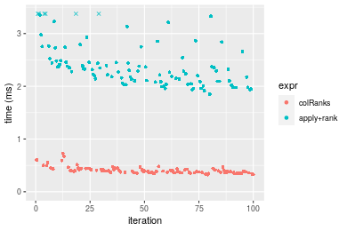
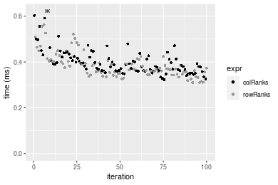
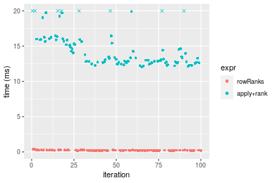
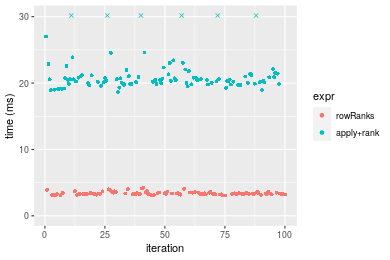
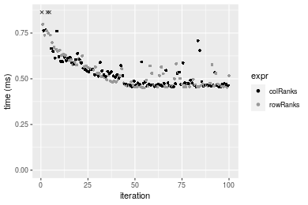

[matrixStats]: Benchmark report

---------------------------------------


# colRanks() and rowRanks() benchmarks

This report benchmark the performance of colRanks() and rowRanks() against alternative methods.

## Alternative methods

* apply() + rank()


## Data type "integer"

### Data
```r
> rmatrix <- function(nrow, ncol, mode = c("logical", "double", "integer", "index"), range = c(-100, 
+     +100), na_prob = 0) {
+     mode <- match.arg(mode)
+     n <- nrow * ncol
+     if (mode == "logical") {
+         x <- sample(c(FALSE, TRUE), size = n, replace = TRUE)
+     }     else if (mode == "index") {
+         x <- seq_len(n)
+         mode <- "integer"
+     }     else {
+         x <- runif(n, min = range[1], max = range[2])
+     }
+     storage.mode(x) <- mode
+     if (na_prob > 0) 
+         x[sample(n, size = na_prob * n)] <- NA
+     dim(x) <- c(nrow, ncol)
+     x
+ }
> rmatrices <- function(scale = 10, seed = 1, ...) {
+     set.seed(seed)
+     data <- list()
+     data[[1]] <- rmatrix(nrow = scale * 1, ncol = scale * 1, ...)
+     data[[2]] <- rmatrix(nrow = scale * 10, ncol = scale * 10, ...)
+     data[[3]] <- rmatrix(nrow = scale * 100, ncol = scale * 1, ...)
+     data[[4]] <- t(data[[3]])
+     data[[5]] <- rmatrix(nrow = scale * 10, ncol = scale * 100, ...)
+     data[[6]] <- t(data[[5]])
+     names(data) <- sapply(data, FUN = function(x) paste(dim(x), collapse = "x"))
+     data
+ }
> data <- rmatrices(mode = mode)
```

### Results

#### 10x10 integer matrix

```r
> X <- data[["10x10"]]
> gc()
           used  (Mb) gc trigger  (Mb) max used  (Mb)
Ncells  5246674 280.3   10014072 534.9 10014072 534.9
Vcells 10105596  77.1   18204443 138.9 18204443 138.9
> colStats <- microbenchmark(colRanks = colRanks(X, na.rm = FALSE), `apply+rank` = apply(X, MARGIN = 2L, 
+     FUN = rank, na.last = "keep", ties.method = "max"), unit = "ms")
> X <- t(X)
> gc()
           used  (Mb) gc trigger  (Mb) max used  (Mb)
Ncells  5231348 279.4   10014072 534.9 10014072 534.9
Vcells 10054963  76.8   18204443 138.9 18204443 138.9
> rowStats <- microbenchmark(rowRanks = rowRanks(X, na.rm = FALSE), `apply+rank` = apply(X, MARGIN = 1L, 
+     FUN = rank, na.last = "keep", ties.method = "max"), unit = "ms")
```

_Table: Benchmarking of colRanks() and apply+rank() on integer+10x10 data. The top panel shows times in milliseconds and the bottom panel shows relative times._


|   |expr       |     min|        lq|      mean|   median|        uq|      max|
|:--|:----------|-------:|---------:|---------:|--------:|---------:|--------:|
|1  |colRanks   | 0.00939| 0.0109015| 0.0140874| 0.013378| 0.0156395| 0.046589|
|2  |apply+rank | 0.18594| 0.1994290| 0.2179095| 0.214881| 0.2336200| 0.370377|


|   |expr       |      min|       lq|     mean|   median|       uq|      max|
|:--|:----------|--------:|--------:|--------:|--------:|--------:|--------:|
|1  |colRanks   |  1.00000|  1.00000|  1.00000|  1.00000|  1.00000| 1.000000|
|2  |apply+rank | 19.80192| 18.29372| 15.46843| 16.06227| 14.93782| 7.949881|

_Table: Benchmarking of rowRanks() and apply+rank() on integer+10x10 data (transposed). The top panel shows times in milliseconds and the bottom panel shows relative times._


|   |expr       |      min|        lq|      mean|    median|        uq|      max|
|:--|:----------|--------:|---------:|---------:|---------:|---------:|--------:|
|1  |rowRanks   | 0.005207| 0.0063355| 0.0080642| 0.0079675| 0.0089740| 0.026177|
|2  |apply+rank | 0.184952| 0.2000325| 0.2168845| 0.2125155| 0.2320675| 0.361638|


|   |expr       |      min|       lq|     mean|  median|       uq|     max|
|:--|:----------|--------:|--------:|--------:|-------:|--------:|-------:|
|1  |rowRanks   |  1.00000|  1.00000|  1.00000|  1.0000|  1.00000|  1.0000|
|2  |apply+rank | 35.51988| 31.57328| 26.89456| 26.6728| 25.85998| 13.8151|

_Figure: Benchmarking of colRanks() and apply+rank() on integer+10x10 data  as well as rowRanks() and apply+rank() on the same data transposed.  Outliers are displayed as crosses.  Times are in milliseconds._


_Table: Benchmarking of colRanks() and rowRanks() on integer+10x10 data (original and transposed).  The top panel shows times in milliseconds and the bottom panel shows relative times._


|   |expr     |   min|      lq|     mean|  median|      uq|    max|
|:--|:--------|-----:|-------:|--------:|-------:|-------:|------:|
|2  |rowRanks | 5.207|  6.3355|  8.06425|  7.9675|  8.9740| 26.177|
|1  |colRanks | 9.390| 10.9015| 14.08737| 13.3780| 15.6395| 46.589|


|   |expr     |      min|       lq|     mean|   median|       uq|      max|
|:--|:--------|--------:|--------:|--------:|--------:|--------:|--------:|
|2  |rowRanks | 1.000000| 1.000000| 1.000000| 1.000000| 1.000000| 1.000000|
|1  |colRanks | 1.803342| 1.720701| 1.746892| 1.679071| 1.742757| 1.779769|

_Figure: Benchmarking of colRanks() and rowRanks() on integer+10x10 data (original and transposed).  Outliers are displayed as crosses. Times are in milliseconds._


#### 100x100 integer matrix

```r
> X <- data[["100x100"]]
> gc()
          used  (Mb) gc trigger  (Mb) max used  (Mb)
Ncells 5229926 279.4   10014072 534.9 10014072 534.9
Vcells 9671495  73.8   18204443 138.9 18204443 138.9
> colStats <- microbenchmark(colRanks = colRanks(X, na.rm = FALSE), `apply+rank` = apply(X, MARGIN = 2L, 
+     FUN = rank, na.last = "keep", ties.method = "max"), unit = "ms")
> X <- t(X)
> gc()
          used  (Mb) gc trigger  (Mb) max used  (Mb)
Ncells 5229902 279.4   10014072 534.9 10014072 534.9
Vcells 9676508  73.9   18204443 138.9 18204443 138.9
> rowStats <- microbenchmark(rowRanks = rowRanks(X, na.rm = FALSE), `apply+rank` = apply(X, MARGIN = 1L, 
+     FUN = rank, na.last = "keep", ties.method = "max"), unit = "ms")
```

_Table: Benchmarking of colRanks() and apply+rank() on integer+100x100 data. The top panel shows times in milliseconds and the bottom panel shows relative times._


|   |expr       |      min|        lq|      mean|   median|        uq|      max|
|:--|:----------|--------:|---------:|---------:|--------:|---------:|--------:|
|1  |colRanks   | 0.324570| 0.3273195| 0.3418947| 0.333859| 0.3355975| 0.588654|
|2  |apply+rank | 1.884639| 1.9111280| 2.0390989| 1.923296| 1.9498585| 3.351683|


|   |expr       |      min|       lq|     mean|   median|      uq|      max|
|:--|:----------|--------:|--------:|--------:|--------:|-------:|--------:|
|1  |colRanks   | 1.000000| 1.000000| 1.000000| 1.000000| 1.00000| 1.000000|
|2  |apply+rank | 5.806572| 5.838723| 5.964114| 5.760802| 5.81011| 5.693808|

_Table: Benchmarking of rowRanks() and apply+rank() on integer+100x100 data (transposed). The top panel shows times in milliseconds and the bottom panel shows relative times._


|   |expr       |      min|        lq|      mean|    median|        uq|      max|
|:--|:----------|--------:|---------:|---------:|---------:|---------:|--------:|
|1  |rowRanks   | 0.312491| 0.3152345| 0.3291679| 0.3220255| 0.3245625| 0.432620|
|2  |apply+rank | 1.889051| 1.9130705| 1.9927819| 1.9250445| 1.9409375| 3.058765|


|   |expr       |      min|       lq|     mean|   median|       uq|      max|
|:--|:----------|--------:|--------:|--------:|--------:|--------:|--------:|
|1  |rowRanks   | 1.000000| 1.000000| 1.000000| 1.000000| 1.000000| 1.000000|
|2  |apply+rank | 6.045137| 6.068722| 6.053999| 5.977926| 5.980166| 7.070327|

_Figure: Benchmarking of colRanks() and apply+rank() on integer+100x100 data  as well as rowRanks() and apply+rank() on the same data transposed.  Outliers are displayed as crosses.  Times are in milliseconds._





_Table: Benchmarking of colRanks() and rowRanks() on integer+100x100 data (original and transposed).  The top panel shows times in milliseconds and the bottom panel shows relative times._


|   |expr     |     min|       lq|     mean|   median|       uq|     max|
|:--|:--------|-------:|--------:|--------:|--------:|--------:|-------:|
|2  |rowRanks | 312.491| 315.2345| 329.1679| 322.0255| 324.5625| 432.620|
|1  |colRanks | 324.570| 327.3195| 341.8947| 333.8590| 335.5975| 588.654|


|   |expr     |      min|       lq|     mean|   median|    uq|      max|
|:--|:--------|--------:|--------:|--------:|--------:|-----:|--------:|
|2  |rowRanks | 1.000000| 1.000000| 1.000000| 1.000000| 1.000| 1.000000|
|1  |colRanks | 1.038654| 1.038336| 1.038664| 1.036747| 1.034| 1.360672|

_Figure: Benchmarking of colRanks() and rowRanks() on integer+100x100 data (original and transposed).  Outliers are displayed as crosses. Times are in milliseconds._




#### 1000x10 integer matrix

```r
> X <- data[["1000x10"]]
> gc()
          used  (Mb) gc trigger  (Mb) max used  (Mb)
Ncells 5230638 279.4   10014072 534.9 10014072 534.9
Vcells 9674972  73.9   18204443 138.9 18204443 138.9
> colStats <- microbenchmark(colRanks = colRanks(X, na.rm = FALSE), `apply+rank` = apply(X, MARGIN = 2L, 
+     FUN = rank, na.last = "keep", ties.method = "max"), unit = "ms")
> X <- t(X)
> gc()
          used  (Mb) gc trigger  (Mb) max used  (Mb)
Ncells 5230632 279.4   10014072 534.9 10014072 534.9
Vcells 9680015  73.9   18204443 138.9 18204443 138.9
> rowStats <- microbenchmark(rowRanks = rowRanks(X, na.rm = FALSE), `apply+rank` = apply(X, MARGIN = 1L, 
+     FUN = rank, na.last = "keep", ties.method = "max"), unit = "ms")
```

_Table: Benchmarking of colRanks() and apply+rank() on integer+1000x10 data. The top panel shows times in milliseconds and the bottom panel shows relative times._


|   |expr       |      min|       lq|     mean|   median|        uq|      max|
|:--|:----------|--------:|--------:|--------:|--------:|---------:|--------:|
|1  |colRanks   | 0.397523| 0.401227| 0.438695| 0.407582| 0.4177515| 0.847646|
|2  |apply+rank | 1.107429| 1.121831| 1.207554| 1.131018| 1.2183140| 1.924669|


|   |expr       |      min|       lq|     mean|   median|       uq|      max|
|:--|:----------|--------:|--------:|--------:|--------:|--------:|--------:|
|1  |colRanks   | 1.000000| 1.000000| 1.000000| 1.000000| 1.000000| 1.000000|
|2  |apply+rank | 2.785824| 2.796001| 2.752606| 2.774945| 2.916361| 2.270605|

_Table: Benchmarking of rowRanks() and apply+rank() on integer+1000x10 data (transposed). The top panel shows times in milliseconds and the bottom panel shows relative times._


|   |expr       |      min|        lq|      mean|   median|       uq|      max|
|:--|:----------|--------:|---------:|---------:|--------:|--------:|--------:|
|1  |rowRanks   | 0.382970| 0.3887545| 0.4272896| 0.395251| 0.443591| 0.672993|
|2  |apply+rank | 1.102908| 1.1171120| 1.2159114| 1.132899| 1.233375| 1.893483|


|   |expr       |      min|       lq|     mean|   median|       uq|      max|
|:--|:----------|--------:|--------:|--------:|--------:|--------:|--------:|
|1  |rowRanks   | 1.000000| 1.000000| 1.000000| 1.000000| 1.000000| 1.000000|
|2  |apply+rank | 2.879881| 2.873567| 2.845638| 2.866276| 2.780432| 2.813525|

_Figure: Benchmarking of colRanks() and apply+rank() on integer+1000x10 data  as well as rowRanks() and apply+rank() on the same data transposed.  Outliers are displayed as crosses.  Times are in milliseconds._


_Table: Benchmarking of colRanks() and rowRanks() on integer+1000x10 data (original and transposed).  The top panel shows times in milliseconds and the bottom panel shows relative times._


|   |expr     |     min|       lq|     mean|  median|       uq|     max|
|:--|:--------|-------:|--------:|--------:|-------:|--------:|-------:|
|2  |rowRanks | 382.970| 388.7545| 427.2896| 395.251| 443.5910| 672.993|
|1  |colRanks | 397.523| 401.2270| 438.6950| 407.582| 417.7515| 847.646|


|   |expr     |   min|       lq|     mean|   median|        uq|      max|
|:--|:--------|-----:|--------:|--------:|--------:|---------:|--------:|
|2  |rowRanks | 1.000| 1.000000| 1.000000| 1.000000| 1.0000000| 1.000000|
|1  |colRanks | 1.038| 1.032083| 1.026692| 1.031198| 0.9417493| 1.259517|

_Figure: Benchmarking of colRanks() and rowRanks() on integer+1000x10 data (original and transposed).  Outliers are displayed as crosses. Times are in milliseconds._


#### 10x1000 integer matrix

```r
> X <- data[["10x1000"]]
> gc()
          used  (Mb) gc trigger  (Mb) max used  (Mb)
Ncells 5230844 279.4   10014072 534.9 10014072 534.9
Vcells 9675682  73.9   18204443 138.9 18204443 138.9
> colStats <- microbenchmark(colRanks = colRanks(X, na.rm = FALSE), `apply+rank` = apply(X, MARGIN = 2L, 
+     FUN = rank, na.last = "keep", ties.method = "max"), unit = "ms")
> X <- t(X)
> gc()
          used  (Mb) gc trigger  (Mb) max used  (Mb)
Ncells 5230820 279.4   10014072 534.9 10014072 534.9
Vcells 9680695  73.9   18204443 138.9 18204443 138.9
> rowStats <- microbenchmark(rowRanks = rowRanks(X, na.rm = FALSE), `apply+rank` = apply(X, MARGIN = 1L, 
+     FUN = rank, na.last = "keep", ties.method = "max"), unit = "ms")
```

_Table: Benchmarking of colRanks() and apply+rank() on integer+10x1000 data. The top panel shows times in milliseconds and the bottom panel shows relative times._


|   |expr       |      min|         lq|       mean|    median|        uq|       max|
|:--|:----------|--------:|----------:|----------:|---------:|---------:|---------:|
|1  |colRanks   |  0.21105|  0.2236095|  0.2436919|  0.240662|  0.260353|  0.322406|
|2  |apply+rank | 12.14412| 12.9419960| 13.5336605| 13.266837| 13.500289| 20.006868|


|   |expr       |      min|       lq|     mean|   median|       uq|      max|
|:--|:----------|--------:|--------:|--------:|--------:|--------:|--------:|
|1  |colRanks   |  1.00000|  1.00000|  1.00000|  1.00000|  1.00000|  1.00000|
|2  |apply+rank | 57.54144| 57.87767| 55.53594| 55.12643| 51.85379| 62.05489|

_Table: Benchmarking of rowRanks() and apply+rank() on integer+10x1000 data (transposed). The top panel shows times in milliseconds and the bottom panel shows relative times._


|   |expr       |       min|         lq|       mean|    median|        uq|       max|
|:--|:----------|---------:|----------:|----------:|---------:|---------:|---------:|
|1  |rowRanks   |  0.199479|  0.2070255|  0.2200148|  0.219184|  0.230297|  0.293971|
|2  |apply+rank | 12.130408| 12.8694370| 13.3455680| 13.191660| 13.377282| 19.834693|


|   |expr       |      min|       lq|    mean|   median|       uq|     max|
|:--|:----------|--------:|--------:|-------:|--------:|--------:|-------:|
|1  |rowRanks   |  1.00000|  1.00000|  1.0000|  1.00000|  1.00000|  1.0000|
|2  |apply+rank | 60.81045| 62.16354| 60.6576| 60.18532| 58.08709| 67.4716|

_Figure: Benchmarking of colRanks() and apply+rank() on integer+10x1000 data  as well as rowRanks() and apply+rank() on the same data transposed.  Outliers are displayed as crosses.  Times are in milliseconds._



_Table: Benchmarking of colRanks() and rowRanks() on integer+10x1000 data (original and transposed).  The top panel shows times in milliseconds and the bottom panel shows relative times._


|   |expr     |     min|       lq|     mean|  median|      uq|     max|
|:--|:--------|-------:|--------:|--------:|-------:|-------:|-------:|
|2  |rowRanks | 199.479| 207.0255| 220.0148| 219.184| 230.297| 293.971|
|1  |colRanks | 211.050| 223.6095| 243.6919| 240.662| 260.353| 322.406|


|   |expr     |      min|       lq|     mean|   median|      uq|      max|
|:--|:--------|--------:|--------:|--------:|--------:|-------:|--------:|
|2  |rowRanks | 1.000000| 1.000000| 1.000000| 1.000000| 1.00000| 1.000000|
|1  |colRanks | 1.058006| 1.080106| 1.107616| 1.097991| 1.13051| 1.096727|

_Figure: Benchmarking of colRanks() and rowRanks() on integer+10x1000 data (original and transposed).  Outliers are displayed as crosses. Times are in milliseconds._


#### 100x1000 integer matrix

```r
> X <- data[["100x1000"]]
> gc()
          used  (Mb) gc trigger  (Mb) max used  (Mb)
Ncells 5231016 279.4   10014072 534.9 10014072 534.9
Vcells 9676149  73.9   18204443 138.9 18204443 138.9
> colStats <- microbenchmark(colRanks = colRanks(X, na.rm = FALSE), `apply+rank` = apply(X, MARGIN = 2L, 
+     FUN = rank, na.last = "keep", ties.method = "max"), unit = "ms")
> X <- t(X)
> gc()
          used  (Mb) gc trigger  (Mb) max used  (Mb)
Ncells 5231004 279.4   10014072 534.9 10014072 534.9
Vcells 9726182  74.3   18204443 138.9 18204443 138.9
> rowStats <- microbenchmark(rowRanks = rowRanks(X, na.rm = FALSE), `apply+rank` = apply(X, MARGIN = 1L, 
+     FUN = rank, na.last = "keep", ties.method = "max"), unit = "ms")
```

_Table: Benchmarking of colRanks() and apply+rank() on integer+100x1000 data. The top panel shows times in milliseconds and the bottom panel shows relative times._


|   |expr       |      min|        lq|      mean|    median|       uq|       max|
|:--|:----------|--------:|---------:|---------:|---------:|--------:|---------:|
|1  |colRanks   |  3.17255|  3.245403|  3.353841|  3.308516|  3.38501|  4.050719|
|2  |apply+rank | 18.80465| 19.325169| 20.955113| 19.532222| 19.79926| 35.347041|


|   |expr       |      min|       lq|     mean|  median|     uq|      max|
|:--|:----------|--------:|--------:|--------:|-------:|------:|--------:|
|1  |colRanks   | 1.000000| 1.000000| 1.000000| 1.00000| 1.0000| 1.000000|
|2  |apply+rank | 5.927299| 5.954628| 6.248095| 5.90362| 5.8491| 8.726115|

_Table: Benchmarking of rowRanks() and apply+rank() on integer+100x1000 data (transposed). The top panel shows times in milliseconds and the bottom panel shows relative times._


|   |expr       |       min|        lq|      mean|    median|        uq|       max|
|:--|:----------|---------:|---------:|---------:|---------:|---------:|---------:|
|1  |rowRanks   |  3.091141|  3.182169|  3.289244|  3.262526|  3.329903|  4.089059|
|2  |apply+rank | 18.850454| 19.358854| 21.171517| 19.634047| 19.863545| 43.762463|


|   |expr       |      min|      lq|     mean|   median|       uq|      max|
|:--|:----------|--------:|-------:|--------:|--------:|--------:|--------:|
|1  |rowRanks   | 1.000000| 1.00000| 1.000000| 1.000000| 1.000000|  1.00000|
|2  |apply+rank | 6.098219| 6.08354| 6.436591| 6.018052| 5.965203| 10.70233|

_Figure: Benchmarking of colRanks() and apply+rank() on integer+100x1000 data  as well as rowRanks() and apply+rank() on the same data transposed.  Outliers are displayed as crosses.  Times are in milliseconds._



_Table: Benchmarking of colRanks() and rowRanks() on integer+100x1000 data (original and transposed).  The top panel shows times in milliseconds and the bottom panel shows relative times._


|   |expr     |      min|       lq|     mean|   median|       uq|      max|
|:--|:--------|--------:|--------:|--------:|--------:|--------:|--------:|
|2  |rowRanks | 3.091141| 3.182169| 3.289244| 3.262526| 3.329903| 4.089059|
|1  |colRanks | 3.172550| 3.245403| 3.353841| 3.308516| 3.385010| 4.050719|


|   |expr     |      min|       lq|     mean|   median|       uq|       max|
|:--|:--------|--------:|--------:|--------:|--------:|--------:|---------:|
|2  |rowRanks | 1.000000| 1.000000| 1.000000| 1.000000| 1.000000| 1.0000000|
|1  |colRanks | 1.026336| 1.019871| 1.019639| 1.014097| 1.016549| 0.9906238|

_Figure: Benchmarking of colRanks() and rowRanks() on integer+100x1000 data (original and transposed).  Outliers are displayed as crosses. Times are in milliseconds._


#### 1000x100 integer matrix

```r
> X <- data[["1000x100"]]
> gc()
          used  (Mb) gc trigger  (Mb) max used  (Mb)
Ncells 5231220 279.4   10014072 534.9 10014072 534.9
Vcells 9676735  73.9   18204443 138.9 18204443 138.9
> colStats <- microbenchmark(colRanks = colRanks(X, na.rm = FALSE), `apply+rank` = apply(X, MARGIN = 2L, 
+     FUN = rank, na.last = "keep", ties.method = "max"), unit = "ms")
> X <- t(X)
> gc()
          used  (Mb) gc trigger  (Mb) max used  (Mb)
Ncells 5231196 279.4   10014072 534.9 10014072 534.9
Vcells 9726748  74.3   18204443 138.9 18204443 138.9
> rowStats <- microbenchmark(rowRanks = rowRanks(X, na.rm = FALSE), `apply+rank` = apply(X, MARGIN = 1L, 
+     FUN = rank, na.last = "keep", ties.method = "max"), unit = "ms")
```

_Table: Benchmarking of colRanks() and apply+rank() on integer+1000x100 data. The top panel shows times in milliseconds and the bottom panel shows relative times._


|   |expr       |       min|        lq|      mean|   median|        uq|      max|
|:--|:----------|---------:|---------:|---------:|--------:|---------:|--------:|
|1  |colRanks   |  3.916393|  3.967121|  4.369305|  4.04559|  4.153889| 11.96739|
|2  |apply+rank | 10.752030| 10.894484| 11.629367| 11.04985| 11.149952| 20.13560|


|   |expr       |      min|       lq|     mean|   median|      uq|     max|
|:--|:----------|--------:|--------:|--------:|--------:|-------:|-------:|
|1  |colRanks   | 1.000000| 1.000000| 1.000000| 1.000000| 1.00000| 1.00000|
|2  |apply+rank | 2.745391| 2.746194| 2.661605| 2.731332| 2.68422| 1.68254|

_Table: Benchmarking of rowRanks() and apply+rank() on integer+1000x100 data (transposed). The top panel shows times in milliseconds and the bottom panel shows relative times._


|   |expr       |       min|        lq|      mean|    median|       uq|       max|
|:--|:----------|---------:|---------:|---------:|---------:|--------:|---------:|
|1  |rowRanks   |  3.821972|  3.843949|  3.928733|  3.898261|  3.95435|  4.611511|
|2  |apply+rank | 10.762528| 10.886252| 11.834009| 11.039170| 11.17112| 19.969206|


|   |expr       |      min|       lq|     mean|   median|       uq|      max|
|:--|:----------|--------:|--------:|--------:|--------:|--------:|--------:|
|1  |rowRanks   | 1.000000| 1.000000| 1.000000| 1.000000| 1.000000| 1.000000|
|2  |apply+rank | 2.815962| 2.832049| 3.012169| 2.831819| 2.825019| 4.330296|

_Figure: Benchmarking of colRanks() and apply+rank() on integer+1000x100 data  as well as rowRanks() and apply+rank() on the same data transposed.  Outliers are displayed as crosses.  Times are in milliseconds._


_Table: Benchmarking of colRanks() and rowRanks() on integer+1000x100 data (original and transposed).  The top panel shows times in milliseconds and the bottom panel shows relative times._


|   |expr     |      min|       lq|     mean|   median|       uq|       max|
|:--|:--------|--------:|--------:|--------:|--------:|--------:|---------:|
|2  |rowRanks | 3.821972| 3.843949| 3.928733| 3.898261| 3.954350|  4.611511|
|1  |colRanks | 3.916393| 3.967121| 4.369305| 4.045590| 4.153889| 11.967387|


|   |expr     |      min|       lq|     mean|   median|       uq|      max|
|:--|:--------|--------:|--------:|--------:|--------:|--------:|--------:|
|2  |rowRanks | 1.000000| 1.000000| 1.000000| 1.000000| 1.000000| 1.000000|
|1  |colRanks | 1.024705| 1.032043| 1.112141| 1.037794| 1.050461| 2.595112|

_Figure: Benchmarking of colRanks() and rowRanks() on integer+1000x100 data (original and transposed).  Outliers are displayed as crosses. Times are in milliseconds._


## Data type "double"

### Data
```r
> rmatrix <- function(nrow, ncol, mode = c("logical", "double", "integer", "index"), range = c(-100, 
+     +100), na_prob = 0) {
+     mode <- match.arg(mode)
+     n <- nrow * ncol
+     if (mode == "logical") {
+         x <- sample(c(FALSE, TRUE), size = n, replace = TRUE)
+     }     else if (mode == "index") {
+         x <- seq_len(n)
+         mode <- "integer"
+     }     else {
+         x <- runif(n, min = range[1], max = range[2])
+     }
+     storage.mode(x) <- mode
+     if (na_prob > 0) 
+         x[sample(n, size = na_prob * n)] <- NA
+     dim(x) <- c(nrow, ncol)
+     x
+ }
> rmatrices <- function(scale = 10, seed = 1, ...) {
+     set.seed(seed)
+     data <- list()
+     data[[1]] <- rmatrix(nrow = scale * 1, ncol = scale * 1, ...)
+     data[[2]] <- rmatrix(nrow = scale * 10, ncol = scale * 10, ...)
+     data[[3]] <- rmatrix(nrow = scale * 100, ncol = scale * 1, ...)
+     data[[4]] <- t(data[[3]])
+     data[[5]] <- rmatrix(nrow = scale * 10, ncol = scale * 100, ...)
+     data[[6]] <- t(data[[5]])
+     names(data) <- sapply(data, FUN = function(x) paste(dim(x), collapse = "x"))
+     data
+ }
> data <- rmatrices(mode = mode)
```

### Results

#### 10x10 double matrix

```r
> X <- data[["10x10"]]
> gc()
          used  (Mb) gc trigger  (Mb) max used  (Mb)
Ncells 5231420 279.4   10014072 534.9 10014072 534.9
Vcells 9793095  74.8   18204443 138.9 18204443 138.9
> colStats <- microbenchmark(colRanks = colRanks(X, na.rm = FALSE), `apply+rank` = apply(X, MARGIN = 2L, 
+     FUN = rank, na.last = "keep", ties.method = "max"), unit = "ms")
> X <- t(X)
> gc()
          used  (Mb) gc trigger  (Mb) max used  (Mb)
Ncells 5231387 279.4   10014072 534.9 10014072 534.9
Vcells 9793193  74.8   18204443 138.9 18204443 138.9
> rowStats <- microbenchmark(rowRanks = rowRanks(X, na.rm = FALSE), `apply+rank` = apply(X, MARGIN = 1L, 
+     FUN = rank, na.last = "keep", ties.method = "max"), unit = "ms")
```

_Table: Benchmarking of colRanks() and apply+rank() on double+10x10 data. The top panel shows times in milliseconds and the bottom panel shows relative times._


|   |expr       |      min|        lq|      mean|    median|        uq|      max|
|:--|:----------|--------:|---------:|---------:|---------:|---------:|--------:|
|1  |colRanks   | 0.009478| 0.0104785| 0.0135954| 0.0130785| 0.0149865| 0.045246|
|2  |apply+rank | 0.186166| 0.1908965| 0.2124638| 0.2091995| 0.2259125| 0.367926|


|   |expr       |      min|       lq|     mean|   median|      uq|     max|
|:--|:----------|--------:|--------:|--------:|--------:|-------:|-------:|
|1  |colRanks   |  1.00000|  1.00000|  1.00000|  1.00000|  1.0000| 1.00000|
|2  |apply+rank | 19.64191| 18.21792| 15.62761| 15.99568| 15.0744| 8.13168|

_Table: Benchmarking of rowRanks() and apply+rank() on double+10x10 data (transposed). The top panel shows times in milliseconds and the bottom panel shows relative times._


|   |expr       |     min|        lq|      mean|   median|        uq|      max|
|:--|:----------|-------:|---------:|---------:|--------:|---------:|--------:|
|1  |rowRanks   | 0.00513| 0.0061385| 0.0080852| 0.008007| 0.0089260| 0.027266|
|2  |apply+rank | 0.18435| 0.1890750| 0.2092274| 0.201512| 0.2256505| 0.363782|


|   |expr       |      min|      lq|     mean|   median|       uq|      max|
|:--|:----------|--------:|-------:|--------:|--------:|--------:|--------:|
|1  |rowRanks   |  1.00000|  1.0000|  1.00000|  1.00000|  1.00000|  1.00000|
|2  |apply+rank | 35.93567| 30.8015| 25.87783| 25.16698| 25.28014| 13.34196|

_Figure: Benchmarking of colRanks() and apply+rank() on double+10x10 data  as well as rowRanks() and apply+rank() on the same data transposed.  Outliers are displayed as crosses.  Times are in milliseconds._


_Table: Benchmarking of colRanks() and rowRanks() on double+10x10 data (original and transposed).  The top panel shows times in milliseconds and the bottom panel shows relative times._


|   |expr     |   min|      lq|     mean|  median|      uq|    max|
|:--|:--------|-----:|-------:|--------:|-------:|-------:|------:|
|2  |rowRanks | 5.130|  6.1385|  8.08520|  8.0070|  8.9260| 27.266|
|1  |colRanks | 9.478| 10.4785| 13.59541| 13.0785| 14.9865| 45.246|


|   |expr     |      min|       lq|     mean|   median|       uq|      max|
|:--|:--------|--------:|--------:|--------:|--------:|--------:|--------:|
|2  |rowRanks | 1.000000| 1.000000| 1.000000| 1.000000| 1.000000| 1.000000|
|1  |colRanks | 1.847563| 1.707013| 1.681518| 1.633383| 1.678972| 1.659429|

_Figure: Benchmarking of colRanks() and rowRanks() on double+10x10 data (original and transposed).  Outliers are displayed as crosses. Times are in milliseconds._


#### 100x100 double matrix

```r
> X <- data[["100x100"]]
> gc()
          used  (Mb) gc trigger  (Mb) max used  (Mb)
Ncells 5231600 279.4   10014072 534.9 10014072 534.9
Vcells 9793207  74.8   18204443 138.9 18204443 138.9
> colStats <- microbenchmark(colRanks = colRanks(X, na.rm = FALSE), `apply+rank` = apply(X, MARGIN = 2L, 
+     FUN = rank, na.last = "keep", ties.method = "max"), unit = "ms")
> X <- t(X)
> gc()
          used  (Mb) gc trigger  (Mb) max used  (Mb)
Ncells 5231576 279.4   10014072 534.9 10014072 534.9
Vcells 9803220  74.8   18204443 138.9 18204443 138.9
> rowStats <- microbenchmark(rowRanks = rowRanks(X, na.rm = FALSE), `apply+rank` = apply(X, MARGIN = 1L, 
+     FUN = rank, na.last = "keep", ties.method = "max"), unit = "ms")
```

_Table: Benchmarking of colRanks() and apply+rank() on double+100x100 data. The top panel shows times in milliseconds and the bottom panel shows relative times._


|   |expr       |      min|        lq|      mean|   median|       uq|       max|
|:--|:----------|--------:|---------:|---------:|--------:|--------:|---------:|
|1  |colRanks   | 0.340643| 0.3447435| 0.3682534| 0.351756| 0.369076|  0.616966|
|2  |apply+rank | 1.853657| 1.8861665| 2.1475774| 1.904289| 2.063585| 14.194989|


|   |expr       |      min|       lq|     mean|   median|       uq|      max|
|:--|:----------|--------:|--------:|--------:|--------:|--------:|--------:|
|1  |colRanks   | 1.000000| 1.000000| 1.000000| 1.000000| 1.000000|  1.00000|
|2  |apply+rank | 5.441641| 5.471217| 5.831793| 5.413663| 5.591218| 23.00773|

_Table: Benchmarking of rowRanks() and apply+rank() on double+100x100 data (transposed). The top panel shows times in milliseconds and the bottom panel shows relative times._


|   |expr       |      min|       lq|      mean|   median|        uq|       max|
|:--|:----------|--------:|--------:|---------:|--------:|---------:|---------:|
|1  |rowRanks   | 0.324377| 0.328141| 0.3501986| 0.335455| 0.3473705|  0.463941|
|2  |apply+rank | 1.860264| 1.883876| 2.1413301| 1.897288| 1.9759790| 14.463854|


|   |expr       |      min|       lq|     mean|   median|      uq|      max|
|:--|:----------|--------:|--------:|--------:|--------:|-------:|--------:|
|1  |rowRanks   | 1.000000| 1.000000| 1.000000| 1.000000| 1.00000|  1.00000|
|2  |apply+rank | 5.734883| 5.741056| 6.114617| 5.655866| 5.68839| 31.17606|

_Figure: Benchmarking of colRanks() and apply+rank() on double+100x100 data  as well as rowRanks() and apply+rank() on the same data transposed.  Outliers are displayed as crosses.  Times are in milliseconds._


_Table: Benchmarking of colRanks() and rowRanks() on double+100x100 data (original and transposed).  The top panel shows times in milliseconds and the bottom panel shows relative times._


|   |expr     |     min|       lq|     mean|  median|       uq|     max|
|:--|:--------|-------:|--------:|--------:|-------:|--------:|-------:|
|2  |rowRanks | 324.377| 328.1410| 350.1986| 335.455| 347.3705| 463.941|
|1  |colRanks | 340.643| 344.7435| 368.2534| 351.756| 369.0760| 616.966|


|   |expr     |      min|       lq|     mean|   median|       uq|      max|
|:--|:--------|--------:|--------:|--------:|--------:|--------:|--------:|
|2  |rowRanks | 1.000000| 1.000000| 1.000000| 1.000000| 1.000000| 1.000000|
|1  |colRanks | 1.050145| 1.050596| 1.051556| 1.048594| 1.062485| 1.329837|

_Figure: Benchmarking of colRanks() and rowRanks() on double+100x100 data (original and transposed).  Outliers are displayed as crosses. Times are in milliseconds._


#### 1000x10 double matrix

```r
> X <- data[["1000x10"]]
> gc()
          used  (Mb) gc trigger  (Mb) max used  (Mb)
Ncells 5231790 279.5   10014072 534.9 10014072 534.9
Vcells 9794086  74.8   18204443 138.9 18204443 138.9
> colStats <- microbenchmark(colRanks = colRanks(X, na.rm = FALSE), `apply+rank` = apply(X, MARGIN = 2L, 
+     FUN = rank, na.last = "keep", ties.method = "max"), unit = "ms")
> X <- t(X)
> gc()
          used  (Mb) gc trigger  (Mb) max used  (Mb)
Ncells 5231766 279.5   10014072 534.9 10014072 534.9
Vcells 9804099  74.8   18204443 138.9 18204443 138.9
> rowStats <- microbenchmark(rowRanks = rowRanks(X, na.rm = FALSE), `apply+rank` = apply(X, MARGIN = 1L, 
+     FUN = rank, na.last = "keep", ties.method = "max"), unit = "ms")
```

_Table: Benchmarking of colRanks() and apply+rank() on double+1000x10 data. The top panel shows times in milliseconds and the bottom panel shows relative times._


|   |expr       |      min|        lq|      mean|   median|       uq|      max|
|:--|:----------|--------:|---------:|---------:|--------:|--------:|--------:|
|1  |colRanks   | 0.463309| 0.4691335| 0.5129603| 0.473112| 0.551071| 0.797496|
|2  |apply+rank | 1.020042| 1.0352775| 1.1925211| 1.045427| 1.191774| 8.268223|


|   |expr       |      min|       lq|     mean|   median|       uq|      max|
|:--|:----------|--------:|--------:|--------:|--------:|--------:|--------:|
|1  |colRanks   | 1.000000| 1.000000| 1.000000| 1.000000| 1.000000|  1.00000|
|2  |apply+rank | 2.201645| 2.206787| 2.324782| 2.209682| 2.162651| 10.36773|

_Table: Benchmarking of rowRanks() and apply+rank() on double+1000x10 data (transposed). The top panel shows times in milliseconds and the bottom panel shows relative times._


|   |expr       |      min|       lq|      mean|   median|        uq|      max|
|:--|:----------|--------:|--------:|---------:|--------:|---------:|--------:|
|1  |rowRanks   | 0.447887| 0.452818| 0.4943743| 0.458433| 0.5308855| 0.746450|
|2  |apply+rank | 1.019406| 1.036159| 1.1825842| 1.045201| 1.1640820| 8.101651|


|   |expr       |      min|       lq|     mean|   median|       uq|      max|
|:--|:----------|--------:|--------:|--------:|--------:|--------:|--------:|
|1  |rowRanks   | 1.000000| 1.000000| 1.000000| 1.000000| 1.000000|  1.00000|
|2  |apply+rank | 2.276034| 2.288247| 2.392083| 2.279943| 2.192718| 10.85357|

_Figure: Benchmarking of colRanks() and apply+rank() on double+1000x10 data  as well as rowRanks() and apply+rank() on the same data transposed.  Outliers are displayed as crosses.  Times are in milliseconds._


_Table: Benchmarking of colRanks() and rowRanks() on double+1000x10 data (original and transposed).  The top panel shows times in milliseconds and the bottom panel shows relative times._


|   |expr     |     min|       lq|     mean|  median|       uq|     max|
|:--|:--------|-------:|--------:|--------:|-------:|--------:|-------:|
|2  |rowRanks | 447.887| 452.8180| 494.3743| 458.433| 530.8855| 746.450|
|1  |colRanks | 463.309| 469.1335| 512.9603| 473.112| 551.0710| 797.496|


|   |expr     |      min|       lq|     mean|  median|       uq|      max|
|:--|:--------|--------:|--------:|--------:|-------:|--------:|--------:|
|2  |rowRanks | 1.000000| 1.000000| 1.000000| 1.00000| 1.000000| 1.000000|
|1  |colRanks | 1.034433| 1.036031| 1.037595| 1.03202| 1.038022| 1.068385|

_Figure: Benchmarking of colRanks() and rowRanks() on double+1000x10 data (original and transposed).  Outliers are displayed as crosses. Times are in milliseconds._




#### 10x1000 double matrix

```r
> X <- data[["10x1000"]]
> gc()
          used  (Mb) gc trigger  (Mb) max used  (Mb)
Ncells 5231978 279.5   10014072 534.9 10014072 534.9
Vcells 9795115  74.8   18204443 138.9 18204443 138.9
> colStats <- microbenchmark(colRanks = colRanks(X, na.rm = FALSE), `apply+rank` = apply(X, MARGIN = 2L, 
+     FUN = rank, na.last = "keep", ties.method = "max"), unit = "ms")
> X <- t(X)
> gc()
          used  (Mb) gc trigger  (Mb) max used  (Mb)
Ncells 5231954 279.5   10014072 534.9 10014072 534.9
Vcells 9805128  74.9   18204443 138.9 18204443 138.9
> rowStats <- microbenchmark(rowRanks = rowRanks(X, na.rm = FALSE), `apply+rank` = apply(X, MARGIN = 1L, 
+     FUN = rank, na.last = "keep", ties.method = "max"), unit = "ms")
```

_Table: Benchmarking of colRanks() and apply+rank() on double+10x1000 data. The top panel shows times in milliseconds and the bottom panel shows relative times._


|   |expr       |       min|         lq|       mean|     median|         uq|       max|
|:--|:----------|---------:|----------:|----------:|----------:|----------:|---------:|
|1  |colRanks   |  0.227713|  0.2399295|  0.2598707|  0.2586775|  0.2739105|  0.341625|
|2  |apply+rank | 12.222775| 12.9142870| 13.4848107| 13.3854975| 13.5390405| 20.082648|


|   |expr       |      min|       lq|     mean|   median|      uq|      max|
|:--|:----------|--------:|--------:|--------:|--------:|-------:|--------:|
|1  |colRanks   |  1.00000|  1.00000|  1.00000|  1.00000|  1.0000|  1.00000|
|2  |apply+rank | 53.67623| 53.82534| 51.89045| 51.74589| 49.4287| 58.78565|

_Table: Benchmarking of rowRanks() and apply+rank() on double+10x1000 data (transposed). The top panel shows times in milliseconds and the bottom panel shows relative times._


|   |expr       |      min|        lq|       mean|    median|        uq|       max|
|:--|:----------|--------:|---------:|----------:|---------:|---------:|---------:|
|1  |rowRanks   |  0.21407|  0.225722|  0.2382794|  0.236078|  0.247409|  0.318856|
|2  |apply+rank | 12.14503| 12.868729| 13.4011605| 13.332165| 13.473586| 20.211827|


|   |expr       |      min|       lq|     mean|   median|       uq|      max|
|:--|:----------|--------:|--------:|--------:|--------:|--------:|--------:|
|1  |rowRanks   |  1.00000|  1.00000|  1.00000|  1.00000|  1.00000|  1.00000|
|2  |apply+rank | 56.73391| 57.01141| 56.24138| 56.47356| 54.45875| 63.38857|

_Figure: Benchmarking of colRanks() and apply+rank() on double+10x1000 data  as well as rowRanks() and apply+rank() on the same data transposed.  Outliers are displayed as crosses.  Times are in milliseconds._


_Table: Benchmarking of colRanks() and rowRanks() on double+10x1000 data (original and transposed).  The top panel shows times in milliseconds and the bottom panel shows relative times._


|   |expr     |     min|       lq|     mean|   median|       uq|     max|
|:--|:--------|-------:|--------:|--------:|--------:|--------:|-------:|
|2  |rowRanks | 214.070| 225.7220| 238.2793| 236.0780| 247.4090| 318.856|
|1  |colRanks | 227.713| 239.9295| 259.8707| 258.6775| 273.9105| 341.625|


|   |expr     |      min|       lq|     mean|   median|       uq|      max|
|:--|:--------|--------:|--------:|--------:|--------:|--------:|--------:|
|2  |rowRanks | 1.000000| 1.000000| 1.000000| 1.000000| 1.000000| 1.000000|
|1  |colRanks | 1.063732| 1.062942| 1.090614| 1.095729| 1.107116| 1.071408|

_Figure: Benchmarking of colRanks() and rowRanks() on double+10x1000 data (original and transposed).  Outliers are displayed as crosses. Times are in milliseconds._


#### 100x1000 double matrix

```r
> X <- data[["100x1000"]]
> gc()
          used  (Mb) gc trigger  (Mb) max used  (Mb)
Ncells 5232150 279.5   10014072 534.9 10014072 534.9
Vcells 9795216  74.8   18204443 138.9 18204443 138.9
> colStats <- microbenchmark(colRanks = colRanks(X, na.rm = FALSE), `apply+rank` = apply(X, MARGIN = 2L, 
+     FUN = rank, na.last = "keep", ties.method = "max"), unit = "ms")
> X <- t(X)
> gc()
          used  (Mb) gc trigger  (Mb) max used  (Mb)
Ncells 5232138 279.5   10014072 534.9 10014072 534.9
Vcells 9895249  75.5   18204443 138.9 18204443 138.9
> rowStats <- microbenchmark(rowRanks = rowRanks(X, na.rm = FALSE), `apply+rank` = apply(X, MARGIN = 1L, 
+     FUN = rank, na.last = "keep", ties.method = "max"), unit = "ms")
```

_Table: Benchmarking of colRanks() and apply+rank() on double+100x1000 data. The top panel shows times in milliseconds and the bottom panel shows relative times._


|   |expr       |       min|        lq|      mean|    median|        uq|        max|
|:--|:----------|---------:|---------:|---------:|---------:|---------:|----------:|
|1  |colRanks   |  3.345325|  3.425543|  3.545819|  3.481584|  3.515341|   5.242278|
|2  |apply+rank | 18.584080| 18.979951| 24.705255| 19.282520| 19.952199| 391.152019|


|   |expr       |      min|       lq|     mean|   median|       uq|      max|
|:--|:----------|--------:|--------:|--------:|--------:|--------:|--------:|
|1  |colRanks   | 1.000000| 1.000000| 1.000000| 1.000000| 1.000000|  1.00000|
|2  |apply+rank | 5.555239| 5.540713| 6.967432| 5.538434| 5.675751| 74.61489|

_Table: Benchmarking of rowRanks() and apply+rank() on double+100x1000 data (transposed). The top panel shows times in milliseconds and the bottom panel shows relative times._


|   |expr       |      min|        lq|      mean|    median|        uq|      max|
|:--|:----------|--------:|---------:|---------:|---------:|---------:|--------:|
|1  |rowRanks   |  3.23430|  3.338002|  3.596074|  3.405778|  3.460362| 16.24315|
|2  |apply+rank | 18.57604| 18.910309| 20.909467| 19.202204| 19.808822| 35.15707|


|   |expr       |     min|       lq|     mean|   median|       uq|      max|
|:--|:----------|-------:|--------:|--------:|--------:|--------:|--------:|
|1  |rowRanks   | 1.00000| 1.000000| 1.000000| 1.000000| 1.000000| 1.000000|
|2  |apply+rank | 5.74345| 5.665158| 5.814526| 5.638126| 5.724494| 2.164424|

_Figure: Benchmarking of colRanks() and apply+rank() on double+100x1000 data  as well as rowRanks() and apply+rank() on the same data transposed.  Outliers are displayed as crosses.  Times are in milliseconds._


_Table: Benchmarking of colRanks() and rowRanks() on double+100x1000 data (original and transposed).  The top panel shows times in milliseconds and the bottom panel shows relative times._


|   |expr     |      min|       lq|     mean|   median|       uq|       max|
|:--|:--------|--------:|--------:|--------:|--------:|--------:|---------:|
|2  |rowRanks | 3.234300| 3.338002| 3.596074| 3.405778| 3.460362| 16.243154|
|1  |colRanks | 3.345325| 3.425543| 3.545819| 3.481584| 3.515341|  5.242278|


|   |expr     |      min|       lq|      mean|   median|       uq|       max|
|:--|:--------|--------:|--------:|---------:|--------:|--------:|---------:|
|2  |rowRanks | 1.000000| 1.000000| 1.0000000| 1.000000| 1.000000| 1.0000000|
|1  |colRanks | 1.034327| 1.026226| 0.9860251| 1.022258| 1.015888| 0.3227377|

_Figure: Benchmarking of colRanks() and rowRanks() on double+100x1000 data (original and transposed).  Outliers are displayed as crosses. Times are in milliseconds._


#### 1000x100 double matrix

```r
> X <- data[["1000x100"]]
> gc()
          used  (Mb) gc trigger  (Mb) max used  (Mb)
Ncells 5232354 279.5   10014072 534.9 10014072 534.9
Vcells 9796456  74.8   18204443 138.9 18204443 138.9
> colStats <- microbenchmark(colRanks = colRanks(X, na.rm = FALSE), `apply+rank` = apply(X, MARGIN = 2L, 
+     FUN = rank, na.last = "keep", ties.method = "max"), unit = "ms")
> X <- t(X)
> gc()
          used  (Mb) gc trigger  (Mb) max used  (Mb)
Ncells 5232330 279.5   10014072 534.9 10014072 534.9
Vcells 9896469  75.6   18204443 138.9 18204443 138.9
> rowStats <- microbenchmark(rowRanks = rowRanks(X, na.rm = FALSE), `apply+rank` = apply(X, MARGIN = 1L, 
+     FUN = rank, na.last = "keep", ties.method = "max"), unit = "ms")
```

_Table: Benchmarking of colRanks() and apply+rank() on double+1000x100 data. The top panel shows times in milliseconds and the bottom panel shows relative times._


|   |expr       |      min|        lq|      mean|    median|        uq|      max|
|:--|:----------|--------:|---------:|---------:|---------:|---------:|--------:|
|1  |colRanks   | 4.589817|  4.629348|  4.904507|  4.653432|  4.757799| 12.64472|
|2  |apply+rank | 9.940360| 10.050009| 11.076790| 10.161571| 10.883321| 18.43891|


|   |expr       |      min|       lq|     mean|   median|      uq|      max|
|:--|:----------|--------:|--------:|--------:|--------:|-------:|--------:|
|1  |colRanks   | 1.000000| 1.000000| 1.000000| 1.000000| 1.00000| 1.000000|
|2  |apply+rank | 2.165742| 2.170934| 2.258492| 2.183672| 2.28747| 1.458229|

_Table: Benchmarking of rowRanks() and apply+rank() on double+1000x100 data (transposed). The top panel shows times in milliseconds and the bottom panel shows relative times._


|   |expr       |      min|        lq|      mean|    median|        uq|      max|
|:--|:----------|--------:|---------:|---------:|---------:|---------:|--------:|
|1  |rowRanks   | 4.417823|  4.440317|  4.688563|  4.464155|  4.596612| 11.79641|
|2  |apply+rank | 9.929244| 10.070253| 11.104222| 10.134127| 10.689322| 18.69060|


|   |expr       |      min|       lq|     mean|   median|       uq|      max|
|:--|:----------|--------:|--------:|--------:|--------:|--------:|--------:|
|1  |rowRanks   | 1.000000| 1.000000| 1.000000| 1.000000| 1.000000| 1.000000|
|2  |apply+rank | 2.247542| 2.267913| 2.368364| 2.270111| 2.325479| 1.584432|

_Figure: Benchmarking of colRanks() and apply+rank() on double+1000x100 data  as well as rowRanks() and apply+rank() on the same data transposed.  Outliers are displayed as crosses.  Times are in milliseconds._


_Table: Benchmarking of colRanks() and rowRanks() on double+1000x100 data (original and transposed).  The top panel shows times in milliseconds and the bottom panel shows relative times._


|   |expr     |      min|       lq|     mean|   median|       uq|      max|
|:--|:--------|--------:|--------:|--------:|--------:|--------:|--------:|
|2  |rowRanks | 4.417823| 4.440317| 4.688563| 4.464155| 4.596612| 11.79641|
|1  |colRanks | 4.589817| 4.629348| 4.904507| 4.653432| 4.757799| 12.64472|


|   |expr     |      min|       lq|     mean|   median|       uq|      max|
|:--|:--------|--------:|--------:|--------:|--------:|--------:|--------:|
|2  |rowRanks | 1.000000| 1.000000| 1.000000| 1.000000| 1.000000| 1.000000|
|1  |colRanks | 1.038932| 1.042571| 1.046058| 1.042399| 1.035067| 1.071913|

_Figure: Benchmarking of colRanks() and rowRanks() on double+1000x100 data (original and transposed).  Outliers are displayed as crosses. Times are in milliseconds._


## Appendix

### Session information
```r
R version 4.1.1 Patched (2021-08-10 r80727)
Platform: x86_64-pc-linux-gnu (64-bit)
Running under: Ubuntu 18.04.5 LTS

Matrix products: default
BLAS:   /home/hb/software/R-devel/R-4-1-branch/lib/R/lib/libRblas.so
LAPACK: /home/hb/software/R-devel/R-4-1-branch/lib/R/lib/libRlapack.so

locale:
 [1] LC_CTYPE=en_US.UTF-8       LC_NUMERIC=C              
 [3] LC_TIME=en_US.UTF-8        LC_COLLATE=en_US.UTF-8    
 [5] LC_MONETARY=en_US.UTF-8    LC_MESSAGES=en_US.UTF-8   
 [7] LC_PAPER=en_US.UTF-8       LC_NAME=C                 
 [9] LC_ADDRESS=C               LC_TELEPHONE=C            
[11] LC_MEASUREMENT=en_US.UTF-8 LC_IDENTIFICATION=C       

attached base packages:
[1] stats     graphics  grDevices utils     datasets  methods   base     

other attached packages:
[1] microbenchmark_1.4-7   matrixStats_0.60.1     ggplot2_3.3.5         
[4] knitr_1.33             R.devices_2.17.0       R.utils_2.10.1        
[7] R.oo_1.24.0            R.methodsS3_1.8.1-9001 history_0.0.1-9000    

loaded via a namespace (and not attached):
 [1] Biobase_2.52.0          httr_1.4.2              splines_4.1.1          
 [4] bit64_4.0.5             network_1.17.1          assertthat_0.2.1       
 [7] highr_0.9               stats4_4.1.1            blob_1.2.2             
[10] GenomeInfoDbData_1.2.6  robustbase_0.93-8       pillar_1.6.2           
[13] RSQLite_2.2.8           lattice_0.20-44         glue_1.4.2             
[16] digest_0.6.27           XVector_0.32.0          colorspace_2.0-2       
[19] Matrix_1.3-4            XML_3.99-0.7            pkgconfig_2.0.3        
[22] zlibbioc_1.38.0         genefilter_1.74.0       purrr_0.3.4            
[25] ergm_4.1.2              xtable_1.8-4            scales_1.1.1           
[28] tibble_3.1.4            annotate_1.70.0         KEGGREST_1.32.0        
[31] farver_2.1.0            generics_0.1.0          IRanges_2.26.0         
[34] ellipsis_0.3.2          cachem_1.0.6            withr_2.4.2            
[37] BiocGenerics_0.38.0     mime_0.11               survival_3.2-13        
[40] magrittr_2.0.1          crayon_1.4.1            statnet.common_4.5.0   
[43] memoise_2.0.0           laeken_0.5.1            fansi_0.5.0            
[46] R.cache_0.15.0          MASS_7.3-54             R.rsp_0.44.0           
[49] progressr_0.8.0         tools_4.1.1             lifecycle_1.0.0        
[52] S4Vectors_0.30.0        trust_0.1-8             munsell_0.5.0          
[55] tabby_0.0.1-9001        AnnotationDbi_1.54.1    Biostrings_2.60.2      
[58] compiler_4.1.1          GenomeInfoDb_1.28.1     rlang_0.4.11           
[61] grid_4.1.1              RCurl_1.98-1.4          cwhmisc_6.6            
[64] rappdirs_0.3.3          startup_0.15.0          labeling_0.4.2         
[67] bitops_1.0-7            base64enc_0.1-3         boot_1.3-28            
[70] gtable_0.3.0            DBI_1.1.1               markdown_1.1           
[73] R6_2.5.1                lpSolveAPI_5.5.2.0-17.7 rle_0.9.2              
[76] dplyr_1.0.7             fastmap_1.1.0           bit_4.0.4              
[79] utf8_1.2.2              parallel_4.1.1          Rcpp_1.0.7             
[82] vctrs_0.3.8             png_0.1-7               DEoptimR_1.0-9         
[85] tidyselect_1.1.1        xfun_0.25               coda_0.19-4            
```
Total processing time was 46.05 secs.


### Reproducibility
To reproduce this report, do:
```r
html <- matrixStats:::benchmark('colRanks')
```

[RSP]: https://cran.r-project.org/package=R.rsp
[matrixStats]: https://cran.r-project.org/package=matrixStats

[StackOverflow:colMins?]: https://stackoverflow.com/questions/13676878 "Stack Overflow: fastest way to get Min from every column in a matrix?"
[StackOverflow:colSds?]: https://stackoverflow.com/questions/17549762 "Stack Overflow: Is there such 'colsd' in R?"
[StackOverflow:rowProds?]: https://stackoverflow.com/questions/20198801/ "Stack Overflow: Row product of matrix and column sum of matrix"

---------------------------------------
Copyright Henrik Bengtsson. Last updated on 2021-08-25 18:15:17 (+0200 UTC). Powered by [RSP].

<script>
 var link = document.createElement('link');
 link.rel = 'icon';
 link.href = "data:image/png;base64,iVBORw0KGgoAAAANSUhEUgAAACAAAAAgCAMAAABEpIrGAAAA21BMVEUAAAAAAP8AAP8AAP8AAP8AAP8AAP8AAP8AAP8AAP8AAP8AAP8AAP8AAP8AAP8AAP8AAP8AAP8AAP8AAP8AAP8AAP8AAP8AAP8AAP8AAP8AAP8AAP8AAP8AAP8AAP8AAP8AAP8AAP8AAP8AAP8AAP8AAP8AAP8AAP8AAP8AAP8BAf4CAv0DA/wdHeIeHuEfH+AgIN8hId4lJdomJtknJ9g+PsE/P8BAQL9yco10dIt1dYp3d4h4eIeVlWqWlmmXl2iYmGeZmWabm2Tn5xjo6Bfp6Rb39wj4+Af//wA2M9hbAAAASXRSTlMAAQIJCgsMJSYnKD4/QGRlZmhpamtsbautrrCxuru8y8zN5ebn6Pn6+///////////////////////////////////////////LsUNcQAAAS9JREFUOI29k21XgkAQhVcFytdSMqMETU26UVqGmpaiFbL//xc1cAhhwVNf6n5i5z67M2dmYOyfJZUqlVLhkKucG7cgmUZTybDz6g0iDeq51PUr37Ds2cy2/C9NeES5puDjxuUk1xnToZsg8pfA3avHQ3lLIi7iWRrkv/OYtkScxBIMgDee0ALoyxHQBJ68JLCjOtQIMIANF7QG9G9fNnHvisCHBVMKgSJgiz7nE+AoBKrAPA3MgepvgR9TSCasrCKH0eB1wBGBFdCO+nAGjMVGPcQb5bd6mQRegN6+1axOs9nGfYcCtfi4NQosdtH7dB+txFIpXQqN1p9B/asRHToyS0jRgpV7nk4nwcq1BJ+x3Gl/v7S9Wmpp/aGquum7w3ZDyrADFYrl8vHBH+ev9AUASW1dmU4h4wAAAABJRU5ErkJggg=="
 document.getElementsByTagName('head')[0].appendChild(link);
</script>


