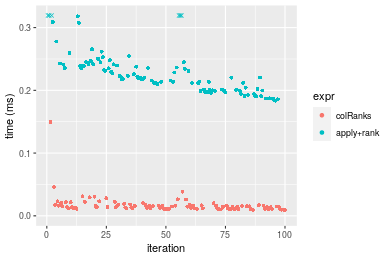
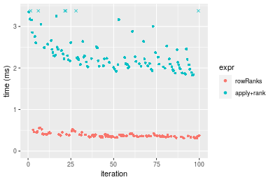
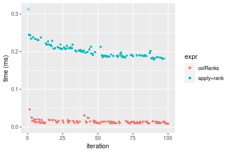
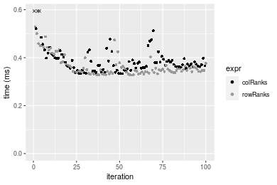
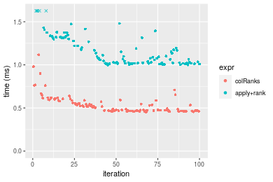
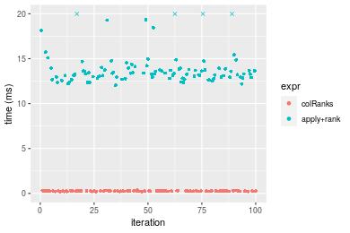
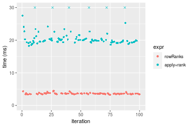

[matrixStats]: Benchmark report

---------------------------------------


# colRanks() and rowRanks() benchmarks

This report benchmark the performance of colRanks() and rowRanks() against alternative methods.

## Alternative methods

* apply() + rank()


## Data type "integer"

### Data
```r
> rmatrix <- function(nrow, ncol, mode = c("logical", "double", "integer", "index"), range = c(-100, 
+     +100), na_prob = 0) {
+     mode <- match.arg(mode)
+     n <- nrow * ncol
+     if (mode == "logical") {
+         x <- sample(c(FALSE, TRUE), size = n, replace = TRUE)
+     }     else if (mode == "index") {
+         x <- seq_len(n)
+         mode <- "integer"
+     }     else {
+         x <- runif(n, min = range[1], max = range[2])
+     }
+     storage.mode(x) <- mode
+     if (na_prob > 0) 
+         x[sample(n, size = na_prob * n)] <- NA
+     dim(x) <- c(nrow, ncol)
+     x
+ }
> rmatrices <- function(scale = 10, seed = 1, ...) {
+     set.seed(seed)
+     data <- list()
+     data[[1]] <- rmatrix(nrow = scale * 1, ncol = scale * 1, ...)
+     data[[2]] <- rmatrix(nrow = scale * 10, ncol = scale * 10, ...)
+     data[[3]] <- rmatrix(nrow = scale * 100, ncol = scale * 1, ...)
+     data[[4]] <- t(data[[3]])
+     data[[5]] <- rmatrix(nrow = scale * 10, ncol = scale * 100, ...)
+     data[[6]] <- t(data[[5]])
+     names(data) <- sapply(data, FUN = function(x) paste(dim(x), collapse = "x"))
+     data
+ }
> data <- rmatrices(mode = mode)
```

### Results

#### 10x10 integer matrix

```r
> X <- data[["10x10"]]
> gc()
           used  (Mb) gc trigger  (Mb) max used  (Mb)
Ncells  5298850 283.0    7916910 422.9  7916910 422.9
Vcells 10532033  80.4   33191153 253.3 53339345 407.0
> colStats <- microbenchmark(colRanks = colRanks(X, na.rm = FALSE), `apply+rank` = apply(X, MARGIN = 2L, 
+     FUN = rank, na.last = "keep", ties.method = "max"), unit = "ms")
> X <- t(X)
> gc()
           used  (Mb) gc trigger  (Mb) max used  (Mb)
Ncells  5298445 283.0    7916910 422.9  7916910 422.9
Vcells 10531056  80.4   33191153 253.3 53339345 407.0
> rowStats <- microbenchmark(rowRanks = rowRanks(X, na.rm = FALSE), `apply+rank` = apply(X, MARGIN = 1L, 
+     FUN = rank, na.last = "keep", ties.method = "max"), unit = "ms")
```

_Table: Benchmarking of colRanks() and apply+rank() on integer+10x10 data. The top panel shows times in milliseconds and the bottom panel shows relative times._


|   |expr       |      min|       lq|      mean|   median|        uq|      max|
|:--|:----------|--------:|--------:|---------:|--------:|---------:|--------:|
|1  |colRanks   | 0.009407| 0.011369| 0.0169393| 0.014047| 0.0166995| 0.149608|
|2  |apply+rank | 0.183609| 0.200873| 0.2411812| 0.220219| 0.2415300| 0.746317|


|   |expr       |      min|       lq|     mean|  median|       uq|      max|
|:--|:----------|--------:|--------:|--------:|-------:|--------:|--------:|
|1  |colRanks   |  1.00000|  1.00000|  1.00000|  1.0000|  1.00000| 1.000000|
|2  |apply+rank | 19.51834| 17.66848| 14.23796| 15.6773| 14.46331| 4.988483|

_Table: Benchmarking of rowRanks() and apply+rank() on integer+10x10 data (transposed). The top panel shows times in milliseconds and the bottom panel shows relative times._


|   |expr       |      min|        lq|      mean|    median|       uq|      max|
|:--|:----------|--------:|---------:|---------:|---------:|--------:|--------:|
|1  |rowRanks   | 0.005494| 0.0063860| 0.0086414| 0.0083770| 0.009419| 0.034827|
|2  |apply+rank | 0.183176| 0.1924125| 0.2101817| 0.2055875| 0.218420| 0.375835|


|   |expr       |     min|       lq|     mean|  median|      uq|      max|
|:--|:----------|-------:|--------:|--------:|-------:|-------:|--------:|
|1  |rowRanks   |  1.0000|  1.00000|  1.00000|  1.0000|  1.0000|  1.00000|
|2  |apply+rank | 33.3411| 30.13036| 24.32254| 24.5419| 23.1893| 10.79148|

_Figure: Benchmarking of colRanks() and apply+rank() on integer+10x10 data  as well as rowRanks() and apply+rank() on the same data transposed.  Outliers are displayed as crosses.  Times are in milliseconds._





_Table: Benchmarking of colRanks() and rowRanks() on integer+10x10 data (original and transposed).  The top panel shows times in milliseconds and the bottom panel shows relative times._


|   |expr     |   min|     lq|     mean| median|      uq|     max|
|:--|:--------|-----:|------:|--------:|------:|-------:|-------:|
|2  |rowRanks | 5.494|  6.386|  8.64144|  8.377|  9.4190|  34.827|
|1  |colRanks | 9.407| 11.369| 16.93931| 14.047| 16.6995| 149.608|


|   |expr     |      min|       lq|     mean|   median|       uq|      max|
|:--|:--------|--------:|--------:|--------:|--------:|--------:|--------:|
|2  |rowRanks | 1.000000| 1.000000| 1.000000| 1.000000| 1.000000| 1.000000|
|1  |colRanks | 1.712231| 1.780301| 1.960242| 1.676853| 1.772959| 4.295748|

_Figure: Benchmarking of colRanks() and rowRanks() on integer+10x10 data (original and transposed).  Outliers are displayed as crosses. Times are in milliseconds._


#### 100x100 integer matrix

```r
> X <- data[["100x100"]]
> gc()
           used  (Mb) gc trigger  (Mb) max used  (Mb)
Ncells  5297005 282.9    7916910 422.9  7916910 422.9
Vcells 10147558  77.5   33191153 253.3 53339345 407.0
> colStats <- microbenchmark(colRanks = colRanks(X, na.rm = FALSE), `apply+rank` = apply(X, MARGIN = 2L, 
+     FUN = rank, na.last = "keep", ties.method = "max"), unit = "ms")
> X <- t(X)
> gc()
           used  (Mb) gc trigger  (Mb) max used  (Mb)
Ncells  5296999 282.9    7916910 422.9  7916910 422.9
Vcells 10152601  77.5   33191153 253.3 53339345 407.0
> rowStats <- microbenchmark(rowRanks = rowRanks(X, na.rm = FALSE), `apply+rank` = apply(X, MARGIN = 1L, 
+     FUN = rank, na.last = "keep", ties.method = "max"), unit = "ms")
```

_Table: Benchmarking of colRanks() and apply+rank() on integer+100x100 data. The top panel shows times in milliseconds and the bottom panel shows relative times._


|   |expr       |      min|        lq|      mean|   median|        uq|      max|
|:--|:----------|--------:|---------:|---------:|--------:|---------:|--------:|
|1  |colRanks   | 0.322609| 0.3619875| 0.4050859| 0.389438| 0.4254825| 0.731030|
|2  |apply+rank | 1.850169| 2.0953320| 2.4162842| 2.296550| 2.5052410| 4.056521|


|   |expr       |     min|      lq|     mean|   median|    uq|      max|
|:--|:----------|-------:|-------:|--------:|--------:|-----:|--------:|
|1  |colRanks   | 1.00000| 1.00000| 1.000000| 1.000000| 1.000| 1.000000|
|2  |apply+rank | 5.73502| 5.78841| 5.964868| 5.897088| 5.888| 5.549049|

_Table: Benchmarking of rowRanks() and apply+rank() on integer+100x100 data (transposed). The top panel shows times in milliseconds and the bottom panel shows relative times._


|   |expr       |      min|       lq|      mean|    median|       uq|      max|
|:--|:----------|--------:|--------:|---------:|---------:|--------:|--------:|
|1  |rowRanks   | 0.310151| 0.349815| 0.3852806| 0.3686975| 0.403289| 0.562923|
|2  |apply+rank | 1.831974| 2.042712| 2.3853072| 2.2199200| 2.495522| 4.990405|


|   |expr       |      min|       lq|     mean|   median|       uq|      max|
|:--|:----------|--------:|--------:|--------:|--------:|--------:|--------:|
|1  |rowRanks   | 1.000000| 1.000000| 1.000000| 1.000000| 1.000000| 1.000000|
|2  |apply+rank | 5.906716| 5.839408| 6.191092| 6.020979| 6.187925| 8.865165|

_Figure: Benchmarking of colRanks() and apply+rank() on integer+100x100 data  as well as rowRanks() and apply+rank() on the same data transposed.  Outliers are displayed as crosses.  Times are in milliseconds._



_Table: Benchmarking of colRanks() and rowRanks() on integer+100x100 data (original and transposed).  The top panel shows times in milliseconds and the bottom panel shows relative times._


|   |expr     |     min|       lq|     mean|   median|       uq|     max|
|:--|:--------|-------:|--------:|--------:|--------:|--------:|-------:|
|2  |rowRanks | 310.151| 349.8150| 385.2806| 368.6975| 403.2890| 562.923|
|1  |colRanks | 322.609| 361.9875| 405.0859| 389.4380| 425.4825| 731.030|


|   |expr     |      min|       lq|     mean|   median|       uq|      max|
|:--|:--------|--------:|--------:|--------:|--------:|--------:|--------:|
|2  |rowRanks | 1.000000| 1.000000| 1.000000| 1.000000| 1.000000| 1.000000|
|1  |colRanks | 1.040167| 1.034797| 1.051405| 1.056253| 1.055031| 1.298632|

_Figure: Benchmarking of colRanks() and rowRanks() on integer+100x100 data (original and transposed).  Outliers are displayed as crosses. Times are in milliseconds._


#### 1000x10 integer matrix

```r
> X <- data[["1000x10"]]
> gc()
           used  (Mb) gc trigger  (Mb) max used  (Mb)
Ncells  5297747 283.0    7916910 422.9  7916910 422.9
Vcells 10151091  77.5   33191153 253.3 53339345 407.0
> colStats <- microbenchmark(colRanks = colRanks(X, na.rm = FALSE), `apply+rank` = apply(X, MARGIN = 2L, 
+     FUN = rank, na.last = "keep", ties.method = "max"), unit = "ms")
> X <- t(X)
> gc()
           used  (Mb) gc trigger  (Mb) max used  (Mb)
Ncells  5297729 283.0    7916910 422.9  7916910 422.9
Vcells 10156114  77.5   33191153 253.3 53339345 407.0
> rowStats <- microbenchmark(rowRanks = rowRanks(X, na.rm = FALSE), `apply+rank` = apply(X, MARGIN = 1L, 
+     FUN = rank, na.last = "keep", ties.method = "max"), unit = "ms")
```

_Table: Benchmarking of colRanks() and apply+rank() on integer+1000x10 data. The top panel shows times in milliseconds and the bottom panel shows relative times._


|   |expr       |      min|        lq|      mean|   median|        uq|      max|
|:--|:----------|--------:|---------:|---------:|--------:|---------:|--------:|
|1  |colRanks   | 0.393898| 0.4494935| 0.5064234| 0.481463| 0.5305685| 0.812872|
|2  |apply+rank | 1.089100| 1.2463020| 1.4129721| 1.361967| 1.5017565| 2.123362|


|   |expr       |      min|       lq|   mean|   median|       uq|      max|
|:--|:----------|--------:|--------:|------:|--------:|--------:|--------:|
|1  |colRanks   | 1.000000| 1.000000| 1.0000| 1.000000| 1.000000| 1.000000|
|2  |apply+rank | 2.764929| 2.772681| 2.7901| 2.828809| 2.830467| 2.612173|

_Table: Benchmarking of rowRanks() and apply+rank() on integer+1000x10 data (transposed). The top panel shows times in milliseconds and the bottom panel shows relative times._


|   |expr       |      min|       lq|     mean|    median|        uq|      max|
|:--|:----------|--------:|--------:|--------:|---------:|---------:|--------:|
|1  |rowRanks   | 0.379688| 0.397256| 0.461763| 0.4435065| 0.4986095| 0.773803|
|2  |apply+rank | 1.098332| 1.156041| 1.350847| 1.2794880| 1.4695510| 2.213816|


|   |expr       |      min|       lq|     mean|   median|       uq|      max|
|:--|:----------|--------:|--------:|--------:|--------:|--------:|--------:|
|1  |rowRanks   | 1.000000| 1.000000| 1.000000| 1.000000| 1.000000| 1.000000|
|2  |apply+rank | 2.892722| 2.910064| 2.925411| 2.884936| 2.947298| 2.860956|

_Figure: Benchmarking of colRanks() and apply+rank() on integer+1000x10 data  as well as rowRanks() and apply+rank() on the same data transposed.  Outliers are displayed as crosses.  Times are in milliseconds._


_Table: Benchmarking of colRanks() and rowRanks() on integer+1000x10 data (original and transposed).  The top panel shows times in milliseconds and the bottom panel shows relative times._


|   |expr     |     min|       lq|     mean|   median|       uq|     max|
|:--|:--------|-------:|--------:|--------:|--------:|--------:|-------:|
|2  |rowRanks | 379.688| 397.2560| 461.7630| 443.5065| 498.6095| 773.803|
|1  |colRanks | 393.898| 449.4935| 506.4234| 481.4630| 530.5685| 812.872|


|   |expr     |      min|       lq|     mean|   median|       uq|     max|
|:--|:--------|--------:|--------:|--------:|--------:|--------:|-------:|
|2  |rowRanks | 1.000000| 1.000000| 1.000000| 1.000000| 1.000000| 1.00000|
|1  |colRanks | 1.037425| 1.131496| 1.096717| 1.085583| 1.064096| 1.05049|

_Figure: Benchmarking of colRanks() and rowRanks() on integer+1000x10 data (original and transposed).  Outliers are displayed as crosses. Times are in milliseconds._


#### 10x1000 integer matrix

```r
> X <- data[["10x1000"]]
> gc()
           used  (Mb) gc trigger  (Mb) max used  (Mb)
Ncells  5297923 283.0    7916910 422.9  7916910 422.9
Vcells 10151754  77.5   33191153 253.3 53339345 407.0
> colStats <- microbenchmark(colRanks = colRanks(X, na.rm = FALSE), `apply+rank` = apply(X, MARGIN = 2L, 
+     FUN = rank, na.last = "keep", ties.method = "max"), unit = "ms")
> X <- t(X)
> gc()
           used  (Mb) gc trigger  (Mb) max used  (Mb)
Ncells  5297917 283.0    7916910 422.9  7916910 422.9
Vcells 10156797  77.5   33191153 253.3 53339345 407.0
> rowStats <- microbenchmark(rowRanks = rowRanks(X, na.rm = FALSE), `apply+rank` = apply(X, MARGIN = 1L, 
+     FUN = rank, na.last = "keep", ties.method = "max"), unit = "ms")
```

_Table: Benchmarking of colRanks() and apply+rank() on integer+10x1000 data. The top panel shows times in milliseconds and the bottom panel shows relative times._


|   |expr       |       min|         lq|       mean|     median|         uq|       max|
|:--|:----------|---------:|----------:|----------:|----------:|----------:|---------:|
|1  |colRanks   |  0.204627|  0.2212945|  0.2513058|  0.2471305|  0.2708045|  0.328413|
|2  |apply+rank | 11.934508| 12.5422885| 14.3525436| 13.4208540| 15.5776350| 24.846604|


|   |expr       |      min|       lq|     mean|   median|       uq|      max|
|:--|:----------|--------:|--------:|--------:|--------:|--------:|--------:|
|1  |colRanks   |  1.00000|  1.00000|  1.00000|  1.00000|  1.00000|  1.00000|
|2  |apply+rank | 58.32323| 56.67691| 57.11187| 54.30675| 57.52355| 75.65658|

_Table: Benchmarking of rowRanks() and apply+rank() on integer+10x1000 data (transposed). The top panel shows times in milliseconds and the bottom panel shows relative times._


|   |expr       |       min|        lq|       mean|    median|        uq|       max|
|:--|:----------|---------:|---------:|----------:|---------:|---------:|---------:|
|1  |rowRanks   |  0.185139|  0.197105|  0.2259436|  0.220442|  0.239653|  0.400474|
|2  |apply+rank | 12.079408| 12.677535| 14.7159397| 13.304649| 15.878499| 30.775770|


|   |expr       |      min|       lq|     mean|   median|       uq|      max|
|:--|:----------|--------:|--------:|--------:|--------:|--------:|--------:|
|1  |rowRanks   |  1.00000|  1.00000|  1.00000|  1.00000|  1.00000|  1.00000|
|2  |apply+rank | 65.24508| 64.31869| 65.13104| 60.35442| 66.25621| 76.84836|

_Figure: Benchmarking of colRanks() and apply+rank() on integer+10x1000 data  as well as rowRanks() and apply+rank() on the same data transposed.  Outliers are displayed as crosses.  Times are in milliseconds._


_Table: Benchmarking of colRanks() and rowRanks() on integer+10x1000 data (original and transposed).  The top panel shows times in milliseconds and the bottom panel shows relative times._


|   |expr     |     min|       lq|     mean|   median|       uq|     max|
|:--|:--------|-------:|--------:|--------:|--------:|--------:|-------:|
|2  |rowRanks | 185.139| 197.1050| 225.9436| 220.4420| 239.6530| 400.474|
|1  |colRanks | 204.627| 221.2945| 251.3058| 247.1305| 270.8045| 328.413|


|   |expr     |      min|       lq|    mean|   median|       uq|       max|
|:--|:--------|--------:|--------:|-------:|--------:|--------:|---------:|
|2  |rowRanks | 1.000000| 1.000000| 1.00000| 1.000000| 1.000000| 1.0000000|
|1  |colRanks | 1.105261| 1.122724| 1.11225| 1.121068| 1.129986| 0.8200607|

_Figure: Benchmarking of colRanks() and rowRanks() on integer+10x1000 data (original and transposed).  Outliers are displayed as crosses. Times are in milliseconds._


#### 100x1000 integer matrix

```r
> X <- data[["100x1000"]]
> gc()
           used  (Mb) gc trigger  (Mb) max used  (Mb)
Ncells  5298119 283.0    7916910 422.9  7916910 422.9
Vcells 10152266  77.5   33191153 253.3 53339345 407.0
> colStats <- microbenchmark(colRanks = colRanks(X, na.rm = FALSE), `apply+rank` = apply(X, MARGIN = 2L, 
+     FUN = rank, na.last = "keep", ties.method = "max"), unit = "ms")
> X <- t(X)
> gc()
           used  (Mb) gc trigger  (Mb) max used  (Mb)
Ncells  5298101 283.0    7916910 422.9  7916910 422.9
Vcells 10202289  77.9   33191153 253.3 53339345 407.0
> rowStats <- microbenchmark(rowRanks = rowRanks(X, na.rm = FALSE), `apply+rank` = apply(X, MARGIN = 1L, 
+     FUN = rank, na.last = "keep", ties.method = "max"), unit = "ms")
```

_Table: Benchmarking of colRanks() and apply+rank() on integer+100x1000 data. The top panel shows times in milliseconds and the bottom panel shows relative times._


|   |expr       |       min|        lq|      mean|    median|        uq|       max|
|:--|:----------|---------:|---------:|---------:|---------:|---------:|---------:|
|1  |colRanks   |  3.159446|  3.287911|  3.440933|  3.392974|  3.509068|  4.305031|
|2  |apply+rank | 18.490284| 19.522363| 21.161900| 19.822294| 20.489353| 39.063513|


|   |expr       |      min|       lq|     mean|   median|       uq|      max|
|:--|:----------|--------:|--------:|--------:|--------:|--------:|--------:|
|1  |colRanks   | 1.000000| 1.000000| 1.000000| 1.000000| 1.000000| 1.000000|
|2  |apply+rank | 5.852382| 5.937618| 6.150047| 5.842158| 5.838973| 9.073921|

_Table: Benchmarking of rowRanks() and apply+rank() on integer+100x1000 data (transposed). The top panel shows times in milliseconds and the bottom panel shows relative times._


|   |expr       |       min|       lq|     mean|    median|        uq|       max|
|:--|:----------|---------:|--------:|--------:|---------:|---------:|---------:|
|1  |rowRanks   |  3.056219|  3.24029|  3.38946|  3.322281|  3.483862|  4.248177|
|2  |apply+rank | 18.654637| 19.91694| 21.67497| 20.461286| 21.207750| 38.361005|


|   |expr       |      min|       lq|     mean|   median|       uq|      max|
|:--|:----------|--------:|--------:|--------:|--------:|--------:|--------:|
|1  |rowRanks   | 1.000000| 1.000000| 1.000000| 1.000000| 1.000000| 1.000000|
|2  |apply+rank | 6.103829| 6.146654| 6.394815| 6.158807| 6.087425| 9.029992|

_Figure: Benchmarking of colRanks() and apply+rank() on integer+100x1000 data  as well as rowRanks() and apply+rank() on the same data transposed.  Outliers are displayed as crosses.  Times are in milliseconds._


_Table: Benchmarking of colRanks() and rowRanks() on integer+100x1000 data (original and transposed).  The top panel shows times in milliseconds and the bottom panel shows relative times._


|   |expr     |      min|       lq|     mean|   median|       uq|      max|
|:--|:--------|--------:|--------:|--------:|--------:|--------:|--------:|
|2  |rowRanks | 3.056219| 3.240290| 3.389460| 3.322281| 3.483862| 4.248177|
|1  |colRanks | 3.159446| 3.287911| 3.440933| 3.392974| 3.509068| 4.305031|


|   |expr     |      min|       lq|     mean|   median|       uq|      max|
|:--|:--------|--------:|--------:|--------:|--------:|--------:|--------:|
|2  |rowRanks | 1.000000| 1.000000| 1.000000| 1.000000| 1.000000| 1.000000|
|1  |colRanks | 1.033776| 1.014696| 1.015186| 1.021279| 1.007235| 1.013383|

_Figure: Benchmarking of colRanks() and rowRanks() on integer+100x1000 data (original and transposed).  Outliers are displayed as crosses. Times are in milliseconds._


#### 1000x100 integer matrix

```r
> X <- data[["1000x100"]]
> gc()
           used  (Mb) gc trigger  (Mb) max used  (Mb)
Ncells  5298311 283.0    7916910 422.9  7916910 422.9
Vcells 10152836  77.5   33191153 253.3 53339345 407.0
> colStats <- microbenchmark(colRanks = colRanks(X, na.rm = FALSE), `apply+rank` = apply(X, MARGIN = 2L, 
+     FUN = rank, na.last = "keep", ties.method = "max"), unit = "ms")
> X <- t(X)
> gc()
           used  (Mb) gc trigger  (Mb) max used  (Mb)
Ncells  5298293 283.0    7916910 422.9  7916910 422.9
Vcells 10202859  77.9   33191153 253.3 53339345 407.0
> rowStats <- microbenchmark(rowRanks = rowRanks(X, na.rm = FALSE), `apply+rank` = apply(X, MARGIN = 1L, 
+     FUN = rank, na.last = "keep", ties.method = "max"), unit = "ms")
```

_Table: Benchmarking of colRanks() and apply+rank() on integer+1000x100 data. The top panel shows times in milliseconds and the bottom panel shows relative times._


|   |expr       |       min|        lq|      mean|    median|       uq|      max|
|:--|:----------|---------:|---------:|---------:|---------:|--------:|--------:|
|1  |colRanks   |  3.896785|  4.112804|  4.489607|  4.253279|  4.42249| 13.67832|
|2  |apply+rank | 10.729543| 11.316907| 11.926806| 11.620297| 11.98809| 22.93321|


|   |expr       |      min|       lq|     mean|  median|      uq|     max|
|:--|:----------|--------:|--------:|--------:|-------:|-------:|-------:|
|1  |colRanks   | 1.000000| 1.000000| 1.000000| 1.00000| 1.00000| 1.00000|
|2  |apply+rank | 2.753435| 2.751628| 2.656537| 2.73208| 2.71071| 1.67661|

_Table: Benchmarking of rowRanks() and apply+rank() on integer+1000x100 data (transposed). The top panel shows times in milliseconds and the bottom panel shows relative times._


|   |expr       |       min|        lq|      mean|    median|        uq|       max|
|:--|:----------|---------:|---------:|---------:|---------:|---------:|---------:|
|1  |rowRanks   |  3.780137|  4.021685|  4.166701|  4.130434|  4.268876|  4.986526|
|2  |apply+rank | 10.752102| 11.378576| 12.114239| 11.586593| 12.095277| 24.792563|


|   |expr       |      min|       lq|     mean|   median|       uq|      max|
|:--|:----------|--------:|--------:|--------:|--------:|--------:|--------:|
|1  |rowRanks   | 1.000000| 1.000000| 1.000000| 1.000000| 1.000000| 1.000000|
|2  |apply+rank | 2.844368| 2.829306| 2.907393| 2.805175| 2.833364| 4.971911|

_Figure: Benchmarking of colRanks() and apply+rank() on integer+1000x100 data  as well as rowRanks() and apply+rank() on the same data transposed.  Outliers are displayed as crosses.  Times are in milliseconds._


_Table: Benchmarking of colRanks() and rowRanks() on integer+1000x100 data (original and transposed).  The top panel shows times in milliseconds and the bottom panel shows relative times._


|   |expr     |      min|       lq|     mean|   median|       uq|       max|
|:--|:--------|--------:|--------:|--------:|--------:|--------:|---------:|
|2  |rowRanks | 3.780137| 4.021685| 4.166701| 4.130434| 4.268876|  4.986526|
|1  |colRanks | 3.896785| 4.112804| 4.489607| 4.253279| 4.422490| 13.678319|


|   |expr     |      min|       lq|     mean|   median|       uq|      max|
|:--|:--------|--------:|--------:|--------:|--------:|--------:|--------:|
|2  |rowRanks | 1.000000| 1.000000| 1.000000| 1.000000| 1.000000| 1.000000|
|1  |colRanks | 1.030858| 1.022657| 1.077497| 1.029741| 1.035985| 2.743056|

_Figure: Benchmarking of colRanks() and rowRanks() on integer+1000x100 data (original and transposed).  Outliers are displayed as crosses. Times are in milliseconds._


## Data type "double"

### Data
```r
> rmatrix <- function(nrow, ncol, mode = c("logical", "double", "integer", "index"), range = c(-100, 
+     +100), na_prob = 0) {
+     mode <- match.arg(mode)
+     n <- nrow * ncol
+     if (mode == "logical") {
+         x <- sample(c(FALSE, TRUE), size = n, replace = TRUE)
+     }     else if (mode == "index") {
+         x <- seq_len(n)
+         mode <- "integer"
+     }     else {
+         x <- runif(n, min = range[1], max = range[2])
+     }
+     storage.mode(x) <- mode
+     if (na_prob > 0) 
+         x[sample(n, size = na_prob * n)] <- NA
+     dim(x) <- c(nrow, ncol)
+     x
+ }
> rmatrices <- function(scale = 10, seed = 1, ...) {
+     set.seed(seed)
+     data <- list()
+     data[[1]] <- rmatrix(nrow = scale * 1, ncol = scale * 1, ...)
+     data[[2]] <- rmatrix(nrow = scale * 10, ncol = scale * 10, ...)
+     data[[3]] <- rmatrix(nrow = scale * 100, ncol = scale * 1, ...)
+     data[[4]] <- t(data[[3]])
+     data[[5]] <- rmatrix(nrow = scale * 10, ncol = scale * 100, ...)
+     data[[6]] <- t(data[[5]])
+     names(data) <- sapply(data, FUN = function(x) paste(dim(x), collapse = "x"))
+     data
+ }
> data <- rmatrices(mode = mode)
```

### Results

#### 10x10 double matrix

```r
> X <- data[["10x10"]]
> gc()
           used  (Mb) gc trigger  (Mb) max used  (Mb)
Ncells  5298499 283.0    7916910 422.9  7916910 422.9
Vcells 10269166  78.4   33191153 253.3 53339345 407.0
> colStats <- microbenchmark(colRanks = colRanks(X, na.rm = FALSE), `apply+rank` = apply(X, MARGIN = 2L, 
+     FUN = rank, na.last = "keep", ties.method = "max"), unit = "ms")
> X <- t(X)
> gc()
           used  (Mb) gc trigger  (Mb) max used  (Mb)
Ncells  5298484 283.0    7916910 422.9  7916910 422.9
Vcells 10269294  78.4   33191153 253.3 53339345 407.0
> rowStats <- microbenchmark(rowRanks = rowRanks(X, na.rm = FALSE), `apply+rank` = apply(X, MARGIN = 1L, 
+     FUN = rank, na.last = "keep", ties.method = "max"), unit = "ms")
```

_Table: Benchmarking of colRanks() and apply+rank() on double+10x10 data. The top panel shows times in milliseconds and the bottom panel shows relative times._


|   |expr       |      min|        lq|      mean|    median|        uq|      max|
|:--|:----------|--------:|---------:|---------:|---------:|---------:|--------:|
|1  |colRanks   | 0.009106| 0.0104045| 0.0137578| 0.0129245| 0.0147160| 0.046790|
|2  |apply+rank | 0.179542| 0.1883375| 0.2027790| 0.1987100| 0.2104405| 0.363424|


|   |expr       |      min|       lq|     mean|   median|       uq|     max|
|:--|:----------|--------:|--------:|--------:|--------:|--------:|-------:|
|1  |colRanks   |  1.00000|  1.00000|  1.00000|  1.00000|  1.00000| 1.00000|
|2  |apply+rank | 19.71689| 18.10154| 14.73924| 15.37468| 14.30012| 7.76713|

_Table: Benchmarking of rowRanks() and apply+rank() on double+10x10 data (transposed). The top panel shows times in milliseconds and the bottom panel shows relative times._


|   |expr       |      min|        lq|      mean|    median|        uq|      max|
|:--|:----------|--------:|---------:|---------:|---------:|---------:|--------:|
|1  |rowRanks   | 0.005750| 0.0075175| 0.0115225| 0.0098755| 0.0131015| 0.027957|
|2  |apply+rank | 0.194529| 0.2061155| 0.2541952| 0.2249310| 0.2607190| 0.452338|


|   |expr       |      min|       lq|     mean|   median|       uq|      max|
|:--|:----------|--------:|--------:|--------:|--------:|--------:|--------:|
|1  |rowRanks   |  1.00000|  1.00000|  1.00000|  1.00000|  1.00000|  1.00000|
|2  |apply+rank | 33.83113| 27.41809| 22.06073| 22.77667| 19.89994| 16.17978|

_Figure: Benchmarking of colRanks() and apply+rank() on double+10x10 data  as well as rowRanks() and apply+rank() on the same data transposed.  Outliers are displayed as crosses.  Times are in milliseconds._





_Table: Benchmarking of colRanks() and rowRanks() on double+10x10 data (original and transposed).  The top panel shows times in milliseconds and the bottom panel shows relative times._


|   |expr     |   min|      lq|     mean|  median|      uq|    max|
|:--|:--------|-----:|-------:|--------:|-------:|-------:|------:|
|2  |rowRanks | 5.750|  7.5175| 11.52252|  9.8755| 13.1015| 27.957|
|1  |colRanks | 9.106| 10.4045| 13.75777| 12.9245| 14.7160| 46.790|


|   |expr     |      min|       lq|    mean|   median|      uq|      max|
|:--|:--------|--------:|--------:|-------:|--------:|-------:|--------:|
|2  |rowRanks | 1.000000| 1.000000| 1.00000| 1.000000| 1.00000| 1.000000|
|1  |colRanks | 1.583652| 1.384037| 1.19399| 1.308744| 1.12323| 1.673642|

_Figure: Benchmarking of colRanks() and rowRanks() on double+10x10 data (original and transposed).  Outliers are displayed as crosses. Times are in milliseconds._


#### 100x100 double matrix

```r
> X <- data[["100x100"]]
> gc()
           used  (Mb) gc trigger  (Mb) max used  (Mb)
Ncells  5298679 283.0    7916910 422.9  7916910 422.9
Vcells 10269278  78.4   33191153 253.3 53339345 407.0
> colStats <- microbenchmark(colRanks = colRanks(X, na.rm = FALSE), `apply+rank` = apply(X, MARGIN = 2L, 
+     FUN = rank, na.last = "keep", ties.method = "max"), unit = "ms")
> X <- t(X)
> gc()
           used  (Mb) gc trigger  (Mb) max used  (Mb)
Ncells  5298673 283.0    7916910 422.9  7916910 422.9
Vcells 10279321  78.5   33191153 253.3 53339345 407.0
> rowStats <- microbenchmark(rowRanks = rowRanks(X, na.rm = FALSE), `apply+rank` = apply(X, MARGIN = 1L, 
+     FUN = rank, na.last = "keep", ties.method = "max"), unit = "ms")
```

_Table: Benchmarking of colRanks() and apply+rank() on double+100x100 data. The top panel shows times in milliseconds and the bottom panel shows relative times._


|   |expr       |      min|        lq|     mean|  median|        uq|      max|
|:--|:----------|--------:|---------:|--------:|-------:|---------:|--------:|
|1  |colRanks   | 0.333789| 0.3567785| 0.390592| 0.37357| 0.4011065| 0.677455|
|2  |apply+rank | 1.816022| 1.9441860| 2.177894| 2.03974| 2.2920700| 3.680256|


|   |expr       |      min|      lq|    mean|   median|       uq|      max|
|:--|:----------|--------:|-------:|-------:|--------:|--------:|--------:|
|1  |colRanks   | 1.000000| 1.00000| 1.00000| 1.000000| 1.000000| 1.000000|
|2  |apply+rank | 5.440629| 5.44928| 5.57588| 5.460127| 5.714368| 5.432473|

_Table: Benchmarking of rowRanks() and apply+rank() on double+100x100 data (transposed). The top panel shows times in milliseconds and the bottom panel shows relative times._


|   |expr       |      min|        lq|      mean|   median|        uq|      max|
|:--|:----------|--------:|---------:|---------:|--------:|---------:|--------:|
|1  |rowRanks   | 0.327560| 0.3391095| 0.3658859| 0.347917| 0.3702355| 0.528486|
|2  |apply+rank | 1.826432| 1.8880900| 2.0880218| 1.944974| 2.0914905| 3.663260|


|   |expr       |     min|       lq|     mean|   median|       uq|      max|
|:--|:----------|-------:|--------:|--------:|--------:|--------:|--------:|
|1  |rowRanks   | 1.00000| 1.000000| 1.000000| 1.000000| 1.000000| 1.000000|
|2  |apply+rank | 5.57587| 5.567789| 5.706757| 5.590339| 5.649082| 6.931612|

_Figure: Benchmarking of colRanks() and apply+rank() on double+100x100 data  as well as rowRanks() and apply+rank() on the same data transposed.  Outliers are displayed as crosses.  Times are in milliseconds._


_Table: Benchmarking of colRanks() and rowRanks() on double+100x100 data (original and transposed).  The top panel shows times in milliseconds and the bottom panel shows relative times._


|   |expr     |     min|       lq|     mean|  median|       uq|     max|
|:--|:--------|-------:|--------:|--------:|-------:|--------:|-------:|
|2  |rowRanks | 327.560| 339.1095| 365.8859| 347.917| 370.2355| 528.486|
|1  |colRanks | 333.789| 356.7785| 390.5920| 373.570| 401.1065| 677.455|


|   |expr     |      min|       lq|     mean|   median|       uq|      max|
|:--|:--------|--------:|--------:|--------:|--------:|--------:|--------:|
|2  |rowRanks | 1.000000| 1.000000| 1.000000| 1.000000| 1.000000| 1.000000|
|1  |colRanks | 1.019016| 1.052104| 1.067524| 1.073733| 1.083382| 1.281879|

_Figure: Benchmarking of colRanks() and rowRanks() on double+100x100 data (original and transposed).  Outliers are displayed as crosses. Times are in milliseconds._




#### 1000x10 double matrix

```r
> X <- data[["1000x10"]]
> gc()
           used  (Mb) gc trigger  (Mb) max used  (Mb)
Ncells  5298881 283.0    7916910 422.9  7916910 422.9
Vcells 10270178  78.4   33191153 253.3 53339345 407.0
> colStats <- microbenchmark(colRanks = colRanks(X, na.rm = FALSE), `apply+rank` = apply(X, MARGIN = 2L, 
+     FUN = rank, na.last = "keep", ties.method = "max"), unit = "ms")
> X <- t(X)
> gc()
           used  (Mb) gc trigger  (Mb) max used  (Mb)
Ncells  5298863 283.0    7916910 422.9  7916910 422.9
Vcells 10280201  78.5   33191153 253.3 53339345 407.0
> rowStats <- microbenchmark(rowRanks = rowRanks(X, na.rm = FALSE), `apply+rank` = apply(X, MARGIN = 1L, 
+     FUN = rank, na.last = "keep", ties.method = "max"), unit = "ms")
```

_Table: Benchmarking of colRanks() and apply+rank() on double+1000x10 data. The top panel shows times in milliseconds and the bottom panel shows relative times._


|   |expr       |      min|       lq|      mean|   median|       uq|      max|
|:--|:----------|--------:|--------:|---------:|--------:|--------:|--------:|
|1  |colRanks   | 0.455754| 0.466490| 0.5398868| 0.510822| 0.586950| 1.115802|
|2  |apply+rank | 0.999848| 1.019635| 1.2088598| 1.084075| 1.314417| 2.903401|


|   |expr       |      min|       lq|     mean|   median|       uq|      max|
|:--|:----------|--------:|--------:|--------:|--------:|--------:|--------:|
|1  |colRanks   | 1.000000| 1.000000| 1.000000| 1.000000| 1.000000| 1.000000|
|2  |apply+rank | 2.193833| 2.185761| 2.239099| 2.122216| 2.239402| 2.602076|

_Table: Benchmarking of rowRanks() and apply+rank() on double+1000x10 data (transposed). The top panel shows times in milliseconds and the bottom panel shows relative times._


|   |expr       |      min|        lq|      mean|    median|       uq|      max|
|:--|:----------|--------:|---------:|---------:|---------:|--------:|--------:|
|1  |rowRanks   | 0.450257| 0.4615145| 0.5276687| 0.4965475| 0.571033| 0.797745|
|2  |apply+rank | 1.000383| 1.0199325| 1.1647766| 1.0819950| 1.288410| 2.008883|


|   |expr       |      min|       lq|     mean|   median|       uq|      max|
|:--|:----------|--------:|--------:|--------:|--------:|--------:|--------:|
|1  |rowRanks   | 1.000000| 1.000000| 1.000000| 1.000000| 1.000000| 1.000000|
|2  |apply+rank | 2.221804| 2.209969| 2.207401| 2.179036| 2.256279| 2.518202|

_Figure: Benchmarking of colRanks() and apply+rank() on double+1000x10 data  as well as rowRanks() and apply+rank() on the same data transposed.  Outliers are displayed as crosses.  Times are in milliseconds._





_Table: Benchmarking of colRanks() and rowRanks() on double+1000x10 data (original and transposed).  The top panel shows times in milliseconds and the bottom panel shows relative times._


|   |expr     |     min|       lq|     mean|   median|      uq|      max|
|:--|:--------|-------:|--------:|--------:|--------:|-------:|--------:|
|2  |rowRanks | 450.257| 461.5145| 527.6687| 496.5475| 571.033|  797.745|
|1  |colRanks | 455.754| 466.4900| 539.8868| 510.8220| 586.950| 1115.802|


|   |expr     |      min|       lq|     mean|   median|       uq|      max|
|:--|:--------|--------:|--------:|--------:|--------:|--------:|--------:|
|2  |rowRanks | 1.000000| 1.000000| 1.000000| 1.000000| 1.000000| 1.000000|
|1  |colRanks | 1.012209| 1.010781| 1.023155| 1.028747| 1.027874| 1.398695|

_Figure: Benchmarking of colRanks() and rowRanks() on double+1000x10 data (original and transposed).  Outliers are displayed as crosses. Times are in milliseconds._


#### 10x1000 double matrix

```r
> X <- data[["10x1000"]]
> gc()
           used  (Mb) gc trigger  (Mb) max used  (Mb)
Ncells  5299057 283.1    7916910 422.9  7916910 422.9
Vcells 10271188  78.4   33191153 253.3 53339345 407.0
> colStats <- microbenchmark(colRanks = colRanks(X, na.rm = FALSE), `apply+rank` = apply(X, MARGIN = 2L, 
+     FUN = rank, na.last = "keep", ties.method = "max"), unit = "ms")
> X <- t(X)
> gc()
           used  (Mb) gc trigger  (Mb) max used  (Mb)
Ncells  5299051 283.0    7916910 422.9  7916910 422.9
Vcells 10281231  78.5   33191153 253.3 53339345 407.0
> rowStats <- microbenchmark(rowRanks = rowRanks(X, na.rm = FALSE), `apply+rank` = apply(X, MARGIN = 1L, 
+     FUN = rank, na.last = "keep", ties.method = "max"), unit = "ms")
```

_Table: Benchmarking of colRanks() and apply+rank() on double+10x1000 data. The top panel shows times in milliseconds and the bottom panel shows relative times._


|   |expr       |      min|         lq|       mean|    median|         uq|       max|
|:--|:----------|--------:|----------:|----------:|---------:|----------:|---------:|
|1  |colRanks   |  0.21602|  0.2321205|  0.2636814|  0.265966|  0.2852145|  0.363903|
|2  |apply+rank | 12.03840| 12.9308615| 13.8937154| 13.319688| 13.9276565| 21.557732|


|   |expr       |      min|       lq|     mean|   median|       uq|      max|
|:--|:----------|--------:|--------:|--------:|--------:|--------:|--------:|
|1  |colRanks   |  1.00000|  1.00000|  1.00000|  1.00000|  1.00000|  1.00000|
|2  |apply+rank | 55.72817| 55.70754| 52.69129| 50.08041| 48.83222| 59.24032|

_Table: Benchmarking of rowRanks() and apply+rank() on double+10x1000 data (transposed). The top panel shows times in milliseconds and the bottom panel shows relative times._


|   |expr       |       min|         lq|       mean|    median|         uq|       max|
|:--|:----------|---------:|----------:|----------:|---------:|----------:|---------:|
|1  |rowRanks   |  0.210906|  0.2227695|  0.2416568|  0.240301|  0.2516995|  0.370502|
|2  |apply+rank | 12.049765| 13.0592865| 14.0012792| 13.326721| 14.0300215| 20.635371|


|   |expr       |      min|       lq|    mean|   median|       uq|      max|
|:--|:----------|--------:|--------:|-------:|--------:|--------:|--------:|
|1  |rowRanks   |  1.00000|  1.00000|  1.0000|  1.00000|  1.00000|  1.00000|
|2  |apply+rank | 57.13334| 58.62242| 57.9387| 55.45845| 55.74116| 55.69571|

_Figure: Benchmarking of colRanks() and apply+rank() on double+10x1000 data  as well as rowRanks() and apply+rank() on the same data transposed.  Outliers are displayed as crosses.  Times are in milliseconds._





_Table: Benchmarking of colRanks() and rowRanks() on double+10x1000 data (original and transposed).  The top panel shows times in milliseconds and the bottom panel shows relative times._


|   |expr     |     min|       lq|     mean|  median|       uq|     max|
|:--|:--------|-------:|--------:|--------:|-------:|--------:|-------:|
|2  |rowRanks | 210.906| 222.7695| 241.6568| 240.301| 251.6995| 370.502|
|1  |colRanks | 216.020| 232.1205| 263.6814| 265.966| 285.2145| 363.903|


|   |expr     |      min|       lq|    mean|   median|       uq|      max|
|:--|:--------|--------:|--------:|-------:|--------:|--------:|--------:|
|2  |rowRanks | 1.000000| 1.000000| 1.00000| 1.000000| 1.000000| 1.000000|
|1  |colRanks | 1.024248| 1.041976| 1.09114| 1.106804| 1.133155| 0.982189|

_Figure: Benchmarking of colRanks() and rowRanks() on double+10x1000 data (original and transposed).  Outliers are displayed as crosses. Times are in milliseconds._


#### 100x1000 double matrix

```r
> X <- data[["100x1000"]]
> gc()
           used  (Mb) gc trigger  (Mb) max used  (Mb)
Ncells  5299253 283.1    7916910 422.9  7916910 422.9
Vcells 10271329  78.4   33191153 253.3 53339345 407.0
> colStats <- microbenchmark(colRanks = colRanks(X, na.rm = FALSE), `apply+rank` = apply(X, MARGIN = 2L, 
+     FUN = rank, na.last = "keep", ties.method = "max"), unit = "ms")
> X <- t(X)
> gc()
           used  (Mb) gc trigger  (Mb) max used  (Mb)
Ncells  5299235 283.1    7916910 422.9  7916910 422.9
Vcells 10371352  79.2   33191153 253.3 53339345 407.0
> rowStats <- microbenchmark(rowRanks = rowRanks(X, na.rm = FALSE), `apply+rank` = apply(X, MARGIN = 1L, 
+     FUN = rank, na.last = "keep", ties.method = "max"), unit = "ms")
```

_Table: Benchmarking of colRanks() and apply+rank() on double+100x1000 data. The top panel shows times in milliseconds and the bottom panel shows relative times._


|   |expr       |       min|        lq|      mean|    median|        uq|       max|
|:--|:----------|---------:|---------:|---------:|---------:|---------:|---------:|
|1  |colRanks   |  3.285252|  3.506241|  3.670946|  3.583366|  3.707399|  5.169157|
|2  |apply+rank | 18.454023| 19.448328| 21.572077| 20.022094| 20.704565| 46.180803|


|   |expr       |      min|       lq|     mean|   median|      uq|      max|
|:--|:----------|--------:|--------:|--------:|--------:|-------:|--------:|
|1  |colRanks   | 1.000000| 1.000000| 1.000000| 1.000000| 1.00000| 1.000000|
|2  |apply+rank | 5.617232| 5.546775| 5.876436| 5.587509| 5.58466| 8.933914|

_Table: Benchmarking of rowRanks() and apply+rank() on double+100x1000 data (transposed). The top panel shows times in milliseconds and the bottom panel shows relative times._


|   |expr       |       min|        lq|      mean|    median|        uq|       max|
|:--|:----------|---------:|---------:|---------:|---------:|---------:|---------:|
|1  |rowRanks   |  3.285173|  3.500585|  3.633387|  3.599173|  3.688722|  4.477582|
|2  |apply+rank | 18.254225| 19.470502| 21.356553| 19.977590| 20.607648| 40.248971|


|   |expr       |      min|       lq|     mean|   median|       uq|      max|
|:--|:----------|--------:|--------:|--------:|--------:|--------:|--------:|
|1  |rowRanks   | 1.000000| 1.000000| 1.000000| 1.000000| 1.000000| 1.000000|
|2  |apply+rank | 5.556549| 5.562071| 5.877863| 5.550606| 5.586664| 8.988997|

_Figure: Benchmarking of colRanks() and apply+rank() on double+100x1000 data  as well as rowRanks() and apply+rank() on the same data transposed.  Outliers are displayed as crosses.  Times are in milliseconds._



_Table: Benchmarking of colRanks() and rowRanks() on double+100x1000 data (original and transposed).  The top panel shows times in milliseconds and the bottom panel shows relative times._


|   |expr     |      min|       lq|     mean|   median|       uq|      max|
|:--|:--------|--------:|--------:|--------:|--------:|--------:|--------:|
|1  |colRanks | 3.285252| 3.506241| 3.670946| 3.583366| 3.707399| 5.169157|
|2  |rowRanks | 3.285173| 3.500585| 3.633387| 3.599173| 3.688722| 4.477582|


|   |expr     |      min|        lq|      mean|   median|        uq|       max|
|:--|:--------|--------:|---------:|---------:|--------:|---------:|---------:|
|1  |colRanks | 1.000000| 1.0000000| 1.0000000| 1.000000| 1.0000000| 1.0000000|
|2  |rowRanks | 0.999976| 0.9983869| 0.9897687| 1.004411| 0.9949621| 0.8662113|

_Figure: Benchmarking of colRanks() and rowRanks() on double+100x1000 data (original and transposed).  Outliers are displayed as crosses. Times are in milliseconds._


#### 1000x100 double matrix

```r
> X <- data[["1000x100"]]
> gc()
           used  (Mb) gc trigger  (Mb) max used  (Mb)
Ncells  5299445 283.1    7916910 422.9  7916910 422.9
Vcells 10272551  78.4   33191153 253.3 53339345 407.0
> colStats <- microbenchmark(colRanks = colRanks(X, na.rm = FALSE), `apply+rank` = apply(X, MARGIN = 2L, 
+     FUN = rank, na.last = "keep", ties.method = "max"), unit = "ms")
> X <- t(X)
> gc()
           used  (Mb) gc trigger  (Mb) max used  (Mb)
Ncells  5299427 283.1    7916910 422.9  7916910 422.9
Vcells 10372574  79.2   33191153 253.3 53339345 407.0
> rowStats <- microbenchmark(rowRanks = rowRanks(X, na.rm = FALSE), `apply+rank` = apply(X, MARGIN = 1L, 
+     FUN = rank, na.last = "keep", ties.method = "max"), unit = "ms")
```

_Table: Benchmarking of colRanks() and apply+rank() on double+1000x100 data. The top panel shows times in milliseconds and the bottom panel shows relative times._


|   |expr       |      min|        lq|      mean|    median|        uq|       max|
|:--|:----------|--------:|---------:|---------:|---------:|---------:|---------:|
|1  |colRanks   | 4.525901|  4.680152|  5.012956|  4.820777|  5.161131|  7.241011|
|2  |apply+rank | 9.728864| 10.086996| 11.287305| 10.335541| 11.802605| 22.438979|


|   |expr       |      min|       lq|     mean|   median|       uq|      max|
|:--|:----------|--------:|--------:|--------:|--------:|--------:|--------:|
|1  |colRanks   | 1.000000| 1.000000| 1.000000| 1.000000| 1.000000| 1.000000|
|2  |apply+rank | 2.149597| 2.155271| 2.251626| 2.143958| 2.286825| 3.098874|

_Table: Benchmarking of rowRanks() and apply+rank() on double+1000x100 data (transposed). The top panel shows times in milliseconds and the bottom panel shows relative times._


|   |expr       |      min|        lq|      mean|    median|        uq|       max|
|:--|:----------|--------:|---------:|---------:|---------:|---------:|---------:|
|1  |rowRanks   | 4.496450|  4.635986|  4.855442|  4.706527|  4.922472|  6.063016|
|2  |apply+rank | 9.869555| 10.156695| 10.876344| 10.396869| 10.573709| 23.781323|


|   |expr       |      min|       lq|     mean|   median|       uq|      max|
|:--|:----------|--------:|--------:|--------:|--------:|--------:|--------:|
|1  |rowRanks   | 1.000000| 1.000000| 1.000000| 1.000000| 1.000000| 1.000000|
|2  |apply+rank | 2.194966| 2.190838| 2.240032| 2.209032| 2.148049| 3.922359|

_Figure: Benchmarking of colRanks() and apply+rank() on double+1000x100 data  as well as rowRanks() and apply+rank() on the same data transposed.  Outliers are displayed as crosses.  Times are in milliseconds._


_Table: Benchmarking of colRanks() and rowRanks() on double+1000x100 data (original and transposed).  The top panel shows times in milliseconds and the bottom panel shows relative times._


|   |expr     |      min|       lq|     mean|   median|       uq|      max|
|:--|:--------|--------:|--------:|--------:|--------:|--------:|--------:|
|2  |rowRanks | 4.496450| 4.635986| 4.855442| 4.706527| 4.922472| 6.063016|
|1  |colRanks | 4.525901| 4.680152| 5.012956| 4.820777| 5.161131| 7.241011|


|   |expr     |     min|       lq|     mean|   median|       uq|      max|
|:--|:--------|-------:|--------:|--------:|--------:|--------:|--------:|
|2  |rowRanks | 1.00000| 1.000000| 1.000000| 1.000000| 1.000000| 1.000000|
|1  |colRanks | 1.00655| 1.009527| 1.032441| 1.024275| 1.048484| 1.194292|

_Figure: Benchmarking of colRanks() and rowRanks() on double+1000x100 data (original and transposed).  Outliers are displayed as crosses. Times are in milliseconds._


## Appendix

### Session information
```r
R version 4.1.1 Patched (2021-08-10 r80727)
Platform: x86_64-pc-linux-gnu (64-bit)
Running under: Ubuntu 18.04.5 LTS

Matrix products: default
BLAS:   /home/hb/software/R-devel/R-4-1-branch/lib/R/lib/libRblas.so
LAPACK: /home/hb/software/R-devel/R-4-1-branch/lib/R/lib/libRlapack.so

locale:
 [1] LC_CTYPE=en_US.UTF-8       LC_NUMERIC=C              
 [3] LC_TIME=en_US.UTF-8        LC_COLLATE=en_US.UTF-8    
 [5] LC_MONETARY=en_US.UTF-8    LC_MESSAGES=en_US.UTF-8   
 [7] LC_PAPER=en_US.UTF-8       LC_NAME=C                 
 [9] LC_ADDRESS=C               LC_TELEPHONE=C            
[11] LC_MEASUREMENT=en_US.UTF-8 LC_IDENTIFICATION=C       

attached base packages:
[1] stats     graphics  grDevices utils     datasets  methods   base     

other attached packages:
[1] microbenchmark_1.4-7   matrixStats_0.60.0     ggplot2_3.3.5         
[4] knitr_1.33             R.devices_2.17.0       R.utils_2.10.1        
[7] R.oo_1.24.0            R.methodsS3_1.8.1-9001 history_0.0.1-9000    

loaded via a namespace (and not attached):
 [1] Biobase_2.52.0          httr_1.4.2              splines_4.1.1          
 [4] bit64_4.0.5             network_1.17.1          assertthat_0.2.1       
 [7] highr_0.9               stats4_4.1.1            blob_1.2.2             
[10] GenomeInfoDbData_1.2.6  robustbase_0.93-8       pillar_1.6.2           
[13] RSQLite_2.2.8           lattice_0.20-44         glue_1.4.2             
[16] digest_0.6.27           XVector_0.32.0          colorspace_2.0-2       
[19] Matrix_1.3-4            XML_3.99-0.7            pkgconfig_2.0.3        
[22] zlibbioc_1.38.0         genefilter_1.74.0       purrr_0.3.4            
[25] ergm_4.1.2              xtable_1.8-4            scales_1.1.1           
[28] tibble_3.1.4            annotate_1.70.0         KEGGREST_1.32.0        
[31] farver_2.1.0            generics_0.1.0          IRanges_2.26.0         
[34] ellipsis_0.3.2          cachem_1.0.6            withr_2.4.2            
[37] BiocGenerics_0.38.0     mime_0.11               survival_3.2-13        
[40] magrittr_2.0.1          crayon_1.4.1            statnet.common_4.5.0   
[43] memoise_2.0.0           laeken_0.5.1            fansi_0.5.0            
[46] R.cache_0.15.0          MASS_7.3-54             R.rsp_0.44.0           
[49] progressr_0.8.0         tools_4.1.1             lifecycle_1.0.0        
[52] S4Vectors_0.30.0        trust_0.1-8             munsell_0.5.0          
[55] tabby_0.0.1-9001        AnnotationDbi_1.54.1    Biostrings_2.60.2      
[58] compiler_4.1.1          GenomeInfoDb_1.28.1     rlang_0.4.11           
[61] grid_4.1.1              RCurl_1.98-1.4          cwhmisc_6.6            
[64] rstudioapi_0.13         rappdirs_0.3.3          startup_0.15.0         
[67] labeling_0.4.2          bitops_1.0-7            base64enc_0.1-3        
[70] boot_1.3-28             gtable_0.3.0            DBI_1.1.1              
[73] markdown_1.1            R6_2.5.1                lpSolveAPI_5.5.2.0-17.7
[76] rle_0.9.2               dplyr_1.0.7             fastmap_1.1.0          
[79] bit_4.0.4               utf8_1.2.2              parallel_4.1.1         
[82] Rcpp_1.0.7              vctrs_0.3.8             png_0.1-7              
[85] DEoptimR_1.0-9          tidyselect_1.1.1        xfun_0.25              
[88] coda_0.19-4            
```
Total processing time was 48.36 secs.


### Reproducibility
To reproduce this report, do:
```r
html <- matrixStats:::benchmark('colRanks')
```

[RSP]: https://cran.r-project.org/package=R.rsp
[matrixStats]: https://cran.r-project.org/package=matrixStats

[StackOverflow:colMins?]: https://stackoverflow.com/questions/13676878 "Stack Overflow: fastest way to get Min from every column in a matrix?"
[StackOverflow:colSds?]: https://stackoverflow.com/questions/17549762 "Stack Overflow: Is there such 'colsd' in R?"
[StackOverflow:rowProds?]: https://stackoverflow.com/questions/20198801/ "Stack Overflow: Row product of matrix and column sum of matrix"

---------------------------------------
Copyright Henrik Bengtsson. Last updated on 2021-08-25 22:29:07 (+0200 UTC). Powered by [RSP].

<script>
 var link = document.createElement('link');
 link.rel = 'icon';
 link.href = "data:image/png;base64,iVBORw0KGgoAAAANSUhEUgAAACAAAAAgCAMAAABEpIrGAAAA21BMVEUAAAAAAP8AAP8AAP8AAP8AAP8AAP8AAP8AAP8AAP8AAP8AAP8AAP8AAP8AAP8AAP8AAP8AAP8AAP8AAP8AAP8AAP8AAP8AAP8AAP8AAP8AAP8AAP8AAP8AAP8AAP8AAP8AAP8AAP8AAP8AAP8AAP8AAP8AAP8AAP8AAP8AAP8BAf4CAv0DA/wdHeIeHuEfH+AgIN8hId4lJdomJtknJ9g+PsE/P8BAQL9yco10dIt1dYp3d4h4eIeVlWqWlmmXl2iYmGeZmWabm2Tn5xjo6Bfp6Rb39wj4+Af//wA2M9hbAAAASXRSTlMAAQIJCgsMJSYnKD4/QGRlZmhpamtsbautrrCxuru8y8zN5ebn6Pn6+///////////////////////////////////////////LsUNcQAAAS9JREFUOI29k21XgkAQhVcFytdSMqMETU26UVqGmpaiFbL//xc1cAhhwVNf6n5i5z67M2dmYOyfJZUqlVLhkKucG7cgmUZTybDz6g0iDeq51PUr37Ds2cy2/C9NeES5puDjxuUk1xnToZsg8pfA3avHQ3lLIi7iWRrkv/OYtkScxBIMgDee0ALoyxHQBJ68JLCjOtQIMIANF7QG9G9fNnHvisCHBVMKgSJgiz7nE+AoBKrAPA3MgepvgR9TSCasrCKH0eB1wBGBFdCO+nAGjMVGPcQb5bd6mQRegN6+1axOs9nGfYcCtfi4NQosdtH7dB+txFIpXQqN1p9B/asRHToyS0jRgpV7nk4nwcq1BJ+x3Gl/v7S9Wmpp/aGquum7w3ZDyrADFYrl8vHBH+ev9AUASW1dmU4h4wAAAABJRU5ErkJggg=="
 document.getElementsByTagName('head')[0].appendChild(link);
</script>


