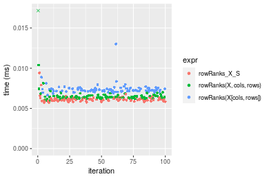
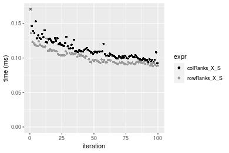
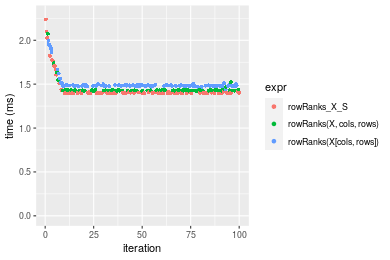
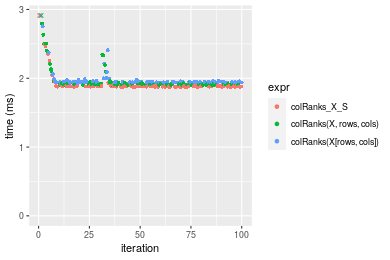
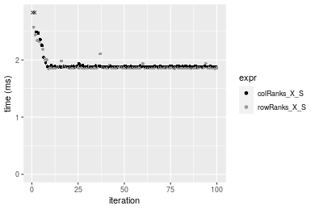
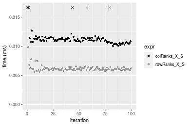
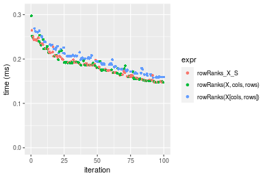
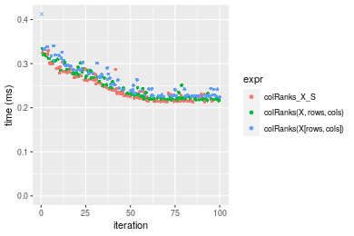
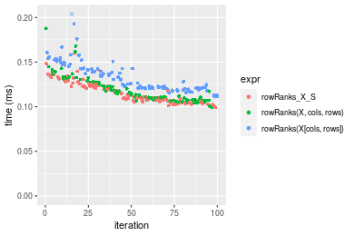
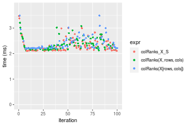

[matrixStats]: Benchmark report

---------------------------------------


# colRanks() and rowRanks() benchmarks on subsetted computation

This report benchmark the performance of colRanks() and rowRanks() on subsetted computation.


## Data type "integer"

### Data
```r
> rmatrix <- function(nrow, ncol, mode = c("logical", "double", "integer", "index"), range = c(-100, 
+     +100), na_prob = 0) {
+     mode <- match.arg(mode)
+     n <- nrow * ncol
+     if (mode == "logical") {
+         x <- sample(c(FALSE, TRUE), size = n, replace = TRUE)
+     }     else if (mode == "index") {
+         x <- seq_len(n)
+         mode <- "integer"
+     }     else {
+         x <- runif(n, min = range[1], max = range[2])
+     }
+     storage.mode(x) <- mode
+     if (na_prob > 0) 
+         x[sample(n, size = na_prob * n)] <- NA
+     dim(x) <- c(nrow, ncol)
+     x
+ }
> rmatrices <- function(scale = 10, seed = 1, ...) {
+     set.seed(seed)
+     data <- list()
+     data[[1]] <- rmatrix(nrow = scale * 1, ncol = scale * 1, ...)
+     data[[2]] <- rmatrix(nrow = scale * 10, ncol = scale * 10, ...)
+     data[[3]] <- rmatrix(nrow = scale * 100, ncol = scale * 1, ...)
+     data[[4]] <- t(data[[3]])
+     data[[5]] <- rmatrix(nrow = scale * 10, ncol = scale * 100, ...)
+     data[[6]] <- t(data[[5]])
+     names(data) <- sapply(data, FUN = function(x) paste(dim(x), collapse = "x"))
+     data
+ }
> data <- rmatrices(mode = mode)
```

### Results

#### 10x10 integer matrix

```r
> X <- data[["10x10"]]
> rows <- sample.int(nrow(X), size = nrow(X) * 0.7)
> cols <- sample.int(ncol(X), size = ncol(X) * 0.7)
> X_S <- X[rows, cols]
> gc()
           used  (Mb) gc trigger  (Mb) max used  (Mb)
Ncells  5294418 282.8    7916910 422.9  7916910 422.9
Vcells 10454721  79.8   33191153 253.3 53339345 407.0
> colStats <- microbenchmark(colRanks_X_S = colRanks(X_S, na.rm = FALSE), `colRanks(X, rows, cols)` = colRanks(X, 
+     rows = rows, cols = cols, na.rm = FALSE), `colRanks(X[rows, cols])` = colRanks(X[rows, cols], 
+     na.rm = FALSE), unit = "ms")
> X <- t(X)
> X_S <- t(X_S)
> gc()
           used  (Mb) gc trigger  (Mb) max used  (Mb)
Ncells  5294519 282.8    7916910 422.9  7916910 422.9
Vcells 10455276  79.8   33191153 253.3 53339345 407.0
> rowStats <- microbenchmark(rowRanks_X_S = rowRanks(X_S, na.rm = FALSE), `rowRanks(X, cols, rows)` = rowRanks(X, 
+     rows = cols, cols = rows, na.rm = FALSE), `rowRanks(X[cols, rows])` = rowRanks(X[cols, rows], 
+     na.rm = FALSE), unit = "ms")
```

_Table: Benchmarking of colRanks_X_S(), colRanks(X, rows, cols)() and colRanks(X[rows, cols])() on integer+10x10 data. The top panel shows times in milliseconds and the bottom panel shows relative times._


|   |expr                    |      min|        lq|      mean|    median|        uq|      max|
|:--|:-----------------------|--------:|---------:|---------:|---------:|---------:|--------:|
|1  |colRanks_X_S            | 0.010032| 0.0105045| 0.0138274| 0.0108680| 0.0111200| 0.304142|
|2  |colRanks(X, rows, cols) | 0.010547| 0.0110480| 0.0114338| 0.0114070| 0.0116500| 0.015685|
|3  |colRanks(X[rows, cols]) | 0.011377| 0.0117655| 0.0124191| 0.0122655| 0.0125965| 0.027460|


|   |expr                    |      min|       lq|      mean|   median|       uq|       max|
|:--|:-----------------------|--------:|--------:|---------:|--------:|--------:|---------:|
|1  |colRanks_X_S            | 1.000000| 1.000000| 1.0000000| 1.000000| 1.000000| 1.0000000|
|2  |colRanks(X, rows, cols) | 1.051336| 1.051740| 0.8268954| 1.049595| 1.047662| 0.0515713|
|3  |colRanks(X[rows, cols]) | 1.134071| 1.120044| 0.8981509| 1.128588| 1.132779| 0.0902868|

_Table: Benchmarking of rowRanks_X_S(), rowRanks(X, cols, rows)() and rowRanks(X[cols, rows])() on integer+10x10 data (transposed). The top panel shows times in milliseconds and the bottom panel shows relative times._


|   |expr                    |      min|        lq|      mean|    median|        uq|      max|
|:--|:-----------------------|--------:|---------:|---------:|---------:|---------:|--------:|
|1  |rowRanks_X_S            | 0.005725| 0.0059555| 0.0061417| 0.0060835| 0.0061995| 0.009428|
|2  |rowRanks(X, cols, rows) | 0.006005| 0.0063055| 0.0086534| 0.0064075| 0.0065660| 0.221239|
|3  |rowRanks(X[cols, rows]) | 0.006649| 0.0071440| 0.0073792| 0.0072575| 0.0074620| 0.013028|


|   |expr                    |      min|       lq|     mean|   median|       uq|       max|
|:--|:-----------------------|--------:|--------:|--------:|--------:|--------:|---------:|
|1  |rowRanks_X_S            | 1.000000| 1.000000| 1.000000| 1.000000| 1.000000|  1.000000|
|2  |rowRanks(X, cols, rows) | 1.048908| 1.058769| 1.408969| 1.053259| 1.059118| 23.466165|
|3  |rowRanks(X[cols, rows]) | 1.161397| 1.199563| 1.201487| 1.192981| 1.203645|  1.381841|

_Figure: Benchmarking of colRanks_X_S(), colRanks(X, rows, cols)() and colRanks(X[rows, cols])() on integer+10x10 data  as well as rowRanks_X_S(), rowRanks(X, cols, rows)() and rowRanks(X[cols, rows])() on the same data transposed.  Outliers are displayed as crosses.  Times are in milliseconds._



_Table: Benchmarking of colRanks_X_S() and rowRanks_X_S() on integer+10x10 data (original and transposed).  The top panel shows times in milliseconds and the bottom panel shows relative times._


|   |expr         |    min|      lq|     mean|  median|      uq|     max|
|:--|:------------|------:|-------:|--------:|-------:|-------:|-------:|
|2  |rowRanks_X_S |  5.725|  5.9555|  6.14168|  6.0835|  6.1995|   9.428|
|1  |colRanks_X_S | 10.032| 10.5045| 13.82742| 10.8680| 11.1200| 304.142|


|   |expr         |      min|       lq|     mean|   median|       uq|      max|
|:--|:------------|--------:|--------:|--------:|--------:|--------:|--------:|
|2  |rowRanks_X_S | 1.000000| 1.000000| 1.000000| 1.000000| 1.000000|  1.00000|
|1  |colRanks_X_S | 1.752314| 1.763832| 2.251407| 1.786472| 1.793693| 32.25944|

_Figure: Benchmarking of colRanks_X_S() and rowRanks_X_S() on integer+10x10 data (original and transposed).  Outliers are displayed as crosses. Times are in milliseconds._


#### 100x100 integer matrix

```r
> X <- data[["100x100"]]
> rows <- sample.int(nrow(X), size = nrow(X) * 0.7)
> cols <- sample.int(ncol(X), size = ncol(X) * 0.7)
> X_S <- X[rows, cols]
> gc()
           used  (Mb) gc trigger  (Mb) max used  (Mb)
Ncells  5293327 282.7    7916910 422.9  7916910 422.9
Vcells 10124574  77.3   33191153 253.3 53339345 407.0
> colStats <- microbenchmark(colRanks_X_S = colRanks(X_S, na.rm = FALSE), `colRanks(X, rows, cols)` = colRanks(X, 
+     rows = rows, cols = cols, na.rm = FALSE), `colRanks(X[rows, cols])` = colRanks(X[rows, cols], 
+     na.rm = FALSE), unit = "ms")
> X <- t(X)
> X_S <- t(X_S)
> gc()
           used  (Mb) gc trigger  (Mb) max used  (Mb)
Ncells  5293321 282.7    7916910 422.9  7916910 422.9
Vcells 10129657  77.3   33191153 253.3 53339345 407.0
> rowStats <- microbenchmark(rowRanks_X_S = rowRanks(X_S, na.rm = FALSE), `rowRanks(X, cols, rows)` = rowRanks(X, 
+     rows = cols, cols = rows, na.rm = FALSE), `rowRanks(X[cols, rows])` = rowRanks(X[cols, rows], 
+     na.rm = FALSE), unit = "ms")
```

_Table: Benchmarking of colRanks_X_S(), colRanks(X, rows, cols)() and colRanks(X[rows, cols])() on integer+100x100 data. The top panel shows times in milliseconds and the bottom panel shows relative times._


|   |expr                    |      min|        lq|      mean|   median|        uq|      max|
|:--|:-----------------------|--------:|---------:|---------:|--------:|---------:|--------:|
|1  |colRanks_X_S            | 0.152024| 0.1657050| 0.1908988| 0.189321| 0.2064810| 0.254377|
|2  |colRanks(X, rows, cols) | 0.159376| 0.1747150| 0.1975440| 0.194722| 0.2074785| 0.267923|
|3  |colRanks(X[rows, cols]) | 0.159383| 0.1781465| 0.2018076| 0.197223| 0.2167080| 0.323973|


|   |expr                    |      min|       lq|     mean|   median|       uq|      max|
|:--|:-----------------------|--------:|--------:|--------:|--------:|--------:|--------:|
|1  |colRanks_X_S            | 1.000000| 1.000000| 1.000000| 1.000000| 1.000000| 1.000000|
|2  |colRanks(X, rows, cols) | 1.048361| 1.054374| 1.034810| 1.028528| 1.004831| 1.053252|
|3  |colRanks(X[rows, cols]) | 1.048407| 1.075082| 1.057144| 1.041739| 1.049530| 1.273594|

_Table: Benchmarking of rowRanks_X_S(), rowRanks(X, cols, rows)() and rowRanks(X[cols, rows])() on integer+100x100 data (transposed). The top panel shows times in milliseconds and the bottom panel shows relative times._


|   |expr                    |      min|        lq|      mean|   median|        uq|      max|
|:--|:-----------------------|--------:|---------:|---------:|--------:|---------:|--------:|
|1  |rowRanks_X_S            | 0.147362| 0.1576265| 0.1824829| 0.176650| 0.2026855| 0.241691|
|2  |rowRanks(X, cols, rows) | 0.150039| 0.1639530| 0.1838277| 0.178487| 0.1924285| 0.279286|
|3  |rowRanks(X[cols, rows]) | 0.155485| 0.1697270| 0.1902174| 0.185682| 0.2033160| 0.254544|


|   |expr                    |      min|       lq|     mean|   median|        uq|      max|
|:--|:-----------------------|--------:|--------:|--------:|--------:|---------:|--------:|
|1  |rowRanks_X_S            | 1.000000| 1.000000| 1.000000| 1.000000| 1.0000000| 1.000000|
|2  |rowRanks(X, cols, rows) | 1.018166| 1.040136| 1.007370| 1.010399| 0.9493945| 1.155550|
|3  |rowRanks(X[cols, rows]) | 1.055123| 1.076767| 1.042385| 1.051129| 1.0031107| 1.053179|

_Figure: Benchmarking of colRanks_X_S(), colRanks(X, rows, cols)() and colRanks(X[rows, cols])() on integer+100x100 data  as well as rowRanks_X_S(), rowRanks(X, cols, rows)() and rowRanks(X[cols, rows])() on the same data transposed.  Outliers are displayed as crosses.  Times are in milliseconds._


_Table: Benchmarking of colRanks_X_S() and rowRanks_X_S() on integer+100x100 data (original and transposed).  The top panel shows times in milliseconds and the bottom panel shows relative times._


|   |expr         |     min|       lq|     mean|  median|       uq|     max|
|:--|:------------|-------:|--------:|--------:|-------:|--------:|-------:|
|2  |rowRanks_X_S | 147.362| 157.6265| 182.4829| 176.650| 202.6855| 241.691|
|1  |colRanks_X_S | 152.024| 165.7050| 190.8988| 189.321| 206.4810| 254.377|


|   |expr         |      min|       lq|     mean|   median|       uq|      max|
|:--|:------------|--------:|--------:|--------:|--------:|--------:|--------:|
|2  |rowRanks_X_S | 1.000000| 1.000000| 1.000000| 1.000000| 1.000000| 1.000000|
|1  |colRanks_X_S | 1.031636| 1.051251| 1.046119| 1.071729| 1.018726| 1.052488|

_Figure: Benchmarking of colRanks_X_S() and rowRanks_X_S() on integer+100x100 data (original and transposed).  Outliers are displayed as crosses. Times are in milliseconds._


#### 1000x10 integer matrix

```r
> X <- data[["1000x10"]]
> rows <- sample.int(nrow(X), size = nrow(X) * 0.7)
> cols <- sample.int(ncol(X), size = ncol(X) * 0.7)
> X_S <- X[rows, cols]
> gc()
           used  (Mb) gc trigger  (Mb) max used  (Mb)
Ncells  5294070 282.8    7916910 422.9  7916910 422.9
Vcells 10128619  77.3   33191153 253.3 53339345 407.0
> colStats <- microbenchmark(colRanks_X_S = colRanks(X_S, na.rm = FALSE), `colRanks(X, rows, cols)` = colRanks(X, 
+     rows = rows, cols = cols, na.rm = FALSE), `colRanks(X[rows, cols])` = colRanks(X[rows, cols], 
+     na.rm = FALSE), unit = "ms")
> X <- t(X)
> X_S <- t(X_S)
> gc()
           used  (Mb) gc trigger  (Mb) max used  (Mb)
Ncells  5294064 282.8    7916910 422.9  7916910 422.9
Vcells 10133702  77.4   33191153 253.3 53339345 407.0
> rowStats <- microbenchmark(rowRanks_X_S = rowRanks(X_S, na.rm = FALSE), `rowRanks(X, cols, rows)` = rowRanks(X, 
+     rows = cols, cols = rows, na.rm = FALSE), `rowRanks(X[cols, rows])` = rowRanks(X[cols, rows], 
+     na.rm = FALSE), unit = "ms")
```

_Table: Benchmarking of colRanks_X_S(), colRanks(X, rows, cols)() and colRanks(X[rows, cols])() on integer+1000x10 data. The top panel shows times in milliseconds and the bottom panel shows relative times._


|   |expr                    |      min|        lq|      mean|    median|       uq|      max|
|:--|:-----------------------|--------:|---------:|---------:|---------:|--------:|--------:|
|2  |colRanks(X, rows, cols) | 0.200874| 0.2034770| 0.2376866| 0.2251025| 0.262953| 0.340451|
|1  |colRanks_X_S            | 0.196767| 0.2035565| 0.2382044| 0.2266240| 0.258712| 0.331434|
|3  |colRanks(X[rows, cols]) | 0.205192| 0.2069565| 0.2419362| 0.2271965| 0.269603| 0.398267|


|   |expr                    |       min|       lq|     mean|   median|        uq|       max|
|:--|:-----------------------|---------:|--------:|--------:|--------:|---------:|---------:|
|2  |colRanks(X, rows, cols) | 1.0000000| 1.000000| 1.000000| 1.000000| 1.0000000| 1.0000000|
|1  |colRanks_X_S            | 0.9795543| 1.000391| 1.002178| 1.006759| 0.9838716| 0.9735145|
|3  |colRanks(X[rows, cols]) | 1.0214961| 1.017100| 1.017879| 1.009302| 1.0252897| 1.1698218|

_Table: Benchmarking of rowRanks_X_S(), rowRanks(X, cols, rows)() and rowRanks(X[cols, rows])() on integer+1000x10 data (transposed). The top panel shows times in milliseconds and the bottom panel shows relative times._


|   |expr                    |      min|        lq|      mean|   median|        uq|      max|
|:--|:-----------------------|--------:|---------:|---------:|--------:|---------:|--------:|
|1  |rowRanks_X_S            | 0.186699| 0.1894420| 0.2191481| 0.201473| 0.2365900| 0.316220|
|3  |rowRanks(X[cols, rows]) | 0.196371| 0.1989575| 0.2305956| 0.220234| 0.2556160| 0.366882|
|2  |rowRanks(X, cols, rows) | 0.190173| 0.1930620| 0.2264596| 0.220360| 0.2491185| 0.316662|


|   |expr                    |      min|       lq|     mean|   median|       uq|      max|
|:--|:-----------------------|--------:|--------:|--------:|--------:|--------:|--------:|
|1  |rowRanks_X_S            | 1.000000| 1.000000| 1.000000| 1.000000| 1.000000| 1.000000|
|3  |rowRanks(X[cols, rows]) | 1.051805| 1.050229| 1.052236| 1.093119| 1.080418| 1.160211|
|2  |rowRanks(X, cols, rows) | 1.018608| 1.019109| 1.033363| 1.093745| 1.052955| 1.001398|

_Figure: Benchmarking of colRanks_X_S(), colRanks(X, rows, cols)() and colRanks(X[rows, cols])() on integer+1000x10 data  as well as rowRanks_X_S(), rowRanks(X, cols, rows)() and rowRanks(X[cols, rows])() on the same data transposed.  Outliers are displayed as crosses.  Times are in milliseconds._


_Table: Benchmarking of colRanks_X_S() and rowRanks_X_S() on integer+1000x10 data (original and transposed).  The top panel shows times in milliseconds and the bottom panel shows relative times._


|   |expr         |     min|       lq|     mean|  median|      uq|     max|
|:--|:------------|-------:|--------:|--------:|-------:|-------:|-------:|
|2  |rowRanks_X_S | 186.699| 189.4420| 219.1481| 201.473| 236.590| 316.220|
|1  |colRanks_X_S | 196.767| 203.5565| 238.2044| 226.624| 258.712| 331.434|


|   |expr         |      min|       lq|     mean|   median|       uq|      max|
|:--|:------------|--------:|--------:|--------:|--------:|--------:|--------:|
|2  |rowRanks_X_S | 1.000000| 1.000000| 1.000000| 1.000000| 1.000000| 1.000000|
|1  |colRanks_X_S | 1.053926| 1.074506| 1.086956| 1.124836| 1.093503| 1.048112|

_Figure: Benchmarking of colRanks_X_S() and rowRanks_X_S() on integer+1000x10 data (original and transposed).  Outliers are displayed as crosses. Times are in milliseconds._


#### 10x1000 integer matrix

```r
> X <- data[["10x1000"]]
> rows <- sample.int(nrow(X), size = nrow(X) * 0.7)
> cols <- sample.int(ncol(X), size = ncol(X) * 0.7)
> X_S <- X[rows, cols]
> gc()
           used  (Mb) gc trigger  (Mb) max used  (Mb)
Ncells  5294275 282.8    7916910 422.9  7916910 422.9
Vcells 10129469  77.3   33191153 253.3 53339345 407.0
> colStats <- microbenchmark(colRanks_X_S = colRanks(X_S, na.rm = FALSE), `colRanks(X, rows, cols)` = colRanks(X, 
+     rows = rows, cols = cols, na.rm = FALSE), `colRanks(X[rows, cols])` = colRanks(X[rows, cols], 
+     na.rm = FALSE), unit = "ms")
> X <- t(X)
> X_S <- t(X_S)
> gc()
           used  (Mb) gc trigger  (Mb) max used  (Mb)
Ncells  5294269 282.8    7916910 422.9  7916910 422.9
Vcells 10134552  77.4   33191153 253.3 53339345 407.0
> rowStats <- microbenchmark(rowRanks_X_S = rowRanks(X_S, na.rm = FALSE), `rowRanks(X, cols, rows)` = rowRanks(X, 
+     rows = cols, cols = rows, na.rm = FALSE), `rowRanks(X[cols, rows])` = rowRanks(X[cols, rows], 
+     na.rm = FALSE), unit = "ms")
```

_Table: Benchmarking of colRanks_X_S(), colRanks(X, rows, cols)() and colRanks(X[rows, cols])() on integer+10x1000 data. The top panel shows times in milliseconds and the bottom panel shows relative times._


|   |expr                    |      min|        lq|      mean|    median|       uq|      max|
|:--|:-----------------------|--------:|---------:|---------:|---------:|--------:|--------:|
|1  |colRanks_X_S            | 0.092344| 0.1017765| 0.1126097| 0.1093100| 0.121655| 0.198021|
|3  |colRanks(X[rows, cols]) | 0.105324| 0.1146230| 0.1232231| 0.1197880| 0.130496| 0.157222|
|2  |colRanks(X, rows, cols) | 0.104418| 0.1161910| 0.1247681| 0.1209115| 0.128946| 0.174461|


|   |expr                    |      min|       lq|     mean|   median|       uq|       max|
|:--|:-----------------------|--------:|--------:|--------:|--------:|--------:|---------:|
|1  |colRanks_X_S            | 1.000000| 1.000000| 1.000000| 1.000000| 1.000000| 1.0000000|
|3  |colRanks(X[rows, cols]) | 1.140561| 1.126223| 1.094249| 1.095856| 1.072673| 0.7939663|
|2  |colRanks(X, rows, cols) | 1.130750| 1.141629| 1.107969| 1.106134| 1.059932| 0.8810227|

_Table: Benchmarking of rowRanks_X_S(), rowRanks(X, cols, rows)() and rowRanks(X[cols, rows])() on integer+10x1000 data (transposed). The top panel shows times in milliseconds and the bottom panel shows relative times._


|   |expr                    |      min|        lq|      mean|    median|        uq|      max|
|:--|:-----------------------|--------:|---------:|---------:|---------:|---------:|--------:|
|1  |rowRanks_X_S            | 0.088483| 0.0934085| 0.1013918| 0.0972985| 0.1076370| 0.135862|
|2  |rowRanks(X, cols, rows) | 0.092686| 0.0990780| 0.1078311| 0.1036120| 0.1129945| 0.179000|
|3  |rowRanks(X[cols, rows]) | 0.095436| 0.1031545| 0.1134725| 0.1105220| 0.1215570| 0.141407|


|   |expr                    |      min|       lq|     mean|   median|       uq|      max|
|:--|:-----------------------|--------:|--------:|--------:|--------:|--------:|--------:|
|1  |rowRanks_X_S            | 1.000000| 1.000000| 1.000000| 1.000000| 1.000000| 1.000000|
|2  |rowRanks(X, cols, rows) | 1.047501| 1.060696| 1.063509| 1.064888| 1.049774| 1.317513|
|3  |rowRanks(X[cols, rows]) | 1.078580| 1.104337| 1.119149| 1.135906| 1.129324| 1.040814|

_Figure: Benchmarking of colRanks_X_S(), colRanks(X, rows, cols)() and colRanks(X[rows, cols])() on integer+10x1000 data  as well as rowRanks_X_S(), rowRanks(X, cols, rows)() and rowRanks(X[cols, rows])() on the same data transposed.  Outliers are displayed as crosses.  Times are in milliseconds._


_Table: Benchmarking of colRanks_X_S() and rowRanks_X_S() on integer+10x1000 data (original and transposed).  The top panel shows times in milliseconds and the bottom panel shows relative times._


|   |expr         |    min|       lq|     mean|   median|      uq|     max|
|:--|:------------|------:|--------:|--------:|--------:|-------:|-------:|
|2  |rowRanks_X_S | 88.483|  93.4085| 101.3918|  97.2985| 107.637| 135.862|
|1  |colRanks_X_S | 92.344| 101.7765| 112.6097| 109.3100| 121.655| 198.021|


|   |expr         |      min|       lq|    mean|  median|       uq|      max|
|:--|:------------|--------:|--------:|-------:|-------:|--------:|--------:|
|2  |rowRanks_X_S | 1.000000| 1.000000| 1.00000| 1.00000| 1.000000| 1.000000|
|1  |colRanks_X_S | 1.043635| 1.089585| 1.11064| 1.12345| 1.130234| 1.457516|

_Figure: Benchmarking of colRanks_X_S() and rowRanks_X_S() on integer+10x1000 data (original and transposed).  Outliers are displayed as crosses. Times are in milliseconds._




#### 100x1000 integer matrix

```r
> X <- data[["100x1000"]]
> rows <- sample.int(nrow(X), size = nrow(X) * 0.7)
> cols <- sample.int(ncol(X), size = ncol(X) * 0.7)
> X_S <- X[rows, cols]
> gc()
           used  (Mb) gc trigger  (Mb) max used  (Mb)
Ncells  5294485 282.8    7916910 422.9  7916910 422.9
Vcells 10152141  77.5   33191153 253.3 53339345 407.0
> colStats <- microbenchmark(colRanks_X_S = colRanks(X_S, na.rm = FALSE), `colRanks(X, rows, cols)` = colRanks(X, 
+     rows = rows, cols = cols, na.rm = FALSE), `colRanks(X[rows, cols])` = colRanks(X[rows, cols], 
+     na.rm = FALSE), unit = "ms")
> X <- t(X)
> X_S <- t(X_S)
> gc()
           used  (Mb) gc trigger  (Mb) max used  (Mb)
Ncells  5294479 282.8    7916910 422.9  7916910 422.9
Vcells 10202224  77.9   33191153 253.3 53339345 407.0
> rowStats <- microbenchmark(rowRanks_X_S = rowRanks(X_S, na.rm = FALSE), `rowRanks(X, cols, rows)` = rowRanks(X, 
+     rows = cols, cols = rows, na.rm = FALSE), `rowRanks(X[cols, rows])` = rowRanks(X[cols, rows], 
+     na.rm = FALSE), unit = "ms")
```

_Table: Benchmarking of colRanks_X_S(), colRanks(X, rows, cols)() and colRanks(X[rows, cols])() on integer+100x1000 data. The top panel shows times in milliseconds and the bottom panel shows relative times._


|   |expr                    |      min|       lq|     mean|   median|       uq|      max|
|:--|:-----------------------|--------:|--------:|--------:|--------:|--------:|--------:|
|1  |colRanks_X_S            | 1.441827| 1.451632| 1.509335| 1.456159| 1.500632| 2.319045|
|2  |colRanks(X, rows, cols) | 1.509743| 1.515233| 1.562314| 1.519967| 1.533454| 2.389907|
|3  |colRanks(X[rows, cols]) | 1.512313| 1.518984| 1.577089| 1.524574| 1.547218| 2.142405|


|   |expr                    |      min|       lq|     mean|   median|       uq|       max|
|:--|:-----------------------|--------:|--------:|--------:|--------:|--------:|---------:|
|1  |colRanks_X_S            | 1.000000| 1.000000| 1.000000| 1.000000| 1.000000| 1.0000000|
|2  |colRanks(X, rows, cols) | 1.047104| 1.043814| 1.035101| 1.043820| 1.021872| 1.0305565|
|3  |colRanks(X[rows, cols]) | 1.048887| 1.046397| 1.044890| 1.046983| 1.031044| 0.9238307|

_Table: Benchmarking of rowRanks_X_S(), rowRanks(X, cols, rows)() and rowRanks(X[cols, rows])() on integer+100x1000 data (transposed). The top panel shows times in milliseconds and the bottom panel shows relative times._


|   |expr                    |      min|       lq|     mean|   median|       uq|      max|
|:--|:-----------------------|--------:|--------:|--------:|--------:|--------:|--------:|
|1  |rowRanks_X_S            | 1.393368| 1.397792| 1.446303| 1.399810| 1.405717| 2.236869|
|2  |rowRanks(X, cols, rows) | 1.421849| 1.426300| 1.442784| 1.428338| 1.430756| 2.075620|
|3  |rowRanks(X[cols, rows]) | 1.440722| 1.478462| 1.509710| 1.483329| 1.489240| 1.993883|


|   |expr                    |      min|       lq|      mean|   median|       uq|       max|
|:--|:-----------------------|--------:|--------:|---------:|--------:|--------:|---------:|
|1  |rowRanks_X_S            | 1.000000| 1.000000| 1.0000000| 1.000000| 1.000000| 1.0000000|
|2  |rowRanks(X, cols, rows) | 1.020440| 1.020395| 0.9975671| 1.020380| 1.017813| 0.9279131|
|3  |rowRanks(X[cols, rows]) | 1.033985| 1.057713| 1.0438406| 1.059664| 1.059417| 0.8913723|

_Figure: Benchmarking of colRanks_X_S(), colRanks(X, rows, cols)() and colRanks(X[rows, cols])() on integer+100x1000 data  as well as rowRanks_X_S(), rowRanks(X, cols, rows)() and rowRanks(X[cols, rows])() on the same data transposed.  Outliers are displayed as crosses.  Times are in milliseconds._



_Table: Benchmarking of colRanks_X_S() and rowRanks_X_S() on integer+100x1000 data (original and transposed).  The top panel shows times in milliseconds and the bottom panel shows relative times._


|   |expr         |      min|       lq|     mean|   median|       uq|      max|
|:--|:------------|--------:|--------:|--------:|--------:|--------:|--------:|
|2  |rowRanks_X_S | 1.393368| 1.397792| 1.446303| 1.399810| 1.405717| 2.236869|
|1  |colRanks_X_S | 1.441827| 1.451632| 1.509335| 1.456159| 1.500632| 2.319045|


|   |expr         |      min|       lq|     mean|   median|       uq|      max|
|:--|:------------|--------:|--------:|--------:|--------:|--------:|--------:|
|2  |rowRanks_X_S | 1.000000| 1.000000| 1.000000| 1.000000| 1.000000| 1.000000|
|1  |colRanks_X_S | 1.034778| 1.038518| 1.043582| 1.040255| 1.067521| 1.036737|

_Figure: Benchmarking of colRanks_X_S() and rowRanks_X_S() on integer+100x1000 data (original and transposed).  Outliers are displayed as crosses. Times are in milliseconds._


#### 1000x100 integer matrix

```r
> X <- data[["1000x100"]]
> rows <- sample.int(nrow(X), size = nrow(X) * 0.7)
> cols <- sample.int(ncol(X), size = ncol(X) * 0.7)
> X_S <- X[rows, cols]
> gc()
           used  (Mb) gc trigger  (Mb) max used  (Mb)
Ncells  5294689 282.8    7916910 422.9  7916910 422.9
Vcells 10152907  77.5   33191153 253.3 53339345 407.0
> colStats <- microbenchmark(colRanks_X_S = colRanks(X_S, na.rm = FALSE), `colRanks(X, rows, cols)` = colRanks(X, 
+     rows = rows, cols = cols, na.rm = FALSE), `colRanks(X[rows, cols])` = colRanks(X[rows, cols], 
+     na.rm = FALSE), unit = "ms")
> X <- t(X)
> X_S <- t(X_S)
> gc()
           used  (Mb) gc trigger  (Mb) max used  (Mb)
Ncells  5294692 282.8    7916910 422.9  7916910 422.9
Vcells 10203005  77.9   33191153 253.3 53339345 407.0
> rowStats <- microbenchmark(rowRanks_X_S = rowRanks(X_S, na.rm = FALSE), `rowRanks(X, cols, rows)` = rowRanks(X, 
+     rows = cols, cols = rows, na.rm = FALSE), `rowRanks(X[cols, rows])` = rowRanks(X[cols, rows], 
+     na.rm = FALSE), unit = "ms")
```

_Table: Benchmarking of colRanks_X_S(), colRanks(X, rows, cols)() and colRanks(X[rows, cols])() on integer+1000x100 data. The top panel shows times in milliseconds and the bottom panel shows relative times._


|   |expr                    |      min|       lq|     mean|   median|       uq|      max|
|:--|:-----------------------|--------:|--------:|--------:|--------:|--------:|--------:|
|1  |colRanks_X_S            | 1.871106| 1.878167| 1.936659| 1.881288| 1.889145| 3.456286|
|2  |colRanks(X, rows, cols) | 1.895522| 1.907013| 1.980835| 1.910787| 1.925739| 2.920142|
|3  |colRanks(X[rows, cols]) | 1.934019| 1.939526| 1.982213| 1.943576| 1.950561| 3.214206|


|   |expr                    |      min|       lq|     mean|   median|      uq|       max|
|:--|:-----------------------|--------:|--------:|--------:|--------:|-------:|---------:|
|1  |colRanks_X_S            | 1.000000| 1.000000| 1.000000| 1.000000| 1.00000| 1.0000000|
|2  |colRanks(X, rows, cols) | 1.013049| 1.015359| 1.022810| 1.015680| 1.01937| 0.8448786|
|3  |colRanks(X[rows, cols]) | 1.033623| 1.032670| 1.023521| 1.033109| 1.03251| 0.9299595|

_Table: Benchmarking of rowRanks_X_S(), rowRanks(X, cols, rows)() and rowRanks(X[cols, rows])() on integer+1000x100 data (transposed). The top panel shows times in milliseconds and the bottom panel shows relative times._


|   |expr                    |      min|       lq|     mean|   median|       uq|      max|
|:--|:-----------------------|--------:|--------:|--------:|--------:|--------:|--------:|
|1  |rowRanks_X_S            | 1.849571| 1.858715| 1.900790| 1.861840| 1.868486| 2.572422|
|2  |rowRanks(X, cols, rows) | 1.869737| 1.876607| 1.935731| 1.880375| 1.884843| 3.134836|
|3  |rowRanks(X[cols, rows]) | 1.926088| 1.935420| 1.974058| 1.940850| 1.949309| 3.109879|


|   |expr                    |      min|       lq|     mean|   median|       uq|      max|
|:--|:-----------------------|--------:|--------:|--------:|--------:|--------:|--------:|
|1  |rowRanks_X_S            | 1.000000| 1.000000| 1.000000| 1.000000| 1.000000| 1.000000|
|2  |rowRanks(X, cols, rows) | 1.010903| 1.009626| 1.018383| 1.009955| 1.008754| 1.218632|
|3  |rowRanks(X[cols, rows]) | 1.041370| 1.041268| 1.038546| 1.042436| 1.043255| 1.208930|

_Figure: Benchmarking of colRanks_X_S(), colRanks(X, rows, cols)() and colRanks(X[rows, cols])() on integer+1000x100 data  as well as rowRanks_X_S(), rowRanks(X, cols, rows)() and rowRanks(X[cols, rows])() on the same data transposed.  Outliers are displayed as crosses.  Times are in milliseconds._





_Table: Benchmarking of colRanks_X_S() and rowRanks_X_S() on integer+1000x100 data (original and transposed).  The top panel shows times in milliseconds and the bottom panel shows relative times._


|   |expr         |      min|       lq|     mean|   median|       uq|      max|
|:--|:------------|--------:|--------:|--------:|--------:|--------:|--------:|
|2  |rowRanks_X_S | 1.849571| 1.858715| 1.900790| 1.861840| 1.868486| 2.572422|
|1  |colRanks_X_S | 1.871106| 1.878167| 1.936659| 1.881288| 1.889145| 3.456286|


|   |expr         |      min|       lq|     mean|   median|       uq|      max|
|:--|:------------|--------:|--------:|--------:|--------:|--------:|--------:|
|2  |rowRanks_X_S | 1.000000| 1.000000| 1.000000| 1.000000| 1.000000| 1.000000|
|1  |colRanks_X_S | 1.011643| 1.010466| 1.018871| 1.010446| 1.011056| 1.343592|

_Figure: Benchmarking of colRanks_X_S() and rowRanks_X_S() on integer+1000x100 data (original and transposed).  Outliers are displayed as crosses. Times are in milliseconds._





## Data type "double"

### Data
```r
> rmatrix <- function(nrow, ncol, mode = c("logical", "double", "integer", "index"), range = c(-100, 
+     +100), na_prob = 0) {
+     mode <- match.arg(mode)
+     n <- nrow * ncol
+     if (mode == "logical") {
+         x <- sample(c(FALSE, TRUE), size = n, replace = TRUE)
+     }     else if (mode == "index") {
+         x <- seq_len(n)
+         mode <- "integer"
+     }     else {
+         x <- runif(n, min = range[1], max = range[2])
+     }
+     storage.mode(x) <- mode
+     if (na_prob > 0) 
+         x[sample(n, size = na_prob * n)] <- NA
+     dim(x) <- c(nrow, ncol)
+     x
+ }
> rmatrices <- function(scale = 10, seed = 1, ...) {
+     set.seed(seed)
+     data <- list()
+     data[[1]] <- rmatrix(nrow = scale * 1, ncol = scale * 1, ...)
+     data[[2]] <- rmatrix(nrow = scale * 10, ncol = scale * 10, ...)
+     data[[3]] <- rmatrix(nrow = scale * 100, ncol = scale * 1, ...)
+     data[[4]] <- t(data[[3]])
+     data[[5]] <- rmatrix(nrow = scale * 10, ncol = scale * 100, ...)
+     data[[6]] <- t(data[[5]])
+     names(data) <- sapply(data, FUN = function(x) paste(dim(x), collapse = "x"))
+     data
+ }
> data <- rmatrices(mode = mode)
```

### Results

#### 10x10 double matrix

```r
> X <- data[["10x10"]]
> rows <- sample.int(nrow(X), size = nrow(X) * 0.7)
> cols <- sample.int(ncol(X), size = ncol(X) * 0.7)
> X_S <- X[rows, cols]
> gc()
           used  (Mb) gc trigger  (Mb) max used  (Mb)
Ncells  5294915 282.8    7916910 422.9  7916910 422.9
Vcells 10244025  78.2   33191153 253.3 53339345 407.0
> colStats <- microbenchmark(colRanks_X_S = colRanks(X_S, na.rm = FALSE), `colRanks(X, rows, cols)` = colRanks(X, 
+     rows = rows, cols = cols, na.rm = FALSE), `colRanks(X[rows, cols])` = colRanks(X[rows, cols], 
+     na.rm = FALSE), unit = "ms")
> X <- t(X)
> X_S <- t(X_S)
> gc()
           used  (Mb) gc trigger  (Mb) max used  (Mb)
Ncells  5294900 282.8    7916910 422.9  7916910 422.9
Vcells 10244193  78.2   33191153 253.3 53339345 407.0
> rowStats <- microbenchmark(rowRanks_X_S = rowRanks(X_S, na.rm = FALSE), `rowRanks(X, cols, rows)` = rowRanks(X, 
+     rows = cols, cols = rows, na.rm = FALSE), `rowRanks(X[cols, rows])` = rowRanks(X[cols, rows], 
+     na.rm = FALSE), unit = "ms")
```

_Table: Benchmarking of colRanks_X_S(), colRanks(X, rows, cols)() and colRanks(X[rows, cols])() on double+10x10 data. The top panel shows times in milliseconds and the bottom panel shows relative times._


|   |expr                    |      min|        lq|      mean|    median|        uq|      max|
|:--|:-----------------------|--------:|---------:|---------:|---------:|---------:|--------:|
|1  |colRanks_X_S            | 0.010046| 0.0108215| 0.0121828| 0.0111040| 0.0114215| 0.078071|
|2  |colRanks(X, rows, cols) | 0.010503| 0.0111190| 0.0120167| 0.0114835| 0.0118055| 0.023125|
|3  |colRanks(X[rows, cols]) | 0.011499| 0.0121265| 0.0129971| 0.0125630| 0.0128560| 0.023611|


|   |expr                    |      min|       lq|     mean|   median|       uq|       max|
|:--|:-----------------------|--------:|--------:|--------:|--------:|--------:|---------:|
|1  |colRanks_X_S            | 1.000000| 1.000000| 1.000000| 1.000000| 1.000000| 1.0000000|
|2  |colRanks(X, rows, cols) | 1.045491| 1.027492| 0.986366| 1.034177| 1.033621| 0.2962047|
|3  |colRanks(X[rows, cols]) | 1.144635| 1.120593| 1.066838| 1.131394| 1.125597| 0.3024298|

_Table: Benchmarking of rowRanks_X_S(), rowRanks(X, cols, rows)() and rowRanks(X[cols, rows])() on double+10x10 data (transposed). The top panel shows times in milliseconds and the bottom panel shows relative times._


|   |expr                    |      min|        lq|      mean|    median|        uq|      max|
|:--|:-----------------------|--------:|---------:|---------:|---------:|---------:|--------:|
|1  |rowRanks_X_S            | 0.005589| 0.0059690| 0.0061898| 0.0060755| 0.0062490| 0.009853|
|2  |rowRanks(X, cols, rows) | 0.005804| 0.0062175| 0.0067400| 0.0063605| 0.0065025| 0.039315|
|3  |rowRanks(X[cols, rows]) | 0.006751| 0.0071200| 0.0073298| 0.0072655| 0.0074530| 0.009750|


|   |expr                    |      min|       lq|     mean|   median|       uq|       max|
|:--|:-----------------------|--------:|--------:|--------:|--------:|--------:|---------:|
|1  |rowRanks_X_S            | 1.000000| 1.000000| 1.000000| 1.000000| 1.000000| 1.0000000|
|2  |rowRanks(X, cols, rows) | 1.038468| 1.041632| 1.088905| 1.046910| 1.040566| 3.9901553|
|3  |rowRanks(X[cols, rows]) | 1.207908| 1.192830| 1.184182| 1.195869| 1.192671| 0.9895463|

_Figure: Benchmarking of colRanks_X_S(), colRanks(X, rows, cols)() and colRanks(X[rows, cols])() on double+10x10 data  as well as rowRanks_X_S(), rowRanks(X, cols, rows)() and rowRanks(X[cols, rows])() on the same data transposed.  Outliers are displayed as crosses.  Times are in milliseconds._


_Table: Benchmarking of colRanks_X_S() and rowRanks_X_S() on double+10x10 data (original and transposed).  The top panel shows times in milliseconds and the bottom panel shows relative times._


|   |expr         |    min|      lq|     mean|  median|      uq|    max|
|:--|:------------|------:|-------:|--------:|-------:|-------:|------:|
|2  |rowRanks_X_S |  5.589|  5.9690|  6.18975|  6.0755|  6.2490|  9.853|
|1  |colRanks_X_S | 10.046| 10.8215| 12.18282| 11.1040| 11.4215| 78.071|


|   |expr         |      min|      lq|     mean|   median|       uq|      max|
|:--|:------------|--------:|-------:|--------:|--------:|--------:|--------:|
|2  |rowRanks_X_S | 1.000000| 1.00000| 1.000000| 1.000000| 1.000000| 1.000000|
|1  |colRanks_X_S | 1.797459| 1.81295| 1.968225| 1.827668| 1.827732| 7.923577|

_Figure: Benchmarking of colRanks_X_S() and rowRanks_X_S() on double+10x10 data (original and transposed).  Outliers are displayed as crosses. Times are in milliseconds._




#### 100x100 double matrix

```r
> X <- data[["100x100"]]
> rows <- sample.int(nrow(X), size = nrow(X) * 0.7)
> cols <- sample.int(ncol(X), size = ncol(X) * 0.7)
> X_S <- X[rows, cols]
> gc()
           used  (Mb) gc trigger  (Mb) max used  (Mb)
Ncells  5295112 282.8    7916910 422.9  7916910 422.9
Vcells 10249968  78.3   33191153 253.3 53339345 407.0
> colStats <- microbenchmark(colRanks_X_S = colRanks(X_S, na.rm = FALSE), `colRanks(X, rows, cols)` = colRanks(X, 
+     rows = rows, cols = cols, na.rm = FALSE), `colRanks(X[rows, cols])` = colRanks(X[rows, cols], 
+     na.rm = FALSE), unit = "ms")
> X <- t(X)
> X_S <- t(X_S)
> gc()
           used  (Mb) gc trigger  (Mb) max used  (Mb)
Ncells  5295106 282.8    7916910 422.9  7916910 422.9
Vcells 10260051  78.3   33191153 253.3 53339345 407.0
> rowStats <- microbenchmark(rowRanks_X_S = rowRanks(X_S, na.rm = FALSE), `rowRanks(X, cols, rows)` = rowRanks(X, 
+     rows = cols, cols = rows, na.rm = FALSE), `rowRanks(X[cols, rows])` = rowRanks(X[cols, rows], 
+     na.rm = FALSE), unit = "ms")
```

_Table: Benchmarking of colRanks_X_S(), colRanks(X, rows, cols)() and colRanks(X[rows, cols])() on double+100x100 data. The top panel shows times in milliseconds and the bottom panel shows relative times._


|   |expr                    |      min|        lq|      mean|   median|       uq|      max|
|:--|:-----------------------|--------:|---------:|---------:|--------:|--------:|--------:|
|1  |colRanks_X_S            | 0.151390| 0.1581345| 0.1843986| 0.181861| 0.199447| 0.287467|
|2  |colRanks(X, rows, cols) | 0.155479| 0.1655370| 0.1875884| 0.185985| 0.203799| 0.291003|
|3  |colRanks(X[rows, cols]) | 0.164027| 0.1734645| 0.2010427| 0.196166| 0.215847| 0.371377|


|   |expr                    |      min|       lq|     mean|   median|       uq|      max|
|:--|:-----------------------|--------:|--------:|--------:|--------:|--------:|--------:|
|1  |colRanks_X_S            | 1.000000| 1.000000| 1.000000| 1.000000| 1.000000| 1.000000|
|2  |colRanks(X, rows, cols) | 1.027010| 1.046811| 1.017298| 1.022677| 1.021820| 1.012301|
|3  |colRanks(X[rows, cols]) | 1.083473| 1.096943| 1.090261| 1.078659| 1.082227| 1.291894|

_Table: Benchmarking of rowRanks_X_S(), rowRanks(X, cols, rows)() and rowRanks(X[cols, rows])() on double+100x100 data (transposed). The top panel shows times in milliseconds and the bottom panel shows relative times._


|   |expr                    |      min|        lq|      mean|   median|        uq|      max|
|:--|:-----------------------|--------:|---------:|---------:|--------:|---------:|--------:|
|2  |rowRanks(X, cols, rows) | 0.147523| 0.1628170| 0.1851003| 0.185114| 0.1927970| 0.297328|
|1  |rowRanks_X_S            | 0.147318| 0.1609815| 0.1858971| 0.186161| 0.2048955| 0.264698|
|3  |rowRanks(X[cols, rows]) | 0.157847| 0.1744075| 0.1966930| 0.193793| 0.2108030| 0.268770|


|   |expr                    |       min|        lq|     mean|   median|       uq|       max|
|:--|:-----------------------|---------:|---------:|--------:|--------:|--------:|---------:|
|2  |rowRanks(X, cols, rows) | 1.0000000| 1.0000000| 1.000000| 1.000000| 1.000000| 1.0000000|
|1  |rowRanks_X_S            | 0.9986104| 0.9887266| 1.004304| 1.005656| 1.062752| 0.8902559|
|3  |rowRanks(X[cols, rows]) | 1.0699823| 1.0711873| 1.062629| 1.046885| 1.093394| 0.9039512|

_Figure: Benchmarking of colRanks_X_S(), colRanks(X, rows, cols)() and colRanks(X[rows, cols])() on double+100x100 data  as well as rowRanks_X_S(), rowRanks(X, cols, rows)() and rowRanks(X[cols, rows])() on the same data transposed.  Outliers are displayed as crosses.  Times are in milliseconds._



_Table: Benchmarking of colRanks_X_S() and rowRanks_X_S() on double+100x100 data (original and transposed).  The top panel shows times in milliseconds and the bottom panel shows relative times._


|   |expr         |     min|       lq|     mean|  median|       uq|     max|
|:--|:------------|-------:|--------:|--------:|-------:|--------:|-------:|
|1  |colRanks_X_S | 151.390| 158.1345| 184.3986| 181.861| 199.4470| 287.467|
|2  |rowRanks_X_S | 147.318| 160.9815| 185.8971| 186.161| 204.8955| 264.698|


|   |expr         |       min|       lq|     mean|   median|       uq|       max|
|:--|:------------|---------:|--------:|--------:|--------:|--------:|---------:|
|1  |colRanks_X_S | 1.0000000| 1.000000| 1.000000| 1.000000| 1.000000| 1.0000000|
|2  |rowRanks_X_S | 0.9731026| 1.018004| 1.008126| 1.023644| 1.027318| 0.9207944|

_Figure: Benchmarking of colRanks_X_S() and rowRanks_X_S() on double+100x100 data (original and transposed).  Outliers are displayed as crosses. Times are in milliseconds._


#### 1000x10 double matrix

```r
> X <- data[["1000x10"]]
> rows <- sample.int(nrow(X), size = nrow(X) * 0.7)
> cols <- sample.int(ncol(X), size = ncol(X) * 0.7)
> X_S <- X[rows, cols]
> gc()
           used  (Mb) gc trigger  (Mb) max used  (Mb)
Ncells  5295312 282.9    7916910 422.9  7916910 422.9
Vcells 10251380  78.3   33191153 253.3 53339345 407.0
> colStats <- microbenchmark(colRanks_X_S = colRanks(X_S, na.rm = FALSE), `colRanks(X, rows, cols)` = colRanks(X, 
+     rows = rows, cols = cols, na.rm = FALSE), `colRanks(X[rows, cols])` = colRanks(X[rows, cols], 
+     na.rm = FALSE), unit = "ms")
> X <- t(X)
> X_S <- t(X_S)
> gc()
           used  (Mb) gc trigger  (Mb) max used  (Mb)
Ncells  5295306 282.8    7916910 422.9  7916910 422.9
Vcells 10261463  78.3   33191153 253.3 53339345 407.0
> rowStats <- microbenchmark(rowRanks_X_S = rowRanks(X_S, na.rm = FALSE), `rowRanks(X, cols, rows)` = rowRanks(X, 
+     rows = cols, cols = rows, na.rm = FALSE), `rowRanks(X[cols, rows])` = rowRanks(X[cols, rows], 
+     na.rm = FALSE), unit = "ms")
```

_Table: Benchmarking of colRanks_X_S(), colRanks(X, rows, cols)() and colRanks(X[rows, cols])() on double+1000x10 data. The top panel shows times in milliseconds and the bottom panel shows relative times._


|   |expr                    |      min|        lq|      mean|    median|       uq|      max|
|:--|:-----------------------|--------:|---------:|---------:|---------:|--------:|--------:|
|2  |colRanks(X, rows, cols) | 0.216300| 0.2195605| 0.2471112| 0.2313465| 0.270918| 0.333435|
|1  |colRanks_X_S            | 0.213868| 0.2188160| 0.2468778| 0.2342785| 0.270833| 0.329352|
|3  |colRanks(X[rows, cols]) | 0.224252| 0.2269050| 0.2577789| 0.2412950| 0.285416| 0.434080|


|   |expr                    |       min|        lq|      mean|   median|        uq|       max|
|:--|:-----------------------|---------:|---------:|---------:|--------:|---------:|---------:|
|2  |colRanks(X, rows, cols) | 1.0000000| 1.0000000| 1.0000000| 1.000000| 1.0000000| 1.0000000|
|1  |colRanks_X_S            | 0.9887564| 0.9966091| 0.9990553| 1.012674| 0.9996863| 0.9877547|
|3  |colRanks(X[rows, cols]) | 1.0367638| 1.0334509| 1.0431692| 1.043003| 1.0535143| 1.3018429|

_Table: Benchmarking of rowRanks_X_S(), rowRanks(X, cols, rows)() and rowRanks(X[cols, rows])() on double+1000x10 data (transposed). The top panel shows times in milliseconds and the bottom panel shows relative times._


|   |expr                    |      min|        lq|      mean|    median|        uq|      max|
|:--|:-----------------------|--------:|---------:|---------:|---------:|---------:|--------:|
|1  |rowRanks_X_S            | 0.208932| 0.2122895| 0.2423210| 0.2212945| 0.2607075| 0.360016|
|2  |rowRanks(X, cols, rows) | 0.210265| 0.2119360| 0.2458155| 0.2361405| 0.2737270| 0.349649|
|3  |rowRanks(X[cols, rows]) | 0.222993| 0.2261535| 0.2600201| 0.2451795| 0.2823920| 0.427432|


|   |expr                    |      min|        lq|     mean|   median|       uq|       max|
|:--|:-----------------------|--------:|---------:|--------:|--------:|--------:|---------:|
|1  |rowRanks_X_S            | 1.000000| 1.0000000| 1.000000| 1.000000| 1.000000| 1.0000000|
|2  |rowRanks(X, cols, rows) | 1.006380| 0.9983348| 1.014421| 1.067087| 1.049939| 0.9712041|
|3  |rowRanks(X[cols, rows]) | 1.067299| 1.0653070| 1.073040| 1.107933| 1.083176| 1.1872583|

_Figure: Benchmarking of colRanks_X_S(), colRanks(X, rows, cols)() and colRanks(X[rows, cols])() on double+1000x10 data  as well as rowRanks_X_S(), rowRanks(X, cols, rows)() and rowRanks(X[cols, rows])() on the same data transposed.  Outliers are displayed as crosses.  Times are in milliseconds._





_Table: Benchmarking of colRanks_X_S() and rowRanks_X_S() on double+1000x10 data (original and transposed).  The top panel shows times in milliseconds and the bottom panel shows relative times._


|   |expr         |     min|       lq|     mean|   median|       uq|     max|
|:--|:------------|-------:|--------:|--------:|--------:|--------:|-------:|
|2  |rowRanks_X_S | 208.932| 212.2895| 242.3210| 221.2945| 260.7075| 360.016|
|1  |colRanks_X_S | 213.868| 218.8160| 246.8778| 234.2785| 270.8330| 329.352|


|   |expr         |      min|       lq|     mean|   median|       uq|      max|
|:--|:------------|--------:|--------:|--------:|--------:|--------:|--------:|
|2  |rowRanks_X_S | 1.000000| 1.000000| 1.000000| 1.000000| 1.000000| 1.000000|
|1  |colRanks_X_S | 1.023625| 1.030743| 1.018805| 1.058673| 1.038838| 0.914826|

_Figure: Benchmarking of colRanks_X_S() and rowRanks_X_S() on double+1000x10 data (original and transposed).  Outliers are displayed as crosses. Times are in milliseconds._


#### 10x1000 double matrix

```r
> X <- data[["10x1000"]]
> rows <- sample.int(nrow(X), size = nrow(X) * 0.7)
> cols <- sample.int(ncol(X), size = ncol(X) * 0.7)
> X_S <- X[rows, cols]
> gc()
           used  (Mb) gc trigger  (Mb) max used  (Mb)
Ncells  5295517 282.9    7916910 422.9  7916910 422.9
Vcells 10251516  78.3   33191153 253.3 53339345 407.0
> colStats <- microbenchmark(colRanks_X_S = colRanks(X_S, na.rm = FALSE), `colRanks(X, rows, cols)` = colRanks(X, 
+     rows = rows, cols = cols, na.rm = FALSE), `colRanks(X[rows, cols])` = colRanks(X[rows, cols], 
+     na.rm = FALSE), unit = "ms")
> X <- t(X)
> X_S <- t(X_S)
> gc()
           used  (Mb) gc trigger  (Mb) max used  (Mb)
Ncells  5295511 282.9    7916910 422.9  7916910 422.9
Vcells 10261599  78.3   33191153 253.3 53339345 407.0
> rowStats <- microbenchmark(rowRanks_X_S = rowRanks(X_S, na.rm = FALSE), `rowRanks(X, cols, rows)` = rowRanks(X, 
+     rows = cols, cols = rows, na.rm = FALSE), `rowRanks(X[cols, rows])` = rowRanks(X[cols, rows], 
+     na.rm = FALSE), unit = "ms")
```

_Table: Benchmarking of colRanks_X_S(), colRanks(X, rows, cols)() and colRanks(X[rows, cols])() on double+10x1000 data. The top panel shows times in milliseconds and the bottom panel shows relative times._


|   |expr                    |      min|       lq|      mean|    median|       uq|      max|
|:--|:-----------------------|--------:|--------:|---------:|---------:|--------:|--------:|
|1  |colRanks_X_S            | 0.105517| 0.112539| 0.1269707| 0.1180565| 0.131107| 0.206649|
|2  |colRanks(X, rows, cols) | 0.112464| 0.117770| 0.1287253| 0.1207140| 0.132215| 0.218159|
|3  |colRanks(X[rows, cols]) | 0.121687| 0.129823| 0.1405388| 0.1353255| 0.144698| 0.220886|


|   |expr                    |      min|       lq|     mean|   median|       uq|      max|
|:--|:-----------------------|--------:|--------:|--------:|--------:|--------:|--------:|
|1  |colRanks_X_S            | 1.000000| 1.000000| 1.000000| 1.000000| 1.000000| 1.000000|
|2  |colRanks(X, rows, cols) | 1.065838| 1.046482| 1.013819| 1.022510| 1.008451| 1.055698|
|3  |colRanks(X[rows, cols]) | 1.153245| 1.153582| 1.106860| 1.146277| 1.103663| 1.068895|

_Table: Benchmarking of rowRanks_X_S(), rowRanks(X, cols, rows)() and rowRanks(X[cols, rows])() on double+10x1000 data (transposed). The top panel shows times in milliseconds and the bottom panel shows relative times._


|   |expr                    |      min|       lq|      mean|    median|        uq|      max|
|:--|:-----------------------|--------:|--------:|---------:|---------:|---------:|--------:|
|1  |rowRanks_X_S            | 0.099094| 0.105963| 0.1162706| 0.1105740| 0.1247770| 0.160034|
|2  |rowRanks(X, cols, rows) | 0.099429| 0.107063| 0.1174934| 0.1121625| 0.1234985| 0.187703|
|3  |rowRanks(X[cols, rows]) | 0.111495| 0.120578| 0.1337787| 0.1261040| 0.1439960| 0.222497|


|   |expr                    |      min|       lq|     mean|   median|        uq|      max|
|:--|:-----------------------|--------:|--------:|--------:|--------:|---------:|--------:|
|1  |rowRanks_X_S            | 1.000000| 1.000000| 1.000000| 1.000000| 1.0000000| 1.000000|
|2  |rowRanks(X, cols, rows) | 1.003381| 1.010381| 1.010517| 1.014366| 0.9897537| 1.172894|
|3  |rowRanks(X[cols, rows]) | 1.125144| 1.137925| 1.150580| 1.140449| 1.1540268| 1.390311|

_Figure: Benchmarking of colRanks_X_S(), colRanks(X, rows, cols)() and colRanks(X[rows, cols])() on double+10x1000 data  as well as rowRanks_X_S(), rowRanks(X, cols, rows)() and rowRanks(X[cols, rows])() on the same data transposed.  Outliers are displayed as crosses.  Times are in milliseconds._



_Table: Benchmarking of colRanks_X_S() and rowRanks_X_S() on double+10x1000 data (original and transposed).  The top panel shows times in milliseconds and the bottom panel shows relative times._


|   |expr         |     min|      lq|     mean|   median|      uq|     max|
|:--|:------------|-------:|-------:|--------:|--------:|-------:|-------:|
|2  |rowRanks_X_S |  99.094| 105.963| 116.2707| 110.5740| 124.777| 160.034|
|1  |colRanks_X_S | 105.517| 112.539| 126.9707| 118.0565| 131.107| 206.649|


|   |expr         |      min|       lq|     mean|  median|       uq|      max|
|:--|:------------|--------:|--------:|--------:|-------:|--------:|--------:|
|2  |rowRanks_X_S | 1.000000| 1.000000| 1.000000| 1.00000| 1.000000| 1.000000|
|1  |colRanks_X_S | 1.064817| 1.062059| 1.092027| 1.06767| 1.050731| 1.291282|

_Figure: Benchmarking of colRanks_X_S() and rowRanks_X_S() on double+10x1000 data (original and transposed).  Outliers are displayed as crosses. Times are in milliseconds._


#### 100x1000 double matrix

```r
> X <- data[["100x1000"]]
> rows <- sample.int(nrow(X), size = nrow(X) * 0.7)
> cols <- sample.int(ncol(X), size = ncol(X) * 0.7)
> X_S <- X[rows, cols]
> gc()
           used  (Mb) gc trigger  (Mb) max used  (Mb)
Ncells  5295727 282.9    7916910 422.9  7916910 422.9
Vcells 10296973  78.6   33191153 253.3 53339345 407.0
> colStats <- microbenchmark(colRanks_X_S = colRanks(X_S, na.rm = FALSE), `colRanks(X, rows, cols)` = colRanks(X, 
+     rows = rows, cols = cols, na.rm = FALSE), `colRanks(X[rows, cols])` = colRanks(X[rows, cols], 
+     na.rm = FALSE), unit = "ms")
> X <- t(X)
> X_S <- t(X_S)
> gc()
           used  (Mb) gc trigger  (Mb) max used  (Mb)
Ncells  5295721 282.9    7916910 422.9  7916910 422.9
Vcells 10397056  79.4   33191153 253.3 53339345 407.0
> rowStats <- microbenchmark(rowRanks_X_S = rowRanks(X_S, na.rm = FALSE), `rowRanks(X, cols, rows)` = rowRanks(X, 
+     rows = cols, cols = rows, na.rm = FALSE), `rowRanks(X[cols, rows])` = rowRanks(X[cols, rows], 
+     na.rm = FALSE), unit = "ms")
```

_Table: Benchmarking of colRanks_X_S(), colRanks(X, rows, cols)() and colRanks(X[rows, cols])() on double+100x1000 data. The top panel shows times in milliseconds and the bottom panel shows relative times._


|   |expr                    |      min|       lq|     mean|   median|       uq|      max|
|:--|:-----------------------|--------:|--------:|--------:|--------:|--------:|--------:|
|1  |colRanks_X_S            | 1.515504| 1.533683| 1.674026| 1.595538| 1.735742| 2.411300|
|2  |colRanks(X, rows, cols) | 1.546539| 1.562464| 1.717956| 1.668411| 1.807972| 2.359373|
|3  |colRanks(X[rows, cols]) | 1.614494| 1.636637| 1.844790| 1.744627| 2.031112| 2.523000|


|   |expr                    |      min|       lq|     mean|   median|       uq|       max|
|:--|:-----------------------|--------:|--------:|--------:|--------:|--------:|---------:|
|1  |colRanks_X_S            | 1.000000| 1.000000| 1.000000| 1.000000| 1.000000| 1.0000000|
|2  |colRanks(X, rows, cols) | 1.020478| 1.018766| 1.026242| 1.045673| 1.041613| 0.9784651|
|3  |colRanks(X[rows, cols]) | 1.065318| 1.067128| 1.102008| 1.093441| 1.170169| 1.0463236|

_Table: Benchmarking of rowRanks_X_S(), rowRanks(X, cols, rows)() and rowRanks(X[cols, rows])() on double+100x1000 data (transposed). The top panel shows times in milliseconds and the bottom panel shows relative times._


|   |expr                    |      min|       lq|     mean|   median|       uq|      max|
|:--|:-----------------------|--------:|--------:|--------:|--------:|--------:|--------:|
|1  |rowRanks_X_S            | 1.511452| 1.554996| 1.690989| 1.600645| 1.747926| 2.597745|
|2  |rowRanks(X, cols, rows) | 1.511784| 1.541399| 1.689750| 1.622421| 1.804791| 2.376141|
|3  |rowRanks(X[cols, rows]) | 1.631885| 1.668545| 1.806874| 1.756641| 1.888040| 2.417612|


|   |expr                    |     min|        lq|     mean|   median|       uq|       max|
|:--|:-----------------------|-------:|---------:|--------:|--------:|--------:|---------:|
|1  |rowRanks_X_S            | 1.00000| 1.0000000| 1.000000| 1.000000| 1.000000| 1.0000000|
|2  |rowRanks(X, cols, rows) | 1.00022| 0.9912559| 0.999267| 1.013604| 1.032533| 0.9146937|
|3  |rowRanks(X[cols, rows]) | 1.07968| 1.0730221| 1.068531| 1.097458| 1.080160| 0.9306579|

_Figure: Benchmarking of colRanks_X_S(), colRanks(X, rows, cols)() and colRanks(X[rows, cols])() on double+100x1000 data  as well as rowRanks_X_S(), rowRanks(X, cols, rows)() and rowRanks(X[cols, rows])() on the same data transposed.  Outliers are displayed as crosses.  Times are in milliseconds._


_Table: Benchmarking of colRanks_X_S() and rowRanks_X_S() on double+100x1000 data (original and transposed).  The top panel shows times in milliseconds and the bottom panel shows relative times._


|   |expr         |      min|       lq|     mean|   median|       uq|      max|
|:--|:------------|--------:|--------:|--------:|--------:|--------:|--------:|
|1  |colRanks_X_S | 1.515504| 1.533683| 1.674026| 1.595538| 1.735742| 2.411300|
|2  |rowRanks_X_S | 1.511452| 1.554996| 1.690989| 1.600645| 1.747926| 2.597745|


|   |expr         |       min|       lq|     mean|   median|       uq|      max|
|:--|:------------|---------:|--------:|--------:|--------:|--------:|--------:|
|1  |colRanks_X_S | 1.0000000| 1.000000| 1.000000| 1.000000| 1.000000| 1.000000|
|2  |rowRanks_X_S | 0.9973263| 1.013896| 1.010133| 1.003201| 1.007019| 1.077321|

_Figure: Benchmarking of colRanks_X_S() and rowRanks_X_S() on double+100x1000 data (original and transposed).  Outliers are displayed as crosses. Times are in milliseconds._


#### 1000x100 double matrix

```r
> X <- data[["1000x100"]]
> rows <- sample.int(nrow(X), size = nrow(X) * 0.7)
> cols <- sample.int(ncol(X), size = ncol(X) * 0.7)
> X_S <- X[rows, cols]
> gc()
           used  (Mb) gc trigger  (Mb) max used  (Mb)
Ncells  5295940 282.9    7916910 422.9  7916910 422.9
Vcells 10297117  78.6   33191153 253.3 53339345 407.0
> colStats <- microbenchmark(colRanks_X_S = colRanks(X_S, na.rm = FALSE), `colRanks(X, rows, cols)` = colRanks(X, 
+     rows = rows, cols = cols, na.rm = FALSE), `colRanks(X[rows, cols])` = colRanks(X[rows, cols], 
+     na.rm = FALSE), unit = "ms")
> X <- t(X)
> X_S <- t(X_S)
> gc()
           used  (Mb) gc trigger  (Mb) max used  (Mb)
Ncells  5295934 282.9    7916910 422.9  7916910 422.9
Vcells 10397200  79.4   33191153 253.3 53339345 407.0
> rowStats <- microbenchmark(rowRanks_X_S = rowRanks(X_S, na.rm = FALSE), `rowRanks(X, cols, rows)` = rowRanks(X, 
+     rows = cols, cols = rows, na.rm = FALSE), `rowRanks(X[cols, rows])` = rowRanks(X[cols, rows], 
+     na.rm = FALSE), unit = "ms")
```

_Table: Benchmarking of colRanks_X_S(), colRanks(X, rows, cols)() and colRanks(X[rows, cols])() on double+1000x100 data. The top panel shows times in milliseconds and the bottom panel shows relative times._


|   |expr                    |      min|       lq|     mean|   median|       uq|      max|
|:--|:-----------------------|--------:|--------:|--------:|--------:|--------:|--------:|
|1  |colRanks_X_S            | 2.104173| 2.132992| 2.332693| 2.241137| 2.445591| 3.469060|
|3  |colRanks(X[rows, cols]) | 2.190613| 2.211988| 2.392780| 2.258703| 2.511791| 3.488755|
|2  |colRanks(X, rows, cols) | 2.126134| 2.165003| 2.371664| 2.306563| 2.537124| 3.207789|


|   |expr                    |      min|       lq|     mean|   median|       uq|       max|
|:--|:-----------------------|--------:|--------:|--------:|--------:|--------:|---------:|
|1  |colRanks_X_S            | 1.000000| 1.000000| 1.000000| 1.000000| 1.000000| 1.0000000|
|3  |colRanks(X[rows, cols]) | 1.041080| 1.037035| 1.025759| 1.007838| 1.027069| 1.0056773|
|2  |colRanks(X, rows, cols) | 1.010437| 1.015008| 1.016706| 1.029193| 1.037428| 0.9246854|

_Table: Benchmarking of rowRanks_X_S(), rowRanks(X, cols, rows)() and rowRanks(X[cols, rows])() on double+1000x100 data (transposed). The top panel shows times in milliseconds and the bottom panel shows relative times._


|   |expr                    |      min|       lq|     mean|   median|       uq|      max|
|:--|:-----------------------|--------:|--------:|--------:|--------:|--------:|--------:|
|1  |rowRanks_X_S            | 2.104285| 2.128067| 2.356135| 2.163998| 2.571961| 3.210471|
|2  |rowRanks(X, cols, rows) | 2.100223| 2.111956| 2.411410| 2.189487| 2.561288| 3.889469|
|3  |rowRanks(X[cols, rows]) | 2.218066| 2.236652| 2.459743| 2.270361| 2.644265| 3.865038|


|   |expr                    |       min|        lq|     mean|   median|        uq|      max|
|:--|:-----------------------|---------:|---------:|--------:|--------:|---------:|--------:|
|1  |rowRanks_X_S            | 1.0000000| 1.0000000| 1.000000| 1.000000| 1.0000000| 1.000000|
|2  |rowRanks(X, cols, rows) | 0.9980697| 0.9924288| 1.023460| 1.011779| 0.9958501| 1.211495|
|3  |rowRanks(X[cols, rows]) | 1.0540711| 1.0510249| 1.043974| 1.049151| 1.0281126| 1.203885|

_Figure: Benchmarking of colRanks_X_S(), colRanks(X, rows, cols)() and colRanks(X[rows, cols])() on double+1000x100 data  as well as rowRanks_X_S(), rowRanks(X, cols, rows)() and rowRanks(X[cols, rows])() on the same data transposed.  Outliers are displayed as crosses.  Times are in milliseconds._





_Table: Benchmarking of colRanks_X_S() and rowRanks_X_S() on double+1000x100 data (original and transposed).  The top panel shows times in milliseconds and the bottom panel shows relative times._


|   |expr         |      min|       lq|     mean|   median|       uq|      max|
|:--|:------------|--------:|--------:|--------:|--------:|--------:|--------:|
|2  |rowRanks_X_S | 2.104285| 2.128067| 2.356135| 2.163998| 2.571961| 3.210471|
|1  |colRanks_X_S | 2.104173| 2.132992| 2.332693| 2.241137| 2.445591| 3.469060|


|   |expr         |       min|       lq|      mean|   median|        uq|      max|
|:--|:------------|---------:|--------:|---------:|--------:|---------:|--------:|
|2  |rowRanks_X_S | 1.0000000| 1.000000| 1.0000000| 1.000000| 1.0000000| 1.000000|
|1  |colRanks_X_S | 0.9999468| 1.002314| 0.9900505| 1.035646| 0.9508663| 1.080545|

_Figure: Benchmarking of colRanks_X_S() and rowRanks_X_S() on double+1000x100 data (original and transposed).  Outliers are displayed as crosses. Times are in milliseconds._


## Appendix

### Session information
```r
R version 4.1.1 Patched (2021-08-10 r80727)
Platform: x86_64-pc-linux-gnu (64-bit)
Running under: Ubuntu 18.04.5 LTS

Matrix products: default
BLAS:   /home/hb/software/R-devel/R-4-1-branch/lib/R/lib/libRblas.so
LAPACK: /home/hb/software/R-devel/R-4-1-branch/lib/R/lib/libRlapack.so

locale:
 [1] LC_CTYPE=en_US.UTF-8       LC_NUMERIC=C              
 [3] LC_TIME=en_US.UTF-8        LC_COLLATE=en_US.UTF-8    
 [5] LC_MONETARY=en_US.UTF-8    LC_MESSAGES=en_US.UTF-8   
 [7] LC_PAPER=en_US.UTF-8       LC_NAME=C                 
 [9] LC_ADDRESS=C               LC_TELEPHONE=C            
[11] LC_MEASUREMENT=en_US.UTF-8 LC_IDENTIFICATION=C       

attached base packages:
[1] stats     graphics  grDevices utils     datasets  methods   base     

other attached packages:
[1] microbenchmark_1.4-7   matrixStats_0.60.0     ggplot2_3.3.5         
[4] knitr_1.33             R.devices_2.17.0       R.utils_2.10.1        
[7] R.oo_1.24.0            R.methodsS3_1.8.1-9001 history_0.0.1-9000    

loaded via a namespace (and not attached):
 [1] Biobase_2.52.0          httr_1.4.2              splines_4.1.1          
 [4] bit64_4.0.5             network_1.17.1          assertthat_0.2.1       
 [7] highr_0.9               stats4_4.1.1            blob_1.2.2             
[10] GenomeInfoDbData_1.2.6  robustbase_0.93-8       pillar_1.6.2           
[13] RSQLite_2.2.8           lattice_0.20-44         glue_1.4.2             
[16] digest_0.6.27           XVector_0.32.0          colorspace_2.0-2       
[19] Matrix_1.3-4            XML_3.99-0.7            pkgconfig_2.0.3        
[22] zlibbioc_1.38.0         genefilter_1.74.0       purrr_0.3.4            
[25] ergm_4.1.2              xtable_1.8-4            scales_1.1.1           
[28] tibble_3.1.4            annotate_1.70.0         KEGGREST_1.32.0        
[31] farver_2.1.0            generics_0.1.0          IRanges_2.26.0         
[34] ellipsis_0.3.2          cachem_1.0.6            withr_2.4.2            
[37] BiocGenerics_0.38.0     mime_0.11               survival_3.2-13        
[40] magrittr_2.0.1          crayon_1.4.1            statnet.common_4.5.0   
[43] memoise_2.0.0           laeken_0.5.1            fansi_0.5.0            
[46] R.cache_0.15.0          MASS_7.3-54             R.rsp_0.44.0           
[49] progressr_0.8.0         tools_4.1.1             lifecycle_1.0.0        
[52] S4Vectors_0.30.0        trust_0.1-8             munsell_0.5.0          
[55] tabby_0.0.1-9001        AnnotationDbi_1.54.1    Biostrings_2.60.2      
[58] compiler_4.1.1          GenomeInfoDb_1.28.1     rlang_0.4.11           
[61] grid_4.1.1              RCurl_1.98-1.4          cwhmisc_6.6            
[64] rstudioapi_0.13         rappdirs_0.3.3          startup_0.15.0         
[67] labeling_0.4.2          bitops_1.0-7            base64enc_0.1-3        
[70] boot_1.3-28             gtable_0.3.0            DBI_1.1.1              
[73] markdown_1.1            R6_2.5.1                lpSolveAPI_5.5.2.0-17.7
[76] rle_0.9.2               dplyr_1.0.7             fastmap_1.1.0          
[79] bit_4.0.4               utf8_1.2.2              parallel_4.1.1         
[82] Rcpp_1.0.7              vctrs_0.3.8             png_0.1-7              
[85] DEoptimR_1.0-9          tidyselect_1.1.1        xfun_0.25              
[88] coda_0.19-4            
```
Total processing time was 28.79 secs.


### Reproducibility
To reproduce this report, do:
```r
html <- matrixStats:::benchmark('colRowRanks_subset')
```

[RSP]: https://cran.r-project.org/package=R.rsp
[matrixStats]: https://cran.r-project.org/package=matrixStats

[StackOverflow:colMins?]: https://stackoverflow.com/questions/13676878 "Stack Overflow: fastest way to get Min from every column in a matrix?"
[StackOverflow:colSds?]: https://stackoverflow.com/questions/17549762 "Stack Overflow: Is there such 'colsd' in R?"
[StackOverflow:rowProds?]: https://stackoverflow.com/questions/20198801/ "Stack Overflow: Row product of matrix and column sum of matrix"

---------------------------------------
Copyright Dongcan Jiang. Last updated on 2021-08-25 22:28:18 (+0200 UTC). Powered by [RSP].

<script>
 var link = document.createElement('link');
 link.rel = 'icon';
 link.href = "data:image/png;base64,iVBORw0KGgoAAAANSUhEUgAAACAAAAAgCAMAAABEpIrGAAAA21BMVEUAAAAAAP8AAP8AAP8AAP8AAP8AAP8AAP8AAP8AAP8AAP8AAP8AAP8AAP8AAP8AAP8AAP8AAP8AAP8AAP8AAP8AAP8AAP8AAP8AAP8AAP8AAP8AAP8AAP8AAP8AAP8AAP8AAP8AAP8AAP8AAP8AAP8AAP8AAP8AAP8AAP8AAP8BAf4CAv0DA/wdHeIeHuEfH+AgIN8hId4lJdomJtknJ9g+PsE/P8BAQL9yco10dIt1dYp3d4h4eIeVlWqWlmmXl2iYmGeZmWabm2Tn5xjo6Bfp6Rb39wj4+Af//wA2M9hbAAAASXRSTlMAAQIJCgsMJSYnKD4/QGRlZmhpamtsbautrrCxuru8y8zN5ebn6Pn6+///////////////////////////////////////////LsUNcQAAAS9JREFUOI29k21XgkAQhVcFytdSMqMETU26UVqGmpaiFbL//xc1cAhhwVNf6n5i5z67M2dmYOyfJZUqlVLhkKucG7cgmUZTybDz6g0iDeq51PUr37Ds2cy2/C9NeES5puDjxuUk1xnToZsg8pfA3avHQ3lLIi7iWRrkv/OYtkScxBIMgDee0ALoyxHQBJ68JLCjOtQIMIANF7QG9G9fNnHvisCHBVMKgSJgiz7nE+AoBKrAPA3MgepvgR9TSCasrCKH0eB1wBGBFdCO+nAGjMVGPcQb5bd6mQRegN6+1axOs9nGfYcCtfi4NQosdtH7dB+txFIpXQqN1p9B/asRHToyS0jRgpV7nk4nwcq1BJ+x3Gl/v7S9Wmpp/aGquum7w3ZDyrADFYrl8vHBH+ev9AUASW1dmU4h4wAAAABJRU5ErkJggg=="
 document.getElementsByTagName('head')[0].appendChild(link);
</script>


