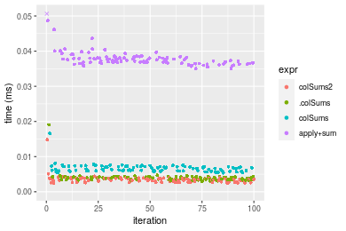
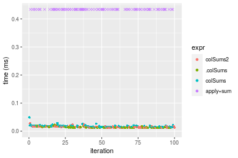
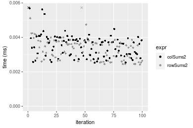
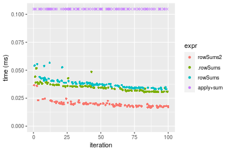
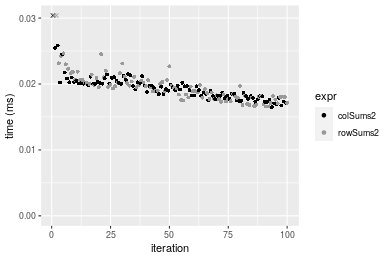
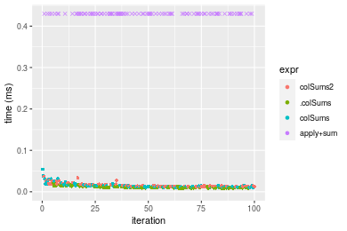
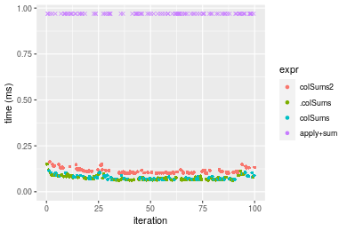
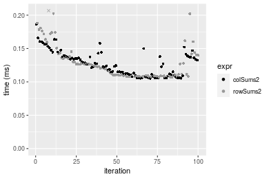

[matrixStats]: Benchmark report

---------------------------------------


# colSums2() and rowSums2() benchmarks

This report benchmark the performance of colSums2() and rowSums2() against alternative methods.

## Alternative methods

* apply() + sum()
* colSums() and rowSums()
* .colSums() and .rowSums()


## Data type "integer"

### Data
```r
> rmatrix <- function(nrow, ncol, mode = c("logical", "double", "integer", "index"), range = c(-100, 
+     +100), na_prob = 0) {
+     mode <- match.arg(mode)
+     n <- nrow * ncol
+     if (mode == "logical") {
+         x <- sample(c(FALSE, TRUE), size = n, replace = TRUE)
+     }     else if (mode == "index") {
+         x <- seq_len(n)
+         mode <- "integer"
+     }     else {
+         x <- runif(n, min = range[1], max = range[2])
+     }
+     storage.mode(x) <- mode
+     if (na_prob > 0) 
+         x[sample(n, size = na_prob * n)] <- NA
+     dim(x) <- c(nrow, ncol)
+     x
+ }
> rmatrices <- function(scale = 10, seed = 1, ...) {
+     set.seed(seed)
+     data <- list()
+     data[[1]] <- rmatrix(nrow = scale * 1, ncol = scale * 1, ...)
+     data[[2]] <- rmatrix(nrow = scale * 10, ncol = scale * 10, ...)
+     data[[3]] <- rmatrix(nrow = scale * 100, ncol = scale * 1, ...)
+     data[[4]] <- t(data[[3]])
+     data[[5]] <- rmatrix(nrow = scale * 10, ncol = scale * 100, ...)
+     data[[6]] <- t(data[[5]])
+     names(data) <- sapply(data, FUN = function(x) paste(dim(x), collapse = "x"))
+     data
+ }
> data <- rmatrices(mode = mode)
```

### Results

#### 10x10 integer matrix

```r
> X <- data[["10x10"]]
> gc()
           used  (Mb) gc trigger  (Mb) max used  (Mb)
Ncells  5254465 280.7   10014072 534.9 10014072 534.9
Vcells 10161255  77.6   18204443 138.9 18204443 138.9
> colStats <- microbenchmark(colSums2 = colSums2(X, na.rm = FALSE), .colSums = .colSums(X, m = nrow(X), 
+     n = ncol(X), na.rm = FALSE), colSums = colSums(X, na.rm = FALSE), `apply+sum` = apply(X, MARGIN = 2L, 
+     FUN = sum, na.rm = FALSE), unit = "ms")
> X <- t(X)
> gc()
           used  (Mb) gc trigger  (Mb) max used  (Mb)
Ncells  5239140 279.9   10014072 534.9 10014072 534.9
Vcells 10110924  77.2   18204443 138.9 18204443 138.9
> rowStats <- microbenchmark(rowSums2 = rowSums2(X, na.rm = FALSE), .rowSums = .rowSums(X, m = nrow(X), 
+     n = ncol(X), na.rm = FALSE), rowSums = rowSums(X, na.rm = FALSE), `apply+sum` = apply(X, MARGIN = 1L, 
+     FUN = sum, na.rm = FALSE), unit = "ms")
```

_Table: Benchmarking of colSums2(), .colSums(), colSums() and apply+sum() on integer+10x10 data. The top panel shows times in milliseconds and the bottom panel shows relative times._


|   |expr      |      min|        lq|      mean|    median|       uq|      max|
|:--|:---------|--------:|---------:|---------:|---------:|--------:|--------:|
|1  |colSums2  | 0.002170| 0.0025135| 0.0030105| 0.0030490| 0.003271| 0.014044|
|2  |.colSums  | 0.003094| 0.0034340| 0.0040188| 0.0038080| 0.004295| 0.019841|
|3  |colSums   | 0.005594| 0.0060710| 0.0068740| 0.0066905| 0.007379| 0.018789|
|4  |apply+sum | 0.036051| 0.0370240| 0.0386547| 0.0378400| 0.038519| 0.106127|


|   |expr      |       min|        lq|      mean|    median|        uq|      max|
|:--|:---------|---------:|---------:|---------:|---------:|---------:|--------:|
|1  |colSums2  |  1.000000|  1.000000|  1.000000|  1.000000|  1.000000| 1.000000|
|2  |.colSums  |  1.425806|  1.366222|  1.334942|  1.248934|  1.313054| 1.412774|
|3  |colSums   |  2.577880|  2.415357|  2.283365|  2.194326|  2.255885| 1.337867|
|4  |apply+sum | 16.613364| 14.730058| 12.840134| 12.410626| 11.775909| 7.556750|

_Table: Benchmarking of rowSums2(), .rowSums(), rowSums() and apply+sum() on integer+10x10 data (transposed). The top panel shows times in milliseconds and the bottom panel shows relative times._


|   |expr      |      min|        lq|      mean|    median|        uq|      max|
|:--|:---------|--------:|---------:|---------:|---------:|---------:|--------:|
|1  |rowSums2  | 0.002145| 0.0024360| 0.0030578| 0.0030960| 0.0033375| 0.013978|
|2  |.rowSums  | 0.004286| 0.0046155| 0.0048921| 0.0047925| 0.0049980| 0.012627|
|3  |rowSums   | 0.006559| 0.0069845| 0.0078611| 0.0075610| 0.0079685| 0.039577|
|4  |apply+sum | 0.035866| 0.0367270| 0.0385324| 0.0373525| 0.0380260| 0.095209|


|   |expr      |       min|        lq|      mean|    median|        uq|       max|
|:--|:---------|---------:|---------:|---------:|---------:|---------:|---------:|
|1  |rowSums2  |  1.000000|  1.000000|  1.000000|  1.000000|  1.000000| 1.0000000|
|2  |.rowSums  |  1.998135|  1.894704|  1.599865|  1.547965|  1.497528| 0.9033481|
|3  |rowSums   |  3.057809|  2.867200|  2.570815|  2.442184|  2.387566| 2.8313779|
|4  |apply+sum | 16.720746| 15.076765| 12.601262| 12.064761| 11.393558| 6.8113464|

_Figure: Benchmarking of colSums2(), .colSums(), colSums() and apply+sum() on integer+10x10 data  as well as rowSums2(), .rowSums(), rowSums() and apply+sum() on the same data transposed.  Outliers are displayed as crosses.  Times are in milliseconds._





_Table: Benchmarking of colSums2() and rowSums2() on integer+10x10 data (original and transposed).  The top panel shows times in milliseconds and the bottom panel shows relative times._


|   |expr     |   min|     lq|    mean| median|     uq|    max|
|:--|:--------|-----:|------:|-------:|------:|------:|------:|
|1  |colSums2 | 2.170| 2.5135| 3.01046|  3.049| 3.2710| 14.044|
|2  |rowSums2 | 2.145| 2.4360| 3.05782|  3.096| 3.3375| 13.978|


|   |expr     |       min|        lq|     mean|   median|      uq|       max|
|:--|:--------|---------:|---------:|--------:|--------:|-------:|---------:|
|1  |colSums2 | 1.0000000| 1.0000000| 1.000000| 1.000000| 1.00000| 1.0000000|
|2  |rowSums2 | 0.9884793| 0.9691665| 1.015732| 1.015415| 1.02033| 0.9953005|

_Figure: Benchmarking of colSums2() and rowSums2() on integer+10x10 data (original and transposed).  Outliers are displayed as crosses. Times are in milliseconds._


#### 100x100 integer matrix

```r
> X <- data[["100x100"]]
> gc()
          used  (Mb) gc trigger  (Mb) max used  (Mb)
Ncells 5237742 279.8   10014072 534.9 10014072 534.9
Vcells 9727770  74.3   18204443 138.9 18204443 138.9
> colStats <- microbenchmark(colSums2 = colSums2(X, na.rm = FALSE), .colSums = .colSums(X, m = nrow(X), 
+     n = ncol(X), na.rm = FALSE), colSums = colSums(X, na.rm = FALSE), `apply+sum` = apply(X, MARGIN = 2L, 
+     FUN = sum, na.rm = FALSE), unit = "ms")
> X <- t(X)
> gc()
          used  (Mb) gc trigger  (Mb) max used  (Mb)
Ncells 5237718 279.8   10014072 534.9 10014072 534.9
Vcells 9732783  74.3   18204443 138.9 18204443 138.9
> rowStats <- microbenchmark(rowSums2 = rowSums2(X, na.rm = FALSE), .rowSums = .rowSums(X, m = nrow(X), 
+     n = ncol(X), na.rm = FALSE), rowSums = rowSums(X, na.rm = FALSE), `apply+sum` = apply(X, MARGIN = 1L, 
+     FUN = sum, na.rm = FALSE), unit = "ms")
```

_Table: Benchmarking of colSums2(), .colSums(), colSums() and apply+sum() on integer+100x100 data. The top panel shows times in milliseconds and the bottom panel shows relative times._


|   |expr      |      min|        lq|      mean|    median|        uq|      max|
|:--|:---------|--------:|---------:|---------:|---------:|---------:|--------:|
|2  |.colSums  | 0.013681| 0.0145640| 0.0156219| 0.0151255| 0.0158490| 0.029016|
|3  |colSums   | 0.016030| 0.0169555| 0.0189453| 0.0180980| 0.0192385| 0.039604|
|1  |colSums2  | 0.026267| 0.0272055| 0.0287506| 0.0275905| 0.0285160| 0.059645|
|4  |apply+sum | 0.203456| 0.2107135| 0.2298388| 0.2161600| 0.2369290| 0.418818|


|   |expr      |       min|        lq|      mean|    median|        uq|       max|
|:--|:---------|---------:|---------:|---------:|---------:|---------:|---------:|
|2  |.colSums  |  1.000000|  1.000000|  1.000000|  1.000000|  1.000000|  1.000000|
|3  |colSums   |  1.171698|  1.164206|  1.212735|  1.196522|  1.213862|  1.364902|
|1  |colSums2  |  1.919962|  1.867996|  1.840400|  1.824105|  1.799230|  2.055590|
|4  |apply+sum | 14.871427| 14.468106| 14.712566| 14.291098| 14.949145| 14.434036|

_Table: Benchmarking of rowSums2(), .rowSums(), rowSums() and apply+sum() on integer+100x100 data (transposed). The top panel shows times in milliseconds and the bottom panel shows relative times._


|   |expr      |      min|       lq|      mean|    median|        uq|      max|
|:--|:---------|--------:|--------:|---------:|---------:|---------:|--------:|
|1  |rowSums2  | 0.034294| 0.036606| 0.0398758| 0.0399290| 0.0418580| 0.055664|
|2  |.rowSums  | 0.056634| 0.057906| 0.0630703| 0.0628405| 0.0660970| 0.086540|
|3  |rowSums   | 0.059797| 0.062671| 0.0678609| 0.0669470| 0.0711210| 0.092645|
|4  |apply+sum | 0.263918| 0.277470| 0.3013847| 0.2928405| 0.3155625| 0.462461|


|   |expr      |      min|       lq|     mean|   median|       uq|      max|
|:--|:---------|--------:|--------:|--------:|--------:|--------:|--------:|
|1  |rowSums2  | 1.000000| 1.000000| 1.000000| 1.000000| 1.000000| 1.000000|
|2  |.rowSums  | 1.651426| 1.581872| 1.581667| 1.573806| 1.579077| 1.554685|
|3  |rowSums   | 1.743658| 1.712042| 1.701807| 1.676651| 1.699102| 1.664361|
|4  |apply+sum | 7.695748| 7.579905| 7.558084| 7.334030| 7.538881| 8.308081|

_Figure: Benchmarking of colSums2(), .colSums(), colSums() and apply+sum() on integer+100x100 data  as well as rowSums2(), .rowSums(), rowSums() and apply+sum() on the same data transposed.  Outliers are displayed as crosses.  Times are in milliseconds._


_Table: Benchmarking of colSums2() and rowSums2() on integer+100x100 data (original and transposed).  The top panel shows times in milliseconds and the bottom panel shows relative times._


|   |expr     |    min|      lq|     mean|  median|     uq|    max|
|:--|:--------|------:|-------:|--------:|-------:|------:|------:|
|1  |colSums2 | 26.267| 27.2055| 28.75062| 27.5905| 28.516| 59.645|
|2  |rowSums2 | 34.294| 36.6060| 39.87581| 39.9290| 41.858| 55.664|


|   |expr     |      min|       lq|     mean|   median|       uq|       max|
|:--|:--------|--------:|--------:|--------:|--------:|--------:|---------:|
|1  |colSums2 | 1.000000| 1.000000| 1.000000| 1.000000| 1.000000| 1.0000000|
|2  |rowSums2 | 1.305593| 1.345537| 1.386955| 1.447201| 1.467878| 0.9332551|

_Figure: Benchmarking of colSums2() and rowSums2() on integer+100x100 data (original and transposed).  Outliers are displayed as crosses. Times are in milliseconds._


#### 1000x10 integer matrix

```r
> X <- data[["1000x10"]]
> gc()
          used  (Mb) gc trigger  (Mb) max used  (Mb)
Ncells 5237165 279.7   10014072 534.9 10014072 534.9
Vcells 9706135  74.1   18204443 138.9 18204443 138.9
> colStats <- microbenchmark(colSums2 = colSums2(X, na.rm = FALSE), .colSums = .colSums(X, m = nrow(X), 
+     n = ncol(X), na.rm = FALSE), colSums = colSums(X, na.rm = FALSE), `apply+sum` = apply(X, MARGIN = 2L, 
+     FUN = sum, na.rm = FALSE), unit = "ms")
> X <- t(X)
> gc()
          used  (Mb) gc trigger  (Mb) max used  (Mb)
Ncells 5237141 279.7   10014072 534.9 10014072 534.9
Vcells 9711148  74.1   18204443 138.9 18204443 138.9
> rowStats <- microbenchmark(rowSums2 = rowSums2(X, na.rm = FALSE), .rowSums = .rowSums(X, m = nrow(X), 
+     n = ncol(X), na.rm = FALSE), rowSums = rowSums(X, na.rm = FALSE), `apply+sum` = apply(X, MARGIN = 1L, 
+     FUN = sum, na.rm = FALSE), unit = "ms")
```

_Table: Benchmarking of colSums2(), .colSums(), colSums() and apply+sum() on integer+1000x10 data. The top panel shows times in milliseconds and the bottom panel shows relative times._


|   |expr      |      min|       lq|      mean|    median|        uq|      max|
|:--|:---------|--------:|--------:|---------:|---------:|---------:|--------:|
|2  |.colSums  | 0.012376| 0.012967| 0.0136648| 0.0135065| 0.0138735| 0.025357|
|3  |colSums   | 0.014511| 0.015397| 0.0165546| 0.0161510| 0.0167370| 0.033814|
|1  |colSums2  | 0.024378| 0.025373| 0.0263236| 0.0262260| 0.0265450| 0.041123|
|4  |apply+sum | 0.099559| 0.102468| 0.1073439| 0.1049195| 0.1096285| 0.204612|


|   |expr      |      min|       lq|     mean|   median|       uq|      max|
|:--|:---------|--------:|--------:|--------:|--------:|--------:|--------:|
|2  |.colSums  | 1.000000| 1.000000| 1.000000| 1.000000| 1.000000| 1.000000|
|3  |colSums   | 1.172511| 1.187399| 1.211473| 1.195795| 1.206401| 1.333517|
|1  |colSums2  | 1.969780| 1.956736| 1.926377| 1.941732| 1.913360| 1.621761|
|4  |apply+sum | 8.044522| 7.902213| 7.855502| 7.768075| 7.902007| 8.069251|

_Table: Benchmarking of rowSums2(), .rowSums(), rowSums() and apply+sum() on integer+1000x10 data (transposed). The top panel shows times in milliseconds and the bottom panel shows relative times._


|   |expr      |      min|        lq|      mean|    median|        uq|      max|
|:--|:---------|--------:|---------:|---------:|---------:|---------:|--------:|
|1  |rowSums2  | 0.022894| 0.0247090| 0.0270977| 0.0260290| 0.0280485| 0.057772|
|4  |apply+sum | 0.094864| 0.1019655| 0.1136075| 0.1080025| 0.1228320| 0.205175|
|2  |.rowSums  | 0.155392| 0.1658925| 0.1798268| 0.1718585| 0.1946885| 0.221572|
|3  |rowSums   | 0.157289| 0.1690965| 0.1821951| 0.1749315| 0.1936760| 0.229383|


|   |expr      |      min|       lq|     mean|   median|       uq|      max|
|:--|:---------|--------:|--------:|--------:|--------:|--------:|--------:|
|1  |rowSums2  | 1.000000| 1.000000| 1.000000| 1.000000| 1.000000| 1.000000|
|4  |apply+sum | 4.143618| 4.126654| 4.192519| 4.149314| 4.379272| 3.551461|
|2  |.rowSums  | 6.787455| 6.713849| 6.636245| 6.602578| 6.941138| 3.835284|
|3  |rowSums   | 6.870315| 6.843519| 6.723643| 6.720638| 6.905039| 3.970487|

_Figure: Benchmarking of colSums2(), .colSums(), colSums() and apply+sum() on integer+1000x10 data  as well as rowSums2(), .rowSums(), rowSums() and apply+sum() on the same data transposed.  Outliers are displayed as crosses.  Times are in milliseconds._


_Table: Benchmarking of colSums2() and rowSums2() on integer+1000x10 data (original and transposed).  The top panel shows times in milliseconds and the bottom panel shows relative times._


|   |expr     |    min|     lq|     mean| median|      uq|    max|
|:--|:--------|------:|------:|--------:|------:|-------:|------:|
|2  |rowSums2 | 22.894| 24.709| 27.09768| 26.029| 28.0485| 57.772|
|1  |colSums2 | 24.378| 25.373| 26.32357| 26.226| 26.5450| 41.123|


|   |expr     |     min|       lq|      mean|   median|        uq|       max|
|:--|:--------|-------:|--------:|---------:|--------:|---------:|---------:|
|2  |rowSums2 | 1.00000| 1.000000| 1.0000000| 1.000000| 1.0000000| 1.0000000|
|1  |colSums2 | 1.06482| 1.026873| 0.9714326| 1.007569| 0.9463964| 0.7118154|

_Figure: Benchmarking of colSums2() and rowSums2() on integer+1000x10 data (original and transposed).  Outliers are displayed as crosses. Times are in milliseconds._


#### 10x1000 integer matrix

```r
> X <- data[["10x1000"]]
> gc()
          used  (Mb) gc trigger  (Mb) max used  (Mb)
Ncells 5237388 279.8   10014072 534.9 10014072 534.9
Vcells 9706945  74.1   18204443 138.9 18204443 138.9
> colStats <- microbenchmark(colSums2 = colSums2(X, na.rm = FALSE), .colSums = .colSums(X, m = nrow(X), 
+     n = ncol(X), na.rm = FALSE), colSums = colSums(X, na.rm = FALSE), `apply+sum` = apply(X, MARGIN = 2L, 
+     FUN = sum, na.rm = FALSE), unit = "ms")
> X <- t(X)
> gc()
          used  (Mb) gc trigger  (Mb) max used  (Mb)
Ncells 5237364 279.8   10014072 534.9 10014072 534.9
Vcells 9711958  74.1   18204443 138.9 18204443 138.9
> rowStats <- microbenchmark(rowSums2 = rowSums2(X, na.rm = FALSE), .rowSums = .rowSums(X, m = nrow(X), 
+     n = ncol(X), na.rm = FALSE), rowSums = rowSums(X, na.rm = FALSE), `apply+sum` = apply(X, MARGIN = 1L, 
+     FUN = sum, na.rm = FALSE), unit = "ms")
```

_Table: Benchmarking of colSums2(), .colSums(), colSums() and apply+sum() on integer+10x1000 data. The top panel shows times in milliseconds and the bottom panel shows relative times._


|   |expr      |      min|        lq|      mean|    median|        uq|      max|
|:--|:---------|--------:|---------:|---------:|---------:|---------:|--------:|
|2  |.colSums  | 0.011727| 0.0124180| 0.0146588| 0.0138130| 0.0165855| 0.024603|
|3  |colSums   | 0.013600| 0.0147650| 0.0178612| 0.0162335| 0.0200240| 0.054910|
|1  |colSums2  | 0.022435| 0.0232380| 0.0270534| 0.0240850| 0.0305995| 0.048345|
|4  |apply+sum | 0.923663| 0.9626655| 1.0772939| 1.0207310| 1.1618430| 1.517416|


|   |expr      |       min|        lq|      mean|    median|        uq|       max|
|:--|:---------|---------:|---------:|---------:|---------:|---------:|---------:|
|2  |.colSums  |  1.000000|  1.000000|  1.000000|  1.000000|  1.000000|  1.000000|
|3  |colSums   |  1.159717|  1.189000|  1.218461|  1.175234|  1.207320|  2.231842|
|1  |colSums2  |  1.913107|  1.871316|  1.845537|  1.743647|  1.844955|  1.965004|
|4  |apply+sum | 78.763793| 77.521783| 73.491274| 73.896402| 70.051732| 61.676056|

_Table: Benchmarking of rowSums2(), .rowSums(), rowSums() and apply+sum() on integer+10x1000 data (transposed). The top panel shows times in milliseconds and the bottom panel shows relative times._


|   |expr      |      min|        lq|      mean|    median|        uq|      max|
|:--|:---------|--------:|---------:|---------:|---------:|---------:|--------:|
|1  |rowSums2  | 0.021915| 0.0229085| 0.0260445| 0.0245165| 0.0270440| 0.057143|
|2  |.rowSums  | 0.024503| 0.0250500| 0.0275298| 0.0259800| 0.0283555| 0.046749|
|3  |rowSums   | 0.025971| 0.0268475| 0.0303776| 0.0279625| 0.0319885| 0.055184|
|4  |apply+sum | 0.906802| 0.9520240| 1.0562792| 0.9999260| 1.1424770| 1.504220|


|   |expr      |       min|        lq|      mean|    median|        uq|        max|
|:--|:---------|---------:|---------:|---------:|---------:|---------:|----------:|
|1  |rowSums2  |  1.000000|  1.000000|  1.000000|  1.000000|  1.000000|  1.0000000|
|2  |.rowSums  |  1.118093|  1.093481|  1.057028|  1.059694|  1.048495|  0.8181055|
|3  |rowSums   |  1.185079|  1.171945|  1.166373|  1.140558|  1.182832|  0.9657176|
|4  |apply+sum | 41.378143| 41.557675| 40.556694| 40.785838| 42.245119| 26.3237842|

_Figure: Benchmarking of colSums2(), .colSums(), colSums() and apply+sum() on integer+10x1000 data  as well as rowSums2(), .rowSums(), rowSums() and apply+sum() on the same data transposed.  Outliers are displayed as crosses.  Times are in milliseconds._





_Table: Benchmarking of colSums2() and rowSums2() on integer+10x1000 data (original and transposed).  The top panel shows times in milliseconds and the bottom panel shows relative times._


|   |expr     |    min|      lq|     mean|  median|      uq|    max|
|:--|:--------|------:|-------:|--------:|-------:|-------:|------:|
|1  |colSums2 | 22.435| 23.2380| 27.05336| 24.0850| 30.5995| 48.345|
|2  |rowSums2 | 21.915| 22.9085| 26.04451| 24.5165| 27.0440| 57.143|


|   |expr     |       min|        lq|      mean|   median|        uq|      max|
|:--|:--------|---------:|---------:|---------:|--------:|---------:|--------:|
|1  |colSums2 | 1.0000000| 1.0000000| 1.0000000| 1.000000| 1.0000000| 1.000000|
|2  |rowSums2 | 0.9768219| 0.9858206| 0.9627089| 1.017916| 0.8838053| 1.181984|

_Figure: Benchmarking of colSums2() and rowSums2() on integer+10x1000 data (original and transposed).  Outliers are displayed as crosses. Times are in milliseconds._


#### 100x1000 integer matrix

```r
> X <- data[["100x1000"]]
> gc()
          used  (Mb) gc trigger  (Mb) max used  (Mb)
Ncells 5237618 279.8   10014072 534.9 10014072 534.9
Vcells 9707538  74.1   18204443 138.9 18204443 138.9
> colStats <- microbenchmark(colSums2 = colSums2(X, na.rm = FALSE), .colSums = .colSums(X, m = nrow(X), 
+     n = ncol(X), na.rm = FALSE), colSums = colSums(X, na.rm = FALSE), `apply+sum` = apply(X, MARGIN = 2L, 
+     FUN = sum, na.rm = FALSE), unit = "ms")
> X <- t(X)
> gc()
          used  (Mb) gc trigger  (Mb) max used  (Mb)
Ncells 5237594 279.8   10014072 534.9 10014072 534.9
Vcells 9757551  74.5   18204443 138.9 18204443 138.9
> rowStats <- microbenchmark(rowSums2 = rowSums2(X, na.rm = FALSE), .rowSums = .rowSums(X, m = nrow(X), 
+     n = ncol(X), na.rm = FALSE), rowSums = rowSums(X, na.rm = FALSE), `apply+sum` = apply(X, MARGIN = 1L, 
+     FUN = sum, na.rm = FALSE), unit = "ms")
```

_Table: Benchmarking of colSums2(), .colSums(), colSums() and apply+sum() on integer+100x1000 data. The top panel shows times in milliseconds and the bottom panel shows relative times._


|   |expr      |      min|        lq|      mean|    median|        uq|       max|
|:--|:---------|--------:|---------:|---------:|---------:|---------:|---------:|
|2  |.colSums  | 0.087380| 0.0878715| 0.0983978| 0.0902265| 0.1040140|  0.168366|
|3  |colSums   | 0.089475| 0.0904205| 0.0990424| 0.0921365| 0.0999745|  0.157068|
|1  |colSums2  | 0.190750| 0.1918470| 0.2115945| 0.1953770| 0.2203500|  0.322038|
|4  |apply+sum | 1.440784| 1.4955735| 1.7874925| 1.5268300| 1.8012170| 15.015738|


|   |expr      |       min|        lq|      mean|    median|         uq|        max|
|:--|:---------|---------:|---------:|---------:|---------:|----------:|----------:|
|2  |.colSums  |  1.000000|  1.000000|  1.000000|  1.000000|  1.0000000|  1.0000000|
|3  |colSums   |  1.023976|  1.029008|  1.006551|  1.021169|  0.9611639|  0.9328962|
|1  |colSums2  |  2.182994|  2.183268|  2.150400|  2.165406|  2.1184648|  1.9127258|
|4  |apply+sum | 16.488716| 17.020007| 18.165988| 16.922190| 17.3170631| 89.1850968|

_Table: Benchmarking of rowSums2(), .rowSums(), rowSums() and apply+sum() on integer+100x1000 data (transposed). The top panel shows times in milliseconds and the bottom panel shows relative times._


|   |expr      |      min|        lq|      mean|    median|        uq|       max|
|:--|:---------|--------:|---------:|---------:|---------:|---------:|---------:|
|1  |rowSums2  | 0.190804| 0.1916945| 0.2117600| 0.1949470| 0.2325765|  0.321904|
|2  |.rowSums  | 0.219890| 0.2205815| 0.2460262| 0.2260195| 0.2644395|  0.379762|
|3  |rowSums   | 0.222188| 0.2233190| 0.2461471| 0.2267870| 0.2708440|  0.363030|
|4  |apply+sum | 1.442619| 1.4703520| 1.7304334| 1.5111025| 1.6285200| 14.287070|


|   |expr      |      min|       lq|     mean|   median|       uq|       max|
|:--|:---------|--------:|--------:|--------:|--------:|--------:|---------:|
|1  |rowSums2  | 1.000000| 1.000000| 1.000000| 1.000000| 1.000000|  1.000000|
|2  |.rowSums  | 1.152439| 1.150693| 1.161816| 1.159390| 1.137000|  1.179737|
|3  |rowSums   | 1.164483| 1.164973| 1.162387| 1.163326| 1.164537|  1.127759|
|4  |apply+sum | 7.560738| 7.670288| 8.171674| 7.751350| 7.002083| 44.383015|

_Figure: Benchmarking of colSums2(), .colSums(), colSums() and apply+sum() on integer+100x1000 data  as well as rowSums2(), .rowSums(), rowSums() and apply+sum() on the same data transposed.  Outliers are displayed as crosses.  Times are in milliseconds._


_Table: Benchmarking of colSums2() and rowSums2() on integer+100x1000 data (original and transposed).  The top panel shows times in milliseconds and the bottom panel shows relative times._


|   |expr     |     min|       lq|     mean|  median|       uq|     max|
|:--|:--------|-------:|--------:|--------:|-------:|--------:|-------:|
|2  |rowSums2 | 190.804| 191.6945| 211.7600| 194.947| 232.5765| 321.904|
|1  |colSums2 | 190.750| 191.8470| 211.5945| 195.377| 220.3500| 322.038|


|   |expr     |      min|       lq|      mean|   median|        uq|      max|
|:--|:--------|--------:|--------:|---------:|--------:|---------:|--------:|
|2  |rowSums2 | 1.000000| 1.000000| 1.0000000| 1.000000| 1.0000000| 1.000000|
|1  |colSums2 | 0.999717| 1.000795| 0.9992187| 1.002206| 0.9474302| 1.000416|

_Figure: Benchmarking of colSums2() and rowSums2() on integer+100x1000 data (original and transposed).  Outliers are displayed as crosses. Times are in milliseconds._


#### 1000x100 integer matrix

```r
> X <- data[["1000x100"]]
> gc()
          used  (Mb) gc trigger  (Mb) max used  (Mb)
Ncells 5237830 279.8   10014072 534.9 10014072 534.9
Vcells 9708218  74.1   18204443 138.9 18204443 138.9
> colStats <- microbenchmark(colSums2 = colSums2(X, na.rm = FALSE), .colSums = .colSums(X, m = nrow(X), 
+     n = ncol(X), na.rm = FALSE), colSums = colSums(X, na.rm = FALSE), `apply+sum` = apply(X, MARGIN = 2L, 
+     FUN = sum, na.rm = FALSE), unit = "ms")
> X <- t(X)
> gc()
          used  (Mb) gc trigger  (Mb) max used  (Mb)
Ncells 5237818 279.8   10014072 534.9 10014072 534.9
Vcells 9758251  74.5   18204443 138.9 18204443 138.9
> rowStats <- microbenchmark(rowSums2 = rowSums2(X, na.rm = FALSE), .rowSums = .rowSums(X, m = nrow(X), 
+     n = ncol(X), na.rm = FALSE), rowSums = rowSums(X, na.rm = FALSE), `apply+sum` = apply(X, MARGIN = 1L, 
+     FUN = sum, na.rm = FALSE), unit = "ms")
```

_Table: Benchmarking of colSums2(), .colSums(), colSums() and apply+sum() on integer+1000x100 data. The top panel shows times in milliseconds and the bottom panel shows relative times._


|   |expr      |      min|        lq|      mean|    median|        uq|      max|
|:--|:---------|--------:|---------:|---------:|---------:|---------:|--------:|
|2  |.colSums  | 0.081021| 0.0885160| 0.0985698| 0.0979685| 0.1028845| 0.148683|
|3  |colSums   | 0.083248| 0.0927465| 0.1018400| 0.1017860| 0.1082095| 0.145663|
|1  |colSums2  | 0.183065| 0.1991235| 0.2200622| 0.2192880| 0.2329020| 0.310366|
|4  |apply+sum | 0.646961| 0.7076960| 0.8650469| 0.7789845| 0.8563620| 7.957962|


|   |expr      |      min|       lq|     mean|   median|       uq|        max|
|:--|:---------|--------:|--------:|--------:|--------:|--------:|----------:|
|2  |.colSums  | 1.000000| 1.000000| 1.000000| 1.000000| 1.000000|  1.0000000|
|3  |colSums   | 1.027487| 1.047794| 1.033177| 1.038967| 1.051757|  0.9796883|
|1  |colSums2  | 2.259476| 2.249576| 2.232552| 2.238352| 2.263723|  2.0874343|
|4  |apply+sum | 7.985103| 7.995120| 8.775983| 7.951377| 8.323528| 53.5230120|

_Table: Benchmarking of rowSums2(), .rowSums(), rowSums() and apply+sum() on integer+1000x100 data (transposed). The top panel shows times in milliseconds and the bottom panel shows relative times._


|   |expr      |      min|       lq|      mean|    median|        uq|      max|
|:--|:---------|--------:|--------:|---------:|---------:|---------:|--------:|
|1  |rowSums2  | 0.183315| 0.184484| 0.2063118| 0.1898375| 0.2267745| 0.311645|
|2  |.rowSums  | 0.319767| 0.320691| 0.3571413| 0.3287765| 0.3910445| 0.539940|
|3  |rowSums   | 0.322173| 0.324440| 0.3678856| 0.3590875| 0.4031505| 0.537550|
|4  |apply+sum | 0.643168| 0.662184| 0.8271901| 0.7168555| 0.8327525| 7.536326|


|   |expr      |      min|       lq|     mean|   median|       uq|       max|
|:--|:---------|--------:|--------:|--------:|--------:|--------:|---------:|
|1  |rowSums2  | 1.000000| 1.000000| 1.000000| 1.000000| 1.000000|  1.000000|
|2  |.rowSums  | 1.744358| 1.738313| 1.731076| 1.731884| 1.724376|  1.732548|
|3  |rowSums   | 1.757483| 1.758635| 1.783154| 1.891552| 1.777759|  1.724879|
|4  |apply+sum | 3.508540| 3.589384| 4.009418| 3.776153| 3.672161| 24.182406|

_Figure: Benchmarking of colSums2(), .colSums(), colSums() and apply+sum() on integer+1000x100 data  as well as rowSums2(), .rowSums(), rowSums() and apply+sum() on the same data transposed.  Outliers are displayed as crosses.  Times are in milliseconds._


_Table: Benchmarking of colSums2() and rowSums2() on integer+1000x100 data (original and transposed).  The top panel shows times in milliseconds and the bottom panel shows relative times._


|   |expr     |     min|       lq|     mean|   median|       uq|     max|
|:--|:--------|-------:|--------:|--------:|--------:|--------:|-------:|
|2  |rowSums2 | 183.315| 184.4840| 206.3117| 189.8375| 226.7745| 311.645|
|1  |colSums2 | 183.065| 199.1235| 220.0622| 219.2880| 232.9020| 310.366|


|   |expr     |       min|       lq|     mean|   median|      uq|      max|
|:--|:--------|---------:|--------:|--------:|--------:|-------:|--------:|
|2  |rowSums2 | 1.0000000| 1.000000| 1.000000| 1.000000| 1.00000| 1.000000|
|1  |colSums2 | 0.9986362| 1.079354| 1.066649| 1.155135| 1.02702| 0.995896|

_Figure: Benchmarking of colSums2() and rowSums2() on integer+1000x100 data (original and transposed).  Outliers are displayed as crosses. Times are in milliseconds._


## Data type "double"

### Data
```r
> rmatrix <- function(nrow, ncol, mode = c("logical", "double", "integer", "index"), range = c(-100, 
+     +100), na_prob = 0) {
+     mode <- match.arg(mode)
+     n <- nrow * ncol
+     if (mode == "logical") {
+         x <- sample(c(FALSE, TRUE), size = n, replace = TRUE)
+     }     else if (mode == "index") {
+         x <- seq_len(n)
+         mode <- "integer"
+     }     else {
+         x <- runif(n, min = range[1], max = range[2])
+     }
+     storage.mode(x) <- mode
+     if (na_prob > 0) 
+         x[sample(n, size = na_prob * n)] <- NA
+     dim(x) <- c(nrow, ncol)
+     x
+ }
> rmatrices <- function(scale = 10, seed = 1, ...) {
+     set.seed(seed)
+     data <- list()
+     data[[1]] <- rmatrix(nrow = scale * 1, ncol = scale * 1, ...)
+     data[[2]] <- rmatrix(nrow = scale * 10, ncol = scale * 10, ...)
+     data[[3]] <- rmatrix(nrow = scale * 100, ncol = scale * 1, ...)
+     data[[4]] <- t(data[[3]])
+     data[[5]] <- rmatrix(nrow = scale * 10, ncol = scale * 100, ...)
+     data[[6]] <- t(data[[5]])
+     names(data) <- sapply(data, FUN = function(x) paste(dim(x), collapse = "x"))
+     data
+ }
> data <- rmatrices(mode = mode)
```

### Results

#### 10x10 double matrix

```r
> X <- data[["10x10"]]
> gc()
          used  (Mb) gc trigger  (Mb) max used  (Mb)
Ncells 5238073 279.8   10014072 534.9 10014072 534.9
Vcells 9824152  75.0   18204443 138.9 18204443 138.9
> colStats <- microbenchmark(colSums2 = colSums2(X, na.rm = FALSE), .colSums = .colSums(X, m = nrow(X), 
+     n = ncol(X), na.rm = FALSE), colSums = colSums(X, na.rm = FALSE), `apply+sum` = apply(X, MARGIN = 2L, 
+     FUN = sum, na.rm = FALSE), unit = "ms")
> X <- t(X)
> gc()
          used  (Mb) gc trigger  (Mb) max used  (Mb)
Ncells 5238040 279.8   10014072 534.9 10014072 534.9
Vcells 9824250  75.0   18204443 138.9 18204443 138.9
> rowStats <- microbenchmark(rowSums2 = rowSums2(X, na.rm = FALSE), .rowSums = .rowSums(X, m = nrow(X), 
+     n = ncol(X), na.rm = FALSE), rowSums = rowSums(X, na.rm = FALSE), `apply+sum` = apply(X, MARGIN = 1L, 
+     FUN = sum, na.rm = FALSE), unit = "ms")
```

_Table: Benchmarking of colSums2(), .colSums(), colSums() and apply+sum() on double+10x10 data. The top panel shows times in milliseconds and the bottom panel shows relative times._


|   |expr      |      min|        lq|      mean|    median|       uq|      max|
|:--|:---------|--------:|---------:|---------:|---------:|--------:|--------:|
|1  |colSums2  | 0.002127| 0.0025175| 0.0030998| 0.0031200| 0.003338| 0.014073|
|2  |.colSums  | 0.003074| 0.0033950| 0.0039415| 0.0037040| 0.004360| 0.013799|
|3  |colSums   | 0.005499| 0.0060290| 0.0070317| 0.0066165| 0.007539| 0.021417|
|4  |apply+sum | 0.036190| 0.0372860| 0.0395430| 0.0377620| 0.038687| 0.107503|


|   |expr      |       min|        lq|      mean|    median|        uq|       max|
|:--|:---------|---------:|---------:|---------:|---------:|---------:|---------:|
|1  |colSums2  |  1.000000|  1.000000|  1.000000|  1.000000|  1.000000| 1.0000000|
|2  |.colSums  |  1.445228|  1.348560|  1.271510|  1.187180|  1.306171| 0.9805301|
|3  |colSums   |  2.585332|  2.394836|  2.268413|  2.120673|  2.258538| 1.5218504|
|4  |apply+sum | 17.014574| 14.810725| 12.756424| 12.103205| 11.589874| 7.6389540|

_Table: Benchmarking of rowSums2(), .rowSums(), rowSums() and apply+sum() on double+10x10 data (transposed). The top panel shows times in milliseconds and the bottom panel shows relative times._


|   |expr      |      min|        lq|      mean|    median|        uq|      max|
|:--|:---------|--------:|---------:|---------:|---------:|---------:|--------:|
|2  |.rowSums  | 0.002487| 0.0027455| 0.0030369| 0.0029995| 0.0031940| 0.008608|
|1  |rowSums2  | 0.002134| 0.0023985| 0.0030018| 0.0030740| 0.0033080| 0.013804|
|3  |rowSums   | 0.004630| 0.0051470| 0.0059578| 0.0058335| 0.0062195| 0.028189|
|4  |apply+sum | 0.036395| 0.0371260| 0.0384526| 0.0375450| 0.0383105| 0.087726|


|   |expr      |        min|         lq|       mean|    median|        uq|       max|
|:--|:---------|----------:|----------:|----------:|---------:|---------:|---------:|
|2  |.rowSums  |  1.0000000|  1.0000000|  1.0000000|  1.000000|  1.000000|  1.000000|
|1  |rowSums2  |  0.8580619|  0.8736114|  0.9884684|  1.024838|  1.035692|  1.603625|
|3  |rowSums   |  1.8616807|  1.8747041|  1.9618390|  1.944824|  1.947245|  3.274744|
|4  |apply+sum | 14.6340973| 13.5224913| 12.6619118| 12.517086| 11.994521| 10.191218|

_Figure: Benchmarking of colSums2(), .colSums(), colSums() and apply+sum() on double+10x10 data  as well as rowSums2(), .rowSums(), rowSums() and apply+sum() on the same data transposed.  Outliers are displayed as crosses.  Times are in milliseconds._


_Table: Benchmarking of colSums2() and rowSums2() on double+10x10 data (original and transposed).  The top panel shows times in milliseconds and the bottom panel shows relative times._


|   |expr     |   min|     lq|    mean| median|    uq|    max|
|:--|:--------|-----:|------:|-------:|------:|-----:|------:|
|2  |rowSums2 | 2.134| 2.3985| 3.00185|  3.074| 3.308| 13.804|
|1  |colSums2 | 2.127| 2.5175| 3.09985|  3.120| 3.338| 14.073|


|   |expr     |       min|       lq|     mean|   median|       uq|      max|
|:--|:--------|---------:|--------:|--------:|--------:|--------:|--------:|
|2  |rowSums2 | 1.0000000| 1.000000| 1.000000| 1.000000| 1.000000| 1.000000|
|1  |colSums2 | 0.9967198| 1.049614| 1.032647| 1.014964| 1.009069| 1.019487|

_Figure: Benchmarking of colSums2() and rowSums2() on double+10x10 data (original and transposed).  Outliers are displayed as crosses. Times are in milliseconds._




#### 100x100 double matrix

```r
> X <- data[["100x100"]]
> gc()
          used  (Mb) gc trigger  (Mb) max used  (Mb)
Ncells 5238292 279.8   10014072 534.9 10014072 534.9
Vcells 9825168  75.0   18204443 138.9 18204443 138.9
> colStats <- microbenchmark(colSums2 = colSums2(X, na.rm = FALSE), .colSums = .colSums(X, m = nrow(X), 
+     n = ncol(X), na.rm = FALSE), colSums = colSums(X, na.rm = FALSE), `apply+sum` = apply(X, MARGIN = 2L, 
+     FUN = sum, na.rm = FALSE), unit = "ms")
> X <- t(X)
> gc()
          used  (Mb) gc trigger  (Mb) max used  (Mb)
Ncells 5238268 279.8   10014072 534.9 10014072 534.9
Vcells 9835181  75.1   18204443 138.9 18204443 138.9
> rowStats <- microbenchmark(rowSums2 = rowSums2(X, na.rm = FALSE), .rowSums = .rowSums(X, m = nrow(X), 
+     n = ncol(X), na.rm = FALSE), rowSums = rowSums(X, na.rm = FALSE), `apply+sum` = apply(X, MARGIN = 1L, 
+     FUN = sum, na.rm = FALSE), unit = "ms")
```

_Table: Benchmarking of colSums2(), .colSums(), colSums() and apply+sum() on double+100x100 data. The top panel shows times in milliseconds and the bottom panel shows relative times._


|   |expr      |      min|        lq|      mean|    median|        uq|      max|
|:--|:---------|--------:|---------:|---------:|---------:|---------:|--------:|
|2  |.colSums  | 0.010637| 0.0117100| 0.0131635| 0.0124550| 0.0137320| 0.024691|
|3  |colSums   | 0.012985| 0.0146215| 0.0166312| 0.0154325| 0.0170735| 0.034117|
|1  |colSums2  | 0.020294| 0.0214130| 0.0243341| 0.0230595| 0.0244575| 0.049829|
|4  |apply+sum | 0.209903| 0.2166505| 0.2550121| 0.2329015| 0.2673650| 0.480712|


|   |expr      |       min|        lq|      mean|    median|        uq|       max|
|:--|:---------|---------:|---------:|---------:|---------:|---------:|---------:|
|2  |.colSums  |  1.000000|  1.000000|  1.000000|  1.000000|  1.000000|  1.000000|
|3  |colSums   |  1.220739|  1.248634|  1.263436|  1.239061|  1.243337|  1.381758|
|1  |colSums2  |  1.907869|  1.828608|  1.848605|  1.851425|  1.781059|  2.018104|
|4  |apply+sum | 19.733290| 18.501324| 19.372678| 18.699438| 19.470216| 19.469118|

_Table: Benchmarking of rowSums2(), .rowSums(), rowSums() and apply+sum() on double+100x100 data (transposed). The top panel shows times in milliseconds and the bottom panel shows relative times._


|   |expr      |      min|        lq|      mean|    median|        uq|      max|
|:--|:---------|--------:|---------:|---------:|---------:|---------:|--------:|
|1  |rowSums2  | 0.023183| 0.0251285| 0.0282563| 0.0278135| 0.0302870| 0.050228|
|2  |.rowSums  | 0.028856| 0.0303350| 0.0338459| 0.0323535| 0.0375180| 0.059339|
|3  |rowSums   | 0.030988| 0.0336365| 0.0371211| 0.0360175| 0.0407675| 0.050918|
|4  |apply+sum | 0.206647| 0.2186565| 0.2480465| 0.2349165| 0.2748215| 0.442304|


|   |expr      |      min|       lq|     mean|   median|       uq|      max|
|:--|:---------|--------:|--------:|--------:|--------:|--------:|--------:|
|1  |rowSums2  | 1.000000| 1.000000| 1.000000| 1.000000| 1.000000| 1.000000|
|2  |.rowSums  | 1.244705| 1.207195| 1.197820| 1.163230| 1.238749| 1.181393|
|3  |rowSums   | 1.336669| 1.338580| 1.313729| 1.294965| 1.346040| 1.013737|
|4  |apply+sum | 8.913730| 8.701534| 8.778458| 8.446132| 9.073910| 8.805925|

_Figure: Benchmarking of colSums2(), .colSums(), colSums() and apply+sum() on double+100x100 data  as well as rowSums2(), .rowSums(), rowSums() and apply+sum() on the same data transposed.  Outliers are displayed as crosses.  Times are in milliseconds._


_Table: Benchmarking of colSums2() and rowSums2() on double+100x100 data (original and transposed).  The top panel shows times in milliseconds and the bottom panel shows relative times._


|   |expr     |    min|      lq|     mean|  median|      uq|    max|
|:--|:--------|------:|-------:|--------:|-------:|-------:|------:|
|1  |colSums2 | 20.294| 21.4130| 24.33410| 23.0595| 24.4575| 49.829|
|2  |rowSums2 | 23.183| 25.1285| 28.25627| 27.8135| 30.2870| 50.228|


|   |expr     |      min|       lq|    mean|   median|       uq|      max|
|:--|:--------|--------:|--------:|-------:|--------:|--------:|--------:|
|1  |colSums2 | 1.000000| 1.000000| 1.00000| 1.000000| 1.000000| 1.000000|
|2  |rowSums2 | 1.142357| 1.173516| 1.16118| 1.206162| 1.238352| 1.008007|

_Figure: Benchmarking of colSums2() and rowSums2() on double+100x100 data (original and transposed).  Outliers are displayed as crosses. Times are in milliseconds._


#### 1000x10 double matrix

```r
> X <- data[["1000x10"]]
> gc()
          used  (Mb) gc trigger  (Mb) max used  (Mb)
Ncells 5238515 279.8   10014072 534.9 10014072 534.9
Vcells 9826266  75.0   18204443 138.9 18204443 138.9
> colStats <- microbenchmark(colSums2 = colSums2(X, na.rm = FALSE), .colSums = .colSums(X, m = nrow(X), 
+     n = ncol(X), na.rm = FALSE), colSums = colSums(X, na.rm = FALSE), `apply+sum` = apply(X, MARGIN = 2L, 
+     FUN = sum, na.rm = FALSE), unit = "ms")
> X <- t(X)
> gc()
          used  (Mb) gc trigger  (Mb) max used  (Mb)
Ncells 5238491 279.8   10014072 534.9 10014072 534.9
Vcells 9836279  75.1   18204443 138.9 18204443 138.9
> rowStats <- microbenchmark(rowSums2 = rowSums2(X, na.rm = FALSE), .rowSums = .rowSums(X, m = nrow(X), 
+     n = ncol(X), na.rm = FALSE), rowSums = rowSums(X, na.rm = FALSE), `apply+sum` = apply(X, MARGIN = 1L, 
+     FUN = sum, na.rm = FALSE), unit = "ms")
```

_Table: Benchmarking of colSums2(), .colSums(), colSums() and apply+sum() on double+1000x10 data. The top panel shows times in milliseconds and the bottom panel shows relative times._


|   |expr      |      min|        lq|      mean|    median|        uq|      max|
|:--|:---------|--------:|---------:|---------:|---------:|---------:|--------:|
|2  |.colSums  | 0.013319| 0.0148515| 0.0157188| 0.0157670| 0.0163635| 0.021917|
|3  |colSums   | 0.015990| 0.0178020| 0.0191081| 0.0188015| 0.0200030| 0.036264|
|1  |colSums2  | 0.020274| 0.0223785| 0.0238217| 0.0236365| 0.0246345| 0.039254|
|4  |apply+sum | 0.119792| 0.1295310| 0.1376111| 0.1388255| 0.1420235| 0.233068|


|   |expr      |      min|       lq|     mean|   median|       uq|       max|
|:--|:---------|--------:|--------:|--------:|--------:|--------:|---------:|
|2  |.colSums  | 1.000000| 1.000000| 1.000000| 1.000000| 1.000000|  1.000000|
|3  |colSums   | 1.200541| 1.198667| 1.215618| 1.192459| 1.222416|  1.654606|
|1  |colSums2  | 1.522186| 1.506817| 1.515489| 1.499112| 1.505454|  1.791030|
|4  |apply+sum | 8.994069| 8.721745| 8.754544| 8.804814| 8.679286| 10.634120|

_Table: Benchmarking of rowSums2(), .rowSums(), rowSums() and apply+sum() on double+1000x10 data (transposed). The top panel shows times in milliseconds and the bottom panel shows relative times._


|   |expr      |      min|        lq|      mean|    median|        uq|      max|
|:--|:---------|--------:|---------:|---------:|---------:|---------:|--------:|
|1  |rowSums2  | 0.021960| 0.0239415| 0.0260903| 0.0256520| 0.0276475| 0.042914|
|2  |.rowSums  | 0.030365| 0.0323720| 0.0351092| 0.0353220| 0.0381030| 0.043079|
|3  |rowSums   | 0.032943| 0.0358000| 0.0383522| 0.0378735| 0.0409180| 0.053474|
|4  |apply+sum | 0.112931| 0.1211200| 0.1314412| 0.1304475| 0.1408805| 0.223974|


|   |expr      |      min|       lq|     mean|   median|       uq|      max|
|:--|:---------|--------:|--------:|--------:|--------:|--------:|--------:|
|1  |rowSums2  | 1.000000| 1.000000| 1.000000| 1.000000| 1.000000| 1.000000|
|2  |.rowSums  | 1.382741| 1.352129| 1.345680| 1.376969| 1.378172| 1.003845|
|3  |rowSums   | 1.500137| 1.495311| 1.469983| 1.476435| 1.479989| 1.246074|
|4  |apply+sum | 5.142577| 5.058998| 5.037942| 5.085276| 5.095596| 5.219136|

_Figure: Benchmarking of colSums2(), .colSums(), colSums() and apply+sum() on double+1000x10 data  as well as rowSums2(), .rowSums(), rowSums() and apply+sum() on the same data transposed.  Outliers are displayed as crosses.  Times are in milliseconds._



_Table: Benchmarking of colSums2() and rowSums2() on double+1000x10 data (original and transposed).  The top panel shows times in milliseconds and the bottom panel shows relative times._


|   |expr     |    min|      lq|     mean|  median|      uq|    max|
|:--|:--------|------:|-------:|--------:|-------:|-------:|------:|
|1  |colSums2 | 20.274| 22.3785| 23.82170| 23.6365| 24.6345| 39.254|
|2  |rowSums2 | 21.960| 23.9415| 26.09026| 25.6520| 27.6475| 42.914|


|   |expr     |      min|       lq|     mean|   median|       uq|      max|
|:--|:--------|--------:|--------:|--------:|--------:|--------:|--------:|
|1  |colSums2 | 1.000000| 1.000000| 1.000000| 1.000000| 1.000000| 1.000000|
|2  |rowSums2 | 1.083161| 1.069844| 1.095231| 1.085271| 1.122308| 1.093239|

_Figure: Benchmarking of colSums2() and rowSums2() on double+1000x10 data (original and transposed).  Outliers are displayed as crosses. Times are in milliseconds._




#### 10x1000 double matrix

```r
> X <- data[["10x1000"]]
> gc()
          used  (Mb) gc trigger  (Mb) max used  (Mb)
Ncells 5238738 279.8   10014072 534.9 10014072 534.9
Vcells 9826414  75.0   18204443 138.9 18204443 138.9
> colStats <- microbenchmark(colSums2 = colSums2(X, na.rm = FALSE), .colSums = .colSums(X, m = nrow(X), 
+     n = ncol(X), na.rm = FALSE), colSums = colSums(X, na.rm = FALSE), `apply+sum` = apply(X, MARGIN = 2L, 
+     FUN = sum, na.rm = FALSE), unit = "ms")
> X <- t(X)
> gc()
          used  (Mb) gc trigger  (Mb) max used  (Mb)
Ncells 5238714 279.8   10014072 534.9 10014072 534.9
Vcells 9836427  75.1   18204443 138.9 18204443 138.9
> rowStats <- microbenchmark(rowSums2 = rowSums2(X, na.rm = FALSE), .rowSums = .rowSums(X, m = nrow(X), 
+     n = ncol(X), na.rm = FALSE), rowSums = rowSums(X, na.rm = FALSE), `apply+sum` = apply(X, MARGIN = 1L, 
+     FUN = sum, na.rm = FALSE), unit = "ms")
```

_Table: Benchmarking of colSums2(), .colSums(), colSums() and apply+sum() on double+10x1000 data. The top panel shows times in milliseconds and the bottom panel shows relative times._


|   |expr      |      min|        lq|      mean|    median|        uq|      max|
|:--|:---------|--------:|---------:|---------:|---------:|---------:|--------:|
|2  |.colSums  | 0.008810| 0.0096450| 0.0116694| 0.0110100| 0.0133385| 0.027542|
|3  |colSums   | 0.010792| 0.0120695| 0.0150233| 0.0137345| 0.0166600| 0.049521|
|1  |colSums2  | 0.021092| 0.0224295| 0.0274856| 0.0248200| 0.0319990| 0.047621|
|4  |apply+sum | 0.923493| 0.9828895| 1.1038640| 1.0689230| 1.1634540| 1.551778|


|   |expr      |        min|         lq|      mean|    median|        uq|       max|
|:--|:---------|----------:|----------:|---------:|---------:|---------:|---------:|
|2  |.colSums  |   1.000000|   1.000000|  1.000000|  1.000000|  1.000000|  1.000000|
|3  |colSums   |   1.224972|   1.251374|  1.287403|  1.247457|  1.249016|  1.798018|
|1  |colSums2  |   2.394098|   2.325505|  2.355348|  2.254314|  2.398995|  1.729032|
|4  |apply+sum | 104.823269| 101.906636| 94.594348| 97.086558| 87.225250| 56.342241|

_Table: Benchmarking of rowSums2(), .rowSums(), rowSums() and apply+sum() on double+10x1000 data (transposed). The top panel shows times in milliseconds and the bottom panel shows relative times._


|   |expr      |      min|       lq|      mean|    median|        uq|      max|
|:--|:---------|--------:|--------:|---------:|---------:|---------:|--------:|
|1  |rowSums2  | 0.022451| 0.023519| 0.0274938| 0.0249355| 0.0298140| 0.057097|
|2  |.rowSums  | 0.023312| 0.023899| 0.0268418| 0.0250720| 0.0289375| 0.045220|
|3  |rowSums   | 0.025079| 0.026216| 0.0304776| 0.0276780| 0.0332500| 0.057412|
|4  |apply+sum | 0.907016| 0.943562| 1.0787229| 1.0467535| 1.1529545| 1.552495|


|   |expr      |       min|        lq|       mean|    median|         uq|        max|
|:--|:---------|---------:|---------:|----------:|---------:|----------:|----------:|
|1  |rowSums2  |  1.000000|  1.000000|  1.0000000|  1.000000|  1.0000000|  1.0000000|
|2  |.rowSums  |  1.038350|  1.016157|  0.9762838|  1.005474|  0.9706011|  0.7919856|
|3  |rowSums   |  1.117055|  1.114673|  1.1085232|  1.109984|  1.1152479|  1.0055169|
|4  |apply+sum | 40.399804| 40.119138| 39.2350756| 41.978444| 38.6715805| 27.1904829|

_Figure: Benchmarking of colSums2(), .colSums(), colSums() and apply+sum() on double+10x1000 data  as well as rowSums2(), .rowSums(), rowSums() and apply+sum() on the same data transposed.  Outliers are displayed as crosses.  Times are in milliseconds._





_Table: Benchmarking of colSums2() and rowSums2() on double+10x1000 data (original and transposed).  The top panel shows times in milliseconds and the bottom panel shows relative times._


|   |expr     |    min|      lq|     mean|  median|     uq|    max|
|:--|:--------|------:|-------:|--------:|-------:|------:|------:|
|1  |colSums2 | 21.092| 22.4295| 27.48561| 24.8200| 31.999| 47.621|
|2  |rowSums2 | 22.451| 23.5190| 27.49384| 24.9355| 29.814| 57.097|


|   |expr     |      min|       lq|     mean|   median|        uq|      max|
|:--|:--------|--------:|--------:|--------:|--------:|---------:|--------:|
|1  |colSums2 | 1.000000| 1.000000| 1.000000| 1.000000| 1.0000000| 1.000000|
|2  |rowSums2 | 1.064432| 1.048574| 1.000299| 1.004654| 0.9317166| 1.198988|

_Figure: Benchmarking of colSums2() and rowSums2() on double+10x1000 data (original and transposed).  Outliers are displayed as crosses. Times are in milliseconds._


#### 100x1000 double matrix

```r
> X <- data[["100x1000"]]
> gc()
          used  (Mb) gc trigger  (Mb) max used  (Mb)
Ncells 5238968 279.8   10014072 534.9 10014072 534.9
Vcells 9827704  75.0   18204443 138.9 18204443 138.9
> colStats <- microbenchmark(colSums2 = colSums2(X, na.rm = FALSE), .colSums = .colSums(X, m = nrow(X), 
+     n = ncol(X), na.rm = FALSE), colSums = colSums(X, na.rm = FALSE), `apply+sum` = apply(X, MARGIN = 2L, 
+     FUN = sum, na.rm = FALSE), unit = "ms")
> X <- t(X)
> gc()
          used  (Mb) gc trigger  (Mb) max used  (Mb)
Ncells 5238944 279.8   10014072 534.9 10014072 534.9
Vcells 9927717  75.8   18204443 138.9 18204443 138.9
> rowStats <- microbenchmark(rowSums2 = rowSums2(X, na.rm = FALSE), .rowSums = .rowSums(X, m = nrow(X), 
+     n = ncol(X), na.rm = FALSE), rowSums = rowSums(X, na.rm = FALSE), `apply+sum` = apply(X, MARGIN = 1L, 
+     FUN = sum, na.rm = FALSE), unit = "ms")
```

_Table: Benchmarking of colSums2(), .colSums(), colSums() and apply+sum() on double+100x1000 data. The top panel shows times in milliseconds and the bottom panel shows relative times._


|   |expr      |      min|        lq|      mean|    median|       uq|       max|
|:--|:---------|--------:|---------:|---------:|---------:|--------:|---------:|
|2  |.colSums  | 0.064113| 0.0744845| 0.0843645| 0.0827910| 0.092016|  0.140798|
|3  |colSums   | 0.065793| 0.0756280| 0.0872080| 0.0831485| 0.096145|  0.138438|
|1  |colSums2  | 0.147328| 0.1655925| 0.1886052| 0.1798140| 0.204741|  0.278713|
|4  |apply+sum | 1.526808| 1.7580415| 2.3381311| 1.8977370| 2.011167| 20.782135|


|   |expr      |       min|        lq|      mean|    median|        uq|         max|
|:--|:---------|---------:|---------:|---------:|---------:|---------:|-----------:|
|2  |.colSums  |  1.000000|  1.000000|  1.000000|  1.000000|  1.000000|   1.0000000|
|3  |colSums   |  1.026204|  1.015352|  1.033705|  1.004318|  1.044873|   0.9832384|
|1  |colSums2  |  2.297943|  2.223181|  2.235598|  2.171903|  2.225059|   1.9795239|
|4  |apply+sum | 23.814328| 23.602783| 27.714622| 22.922020| 21.856715| 147.6024873|

_Table: Benchmarking of rowSums2(), .rowSums(), rowSums() and apply+sum() on double+100x1000 data (transposed). The top panel shows times in milliseconds and the bottom panel shows relative times._


|   |expr      |      min|        lq|      mean|    median|        uq|       max|
|:--|:---------|--------:|---------:|---------:|---------:|---------:|---------:|
|1  |rowSums2  | 0.174523| 0.1859375| 0.2162722| 0.2131165| 0.2283630|  0.380107|
|2  |.rowSums  | 0.209526| 0.2222155| 0.2558225| 0.2475285| 0.2772715|  0.372580|
|3  |rowSums   | 0.211501| 0.2239600| 0.2555825| 0.2498075| 0.2778010|  0.386347|
|4  |apply+sum | 1.494583| 1.6309785| 2.1567279| 1.7995930| 1.9840385| 13.164424|


|   |expr      |      min|       lq|     mean|   median|       uq|        max|
|:--|:---------|--------:|--------:|--------:|--------:|--------:|----------:|
|1  |rowSums2  | 1.000000| 1.000000| 1.000000| 1.000000| 1.000000|  1.0000000|
|2  |.rowSums  | 1.200564| 1.195109| 1.182873| 1.161470| 1.214170|  0.9801977|
|3  |rowSums   | 1.211880| 1.204491| 1.181763| 1.172164| 1.216489|  1.0164164|
|4  |apply+sum | 8.563817| 8.771649| 9.972283| 8.444175| 8.688091| 34.6334690|

_Figure: Benchmarking of colSums2(), .colSums(), colSums() and apply+sum() on double+100x1000 data  as well as rowSums2(), .rowSums(), rowSums() and apply+sum() on the same data transposed.  Outliers are displayed as crosses.  Times are in milliseconds._





_Table: Benchmarking of colSums2() and rowSums2() on double+100x1000 data (original and transposed).  The top panel shows times in milliseconds and the bottom panel shows relative times._


|   |expr     |     min|       lq|     mean|   median|      uq|     max|
|:--|:--------|-------:|--------:|--------:|--------:|-------:|-------:|
|1  |colSums2 | 147.328| 165.5925| 188.6052| 179.8140| 204.741| 278.713|
|2  |rowSums2 | 174.523| 185.9375| 216.2722| 213.1165| 228.363| 380.107|


|   |expr     |      min|       lq|     mean|   median|       uq|      max|
|:--|:--------|--------:|--------:|--------:|--------:|--------:|--------:|
|1  |colSums2 | 1.000000| 1.000000| 1.000000| 1.000000| 1.000000| 1.000000|
|2  |rowSums2 | 1.184588| 1.122862| 1.146693| 1.185205| 1.115375| 1.363794|

_Figure: Benchmarking of colSums2() and rowSums2() on double+100x1000 data (original and transposed).  Outliers are displayed as crosses. Times are in milliseconds._


#### 1000x100 double matrix

```r
> X <- data[["1000x100"]]
> gc()
          used  (Mb) gc trigger  (Mb) max used  (Mb)
Ncells 5239192 279.9   10014072 534.9 10014072 534.9
Vcells 9827853  75.0   18204443 138.9 18204443 138.9
> colStats <- microbenchmark(colSums2 = colSums2(X, na.rm = FALSE), .colSums = .colSums(X, m = nrow(X), 
+     n = ncol(X), na.rm = FALSE), colSums = colSums(X, na.rm = FALSE), `apply+sum` = apply(X, MARGIN = 2L, 
+     FUN = sum, na.rm = FALSE), unit = "ms")
> X <- t(X)
> gc()
          used  (Mb) gc trigger  (Mb) max used  (Mb)
Ncells 5239168 279.9   10014072 534.9 10014072 534.9
Vcells 9927866  75.8   18204443 138.9 18204443 138.9
> rowStats <- microbenchmark(rowSums2 = rowSums2(X, na.rm = FALSE), .rowSums = .rowSums(X, m = nrow(X), 
+     n = ncol(X), na.rm = FALSE), rowSums = rowSums(X, na.rm = FALSE), `apply+sum` = apply(X, MARGIN = 1L, 
+     FUN = sum, na.rm = FALSE), unit = "ms")
```

_Table: Benchmarking of colSums2(), .colSums(), colSums() and apply+sum() on double+1000x100 data. The top panel shows times in milliseconds and the bottom panel shows relative times._


|   |expr      |      min|        lq|      mean|    median|        uq|      max|
|:--|:---------|--------:|---------:|---------:|---------:|---------:|--------:|
|2  |.colSums  | 0.082081| 0.0905065| 0.0990601| 0.0981705| 0.1014300| 0.152054|
|3  |colSums   | 0.085001| 0.0951970| 0.1030180| 0.1023535| 0.1089015| 0.141434|
|1  |colSums2  | 0.140355| 0.1578695| 0.1701271| 0.1695780| 0.1768705| 0.232028|
|4  |apply+sum | 0.769101| 0.8387720| 1.1027183| 0.9114890| 0.9620595| 7.408392|


|   |expr      |      min|       lq|      mean|   median|       uq|        max|
|:--|:---------|--------:|--------:|---------:|--------:|--------:|----------:|
|2  |.colSums  | 1.000000| 1.000000|  1.000000| 1.000000| 1.000000|  1.0000000|
|3  |colSums   | 1.035575| 1.051825|  1.039955| 1.042609| 1.073662|  0.9301564|
|1  |colSums2  | 1.709957| 1.744289|  1.717413| 1.727383| 1.743769|  1.5259579|
|4  |apply+sum | 9.370025| 9.267533| 11.131810| 9.284755| 9.484960| 48.7221119|

_Table: Benchmarking of rowSums2(), .rowSums(), rowSums() and apply+sum() on double+1000x100 data (transposed). The top panel shows times in milliseconds and the bottom panel shows relative times._


|   |expr      |      min|        lq|      mean|    median|        uq|      max|
|:--|:---------|--------:|---------:|---------:|---------:|---------:|--------:|
|1  |rowSums2  | 0.171957| 0.1859750| 0.2046602| 0.1965510| 0.2195565| 0.293484|
|2  |.rowSums  | 0.214984| 0.2298515| 0.2540897| 0.2457250| 0.2706985| 0.374467|
|3  |rowSums   | 0.216914| 0.2360900| 0.2592882| 0.2575595| 0.2746140| 0.364207|
|4  |apply+sum | 0.741543| 0.8005565| 1.0723133| 0.8931320| 0.9569690| 6.912982|


|   |expr      |      min|       lq|     mean|   median|       uq|       max|
|:--|:---------|--------:|--------:|--------:|--------:|--------:|---------:|
|1  |rowSums2  | 1.000000| 1.000000| 1.000000| 1.000000| 1.000000|  1.000000|
|2  |.rowSums  | 1.250220| 1.235927| 1.241520| 1.250184| 1.232933|  1.275937|
|3  |rowSums   | 1.261443| 1.269472| 1.266921| 1.310395| 1.250767|  1.240977|
|4  |apply+sum | 4.312375| 4.304646| 5.239483| 4.544022| 4.358646| 23.554885|

_Figure: Benchmarking of colSums2(), .colSums(), colSums() and apply+sum() on double+1000x100 data  as well as rowSums2(), .rowSums(), rowSums() and apply+sum() on the same data transposed.  Outliers are displayed as crosses.  Times are in milliseconds._


_Table: Benchmarking of colSums2() and rowSums2() on double+1000x100 data (original and transposed).  The top panel shows times in milliseconds and the bottom panel shows relative times._


|   |expr     |     min|       lq|     mean|  median|       uq|     max|
|:--|:--------|-------:|--------:|--------:|-------:|--------:|-------:|
|1  |colSums2 | 140.355| 157.8695| 170.1271| 169.578| 176.8705| 232.028|
|2  |rowSums2 | 171.957| 185.9750| 204.6601| 196.551| 219.5565| 293.484|


|   |expr     |      min|      lq|     mean|   median|      uq|      max|
|:--|:--------|--------:|-------:|--------:|--------:|-------:|--------:|
|1  |colSums2 | 1.000000| 1.00000| 1.000000| 1.000000| 1.00000| 1.000000|
|2  |rowSums2 | 1.225158| 1.17803| 1.202984| 1.159059| 1.24134| 1.264865|

_Figure: Benchmarking of colSums2() and rowSums2() on double+1000x100 data (original and transposed).  Outliers are displayed as crosses. Times are in milliseconds._





## Appendix

### Session information
```r
R version 4.1.1 Patched (2021-08-10 r80727)
Platform: x86_64-pc-linux-gnu (64-bit)
Running under: Ubuntu 18.04.5 LTS

Matrix products: default
BLAS:   /home/hb/software/R-devel/R-4-1-branch/lib/R/lib/libRblas.so
LAPACK: /home/hb/software/R-devel/R-4-1-branch/lib/R/lib/libRlapack.so

locale:
 [1] LC_CTYPE=en_US.UTF-8       LC_NUMERIC=C              
 [3] LC_TIME=en_US.UTF-8        LC_COLLATE=en_US.UTF-8    
 [5] LC_MONETARY=en_US.UTF-8    LC_MESSAGES=en_US.UTF-8   
 [7] LC_PAPER=en_US.UTF-8       LC_NAME=C                 
 [9] LC_ADDRESS=C               LC_TELEPHONE=C            
[11] LC_MEASUREMENT=en_US.UTF-8 LC_IDENTIFICATION=C       

attached base packages:
[1] stats     graphics  grDevices utils     datasets  methods   base     

other attached packages:
[1] microbenchmark_1.4-7   matrixStats_0.60.1     ggplot2_3.3.5         
[4] knitr_1.33             R.devices_2.17.0       R.utils_2.10.1        
[7] R.oo_1.24.0            R.methodsS3_1.8.1-9001 history_0.0.1-9000    

loaded via a namespace (and not attached):
 [1] Biobase_2.52.0          httr_1.4.2              splines_4.1.1          
 [4] bit64_4.0.5             network_1.17.1          assertthat_0.2.1       
 [7] highr_0.9               stats4_4.1.1            blob_1.2.2             
[10] GenomeInfoDbData_1.2.6  robustbase_0.93-8       pillar_1.6.2           
[13] RSQLite_2.2.8           lattice_0.20-44         glue_1.4.2             
[16] digest_0.6.27           XVector_0.32.0          colorspace_2.0-2       
[19] Matrix_1.3-4            XML_3.99-0.7            pkgconfig_2.0.3        
[22] zlibbioc_1.38.0         genefilter_1.74.0       purrr_0.3.4            
[25] ergm_4.1.2              xtable_1.8-4            scales_1.1.1           
[28] tibble_3.1.4            annotate_1.70.0         KEGGREST_1.32.0        
[31] farver_2.1.0            generics_0.1.0          IRanges_2.26.0         
[34] ellipsis_0.3.2          cachem_1.0.6            withr_2.4.2            
[37] BiocGenerics_0.38.0     mime_0.11               survival_3.2-13        
[40] magrittr_2.0.1          crayon_1.4.1            statnet.common_4.5.0   
[43] memoise_2.0.0           laeken_0.5.1            fansi_0.5.0            
[46] R.cache_0.15.0          MASS_7.3-54             R.rsp_0.44.0           
[49] progressr_0.8.0         tools_4.1.1             lifecycle_1.0.0        
[52] S4Vectors_0.30.0        trust_0.1-8             munsell_0.5.0          
[55] tabby_0.0.1-9001        AnnotationDbi_1.54.1    Biostrings_2.60.2      
[58] compiler_4.1.1          GenomeInfoDb_1.28.1     rlang_0.4.11           
[61] grid_4.1.1              RCurl_1.98-1.4          cwhmisc_6.6            
[64] rappdirs_0.3.3          startup_0.15.0          labeling_0.4.2         
[67] bitops_1.0-7            base64enc_0.1-3         boot_1.3-28            
[70] gtable_0.3.0            DBI_1.1.1               markdown_1.1           
[73] R6_2.5.1                lpSolveAPI_5.5.2.0-17.7 rle_0.9.2              
[76] dplyr_1.0.7             fastmap_1.1.0           bit_4.0.4              
[79] utf8_1.2.2              parallel_4.1.1          Rcpp_1.0.7             
[82] vctrs_0.3.8             png_0.1-7               DEoptimR_1.0-9         
[85] tidyselect_1.1.1        xfun_0.25               coda_0.19-4            
```
Total processing time was 26.22 secs.


### Reproducibility
To reproduce this report, do:
```r
html <- matrixStats:::benchmark('colSums2')
```

[RSP]: https://cran.r-project.org/package=R.rsp
[matrixStats]: https://cran.r-project.org/package=matrixStats

[StackOverflow:colMins?]: https://stackoverflow.com/questions/13676878 "Stack Overflow: fastest way to get Min from every column in a matrix?"
[StackOverflow:colSds?]: https://stackoverflow.com/questions/17549762 "Stack Overflow: Is there such 'colsd' in R?"
[StackOverflow:rowProds?]: https://stackoverflow.com/questions/20198801/ "Stack Overflow: Row product of matrix and column sum of matrix"

---------------------------------------
Copyright Henrik Bengtsson. Last updated on 2021-08-25 18:16:09 (+0200 UTC). Powered by [RSP].

<script>
 var link = document.createElement('link');
 link.rel = 'icon';
 link.href = "data:image/png;base64,iVBORw0KGgoAAAANSUhEUgAAACAAAAAgCAMAAABEpIrGAAAA21BMVEUAAAAAAP8AAP8AAP8AAP8AAP8AAP8AAP8AAP8AAP8AAP8AAP8AAP8AAP8AAP8AAP8AAP8AAP8AAP8AAP8AAP8AAP8AAP8AAP8AAP8AAP8AAP8AAP8AAP8AAP8AAP8AAP8AAP8AAP8AAP8AAP8AAP8AAP8AAP8AAP8AAP8AAP8BAf4CAv0DA/wdHeIeHuEfH+AgIN8hId4lJdomJtknJ9g+PsE/P8BAQL9yco10dIt1dYp3d4h4eIeVlWqWlmmXl2iYmGeZmWabm2Tn5xjo6Bfp6Rb39wj4+Af//wA2M9hbAAAASXRSTlMAAQIJCgsMJSYnKD4/QGRlZmhpamtsbautrrCxuru8y8zN5ebn6Pn6+///////////////////////////////////////////LsUNcQAAAS9JREFUOI29k21XgkAQhVcFytdSMqMETU26UVqGmpaiFbL//xc1cAhhwVNf6n5i5z67M2dmYOyfJZUqlVLhkKucG7cgmUZTybDz6g0iDeq51PUr37Ds2cy2/C9NeES5puDjxuUk1xnToZsg8pfA3avHQ3lLIi7iWRrkv/OYtkScxBIMgDee0ALoyxHQBJ68JLCjOtQIMIANF7QG9G9fNnHvisCHBVMKgSJgiz7nE+AoBKrAPA3MgepvgR9TSCasrCKH0eB1wBGBFdCO+nAGjMVGPcQb5bd6mQRegN6+1axOs9nGfYcCtfi4NQosdtH7dB+txFIpXQqN1p9B/asRHToyS0jRgpV7nk4nwcq1BJ+x3Gl/v7S9Wmpp/aGquum7w3ZDyrADFYrl8vHBH+ev9AUASW1dmU4h4wAAAABJRU5ErkJggg=="
 document.getElementsByTagName('head')[0].appendChild(link);
</script>

