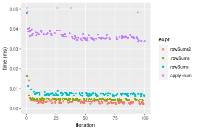
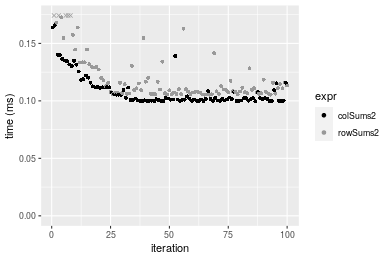
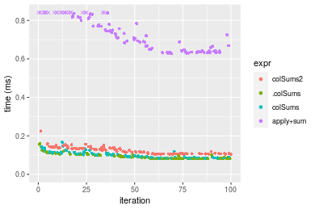
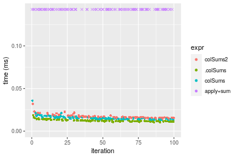
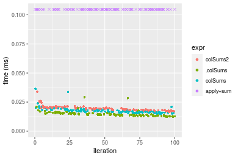

[matrixStats]: Benchmark report

---------------------------------------


# colSums2() and rowSums2() benchmarks

This report benchmark the performance of colSums2() and rowSums2() against alternative methods.

## Alternative methods

* apply() + sum()
* colSums() and rowSums()
* .colSums() and .rowSums()


## Data type "integer"

### Data
```r
> rmatrix <- function(nrow, ncol, mode = c("logical", "double", "integer", "index"), range = c(-100, 
+     +100), na_prob = 0) {
+     mode <- match.arg(mode)
+     n <- nrow * ncol
+     if (mode == "logical") {
+         x <- sample(c(FALSE, TRUE), size = n, replace = TRUE)
+     }     else if (mode == "index") {
+         x <- seq_len(n)
+         mode <- "integer"
+     }     else {
+         x <- runif(n, min = range[1], max = range[2])
+     }
+     storage.mode(x) <- mode
+     if (na_prob > 0) 
+         x[sample(n, size = na_prob * n)] <- NA
+     dim(x) <- c(nrow, ncol)
+     x
+ }
> rmatrices <- function(scale = 10, seed = 1, ...) {
+     set.seed(seed)
+     data <- list()
+     data[[1]] <- rmatrix(nrow = scale * 1, ncol = scale * 1, ...)
+     data[[2]] <- rmatrix(nrow = scale * 10, ncol = scale * 10, ...)
+     data[[3]] <- rmatrix(nrow = scale * 100, ncol = scale * 1, ...)
+     data[[4]] <- t(data[[3]])
+     data[[5]] <- rmatrix(nrow = scale * 10, ncol = scale * 100, ...)
+     data[[6]] <- t(data[[5]])
+     names(data) <- sapply(data, FUN = function(x) paste(dim(x), collapse = "x"))
+     data
+ }
> data <- rmatrices(mode = mode)
```

### Results

#### 10x10 integer matrix

```r
> X <- data[["10x10"]]
> gc()
           used  (Mb) gc trigger  (Mb) max used  (Mb)
Ncells  5320133 284.2    7916910 422.9  7916910 422.9
Vcells 10632655  81.2   33191153 253.3 53339345 407.0
> colStats <- microbenchmark(colSums2 = colSums2(X, na.rm = FALSE), .colSums = .colSums(X, m = nrow(X), 
+     n = ncol(X), na.rm = FALSE), colSums = colSums(X, na.rm = FALSE), `apply+sum` = apply(X, MARGIN = 2L, 
+     FUN = sum, na.rm = FALSE), unit = "ms")
> X <- t(X)
> gc()
           used  (Mb) gc trigger  (Mb) max used  (Mb)
Ncells  5306443 283.4    7916910 422.9  7916910 422.9
Vcells 10587500  80.8   33191153 253.3 53339345 407.0
> rowStats <- microbenchmark(rowSums2 = rowSums2(X, na.rm = FALSE), .rowSums = .rowSums(X, m = nrow(X), 
+     n = ncol(X), na.rm = FALSE), rowSums = rowSums(X, na.rm = FALSE), `apply+sum` = apply(X, MARGIN = 1L, 
+     FUN = sum, na.rm = FALSE), unit = "ms")
```

_Table: Benchmarking of colSums2(), .colSums(), colSums() and apply+sum() on integer+10x10 data. The top panel shows times in milliseconds and the bottom panel shows relative times._


|   |expr      |      min|        lq|      mean|    median|        uq|      max|
|:--|:---------|--------:|---------:|---------:|---------:|---------:|--------:|
|1  |colSums2  | 0.002443| 0.0028260| 0.0034775| 0.0034740| 0.0038005| 0.014816|
|2  |.colSums  | 0.002986| 0.0033955| 0.0039280| 0.0038030| 0.0042120| 0.019052|
|3  |colSums   | 0.005357| 0.0059335| 0.0066121| 0.0063735| 0.0071510| 0.016620|
|4  |apply+sum | 0.035054| 0.0367040| 0.0384957| 0.0374870| 0.0381930| 0.112776|


|   |expr      |       min|        lq|      mean|    median|        uq|      max|
|:--|:---------|---------:|---------:|---------:|---------:|---------:|--------:|
|1  |colSums2  |  1.000000|  1.000000|  1.000000|  1.000000|  1.000000| 1.000000|
|2  |.colSums  |  1.222268|  1.201522|  1.129534|  1.094704|  1.108275| 1.285907|
|3  |colSums   |  2.192796|  2.099611|  1.901359|  1.834629|  1.881595| 1.121760|
|4  |apply+sum | 14.348752| 12.987969| 11.069770| 10.790731| 10.049467| 7.611771|

_Table: Benchmarking of rowSums2(), .rowSums(), rowSums() and apply+sum() on integer+10x10 data (transposed). The top panel shows times in milliseconds and the bottom panel shows relative times._


|   |expr      |      min|       lq|      mean|    median|        uq|      max|
|:--|:---------|--------:|--------:|---------:|---------:|---------:|--------:|
|1  |rowSums2  | 0.002369| 0.002815| 0.0034117| 0.0033630| 0.0037175| 0.014173|
|2  |.rowSums  | 0.004153| 0.004480| 0.0048022| 0.0046295| 0.0048510| 0.016410|
|3  |rowSums   | 0.006330| 0.006822| 0.0077290| 0.0073640| 0.0076690| 0.047929|
|4  |apply+sum | 0.033702| 0.035261| 0.0374024| 0.0360015| 0.0373740| 0.096818|


|   |expr      |       min|        lq|      mean|    median|        uq|      max|
|:--|:---------|---------:|---------:|---------:|---------:|---------:|--------:|
|1  |rowSums2  |  1.000000|  1.000000|  1.000000|  1.000000|  1.000000| 1.000000|
|2  |.rowSums  |  1.753060|  1.591474|  1.407587|  1.376598|  1.304909| 1.157835|
|3  |rowSums   |  2.672013|  2.423446|  2.265451|  2.189712|  2.062946| 3.381712|
|4  |apply+sum | 14.226256| 12.526110| 10.963103| 10.705174| 10.053531| 6.831158|

_Figure: Benchmarking of colSums2(), .colSums(), colSums() and apply+sum() on integer+10x10 data  as well as rowSums2(), .rowSums(), rowSums() and apply+sum() on the same data transposed.  Outliers are displayed as crosses.  Times are in milliseconds._



_Table: Benchmarking of colSums2() and rowSums2() on integer+10x10 data (original and transposed).  The top panel shows times in milliseconds and the bottom panel shows relative times._


|   |expr     |   min|    lq|    mean| median|     uq|    max|
|:--|:--------|-----:|-----:|-------:|------:|------:|------:|
|2  |rowSums2 | 2.369| 2.815| 3.41166|  3.363| 3.7175| 14.173|
|1  |colSums2 | 2.443| 2.826| 3.47755|  3.474| 3.8005| 14.816|


|   |expr     |      min|       lq|     mean|   median|       uq|      max|
|:--|:--------|--------:|--------:|--------:|--------:|--------:|--------:|
|2  |rowSums2 | 1.000000| 1.000000| 1.000000| 1.000000| 1.000000| 1.000000|
|1  |colSums2 | 1.031237| 1.003908| 1.019313| 1.033006| 1.022327| 1.045368|

_Figure: Benchmarking of colSums2() and rowSums2() on integer+10x10 data (original and transposed).  Outliers are displayed as crosses. Times are in milliseconds._


#### 100x100 integer matrix

```r
> X <- data[["100x100"]]
> gc()
           used  (Mb) gc trigger  (Mb) max used  (Mb)
Ncells  5305026 283.4    7916910 422.9  7916910 422.9
Vcells 10204316  77.9   33191153 253.3 53339345 407.0
> colStats <- microbenchmark(colSums2 = colSums2(X, na.rm = FALSE), .colSums = .colSums(X, m = nrow(X), 
+     n = ncol(X), na.rm = FALSE), colSums = colSums(X, na.rm = FALSE), `apply+sum` = apply(X, MARGIN = 2L, 
+     FUN = sum, na.rm = FALSE), unit = "ms")
> X <- t(X)
> gc()
           used  (Mb) gc trigger  (Mb) max used  (Mb)
Ncells  5305020 283.4    7916910 422.9  7916910 422.9
Vcells 10209359  77.9   33191153 253.3 53339345 407.0
> rowStats <- microbenchmark(rowSums2 = rowSums2(X, na.rm = FALSE), .rowSums = .rowSums(X, m = nrow(X), 
+     n = ncol(X), na.rm = FALSE), rowSums = rowSums(X, na.rm = FALSE), `apply+sum` = apply(X, MARGIN = 1L, 
+     FUN = sum, na.rm = FALSE), unit = "ms")
```

_Table: Benchmarking of colSums2(), .colSums(), colSums() and apply+sum() on integer+100x100 data. The top panel shows times in milliseconds and the bottom panel shows relative times._


|   |expr      |      min|        lq|      mean|    median|        uq|      max|
|:--|:---------|--------:|---------:|---------:|---------:|---------:|--------:|
|2  |.colSums  | 0.014013| 0.0169955| 0.0230925| 0.0200490| 0.0296605| 0.038990|
|3  |colSums   | 0.016865| 0.0200345| 0.0282121| 0.0246215| 0.0355295| 0.056384|
|1  |colSums2  | 0.015264| 0.0194205| 0.0253197| 0.0258200| 0.0297810| 0.042907|
|4  |apply+sum | 0.211092| 0.2498680| 0.3446062| 0.3099720| 0.4590165| 0.649330|


|   |expr      |       min|        lq|      mean|    median|        uq|       max|
|:--|:---------|---------:|---------:|---------:|---------:|---------:|---------:|
|2  |.colSums  |  1.000000|  1.000000|  1.000000|  1.000000|  1.000000|  1.000000|
|3  |colSums   |  1.203525|  1.178812|  1.221701|  1.228066|  1.197873|  1.446114|
|1  |colSums2  |  1.089274|  1.142685|  1.096448|  1.287845|  1.004063|  1.100462|
|4  |apply+sum | 15.064012| 14.702009| 14.922881| 15.460721| 15.475683| 16.653757|

_Table: Benchmarking of rowSums2(), .rowSums(), rowSums() and apply+sum() on integer+100x100 data (transposed). The top panel shows times in milliseconds and the bottom panel shows relative times._


|   |expr      |      min|        lq|      mean|    median|       uq|      max|
|:--|:---------|--------:|---------:|---------:|---------:|--------:|--------:|
|1  |rowSums2  | 0.013112| 0.0146740| 0.0157031| 0.0154150| 0.016288| 0.029076|
|2  |.rowSums  | 0.037140| 0.0385595| 0.0418892| 0.0408705| 0.043711| 0.061806|
|3  |rowSums   | 0.039234| 0.0417435| 0.0442904| 0.0442865| 0.045929| 0.056231|
|4  |apply+sum | 0.174624| 0.1864420| 0.1999740| 0.1976550| 0.207283| 0.315519|


|   |expr      |       min|        lq|      mean|    median|        uq|       max|
|:--|:---------|---------:|---------:|---------:|---------:|---------:|---------:|
|1  |rowSums2  |  1.000000|  1.000000|  1.000000|  1.000000|  1.000000|  1.000000|
|2  |.rowSums  |  2.832520|  2.627743|  2.667569|  2.651346|  2.683632|  2.125671|
|3  |rowSums   |  2.992221|  2.844725|  2.820482|  2.872948|  2.819806|  1.933932|
|4  |apply+sum | 13.317877| 12.705602| 12.734665| 12.822251| 12.726117| 10.851527|

_Figure: Benchmarking of colSums2(), .colSums(), colSums() and apply+sum() on integer+100x100 data  as well as rowSums2(), .rowSums(), rowSums() and apply+sum() on the same data transposed.  Outliers are displayed as crosses.  Times are in milliseconds._


_Table: Benchmarking of colSums2() and rowSums2() on integer+100x100 data (original and transposed).  The top panel shows times in milliseconds and the bottom panel shows relative times._


|   |expr     |    min|      lq|     mean| median|     uq|    max|
|:--|:--------|------:|-------:|--------:|------:|------:|------:|
|2  |rowSums2 | 13.112| 14.6740| 15.70312| 15.415| 16.288| 29.076|
|1  |colSums2 | 15.264| 19.4205| 25.31970| 25.820| 29.781| 42.907|


|   |expr     |      min|       lq|     mean|   median|       uq|      max|
|:--|:--------|--------:|--------:|--------:|--------:|--------:|--------:|
|2  |rowSums2 | 1.000000| 1.000000| 1.000000| 1.000000| 1.000000| 1.000000|
|1  |colSums2 | 1.164125| 1.323463| 1.612399| 1.674992| 1.828401| 1.475684|

_Figure: Benchmarking of colSums2() and rowSums2() on integer+100x100 data (original and transposed).  Outliers are displayed as crosses. Times are in milliseconds._


#### 1000x10 integer matrix

```r
> X <- data[["1000x10"]]
> gc()
           used  (Mb) gc trigger  (Mb) max used  (Mb)
Ncells  5304457 283.3    7916910 422.9  7916910 422.9
Vcells 10182305  77.7   33191153 253.3 53339345 407.0
> colStats <- microbenchmark(colSums2 = colSums2(X, na.rm = FALSE), .colSums = .colSums(X, m = nrow(X), 
+     n = ncol(X), na.rm = FALSE), colSums = colSums(X, na.rm = FALSE), `apply+sum` = apply(X, MARGIN = 2L, 
+     FUN = sum, na.rm = FALSE), unit = "ms")
> X <- t(X)
> gc()
           used  (Mb) gc trigger  (Mb) max used  (Mb)
Ncells  5304445 283.3    7916910 422.9  7916910 422.9
Vcells 10187338  77.8   33191153 253.3 53339345 407.0
> rowStats <- microbenchmark(rowSums2 = rowSums2(X, na.rm = FALSE), .rowSums = .rowSums(X, m = nrow(X), 
+     n = ncol(X), na.rm = FALSE), rowSums = rowSums(X, na.rm = FALSE), `apply+sum` = apply(X, MARGIN = 1L, 
+     FUN = sum, na.rm = FALSE), unit = "ms")
```

_Table: Benchmarking of colSums2(), .colSums(), colSums() and apply+sum() on integer+1000x10 data. The top panel shows times in milliseconds and the bottom panel shows relative times._


|   |expr      |      min|        lq|      mean|    median|        uq|      max|
|:--|:---------|--------:|---------:|---------:|---------:|---------:|--------:|
|2  |.colSums  | 0.012793| 0.0138765| 0.0151997| 0.0147500| 0.0155460| 0.023290|
|3  |colSums   | 0.015114| 0.0165615| 0.0185141| 0.0174700| 0.0187055| 0.050554|
|1  |colSums2  | 0.016597| 0.0181430| 0.0194547| 0.0191415| 0.0197975| 0.036493|
|4  |apply+sum | 0.102830| 0.1107745| 0.1190742| 0.1142830| 0.1222910| 0.302068|


|   |expr      |      min|       lq|     mean|   median|       uq|       max|
|:--|:---------|--------:|--------:|--------:|--------:|--------:|---------:|
|2  |.colSums  | 1.000000| 1.000000| 1.000000| 1.000000| 1.000000|  1.000000|
|3  |colSums   | 1.181427| 1.193493| 1.218055| 1.184407| 1.203236|  2.170631|
|1  |colSums2  | 1.297350| 1.307462| 1.279936| 1.297729| 1.273479|  1.566896|
|4  |apply+sum | 8.037990| 7.982885| 7.833978| 7.748000| 7.866396| 12.969858|

_Table: Benchmarking of rowSums2(), .rowSums(), rowSums() and apply+sum() on integer+1000x10 data (transposed). The top panel shows times in milliseconds and the bottom panel shows relative times._


|   |expr      |      min|        lq|      mean|    median|        uq|      max|
|:--|:---------|--------:|---------:|---------:|---------:|---------:|--------:|
|1  |rowSums2  | 0.013856| 0.0157020| 0.0177937| 0.0171130| 0.0184795| 0.047828|
|4  |apply+sum | 0.085355| 0.0956420| 0.1044608| 0.1020715| 0.1101325| 0.244464|
|2  |.rowSums  | 0.139088| 0.1514185| 0.1666585| 0.1659255| 0.1775225| 0.219063|
|3  |rowSums   | 0.141147| 0.1564940| 0.1697981| 0.1685615| 0.1797755| 0.241362|


|   |expr      |       min|       lq|     mean|   median|       uq|      max|
|:--|:---------|---------:|--------:|--------:|--------:|--------:|--------:|
|1  |rowSums2  |  1.000000| 1.000000| 1.000000| 1.000000| 1.000000| 1.000000|
|4  |apply+sum |  6.160147| 6.091071| 5.870658| 5.964559| 5.959712| 5.111315|
|2  |.rowSums  | 10.038106| 9.643262| 9.366148| 9.695875| 9.606456| 4.580225|
|3  |rowSums   | 10.186706| 9.966501| 9.542592| 9.849909| 9.728375| 5.046458|

_Figure: Benchmarking of colSums2(), .colSums(), colSums() and apply+sum() on integer+1000x10 data  as well as rowSums2(), .rowSums(), rowSums() and apply+sum() on the same data transposed.  Outliers are displayed as crosses.  Times are in milliseconds._


_Table: Benchmarking of colSums2() and rowSums2() on integer+1000x10 data (original and transposed).  The top panel shows times in milliseconds and the bottom panel shows relative times._


|   |expr     |    min|     lq|     mean|  median|      uq|    max|
|:--|:--------|------:|------:|--------:|-------:|-------:|------:|
|2  |rowSums2 | 13.856| 15.702| 17.79371| 17.1130| 18.4795| 47.828|
|1  |colSums2 | 16.597| 18.143| 19.45466| 19.1415| 19.7975| 36.493|


|   |expr     |     min|       lq|     mean|   median|       uq|       max|
|:--|:--------|-------:|--------:|--------:|--------:|--------:|---------:|
|2  |rowSums2 | 1.00000| 1.000000| 1.000000| 1.000000| 1.000000| 1.0000000|
|1  |colSums2 | 1.19782| 1.155458| 1.093345| 1.118536| 1.071322| 0.7630049|

_Figure: Benchmarking of colSums2() and rowSums2() on integer+1000x10 data (original and transposed).  Outliers are displayed as crosses. Times are in milliseconds._


#### 10x1000 integer matrix

```r
> X <- data[["10x1000"]]
> gc()
           used  (Mb) gc trigger  (Mb) max used  (Mb)
Ncells  5304674 283.4    7916910 422.9  7916910 422.9
Vcells 10183108  77.7   33191153 253.3 53339345 407.0
> colStats <- microbenchmark(colSums2 = colSums2(X, na.rm = FALSE), .colSums = .colSums(X, m = nrow(X), 
+     n = ncol(X), na.rm = FALSE), colSums = colSums(X, na.rm = FALSE), `apply+sum` = apply(X, MARGIN = 2L, 
+     FUN = sum, na.rm = FALSE), unit = "ms")
> X <- t(X)
> gc()
           used  (Mb) gc trigger  (Mb) max used  (Mb)
Ncells  5304668 283.3    7916910 422.9  7916910 422.9
Vcells 10188151  77.8   33191153 253.3 53339345 407.0
> rowStats <- microbenchmark(rowSums2 = rowSums2(X, na.rm = FALSE), .rowSums = .rowSums(X, m = nrow(X), 
+     n = ncol(X), na.rm = FALSE), rowSums = rowSums(X, na.rm = FALSE), `apply+sum` = apply(X, MARGIN = 1L, 
+     FUN = sum, na.rm = FALSE), unit = "ms")
```

_Table: Benchmarking of colSums2(), .colSums(), colSums() and apply+sum() on integer+10x1000 data. The top panel shows times in milliseconds and the bottom panel shows relative times._


|   |expr      |      min|        lq|      mean|    median|        uq|      max|
|:--|:---------|--------:|---------:|---------:|---------:|---------:|--------:|
|2  |.colSums  | 0.011768| 0.0122945| 0.0140559| 0.0132670| 0.0152755| 0.022618|
|1  |colSums2  | 0.011852| 0.0125070| 0.0149309| 0.0141490| 0.0163095| 0.028170|
|3  |colSums   | 0.013389| 0.0144525| 0.0174395| 0.0167285| 0.0189630| 0.048868|
|4  |apply+sum | 0.901248| 0.9727045| 1.0376723| 0.9987180| 1.0757920| 1.455643|


|   |expr      |       min|        lq|      mean|    median|       uq|       max|
|:--|:---------|---------:|---------:|---------:|---------:|--------:|---------:|
|2  |.colSums  |  1.000000|  1.000000|  1.000000|  1.000000|  1.00000|  1.000000|
|1  |colSums2  |  1.007138|  1.017284|  1.062247|  1.066481|  1.06769|  1.245468|
|3  |colSums   |  1.137746|  1.175526|  1.240723|  1.260911|  1.24140|  2.160580|
|4  |apply+sum | 76.584636| 79.117044| 73.824522| 75.278360| 70.42598| 64.357724|

_Table: Benchmarking of rowSums2(), .rowSums(), rowSums() and apply+sum() on integer+10x1000 data (transposed). The top panel shows times in milliseconds and the bottom panel shows relative times._


|   |expr      |      min|        lq|      mean|    median|        uq|      max|
|:--|:---------|--------:|---------:|---------:|---------:|---------:|--------:|
|1  |rowSums2  | 0.013819| 0.0153655| 0.0208467| 0.0177800| 0.0240845| 0.069286|
|2  |.rowSums  | 0.028310| 0.0298670| 0.0333621| 0.0317125| 0.0349430| 0.056816|
|3  |rowSums   | 0.030562| 0.0324720| 0.0395548| 0.0384650| 0.0434175| 0.085054|
|4  |apply+sum | 1.056236| 1.1222810| 1.2903119| 1.1987045| 1.3752205| 2.546222|


|   |expr      |       min|        lq|      mean|    median|        uq|        max|
|:--|:---------|---------:|---------:|---------:|---------:|---------:|----------:|
|1  |rowSums2  |  1.000000|  1.000000|  1.000000|  1.000000|  1.000000|  1.0000000|
|2  |.rowSums  |  2.048629|  1.943770|  1.600354|  1.783605|  1.450850|  0.8200214|
|3  |rowSums   |  2.211593|  2.113306|  1.897412|  2.163386|  1.802715|  1.2275784|
|4  |apply+sum | 76.433606| 73.039016| 61.895289| 67.418701| 57.099815| 36.7494443|

_Figure: Benchmarking of colSums2(), .colSums(), colSums() and apply+sum() on integer+10x1000 data  as well as rowSums2(), .rowSums(), rowSums() and apply+sum() on the same data transposed.  Outliers are displayed as crosses.  Times are in milliseconds._


_Table: Benchmarking of colSums2() and rowSums2() on integer+10x1000 data (original and transposed).  The top panel shows times in milliseconds and the bottom panel shows relative times._


|   |expr     |    min|      lq|     mean| median|      uq|    max|
|:--|:--------|------:|-------:|--------:|------:|-------:|------:|
|1  |colSums2 | 11.852| 12.5070| 14.93087| 14.149| 16.3095| 28.170|
|2  |rowSums2 | 13.819| 15.3655| 20.84669| 17.780| 24.0845| 69.286|


|   |expr     |      min|       lq|     mean|   median|       uq|      max|
|:--|:--------|--------:|--------:|--------:|--------:|--------:|--------:|
|1  |colSums2 | 1.000000| 1.000000| 1.000000| 1.000000| 1.000000| 1.000000|
|2  |rowSums2 | 1.165964| 1.228552| 1.396214| 1.256626| 1.476716| 2.459567|

_Figure: Benchmarking of colSums2() and rowSums2() on integer+10x1000 data (original and transposed).  Outliers are displayed as crosses. Times are in milliseconds._


#### 100x1000 integer matrix

```r
> X <- data[["100x1000"]]
> gc()
           used  (Mb) gc trigger  (Mb) max used  (Mb)
Ncells  5304916 283.4    7916910 422.9  7916910 422.9
Vcells 10183721  77.7   33191153 253.3 53339345 407.0
> colStats <- microbenchmark(colSums2 = colSums2(X, na.rm = FALSE), .colSums = .colSums(X, m = nrow(X), 
+     n = ncol(X), na.rm = FALSE), colSums = colSums(X, na.rm = FALSE), `apply+sum` = apply(X, MARGIN = 2L, 
+     FUN = sum, na.rm = FALSE), unit = "ms")
> X <- t(X)
> gc()
           used  (Mb) gc trigger  (Mb) max used  (Mb)
Ncells  5304898 283.4    7916910 422.9  7916910 422.9
Vcells 10233744  78.1   33191153 253.3 53339345 407.0
> rowStats <- microbenchmark(rowSums2 = rowSums2(X, na.rm = FALSE), .rowSums = .rowSums(X, m = nrow(X), 
+     n = ncol(X), na.rm = FALSE), rowSums = rowSums(X, na.rm = FALSE), `apply+sum` = apply(X, MARGIN = 1L, 
+     FUN = sum, na.rm = FALSE), unit = "ms")
```

_Table: Benchmarking of colSums2(), .colSums(), colSums() and apply+sum() on integer+100x1000 data. The top panel shows times in milliseconds and the bottom panel shows relative times._


|   |expr      |      min|        lq|      mean|    median|        uq|      max|
|:--|:---------|--------:|---------:|---------:|---------:|---------:|--------:|
|2  |.colSums  | 0.087179| 0.0878230| 0.0960942| 0.0887540| 0.0985205| 0.170537|
|3  |colSums   | 0.089127| 0.0901555| 0.0986730| 0.0929335| 0.0999985| 0.170725|
|1  |colSums2  | 0.099686| 0.1003240| 0.1087257| 0.1021290| 0.1117535| 0.166117|
|4  |apply+sum | 1.401935| 1.4424960| 1.5671584| 1.4758180| 1.5615780| 2.647030|


|   |expr      |       min|        lq|      mean|    median|        uq|        max|
|:--|:---------|---------:|---------:|---------:|---------:|---------:|----------:|
|2  |.colSums  |  1.000000|  1.000000|  1.000000|  1.000000|  1.000000|  1.0000000|
|3  |colSums   |  1.022345|  1.026559|  1.026836|  1.047091|  1.015002|  1.0011024|
|1  |colSums2  |  1.143463|  1.142343|  1.131449|  1.150697|  1.134317|  0.9740819|
|4  |apply+sum | 16.081109| 16.425037| 16.308566| 16.628186| 15.850285| 15.5217343|

_Table: Benchmarking of rowSums2(), .rowSums(), rowSums() and apply+sum() on integer+100x1000 data (transposed). The top panel shows times in milliseconds and the bottom panel shows relative times._


|   |expr      |      min|        lq|      mean|    median|        uq|      max|
|:--|:---------|--------:|---------:|---------:|---------:|---------:|--------:|
|1  |rowSums2  | 0.105325| 0.1066975| 0.1218370| 0.1099685| 0.1277735| 0.264190|
|2  |.rowSums  | 0.219689| 0.2202540| 0.2390576| 0.2221425| 0.2397650| 0.419237|
|3  |rowSums   | 0.221649| 0.2229495| 0.2433800| 0.2269330| 0.2475130| 0.425284|
|4  |apply+sum | 1.416842| 1.4426810| 1.5820874| 1.4741565| 1.6123855| 3.018600|


|   |expr      |       min|        lq|      mean|    median|        uq|       max|
|:--|:---------|---------:|---------:|---------:|---------:|---------:|---------:|
|1  |rowSums2  |  1.000000|  1.000000|  1.000000|  1.000000|  1.000000|  1.000000|
|2  |.rowSums  |  2.085820|  2.064284|  1.962110|  2.020056|  1.876485|  1.586877|
|3  |rowSums   |  2.104429|  2.089548|  1.997587|  2.063618|  1.937123|  1.609766|
|4  |apply+sum | 13.452096| 13.521226| 12.985280| 13.405261| 12.619092| 11.425868|

_Figure: Benchmarking of colSums2(), .colSums(), colSums() and apply+sum() on integer+100x1000 data  as well as rowSums2(), .rowSums(), rowSums() and apply+sum() on the same data transposed.  Outliers are displayed as crosses.  Times are in milliseconds._


_Table: Benchmarking of colSums2() and rowSums2() on integer+100x1000 data (original and transposed).  The top panel shows times in milliseconds and the bottom panel shows relative times._


|   |expr     |     min|       lq|     mean|   median|       uq|     max|
|:--|:--------|-------:|--------:|--------:|--------:|--------:|-------:|
|1  |colSums2 |  99.686| 100.3240| 108.7257| 102.1290| 111.7535| 166.117|
|2  |rowSums2 | 105.325| 106.6975| 121.8370| 109.9685| 127.7735| 264.190|


|   |expr     |      min|       lq|    mean|   median|       uq|      max|
|:--|:--------|--------:|--------:|-------:|--------:|--------:|--------:|
|1  |colSums2 | 1.000000| 1.000000| 1.00000| 1.000000| 1.000000| 1.000000|
|2  |rowSums2 | 1.056568| 1.063529| 1.12059| 1.076761| 1.143351| 1.590385|

_Figure: Benchmarking of colSums2() and rowSums2() on integer+100x1000 data (original and transposed).  Outliers are displayed as crosses. Times are in milliseconds._




#### 1000x100 integer matrix

```r
> X <- data[["1000x100"]]
> gc()
           used  (Mb) gc trigger  (Mb) max used  (Mb)
Ncells  5305140 283.4    7916910 422.9  7916910 422.9
Vcells 10184418  77.8   33191153 253.3 53339345 407.0
> colStats <- microbenchmark(colSums2 = colSums2(X, na.rm = FALSE), .colSums = .colSums(X, m = nrow(X), 
+     n = ncol(X), na.rm = FALSE), colSums = colSums(X, na.rm = FALSE), `apply+sum` = apply(X, MARGIN = 2L, 
+     FUN = sum, na.rm = FALSE), unit = "ms")
> X <- t(X)
> gc()
           used  (Mb) gc trigger  (Mb) max used  (Mb)
Ncells  5305122 283.4    7916910 422.9  7916910 422.9
Vcells 10234441  78.1   33191153 253.3 53339345 407.0
> rowStats <- microbenchmark(rowSums2 = rowSums2(X, na.rm = FALSE), .rowSums = .rowSums(X, m = nrow(X), 
+     n = ncol(X), na.rm = FALSE), rowSums = rowSums(X, na.rm = FALSE), `apply+sum` = apply(X, MARGIN = 1L, 
+     FUN = sum, na.rm = FALSE), unit = "ms")
```

_Table: Benchmarking of colSums2(), .colSums(), colSums() and apply+sum() on integer+1000x100 data. The top panel shows times in milliseconds and the bottom panel shows relative times._


|   |expr      |      min|        lq|      mean|    median|        uq|      max|
|:--|:---------|--------:|---------:|---------:|---------:|---------:|--------:|
|2  |.colSums  | 0.080825| 0.0814200| 0.0925807| 0.0858115| 0.1015380| 0.158800|
|3  |colSums   | 0.083017| 0.0845695| 0.0990918| 0.0927420| 0.1084165| 0.166100|
|1  |colSums2  | 0.105335| 0.1067730| 0.1236165| 0.1175175| 0.1360960| 0.224615|
|4  |apply+sum | 0.626591| 0.6417680| 0.7705930| 0.7209185| 0.8352540| 2.095169|


|   |expr      |      min|       lq|     mean|   median|       uq|       max|
|:--|:---------|--------:|--------:|--------:|--------:|--------:|---------:|
|2  |.colSums  | 1.000000| 1.000000| 1.000000| 1.000000| 1.000000|  1.000000|
|3  |colSums   | 1.027120| 1.038682| 1.070329| 1.080764| 1.067743|  1.045970|
|1  |colSums2  | 1.303248| 1.311385| 1.335230| 1.369484| 1.340345|  1.414452|
|4  |apply+sum | 7.752440| 7.882191| 8.323474| 8.401188| 8.226024| 13.193759|

_Table: Benchmarking of rowSums2(), .rowSums(), rowSums() and apply+sum() on integer+1000x100 data (transposed). The top panel shows times in milliseconds and the bottom panel shows relative times._


|   |expr      |      min|        lq|      mean|    median|        uq|      max|
|:--|:---------|--------:|---------:|---------:|---------:|---------:|--------:|
|1  |rowSums2  | 0.109734| 0.1125235| 0.1265850| 0.1165155| 0.1328770| 0.225612|
|2  |.rowSums  | 0.320026| 0.3208555| 0.3533995| 0.3292035| 0.3697975| 0.538800|
|3  |rowSums   | 0.322186| 0.3234910| 0.3569596| 0.3311780| 0.3898485| 0.497132|
|4  |apply+sum | 0.628772| 0.6369455| 0.7241115| 0.6439215| 0.7930500| 1.346452|


|   |expr      |      min|       lq|     mean|   median|       uq|      max|
|:--|:---------|--------:|--------:|--------:|--------:|--------:|--------:|
|1  |rowSums2  | 1.000000| 1.000000| 1.000000| 1.000000| 1.000000| 1.000000|
|2  |.rowSums  | 2.916380| 2.851453| 2.791795| 2.825405| 2.783006| 2.388171|
|3  |rowSums   | 2.936064| 2.874875| 2.819919| 2.842351| 2.933905| 2.203482|
|4  |apply+sum | 5.729965| 5.660555| 5.720356| 5.526488| 5.968301| 5.967998|

_Figure: Benchmarking of colSums2(), .colSums(), colSums() and apply+sum() on integer+1000x100 data  as well as rowSums2(), .rowSums(), rowSums() and apply+sum() on the same data transposed.  Outliers are displayed as crosses.  Times are in milliseconds._





_Table: Benchmarking of colSums2() and rowSums2() on integer+1000x100 data (original and transposed).  The top panel shows times in milliseconds and the bottom panel shows relative times._


|   |expr     |     min|       lq|     mean|   median|      uq|     max|
|:--|:--------|-------:|--------:|--------:|--------:|-------:|-------:|
|2  |rowSums2 | 109.734| 112.5235| 126.5850| 116.5155| 132.877| 225.612|
|1  |colSums2 | 105.335| 106.7730| 123.6165| 117.5175| 136.096| 224.615|


|   |expr     |       min|        lq|      mean| median|       uq|       max|
|:--|:--------|---------:|---------:|---------:|------:|--------:|---------:|
|2  |rowSums2 | 1.0000000| 1.0000000| 1.0000000| 1.0000| 1.000000| 1.0000000|
|1  |colSums2 | 0.9599122| 0.9488951| 0.9765488| 1.0086| 1.024225| 0.9955809|

_Figure: Benchmarking of colSums2() and rowSums2() on integer+1000x100 data (original and transposed).  Outliers are displayed as crosses. Times are in milliseconds._


## Data type "double"

### Data
```r
> rmatrix <- function(nrow, ncol, mode = c("logical", "double", "integer", "index"), range = c(-100, 
+     +100), na_prob = 0) {
+     mode <- match.arg(mode)
+     n <- nrow * ncol
+     if (mode == "logical") {
+         x <- sample(c(FALSE, TRUE), size = n, replace = TRUE)
+     }     else if (mode == "index") {
+         x <- seq_len(n)
+         mode <- "integer"
+     }     else {
+         x <- runif(n, min = range[1], max = range[2])
+     }
+     storage.mode(x) <- mode
+     if (na_prob > 0) 
+         x[sample(n, size = na_prob * n)] <- NA
+     dim(x) <- c(nrow, ncol)
+     x
+ }
> rmatrices <- function(scale = 10, seed = 1, ...) {
+     set.seed(seed)
+     data <- list()
+     data[[1]] <- rmatrix(nrow = scale * 1, ncol = scale * 1, ...)
+     data[[2]] <- rmatrix(nrow = scale * 10, ncol = scale * 10, ...)
+     data[[3]] <- rmatrix(nrow = scale * 100, ncol = scale * 1, ...)
+     data[[4]] <- t(data[[3]])
+     data[[5]] <- rmatrix(nrow = scale * 10, ncol = scale * 100, ...)
+     data[[6]] <- t(data[[5]])
+     names(data) <- sapply(data, FUN = function(x) paste(dim(x), collapse = "x"))
+     data
+ }
> data <- rmatrices(mode = mode)
```

### Results

#### 10x10 double matrix

```r
> X <- data[["10x10"]]
> gc()
           used  (Mb) gc trigger  (Mb) max used  (Mb)
Ncells  5305359 283.4    7916910 422.9  7916910 422.9
Vcells 10300314  78.6   33191153 253.3 53339345 407.0
> colStats <- microbenchmark(colSums2 = colSums2(X, na.rm = FALSE), .colSums = .colSums(X, m = nrow(X), 
+     n = ncol(X), na.rm = FALSE), colSums = colSums(X, na.rm = FALSE), `apply+sum` = apply(X, MARGIN = 2L, 
+     FUN = sum, na.rm = FALSE), unit = "ms")
> X <- t(X)
> gc()
           used  (Mb) gc trigger  (Mb) max used  (Mb)
Ncells  5305344 283.4    7916910 422.9  7916910 422.9
Vcells 10300442  78.6   33191153 253.3 53339345 407.0
> rowStats <- microbenchmark(rowSums2 = rowSums2(X, na.rm = FALSE), .rowSums = .rowSums(X, m = nrow(X), 
+     n = ncol(X), na.rm = FALSE), rowSums = rowSums(X, na.rm = FALSE), `apply+sum` = apply(X, MARGIN = 1L, 
+     FUN = sum, na.rm = FALSE), unit = "ms")
```

_Table: Benchmarking of colSums2(), .colSums(), colSums() and apply+sum() on double+10x10 data. The top panel shows times in milliseconds and the bottom panel shows relative times._


|   |expr      |      min|        lq|      mean|    median|        uq|      max|
|:--|:---------|--------:|---------:|---------:|---------:|---------:|--------:|
|1  |colSums2  | 0.002527| 0.0029605| 0.0036175| 0.0036345| 0.0039185| 0.014904|
|2  |.colSums  | 0.002988| 0.0033955| 0.0040478| 0.0036795| 0.0041665| 0.020700|
|3  |colSums   | 0.005400| 0.0059695| 0.0068039| 0.0065435| 0.0073040| 0.016606|
|4  |apply+sum | 0.036608| 0.0373395| 0.0395886| 0.0377800| 0.0384100| 0.102978|


|   |expr      |       min|        lq|      mean|    median|       uq|      max|
|:--|:---------|---------:|---------:|---------:|---------:|--------:|--------:|
|1  |colSums2  |  1.000000|  1.000000|  1.000000|  1.000000| 1.000000| 1.000000|
|2  |.colSums  |  1.182430|  1.146935|  1.118948|  1.012381| 1.063289| 1.388889|
|3  |colSums   |  2.136921|  2.016382|  1.880837|  1.800385| 1.863979| 1.114197|
|4  |apply+sum | 14.486743| 12.612565| 10.943731| 10.394827| 9.802220| 6.909420|

_Table: Benchmarking of rowSums2(), .rowSums(), rowSums() and apply+sum() on double+10x10 data (transposed). The top panel shows times in milliseconds and the bottom panel shows relative times._


|   |expr      |      min|        lq|      mean|    median|        uq|      max|
|:--|:---------|--------:|---------:|---------:|---------:|---------:|--------:|
|2  |.rowSums  | 0.002414| 0.0027580| 0.0030384| 0.0029855| 0.0031470| 0.008872|
|1  |rowSums2  | 0.002421| 0.0027590| 0.0034438| 0.0034360| 0.0037070| 0.015525|
|3  |rowSums   | 0.004601| 0.0050715| 0.0059537| 0.0056310| 0.0060570| 0.032032|
|4  |apply+sum | 0.033402| 0.0359200| 0.0378522| 0.0365800| 0.0372745| 0.099233|


|   |expr      |       min|        lq|      mean|    median|        uq|       max|
|:--|:---------|---------:|---------:|---------:|---------:|---------:|---------:|
|2  |.rowSums  |  1.000000|  1.000000|  1.000000|  1.000000|  1.000000|  1.000000|
|1  |rowSums2  |  1.002900|  1.000363|  1.133431|  1.150896|  1.177947|  1.749887|
|3  |rowSums   |  1.905965|  1.838833|  1.959521|  1.886116|  1.924690|  3.610460|
|4  |apply+sum | 13.836785| 13.023930| 12.458157| 12.252554| 11.844455| 11.184964|

_Figure: Benchmarking of colSums2(), .colSums(), colSums() and apply+sum() on double+10x10 data  as well as rowSums2(), .rowSums(), rowSums() and apply+sum() on the same data transposed.  Outliers are displayed as crosses.  Times are in milliseconds._


_Table: Benchmarking of colSums2() and rowSums2() on double+10x10 data (original and transposed).  The top panel shows times in milliseconds and the bottom panel shows relative times._


|   |expr     |   min|     lq|    mean| median|     uq|    max|
|:--|:--------|-----:|------:|-------:|------:|------:|------:|
|2  |rowSums2 | 2.421| 2.7590| 3.44376| 3.4360| 3.7070| 15.525|
|1  |colSums2 | 2.527| 2.9605| 3.61747| 3.6345| 3.9185| 14.904|


|   |expr     |      min|       lq|     mean|   median|       uq|  max|
|:--|:--------|--------:|--------:|--------:|--------:|--------:|----:|
|2  |rowSums2 | 1.000000| 1.000000| 1.000000| 1.000000| 1.000000| 1.00|
|1  |colSums2 | 1.043784| 1.073034| 1.050442| 1.057771| 1.057054| 0.96|

_Figure: Benchmarking of colSums2() and rowSums2() on double+10x10 data (original and transposed).  Outliers are displayed as crosses. Times are in milliseconds._


#### 100x100 double matrix

```r
> X <- data[["100x100"]]
> gc()
           used  (Mb) gc trigger  (Mb) max used  (Mb)
Ncells  5305578 283.4    7916910 422.9  7916910 422.9
Vcells 10301331  78.6   33191153 253.3 53339345 407.0
> colStats <- microbenchmark(colSums2 = colSums2(X, na.rm = FALSE), .colSums = .colSums(X, m = nrow(X), 
+     n = ncol(X), na.rm = FALSE), colSums = colSums(X, na.rm = FALSE), `apply+sum` = apply(X, MARGIN = 2L, 
+     FUN = sum, na.rm = FALSE), unit = "ms")
> X <- t(X)
> gc()
           used  (Mb) gc trigger  (Mb) max used  (Mb)
Ncells  5305572 283.4    7916910 422.9  7916910 422.9
Vcells 10311374  78.7   33191153 253.3 53339345 407.0
> rowStats <- microbenchmark(rowSums2 = rowSums2(X, na.rm = FALSE), .rowSums = .rowSums(X, m = nrow(X), 
+     n = ncol(X), na.rm = FALSE), rowSums = rowSums(X, na.rm = FALSE), `apply+sum` = apply(X, MARGIN = 1L, 
+     FUN = sum, na.rm = FALSE), unit = "ms")
```

_Table: Benchmarking of colSums2(), .colSums(), colSums() and apply+sum() on double+100x100 data. The top panel shows times in milliseconds and the bottom panel shows relative times._


|   |expr      |      min|       lq|      mean|    median|        uq|      max|
|:--|:---------|--------:|--------:|---------:|---------:|---------:|--------:|
|2  |.colSums  | 0.010424| 0.011555| 0.0123870| 0.0120555| 0.0131500| 0.018610|
|3  |colSums   | 0.013015| 0.014233| 0.0155818| 0.0150615| 0.0163210| 0.035795|
|1  |colSums2  | 0.014755| 0.015874| 0.0172287| 0.0166125| 0.0178500| 0.031936|
|4  |apply+sum | 0.205700| 0.216111| 0.2353752| 0.2211880| 0.2480635| 0.366932|


|   |expr      |       min|        lq|      mean|    median|        uq|       max|
|:--|:---------|---------:|---------:|---------:|---------:|---------:|---------:|
|2  |.colSums  |  1.000000|  1.000000|  1.000000|  1.000000|  1.000000|  1.000000|
|3  |colSums   |  1.248561|  1.231761|  1.257912|  1.249347|  1.241141|  1.923428|
|1  |colSums2  |  1.415483|  1.373778|  1.390869|  1.378002|  1.357414|  1.716067|
|4  |apply+sum | 19.733308| 18.702813| 19.001796| 18.347476| 18.864144| 19.716926|

_Table: Benchmarking of rowSums2(), .rowSums(), rowSums() and apply+sum() on double+100x100 data (transposed). The top panel shows times in milliseconds and the bottom panel shows relative times._


|   |expr      |      min|        lq|      mean|    median|        uq|      max|
|:--|:---------|--------:|---------:|---------:|---------:|---------:|--------:|
|1  |rowSums2  | 0.014657| 0.0158545| 0.0171775| 0.0166780| 0.0178195| 0.034507|
|2  |.rowSums  | 0.027967| 0.0292890| 0.0315811| 0.0302465| 0.0320240| 0.060768|
|3  |rowSums   | 0.030290| 0.0320290| 0.0338461| 0.0327030| 0.0346775| 0.051010|
|4  |apply+sum | 0.198443| 0.2073905| 0.2251430| 0.2162170| 0.2309470| 0.377271|


|   |expr      |       min|        lq|      mean|    median|        uq|       max|
|:--|:---------|---------:|---------:|---------:|---------:|---------:|---------:|
|1  |rowSums2  |  1.000000|  1.000000|  1.000000|  1.000000|  1.000000|  1.000000|
|2  |.rowSums  |  1.908098|  1.847362|  1.838513|  1.813557|  1.797132|  1.761034|
|3  |rowSums   |  2.066589|  2.020183|  1.970370|  1.960847|  1.946042|  1.478251|
|4  |apply+sum | 13.539128| 13.080860| 13.106837| 12.964204| 12.960352| 10.933173|

_Figure: Benchmarking of colSums2(), .colSums(), colSums() and apply+sum() on double+100x100 data  as well as rowSums2(), .rowSums(), rowSums() and apply+sum() on the same data transposed.  Outliers are displayed as crosses.  Times are in milliseconds._





_Table: Benchmarking of colSums2() and rowSums2() on double+100x100 data (original and transposed).  The top panel shows times in milliseconds and the bottom panel shows relative times._


|   |expr     |    min|      lq|     mean|  median|      uq|    max|
|:--|:--------|------:|-------:|--------:|-------:|-------:|------:|
|1  |colSums2 | 14.755| 15.8740| 17.22869| 16.6125| 17.8500| 31.936|
|2  |rowSums2 | 14.657| 15.8545| 17.17752| 16.6780| 17.8195| 34.507|


|   |expr     |       min|        lq|    mean|   median|        uq|      max|
|:--|:--------|---------:|---------:|-------:|--------:|---------:|--------:|
|1  |colSums2 | 1.0000000| 1.0000000| 1.00000| 1.000000| 1.0000000| 1.000000|
|2  |rowSums2 | 0.9933582| 0.9987716| 0.99703| 1.003943| 0.9982913| 1.080505|

_Figure: Benchmarking of colSums2() and rowSums2() on double+100x100 data (original and transposed).  Outliers are displayed as crosses. Times are in milliseconds._


#### 1000x10 double matrix

```r
> X <- data[["1000x10"]]
> gc()
           used  (Mb) gc trigger  (Mb) max used  (Mb)
Ncells  5305801 283.4    7916910 422.9  7916910 422.9
Vcells 10302434  78.7   33191153 253.3 53339345 407.0
> colStats <- microbenchmark(colSums2 = colSums2(X, na.rm = FALSE), .colSums = .colSums(X, m = nrow(X), 
+     n = ncol(X), na.rm = FALSE), colSums = colSums(X, na.rm = FALSE), `apply+sum` = apply(X, MARGIN = 2L, 
+     FUN = sum, na.rm = FALSE), unit = "ms")
> X <- t(X)
> gc()
           used  (Mb) gc trigger  (Mb) max used  (Mb)
Ncells  5305795 283.4    7916910 422.9  7916910 422.9
Vcells 10312477  78.7   33191153 253.3 53339345 407.0
> rowStats <- microbenchmark(rowSums2 = rowSums2(X, na.rm = FALSE), .rowSums = .rowSums(X, m = nrow(X), 
+     n = ncol(X), na.rm = FALSE), rowSums = rowSums(X, na.rm = FALSE), `apply+sum` = apply(X, MARGIN = 1L, 
+     FUN = sum, na.rm = FALSE), unit = "ms")
```

_Table: Benchmarking of colSums2(), .colSums(), colSums() and apply+sum() on double+1000x10 data. The top panel shows times in milliseconds and the bottom panel shows relative times._


|   |expr      |      min|        lq|      mean|    median|        uq|      max|
|:--|:---------|--------:|---------:|---------:|---------:|---------:|--------:|
|2  |.colSums  | 0.012391| 0.0134465| 0.0147897| 0.0142520| 0.0153970| 0.029268|
|3  |colSums   | 0.014995| 0.0161215| 0.0177038| 0.0171055| 0.0182125| 0.036283|
|1  |colSums2  | 0.016480| 0.0181825| 0.0194824| 0.0192875| 0.0201935| 0.033885|
|4  |apply+sum | 0.108932| 0.1141135| 0.1239832| 0.1232055| 0.1294040| 0.215156|


|   |expr      |      min|       lq|     mean|   median|       uq|      max|
|:--|:---------|--------:|--------:|--------:|--------:|--------:|--------:|
|2  |.colSums  | 1.000000| 1.000000| 1.000000| 1.000000| 1.000000| 1.000000|
|3  |colSums   | 1.210152| 1.198937| 1.197031| 1.200217| 1.182860| 1.239682|
|1  |colSums2  | 1.329998| 1.352211| 1.317296| 1.353319| 1.311522| 1.157749|
|4  |apply+sum | 8.791219| 8.486484| 8.383067| 8.644787| 8.404494| 7.351237|

_Table: Benchmarking of rowSums2(), .rowSums(), rowSums() and apply+sum() on double+1000x10 data (transposed). The top panel shows times in milliseconds and the bottom panel shows relative times._


|   |expr      |      min|        lq|      mean|    median|        uq|      max|
|:--|:---------|--------:|---------:|---------:|---------:|---------:|--------:|
|1  |rowSums2  | 0.016584| 0.0179705| 0.0197192| 0.0193890| 0.0205360| 0.036673|
|2  |.rowSums  | 0.030400| 0.0317655| 0.0349252| 0.0345290| 0.0367375| 0.051910|
|3  |rowSums   | 0.032999| 0.0346235| 0.0379493| 0.0371175| 0.0393060| 0.056746|
|4  |apply+sum | 0.108867| 0.1159555| 0.1274138| 0.1274865| 0.1327665| 0.237947|


|   |expr      |      min|       lq|     mean|   median|       uq|      max|
|:--|:---------|--------:|--------:|--------:|--------:|--------:|--------:|
|1  |rowSums2  | 1.000000| 1.000000| 1.000000| 1.000000| 1.000000| 1.000000|
|2  |.rowSums  | 1.833092| 1.767647| 1.771130| 1.780855| 1.788932| 1.415483|
|3  |rowSums   | 1.989810| 1.926685| 1.924489| 1.914359| 1.914005| 1.547351|
|4  |apply+sum | 6.564580| 6.452547| 6.461422| 6.575197| 6.465061| 6.488343|

_Figure: Benchmarking of colSums2(), .colSums(), colSums() and apply+sum() on double+1000x10 data  as well as rowSums2(), .rowSums(), rowSums() and apply+sum() on the same data transposed.  Outliers are displayed as crosses.  Times are in milliseconds._





_Table: Benchmarking of colSums2() and rowSums2() on double+1000x10 data (original and transposed).  The top panel shows times in milliseconds and the bottom panel shows relative times._


|   |expr     |    min|      lq|     mean|  median|      uq|    max|
|:--|:--------|------:|-------:|--------:|-------:|-------:|------:|
|1  |colSums2 | 16.480| 18.1825| 19.48244| 19.2875| 20.1935| 33.885|
|2  |rowSums2 | 16.584| 17.9705| 19.71916| 19.3890| 20.5360| 36.673|


|   |expr     |      min|        lq|    mean|   median|       uq|      max|
|:--|:--------|--------:|---------:|-------:|--------:|--------:|--------:|
|1  |colSums2 | 1.000000| 1.0000000| 1.00000| 1.000000| 1.000000| 1.000000|
|2  |rowSums2 | 1.006311| 0.9883404| 1.01215| 1.005262| 1.016961| 1.082278|

_Figure: Benchmarking of colSums2() and rowSums2() on double+1000x10 data (original and transposed).  Outliers are displayed as crosses. Times are in milliseconds._


#### 10x1000 double matrix

```r
> X <- data[["10x1000"]]
> gc()
           used  (Mb) gc trigger  (Mb) max used  (Mb)
Ncells  5306024 283.4    7916910 422.9  7916910 422.9
Vcells 10302582  78.7   33191153 253.3 53339345 407.0
> colStats <- microbenchmark(colSums2 = colSums2(X, na.rm = FALSE), .colSums = .colSums(X, m = nrow(X), 
+     n = ncol(X), na.rm = FALSE), colSums = colSums(X, na.rm = FALSE), `apply+sum` = apply(X, MARGIN = 2L, 
+     FUN = sum, na.rm = FALSE), unit = "ms")
> X <- t(X)
> gc()
           used  (Mb) gc trigger  (Mb) max used  (Mb)
Ncells  5306018 283.4    7916910 422.9  7916910 422.9
Vcells 10312625  78.7   33191153 253.3 53339345 407.0
> rowStats <- microbenchmark(rowSums2 = rowSums2(X, na.rm = FALSE), .rowSums = .rowSums(X, m = nrow(X), 
+     n = ncol(X), na.rm = FALSE), rowSums = rowSums(X, na.rm = FALSE), `apply+sum` = apply(X, MARGIN = 1L, 
+     FUN = sum, na.rm = FALSE), unit = "ms")
```

_Table: Benchmarking of colSums2(), .colSums(), colSums() and apply+sum() on double+10x1000 data. The top panel shows times in milliseconds and the bottom panel shows relative times._


|   |expr      |      min|        lq|      mean|    median|        uq|      max|
|:--|:---------|--------:|---------:|---------:|---------:|---------:|--------:|
|2  |.colSums  | 0.008640| 0.0092280| 0.0111564| 0.0101145| 0.0123455| 0.021484|
|3  |colSums   | 0.010223| 0.0114865| 0.0150963| 0.0128015| 0.0157860| 0.054324|
|1  |colSums2  | 0.011405| 0.0124235| 0.0155689| 0.0134150| 0.0172405| 0.037127|
|4  |apply+sum | 0.949944| 0.9947425| 1.1029722| 1.0220600| 1.1756230| 1.730377|


|   |expr      |        min|         lq|      mean|     median|        uq|       max|
|:--|:---------|----------:|----------:|---------:|----------:|---------:|---------:|
|2  |.colSums  |   1.000000|   1.000000|  1.000000|   1.000000|  1.000000|  1.000000|
|3  |colSums   |   1.183218|   1.244744|  1.353160|   1.265658|  1.278685|  2.528579|
|1  |colSums2  |   1.320023|   1.346283|  1.395523|   1.326314|  1.396501|  1.728123|
|4  |apply+sum | 109.947222| 107.796110| 98.864965| 101.048989| 95.226844| 80.542590|

_Table: Benchmarking of rowSums2(), .rowSums(), rowSums() and apply+sum() on double+10x1000 data (transposed). The top panel shows times in milliseconds and the bottom panel shows relative times._


|   |expr      |      min|        lq|      mean|    median|        uq|      max|
|:--|:---------|--------:|---------:|---------:|---------:|---------:|--------:|
|1  |rowSums2  | 0.011325| 0.0133810| 0.0201184| 0.0156735| 0.0264440| 0.063460|
|2  |.rowSums  | 0.023211| 0.0240520| 0.0307085| 0.0283260| 0.0346465| 0.056080|
|3  |rowSums   | 0.025084| 0.0267470| 0.0357664| 0.0299540| 0.0415890| 0.072642|
|4  |apply+sum | 0.928487| 0.9807665| 1.3581019| 1.1250920| 1.6066060| 2.879927|


|   |expr      |       min|        lq|      mean|    median|        uq|        max|
|:--|:---------|---------:|---------:|---------:|---------:|---------:|----------:|
|1  |rowSums2  |  1.000000|  1.000000|  1.000000|  1.000000|  1.000000|  1.0000000|
|2  |.rowSums  |  2.049536|  1.797474|  1.526388|  1.807254|  1.310184|  0.8837063|
|3  |rowSums   |  2.214923|  1.998879|  1.777792|  1.911124|  1.572720|  1.1446896|
|4  |apply+sum | 81.985607| 73.295456| 67.505430| 71.783073| 60.755029| 45.3817680|

_Figure: Benchmarking of colSums2(), .colSums(), colSums() and apply+sum() on double+10x1000 data  as well as rowSums2(), .rowSums(), rowSums() and apply+sum() on the same data transposed.  Outliers are displayed as crosses.  Times are in milliseconds._


_Table: Benchmarking of colSums2() and rowSums2() on double+10x1000 data (original and transposed).  The top panel shows times in milliseconds and the bottom panel shows relative times._


|   |expr     |    min|      lq|     mean|  median|      uq|    max|
|:--|:--------|------:|-------:|--------:|-------:|-------:|------:|
|1  |colSums2 | 11.405| 12.4235| 15.56894| 13.4150| 17.2405| 37.127|
|2  |rowSums2 | 11.325| 13.3810| 20.11841| 15.6735| 26.4440| 63.460|


|   |expr     |       min|       lq|     mean|   median|      uq|      max|
|:--|:--------|---------:|--------:|--------:|--------:|-------:|--------:|
|1  |colSums2 | 1.0000000| 1.000000| 1.000000| 1.000000| 1.00000| 1.000000|
|2  |rowSums2 | 0.9929855| 1.077072| 1.292215| 1.168356| 1.53383| 1.709268|

_Figure: Benchmarking of colSums2() and rowSums2() on double+10x1000 data (original and transposed).  Outliers are displayed as crosses. Times are in milliseconds._


#### 100x1000 double matrix

```r
> X <- data[["100x1000"]]
> gc()
           used  (Mb) gc trigger  (Mb) max used  (Mb)
Ncells  5306266 283.4    7916910 422.9  7916910 422.9
Vcells 10303906  78.7   33191153 253.3 53339345 407.0
> colStats <- microbenchmark(colSums2 = colSums2(X, na.rm = FALSE), .colSums = .colSums(X, m = nrow(X), 
+     n = ncol(X), na.rm = FALSE), colSums = colSums(X, na.rm = FALSE), `apply+sum` = apply(X, MARGIN = 2L, 
+     FUN = sum, na.rm = FALSE), unit = "ms")
> X <- t(X)
> gc()
           used  (Mb) gc trigger  (Mb) max used  (Mb)
Ncells  5306248 283.4    7916910 422.9  7916910 422.9
Vcells 10403929  79.4   33191153 253.3 53339345 407.0
> rowStats <- microbenchmark(rowSums2 = rowSums2(X, na.rm = FALSE), .rowSums = .rowSums(X, m = nrow(X), 
+     n = ncol(X), na.rm = FALSE), rowSums = rowSums(X, na.rm = FALSE), `apply+sum` = apply(X, MARGIN = 1L, 
+     FUN = sum, na.rm = FALSE), unit = "ms")
```

_Table: Benchmarking of colSums2(), .colSums(), colSums() and apply+sum() on double+100x1000 data. The top panel shows times in milliseconds and the bottom panel shows relative times._


|   |expr      |      min|        lq|      mean|    median|        uq|       max|
|:--|:---------|--------:|---------:|---------:|---------:|---------:|---------:|
|2  |.colSums  | 0.063519| 0.0644615| 0.0745041| 0.0693145| 0.0805915|  0.151046|
|3  |colSums   | 0.065544| 0.0667460| 0.0774643| 0.0728300| 0.0854095|  0.113429|
|1  |colSums2  | 0.099850| 0.1019345| 0.1142548| 0.1085675| 0.1203610|  0.163218|
|4  |apply+sum | 1.444777| 1.4960535| 1.8489928| 1.5252220| 1.8728550| 19.276073|


|   |expr      |       min|        lq|      mean|    median|        uq|         max|
|:--|:---------|---------:|---------:|---------:|---------:|---------:|-----------:|
|2  |.colSums  |  1.000000|  1.000000|  1.000000|  1.000000|  1.000000|   1.0000000|
|3  |colSums   |  1.031880|  1.035440|  1.039732|  1.050718|  1.059783|   0.7509567|
|1  |colSums2  |  1.571971|  1.581324|  1.533537|  1.566303|  1.493470|   1.0805847|
|4  |apply+sum | 22.745588| 23.208481| 24.817333| 22.004371| 23.238865| 127.6172358|

_Table: Benchmarking of rowSums2(), .rowSums(), rowSums() and apply+sum() on double+100x1000 data (transposed). The top panel shows times in milliseconds and the bottom panel shows relative times._


|   |expr      |      min|        lq|      mean|   median|        uq|       max|
|:--|:---------|--------:|---------:|---------:|--------:|---------:|---------:|
|1  |rowSums2  | 0.105869| 0.1065635| 0.1179462| 0.108301| 0.1223070|  0.222845|
|2  |.rowSums  | 0.209276| 0.2096720| 0.2321831| 0.210591| 0.2481645|  0.380039|
|3  |rowSums   | 0.211461| 0.2120145| 0.2355641| 0.214071| 0.2663170|  0.341536|
|4  |apply+sum | 1.473562| 1.4963040| 1.8532703| 1.510482| 1.8528630| 19.268951|


|   |expr      |       min|        lq|      mean|    median|        uq|       max|
|:--|:---------|---------:|---------:|---------:|---------:|---------:|---------:|
|1  |rowSums2  |  1.000000|  1.000000|  1.000000|  1.000000|  1.000000|  1.000000|
|2  |.rowSums  |  1.976745|  1.967578|  1.968550|  1.944497|  2.029029|  1.705396|
|3  |rowSums   |  1.997384|  1.989560|  1.997216|  1.976630|  2.177447|  1.532617|
|4  |apply+sum | 13.918730| 14.041431| 15.712838| 13.947069| 15.149280| 86.467953|

_Figure: Benchmarking of colSums2(), .colSums(), colSums() and apply+sum() on double+100x1000 data  as well as rowSums2(), .rowSums(), rowSums() and apply+sum() on the same data transposed.  Outliers are displayed as crosses.  Times are in milliseconds._


_Table: Benchmarking of colSums2() and rowSums2() on double+100x1000 data (original and transposed).  The top panel shows times in milliseconds and the bottom panel shows relative times._


|   |expr     |     min|       lq|     mean|   median|      uq|     max|
|:--|:--------|-------:|--------:|--------:|--------:|-------:|-------:|
|2  |rowSums2 | 105.869| 106.5635| 117.9463| 108.3010| 122.307| 222.845|
|1  |colSums2 |  99.850| 101.9345| 114.2548| 108.5675| 120.361| 163.218|


|   |expr     |       min|        lq|      mean|   median|        uq|       max|
|:--|:--------|---------:|---------:|---------:|--------:|---------:|---------:|
|2  |rowSums2 | 1.0000000| 1.0000000| 1.0000000| 1.000000| 1.0000000| 1.0000000|
|1  |colSums2 | 0.9431467| 0.9565611| 0.9687019| 1.002461| 0.9840892| 0.7324284|

_Figure: Benchmarking of colSums2() and rowSums2() on double+100x1000 data (original and transposed).  Outliers are displayed as crosses. Times are in milliseconds._


#### 1000x100 double matrix

```r
> X <- data[["1000x100"]]
> gc()
           used  (Mb) gc trigger  (Mb) max used  (Mb)
Ncells  5306478 283.4    7916910 422.9  7916910 422.9
Vcells 10304035  78.7   33191153 253.3 53339345 407.0
> colStats <- microbenchmark(colSums2 = colSums2(X, na.rm = FALSE), .colSums = .colSums(X, m = nrow(X), 
+     n = ncol(X), na.rm = FALSE), colSums = colSums(X, na.rm = FALSE), `apply+sum` = apply(X, MARGIN = 2L, 
+     FUN = sum, na.rm = FALSE), unit = "ms")
> X <- t(X)
> gc()
           used  (Mb) gc trigger  (Mb) max used  (Mb)
Ncells  5306472 283.4    7916910 422.9  7916910 422.9
Vcells 10404078  79.4   33191153 253.3 53339345 407.0
> rowStats <- microbenchmark(rowSums2 = rowSums2(X, na.rm = FALSE), .rowSums = .rowSums(X, m = nrow(X), 
+     n = ncol(X), na.rm = FALSE), rowSums = rowSums(X, na.rm = FALSE), `apply+sum` = apply(X, MARGIN = 1L, 
+     FUN = sum, na.rm = FALSE), unit = "ms")
```

_Table: Benchmarking of colSums2(), .colSums(), colSums() and apply+sum() on double+1000x100 data. The top panel shows times in milliseconds and the bottom panel shows relative times._


|   |expr      |      min|        lq|      mean|    median|        uq|      max|
|:--|:---------|--------:|---------:|---------:|---------:|---------:|--------:|
|2  |.colSums  | 0.077809| 0.0796295| 0.0931317| 0.0855230| 0.1012225| 0.150511|
|3  |colSums   | 0.079901| 0.0838235| 0.0989707| 0.0979645| 0.1076140| 0.144898|
|1  |colSums2  | 0.105267| 0.1110315| 0.1277037| 0.1263600| 0.1387345| 0.186246|
|4  |apply+sum | 0.684045| 0.7195620| 0.9312435| 0.8170795| 0.9337255| 9.103571|


|   |expr      |      min|       lq|     mean|   median|       uq|       max|
|:--|:---------|--------:|--------:|--------:|--------:|--------:|---------:|
|2  |.colSums  | 1.000000| 1.000000| 1.000000| 1.000000| 1.000000|  1.000000|
|3  |colSums   | 1.026886| 1.052669| 1.062695| 1.145476| 1.063143|  0.962707|
|1  |colSums2  | 1.352890| 1.394351| 1.371216| 1.477497| 1.370589|  1.237424|
|4  |apply+sum | 8.791335| 9.036375| 9.999206| 9.553915| 9.224486| 60.484423|

_Table: Benchmarking of rowSums2(), .rowSums(), rowSums() and apply+sum() on double+1000x100 data (transposed). The top panel shows times in milliseconds and the bottom panel shows relative times._


|   |expr      |      min|        lq|      mean|    median|        uq|      max|
|:--|:---------|--------:|---------:|---------:|---------:|---------:|--------:|
|1  |rowSums2  | 0.107074| 0.1089395| 0.1279414| 0.1202215| 0.1370145| 0.227836|
|2  |.rowSums  | 0.214771| 0.2154545| 0.2465872| 0.2255710| 0.2708050| 0.379276|
|3  |rowSums   | 0.216914| 0.2177035| 0.2543414| 0.2428245| 0.2832430| 0.364674|
|4  |apply+sum | 0.697127| 0.7052320| 0.9061603| 0.7305075| 0.9411070| 8.322270|


|   |expr      |      min|       lq|     mean|   median|       uq|       max|
|:--|:---------|--------:|--------:|--------:|--------:|--------:|---------:|
|1  |rowSums2  | 1.000000| 1.000000| 1.000000| 1.000000| 1.000000|  1.000000|
|2  |.rowSums  | 2.005818| 1.977745| 1.927345| 1.876295| 1.976470|  1.664689|
|3  |rowSums   | 2.025833| 1.998389| 1.987953| 2.019809| 2.067248|  1.600599|
|4  |apply+sum | 6.510703| 6.473611| 7.082622| 6.076347| 6.868667| 36.527458|

_Figure: Benchmarking of colSums2(), .colSums(), colSums() and apply+sum() on double+1000x100 data  as well as rowSums2(), .rowSums(), rowSums() and apply+sum() on the same data transposed.  Outliers are displayed as crosses.  Times are in milliseconds._


_Table: Benchmarking of colSums2() and rowSums2() on double+1000x100 data (original and transposed).  The top panel shows times in milliseconds and the bottom panel shows relative times._


|   |expr     |     min|       lq|     mean|   median|       uq|     max|
|:--|:--------|-------:|--------:|--------:|--------:|--------:|-------:|
|2  |rowSums2 | 107.074| 108.9395| 127.9414| 120.2215| 137.0145| 227.836|
|1  |colSums2 | 105.267| 111.0315| 127.7037| 126.3600| 138.7345| 186.246|


|   |expr     |       min|       lq|      mean|  median|       uq|       max|
|:--|:--------|---------:|--------:|---------:|-------:|--------:|---------:|
|2  |rowSums2 | 1.0000000| 1.000000| 1.0000000| 1.00000| 1.000000| 1.0000000|
|1  |colSums2 | 0.9831238| 1.019203| 0.9981425| 1.05106| 1.012553| 0.8174564|

_Figure: Benchmarking of colSums2() and rowSums2() on double+1000x100 data (original and transposed).  Outliers are displayed as crosses. Times are in milliseconds._


## Appendix

### Session information
```r
R version 4.1.1 Patched (2021-08-10 r80727)
Platform: x86_64-pc-linux-gnu (64-bit)
Running under: Ubuntu 18.04.5 LTS

Matrix products: default
BLAS:   /home/hb/software/R-devel/R-4-1-branch/lib/R/lib/libRblas.so
LAPACK: /home/hb/software/R-devel/R-4-1-branch/lib/R/lib/libRlapack.so

locale:
 [1] LC_CTYPE=en_US.UTF-8       LC_NUMERIC=C              
 [3] LC_TIME=en_US.UTF-8        LC_COLLATE=en_US.UTF-8    
 [5] LC_MONETARY=en_US.UTF-8    LC_MESSAGES=en_US.UTF-8   
 [7] LC_PAPER=en_US.UTF-8       LC_NAME=C                 
 [9] LC_ADDRESS=C               LC_TELEPHONE=C            
[11] LC_MEASUREMENT=en_US.UTF-8 LC_IDENTIFICATION=C       

attached base packages:
[1] stats     graphics  grDevices utils     datasets  methods   base     

other attached packages:
[1] microbenchmark_1.4-7   matrixStats_0.60.0     ggplot2_3.3.5         
[4] knitr_1.33             R.devices_2.17.0       R.utils_2.10.1        
[7] R.oo_1.24.0            R.methodsS3_1.8.1-9001 history_0.0.1-9000    

loaded via a namespace (and not attached):
 [1] Biobase_2.52.0          httr_1.4.2              splines_4.1.1          
 [4] bit64_4.0.5             network_1.17.1          assertthat_0.2.1       
 [7] highr_0.9               stats4_4.1.1            blob_1.2.2             
[10] GenomeInfoDbData_1.2.6  robustbase_0.93-8       pillar_1.6.2           
[13] RSQLite_2.2.8           lattice_0.20-44         glue_1.4.2             
[16] digest_0.6.27           XVector_0.32.0          colorspace_2.0-2       
[19] Matrix_1.3-4            XML_3.99-0.7            pkgconfig_2.0.3        
[22] zlibbioc_1.38.0         genefilter_1.74.0       purrr_0.3.4            
[25] ergm_4.1.2              xtable_1.8-4            scales_1.1.1           
[28] tibble_3.1.4            annotate_1.70.0         KEGGREST_1.32.0        
[31] farver_2.1.0            generics_0.1.0          IRanges_2.26.0         
[34] ellipsis_0.3.2          cachem_1.0.6            withr_2.4.2            
[37] BiocGenerics_0.38.0     mime_0.11               survival_3.2-13        
[40] magrittr_2.0.1          crayon_1.4.1            statnet.common_4.5.0   
[43] memoise_2.0.0           laeken_0.5.1            fansi_0.5.0            
[46] R.cache_0.15.0          MASS_7.3-54             R.rsp_0.44.0           
[49] progressr_0.8.0         tools_4.1.1             lifecycle_1.0.0        
[52] S4Vectors_0.30.0        trust_0.1-8             munsell_0.5.0          
[55] tabby_0.0.1-9001        AnnotationDbi_1.54.1    Biostrings_2.60.2      
[58] compiler_4.1.1          GenomeInfoDb_1.28.1     rlang_0.4.11           
[61] grid_4.1.1              RCurl_1.98-1.4          cwhmisc_6.6            
[64] rstudioapi_0.13         rappdirs_0.3.3          startup_0.15.0         
[67] labeling_0.4.2          bitops_1.0-7            base64enc_0.1-3        
[70] boot_1.3-28             gtable_0.3.0            DBI_1.1.1              
[73] markdown_1.1            R6_2.5.1                lpSolveAPI_5.5.2.0-17.7
[76] rle_0.9.2               dplyr_1.0.7             fastmap_1.1.0          
[79] bit_4.0.4               utf8_1.2.2              parallel_4.1.1         
[82] Rcpp_1.0.7              vctrs_0.3.8             png_0.1-7              
[85] DEoptimR_1.0-9          tidyselect_1.1.1        xfun_0.25              
[88] coda_0.19-4            
```
Total processing time was 26.44 secs.


### Reproducibility
To reproduce this report, do:
```r
html <- matrixStats:::benchmark('colSums2')
```

[RSP]: https://cran.r-project.org/package=R.rsp
[matrixStats]: https://cran.r-project.org/package=matrixStats

[StackOverflow:colMins?]: https://stackoverflow.com/questions/13676878 "Stack Overflow: fastest way to get Min from every column in a matrix?"
[StackOverflow:colSds?]: https://stackoverflow.com/questions/17549762 "Stack Overflow: Is there such 'colsd' in R?"
[StackOverflow:rowProds?]: https://stackoverflow.com/questions/20198801/ "Stack Overflow: Row product of matrix and column sum of matrix"

---------------------------------------
Copyright Henrik Bengtsson. Last updated on 2021-08-25 22:30:01 (+0200 UTC). Powered by [RSP].

<script>
 var link = document.createElement('link');
 link.rel = 'icon';
 link.href = "data:image/png;base64,iVBORw0KGgoAAAANSUhEUgAAACAAAAAgCAMAAABEpIrGAAAA21BMVEUAAAAAAP8AAP8AAP8AAP8AAP8AAP8AAP8AAP8AAP8AAP8AAP8AAP8AAP8AAP8AAP8AAP8AAP8AAP8AAP8AAP8AAP8AAP8AAP8AAP8AAP8AAP8AAP8AAP8AAP8AAP8AAP8AAP8AAP8AAP8AAP8AAP8AAP8AAP8AAP8AAP8AAP8BAf4CAv0DA/wdHeIeHuEfH+AgIN8hId4lJdomJtknJ9g+PsE/P8BAQL9yco10dIt1dYp3d4h4eIeVlWqWlmmXl2iYmGeZmWabm2Tn5xjo6Bfp6Rb39wj4+Af//wA2M9hbAAAASXRSTlMAAQIJCgsMJSYnKD4/QGRlZmhpamtsbautrrCxuru8y8zN5ebn6Pn6+///////////////////////////////////////////LsUNcQAAAS9JREFUOI29k21XgkAQhVcFytdSMqMETU26UVqGmpaiFbL//xc1cAhhwVNf6n5i5z67M2dmYOyfJZUqlVLhkKucG7cgmUZTybDz6g0iDeq51PUr37Ds2cy2/C9NeES5puDjxuUk1xnToZsg8pfA3avHQ3lLIi7iWRrkv/OYtkScxBIMgDee0ALoyxHQBJ68JLCjOtQIMIANF7QG9G9fNnHvisCHBVMKgSJgiz7nE+AoBKrAPA3MgepvgR9TSCasrCKH0eB1wBGBFdCO+nAGjMVGPcQb5bd6mQRegN6+1axOs9nGfYcCtfi4NQosdtH7dB+txFIpXQqN1p9B/asRHToyS0jRgpV7nk4nwcq1BJ+x3Gl/v7S9Wmpp/aGquum7w3ZDyrADFYrl8vHBH+ev9AUASW1dmU4h4wAAAABJRU5ErkJggg=="
 document.getElementsByTagName('head')[0].appendChild(link);
</script>

