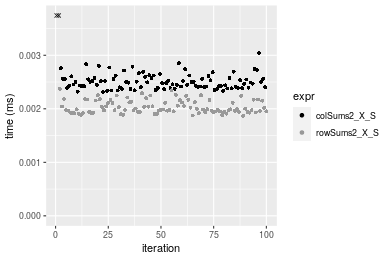
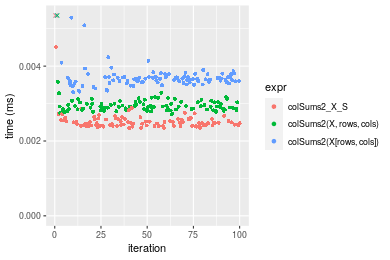
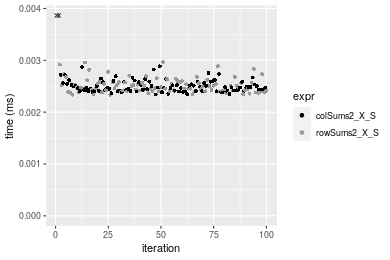
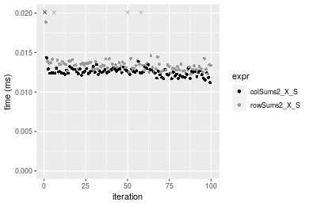
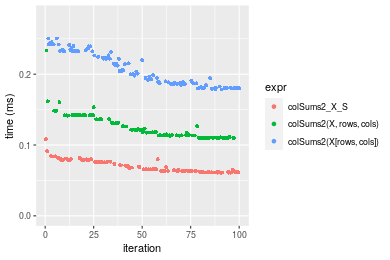

[matrixStats]: Benchmark report

---------------------------------------


# colSums2() and rowSums2() benchmarks  on subsetted computation

This report benchmark the performance of colSums2() and rowSums2() on subsetted computation.


## Data type "integer"

### Data
```r
> rmatrix <- function(nrow, ncol, mode = c("logical", "double", "integer", "index"), range = c(-100, 
+     +100), na_prob = 0) {
+     mode <- match.arg(mode)
+     n <- nrow * ncol
+     if (mode == "logical") {
+         x <- sample(c(FALSE, TRUE), size = n, replace = TRUE)
+     }     else if (mode == "index") {
+         x <- seq_len(n)
+         mode <- "integer"
+     }     else {
+         x <- runif(n, min = range[1], max = range[2])
+     }
+     storage.mode(x) <- mode
+     if (na_prob > 0) 
+         x[sample(n, size = na_prob * n)] <- NA
+     dim(x) <- c(nrow, ncol)
+     x
+ }
> rmatrices <- function(scale = 10, seed = 1, ...) {
+     set.seed(seed)
+     data <- list()
+     data[[1]] <- rmatrix(nrow = scale * 1, ncol = scale * 1, ...)
+     data[[2]] <- rmatrix(nrow = scale * 10, ncol = scale * 10, ...)
+     data[[3]] <- rmatrix(nrow = scale * 100, ncol = scale * 1, ...)
+     data[[4]] <- t(data[[3]])
+     data[[5]] <- rmatrix(nrow = scale * 10, ncol = scale * 100, ...)
+     data[[6]] <- t(data[[5]])
+     names(data) <- sapply(data, FUN = function(x) paste(dim(x), collapse = "x"))
+     data
+ }
> data <- rmatrices(mode = mode)
```

### Results

#### 10x10 integer matrix

```r
> X <- data[["10x10"]]
> rows <- sample.int(nrow(X), size = nrow(X) * 0.7)
> cols <- sample.int(ncol(X), size = ncol(X) * 0.7)
> X_S <- X[rows, cols]
> gc()
           used  (Mb) gc trigger  (Mb) max used  (Mb)
Ncells  5314824 283.9    7916910 422.9  7916910 422.9
Vcells 10551177  80.5   33191153 253.3 53339345 407.0
> colStats <- microbenchmark(colSums2_X_S = colSums2(X_S, na.rm = FALSE), `colSums2(X, rows, cols)` = colSums2(X, 
+     rows = rows, cols = cols, na.rm = FALSE), `colSums2(X[rows, cols])` = colSums2(X[rows, cols], 
+     na.rm = FALSE), unit = "ms")
> X <- t(X)
> X_S <- t(X_S)
> gc()
           used  (Mb) gc trigger  (Mb) max used  (Mb)
Ncells  5302496 283.2    7916910 422.9  7916910 422.9
Vcells 10510317  80.2   33191153 253.3 53339345 407.0
> rowStats <- microbenchmark(rowSums2_X_S = rowSums2(X_S, na.rm = FALSE), `rowSums2(X, cols, rows)` = rowSums2(X, 
+     rows = cols, cols = rows, na.rm = FALSE), `rowSums2(X[cols, rows])` = rowSums2(X[cols, rows], 
+     na.rm = FALSE), unit = "ms")
```

_Table: Benchmarking of colSums2_X_S(), colSums2(X, rows, cols)() and colSums2(X[rows, cols])() on integer+10x10 data. The top panel shows times in milliseconds and the bottom panel shows relative times._


|   |expr                    |      min|       lq|      mean|    median|        uq|      max|
|:--|:-----------------------|--------:|--------:|---------:|---------:|---------:|--------:|
|1  |colSums2_X_S            | 0.002316| 0.002403| 0.0042154| 0.0024930| 0.0025880| 0.171107|
|2  |colSums2(X, rows, cols) | 0.002642| 0.002754| 0.0028602| 0.0027970| 0.0028915| 0.005203|
|3  |colSums2(X[rows, cols]) | 0.003259| 0.003513| 0.0037776| 0.0036155| 0.0037805| 0.009327|


|   |expr                    |      min|       lq|      mean|   median|       uq|       max|
|:--|:-----------------------|--------:|--------:|---------:|--------:|--------:|---------:|
|1  |colSums2_X_S            | 1.000000| 1.000000| 1.0000000| 1.000000| 1.000000| 1.0000000|
|2  |colSums2(X, rows, cols) | 1.140760| 1.146067| 0.6785098| 1.121941| 1.117272| 0.0304079|
|3  |colSums2(X[rows, cols]) | 1.407167| 1.461923| 0.8961491| 1.450261| 1.460781| 0.0545098|

_Table: Benchmarking of rowSums2_X_S(), rowSums2(X, cols, rows)() and rowSums2(X[cols, rows])() on integer+10x10 data (transposed). The top panel shows times in milliseconds and the bottom panel shows relative times._


|   |expr                    |      min|        lq|      mean|    median|       uq|      max|
|:--|:-----------------------|--------:|---------:|---------:|---------:|--------:|--------:|
|1  |rowSums2_X_S            | 0.001869| 0.0019430| 0.0020549| 0.0019900| 0.002142| 0.003934|
|2  |rowSums2(X, cols, rows) | 0.002119| 0.0022120| 0.0037345| 0.0022715| 0.002373| 0.143996|
|3  |rowSums2(X[cols, rows]) | 0.002585| 0.0027965| 0.0029551| 0.0028880| 0.003017| 0.004617|


|   |expr                    |      min|       lq|     mean|   median|       uq|       max|
|:--|:-----------------------|--------:|--------:|--------:|--------:|--------:|---------:|
|1  |rowSums2_X_S            | 1.000000| 1.000000| 1.000000| 1.000000| 1.000000|  1.000000|
|2  |rowSums2(X, cols, rows) | 1.133761| 1.138446| 1.817317| 1.141457| 1.107843| 36.602949|
|3  |rowSums2(X[cols, rows]) | 1.383093| 1.439269| 1.438059| 1.451256| 1.408497|  1.173615|

_Figure: Benchmarking of colSums2_X_S(), colSums2(X, rows, cols)() and colSums2(X[rows, cols])() on integer+10x10 data  as well as rowSums2_X_S(), rowSums2(X, cols, rows)() and rowSums2(X[cols, rows])() on the same data transposed.  Outliers are displayed as crosses.  Times are in milliseconds._


_Table: Benchmarking of colSums2_X_S() and rowSums2_X_S() on integer+10x10 data (original and transposed).  The top panel shows times in milliseconds and the bottom panel shows relative times._


|   |expr         |   min|    lq|    mean| median|    uq|     max|
|:--|:------------|-----:|-----:|-------:|------:|-----:|-------:|
|2  |rowSums2_X_S | 1.869| 1.943| 2.05493|  1.990| 2.142|   3.934|
|1  |colSums2_X_S | 2.316| 2.403| 4.21537|  2.493| 2.588| 171.107|


|   |expr         |      min|       lq|     mean|   median|       uq|      max|
|:--|:------------|--------:|--------:|--------:|--------:|--------:|--------:|
|2  |rowSums2_X_S | 1.000000| 1.000000| 1.000000| 1.000000| 1.000000|  1.00000|
|1  |colSums2_X_S | 1.239165| 1.236747| 2.051345| 1.252764| 1.208217| 43.49441|

_Figure: Benchmarking of colSums2_X_S() and rowSums2_X_S() on integer+10x10 data (original and transposed).  Outliers are displayed as crosses. Times are in milliseconds._




#### 100x100 integer matrix

```r
> X <- data[["100x100"]]
> rows <- sample.int(nrow(X), size = nrow(X) * 0.7)
> cols <- sample.int(ncol(X), size = ncol(X) * 0.7)
> X_S <- X[rows, cols]
> gc()
           used  (Mb) gc trigger  (Mb) max used  (Mb)
Ncells  5301206 283.2    7916910 422.9  7916910 422.9
Vcells 10179412  77.7   33191153 253.3 53339345 407.0
> colStats <- microbenchmark(colSums2_X_S = colSums2(X_S, na.rm = FALSE), `colSums2(X, rows, cols)` = colSums2(X, 
+     rows = rows, cols = cols, na.rm = FALSE), `colSums2(X[rows, cols])` = colSums2(X[rows, cols], 
+     na.rm = FALSE), unit = "ms")
> X <- t(X)
> X_S <- t(X_S)
> gc()
           used  (Mb) gc trigger  (Mb) max used  (Mb)
Ncells  5301200 283.2    7916910 422.9  7916910 422.9
Vcells 10184495  77.8   33191153 253.3 53339345 407.0
> rowStats <- microbenchmark(rowSums2_X_S = rowSums2(X_S, na.rm = FALSE), `rowSums2(X, cols, rows)` = rowSums2(X, 
+     rows = cols, cols = rows, na.rm = FALSE), `rowSums2(X[cols, rows])` = rowSums2(X[cols, rows], 
+     na.rm = FALSE), unit = "ms")
```

_Table: Benchmarking of colSums2_X_S(), colSums2(X, rows, cols)() and colSums2(X[rows, cols])() on integer+100x100 data. The top panel shows times in milliseconds and the bottom panel shows relative times._


|   |expr                    |      min|        lq|      mean|    median|        uq|      max|
|:--|:-----------------------|--------:|---------:|---------:|---------:|---------:|--------:|
|1  |colSums2_X_S            | 0.008729| 0.0092500| 0.0094428| 0.0093860| 0.0095560| 0.013562|
|2  |colSums2(X, rows, cols) | 0.010685| 0.0112615| 0.0116479| 0.0114020| 0.0116605| 0.027005|
|3  |colSums2(X[rows, cols]) | 0.019133| 0.0197825| 0.0207284| 0.0199755| 0.0203620| 0.069989|


|   |expr                    |      min|       lq|     mean|   median|       uq|      max|
|:--|:-----------------------|--------:|--------:|--------:|--------:|--------:|--------:|
|1  |colSums2_X_S            | 1.000000| 1.000000| 1.000000| 1.000000| 1.000000| 1.000000|
|2  |colSums2(X, rows, cols) | 1.224081| 1.217459| 1.233526| 1.214788| 1.220228| 1.991226|
|3  |colSums2(X[rows, cols]) | 2.191889| 2.138649| 2.195152| 2.128223| 2.130808| 5.160670|

_Table: Benchmarking of rowSums2_X_S(), rowSums2(X, cols, rows)() and rowSums2(X[cols, rows])() on integer+100x100 data (transposed). The top panel shows times in milliseconds and the bottom panel shows relative times._


|   |expr                    |      min|        lq|      mean|    median|        uq|      max|
|:--|:-----------------------|--------:|---------:|---------:|---------:|---------:|--------:|
|1  |rowSums2_X_S            | 0.009558| 0.0100625| 0.0103888| 0.0102950| 0.0104620| 0.021480|
|2  |rowSums2(X, cols, rows) | 0.011635| 0.0119750| 0.0124275| 0.0121325| 0.0122575| 0.039039|
|3  |rowSums2(X[cols, rows]) | 0.020905| 0.0215570| 0.0219882| 0.0217545| 0.0219440| 0.028624|


|   |expr                    |      min|       lq|     mean|   median|       uq|      max|
|:--|:-----------------------|--------:|--------:|--------:|--------:|--------:|--------:|
|1  |rowSums2_X_S            | 1.000000| 1.000000| 1.000000| 1.000000| 1.000000| 1.000000|
|2  |rowSums2(X, cols, rows) | 1.217305| 1.190062| 1.196237| 1.178485| 1.171621| 1.817458|
|3  |rowSums2(X[cols, rows]) | 2.187173| 2.142311| 2.116524| 2.113113| 2.097496| 1.332588|

_Figure: Benchmarking of colSums2_X_S(), colSums2(X, rows, cols)() and colSums2(X[rows, cols])() on integer+100x100 data  as well as rowSums2_X_S(), rowSums2(X, cols, rows)() and rowSums2(X[cols, rows])() on the same data transposed.  Outliers are displayed as crosses.  Times are in milliseconds._


_Table: Benchmarking of colSums2_X_S() and rowSums2_X_S() on integer+100x100 data (original and transposed).  The top panel shows times in milliseconds and the bottom panel shows relative times._


|   |expr         |   min|      lq|     mean| median|     uq|    max|
|:--|:------------|-----:|-------:|--------:|------:|------:|------:|
|1  |colSums2_X_S | 8.729|  9.2500|  9.44280|  9.386|  9.556| 13.562|
|2  |rowSums2_X_S | 9.558| 10.0625| 10.38881| 10.295| 10.462| 21.480|


|   |expr         |      min|       lq|     mean|   median|       uq|      max|
|:--|:------------|--------:|--------:|--------:|--------:|--------:|--------:|
|1  |colSums2_X_S | 1.000000| 1.000000| 1.000000| 1.000000| 1.000000| 1.000000|
|2  |rowSums2_X_S | 1.094971| 1.087838| 1.100183| 1.096846| 1.094809| 1.583837|

_Figure: Benchmarking of colSums2_X_S() and rowSums2_X_S() on integer+100x100 data (original and transposed).  Outliers are displayed as crosses. Times are in milliseconds._


#### 1000x10 integer matrix

```r
> X <- data[["1000x10"]]
> rows <- sample.int(nrow(X), size = nrow(X) * 0.7)
> cols <- sample.int(ncol(X), size = ncol(X) * 0.7)
> X_S <- X[rows, cols]
> gc()
           used  (Mb) gc trigger  (Mb) max used  (Mb)
Ncells  5301949 283.2    7916910 422.9  7916910 422.9
Vcells 10183453  77.7   33191153 253.3 53339345 407.0
> colStats <- microbenchmark(colSums2_X_S = colSums2(X_S, na.rm = FALSE), `colSums2(X, rows, cols)` = colSums2(X, 
+     rows = rows, cols = cols, na.rm = FALSE), `colSums2(X[rows, cols])` = colSums2(X[rows, cols], 
+     na.rm = FALSE), unit = "ms")
> X <- t(X)
> X_S <- t(X_S)
> gc()
           used  (Mb) gc trigger  (Mb) max used  (Mb)
Ncells  5301943 283.2    7916910 422.9  7916910 422.9
Vcells 10188536  77.8   33191153 253.3 53339345 407.0
> rowStats <- microbenchmark(rowSums2_X_S = rowSums2(X_S, na.rm = FALSE), `rowSums2(X, cols, rows)` = rowSums2(X, 
+     rows = cols, cols = rows, na.rm = FALSE), `rowSums2(X[cols, rows])` = rowSums2(X[cols, rows], 
+     na.rm = FALSE), unit = "ms")
```

_Table: Benchmarking of colSums2_X_S(), colSums2(X, rows, cols)() and colSums2(X[rows, cols])() on integer+1000x10 data. The top panel shows times in milliseconds and the bottom panel shows relative times._


|   |expr                    |      min|        lq|      mean|    median|        uq|      max|
|:--|:-----------------------|--------:|---------:|---------:|---------:|---------:|--------:|
|1  |colSums2_X_S            | 0.010044| 0.0103990| 0.0122987| 0.0106630| 0.0144510| 0.021642|
|2  |colSums2(X, rows, cols) | 0.012258| 0.0126535| 0.0159935| 0.0129625| 0.0206970| 0.038640|
|3  |colSums2(X[rows, cols]) | 0.020871| 0.0213755| 0.0280079| 0.0227695| 0.0339855| 0.070511|


|   |expr                    |      min|       lq|     mean|   median|       uq|      max|
|:--|:-----------------------|--------:|--------:|--------:|--------:|--------:|--------:|
|1  |colSums2_X_S            | 1.000000| 1.000000| 1.000000| 1.000000| 1.000000| 1.000000|
|2  |colSums2(X, rows, cols) | 1.220430| 1.216800| 1.300424| 1.215652| 1.432219| 1.785417|
|3  |colSums2(X[rows, cols]) | 2.077957| 2.055534| 2.277310| 2.135375| 2.351775| 3.258063|

_Table: Benchmarking of rowSums2_X_S(), rowSums2(X, cols, rows)() and rowSums2(X[cols, rows])() on integer+1000x10 data (transposed). The top panel shows times in milliseconds and the bottom panel shows relative times._


|   |expr                    |      min|        lq|      mean|    median|        uq|      max|
|:--|:-----------------------|--------:|---------:|---------:|---------:|---------:|--------:|
|1  |rowSums2_X_S            | 0.011398| 0.0119945| 0.0129188| 0.0123815| 0.0129920| 0.020887|
|2  |rowSums2(X, cols, rows) | 0.013514| 0.0140985| 0.0155152| 0.0144615| 0.0151190| 0.033319|
|3  |rowSums2(X[cols, rows]) | 0.025292| 0.0260055| 0.0290323| 0.0270035| 0.0281085| 0.117424|


|   |expr                    |      min|       lq|     mean|   median|       uq|      max|
|:--|:-----------------------|--------:|--------:|--------:|--------:|--------:|--------:|
|1  |rowSums2_X_S            | 1.000000| 1.000000| 1.000000| 1.000000| 1.000000| 1.000000|
|2  |rowSums2(X, cols, rows) | 1.185647| 1.175414| 1.200978| 1.167993| 1.163716| 1.595203|
|3  |rowSums2(X[cols, rows]) | 2.218986| 2.168119| 2.247286| 2.180956| 2.163524| 5.621870|

_Figure: Benchmarking of colSums2_X_S(), colSums2(X, rows, cols)() and colSums2(X[rows, cols])() on integer+1000x10 data  as well as rowSums2_X_S(), rowSums2(X, cols, rows)() and rowSums2(X[cols, rows])() on the same data transposed.  Outliers are displayed as crosses.  Times are in milliseconds._


_Table: Benchmarking of colSums2_X_S() and rowSums2_X_S() on integer+1000x10 data (original and transposed).  The top panel shows times in milliseconds and the bottom panel shows relative times._


|   |expr         |    min|      lq|     mean|  median|     uq|    max|
|:--|:------------|------:|-------:|--------:|-------:|------:|------:|
|1  |colSums2_X_S | 10.044| 10.3990| 12.29868| 10.6630| 14.451| 21.642|
|2  |rowSums2_X_S | 11.398| 11.9945| 12.91881| 12.3815| 12.992| 20.887|


|   |expr         |      min|       lq|     mean|   median|        uq|       max|
|:--|:------------|--------:|--------:|--------:|--------:|---------:|---------:|
|1  |colSums2_X_S | 1.000000| 1.000000| 1.000000| 1.000000| 1.0000000| 1.0000000|
|2  |rowSums2_X_S | 1.134807| 1.153428| 1.050423| 1.161165| 0.8990381| 0.9651141|

_Figure: Benchmarking of colSums2_X_S() and rowSums2_X_S() on integer+1000x10 data (original and transposed).  Outliers are displayed as crosses. Times are in milliseconds._


#### 10x1000 integer matrix

```r
> X <- data[["10x1000"]]
> rows <- sample.int(nrow(X), size = nrow(X) * 0.7)
> cols <- sample.int(ncol(X), size = ncol(X) * 0.7)
> X_S <- X[rows, cols]
> gc()
           used  (Mb) gc trigger  (Mb) max used  (Mb)
Ncells  5302154 283.2    7916910 422.9  7916910 422.9
Vcells 10184297  77.8   33191153 253.3 53339345 407.0
> colStats <- microbenchmark(colSums2_X_S = colSums2(X_S, na.rm = FALSE), `colSums2(X, rows, cols)` = colSums2(X, 
+     rows = rows, cols = cols, na.rm = FALSE), `colSums2(X[rows, cols])` = colSums2(X[rows, cols], 
+     na.rm = FALSE), unit = "ms")
> X <- t(X)
> X_S <- t(X_S)
> gc()
           used  (Mb) gc trigger  (Mb) max used  (Mb)
Ncells  5302148 283.2    7916910 422.9  7916910 422.9
Vcells 10189380  77.8   33191153 253.3 53339345 407.0
> rowStats <- microbenchmark(rowSums2_X_S = rowSums2(X_S, na.rm = FALSE), `rowSums2(X, cols, rows)` = rowSums2(X, 
+     rows = cols, cols = rows, na.rm = FALSE), `rowSums2(X[cols, rows])` = rowSums2(X[cols, rows], 
+     na.rm = FALSE), unit = "ms")
```

_Table: Benchmarking of colSums2_X_S(), colSums2(X, rows, cols)() and colSums2(X[rows, cols])() on integer+10x1000 data. The top panel shows times in milliseconds and the bottom panel shows relative times._


|   |expr                    |      min|        lq|      mean|    median|        uq|      max|
|:--|:-----------------------|--------:|---------:|---------:|---------:|---------:|--------:|
|1  |colSums2_X_S            | 0.011157| 0.0115725| 0.0121712| 0.0117770| 0.0120475| 0.033054|
|2  |colSums2(X, rows, cols) | 0.013578| 0.0140480| 0.0145518| 0.0143615| 0.0147585| 0.027031|
|3  |colSums2(X[rows, cols]) | 0.024245| 0.0250570| 0.0258912| 0.0257265| 0.0259075| 0.040396|


|   |expr                    |      min|       lq|     mean|   median|       uq|      max|
|:--|:-----------------------|--------:|--------:|--------:|--------:|--------:|--------:|
|1  |colSums2_X_S            | 1.000000| 1.000000| 1.000000| 1.000000| 1.000000| 1.000000|
|2  |colSums2(X, rows, cols) | 1.216994| 1.213912| 1.195585| 1.219453| 1.225026| 0.817783|
|3  |colSums2(X[rows, cols]) | 2.173075| 2.165219| 2.127241| 2.184470| 2.150446| 1.222121|

_Table: Benchmarking of rowSums2_X_S(), rowSums2(X, cols, rows)() and rowSums2(X[cols, rows])() on integer+10x1000 data (transposed). The top panel shows times in milliseconds and the bottom panel shows relative times._


|   |expr                    |      min|       lq|      mean|    median|       uq|      max|
|:--|:-----------------------|--------:|--------:|---------:|---------:|--------:|--------:|
|1  |rowSums2_X_S            | 0.011518| 0.011811| 0.0120629| 0.0119535| 0.012196| 0.016302|
|2  |rowSums2(X, cols, rows) | 0.014313| 0.014660| 0.0151715| 0.0148175| 0.015115| 0.040562|
|3  |rowSums2(X[cols, rows]) | 0.023530| 0.023992| 0.0245609| 0.0242060| 0.024589| 0.032016|


|   |expr                    |      min|       lq|     mean|   median|       uq|      max|
|:--|:-----------------------|--------:|--------:|--------:|--------:|--------:|--------:|
|1  |rowSums2_X_S            | 1.000000| 1.000000| 1.000000| 1.000000| 1.000000| 1.000000|
|2  |rowSums2(X, cols, rows) | 1.242664| 1.241216| 1.257698| 1.239595| 1.239341| 2.488161|
|3  |rowSums2(X[cols, rows]) | 2.042889| 2.031327| 2.036068| 2.025014| 2.016153| 1.963931|

_Figure: Benchmarking of colSums2_X_S(), colSums2(X, rows, cols)() and colSums2(X[rows, cols])() on integer+10x1000 data  as well as rowSums2_X_S(), rowSums2(X, cols, rows)() and rowSums2(X[cols, rows])() on the same data transposed.  Outliers are displayed as crosses.  Times are in milliseconds._


_Table: Benchmarking of colSums2_X_S() and rowSums2_X_S() on integer+10x1000 data (original and transposed).  The top panel shows times in milliseconds and the bottom panel shows relative times._


|   |expr         |    min|      lq|     mean|  median|      uq|    max|
|:--|:------------|------:|-------:|--------:|-------:|-------:|------:|
|1  |colSums2_X_S | 11.157| 11.5725| 12.17125| 11.7770| 12.0475| 33.054|
|2  |rowSums2_X_S | 11.518| 11.8110| 12.06290| 11.9535| 12.1960| 16.302|


|   |expr         |      min|       lq|      mean|   median|       uq|      max|
|:--|:------------|--------:|--------:|---------:|--------:|--------:|--------:|
|1  |colSums2_X_S | 1.000000| 1.000000| 1.0000000| 1.000000| 1.000000| 1.000000|
|2  |rowSums2_X_S | 1.032356| 1.020609| 0.9910979| 1.014987| 1.012326| 0.493193|

_Figure: Benchmarking of colSums2_X_S() and rowSums2_X_S() on integer+10x1000 data (original and transposed).  Outliers are displayed as crosses. Times are in milliseconds._


#### 100x1000 integer matrix

```r
> X <- data[["100x1000"]]
> rows <- sample.int(nrow(X), size = nrow(X) * 0.7)
> cols <- sample.int(ncol(X), size = ncol(X) * 0.7)
> X_S <- X[rows, cols]
> gc()
           used  (Mb) gc trigger  (Mb) max used  (Mb)
Ncells  5302364 283.2    7916910 422.9  7916910 422.9
Vcells 10206969  77.9   33191153 253.3 53339345 407.0
> colStats <- microbenchmark(colSums2_X_S = colSums2(X_S, na.rm = FALSE), `colSums2(X, rows, cols)` = colSums2(X, 
+     rows = rows, cols = cols, na.rm = FALSE), `colSums2(X[rows, cols])` = colSums2(X[rows, cols], 
+     na.rm = FALSE), unit = "ms")
> X <- t(X)
> X_S <- t(X_S)
> gc()
           used  (Mb) gc trigger  (Mb) max used  (Mb)
Ncells  5302358 283.2    7916910 422.9  7916910 422.9
Vcells 10257052  78.3   33191153 253.3 53339345 407.0
> rowStats <- microbenchmark(rowSums2_X_S = rowSums2(X_S, na.rm = FALSE), `rowSums2(X, cols, rows)` = rowSums2(X, 
+     rows = cols, cols = rows, na.rm = FALSE), `rowSums2(X[cols, rows])` = rowSums2(X[cols, rows], 
+     na.rm = FALSE), unit = "ms")
```

_Table: Benchmarking of colSums2_X_S(), colSums2(X, rows, cols)() and colSums2(X[rows, cols])() on integer+100x1000 data. The top panel shows times in milliseconds and the bottom panel shows relative times._


|   |expr                    |      min|       lq|      mean|    median|        uq|      max|
|:--|:-----------------------|--------:|--------:|---------:|---------:|---------:|--------:|
|1  |colSums2_X_S            | 0.058661| 0.060829| 0.0704060| 0.0684605| 0.0747285| 0.114031|
|2  |colSums2(X, rows, cols) | 0.076577| 0.079850| 0.0942961| 0.0924130| 0.0992465| 0.159023|
|3  |colSums2(X[rows, cols]) | 0.143722| 0.155078| 0.1763339| 0.1734750| 0.1892045| 0.262634|


|   |expr                    |      min|       lq|     mean|   median|       uq|      max|
|:--|:-----------------------|--------:|--------:|--------:|--------:|--------:|--------:|
|1  |colSums2_X_S            | 1.000000| 1.000000| 1.000000| 1.000000| 1.000000| 1.000000|
|2  |colSums2(X, rows, cols) | 1.305416| 1.312696| 1.339320| 1.349873| 1.328094| 1.394559|
|3  |colSums2(X[rows, cols]) | 2.450044| 2.549409| 2.504531| 2.533943| 2.531892| 2.303181|

_Table: Benchmarking of rowSums2_X_S(), rowSums2(X, cols, rows)() and rowSums2(X[cols, rows])() on integer+100x1000 data (transposed). The top panel shows times in milliseconds and the bottom panel shows relative times._


|   |expr                    |      min|        lq|      mean|    median|        uq|      max|
|:--|:-----------------------|--------:|---------:|---------:|---------:|---------:|--------:|
|1  |rowSums2_X_S            | 0.059031| 0.0685180| 0.0797687| 0.0751715| 0.0811330| 0.164440|
|2  |rowSums2(X, cols, rows) | 0.093292| 0.1005085| 0.1218268| 0.1083040| 0.1213630| 0.248732|
|3  |rowSums2(X[cols, rows]) | 0.138484| 0.1569265| 0.1879376| 0.1732365| 0.1911615| 0.356114|


|   |expr                    |      min|       lq|     mean|   median|       uq|      max|
|:--|:-----------------------|--------:|--------:|--------:|--------:|--------:|--------:|
|1  |rowSums2_X_S            | 1.000000| 1.000000| 1.000000| 1.000000| 1.000000| 1.000000|
|2  |rowSums2(X, cols, rows) | 1.580390| 1.466892| 1.527250| 1.440759| 1.495853| 1.512600|
|3  |rowSums2(X[cols, rows]) | 2.345954| 2.290296| 2.356031| 2.304550| 2.356150| 2.165617|

_Figure: Benchmarking of colSums2_X_S(), colSums2(X, rows, cols)() and colSums2(X[rows, cols])() on integer+100x1000 data  as well as rowSums2_X_S(), rowSums2(X, cols, rows)() and rowSums2(X[cols, rows])() on the same data transposed.  Outliers are displayed as crosses.  Times are in milliseconds._


_Table: Benchmarking of colSums2_X_S() and rowSums2_X_S() on integer+100x1000 data (original and transposed).  The top panel shows times in milliseconds and the bottom panel shows relative times._


|   |expr         |    min|     lq|     mean|  median|      uq|     max|
|:--|:------------|------:|------:|--------:|-------:|-------:|-------:|
|1  |colSums2_X_S | 58.661| 60.829| 70.40595| 68.4605| 74.7285| 114.031|
|2  |rowSums2_X_S | 59.031| 68.518| 79.76871| 75.1715| 81.1330| 164.440|


|   |expr         |      min|       lq|     mean|   median|       uq|      max|
|:--|:------------|--------:|--------:|--------:|--------:|--------:|--------:|
|1  |colSums2_X_S | 1.000000| 1.000000| 1.000000| 1.000000| 1.000000| 1.000000|
|2  |rowSums2_X_S | 1.006307| 1.126403| 1.132983| 1.098027| 1.085704| 1.442064|

_Figure: Benchmarking of colSums2_X_S() and rowSums2_X_S() on integer+100x1000 data (original and transposed).  Outliers are displayed as crosses. Times are in milliseconds._


#### 1000x100 integer matrix

```r
> X <- data[["1000x100"]]
> rows <- sample.int(nrow(X), size = nrow(X) * 0.7)
> cols <- sample.int(ncol(X), size = ncol(X) * 0.7)
> X_S <- X[rows, cols]
> gc()
           used  (Mb) gc trigger  (Mb) max used  (Mb)
Ncells  5302577 283.2    7916910 422.9  7916910 422.9
Vcells 10207748  77.9   33191153 253.3 53339345 407.0
> colStats <- microbenchmark(colSums2_X_S = colSums2(X_S, na.rm = FALSE), `colSums2(X, rows, cols)` = colSums2(X, 
+     rows = rows, cols = cols, na.rm = FALSE), `colSums2(X[rows, cols])` = colSums2(X[rows, cols], 
+     na.rm = FALSE), unit = "ms")
> X <- t(X)
> X_S <- t(X_S)
> gc()
           used  (Mb) gc trigger  (Mb) max used  (Mb)
Ncells  5302571 283.2    7916910 422.9  7916910 422.9
Vcells 10257831  78.3   33191153 253.3 53339345 407.0
> rowStats <- microbenchmark(rowSums2_X_S = rowSums2(X_S, na.rm = FALSE), `rowSums2(X, cols, rows)` = rowSums2(X, 
+     rows = cols, cols = rows, na.rm = FALSE), `rowSums2(X[cols, rows])` = rowSums2(X[cols, rows], 
+     na.rm = FALSE), unit = "ms")
```

_Table: Benchmarking of colSums2_X_S(), colSums2(X, rows, cols)() and colSums2(X[rows, cols])() on integer+1000x100 data. The top panel shows times in milliseconds and the bottom panel shows relative times._


|   |expr                    |      min|        lq|      mean|   median|        uq|      max|
|:--|:-----------------------|--------:|---------:|---------:|--------:|---------:|--------:|
|1  |colSums2_X_S            | 0.064606| 0.0683840| 0.0735184| 0.069482| 0.0776080| 0.121728|
|2  |colSums2(X, rows, cols) | 0.070671| 0.0749850| 0.0816940| 0.080333| 0.0867945| 0.107117|
|3  |colSums2(X[rows, cols]) | 0.141236| 0.1507725| 0.1644976| 0.163143| 0.1747045| 0.247660|


|   |expr                    |      min|       lq|     mean|   median|       uq|       max|
|:--|:-----------------------|--------:|--------:|--------:|--------:|--------:|---------:|
|1  |colSums2_X_S            | 1.000000| 1.000000| 1.000000| 1.000000| 1.000000| 1.0000000|
|2  |colSums2(X, rows, cols) | 1.093877| 1.096528| 1.111204| 1.156170| 1.118370| 0.8799701|
|3  |colSums2(X[rows, cols]) | 2.186113| 2.204792| 2.237502| 2.347989| 2.251115| 2.0345360|

_Table: Benchmarking of rowSums2_X_S(), rowSums2(X, cols, rows)() and rowSums2(X[cols, rows])() on integer+1000x100 data (transposed). The top panel shows times in milliseconds and the bottom panel shows relative times._


|   |expr                    |      min|       lq|      mean|   median|       uq|      max|
|:--|:-----------------------|--------:|--------:|---------:|--------:|--------:|--------:|
|1  |rowSums2_X_S            | 0.065778| 0.071136| 0.0773413| 0.074036| 0.082757| 0.104619|
|2  |rowSums2(X, cols, rows) | 0.087792| 0.094717| 0.1037324| 0.098624| 0.112170| 0.192951|
|3  |rowSums2(X[cols, rows]) | 0.142763| 0.152797| 0.1675265| 0.161947| 0.181091| 0.232181|


|   |expr                    |      min|       lq|     mean|   median|       uq|      max|
|:--|:-----------------------|--------:|--------:|--------:|--------:|--------:|--------:|
|1  |rowSums2_X_S            | 1.000000| 1.000000| 1.000000| 1.000000| 1.000000| 1.000000|
|2  |rowSums2(X, cols, rows) | 1.334671| 1.331492| 1.341230| 1.332109| 1.355414| 1.844321|
|3  |rowSums2(X[cols, rows]) | 2.170376| 2.147956| 2.166069| 2.187409| 2.188226| 2.219301|

_Figure: Benchmarking of colSums2_X_S(), colSums2(X, rows, cols)() and colSums2(X[rows, cols])() on integer+1000x100 data  as well as rowSums2_X_S(), rowSums2(X, cols, rows)() and rowSums2(X[cols, rows])() on the same data transposed.  Outliers are displayed as crosses.  Times are in milliseconds._


_Table: Benchmarking of colSums2_X_S() and rowSums2_X_S() on integer+1000x100 data (original and transposed).  The top panel shows times in milliseconds and the bottom panel shows relative times._


|   |expr         |    min|     lq|     mean| median|     uq|     max|
|:--|:------------|------:|------:|--------:|------:|------:|-------:|
|1  |colSums2_X_S | 64.606| 68.384| 73.51841| 69.482| 77.608| 121.728|
|2  |rowSums2_X_S | 65.778| 71.136| 77.34126| 74.036| 82.757| 104.619|


|   |expr         |      min|       lq|     mean|   median|       uq|       max|
|:--|:------------|--------:|--------:|--------:|--------:|--------:|---------:|
|1  |colSums2_X_S | 1.000000| 1.000000| 1.000000| 1.000000| 1.000000| 1.0000000|
|2  |rowSums2_X_S | 1.018141| 1.040243| 1.051999| 1.065542| 1.066346| 0.8594489|

_Figure: Benchmarking of colSums2_X_S() and rowSums2_X_S() on integer+1000x100 data (original and transposed).  Outliers are displayed as crosses. Times are in milliseconds._


## Data type "double"

### Data
```r
> rmatrix <- function(nrow, ncol, mode = c("logical", "double", "integer", "index"), range = c(-100, 
+     +100), na_prob = 0) {
+     mode <- match.arg(mode)
+     n <- nrow * ncol
+     if (mode == "logical") {
+         x <- sample(c(FALSE, TRUE), size = n, replace = TRUE)
+     }     else if (mode == "index") {
+         x <- seq_len(n)
+         mode <- "integer"
+     }     else {
+         x <- runif(n, min = range[1], max = range[2])
+     }
+     storage.mode(x) <- mode
+     if (na_prob > 0) 
+         x[sample(n, size = na_prob * n)] <- NA
+     dim(x) <- c(nrow, ncol)
+     x
+ }
> rmatrices <- function(scale = 10, seed = 1, ...) {
+     set.seed(seed)
+     data <- list()
+     data[[1]] <- rmatrix(nrow = scale * 1, ncol = scale * 1, ...)
+     data[[2]] <- rmatrix(nrow = scale * 10, ncol = scale * 10, ...)
+     data[[3]] <- rmatrix(nrow = scale * 100, ncol = scale * 1, ...)
+     data[[4]] <- t(data[[3]])
+     data[[5]] <- rmatrix(nrow = scale * 10, ncol = scale * 100, ...)
+     data[[6]] <- t(data[[5]])
+     names(data) <- sapply(data, FUN = function(x) paste(dim(x), collapse = "x"))
+     data
+ }
> data <- rmatrices(mode = mode)
```

### Results

#### 10x10 double matrix

```r
> X <- data[["10x10"]]
> rows <- sample.int(nrow(X), size = nrow(X) * 0.7)
> cols <- sample.int(ncol(X), size = ncol(X) * 0.7)
> X_S <- X[rows, cols]
> gc()
           used  (Mb) gc trigger  (Mb) max used  (Mb)
Ncells  5302794 283.2    7916910 422.9  7916910 422.9
Vcells 10298849  78.6   33191153 253.3 53339345 407.0
> colStats <- microbenchmark(colSums2_X_S = colSums2(X_S, na.rm = FALSE), `colSums2(X, rows, cols)` = colSums2(X, 
+     rows = rows, cols = cols, na.rm = FALSE), `colSums2(X[rows, cols])` = colSums2(X[rows, cols], 
+     na.rm = FALSE), unit = "ms")
> X <- t(X)
> X_S <- t(X_S)
> gc()
           used  (Mb) gc trigger  (Mb) max used  (Mb)
Ncells  5302779 283.2    7916910 422.9  7916910 422.9
Vcells 10299017  78.6   33191153 253.3 53339345 407.0
> rowStats <- microbenchmark(rowSums2_X_S = rowSums2(X_S, na.rm = FALSE), `rowSums2(X, cols, rows)` = rowSums2(X, 
+     rows = cols, cols = rows, na.rm = FALSE), `rowSums2(X[cols, rows])` = rowSums2(X[cols, rows], 
+     na.rm = FALSE), unit = "ms")
```

_Table: Benchmarking of colSums2_X_S(), colSums2(X, rows, cols)() and colSums2(X[rows, cols])() on double+10x10 data. The top panel shows times in milliseconds and the bottom panel shows relative times._


|   |expr                    |      min|       lq|      mean|    median|       uq|      max|
|:--|:-----------------------|--------:|--------:|---------:|---------:|--------:|--------:|
|1  |colSums2_X_S            | 0.002341| 0.002414| 0.0027210| 0.0024780| 0.002578| 0.022386|
|2  |colSums2(X, rows, cols) | 0.002714| 0.002840| 0.0029690| 0.0029170| 0.003032| 0.005705|
|3  |colSums2(X[rows, cols]) | 0.003303| 0.003574| 0.0037463| 0.0036495| 0.003712| 0.010135|


|   |expr                    |      min|       lq|     mean|   median|       uq|       max|
|:--|:-----------------------|--------:|--------:|--------:|--------:|--------:|---------:|
|1  |colSums2_X_S            | 1.000000| 1.000000| 1.000000| 1.000000| 1.000000| 1.0000000|
|2  |colSums2(X, rows, cols) | 1.159334| 1.176471| 1.091147| 1.177159| 1.176106| 0.2548468|
|3  |colSums2(X[rows, cols]) | 1.410935| 1.480530| 1.376795| 1.472760| 1.439876| 0.4527383|

_Table: Benchmarking of rowSums2_X_S(), rowSums2(X, cols, rows)() and rowSums2(X[cols, rows])() on double+10x10 data (transposed). The top panel shows times in milliseconds and the bottom panel shows relative times._


|   |expr                    |      min|        lq|      mean|    median|        uq|      max|
|:--|:-----------------------|--------:|---------:|---------:|---------:|---------:|--------:|
|1  |rowSums2_X_S            | 0.002333| 0.0024105| 0.0025451| 0.0024800| 0.0025760| 0.005639|
|2  |rowSums2(X, cols, rows) | 0.002684| 0.0028410| 0.0033580| 0.0029210| 0.0030395| 0.041357|
|3  |rowSums2(X[cols, rows]) | 0.003303| 0.0035485| 0.0037562| 0.0036225| 0.0037710| 0.010750|


|   |expr                    |      min|       lq|     mean|   median|       uq|      max|
|:--|:-----------------------|--------:|--------:|--------:|--------:|--------:|--------:|
|1  |rowSums2_X_S            | 1.000000| 1.000000| 1.000000| 1.000000| 1.000000| 1.000000|
|2  |rowSums2(X, cols, rows) | 1.150450| 1.178594| 1.319384| 1.177823| 1.179930| 7.334102|
|3  |rowSums2(X[cols, rows]) | 1.415774| 1.472101| 1.475881| 1.460686| 1.463898| 1.906366|

_Figure: Benchmarking of colSums2_X_S(), colSums2(X, rows, cols)() and colSums2(X[rows, cols])() on double+10x10 data  as well as rowSums2_X_S(), rowSums2(X, cols, rows)() and rowSums2(X[cols, rows])() on the same data transposed.  Outliers are displayed as crosses.  Times are in milliseconds._





_Table: Benchmarking of colSums2_X_S() and rowSums2_X_S() on double+10x10 data (original and transposed).  The top panel shows times in milliseconds and the bottom panel shows relative times._


|   |expr         |   min|     lq|    mean| median|    uq|    max|
|:--|:------------|-----:|------:|-------:|------:|-----:|------:|
|1  |colSums2_X_S | 2.341| 2.4140| 2.72100|  2.478| 2.578| 22.386|
|2  |rowSums2_X_S | 2.333| 2.4105| 2.54509|  2.480| 2.576|  5.639|


|   |expr         |       min|        lq|     mean|   median|        uq|       max|
|:--|:------------|---------:|---------:|--------:|--------:|---------:|---------:|
|1  |colSums2_X_S | 1.0000000| 1.0000000| 1.000000| 1.000000| 1.0000000| 1.0000000|
|2  |rowSums2_X_S | 0.9965827| 0.9985501| 0.935351| 1.000807| 0.9992242| 0.2518985|

_Figure: Benchmarking of colSums2_X_S() and rowSums2_X_S() on double+10x10 data (original and transposed).  Outliers are displayed as crosses. Times are in milliseconds._




#### 100x100 double matrix

```r
> X <- data[["100x100"]]
> rows <- sample.int(nrow(X), size = nrow(X) * 0.7)
> cols <- sample.int(ncol(X), size = ncol(X) * 0.7)
> X_S <- X[rows, cols]
> gc()
           used  (Mb) gc trigger  (Mb) max used  (Mb)
Ncells  5302991 283.3    7916910 422.9  7916910 422.9
Vcells 10304792  78.7   33191153 253.3 53339345 407.0
> colStats <- microbenchmark(colSums2_X_S = colSums2(X_S, na.rm = FALSE), `colSums2(X, rows, cols)` = colSums2(X, 
+     rows = rows, cols = cols, na.rm = FALSE), `colSums2(X[rows, cols])` = colSums2(X[rows, cols], 
+     na.rm = FALSE), unit = "ms")
> X <- t(X)
> X_S <- t(X_S)
> gc()
           used  (Mb) gc trigger  (Mb) max used  (Mb)
Ncells  5302985 283.3    7916910 422.9  7916910 422.9
Vcells 10314875  78.7   33191153 253.3 53339345 407.0
> rowStats <- microbenchmark(rowSums2_X_S = rowSums2(X_S, na.rm = FALSE), `rowSums2(X, cols, rows)` = rowSums2(X, 
+     rows = cols, cols = rows, na.rm = FALSE), `rowSums2(X[cols, rows])` = rowSums2(X[cols, rows], 
+     na.rm = FALSE), unit = "ms")
```

_Table: Benchmarking of colSums2_X_S(), colSums2(X, rows, cols)() and colSums2(X[rows, cols])() on double+100x100 data. The top panel shows times in milliseconds and the bottom panel shows relative times._


|   |expr                    |      min|        lq|      mean|    median|        uq|      max|
|:--|:-----------------------|--------:|---------:|---------:|---------:|---------:|--------:|
|1  |colSums2_X_S            | 0.010459| 0.0107905| 0.0112199| 0.0109635| 0.0111370| 0.025726|
|2  |colSums2(X, rows, cols) | 0.016901| 0.0173970| 0.0176763| 0.0175880| 0.0177435| 0.022675|
|3  |colSums2(X[rows, cols]) | 0.026682| 0.0272295| 0.0282483| 0.0274205| 0.0277075| 0.076606|


|   |expr                    |      min|       lq|     mean|   median|       uq|      max|
|:--|:-----------------------|--------:|--------:|--------:|--------:|--------:|--------:|
|1  |colSums2_X_S            | 1.000000| 1.000000| 1.000000| 1.000000| 1.000000| 1.000000|
|2  |colSums2(X, rows, cols) | 1.615929| 1.612251| 1.575439| 1.604232| 1.593203| 0.881404|
|3  |colSums2(X[rows, cols]) | 2.551104| 2.523470| 2.517692| 2.501072| 2.487878| 2.977766|

_Table: Benchmarking of rowSums2_X_S(), rowSums2(X, cols, rows)() and rowSums2(X[cols, rows])() on double+100x100 data (transposed). The top panel shows times in milliseconds and the bottom panel shows relative times._


|   |expr                    |      min|        lq|      mean|    median|        uq|      max|
|:--|:-----------------------|--------:|---------:|---------:|---------:|---------:|--------:|
|1  |rowSums2_X_S            | 0.009046| 0.0093890| 0.0097173| 0.0096400| 0.0098320| 0.019483|
|2  |rowSums2(X, cols, rows) | 0.014577| 0.0149175| 0.0155950| 0.0151315| 0.0155135| 0.043478|
|3  |rowSums2(X[cols, rows]) | 0.022414| 0.0234785| 0.0243372| 0.0239535| 0.0243425| 0.038641|


|   |expr                    |     min|       lq|     mean|   median|       uq|      max|
|:--|:-----------------------|-------:|--------:|--------:|--------:|--------:|--------:|
|1  |rowSums2_X_S            | 1.00000| 1.000000| 1.000000| 1.000000| 1.000000| 1.000000|
|2  |rowSums2(X, cols, rows) | 1.61143| 1.588827| 1.604869| 1.569658| 1.577858| 2.231587|
|3  |rowSums2(X[cols, rows]) | 2.47778| 2.500639| 2.504516| 2.484803| 2.475844| 1.983319|

_Figure: Benchmarking of colSums2_X_S(), colSums2(X, rows, cols)() and colSums2(X[rows, cols])() on double+100x100 data  as well as rowSums2_X_S(), rowSums2(X, cols, rows)() and rowSums2(X[cols, rows])() on the same data transposed.  Outliers are displayed as crosses.  Times are in milliseconds._


_Table: Benchmarking of colSums2_X_S() and rowSums2_X_S() on double+100x100 data (original and transposed).  The top panel shows times in milliseconds and the bottom panel shows relative times._


|   |expr         |    min|      lq|     mean|  median|     uq|    max|
|:--|:------------|------:|-------:|--------:|-------:|------:|------:|
|2  |rowSums2_X_S |  9.046|  9.3890|  9.71732|  9.6400|  9.832| 19.483|
|1  |colSums2_X_S | 10.459| 10.7905| 11.21993| 10.9635| 11.137| 25.726|


|   |expr         |      min|      lq|     mean|   median|      uq|      max|
|:--|:------------|--------:|-------:|--------:|--------:|-------:|--------:|
|2  |rowSums2_X_S | 1.000000| 1.00000| 1.000000| 1.000000| 1.00000| 1.000000|
|1  |colSums2_X_S | 1.156202| 1.14927| 1.154632| 1.137293| 1.13273| 1.320433|

_Figure: Benchmarking of colSums2_X_S() and rowSums2_X_S() on double+100x100 data (original and transposed).  Outliers are displayed as crosses. Times are in milliseconds._


#### 1000x10 double matrix

```r
> X <- data[["1000x10"]]
> rows <- sample.int(nrow(X), size = nrow(X) * 0.7)
> cols <- sample.int(ncol(X), size = ncol(X) * 0.7)
> X_S <- X[rows, cols]
> gc()
           used  (Mb) gc trigger  (Mb) max used  (Mb)
Ncells  5303191 283.3    7916910 422.9  7916910 422.9
Vcells 10306189  78.7   33191153 253.3 53339345 407.0
> colStats <- microbenchmark(colSums2_X_S = colSums2(X_S, na.rm = FALSE), `colSums2(X, rows, cols)` = colSums2(X, 
+     rows = rows, cols = cols, na.rm = FALSE), `colSums2(X[rows, cols])` = colSums2(X[rows, cols], 
+     na.rm = FALSE), unit = "ms")
> X <- t(X)
> X_S <- t(X_S)
> gc()
           used  (Mb) gc trigger  (Mb) max used  (Mb)
Ncells  5303185 283.3    7916910 422.9  7916910 422.9
Vcells 10316272  78.8   33191153 253.3 53339345 407.0
> rowStats <- microbenchmark(rowSums2_X_S = rowSums2(X_S, na.rm = FALSE), `rowSums2(X, cols, rows)` = rowSums2(X, 
+     rows = cols, cols = rows, na.rm = FALSE), `rowSums2(X[cols, rows])` = rowSums2(X[cols, rows], 
+     na.rm = FALSE), unit = "ms")
```

_Table: Benchmarking of colSums2_X_S(), colSums2(X, rows, cols)() and colSums2(X[rows, cols])() on double+1000x10 data. The top panel shows times in milliseconds and the bottom panel shows relative times._


|   |expr                    |      min|       lq|      mean|    median|        uq|      max|
|:--|:-----------------------|--------:|--------:|---------:|---------:|---------:|--------:|
|1  |colSums2_X_S            | 0.010561| 0.011050| 0.0119243| 0.0113745| 0.0118005| 0.025584|
|2  |colSums2(X, rows, cols) | 0.016280| 0.016798| 0.0180738| 0.0173060| 0.0179170| 0.029592|
|3  |colSums2(X[rows, cols]) | 0.026334| 0.026877| 0.0291187| 0.0277250| 0.0286385| 0.072998|


|   |expr                    |      min|       lq|     mean|   median|       uq|      max|
|:--|:-----------------------|--------:|--------:|--------:|--------:|--------:|--------:|
|1  |colSums2_X_S            | 1.000000| 1.000000| 1.000000| 1.000000| 1.000000| 1.000000|
|2  |colSums2(X, rows, cols) | 1.541521| 1.520181| 1.515706| 1.521473| 1.518325| 1.156660|
|3  |colSums2(X[rows, cols]) | 2.493514| 2.432308| 2.441956| 2.437470| 2.426889| 2.853268|

_Table: Benchmarking of rowSums2_X_S(), rowSums2(X, cols, rows)() and rowSums2(X[cols, rows])() on double+1000x10 data (transposed). The top panel shows times in milliseconds and the bottom panel shows relative times._


|   |expr                    |      min|        lq|      mean|    median|        uq|      max|
|:--|:-----------------------|--------:|---------:|---------:|---------:|---------:|--------:|
|1  |rowSums2_X_S            | 0.011542| 0.0118265| 0.0120980| 0.0119990| 0.0122380| 0.017745|
|2  |rowSums2(X, cols, rows) | 0.017504| 0.0179935| 0.0183176| 0.0181665| 0.0184215| 0.025606|
|3  |rowSums2(X[cols, rows]) | 0.031572| 0.0318735| 0.0328445| 0.0321000| 0.0324665| 0.084338|


|   |expr                    |      min|       lq|     mean|   median|       uq|      max|
|:--|:-----------------------|--------:|--------:|--------:|--------:|--------:|--------:|
|1  |rowSums2_X_S            | 1.000000| 1.000000| 1.000000| 1.000000| 1.000000| 1.000000|
|2  |rowSums2(X, cols, rows) | 1.516548| 1.521456| 1.514102| 1.514001| 1.505270| 1.442998|
|3  |rowSums2(X[cols, rows]) | 2.735401| 2.695092| 2.714867| 2.675223| 2.652925| 4.752775|

_Figure: Benchmarking of colSums2_X_S(), colSums2(X, rows, cols)() and colSums2(X[rows, cols])() on double+1000x10 data  as well as rowSums2_X_S(), rowSums2(X, cols, rows)() and rowSums2(X[cols, rows])() on the same data transposed.  Outliers are displayed as crosses.  Times are in milliseconds._


_Table: Benchmarking of colSums2_X_S() and rowSums2_X_S() on double+1000x10 data (original and transposed).  The top panel shows times in milliseconds and the bottom panel shows relative times._


|   |expr         |    min|      lq|     mean|  median|      uq|    max|
|:--|:------------|------:|-------:|--------:|-------:|-------:|------:|
|1  |colSums2_X_S | 10.561| 11.0500| 11.92432| 11.3745| 11.8005| 25.584|
|2  |rowSums2_X_S | 11.542| 11.8265| 12.09800| 11.9990| 12.2380| 17.745|


|   |expr         |      min|       lq|     mean|   median|       uq|       max|
|:--|:------------|--------:|--------:|--------:|--------:|--------:|---------:|
|1  |colSums2_X_S | 1.000000| 1.000000| 1.000000| 1.000000| 1.000000| 1.0000000|
|2  |rowSums2_X_S | 1.092889| 1.070272| 1.014565| 1.054903| 1.037075| 0.6935976|

_Figure: Benchmarking of colSums2_X_S() and rowSums2_X_S() on double+1000x10 data (original and transposed).  Outliers are displayed as crosses. Times are in milliseconds._


#### 10x1000 double matrix

```r
> X <- data[["10x1000"]]
> rows <- sample.int(nrow(X), size = nrow(X) * 0.7)
> cols <- sample.int(ncol(X), size = ncol(X) * 0.7)
> X_S <- X[rows, cols]
> gc()
           used  (Mb) gc trigger  (Mb) max used  (Mb)
Ncells  5303396 283.3    7916910 422.9  7916910 422.9
Vcells 10306325  78.7   33191153 253.3 53339345 407.0
> colStats <- microbenchmark(colSums2_X_S = colSums2(X_S, na.rm = FALSE), `colSums2(X, rows, cols)` = colSums2(X, 
+     rows = rows, cols = cols, na.rm = FALSE), `colSums2(X[rows, cols])` = colSums2(X[rows, cols], 
+     na.rm = FALSE), unit = "ms")
> X <- t(X)
> X_S <- t(X_S)
> gc()
           used  (Mb) gc trigger  (Mb) max used  (Mb)
Ncells  5303390 283.3    7916910 422.9  7916910 422.9
Vcells 10316408  78.8   33191153 253.3 53339345 407.0
> rowStats <- microbenchmark(rowSums2_X_S = rowSums2(X_S, na.rm = FALSE), `rowSums2(X, cols, rows)` = rowSums2(X, 
+     rows = cols, cols = rows, na.rm = FALSE), `rowSums2(X[cols, rows])` = rowSums2(X[cols, rows], 
+     na.rm = FALSE), unit = "ms")
```

_Table: Benchmarking of colSums2_X_S(), colSums2(X, rows, cols)() and colSums2(X[rows, cols])() on double+10x1000 data. The top panel shows times in milliseconds and the bottom panel shows relative times._


|   |expr                    |      min|       lq|      mean|    median|        uq|      max|
|:--|:-----------------------|--------:|--------:|---------:|---------:|---------:|--------:|
|1  |colSums2_X_S            | 0.011208| 0.012267| 0.0127463| 0.0125435| 0.0128485| 0.034210|
|2  |colSums2(X, rows, cols) | 0.020316| 0.021219| 0.0219282| 0.0216850| 0.0219920| 0.040049|
|3  |colSums2(X[rows, cols]) | 0.030857| 0.032037| 0.0331032| 0.0326290| 0.0330240| 0.047968|


|   |expr                    |      min|       lq|     mean|   median|       uq|      max|
|:--|:-----------------------|--------:|--------:|--------:|--------:|--------:|--------:|
|1  |colSums2_X_S            | 1.000000| 1.000000| 1.000000| 1.000000| 1.000000| 1.000000|
|2  |colSums2(X, rows, cols) | 1.812634| 1.729763| 1.720353| 1.728784| 1.711639| 1.170681|
|3  |colSums2(X[rows, cols]) | 2.753123| 2.611641| 2.597081| 2.601268| 2.570261| 1.402163|

_Table: Benchmarking of rowSums2_X_S(), rowSums2(X, cols, rows)() and rowSums2(X[cols, rows])() on double+10x1000 data (transposed). The top panel shows times in milliseconds and the bottom panel shows relative times._


|   |expr                    |      min|        lq|      mean|    median|        uq|      max|
|:--|:-----------------------|--------:|---------:|---------:|---------:|---------:|--------:|
|1  |rowSums2_X_S            | 0.012283| 0.0128835| 0.0139251| 0.0133335| 0.0136495| 0.046460|
|2  |rowSums2(X, cols, rows) | 0.020440| 0.0209255| 0.0217699| 0.0213985| 0.0218075| 0.057897|
|3  |rowSums2(X[cols, rows]) | 0.029424| 0.0303700| 0.0308753| 0.0307965| 0.0312235| 0.038420|


|   |expr                    |      min|       lq|     mean|   median|       uq|       max|
|:--|:-----------------------|--------:|--------:|--------:|--------:|--------:|---------:|
|1  |rowSums2_X_S            | 1.000000| 1.000000| 1.000000| 1.000000| 1.000000| 1.0000000|
|2  |rowSums2(X, cols, rows) | 1.664089| 1.624209| 1.563357| 1.604867| 1.597678| 1.2461687|
|3  |rowSums2(X[cols, rows]) | 2.395506| 2.357279| 2.217241| 2.309709| 2.287520| 0.8269479|

_Figure: Benchmarking of colSums2_X_S(), colSums2(X, rows, cols)() and colSums2(X[rows, cols])() on double+10x1000 data  as well as rowSums2_X_S(), rowSums2(X, cols, rows)() and rowSums2(X[cols, rows])() on the same data transposed.  Outliers are displayed as crosses.  Times are in milliseconds._


_Table: Benchmarking of colSums2_X_S() and rowSums2_X_S() on double+10x1000 data (original and transposed).  The top panel shows times in milliseconds and the bottom panel shows relative times._


|   |expr         |    min|      lq|     mean|  median|      uq|   max|
|:--|:------------|------:|-------:|--------:|-------:|-------:|-----:|
|1  |colSums2_X_S | 11.208| 12.2670| 12.74633| 12.5435| 12.8485| 34.21|
|2  |rowSums2_X_S | 12.283| 12.8835| 13.92511| 13.3335| 13.6495| 46.46|


|   |expr         |      min|       lq|    mean|   median|       uq|      max|
|:--|:------------|--------:|--------:|-------:|--------:|--------:|--------:|
|1  |colSums2_X_S | 1.000000| 1.000000| 1.00000| 1.000000| 1.000000| 1.000000|
|2  |rowSums2_X_S | 1.095914| 1.050257| 1.09248| 1.062981| 1.062342| 1.358082|

_Figure: Benchmarking of colSums2_X_S() and rowSums2_X_S() on double+10x1000 data (original and transposed).  Outliers are displayed as crosses. Times are in milliseconds._




#### 100x1000 double matrix

```r
> X <- data[["100x1000"]]
> rows <- sample.int(nrow(X), size = nrow(X) * 0.7)
> cols <- sample.int(ncol(X), size = ncol(X) * 0.7)
> X_S <- X[rows, cols]
> gc()
           used  (Mb) gc trigger  (Mb) max used  (Mb)
Ncells  5303606 283.3    7916910 422.9  7916910 422.9
Vcells 10351779  79.0   33191153 253.3 53339345 407.0
> colStats <- microbenchmark(colSums2_X_S = colSums2(X_S, na.rm = FALSE), `colSums2(X, rows, cols)` = colSums2(X, 
+     rows = rows, cols = cols, na.rm = FALSE), `colSums2(X[rows, cols])` = colSums2(X[rows, cols], 
+     na.rm = FALSE), unit = "ms")
> X <- t(X)
> X_S <- t(X_S)
> gc()
           used  (Mb) gc trigger  (Mb) max used  (Mb)
Ncells  5303600 283.3    7916910 422.9  7916910 422.9
Vcells 10451862  79.8   33191153 253.3 53339345 407.0
> rowStats <- microbenchmark(rowSums2_X_S = rowSums2(X_S, na.rm = FALSE), `rowSums2(X, cols, rows)` = rowSums2(X, 
+     rows = cols, cols = rows, na.rm = FALSE), `rowSums2(X[cols, rows])` = rowSums2(X[cols, rows], 
+     na.rm = FALSE), unit = "ms")
```

_Table: Benchmarking of colSums2_X_S(), colSums2(X, rows, cols)() and colSums2(X[rows, cols])() on double+100x1000 data. The top panel shows times in milliseconds and the bottom panel shows relative times._


|   |expr                    |      min|        lq|      mean|   median|        uq|      max|
|:--|:-----------------------|--------:|---------:|---------:|--------:|---------:|--------:|
|1  |colSums2_X_S            | 0.060942| 0.0631560| 0.0699083| 0.065866| 0.0764510| 0.108410|
|2  |colSums2(X, rows, cols) | 0.109678| 0.1134325| 0.1258434| 0.121479| 0.1416550| 0.233528|
|3  |colSums2(X[rows, cols]) | 0.178424| 0.1864040| 0.2074802| 0.201984| 0.2316995| 0.250504|


|   |expr                    |      min|       lq|     mean|   median|       uq|      max|
|:--|:-----------------------|--------:|--------:|--------:|--------:|--------:|--------:|
|1  |colSums2_X_S            | 1.000000| 1.000000| 1.000000| 1.000000| 1.000000| 1.000000|
|2  |colSums2(X, rows, cols) | 1.799711| 1.796069| 1.800121| 1.844335| 1.852886| 2.154119|
|3  |colSums2(X[rows, cols]) | 2.927767| 2.951485| 2.967890| 3.066590| 3.030693| 2.310709|

_Table: Benchmarking of rowSums2_X_S(), rowSums2(X, cols, rows)() and rowSums2(X[cols, rows])() on double+100x1000 data (transposed). The top panel shows times in milliseconds and the bottom panel shows relative times._


|   |expr                    |      min|        lq|      mean|    median|        uq|      max|
|:--|:-----------------------|--------:|---------:|---------:|---------:|---------:|--------:|
|1  |rowSums2_X_S            | 0.069882| 0.0748485| 0.0816588| 0.0805325| 0.0840435| 0.190951|
|2  |rowSums2(X, cols, rows) | 0.126393| 0.1359265| 0.1443958| 0.1411055| 0.1533300| 0.267493|
|3  |rowSums2(X[cols, rows]) | 0.196918| 0.2227935| 0.2346010| 0.2323730| 0.2481025| 0.282891|


|   |expr                    |      min|       lq|     mean|   median|       uq|      max|
|:--|:-----------------------|--------:|--------:|--------:|--------:|--------:|--------:|
|1  |rowSums2_X_S            | 1.000000| 1.000000| 1.000000| 1.000000| 1.000000| 1.000000|
|2  |rowSums2(X, cols, rows) | 1.808663| 1.816022| 1.768282| 1.752156| 1.824412| 1.400846|
|3  |rowSums2(X[cols, rows]) | 2.817864| 2.976593| 2.872942| 2.885456| 2.952072| 1.481485|

_Figure: Benchmarking of colSums2_X_S(), colSums2(X, rows, cols)() and colSums2(X[rows, cols])() on double+100x1000 data  as well as rowSums2_X_S(), rowSums2(X, cols, rows)() and rowSums2(X[cols, rows])() on the same data transposed.  Outliers are displayed as crosses.  Times are in milliseconds._





_Table: Benchmarking of colSums2_X_S() and rowSums2_X_S() on double+100x1000 data (original and transposed).  The top panel shows times in milliseconds and the bottom panel shows relative times._


|   |expr         |    min|      lq|     mean|  median|      uq|     max|
|:--|:------------|------:|-------:|--------:|-------:|-------:|-------:|
|1  |colSums2_X_S | 60.942| 63.1560| 69.90832| 65.8660| 76.4510| 108.410|
|2  |rowSums2_X_S | 69.882| 74.8485| 81.65882| 80.5325| 84.0435| 190.951|


|   |expr         |      min|       lq|     mean|   median|       uq|      max|
|:--|:------------|--------:|--------:|--------:|--------:|--------:|--------:|
|1  |colSums2_X_S | 1.000000| 1.000000| 1.000000| 1.000000| 1.000000| 1.000000|
|2  |rowSums2_X_S | 1.146697| 1.185137| 1.168084| 1.222672| 1.099312| 1.761378|

_Figure: Benchmarking of colSums2_X_S() and rowSums2_X_S() on double+100x1000 data (original and transposed).  Outliers are displayed as crosses. Times are in milliseconds._


#### 1000x100 double matrix

```r
> X <- data[["1000x100"]]
> rows <- sample.int(nrow(X), size = nrow(X) * 0.7)
> cols <- sample.int(ncol(X), size = ncol(X) * 0.7)
> X_S <- X[rows, cols]
> gc()
           used  (Mb) gc trigger  (Mb) max used  (Mb)
Ncells  5303819 283.3    7916910 422.9  7916910 422.9
Vcells 10351923  79.0   33191153 253.3 53339345 407.0
> colStats <- microbenchmark(colSums2_X_S = colSums2(X_S, na.rm = FALSE), `colSums2(X, rows, cols)` = colSums2(X, 
+     rows = rows, cols = cols, na.rm = FALSE), `colSums2(X[rows, cols])` = colSums2(X[rows, cols], 
+     na.rm = FALSE), unit = "ms")
> X <- t(X)
> X_S <- t(X_S)
> gc()
           used  (Mb) gc trigger  (Mb) max used  (Mb)
Ncells  5303813 283.3    7916910 422.9  7916910 422.9
Vcells 10452006  79.8   33191153 253.3 53339345 407.0
> rowStats <- microbenchmark(rowSums2_X_S = rowSums2(X_S, na.rm = FALSE), `rowSums2(X, cols, rows)` = rowSums2(X, 
+     rows = cols, cols = rows, na.rm = FALSE), `rowSums2(X[cols, rows])` = rowSums2(X[cols, rows], 
+     na.rm = FALSE), unit = "ms")
```

_Table: Benchmarking of colSums2_X_S(), colSums2(X, rows, cols)() and colSums2(X[rows, cols])() on double+1000x100 data. The top panel shows times in milliseconds and the bottom panel shows relative times._


|   |expr                    |      min|        lq|      mean|   median|        uq|      max|
|:--|:-----------------------|--------:|---------:|---------:|--------:|---------:|--------:|
|1  |colSums2_X_S            | 0.066988| 0.0691450| 0.0748006| 0.071450| 0.0796690| 0.111544|
|2  |colSums2(X, rows, cols) | 0.101823| 0.1055185| 0.1159303| 0.113096| 0.1265495| 0.169818|
|3  |colSums2(X[rows, cols]) | 0.182219| 0.1896335| 0.2110076| 0.200158| 0.2371660| 0.351424|


|   |expr                    |      min|       lq|     mean|   median|       uq|      max|
|:--|:-----------------------|--------:|--------:|--------:|--------:|--------:|--------:|
|1  |colSums2_X_S            | 1.000000| 1.000000| 1.000000| 1.000000| 1.000000| 1.000000|
|2  |colSums2(X, rows, cols) | 1.520018| 1.526047| 1.549857| 1.582869| 1.588441| 1.522431|
|3  |colSums2(X[rows, cols]) | 2.720174| 2.742548| 2.820933| 2.801372| 2.976892| 3.150542|

_Table: Benchmarking of rowSums2_X_S(), rowSums2(X, cols, rows)() and rowSums2(X[cols, rows])() on double+1000x100 data (transposed). The top panel shows times in milliseconds and the bottom panel shows relative times._


|   |expr                    |      min|        lq|      mean|    median|        uq|      max|
|:--|:-----------------------|--------:|---------:|---------:|---------:|---------:|--------:|
|1  |rowSums2_X_S            | 0.067781| 0.0691705| 0.0760977| 0.0723850| 0.0815540| 0.130793|
|2  |rowSums2(X, cols, rows) | 0.111252| 0.1142600| 0.1260092| 0.1199190| 0.1344080| 0.283172|
|3  |rowSums2(X[cols, rows]) | 0.187477| 0.1974990| 0.2160575| 0.2081705| 0.2356565| 0.267566|


|   |expr                    |      min|       lq|     mean|   median|       uq|      max|
|:--|:-----------------------|--------:|--------:|--------:|--------:|--------:|--------:|
|1  |rowSums2_X_S            | 1.000000| 1.000000| 1.000000| 1.000000| 1.000000| 1.000000|
|2  |rowSums2(X, cols, rows) | 1.641345| 1.651860| 1.655887| 1.656683| 1.648086| 2.165039|
|3  |rowSums2(X[cols, rows]) | 2.765923| 2.855249| 2.839212| 2.875879| 2.889576| 2.045721|

_Figure: Benchmarking of colSums2_X_S(), colSums2(X, rows, cols)() and colSums2(X[rows, cols])() on double+1000x100 data  as well as rowSums2_X_S(), rowSums2(X, cols, rows)() and rowSums2(X[cols, rows])() on the same data transposed.  Outliers are displayed as crosses.  Times are in milliseconds._


_Table: Benchmarking of colSums2_X_S() and rowSums2_X_S() on double+1000x100 data (original and transposed).  The top panel shows times in milliseconds and the bottom panel shows relative times._


|   |expr         |    min|      lq|     mean| median|     uq|     max|
|:--|:------------|------:|-------:|--------:|------:|------:|-------:|
|1  |colSums2_X_S | 66.988| 69.1450| 74.80063| 71.450| 79.669| 111.544|
|2  |rowSums2_X_S | 67.781| 69.1705| 76.09769| 72.385| 81.554| 130.793|


|   |expr         |      min|       lq|    mean|   median|      uq|      max|
|:--|:------------|--------:|--------:|-------:|--------:|-------:|--------:|
|1  |colSums2_X_S | 1.000000| 1.000000| 1.00000| 1.000000| 1.00000| 1.000000|
|2  |rowSums2_X_S | 1.011838| 1.000369| 1.01734| 1.013086| 1.02366| 1.172569|

_Figure: Benchmarking of colSums2_X_S() and rowSums2_X_S() on double+1000x100 data (original and transposed).  Outliers are displayed as crosses. Times are in milliseconds._


## Appendix

### Session information
```r
R version 4.1.1 Patched (2021-08-10 r80727)
Platform: x86_64-pc-linux-gnu (64-bit)
Running under: Ubuntu 18.04.5 LTS

Matrix products: default
BLAS:   /home/hb/software/R-devel/R-4-1-branch/lib/R/lib/libRblas.so
LAPACK: /home/hb/software/R-devel/R-4-1-branch/lib/R/lib/libRlapack.so

locale:
 [1] LC_CTYPE=en_US.UTF-8       LC_NUMERIC=C              
 [3] LC_TIME=en_US.UTF-8        LC_COLLATE=en_US.UTF-8    
 [5] LC_MONETARY=en_US.UTF-8    LC_MESSAGES=en_US.UTF-8   
 [7] LC_PAPER=en_US.UTF-8       LC_NAME=C                 
 [9] LC_ADDRESS=C               LC_TELEPHONE=C            
[11] LC_MEASUREMENT=en_US.UTF-8 LC_IDENTIFICATION=C       

attached base packages:
[1] stats     graphics  grDevices utils     datasets  methods   base     

other attached packages:
[1] microbenchmark_1.4-7   matrixStats_0.60.0     ggplot2_3.3.5         
[4] knitr_1.33             R.devices_2.17.0       R.utils_2.10.1        
[7] R.oo_1.24.0            R.methodsS3_1.8.1-9001 history_0.0.1-9000    

loaded via a namespace (and not attached):
 [1] Biobase_2.52.0          httr_1.4.2              splines_4.1.1          
 [4] bit64_4.0.5             network_1.17.1          assertthat_0.2.1       
 [7] highr_0.9               stats4_4.1.1            blob_1.2.2             
[10] GenomeInfoDbData_1.2.6  robustbase_0.93-8       pillar_1.6.2           
[13] RSQLite_2.2.8           lattice_0.20-44         glue_1.4.2             
[16] digest_0.6.27           XVector_0.32.0          colorspace_2.0-2       
[19] Matrix_1.3-4            XML_3.99-0.7            pkgconfig_2.0.3        
[22] zlibbioc_1.38.0         genefilter_1.74.0       purrr_0.3.4            
[25] ergm_4.1.2              xtable_1.8-4            scales_1.1.1           
[28] tibble_3.1.4            annotate_1.70.0         KEGGREST_1.32.0        
[31] farver_2.1.0            generics_0.1.0          IRanges_2.26.0         
[34] ellipsis_0.3.2          cachem_1.0.6            withr_2.4.2            
[37] BiocGenerics_0.38.0     mime_0.11               survival_3.2-13        
[40] magrittr_2.0.1          crayon_1.4.1            statnet.common_4.5.0   
[43] memoise_2.0.0           laeken_0.5.1            fansi_0.5.0            
[46] R.cache_0.15.0          MASS_7.3-54             R.rsp_0.44.0           
[49] progressr_0.8.0         tools_4.1.1             lifecycle_1.0.0        
[52] S4Vectors_0.30.0        trust_0.1-8             munsell_0.5.0          
[55] tabby_0.0.1-9001        AnnotationDbi_1.54.1    Biostrings_2.60.2      
[58] compiler_4.1.1          GenomeInfoDb_1.28.1     rlang_0.4.11           
[61] grid_4.1.1              RCurl_1.98-1.4          cwhmisc_6.6            
[64] rstudioapi_0.13         rappdirs_0.3.3          startup_0.15.0         
[67] labeling_0.4.2          bitops_1.0-7            base64enc_0.1-3        
[70] boot_1.3-28             gtable_0.3.0            DBI_1.1.1              
[73] markdown_1.1            R6_2.5.1                lpSolveAPI_5.5.2.0-17.7
[76] rle_0.9.2               dplyr_1.0.7             fastmap_1.1.0          
[79] bit_4.0.4               utf8_1.2.2              parallel_4.1.1         
[82] Rcpp_1.0.7              vctrs_0.3.8             png_0.1-7              
[85] DEoptimR_1.0-9          tidyselect_1.1.1        xfun_0.25              
[88] coda_0.19-4            
```
Total processing time was 25.02 secs.


### Reproducibility
To reproduce this report, do:
```r
html <- matrixStats:::benchmark('colRowSums2_subset')
```

[RSP]: https://cran.r-project.org/package=R.rsp
[matrixStats]: https://cran.r-project.org/package=matrixStats

[StackOverflow:colMins?]: https://stackoverflow.com/questions/13676878 "Stack Overflow: fastest way to get Min from every column in a matrix?"
[StackOverflow:colSds?]: https://stackoverflow.com/questions/17549762 "Stack Overflow: Is there such 'colsd' in R?"
[StackOverflow:rowProds?]: https://stackoverflow.com/questions/20198801/ "Stack Overflow: Row product of matrix and column sum of matrix"

---------------------------------------
Copyright Henrik Bengtsson. Last updated on 2021-08-25 22:29:34 (+0200 UTC). Powered by [RSP].

<script>
 var link = document.createElement('link');
 link.rel = 'icon';
 link.href = "data:image/png;base64,iVBORw0KGgoAAAANSUhEUgAAACAAAAAgCAMAAABEpIrGAAAA21BMVEUAAAAAAP8AAP8AAP8AAP8AAP8AAP8AAP8AAP8AAP8AAP8AAP8AAP8AAP8AAP8AAP8AAP8AAP8AAP8AAP8AAP8AAP8AAP8AAP8AAP8AAP8AAP8AAP8AAP8AAP8AAP8AAP8AAP8AAP8AAP8AAP8AAP8AAP8AAP8AAP8AAP8AAP8BAf4CAv0DA/wdHeIeHuEfH+AgIN8hId4lJdomJtknJ9g+PsE/P8BAQL9yco10dIt1dYp3d4h4eIeVlWqWlmmXl2iYmGeZmWabm2Tn5xjo6Bfp6Rb39wj4+Af//wA2M9hbAAAASXRSTlMAAQIJCgsMJSYnKD4/QGRlZmhpamtsbautrrCxuru8y8zN5ebn6Pn6+///////////////////////////////////////////LsUNcQAAAS9JREFUOI29k21XgkAQhVcFytdSMqMETU26UVqGmpaiFbL//xc1cAhhwVNf6n5i5z67M2dmYOyfJZUqlVLhkKucG7cgmUZTybDz6g0iDeq51PUr37Ds2cy2/C9NeES5puDjxuUk1xnToZsg8pfA3avHQ3lLIi7iWRrkv/OYtkScxBIMgDee0ALoyxHQBJ68JLCjOtQIMIANF7QG9G9fNnHvisCHBVMKgSJgiz7nE+AoBKrAPA3MgepvgR9TSCasrCKH0eB1wBGBFdCO+nAGjMVGPcQb5bd6mQRegN6+1axOs9nGfYcCtfi4NQosdtH7dB+txFIpXQqN1p9B/asRHToyS0jRgpV7nk4nwcq1BJ+x3Gl/v7S9Wmpp/aGquum7w3ZDyrADFYrl8vHBH+ev9AUASW1dmU4h4wAAAABJRU5ErkJggg=="
 document.getElementsByTagName('head')[0].appendChild(link);
</script>

