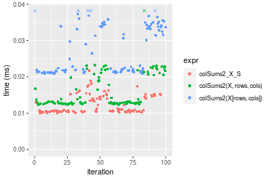
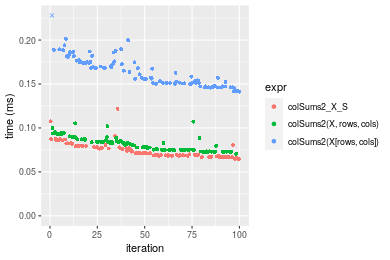
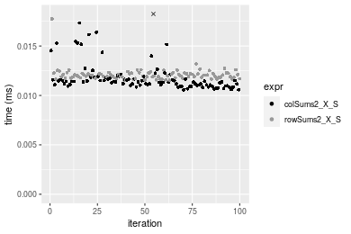
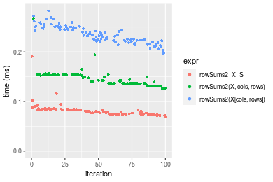
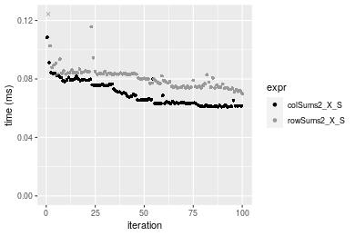

[matrixStats]: Benchmark report

---------------------------------------


# colSums2() and rowSums2() benchmarks  on subsetted computation

This report benchmark the performance of colSums2() and rowSums2() on subsetted computation.


## Data type "integer"

### Data
```r
> rmatrix <- function(nrow, ncol, mode = c("logical", "double", "integer", "index"), range = c(-100, 
+     +100), na_prob = 0) {
+     mode <- match.arg(mode)
+     n <- nrow * ncol
+     if (mode == "logical") {
+         x <- sample(c(FALSE, TRUE), size = n, replace = TRUE)
+     }     else if (mode == "index") {
+         x <- seq_len(n)
+         mode <- "integer"
+     }     else {
+         x <- runif(n, min = range[1], max = range[2])
+     }
+     storage.mode(x) <- mode
+     if (na_prob > 0) 
+         x[sample(n, size = na_prob * n)] <- NA
+     dim(x) <- c(nrow, ncol)
+     x
+ }
> rmatrices <- function(scale = 10, seed = 1, ...) {
+     set.seed(seed)
+     data <- list()
+     data[[1]] <- rmatrix(nrow = scale * 1, ncol = scale * 1, ...)
+     data[[2]] <- rmatrix(nrow = scale * 10, ncol = scale * 10, ...)
+     data[[3]] <- rmatrix(nrow = scale * 100, ncol = scale * 1, ...)
+     data[[4]] <- t(data[[3]])
+     data[[5]] <- rmatrix(nrow = scale * 10, ncol = scale * 100, ...)
+     data[[6]] <- t(data[[5]])
+     names(data) <- sapply(data, FUN = function(x) paste(dim(x), collapse = "x"))
+     data
+ }
> data <- rmatrices(mode = mode)
```

### Results

#### 10x10 integer matrix

```r
> X <- data[["10x10"]]
> rows <- sample.int(nrow(X), size = nrow(X) * 0.7)
> cols <- sample.int(ncol(X), size = ncol(X) * 0.7)
> X_S <- X[rows, cols]
> gc()
           used  (Mb) gc trigger  (Mb) max used  (Mb)
Ncells  5249363 280.4   10014072 534.9 10014072 534.9
Vcells 10080284  77.0   18204443 138.9 18204443 138.9
> colStats <- microbenchmark(colSums2_X_S = colSums2(X_S, na.rm = FALSE), `colSums2(X, rows, cols)` = colSums2(X, 
+     rows = rows, cols = cols, na.rm = FALSE), `colSums2(X[rows, cols])` = colSums2(X[rows, cols], 
+     na.rm = FALSE), unit = "ms")
> X <- t(X)
> X_S <- t(X_S)
> gc()
           used  (Mb) gc trigger  (Mb) max used  (Mb)
Ncells  5235293 279.6   10014072 534.9 10014072 534.9
Vcells 10033976  76.6   18204443 138.9 18204443 138.9
> rowStats <- microbenchmark(rowSums2_X_S = rowSums2(X_S, na.rm = FALSE), `rowSums2(X, cols, rows)` = rowSums2(X, 
+     rows = cols, cols = rows, na.rm = FALSE), `rowSums2(X[cols, rows])` = rowSums2(X[cols, rows], 
+     na.rm = FALSE), unit = "ms")
```

_Table: Benchmarking of colSums2_X_S(), colSums2(X, rows, cols)() and colSums2(X[rows, cols])() on integer+10x10 data. The top panel shows times in milliseconds and the bottom panel shows relative times._


|   |expr                    |      min|       lq|      mean|    median|        uq|      max|
|:--|:-----------------------|--------:|--------:|---------:|---------:|---------:|--------:|
|1  |colSums2_X_S            | 0.001930| 0.002009| 0.0029927| 0.0020465| 0.0021300| 0.092378|
|2  |colSums2(X, rows, cols) | 0.002299| 0.002364| 0.0024749| 0.0024195| 0.0025065| 0.004813|
|3  |colSums2(X[rows, cols]) | 0.002784| 0.002979| 0.0031763| 0.0030870| 0.0032150| 0.007243|


|   |expr                    |      min|       lq|      mean|   median|       uq|       max|
|:--|:-----------------------|--------:|--------:|---------:|--------:|--------:|---------:|
|1  |colSums2_X_S            | 1.000000| 1.000000| 1.0000000| 1.000000| 1.000000| 1.0000000|
|2  |colSums2(X, rows, cols) | 1.191192| 1.176705| 0.8269813| 1.182262| 1.176761| 0.0521011|
|3  |colSums2(X[rows, cols]) | 1.442487| 1.482827| 1.0613318| 1.508429| 1.509390| 0.0784061|

_Table: Benchmarking of rowSums2_X_S(), rowSums2(X, cols, rows)() and rowSums2(X[cols, rows])() on integer+10x10 data (transposed). The top panel shows times in milliseconds and the bottom panel shows relative times._


|   |expr                    |      min|        lq|      mean|    median|        uq|      max|
|:--|:-----------------------|--------:|---------:|---------:|---------:|---------:|--------:|
|1  |rowSums2_X_S            | 0.001901| 0.0020175| 0.0022448| 0.0020485| 0.0021395| 0.006044|
|2  |rowSums2(X, cols, rows) | 0.002306| 0.0023790| 0.0036664| 0.0024445| 0.0025690| 0.111630|
|3  |rowSums2(X[cols, rows]) | 0.002736| 0.0029495| 0.0032273| 0.0030715| 0.0032360| 0.008943|


|   |expr                    |      min|       lq|     mean|   median|       uq|       max|
|:--|:-----------------------|--------:|--------:|--------:|--------:|--------:|---------:|
|1  |rowSums2_X_S            | 1.000000| 1.000000| 1.000000| 1.000000| 1.000000|  1.000000|
|2  |rowSums2(X, cols, rows) | 1.213046| 1.179182| 1.633258| 1.193312| 1.200748| 18.469557|
|3  |rowSums2(X[cols, rows]) | 1.439242| 1.461958| 1.437633| 1.499390| 1.512503|  1.479649|

_Figure: Benchmarking of colSums2_X_S(), colSums2(X, rows, cols)() and colSums2(X[rows, cols])() on integer+10x10 data  as well as rowSums2_X_S(), rowSums2(X, cols, rows)() and rowSums2(X[cols, rows])() on the same data transposed.  Outliers are displayed as crosses.  Times are in milliseconds._


_Table: Benchmarking of colSums2_X_S() and rowSums2_X_S() on integer+10x10 data (original and transposed).  The top panel shows times in milliseconds and the bottom panel shows relative times._


|   |expr         |   min|     lq|    mean| median|     uq|    max|
|:--|:------------|-----:|------:|-------:|------:|------:|------:|
|1  |colSums2_X_S | 1.930| 2.0090| 2.99274| 2.0465| 2.1300| 92.378|
|2  |rowSums2_X_S | 1.901| 2.0175| 2.24485| 2.0485| 2.1395|  6.044|


|   |expr         |       min|       lq|      mean|   median|      uq|       max|
|:--|:------------|---------:|--------:|---------:|--------:|-------:|---------:|
|1  |colSums2_X_S | 1.0000000| 1.000000| 1.0000000| 1.000000| 1.00000| 1.0000000|
|2  |rowSums2_X_S | 0.9849741| 1.004231| 0.7500986| 1.000977| 1.00446| 0.0654268|

_Figure: Benchmarking of colSums2_X_S() and rowSums2_X_S() on integer+10x10 data (original and transposed).  Outliers are displayed as crosses. Times are in milliseconds._


#### 100x100 integer matrix

```r
> X <- data[["100x100"]]
> rows <- sample.int(nrow(X), size = nrow(X) * 0.7)
> cols <- sample.int(ncol(X), size = ncol(X) * 0.7)
> X_S <- X[rows, cols]
> gc()
          used  (Mb) gc trigger  (Mb) max used  (Mb)
Ncells 5233915 279.6   10014072 534.9 10014072 534.9
Vcells 9702854  74.1   18204443 138.9 18204443 138.9
> colStats <- microbenchmark(colSums2_X_S = colSums2(X_S, na.rm = FALSE), `colSums2(X, rows, cols)` = colSums2(X, 
+     rows = rows, cols = cols, na.rm = FALSE), `colSums2(X[rows, cols])` = colSums2(X[rows, cols], 
+     na.rm = FALSE), unit = "ms")
> X <- t(X)
> X_S <- t(X_S)
> gc()
          used  (Mb) gc trigger  (Mb) max used  (Mb)
Ncells 5233891 279.6   10014072 534.9 10014072 534.9
Vcells 9707907  74.1   18204443 138.9 18204443 138.9
> rowStats <- microbenchmark(rowSums2_X_S = rowSums2(X_S, na.rm = FALSE), `rowSums2(X, cols, rows)` = rowSums2(X, 
+     rows = cols, cols = rows, na.rm = FALSE), `rowSums2(X[cols, rows])` = rowSums2(X[cols, rows], 
+     na.rm = FALSE), unit = "ms")
```

_Table: Benchmarking of colSums2_X_S(), colSums2(X, rows, cols)() and colSums2(X[rows, cols])() on integer+100x100 data. The top panel shows times in milliseconds and the bottom panel shows relative times._


|   |expr                    |      min|        lq|      mean|    median|        uq|      max|
|:--|:-----------------------|--------:|---------:|---------:|---------:|---------:|--------:|
|2  |colSums2(X, rows, cols) | 0.015297| 0.0159360| 0.0166590| 0.0164385| 0.0167775| 0.027772|
|1  |colSums2_X_S            | 0.016192| 0.0170125| 0.0177405| 0.0175920| 0.0177710| 0.032204|
|3  |colSums2(X[rows, cols]) | 0.026638| 0.0277850| 0.0291197| 0.0287020| 0.0295215| 0.060842|


|   |expr                    |      min|       lq|     mean|   median|       uq|      max|
|:--|:-----------------------|--------:|--------:|--------:|--------:|--------:|--------:|
|2  |colSums2(X, rows, cols) | 1.000000| 1.000000| 1.000000| 1.000000| 1.000000| 1.000000|
|1  |colSums2_X_S            | 1.058508| 1.067551| 1.064915| 1.070171| 1.059216| 1.159585|
|3  |colSums2(X[rows, cols]) | 1.741387| 1.743537| 1.747982| 1.746023| 1.759589| 2.190768|

_Table: Benchmarking of rowSums2_X_S(), rowSums2(X, cols, rows)() and rowSums2(X[cols, rows])() on integer+100x100 data (transposed). The top panel shows times in milliseconds and the bottom panel shows relative times._


|   |expr                    |      min|        lq|      mean|    median|        uq|      max|
|:--|:-----------------------|--------:|---------:|---------:|---------:|---------:|--------:|
|2  |rowSums2(X, cols, rows) | 0.015620| 0.0160695| 0.0166308| 0.0163600| 0.0166790| 0.037087|
|1  |rowSums2_X_S            | 0.016184| 0.0164565| 0.0168680| 0.0167860| 0.0170525| 0.022523|
|3  |rowSums2(X[cols, rows]) | 0.026830| 0.0272490| 0.0285802| 0.0280605| 0.0288130| 0.046126|


|   |expr                    |      min|       lq|     mean|   median|       uq|       max|
|:--|:-----------------------|--------:|--------:|--------:|--------:|--------:|---------:|
|2  |rowSums2(X, cols, rows) | 1.000000| 1.000000| 1.000000| 1.000000| 1.000000| 1.0000000|
|1  |rowSums2_X_S            | 1.036108| 1.024083| 1.014265| 1.026039| 1.022393| 0.6073017|
|3  |rowSums2(X[cols, rows]) | 1.717670| 1.695697| 1.718508| 1.715189| 1.727502| 1.2437242|

_Figure: Benchmarking of colSums2_X_S(), colSums2(X, rows, cols)() and colSums2(X[rows, cols])() on integer+100x100 data  as well as rowSums2_X_S(), rowSums2(X, cols, rows)() and rowSums2(X[cols, rows])() on the same data transposed.  Outliers are displayed as crosses.  Times are in milliseconds._


_Table: Benchmarking of colSums2_X_S() and rowSums2_X_S() on integer+100x100 data (original and transposed).  The top panel shows times in milliseconds and the bottom panel shows relative times._


|   |expr         |    min|      lq|     mean| median|      uq|    max|
|:--|:------------|------:|-------:|--------:|------:|-------:|------:|
|2  |rowSums2_X_S | 16.184| 16.4565| 16.86804| 16.786| 17.0525| 22.523|
|1  |colSums2_X_S | 16.192| 17.0125| 17.74046| 17.592| 17.7710| 32.204|


|   |expr         |      min|       lq|    mean|   median|       uq|      max|
|:--|:------------|--------:|--------:|-------:|--------:|--------:|--------:|
|2  |rowSums2_X_S | 1.000000| 1.000000| 1.00000| 1.000000| 1.000000| 1.000000|
|1  |colSums2_X_S | 1.000494| 1.033786| 1.05172| 1.048016| 1.042135| 1.429827|

_Figure: Benchmarking of colSums2_X_S() and rowSums2_X_S() on integer+100x100 data (original and transposed).  Outliers are displayed as crosses. Times are in milliseconds._


#### 1000x10 integer matrix

```r
> X <- data[["1000x10"]]
> rows <- sample.int(nrow(X), size = nrow(X) * 0.7)
> cols <- sample.int(ncol(X), size = ncol(X) * 0.7)
> X_S <- X[rows, cols]
> gc()
          used  (Mb) gc trigger  (Mb) max used  (Mb)
Ncells 5234658 279.6   10014072 534.9 10014072 534.9
Vcells 9706893  74.1   18204443 138.9 18204443 138.9
> colStats <- microbenchmark(colSums2_X_S = colSums2(X_S, na.rm = FALSE), `colSums2(X, rows, cols)` = colSums2(X, 
+     rows = rows, cols = cols, na.rm = FALSE), `colSums2(X[rows, cols])` = colSums2(X[rows, cols], 
+     na.rm = FALSE), unit = "ms")
> X <- t(X)
> X_S <- t(X_S)
> gc()
          used  (Mb) gc trigger  (Mb) max used  (Mb)
Ncells 5234634 279.6   10014072 534.9 10014072 534.9
Vcells 9711946  74.1   18204443 138.9 18204443 138.9
> rowStats <- microbenchmark(rowSums2_X_S = rowSums2(X_S, na.rm = FALSE), `rowSums2(X, cols, rows)` = rowSums2(X, 
+     rows = cols, cols = rows, na.rm = FALSE), `rowSums2(X[cols, rows])` = rowSums2(X[cols, rows], 
+     na.rm = FALSE), unit = "ms")
```

_Table: Benchmarking of colSums2_X_S(), colSums2(X, rows, cols)() and colSums2(X[rows, cols])() on integer+1000x10 data. The top panel shows times in milliseconds and the bottom panel shows relative times._


|   |expr                    |      min|        lq|      mean|    median|        uq|      max|
|:--|:-----------------------|--------:|---------:|---------:|---------:|---------:|--------:|
|1  |colSums2_X_S            | 0.016326| 0.0165040| 0.0172429| 0.0166585| 0.0172800| 0.030849|
|2  |colSums2(X, rows, cols) | 0.018038| 0.0186520| 0.0201234| 0.0190795| 0.0211855| 0.031310|
|3  |colSums2(X[rows, cols]) | 0.028093| 0.0284965| 0.0309914| 0.0292240| 0.0312305| 0.071066|


|   |expr                    |      min|       lq|     mean|   median|       uq|      max|
|:--|:-----------------------|--------:|--------:|--------:|--------:|--------:|--------:|
|1  |colSums2_X_S            | 1.000000| 1.000000| 1.000000| 1.000000| 1.000000| 1.000000|
|2  |colSums2(X, rows, cols) | 1.104863| 1.130150| 1.167053| 1.145331| 1.226013| 1.014944|
|3  |colSums2(X[rows, cols]) | 1.720752| 1.726642| 1.797344| 1.754300| 1.807321| 2.303673|

_Table: Benchmarking of rowSums2_X_S(), rowSums2(X, cols, rows)() and rowSums2(X[cols, rows])() on integer+1000x10 data (transposed). The top panel shows times in milliseconds and the bottom panel shows relative times._


|   |expr                    |      min|        lq|      mean|    median|        uq|      max|
|:--|:-----------------------|--------:|---------:|---------:|---------:|---------:|--------:|
|1  |rowSums2_X_S            | 0.015725| 0.0164015| 0.0166153| 0.0165340| 0.0166430| 0.023593|
|2  |rowSums2(X, cols, rows) | 0.017766| 0.0186045| 0.0193115| 0.0188265| 0.0192260| 0.032903|
|3  |rowSums2(X[cols, rows]) | 0.028929| 0.0301095| 0.0313094| 0.0305195| 0.0311195| 0.077890|


|   |expr                    |      min|       lq|     mean|   median|       uq|      max|
|:--|:-----------------------|--------:|--------:|--------:|--------:|--------:|--------:|
|1  |rowSums2_X_S            | 1.000000| 1.000000| 1.000000| 1.000000| 1.000000| 1.000000|
|2  |rowSums2(X, cols, rows) | 1.129793| 1.134317| 1.162272| 1.138654| 1.155200| 1.394609|
|3  |rowSums2(X[cols, rows]) | 1.839682| 1.835777| 1.884372| 1.845863| 1.869825| 3.301403|

_Figure: Benchmarking of colSums2_X_S(), colSums2(X, rows, cols)() and colSums2(X[rows, cols])() on integer+1000x10 data  as well as rowSums2_X_S(), rowSums2(X, cols, rows)() and rowSums2(X[cols, rows])() on the same data transposed.  Outliers are displayed as crosses.  Times are in milliseconds._





_Table: Benchmarking of colSums2_X_S() and rowSums2_X_S() on integer+1000x10 data (original and transposed).  The top panel shows times in milliseconds and the bottom panel shows relative times._


|   |expr         |    min|      lq|     mean|  median|     uq|    max|
|:--|:------------|------:|-------:|--------:|-------:|------:|------:|
|2  |rowSums2_X_S | 15.725| 16.4015| 16.61528| 16.5340| 16.643| 23.593|
|1  |colSums2_X_S | 16.326| 16.5040| 17.24289| 16.6585| 17.280| 30.849|


|   |expr         |      min|       lq|     mean|  median|       uq|      max|
|:--|:------------|--------:|--------:|--------:|-------:|--------:|--------:|
|2  |rowSums2_X_S | 1.000000| 1.000000| 1.000000| 1.00000| 1.000000| 1.000000|
|1  |colSums2_X_S | 1.038219| 1.006249| 1.037773| 1.00753| 1.038274| 1.307549|

_Figure: Benchmarking of colSums2_X_S() and rowSums2_X_S() on integer+1000x10 data (original and transposed).  Outliers are displayed as crosses. Times are in milliseconds._


#### 10x1000 integer matrix

```r
> X <- data[["10x1000"]]
> rows <- sample.int(nrow(X), size = nrow(X) * 0.7)
> cols <- sample.int(ncol(X), size = ncol(X) * 0.7)
> X_S <- X[rows, cols]
> gc()
          used  (Mb) gc trigger  (Mb) max used  (Mb)
Ncells 5234863 279.6   10014072 534.9 10014072 534.9
Vcells 9707741  74.1   18204443 138.9 18204443 138.9
> colStats <- microbenchmark(colSums2_X_S = colSums2(X_S, na.rm = FALSE), `colSums2(X, rows, cols)` = colSums2(X, 
+     rows = rows, cols = cols, na.rm = FALSE), `colSums2(X[rows, cols])` = colSums2(X[rows, cols], 
+     na.rm = FALSE), unit = "ms")
> X <- t(X)
> X_S <- t(X_S)
> gc()
          used  (Mb) gc trigger  (Mb) max used  (Mb)
Ncells 5234839 279.6   10014072 534.9 10014072 534.9
Vcells 9712794  74.2   18204443 138.9 18204443 138.9
> rowStats <- microbenchmark(rowSums2_X_S = rowSums2(X_S, na.rm = FALSE), `rowSums2(X, cols, rows)` = rowSums2(X, 
+     rows = cols, cols = rows, na.rm = FALSE), `rowSums2(X[cols, rows])` = rowSums2(X[cols, rows], 
+     na.rm = FALSE), unit = "ms")
```

_Table: Benchmarking of colSums2_X_S(), colSums2(X, rows, cols)() and colSums2(X[rows, cols])() on integer+10x1000 data. The top panel shows times in milliseconds and the bottom panel shows relative times._


|   |expr                    |      min|        lq|      mean|    median|        uq|      max|
|:--|:-----------------------|--------:|---------:|---------:|---------:|---------:|--------:|
|1  |colSums2_X_S            | 0.019956| 0.0202055| 0.0206060| 0.0203385| 0.0205080| 0.038890|
|2  |colSums2(X, rows, cols) | 0.020466| 0.0209130| 0.0216836| 0.0215030| 0.0217465| 0.047602|
|3  |colSums2(X[rows, cols]) | 0.033738| 0.0343650| 0.0351820| 0.0347565| 0.0353760| 0.051513|


|   |expr                    |      min|       lq|     mean|   median|       uq|      max|
|:--|:-----------------------|--------:|--------:|--------:|--------:|--------:|--------:|
|1  |colSums2_X_S            | 1.000000| 1.000000| 1.000000| 1.000000| 1.000000| 1.000000|
|2  |colSums2(X, rows, cols) | 1.025556| 1.035015| 1.052294| 1.057256| 1.060391| 1.224017|
|3  |colSums2(X[rows, cols]) | 1.690619| 1.700775| 1.707363| 1.708902| 1.724985| 1.324582|

_Table: Benchmarking of rowSums2_X_S(), rowSums2(X, cols, rows)() and rowSums2(X[cols, rows])() on integer+10x1000 data (transposed). The top panel shows times in milliseconds and the bottom panel shows relative times._


|   |expr                    |      min|        lq|      mean|    median|        uq|      max|
|:--|:-----------------------|--------:|---------:|---------:|---------:|---------:|--------:|
|1  |rowSums2_X_S            | 0.019384| 0.0201380| 0.0205695| 0.0202975| 0.0205135| 0.033160|
|2  |rowSums2(X, cols, rows) | 0.019464| 0.0203925| 0.0210892| 0.0206580| 0.0209885| 0.041675|
|3  |rowSums2(X[cols, rows]) | 0.030329| 0.0322460| 0.0329397| 0.0326660| 0.0331105| 0.050641|


|   |expr                    |      min|       lq|     mean|   median|       uq|      max|
|:--|:-----------------------|--------:|--------:|--------:|--------:|--------:|--------:|
|1  |rowSums2_X_S            | 1.000000| 1.000000| 1.000000| 1.000000| 1.000000| 1.000000|
|2  |rowSums2(X, cols, rows) | 1.004127| 1.012638| 1.025267| 1.017761| 1.023156| 1.256785|
|3  |rowSums2(X[cols, rows]) | 1.564641| 1.601251| 1.601387| 1.609361| 1.614083| 1.527171|

_Figure: Benchmarking of colSums2_X_S(), colSums2(X, rows, cols)() and colSums2(X[rows, cols])() on integer+10x1000 data  as well as rowSums2_X_S(), rowSums2(X, cols, rows)() and rowSums2(X[cols, rows])() on the same data transposed.  Outliers are displayed as crosses.  Times are in milliseconds._


_Table: Benchmarking of colSums2_X_S() and rowSums2_X_S() on integer+10x1000 data (original and transposed).  The top panel shows times in milliseconds and the bottom panel shows relative times._


|   |expr         |    min|      lq|     mean|  median|      uq|   max|
|:--|:------------|------:|-------:|--------:|-------:|-------:|-----:|
|2  |rowSums2_X_S | 19.384| 20.1380| 20.56951| 20.2975| 20.5135| 33.16|
|1  |colSums2_X_S | 19.956| 20.2055| 20.60602| 20.3385| 20.5080| 38.89|


|   |expr         |      min|       lq|     mean|  median|        uq|      max|
|:--|:------------|--------:|--------:|--------:|-------:|---------:|--------:|
|2  |rowSums2_X_S | 1.000000| 1.000000| 1.000000| 1.00000| 1.0000000| 1.000000|
|1  |colSums2_X_S | 1.029509| 1.003352| 1.001775| 1.00202| 0.9997319| 1.172799|

_Figure: Benchmarking of colSums2_X_S() and rowSums2_X_S() on integer+10x1000 data (original and transposed).  Outliers are displayed as crosses. Times are in milliseconds._


#### 100x1000 integer matrix

```r
> X <- data[["100x1000"]]
> rows <- sample.int(nrow(X), size = nrow(X) * 0.7)
> cols <- sample.int(ncol(X), size = ncol(X) * 0.7)
> X_S <- X[rows, cols]
> gc()
          used  (Mb) gc trigger  (Mb) max used  (Mb)
Ncells 5235073 279.6   10014072 534.9 10014072 534.9
Vcells 9730410  74.3   18204443 138.9 18204443 138.9
> colStats <- microbenchmark(colSums2_X_S = colSums2(X_S, na.rm = FALSE), `colSums2(X, rows, cols)` = colSums2(X, 
+     rows = rows, cols = cols, na.rm = FALSE), `colSums2(X[rows, cols])` = colSums2(X[rows, cols], 
+     na.rm = FALSE), unit = "ms")
> X <- t(X)
> X_S <- t(X_S)
> gc()
          used  (Mb) gc trigger  (Mb) max used  (Mb)
Ncells 5235049 279.6   10014072 534.9 10014072 534.9
Vcells 9780463  74.7   18204443 138.9 18204443 138.9
> rowStats <- microbenchmark(rowSums2_X_S = rowSums2(X_S, na.rm = FALSE), `rowSums2(X, cols, rows)` = rowSums2(X, 
+     rows = cols, cols = rows, na.rm = FALSE), `rowSums2(X[cols, rows])` = rowSums2(X[cols, rows], 
+     na.rm = FALSE), unit = "ms")
```

_Table: Benchmarking of colSums2_X_S(), colSums2(X, rows, cols)() and colSums2(X[rows, cols])() on integer+100x1000 data. The top panel shows times in milliseconds and the bottom panel shows relative times._


|   |expr                    |      min|        lq|      mean|   median|        uq|      max|
|:--|:-----------------------|--------:|---------:|---------:|--------:|---------:|--------:|
|2  |colSums2(X, rows, cols) | 0.097596| 0.1048635| 0.1248406| 0.110771| 0.1241240| 0.225827|
|1  |colSums2_X_S            | 0.114145| 0.1215560| 0.1411165| 0.126087| 0.1422390| 0.259000|
|3  |colSums2(X[rows, cols]) | 0.191596| 0.2096375| 0.2451296| 0.227226| 0.2650605| 0.408246|


|   |expr                    |      min|       lq|     mean|   median|       uq|      max|
|:--|:-----------------------|--------:|--------:|--------:|--------:|--------:|--------:|
|2  |colSums2(X, rows, cols) | 1.000000| 1.000000| 1.000000| 1.000000| 1.000000| 1.000000|
|1  |colSums2_X_S            | 1.169566| 1.159183| 1.130373| 1.138267| 1.145943| 1.146896|
|3  |colSums2(X[rows, cols]) | 1.963154| 1.999146| 1.963540| 2.051313| 2.135449| 1.807782|

_Table: Benchmarking of rowSums2_X_S(), rowSums2(X, cols, rows)() and rowSums2(X[cols, rows])() on integer+100x1000 data (transposed). The top panel shows times in milliseconds and the bottom panel shows relative times._


|   |expr                    |      min|        lq|      mean|   median|        uq|      max|
|:--|:-----------------------|--------:|---------:|---------:|--------:|---------:|--------:|
|2  |rowSums2(X, cols, rows) | 0.097905| 0.1046985| 0.1169688| 0.111369| 0.1245545| 0.198769|
|1  |rowSums2_X_S            | 0.102529| 0.1160940| 0.1282165| 0.124138| 0.1419875| 0.201656|
|3  |rowSums2(X[cols, rows]) | 0.172619| 0.1955025| 0.2127600| 0.204724| 0.2314090| 0.265470|


|   |expr                    |      min|       lq|     mean|   median|       uq|      max|
|:--|:-----------------------|--------:|--------:|--------:|--------:|--------:|--------:|
|2  |rowSums2(X, cols, rows) | 1.000000| 1.000000| 1.000000| 1.000000| 1.000000| 1.000000|
|1  |rowSums2_X_S            | 1.047230| 1.108841| 1.096160| 1.114655| 1.139963| 1.014524|
|3  |rowSums2(X[cols, rows]) | 1.763127| 1.867290| 1.818947| 1.838249| 1.857894| 1.335570|

_Figure: Benchmarking of colSums2_X_S(), colSums2(X, rows, cols)() and colSums2(X[rows, cols])() on integer+100x1000 data  as well as rowSums2_X_S(), rowSums2(X, cols, rows)() and rowSums2(X[cols, rows])() on the same data transposed.  Outliers are displayed as crosses.  Times are in milliseconds._


_Table: Benchmarking of colSums2_X_S() and rowSums2_X_S() on integer+100x1000 data (original and transposed).  The top panel shows times in milliseconds and the bottom panel shows relative times._


|   |expr         |     min|      lq|     mean|  median|       uq|     max|
|:--|:------------|-------:|-------:|--------:|-------:|--------:|-------:|
|2  |rowSums2_X_S | 102.529| 116.094| 128.2165| 124.138| 141.9875| 201.656|
|1  |colSums2_X_S | 114.145| 121.556| 141.1165| 126.087| 142.2390| 259.000|


|   |expr         |      min|       lq|     mean| median|       uq|      max|
|:--|:------------|--------:|--------:|--------:|------:|--------:|--------:|
|2  |rowSums2_X_S | 1.000000| 1.000000| 1.000000| 1.0000| 1.000000| 1.000000|
|1  |colSums2_X_S | 1.113295| 1.047048| 1.100611| 1.0157| 1.001771| 1.284366|

_Figure: Benchmarking of colSums2_X_S() and rowSums2_X_S() on integer+100x1000 data (original and transposed).  Outliers are displayed as crosses. Times are in milliseconds._


#### 1000x100 integer matrix

```r
> X <- data[["1000x100"]]
> rows <- sample.int(nrow(X), size = nrow(X) * 0.7)
> cols <- sample.int(ncol(X), size = ncol(X) * 0.7)
> X_S <- X[rows, cols]
> gc()
          used  (Mb) gc trigger  (Mb) max used  (Mb)
Ncells 5235286 279.6   10014072 534.9 10014072 534.9
Vcells 9731189  74.3   18204443 138.9 18204443 138.9
> colStats <- microbenchmark(colSums2_X_S = colSums2(X_S, na.rm = FALSE), `colSums2(X, rows, cols)` = colSums2(X, 
+     rows = rows, cols = cols, na.rm = FALSE), `colSums2(X[rows, cols])` = colSums2(X[rows, cols], 
+     na.rm = FALSE), unit = "ms")
> X <- t(X)
> X_S <- t(X_S)
> gc()
          used  (Mb) gc trigger  (Mb) max used  (Mb)
Ncells 5235262 279.6   10014072 534.9 10014072 534.9
Vcells 9781242  74.7   18204443 138.9 18204443 138.9
> rowStats <- microbenchmark(rowSums2_X_S = rowSums2(X_S, na.rm = FALSE), `rowSums2(X, cols, rows)` = rowSums2(X, 
+     rows = cols, cols = rows, na.rm = FALSE), `rowSums2(X[cols, rows])` = rowSums2(X[cols, rows], 
+     na.rm = FALSE), unit = "ms")
```

_Table: Benchmarking of colSums2_X_S(), colSums2(X, rows, cols)() and colSums2(X[rows, cols])() on integer+1000x100 data. The top panel shows times in milliseconds and the bottom panel shows relative times._


|   |expr                    |      min|       lq|      mean|    median|        uq|      max|
|:--|:-----------------------|--------:|--------:|---------:|---------:|---------:|--------:|
|2  |colSums2(X, rows, cols) | 0.091841| 0.102036| 0.1107844| 0.1070465| 0.1152550| 0.141955|
|1  |colSums2_X_S            | 0.101188| 0.110779| 0.1202655| 0.1147255| 0.1267235| 0.168574|
|3  |colSums2(X[rows, cols]) | 0.171755| 0.188538| 0.2085811| 0.2012915| 0.2246900| 0.307298|


|   |expr                    |      min|       lq|     mean|   median|       uq|      max|
|:--|:-----------------------|--------:|--------:|--------:|--------:|--------:|--------:|
|2  |colSums2(X, rows, cols) | 1.000000| 1.000000| 1.000000| 1.000000| 1.000000| 1.000000|
|1  |colSums2_X_S            | 1.101774| 1.085685| 1.085581| 1.071735| 1.099505| 1.187517|
|3  |colSums2(X[rows, cols]) | 1.870134| 1.847760| 1.882766| 1.880412| 1.949503| 2.164756|

_Table: Benchmarking of rowSums2_X_S(), rowSums2(X, cols, rows)() and rowSums2(X[cols, rows])() on integer+1000x100 data (transposed). The top panel shows times in milliseconds and the bottom panel shows relative times._


|   |expr                    |      min|        lq|      mean|    median|        uq|      max|
|:--|:-----------------------|--------:|---------:|---------:|---------:|---------:|--------:|
|2  |rowSums2(X, cols, rows) | 0.094825| 0.1078845| 0.1169984| 0.1143395| 0.1231845| 0.212192|
|1  |rowSums2_X_S            | 0.101513| 0.1119040| 0.1234748| 0.1210485| 0.1321235| 0.163624|
|3  |rowSums2(X[cols, rows]) | 0.171279| 0.1913350| 0.2104019| 0.2052825| 0.2323735| 0.272069|


|   |expr                    |      min|       lq|     mean|   median|       uq|      max|
|:--|:-----------------------|--------:|--------:|--------:|--------:|--------:|--------:|
|2  |rowSums2(X, cols, rows) | 1.000000| 1.000000| 1.000000| 1.000000| 1.000000| 1.000000|
|1  |rowSums2_X_S            | 1.070530| 1.037257| 1.055354| 1.058676| 1.072566| 0.771113|
|3  |rowSums2(X[cols, rows]) | 1.806264| 1.773517| 1.798330| 1.795377| 1.886386| 1.282183|

_Figure: Benchmarking of colSums2_X_S(), colSums2(X, rows, cols)() and colSums2(X[rows, cols])() on integer+1000x100 data  as well as rowSums2_X_S(), rowSums2(X, cols, rows)() and rowSums2(X[cols, rows])() on the same data transposed.  Outliers are displayed as crosses.  Times are in milliseconds._





_Table: Benchmarking of colSums2_X_S() and rowSums2_X_S() on integer+1000x100 data (original and transposed).  The top panel shows times in milliseconds and the bottom panel shows relative times._


|   |expr         |     min|      lq|     mean|   median|       uq|     max|
|:--|:------------|-------:|-------:|--------:|--------:|--------:|-------:|
|1  |colSums2_X_S | 101.188| 110.779| 120.2655| 114.7255| 126.7235| 168.574|
|2  |rowSums2_X_S | 101.513| 111.904| 123.4748| 121.0485| 132.1235| 163.624|


|   |expr         |      min|       lq|     mean|   median|       uq|      max|
|:--|:------------|--------:|--------:|--------:|--------:|--------:|--------:|
|1  |colSums2_X_S | 1.000000| 1.000000| 1.000000| 1.000000| 1.000000| 1.000000|
|2  |rowSums2_X_S | 1.003212| 1.010155| 1.026685| 1.055114| 1.042612| 0.970636|

_Figure: Benchmarking of colSums2_X_S() and rowSums2_X_S() on integer+1000x100 data (original and transposed).  Outliers are displayed as crosses. Times are in milliseconds._


## Data type "double"

### Data
```r
> rmatrix <- function(nrow, ncol, mode = c("logical", "double", "integer", "index"), range = c(-100, 
+     +100), na_prob = 0) {
+     mode <- match.arg(mode)
+     n <- nrow * ncol
+     if (mode == "logical") {
+         x <- sample(c(FALSE, TRUE), size = n, replace = TRUE)
+     }     else if (mode == "index") {
+         x <- seq_len(n)
+         mode <- "integer"
+     }     else {
+         x <- runif(n, min = range[1], max = range[2])
+     }
+     storage.mode(x) <- mode
+     if (na_prob > 0) 
+         x[sample(n, size = na_prob * n)] <- NA
+     dim(x) <- c(nrow, ncol)
+     x
+ }
> rmatrices <- function(scale = 10, seed = 1, ...) {
+     set.seed(seed)
+     data <- list()
+     data[[1]] <- rmatrix(nrow = scale * 1, ncol = scale * 1, ...)
+     data[[2]] <- rmatrix(nrow = scale * 10, ncol = scale * 10, ...)
+     data[[3]] <- rmatrix(nrow = scale * 100, ncol = scale * 1, ...)
+     data[[4]] <- t(data[[3]])
+     data[[5]] <- rmatrix(nrow = scale * 10, ncol = scale * 100, ...)
+     data[[6]] <- t(data[[5]])
+     names(data) <- sapply(data, FUN = function(x) paste(dim(x), collapse = "x"))
+     data
+ }
> data <- rmatrices(mode = mode)
```

### Results

#### 10x10 double matrix

```r
> X <- data[["10x10"]]
> rows <- sample.int(nrow(X), size = nrow(X) * 0.7)
> cols <- sample.int(ncol(X), size = ncol(X) * 0.7)
> X_S <- X[rows, cols]
> gc()
          used  (Mb) gc trigger  (Mb) max used  (Mb)
Ncells 5235503 279.7   10014072 534.9 10014072 534.9
Vcells 9822289  75.0   18204443 138.9 18204443 138.9
> colStats <- microbenchmark(colSums2_X_S = colSums2(X_S, na.rm = FALSE), `colSums2(X, rows, cols)` = colSums2(X, 
+     rows = rows, cols = cols, na.rm = FALSE), `colSums2(X[rows, cols])` = colSums2(X[rows, cols], 
+     na.rm = FALSE), unit = "ms")
> X <- t(X)
> X_S <- t(X_S)
> gc()
          used  (Mb) gc trigger  (Mb) max used  (Mb)
Ncells 5235470 279.7   10014072 534.9 10014072 534.9
Vcells 9822427  75.0   18204443 138.9 18204443 138.9
> rowStats <- microbenchmark(rowSums2_X_S = rowSums2(X_S, na.rm = FALSE), `rowSums2(X, cols, rows)` = rowSums2(X, 
+     rows = cols, cols = rows, na.rm = FALSE), `rowSums2(X[cols, rows])` = rowSums2(X[cols, rows], 
+     na.rm = FALSE), unit = "ms")
```

_Table: Benchmarking of colSums2_X_S(), colSums2(X, rows, cols)() and colSums2(X[rows, cols])() on double+10x10 data. The top panel shows times in milliseconds and the bottom panel shows relative times._


|   |expr                    |      min|        lq|      mean|    median|        uq|      max|
|:--|:-----------------------|--------:|---------:|---------:|---------:|---------:|--------:|
|1  |colSums2_X_S            | 0.001943| 0.0020375| 0.0022932| 0.0020890| 0.0021735| 0.019260|
|2  |colSums2(X, rows, cols) | 0.002336| 0.0024140| 0.0025198| 0.0024615| 0.0025525| 0.004791|
|3  |colSums2(X[rows, cols]) | 0.002818| 0.0029665| 0.0032693| 0.0031290| 0.0032805| 0.008260|


|   |expr                    |      min|       lq|     mean|   median|       uq|       max|
|:--|:-----------------------|--------:|--------:|--------:|--------:|--------:|---------:|
|1  |colSums2_X_S            | 1.000000| 1.000000| 1.000000| 1.000000| 1.000000| 1.0000000|
|2  |colSums2(X, rows, cols) | 1.202265| 1.184785| 1.098829| 1.178315| 1.174373| 0.2487539|
|3  |colSums2(X[rows, cols]) | 1.450335| 1.455951| 1.425661| 1.497846| 1.509317| 0.4288681|

_Table: Benchmarking of rowSums2_X_S(), rowSums2(X, cols, rows)() and rowSums2(X[cols, rows])() on double+10x10 data (transposed). The top panel shows times in milliseconds and the bottom panel shows relative times._


|   |expr                    |      min|        lq|      mean|    median|        uq|      max|
|:--|:-----------------------|--------:|---------:|---------:|---------:|---------:|--------:|
|1  |rowSums2_X_S            | 0.001923| 0.0020130| 0.0021163| 0.0020605| 0.0021455| 0.004699|
|2  |rowSums2(X, cols, rows) | 0.002326| 0.0024215| 0.0027021| 0.0024740| 0.0026145| 0.019716|
|3  |rowSums2(X[cols, rows]) | 0.002803| 0.0030010| 0.0032395| 0.0031230| 0.0032670| 0.006500|


|   |expr                    |      min|       lq|     mean|   median|       uq|      max|
|:--|:-----------------------|--------:|--------:|--------:|--------:|--------:|--------:|
|1  |rowSums2_X_S            | 1.000000| 1.000000| 1.000000| 1.000000| 1.000000| 1.000000|
|2  |rowSums2(X, cols, rows) | 1.209568| 1.202931| 1.276833| 1.200679| 1.218597| 4.195786|
|3  |rowSums2(X[cols, rows]) | 1.457618| 1.490810| 1.530781| 1.515651| 1.522722| 1.383273|

_Figure: Benchmarking of colSums2_X_S(), colSums2(X, rows, cols)() and colSums2(X[rows, cols])() on double+10x10 data  as well as rowSums2_X_S(), rowSums2(X, cols, rows)() and rowSums2(X[cols, rows])() on the same data transposed.  Outliers are displayed as crosses.  Times are in milliseconds._


_Table: Benchmarking of colSums2_X_S() and rowSums2_X_S() on double+10x10 data (original and transposed).  The top panel shows times in milliseconds and the bottom panel shows relative times._


|   |expr         |   min|     lq|    mean| median|     uq|    max|
|:--|:------------|-----:|------:|-------:|------:|------:|------:|
|2  |rowSums2_X_S | 1.923| 2.0130| 2.11626| 2.0605| 2.1455|  4.699|
|1  |colSums2_X_S | 1.943| 2.0375| 2.29316| 2.0890| 2.1735| 19.260|


|   |expr         |    min|       lq|     mean|   median|       uq|      max|
|:--|:------------|------:|--------:|--------:|--------:|--------:|--------:|
|2  |rowSums2_X_S | 1.0000| 1.000000| 1.000000| 1.000000| 1.000000| 1.000000|
|1  |colSums2_X_S | 1.0104| 1.012171| 1.083591| 1.013832| 1.013051| 4.098744|

_Figure: Benchmarking of colSums2_X_S() and rowSums2_X_S() on double+10x10 data (original and transposed).  Outliers are displayed as crosses. Times are in milliseconds._


#### 100x100 double matrix

```r
> X <- data[["100x100"]]
> rows <- sample.int(nrow(X), size = nrow(X) * 0.7)
> cols <- sample.int(ncol(X), size = ncol(X) * 0.7)
> X_S <- X[rows, cols]
> gc()
          used  (Mb) gc trigger  (Mb) max used  (Mb)
Ncells 5235701 279.7   10014072 534.9 10014072 534.9
Vcells 9828243  75.0   18204443 138.9 18204443 138.9
> colStats <- microbenchmark(colSums2_X_S = colSums2(X_S, na.rm = FALSE), `colSums2(X, rows, cols)` = colSums2(X, 
+     rows = rows, cols = cols, na.rm = FALSE), `colSums2(X[rows, cols])` = colSums2(X[rows, cols], 
+     na.rm = FALSE), unit = "ms")
> X <- t(X)
> X_S <- t(X_S)
> gc()
          used  (Mb) gc trigger  (Mb) max used  (Mb)
Ncells 5235677 279.7   10014072 534.9 10014072 534.9
Vcells 9838296  75.1   18204443 138.9 18204443 138.9
> rowStats <- microbenchmark(rowSums2_X_S = rowSums2(X_S, na.rm = FALSE), `rowSums2(X, cols, rows)` = rowSums2(X, 
+     rows = cols, cols = rows, na.rm = FALSE), `rowSums2(X[cols, rows])` = rowSums2(X[cols, rows], 
+     na.rm = FALSE), unit = "ms")
```

_Table: Benchmarking of colSums2_X_S(), colSums2(X, rows, cols)() and colSums2(X[rows, cols])() on double+100x100 data. The top panel shows times in milliseconds and the bottom panel shows relative times._


|   |expr                    |      min|        lq|      mean|   median|        uq|      max|
|:--|:-----------------------|--------:|---------:|---------:|--------:|---------:|--------:|
|1  |colSums2_X_S            | 0.013763| 0.0143620| 0.0147733| 0.014623| 0.0147950| 0.029069|
|2  |colSums2(X, rows, cols) | 0.016885| 0.0175075| 0.0178653| 0.017841| 0.0180935| 0.021531|
|3  |colSums2(X[rows, cols]) | 0.029770| 0.0310860| 0.0316665| 0.031378| 0.0315225| 0.061545|


|   |expr                    |      min|       lq|     mean|   median|       uq|      max|
|:--|:-----------------------|--------:|--------:|--------:|--------:|--------:|--------:|
|1  |colSums2_X_S            | 1.000000| 1.000000| 1.000000| 1.000000| 1.000000| 1.000000|
|2  |colSums2(X, rows, cols) | 1.226840| 1.219016| 1.209295| 1.220064| 1.222947| 0.740686|
|3  |colSums2(X[rows, cols]) | 2.163046| 2.164462| 2.143497| 2.145798| 2.130619| 2.117204|

_Table: Benchmarking of rowSums2_X_S(), rowSums2(X, cols, rows)() and rowSums2(X[cols, rows])() on double+100x100 data (transposed). The top panel shows times in milliseconds and the bottom panel shows relative times._


|   |expr                    |      min|        lq|      mean|    median|        uq|      max|
|:--|:-----------------------|--------:|---------:|---------:|---------:|---------:|--------:|
|1  |rowSums2_X_S            | 0.014951| 0.0157080| 0.0161409| 0.0160505| 0.0164380| 0.025447|
|2  |rowSums2(X, cols, rows) | 0.016288| 0.0169995| 0.0178072| 0.0174335| 0.0178855| 0.042212|
|3  |rowSums2(X[cols, rows]) | 0.030195| 0.0315805| 0.0324726| 0.0327065| 0.0329670| 0.045925|


|   |expr                    |      min|       lq|     mean|   median|       uq|      max|
|:--|:-----------------------|--------:|--------:|--------:|--------:|--------:|--------:|
|1  |rowSums2_X_S            | 1.000000| 1.000000| 1.000000| 1.000000| 1.000000| 1.000000|
|2  |rowSums2(X, cols, rows) | 1.089425| 1.082219| 1.103233| 1.086165| 1.088058| 1.658820|
|3  |rowSums2(X[cols, rows]) | 2.019597| 2.010472| 2.011818| 2.037725| 2.005536| 1.804731|

_Figure: Benchmarking of colSums2_X_S(), colSums2(X, rows, cols)() and colSums2(X[rows, cols])() on double+100x100 data  as well as rowSums2_X_S(), rowSums2(X, cols, rows)() and rowSums2(X[cols, rows])() on the same data transposed.  Outliers are displayed as crosses.  Times are in milliseconds._


_Table: Benchmarking of colSums2_X_S() and rowSums2_X_S() on double+100x100 data (original and transposed).  The top panel shows times in milliseconds and the bottom panel shows relative times._


|   |expr         |    min|     lq|     mean|  median|     uq|    max|
|:--|:------------|------:|------:|--------:|-------:|------:|------:|
|1  |colSums2_X_S | 13.763| 14.362| 14.77328| 14.6230| 14.795| 29.069|
|2  |rowSums2_X_S | 14.951| 15.708| 16.14092| 16.0505| 16.438| 25.447|


|   |expr         |      min|       lq|     mean|  median|       uq|       max|
|:--|:------------|--------:|--------:|--------:|-------:|--------:|---------:|
|1  |colSums2_X_S | 1.000000| 1.000000| 1.000000| 1.00000| 1.000000| 1.0000000|
|2  |rowSums2_X_S | 1.086318| 1.093719| 1.092575| 1.09762| 1.111051| 0.8753999|

_Figure: Benchmarking of colSums2_X_S() and rowSums2_X_S() on double+100x100 data (original and transposed).  Outliers are displayed as crosses. Times are in milliseconds._


#### 1000x10 double matrix

```r
> X <- data[["1000x10"]]
> rows <- sample.int(nrow(X), size = nrow(X) * 0.7)
> cols <- sample.int(ncol(X), size = ncol(X) * 0.7)
> X_S <- X[rows, cols]
> gc()
          used  (Mb) gc trigger  (Mb) max used  (Mb)
Ncells 5235901 279.7   10014072 534.9 10014072 534.9
Vcells 9829651  75.0   18204443 138.9 18204443 138.9
> colStats <- microbenchmark(colSums2_X_S = colSums2(X_S, na.rm = FALSE), `colSums2(X, rows, cols)` = colSums2(X, 
+     rows = rows, cols = cols, na.rm = FALSE), `colSums2(X[rows, cols])` = colSums2(X[rows, cols], 
+     na.rm = FALSE), unit = "ms")
> X <- t(X)
> X_S <- t(X_S)
> gc()
          used  (Mb) gc trigger  (Mb) max used  (Mb)
Ncells 5235877 279.7   10014072 534.9 10014072 534.9
Vcells 9839704  75.1   18204443 138.9 18204443 138.9
> rowStats <- microbenchmark(rowSums2_X_S = rowSums2(X_S, na.rm = FALSE), `rowSums2(X, cols, rows)` = rowSums2(X, 
+     rows = cols, cols = rows, na.rm = FALSE), `rowSums2(X[cols, rows])` = rowSums2(X[cols, rows], 
+     na.rm = FALSE), unit = "ms")
```

_Table: Benchmarking of colSums2_X_S(), colSums2(X, rows, cols)() and colSums2(X[rows, cols])() on double+1000x10 data. The top panel shows times in milliseconds and the bottom panel shows relative times._


|   |expr                    |      min|        lq|      mean|    median|        uq|      max|
|:--|:-----------------------|--------:|---------:|---------:|---------:|---------:|--------:|
|1  |colSums2_X_S            | 0.011525| 0.0120780| 0.0124810| 0.0122435| 0.0126075| 0.026883|
|2  |colSums2(X, rows, cols) | 0.017090| 0.0178665| 0.0183678| 0.0182255| 0.0187590| 0.022947|
|3  |colSums2(X[rows, cols]) | 0.027385| 0.0281595| 0.0294288| 0.0288370| 0.0298995| 0.059412|


|   |expr                    |      min|      lq|     mean|   median|       uq|       max|
|:--|:-----------------------|--------:|-------:|--------:|--------:|--------:|---------:|
|1  |colSums2_X_S            | 1.000000| 1.00000| 1.000000| 1.000000| 1.000000| 1.0000000|
|2  |colSums2(X, rows, cols) | 1.482863| 1.47926| 1.471656| 1.488586| 1.487924| 0.8535878|
|3  |colSums2(X[rows, cols]) | 2.376139| 2.33147| 2.357885| 2.355291| 2.371564| 2.2100212|

_Table: Benchmarking of rowSums2_X_S(), rowSums2(X, cols, rows)() and rowSums2(X[cols, rows])() on double+1000x10 data (transposed). The top panel shows times in milliseconds and the bottom panel shows relative times._


|   |expr                    |      min|        lq|      mean|   median|        uq|      max|
|:--|:-----------------------|--------:|---------:|---------:|--------:|---------:|--------:|
|1  |rowSums2_X_S            | 0.013321| 0.0139175| 0.0156463| 0.014271| 0.0148655| 0.029292|
|2  |rowSums2(X, cols, rows) | 0.017068| 0.0179770| 0.0199233| 0.018655| 0.0190550| 0.035059|
|3  |rowSums2(X[cols, rows]) | 0.031940| 0.0333380| 0.0385312| 0.034627| 0.0353465| 0.074471|


|   |expr                    |      min|       lq|     mean|   median|       uq|      max|
|:--|:-----------------------|--------:|--------:|--------:|--------:|--------:|--------:|
|1  |rowSums2_X_S            | 1.000000| 1.000000| 1.000000| 1.000000| 1.000000| 1.000000|
|2  |rowSums2(X, cols, rows) | 1.281285| 1.291683| 1.273354| 1.307196| 1.281827| 1.196880|
|3  |rowSums2(X[cols, rows]) | 2.397718| 2.395402| 2.462639| 2.426389| 2.377754| 2.542366|

_Figure: Benchmarking of colSums2_X_S(), colSums2(X, rows, cols)() and colSums2(X[rows, cols])() on double+1000x10 data  as well as rowSums2_X_S(), rowSums2(X, cols, rows)() and rowSums2(X[cols, rows])() on the same data transposed.  Outliers are displayed as crosses.  Times are in milliseconds._


_Table: Benchmarking of colSums2_X_S() and rowSums2_X_S() on double+1000x10 data (original and transposed).  The top panel shows times in milliseconds and the bottom panel shows relative times._


|   |expr         |    min|      lq|     mean|  median|      uq|    max|
|:--|:------------|------:|-------:|--------:|-------:|-------:|------:|
|1  |colSums2_X_S | 11.525| 12.0780| 12.48101| 12.2435| 12.6075| 26.883|
|2  |rowSums2_X_S | 13.321| 13.9175| 15.64629| 14.2710| 14.8655| 29.292|


|   |expr         |      min|       lq|     mean|   median|     uq|      max|
|:--|:------------|--------:|--------:|--------:|--------:|------:|--------:|
|1  |colSums2_X_S | 1.000000| 1.000000| 1.000000| 1.000000| 1.0000| 1.000000|
|2  |rowSums2_X_S | 1.155835| 1.152302| 1.253608| 1.165598| 1.1791| 1.089611|

_Figure: Benchmarking of colSums2_X_S() and rowSums2_X_S() on double+1000x10 data (original and transposed).  Outliers are displayed as crosses. Times are in milliseconds._




#### 10x1000 double matrix

```r
> X <- data[["10x1000"]]
> rows <- sample.int(nrow(X), size = nrow(X) * 0.7)
> cols <- sample.int(ncol(X), size = ncol(X) * 0.7)
> X_S <- X[rows, cols]
> gc()
          used  (Mb) gc trigger  (Mb) max used  (Mb)
Ncells 5236106 279.7   10014072 534.9 10014072 534.9
Vcells 9829787  75.0   18204443 138.9 18204443 138.9
> colStats <- microbenchmark(colSums2_X_S = colSums2(X_S, na.rm = FALSE), `colSums2(X, rows, cols)` = colSums2(X, 
+     rows = rows, cols = cols, na.rm = FALSE), `colSums2(X[rows, cols])` = colSums2(X[rows, cols], 
+     na.rm = FALSE), unit = "ms")
> X <- t(X)
> X_S <- t(X_S)
> gc()
          used  (Mb) gc trigger  (Mb) max used  (Mb)
Ncells 5236082 279.7   10014072 534.9 10014072 534.9
Vcells 9839840  75.1   18204443 138.9 18204443 138.9
> rowStats <- microbenchmark(rowSums2_X_S = rowSums2(X_S, na.rm = FALSE), `rowSums2(X, cols, rows)` = rowSums2(X, 
+     rows = cols, cols = rows, na.rm = FALSE), `rowSums2(X[cols, rows])` = rowSums2(X[cols, rows], 
+     na.rm = FALSE), unit = "ms")
```

_Table: Benchmarking of colSums2_X_S(), colSums2(X, rows, cols)() and colSums2(X[rows, cols])() on double+10x1000 data. The top panel shows times in milliseconds and the bottom panel shows relative times._


|   |expr                    |      min|        lq|      mean|    median|        uq|      max|
|:--|:-----------------------|--------:|---------:|---------:|---------:|---------:|--------:|
|1  |colSums2_X_S            | 0.018554| 0.0188915| 0.0199545| 0.0198560| 0.0203365| 0.035348|
|2  |colSums2(X, rows, cols) | 0.021652| 0.0221130| 0.0232311| 0.0227010| 0.0236475| 0.045932|
|3  |colSums2(X[rows, cols]) | 0.037245| 0.0375510| 0.0391340| 0.0389755| 0.0405350| 0.047446|


|   |expr                    |      min|       lq|     mean|   median|       uq|      max|
|:--|:-----------------------|--------:|--------:|--------:|--------:|--------:|--------:|
|1  |colSums2_X_S            | 1.000000| 1.000000| 1.000000| 1.000000| 1.000000| 1.000000|
|2  |colSums2(X, rows, cols) | 1.166972| 1.170526| 1.164203| 1.143282| 1.162811| 1.299423|
|3  |colSums2(X[rows, cols]) | 2.007384| 1.987719| 1.961159| 1.962908| 1.993214| 1.342254|

_Table: Benchmarking of rowSums2_X_S(), rowSums2(X, cols, rows)() and rowSums2(X[cols, rows])() on double+10x1000 data (transposed). The top panel shows times in milliseconds and the bottom panel shows relative times._


|   |expr                    |      min|        lq|      mean|    median|        uq|      max|
|:--|:-----------------------|--------:|---------:|---------:|---------:|---------:|--------:|
|1  |rowSums2_X_S            | 0.018739| 0.0195745| 0.0207320| 0.0202770| 0.0211250| 0.035382|
|2  |rowSums2(X, cols, rows) | 0.020628| 0.0220020| 0.0231067| 0.0226165| 0.0235745| 0.049405|
|3  |rowSums2(X[cols, rows]) | 0.033976| 0.0354670| 0.0369385| 0.0368715| 0.0383815| 0.050482|


|   |expr                    |      min|       lq|     mean|   median|       uq|      max|
|:--|:-----------------------|--------:|--------:|--------:|--------:|--------:|--------:|
|1  |rowSums2_X_S            | 1.000000| 1.000000| 1.000000| 1.000000| 1.000000| 1.000000|
|2  |rowSums2(X, cols, rows) | 1.100806| 1.124013| 1.114547| 1.115377| 1.115953| 1.396332|
|3  |rowSums2(X[cols, rows]) | 1.813117| 1.811898| 1.781715| 1.818390| 1.816876| 1.426771|

_Figure: Benchmarking of colSums2_X_S(), colSums2(X, rows, cols)() and colSums2(X[rows, cols])() on double+10x1000 data  as well as rowSums2_X_S(), rowSums2(X, cols, rows)() and rowSums2(X[cols, rows])() on the same data transposed.  Outliers are displayed as crosses.  Times are in milliseconds._


_Table: Benchmarking of colSums2_X_S() and rowSums2_X_S() on double+10x1000 data (original and transposed).  The top panel shows times in milliseconds and the bottom panel shows relative times._


|   |expr         |    min|      lq|     mean| median|      uq|    max|
|:--|:------------|------:|-------:|--------:|------:|-------:|------:|
|1  |colSums2_X_S | 18.554| 18.8915| 19.95453| 19.856| 20.3365| 35.348|
|2  |rowSums2_X_S | 18.739| 19.5745| 20.73197| 20.277| 21.1250| 35.382|


|   |expr         |      min|       lq|     mean|   median|       uq|      max|
|:--|:------------|--------:|--------:|--------:|--------:|--------:|--------:|
|1  |colSums2_X_S | 1.000000| 1.000000| 1.000000| 1.000000| 1.000000| 1.000000|
|2  |rowSums2_X_S | 1.009971| 1.036154| 1.038961| 1.021203| 1.038773| 1.000962|

_Figure: Benchmarking of colSums2_X_S() and rowSums2_X_S() on double+10x1000 data (original and transposed).  Outliers are displayed as crosses. Times are in milliseconds._


#### 100x1000 double matrix

```r
> X <- data[["100x1000"]]
> rows <- sample.int(nrow(X), size = nrow(X) * 0.7)
> cols <- sample.int(ncol(X), size = ncol(X) * 0.7)
> X_S <- X[rows, cols]
> gc()
          used  (Mb) gc trigger  (Mb) max used  (Mb)
Ncells 5236316 279.7   10014072 534.9 10014072 534.9
Vcells 9875241  75.4   18204443 138.9 18204443 138.9
> colStats <- microbenchmark(colSums2_X_S = colSums2(X_S, na.rm = FALSE), `colSums2(X, rows, cols)` = colSums2(X, 
+     rows = rows, cols = cols, na.rm = FALSE), `colSums2(X[rows, cols])` = colSums2(X[rows, cols], 
+     na.rm = FALSE), unit = "ms")
> X <- t(X)
> X_S <- t(X_S)
> gc()
          used  (Mb) gc trigger  (Mb) max used  (Mb)
Ncells 5236292 279.7   10014072 534.9 10014072 534.9
Vcells 9975294  76.2   18204443 138.9 18204443 138.9
> rowStats <- microbenchmark(rowSums2_X_S = rowSums2(X_S, na.rm = FALSE), `rowSums2(X, cols, rows)` = rowSums2(X, 
+     rows = cols, cols = rows, na.rm = FALSE), `rowSums2(X[cols, rows])` = rowSums2(X[cols, rows], 
+     na.rm = FALSE), unit = "ms")
```

_Table: Benchmarking of colSums2_X_S(), colSums2(X, rows, cols)() and colSums2(X[rows, cols])() on double+100x1000 data. The top panel shows times in milliseconds and the bottom panel shows relative times._


|   |expr                    |      min|        lq|      mean|    median|        uq|      max|
|:--|:-----------------------|--------:|---------:|---------:|---------:|---------:|--------:|
|1  |colSums2_X_S            | 0.077045| 0.0816600| 0.0958808| 0.0840235| 0.0949610| 0.160321|
|2  |colSums2(X, rows, cols) | 0.091770| 0.0967200| 0.1130718| 0.1005595| 0.1224075| 0.255239|
|3  |colSums2(X[rows, cols]) | 0.176817| 0.2326345| 0.2733350| 0.2936005| 0.3062550| 0.405378|


|   |expr                    |      min|       lq|     mean|   median|       uq|     max|
|:--|:-----------------------|--------:|--------:|--------:|--------:|--------:|-------:|
|1  |colSums2_X_S            | 1.000000| 1.000000| 1.000000| 1.000000| 1.000000| 1.00000|
|2  |colSums2(X, rows, cols) | 1.191122| 1.184423| 1.179296| 1.196802| 1.289029| 1.59205|
|3  |colSums2(X[rows, cols]) | 2.294983| 2.848818| 2.850779| 3.494267| 3.225061| 2.52854|

_Table: Benchmarking of rowSums2_X_S(), rowSums2(X, cols, rows)() and rowSums2(X[cols, rows])() on double+100x1000 data (transposed). The top panel shows times in milliseconds and the bottom panel shows relative times._


|   |expr                    |      min|        lq|      mean|    median|        uq|      max|
|:--|:-----------------------|--------:|---------:|---------:|---------:|---------:|--------:|
|1  |rowSums2_X_S            | 0.093090| 0.1033690| 0.1418317| 0.1225200| 0.1626305| 0.300033|
|2  |rowSums2(X, cols, rows) | 0.111294| 0.1242630| 0.1544745| 0.1447155| 0.1675535| 0.249963|
|3  |rowSums2(X[cols, rows]) | 0.203684| 0.2400305| 0.3087396| 0.3032910| 0.3696800| 0.491846|


|   |expr                    |      min|       lq|     mean|   median|       uq|       max|
|:--|:-----------------------|--------:|--------:|--------:|--------:|--------:|---------:|
|1  |rowSums2_X_S            | 1.000000| 1.000000| 1.000000| 1.000000| 1.000000| 1.0000000|
|2  |rowSums2(X, cols, rows) | 1.195553| 1.202130| 1.089139| 1.181158| 1.030271| 0.8331184|
|3  |rowSums2(X[cols, rows]) | 2.188033| 2.322074| 2.176802| 2.475441| 2.273128| 1.6393063|

_Figure: Benchmarking of colSums2_X_S(), colSums2(X, rows, cols)() and colSums2(X[rows, cols])() on double+100x1000 data  as well as rowSums2_X_S(), rowSums2(X, cols, rows)() and rowSums2(X[cols, rows])() on the same data transposed.  Outliers are displayed as crosses.  Times are in milliseconds._



_Table: Benchmarking of colSums2_X_S() and rowSums2_X_S() on double+100x1000 data (original and transposed).  The top panel shows times in milliseconds and the bottom panel shows relative times._


|   |expr         |    min|      lq|      mean|   median|       uq|     max|
|:--|:------------|------:|-------:|---------:|--------:|--------:|-------:|
|1  |colSums2_X_S | 77.045|  81.660|  95.88081|  84.0235|  94.9610| 160.321|
|2  |rowSums2_X_S | 93.090| 103.369| 141.83170| 122.5200| 162.6305| 300.033|


|   |expr         |      min|       lq|    mean|   median|       uq|      max|
|:--|:------------|--------:|--------:|-------:|--------:|--------:|--------:|
|1  |colSums2_X_S | 1.000000| 1.000000| 1.00000| 1.000000| 1.000000| 1.000000|
|2  |rowSums2_X_S | 1.208255| 1.265846| 1.47925| 1.458163| 1.712603| 1.871452|

_Figure: Benchmarking of colSums2_X_S() and rowSums2_X_S() on double+100x1000 data (original and transposed).  Outliers are displayed as crosses. Times are in milliseconds._




#### 1000x100 double matrix

```r
> X <- data[["1000x100"]]
> rows <- sample.int(nrow(X), size = nrow(X) * 0.7)
> cols <- sample.int(ncol(X), size = ncol(X) * 0.7)
> X_S <- X[rows, cols]
> gc()
          used  (Mb) gc trigger  (Mb) max used  (Mb)
Ncells 5236529 279.7   10014072 534.9 10014072 534.9
Vcells 9875385  75.4   18204443 138.9 18204443 138.9
> colStats <- microbenchmark(colSums2_X_S = colSums2(X_S, na.rm = FALSE), `colSums2(X, rows, cols)` = colSums2(X, 
+     rows = rows, cols = cols, na.rm = FALSE), `colSums2(X[rows, cols])` = colSums2(X[rows, cols], 
+     na.rm = FALSE), unit = "ms")
> X <- t(X)
> X_S <- t(X_S)
> gc()
          used  (Mb) gc trigger  (Mb) max used  (Mb)
Ncells 5236505 279.7   10014072 534.9 10014072 534.9
Vcells 9975438  76.2   18204443 138.9 18204443 138.9
> rowStats <- microbenchmark(rowSums2_X_S = rowSums2(X_S, na.rm = FALSE), `rowSums2(X, cols, rows)` = rowSums2(X, 
+     rows = cols, cols = rows, na.rm = FALSE), `rowSums2(X[cols, rows])` = rowSums2(X[cols, rows], 
+     na.rm = FALSE), unit = "ms")
```

_Table: Benchmarking of colSums2_X_S(), colSums2(X, rows, cols)() and colSums2(X[rows, cols])() on double+1000x100 data. The top panel shows times in milliseconds and the bottom panel shows relative times._


|   |expr                    |      min|        lq|      mean|    median|        uq|      max|
|:--|:-----------------------|--------:|---------:|---------:|---------:|---------:|--------:|
|1  |colSums2_X_S            | 0.071817| 0.0784665| 0.0847985| 0.0836355| 0.0874635| 0.127784|
|2  |colSums2(X, rows, cols) | 0.090159| 0.0991670| 0.1088467| 0.1068925| 0.1129450| 0.173324|
|3  |colSums2(X[rows, cols]) | 0.172918| 0.1894145| 0.2084991| 0.2062185| 0.2217030| 0.354516|


|   |expr                    |      min|       lq|     mean|   median|       uq|      max|
|:--|:-----------------------|--------:|--------:|--------:|--------:|--------:|--------:|
|1  |colSums2_X_S            | 1.000000| 1.000000| 1.000000| 1.000000| 1.000000| 1.000000|
|2  |colSums2(X, rows, cols) | 1.255399| 1.263813| 1.283592| 1.278076| 1.291339| 1.356383|
|3  |colSums2(X[rows, cols]) | 2.407759| 2.413954| 2.458759| 2.465681| 2.534806| 2.774338|

_Table: Benchmarking of rowSums2_X_S(), rowSums2(X, cols, rows)() and rowSums2(X[cols, rows])() on double+1000x100 data (transposed). The top panel shows times in milliseconds and the bottom panel shows relative times._


|   |expr                    |      min|        lq|      mean|    median|        uq|      max|
|:--|:-----------------------|--------:|---------:|---------:|---------:|---------:|--------:|
|1  |rowSums2_X_S            | 0.091202| 0.0994915| 0.1105379| 0.1082740| 0.1169305| 0.182345|
|2  |rowSums2(X, cols, rows) | 0.109542| 0.1230805| 0.1342768| 0.1276695| 0.1409355| 0.313922|
|3  |rowSums2(X[cols, rows]) | 0.196897| 0.2211710| 0.2410789| 0.2345295| 0.2593745| 0.318059|


|   |expr                    |      min|       lq|     mean|   median|       uq|      max|
|:--|:-----------------------|--------:|--------:|--------:|--------:|--------:|--------:|
|1  |rowSums2_X_S            | 1.000000| 1.000000| 1.000000| 1.000000| 1.000000| 1.000000|
|2  |rowSums2(X, cols, rows) | 1.201092| 1.237096| 1.214757| 1.179134| 1.205293| 1.721583|
|3  |rowSums2(X[cols, rows]) | 2.158911| 2.223014| 2.180961| 2.166074| 2.218194| 1.744271|

_Figure: Benchmarking of colSums2_X_S(), colSums2(X, rows, cols)() and colSums2(X[rows, cols])() on double+1000x100 data  as well as rowSums2_X_S(), rowSums2(X, cols, rows)() and rowSums2(X[cols, rows])() on the same data transposed.  Outliers are displayed as crosses.  Times are in milliseconds._


_Table: Benchmarking of colSums2_X_S() and rowSums2_X_S() on double+1000x100 data (original and transposed).  The top panel shows times in milliseconds and the bottom panel shows relative times._


|   |expr         |    min|      lq|      mean|   median|       uq|     max|
|:--|:------------|------:|-------:|---------:|--------:|--------:|-------:|
|1  |colSums2_X_S | 71.817| 78.4665|  84.79854|  83.6355|  87.4635| 127.784|
|2  |rowSums2_X_S | 91.202| 99.4915| 110.53791| 108.2740| 116.9305| 182.345|


|   |expr         |      min|       lq|     mean|   median|       uq|      max|
|:--|:------------|--------:|--------:|--------:|--------:|--------:|--------:|
|1  |colSums2_X_S | 1.000000| 1.000000| 1.000000| 1.000000| 1.000000| 1.000000|
|2  |rowSums2_X_S | 1.269922| 1.267949| 1.303535| 1.294594| 1.336906| 1.426978|

_Figure: Benchmarking of colSums2_X_S() and rowSums2_X_S() on double+1000x100 data (original and transposed).  Outliers are displayed as crosses. Times are in milliseconds._


## Appendix

### Session information
```r
R version 4.1.1 Patched (2021-08-10 r80727)
Platform: x86_64-pc-linux-gnu (64-bit)
Running under: Ubuntu 18.04.5 LTS

Matrix products: default
BLAS:   /home/hb/software/R-devel/R-4-1-branch/lib/R/lib/libRblas.so
LAPACK: /home/hb/software/R-devel/R-4-1-branch/lib/R/lib/libRlapack.so

locale:
 [1] LC_CTYPE=en_US.UTF-8       LC_NUMERIC=C              
 [3] LC_TIME=en_US.UTF-8        LC_COLLATE=en_US.UTF-8    
 [5] LC_MONETARY=en_US.UTF-8    LC_MESSAGES=en_US.UTF-8   
 [7] LC_PAPER=en_US.UTF-8       LC_NAME=C                 
 [9] LC_ADDRESS=C               LC_TELEPHONE=C            
[11] LC_MEASUREMENT=en_US.UTF-8 LC_IDENTIFICATION=C       

attached base packages:
[1] stats     graphics  grDevices utils     datasets  methods   base     

other attached packages:
[1] microbenchmark_1.4-7   matrixStats_0.60.1     ggplot2_3.3.5         
[4] knitr_1.33             R.devices_2.17.0       R.utils_2.10.1        
[7] R.oo_1.24.0            R.methodsS3_1.8.1-9001 history_0.0.1-9000    

loaded via a namespace (and not attached):
 [1] Biobase_2.52.0          httr_1.4.2              splines_4.1.1          
 [4] bit64_4.0.5             network_1.17.1          assertthat_0.2.1       
 [7] highr_0.9               stats4_4.1.1            blob_1.2.2             
[10] GenomeInfoDbData_1.2.6  robustbase_0.93-8       pillar_1.6.2           
[13] RSQLite_2.2.8           lattice_0.20-44         glue_1.4.2             
[16] digest_0.6.27           XVector_0.32.0          colorspace_2.0-2       
[19] Matrix_1.3-4            XML_3.99-0.7            pkgconfig_2.0.3        
[22] zlibbioc_1.38.0         genefilter_1.74.0       purrr_0.3.4            
[25] ergm_4.1.2              xtable_1.8-4            scales_1.1.1           
[28] tibble_3.1.4            annotate_1.70.0         KEGGREST_1.32.0        
[31] farver_2.1.0            generics_0.1.0          IRanges_2.26.0         
[34] ellipsis_0.3.2          cachem_1.0.6            withr_2.4.2            
[37] BiocGenerics_0.38.0     mime_0.11               survival_3.2-13        
[40] magrittr_2.0.1          crayon_1.4.1            statnet.common_4.5.0   
[43] memoise_2.0.0           laeken_0.5.1            fansi_0.5.0            
[46] R.cache_0.15.0          MASS_7.3-54             R.rsp_0.44.0           
[49] progressr_0.8.0         tools_4.1.1             lifecycle_1.0.0        
[52] S4Vectors_0.30.0        trust_0.1-8             munsell_0.5.0          
[55] tabby_0.0.1-9001        AnnotationDbi_1.54.1    Biostrings_2.60.2      
[58] compiler_4.1.1          GenomeInfoDb_1.28.1     rlang_0.4.11           
[61] grid_4.1.1              RCurl_1.98-1.4          cwhmisc_6.6            
[64] rappdirs_0.3.3          startup_0.15.0          labeling_0.4.2         
[67] bitops_1.0-7            base64enc_0.1-3         boot_1.3-28            
[70] gtable_0.3.0            DBI_1.1.1               markdown_1.1           
[73] R6_2.5.1                lpSolveAPI_5.5.2.0-17.7 rle_0.9.2              
[76] dplyr_1.0.7             fastmap_1.1.0           bit_4.0.4              
[79] utf8_1.2.2              parallel_4.1.1          Rcpp_1.0.7             
[82] vctrs_0.3.8             png_0.1-7               DEoptimR_1.0-9         
[85] tidyselect_1.1.1        xfun_0.25               coda_0.19-4            
```
Total processing time was 23.4 secs.


### Reproducibility
To reproduce this report, do:
```r
html <- matrixStats:::benchmark('colRowSums2_subset')
```

[RSP]: https://cran.r-project.org/package=R.rsp
[matrixStats]: https://cran.r-project.org/package=matrixStats

[StackOverflow:colMins?]: https://stackoverflow.com/questions/13676878 "Stack Overflow: fastest way to get Min from every column in a matrix?"
[StackOverflow:colSds?]: https://stackoverflow.com/questions/17549762 "Stack Overflow: Is there such 'colsd' in R?"
[StackOverflow:rowProds?]: https://stackoverflow.com/questions/20198801/ "Stack Overflow: Row product of matrix and column sum of matrix"

---------------------------------------
Copyright Henrik Bengtsson. Last updated on 2021-08-25 18:15:42 (+0200 UTC). Powered by [RSP].

<script>
 var link = document.createElement('link');
 link.rel = 'icon';
 link.href = "data:image/png;base64,iVBORw0KGgoAAAANSUhEUgAAACAAAAAgCAMAAABEpIrGAAAA21BMVEUAAAAAAP8AAP8AAP8AAP8AAP8AAP8AAP8AAP8AAP8AAP8AAP8AAP8AAP8AAP8AAP8AAP8AAP8AAP8AAP8AAP8AAP8AAP8AAP8AAP8AAP8AAP8AAP8AAP8AAP8AAP8AAP8AAP8AAP8AAP8AAP8AAP8AAP8AAP8AAP8AAP8AAP8BAf4CAv0DA/wdHeIeHuEfH+AgIN8hId4lJdomJtknJ9g+PsE/P8BAQL9yco10dIt1dYp3d4h4eIeVlWqWlmmXl2iYmGeZmWabm2Tn5xjo6Bfp6Rb39wj4+Af//wA2M9hbAAAASXRSTlMAAQIJCgsMJSYnKD4/QGRlZmhpamtsbautrrCxuru8y8zN5ebn6Pn6+///////////////////////////////////////////LsUNcQAAAS9JREFUOI29k21XgkAQhVcFytdSMqMETU26UVqGmpaiFbL//xc1cAhhwVNf6n5i5z67M2dmYOyfJZUqlVLhkKucG7cgmUZTybDz6g0iDeq51PUr37Ds2cy2/C9NeES5puDjxuUk1xnToZsg8pfA3avHQ3lLIi7iWRrkv/OYtkScxBIMgDee0ALoyxHQBJ68JLCjOtQIMIANF7QG9G9fNnHvisCHBVMKgSJgiz7nE+AoBKrAPA3MgepvgR9TSCasrCKH0eB1wBGBFdCO+nAGjMVGPcQb5bd6mQRegN6+1axOs9nGfYcCtfi4NQosdtH7dB+txFIpXQqN1p9B/asRHToyS0jRgpV7nk4nwcq1BJ+x3Gl/v7S9Wmpp/aGquum7w3ZDyrADFYrl8vHBH+ev9AUASW1dmU4h4wAAAABJRU5ErkJggg=="
 document.getElementsByTagName('head')[0].appendChild(link);
</script>

