[matrixStats]: Benchmark report

---------------------------------------


# colTabulates() and rowTabulates() benchmarks

This report benchmark the performance of colTabulates() and rowTabulates() against alternative methods.

## Alternative methods

* ???


## Data
```r
> rmatrix <- function(nrow, ncol, mode = c("logical", "double", "integer", "index"), range = c(-100, 
+     +100), na_prob = 0) {
+     mode <- match.arg(mode)
+     n <- nrow * ncol
+     if (mode == "logical") {
+         x <- sample(c(FALSE, TRUE), size = n, replace = TRUE)
+     }     else if (mode == "index") {
+         x <- seq_len(n)
+         mode <- "integer"
+     }     else {
+         x <- runif(n, min = range[1], max = range[2])
+     }
+     storage.mode(x) <- mode
+     if (na_prob > 0) 
+         x[sample(n, size = na_prob * n)] <- NA
+     dim(x) <- c(nrow, ncol)
+     x
+ }
> rmatrices <- function(scale = 10, seed = 1, ...) {
+     set.seed(seed)
+     data <- list()
+     data[[1]] <- rmatrix(nrow = scale * 1, ncol = scale * 1, ...)
+     data[[2]] <- rmatrix(nrow = scale * 10, ncol = scale * 10, ...)
+     data[[3]] <- rmatrix(nrow = scale * 100, ncol = scale * 1, ...)
+     data[[4]] <- t(data[[3]])
+     data[[5]] <- rmatrix(nrow = scale * 10, ncol = scale * 100, ...)
+     data[[6]] <- t(data[[5]])
+     names(data) <- sapply(data, FUN = function(x) paste(dim(x), collapse = "x"))
+     data
+ }
> data <- rmatrices(mode = "integer", range = c(-10, 10))
```

## Results

### 10x10 matrix


```r
> X <- data[["10x10"]]
> gc()
           used  (Mb) gc trigger  (Mb) max used  (Mb)
Ncells  5312972 283.8    7916910 422.9  7916910 422.9
Vcells 10426587  79.6   33191153 253.3 53339345 407.0
> colStats <- microbenchmark(colTabulates = colTabulates(X, na.rm = FALSE), unit = "ms")
> X <- t(X)
> gc()
           used  (Mb) gc trigger  (Mb) max used  (Mb)
Ncells  5312566 283.8    7916910 422.9  7916910 422.9
Vcells 10425459  79.6   33191153 253.3 53339345 407.0
> rowStats <- microbenchmark(rowTabulates = rowTabulates(X, na.rm = FALSE), unit = "ms")
```

_Table: Benchmarking of colTabulates() on 10x10 data. The top panel shows times in milliseconds and the bottom panel shows relative times._


|   |expr         |     min|        lq|      mean|    median|        uq|     max|
|:--|:------------|-------:|---------:|---------:|---------:|---------:|-------:|
|1  |colTabulates | 0.19669| 0.2165795| 0.2348012| 0.2304595| 0.2499735| 0.40226|


|   |expr         | min| lq| mean| median| uq| max|
|:--|:------------|---:|--:|----:|------:|--:|---:|
|1  |colTabulates |   1|  1|    1|      1|  1|   1|

_Table: Benchmarking of rowTabulates() on 10x10 data (transposed). The top panel shows times in milliseconds and the bottom panel shows relative times._


|   |expr         |      min|       lq|      mean|    median|       uq|      max|
|:--|:------------|--------:|--------:|---------:|---------:|--------:|--------:|
|1  |rowTabulates | 0.189191| 0.204201| 0.2198739| 0.2167605| 0.231946| 0.401605|


|   |expr         | min| lq| mean| median| uq| max|
|:--|:------------|---:|--:|----:|------:|--:|---:|
|1  |rowTabulates |   1|  1|    1|      1|  1|   1|

_Figure: Benchmarking of colTabulates() on 10x10 data  as well as rowTabulates() on the same data transposed.  Outliers are displayed as crosses.  Times are in milliseconds._


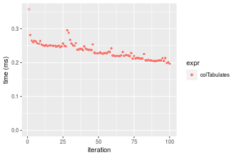

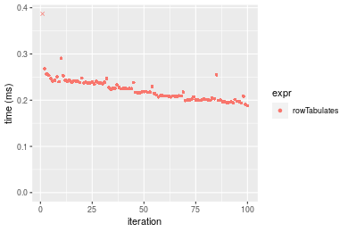
_Table: Benchmarking of colTabulates() and rowTabulates() on 10x10 data (original and transposed).  The top panel shows times in milliseconds and the bottom panel shows relative times._


|   |expr         |     min|       lq|     mean|   median|       uq|     max|
|:--|:------------|-------:|--------:|--------:|--------:|--------:|-------:|
|2  |rowTabulates | 189.191| 204.2010| 219.8739| 216.7605| 231.9460| 401.605|
|1  |colTabulates | 196.690| 216.5795| 234.8012| 230.4595| 249.9735| 402.260|


|   |expr         |      min|       lq|    mean|   median|       uq|      max|
|:--|:------------|--------:|--------:|-------:|--------:|--------:|--------:|
|2  |rowTabulates | 1.000000| 1.000000| 1.00000| 1.000000| 1.000000| 1.000000|
|1  |colTabulates | 1.039637| 1.060619| 1.06789| 1.063199| 1.077723| 1.001631|

_Figure: Benchmarking of colTabulates() and rowTabulates() on 10x10 data (original and transposed).  Outliers are displayed as crosses. Times are in milliseconds._


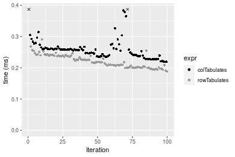

### 100x100 matrix


```r
> X <- data[["100x100"]]
> gc()
           used  (Mb) gc trigger  (Mb) max used  (Mb)
Ncells  5311073 283.7    7916910 422.9  7916910 422.9
Vcells 10231012  78.1   33191153 253.3 53339345 407.0
> colStats <- microbenchmark(colTabulates = colTabulates(X, na.rm = FALSE), unit = "ms")
> X <- t(X)
> gc()
           used  (Mb) gc trigger  (Mb) max used  (Mb)
Ncells  5311067 283.7    7916910 422.9  7916910 422.9
Vcells 10236055  78.1   33191153 253.3 53339345 407.0
> rowStats <- microbenchmark(rowTabulates = rowTabulates(X, na.rm = FALSE), unit = "ms")
```

_Table: Benchmarking of colTabulates() on 100x100 data. The top panel shows times in milliseconds and the bottom panel shows relative times._


|   |expr         |     min|        lq|      mean|    median|        uq|      max|
|:--|:------------|-------:|---------:|---------:|---------:|---------:|--------:|
|1  |colTabulates | 0.48234| 0.5168785| 0.5979108| 0.5827735| 0.6529605| 0.903825|


|   |expr         | min| lq| mean| median| uq| max|
|:--|:------------|---:|--:|----:|------:|--:|---:|
|1  |colTabulates |   1|  1|    1|      1|  1|   1|

_Table: Benchmarking of rowTabulates() on 100x100 data (transposed). The top panel shows times in milliseconds and the bottom panel shows relative times._


|   |expr         |     min|        lq|      mean|   median|       uq|      max|
|:--|:------------|-------:|---------:|---------:|--------:|--------:|--------:|
|1  |rowTabulates | 0.58075| 0.6050025| 0.7095906| 0.689075| 0.761424| 1.098079|


|   |expr         | min| lq| mean| median| uq| max|
|:--|:------------|---:|--:|----:|------:|--:|---:|
|1  |rowTabulates |   1|  1|    1|      1|  1|   1|

_Figure: Benchmarking of colTabulates() on 100x100 data  as well as rowTabulates() on the same data transposed.  Outliers are displayed as crosses.  Times are in milliseconds._


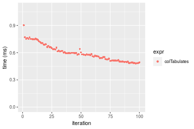

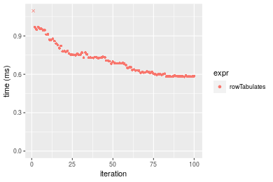
_Table: Benchmarking of colTabulates() and rowTabulates() on 100x100 data (original and transposed).  The top panel shows times in milliseconds and the bottom panel shows relative times._


|   |expr         |    min|       lq|     mean|   median|       uq|      max|
|:--|:------------|------:|--------:|--------:|--------:|--------:|--------:|
|1  |colTabulates | 482.34| 516.8785| 597.9108| 582.7735| 652.9605|  903.825|
|2  |rowTabulates | 580.75| 605.0025| 709.5906| 689.0750| 761.4240| 1098.079|


|   |expr         |      min|       lq|     mean|   median|      uq|      max|
|:--|:------------|--------:|--------:|--------:|--------:|-------:|--------:|
|1  |colTabulates | 1.000000| 1.000000| 1.000000| 1.000000| 1.00000| 1.000000|
|2  |rowTabulates | 1.204026| 1.170493| 1.186783| 1.182406| 1.16611| 1.214924|

_Figure: Benchmarking of colTabulates() and rowTabulates() on 100x100 data (original and transposed).  Outliers are displayed as crosses. Times are in milliseconds._


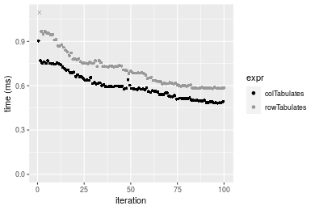

### 1000x10 matrix


```r
> X <- data[["1000x10"]]
> gc()
           used  (Mb) gc trigger  (Mb) max used  (Mb)
Ncells  5311783 283.7    7916910 422.9  7916910 422.9
Vcells 10234297  78.1   33191153 253.3 53339345 407.0
> colStats <- microbenchmark(colTabulates = colTabulates(X, na.rm = FALSE), unit = "ms")
> X <- t(X)
> gc()
           used  (Mb) gc trigger  (Mb) max used  (Mb)
Ncells  5311777 283.7    7916910 422.9  7916910 422.9
Vcells 10239340  78.2   33191153 253.3 53339345 407.0
> rowStats <- microbenchmark(rowTabulates = rowTabulates(X, na.rm = FALSE), unit = "ms")
```

_Table: Benchmarking of colTabulates() on 1000x10 data. The top panel shows times in milliseconds and the bottom panel shows relative times._


|   |expr         |      min|        lq|      mean|    median|        uq|      max|
|:--|:------------|--------:|---------:|---------:|---------:|---------:|--------:|
|1  |colTabulates | 0.455727| 0.4966905| 0.5633653| 0.5477525| 0.6110225| 0.882606|


|   |expr         | min| lq| mean| median| uq| max|
|:--|:------------|---:|--:|----:|------:|--:|---:|
|1  |colTabulates |   1|  1|    1|      1|  1|   1|

_Table: Benchmarking of rowTabulates() on 1000x10 data (transposed). The top panel shows times in milliseconds and the bottom panel shows relative times._


|   |expr         |      min|        lq|      mean|  median|       uq|      max|
|:--|:------------|--------:|---------:|---------:|-------:|--------:|--------:|
|1  |rowTabulates | 0.572059| 0.6382925| 0.7512468| 0.71464| 0.825404| 1.202477|


|   |expr         | min| lq| mean| median| uq| max|
|:--|:------------|---:|--:|----:|------:|--:|---:|
|1  |rowTabulates |   1|  1|    1|      1|  1|   1|

_Figure: Benchmarking of colTabulates() on 1000x10 data  as well as rowTabulates() on the same data transposed.  Outliers are displayed as crosses.  Times are in milliseconds._


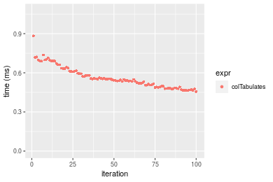

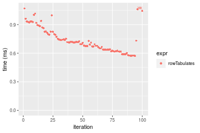
_Table: Benchmarking of colTabulates() and rowTabulates() on 1000x10 data (original and transposed).  The top panel shows times in milliseconds and the bottom panel shows relative times._


|   |expr         |     min|       lq|     mean|   median|       uq|      max|
|:--|:------------|-------:|--------:|--------:|--------:|--------:|--------:|
|1  |colTabulates | 455.727| 496.6905| 563.3653| 547.7525| 611.0225|  882.606|
|2  |rowTabulates | 572.059| 638.2925| 751.2468| 714.6400| 825.4040| 1202.477|


|   |expr         |      min|       lq|     mean|   median|       uq|      max|
|:--|:------------|--------:|--------:|--------:|--------:|--------:|--------:|
|1  |colTabulates | 1.000000| 1.000000| 1.000000| 1.000000| 1.000000| 1.000000|
|2  |rowTabulates | 1.255267| 1.285091| 1.333499| 1.304677| 1.350857| 1.362416|

_Figure: Benchmarking of colTabulates() and rowTabulates() on 1000x10 data (original and transposed).  Outliers are displayed as crosses. Times are in milliseconds._


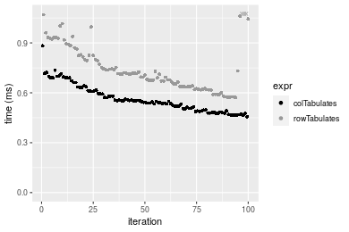

### 10x1000 matrix


```r
> X <- data[["10x1000"]]
> gc()
           used  (Mb) gc trigger  (Mb) max used  (Mb)
Ncells  5311954 283.7    7916910 422.9  7916910 422.9
Vcells 10234877  78.1   33191153 253.3 53339345 407.0
> colStats <- microbenchmark(colTabulates = colTabulates(X, na.rm = FALSE), unit = "ms")
> X <- t(X)
> gc()
           used  (Mb) gc trigger  (Mb) max used  (Mb)
Ncells  5311948 283.7    7916910 422.9  7916910 422.9
Vcells 10239920  78.2   33191153 253.3 53339345 407.0
> rowStats <- microbenchmark(rowTabulates = rowTabulates(X, na.rm = FALSE), unit = "ms")
```

_Table: Benchmarking of colTabulates() on 10x1000 data. The top panel shows times in milliseconds and the bottom panel shows relative times._


|   |expr         |     min|      lq|     mean|   median|        uq|      max|
|:--|:------------|-------:|-------:|--------:|--------:|---------:|--------:|
|1  |colTabulates | 0.67164| 0.70546| 0.790456| 0.734978| 0.8896275| 1.354405|


|   |expr         | min| lq| mean| median| uq| max|
|:--|:------------|---:|--:|----:|------:|--:|---:|
|1  |colTabulates |   1|  1|    1|      1|  1|   1|

_Table: Benchmarking of rowTabulates() on 10x1000 data (transposed). The top panel shows times in milliseconds and the bottom panel shows relative times._


|   |expr         |      min|        lq|      mean|   median|        uq|      max|
|:--|:------------|--------:|---------:|---------:|--------:|---------:|--------:|
|1  |rowTabulates | 0.621013| 0.6341315| 0.7509423| 0.726829| 0.8070165| 1.167277|


|   |expr         | min| lq| mean| median| uq| max|
|:--|:------------|---:|--:|----:|------:|--:|---:|
|1  |rowTabulates |   1|  1|    1|      1|  1|   1|

_Figure: Benchmarking of colTabulates() on 10x1000 data  as well as rowTabulates() on the same data transposed.  Outliers are displayed as crosses.  Times are in milliseconds._


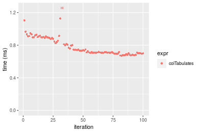

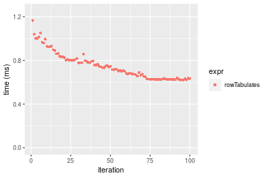
_Table: Benchmarking of colTabulates() and rowTabulates() on 10x1000 data (original and transposed).  The top panel shows times in milliseconds and the bottom panel shows relative times._


|   |expr         |     min|       lq|     mean|  median|       uq|      max|
|:--|:------------|-------:|--------:|--------:|-------:|--------:|--------:|
|2  |rowTabulates | 621.013| 634.1315| 750.9423| 726.829| 807.0165| 1167.277|
|1  |colTabulates | 671.640| 705.4600| 790.4560| 734.978| 889.6275| 1354.405|


|   |expr         |      min|       lq|     mean|   median|       uq|      max|
|:--|:------------|--------:|--------:|--------:|--------:|--------:|--------:|
|2  |rowTabulates | 1.000000| 1.000000| 1.000000| 1.000000| 1.000000| 1.000000|
|1  |colTabulates | 1.081523| 1.112482| 1.052619| 1.011212| 1.102366| 1.160312|

_Figure: Benchmarking of colTabulates() and rowTabulates() on 10x1000 data (original and transposed).  Outliers are displayed as crosses. Times are in milliseconds._


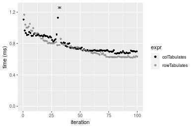

### 100x1000 matrix


```r
> X <- data[["100x1000"]]
> gc()
           used  (Mb) gc trigger  (Mb) max used  (Mb)
Ncells  5312125 283.7    7916910 422.9  7916910 422.9
Vcells 10235291  78.1   33191153 253.3 53339345 407.0
> colStats <- microbenchmark(colTabulates = colTabulates(X, na.rm = FALSE), unit = "ms")
> X <- t(X)
> gc()
           used  (Mb) gc trigger  (Mb) max used  (Mb)
Ncells  5312119 283.7    7916910 422.9  7916910 422.9
Vcells 10285334  78.5   33191153 253.3 53339345 407.0
> rowStats <- microbenchmark(rowTabulates = rowTabulates(X, na.rm = FALSE), unit = "ms")
```

_Table: Benchmarking of colTabulates() on 100x1000 data. The top panel shows times in milliseconds and the bottom panel shows relative times._


|   |expr         |      min|       lq|    mean|   median|       uq|      max|
|:--|:------------|--------:|--------:|-------:|--------:|--------:|--------:|
|1  |colTabulates | 3.026318| 3.303526| 3.67743| 3.554111| 3.846069| 10.60402|


|   |expr         | min| lq| mean| median| uq| max|
|:--|:------------|---:|--:|----:|------:|--:|---:|
|1  |colTabulates |   1|  1|    1|      1|  1|   1|

_Table: Benchmarking of rowTabulates() on 100x1000 data (transposed). The top panel shows times in milliseconds and the bottom panel shows relative times._


|   |expr         |      min|       lq|     mean|   median|       uq|      max|
|:--|:------------|--------:|--------:|--------:|--------:|--------:|--------:|
|1  |rowTabulates | 4.224572| 4.367992| 4.879611| 4.714155| 4.854189| 15.14541|


|   |expr         | min| lq| mean| median| uq| max|
|:--|:------------|---:|--:|----:|------:|--:|---:|
|1  |rowTabulates |   1|  1|    1|      1|  1|   1|

_Figure: Benchmarking of colTabulates() on 100x1000 data  as well as rowTabulates() on the same data transposed.  Outliers are displayed as crosses.  Times are in milliseconds._


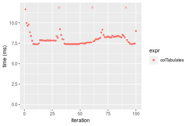

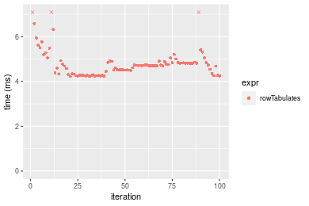
_Table: Benchmarking of colTabulates() and rowTabulates() on 100x1000 data (original and transposed).  The top panel shows times in milliseconds and the bottom panel shows relative times._


|   |expr         |      min|       lq|     mean|   median|       uq|      max|
|:--|:------------|--------:|--------:|--------:|--------:|--------:|--------:|
|1  |colTabulates | 3.026318| 3.303526| 3.677430| 3.554111| 3.846069| 10.60402|
|2  |rowTabulates | 4.224572| 4.367992| 4.879611| 4.714155| 4.854189| 15.14541|


|   |expr         |      min|       lq|     mean|   median|       uq|      max|
|:--|:------------|--------:|--------:|--------:|--------:|--------:|--------:|
|1  |colTabulates | 1.000000| 1.000000| 1.000000| 1.000000| 1.000000| 1.000000|
|2  |rowTabulates | 1.395944| 1.322221| 1.326908| 1.326395| 1.262117| 1.428271|

_Figure: Benchmarking of colTabulates() and rowTabulates() on 100x1000 data (original and transposed).  Outliers are displayed as crosses. Times are in milliseconds._


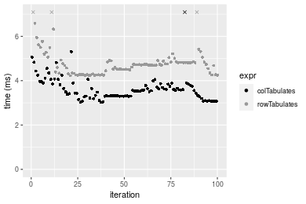

### 1000x100 matrix


```r
> X <- data[["1000x100"]]
> gc()
           used  (Mb) gc trigger  (Mb) max used  (Mb)
Ncells  5312296 283.8    7916910 422.9  7916910 422.9
Vcells 10235764  78.1   33191153 253.3 53339345 407.0
> colStats <- microbenchmark(colTabulates = colTabulates(X, na.rm = FALSE), unit = "ms")
> X <- t(X)
> gc()
           used  (Mb) gc trigger  (Mb) max used  (Mb)
Ncells  5312290 283.8    7916910 422.9  7916910 422.9
Vcells 10285807  78.5   33191153 253.3 53339345 407.0
> rowStats <- microbenchmark(rowTabulates = rowTabulates(X, na.rm = FALSE), unit = "ms")
```

_Table: Benchmarking of colTabulates() on 1000x100 data. The top panel shows times in milliseconds and the bottom panel shows relative times._


|   |expr         |      min|      lq|     mean|   median|       uq|      max|
|:--|:------------|--------:|-------:|--------:|--------:|--------:|--------:|
|1  |colTabulates | 2.946093| 3.29304| 3.639855| 3.408883| 3.649589| 13.79837|


|   |expr         | min| lq| mean| median| uq| max|
|:--|:------------|---:|--:|----:|------:|--:|---:|
|1  |colTabulates |   1|  1|    1|      1|  1|   1|

_Table: Benchmarking of rowTabulates() on 1000x100 data (transposed). The top panel shows times in milliseconds and the bottom panel shows relative times._


|   |expr         |     min|       lq|     mean|   median|       uq|      max|
|:--|:------------|-------:|--------:|--------:|--------:|--------:|--------:|
|1  |rowTabulates | 4.31966| 4.392578| 4.865569| 4.804507| 4.917851| 11.91221|


|   |expr         | min| lq| mean| median| uq| max|
|:--|:------------|---:|--:|----:|------:|--:|---:|
|1  |rowTabulates |   1|  1|    1|      1|  1|   1|

_Figure: Benchmarking of colTabulates() on 1000x100 data  as well as rowTabulates() on the same data transposed.  Outliers are displayed as crosses.  Times are in milliseconds._


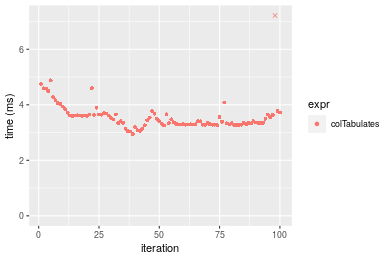

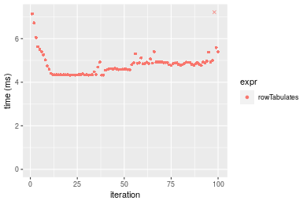
_Table: Benchmarking of colTabulates() and rowTabulates() on 1000x100 data (original and transposed).  The top panel shows times in milliseconds and the bottom panel shows relative times._


|   |expr         |      min|       lq|     mean|   median|       uq|      max|
|:--|:------------|--------:|--------:|--------:|--------:|--------:|--------:|
|1  |colTabulates | 2.946093| 3.293040| 3.639855| 3.408883| 3.649589| 13.79837|
|2  |rowTabulates | 4.319660| 4.392578| 4.865569| 4.804507| 4.917851| 11.91221|


|   |expr         |      min|       lq|     mean|   median|       uq|       max|
|:--|:------------|--------:|--------:|--------:|--------:|--------:|---------:|
|1  |colTabulates | 1.000000| 1.000000| 1.000000| 1.000000| 1.000000| 1.0000000|
|2  |rowTabulates | 1.466233| 1.333898| 1.336748| 1.409408| 1.347508| 0.8633057|

_Figure: Benchmarking of colTabulates() and rowTabulates() on 1000x100 data (original and transposed).  Outliers are displayed as crosses. Times are in milliseconds._


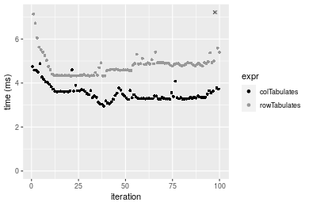


## Appendix

### Session information
```r
R version 4.1.1 Patched (2021-08-10 r80727)
Platform: x86_64-pc-linux-gnu (64-bit)
Running under: Ubuntu 18.04.5 LTS

Matrix products: default
BLAS:   /home/hb/software/R-devel/R-4-1-branch/lib/R/lib/libRblas.so
LAPACK: /home/hb/software/R-devel/R-4-1-branch/lib/R/lib/libRlapack.so

locale:
 [1] LC_CTYPE=en_US.UTF-8       LC_NUMERIC=C              
 [3] LC_TIME=en_US.UTF-8        LC_COLLATE=en_US.UTF-8    
 [5] LC_MONETARY=en_US.UTF-8    LC_MESSAGES=en_US.UTF-8   
 [7] LC_PAPER=en_US.UTF-8       LC_NAME=C                 
 [9] LC_ADDRESS=C               LC_TELEPHONE=C            
[11] LC_MEASUREMENT=en_US.UTF-8 LC_IDENTIFICATION=C       

attached base packages:
[1] stats     graphics  grDevices utils     datasets  methods   base     

other attached packages:
[1] microbenchmark_1.4-7   matrixStats_0.60.0     ggplot2_3.3.5         
[4] knitr_1.33             R.devices_2.17.0       R.utils_2.10.1        
[7] R.oo_1.24.0            R.methodsS3_1.8.1-9001 history_0.0.1-9000    

loaded via a namespace (and not attached):
 [1] Biobase_2.52.0          httr_1.4.2              splines_4.1.1          
 [4] bit64_4.0.5             network_1.17.1          assertthat_0.2.1       
 [7] highr_0.9               stats4_4.1.1            blob_1.2.2             
[10] GenomeInfoDbData_1.2.6  robustbase_0.93-8       pillar_1.6.2           
[13] RSQLite_2.2.8           lattice_0.20-44         glue_1.4.2             
[16] digest_0.6.27           XVector_0.32.0          colorspace_2.0-2       
[19] Matrix_1.3-4            XML_3.99-0.7            pkgconfig_2.0.3        
[22] zlibbioc_1.38.0         genefilter_1.74.0       purrr_0.3.4            
[25] ergm_4.1.2              xtable_1.8-4            scales_1.1.1           
[28] tibble_3.1.4            annotate_1.70.0         KEGGREST_1.32.0        
[31] farver_2.1.0            generics_0.1.0          IRanges_2.26.0         
[34] ellipsis_0.3.2          cachem_1.0.6            withr_2.4.2            
[37] BiocGenerics_0.38.0     mime_0.11               survival_3.2-13        
[40] magrittr_2.0.1          crayon_1.4.1            statnet.common_4.5.0   
[43] memoise_2.0.0           laeken_0.5.1            fansi_0.5.0            
[46] R.cache_0.15.0          MASS_7.3-54             R.rsp_0.44.0           
[49] progressr_0.8.0         tools_4.1.1             lifecycle_1.0.0        
[52] S4Vectors_0.30.0        trust_0.1-8             munsell_0.5.0          
[55] tabby_0.0.1-9001        AnnotationDbi_1.54.1    Biostrings_2.60.2      
[58] compiler_4.1.1          GenomeInfoDb_1.28.1     rlang_0.4.11           
[61] grid_4.1.1              RCurl_1.98-1.4          cwhmisc_6.6            
[64] rstudioapi_0.13         rappdirs_0.3.3          startup_0.15.0         
[67] labeling_0.4.2          bitops_1.0-7            base64enc_0.1-3        
[70] boot_1.3-28             gtable_0.3.0            DBI_1.1.1              
[73] markdown_1.1            R6_2.5.1                lpSolveAPI_5.5.2.0-17.7
[76] rle_0.9.2               dplyr_1.0.7             fastmap_1.1.0          
[79] bit_4.0.4               utf8_1.2.2              parallel_4.1.1         
[82] Rcpp_1.0.7              vctrs_0.3.8             png_0.1-7              
[85] DEoptimR_1.0-9          tidyselect_1.1.1        xfun_0.25              
[88] coda_0.19-4            
```
Total processing time was 14.09 secs.


### Reproducibility
To reproduce this report, do:
```r
html <- matrixStats:::benchmark('colTabulates')
```

[RSP]: https://cran.r-project.org/package=R.rsp
[matrixStats]: https://cran.r-project.org/package=matrixStats

[StackOverflow:colMins?]: https://stackoverflow.com/questions/13676878 "Stack Overflow: fastest way to get Min from every column in a matrix?"
[StackOverflow:colSds?]: https://stackoverflow.com/questions/17549762 "Stack Overflow: Is there such 'colsd' in R?"
[StackOverflow:rowProds?]: https://stackoverflow.com/questions/20198801/ "Stack Overflow: Row product of matrix and column sum of matrix"

---------------------------------------
Copyright Henrik Bengtsson. Last updated on 2021-08-25 22:30:34 (+0200 UTC). Powered by [RSP].

<script>
 var link = document.createElement('link');
 link.rel = 'icon';
 link.href = "data:image/png;base64,iVBORw0KGgoAAAANSUhEUgAAACAAAAAgCAMAAABEpIrGAAAA21BMVEUAAAAAAP8AAP8AAP8AAP8AAP8AAP8AAP8AAP8AAP8AAP8AAP8AAP8AAP8AAP8AAP8AAP8AAP8AAP8AAP8AAP8AAP8AAP8AAP8AAP8AAP8AAP8AAP8AAP8AAP8AAP8AAP8AAP8AAP8AAP8AAP8AAP8AAP8AAP8AAP8AAP8AAP8BAf4CAv0DA/wdHeIeHuEfH+AgIN8hId4lJdomJtknJ9g+PsE/P8BAQL9yco10dIt1dYp3d4h4eIeVlWqWlmmXl2iYmGeZmWabm2Tn5xjo6Bfp6Rb39wj4+Af//wA2M9hbAAAASXRSTlMAAQIJCgsMJSYnKD4/QGRlZmhpamtsbautrrCxuru8y8zN5ebn6Pn6+///////////////////////////////////////////LsUNcQAAAS9JREFUOI29k21XgkAQhVcFytdSMqMETU26UVqGmpaiFbL//xc1cAhhwVNf6n5i5z67M2dmYOyfJZUqlVLhkKucG7cgmUZTybDz6g0iDeq51PUr37Ds2cy2/C9NeES5puDjxuUk1xnToZsg8pfA3avHQ3lLIi7iWRrkv/OYtkScxBIMgDee0ALoyxHQBJ68JLCjOtQIMIANF7QG9G9fNnHvisCHBVMKgSJgiz7nE+AoBKrAPA3MgepvgR9TSCasrCKH0eB1wBGBFdCO+nAGjMVGPcQb5bd6mQRegN6+1axOs9nGfYcCtfi4NQosdtH7dB+txFIpXQqN1p9B/asRHToyS0jRgpV7nk4nwcq1BJ+x3Gl/v7S9Wmpp/aGquum7w3ZDyrADFYrl8vHBH+ev9AUASW1dmU4h4wAAAABJRU5ErkJggg=="
 document.getElementsByTagName('head')[0].appendChild(link);
</script>


