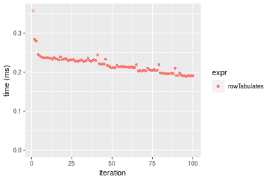
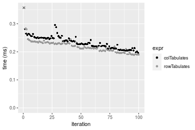
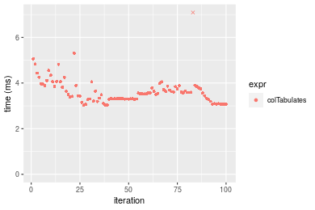

[matrixStats]: Benchmark report

---------------------------------------


# colTabulates() and rowTabulates() benchmarks

This report benchmark the performance of colTabulates() and rowTabulates() against alternative methods.

## Alternative methods

* ???


## Data
```r
> rmatrix <- function(nrow, ncol, mode = c("logical", "double", "integer", "index"), range = c(-100, 
+     +100), na_prob = 0) {
+     mode <- match.arg(mode)
+     n <- nrow * ncol
+     if (mode == "logical") {
+         x <- sample(c(FALSE, TRUE), size = n, replace = TRUE)
+     }     else if (mode == "index") {
+         x <- seq_len(n)
+         mode <- "integer"
+     }     else {
+         x <- runif(n, min = range[1], max = range[2])
+     }
+     storage.mode(x) <- mode
+     if (na_prob > 0) 
+         x[sample(n, size = na_prob * n)] <- NA
+     dim(x) <- c(nrow, ncol)
+     x
+ }
> rmatrices <- function(scale = 10, seed = 1, ...) {
+     set.seed(seed)
+     data <- list()
+     data[[1]] <- rmatrix(nrow = scale * 1, ncol = scale * 1, ...)
+     data[[2]] <- rmatrix(nrow = scale * 10, ncol = scale * 10, ...)
+     data[[3]] <- rmatrix(nrow = scale * 100, ncol = scale * 1, ...)
+     data[[4]] <- t(data[[3]])
+     data[[5]] <- rmatrix(nrow = scale * 10, ncol = scale * 100, ...)
+     data[[6]] <- t(data[[5]])
+     names(data) <- sapply(data, FUN = function(x) paste(dim(x), collapse = "x"))
+     data
+ }
> data <- rmatrices(mode = "integer", range = c(-10, 10))
```

## Results

### 10x10 matrix


```r
> X <- data[["10x10"]]
> gc()
           used  (Mb) gc trigger  (Mb) max used  (Mb)
Ncells  5261600 281.0   10014072 534.9 10014072 534.9
Vcells 10002429  76.4   18204443 138.9 18204443 138.9
> colStats <- microbenchmark(colTabulates = colTabulates(X, na.rm = FALSE), unit = "ms")
> X <- t(X)
> gc()
          used  (Mb) gc trigger  (Mb) max used  (Mb)
Ncells 5246273 280.2   10014072 534.9 10014072 534.9
Vcells 9951645  76.0   18204443 138.9 18204443 138.9
> rowStats <- microbenchmark(rowTabulates = rowTabulates(X, na.rm = FALSE), unit = "ms")
```

_Table: Benchmarking of colTabulates() on 10x10 data. The top panel shows times in milliseconds and the bottom panel shows relative times._


|   |expr         |      min|       lq|      mean|    median|       uq|      max|
|:--|:------------|--------:|--------:|---------:|---------:|--------:|--------:|
|1  |colTabulates | 0.218864| 0.238058| 0.2600609| 0.2572815| 0.262517| 0.433224|


|   |expr         | min| lq| mean| median| uq| max|
|:--|:------------|---:|--:|----:|------:|--:|---:|
|1  |colTabulates |   1|  1|    1|      1|  1|   1|

_Table: Benchmarking of rowTabulates() on 10x10 data (transposed). The top panel shows times in milliseconds and the bottom panel shows relative times._


|   |expr         |      min|       lq|      mean|   median|        uq|     max|
|:--|:------------|--------:|--------:|---------:|--------:|---------:|-------:|
|1  |rowTabulates | 0.187853| 0.202273| 0.2227644| 0.217681| 0.2384765| 0.39866|


|   |expr         | min| lq| mean| median| uq| max|
|:--|:------------|---:|--:|----:|------:|--:|---:|
|1  |rowTabulates |   1|  1|    1|      1|  1|   1|

_Figure: Benchmarking of colTabulates() on 10x10 data  as well as rowTabulates() on the same data transposed.  Outliers are displayed as crosses.  Times are in milliseconds._



_Table: Benchmarking of colTabulates() and rowTabulates() on 10x10 data (original and transposed).  The top panel shows times in milliseconds and the bottom panel shows relative times._


|   |expr         |     min|      lq|     mean|   median|       uq|     max|
|:--|:------------|-------:|-------:|--------:|--------:|--------:|-------:|
|2  |rowTabulates | 187.853| 202.273| 222.7644| 217.6810| 238.4765| 398.660|
|1  |colTabulates | 218.864| 238.058| 260.0609| 257.2815| 262.5170| 433.224|


|   |expr         |      min|       lq|     mean|  median|       uq|    max|
|:--|:------------|--------:|--------:|--------:|-------:|--------:|------:|
|2  |rowTabulates | 1.000000| 1.000000| 1.000000| 1.00000| 1.000000| 1.0000|
|1  |colTabulates | 1.165081| 1.176914| 1.167426| 1.18192| 1.100809| 1.0867|

_Figure: Benchmarking of colTabulates() and rowTabulates() on 10x10 data (original and transposed).  Outliers are displayed as crosses. Times are in milliseconds._




### 100x100 matrix


```r
> X <- data[["100x100"]]
> gc()
          used  (Mb) gc trigger  (Mb) max used  (Mb)
Ncells 5244798 280.2   10014072 534.9 10014072 534.9
Vcells 9757228  74.5   18204443 138.9 18204443 138.9
> colStats <- microbenchmark(colTabulates = colTabulates(X, na.rm = FALSE), unit = "ms")
> X <- t(X)
> gc()
          used  (Mb) gc trigger  (Mb) max used  (Mb)
Ncells 5244774 280.2   10014072 534.9 10014072 534.9
Vcells 9762241  74.5   18204443 138.9 18204443 138.9
> rowStats <- microbenchmark(rowTabulates = rowTabulates(X, na.rm = FALSE), unit = "ms")
```

_Table: Benchmarking of colTabulates() on 100x100 data. The top panel shows times in milliseconds and the bottom panel shows relative times._


|   |expr         |      min|       lq|     mean|    median|       uq|      max|
|:--|:------------|--------:|--------:|--------:|---------:|--------:|--------:|
|1  |colTabulates | 0.891807| 0.898177| 1.089458| 0.9744025| 1.193412| 1.843858|


|   |expr         | min| lq| mean| median| uq| max|
|:--|:------------|---:|--:|----:|------:|--:|---:|
|1  |colTabulates |   1|  1|    1|      1|  1|   1|

_Table: Benchmarking of rowTabulates() on 100x100 data (transposed). The top panel shows times in milliseconds and the bottom panel shows relative times._


|   |expr         |      min|        lq|      mean|   median|       uq|     max|
|:--|:------------|--------:|---------:|---------:|--------:|--------:|-------:|
|1  |rowTabulates | 0.747081| 0.7536705| 0.8793048| 0.811446| 0.968761| 1.40644|


|   |expr         | min| lq| mean| median| uq| max|
|:--|:------------|---:|--:|----:|------:|--:|---:|
|1  |rowTabulates |   1|  1|    1|      1|  1|   1|

_Figure: Benchmarking of colTabulates() on 100x100 data  as well as rowTabulates() on the same data transposed.  Outliers are displayed as crosses.  Times are in milliseconds._


_Table: Benchmarking of colTabulates() and rowTabulates() on 100x100 data (original and transposed).  The top panel shows times in milliseconds and the bottom panel shows relative times._


|   |expr         |     min|       lq|      mean|   median|       uq|      max|
|:--|:------------|-------:|--------:|---------:|--------:|--------:|--------:|
|2  |rowTabulates | 747.081| 753.6705|  879.3048| 811.4460|  968.761| 1406.440|
|1  |colTabulates | 891.807| 898.1770| 1089.4584| 974.4025| 1193.411| 1843.858|


|   |expr         |      min|       lq|  mean|   median|       uq|      max|
|:--|:------------|--------:|--------:|-----:|--------:|--------:|--------:|
|2  |rowTabulates | 1.000000| 1.000000| 1.000| 1.000000| 1.000000| 1.000000|
|1  |colTabulates | 1.193722| 1.191737| 1.239| 1.200822| 1.231895| 1.311011|

_Figure: Benchmarking of colTabulates() and rowTabulates() on 100x100 data (original and transposed).  Outliers are displayed as crosses. Times are in milliseconds._


### 1000x10 matrix


```r
> X <- data[["1000x10"]]
> gc()
          used  (Mb) gc trigger  (Mb) max used  (Mb)
Ncells 5245508 280.2   10014072 534.9 10014072 534.9
Vcells 9760513  74.5   18204443 138.9 18204443 138.9
> colStats <- microbenchmark(colTabulates = colTabulates(X, na.rm = FALSE), unit = "ms")
> X <- t(X)
> gc()
          used  (Mb) gc trigger  (Mb) max used  (Mb)
Ncells 5245484 280.2   10014072 534.9 10014072 534.9
Vcells 9765526  74.6   18204443 138.9 18204443 138.9
> rowStats <- microbenchmark(rowTabulates = rowTabulates(X, na.rm = FALSE), unit = "ms")
```

_Table: Benchmarking of colTabulates() on 1000x10 data. The top panel shows times in milliseconds and the bottom panel shows relative times._


|   |expr         |      min|        lq|     mean|    median|       uq|      max|
|:--|:------------|--------:|---------:|--------:|---------:|--------:|--------:|
|1  |colTabulates | 0.856336| 0.8622025| 1.019894| 0.9131595| 1.116165| 1.667397|


|   |expr         | min| lq| mean| median| uq| max|
|:--|:------------|---:|--:|----:|------:|--:|---:|
|1  |colTabulates |   1|  1|    1|      1|  1|   1|

_Table: Benchmarking of rowTabulates() on 1000x10 data (transposed). The top panel shows times in milliseconds and the bottom panel shows relative times._


|   |expr         |      min|       lq|      mean|   median|       uq|      max|
|:--|:------------|--------:|--------:|---------:|--------:|--------:|--------:|
|1  |rowTabulates | 0.793212| 0.803428| 0.9403111| 0.871681| 1.035043| 1.451517|


|   |expr         | min| lq| mean| median| uq| max|
|:--|:------------|---:|--:|----:|------:|--:|---:|
|1  |rowTabulates |   1|  1|    1|      1|  1|   1|

_Figure: Benchmarking of colTabulates() on 1000x10 data  as well as rowTabulates() on the same data transposed.  Outliers are displayed as crosses.  Times are in milliseconds._


_Table: Benchmarking of colTabulates() and rowTabulates() on 1000x10 data (original and transposed).  The top panel shows times in milliseconds and the bottom panel shows relative times._


|   |expr         |     min|       lq|      mean|   median|       uq|      max|
|:--|:------------|-------:|--------:|---------:|--------:|--------:|--------:|
|2  |rowTabulates | 793.212| 803.4280|  940.3111| 871.6810| 1035.043| 1451.517|
|1  |colTabulates | 856.336| 862.2025| 1019.8937| 913.1595| 1116.165| 1667.397|


|   |expr         |     min|       lq|     mean|   median|       uq|      max|
|:--|:------------|-------:|--------:|--------:|--------:|--------:|--------:|
|2  |rowTabulates | 1.00000| 1.000000| 1.000000| 1.000000| 1.000000| 1.000000|
|1  |colTabulates | 1.07958| 1.073155| 1.084634| 1.047584| 1.078376| 1.148727|

_Figure: Benchmarking of colTabulates() and rowTabulates() on 1000x10 data (original and transposed).  Outliers are displayed as crosses. Times are in milliseconds._


### 10x1000 matrix


```r
> X <- data[["10x1000"]]
> gc()
          used  (Mb) gc trigger  (Mb) max used  (Mb)
Ncells 5245679 280.2   10014072 534.9 10014072 534.9
Vcells 9761087  74.5   18204443 138.9 18204443 138.9
> colStats <- microbenchmark(colTabulates = colTabulates(X, na.rm = FALSE), unit = "ms")
> X <- t(X)
> gc()
          used  (Mb) gc trigger  (Mb) max used  (Mb)
Ncells 5245655 280.2   10014072 534.9 10014072 534.9
Vcells 9766100  74.6   18204443 138.9 18204443 138.9
> rowStats <- microbenchmark(rowTabulates = rowTabulates(X, na.rm = FALSE), unit = "ms")
```

_Table: Benchmarking of colTabulates() on 10x1000 data. The top panel shows times in milliseconds and the bottom panel shows relative times._


|   |expr         |      min|       lq|     mean|  median|       uq|      max|
|:--|:------------|--------:|--------:|--------:|-------:|--------:|--------:|
|1  |colTabulates | 1.013445| 1.020927| 1.230994| 1.10652| 1.352134| 2.836676|


|   |expr         | min| lq| mean| median| uq| max|
|:--|:------------|---:|--:|----:|------:|--:|---:|
|1  |colTabulates |   1|  1|    1|      1|  1|   1|

_Table: Benchmarking of rowTabulates() on 10x1000 data (transposed). The top panel shows times in milliseconds and the bottom panel shows relative times._


|   |expr         |      min|       lq|      mean|  median|       uq|      max|
|:--|:------------|--------:|--------:|---------:|-------:|--------:|--------:|
|1  |rowTabulates | 0.794779| 0.804731| 0.9499486| 0.88687| 1.026426| 1.553923|


|   |expr         | min| lq| mean| median| uq| max|
|:--|:------------|---:|--:|----:|------:|--:|---:|
|1  |rowTabulates |   1|  1|    1|      1|  1|   1|

_Figure: Benchmarking of colTabulates() on 10x1000 data  as well as rowTabulates() on the same data transposed.  Outliers are displayed as crosses.  Times are in milliseconds._


_Table: Benchmarking of colTabulates() and rowTabulates() on 10x1000 data (original and transposed).  The top panel shows times in milliseconds and the bottom panel shows relative times._


|   |expr         |      min|       lq|      mean|  median|       uq|      max|
|:--|:------------|--------:|--------:|---------:|-------:|--------:|--------:|
|2  |rowTabulates |  794.779|  804.731|  949.9486|  886.87| 1026.427| 1553.923|
|1  |colTabulates | 1013.445| 1020.927| 1230.9935| 1106.52| 1352.133| 2836.676|


|   |expr         |      min|       lq|     mean|   median|       uq|      max|
|:--|:------------|--------:|--------:|--------:|--------:|--------:|--------:|
|2  |rowTabulates | 1.000000| 1.000000| 1.000000| 1.000000| 1.000000| 1.000000|
|1  |colTabulates | 1.275128| 1.268656| 1.295853| 1.247669| 1.317321| 1.825493|

_Figure: Benchmarking of colTabulates() and rowTabulates() on 10x1000 data (original and transposed).  Outliers are displayed as crosses. Times are in milliseconds._


### 100x1000 matrix


```r
> X <- data[["100x1000"]]
> gc()
          used  (Mb) gc trigger  (Mb) max used  (Mb)
Ncells 5245850 280.2   10014072 534.9 10014072 534.9
Vcells 9761499  74.5   18204443 138.9 18204443 138.9
> colStats <- microbenchmark(colTabulates = colTabulates(X, na.rm = FALSE), unit = "ms")
> X <- t(X)
> gc()
          used  (Mb) gc trigger  (Mb) max used  (Mb)
Ncells 5245826 280.2   10014072 534.9 10014072 534.9
Vcells 9811512  74.9   18204443 138.9 18204443 138.9
> rowStats <- microbenchmark(rowTabulates = rowTabulates(X, na.rm = FALSE), unit = "ms")
```

_Table: Benchmarking of colTabulates() on 100x1000 data. The top panel shows times in milliseconds and the bottom panel shows relative times._


|   |expr         |      min|       lq|     mean|   median|       uq|      max|
|:--|:------------|--------:|--------:|--------:|--------:|--------:|--------:|
|1  |colTabulates | 7.367889| 7.470719| 8.166007| 7.836456| 8.278446| 15.06864|


|   |expr         | min| lq| mean| median| uq| max|
|:--|:------------|---:|--:|----:|------:|--:|---:|
|1  |colTabulates |   1|  1|    1|      1|  1|   1|

_Table: Benchmarking of rowTabulates() on 100x1000 data (transposed). The top panel shows times in milliseconds and the bottom panel shows relative times._


|   |expr         |      min|       lq|    mean|   median|       uq|      max|
|:--|:------------|--------:|--------:|-------:|--------:|--------:|--------:|
|1  |rowTabulates | 5.943567| 6.224183| 6.70493| 6.379309| 6.567147| 13.61521|


|   |expr         | min| lq| mean| median| uq| max|
|:--|:------------|---:|--:|----:|------:|--:|---:|
|1  |rowTabulates |   1|  1|    1|      1|  1|   1|

_Figure: Benchmarking of colTabulates() on 100x1000 data  as well as rowTabulates() on the same data transposed.  Outliers are displayed as crosses.  Times are in milliseconds._





_Table: Benchmarking of colTabulates() and rowTabulates() on 100x1000 data (original and transposed).  The top panel shows times in milliseconds and the bottom panel shows relative times._


|   |expr         |      min|       lq|     mean|   median|       uq|      max|
|:--|:------------|--------:|--------:|--------:|--------:|--------:|--------:|
|2  |rowTabulates | 5.943567| 6.224183| 6.704930| 6.379309| 6.567147| 13.61521|
|1  |colTabulates | 7.367889| 7.470719| 8.166007| 7.836456| 8.278446| 15.06864|


|   |expr         |      min|       lq|     mean|   median|       uq|      max|
|:--|:------------|--------:|--------:|--------:|--------:|--------:|--------:|
|2  |rowTabulates | 1.000000| 1.000000| 1.000000| 1.000000| 1.000000| 1.000000|
|1  |colTabulates | 1.239641| 1.200273| 1.217911| 1.228418| 1.260585| 1.106751|

_Figure: Benchmarking of colTabulates() and rowTabulates() on 100x1000 data (original and transposed).  Outliers are displayed as crosses. Times are in milliseconds._


### 1000x100 matrix


```r
> X <- data[["1000x100"]]
> gc()
          used  (Mb) gc trigger  (Mb) max used  (Mb)
Ncells 5246021 280.2   10014072 534.9 10014072 534.9
Vcells 9761971  74.5   18204443 138.9 18204443 138.9
> colStats <- microbenchmark(colTabulates = colTabulates(X, na.rm = FALSE), unit = "ms")
> X <- t(X)
> gc()
          used  (Mb) gc trigger  (Mb) max used  (Mb)
Ncells 5245997 280.2   10014072 534.9 10014072 534.9
Vcells 9811984  74.9   18204443 138.9 18204443 138.9
> rowStats <- microbenchmark(rowTabulates = rowTabulates(X, na.rm = FALSE), unit = "ms")
```

_Table: Benchmarking of colTabulates() on 1000x100 data. The top panel shows times in milliseconds and the bottom panel shows relative times._


|   |expr         |      min|       lq|     mean|   median|       uq|      max|
|:--|:------------|--------:|--------:|--------:|--------:|--------:|--------:|
|1  |colTabulates | 7.133173| 7.195648| 7.690348| 7.359363| 7.637063| 14.71697|


|   |expr         | min| lq| mean| median| uq| max|
|:--|:------------|---:|--:|----:|------:|--:|---:|
|1  |colTabulates |   1|  1|    1|      1|  1|   1|

_Table: Benchmarking of rowTabulates() on 1000x100 data (transposed). The top panel shows times in milliseconds and the bottom panel shows relative times._


|   |expr         |      min|       lq|     mean|   median|       uq|      max|
|:--|:------------|--------:|--------:|--------:|--------:|--------:|--------:|
|1  |rowTabulates | 6.007629| 6.210254| 6.753098| 6.370076| 6.516538| 21.38464|


|   |expr         | min| lq| mean| median| uq| max|
|:--|:------------|---:|--:|----:|------:|--:|---:|
|1  |rowTabulates |   1|  1|    1|      1|  1|   1|

_Figure: Benchmarking of colTabulates() on 1000x100 data  as well as rowTabulates() on the same data transposed.  Outliers are displayed as crosses.  Times are in milliseconds._


_Table: Benchmarking of colTabulates() and rowTabulates() on 1000x100 data (original and transposed).  The top panel shows times in milliseconds and the bottom panel shows relative times._


|   |expr         |      min|       lq|     mean|   median|       uq|      max|
|:--|:------------|--------:|--------:|--------:|--------:|--------:|--------:|
|2  |rowTabulates | 6.007629| 6.210254| 6.753098| 6.370076| 6.516538| 21.38464|
|1  |colTabulates | 7.133173| 7.195648| 7.690348| 7.359363| 7.637063| 14.71697|


|   |expr         |      min|       lq|     mean|   median|       uq|       max|
|:--|:------------|--------:|--------:|--------:|--------:|--------:|---------:|
|2  |rowTabulates | 1.000000| 1.000000| 1.000000| 1.000000| 1.000000| 1.0000000|
|1  |colTabulates | 1.187352| 1.158672| 1.138788| 1.155302| 1.171951| 0.6882024|

_Figure: Benchmarking of colTabulates() and rowTabulates() on 1000x100 data (original and transposed).  Outliers are displayed as crosses. Times are in milliseconds._


## Appendix

### Session information
```r
R version 4.1.1 Patched (2021-08-10 r80727)
Platform: x86_64-pc-linux-gnu (64-bit)
Running under: Ubuntu 18.04.5 LTS

Matrix products: default
BLAS:   /home/hb/software/R-devel/R-4-1-branch/lib/R/lib/libRblas.so
LAPACK: /home/hb/software/R-devel/R-4-1-branch/lib/R/lib/libRlapack.so

locale:
 [1] LC_CTYPE=en_US.UTF-8       LC_NUMERIC=C              
 [3] LC_TIME=en_US.UTF-8        LC_COLLATE=en_US.UTF-8    
 [5] LC_MONETARY=en_US.UTF-8    LC_MESSAGES=en_US.UTF-8   
 [7] LC_PAPER=en_US.UTF-8       LC_NAME=C                 
 [9] LC_ADDRESS=C               LC_TELEPHONE=C            
[11] LC_MEASUREMENT=en_US.UTF-8 LC_IDENTIFICATION=C       

attached base packages:
[1] stats     graphics  grDevices utils     datasets  methods   base     

other attached packages:
[1] microbenchmark_1.4-7   matrixStats_0.60.1     ggplot2_3.3.5         
[4] knitr_1.33             R.devices_2.17.0       R.utils_2.10.1        
[7] R.oo_1.24.0            R.methodsS3_1.8.1-9001 history_0.0.1-9000    

loaded via a namespace (and not attached):
 [1] Biobase_2.52.0          httr_1.4.2              splines_4.1.1          
 [4] bit64_4.0.5             network_1.17.1          assertthat_0.2.1       
 [7] highr_0.9               stats4_4.1.1            blob_1.2.2             
[10] GenomeInfoDbData_1.2.6  robustbase_0.93-8       pillar_1.6.2           
[13] RSQLite_2.2.8           lattice_0.20-44         glue_1.4.2             
[16] digest_0.6.27           XVector_0.32.0          colorspace_2.0-2       
[19] Matrix_1.3-4            XML_3.99-0.7            pkgconfig_2.0.3        
[22] zlibbioc_1.38.0         genefilter_1.74.0       purrr_0.3.4            
[25] ergm_4.1.2              xtable_1.8-4            scales_1.1.1           
[28] tibble_3.1.4            annotate_1.70.0         KEGGREST_1.32.0        
[31] farver_2.1.0            generics_0.1.0          IRanges_2.26.0         
[34] ellipsis_0.3.2          cachem_1.0.6            withr_2.4.2            
[37] BiocGenerics_0.38.0     mime_0.11               survival_3.2-13        
[40] magrittr_2.0.1          crayon_1.4.1            statnet.common_4.5.0   
[43] memoise_2.0.0           laeken_0.5.1            fansi_0.5.0            
[46] R.cache_0.15.0          MASS_7.3-54             R.rsp_0.44.0           
[49] progressr_0.8.0         tools_4.1.1             lifecycle_1.0.0        
[52] S4Vectors_0.30.0        trust_0.1-8             munsell_0.5.0          
[55] tabby_0.0.1-9001        AnnotationDbi_1.54.1    Biostrings_2.60.2      
[58] compiler_4.1.1          GenomeInfoDb_1.28.1     rlang_0.4.11           
[61] grid_4.1.1              RCurl_1.98-1.4          cwhmisc_6.6            
[64] rappdirs_0.3.3          startup_0.15.0          labeling_0.4.2         
[67] bitops_1.0-7            base64enc_0.1-3         boot_1.3-28            
[70] gtable_0.3.0            DBI_1.1.1               markdown_1.1           
[73] R6_2.5.1                lpSolveAPI_5.5.2.0-17.7 rle_0.9.2              
[76] dplyr_1.0.7             fastmap_1.1.0           bit_4.0.4              
[79] utf8_1.2.2              parallel_4.1.1          Rcpp_1.0.7             
[82] vctrs_0.3.8             png_0.1-7               DEoptimR_1.0-9         
[85] tidyselect_1.1.1        xfun_0.25               coda_0.19-4            
```
Total processing time was 15.25 secs.


### Reproducibility
To reproduce this report, do:
```r
html <- matrixStats:::benchmark('colTabulates')
```

[RSP]: https://cran.r-project.org/package=R.rsp
[matrixStats]: https://cran.r-project.org/package=matrixStats

[StackOverflow:colMins?]: https://stackoverflow.com/questions/13676878 "Stack Overflow: fastest way to get Min from every column in a matrix?"
[StackOverflow:colSds?]: https://stackoverflow.com/questions/17549762 "Stack Overflow: Is there such 'colsd' in R?"
[StackOverflow:rowProds?]: https://stackoverflow.com/questions/20198801/ "Stack Overflow: Row product of matrix and column sum of matrix"

---------------------------------------
Copyright Henrik Bengtsson. Last updated on 2021-08-25 18:16:44 (+0200 UTC). Powered by [RSP].

<script>
 var link = document.createElement('link');
 link.rel = 'icon';
 link.href = "data:image/png;base64,iVBORw0KGgoAAAANSUhEUgAAACAAAAAgCAMAAABEpIrGAAAA21BMVEUAAAAAAP8AAP8AAP8AAP8AAP8AAP8AAP8AAP8AAP8AAP8AAP8AAP8AAP8AAP8AAP8AAP8AAP8AAP8AAP8AAP8AAP8AAP8AAP8AAP8AAP8AAP8AAP8AAP8AAP8AAP8AAP8AAP8AAP8AAP8AAP8AAP8AAP8AAP8AAP8AAP8AAP8BAf4CAv0DA/wdHeIeHuEfH+AgIN8hId4lJdomJtknJ9g+PsE/P8BAQL9yco10dIt1dYp3d4h4eIeVlWqWlmmXl2iYmGeZmWabm2Tn5xjo6Bfp6Rb39wj4+Af//wA2M9hbAAAASXRSTlMAAQIJCgsMJSYnKD4/QGRlZmhpamtsbautrrCxuru8y8zN5ebn6Pn6+///////////////////////////////////////////LsUNcQAAAS9JREFUOI29k21XgkAQhVcFytdSMqMETU26UVqGmpaiFbL//xc1cAhhwVNf6n5i5z67M2dmYOyfJZUqlVLhkKucG7cgmUZTybDz6g0iDeq51PUr37Ds2cy2/C9NeES5puDjxuUk1xnToZsg8pfA3avHQ3lLIi7iWRrkv/OYtkScxBIMgDee0ALoyxHQBJ68JLCjOtQIMIANF7QG9G9fNnHvisCHBVMKgSJgiz7nE+AoBKrAPA3MgepvgR9TSCasrCKH0eB1wBGBFdCO+nAGjMVGPcQb5bd6mQRegN6+1axOs9nGfYcCtfi4NQosdtH7dB+txFIpXQqN1p9B/asRHToyS0jRgpV7nk4nwcq1BJ+x3Gl/v7S9Wmpp/aGquum7w3ZDyrADFYrl8vHBH+ev9AUASW1dmU4h4wAAAABJRU5ErkJggg=="
 document.getElementsByTagName('head')[0].appendChild(link);
</script>


