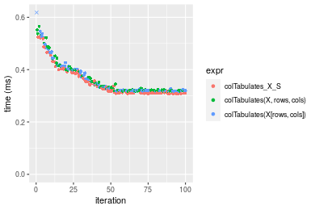
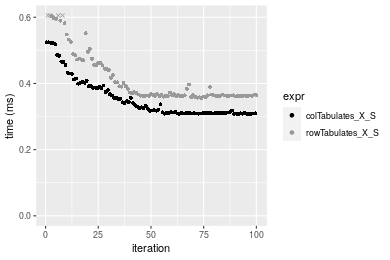
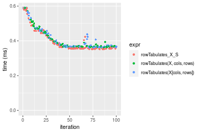
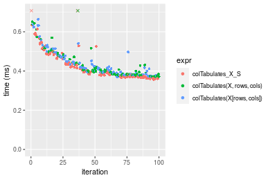
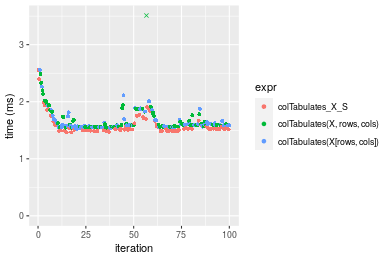

[matrixStats]: Benchmark report

---------------------------------------


# colTabulates() and rowTabulates() benchmarks on subsetted computation

This report benchmark the performance of colTabulates() and rowTabulates() on subsetted computation.


## Data
```r
> rmatrix <- function(nrow, ncol, mode = c("logical", "double", "integer", "index"), range = c(-100, 
+     +100), na_prob = 0) {
+     mode <- match.arg(mode)
+     n <- nrow * ncol
+     if (mode == "logical") {
+         x <- sample(c(FALSE, TRUE), size = n, replace = TRUE)
+     }     else if (mode == "index") {
+         x <- seq_len(n)
+         mode <- "integer"
+     }     else {
+         x <- runif(n, min = range[1], max = range[2])
+     }
+     storage.mode(x) <- mode
+     if (na_prob > 0) 
+         x[sample(n, size = na_prob * n)] <- NA
+     dim(x) <- c(nrow, ncol)
+     x
+ }
> rmatrices <- function(scale = 10, seed = 1, ...) {
+     set.seed(seed)
+     data <- list()
+     data[[1]] <- rmatrix(nrow = scale * 1, ncol = scale * 1, ...)
+     data[[2]] <- rmatrix(nrow = scale * 10, ncol = scale * 10, ...)
+     data[[3]] <- rmatrix(nrow = scale * 100, ncol = scale * 1, ...)
+     data[[4]] <- t(data[[3]])
+     data[[5]] <- rmatrix(nrow = scale * 10, ncol = scale * 100, ...)
+     data[[6]] <- t(data[[5]])
+     names(data) <- sapply(data, FUN = function(x) paste(dim(x), collapse = "x"))
+     data
+ }
> data <- rmatrices(mode = "integer", range = c(-10, 10))
```

## Results

### 10x10 matrix


```r
> X <- data[["10x10"]]
> rows <- sample.int(nrow(X), size = nrow(X) * 0.7)
> cols <- sample.int(ncol(X), size = ncol(X) * 0.7)
> X_S <- X[rows, cols]
> gc()
           used  (Mb) gc trigger  (Mb) max used  (Mb)
Ncells  5309434 283.6    7916910 422.9  7916910 422.9
Vcells 10540301  80.5   33191153 253.3 53339345 407.0
> colStats <- microbenchmark(colTabulates_X_S = colTabulates(X_S, na.rm = FALSE), `colTabulates(X, rows, cols)` = colTabulates(X, 
+     rows = rows, cols = cols, na.rm = FALSE), `colTabulates(X[rows, cols])` = colTabulates(X[rows, 
+     cols], na.rm = FALSE), unit = "ms")
> X <- t(X)
> X_S <- t(X_S)
> gc()
           used  (Mb) gc trigger  (Mb) max used  (Mb)
Ncells  5309717 283.6    7916910 422.9  7916910 422.9
Vcells 10541349  80.5   33191153 253.3 53339345 407.0
> rowStats <- microbenchmark(rowTabulates_X_S = rowTabulates(X_S, na.rm = FALSE), `rowTabulates(X, cols, rows)` = rowTabulates(X, 
+     rows = cols, cols = rows, na.rm = FALSE), `rowTabulates(X[cols, rows])` = rowTabulates(X[cols, 
+     rows], na.rm = FALSE), unit = "ms")
```

_Table: Benchmarking of colTabulates_X_S(), colTabulates(X, rows, cols)() and colTabulates(X[rows, cols])() on 10x10 data. The top panel shows times in milliseconds and the bottom panel shows relative times._


|   |expr                        |      min|        lq|      mean|    median|       uq|      max|
|:--|:---------------------------|--------:|---------:|---------:|---------:|--------:|--------:|
|3  |colTabulates(X[rows, cols]) | 0.150281| 0.1653295| 0.1796339| 0.1741140| 0.187048| 0.253773|
|1  |colTabulates_X_S            | 0.146889| 0.1653320| 0.1862859| 0.1749945| 0.194673| 0.647950|
|2  |colTabulates(X, rows, cols) | 0.150339| 0.1660475| 0.1836304| 0.1767630| 0.197752| 0.241339|


|   |expr                        |       min|       lq|     mean|   median|       uq|       max|
|:--|:---------------------------|---------:|--------:|--------:|--------:|--------:|---------:|
|3  |colTabulates(X[rows, cols]) | 1.0000000| 1.000000| 1.000000| 1.000000| 1.000000| 1.0000000|
|1  |colTabulates_X_S            | 0.9774289| 1.000015| 1.037031| 1.005057| 1.040765| 2.5532661|
|2  |colTabulates(X, rows, cols) | 1.0003859| 1.004343| 1.022248| 1.015214| 1.057226| 0.9510035|

_Table: Benchmarking of rowTabulates_X_S(), rowTabulates(X, cols, rows)() and rowTabulates(X[cols, rows])() on 10x10 data (transposed). The top panel shows times in milliseconds and the bottom panel shows relative times._


|   |expr                        |      min|        lq|      mean|    median|       uq|      max|
|:--|:---------------------------|--------:|---------:|---------:|---------:|--------:|--------:|
|3  |rowTabulates(X[cols, rows]) | 0.141842| 0.1508515| 0.1665028| 0.1619565| 0.171552| 0.218309|
|2  |rowTabulates(X, cols, rows) | 0.141860| 0.1513865| 0.1741077| 0.1639945| 0.179348| 0.641714|
|1  |rowTabulates_X_S            | 0.139307| 0.1497235| 0.1715243| 0.1653250| 0.190447| 0.221781|


|   |expr                        |      min|        lq|     mean|   median|       uq|      max|
|:--|:---------------------------|--------:|---------:|--------:|--------:|--------:|--------:|
|3  |rowTabulates(X[cols, rows]) | 1.000000| 1.0000000| 1.000000| 1.000000| 1.000000| 1.000000|
|2  |rowTabulates(X, cols, rows) | 1.000127| 1.0035465| 1.045674| 1.012584| 1.045444| 2.939476|
|1  |rowTabulates_X_S            | 0.982128| 0.9925224| 1.030159| 1.020799| 1.110141| 1.015904|

_Figure: Benchmarking of colTabulates_X_S(), colTabulates(X, rows, cols)() and colTabulates(X[rows, cols])() on 10x10 data  as well as rowTabulates_X_S(), rowTabulates(X, cols, rows)() and rowTabulates(X[cols, rows])() on the same data transposed.  Outliers are displayed as crosses.  Times are in milliseconds._


_Table: Benchmarking of colTabulates_X_S() and rowTabulates_X_S() on 10x10 data (original and transposed).  The top panel shows times in milliseconds and the bottom panel shows relative times._


|   |expr             |     min|       lq|     mean|   median|      uq|     max|
|:--|:----------------|-------:|--------:|--------:|--------:|-------:|-------:|
|2  |rowTabulates_X_S | 139.307| 149.7235| 171.5243| 165.3250| 190.447| 221.781|
|1  |colTabulates_X_S | 146.889| 165.3320| 186.2859| 174.9945| 194.673| 647.950|


|   |expr             |      min|       lq|     mean|   median|      uq|      max|
|:--|:----------------|--------:|--------:|--------:|--------:|-------:|--------:|
|2  |rowTabulates_X_S | 1.000000| 1.000000| 1.000000| 1.000000| 1.00000| 1.000000|
|1  |colTabulates_X_S | 1.054427| 1.104249| 1.086061| 1.058488| 1.02219| 2.921576|

_Figure: Benchmarking of colTabulates_X_S() and rowTabulates_X_S() on 10x10 data (original and transposed).  Outliers are displayed as crosses. Times are in milliseconds._


### 100x100 matrix


```r
> X <- data[["100x100"]]
> rows <- sample.int(nrow(X), size = nrow(X) * 0.7)
> cols <- sample.int(ncol(X), size = ncol(X) * 0.7)
> X_S <- X[rows, cols]
> gc()
           used  (Mb) gc trigger  (Mb) max used  (Mb)
Ncells  5308760 283.6    7916910 422.9  7916910 422.9
Vcells 10210647  78.0   33191153 253.3 53339345 407.0
> colStats <- microbenchmark(colTabulates_X_S = colTabulates(X_S, na.rm = FALSE), `colTabulates(X, rows, cols)` = colTabulates(X, 
+     rows = rows, cols = cols, na.rm = FALSE), `colTabulates(X[rows, cols])` = colTabulates(X[rows, 
+     cols], na.rm = FALSE), unit = "ms")
> X <- t(X)
> X_S <- t(X_S)
> gc()
           used  (Mb) gc trigger  (Mb) max used  (Mb)
Ncells  5308754 283.6    7916910 422.9  7916910 422.9
Vcells 10215730  78.0   33191153 253.3 53339345 407.0
> rowStats <- microbenchmark(rowTabulates_X_S = rowTabulates(X_S, na.rm = FALSE), `rowTabulates(X, cols, rows)` = rowTabulates(X, 
+     rows = cols, cols = rows, na.rm = FALSE), `rowTabulates(X[cols, rows])` = rowTabulates(X[cols, 
+     rows], na.rm = FALSE), unit = "ms")
```

_Table: Benchmarking of colTabulates_X_S(), colTabulates(X, rows, cols)() and colTabulates(X[rows, cols])() on 100x100 data. The top panel shows times in milliseconds and the bottom panel shows relative times._


|   |expr                        |      min|        lq|      mean|   median|        uq|      max|
|:--|:---------------------------|--------:|---------:|---------:|--------:|---------:|--------:|
|1  |colTabulates_X_S            | 0.307639| 0.3102545| 0.3538999| 0.322167| 0.3870175| 0.524295|
|3  |colTabulates(X[rows, cols]) | 0.315670| 0.3194630| 0.3664192| 0.326460| 0.4035855| 0.677059|
|2  |colTabulates(X, rows, cols) | 0.316056| 0.3197015| 0.3617558| 0.328848| 0.3983450| 0.565299|


|   |expr                        |      min|       lq|     mean|   median|       uq|      max|
|:--|:---------------------------|--------:|--------:|--------:|--------:|--------:|--------:|
|1  |colTabulates_X_S            | 1.000000| 1.000000| 1.000000| 1.000000| 1.000000| 1.000000|
|3  |colTabulates(X[rows, cols]) | 1.026105| 1.029680| 1.035375| 1.013325| 1.042809| 1.291370|
|2  |colTabulates(X, rows, cols) | 1.027360| 1.030449| 1.022198| 1.020738| 1.029269| 1.078208|

_Table: Benchmarking of rowTabulates_X_S(), rowTabulates(X, cols, rows)() and rowTabulates(X[cols, rows])() on 100x100 data (transposed). The top panel shows times in milliseconds and the bottom panel shows relative times._


|   |expr                        |      min|        lq|      mean|    median|       uq|      max|
|:--|:---------------------------|--------:|---------:|---------:|---------:|--------:|--------:|
|1  |rowTabulates_X_S            | 0.356096| 0.3629345| 0.4151751| 0.3671960| 0.456039| 0.702722|
|2  |rowTabulates(X, cols, rows) | 0.365645| 0.3715305| 0.4177823| 0.3751515| 0.437584| 0.794211|
|3  |rowTabulates(X[cols, rows]) | 0.363943| 0.3707835| 0.4126707| 0.3759640| 0.435015| 0.619920|


|   |expr                        |      min|       lq|      mean|   median|        uq|       max|
|:--|:---------------------------|--------:|--------:|---------:|--------:|---------:|---------:|
|1  |rowTabulates_X_S            | 1.000000| 1.000000| 1.0000000| 1.000000| 1.0000000| 1.0000000|
|2  |rowTabulates(X, cols, rows) | 1.026816| 1.023685| 1.0062798| 1.021665| 0.9595320| 1.1301923|
|3  |rowTabulates(X[cols, rows]) | 1.022036| 1.021626| 0.9939679| 1.023878| 0.9538987| 0.8821696|

_Figure: Benchmarking of colTabulates_X_S(), colTabulates(X, rows, cols)() and colTabulates(X[rows, cols])() on 100x100 data  as well as rowTabulates_X_S(), rowTabulates(X, cols, rows)() and rowTabulates(X[cols, rows])() on the same data transposed.  Outliers are displayed as crosses.  Times are in milliseconds._





_Table: Benchmarking of colTabulates_X_S() and rowTabulates_X_S() on 100x100 data (original and transposed).  The top panel shows times in milliseconds and the bottom panel shows relative times._


|   |expr             |     min|       lq|     mean|  median|       uq|     max|
|:--|:----------------|-------:|--------:|--------:|-------:|--------:|-------:|
|1  |colTabulates_X_S | 307.639| 310.2545| 353.8999| 322.167| 387.0175| 524.295|
|2  |rowTabulates_X_S | 356.096| 362.9345| 415.1751| 367.196| 456.0390| 702.722|


|   |expr             |      min|       lq|     mean|   median|       uq|      max|
|:--|:----------------|--------:|--------:|--------:|--------:|--------:|--------:|
|1  |colTabulates_X_S | 1.000000| 1.000000| 1.000000| 1.000000| 1.000000| 1.000000|
|2  |rowTabulates_X_S | 1.157512| 1.169796| 1.173143| 1.139769| 1.178342| 1.340318|

_Figure: Benchmarking of colTabulates_X_S() and rowTabulates_X_S() on 100x100 data (original and transposed).  Outliers are displayed as crosses. Times are in milliseconds._




### 1000x10 matrix


```r
> X <- data[["1000x10"]]
> rows <- sample.int(nrow(X), size = nrow(X) * 0.7)
> cols <- sample.int(ncol(X), size = ncol(X) * 0.7)
> X_S <- X[rows, cols]
> gc()
           used  (Mb) gc trigger  (Mb) max used  (Mb)
Ncells  5309508 283.6    7916910 422.9  7916910 422.9
Vcells 10214715  78.0   33191153 253.3 53339345 407.0
> colStats <- microbenchmark(colTabulates_X_S = colTabulates(X_S, na.rm = FALSE), `colTabulates(X, rows, cols)` = colTabulates(X, 
+     rows = rows, cols = cols, na.rm = FALSE), `colTabulates(X[rows, cols])` = colTabulates(X[rows, 
+     cols], na.rm = FALSE), unit = "ms")
> X <- t(X)
> X_S <- t(X_S)
> gc()
           used  (Mb) gc trigger  (Mb) max used  (Mb)
Ncells  5309496 283.6    7916910 422.9  7916910 422.9
Vcells 10219788  78.0   33191153 253.3 53339345 407.0
> rowStats <- microbenchmark(rowTabulates_X_S = rowTabulates(X_S, na.rm = FALSE), `rowTabulates(X, cols, rows)` = rowTabulates(X, 
+     rows = cols, cols = rows, na.rm = FALSE), `rowTabulates(X[cols, rows])` = rowTabulates(X[cols, 
+     rows], na.rm = FALSE), unit = "ms")
```

_Table: Benchmarking of colTabulates_X_S(), colTabulates(X, rows, cols)() and colTabulates(X[rows, cols])() on 1000x10 data. The top panel shows times in milliseconds and the bottom panel shows relative times._


|   |expr                        |      min|        lq|      mean|    median|        uq|      max|
|:--|:---------------------------|--------:|---------:|---------:|---------:|---------:|--------:|
|2  |colTabulates(X, rows, cols) | 0.297316| 0.3009685| 0.3384937| 0.3038785| 0.3711730| 0.510221|
|3  |colTabulates(X[rows, cols]) | 0.297245| 0.3014635| 0.3396631| 0.3055995| 0.3749480| 0.632409|
|1  |colTabulates_X_S            | 0.288750| 0.2923220| 0.3324583| 0.3125580| 0.3669625| 0.483274|


|   |expr                        |       min|        lq|      mean|   median|        uq|       max|
|:--|:---------------------------|---------:|---------:|---------:|--------:|---------:|---------:|
|2  |colTabulates(X, rows, cols) | 1.0000000| 1.0000000| 1.0000000| 1.000000| 1.0000000| 1.0000000|
|3  |colTabulates(X[rows, cols]) | 0.9997612| 1.0016447| 1.0034547| 1.005663| 1.0101705| 1.2394805|
|1  |colTabulates_X_S            | 0.9711889| 0.9712711| 0.9821697| 1.028562| 0.9886562| 0.9471856|

_Table: Benchmarking of rowTabulates_X_S(), rowTabulates(X, cols, rows)() and rowTabulates(X[cols, rows])() on 1000x10 data (transposed). The top panel shows times in milliseconds and the bottom panel shows relative times._


|   |expr                        |      min|       lq|      mean|    median|        uq|      max|
|:--|:---------------------------|--------:|--------:|---------:|---------:|---------:|--------:|
|1  |rowTabulates_X_S            | 0.351603| 0.355973| 0.3964701| 0.3597425| 0.4121985| 0.603988|
|3  |rowTabulates(X[cols, rows]) | 0.361078| 0.365708| 0.4092195| 0.3737970| 0.4421335| 0.740101|
|2  |rowTabulates(X, cols, rows) | 0.360883| 0.366581| 0.4112318| 0.3779340| 0.4498420| 0.604123|


|   |expr                        |      min|       lq|     mean|   median|       uq|      max|
|:--|:---------------------------|--------:|--------:|--------:|--------:|--------:|--------:|
|1  |rowTabulates_X_S            | 1.000000| 1.000000| 1.000000| 1.000000| 1.000000| 1.000000|
|3  |rowTabulates(X[cols, rows]) | 1.026948| 1.027348| 1.032157| 1.039068| 1.072623| 1.225357|
|2  |rowTabulates(X, cols, rows) | 1.026393| 1.029800| 1.037233| 1.050568| 1.091324| 1.000223|

_Figure: Benchmarking of colTabulates_X_S(), colTabulates(X, rows, cols)() and colTabulates(X[rows, cols])() on 1000x10 data  as well as rowTabulates_X_S(), rowTabulates(X, cols, rows)() and rowTabulates(X[cols, rows])() on the same data transposed.  Outliers are displayed as crosses.  Times are in milliseconds._



_Table: Benchmarking of colTabulates_X_S() and rowTabulates_X_S() on 1000x10 data (original and transposed).  The top panel shows times in milliseconds and the bottom panel shows relative times._


|   |expr             |     min|      lq|     mean|   median|       uq|     max|
|:--|:----------------|-------:|-------:|--------:|--------:|--------:|-------:|
|1  |colTabulates_X_S | 288.750| 292.322| 332.4583| 312.5580| 366.9625| 483.274|
|2  |rowTabulates_X_S | 351.603| 355.973| 396.4701| 359.7425| 412.1985| 603.988|


|   |expr             |      min|       lq|     mean|   median|       uq|      max|
|:--|:----------------|--------:|--------:|--------:|--------:|--------:|--------:|
|1  |colTabulates_X_S | 1.000000| 1.000000| 1.000000| 1.000000| 1.000000| 1.000000|
|2  |rowTabulates_X_S | 1.217673| 1.217743| 1.192541| 1.150962| 1.123271| 1.249784|

_Figure: Benchmarking of colTabulates_X_S() and rowTabulates_X_S() on 1000x10 data (original and transposed).  Outliers are displayed as crosses. Times are in milliseconds._


### 10x1000 matrix


```r
> X <- data[["10x1000"]]
> rows <- sample.int(nrow(X), size = nrow(X) * 0.7)
> cols <- sample.int(ncol(X), size = ncol(X) * 0.7)
> X_S <- X[rows, cols]
> gc()
           used  (Mb) gc trigger  (Mb) max used  (Mb)
Ncells  5309713 283.6    7916910 422.9  7916910 422.9
Vcells 10215623  78.0   33191153 253.3 53339345 407.0
> colStats <- microbenchmark(colTabulates_X_S = colTabulates(X_S, na.rm = FALSE), `colTabulates(X, rows, cols)` = colTabulates(X, 
+     rows = rows, cols = cols, na.rm = FALSE), `colTabulates(X[rows, cols])` = colTabulates(X[rows, 
+     cols], na.rm = FALSE), unit = "ms")
> X <- t(X)
> X_S <- t(X_S)
> gc()
           used  (Mb) gc trigger  (Mb) max used  (Mb)
Ncells  5309701 283.6    7916910 422.9  7916910 422.9
Vcells 10220696  78.0   33191153 253.3 53339345 407.0
> rowStats <- microbenchmark(rowTabulates_X_S = rowTabulates(X_S, na.rm = FALSE), `rowTabulates(X, cols, rows)` = rowTabulates(X, 
+     rows = cols, cols = rows, na.rm = FALSE), `rowTabulates(X[cols, rows])` = rowTabulates(X[cols, 
+     rows], na.rm = FALSE), unit = "ms")
```

_Table: Benchmarking of colTabulates_X_S(), colTabulates(X, rows, cols)() and colTabulates(X[rows, cols])() on 10x1000 data. The top panel shows times in milliseconds and the bottom panel shows relative times._


|   |expr                        |      min|        lq|      mean|    median|        uq|      max|
|:--|:---------------------------|--------:|---------:|---------:|---------:|---------:|--------:|
|2  |colTabulates(X, rows, cols) | 0.370650| 0.3817230| 0.4278961| 0.3962655| 0.4416970| 0.779126|
|1  |colTabulates_X_S            | 0.356538| 0.3702745| 0.4375368| 0.4087925| 0.4876355| 0.755414|
|3  |colTabulates(X[rows, cols]) | 0.369907| 0.3894570| 0.4410350| 0.4158055| 0.4752500| 0.663778|


|   |expr                        |       min|        lq|     mean|   median|       uq|       max|
|:--|:---------------------------|---------:|---------:|--------:|--------:|--------:|---------:|
|2  |colTabulates(X, rows, cols) | 1.0000000| 1.0000000| 1.000000| 1.000000| 1.000000| 1.0000000|
|1  |colTabulates_X_S            | 0.9619263| 0.9700084| 1.022531| 1.031613| 1.104005| 0.9695659|
|3  |colTabulates(X[rows, cols]) | 0.9979954| 1.0202608| 1.030706| 1.049310| 1.075964| 0.8519521|

_Table: Benchmarking of rowTabulates_X_S(), rowTabulates(X, cols, rows)() and rowTabulates(X[cols, rows])() on 10x1000 data (transposed). The top panel shows times in milliseconds and the bottom panel shows relative times._


|   |expr                        |      min|        lq|      mean|    median|        uq|      max|
|:--|:---------------------------|--------:|---------:|---------:|---------:|---------:|--------:|
|1  |rowTabulates_X_S            | 0.380852| 0.3903555| 0.4295531| 0.4136260| 0.4515630| 0.587730|
|2  |rowTabulates(X, cols, rows) | 0.390755| 0.4066595| 0.4425441| 0.4189230| 0.4496990| 0.922018|
|3  |rowTabulates(X[cols, rows]) | 0.390353| 0.4055215| 0.4536265| 0.4255615| 0.4983025| 0.728833|


|   |expr                        |      min|       lq|     mean|   median|        uq|      max|
|:--|:---------------------------|--------:|--------:|--------:|--------:|---------:|--------:|
|1  |rowTabulates_X_S            | 1.000000| 1.000000| 1.000000| 1.000000| 1.0000000| 1.000000|
|2  |rowTabulates(X, cols, rows) | 1.026002| 1.041767| 1.030243| 1.012806| 0.9958721| 1.568778|
|3  |rowTabulates(X[cols, rows]) | 1.024947| 1.038852| 1.056043| 1.028856| 1.1035060| 1.240081|

_Figure: Benchmarking of colTabulates_X_S(), colTabulates(X, rows, cols)() and colTabulates(X[rows, cols])() on 10x1000 data  as well as rowTabulates_X_S(), rowTabulates(X, cols, rows)() and rowTabulates(X[cols, rows])() on the same data transposed.  Outliers are displayed as crosses.  Times are in milliseconds._





_Table: Benchmarking of colTabulates_X_S() and rowTabulates_X_S() on 10x1000 data (original and transposed).  The top panel shows times in milliseconds and the bottom panel shows relative times._


|   |expr             |     min|       lq|     mean|   median|       uq|     max|
|:--|:----------------|-------:|--------:|--------:|--------:|--------:|-------:|
|1  |colTabulates_X_S | 356.538| 370.2745| 437.5369| 408.7925| 487.6355| 755.414|
|2  |rowTabulates_X_S | 380.852| 390.3555| 429.5531| 413.6260| 451.5630| 587.730|


|   |expr             |      min|       lq|     mean|   median|        uq|       max|
|:--|:----------------|--------:|--------:|--------:|--------:|---------:|---------:|
|1  |colTabulates_X_S | 1.000000| 1.000000| 1.000000| 1.000000| 1.0000000| 1.0000000|
|2  |rowTabulates_X_S | 1.068195| 1.054233| 0.981753| 1.011824| 0.9260257| 0.7780237|

_Figure: Benchmarking of colTabulates_X_S() and rowTabulates_X_S() on 10x1000 data (original and transposed).  Outliers are displayed as crosses. Times are in milliseconds._


### 100x1000 matrix


```r
> X <- data[["100x1000"]]
> rows <- sample.int(nrow(X), size = nrow(X) * 0.7)
> cols <- sample.int(ncol(X), size = ncol(X) * 0.7)
> X_S <- X[rows, cols]
> gc()
           used  (Mb) gc trigger  (Mb) max used  (Mb)
Ncells  5309923 283.6    7916910 422.9  7916910 422.9
Vcells 10238300  78.2   33191153 253.3 53339345 407.0
> colStats <- microbenchmark(colTabulates_X_S = colTabulates(X_S, na.rm = FALSE), `colTabulates(X, rows, cols)` = colTabulates(X, 
+     rows = rows, cols = cols, na.rm = FALSE), `colTabulates(X[rows, cols])` = colTabulates(X[rows, 
+     cols], na.rm = FALSE), unit = "ms")
> X <- t(X)
> X_S <- t(X_S)
> gc()
           used  (Mb) gc trigger  (Mb) max used  (Mb)
Ncells  5309911 283.6    7916910 422.9  7916910 422.9
Vcells 10288373  78.5   33191153 253.3 53339345 407.0
> rowStats <- microbenchmark(rowTabulates_X_S = rowTabulates(X_S, na.rm = FALSE), `rowTabulates(X, cols, rows)` = rowTabulates(X, 
+     rows = cols, cols = rows, na.rm = FALSE), `rowTabulates(X[cols, rows])` = rowTabulates(X[cols, 
+     rows], na.rm = FALSE), unit = "ms")
```

_Table: Benchmarking of colTabulates_X_S(), colTabulates(X, rows, cols)() and colTabulates(X[rows, cols])() on 100x1000 data. The top panel shows times in milliseconds and the bottom panel shows relative times._


|   |expr                        |      min|       lq|     mean|   median|       uq|      max|
|:--|:---------------------------|--------:|--------:|--------:|--------:|--------:|--------:|
|1  |colTabulates_X_S            | 1.614644| 1.670087| 1.809777| 1.739087| 1.868170| 2.792142|
|2  |colTabulates(X, rows, cols) | 1.709986| 1.735956| 2.042918| 1.793670| 2.004110| 9.707371|
|3  |colTabulates(X[rows, cols]) | 1.690566| 1.731372| 1.880456| 1.807530| 1.983262| 2.527533|


|   |expr                        |      min|       lq|     mean|   median|       uq|       max|
|:--|:---------------------------|--------:|--------:|--------:|--------:|--------:|---------:|
|1  |colTabulates_X_S            | 1.000000| 1.000000| 1.000000| 1.000000| 1.000000| 1.0000000|
|2  |colTabulates(X, rows, cols) | 1.059048| 1.039441| 1.128823| 1.031386| 1.072767| 3.4766753|
|3  |colTabulates(X[rows, cols]) | 1.047021| 1.036696| 1.039054| 1.039355| 1.061607| 0.9052308|

_Table: Benchmarking of rowTabulates_X_S(), rowTabulates(X, cols, rows)() and rowTabulates(X[cols, rows])() on 100x1000 data (transposed). The top panel shows times in milliseconds and the bottom panel shows relative times._


|   |expr                        |      min|       lq|     mean|   median|       uq|      max|
|:--|:---------------------------|--------:|--------:|--------:|--------:|--------:|--------:|
|1  |rowTabulates_X_S            | 2.154210| 2.189722| 2.387819| 2.204312| 2.278773| 9.721865|
|2  |rowTabulates(X, cols, rows) | 2.250677| 2.261482| 2.347641| 2.301795| 2.335865| 3.481036|
|3  |rowTabulates(X[cols, rows]) | 2.247985| 2.261612| 2.406939| 2.308937| 2.462567| 3.282493|


|   |expr                        |      min|       lq|      mean|   median|       uq|       max|
|:--|:---------------------------|--------:|--------:|---------:|--------:|--------:|---------:|
|1  |rowTabulates_X_S            | 1.000000| 1.000000| 1.0000000| 1.000000| 1.000000| 1.0000000|
|2  |rowTabulates(X, cols, rows) | 1.044781| 1.032771| 0.9831739| 1.044224| 1.025054| 0.3580626|
|3  |rowTabulates(X[cols, rows]) | 1.043531| 1.032831| 1.0080076| 1.047464| 1.080655| 0.3376403|

_Figure: Benchmarking of colTabulates_X_S(), colTabulates(X, rows, cols)() and colTabulates(X[rows, cols])() on 100x1000 data  as well as rowTabulates_X_S(), rowTabulates(X, cols, rows)() and rowTabulates(X[cols, rows])() on the same data transposed.  Outliers are displayed as crosses.  Times are in milliseconds._


_Table: Benchmarking of colTabulates_X_S() and rowTabulates_X_S() on 100x1000 data (original and transposed).  The top panel shows times in milliseconds and the bottom panel shows relative times._


|   |expr             |      min|       lq|     mean|   median|       uq|      max|
|:--|:----------------|--------:|--------:|--------:|--------:|--------:|--------:|
|1  |colTabulates_X_S | 1.614644| 1.670087| 1.809777| 1.739087| 1.868170| 2.792142|
|2  |rowTabulates_X_S | 2.154210| 2.189722| 2.387819| 2.204312| 2.278773| 9.721865|


|   |expr             |     min|       lq|     mean|   median|       uq|      max|
|:--|:----------------|-------:|--------:|--------:|--------:|--------:|--------:|
|1  |colTabulates_X_S | 1.00000| 1.000000| 1.000000| 1.000000| 1.000000| 1.000000|
|2  |rowTabulates_X_S | 1.33417| 1.311143| 1.319399| 1.267511| 1.219789| 3.481866|

_Figure: Benchmarking of colTabulates_X_S() and rowTabulates_X_S() on 100x1000 data (original and transposed).  Outliers are displayed as crosses. Times are in milliseconds._


### 1000x100 matrix


```r
> X <- data[["1000x100"]]
> rows <- sample.int(nrow(X), size = nrow(X) * 0.7)
> cols <- sample.int(ncol(X), size = ncol(X) * 0.7)
> X_S <- X[rows, cols]
> gc()
           used  (Mb) gc trigger  (Mb) max used  (Mb)
Ncells  5310142 283.6    7916910 422.9  7916910 422.9
Vcells 10239135  78.2   33191153 253.3 53339345 407.0
> colStats <- microbenchmark(colTabulates_X_S = colTabulates(X_S, na.rm = FALSE), `colTabulates(X, rows, cols)` = colTabulates(X, 
+     rows = rows, cols = cols, na.rm = FALSE), `colTabulates(X[rows, cols])` = colTabulates(X[rows, 
+     cols], na.rm = FALSE), unit = "ms")
> X <- t(X)
> X_S <- t(X_S)
> gc()
           used  (Mb) gc trigger  (Mb) max used  (Mb)
Ncells  5310124 283.6    7916910 422.9  7916910 422.9
Vcells 10289198  78.6   33191153 253.3 53339345 407.0
> rowStats <- microbenchmark(rowTabulates_X_S = rowTabulates(X_S, na.rm = FALSE), `rowTabulates(X, cols, rows)` = rowTabulates(X, 
+     rows = cols, cols = rows, na.rm = FALSE), `rowTabulates(X[cols, rows])` = rowTabulates(X[cols, 
+     rows], na.rm = FALSE), unit = "ms")
```

_Table: Benchmarking of colTabulates_X_S(), colTabulates(X, rows, cols)() and colTabulates(X[rows, cols])() on 1000x100 data. The top panel shows times in milliseconds and the bottom panel shows relative times._


|   |expr                        |      min|       lq|     mean|   median|       uq|      max|
|:--|:---------------------------|--------:|--------:|--------:|--------:|--------:|--------:|
|1  |colTabulates_X_S            | 1.461543| 1.495653| 1.590567| 1.521579| 1.592432| 2.555754|
|3  |colTabulates(X[rows, cols]) | 1.523949| 1.557709| 1.644528| 1.586893| 1.639164| 2.559557|
|2  |colTabulates(X, rows, cols) | 1.539389| 1.560374| 1.749221| 1.591442| 1.769149| 8.832614|


|   |expr                        |      min|       lq|     mean|   median|       uq|      max|
|:--|:---------------------------|--------:|--------:|--------:|--------:|--------:|--------:|
|1  |colTabulates_X_S            | 1.000000| 1.000000| 1.000000| 1.000000| 1.000000| 1.000000|
|3  |colTabulates(X[rows, cols]) | 1.042699| 1.041491| 1.033926| 1.042925| 1.029346| 1.001488|
|2  |colTabulates(X, rows, cols) | 1.053263| 1.043273| 1.099747| 1.045915| 1.110973| 3.455972|

_Table: Benchmarking of rowTabulates_X_S(), rowTabulates(X, cols, rows)() and rowTabulates(X[cols, rows])() on 1000x100 data (transposed). The top panel shows times in milliseconds and the bottom panel shows relative times._


|   |expr                        |      min|       lq|     mean|   median|       uq|      max|
|:--|:---------------------------|--------:|--------:|--------:|--------:|--------:|--------:|
|1  |rowTabulates_X_S            | 2.219772| 2.260161| 2.401932| 2.300524| 2.312773| 8.983898|
|2  |rowTabulates(X, cols, rows) | 2.310645| 2.325799| 2.437679| 2.370543| 2.398989| 3.921769|
|3  |rowTabulates(X[cols, rows]) | 2.311351| 2.326789| 2.413981| 2.373002| 2.388675| 3.713551|


|   |expr                        |      min|       lq|     mean|   median|       uq|       max|
|:--|:---------------------------|--------:|--------:|--------:|--------:|--------:|---------:|
|1  |rowTabulates_X_S            | 1.000000| 1.000000| 1.000000| 1.000000| 1.000000| 1.0000000|
|2  |rowTabulates(X, cols, rows) | 1.040938| 1.029041| 1.014882| 1.030436| 1.037278| 0.4365331|
|3  |rowTabulates(X[cols, rows]) | 1.041256| 1.029479| 1.005016| 1.031505| 1.032819| 0.4133563|

_Figure: Benchmarking of colTabulates_X_S(), colTabulates(X, rows, cols)() and colTabulates(X[rows, cols])() on 1000x100 data  as well as rowTabulates_X_S(), rowTabulates(X, cols, rows)() and rowTabulates(X[cols, rows])() on the same data transposed.  Outliers are displayed as crosses.  Times are in milliseconds._





_Table: Benchmarking of colTabulates_X_S() and rowTabulates_X_S() on 1000x100 data (original and transposed).  The top panel shows times in milliseconds and the bottom panel shows relative times._


|   |expr             |      min|       lq|     mean|   median|       uq|      max|
|:--|:----------------|--------:|--------:|--------:|--------:|--------:|--------:|
|1  |colTabulates_X_S | 1.461543| 1.495653| 1.590567| 1.521579| 1.592432| 2.555754|
|2  |rowTabulates_X_S | 2.219772| 2.260161| 2.401932| 2.300524| 2.312773| 8.983898|


|   |expr             |      min|       lq|     mean|   median|       uq|      max|
|:--|:----------------|--------:|--------:|--------:|--------:|--------:|--------:|
|1  |colTabulates_X_S | 1.000000| 1.000000| 1.000000| 1.000000| 1.000000| 1.000000|
|2  |rowTabulates_X_S | 1.518787| 1.511152| 1.510111| 1.511932| 1.452352| 3.515165|

_Figure: Benchmarking of colTabulates_X_S() and rowTabulates_X_S() on 1000x100 data (original and transposed).  Outliers are displayed as crosses. Times are in milliseconds._


## Appendix

### Session information
```r
R version 4.1.1 Patched (2021-08-10 r80727)
Platform: x86_64-pc-linux-gnu (64-bit)
Running under: Ubuntu 18.04.5 LTS

Matrix products: default
BLAS:   /home/hb/software/R-devel/R-4-1-branch/lib/R/lib/libRblas.so
LAPACK: /home/hb/software/R-devel/R-4-1-branch/lib/R/lib/libRlapack.so

locale:
 [1] LC_CTYPE=en_US.UTF-8       LC_NUMERIC=C              
 [3] LC_TIME=en_US.UTF-8        LC_COLLATE=en_US.UTF-8    
 [5] LC_MONETARY=en_US.UTF-8    LC_MESSAGES=en_US.UTF-8   
 [7] LC_PAPER=en_US.UTF-8       LC_NAME=C                 
 [9] LC_ADDRESS=C               LC_TELEPHONE=C            
[11] LC_MEASUREMENT=en_US.UTF-8 LC_IDENTIFICATION=C       

attached base packages:
[1] stats     graphics  grDevices utils     datasets  methods   base     

other attached packages:
[1] microbenchmark_1.4-7   matrixStats_0.60.0     ggplot2_3.3.5         
[4] knitr_1.33             R.devices_2.17.0       R.utils_2.10.1        
[7] R.oo_1.24.0            R.methodsS3_1.8.1-9001 history_0.0.1-9000    

loaded via a namespace (and not attached):
 [1] Biobase_2.52.0          httr_1.4.2              splines_4.1.1          
 [4] bit64_4.0.5             network_1.17.1          assertthat_0.2.1       
 [7] highr_0.9               stats4_4.1.1            blob_1.2.2             
[10] GenomeInfoDbData_1.2.6  robustbase_0.93-8       pillar_1.6.2           
[13] RSQLite_2.2.8           lattice_0.20-44         glue_1.4.2             
[16] digest_0.6.27           XVector_0.32.0          colorspace_2.0-2       
[19] Matrix_1.3-4            XML_3.99-0.7            pkgconfig_2.0.3        
[22] zlibbioc_1.38.0         genefilter_1.74.0       purrr_0.3.4            
[25] ergm_4.1.2              xtable_1.8-4            scales_1.1.1           
[28] tibble_3.1.4            annotate_1.70.0         KEGGREST_1.32.0        
[31] farver_2.1.0            generics_0.1.0          IRanges_2.26.0         
[34] ellipsis_0.3.2          cachem_1.0.6            withr_2.4.2            
[37] BiocGenerics_0.38.0     mime_0.11               survival_3.2-13        
[40] magrittr_2.0.1          crayon_1.4.1            statnet.common_4.5.0   
[43] memoise_2.0.0           laeken_0.5.1            fansi_0.5.0            
[46] R.cache_0.15.0          MASS_7.3-54             R.rsp_0.44.0           
[49] progressr_0.8.0         tools_4.1.1             lifecycle_1.0.0        
[52] S4Vectors_0.30.0        trust_0.1-8             munsell_0.5.0          
[55] tabby_0.0.1-9001        AnnotationDbi_1.54.1    Biostrings_2.60.2      
[58] compiler_4.1.1          GenomeInfoDb_1.28.1     rlang_0.4.11           
[61] grid_4.1.1              RCurl_1.98-1.4          cwhmisc_6.6            
[64] rstudioapi_0.13         rappdirs_0.3.3          startup_0.15.0         
[67] labeling_0.4.2          bitops_1.0-7            base64enc_0.1-3        
[70] boot_1.3-28             gtable_0.3.0            DBI_1.1.1              
[73] markdown_1.1            R6_2.5.1                lpSolveAPI_5.5.2.0-17.7
[76] rle_0.9.2               dplyr_1.0.7             fastmap_1.1.0          
[79] bit_4.0.4               utf8_1.2.2              parallel_4.1.1         
[82] Rcpp_1.0.7              vctrs_0.3.8             png_0.1-7              
[85] DEoptimR_1.0-9          tidyselect_1.1.1        xfun_0.25              
[88] coda_0.19-4            
```
Total processing time was 15.24 secs.


### Reproducibility
To reproduce this report, do:
```r
html <- matrixStats:::benchmark('colRowTabulates_subset')
```

[RSP]: https://cran.r-project.org/package=R.rsp
[matrixStats]: https://cran.r-project.org/package=matrixStats

[StackOverflow:colMins?]: https://stackoverflow.com/questions/13676878 "Stack Overflow: fastest way to get Min from every column in a matrix?"
[StackOverflow:colSds?]: https://stackoverflow.com/questions/17549762 "Stack Overflow: Is there such 'colsd' in R?"
[StackOverflow:rowProds?]: https://stackoverflow.com/questions/20198801/ "Stack Overflow: Row product of matrix and column sum of matrix"

---------------------------------------
Copyright Dongcan Jiang. Last updated on 2021-08-25 22:30:18 (+0200 UTC). Powered by [RSP].

<script>
 var link = document.createElement('link');
 link.rel = 'icon';
 link.href = "data:image/png;base64,iVBORw0KGgoAAAANSUhEUgAAACAAAAAgCAMAAABEpIrGAAAA21BMVEUAAAAAAP8AAP8AAP8AAP8AAP8AAP8AAP8AAP8AAP8AAP8AAP8AAP8AAP8AAP8AAP8AAP8AAP8AAP8AAP8AAP8AAP8AAP8AAP8AAP8AAP8AAP8AAP8AAP8AAP8AAP8AAP8AAP8AAP8AAP8AAP8AAP8AAP8AAP8AAP8AAP8AAP8BAf4CAv0DA/wdHeIeHuEfH+AgIN8hId4lJdomJtknJ9g+PsE/P8BAQL9yco10dIt1dYp3d4h4eIeVlWqWlmmXl2iYmGeZmWabm2Tn5xjo6Bfp6Rb39wj4+Af//wA2M9hbAAAASXRSTlMAAQIJCgsMJSYnKD4/QGRlZmhpamtsbautrrCxuru8y8zN5ebn6Pn6+///////////////////////////////////////////LsUNcQAAAS9JREFUOI29k21XgkAQhVcFytdSMqMETU26UVqGmpaiFbL//xc1cAhhwVNf6n5i5z67M2dmYOyfJZUqlVLhkKucG7cgmUZTybDz6g0iDeq51PUr37Ds2cy2/C9NeES5puDjxuUk1xnToZsg8pfA3avHQ3lLIi7iWRrkv/OYtkScxBIMgDee0ALoyxHQBJ68JLCjOtQIMIANF7QG9G9fNnHvisCHBVMKgSJgiz7nE+AoBKrAPA3MgepvgR9TSCasrCKH0eB1wBGBFdCO+nAGjMVGPcQb5bd6mQRegN6+1axOs9nGfYcCtfi4NQosdtH7dB+txFIpXQqN1p9B/asRHToyS0jRgpV7nk4nwcq1BJ+x3Gl/v7S9Wmpp/aGquum7w3ZDyrADFYrl8vHBH+ev9AUASW1dmU4h4wAAAABJRU5ErkJggg=="
 document.getElementsByTagName('head')[0].appendChild(link);
</script>


