[matrixStats]: Benchmark report

---------------------------------------


# colVars() and rowVars() benchmarks

This report benchmark the performance of colVars() and rowVars() against alternative methods.

## Alternative methods

* apply() + var()
* colVarColMeans() and rowVarColMeans()
* genefilter::rowVars(t(.)) and genefilter::rowVars()

where

```r
> colVarColMeans <- function(x, na.rm = TRUE) {
+     if (na.rm) {
+         n <- colSums(!is.na(x))
+     }     else {
+         n <- nrow(x)
+     }
+     var <- colMeans(x * x, na.rm = na.rm) - (colMeans(x, na.rm = na.rm))^2
+     var * n/(n - 1)
+ }
```

and

```r
> rowVarRowMeans <- function(x, na.rm = TRUE) {
+     if (na.rm) {
+         n <- rowSums(!is.na(x))
+     }     else {
+         n <- ncol(x)
+     }
+     mu <- rowMeans(x, na.rm = na.rm)
+     var <- rowMeans(x * x, na.rm = na.rm) - mu^2
+     var * (n/(n - 1))
+ }
```


## Data type "integer"

### Data
```r
> rmatrix <- function(nrow, ncol, mode = c("logical", "double", "integer", "index"), range = c(-100, 
+     +100), na_prob = 0) {
+     mode <- match.arg(mode)
+     n <- nrow * ncol
+     if (mode == "logical") {
+         x <- sample(c(FALSE, TRUE), size = n, replace = TRUE)
+     }     else if (mode == "index") {
+         x <- seq_len(n)
+         mode <- "integer"
+     }     else {
+         x <- runif(n, min = range[1], max = range[2])
+     }
+     storage.mode(x) <- mode
+     if (na_prob > 0) 
+         x[sample(n, size = na_prob * n)] <- NA
+     dim(x) <- c(nrow, ncol)
+     x
+ }
> rmatrices <- function(scale = 10, seed = 1, ...) {
+     set.seed(seed)
+     data <- list()
+     data[[1]] <- rmatrix(nrow = scale * 1, ncol = scale * 1, ...)
+     data[[2]] <- rmatrix(nrow = scale * 10, ncol = scale * 10, ...)
+     data[[3]] <- rmatrix(nrow = scale * 100, ncol = scale * 1, ...)
+     data[[4]] <- t(data[[3]])
+     data[[5]] <- rmatrix(nrow = scale * 10, ncol = scale * 100, ...)
+     data[[6]] <- t(data[[5]])
+     names(data) <- sapply(data, FUN = function(x) paste(dim(x), collapse = "x"))
+     data
+ }
> data <- rmatrices(mode = mode)
```

### Results

#### 10x10 integer matrix

```r
> X <- data[["10x10"]]
> gc()
           used  (Mb) gc trigger  (Mb) max used  (Mb)
Ncells  5323410 284.4    7916910 422.9  7916910 422.9
Vcells 10683950  81.6   33191153 253.3 53339345 407.0
> colStats <- microbenchmark(colVars = colVars(X, na.rm = FALSE), colVarsCenter = colVars(X, center = colMeans(X, 
+     na.rm = FALSE), na.rm = FALSE), colVarColMeans = colVarColMeans(X, na.rm = FALSE), `apply+var` = apply(X, 
+     MARGIN = 2L, FUN = var, na.rm = FALSE), `genefilter::rowVars(t(.))` = genefilter_colVars(X, na.rm = FALSE), 
+     unit = "ms")
> X <- t(X)
> gc()
           used  (Mb) gc trigger  (Mb) max used  (Mb)
Ncells  5323236 284.3    7916910 422.9  7916910 422.9
Vcells 10683390  81.6   33191153 253.3 53339345 407.0
> rowStats <- microbenchmark(rowVars = rowVars(X, na.rm = FALSE), rowVarsCenter = rowVars(X, center = rowMeans(X, 
+     na.rm = FALSE), na.rm = FALSE), rowVarRowMeans = rowVarRowMeans(X, na.rm = FALSE), `apply+var` = apply(X, 
+     MARGIN = 1L, FUN = var, na.rm = FALSE), `genefilter::rowVars` = genefilter_rowVars(X, na.rm = FALSE), 
+     unit = "ms")
```

_Table: Benchmarking of colVars(), colVarsCenter(), colVarColMeans(), apply+var() and genefilter::rowVars(t(.))() on integer+10x10 data. The top panel shows times in milliseconds and the bottom panel shows relative times._


|   |expr                      |      min|        lq|      mean|    median|        uq|      max|
|:--|:-------------------------|--------:|---------:|---------:|---------:|---------:|--------:|
|1  |colVars                   | 0.002790| 0.0036640| 0.0048791| 0.0049495| 0.0056715| 0.011849|
|3  |colVarColMeans            | 0.013767| 0.0164575| 0.0195932| 0.0183650| 0.0211365| 0.073837|
|5  |genefilter::rowVars(t(.)) | 0.036209| 0.0429655| 0.0568208| 0.0474250| 0.0527465| 0.908206|
|2  |colVarsCenter             | 0.036718| 0.0448785| 0.0572104| 0.0485610| 0.0545365| 0.778291|
|4  |apply+var                 | 0.120617| 0.1341465| 0.1461783| 0.1463775| 0.1534665| 0.324228|


|   |expr                      |       min|        lq|     mean|    median|        uq|       max|
|:--|:-------------------------|---------:|---------:|--------:|---------:|---------:|---------:|
|1  |colVars                   |  1.000000|  1.000000|  1.00000|  1.000000|  1.000000|  1.000000|
|3  |colVarColMeans            |  4.934409|  4.491676|  4.01573|  3.710476|  3.726792|  6.231496|
|5  |genefilter::rowVars(t(.)) | 12.978136| 11.726392| 11.64573|  9.581776|  9.300273| 76.648325|
|2  |colVarsCenter             | 13.160573| 12.248499| 11.72557|  9.811294|  9.615886| 65.684108|
|4  |apply+var                 | 43.231900| 36.612036| 29.96003| 29.574199| 27.059244| 27.363322|

_Table: Benchmarking of rowVars(), rowVarsCenter(), rowVarRowMeans(), apply+var() and genefilter::rowVars() on integer+10x10 data (transposed). The top panel shows times in milliseconds and the bottom panel shows relative times._


|   |expr                |      min|        lq|      mean|    median|        uq|      max|
|:--|:-------------------|--------:|---------:|---------:|---------:|---------:|--------:|
|1  |rowVars             | 0.002495| 0.0039705| 0.0046387| 0.0046195| 0.0052830| 0.011179|
|3  |rowVarRowMeans      | 0.014904| 0.0172350| 0.0187539| 0.0183880| 0.0199580| 0.030437|
|2  |rowVarsCenter       | 0.023214| 0.0273785| 0.0326496| 0.0295920| 0.0338655| 0.160114|
|5  |genefilter::rowVars | 0.031202| 0.0358225| 0.0396764| 0.0377730| 0.0414265| 0.077452|
|4  |apply+var           | 0.117099| 0.1242575| 0.1377096| 0.1363450| 0.1441630| 0.273160|


|   |expr                |       min|        lq|      mean|    median|        uq|       max|
|:--|:-------------------|---------:|---------:|---------:|---------:|---------:|---------:|
|1  |rowVars             |  1.000000|  1.000000|  1.000000|  1.000000|  1.000000|  1.000000|
|3  |rowVarRowMeans      |  5.973547|  4.340763|  4.042904|  3.980517|  3.777778|  2.722694|
|2  |rowVarsCenter       |  9.304208|  6.895479|  7.038487|  6.405888|  6.410278| 14.322748|
|5  |genefilter::rowVars | 12.505812|  9.022163|  8.553301|  8.176859|  7.841473|  6.928348|
|4  |apply+var           | 46.933467| 31.295177| 29.686985| 29.515099| 27.288094| 24.435101|

_Figure: Benchmarking of colVars(), colVarsCenter(), colVarColMeans(), apply+var() and genefilter::rowVars(t(.))() on integer+10x10 data  as well as rowVars(), rowVarsCenter(), rowVarRowMeans(), apply+var() and genefilter::rowVars() on the same data transposed.  Outliers are displayed as crosses.  Times are in milliseconds._


_Table: Benchmarking of colVars() and rowVars() on integer+10x10 data (original and transposed).  The top panel shows times in milliseconds and the bottom panel shows relative times._


|   |expr    |   min|     lq|    mean| median|     uq|    max|
|:--|:-------|-----:|------:|-------:|------:|------:|------:|
|2  |rowVars | 2.495| 3.9705| 4.63872| 4.6195| 5.2830| 11.179|
|1  |colVars | 2.790| 3.6640| 4.87911| 4.9495| 5.6715| 11.849|


|   |expr    |      min|        lq|     mean|   median|       uq|      max|
|:--|:-------|--------:|---------:|--------:|--------:|--------:|--------:|
|2  |rowVars | 1.000000| 1.0000000| 1.000000| 1.000000| 1.000000| 1.000000|
|1  |colVars | 1.118237| 0.9228057| 1.051823| 1.071436| 1.073538| 1.059934|

_Figure: Benchmarking of colVars() and rowVars() on integer+10x10 data (original and transposed).  Outliers are displayed as crosses. Times are in milliseconds._


#### 100x100 integer matrix

```r
> X <- data[["100x100"]]
> gc()
           used  (Mb) gc trigger  (Mb) max used  (Mb)
Ncells  5321832 284.3    7916910 422.9  7916910 422.9
Vcells 10300053  78.6   33191153 253.3 53339345 407.0
> colStats <- microbenchmark(colVars = colVars(X, na.rm = FALSE), colVarsCenter = colVars(X, center = colMeans(X, 
+     na.rm = FALSE), na.rm = FALSE), colVarColMeans = colVarColMeans(X, na.rm = FALSE), `apply+var` = apply(X, 
+     MARGIN = 2L, FUN = var, na.rm = FALSE), `genefilter::rowVars(t(.))` = genefilter_colVars(X, na.rm = FALSE), 
+     unit = "ms")
> X <- t(X)
> gc()
           used  (Mb) gc trigger  (Mb) max used  (Mb)
Ncells  5321826 284.3    7916910 422.9  7916910 422.9
Vcells 10305160  78.7   33191153 253.3 53339345 407.0
> rowStats <- microbenchmark(rowVars = rowVars(X, na.rm = FALSE), rowVarsCenter = rowVars(X, center = rowMeans(X, 
+     na.rm = FALSE), na.rm = FALSE), rowVarRowMeans = rowVarRowMeans(X, na.rm = FALSE), `apply+var` = apply(X, 
+     MARGIN = 1L, FUN = var, na.rm = FALSE), `genefilter::rowVars` = genefilter_rowVars(X, na.rm = FALSE), 
+     unit = "ms")
```

_Table: Benchmarking of colVars(), colVarsCenter(), colVarColMeans(), apply+var() and genefilter::rowVars(t(.))() on integer+100x100 data. The top panel shows times in milliseconds and the bottom panel shows relative times._


|   |expr                      |      min|        lq|      mean|    median|        uq|      max|
|:--|:-------------------------|--------:|---------:|---------:|---------:|---------:|--------:|
|1  |colVars                   | 0.029493| 0.0314210| 0.0359694| 0.0324045| 0.0391645| 0.085549|
|3  |colVarColMeans            | 0.060018| 0.0631925| 0.0697104| 0.0653240| 0.0717360| 0.109399|
|5  |genefilter::rowVars(t(.)) | 0.158201| 0.1678695| 0.1894418| 0.1747950| 0.2096820| 0.310294|
|2  |colVarsCenter             | 0.201342| 0.2099810| 0.2387271| 0.2169910| 0.2373740| 0.623733|
|4  |apply+var                 | 0.867449| 0.8876425| 0.9861745| 0.8971375| 1.0521530| 1.518791|


|   |expr                      |       min|        lq|      mean|    median|        uq|       max|
|:--|:-------------------------|---------:|---------:|---------:|---------:|---------:|---------:|
|1  |colVars                   |  1.000000|  1.000000|  1.000000|  1.000000|  1.000000|  1.000000|
|3  |colVarColMeans            |  2.034991|  2.011155|  1.938045|  2.015893|  1.831659|  1.278788|
|5  |genefilter::rowVars(t(.)) |  5.364019|  5.342589|  5.266746|  5.394158|  5.353879|  3.627091|
|2  |colVarsCenter             |  6.826772|  6.682824|  6.636946|  6.696323|  6.060948|  7.290944|
|4  |apply+var                 | 29.412030| 28.249976| 27.417025| 27.685584| 26.864967| 17.753463|

_Table: Benchmarking of rowVars(), rowVarsCenter(), rowVarRowMeans(), apply+var() and genefilter::rowVars() on integer+100x100 data (transposed). The top panel shows times in milliseconds and the bottom panel shows relative times._


|   |expr                |      min|        lq|      mean|   median|        uq|      max|
|:--|:-------------------|--------:|---------:|---------:|--------:|---------:|--------:|
|1  |rowVars             | 0.029612| 0.0323630| 0.0366160| 0.035609| 0.0396005| 0.056789|
|2  |rowVarsCenter       | 0.098741| 0.1032345| 0.1222379| 0.112988| 0.1293390| 0.385498|
|3  |rowVarRowMeans      | 0.105727| 0.1081810| 0.1242227| 0.115162| 0.1371180| 0.197712|
|5  |genefilter::rowVars | 0.143625| 0.1524535| 0.1702272| 0.162399| 0.1859700| 0.252621|
|4  |apply+var           | 0.869321| 0.8938000| 1.0341690| 0.962347| 1.1378060| 1.552729|


|   |expr                |       min|        lq|      mean|    median|        uq|       max|
|:--|:-------------------|---------:|---------:|---------:|---------:|---------:|---------:|
|1  |rowVars             |  1.000000|  1.000000|  1.000000|  1.000000|  1.000000|  1.000000|
|2  |rowVarsCenter       |  3.334493|  3.189893|  3.338377|  3.173018|  3.266095|  6.788251|
|3  |rowVarRowMeans      |  3.570411|  3.342737|  3.392583|  3.234070|  3.462532|  3.481519|
|5  |genefilter::rowVars |  4.850230|  4.710735|  4.648989|  4.560617|  4.696153|  4.448414|
|4  |apply+var           | 29.357051| 27.617959| 28.243668| 27.025387| 28.732112| 27.342073|

_Figure: Benchmarking of colVars(), colVarsCenter(), colVarColMeans(), apply+var() and genefilter::rowVars(t(.))() on integer+100x100 data  as well as rowVars(), rowVarsCenter(), rowVarRowMeans(), apply+var() and genefilter::rowVars() on the same data transposed.  Outliers are displayed as crosses.  Times are in milliseconds._


_Table: Benchmarking of colVars() and rowVars() on integer+100x100 data (original and transposed).  The top panel shows times in milliseconds and the bottom panel shows relative times._


|   |expr    |    min|     lq|     mean|  median|      uq|    max|
|:--|:-------|------:|------:|--------:|-------:|-------:|------:|
|1  |colVars | 29.493| 31.421| 35.96942| 32.4045| 39.1645| 85.549|
|2  |rowVars | 29.612| 32.363| 36.61596| 35.6090| 39.6005| 56.789|


|   |expr    |      min|      lq|     mean|   median|       uq|       max|
|:--|:-------|--------:|-------:|--------:|--------:|--------:|---------:|
|1  |colVars | 1.000000| 1.00000| 1.000000| 1.000000| 1.000000| 1.0000000|
|2  |rowVars | 1.004035| 1.02998| 1.017975| 1.098891| 1.011132| 0.6638184|

_Figure: Benchmarking of colVars() and rowVars() on integer+100x100 data (original and transposed).  Outliers are displayed as crosses. Times are in milliseconds._


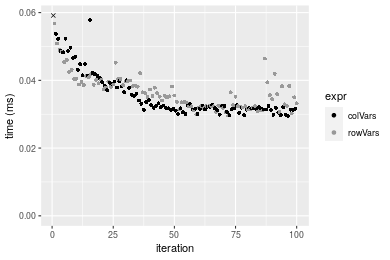

#### 1000x10 integer matrix

```r
> X <- data[["1000x10"]]
> gc()
           used  (Mb) gc trigger  (Mb) max used  (Mb)
Ncells  5322648 284.3    7916910 422.9  7916910 422.9
Vcells 10304337  78.7   33191153 253.3 53339345 407.0
> colStats <- microbenchmark(colVars = colVars(X, na.rm = FALSE), colVarsCenter = colVars(X, center = colMeans(X, 
+     na.rm = FALSE), na.rm = FALSE), colVarColMeans = colVarColMeans(X, na.rm = FALSE), `apply+var` = apply(X, 
+     MARGIN = 2L, FUN = var, na.rm = FALSE), `genefilter::rowVars(t(.))` = genefilter_colVars(X, na.rm = FALSE), 
+     unit = "ms")
> X <- t(X)
> gc()
           used  (Mb) gc trigger  (Mb) max used  (Mb)
Ncells  5322630 284.3    7916910 422.9  7916910 422.9
Vcells 10309424  78.7   33191153 253.3 53339345 407.0
> rowStats <- microbenchmark(rowVars = rowVars(X, na.rm = FALSE), rowVarsCenter = rowVars(X, center = rowMeans(X, 
+     na.rm = FALSE), na.rm = FALSE), rowVarRowMeans = rowVarRowMeans(X, na.rm = FALSE), `apply+var` = apply(X, 
+     MARGIN = 1L, FUN = var, na.rm = FALSE), `genefilter::rowVars` = genefilter_rowVars(X, na.rm = FALSE), 
+     unit = "ms")
```

_Table: Benchmarking of colVars(), colVarsCenter(), colVarColMeans(), apply+var() and genefilter::rowVars(t(.))() on integer+1000x10 data. The top panel shows times in milliseconds and the bottom panel shows relative times._


|   |expr                      |      min|        lq|      mean|    median|        uq|      max|
|:--|:-------------------------|--------:|---------:|---------:|---------:|---------:|--------:|
|1  |colVars                   | 0.029744| 0.0326025| 0.0379358| 0.0373775| 0.0413415| 0.056173|
|3  |colVarColMeans            | 0.057804| 0.0621950| 0.0725662| 0.0706915| 0.0786780| 0.113807|
|2  |colVarsCenter             | 0.134100| 0.1441075| 0.1762446| 0.1669745| 0.1880185| 0.515380|
|4  |apply+var                 | 0.185813| 0.2007390| 0.2334204| 0.2226225| 0.2503955| 0.386809|
|5  |genefilter::rowVars(t(.)) | 0.354563| 0.3672265| 0.4287826| 0.4043750| 0.4703875| 0.625783|


|   |expr                      |       min|        lq|      mean|    median|        uq|       max|
|:--|:-------------------------|---------:|---------:|---------:|---------:|---------:|---------:|
|1  |colVars                   |  1.000000|  1.000000|  1.000000|  1.000000|  1.000000|  1.000000|
|3  |colVarColMeans            |  1.943383|  1.907676|  1.912868|  1.891285|  1.903124|  2.026009|
|2  |colVarsCenter             |  4.508472|  4.420136|  4.645863|  4.467246|  4.547936|  9.174871|
|4  |apply+var                 |  6.247075|  6.157166|  6.153035|  5.956056|  6.056759|  6.886031|
|5  |genefilter::rowVars(t(.)) | 11.920488| 11.263753| 11.302843| 10.818674| 11.378095| 11.140281|

_Table: Benchmarking of rowVars(), rowVarsCenter(), rowVarRowMeans(), apply+var() and genefilter::rowVars() on integer+1000x10 data (transposed). The top panel shows times in milliseconds and the bottom panel shows relative times._


|   |expr                |      min|        lq|      mean|    median|        uq|      max|
|:--|:-------------------|--------:|---------:|---------:|---------:|---------:|--------:|
|1  |rowVars             | 0.030753| 0.0324700| 0.0372454| 0.0335195| 0.0405495| 0.076945|
|4  |apply+var           | 0.190341| 0.1975405| 0.2231841| 0.2042645| 0.2409250| 0.389536|
|2  |rowVarsCenter       | 0.196543| 0.2008960| 0.2324903| 0.2124490| 0.2391820| 0.688585|
|3  |rowVarRowMeans      | 0.300913| 0.3038920| 0.3421468| 0.3065935| 0.3728095| 0.546615|
|5  |genefilter::rowVars | 0.342112| 0.3464690| 0.3848694| 0.3507630| 0.4204030| 0.594216|


|   |expr                |       min|        lq|      mean|    median|        uq|      max|
|:--|:-------------------|---------:|---------:|---------:|---------:|---------:|--------:|
|1  |rowVars             |  1.000000|  1.000000|  1.000000|  1.000000|  1.000000| 1.000000|
|4  |apply+var           |  6.189347|  6.083785|  5.992253|  6.093901|  5.941504| 5.062525|
|2  |rowVarsCenter       |  6.391019|  6.187127|  6.242115|  6.338072|  5.898519| 8.949055|
|3  |rowVarRowMeans      |  9.784834|  9.359162|  9.186274|  9.146721|  9.193936| 7.103970|
|5  |genefilter::rowVars | 11.124508| 10.670434| 10.333328| 10.464446| 10.367649| 7.722607|

_Figure: Benchmarking of colVars(), colVarsCenter(), colVarColMeans(), apply+var() and genefilter::rowVars(t(.))() on integer+1000x10 data  as well as rowVars(), rowVarsCenter(), rowVarRowMeans(), apply+var() and genefilter::rowVars() on the same data transposed.  Outliers are displayed as crosses.  Times are in milliseconds._


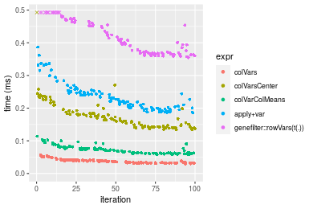

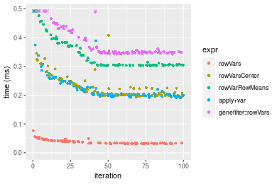
_Table: Benchmarking of colVars() and rowVars() on integer+1000x10 data (original and transposed).  The top panel shows times in milliseconds and the bottom panel shows relative times._


|   |expr    |    min|      lq|     mean|  median|      uq|    max|
|:--|:-------|------:|-------:|--------:|-------:|-------:|------:|
|2  |rowVars | 30.753| 32.4700| 37.24544| 33.5195| 40.5495| 76.945|
|1  |colVars | 29.744| 32.6025| 37.93582| 37.3775| 41.3415| 56.173|


|   |expr    |       min|       lq|     mean|   median|       uq|       max|
|:--|:-------|---------:|--------:|--------:|--------:|--------:|---------:|
|2  |rowVars | 1.0000000| 1.000000| 1.000000| 1.000000| 1.000000| 1.0000000|
|1  |colVars | 0.9671902| 1.004081| 1.018536| 1.115097| 1.019532| 0.7300409|

_Figure: Benchmarking of colVars() and rowVars() on integer+1000x10 data (original and transposed).  Outliers are displayed as crosses. Times are in milliseconds._


#### 10x1000 integer matrix

```r
> X <- data[["10x1000"]]
> gc()
           used  (Mb) gc trigger  (Mb) max used  (Mb)
Ncells  5322877 284.3    7916910 422.9  7916910 422.9
Vcells 10305352  78.7   33191153 253.3 53339345 407.0
> colStats <- microbenchmark(colVars = colVars(X, na.rm = FALSE), colVarsCenter = colVars(X, center = colMeans(X, 
+     na.rm = FALSE), na.rm = FALSE), colVarColMeans = colVarColMeans(X, na.rm = FALSE), `apply+var` = apply(X, 
+     MARGIN = 2L, FUN = var, na.rm = FALSE), `genefilter::rowVars(t(.))` = genefilter_colVars(X, na.rm = FALSE), 
+     unit = "ms")
> X <- t(X)
> gc()
           used  (Mb) gc trigger  (Mb) max used  (Mb)
Ncells  5322871 284.3    7916910 422.9  7916910 422.9
Vcells 10310459  78.7   33191153 253.3 53339345 407.0
> rowStats <- microbenchmark(rowVars = rowVars(X, na.rm = FALSE), rowVarsCenter = rowVars(X, center = rowMeans(X, 
+     na.rm = FALSE), na.rm = FALSE), rowVarRowMeans = rowVarRowMeans(X, na.rm = FALSE), `apply+var` = apply(X, 
+     MARGIN = 1L, FUN = var, na.rm = FALSE), `genefilter::rowVars` = genefilter_rowVars(X, na.rm = FALSE), 
+     unit = "ms")
```

_Table: Benchmarking of colVars(), colVarsCenter(), colVarColMeans(), apply+var() and genefilter::rowVars(t(.))() on integer+10x1000 data. The top panel shows times in milliseconds and the bottom panel shows relative times._


|   |expr                      |      min|        lq|      mean|    median|        uq|       max|
|:--|:-------------------------|--------:|---------:|---------:|---------:|---------:|---------:|
|1  |colVars                   | 0.025437| 0.0281355| 0.0330787| 0.0303585| 0.0347165|  0.088563|
|3  |colVarColMeans            | 0.067336| 0.0727130| 0.0821569| 0.0792020| 0.0878745|  0.159916|
|5  |genefilter::rowVars(t(.)) | 0.152472| 0.1628310| 0.1871207| 0.1771005| 0.2003765|  0.302403|
|2  |colVarsCenter             | 0.808813| 0.8516725| 0.9225544| 0.8970735| 0.9537135|  1.549413|
|4  |apply+var                 | 7.539137| 7.9234815| 8.8560889| 8.1060290| 9.1086705| 15.417266|


|   |expr                      |        min|         lq|       mean|     median|         uq|        max|
|:--|:-------------------------|----------:|----------:|----------:|----------:|----------:|----------:|
|1  |colVars                   |   1.000000|   1.000000|   1.000000|   1.000000|   1.000000|   1.000000|
|3  |colVarColMeans            |   2.647168|   2.584386|   2.483683|   2.608890|   2.531203|   1.805675|
|5  |genefilter::rowVars(t(.)) |   5.994103|   5.787386|   5.656840|   5.833638|   5.771794|   3.414552|
|2  |colVarsCenter             |  31.796713|  30.270388|  27.889715|  29.549335|  27.471476|  17.495037|
|4  |apply+var                 | 296.384676| 281.618649| 267.728163| 267.010195| 262.372950| 174.082472|

_Table: Benchmarking of rowVars(), rowVarsCenter(), rowVarRowMeans(), apply+var() and genefilter::rowVars() on integer+10x1000 data (transposed). The top panel shows times in milliseconds and the bottom panel shows relative times._


|   |expr                |      min|        lq|      mean|    median|        uq|       max|
|:--|:-------------------|--------:|---------:|---------:|---------:|---------:|---------:|
|1  |rowVars             | 0.025184| 0.0267130| 0.0315241| 0.0295795| 0.0344945|  0.048935|
|3  |rowVarRowMeans      | 0.092200| 0.0984980| 0.1119897| 0.1068300| 0.1206400|  0.205226|
|2  |rowVarsCenter       | 0.096437| 0.1044115| 0.1277320| 0.1192480| 0.1425225|  0.280779|
|5  |genefilter::rowVars | 0.133011| 0.1428100| 0.1632748| 0.1588605| 0.1756300|  0.257010|
|4  |apply+var           | 7.510383| 7.9770260| 8.7878154| 8.3303785| 8.8686645| 15.979274|


|   |expr                |        min|         lq|       mean|     median|         uq|        max|
|:--|:-------------------|----------:|----------:|----------:|----------:|----------:|----------:|
|1  |rowVars             |   1.000000|   1.000000|   1.000000|   1.000000|   1.000000|   1.000000|
|3  |rowVarRowMeans      |   3.661055|   3.687268|   3.552514|   3.611623|   3.497369|   4.193849|
|2  |rowVarsCenter       |   3.829296|   3.908640|   4.051887|   4.031441|   4.131746|   5.737795|
|5  |genefilter::rowVars |   5.281568|   5.346086|   5.179367|   5.370628|   5.091536|   5.252069|
|4  |apply+var           | 298.220418| 298.619623| 278.765167| 281.626752| 257.103727| 326.540799|

_Figure: Benchmarking of colVars(), colVarsCenter(), colVarColMeans(), apply+var() and genefilter::rowVars(t(.))() on integer+10x1000 data  as well as rowVars(), rowVarsCenter(), rowVarRowMeans(), apply+var() and genefilter::rowVars() on the same data transposed.  Outliers are displayed as crosses.  Times are in milliseconds._


_Table: Benchmarking of colVars() and rowVars() on integer+10x1000 data (original and transposed).  The top panel shows times in milliseconds and the bottom panel shows relative times._


|   |expr    |    min|      lq|     mean|  median|      uq|    max|
|:--|:-------|------:|-------:|--------:|-------:|-------:|------:|
|2  |rowVars | 25.184| 26.7130| 31.52408| 29.5795| 34.4945| 48.935|
|1  |colVars | 25.437| 28.1355| 33.07866| 30.3585| 34.7165| 88.563|


|   |expr    |      min|       lq|     mean|   median|       uq|      max|
|:--|:-------|--------:|--------:|--------:|--------:|--------:|--------:|
|2  |rowVars | 1.000000| 1.000000| 1.000000| 1.000000| 1.000000| 1.000000|
|1  |colVars | 1.010046| 1.053251| 1.049314| 1.026336| 1.006436| 1.809809|

_Figure: Benchmarking of colVars() and rowVars() on integer+10x1000 data (original and transposed).  Outliers are displayed as crosses. Times are in milliseconds._


#### 100x1000 integer matrix

```r
> X <- data[["100x1000"]]
> gc()
           used  (Mb) gc trigger  (Mb) max used  (Mb)
Ncells  5323133 284.3    7916910 422.9  7916910 422.9
Vcells 10306115  78.7   33191153 253.3 53339345 407.0
> colStats <- microbenchmark(colVars = colVars(X, na.rm = FALSE), colVarsCenter = colVars(X, center = colMeans(X, 
+     na.rm = FALSE), na.rm = FALSE), colVarColMeans = colVarColMeans(X, na.rm = FALSE), `apply+var` = apply(X, 
+     MARGIN = 2L, FUN = var, na.rm = FALSE), `genefilter::rowVars(t(.))` = genefilter_colVars(X, na.rm = FALSE), 
+     unit = "ms")
> X <- t(X)
> gc()
           used  (Mb) gc trigger  (Mb) max used  (Mb)
Ncells  5323115 284.3    7916910 422.9  7916910 422.9
Vcells 10356202  79.1   33191153 253.3 53339345 407.0
> rowStats <- microbenchmark(rowVars = rowVars(X, na.rm = FALSE), rowVarsCenter = rowVars(X, center = rowMeans(X, 
+     na.rm = FALSE), na.rm = FALSE), rowVarRowMeans = rowVarRowMeans(X, na.rm = FALSE), `apply+var` = apply(X, 
+     MARGIN = 1L, FUN = var, na.rm = FALSE), `genefilter::rowVars` = genefilter_rowVars(X, na.rm = FALSE), 
+     unit = "ms")
```

_Table: Benchmarking of colVars(), colVarsCenter(), colVarColMeans(), apply+var() and genefilter::rowVars(t(.))() on integer+100x1000 data. The top panel shows times in milliseconds and the bottom panel shows relative times._


|   |expr                      |      min|        lq|       mean|    median|         uq|       max|
|:--|:-------------------------|--------:|---------:|----------:|---------:|----------:|---------:|
|1  |colVars                   | 0.276481| 0.2844305|  0.3006793| 0.2949475|  0.3056915|  0.392107|
|3  |colVarColMeans            | 0.500416| 0.5305050|  0.5686602| 0.5443880|  0.5724725|  1.022393|
|5  |genefilter::rowVars(t(.)) | 1.202326| 1.2812000|  1.3567900| 1.3134570|  1.3727510|  1.959446|
|2  |colVarsCenter             | 1.823917| 1.9172815|  2.0564000| 1.9740960|  2.1424225|  3.386400|
|4  |apply+var                 | 8.590804| 9.0592370| 10.4623841| 9.2505530| 10.0627455| 27.779531|


|   |expr                      |       min|        lq|      mean|    median|        uq|       max|
|:--|:-------------------------|---------:|---------:|---------:|---------:|---------:|---------:|
|1  |colVars                   |  1.000000|  1.000000|  1.000000|  1.000000|  1.000000|  1.000000|
|3  |colVarColMeans            |  1.809947|  1.865148|  1.891252|  1.845711|  1.872713|  2.607434|
|5  |genefilter::rowVars(t(.)) |  4.348675|  4.504440|  4.512416|  4.453189|  4.490642|  4.997223|
|2  |colVarsCenter             |  6.596898|  6.740773|  6.839182|  6.693042|  7.008446|  8.636418|
|4  |apply+var                 | 31.071951| 31.850441| 34.795830| 31.363388| 32.917976| 70.846812|

_Table: Benchmarking of rowVars(), rowVarsCenter(), rowVarRowMeans(), apply+var() and genefilter::rowVars() on integer+100x1000 data (transposed). The top panel shows times in milliseconds and the bottom panel shows relative times._


|   |expr                |      min|        lq|       mean|    median|        uq|       max|
|:--|:-------------------|--------:|---------:|----------:|---------:|---------:|---------:|
|1  |rowVars             | 0.284963| 0.3013385|  0.3331891| 0.3121415| 0.3636835|  0.479973|
|2  |rowVarsCenter       | 0.733769| 0.7770355|  0.8441678| 0.7918840| 0.8349365|  2.058860|
|3  |rowVarRowMeans      | 0.765500| 0.8070590|  0.8580390| 0.8255715| 0.8656500|  1.262896|
|5  |genefilter::rowVars | 1.078433| 1.1613040|  1.2323091| 1.1982455| 1.2523120|  1.768914|
|4  |apply+var           | 8.664578| 9.0873635| 10.0694555| 9.2850940| 9.9189880| 21.841665|


|   |expr                |       min|        lq|      mean|    median|        uq|       max|
|:--|:-------------------|---------:|---------:|---------:|---------:|---------:|---------:|
|1  |rowVars             |  1.000000|  1.000000|  1.000000|  1.000000|  1.000000|  1.000000|
|2  |rowVarsCenter       |  2.574962|  2.578613|  2.533600|  2.536939|  2.295778|  4.289533|
|3  |rowVarRowMeans      |  2.686314|  2.678247|  2.575232|  2.644863|  2.380229|  2.631181|
|5  |genefilter::rowVars |  3.784467|  3.853819|  3.698528|  3.838789|  3.443412|  3.685445|
|4  |apply+var           | 30.405976| 30.156663| 30.221447| 29.746426| 27.273682| 45.506028|

_Figure: Benchmarking of colVars(), colVarsCenter(), colVarColMeans(), apply+var() and genefilter::rowVars(t(.))() on integer+100x1000 data  as well as rowVars(), rowVarsCenter(), rowVarRowMeans(), apply+var() and genefilter::rowVars() on the same data transposed.  Outliers are displayed as crosses.  Times are in milliseconds._


_Table: Benchmarking of colVars() and rowVars() on integer+100x1000 data (original and transposed).  The top panel shows times in milliseconds and the bottom panel shows relative times._


|   |expr    |     min|       lq|     mean|   median|       uq|     max|
|:--|:-------|-------:|--------:|--------:|--------:|--------:|-------:|
|1  |colVars | 276.481| 284.4305| 300.6793| 294.9475| 305.6915| 392.107|
|2  |rowVars | 284.963| 301.3385| 333.1891| 312.1415| 363.6835| 479.973|


|   |expr    |      min|       lq|     mean|   median|       uq|      max|
|:--|:-------|--------:|--------:|--------:|--------:|--------:|--------:|
|1  |colVars | 1.000000| 1.000000| 1.000000| 1.000000| 1.000000| 1.000000|
|2  |rowVars | 1.030678| 1.059445| 1.108121| 1.058295| 1.189708| 1.224087|

_Figure: Benchmarking of colVars() and rowVars() on integer+100x1000 data (original and transposed).  Outliers are displayed as crosses. Times are in milliseconds._


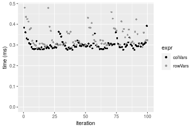

#### 1000x100 integer matrix

```r
> X <- data[["1000x100"]]
> gc()
           used  (Mb) gc trigger  (Mb) max used  (Mb)
Ncells  5323376 284.3    7916910 422.9  7916910 422.9
Vcells 10306961  78.7   33191153 253.3 53339345 407.0
> colStats <- microbenchmark(colVars = colVars(X, na.rm = FALSE), colVarsCenter = colVars(X, center = colMeans(X, 
+     na.rm = FALSE), na.rm = FALSE), colVarColMeans = colVarColMeans(X, na.rm = FALSE), `apply+var` = apply(X, 
+     MARGIN = 2L, FUN = var, na.rm = FALSE), `genefilter::rowVars(t(.))` = genefilter_colVars(X, na.rm = FALSE), 
+     unit = "ms")
> X <- t(X)
> gc()
           used  (Mb) gc trigger  (Mb) max used  (Mb)
Ncells  5323358 284.3    7916910 422.9  7916910 422.9
Vcells 10357048  79.1   33191153 253.3 53339345 407.0
> rowStats <- microbenchmark(rowVars = rowVars(X, na.rm = FALSE), rowVarsCenter = rowVars(X, center = rowMeans(X, 
+     na.rm = FALSE), na.rm = FALSE), rowVarRowMeans = rowVarRowMeans(X, na.rm = FALSE), `apply+var` = apply(X, 
+     MARGIN = 1L, FUN = var, na.rm = FALSE), `genefilter::rowVars` = genefilter_rowVars(X, na.rm = FALSE), 
+     unit = "ms")
```

_Table: Benchmarking of colVars(), colVarsCenter(), colVarColMeans(), apply+var() and genefilter::rowVars(t(.))() on integer+1000x100 data. The top panel shows times in milliseconds and the bottom panel shows relative times._


|   |expr                      |      min|        lq|      mean|    median|       uq|      max|
|:--|:-------------------------|--------:|---------:|---------:|---------:|--------:|--------:|
|1  |colVars                   | 0.269630| 0.2836650| 0.3066505| 0.2912140| 0.316396| 0.478095|
|3  |colVarColMeans            | 0.481399| 0.5000665| 0.5435529| 0.5164555| 0.581450| 0.781772|
|2  |colVarsCenter             | 1.124666| 1.1605340| 1.3431052| 1.2034195| 1.356642| 8.585024|
|5  |genefilter::rowVars(t(.)) | 1.352351| 1.4074475| 1.5987525| 1.4800315| 1.611156| 8.836442|
|4  |apply+var                 | 1.712556| 1.7864945| 2.0692958| 1.8218650| 2.068468| 9.698091|


|   |expr                      |      min|       lq|     mean|   median|       uq|       max|
|:--|:-------------------------|--------:|--------:|--------:|--------:|--------:|---------:|
|1  |colVars                   | 1.000000| 1.000000| 1.000000| 1.000000| 1.000000|  1.000000|
|3  |colVarColMeans            | 1.785406| 1.762877| 1.772548| 1.773457| 1.837729|  1.635181|
|2  |colVarsCenter             | 4.171146| 4.091213| 4.379921| 4.132423| 4.287799| 17.956732|
|5  |genefilter::rowVars(t(.)) | 5.015581| 4.961654| 5.213598| 5.082281| 5.092214| 18.482607|
|4  |apply+var                 | 6.351504| 6.297903| 6.748059| 6.256104| 6.537592| 20.284862|

_Table: Benchmarking of rowVars(), rowVarsCenter(), rowVarRowMeans(), apply+var() and genefilter::rowVars() on integer+1000x100 data (transposed). The top panel shows times in milliseconds and the bottom panel shows relative times._


|   |expr                |      min|        lq|      mean|   median|       uq|      max|
|:--|:-------------------|--------:|---------:|---------:|--------:|--------:|--------:|
|1  |rowVars             | 0.297531| 0.3048665| 0.3284983| 0.317067| 0.323917| 0.710802|
|2  |rowVarsCenter       | 0.828426| 0.8628325| 0.9372421| 0.886775| 0.965110| 2.109736|
|3  |rowVarRowMeans      | 0.959662| 0.9895235| 1.0586666| 1.020647| 1.069908| 1.831917|
|5  |genefilter::rowVars | 1.253544| 1.3330455| 1.5628775| 1.370334| 1.419963| 9.320973|
|4  |apply+var           | 1.716572| 1.7808530| 1.9932946| 1.827252| 1.941906| 9.358598|


|   |expr                |      min|       lq|     mean|   median|       uq|       max|
|:--|:-------------------|--------:|--------:|--------:|--------:|--------:|---------:|
|1  |rowVars             | 1.000000| 1.000000| 1.000000| 1.000000| 1.000000|  1.000000|
|2  |rowVarsCenter       | 2.784335| 2.830198| 2.853111| 2.796806| 2.979498|  2.968106|
|3  |rowVarRowMeans      | 3.225418| 3.245760| 3.222746| 3.219026| 3.303030|  2.577254|
|5  |genefilter::rowVars | 4.213154| 4.372555| 4.757642| 4.321907| 4.383725| 13.113319|
|4  |apply+var           | 5.769389| 5.841419| 6.067899| 5.762982| 5.995071| 13.166252|

_Figure: Benchmarking of colVars(), colVarsCenter(), colVarColMeans(), apply+var() and genefilter::rowVars(t(.))() on integer+1000x100 data  as well as rowVars(), rowVarsCenter(), rowVarRowMeans(), apply+var() and genefilter::rowVars() on the same data transposed.  Outliers are displayed as crosses.  Times are in milliseconds._


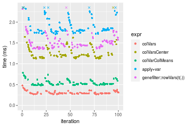


_Table: Benchmarking of colVars() and rowVars() on integer+1000x100 data (original and transposed).  The top panel shows times in milliseconds and the bottom panel shows relative times._


|   |expr    |     min|       lq|     mean|  median|      uq|     max|
|:--|:-------|-------:|--------:|--------:|-------:|-------:|-------:|
|1  |colVars | 269.630| 283.6650| 306.6505| 291.214| 316.396| 478.095|
|2  |rowVars | 297.531| 304.8665| 328.4983| 317.067| 323.917| 710.802|


|   |expr    |      min|       lq|     mean|   median|       uq|      max|
|:--|:-------|--------:|--------:|--------:|--------:|--------:|--------:|
|1  |colVars | 1.000000| 1.000000| 1.000000| 1.000000| 1.000000| 1.000000|
|2  |rowVars | 1.103479| 1.074741| 1.071247| 1.088777| 1.023771| 1.486738|

_Figure: Benchmarking of colVars() and rowVars() on integer+1000x100 data (original and transposed).  Outliers are displayed as crosses. Times are in milliseconds._


## Data type "double"

### Data
```r
> rmatrix <- function(nrow, ncol, mode = c("logical", "double", "integer", "index"), range = c(-100, 
+     +100), na_prob = 0) {
+     mode <- match.arg(mode)
+     n <- nrow * ncol
+     if (mode == "logical") {
+         x <- sample(c(FALSE, TRUE), size = n, replace = TRUE)
+     }     else if (mode == "index") {
+         x <- seq_len(n)
+         mode <- "integer"
+     }     else {
+         x <- runif(n, min = range[1], max = range[2])
+     }
+     storage.mode(x) <- mode
+     if (na_prob > 0) 
+         x[sample(n, size = na_prob * n)] <- NA
+     dim(x) <- c(nrow, ncol)
+     x
+ }
> rmatrices <- function(scale = 10, seed = 1, ...) {
+     set.seed(seed)
+     data <- list()
+     data[[1]] <- rmatrix(nrow = scale * 1, ncol = scale * 1, ...)
+     data[[2]] <- rmatrix(nrow = scale * 10, ncol = scale * 10, ...)
+     data[[3]] <- rmatrix(nrow = scale * 100, ncol = scale * 1, ...)
+     data[[4]] <- t(data[[3]])
+     data[[5]] <- rmatrix(nrow = scale * 10, ncol = scale * 100, ...)
+     data[[6]] <- t(data[[5]])
+     names(data) <- sapply(data, FUN = function(x) paste(dim(x), collapse = "x"))
+     data
+ }
> data <- rmatrices(mode = mode)
```

### Results

#### 10x10 double matrix

```r
> X <- data[["10x10"]]
> gc()
           used  (Mb) gc trigger  (Mb) max used  (Mb)
Ncells  5323622 284.4    7916910 422.9  7916910 422.9
Vcells 10422988  79.6   33191153 253.3 53339345 407.0
> colStats <- microbenchmark(colVars = colVars(X, na.rm = FALSE), colVarsCenter = colVars(X, center = colMeans(X, 
+     na.rm = FALSE), na.rm = FALSE), colVarColMeans = colVarColMeans(X, na.rm = FALSE), `apply+var` = apply(X, 
+     MARGIN = 2L, FUN = var, na.rm = FALSE), `genefilter::rowVars(t(.))` = genefilter_colVars(X, na.rm = FALSE), 
+     unit = "ms")
> X <- t(X)
> gc()
           used  (Mb) gc trigger  (Mb) max used  (Mb)
Ncells  5323607 284.4    7916910 422.9  7916910 422.9
Vcells 10423180  79.6   33191153 253.3 53339345 407.0
> rowStats <- microbenchmark(rowVars = rowVars(X, na.rm = FALSE), rowVarsCenter = rowVars(X, center = rowMeans(X, 
+     na.rm = FALSE), na.rm = FALSE), rowVarRowMeans = rowVarRowMeans(X, na.rm = FALSE), `apply+var` = apply(X, 
+     MARGIN = 1L, FUN = var, na.rm = FALSE), `genefilter::rowVars` = genefilter_rowVars(X, na.rm = FALSE), 
+     unit = "ms")
```

_Table: Benchmarking of colVars(), colVarsCenter(), colVarColMeans(), apply+var() and genefilter::rowVars(t(.))() on double+10x10 data. The top panel shows times in milliseconds and the bottom panel shows relative times._


|   |expr                      |      min|        lq|      mean|    median|        uq|      max|
|:--|:-------------------------|--------:|---------:|---------:|---------:|---------:|--------:|
|1  |colVars                   | 0.002645| 0.0035485| 0.0048936| 0.0049525| 0.0057125| 0.011078|
|3  |colVarColMeans            | 0.013680| 0.0158700| 0.0190106| 0.0172255| 0.0203090| 0.090102|
|5  |genefilter::rowVars(t(.)) | 0.035305| 0.0408875| 0.0462702| 0.0448195| 0.0502385| 0.115590|
|2  |colVarsCenter             | 0.037691| 0.0435315| 0.0506277| 0.0471360| 0.0529150| 0.183315|
|4  |apply+var                 | 0.121929| 0.1308385| 0.1435156| 0.1403530| 0.1514275| 0.208543|


|   |expr                      |       min|        lq|      mean|    median|        uq|       max|
|:--|:-------------------------|---------:|---------:|---------:|---------:|---------:|---------:|
|1  |colVars                   |  1.000000|  1.000000|  1.000000|  1.000000|  1.000000|  1.000000|
|3  |colVarColMeans            |  5.172023|  4.472312|  3.884788|  3.478142|  3.555186|  8.133418|
|5  |genefilter::rowVars(t(.)) | 13.347826| 11.522474|  9.455244|  9.049874|  8.794486| 10.434194|
|2  |colVarsCenter             | 14.249906| 12.267578| 10.345690|  9.517617|  9.263020| 16.547662|
|4  |apply+var                 | 46.097921| 36.871495| 29.327207| 28.339828| 26.508096| 18.824968|

_Table: Benchmarking of rowVars(), rowVarsCenter(), rowVarRowMeans(), apply+var() and genefilter::rowVars() on double+10x10 data (transposed). The top panel shows times in milliseconds and the bottom panel shows relative times._


|   |expr                |      min|        lq|      mean|    median|        uq|      max|
|:--|:-------------------|--------:|---------:|---------:|---------:|---------:|--------:|
|1  |rowVars             | 0.002540| 0.0038570| 0.0045251| 0.0045430| 0.0051150| 0.010656|
|3  |rowVarRowMeans      | 0.011867| 0.0138375| 0.0155078| 0.0152215| 0.0166525| 0.026797|
|2  |rowVarsCenter       | 0.022382| 0.0262275| 0.0306844| 0.0284040| 0.0310435| 0.152408|
|5  |genefilter::rowVars | 0.029586| 0.0348960| 0.0379834| 0.0371150| 0.0395490| 0.081871|
|4  |apply+var           | 0.119218| 0.1287145| 0.1404636| 0.1397160| 0.1478400| 0.239180|


|   |expr                |       min|        lq|      mean|    median|        uq|       max|
|:--|:-------------------|---------:|---------:|---------:|---------:|---------:|---------:|
|1  |rowVars             |  1.000000|  1.000000|  1.000000|  1.000000|  1.000000|  1.000000|
|3  |rowVarRowMeans      |  4.672047|  3.587633|  3.427049|  3.350539|  3.255621|  2.514734|
|2  |rowVarsCenter       |  8.811811|  6.799974|  6.780893|  6.252256|  6.069110| 14.302553|
|5  |genefilter::rowVars | 11.648032|  9.047446|  8.393874|  8.169712|  7.731965|  7.683089|
|4  |apply+var           | 46.936220| 33.371662| 31.040788| 30.754127| 28.903226| 22.445571|

_Figure: Benchmarking of colVars(), colVarsCenter(), colVarColMeans(), apply+var() and genefilter::rowVars(t(.))() on double+10x10 data  as well as rowVars(), rowVarsCenter(), rowVarRowMeans(), apply+var() and genefilter::rowVars() on the same data transposed.  Outliers are displayed as crosses.  Times are in milliseconds._


_Table: Benchmarking of colVars() and rowVars() on double+10x10 data (original and transposed).  The top panel shows times in milliseconds and the bottom panel shows relative times._


|   |expr    |   min|     lq|    mean| median|     uq|    max|
|:--|:-------|-----:|------:|-------:|------:|------:|------:|
|2  |rowVars | 2.540| 3.8570| 4.52513| 4.5430| 5.1150| 10.656|
|1  |colVars | 2.645| 3.5485| 4.89360| 4.9525| 5.7125| 11.078|


|   |expr    |      min|        lq|     mean|   median|       uq|      max|
|:--|:-------|--------:|---------:|--------:|--------:|--------:|--------:|
|2  |rowVars | 1.000000| 1.0000000| 1.000000| 1.000000| 1.000000| 1.000000|
|1  |colVars | 1.041339| 0.9200156| 1.081427| 1.090139| 1.116813| 1.039602|

_Figure: Benchmarking of colVars() and rowVars() on double+10x10 data (original and transposed).  Outliers are displayed as crosses. Times are in milliseconds._


#### 100x100 double matrix

```r
> X <- data[["100x100"]]
> gc()
           used  (Mb) gc trigger  (Mb) max used  (Mb)
Ncells  5323847 284.4    7916910 422.9  7916910 422.9
Vcells 10424109  79.6   33191153 253.3 53339345 407.0
> colStats <- microbenchmark(colVars = colVars(X, na.rm = FALSE), colVarsCenter = colVars(X, center = colMeans(X, 
+     na.rm = FALSE), na.rm = FALSE), colVarColMeans = colVarColMeans(X, na.rm = FALSE), `apply+var` = apply(X, 
+     MARGIN = 2L, FUN = var, na.rm = FALSE), `genefilter::rowVars(t(.))` = genefilter_colVars(X, na.rm = FALSE), 
+     unit = "ms")
> X <- t(X)
> gc()
           used  (Mb) gc trigger  (Mb) max used  (Mb)
Ncells  5323841 284.4    7916910 422.9  7916910 422.9
Vcells 10434216  79.7   33191153 253.3 53339345 407.0
> rowStats <- microbenchmark(rowVars = rowVars(X, na.rm = FALSE), rowVarsCenter = rowVars(X, center = rowMeans(X, 
+     na.rm = FALSE), na.rm = FALSE), rowVarRowMeans = rowVarRowMeans(X, na.rm = FALSE), `apply+var` = apply(X, 
+     MARGIN = 1L, FUN = var, na.rm = FALSE), `genefilter::rowVars` = genefilter_rowVars(X, na.rm = FALSE), 
+     unit = "ms")
```

_Table: Benchmarking of colVars(), colVarsCenter(), colVarColMeans(), apply+var() and genefilter::rowVars(t(.))() on double+100x100 data. The top panel shows times in milliseconds and the bottom panel shows relative times._


|   |expr                      |      min|        lq|      mean|    median|        uq|      max|
|:--|:-------------------------|--------:|---------:|---------:|---------:|---------:|--------:|
|1  |colVars                   | 0.029262| 0.0314835| 0.0352890| 0.0326715| 0.0379055| 0.080101|
|3  |colVarColMeans            | 0.030771| 0.0350795| 0.0392033| 0.0377445| 0.0409125| 0.072354|
|5  |genefilter::rowVars(t(.)) | 0.150565| 0.1594915| 0.1787966| 0.1676460| 0.1931260| 0.294593|
|2  |colVarsCenter             | 0.169785| 0.1835170| 0.2073874| 0.1919255| 0.2075525| 0.529378|
|4  |apply+var                 | 0.862029| 0.8787865| 0.9715484| 0.9086425| 1.0296300| 1.514788|


|   |expr                      |       min|        lq|      mean|    median|        uq|        max|
|:--|:-------------------------|---------:|---------:|---------:|---------:|---------:|----------:|
|1  |colVars                   |  1.000000|  1.000000|  1.000000|  1.000000|  1.000000|  1.0000000|
|3  |colVarColMeans            |  1.051569|  1.114219|  1.110924|  1.155273|  1.079329|  0.9032846|
|5  |genefilter::rowVars(t(.)) |  5.145410|  5.065876|  5.066643|  5.131261|  5.094933|  3.6777693|
|2  |colVarsCenter             |  5.802235|  5.828990|  5.876837|  5.874401|  5.475525|  6.6088813|
|4  |apply+var                 | 29.458991| 27.912605| 27.531229| 27.811472| 27.163077| 18.9109749|

_Table: Benchmarking of rowVars(), rowVarsCenter(), rowVarRowMeans(), apply+var() and genefilter::rowVars() on double+100x100 data (transposed). The top panel shows times in milliseconds and the bottom panel shows relative times._


|   |expr                |      min|       lq|      mean|    median|        uq|      max|
|:--|:-------------------|--------:|--------:|---------:|---------:|---------:|--------:|
|1  |rowVars             | 0.029708| 0.031666| 0.0360687| 0.0338565| 0.0385060| 0.087151|
|3  |rowVarRowMeans      | 0.063648| 0.065847| 0.0770080| 0.0688575| 0.0793815| 0.231908|
|2  |rowVarsCenter       | 0.088075| 0.090904| 0.1105511| 0.0953995| 0.1116555| 0.646862|
|5  |genefilter::rowVars | 0.135403| 0.141491| 0.1549294| 0.1449895| 0.1631460| 0.231369|
|4  |apply+var           | 0.860343| 0.882569| 1.0549984| 0.8982775| 1.0883370| 3.406908|


|   |expr                |       min|        lq|      mean|    median|        uq|       max|
|:--|:-------------------|---------:|---------:|---------:|---------:|---------:|---------:|
|1  |rowVars             |  1.000000|  1.000000|  1.000000|  1.000000|  1.000000|  1.000000|
|3  |rowVarRowMeans      |  2.142453|  2.079423|  2.135034|  2.033804|  2.061536|  2.660991|
|2  |rowVarsCenter       |  2.964690|  2.870713|  3.065011|  2.817760|  2.899691|  7.422313|
|5  |genefilter::rowVars |  4.557796|  4.468231|  4.295392|  4.282472|  4.236898|  2.654806|
|4  |apply+var           | 28.959977| 27.871187| 29.249661| 26.531907| 28.264089| 39.092013|

_Figure: Benchmarking of colVars(), colVarsCenter(), colVarColMeans(), apply+var() and genefilter::rowVars(t(.))() on double+100x100 data  as well as rowVars(), rowVarsCenter(), rowVarRowMeans(), apply+var() and genefilter::rowVars() on the same data transposed.  Outliers are displayed as crosses.  Times are in milliseconds._


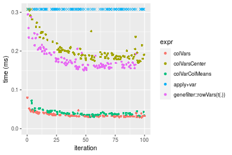


_Table: Benchmarking of colVars() and rowVars() on double+100x100 data (original and transposed).  The top panel shows times in milliseconds and the bottom panel shows relative times._


|   |expr    |    min|      lq|     mean|  median|      uq|    max|
|:--|:-------|------:|-------:|--------:|-------:|-------:|------:|
|1  |colVars | 29.262| 31.4835| 35.28896| 32.6715| 37.9055| 80.101|
|2  |rowVars | 29.708| 31.6660| 36.06874| 33.8565| 38.5060| 87.151|


|   |expr    |      min|       lq|     mean|  median|       uq|      max|
|:--|:-------|--------:|--------:|--------:|-------:|--------:|--------:|
|1  |colVars | 1.000000| 1.000000| 1.000000| 1.00000| 1.000000| 1.000000|
|2  |rowVars | 1.015242| 1.005797| 1.022097| 1.03627| 1.015842| 1.088014|

_Figure: Benchmarking of colVars() and rowVars() on double+100x100 data (original and transposed).  Outliers are displayed as crosses. Times are in milliseconds._


#### 1000x10 double matrix

```r
> X <- data[["1000x10"]]
> gc()
           used  (Mb) gc trigger  (Mb) max used  (Mb)
Ncells  5324110 284.4    7916910 422.9  7916910 422.9
Vcells 10425483  79.6   33191153 253.3 53339345 407.0
> colStats <- microbenchmark(colVars = colVars(X, na.rm = FALSE), colVarsCenter = colVars(X, center = colMeans(X, 
+     na.rm = FALSE), na.rm = FALSE), colVarColMeans = colVarColMeans(X, na.rm = FALSE), `apply+var` = apply(X, 
+     MARGIN = 2L, FUN = var, na.rm = FALSE), `genefilter::rowVars(t(.))` = genefilter_colVars(X, na.rm = FALSE), 
+     unit = "ms")
> X <- t(X)
> gc()
           used  (Mb) gc trigger  (Mb) max used  (Mb)
Ncells  5324092 284.4    7916910 422.9  7916910 422.9
Vcells 10435570  79.7   33191153 253.3 53339345 407.0
> rowStats <- microbenchmark(rowVars = rowVars(X, na.rm = FALSE), rowVarsCenter = rowVars(X, center = rowMeans(X, 
+     na.rm = FALSE), na.rm = FALSE), rowVarRowMeans = rowVarRowMeans(X, na.rm = FALSE), `apply+var` = apply(X, 
+     MARGIN = 1L, FUN = var, na.rm = FALSE), `genefilter::rowVars` = genefilter_rowVars(X, na.rm = FALSE), 
+     unit = "ms")
```

_Table: Benchmarking of colVars(), colVarsCenter(), colVarColMeans(), apply+var() and genefilter::rowVars(t(.))() on double+1000x10 data. The top panel shows times in milliseconds and the bottom panel shows relative times._


|   |expr                      |      min|        lq|      mean|    median|        uq|      max|
|:--|:-------------------------|--------:|---------:|---------:|---------:|---------:|--------:|
|1  |colVars                   | 0.030654| 0.0352160| 0.0402149| 0.0393340| 0.0445555| 0.056132|
|3  |colVarColMeans            | 0.036769| 0.0409280| 0.0467151| 0.0451770| 0.0512440| 0.071497|
|2  |colVarsCenter             | 0.115286| 0.1257460| 0.1513958| 0.1421240| 0.1663635| 0.441184|
|4  |apply+var                 | 0.181837| 0.2017375| 0.2336601| 0.2264865| 0.2485645| 0.381642|
|5  |genefilter::rowVars(t(.)) | 0.253346| 0.2715770| 0.3169921| 0.3047620| 0.3566390| 0.457169|


|   |expr                      |      min|       lq|     mean|   median|       uq|      max|
|:--|:-------------------------|--------:|--------:|--------:|--------:|--------:|--------:|
|1  |colVars                   | 1.000000| 1.000000| 1.000000| 1.000000| 1.000000| 1.000000|
|3  |colVarColMeans            | 1.199485| 1.162199| 1.161635| 1.148548| 1.150116| 1.273730|
|2  |colVarsCenter             | 3.760880| 3.570707| 3.764666| 3.613261| 3.733849| 7.859759|
|4  |apply+var                 | 5.931917| 5.728575| 5.810284| 5.758034| 5.578761| 6.799010|
|5  |genefilter::rowVars(t(.)) | 8.264696| 7.711750| 7.882450| 7.748055| 8.004377| 8.144534|

_Table: Benchmarking of rowVars(), rowVarsCenter(), rowVarRowMeans(), apply+var() and genefilter::rowVars() on double+1000x10 data (transposed). The top panel shows times in milliseconds and the bottom panel shows relative times._


|   |expr                |      min|        lq|      mean|    median|        uq|      max|
|:--|:-------------------|--------:|---------:|---------:|---------:|---------:|--------:|
|1  |rowVars             | 0.031942| 0.0352095| 0.0424953| 0.0404315| 0.0463405| 0.093285|
|3  |rowVarRowMeans      | 0.063618| 0.0673155| 0.0801192| 0.0778555| 0.0881445| 0.149555|
|2  |rowVarsCenter       | 0.087956| 0.0998060| 0.1226849| 0.1146525| 0.1419555| 0.301986|
|4  |apply+var           | 0.180436| 0.1949160| 0.2333630| 0.2286680| 0.2531570| 0.379833|
|5  |genefilter::rowVars | 0.234324| 0.2501810| 0.2888207| 0.2762030| 0.3149190| 0.434421|


|   |expr                |      min|       lq|     mean|   median|       uq|      max|
|:--|:-------------------|--------:|--------:|--------:|--------:|--------:|--------:|
|1  |rowVars             | 1.000000| 1.000000| 1.000000| 1.000000| 1.000000| 1.000000|
|3  |rowVarRowMeans      | 1.991672| 1.911856| 1.885367| 1.925615| 1.902105| 1.603205|
|2  |rowVarsCenter       | 2.753616| 2.834633| 2.887025| 2.835722| 3.063314| 3.237241|
|4  |apply+var           | 5.648864| 5.535892| 5.491507| 5.655689| 5.462975| 4.071748|
|5  |genefilter::rowVars | 7.335921| 7.105497| 6.796539| 6.831381| 6.795762| 4.656922|

_Figure: Benchmarking of colVars(), colVarsCenter(), colVarColMeans(), apply+var() and genefilter::rowVars(t(.))() on double+1000x10 data  as well as rowVars(), rowVarsCenter(), rowVarRowMeans(), apply+var() and genefilter::rowVars() on the same data transposed.  Outliers are displayed as crosses.  Times are in milliseconds._


_Table: Benchmarking of colVars() and rowVars() on double+1000x10 data (original and transposed).  The top panel shows times in milliseconds and the bottom panel shows relative times._


|   |expr    |    min|      lq|     mean|  median|      uq|    max|
|:--|:-------|------:|-------:|--------:|-------:|-------:|------:|
|1  |colVars | 30.654| 35.2160| 40.21492| 39.3340| 44.5555| 56.132|
|2  |rowVars | 31.942| 35.2095| 42.49526| 40.4315| 46.3405| 93.285|


|   |expr    |      min|        lq|     mean|   median|       uq|      max|
|:--|:-------|--------:|---------:|--------:|--------:|--------:|--------:|
|1  |colVars | 1.000000| 1.0000000| 1.000000| 1.000000| 1.000000| 1.000000|
|2  |rowVars | 1.042017| 0.9998154| 1.056704| 1.027902| 1.040062| 1.661886|

_Figure: Benchmarking of colVars() and rowVars() on double+1000x10 data (original and transposed).  Outliers are displayed as crosses. Times are in milliseconds._


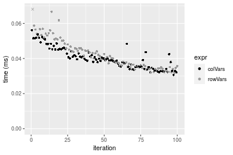

#### 10x1000 double matrix

```r
> X <- data[["10x1000"]]
> gc()
           used  (Mb) gc trigger  (Mb) max used  (Mb)
Ncells  5324338 284.4    7916910 422.9  7916910 422.9
Vcells 10425622  79.6   33191153 253.3 53339345 407.0
> colStats <- microbenchmark(colVars = colVars(X, na.rm = FALSE), colVarsCenter = colVars(X, center = colMeans(X, 
+     na.rm = FALSE), na.rm = FALSE), colVarColMeans = colVarColMeans(X, na.rm = FALSE), `apply+var` = apply(X, 
+     MARGIN = 2L, FUN = var, na.rm = FALSE), `genefilter::rowVars(t(.))` = genefilter_colVars(X, na.rm = FALSE), 
+     unit = "ms")
> X <- t(X)
> gc()
           used  (Mb) gc trigger  (Mb) max used  (Mb)
Ncells  5324332 284.4    7916910 422.9  7916910 422.9
Vcells 10435729  79.7   33191153 253.3 53339345 407.0
> rowStats <- microbenchmark(rowVars = rowVars(X, na.rm = FALSE), rowVarsCenter = rowVars(X, center = rowMeans(X, 
+     na.rm = FALSE), na.rm = FALSE), rowVarRowMeans = rowVarRowMeans(X, na.rm = FALSE), `apply+var` = apply(X, 
+     MARGIN = 1L, FUN = var, na.rm = FALSE), `genefilter::rowVars` = genefilter_rowVars(X, na.rm = FALSE), 
+     unit = "ms")
```

_Table: Benchmarking of colVars(), colVarsCenter(), colVarColMeans(), apply+var() and genefilter::rowVars(t(.))() on double+10x1000 data. The top panel shows times in milliseconds and the bottom panel shows relative times._


|   |expr                      |      min|        lq|      mean|    median|        uq|       max|
|:--|:-------------------------|--------:|---------:|---------:|---------:|---------:|---------:|
|1  |colVars                   | 0.023794| 0.0268210| 0.0302548| 0.0284730| 0.0322055|  0.061424|
|3  |colVarColMeans            | 0.040555| 0.0453620| 0.0521165| 0.0489505| 0.0545395|  0.125120|
|5  |genefilter::rowVars(t(.)) | 0.155559| 0.1661205| 0.1876453| 0.1857365| 0.1993210|  0.289969|
|2  |colVarsCenter             | 0.781747| 0.8249380| 0.8807925| 0.8574385| 0.9077215|  1.151497|
|4  |apply+var                 | 7.532308| 7.9709260| 8.7646401| 8.1539695| 8.7643480| 15.208067|


|   |expr                      |        min|         lq|       mean|    median|         uq|        max|
|:--|:-------------------------|----------:|----------:|----------:|---------:|----------:|----------:|
|1  |colVars                   |   1.000000|   1.000000|   1.000000|   1.00000|   1.000000|   1.000000|
|3  |colVarColMeans            |   1.704421|   1.691287|   1.722584|   1.71919|   1.693484|   2.036989|
|5  |genefilter::rowVars(t(.)) |   6.537741|   6.193673|   6.202164|   6.52325|   6.189036|   4.720777|
|2  |colVarsCenter             |  32.854795|  30.757168|  29.112468|  30.11409|  28.185294|  18.746695|
|4  |apply+var                 | 316.563335| 297.189739| 289.694010| 286.37550| 272.138237| 247.591609|

_Table: Benchmarking of rowVars(), rowVarsCenter(), rowVarRowMeans(), apply+var() and genefilter::rowVars() on double+10x1000 data (transposed). The top panel shows times in milliseconds and the bottom panel shows relative times._


|   |expr                |      min|        lq|      mean|    median|        uq|       max|
|:--|:-------------------|--------:|---------:|---------:|---------:|---------:|---------:|
|1  |rowVars             | 0.023416| 0.0251300| 0.0878095| 0.0272560| 0.0297025|  5.961206|
|3  |rowVarRowMeans      | 0.069447| 0.0733340| 0.0804046| 0.0771735| 0.0849200|  0.143452|
|2  |rowVarsCenter       | 0.093996| 0.1007760| 0.1149330| 0.1098630| 0.1198065|  0.258423|
|5  |genefilter::rowVars | 0.135324| 0.1445095| 0.2198861| 0.1519365| 0.1646340|  6.212482|
|4  |apply+var           | 7.574588| 7.9150710| 8.5796664| 8.1310805| 8.7260745| 15.537949|


|   |expr                |        min|         lq|       mean|     median|         uq|       max|
|:--|:-------------------|----------:|----------:|----------:|----------:|----------:|---------:|
|1  |rowVars             |   1.000000|   1.000000|  1.0000000|   1.000000|   1.000000| 1.0000000|
|3  |rowVarRowMeans      |   2.965793|   2.918185|  0.9156709|   2.831432|   2.859019| 0.0240643|
|2  |rowVarsCenter       |   4.014178|   4.010187|  1.3088902|   4.030782|   4.033549| 0.0433508|
|5  |genefilter::rowVars |   5.779125|   5.750477|  2.5041257|   5.574424|   5.542766| 1.0421519|
|4  |apply+var           | 323.479159| 314.965022| 97.7076906| 298.322589| 293.782493| 2.6065110|

_Figure: Benchmarking of colVars(), colVarsCenter(), colVarColMeans(), apply+var() and genefilter::rowVars(t(.))() on double+10x1000 data  as well as rowVars(), rowVarsCenter(), rowVarRowMeans(), apply+var() and genefilter::rowVars() on the same data transposed.  Outliers are displayed as crosses.  Times are in milliseconds._


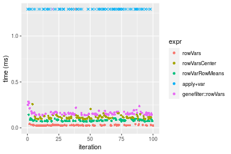
_Table: Benchmarking of colVars() and rowVars() on double+10x1000 data (original and transposed).  The top panel shows times in milliseconds and the bottom panel shows relative times._


|   |expr    |    min|     lq|     mean| median|      uq|      max|
|:--|:-------|------:|------:|--------:|------:|-------:|--------:|
|2  |rowVars | 23.416| 25.130| 87.80953| 27.256| 29.7025| 5961.206|
|1  |colVars | 23.794| 26.821| 30.25482| 28.473| 32.2055|   61.424|


|   |expr    |      min|      lq|      mean|   median|       uq|      max|
|:--|:-------|--------:|-------:|---------:|--------:|--------:|--------:|
|2  |rowVars | 1.000000| 1.00000| 1.0000000| 1.000000| 1.000000| 1.000000|
|1  |colVars | 1.016143| 1.06729| 0.3445505| 1.044651| 1.084269| 0.010304|

_Figure: Benchmarking of colVars() and rowVars() on double+10x1000 data (original and transposed).  Outliers are displayed as crosses. Times are in milliseconds._


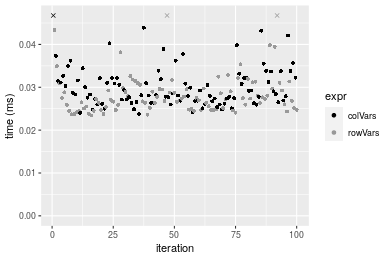

#### 100x1000 double matrix

```r
> X <- data[["100x1000"]]
> gc()
           used  (Mb) gc trigger  (Mb) max used  (Mb)
Ncells  5324592 284.4    7916910 422.9  7916910 422.9
Vcells 10427217  79.6   33191153 253.3 53339345 407.0
> colStats <- microbenchmark(colVars = colVars(X, na.rm = FALSE), colVarsCenter = colVars(X, center = colMeans(X, 
+     na.rm = FALSE), na.rm = FALSE), colVarColMeans = colVarColMeans(X, na.rm = FALSE), `apply+var` = apply(X, 
+     MARGIN = 2L, FUN = var, na.rm = FALSE), `genefilter::rowVars(t(.))` = genefilter_colVars(X, na.rm = FALSE), 
+     unit = "ms")
> X <- t(X)
> gc()
           used  (Mb) gc trigger  (Mb) max used  (Mb)
Ncells  5324574 284.4    7916910 422.9  7916910 422.9
Vcells 10527304  80.4   33191153 253.3 53339345 407.0
> rowStats <- microbenchmark(rowVars = rowVars(X, na.rm = FALSE), rowVarsCenter = rowVars(X, center = rowMeans(X, 
+     na.rm = FALSE), na.rm = FALSE), rowVarRowMeans = rowVarRowMeans(X, na.rm = FALSE), `apply+var` = apply(X, 
+     MARGIN = 1L, FUN = var, na.rm = FALSE), `genefilter::rowVars` = genefilter_rowVars(X, na.rm = FALSE), 
+     unit = "ms")
```

_Table: Benchmarking of colVars(), colVarsCenter(), colVarColMeans(), apply+var() and genefilter::rowVars(t(.))() on double+100x1000 data. The top panel shows times in milliseconds and the bottom panel shows relative times._


|   |expr                      |      min|        lq|       mean|    median|         uq|       max|
|:--|:-------------------------|--------:|---------:|----------:|---------:|----------:|---------:|
|3  |colVarColMeans            | 0.217100| 0.2541795|  0.2836950| 0.2733770|  0.3066210|  0.532291|
|1  |colVars                   | 0.276846| 0.2965845|  0.3296974| 0.3253395|  0.3629285|  0.407909|
|5  |genefilter::rowVars(t(.)) | 1.189254| 1.2876725|  1.6077946| 1.4054090|  1.5729725| 15.897295|
|2  |colVarsCenter             | 1.504681| 1.6610540|  1.8318492| 1.8216455|  1.9761710|  2.701192|
|4  |apply+var                 | 8.455217| 9.0191355| 10.3333435| 9.3339725| 10.6362330| 23.139245|


|   |expr                      |       min|        lq|      mean|    median|        uq|        max|
|:--|:-------------------------|---------:|---------:|---------:|---------:|---------:|----------:|
|3  |colVarColMeans            |  1.000000|  1.000000|  1.000000|  1.000000|  1.000000|  1.0000000|
|1  |colVars                   |  1.275200|  1.166831|  1.162155|  1.190076|  1.183639|  0.7663271|
|5  |genefilter::rowVars(t(.)) |  5.477909|  5.065997|  5.667336|  5.140919|  5.130022| 29.8657971|
|2  |colVarsCenter             |  6.930820|  6.534965|  6.457108|  6.663492|  6.444996|  5.0746528|
|4  |apply+var                 | 38.946186| 35.483332| 36.424134| 34.143225| 34.688534| 43.4710431|

_Table: Benchmarking of rowVars(), rowVarsCenter(), rowVarRowMeans(), apply+var() and genefilter::rowVars() on double+100x1000 data (transposed). The top panel shows times in milliseconds and the bottom panel shows relative times._


|   |expr                |      min|        lq|      mean|    median|        uq|       max|
|:--|:-------------------|--------:|---------:|---------:|---------:|---------:|---------:|
|1  |rowVars             | 0.286441| 0.3034615| 0.3443770| 0.3196560| 0.3715660|  0.865443|
|3  |rowVarRowMeans      | 0.510146| 0.5593850| 0.5929959| 0.5695750| 0.6114635|  0.828932|
|2  |rowVarsCenter       | 0.715315| 0.7583490| 0.8288214| 0.7897215| 0.8284805|  1.622231|
|5  |genefilter::rowVars | 1.069789| 1.1644100| 1.2231647| 1.1932250| 1.2426030|  1.825741|
|4  |apply+var           | 8.558351| 9.0009320| 9.9293128| 9.2546195| 9.8413630| 18.806774|


|   |expr                |       min|        lq|      mean|    median|        uq|        max|
|:--|:-------------------|---------:|---------:|---------:|---------:|---------:|----------:|
|1  |rowVars             |  1.000000|  1.000000|  1.000000|  1.000000|  1.000000|  1.0000000|
|3  |rowVarRowMeans      |  1.780981|  1.843347|  1.721938|  1.781837|  1.645639|  0.9578124|
|2  |rowVarsCenter       |  2.497251|  2.498996|  2.406727|  2.470535|  2.229699|  1.8744516|
|5  |genefilter::rowVars |  3.734762|  3.837093|  3.551819|  3.732841|  3.344232|  2.1096028|
|4  |apply+var           | 29.878233| 29.660870| 28.832685| 28.951809| 26.486177| 21.7308061|

_Figure: Benchmarking of colVars(), colVarsCenter(), colVarColMeans(), apply+var() and genefilter::rowVars(t(.))() on double+100x1000 data  as well as rowVars(), rowVarsCenter(), rowVarRowMeans(), apply+var() and genefilter::rowVars() on the same data transposed.  Outliers are displayed as crosses.  Times are in milliseconds._


_Table: Benchmarking of colVars() and rowVars() on double+100x1000 data (original and transposed).  The top panel shows times in milliseconds and the bottom panel shows relative times._


|   |expr    |     min|       lq|     mean|   median|       uq|     max|
|:--|:-------|-------:|--------:|--------:|--------:|--------:|-------:|
|2  |rowVars | 286.441| 303.4615| 344.3770| 319.6560| 371.5660| 865.443|
|1  |colVars | 276.846| 296.5845| 329.6974| 325.3395| 362.9285| 407.909|


|   |expr    |       min|        lq|      mean|  median|        uq|       max|
|:--|:-------|---------:|---------:|---------:|-------:|---------:|---------:|
|2  |rowVars | 1.0000000| 1.0000000| 1.0000000| 1.00000| 1.0000000| 1.0000000|
|1  |colVars | 0.9665027| 0.9773381| 0.9573737| 1.01778| 0.9767538| 0.4713297|

_Figure: Benchmarking of colVars() and rowVars() on double+100x1000 data (original and transposed).  Outliers are displayed as crosses. Times are in milliseconds._


#### 1000x100 double matrix

```r
> X <- data[["1000x100"]]
> gc()
           used  (Mb) gc trigger  (Mb) max used  (Mb)
Ncells  5324835 284.4    7916910 422.9  7916910 422.9
Vcells 10427379  79.6   33191153 253.3 53339345 407.0
> colStats <- microbenchmark(colVars = colVars(X, na.rm = FALSE), colVarsCenter = colVars(X, center = colMeans(X, 
+     na.rm = FALSE), na.rm = FALSE), colVarColMeans = colVarColMeans(X, na.rm = FALSE), `apply+var` = apply(X, 
+     MARGIN = 2L, FUN = var, na.rm = FALSE), `genefilter::rowVars(t(.))` = genefilter_colVars(X, na.rm = FALSE), 
+     unit = "ms")
> X <- t(X)
> gc()
           used  (Mb) gc trigger  (Mb) max used  (Mb)
Ncells  5324817 284.4    7916910 422.9  7916910 422.9
Vcells 10527466  80.4   33191153 253.3 53339345 407.0
> rowStats <- microbenchmark(rowVars = rowVars(X, na.rm = FALSE), rowVarsCenter = rowVars(X, center = rowMeans(X, 
+     na.rm = FALSE), na.rm = FALSE), rowVarRowMeans = rowVarRowMeans(X, na.rm = FALSE), `apply+var` = apply(X, 
+     MARGIN = 1L, FUN = var, na.rm = FALSE), `genefilter::rowVars` = genefilter_rowVars(X, na.rm = FALSE), 
+     unit = "ms")
```

_Table: Benchmarking of colVars(), colVarsCenter(), colVarColMeans(), apply+var() and genefilter::rowVars(t(.))() on double+1000x100 data. The top panel shows times in milliseconds and the bottom panel shows relative times._


|   |expr                      |      min|        lq|      mean|    median|        uq|      max|
|:--|:-------------------------|--------:|---------:|---------:|---------:|---------:|--------:|
|3  |colVarColMeans            | 0.235789| 0.2501695| 0.3545995| 0.2654355| 0.3072345| 7.212736|
|1  |colVars                   | 0.269846| 0.2757440| 0.3202453| 0.2955760| 0.3484210| 0.505107|
|2  |colVarsCenter             | 0.845354| 0.8825620| 1.0393725| 0.9923470| 1.1263665| 1.902730|
|5  |genefilter::rowVars(t(.)) | 1.285008| 1.3302660| 1.7078352| 1.4647050| 1.7319530| 9.753642|
|4  |apply+var                 | 1.611236| 1.6562830| 1.9752686| 1.7862820| 2.0936840| 9.164259|


|   |expr                      |      min|       lq|      mean|   median|       uq|       max|
|:--|:-------------------------|--------:|--------:|---------:|--------:|--------:|---------:|
|3  |colVarColMeans            | 1.000000| 1.000000| 1.0000000| 1.000000| 1.000000| 1.0000000|
|1  |colVars                   | 1.144438| 1.102229| 0.9031182| 1.113551| 1.134056| 0.0700299|
|2  |colVarsCenter             | 3.585214| 3.527856| 2.9311164| 3.738562| 3.666146| 0.2638014|
|5  |genefilter::rowVars(t(.)) | 5.449822| 5.317459| 4.8162364| 5.518120| 5.637235| 1.3522805|
|4  |apply+var                 | 6.833381| 6.620643| 5.5704209| 6.729627| 6.814612| 1.2705663|

_Table: Benchmarking of rowVars(), rowVarsCenter(), rowVarRowMeans(), apply+var() and genefilter::rowVars() on double+1000x100 data (transposed). The top panel shows times in milliseconds and the bottom panel shows relative times._


|   |expr                |      min|       lq|      mean|    median|        uq|      max|
|:--|:-------------------|--------:|--------:|---------:|---------:|---------:|--------:|
|1  |rowVars             | 0.298175| 0.308941| 0.3325839| 0.3199880| 0.3469940| 0.494310|
|3  |rowVarRowMeans      | 0.508590| 0.548085| 0.5971648| 0.5733280| 0.6302175| 0.848073|
|2  |rowVarsCenter       | 0.716750| 0.754393| 0.8309605| 0.7760755| 0.8706715| 1.443821|
|5  |genefilter::rowVars | 1.127413| 1.209552| 1.5236509| 1.2495070| 1.4158060| 8.546254|
|4  |apply+var           | 1.670014| 1.726946| 1.8908866| 1.8097425| 2.0256590| 2.828460|


|   |expr                |      min|       lq|     mean|   median|       uq|       max|
|:--|:-------------------|--------:|--------:|--------:|--------:|--------:|---------:|
|1  |rowVars             | 1.000000| 1.000000| 1.000000| 1.000000| 1.000000|  1.000000|
|3  |rowVarRowMeans      | 1.705676| 1.774077| 1.795532| 1.791717| 1.816220|  1.715670|
|2  |rowVarsCenter       | 2.403790| 2.441867| 2.498499| 2.425327| 2.509183|  2.920882|
|5  |genefilter::rowVars | 3.781045| 3.915155| 4.581253| 3.904856| 4.080203| 17.289260|
|4  |apply+var           | 5.600785| 5.589889| 5.685443| 5.655657| 5.837735|  5.722037|

_Figure: Benchmarking of colVars(), colVarsCenter(), colVarColMeans(), apply+var() and genefilter::rowVars(t(.))() on double+1000x100 data  as well as rowVars(), rowVarsCenter(), rowVarRowMeans(), apply+var() and genefilter::rowVars() on the same data transposed.  Outliers are displayed as crosses.  Times are in milliseconds._


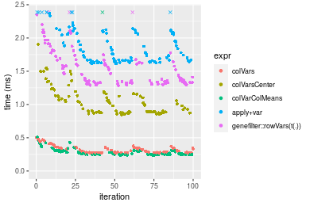


_Table: Benchmarking of colVars() and rowVars() on double+1000x100 data (original and transposed).  The top panel shows times in milliseconds and the bottom panel shows relative times._


|   |expr    |     min|      lq|     mean|  median|      uq|     max|
|:--|:-------|-------:|-------:|--------:|-------:|-------:|-------:|
|1  |colVars | 269.846| 275.744| 320.2453| 295.576| 348.421| 505.107|
|2  |rowVars | 298.175| 308.941| 332.5839| 319.988| 346.994| 494.310|


|   |expr    |      min|       lq|     mean|   median|        uq|       max|
|:--|:-------|--------:|--------:|--------:|--------:|---------:|---------:|
|1  |colVars | 1.000000| 1.000000| 1.000000| 1.000000| 1.0000000| 1.0000000|
|2  |rowVars | 1.104982| 1.120391| 1.038529| 1.082591| 0.9959044| 0.9786243|

_Figure: Benchmarking of colVars() and rowVars() on double+1000x100 data (original and transposed).  Outliers are displayed as crosses. Times are in milliseconds._


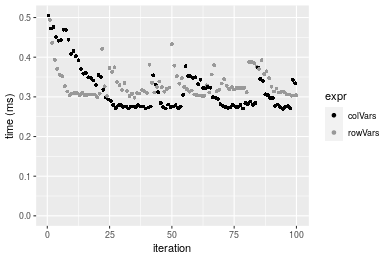


## Appendix

### Session information
```r
R version 4.1.1 Patched (2021-08-10 r80727)
Platform: x86_64-pc-linux-gnu (64-bit)
Running under: Ubuntu 18.04.5 LTS

Matrix products: default
BLAS:   /home/hb/software/R-devel/R-4-1-branch/lib/R/lib/libRblas.so
LAPACK: /home/hb/software/R-devel/R-4-1-branch/lib/R/lib/libRlapack.so

locale:
 [1] LC_CTYPE=en_US.UTF-8       LC_NUMERIC=C              
 [3] LC_TIME=en_US.UTF-8        LC_COLLATE=en_US.UTF-8    
 [5] LC_MONETARY=en_US.UTF-8    LC_MESSAGES=en_US.UTF-8   
 [7] LC_PAPER=en_US.UTF-8       LC_NAME=C                 
 [9] LC_ADDRESS=C               LC_TELEPHONE=C            
[11] LC_MEASUREMENT=en_US.UTF-8 LC_IDENTIFICATION=C       

attached base packages:
[1] stats     graphics  grDevices utils     datasets  methods   base     

other attached packages:
[1] microbenchmark_1.4-7   matrixStats_0.60.0     ggplot2_3.3.5         
[4] knitr_1.33             R.devices_2.17.0       R.utils_2.10.1        
[7] R.oo_1.24.0            R.methodsS3_1.8.1-9001 history_0.0.1-9000    

loaded via a namespace (and not attached):
 [1] Biobase_2.52.0          httr_1.4.2              splines_4.1.1          
 [4] bit64_4.0.5             network_1.17.1          assertthat_0.2.1       
 [7] highr_0.9               stats4_4.1.1            blob_1.2.2             
[10] GenomeInfoDbData_1.2.6  robustbase_0.93-8       pillar_1.6.2           
[13] RSQLite_2.2.8           lattice_0.20-44         glue_1.4.2             
[16] digest_0.6.27           XVector_0.32.0          colorspace_2.0-2       
[19] Matrix_1.3-4            XML_3.99-0.7            pkgconfig_2.0.3        
[22] zlibbioc_1.38.0         genefilter_1.74.0       purrr_0.3.4            
[25] ergm_4.1.2              xtable_1.8-4            scales_1.1.1           
[28] tibble_3.1.4            annotate_1.70.0         KEGGREST_1.32.0        
[31] farver_2.1.0            generics_0.1.0          IRanges_2.26.0         
[34] ellipsis_0.3.2          cachem_1.0.6            withr_2.4.2            
[37] BiocGenerics_0.38.0     mime_0.11               survival_3.2-13        
[40] magrittr_2.0.1          crayon_1.4.1            statnet.common_4.5.0   
[43] memoise_2.0.0           laeken_0.5.1            fansi_0.5.0            
[46] R.cache_0.15.0          MASS_7.3-54             R.rsp_0.44.0           
[49] progressr_0.8.0         tools_4.1.1             lifecycle_1.0.0        
[52] S4Vectors_0.30.0        trust_0.1-8             munsell_0.5.0          
[55] tabby_0.0.1-9001        AnnotationDbi_1.54.1    Biostrings_2.60.2      
[58] compiler_4.1.1          GenomeInfoDb_1.28.1     rlang_0.4.11           
[61] grid_4.1.1              RCurl_1.98-1.4          cwhmisc_6.6            
[64] rstudioapi_0.13         rappdirs_0.3.3          startup_0.15.0         
[67] labeling_0.4.2          bitops_1.0-7            base64enc_0.1-3        
[70] boot_1.3-28             gtable_0.3.0            DBI_1.1.1              
[73] markdown_1.1            R6_2.5.1                lpSolveAPI_5.5.2.0-17.7
[76] rle_0.9.2               dplyr_1.0.7             fastmap_1.1.0          
[79] bit_4.0.4               utf8_1.2.2              parallel_4.1.1         
[82] Rcpp_1.0.7              vctrs_0.3.8             png_0.1-7              
[85] DEoptimR_1.0-9          tidyselect_1.1.1        xfun_0.25              
[88] coda_0.19-4            
```
Total processing time was 37.33 secs.


### Reproducibility
To reproduce this report, do:
```r
html <- matrixStats:::benchmark('colVars')
```

[RSP]: https://cran.r-project.org/package=R.rsp
[matrixStats]: https://cran.r-project.org/package=matrixStats

[StackOverflow:colMins?]: https://stackoverflow.com/questions/13676878 "Stack Overflow: fastest way to get Min from every column in a matrix?"
[StackOverflow:colSds?]: https://stackoverflow.com/questions/17549762 "Stack Overflow: Is there such 'colsd' in R?"
[StackOverflow:rowProds?]: https://stackoverflow.com/questions/20198801/ "Stack Overflow: Row product of matrix and column sum of matrix"

---------------------------------------
Copyright Henrik Bengtsson. Last updated on 2021-08-25 22:31:39 (+0200 UTC). Powered by [RSP].

<script>
 var link = document.createElement('link');
 link.rel = 'icon';
 link.href = "data:image/png;base64,iVBORw0KGgoAAAANSUhEUgAAACAAAAAgCAMAAABEpIrGAAAA21BMVEUAAAAAAP8AAP8AAP8AAP8AAP8AAP8AAP8AAP8AAP8AAP8AAP8AAP8AAP8AAP8AAP8AAP8AAP8AAP8AAP8AAP8AAP8AAP8AAP8AAP8AAP8AAP8AAP8AAP8AAP8AAP8AAP8AAP8AAP8AAP8AAP8AAP8AAP8AAP8AAP8AAP8AAP8BAf4CAv0DA/wdHeIeHuEfH+AgIN8hId4lJdomJtknJ9g+PsE/P8BAQL9yco10dIt1dYp3d4h4eIeVlWqWlmmXl2iYmGeZmWabm2Tn5xjo6Bfp6Rb39wj4+Af//wA2M9hbAAAASXRSTlMAAQIJCgsMJSYnKD4/QGRlZmhpamtsbautrrCxuru8y8zN5ebn6Pn6+///////////////////////////////////////////LsUNcQAAAS9JREFUOI29k21XgkAQhVcFytdSMqMETU26UVqGmpaiFbL//xc1cAhhwVNf6n5i5z67M2dmYOyfJZUqlVLhkKucG7cgmUZTybDz6g0iDeq51PUr37Ds2cy2/C9NeES5puDjxuUk1xnToZsg8pfA3avHQ3lLIi7iWRrkv/OYtkScxBIMgDee0ALoyxHQBJ68JLCjOtQIMIANF7QG9G9fNnHvisCHBVMKgSJgiz7nE+AoBKrAPA3MgepvgR9TSCasrCKH0eB1wBGBFdCO+nAGjMVGPcQb5bd6mQRegN6+1axOs9nGfYcCtfi4NQosdtH7dB+txFIpXQqN1p9B/asRHToyS0jRgpV7nk4nwcq1BJ+x3Gl/v7S9Wmpp/aGquum7w3ZDyrADFYrl8vHBH+ev9AUASW1dmU4h4wAAAABJRU5ErkJggg=="
 document.getElementsByTagName('head')[0].appendChild(link);
</script>


