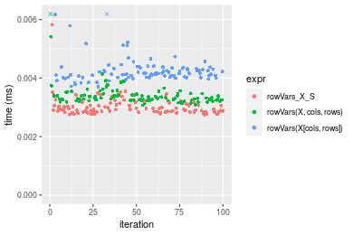
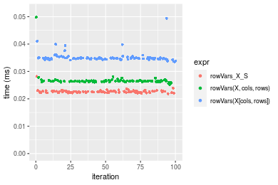
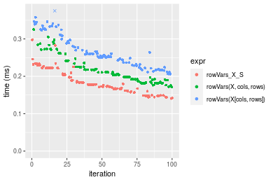
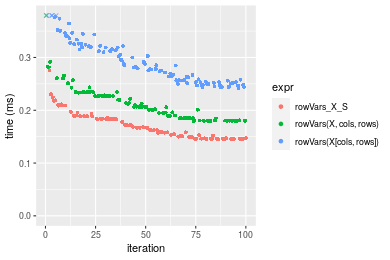

[matrixStats]: Benchmark report

---------------------------------------


# colVars() and rowVars() benchmarks  on subsetted computation

This report benchmark the performance of colVars() and rowVars() on subsetted computation.


## Data type "integer"

### Data
```r
> rmatrix <- function(nrow, ncol, mode = c("logical", "double", "integer", "index"), range = c(-100, 
+     +100), na_prob = 0) {
+     mode <- match.arg(mode)
+     n <- nrow * ncol
+     if (mode == "logical") {
+         x <- sample(c(FALSE, TRUE), size = n, replace = TRUE)
+     }     else if (mode == "index") {
+         x <- seq_len(n)
+         mode <- "integer"
+     }     else {
+         x <- runif(n, min = range[1], max = range[2])
+     }
+     storage.mode(x) <- mode
+     if (na_prob > 0) 
+         x[sample(n, size = na_prob * n)] <- NA
+     dim(x) <- c(nrow, ncol)
+     x
+ }
> rmatrices <- function(scale = 10, seed = 1, ...) {
+     set.seed(seed)
+     data <- list()
+     data[[1]] <- rmatrix(nrow = scale * 1, ncol = scale * 1, ...)
+     data[[2]] <- rmatrix(nrow = scale * 10, ncol = scale * 10, ...)
+     data[[3]] <- rmatrix(nrow = scale * 100, ncol = scale * 1, ...)
+     data[[4]] <- t(data[[3]])
+     data[[5]] <- rmatrix(nrow = scale * 10, ncol = scale * 100, ...)
+     data[[6]] <- t(data[[5]])
+     names(data) <- sapply(data, FUN = function(x) paste(dim(x), collapse = "x"))
+     data
+ }
> data <- rmatrices(mode = mode)
```

### Results

#### 10x10 integer matrix

```r
> X <- data[["10x10"]]
> rows <- sample.int(nrow(X), size = nrow(X) * 0.7)
> cols <- sample.int(ncol(X), size = ncol(X) * 0.7)
> X_S <- X[rows, cols]
> gc()
           used  (Mb) gc trigger  (Mb) max used  (Mb)
Ncells  5263176 281.1   10014072 534.9 10014072 534.9
Vcells 10000703  76.3   18204443 138.9 18204443 138.9
> colStats <- microbenchmark(colVars_X_S = colVars(X_S, na.rm = FALSE), `colVars(X, rows, cols)` = colVars(X, 
+     rows = rows, cols = cols, na.rm = FALSE), `colVars(X[rows, cols])` = colVars(X[rows, cols], na.rm = FALSE), 
+     unit = "ms")
> X <- t(X)
> X_S <- t(X_S)
> gc()
          used  (Mb) gc trigger  (Mb) max used  (Mb)
Ncells 5249922 280.4   10014072 534.9 10014072 534.9
Vcells 9956316  76.0   18204443 138.9 18204443 138.9
> rowStats <- microbenchmark(rowVars_X_S = rowVars(X_S, na.rm = FALSE), `rowVars(X, cols, rows)` = rowVars(X, 
+     rows = cols, cols = rows, na.rm = FALSE), `rowVars(X[cols, rows])` = rowVars(X[cols, rows], na.rm = FALSE), 
+     unit = "ms")
```

_Table: Benchmarking of colVars_X_S(), colVars(X, rows, cols)() and colVars(X[rows, cols])() on integer+10x10 data. The top panel shows times in milliseconds and the bottom panel shows relative times._


|   |expr                   |      min|        lq|      mean|    median|        uq|      max|
|:--|:----------------------|--------:|---------:|---------:|---------:|---------:|--------:|
|1  |colVars_X_S            | 0.002459| 0.0024935| 0.0068636| 0.0025610| 0.0027095| 0.426023|
|2  |colVars(X, rows, cols) | 0.002831| 0.0029130| 0.0030947| 0.0029650| 0.0031070| 0.008086|
|3  |colVars(X[rows, cols]) | 0.003261| 0.0035075| 0.0037214| 0.0036125| 0.0037555| 0.007515|


|   |expr                   |      min|       lq|      mean|   median|       uq|       max|
|:--|:----------------------|--------:|--------:|---------:|--------:|--------:|---------:|
|1  |colVars_X_S            | 1.000000| 1.000000| 1.0000000| 1.000000| 1.000000| 1.0000000|
|2  |colVars(X, rows, cols) | 1.151281| 1.168237| 0.4508918| 1.157751| 1.146706| 0.0189802|
|3  |colVars(X[rows, cols]) | 1.326149| 1.406657| 0.5421964| 1.410582| 1.386049| 0.0176399|

_Table: Benchmarking of rowVars_X_S(), rowVars(X, cols, rows)() and rowVars(X[cols, rows])() on integer+10x10 data (transposed). The top panel shows times in milliseconds and the bottom panel shows relative times._


|   |expr                   |      min|        lq|      mean|    median|        uq|      max|
|:--|:----------------------|--------:|---------:|---------:|---------:|---------:|--------:|
|1  |rowVars_X_S            | 0.002493| 0.0025325| 0.0026547| 0.0025880| 0.0027230| 0.004954|
|2  |rowVars(X, cols, rows) | 0.002854| 0.0029090| 0.0073357| 0.0029805| 0.0031165| 0.432077|
|3  |rowVars(X[cols, rows]) | 0.003275| 0.0034985| 0.0037155| 0.0036385| 0.0037930| 0.006368|


|   |expr                   |      min|       lq|     mean|   median|       uq|       max|
|:--|:----------------------|--------:|--------:|--------:|--------:|--------:|---------:|
|1  |rowVars_X_S            | 1.000000| 1.000000| 1.000000| 1.000000| 1.000000|  1.000000|
|2  |rowVars(X, cols, rows) | 1.144805| 1.148667| 2.763283| 1.151661| 1.144510| 87.217804|
|3  |rowVars(X[cols, rows]) | 1.313678| 1.381441| 1.399602| 1.405912| 1.392949|  1.285426|

_Figure: Benchmarking of colVars_X_S(), colVars(X, rows, cols)() and colVars(X[rows, cols])() on integer+10x10 data  as well as rowVars_X_S(), rowVars(X, cols, rows)() and rowVars(X[cols, rows])() on the same data transposed.  Outliers are displayed as crosses.  Times are in milliseconds._



_Table: Benchmarking of colVars_X_S() and rowVars_X_S() on integer+10x10 data (original and transposed).  The top panel shows times in milliseconds and the bottom panel shows relative times._


|   |expr        |   min|     lq|    mean| median|     uq|     max|
|:--|:-----------|-----:|------:|-------:|------:|------:|-------:|
|1  |colVars_X_S | 2.459| 2.4935| 6.86362|  2.561| 2.7095| 426.023|
|2  |rowVars_X_S | 2.493| 2.5325| 2.65469|  2.588| 2.7230|   4.954|


|   |expr        |      min|       lq|      mean|   median|       uq|       max|
|:--|:-----------|--------:|--------:|---------:|--------:|--------:|---------:|
|1  |colVars_X_S | 1.000000| 1.000000| 1.0000000| 1.000000| 1.000000| 1.0000000|
|2  |rowVars_X_S | 1.013827| 1.015641| 0.3867769| 1.010543| 1.004982| 0.0116285|

_Figure: Benchmarking of colVars_X_S() and rowVars_X_S() on integer+10x10 data (original and transposed).  Outliers are displayed as crosses. Times are in milliseconds._


#### 100x100 integer matrix

```r
> X <- data[["100x100"]]
> rows <- sample.int(nrow(X), size = nrow(X) * 0.7)
> cols <- sample.int(ncol(X), size = ncol(X) * 0.7)
> X_S <- X[rows, cols]
> gc()
          used  (Mb) gc trigger  (Mb) max used  (Mb)
Ncells 5249350 280.4   10014072 534.9 10014072 534.9
Vcells 9792498  74.8   18204443 138.9 18204443 138.9
> colStats <- microbenchmark(colVars_X_S = colVars(X_S, na.rm = FALSE), `colVars(X, rows, cols)` = colVars(X, 
+     rows = rows, cols = cols, na.rm = FALSE), `colVars(X[rows, cols])` = colVars(X[rows, cols], na.rm = FALSE), 
+     unit = "ms")
> X <- t(X)
> X_S <- t(X_S)
> gc()
          used  (Mb) gc trigger  (Mb) max used  (Mb)
Ncells 5249326 280.4   10014072 534.9 10014072 534.9
Vcells 9797551  74.8   18204443 138.9 18204443 138.9
> rowStats <- microbenchmark(rowVars_X_S = rowVars(X_S, na.rm = FALSE), `rowVars(X, cols, rows)` = rowVars(X, 
+     rows = cols, cols = rows, na.rm = FALSE), `rowVars(X[cols, rows])` = rowVars(X[cols, rows], na.rm = FALSE), 
+     unit = "ms")
```

_Table: Benchmarking of colVars_X_S(), colVars(X, rows, cols)() and colVars(X[rows, cols])() on integer+100x100 data. The top panel shows times in milliseconds and the bottom panel shows relative times._


|   |expr                   |      min|        lq|      mean|   median|        uq|      max|
|:--|:----------------------|--------:|---------:|---------:|--------:|---------:|--------:|
|2  |colVars(X, rows, cols) | 0.029048| 0.0305230| 0.0314304| 0.031656| 0.0319265| 0.046541|
|1  |colVars_X_S            | 0.029444| 0.0309875| 0.0321886| 0.032096| 0.0323640| 0.053663|
|3  |colVars(X[rows, cols]) | 0.039787| 0.0418305| 0.0438223| 0.043642| 0.0441560| 0.088633|


|   |expr                   |      min|       lq|     mean|   median|       uq|      max|
|:--|:----------------------|--------:|--------:|--------:|--------:|--------:|--------:|
|2  |colVars(X, rows, cols) | 1.000000| 1.000000| 1.000000| 1.000000| 1.000000| 1.000000|
|1  |colVars_X_S            | 1.013633| 1.015218| 1.024120| 1.013899| 1.013703| 1.153026|
|3  |colVars(X[rows, cols]) | 1.369698| 1.370458| 1.394263| 1.378633| 1.383052| 1.904407|

_Table: Benchmarking of rowVars_X_S(), rowVars(X, cols, rows)() and rowVars(X[cols, rows])() on integer+100x100 data (transposed). The top panel shows times in milliseconds and the bottom panel shows relative times._


|   |expr                   |      min|        lq|      mean|    median|       uq|      max|
|:--|:----------------------|--------:|---------:|---------:|---------:|--------:|--------:|
|2  |rowVars(X, cols, rows) | 0.029106| 0.0306775| 0.0317989| 0.0318255| 0.032073| 0.051902|
|1  |rowVars_X_S            | 0.032307| 0.0339125| 0.0346480| 0.0351730| 0.035414| 0.040969|
|3  |rowVars(X[cols, rows]) | 0.042830| 0.0447075| 0.0462984| 0.0466530| 0.047129| 0.066667|


|   |expr                   |      min|       lq|     mean|   median|       uq|      max|
|:--|:----------------------|--------:|--------:|--------:|--------:|--------:|--------:|
|2  |rowVars(X, cols, rows) | 1.000000| 1.000000| 1.000000| 1.000000| 1.000000| 1.000000|
|1  |rowVars_X_S            | 1.109977| 1.105452| 1.089600| 1.105183| 1.104169| 0.789353|
|3  |rowVars(X[cols, rows]) | 1.471518| 1.457338| 1.455977| 1.465900| 1.469429| 1.284478|

_Figure: Benchmarking of colVars_X_S(), colVars(X, rows, cols)() and colVars(X[rows, cols])() on integer+100x100 data  as well as rowVars_X_S(), rowVars(X, cols, rows)() and rowVars(X[cols, rows])() on the same data transposed.  Outliers are displayed as crosses.  Times are in milliseconds._


_Table: Benchmarking of colVars_X_S() and rowVars_X_S() on integer+100x100 data (original and transposed).  The top panel shows times in milliseconds and the bottom panel shows relative times._


|   |expr        |    min|      lq|     mean| median|     uq|    max|
|:--|:-----------|------:|-------:|--------:|------:|------:|------:|
|1  |colVars_X_S | 29.444| 30.9875| 32.18855| 32.096| 32.364| 53.663|
|2  |rowVars_X_S | 32.307| 33.9125| 34.64804| 35.173| 35.414| 40.969|


|   |expr        |      min|       lq|     mean|   median|      uq|       max|
|:--|:-----------|--------:|--------:|--------:|--------:|-------:|---------:|
|1  |colVars_X_S | 1.000000| 1.000000| 1.000000| 1.000000| 1.00000| 1.0000000|
|2  |rowVars_X_S | 1.097235| 1.094393| 1.076409| 1.095869| 1.09424| 0.7634497|

_Figure: Benchmarking of colVars_X_S() and rowVars_X_S() on integer+100x100 data (original and transposed).  Outliers are displayed as crosses. Times are in milliseconds._


#### 1000x10 integer matrix

```r
> X <- data[["1000x10"]]
> rows <- sample.int(nrow(X), size = nrow(X) * 0.7)
> cols <- sample.int(ncol(X), size = ncol(X) * 0.7)
> X_S <- X[rows, cols]
> gc()
          used  (Mb) gc trigger  (Mb) max used  (Mb)
Ncells 5250093 280.4   10014072 534.9 10014072 534.9
Vcells 9796542  74.8   18204443 138.9 18204443 138.9
> colStats <- microbenchmark(colVars_X_S = colVars(X_S, na.rm = FALSE), `colVars(X, rows, cols)` = colVars(X, 
+     rows = rows, cols = cols, na.rm = FALSE), `colVars(X[rows, cols])` = colVars(X[rows, cols], na.rm = FALSE), 
+     unit = "ms")
> X <- t(X)
> X_S <- t(X_S)
> gc()
          used  (Mb) gc trigger  (Mb) max used  (Mb)
Ncells 5250069 280.4   10014072 534.9 10014072 534.9
Vcells 9801595  74.8   18204443 138.9 18204443 138.9
> rowStats <- microbenchmark(rowVars_X_S = rowVars(X_S, na.rm = FALSE), `rowVars(X, cols, rows)` = rowVars(X, 
+     rows = cols, cols = rows, na.rm = FALSE), `rowVars(X[cols, rows])` = rowVars(X[cols, rows], na.rm = FALSE), 
+     unit = "ms")
```

_Table: Benchmarking of colVars_X_S(), colVars(X, rows, cols)() and colVars(X[rows, cols])() on integer+1000x10 data. The top panel shows times in milliseconds and the bottom panel shows relative times._


|   |expr                   |      min|        lq|      mean|    median|        uq|      max|
|:--|:----------------------|--------:|---------:|---------:|---------:|---------:|--------:|
|1  |colVars_X_S            | 0.028561| 0.0302085| 0.0310268| 0.0305800| 0.0317710| 0.043934|
|2  |colVars(X, rows, cols) | 0.030266| 0.0318700| 0.0332286| 0.0326730| 0.0341615| 0.047397|
|3  |colVars(X[rows, cols]) | 0.039030| 0.0406150| 0.0433811| 0.0423615| 0.0444140| 0.102842|


|   |expr                   |      min|       lq|     mean|   median|       uq|      max|
|:--|:----------------------|--------:|--------:|--------:|--------:|--------:|--------:|
|1  |colVars_X_S            | 1.000000| 1.000000| 1.000000| 1.000000| 1.000000| 1.000000|
|2  |colVars(X, rows, cols) | 1.059697| 1.055001| 1.070965| 1.068443| 1.075242| 1.078823|
|3  |colVars(X[rows, cols]) | 1.366549| 1.344489| 1.398183| 1.385268| 1.397941| 2.340829|

_Table: Benchmarking of rowVars_X_S(), rowVars(X, cols, rows)() and rowVars(X[cols, rows])() on integer+1000x10 data (transposed). The top panel shows times in milliseconds and the bottom panel shows relative times._


|   |expr                   |      min|        lq|      mean|    median|        uq|      max|
|:--|:----------------------|--------:|---------:|---------:|---------:|---------:|--------:|
|2  |rowVars(X, cols, rows) | 0.032327| 0.0337475| 0.0341982| 0.0339020| 0.0342110| 0.049368|
|1  |rowVars_X_S            | 0.034082| 0.0355910| 0.0359376| 0.0357935| 0.0359775| 0.040619|
|3  |rowVars(X[cols, rows]) | 0.047593| 0.0495545| 0.0508564| 0.0498140| 0.0504720| 0.093583|


|   |expr                   |      min|       lq|     mean|   median|       uq|       max|
|:--|:----------------------|--------:|--------:|--------:|--------:|--------:|---------:|
|2  |rowVars(X, cols, rows) | 1.000000| 1.000000| 1.000000| 1.000000| 1.000000| 1.0000000|
|1  |rowVars_X_S            | 1.054289| 1.054626| 1.050860| 1.055793| 1.051635| 0.8227799|
|3  |rowVars(X[cols, rows]) | 1.472237| 1.468390| 1.487105| 1.469353| 1.475315| 1.8956206|

_Figure: Benchmarking of colVars_X_S(), colVars(X, rows, cols)() and colVars(X[rows, cols])() on integer+1000x10 data  as well as rowVars_X_S(), rowVars(X, cols, rows)() and rowVars(X[cols, rows])() on the same data transposed.  Outliers are displayed as crosses.  Times are in milliseconds._


_Table: Benchmarking of colVars_X_S() and rowVars_X_S() on integer+1000x10 data (original and transposed).  The top panel shows times in milliseconds and the bottom panel shows relative times._


|   |expr        |    min|      lq|     mean|  median|      uq|    max|
|:--|:-----------|------:|-------:|--------:|-------:|-------:|------:|
|1  |colVars_X_S | 28.561| 30.2085| 31.02679| 30.5800| 31.7710| 43.934|
|2  |rowVars_X_S | 34.082| 35.5910| 35.93755| 35.7935| 35.9775| 40.619|


|   |expr        |      min|       lq|     mean|   median|       uq|       max|
|:--|:-----------|--------:|--------:|--------:|--------:|--------:|---------:|
|1  |colVars_X_S | 1.000000| 1.000000| 1.000000| 1.000000| 1.000000| 1.0000000|
|2  |rowVars_X_S | 1.193306| 1.178178| 1.158275| 1.170487| 1.132401| 0.9245459|

_Figure: Benchmarking of colVars_X_S() and rowVars_X_S() on integer+1000x10 data (original and transposed).  Outliers are displayed as crosses. Times are in milliseconds._


#### 10x1000 integer matrix

```r
> X <- data[["10x1000"]]
> rows <- sample.int(nrow(X), size = nrow(X) * 0.7)
> cols <- sample.int(ncol(X), size = ncol(X) * 0.7)
> X_S <- X[rows, cols]
> gc()
          used  (Mb) gc trigger  (Mb) max used  (Mb)
Ncells 5250298 280.4   10014072 534.9 10014072 534.9
Vcells 9797358  74.8   18204443 138.9 18204443 138.9
> colStats <- microbenchmark(colVars_X_S = colVars(X_S, na.rm = FALSE), `colVars(X, rows, cols)` = colVars(X, 
+     rows = rows, cols = cols, na.rm = FALSE), `colVars(X[rows, cols])` = colVars(X[rows, cols], na.rm = FALSE), 
+     unit = "ms")
> X <- t(X)
> X_S <- t(X_S)
> gc()
          used  (Mb) gc trigger  (Mb) max used  (Mb)
Ncells 5250274 280.4   10014072 534.9 10014072 534.9
Vcells 9802411  74.8   18204443 138.9 18204443 138.9
> rowStats <- microbenchmark(rowVars_X_S = rowVars(X_S, na.rm = FALSE), `rowVars(X, cols, rows)` = rowVars(X, 
+     rows = cols, cols = rows, na.rm = FALSE), `rowVars(X[cols, rows])` = rowVars(X[cols, rows], na.rm = FALSE), 
+     unit = "ms")
```

_Table: Benchmarking of colVars_X_S(), colVars(X, rows, cols)() and colVars(X[rows, cols])() on integer+10x1000 data. The top panel shows times in milliseconds and the bottom panel shows relative times._


|   |expr                   |      min|        lq|      mean|    median|        uq|      max|
|:--|:----------------------|--------:|---------:|---------:|---------:|---------:|--------:|
|1  |colVars_X_S            | 0.024749| 0.0254925| 0.0269374| 0.0270610| 0.0274555| 0.047244|
|2  |colVars(X, rows, cols) | 0.027263| 0.0280125| 0.0294632| 0.0289290| 0.0300290| 0.048306|
|3  |colVars(X[rows, cols]) | 0.037641| 0.0388065| 0.0412072| 0.0411075| 0.0420475| 0.060690|


|   |expr                   |     min|       lq|     mean|   median|       uq|      max|
|:--|:----------------------|-------:|--------:|--------:|--------:|--------:|--------:|
|1  |colVars_X_S            | 1.00000| 1.000000| 1.000000| 1.000000| 1.000000| 1.000000|
|2  |colVars(X, rows, cols) | 1.10158| 1.098853| 1.093764| 1.069029| 1.093733| 1.022479|
|3  |colVars(X[rows, cols]) | 1.52091| 1.522271| 1.529739| 1.519068| 1.531478| 1.284608|

_Table: Benchmarking of rowVars_X_S(), rowVars(X, cols, rows)() and rowVars(X[cols, rows])() on integer+10x1000 data (transposed). The top panel shows times in milliseconds and the bottom panel shows relative times._


|   |expr                   |      min|        lq|      mean|    median|        uq|      max|
|:--|:----------------------|--------:|---------:|---------:|---------:|---------:|--------:|
|2  |rowVars(X, cols, rows) | 0.027041| 0.0292290| 0.0297779| 0.0295465| 0.0298215| 0.051380|
|1  |rowVars_X_S            | 0.028061| 0.0300840| 0.0304959| 0.0303200| 0.0304770| 0.044624|
|3  |rowVars(X[cols, rows]) | 0.039020| 0.0419875| 0.0425515| 0.0424920| 0.0429410| 0.060558|


|   |expr                   |      min|       lq|     mean|   median|       uq|       max|
|:--|:----------------------|--------:|--------:|--------:|--------:|--------:|---------:|
|2  |rowVars(X, cols, rows) | 1.000000| 1.000000| 1.000000| 1.000000| 1.000000| 1.0000000|
|1  |rowVars_X_S            | 1.037721| 1.029252| 1.024111| 1.026179| 1.021981| 0.8685091|
|3  |rowVars(X[cols, rows]) | 1.442994| 1.436501| 1.428963| 1.438140| 1.439934| 1.1786298|

_Figure: Benchmarking of colVars_X_S(), colVars(X, rows, cols)() and colVars(X[rows, cols])() on integer+10x1000 data  as well as rowVars_X_S(), rowVars(X, cols, rows)() and rowVars(X[cols, rows])() on the same data transposed.  Outliers are displayed as crosses.  Times are in milliseconds._



_Table: Benchmarking of colVars_X_S() and rowVars_X_S() on integer+10x1000 data (original and transposed).  The top panel shows times in milliseconds and the bottom panel shows relative times._


|   |expr        |    min|      lq|     mean| median|      uq|    max|
|:--|:-----------|------:|-------:|--------:|------:|-------:|------:|
|1  |colVars_X_S | 24.749| 25.4925| 26.93741| 27.061| 27.4555| 47.244|
|2  |rowVars_X_S | 28.061| 30.0840| 30.49588| 30.320| 30.4770| 44.624|


|   |expr        |      min|       lq|     mean|   median|       uq|       max|
|:--|:-----------|--------:|--------:|--------:|--------:|--------:|---------:|
|1  |colVars_X_S | 1.000000| 1.000000| 1.000000| 1.000000| 1.000000| 1.0000000|
|2  |rowVars_X_S | 1.133824| 1.180112| 1.132101| 1.120432| 1.110051| 0.9445432|

_Figure: Benchmarking of colVars_X_S() and rowVars_X_S() on integer+10x1000 data (original and transposed).  Outliers are displayed as crosses. Times are in milliseconds._


#### 100x1000 integer matrix

```r
> X <- data[["100x1000"]]
> rows <- sample.int(nrow(X), size = nrow(X) * 0.7)
> cols <- sample.int(ncol(X), size = ncol(X) * 0.7)
> X_S <- X[rows, cols]
> gc()
          used  (Mb) gc trigger  (Mb) max used  (Mb)
Ncells 5250508 280.5   10014072 534.9 10014072 534.9
Vcells 9820025  75.0   18204443 138.9 18204443 138.9
> colStats <- microbenchmark(colVars_X_S = colVars(X_S, na.rm = FALSE), `colVars(X, rows, cols)` = colVars(X, 
+     rows = rows, cols = cols, na.rm = FALSE), `colVars(X[rows, cols])` = colVars(X[rows, cols], na.rm = FALSE), 
+     unit = "ms")
> X <- t(X)
> X_S <- t(X_S)
> gc()
          used  (Mb) gc trigger  (Mb) max used  (Mb)
Ncells 5250484 280.5   10014072 534.9 10014072 534.9
Vcells 9870078  75.4   18204443 138.9 18204443 138.9
> rowStats <- microbenchmark(rowVars_X_S = rowVars(X_S, na.rm = FALSE), `rowVars(X, cols, rows)` = rowVars(X, 
+     rows = cols, cols = rows, na.rm = FALSE), `rowVars(X[cols, rows])` = rowVars(X[cols, rows], na.rm = FALSE), 
+     unit = "ms")
```

_Table: Benchmarking of colVars_X_S(), colVars(X, rows, cols)() and colVars(X[rows, cols])() on integer+100x1000 data. The top panel shows times in milliseconds and the bottom panel shows relative times._


|   |expr                   |      min|       lq|      mean|    median|        uq|      max|
|:--|:----------------------|--------:|--------:|---------:|---------:|---------:|--------:|
|2  |colVars(X, rows, cols) | 0.170803| 0.173989| 0.2069508| 0.1996140| 0.2254940| 0.327350|
|1  |colVars_X_S            | 0.181178| 0.182183| 0.2180548| 0.2064125| 0.2364735| 0.318970|
|3  |colVars(X[rows, cols]) | 0.246696| 0.254129| 0.3057603| 0.3012030| 0.3350695| 0.428394|


|   |expr                   |      min|       lq|     mean|   median|       uq|       max|
|:--|:----------------------|--------:|--------:|--------:|--------:|--------:|---------:|
|2  |colVars(X, rows, cols) | 1.000000| 1.000000| 1.000000| 1.000000| 1.000000| 1.0000000|
|1  |colVars_X_S            | 1.060742| 1.047095| 1.053655| 1.034058| 1.048691| 0.9744005|
|3  |colVars(X[rows, cols]) | 1.444331| 1.460604| 1.477454| 1.508927| 1.485935| 1.3086727|

_Table: Benchmarking of rowVars_X_S(), rowVars(X, cols, rows)() and rowVars(X[cols, rows])() on integer+100x1000 data (transposed). The top panel shows times in milliseconds and the bottom panel shows relative times._


|   |expr                   |      min|        lq|      mean|    median|        uq|      max|
|:--|:----------------------|--------:|---------:|---------:|---------:|---------:|--------:|
|2  |rowVars(X, cols, rows) | 0.176277| 0.1769450| 0.2053999| 0.1865955| 0.2266295| 0.340778|
|1  |rowVars_X_S            | 0.200292| 0.2058410| 0.2452730| 0.2381855| 0.2628820| 0.371111|
|3  |rowVars(X[cols, rows]) | 0.263168| 0.2680685| 0.3171349| 0.2982070| 0.3520955| 0.459345|


|   |expr                   |      min|       lq|     mean|   median|       uq|      max|
|:--|:----------------------|--------:|--------:|--------:|--------:|--------:|--------:|
|2  |rowVars(X, cols, rows) | 1.000000| 1.000000| 1.000000| 1.000000| 1.000000| 1.000000|
|1  |rowVars_X_S            | 1.136234| 1.163305| 1.194124| 1.276480| 1.159964| 1.089011|
|3  |rowVars(X[cols, rows]) | 1.492923| 1.514982| 1.543988| 1.598147| 1.553617| 1.347930|

_Figure: Benchmarking of colVars_X_S(), colVars(X, rows, cols)() and colVars(X[rows, cols])() on integer+100x1000 data  as well as rowVars_X_S(), rowVars(X, cols, rows)() and rowVars(X[cols, rows])() on the same data transposed.  Outliers are displayed as crosses.  Times are in milliseconds._



_Table: Benchmarking of colVars_X_S() and rowVars_X_S() on integer+100x1000 data (original and transposed).  The top panel shows times in milliseconds and the bottom panel shows relative times._


|   |expr        |     min|      lq|     mean|   median|       uq|     max|
|:--|:-----------|-------:|-------:|--------:|--------:|--------:|-------:|
|1  |colVars_X_S | 181.178| 182.183| 218.0548| 206.4125| 236.4735| 318.970|
|2  |rowVars_X_S | 200.292| 205.841| 245.2730| 238.1855| 262.8820| 371.111|


|   |expr        |      min|       lq|     mean|  median|       uq|      max|
|:--|:-----------|--------:|--------:|--------:|-------:|--------:|--------:|
|1  |colVars_X_S | 1.000000| 1.000000| 1.000000| 1.00000| 1.000000| 1.000000|
|2  |rowVars_X_S | 1.105498| 1.129858| 1.124823| 1.15393| 1.111676| 1.163467|

_Figure: Benchmarking of colVars_X_S() and rowVars_X_S() on integer+100x1000 data (original and transposed).  Outliers are displayed as crosses. Times are in milliseconds._


#### 1000x100 integer matrix

```r
> X <- data[["1000x100"]]
> rows <- sample.int(nrow(X), size = nrow(X) * 0.7)
> cols <- sample.int(ncol(X), size = ncol(X) * 0.7)
> X_S <- X[rows, cols]
> gc()
          used  (Mb) gc trigger  (Mb) max used  (Mb)
Ncells 5250721 280.5   10014072 534.9 10014072 534.9
Vcells 9820796  75.0   18204443 138.9 18204443 138.9
> colStats <- microbenchmark(colVars_X_S = colVars(X_S, na.rm = FALSE), `colVars(X, rows, cols)` = colVars(X, 
+     rows = rows, cols = cols, na.rm = FALSE), `colVars(X[rows, cols])` = colVars(X[rows, cols], na.rm = FALSE), 
+     unit = "ms")
> X <- t(X)
> X_S <- t(X_S)
> gc()
          used  (Mb) gc trigger  (Mb) max used  (Mb)
Ncells 5250697 280.5   10014072 534.9 10014072 534.9
Vcells 9870849  75.4   18204443 138.9 18204443 138.9
> rowStats <- microbenchmark(rowVars_X_S = rowVars(X_S, na.rm = FALSE), `rowVars(X, cols, rows)` = rowVars(X, 
+     rows = cols, cols = rows, na.rm = FALSE), `rowVars(X[cols, rows])` = rowVars(X[cols, rows], na.rm = FALSE), 
+     unit = "ms")
```

_Table: Benchmarking of colVars_X_S(), colVars(X, rows, cols)() and colVars(X[rows, cols])() on integer+1000x100 data. The top panel shows times in milliseconds and the bottom panel shows relative times._


|   |expr                   |      min|        lq|      mean|    median|        uq|      max|
|:--|:----------------------|--------:|---------:|---------:|---------:|---------:|--------:|
|1  |colVars_X_S            | 0.178695| 0.1827845| 0.2121485| 0.1995425| 0.2315505| 0.312709|
|2  |colVars(X, rows, cols) | 0.170317| 0.1748875| 0.2080242| 0.2043250| 0.2218655| 0.286011|
|3  |colVars(X[rows, cols]) | 0.241452| 0.2469515| 0.2967653| 0.2899635| 0.3286465| 0.457744|


|   |expr                   |       min|        lq|      mean|   median|        uq|       max|
|:--|:----------------------|---------:|---------:|---------:|--------:|---------:|---------:|
|1  |colVars_X_S            | 1.0000000| 1.0000000| 1.0000000| 1.000000| 1.0000000| 1.0000000|
|2  |colVars(X, rows, cols) | 0.9531156| 0.9567961| 0.9805594| 1.023967| 0.9581733| 0.9146235|
|3  |colVars(X[rows, cols]) | 1.3511962| 1.3510527| 1.3988564| 1.453142| 1.4193297| 1.4638018|

_Table: Benchmarking of rowVars_X_S(), rowVars(X, cols, rows)() and rowVars(X[cols, rows])() on integer+1000x100 data (transposed). The top panel shows times in milliseconds and the bottom panel shows relative times._


|   |expr                   |      min|        lq|      mean|    median|        uq|      max|
|:--|:----------------------|--------:|---------:|---------:|---------:|---------:|--------:|
|2  |rowVars(X, cols, rows) | 0.179378| 0.1839440| 0.2174941| 0.2125315| 0.2344580| 0.362770|
|1  |rowVars_X_S            | 0.203652| 0.2044430| 0.2437408| 0.2284295| 0.2656685| 0.342948|
|3  |rowVars(X[cols, rows]) | 0.269545| 0.2716755| 0.3261028| 0.3071995| 0.3647425| 0.472976|


|   |expr                   |      min|       lq|     mean|   median|       uq|       max|
|:--|:----------------------|--------:|--------:|--------:|--------:|--------:|---------:|
|2  |rowVars(X, cols, rows) | 1.000000| 1.000000| 1.000000| 1.000000| 1.000000| 1.0000000|
|1  |rowVars_X_S            | 1.135323| 1.111441| 1.120678| 1.074803| 1.133118| 0.9453593|
|3  |rowVars(X[cols, rows]) | 1.502665| 1.476947| 1.499364| 1.445430| 1.555684| 1.3037903|

_Figure: Benchmarking of colVars_X_S(), colVars(X, rows, cols)() and colVars(X[rows, cols])() on integer+1000x100 data  as well as rowVars_X_S(), rowVars(X, cols, rows)() and rowVars(X[cols, rows])() on the same data transposed.  Outliers are displayed as crosses.  Times are in milliseconds._


_Table: Benchmarking of colVars_X_S() and rowVars_X_S() on integer+1000x100 data (original and transposed).  The top panel shows times in milliseconds and the bottom panel shows relative times._


|   |expr        |     min|       lq|     mean|   median|       uq|     max|
|:--|:-----------|-------:|--------:|--------:|--------:|--------:|-------:|
|1  |colVars_X_S | 178.695| 182.7845| 212.1485| 199.5425| 231.5505| 312.709|
|2  |rowVars_X_S | 203.652| 204.4430| 243.7408| 228.4295| 265.6685| 342.948|


|   |expr        |      min|       lq|     mean|   median|       uq|    max|
|:--|:-----------|--------:|--------:|--------:|--------:|--------:|------:|
|1  |colVars_X_S | 1.000000| 1.000000| 1.000000| 1.000000| 1.000000| 1.0000|
|2  |rowVars_X_S | 1.139663| 1.118492| 1.148916| 1.144766| 1.147346| 1.0967|

_Figure: Benchmarking of colVars_X_S() and rowVars_X_S() on integer+1000x100 data (original and transposed).  Outliers are displayed as crosses. Times are in milliseconds._


## Data type "double"

### Data
```r
> rmatrix <- function(nrow, ncol, mode = c("logical", "double", "integer", "index"), range = c(-100, 
+     +100), na_prob = 0) {
+     mode <- match.arg(mode)
+     n <- nrow * ncol
+     if (mode == "logical") {
+         x <- sample(c(FALSE, TRUE), size = n, replace = TRUE)
+     }     else if (mode == "index") {
+         x <- seq_len(n)
+         mode <- "integer"
+     }     else {
+         x <- runif(n, min = range[1], max = range[2])
+     }
+     storage.mode(x) <- mode
+     if (na_prob > 0) 
+         x[sample(n, size = na_prob * n)] <- NA
+     dim(x) <- c(nrow, ncol)
+     x
+ }
> rmatrices <- function(scale = 10, seed = 1, ...) {
+     set.seed(seed)
+     data <- list()
+     data[[1]] <- rmatrix(nrow = scale * 1, ncol = scale * 1, ...)
+     data[[2]] <- rmatrix(nrow = scale * 10, ncol = scale * 10, ...)
+     data[[3]] <- rmatrix(nrow = scale * 100, ncol = scale * 1, ...)
+     data[[4]] <- t(data[[3]])
+     data[[5]] <- rmatrix(nrow = scale * 10, ncol = scale * 100, ...)
+     data[[6]] <- t(data[[5]])
+     names(data) <- sapply(data, FUN = function(x) paste(dim(x), collapse = "x"))
+     data
+ }
> data <- rmatrices(mode = mode)
```

### Results

#### 10x10 double matrix

```r
> X <- data[["10x10"]]
> rows <- sample.int(nrow(X), size = nrow(X) * 0.7)
> cols <- sample.int(ncol(X), size = ncol(X) * 0.7)
> X_S <- X[rows, cols]
> gc()
          used  (Mb) gc trigger  (Mb) max used  (Mb)
Ncells 5250938 280.5   10014072 534.9 10014072 534.9
Vcells 9911890  75.7   18204443 138.9 18204443 138.9
> colStats <- microbenchmark(colVars_X_S = colVars(X_S, na.rm = FALSE), `colVars(X, rows, cols)` = colVars(X, 
+     rows = rows, cols = cols, na.rm = FALSE), `colVars(X[rows, cols])` = colVars(X[rows, cols], na.rm = FALSE), 
+     unit = "ms")
> X <- t(X)
> X_S <- t(X_S)
> gc()
          used  (Mb) gc trigger  (Mb) max used  (Mb)
Ncells 5250905 280.5   10014072 534.9 10014072 534.9
Vcells 9912028  75.7   18204443 138.9 18204443 138.9
> rowStats <- microbenchmark(rowVars_X_S = rowVars(X_S, na.rm = FALSE), `rowVars(X, cols, rows)` = rowVars(X, 
+     rows = cols, cols = rows, na.rm = FALSE), `rowVars(X[cols, rows])` = rowVars(X[cols, rows], na.rm = FALSE), 
+     unit = "ms")
```

_Table: Benchmarking of colVars_X_S(), colVars(X, rows, cols)() and colVars(X[rows, cols])() on double+10x10 data. The top panel shows times in milliseconds and the bottom panel shows relative times._


|   |expr                   |      min|        lq|      mean|    median|        uq|      max|
|:--|:----------------------|--------:|---------:|---------:|---------:|---------:|--------:|
|1  |colVars_X_S            | 0.002437| 0.0024805| 0.0027967| 0.0025470| 0.0026335| 0.023535|
|2  |colVars(X, rows, cols) | 0.002769| 0.0029245| 0.0030881| 0.0030485| 0.0031625| 0.005418|
|3  |colVars(X[rows, cols]) | 0.003273| 0.0034390| 0.0038136| 0.0036590| 0.0039370| 0.009943|


|   |expr                   |      min|       lq|     mean|   median|       uq|       max|
|:--|:----------------------|--------:|--------:|--------:|--------:|--------:|---------:|
|1  |colVars_X_S            | 1.000000| 1.000000| 1.000000| 1.000000| 1.000000| 1.0000000|
|2  |colVars(X, rows, cols) | 1.136233| 1.178996| 1.104191| 1.196898| 1.200873| 0.2302103|
|3  |colVars(X[rows, cols]) | 1.343045| 1.386414| 1.363606| 1.436592| 1.494969| 0.4224772|

_Table: Benchmarking of rowVars_X_S(), rowVars(X, cols, rows)() and rowVars(X[cols, rows])() on double+10x10 data (transposed). The top panel shows times in milliseconds and the bottom panel shows relative times._


|   |expr                   |      min|        lq|      mean|    median|        uq|      max|
|:--|:----------------------|--------:|---------:|---------:|---------:|---------:|--------:|
|1  |rowVars_X_S            | 0.002444| 0.0024900| 0.0026254| 0.0025575| 0.0026925| 0.004888|
|2  |rowVars(X, cols, rows) | 0.002800| 0.0029055| 0.0032096| 0.0030020| 0.0030820| 0.020847|
|3  |rowVars(X[cols, rows]) | 0.003272| 0.0034365| 0.0037146| 0.0036215| 0.0037820| 0.006749|


|   |expr                   |      min|       lq|     mean|   median|       uq|      max|
|:--|:----------------------|--------:|--------:|--------:|--------:|--------:|--------:|
|1  |rowVars_X_S            | 1.000000| 1.000000| 1.000000| 1.000000| 1.000000| 1.000000|
|2  |rowVars(X, cols, rows) | 1.145663| 1.166867| 1.222513| 1.173803| 1.144661| 4.264934|
|3  |rowVars(X[cols, rows]) | 1.338789| 1.380121| 1.414852| 1.416031| 1.404643| 1.380728|

_Figure: Benchmarking of colVars_X_S(), colVars(X, rows, cols)() and colVars(X[rows, cols])() on double+10x10 data  as well as rowVars_X_S(), rowVars(X, cols, rows)() and rowVars(X[cols, rows])() on the same data transposed.  Outliers are displayed as crosses.  Times are in milliseconds._


_Table: Benchmarking of colVars_X_S() and rowVars_X_S() on double+10x10 data (original and transposed).  The top panel shows times in milliseconds and the bottom panel shows relative times._


|   |expr        |   min|     lq|    mean| median|     uq|    max|
|:--|:-----------|-----:|------:|-------:|------:|------:|------:|
|1  |colVars_X_S | 2.437| 2.4805| 2.79668| 2.5470| 2.6335| 23.535|
|2  |rowVars_X_S | 2.444| 2.4900| 2.62542| 2.5575| 2.6925|  4.888|


|   |expr        |      min|      lq|      mean|   median|       uq|       max|
|:--|:-----------|--------:|-------:|---------:|--------:|--------:|---------:|
|1  |colVars_X_S | 1.000000| 1.00000| 1.0000000| 1.000000| 1.000000| 1.0000000|
|2  |rowVars_X_S | 1.002872| 1.00383| 0.9387631| 1.004123| 1.022404| 0.2076907|

_Figure: Benchmarking of colVars_X_S() and rowVars_X_S() on double+10x10 data (original and transposed).  Outliers are displayed as crosses. Times are in milliseconds._


#### 100x100 double matrix

```r
> X <- data[["100x100"]]
> rows <- sample.int(nrow(X), size = nrow(X) * 0.7)
> cols <- sample.int(ncol(X), size = ncol(X) * 0.7)
> X_S <- X[rows, cols]
> gc()
          used  (Mb) gc trigger  (Mb) max used  (Mb)
Ncells 5251135 280.5   10014072 534.9 10014072 534.9
Vcells 9917832  75.7   18204443 138.9 18204443 138.9
> colStats <- microbenchmark(colVars_X_S = colVars(X_S, na.rm = FALSE), `colVars(X, rows, cols)` = colVars(X, 
+     rows = rows, cols = cols, na.rm = FALSE), `colVars(X[rows, cols])` = colVars(X[rows, cols], na.rm = FALSE), 
+     unit = "ms")
> X <- t(X)
> X_S <- t(X_S)
> gc()
          used  (Mb) gc trigger  (Mb) max used  (Mb)
Ncells 5251111 280.5   10014072 534.9 10014072 534.9
Vcells 9927885  75.8   18204443 138.9 18204443 138.9
> rowStats <- microbenchmark(rowVars_X_S = rowVars(X_S, na.rm = FALSE), `rowVars(X, cols, rows)` = rowVars(X, 
+     rows = cols, cols = rows, na.rm = FALSE), `rowVars(X[cols, rows])` = rowVars(X[cols, rows], na.rm = FALSE), 
+     unit = "ms")
```

_Table: Benchmarking of colVars_X_S(), colVars(X, rows, cols)() and colVars(X[rows, cols])() on double+100x100 data. The top panel shows times in milliseconds and the bottom panel shows relative times._


|   |expr                   |      min|        lq|      mean|    median|        uq|      max|
|:--|:----------------------|--------:|---------:|---------:|---------:|---------:|--------:|
|2  |colVars(X, rows, cols) | 0.028494| 0.0303195| 0.0311582| 0.0312015| 0.0317920| 0.044713|
|1  |colVars_X_S            | 0.029225| 0.0308060| 0.0319886| 0.0318580| 0.0321810| 0.046627|
|3  |colVars(X[rows, cols]) | 0.044809| 0.0467230| 0.0479264| 0.0480780| 0.0488825| 0.082825|


|   |expr                   |      min|       lq|     mean|   median|       uq|      max|
|:--|:----------------------|--------:|--------:|--------:|--------:|--------:|--------:|
|2  |colVars(X, rows, cols) | 1.000000| 1.000000| 1.000000| 1.000000| 1.000000| 1.000000|
|1  |colVars_X_S            | 1.025654| 1.016046| 1.026652| 1.021041| 1.012236| 1.042806|
|3  |colVars(X[rows, cols]) | 1.572577| 1.541022| 1.538166| 1.540887| 1.537572| 1.852370|

_Table: Benchmarking of rowVars_X_S(), rowVars(X, cols, rows)() and rowVars(X[cols, rows])() on double+100x100 data (transposed). The top panel shows times in milliseconds and the bottom panel shows relative times._


|   |expr                   |      min|        lq|      mean|    median|        uq|      max|
|:--|:----------------------|--------:|---------:|---------:|---------:|---------:|--------:|
|1  |rowVars_X_S            | 0.027822| 0.0294040| 0.0306659| 0.0306205| 0.0317600| 0.039330|
|2  |rowVars(X, cols, rows) | 0.027699| 0.0295330| 0.0310909| 0.0307190| 0.0318875| 0.059666|
|3  |rowVars(X[cols, rows]) | 0.042617| 0.0447115| 0.0472517| 0.0468110| 0.0483800| 0.070903|


|   |expr                   |      min|       lq|     mean|   median|       uq|      max|
|:--|:----------------------|--------:|--------:|--------:|--------:|--------:|--------:|
|1  |rowVars_X_S            | 1.000000| 1.000000| 1.000000| 1.000000| 1.000000| 1.000000|
|2  |rowVars(X, cols, rows) | 0.995579| 1.004387| 1.013857| 1.003217| 1.004015| 1.517061|
|3  |rowVars(X[cols, rows]) | 1.531773| 1.520592| 1.540854| 1.528747| 1.523300| 1.802771|

_Figure: Benchmarking of colVars_X_S(), colVars(X, rows, cols)() and colVars(X[rows, cols])() on double+100x100 data  as well as rowVars_X_S(), rowVars(X, cols, rows)() and rowVars(X[cols, rows])() on the same data transposed.  Outliers are displayed as crosses.  Times are in milliseconds._


_Table: Benchmarking of colVars_X_S() and rowVars_X_S() on double+100x100 data (original and transposed).  The top panel shows times in milliseconds and the bottom panel shows relative times._


|   |expr        |    min|     lq|     mean|  median|     uq|    max|
|:--|:-----------|------:|------:|--------:|-------:|------:|------:|
|2  |rowVars_X_S | 27.822| 29.404| 30.66594| 30.6205| 31.760| 39.330|
|1  |colVars_X_S | 29.225| 30.806| 31.98860| 31.8580| 32.181| 46.627|


|   |expr        |      min|       lq|     mean|   median|       uq|      max|
|:--|:-----------|--------:|--------:|--------:|--------:|--------:|--------:|
|2  |rowVars_X_S | 1.000000| 1.000000| 1.000000| 1.000000| 1.000000| 1.000000|
|1  |colVars_X_S | 1.050428| 1.047681| 1.043131| 1.040414| 1.013256| 1.185533|

_Figure: Benchmarking of colVars_X_S() and rowVars_X_S() on double+100x100 data (original and transposed).  Outliers are displayed as crosses. Times are in milliseconds._


#### 1000x10 double matrix

```r
> X <- data[["1000x10"]]
> rows <- sample.int(nrow(X), size = nrow(X) * 0.7)
> cols <- sample.int(ncol(X), size = ncol(X) * 0.7)
> X_S <- X[rows, cols]
> gc()
          used  (Mb) gc trigger  (Mb) max used  (Mb)
Ncells 5251335 280.5   10014072 534.9 10014072 534.9
Vcells 9919230  75.7   18204443 138.9 18204443 138.9
> colStats <- microbenchmark(colVars_X_S = colVars(X_S, na.rm = FALSE), `colVars(X, rows, cols)` = colVars(X, 
+     rows = rows, cols = cols, na.rm = FALSE), `colVars(X[rows, cols])` = colVars(X[rows, cols], na.rm = FALSE), 
+     unit = "ms")
> X <- t(X)
> X_S <- t(X_S)
> gc()
          used  (Mb) gc trigger  (Mb) max used  (Mb)
Ncells 5251311 280.5   10014072 534.9 10014072 534.9
Vcells 9929283  75.8   18204443 138.9 18204443 138.9
> rowStats <- microbenchmark(rowVars_X_S = rowVars(X_S, na.rm = FALSE), `rowVars(X, cols, rows)` = rowVars(X, 
+     rows = cols, cols = rows, na.rm = FALSE), `rowVars(X[cols, rows])` = rowVars(X[cols, rows], na.rm = FALSE), 
+     unit = "ms")
```

_Table: Benchmarking of colVars_X_S(), colVars(X, rows, cols)() and colVars(X[rows, cols])() on double+1000x10 data. The top panel shows times in milliseconds and the bottom panel shows relative times._


|   |expr                   |      min|        lq|      mean|    median|        uq|      max|
|:--|:----------------------|--------:|---------:|---------:|---------:|---------:|--------:|
|1  |colVars_X_S            | 0.029096| 0.0316465| 0.0324832| 0.0318630| 0.0322195| 0.063265|
|2  |colVars(X, rows, cols) | 0.031091| 0.0337475| 0.0347276| 0.0341035| 0.0354500| 0.054945|
|3  |colVars(X[rows, cols]) | 0.045113| 0.0484475| 0.0492114| 0.0492750| 0.0495665| 0.084634|


|   |expr                   |      min|       lq|     mean|   median|       uq|       max|
|:--|:----------------------|--------:|--------:|--------:|--------:|--------:|---------:|
|1  |colVars_X_S            | 1.000000| 1.000000| 1.000000| 1.000000| 1.000000| 1.0000000|
|2  |colVars(X, rows, cols) | 1.068566| 1.066390| 1.069094| 1.070317| 1.100265| 0.8684897|
|3  |colVars(X[rows, cols]) | 1.550488| 1.530896| 1.514976| 1.546465| 1.538401| 1.3377697|

_Table: Benchmarking of rowVars_X_S(), rowVars(X, cols, rows)() and rowVars(X[cols, rows])() on double+1000x10 data (transposed). The top panel shows times in milliseconds and the bottom panel shows relative times._


|   |expr                   |      min|        lq|      mean|    median|        uq|      max|
|:--|:----------------------|--------:|---------:|---------:|---------:|---------:|--------:|
|1  |rowVars_X_S            | 0.028159| 0.0293605| 0.0306824| 0.0307215| 0.0319005| 0.036711|
|2  |rowVars(X, cols, rows) | 0.030411| 0.0317715| 0.0338505| 0.0340790| 0.0347075| 0.048648|
|3  |rowVars(X[cols, rows]) | 0.045882| 0.0480215| 0.0501541| 0.0500265| 0.0519910| 0.089317|


|   |expr                   |      min|       lq|     mean|   median|       uq|      max|
|:--|:----------------------|--------:|--------:|--------:|--------:|--------:|--------:|
|1  |rowVars_X_S            | 1.000000| 1.000000| 1.000000| 1.000000| 1.000000| 1.000000|
|2  |rowVars(X, cols, rows) | 1.079974| 1.082117| 1.103257| 1.109288| 1.087992| 1.325161|
|3  |rowVars(X[cols, rows]) | 1.629390| 1.635582| 1.634624| 1.628387| 1.629786| 2.432977|

_Figure: Benchmarking of colVars_X_S(), colVars(X, rows, cols)() and colVars(X[rows, cols])() on double+1000x10 data  as well as rowVars_X_S(), rowVars(X, cols, rows)() and rowVars(X[cols, rows])() on the same data transposed.  Outliers are displayed as crosses.  Times are in milliseconds._


_Table: Benchmarking of colVars_X_S() and rowVars_X_S() on double+1000x10 data (original and transposed).  The top panel shows times in milliseconds and the bottom panel shows relative times._


|   |expr        |    min|      lq|     mean|  median|      uq|    max|
|:--|:-----------|------:|-------:|--------:|-------:|-------:|------:|
|2  |rowVars_X_S | 28.159| 29.3605| 30.68235| 30.7215| 31.9005| 36.711|
|1  |colVars_X_S | 29.096| 31.6465| 32.48325| 31.8630| 32.2195| 63.265|


|   |expr        |      min|      lq|     mean|   median|   uq|      max|
|:--|:-----------|--------:|-------:|--------:|--------:|----:|--------:|
|2  |rowVars_X_S | 1.000000| 1.00000| 1.000000| 1.000000| 1.00| 1.000000|
|1  |colVars_X_S | 1.033275| 1.07786| 1.058695| 1.037156| 1.01| 1.723325|

_Figure: Benchmarking of colVars_X_S() and rowVars_X_S() on double+1000x10 data (original and transposed).  Outliers are displayed as crosses. Times are in milliseconds._


#### 10x1000 double matrix

```r
> X <- data[["10x1000"]]
> rows <- sample.int(nrow(X), size = nrow(X) * 0.7)
> cols <- sample.int(ncol(X), size = ncol(X) * 0.7)
> X_S <- X[rows, cols]
> gc()
          used  (Mb) gc trigger  (Mb) max used  (Mb)
Ncells 5251540 280.5   10014072 534.9 10014072 534.9
Vcells 9919366  75.7   18204443 138.9 18204443 138.9
> colStats <- microbenchmark(colVars_X_S = colVars(X_S, na.rm = FALSE), `colVars(X, rows, cols)` = colVars(X, 
+     rows = rows, cols = cols, na.rm = FALSE), `colVars(X[rows, cols])` = colVars(X[rows, cols], na.rm = FALSE), 
+     unit = "ms")
> X <- t(X)
> X_S <- t(X_S)
> gc()
          used  (Mb) gc trigger  (Mb) max used  (Mb)
Ncells 5251516 280.5   10014072 534.9 10014072 534.9
Vcells 9929419  75.8   18204443 138.9 18204443 138.9
> rowStats <- microbenchmark(rowVars_X_S = rowVars(X_S, na.rm = FALSE), `rowVars(X, cols, rows)` = rowVars(X, 
+     rows = cols, cols = rows, na.rm = FALSE), `rowVars(X[cols, rows])` = rowVars(X[cols, rows], na.rm = FALSE), 
+     unit = "ms")
```

_Table: Benchmarking of colVars_X_S(), colVars(X, rows, cols)() and colVars(X[rows, cols])() on double+10x1000 data. The top panel shows times in milliseconds and the bottom panel shows relative times._


|   |expr                   |      min|        lq|      mean|    median|        uq|      max|
|:--|:----------------------|--------:|---------:|---------:|---------:|---------:|--------:|
|1  |colVars_X_S            | 0.024271| 0.0254345| 0.0259257| 0.0257480| 0.0260145| 0.049595|
|2  |colVars(X, rows, cols) | 0.026877| 0.0280365| 0.0289164| 0.0283885| 0.0287125| 0.050325|
|3  |colVars(X[rows, cols]) | 0.043697| 0.0456100| 0.0458920| 0.0458435| 0.0460285| 0.056004|


|   |expr                   |      min|       lq|     mean|   median|       uq|      max|
|:--|:----------------------|--------:|--------:|--------:|--------:|--------:|--------:|
|1  |colVars_X_S            | 1.000000| 1.000000| 1.000000| 1.000000| 1.000000| 1.000000|
|2  |colVars(X, rows, cols) | 1.107371| 1.102302| 1.115357| 1.102552| 1.103711| 1.014719|
|3  |colVars(X[rows, cols]) | 1.800379| 1.793234| 1.770133| 1.780468| 1.769340| 1.129227|

_Table: Benchmarking of rowVars_X_S(), rowVars(X, cols, rows)() and rowVars(X[cols, rows])() on double+10x1000 data (transposed). The top panel shows times in milliseconds and the bottom panel shows relative times._


|   |expr                   |      min|        lq|      mean|    median|        uq|      max|
|:--|:----------------------|--------:|---------:|---------:|---------:|---------:|--------:|
|1  |rowVars_X_S            | 0.023825| 0.0251865| 0.0260324| 0.0259340| 0.0261990| 0.040893|
|2  |rowVars(X, cols, rows) | 0.025248| 0.0262425| 0.0275150| 0.0275250| 0.0278815| 0.059099|
|3  |rowVars(X[cols, rows]) | 0.039631| 0.0414235| 0.0427679| 0.0432415| 0.0436115| 0.051499|


|   |expr                   |      min|       lq|     mean|   median|       uq|      max|
|:--|:----------------------|--------:|--------:|--------:|--------:|--------:|--------:|
|1  |rowVars_X_S            | 1.000000| 1.000000| 1.000000| 1.000000| 1.000000| 1.000000|
|2  |rowVars(X, cols, rows) | 1.059727| 1.041927| 1.056955| 1.061348| 1.064220| 1.445211|
|3  |rowVars(X[cols, rows]) | 1.663421| 1.644671| 1.642873| 1.667367| 1.664625| 1.259360|

_Figure: Benchmarking of colVars_X_S(), colVars(X, rows, cols)() and colVars(X[rows, cols])() on double+10x1000 data  as well as rowVars_X_S(), rowVars(X, cols, rows)() and rowVars(X[cols, rows])() on the same data transposed.  Outliers are displayed as crosses.  Times are in milliseconds._


_Table: Benchmarking of colVars_X_S() and rowVars_X_S() on double+10x1000 data (original and transposed).  The top panel shows times in milliseconds and the bottom panel shows relative times._


|   |expr        |    min|      lq|     mean| median|      uq|    max|
|:--|:-----------|------:|-------:|--------:|------:|-------:|------:|
|1  |colVars_X_S | 24.271| 25.4345| 25.92572| 25.748| 26.0145| 49.595|
|2  |rowVars_X_S | 23.825| 25.1865| 26.03236| 25.934| 26.1990| 40.893|


|   |expr        |       min|        lq|     mean|   median|       uq|       max|
|:--|:-----------|---------:|---------:|--------:|--------:|--------:|---------:|
|1  |colVars_X_S | 1.0000000| 1.0000000| 1.000000| 1.000000| 1.000000| 1.0000000|
|2  |rowVars_X_S | 0.9816242| 0.9902495| 1.004113| 1.007224| 1.007092| 0.8245388|

_Figure: Benchmarking of colVars_X_S() and rowVars_X_S() on double+10x1000 data (original and transposed).  Outliers are displayed as crosses. Times are in milliseconds._


#### 100x1000 double matrix

```r
> X <- data[["100x1000"]]
> rows <- sample.int(nrow(X), size = nrow(X) * 0.7)
> cols <- sample.int(ncol(X), size = ncol(X) * 0.7)
> X_S <- X[rows, cols]
> gc()
          used  (Mb) gc trigger  (Mb) max used  (Mb)
Ncells 5251750 280.5   10014072 534.9 10014072 534.9
Vcells 9964807  76.1   18204443 138.9 18204443 138.9
> colStats <- microbenchmark(colVars_X_S = colVars(X_S, na.rm = FALSE), `colVars(X, rows, cols)` = colVars(X, 
+     rows = rows, cols = cols, na.rm = FALSE), `colVars(X[rows, cols])` = colVars(X[rows, cols], na.rm = FALSE), 
+     unit = "ms")
> X <- t(X)
> X_S <- t(X_S)
> gc()
           used  (Mb) gc trigger  (Mb) max used  (Mb)
Ncells  5251726 280.5   10014072 534.9 10014072 534.9
Vcells 10064860  76.8   18204443 138.9 18204443 138.9
> rowStats <- microbenchmark(rowVars_X_S = rowVars(X_S, na.rm = FALSE), `rowVars(X, cols, rows)` = rowVars(X, 
+     rows = cols, cols = rows, na.rm = FALSE), `rowVars(X[cols, rows])` = rowVars(X[cols, rows], na.rm = FALSE), 
+     unit = "ms")
```

_Table: Benchmarking of colVars_X_S(), colVars(X, rows, cols)() and colVars(X[rows, cols])() on double+100x1000 data. The top panel shows times in milliseconds and the bottom panel shows relative times._


|   |expr                   |      min|        lq|      mean|   median|        uq|      max|
|:--|:----------------------|--------:|---------:|---------:|--------:|---------:|--------:|
|2  |colVars(X, rows, cols) | 0.169041| 0.1703240| 0.2016319| 0.188552| 0.2199225| 0.378702|
|1  |colVars_X_S            | 0.179758| 0.1803100| 0.2122674| 0.195908| 0.2337735| 0.328010|
|3  |colVars(X[rows, cols]) | 0.299420| 0.3470265| 0.3821328| 0.389394| 0.4044315| 0.465049|


|   |expr                   |      min|       lq|     mean|   median|       uq|       max|
|:--|:----------------------|--------:|--------:|--------:|--------:|--------:|---------:|
|2  |colVars(X, rows, cols) | 1.000000| 1.000000| 1.000000| 1.000000| 1.000000| 1.0000000|
|1  |colVars_X_S            | 1.063399| 1.058629| 1.052747| 1.039013| 1.062981| 0.8661428|
|3  |colVars(X[rows, cols]) | 1.771286| 2.037449| 1.895200| 2.065181| 1.838973| 1.2280078|

_Table: Benchmarking of rowVars_X_S(), rowVars(X, cols, rows)() and rowVars(X[cols, rows])() on double+100x1000 data (transposed). The top panel shows times in milliseconds and the bottom panel shows relative times._


|   |expr                   |      min|        lq|      mean|    median|        uq|      max|
|:--|:----------------------|--------:|---------:|---------:|---------:|---------:|--------:|
|2  |rowVars(X, cols, rows) | 0.183617| 0.1849310| 0.2171088| 0.1999765| 0.2399115| 0.387326|
|1  |rowVars_X_S            | 0.177967| 0.1839420| 0.2207115| 0.2171545| 0.2440445| 0.398426|
|3  |rowVars(X[cols, rows]) | 0.275502| 0.2907805| 0.3390786| 0.3238800| 0.3653135| 0.617571|


|   |expr                   |       min|        lq|     mean|  median|       uq|      max|
|:--|:----------------------|---------:|---------:|--------:|-------:|--------:|--------:|
|2  |rowVars(X, cols, rows) | 1.0000000| 1.0000000| 1.000000| 1.00000| 1.000000| 1.000000|
|1  |rowVars_X_S            | 0.9692294| 0.9946521| 1.016594| 1.08590| 1.017227| 1.028658|
|3  |rowVars(X[cols, rows]) | 1.5004166| 1.5723729| 1.561791| 1.61959| 1.522701| 1.594448|

_Figure: Benchmarking of colVars_X_S(), colVars(X, rows, cols)() and colVars(X[rows, cols])() on double+100x1000 data  as well as rowVars_X_S(), rowVars(X, cols, rows)() and rowVars(X[cols, rows])() on the same data transposed.  Outliers are displayed as crosses.  Times are in milliseconds._


_Table: Benchmarking of colVars_X_S() and rowVars_X_S() on double+100x1000 data (original and transposed).  The top panel shows times in milliseconds and the bottom panel shows relative times._


|   |expr        |     min|      lq|     mean|   median|       uq|     max|
|:--|:-----------|-------:|-------:|--------:|--------:|--------:|-------:|
|1  |colVars_X_S | 179.758| 180.310| 212.2674| 195.9080| 233.7735| 328.010|
|2  |rowVars_X_S | 177.967| 183.942| 220.7115| 217.1545| 244.0445| 398.426|


|   |expr        |       min|       lq|    mean|   median|       uq|      max|
|:--|:-----------|---------:|--------:|-------:|--------:|--------:|--------:|
|1  |colVars_X_S | 1.0000000| 1.000000| 1.00000| 1.000000| 1.000000| 1.000000|
|2  |rowVars_X_S | 0.9900366| 1.020143| 1.03978| 1.108451| 1.043936| 1.214676|

_Figure: Benchmarking of colVars_X_S() and rowVars_X_S() on double+100x1000 data (original and transposed).  Outliers are displayed as crosses. Times are in milliseconds._


#### 1000x100 double matrix

```r
> X <- data[["1000x100"]]
> rows <- sample.int(nrow(X), size = nrow(X) * 0.7)
> cols <- sample.int(ncol(X), size = ncol(X) * 0.7)
> X_S <- X[rows, cols]
> gc()
          used  (Mb) gc trigger  (Mb) max used  (Mb)
Ncells 5251963 280.5   10014072 534.9 10014072 534.9
Vcells 9964951  76.1   18204443 138.9 18204443 138.9
> colStats <- microbenchmark(colVars_X_S = colVars(X_S, na.rm = FALSE), `colVars(X, rows, cols)` = colVars(X, 
+     rows = rows, cols = cols, na.rm = FALSE), `colVars(X[rows, cols])` = colVars(X[rows, cols], na.rm = FALSE), 
+     unit = "ms")
> X <- t(X)
> X_S <- t(X_S)
> gc()
           used  (Mb) gc trigger  (Mb) max used  (Mb)
Ncells  5251939 280.5   10014072 534.9 10014072 534.9
Vcells 10065004  76.8   18204443 138.9 18204443 138.9
> rowStats <- microbenchmark(rowVars_X_S = rowVars(X_S, na.rm = FALSE), `rowVars(X, cols, rows)` = rowVars(X, 
+     rows = cols, cols = rows, na.rm = FALSE), `rowVars(X[cols, rows])` = rowVars(X[cols, rows], na.rm = FALSE), 
+     unit = "ms")
```

_Table: Benchmarking of colVars_X_S(), colVars(X, rows, cols)() and colVars(X[rows, cols])() on double+1000x100 data. The top panel shows times in milliseconds and the bottom panel shows relative times._


|   |expr                   |      min|        lq|      mean|    median|        uq|      max|
|:--|:----------------------|--------:|---------:|---------:|---------:|---------:|--------:|
|1  |colVars_X_S            | 0.178834| 0.1895790| 0.2143222| 0.2001395| 0.2326810| 0.318291|
|2  |colVars(X, rows, cols) | 0.170869| 0.1830375| 0.2106820| 0.2039500| 0.2226110| 0.313014|
|3  |colVars(X[rows, cols]) | 0.271109| 0.2919135| 0.3347625| 0.3310625| 0.3553195| 0.562669|


|   |expr                   |       min|        lq|      mean|   median|        uq|       max|
|:--|:----------------------|---------:|---------:|---------:|--------:|---------:|---------:|
|1  |colVars_X_S            | 1.0000000| 1.0000000| 1.0000000| 1.000000| 1.0000000| 1.0000000|
|2  |colVars(X, rows, cols) | 0.9554615| 0.9654946| 0.9830153| 1.019039| 0.9567219| 0.9834208|
|3  |colVars(X[rows, cols]) | 1.5159813| 1.5397987| 1.5619592| 1.654159| 1.5270671| 1.7677817|

_Table: Benchmarking of rowVars_X_S(), rowVars(X, cols, rows)() and rowVars(X[cols, rows])() on double+1000x100 data (transposed). The top panel shows times in milliseconds and the bottom panel shows relative times._


|   |expr                   |      min|        lq|      mean|    median|        uq|      max|
|:--|:----------------------|--------:|---------:|---------:|---------:|---------:|--------:|
|1  |rowVars_X_S            | 0.200848| 0.2275610| 0.2526148| 0.2418890| 0.2705695| 0.388113|
|2  |rowVars(X, cols, rows) | 0.212558| 0.2417670| 0.2723931| 0.2512575| 0.2890155| 0.701941|
|3  |rowVars(X[cols, rows]) | 0.309916| 0.3528925| 0.3942413| 0.3796565| 0.4161575| 0.643143|


|   |expr                   |      min|       lq|     mean|   median|       uq|      max|
|:--|:----------------------|--------:|--------:|--------:|--------:|--------:|--------:|
|1  |rowVars_X_S            | 1.000000| 1.000000| 1.000000| 1.000000| 1.000000| 1.000000|
|2  |rowVars(X, cols, rows) | 1.058303| 1.062427| 1.078294| 1.038731| 1.068175| 1.808600|
|3  |rowVars(X[cols, rows]) | 1.543038| 1.550760| 1.560642| 1.569548| 1.538080| 1.657102|

_Figure: Benchmarking of colVars_X_S(), colVars(X, rows, cols)() and colVars(X[rows, cols])() on double+1000x100 data  as well as rowVars_X_S(), rowVars(X, cols, rows)() and rowVars(X[cols, rows])() on the same data transposed.  Outliers are displayed as crosses.  Times are in milliseconds._



_Table: Benchmarking of colVars_X_S() and rowVars_X_S() on double+1000x100 data (original and transposed).  The top panel shows times in milliseconds and the bottom panel shows relative times._


|   |expr        |     min|      lq|     mean|   median|       uq|     max|
|:--|:-----------|-------:|-------:|--------:|--------:|--------:|-------:|
|1  |colVars_X_S | 178.834| 189.579| 214.3222| 200.1395| 232.6810| 318.291|
|2  |rowVars_X_S | 200.848| 227.561| 252.6147| 241.8890| 270.5695| 388.113|


|   |expr        |      min|       lq|     mean|   median|       uq|      max|
|:--|:-----------|--------:|--------:|--------:|--------:|--------:|--------:|
|1  |colVars_X_S | 1.000000| 1.000000| 1.000000| 1.000000| 1.000000| 1.000000|
|2  |rowVars_X_S | 1.123097| 1.200349| 1.178668| 1.208602| 1.162834| 1.219365|

_Figure: Benchmarking of colVars_X_S() and rowVars_X_S() on double+1000x100 data (original and transposed).  Outliers are displayed as crosses. Times are in milliseconds._


## Appendix

### Session information
```r
R version 4.1.1 Patched (2021-08-10 r80727)
Platform: x86_64-pc-linux-gnu (64-bit)
Running under: Ubuntu 18.04.5 LTS

Matrix products: default
BLAS:   /home/hb/software/R-devel/R-4-1-branch/lib/R/lib/libRblas.so
LAPACK: /home/hb/software/R-devel/R-4-1-branch/lib/R/lib/libRlapack.so

locale:
 [1] LC_CTYPE=en_US.UTF-8       LC_NUMERIC=C              
 [3] LC_TIME=en_US.UTF-8        LC_COLLATE=en_US.UTF-8    
 [5] LC_MONETARY=en_US.UTF-8    LC_MESSAGES=en_US.UTF-8   
 [7] LC_PAPER=en_US.UTF-8       LC_NAME=C                 
 [9] LC_ADDRESS=C               LC_TELEPHONE=C            
[11] LC_MEASUREMENT=en_US.UTF-8 LC_IDENTIFICATION=C       

attached base packages:
[1] stats     graphics  grDevices utils     datasets  methods   base     

other attached packages:
[1] microbenchmark_1.4-7   matrixStats_0.60.1     ggplot2_3.3.5         
[4] knitr_1.33             R.devices_2.17.0       R.utils_2.10.1        
[7] R.oo_1.24.0            R.methodsS3_1.8.1-9001 history_0.0.1-9000    

loaded via a namespace (and not attached):
 [1] Biobase_2.52.0          httr_1.4.2              splines_4.1.1          
 [4] bit64_4.0.5             network_1.17.1          assertthat_0.2.1       
 [7] highr_0.9               stats4_4.1.1            blob_1.2.2             
[10] GenomeInfoDbData_1.2.6  robustbase_0.93-8       pillar_1.6.2           
[13] RSQLite_2.2.8           lattice_0.20-44         glue_1.4.2             
[16] digest_0.6.27           XVector_0.32.0          colorspace_2.0-2       
[19] Matrix_1.3-4            XML_3.99-0.7            pkgconfig_2.0.3        
[22] zlibbioc_1.38.0         genefilter_1.74.0       purrr_0.3.4            
[25] ergm_4.1.2              xtable_1.8-4            scales_1.1.1           
[28] tibble_3.1.4            annotate_1.70.0         KEGGREST_1.32.0        
[31] farver_2.1.0            generics_0.1.0          IRanges_2.26.0         
[34] ellipsis_0.3.2          cachem_1.0.6            withr_2.4.2            
[37] BiocGenerics_0.38.0     mime_0.11               survival_3.2-13        
[40] magrittr_2.0.1          crayon_1.4.1            statnet.common_4.5.0   
[43] memoise_2.0.0           laeken_0.5.1            fansi_0.5.0            
[46] R.cache_0.15.0          MASS_7.3-54             R.rsp_0.44.0           
[49] progressr_0.8.0         tools_4.1.1             lifecycle_1.0.0        
[52] S4Vectors_0.30.0        trust_0.1-8             munsell_0.5.0          
[55] tabby_0.0.1-9001        AnnotationDbi_1.54.1    Biostrings_2.60.2      
[58] compiler_4.1.1          GenomeInfoDb_1.28.1     rlang_0.4.11           
[61] grid_4.1.1              RCurl_1.98-1.4          cwhmisc_6.6            
[64] rappdirs_0.3.3          startup_0.15.0          labeling_0.4.2         
[67] bitops_1.0-7            base64enc_0.1-3         boot_1.3-28            
[70] gtable_0.3.0            DBI_1.1.1               markdown_1.1           
[73] R6_2.5.1                lpSolveAPI_5.5.2.0-17.7 rle_0.9.2              
[76] dplyr_1.0.7             fastmap_1.1.0           bit_4.0.4              
[79] utf8_1.2.2              parallel_4.1.1          Rcpp_1.0.7             
[82] vctrs_0.3.8             png_0.1-7               DEoptimR_1.0-9         
[85] tidyselect_1.1.1        xfun_0.25               coda_0.19-4            
```
Total processing time was 24.39 secs.


### Reproducibility
To reproduce this report, do:
```r
html <- matrixStats:::benchmark('colRowVars_subset')
```

[RSP]: https://cran.r-project.org/package=R.rsp
[matrixStats]: https://cran.r-project.org/package=matrixStats

[StackOverflow:colMins?]: https://stackoverflow.com/questions/13676878 "Stack Overflow: fastest way to get Min from every column in a matrix?"
[StackOverflow:colSds?]: https://stackoverflow.com/questions/17549762 "Stack Overflow: Is there such 'colsd' in R?"
[StackOverflow:rowProds?]: https://stackoverflow.com/questions/20198801/ "Stack Overflow: Row product of matrix and column sum of matrix"

---------------------------------------
Copyright Dongcan Jiang. Last updated on 2021-08-25 18:17:10 (+0200 UTC). Powered by [RSP].

<script>
 var link = document.createElement('link');
 link.rel = 'icon';
 link.href = "data:image/png;base64,iVBORw0KGgoAAAANSUhEUgAAACAAAAAgCAMAAABEpIrGAAAA21BMVEUAAAAAAP8AAP8AAP8AAP8AAP8AAP8AAP8AAP8AAP8AAP8AAP8AAP8AAP8AAP8AAP8AAP8AAP8AAP8AAP8AAP8AAP8AAP8AAP8AAP8AAP8AAP8AAP8AAP8AAP8AAP8AAP8AAP8AAP8AAP8AAP8AAP8AAP8AAP8AAP8AAP8AAP8BAf4CAv0DA/wdHeIeHuEfH+AgIN8hId4lJdomJtknJ9g+PsE/P8BAQL9yco10dIt1dYp3d4h4eIeVlWqWlmmXl2iYmGeZmWabm2Tn5xjo6Bfp6Rb39wj4+Af//wA2M9hbAAAASXRSTlMAAQIJCgsMJSYnKD4/QGRlZmhpamtsbautrrCxuru8y8zN5ebn6Pn6+///////////////////////////////////////////LsUNcQAAAS9JREFUOI29k21XgkAQhVcFytdSMqMETU26UVqGmpaiFbL//xc1cAhhwVNf6n5i5z67M2dmYOyfJZUqlVLhkKucG7cgmUZTybDz6g0iDeq51PUr37Ds2cy2/C9NeES5puDjxuUk1xnToZsg8pfA3avHQ3lLIi7iWRrkv/OYtkScxBIMgDee0ALoyxHQBJ68JLCjOtQIMIANF7QG9G9fNnHvisCHBVMKgSJgiz7nE+AoBKrAPA3MgepvgR9TSCasrCKH0eB1wBGBFdCO+nAGjMVGPcQb5bd6mQRegN6+1axOs9nGfYcCtfi4NQosdtH7dB+txFIpXQqN1p9B/asRHToyS0jRgpV7nk4nwcq1BJ+x3Gl/v7S9Wmpp/aGquum7w3ZDyrADFYrl8vHBH+ev9AUASW1dmU4h4wAAAABJRU5ErkJggg=="
 document.getElementsByTagName('head')[0].appendChild(link);
</script>


