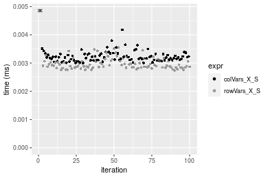
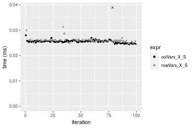
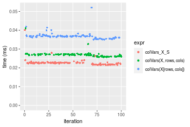
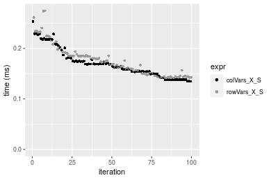
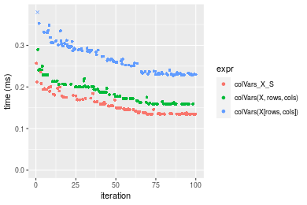

[matrixStats]: Benchmark report

---------------------------------------


# colVars() and rowVars() benchmarks  on subsetted computation

This report benchmark the performance of colVars() and rowVars() on subsetted computation.


## Data type "integer"

### Data
```r
> rmatrix <- function(nrow, ncol, mode = c("logical", "double", "integer", "index"), range = c(-100, 
+     +100), na_prob = 0) {
+     mode <- match.arg(mode)
+     n <- nrow * ncol
+     if (mode == "logical") {
+         x <- sample(c(FALSE, TRUE), size = n, replace = TRUE)
+     }     else if (mode == "index") {
+         x <- seq_len(n)
+         mode <- "integer"
+     }     else {
+         x <- runif(n, min = range[1], max = range[2])
+     }
+     storage.mode(x) <- mode
+     if (na_prob > 0) 
+         x[sample(n, size = na_prob * n)] <- NA
+     dim(x) <- c(nrow, ncol)
+     x
+ }
> rmatrices <- function(scale = 10, seed = 1, ...) {
+     set.seed(seed)
+     data <- list()
+     data[[1]] <- rmatrix(nrow = scale * 1, ncol = scale * 1, ...)
+     data[[2]] <- rmatrix(nrow = scale * 10, ncol = scale * 10, ...)
+     data[[3]] <- rmatrix(nrow = scale * 100, ncol = scale * 1, ...)
+     data[[4]] <- t(data[[3]])
+     data[[5]] <- rmatrix(nrow = scale * 10, ncol = scale * 100, ...)
+     data[[6]] <- t(data[[5]])
+     names(data) <- sapply(data, FUN = function(x) paste(dim(x), collapse = "x"))
+     data
+ }
> data <- rmatrices(mode = mode)
```

### Results

#### 10x10 integer matrix

```r
> X <- data[["10x10"]]
> rows <- sample.int(nrow(X), size = nrow(X) * 0.7)
> cols <- sample.int(ncol(X), size = ncol(X) * 0.7)
> X_S <- X[rows, cols]
> gc()
           used  (Mb) gc trigger  (Mb) max used  (Mb)
Ncells  5315968 284.0    7916910 422.9  7916910 422.9
Vcells 10429610  79.6   33191153 253.3 53339345 407.0
> colStats <- microbenchmark(colVars_X_S = colVars(X_S, na.rm = FALSE), `colVars(X, rows, cols)` = colVars(X, 
+     rows = rows, cols = cols, na.rm = FALSE), `colVars(X[rows, cols])` = colVars(X[rows, cols], na.rm = FALSE), 
+     unit = "ms")
> X <- t(X)
> X_S <- t(X_S)
> gc()
           used  (Mb) gc trigger  (Mb) max used  (Mb)
Ncells  5316390 284.0    7916910 422.9  7916910 422.9
Vcells 10430533  79.6   33191153 253.3 53339345 407.0
> rowStats <- microbenchmark(rowVars_X_S = rowVars(X_S, na.rm = FALSE), `rowVars(X, cols, rows)` = rowVars(X, 
+     rows = cols, cols = rows, na.rm = FALSE), `rowVars(X[cols, rows])` = rowVars(X[cols, rows], na.rm = FALSE), 
+     unit = "ms")
```

_Table: Benchmarking of colVars_X_S(), colVars(X, rows, cols)() and colVars(X[rows, cols])() on integer+10x10 data. The top panel shows times in milliseconds and the bottom panel shows relative times._


|   |expr                   |      min|        lq|      mean|    median|        uq|      max|
|:--|:----------------------|--------:|---------:|---------:|---------:|---------:|--------:|
|1  |colVars_X_S            | 0.002996| 0.0031055| 0.0083151| 0.0031975| 0.0033240| 0.510120|
|2  |colVars(X, rows, cols) | 0.003305| 0.0035035| 0.0036425| 0.0035870| 0.0036885| 0.006259|
|3  |colVars(X[rows, cols]) | 0.003954| 0.0042545| 0.0044993| 0.0043845| 0.0045575| 0.009257|


|   |expr                   |      min|       lq|      mean|   median|       uq|       max|
|:--|:----------------------|--------:|--------:|---------:|--------:|--------:|---------:|
|1  |colVars_X_S            | 1.000000| 1.000000| 1.0000000| 1.000000| 1.000000| 1.0000000|
|2  |colVars(X, rows, cols) | 1.103138| 1.128160| 0.4380649| 1.121814| 1.109657| 0.0122697|
|3  |colVars(X[rows, cols]) | 1.319760| 1.369989| 0.5410971| 1.371228| 1.371089| 0.0181467|

_Table: Benchmarking of rowVars_X_S(), rowVars(X, cols, rows)() and rowVars(X[cols, rows])() on integer+10x10 data (transposed). The top panel shows times in milliseconds and the bottom panel shows relative times._


|   |expr                   |      min|        lq|      mean|    median|        uq|      max|
|:--|:----------------------|--------:|---------:|---------:|---------:|---------:|--------:|
|1  |rowVars_X_S            | 0.002741| 0.0028430| 0.0030136| 0.0029265| 0.0030630| 0.005825|
|2  |rowVars(X, cols, rows) | 0.003071| 0.0032355| 0.0083125| 0.0033025| 0.0034435| 0.496545|
|3  |rowVars(X[cols, rows]) | 0.003704| 0.0040340| 0.0042579| 0.0041525| 0.0043310| 0.006269|


|   |expr                   |      min|       lq|     mean|   median|       uq|       max|
|:--|:----------------------|--------:|--------:|--------:|--------:|--------:|---------:|
|1  |rowVars_X_S            | 1.000000| 1.000000| 1.000000| 1.000000| 1.000000|  1.000000|
|2  |rowVars(X, cols, rows) | 1.120394| 1.138058| 2.758342| 1.128481| 1.124225| 85.243777|
|3  |rowVars(X[cols, rows]) | 1.351332| 1.418924| 1.412908| 1.418931| 1.413973|  1.076223|

_Figure: Benchmarking of colVars_X_S(), colVars(X, rows, cols)() and colVars(X[rows, cols])() on integer+10x10 data  as well as rowVars_X_S(), rowVars(X, cols, rows)() and rowVars(X[cols, rows])() on the same data transposed.  Outliers are displayed as crosses.  Times are in milliseconds._


_Table: Benchmarking of colVars_X_S() and rowVars_X_S() on integer+10x10 data (original and transposed).  The top panel shows times in milliseconds and the bottom panel shows relative times._


|   |expr        |   min|     lq|    mean| median|    uq|     max|
|:--|:-----------|-----:|------:|-------:|------:|-----:|-------:|
|2  |rowVars_X_S | 2.741| 2.8430| 3.01360| 2.9265| 3.063|   5.825|
|1  |colVars_X_S | 2.996| 3.1055| 8.31507| 3.1975| 3.324| 510.120|


|   |expr        |      min|       lq|     mean|   median|       uq|      max|
|:--|:-----------|--------:|--------:|--------:|--------:|--------:|--------:|
|2  |rowVars_X_S | 1.000000| 1.000000| 1.000000| 1.000000| 1.000000|  1.00000|
|1  |colVars_X_S | 1.093032| 1.092332| 2.759182| 1.092602| 1.085211| 87.57425|

_Figure: Benchmarking of colVars_X_S() and rowVars_X_S() on integer+10x10 data (original and transposed).  Outliers are displayed as crosses. Times are in milliseconds._




#### 100x100 integer matrix

```r
> X <- data[["100x100"]]
> rows <- sample.int(nrow(X), size = nrow(X) * 0.7)
> cols <- sample.int(ncol(X), size = ncol(X) * 0.7)
> X_S <- X[rows, cols]
> gc()
           used  (Mb) gc trigger  (Mb) max used  (Mb)
Ncells  5315967 284.0    7916910 422.9  7916910 422.9
Vcells 10267073  78.4   33191153 253.3 53339345 407.0
> colStats <- microbenchmark(colVars_X_S = colVars(X_S, na.rm = FALSE), `colVars(X, rows, cols)` = colVars(X, 
+     rows = rows, cols = cols, na.rm = FALSE), `colVars(X[rows, cols])` = colVars(X[rows, cols], na.rm = FALSE), 
+     unit = "ms")
> X <- t(X)
> X_S <- t(X_S)
> gc()
           used  (Mb) gc trigger  (Mb) max used  (Mb)
Ncells  5315961 284.0    7916910 422.9  7916910 422.9
Vcells 10272156  78.4   33191153 253.3 53339345 407.0
> rowStats <- microbenchmark(rowVars_X_S = rowVars(X_S, na.rm = FALSE), `rowVars(X, cols, rows)` = rowVars(X, 
+     rows = cols, cols = rows, na.rm = FALSE), `rowVars(X[cols, rows])` = rowVars(X[cols, rows], na.rm = FALSE), 
+     unit = "ms")
```

_Table: Benchmarking of colVars_X_S(), colVars(X, rows, cols)() and colVars(X[rows, cols])() on integer+100x100 data. The top panel shows times in milliseconds and the bottom panel shows relative times._


|   |expr                   |      min|        lq|      mean|    median|        uq|      max|
|:--|:----------------------|--------:|---------:|---------:|---------:|---------:|--------:|
|1  |colVars_X_S            | 0.024150| 0.0253210| 0.0255529| 0.0254975| 0.0257435| 0.030234|
|2  |colVars(X, rows, cols) | 0.029362| 0.0307755| 0.0310750| 0.0309940| 0.0311810| 0.034840|
|3  |colVars(X[rows, cols]) | 0.035164| 0.0369160| 0.0375777| 0.0371160| 0.0374005| 0.063691|


|   |expr                   |      min|       lq|     mean|   median|       uq|      max|
|:--|:----------------------|--------:|--------:|--------:|--------:|--------:|--------:|
|1  |colVars_X_S            | 1.000000| 1.000000| 1.000000| 1.000000| 1.000000| 1.000000|
|2  |colVars(X, rows, cols) | 1.215818| 1.215414| 1.216103| 1.215570| 1.211218| 1.152345|
|3  |colVars(X[rows, cols]) | 1.456066| 1.457920| 1.470584| 1.455672| 1.452813| 2.106602|

_Table: Benchmarking of rowVars_X_S(), rowVars(X, cols, rows)() and rowVars(X[cols, rows])() on integer+100x100 data (transposed). The top panel shows times in milliseconds and the bottom panel shows relative times._


|   |expr                   |      min|        lq|      mean|    median|        uq|      max|
|:--|:----------------------|--------:|---------:|---------:|---------:|---------:|--------:|
|1  |rowVars_X_S            | 0.024179| 0.0252515| 0.0256760| 0.0254990| 0.0256575| 0.039293|
|2  |rowVars(X, cols, rows) | 0.029276| 0.0306085| 0.0311094| 0.0307860| 0.0310290| 0.053463|
|3  |rowVars(X[cols, rows]) | 0.035119| 0.0367720| 0.0372225| 0.0370395| 0.0374575| 0.046052|


|   |expr                   |      min|       lq|     mean|   median|       uq|      max|
|:--|:----------------------|--------:|--------:|--------:|--------:|--------:|--------:|
|1  |rowVars_X_S            | 1.000000| 1.000000| 1.000000| 1.000000| 1.000000| 1.000000|
|2  |rowVars(X, cols, rows) | 1.210803| 1.212146| 1.211612| 1.207342| 1.209354| 1.360624|
|3  |rowVars(X[cols, rows]) | 1.452459| 1.456230| 1.449699| 1.452586| 1.459904| 1.172015|

_Figure: Benchmarking of colVars_X_S(), colVars(X, rows, cols)() and colVars(X[rows, cols])() on integer+100x100 data  as well as rowVars_X_S(), rowVars(X, cols, rows)() and rowVars(X[cols, rows])() on the same data transposed.  Outliers are displayed as crosses.  Times are in milliseconds._


_Table: Benchmarking of colVars_X_S() and rowVars_X_S() on integer+100x100 data (original and transposed).  The top panel shows times in milliseconds and the bottom panel shows relative times._


|   |expr        |    min|      lq|     mean|  median|      uq|    max|
|:--|:-----------|------:|-------:|--------:|-------:|-------:|------:|
|1  |colVars_X_S | 24.150| 25.3210| 25.55293| 25.4975| 25.7435| 30.234|
|2  |rowVars_X_S | 24.179| 25.2515| 25.67602| 25.4990| 25.6575| 39.293|


|   |expr        |      min|        lq|     mean|   median|        uq|     max|
|:--|:-----------|--------:|---------:|--------:|--------:|---------:|-------:|
|1  |colVars_X_S | 1.000000| 1.0000000| 1.000000| 1.000000| 1.0000000| 1.00000|
|2  |rowVars_X_S | 1.001201| 0.9972552| 1.004817| 1.000059| 0.9966594| 1.29963|

_Figure: Benchmarking of colVars_X_S() and rowVars_X_S() on integer+100x100 data (original and transposed).  Outliers are displayed as crosses. Times are in milliseconds._


#### 1000x10 integer matrix

```r
> X <- data[["1000x10"]]
> rows <- sample.int(nrow(X), size = nrow(X) * 0.7)
> cols <- sample.int(ncol(X), size = ncol(X) * 0.7)
> X_S <- X[rows, cols]
> gc()
           used  (Mb) gc trigger  (Mb) max used  (Mb)
Ncells  5316710 284.0    7916910 422.9  7916910 422.9
Vcells 10271118  78.4   33191153 253.3 53339345 407.0
> colStats <- microbenchmark(colVars_X_S = colVars(X_S, na.rm = FALSE), `colVars(X, rows, cols)` = colVars(X, 
+     rows = rows, cols = cols, na.rm = FALSE), `colVars(X[rows, cols])` = colVars(X[rows, cols], na.rm = FALSE), 
+     unit = "ms")
> X <- t(X)
> X_S <- t(X_S)
> gc()
           used  (Mb) gc trigger  (Mb) max used  (Mb)
Ncells  5316704 284.0    7916910 422.9  7916910 422.9
Vcells 10276201  78.5   33191153 253.3 53339345 407.0
> rowStats <- microbenchmark(rowVars_X_S = rowVars(X_S, na.rm = FALSE), `rowVars(X, cols, rows)` = rowVars(X, 
+     rows = cols, cols = rows, na.rm = FALSE), `rowVars(X[cols, rows])` = rowVars(X[cols, rows], na.rm = FALSE), 
+     unit = "ms")
```

_Table: Benchmarking of colVars_X_S(), colVars(X, rows, cols)() and colVars(X[rows, cols])() on integer+1000x10 data. The top panel shows times in milliseconds and the bottom panel shows relative times._


|   |expr                   |      min|        lq|      mean|    median|        uq|      max|
|:--|:----------------------|--------:|---------:|---------:|---------:|---------:|--------:|
|1  |colVars_X_S            | 0.024386| 0.0253165| 0.0256845| 0.0255720| 0.0257905| 0.040170|
|2  |colVars(X, rows, cols) | 0.031258| 0.0320355| 0.0327295| 0.0328350| 0.0331220| 0.036915|
|3  |colVars(X[rows, cols]) | 0.036055| 0.0367400| 0.0382142| 0.0379035| 0.0382455| 0.069507|


|   |expr                   |      min|       lq|     mean|   median|       uq|       max|
|:--|:----------------------|--------:|--------:|--------:|--------:|--------:|---------:|
|1  |colVars_X_S            | 1.000000| 1.000000| 1.000000| 1.000000| 1.000000| 1.0000000|
|2  |colVars(X, rows, cols) | 1.281801| 1.265400| 1.274287| 1.284022| 1.284271| 0.9189694|
|3  |colVars(X[rows, cols]) | 1.478512| 1.451227| 1.487828| 1.482227| 1.482930| 1.7303211|

_Table: Benchmarking of rowVars_X_S(), rowVars(X, cols, rows)() and rowVars(X[cols, rows])() on integer+1000x10 data (transposed). The top panel shows times in milliseconds and the bottom panel shows relative times._


|   |expr                   |      min|        lq|      mean|    median|        uq|      max|
|:--|:----------------------|--------:|---------:|---------:|---------:|---------:|--------:|
|1  |rowVars_X_S            | 0.024499| 0.0255240| 0.0258598| 0.0257950| 0.0260610| 0.031339|
|2  |rowVars(X, cols, rows) | 0.031218| 0.0327590| 0.0331585| 0.0329710| 0.0332670| 0.047721|
|3  |rowVars(X[cols, rows]) | 0.037884| 0.0397035| 0.0403844| 0.0399855| 0.0404155| 0.071252|


|   |expr                   |      min|       lq|     mean|   median|       uq|      max|
|:--|:----------------------|--------:|--------:|--------:|--------:|--------:|--------:|
|1  |rowVars_X_S            | 1.000000| 1.000000| 1.000000| 1.000000| 1.000000| 1.000000|
|2  |rowVars(X, cols, rows) | 1.274256| 1.283459| 1.282239| 1.278193| 1.276505| 1.522735|
|3  |rowVars(X[cols, rows]) | 1.546349| 1.555536| 1.561667| 1.550126| 1.550804| 2.273589|

_Figure: Benchmarking of colVars_X_S(), colVars(X, rows, cols)() and colVars(X[rows, cols])() on integer+1000x10 data  as well as rowVars_X_S(), rowVars(X, cols, rows)() and rowVars(X[cols, rows])() on the same data transposed.  Outliers are displayed as crosses.  Times are in milliseconds._


_Table: Benchmarking of colVars_X_S() and rowVars_X_S() on integer+1000x10 data (original and transposed).  The top panel shows times in milliseconds and the bottom panel shows relative times._


|   |expr        |    min|      lq|     mean| median|      uq|    max|
|:--|:-----------|------:|-------:|--------:|------:|-------:|------:|
|1  |colVars_X_S | 24.386| 25.3165| 25.68454| 25.572| 25.7905| 40.170|
|2  |rowVars_X_S | 24.499| 25.5240| 25.85982| 25.795| 26.0610| 31.339|


|   |expr        |      min|       lq|     mean|  median|       uq|       max|
|:--|:-----------|--------:|--------:|--------:|-------:|--------:|---------:|
|1  |colVars_X_S | 1.000000| 1.000000| 1.000000| 1.00000| 1.000000| 1.0000000|
|2  |rowVars_X_S | 1.004634| 1.008196| 1.006824| 1.00872| 1.010488| 0.7801593|

_Figure: Benchmarking of colVars_X_S() and rowVars_X_S() on integer+1000x10 data (original and transposed).  Outliers are displayed as crosses. Times are in milliseconds._




#### 10x1000 integer matrix

```r
> X <- data[["10x1000"]]
> rows <- sample.int(nrow(X), size = nrow(X) * 0.7)
> cols <- sample.int(ncol(X), size = ncol(X) * 0.7)
> X_S <- X[rows, cols]
> gc()
           used  (Mb) gc trigger  (Mb) max used  (Mb)
Ncells  5316915 284.0    7916910 422.9  7916910 422.9
Vcells 10271939  78.4   33191153 253.3 53339345 407.0
> colStats <- microbenchmark(colVars_X_S = colVars(X_S, na.rm = FALSE), `colVars(X, rows, cols)` = colVars(X, 
+     rows = rows, cols = cols, na.rm = FALSE), `colVars(X[rows, cols])` = colVars(X[rows, cols], na.rm = FALSE), 
+     unit = "ms")
> X <- t(X)
> X_S <- t(X_S)
> gc()
           used  (Mb) gc trigger  (Mb) max used  (Mb)
Ncells  5316909 284.0    7916910 422.9  7916910 422.9
Vcells 10277022  78.5   33191153 253.3 53339345 407.0
> rowStats <- microbenchmark(rowVars_X_S = rowVars(X_S, na.rm = FALSE), `rowVars(X, cols, rows)` = rowVars(X, 
+     rows = cols, cols = rows, na.rm = FALSE), `rowVars(X[cols, rows])` = rowVars(X[cols, rows], na.rm = FALSE), 
+     unit = "ms")
```

_Table: Benchmarking of colVars_X_S(), colVars(X, rows, cols)() and colVars(X[rows, cols])() on integer+10x1000 data. The top panel shows times in milliseconds and the bottom panel shows relative times._


|   |expr                   |      min|        lq|      mean|   median|        uq|      max|
|:--|:----------------------|--------:|---------:|---------:|--------:|---------:|--------:|
|1  |colVars_X_S            | 0.021486| 0.0220195| 0.0227127| 0.022545| 0.0227620| 0.040133|
|2  |colVars(X, rows, cols) | 0.025663| 0.0262320| 0.0269804| 0.026949| 0.0272050| 0.041030|
|3  |colVars(X[rows, cols]) | 0.035093| 0.0363305| 0.0369267| 0.036759| 0.0370505| 0.052079|


|   |expr                   |      min|       lq|     mean|   median|       uq|      max|
|:--|:----------------------|--------:|--------:|--------:|--------:|--------:|--------:|
|1  |colVars_X_S            | 1.000000| 1.000000| 1.000000| 1.000000| 1.000000| 1.000000|
|2  |colVars(X, rows, cols) | 1.194406| 1.191308| 1.187902| 1.195343| 1.195194| 1.022351|
|3  |colVars(X[rows, cols]) | 1.633296| 1.649924| 1.625821| 1.630472| 1.627735| 1.297660|

_Table: Benchmarking of rowVars_X_S(), rowVars(X, cols, rows)() and rowVars(X[cols, rows])() on integer+10x1000 data (transposed). The top panel shows times in milliseconds and the bottom panel shows relative times._


|   |expr                   |      min|        lq|      mean|    median|        uq|      max|
|:--|:----------------------|--------:|---------:|---------:|---------:|---------:|--------:|
|1  |rowVars_X_S            | 0.021820| 0.0223550| 0.0226583| 0.0225970| 0.0227665| 0.028222|
|2  |rowVars(X, cols, rows) | 0.025211| 0.0262825| 0.0266944| 0.0264455| 0.0265860| 0.049835|
|3  |rowVars(X[cols, rows]) | 0.033507| 0.0345830| 0.0351577| 0.0347945| 0.0350715| 0.049411|


|   |expr                   |      min|       lq|     mean|   median|       uq|      max|
|:--|:----------------------|--------:|--------:|--------:|--------:|--------:|--------:|
|1  |rowVars_X_S            | 1.000000| 1.000000| 1.000000| 1.000000| 1.000000| 1.000000|
|2  |rowVars(X, cols, rows) | 1.155408| 1.175688| 1.178132| 1.170310| 1.167768| 1.765821|
|3  |rowVars(X[cols, rows]) | 1.535610| 1.546992| 1.551650| 1.539784| 1.540487| 1.750797|

_Figure: Benchmarking of colVars_X_S(), colVars(X, rows, cols)() and colVars(X[rows, cols])() on integer+10x1000 data  as well as rowVars_X_S(), rowVars(X, cols, rows)() and rowVars(X[cols, rows])() on the same data transposed.  Outliers are displayed as crosses.  Times are in milliseconds._





_Table: Benchmarking of colVars_X_S() and rowVars_X_S() on integer+10x1000 data (original and transposed).  The top panel shows times in milliseconds and the bottom panel shows relative times._


|   |expr        |    min|      lq|     mean| median|      uq|    max|
|:--|:-----------|------:|-------:|--------:|------:|-------:|------:|
|1  |colVars_X_S | 21.486| 22.0195| 22.71267| 22.545| 22.7620| 40.133|
|2  |rowVars_X_S | 21.820| 22.3550| 22.65826| 22.597| 22.7665| 28.222|


|   |expr        |      min|       lq|      mean|   median|       uq|       max|
|:--|:-----------|--------:|--------:|---------:|--------:|--------:|---------:|
|1  |colVars_X_S | 1.000000| 1.000000| 1.0000000| 1.000000| 1.000000| 1.0000000|
|2  |rowVars_X_S | 1.015545| 1.015237| 0.9976044| 1.002306| 1.000198| 0.7032118|

_Figure: Benchmarking of colVars_X_S() and rowVars_X_S() on integer+10x1000 data (original and transposed).  Outliers are displayed as crosses. Times are in milliseconds._


#### 100x1000 integer matrix

```r
> X <- data[["100x1000"]]
> rows <- sample.int(nrow(X), size = nrow(X) * 0.7)
> cols <- sample.int(ncol(X), size = ncol(X) * 0.7)
> X_S <- X[rows, cols]
> gc()
           used  (Mb) gc trigger  (Mb) max used  (Mb)
Ncells  5317125 284.0    7916910 422.9  7916910 422.9
Vcells 10294603  78.6   33191153 253.3 53339345 407.0
> colStats <- microbenchmark(colVars_X_S = colVars(X_S, na.rm = FALSE), `colVars(X, rows, cols)` = colVars(X, 
+     rows = rows, cols = cols, na.rm = FALSE), `colVars(X[rows, cols])` = colVars(X[rows, cols], na.rm = FALSE), 
+     unit = "ms")
> X <- t(X)
> X_S <- t(X_S)
> gc()
           used (Mb) gc trigger  (Mb) max used  (Mb)
Ncells  5317119  284    7916910 422.9  7916910 422.9
Vcells 10344686   79   33191153 253.3 53339345 407.0
> rowStats <- microbenchmark(rowVars_X_S = rowVars(X_S, na.rm = FALSE), `rowVars(X, cols, rows)` = rowVars(X, 
+     rows = cols, cols = rows, na.rm = FALSE), `rowVars(X[cols, rows])` = rowVars(X[cols, rows], na.rm = FALSE), 
+     unit = "ms")
```

_Table: Benchmarking of colVars_X_S(), colVars(X, rows, cols)() and colVars(X[rows, cols])() on integer+100x1000 data. The top panel shows times in milliseconds and the bottom panel shows relative times._


|   |expr                   |      min|        lq|      mean|    median|        uq|      max|
|:--|:----------------------|--------:|---------:|---------:|---------:|---------:|--------:|
|1  |colVars_X_S            | 0.135788| 0.1437275| 0.1670480| 0.1615510| 0.1781215| 0.267460|
|2  |colVars(X, rows, cols) | 0.166957| 0.1791220| 0.2068173| 0.1990500| 0.2243935| 0.328832|
|3  |colVars(X[rows, cols]) | 0.201073| 0.2188630| 0.2538005| 0.2536735| 0.2739465| 0.341326|


|   |expr                   |      min|       lq|     mean|   median|       uq|      max|
|:--|:----------------------|--------:|--------:|--------:|--------:|--------:|--------:|
|1  |colVars_X_S            | 1.000000| 1.000000| 1.000000| 1.000000| 1.000000| 1.000000|
|2  |colVars(X, rows, cols) | 1.229542| 1.246261| 1.238071| 1.232119| 1.259778| 1.229462|
|3  |colVars(X[rows, cols]) | 1.480786| 1.522764| 1.519327| 1.570238| 1.537975| 1.276176|

_Table: Benchmarking of rowVars_X_S(), rowVars(X, cols, rows)() and rowVars(X[cols, rows])() on integer+100x1000 data (transposed). The top panel shows times in milliseconds and the bottom panel shows relative times._


|   |expr                   |      min|        lq|      mean|    median|        uq|      max|
|:--|:----------------------|--------:|---------:|---------:|---------:|---------:|--------:|
|1  |rowVars_X_S            | 0.140776| 0.1637365| 0.1858897| 0.1779630| 0.2080810| 0.297697|
|2  |rowVars(X, cols, rows) | 0.171698| 0.1867210| 0.2156959| 0.2040930| 0.2348995| 0.324998|
|3  |rowVars(X[cols, rows]) | 0.205929| 0.2304635| 0.2657976| 0.2555855| 0.2954105| 0.380141|


|   |expr                   |      min|       lq|     mean|   median|       uq|      max|
|:--|:----------------------|--------:|--------:|--------:|--------:|--------:|--------:|
|1  |rowVars_X_S            | 1.000000| 1.000000| 1.000000| 1.000000| 1.000000| 1.000000|
|2  |rowVars(X, cols, rows) | 1.219654| 1.140375| 1.160343| 1.146828| 1.128885| 1.091707|
|3  |rowVars(X[cols, rows]) | 1.462813| 1.407527| 1.429867| 1.436172| 1.419690| 1.276939|

_Figure: Benchmarking of colVars_X_S(), colVars(X, rows, cols)() and colVars(X[rows, cols])() on integer+100x1000 data  as well as rowVars_X_S(), rowVars(X, cols, rows)() and rowVars(X[cols, rows])() on the same data transposed.  Outliers are displayed as crosses.  Times are in milliseconds._


_Table: Benchmarking of colVars_X_S() and rowVars_X_S() on integer+100x1000 data (original and transposed).  The top panel shows times in milliseconds and the bottom panel shows relative times._


|   |expr        |     min|       lq|     mean|  median|       uq|     max|
|:--|:-----------|-------:|--------:|--------:|-------:|--------:|-------:|
|1  |colVars_X_S | 135.788| 143.7275| 167.0480| 161.551| 178.1215| 267.460|
|2  |rowVars_X_S | 140.776| 163.7365| 185.8897| 177.963| 208.0810| 297.697|


|   |expr        |      min|       lq|     mean|  median|       uq|      max|
|:--|:-----------|--------:|--------:|--------:|-------:|--------:|--------:|
|1  |colVars_X_S | 1.000000| 1.000000| 1.000000| 1.00000| 1.000000| 1.000000|
|2  |rowVars_X_S | 1.036734| 1.139215| 1.112792| 1.10159| 1.168197| 1.113052|

_Figure: Benchmarking of colVars_X_S() and rowVars_X_S() on integer+100x1000 data (original and transposed).  Outliers are displayed as crosses. Times are in milliseconds._


#### 1000x100 integer matrix

```r
> X <- data[["1000x100"]]
> rows <- sample.int(nrow(X), size = nrow(X) * 0.7)
> cols <- sample.int(ncol(X), size = ncol(X) * 0.7)
> X_S <- X[rows, cols]
> gc()
           used  (Mb) gc trigger  (Mb) max used  (Mb)
Ncells  5317338 284.0    7916910 422.9  7916910 422.9
Vcells 10295375  78.6   33191153 253.3 53339345 407.0
> colStats <- microbenchmark(colVars_X_S = colVars(X_S, na.rm = FALSE), `colVars(X, rows, cols)` = colVars(X, 
+     rows = rows, cols = cols, na.rm = FALSE), `colVars(X[rows, cols])` = colVars(X[rows, cols], na.rm = FALSE), 
+     unit = "ms")
> X <- t(X)
> X_S <- t(X_S)
> gc()
           used (Mb) gc trigger  (Mb) max used  (Mb)
Ncells  5317332  284    7916910 422.9  7916910 422.9
Vcells 10345458   79   33191153 253.3 53339345 407.0
> rowStats <- microbenchmark(rowVars_X_S = rowVars(X_S, na.rm = FALSE), `rowVars(X, cols, rows)` = rowVars(X, 
+     rows = cols, cols = rows, na.rm = FALSE), `rowVars(X[cols, rows])` = rowVars(X[cols, rows], na.rm = FALSE), 
+     unit = "ms")
```

_Table: Benchmarking of colVars_X_S(), colVars(X, rows, cols)() and colVars(X[rows, cols])() on integer+1000x100 data. The top panel shows times in milliseconds and the bottom panel shows relative times._


|   |expr                   |      min|        lq|      mean|    median|        uq|      max|
|:--|:----------------------|--------:|---------:|---------:|---------:|---------:|--------:|
|1  |colVars_X_S            | 0.134803| 0.1498905| 0.1700042| 0.1662400| 0.1788595| 0.253420|
|2  |colVars(X, rows, cols) | 0.173275| 0.1938410| 0.2202575| 0.2136795| 0.2329120| 0.294639|
|3  |colVars(X[rows, cols]) | 0.198332| 0.2227520| 0.2586391| 0.2508515| 0.2957285| 0.389228|


|   |expr                   |      min|       lq|     mean|   median|       uq|      max|
|:--|:----------------------|--------:|--------:|--------:|--------:|--------:|--------:|
|1  |colVars_X_S            | 1.000000| 1.000000| 1.000000| 1.000000| 1.000000| 1.000000|
|2  |colVars(X, rows, cols) | 1.285394| 1.293217| 1.295600| 1.285367| 1.302207| 1.162651|
|3  |colVars(X[rows, cols]) | 1.471273| 1.486098| 1.521369| 1.508972| 1.653412| 1.535901|

_Table: Benchmarking of rowVars_X_S(), rowVars(X, cols, rows)() and rowVars(X[cols, rows])() on integer+1000x100 data (transposed). The top panel shows times in milliseconds and the bottom panel shows relative times._


|   |expr                   |      min|        lq|      mean|    median|        uq|      max|
|:--|:----------------------|--------:|---------:|---------:|---------:|---------:|--------:|
|1  |rowVars_X_S            | 0.141428| 0.1494505| 0.1751160| 0.1688165| 0.1857015| 0.274657|
|2  |rowVars(X, cols, rows) | 0.170140| 0.1856750| 0.2111888| 0.2078530| 0.2224045| 0.351097|
|3  |rowVars(X[cols, rows]) | 0.208161| 0.2226370| 0.2610418| 0.2510985| 0.2830970| 0.402421|


|   |expr                   |      min|       lq|     mean|   median|       uq|      max|
|:--|:----------------------|--------:|--------:|--------:|--------:|--------:|--------:|
|1  |rowVars_X_S            | 1.000000| 1.000000| 1.000000| 1.000000| 1.000000| 1.000000|
|2  |rowVars(X, cols, rows) | 1.203015| 1.242385| 1.205993| 1.231236| 1.197645| 1.278311|
|3  |rowVars(X[cols, rows]) | 1.471851| 1.489704| 1.490679| 1.487405| 1.524473| 1.465177|

_Figure: Benchmarking of colVars_X_S(), colVars(X, rows, cols)() and colVars(X[rows, cols])() on integer+1000x100 data  as well as rowVars_X_S(), rowVars(X, cols, rows)() and rowVars(X[cols, rows])() on the same data transposed.  Outliers are displayed as crosses.  Times are in milliseconds._


_Table: Benchmarking of colVars_X_S() and rowVars_X_S() on integer+1000x100 data (original and transposed).  The top panel shows times in milliseconds and the bottom panel shows relative times._


|   |expr        |     min|       lq|     mean|   median|       uq|     max|
|:--|:-----------|-------:|--------:|--------:|--------:|--------:|-------:|
|1  |colVars_X_S | 134.803| 149.8905| 170.0042| 166.2400| 178.8595| 253.420|
|2  |rowVars_X_S | 141.428| 149.4505| 175.1160| 168.8165| 185.7015| 274.657|


|   |expr        |      min|        lq|     mean|   median|       uq|      max|
|:--|:-----------|--------:|---------:|--------:|--------:|--------:|--------:|
|1  |colVars_X_S | 1.000000| 1.0000000| 1.000000| 1.000000| 1.000000| 1.000000|
|2  |rowVars_X_S | 1.049146| 0.9970645| 1.030069| 1.015499| 1.038253| 1.083802|

_Figure: Benchmarking of colVars_X_S() and rowVars_X_S() on integer+1000x100 data (original and transposed).  Outliers are displayed as crosses. Times are in milliseconds._





## Data type "double"

### Data
```r
> rmatrix <- function(nrow, ncol, mode = c("logical", "double", "integer", "index"), range = c(-100, 
+     +100), na_prob = 0) {
+     mode <- match.arg(mode)
+     n <- nrow * ncol
+     if (mode == "logical") {
+         x <- sample(c(FALSE, TRUE), size = n, replace = TRUE)
+     }     else if (mode == "index") {
+         x <- seq_len(n)
+         mode <- "integer"
+     }     else {
+         x <- runif(n, min = range[1], max = range[2])
+     }
+     storage.mode(x) <- mode
+     if (na_prob > 0) 
+         x[sample(n, size = na_prob * n)] <- NA
+     dim(x) <- c(nrow, ncol)
+     x
+ }
> rmatrices <- function(scale = 10, seed = 1, ...) {
+     set.seed(seed)
+     data <- list()
+     data[[1]] <- rmatrix(nrow = scale * 1, ncol = scale * 1, ...)
+     data[[2]] <- rmatrix(nrow = scale * 10, ncol = scale * 10, ...)
+     data[[3]] <- rmatrix(nrow = scale * 100, ncol = scale * 1, ...)
+     data[[4]] <- t(data[[3]])
+     data[[5]] <- rmatrix(nrow = scale * 10, ncol = scale * 100, ...)
+     data[[6]] <- t(data[[5]])
+     names(data) <- sapply(data, FUN = function(x) paste(dim(x), collapse = "x"))
+     data
+ }
> data <- rmatrices(mode = mode)
```

### Results

#### 10x10 double matrix

```r
> X <- data[["10x10"]]
> rows <- sample.int(nrow(X), size = nrow(X) * 0.7)
> cols <- sample.int(ncol(X), size = ncol(X) * 0.7)
> X_S <- X[rows, cols]
> gc()
           used  (Mb) gc trigger  (Mb) max used  (Mb)
Ncells  5317555 284.0    7916910 422.9  7916910 422.9
Vcells 10386469  79.3   33191153 253.3 53339345 407.0
> colStats <- microbenchmark(colVars_X_S = colVars(X_S, na.rm = FALSE), `colVars(X, rows, cols)` = colVars(X, 
+     rows = rows, cols = cols, na.rm = FALSE), `colVars(X[rows, cols])` = colVars(X[rows, cols], na.rm = FALSE), 
+     unit = "ms")
> X <- t(X)
> X_S <- t(X_S)
> gc()
           used  (Mb) gc trigger  (Mb) max used  (Mb)
Ncells  5317540 284.0    7916910 422.9  7916910 422.9
Vcells 10386637  79.3   33191153 253.3 53339345 407.0
> rowStats <- microbenchmark(rowVars_X_S = rowVars(X_S, na.rm = FALSE), `rowVars(X, cols, rows)` = rowVars(X, 
+     rows = cols, cols = rows, na.rm = FALSE), `rowVars(X[cols, rows])` = rowVars(X[cols, rows], na.rm = FALSE), 
+     unit = "ms")
```

_Table: Benchmarking of colVars_X_S(), colVars(X, rows, cols)() and colVars(X[rows, cols])() on double+10x10 data. The top panel shows times in milliseconds and the bottom panel shows relative times._


|   |expr                   |      min|        lq|      mean|    median|        uq|      max|
|:--|:----------------------|--------:|---------:|---------:|---------:|---------:|--------:|
|1  |colVars_X_S            | 0.002941| 0.0030445| 0.0033402| 0.0031285| 0.0032245| 0.020661|
|2  |colVars(X, rows, cols) | 0.003281| 0.0034340| 0.0035758| 0.0035030| 0.0036475| 0.006322|
|3  |colVars(X[rows, cols]) | 0.003978| 0.0042520| 0.0044528| 0.0043470| 0.0045080| 0.009741|


|   |expr                   |      min|       lq|     mean|   median|       uq|       max|
|:--|:----------------------|--------:|--------:|--------:|--------:|--------:|---------:|
|1  |colVars_X_S            | 1.000000| 1.000000| 1.000000| 1.000000| 1.000000| 1.0000000|
|2  |colVars(X, rows, cols) | 1.115607| 1.127936| 1.070510| 1.119706| 1.131183| 0.3059871|
|3  |colVars(X[rows, cols]) | 1.352601| 1.396617| 1.333086| 1.389484| 1.398046| 0.4714680|

_Table: Benchmarking of rowVars_X_S(), rowVars(X, cols, rows)() and rowVars(X[cols, rows])() on double+10x10 data (transposed). The top panel shows times in milliseconds and the bottom panel shows relative times._


|   |expr                   |      min|        lq|      mean|    median|        uq|      max|
|:--|:----------------------|--------:|---------:|---------:|---------:|---------:|--------:|
|1  |rowVars_X_S            | 0.002851| 0.0029435| 0.0030763| 0.0030415| 0.0031275| 0.005381|
|2  |rowVars(X, cols, rows) | 0.003176| 0.0033060| 0.0036192| 0.0033945| 0.0034865| 0.021488|
|3  |rowVars(X[cols, rows]) | 0.003923| 0.0041495| 0.0043146| 0.0042590| 0.0043950| 0.007144|


|   |expr                   |      min|       lq|     mean|   median|       uq|      max|
|:--|:----------------------|--------:|--------:|--------:|--------:|--------:|--------:|
|1  |rowVars_X_S            | 1.000000| 1.000000| 1.000000| 1.000000| 1.000000| 1.000000|
|2  |rowVars(X, cols, rows) | 1.113995| 1.123153| 1.176449| 1.116061| 1.114788| 3.993310|
|3  |rowVars(X[cols, rows]) | 1.376008| 1.409716| 1.402516| 1.400296| 1.405276| 1.327634|

_Figure: Benchmarking of colVars_X_S(), colVars(X, rows, cols)() and colVars(X[rows, cols])() on double+10x10 data  as well as rowVars_X_S(), rowVars(X, cols, rows)() and rowVars(X[cols, rows])() on the same data transposed.  Outliers are displayed as crosses.  Times are in milliseconds._


_Table: Benchmarking of colVars_X_S() and rowVars_X_S() on double+10x10 data (original and transposed).  The top panel shows times in milliseconds and the bottom panel shows relative times._


|   |expr        |   min|     lq|    mean| median|     uq|    max|
|:--|:-----------|-----:|------:|-------:|------:|------:|------:|
|2  |rowVars_X_S | 2.851| 2.9435| 3.07635| 3.0415| 3.1275|  5.381|
|1  |colVars_X_S | 2.941| 3.0445| 3.34025| 3.1285| 3.2245| 20.661|


|   |expr        |      min|       lq|     mean|   median|       uq|      max|
|:--|:-----------|--------:|--------:|--------:|--------:|--------:|--------:|
|2  |rowVars_X_S | 1.000000| 1.000000| 1.000000| 1.000000| 1.000000| 1.000000|
|1  |colVars_X_S | 1.031568| 1.034313| 1.085784| 1.028604| 1.031015| 3.839621|

_Figure: Benchmarking of colVars_X_S() and rowVars_X_S() on double+10x10 data (original and transposed).  Outliers are displayed as crosses. Times are in milliseconds._


#### 100x100 double matrix

```r
> X <- data[["100x100"]]
> rows <- sample.int(nrow(X), size = nrow(X) * 0.7)
> cols <- sample.int(ncol(X), size = ncol(X) * 0.7)
> X_S <- X[rows, cols]
> gc()
           used  (Mb) gc trigger  (Mb) max used  (Mb)
Ncells  5317752 284.0    7916910 422.9  7916910 422.9
Vcells 10392409  79.3   33191153 253.3 53339345 407.0
> colStats <- microbenchmark(colVars_X_S = colVars(X_S, na.rm = FALSE), `colVars(X, rows, cols)` = colVars(X, 
+     rows = rows, cols = cols, na.rm = FALSE), `colVars(X[rows, cols])` = colVars(X[rows, cols], na.rm = FALSE), 
+     unit = "ms")
> X <- t(X)
> X_S <- t(X_S)
> gc()
           used  (Mb) gc trigger  (Mb) max used  (Mb)
Ncells  5317746 284.0    7916910 422.9  7916910 422.9
Vcells 10402492  79.4   33191153 253.3 53339345 407.0
> rowStats <- microbenchmark(rowVars_X_S = rowVars(X_S, na.rm = FALSE), `rowVars(X, cols, rows)` = rowVars(X, 
+     rows = cols, cols = rows, na.rm = FALSE), `rowVars(X[cols, rows])` = rowVars(X[cols, rows], na.rm = FALSE), 
+     unit = "ms")
```

_Table: Benchmarking of colVars_X_S(), colVars(X, rows, cols)() and colVars(X[rows, cols])() on double+100x100 data. The top panel shows times in milliseconds and the bottom panel shows relative times._


|   |expr                   |      min|        lq|      mean|    median|        uq|      max|
|:--|:----------------------|--------:|---------:|---------:|---------:|---------:|--------:|
|1  |colVars_X_S            | 0.023045| 0.0245195| 0.0258874| 0.0253020| 0.0257385| 0.035858|
|2  |colVars(X, rows, cols) | 0.027047| 0.0286425| 0.0299959| 0.0295650| 0.0300535| 0.044131|
|3  |colVars(X[rows, cols]) | 0.038158| 0.0405040| 0.0431743| 0.0418045| 0.0425550| 0.102749|


|   |expr                   |      min|       lq|     mean|   median|       uq|      max|
|:--|:----------------------|--------:|--------:|--------:|--------:|--------:|--------:|
|1  |colVars_X_S            | 1.000000| 1.000000| 1.000000| 1.000000| 1.000000| 1.000000|
|2  |colVars(X, rows, cols) | 1.173660| 1.168152| 1.158708| 1.168485| 1.167648| 1.230716|
|3  |colVars(X[rows, cols]) | 1.655804| 1.651910| 1.667776| 1.652221| 1.653360| 2.865442|

_Table: Benchmarking of rowVars_X_S(), rowVars(X, cols, rows)() and rowVars(X[cols, rows])() on double+100x100 data (transposed). The top panel shows times in milliseconds and the bottom panel shows relative times._


|   |expr                   |      min|        lq|      mean|   median|        uq|      max|
|:--|:----------------------|--------:|---------:|---------:|--------:|---------:|--------:|
|1  |rowVars_X_S            | 0.023600| 0.0248735| 0.0252401| 0.025161| 0.0255150| 0.034608|
|2  |rowVars(X, cols, rows) | 0.027479| 0.0291225| 0.0296758| 0.029403| 0.0296470| 0.054451|
|3  |rowVars(X[cols, rows]) | 0.039345| 0.0413930| 0.0416192| 0.041707| 0.0419975| 0.045960|


|   |expr                   |      min|       lq|     mean|   median|       uq|      max|
|:--|:----------------------|--------:|--------:|--------:|--------:|--------:|--------:|
|1  |rowVars_X_S            | 1.000000| 1.000000| 1.000000| 1.000000| 1.000000| 1.000000|
|2  |rowVars(X, cols, rows) | 1.164364| 1.170824| 1.175737| 1.168594| 1.161944| 1.573365|
|3  |rowVars(X[cols, rows]) | 1.667161| 1.664141| 1.648931| 1.657605| 1.645993| 1.328017|

_Figure: Benchmarking of colVars_X_S(), colVars(X, rows, cols)() and colVars(X[rows, cols])() on double+100x100 data  as well as rowVars_X_S(), rowVars(X, cols, rows)() and rowVars(X[cols, rows])() on the same data transposed.  Outliers are displayed as crosses.  Times are in milliseconds._


_Table: Benchmarking of colVars_X_S() and rowVars_X_S() on double+100x100 data (original and transposed).  The top panel shows times in milliseconds and the bottom panel shows relative times._


|   |expr        |    min|      lq|     mean| median|      uq|    max|
|:--|:-----------|------:|-------:|--------:|------:|-------:|------:|
|2  |rowVars_X_S | 23.600| 24.8735| 25.24014| 25.161| 25.5150| 34.608|
|1  |colVars_X_S | 23.045| 24.5195| 25.88736| 25.302| 25.7385| 35.858|


|   |expr        |       min|       lq|     mean|   median|      uq|      max|
|:--|:-----------|---------:|--------:|--------:|--------:|-------:|--------:|
|2  |rowVars_X_S | 1.0000000| 1.000000| 1.000000| 1.000000| 1.00000| 1.000000|
|1  |colVars_X_S | 0.9764831| 0.985768| 1.025643| 1.005604| 1.00876| 1.036119|

_Figure: Benchmarking of colVars_X_S() and rowVars_X_S() on double+100x100 data (original and transposed).  Outliers are displayed as crosses. Times are in milliseconds._


#### 1000x10 double matrix

```r
> X <- data[["1000x10"]]
> rows <- sample.int(nrow(X), size = nrow(X) * 0.7)
> cols <- sample.int(ncol(X), size = ncol(X) * 0.7)
> X_S <- X[rows, cols]
> gc()
           used  (Mb) gc trigger  (Mb) max used  (Mb)
Ncells  5317952 284.1    7916910 422.9  7916910 422.9
Vcells 10393807  79.3   33191153 253.3 53339345 407.0
> colStats <- microbenchmark(colVars_X_S = colVars(X_S, na.rm = FALSE), `colVars(X, rows, cols)` = colVars(X, 
+     rows = rows, cols = cols, na.rm = FALSE), `colVars(X[rows, cols])` = colVars(X[rows, cols], na.rm = FALSE), 
+     unit = "ms")
> X <- t(X)
> X_S <- t(X_S)
> gc()
           used  (Mb) gc trigger  (Mb) max used  (Mb)
Ncells  5317946 284.1    7916910 422.9  7916910 422.9
Vcells 10403890  79.4   33191153 253.3 53339345 407.0
> rowStats <- microbenchmark(rowVars_X_S = rowVars(X_S, na.rm = FALSE), `rowVars(X, cols, rows)` = rowVars(X, 
+     rows = cols, cols = rows, na.rm = FALSE), `rowVars(X[cols, rows])` = rowVars(X[cols, rows], na.rm = FALSE), 
+     unit = "ms")
```

_Table: Benchmarking of colVars_X_S(), colVars(X, rows, cols)() and colVars(X[rows, cols])() on double+1000x10 data. The top panel shows times in milliseconds and the bottom panel shows relative times._


|   |expr                   |      min|        lq|      mean|    median|        uq|      max|
|:--|:----------------------|--------:|---------:|---------:|---------:|---------:|--------:|
|1  |colVars_X_S            | 0.023712| 0.0252370| 0.0258779| 0.0258715| 0.0261655| 0.040127|
|2  |colVars(X, rows, cols) | 0.028639| 0.0300545| 0.0311840| 0.0312885| 0.0315815| 0.044304|
|3  |colVars(X[rows, cols]) | 0.039557| 0.0409205| 0.0425105| 0.0428190| 0.0434400| 0.073608|


|   |expr                   |      min|       lq|     mean|   median|       uq|      max|
|:--|:----------------------|--------:|--------:|--------:|--------:|--------:|--------:|
|1  |colVars_X_S            | 1.000000| 1.000000| 1.000000| 1.000000| 1.000000| 1.000000|
|2  |colVars(X, rows, cols) | 1.207785| 1.190890| 1.205045| 1.209381| 1.206990| 1.104094|
|3  |colVars(X[rows, cols]) | 1.668227| 1.621449| 1.642735| 1.655064| 1.660201| 1.834376|

_Table: Benchmarking of rowVars_X_S(), rowVars(X, cols, rows)() and rowVars(X[cols, rows])() on double+1000x10 data (transposed). The top panel shows times in milliseconds and the bottom panel shows relative times._


|   |expr                   |      min|        lq|      mean|    median|        uq|      max|
|:--|:----------------------|--------:|---------:|---------:|---------:|---------:|--------:|
|1  |rowVars_X_S            | 0.024438| 0.0261770| 0.0266479| 0.0266145| 0.0270560| 0.032434|
|2  |rowVars(X, cols, rows) | 0.029659| 0.0305540| 0.0313569| 0.0312615| 0.0317795| 0.044273|
|3  |rowVars(X[cols, rows]) | 0.043257| 0.0451625| 0.0469909| 0.0466730| 0.0471770| 0.078960|


|   |expr                   |      min|       lq|     mean|   median|       uq|      max|
|:--|:----------------------|--------:|--------:|--------:|--------:|--------:|--------:|
|1  |rowVars_X_S            | 1.000000| 1.000000| 1.000000| 1.000000| 1.000000| 1.000000|
|2  |rowVars(X, cols, rows) | 1.213643| 1.167208| 1.176712| 1.174604| 1.174582| 1.365018|
|3  |rowVars(X[cols, rows]) | 1.770071| 1.725274| 1.763400| 1.753668| 1.743680| 2.434482|

_Figure: Benchmarking of colVars_X_S(), colVars(X, rows, cols)() and colVars(X[rows, cols])() on double+1000x10 data  as well as rowVars_X_S(), rowVars(X, cols, rows)() and rowVars(X[cols, rows])() on the same data transposed.  Outliers are displayed as crosses.  Times are in milliseconds._


_Table: Benchmarking of colVars_X_S() and rowVars_X_S() on double+1000x10 data (original and transposed).  The top panel shows times in milliseconds and the bottom panel shows relative times._


|   |expr        |    min|     lq|     mean|  median|      uq|    max|
|:--|:-----------|------:|------:|--------:|-------:|-------:|------:|
|1  |colVars_X_S | 23.712| 25.237| 25.87786| 25.8715| 26.1655| 40.127|
|2  |rowVars_X_S | 24.438| 26.177| 26.64789| 26.6145| 27.0560| 32.434|


|   |expr        |      min|       lq|     mean|   median|       uq|       max|
|:--|:-----------|--------:|--------:|--------:|--------:|--------:|---------:|
|1  |colVars_X_S | 1.000000| 1.000000| 1.000000| 1.000000| 1.000000| 1.0000000|
|2  |rowVars_X_S | 1.030617| 1.037247| 1.029756| 1.028719| 1.034033| 0.8082837|

_Figure: Benchmarking of colVars_X_S() and rowVars_X_S() on double+1000x10 data (original and transposed).  Outliers are displayed as crosses. Times are in milliseconds._


#### 10x1000 double matrix

```r
> X <- data[["10x1000"]]
> rows <- sample.int(nrow(X), size = nrow(X) * 0.7)
> cols <- sample.int(ncol(X), size = ncol(X) * 0.7)
> X_S <- X[rows, cols]
> gc()
           used  (Mb) gc trigger  (Mb) max used  (Mb)
Ncells  5318157 284.1    7916910 422.9  7916910 422.9
Vcells 10393943  79.3   33191153 253.3 53339345 407.0
> colStats <- microbenchmark(colVars_X_S = colVars(X_S, na.rm = FALSE), `colVars(X, rows, cols)` = colVars(X, 
+     rows = rows, cols = cols, na.rm = FALSE), `colVars(X[rows, cols])` = colVars(X[rows, cols], na.rm = FALSE), 
+     unit = "ms")
> X <- t(X)
> X_S <- t(X_S)
> gc()
           used  (Mb) gc trigger  (Mb) max used  (Mb)
Ncells  5318151 284.1    7916910 422.9  7916910 422.9
Vcells 10404026  79.4   33191153 253.3 53339345 407.0
> rowStats <- microbenchmark(rowVars_X_S = rowVars(X_S, na.rm = FALSE), `rowVars(X, cols, rows)` = rowVars(X, 
+     rows = cols, cols = rows, na.rm = FALSE), `rowVars(X[cols, rows])` = rowVars(X[cols, rows], na.rm = FALSE), 
+     unit = "ms")
```

_Table: Benchmarking of colVars_X_S(), colVars(X, rows, cols)() and colVars(X[rows, cols])() on double+10x1000 data. The top panel shows times in milliseconds and the bottom panel shows relative times._


|   |expr                   |      min|       lq|      mean|    median|        uq|      max|
|:--|:----------------------|--------:|--------:|---------:|---------:|---------:|--------:|
|1  |colVars_X_S            | 0.020527| 0.020894| 0.0216374| 0.0211275| 0.0213885| 0.061093|
|2  |colVars(X, rows, cols) | 0.025188| 0.025630| 0.0264936| 0.0260085| 0.0263905| 0.046770|
|3  |colVars(X[rows, cols]) | 0.040681| 0.041027| 0.0417807| 0.0412025| 0.0416745| 0.052751|


|   |expr                   |      min|       lq|     mean|   median|       uq|       max|
|:--|:----------------------|--------:|--------:|--------:|--------:|--------:|---------:|
|1  |colVars_X_S            | 1.000000| 1.000000| 1.000000| 1.000000| 1.000000| 1.0000000|
|2  |colVars(X, rows, cols) | 1.227067| 1.226668| 1.224432| 1.231026| 1.233864| 0.7655542|
|3  |colVars(X[rows, cols]) | 1.981829| 1.963578| 1.930944| 1.950183| 1.948454| 0.8634541|

_Table: Benchmarking of rowVars_X_S(), rowVars(X, cols, rows)() and rowVars(X[cols, rows])() on double+10x1000 data (transposed). The top panel shows times in milliseconds and the bottom panel shows relative times._


|   |expr                   |      min|       lq|      mean|    median|        uq|      max|
|:--|:----------------------|--------:|--------:|---------:|---------:|---------:|--------:|
|1  |rowVars_X_S            | 0.019957| 0.020799| 0.0210820| 0.0209690| 0.0212325| 0.026443|
|2  |rowVars(X, cols, rows) | 0.023440| 0.024905| 0.0255823| 0.0251850| 0.0254145| 0.051573|
|3  |rowVars(X[cols, rows]) | 0.036334| 0.037896| 0.0382624| 0.0380395| 0.0383245| 0.045533|


|   |expr                   |      min|       lq|     mean|   median|       uq|      max|
|:--|:----------------------|--------:|--------:|--------:|--------:|--------:|--------:|
|1  |rowVars_X_S            | 1.000000| 1.000000| 1.000000| 1.000000| 1.000000| 1.000000|
|2  |rowVars(X, cols, rows) | 1.174525| 1.197413| 1.213467| 1.201059| 1.196962| 1.950346|
|3  |rowVars(X[cols, rows]) | 1.820614| 1.822011| 1.814935| 1.814083| 1.804992| 1.721930|

_Figure: Benchmarking of colVars_X_S(), colVars(X, rows, cols)() and colVars(X[rows, cols])() on double+10x1000 data  as well as rowVars_X_S(), rowVars(X, cols, rows)() and rowVars(X[cols, rows])() on the same data transposed.  Outliers are displayed as crosses.  Times are in milliseconds._


_Table: Benchmarking of colVars_X_S() and rowVars_X_S() on double+10x1000 data (original and transposed).  The top panel shows times in milliseconds and the bottom panel shows relative times._


|   |expr        |    min|     lq|     mean|  median|      uq|    max|
|:--|:-----------|------:|------:|--------:|-------:|-------:|------:|
|2  |rowVars_X_S | 19.957| 20.799| 21.08199| 20.9690| 21.2325| 26.443|
|1  |colVars_X_S | 20.527| 20.894| 21.63744| 21.1275| 21.3885| 61.093|


|   |expr        |      min|       lq|     mean|   median|       uq|      max|
|:--|:-----------|--------:|--------:|--------:|--------:|--------:|--------:|
|2  |rowVars_X_S | 1.000000| 1.000000| 1.000000| 1.000000| 1.000000| 1.000000|
|1  |colVars_X_S | 1.028561| 1.004568| 1.026347| 1.007559| 1.007347| 2.310366|

_Figure: Benchmarking of colVars_X_S() and rowVars_X_S() on double+10x1000 data (original and transposed).  Outliers are displayed as crosses. Times are in milliseconds._


#### 100x1000 double matrix

```r
> X <- data[["100x1000"]]
> rows <- sample.int(nrow(X), size = nrow(X) * 0.7)
> cols <- sample.int(ncol(X), size = ncol(X) * 0.7)
> X_S <- X[rows, cols]
> gc()
           used  (Mb) gc trigger  (Mb) max used  (Mb)
Ncells  5318367 284.1    7916910 422.9  7916910 422.9
Vcells 10439386  79.7   33191153 253.3 53339345 407.0
> colStats <- microbenchmark(colVars_X_S = colVars(X_S, na.rm = FALSE), `colVars(X, rows, cols)` = colVars(X, 
+     rows = rows, cols = cols, na.rm = FALSE), `colVars(X[rows, cols])` = colVars(X[rows, cols], na.rm = FALSE), 
+     unit = "ms")
> X <- t(X)
> X_S <- t(X_S)
> gc()
           used  (Mb) gc trigger  (Mb) max used  (Mb)
Ncells  5318361 284.1    7916910 422.9  7916910 422.9
Vcells 10539469  80.5   33191153 253.3 53339345 407.0
> rowStats <- microbenchmark(rowVars_X_S = rowVars(X_S, na.rm = FALSE), `rowVars(X, cols, rows)` = rowVars(X, 
+     rows = cols, cols = rows, na.rm = FALSE), `rowVars(X[cols, rows])` = rowVars(X[cols, rows], na.rm = FALSE), 
+     unit = "ms")
```

_Table: Benchmarking of colVars_X_S(), colVars(X, rows, cols)() and colVars(X[rows, cols])() on double+100x1000 data. The top panel shows times in milliseconds and the bottom panel shows relative times._


|   |expr                   |      min|        lq|      mean|    median|        uq|      max|
|:--|:----------------------|--------:|---------:|---------:|---------:|---------:|--------:|
|1  |colVars_X_S            | 0.133459| 0.1391870| 0.1624914| 0.1577815| 0.1739045| 0.242019|
|2  |colVars(X, rows, cols) | 0.156679| 0.1653445| 0.1908762| 0.1849800| 0.2098990| 0.330979|
|3  |colVars(X[rows, cols]) | 0.227091| 0.2468215| 0.2826714| 0.2850870| 0.3017470| 0.380623|


|   |expr                   |      min|       lq|     mean|   median|       uq|      max|
|:--|:----------------------|--------:|--------:|--------:|--------:|--------:|--------:|
|1  |colVars_X_S            | 1.000000| 1.000000| 1.000000| 1.000000| 1.000000| 1.000000|
|2  |colVars(X, rows, cols) | 1.173986| 1.187931| 1.174685| 1.172381| 1.206978| 1.367574|
|3  |colVars(X[rows, cols]) | 1.701579| 1.773309| 1.739608| 1.806847| 1.735130| 1.572699|

_Table: Benchmarking of rowVars_X_S(), rowVars(X, cols, rows)() and rowVars(X[cols, rows])() on double+100x1000 data (transposed). The top panel shows times in milliseconds and the bottom panel shows relative times._


|   |expr                   |      min|        lq|      mean|    median|        uq|      max|
|:--|:----------------------|--------:|---------:|---------:|---------:|---------:|--------:|
|1  |rowVars_X_S            | 0.145814| 0.1635645| 0.1801122| 0.1743240| 0.1939765| 0.286713|
|2  |rowVars(X, cols, rows) | 0.186246| 0.2018255| 0.2205466| 0.2137225| 0.2318000| 0.368419|
|3  |rowVars(X[cols, rows]) | 0.249073| 0.2814015| 0.3070097| 0.2950245| 0.3284035| 0.392316|


|   |expr                   |      min|       lq|     mean|   median|       uq|      max|
|:--|:----------------------|--------:|--------:|--------:|--------:|--------:|--------:|
|1  |rowVars_X_S            | 1.000000| 1.000000| 1.000000| 1.000000| 1.000000| 1.000000|
|2  |rowVars(X, cols, rows) | 1.277285| 1.233920| 1.224495| 1.226007| 1.194990| 1.284975|
|3  |rowVars(X[cols, rows]) | 1.708156| 1.720431| 1.704547| 1.692392| 1.693007| 1.368323|

_Figure: Benchmarking of colVars_X_S(), colVars(X, rows, cols)() and colVars(X[rows, cols])() on double+100x1000 data  as well as rowVars_X_S(), rowVars(X, cols, rows)() and rowVars(X[cols, rows])() on the same data transposed.  Outliers are displayed as crosses.  Times are in milliseconds._


_Table: Benchmarking of colVars_X_S() and rowVars_X_S() on double+100x1000 data (original and transposed).  The top panel shows times in milliseconds and the bottom panel shows relative times._


|   |expr        |     min|       lq|     mean|   median|       uq|     max|
|:--|:-----------|-------:|--------:|--------:|--------:|--------:|-------:|
|1  |colVars_X_S | 133.459| 139.1870| 162.4914| 157.7815| 173.9045| 242.019|
|2  |rowVars_X_S | 145.814| 163.5645| 180.1122| 174.3240| 193.9765| 286.713|


|   |expr        |      min|       lq|     mean|   median|      uq|      max|
|:--|:-----------|--------:|--------:|--------:|--------:|-------:|--------:|
|1  |colVars_X_S | 1.000000| 1.000000| 1.000000| 1.000000| 1.00000| 1.000000|
|2  |rowVars_X_S | 1.092575| 1.175142| 1.108441| 1.104844| 1.11542| 1.184672|

_Figure: Benchmarking of colVars_X_S() and rowVars_X_S() on double+100x1000 data (original and transposed).  Outliers are displayed as crosses. Times are in milliseconds._


#### 1000x100 double matrix

```r
> X <- data[["1000x100"]]
> rows <- sample.int(nrow(X), size = nrow(X) * 0.7)
> cols <- sample.int(ncol(X), size = ncol(X) * 0.7)
> X_S <- X[rows, cols]
> gc()
           used  (Mb) gc trigger  (Mb) max used  (Mb)
Ncells  5318580 284.1    7916910 422.9  7916910 422.9
Vcells 10439530  79.7   33191153 253.3 53339345 407.0
> colStats <- microbenchmark(colVars_X_S = colVars(X_S, na.rm = FALSE), `colVars(X, rows, cols)` = colVars(X, 
+     rows = rows, cols = cols, na.rm = FALSE), `colVars(X[rows, cols])` = colVars(X[rows, cols], na.rm = FALSE), 
+     unit = "ms")
> X <- t(X)
> X_S <- t(X_S)
> gc()
           used  (Mb) gc trigger  (Mb) max used  (Mb)
Ncells  5318574 284.1    7916910 422.9  7916910 422.9
Vcells 10539613  80.5   33191153 253.3 53339345 407.0
> rowStats <- microbenchmark(rowVars_X_S = rowVars(X_S, na.rm = FALSE), `rowVars(X, cols, rows)` = rowVars(X, 
+     rows = cols, cols = rows, na.rm = FALSE), `rowVars(X[cols, rows])` = rowVars(X[cols, rows], na.rm = FALSE), 
+     unit = "ms")
```

_Table: Benchmarking of colVars_X_S(), colVars(X, rows, cols)() and colVars(X[rows, cols])() on double+1000x100 data. The top panel shows times in milliseconds and the bottom panel shows relative times._


|   |expr                   |      min|        lq|      mean|    median|       uq|      max|
|:--|:----------------------|--------:|---------:|---------:|---------:|--------:|--------:|
|1  |colVars_X_S            | 0.134173| 0.1352890| 0.1558175| 0.1462160| 0.169412| 0.256689|
|2  |colVars(X, rows, cols) | 0.158510| 0.1609125| 0.1873232| 0.1845465| 0.201578| 0.289671|
|3  |colVars(X[rows, cols]) | 0.227285| 0.2333700| 0.2709829| 0.2658645| 0.295663| 0.466857|


|   |expr                   |      min|       lq|     mean|  median|       uq|      max|
|:--|:----------------------|--------:|--------:|--------:|-------:|--------:|--------:|
|1  |colVars_X_S            | 1.000000| 1.000000| 1.000000| 1.00000| 1.000000| 1.000000|
|2  |colVars(X, rows, cols) | 1.181385| 1.189398| 1.202196| 1.26215| 1.189868| 1.128490|
|3  |colVars(X[rows, cols]) | 1.693970| 1.724974| 1.739104| 1.81830| 1.745231| 1.818765|

_Table: Benchmarking of rowVars_X_S(), rowVars(X, cols, rows)() and rowVars(X[cols, rows])() on double+1000x100 data (transposed). The top panel shows times in milliseconds and the bottom panel shows relative times._


|   |expr                   |      min|        lq|      mean|    median|        uq|      max|
|:--|:----------------------|--------:|---------:|---------:|---------:|---------:|--------:|
|1  |rowVars_X_S            | 0.144729| 0.1469950| 0.1704177| 0.1646840| 0.1848045| 0.275450|
|2  |rowVars(X, cols, rows) | 0.179430| 0.1851655| 0.2136027| 0.2067835| 0.2280730| 0.410400|
|3  |rowVars(X[cols, rows]) | 0.242288| 0.2530735| 0.2906828| 0.2786585| 0.3205525| 0.430258|


|   |expr                   |      min|       lq|     mean|   median|       uq|      max|
|:--|:----------------------|--------:|--------:|--------:|--------:|--------:|--------:|
|1  |rowVars_X_S            | 1.000000| 1.000000| 1.000000| 1.000000| 1.000000| 1.000000|
|2  |rowVars(X, cols, rows) | 1.239765| 1.259672| 1.253407| 1.255638| 1.234131| 1.489926|
|3  |rowVars(X[cols, rows]) | 1.674081| 1.721647| 1.705708| 1.692080| 1.734549| 1.562018|

_Figure: Benchmarking of colVars_X_S(), colVars(X, rows, cols)() and colVars(X[rows, cols])() on double+1000x100 data  as well as rowVars_X_S(), rowVars(X, cols, rows)() and rowVars(X[cols, rows])() on the same data transposed.  Outliers are displayed as crosses.  Times are in milliseconds._





_Table: Benchmarking of colVars_X_S() and rowVars_X_S() on double+1000x100 data (original and transposed).  The top panel shows times in milliseconds and the bottom panel shows relative times._


|   |expr        |     min|      lq|     mean|  median|       uq|     max|
|:--|:-----------|-------:|-------:|--------:|-------:|--------:|-------:|
|1  |colVars_X_S | 134.173| 135.289| 155.8175| 146.216| 169.4120| 256.689|
|2  |rowVars_X_S | 144.729| 146.995| 170.4177| 164.684| 184.8045| 275.450|


|   |expr        |      min|       lq|   mean|   median|       uq|      max|
|:--|:-----------|--------:|--------:|------:|--------:|--------:|--------:|
|1  |colVars_X_S | 1.000000| 1.000000| 1.0000| 1.000000| 1.000000| 1.000000|
|2  |rowVars_X_S | 1.078674| 1.086526| 1.0937| 1.126306| 1.090858| 1.073088|

_Figure: Benchmarking of colVars_X_S() and rowVars_X_S() on double+1000x100 data (original and transposed).  Outliers are displayed as crosses. Times are in milliseconds._


## Appendix

### Session information
```r
R version 4.1.1 Patched (2021-08-10 r80727)
Platform: x86_64-pc-linux-gnu (64-bit)
Running under: Ubuntu 18.04.5 LTS

Matrix products: default
BLAS:   /home/hb/software/R-devel/R-4-1-branch/lib/R/lib/libRblas.so
LAPACK: /home/hb/software/R-devel/R-4-1-branch/lib/R/lib/libRlapack.so

locale:
 [1] LC_CTYPE=en_US.UTF-8       LC_NUMERIC=C              
 [3] LC_TIME=en_US.UTF-8        LC_COLLATE=en_US.UTF-8    
 [5] LC_MONETARY=en_US.UTF-8    LC_MESSAGES=en_US.UTF-8   
 [7] LC_PAPER=en_US.UTF-8       LC_NAME=C                 
 [9] LC_ADDRESS=C               LC_TELEPHONE=C            
[11] LC_MEASUREMENT=en_US.UTF-8 LC_IDENTIFICATION=C       

attached base packages:
[1] stats     graphics  grDevices utils     datasets  methods   base     

other attached packages:
[1] microbenchmark_1.4-7   matrixStats_0.60.0     ggplot2_3.3.5         
[4] knitr_1.33             R.devices_2.17.0       R.utils_2.10.1        
[7] R.oo_1.24.0            R.methodsS3_1.8.1-9001 history_0.0.1-9000    

loaded via a namespace (and not attached):
 [1] Biobase_2.52.0          httr_1.4.2              splines_4.1.1          
 [4] bit64_4.0.5             network_1.17.1          assertthat_0.2.1       
 [7] highr_0.9               stats4_4.1.1            blob_1.2.2             
[10] GenomeInfoDbData_1.2.6  robustbase_0.93-8       pillar_1.6.2           
[13] RSQLite_2.2.8           lattice_0.20-44         glue_1.4.2             
[16] digest_0.6.27           XVector_0.32.0          colorspace_2.0-2       
[19] Matrix_1.3-4            XML_3.99-0.7            pkgconfig_2.0.3        
[22] zlibbioc_1.38.0         genefilter_1.74.0       purrr_0.3.4            
[25] ergm_4.1.2              xtable_1.8-4            scales_1.1.1           
[28] tibble_3.1.4            annotate_1.70.0         KEGGREST_1.32.0        
[31] farver_2.1.0            generics_0.1.0          IRanges_2.26.0         
[34] ellipsis_0.3.2          cachem_1.0.6            withr_2.4.2            
[37] BiocGenerics_0.38.0     mime_0.11               survival_3.2-13        
[40] magrittr_2.0.1          crayon_1.4.1            statnet.common_4.5.0   
[43] memoise_2.0.0           laeken_0.5.1            fansi_0.5.0            
[46] R.cache_0.15.0          MASS_7.3-54             R.rsp_0.44.0           
[49] progressr_0.8.0         tools_4.1.1             lifecycle_1.0.0        
[52] S4Vectors_0.30.0        trust_0.1-8             munsell_0.5.0          
[55] tabby_0.0.1-9001        AnnotationDbi_1.54.1    Biostrings_2.60.2      
[58] compiler_4.1.1          GenomeInfoDb_1.28.1     rlang_0.4.11           
[61] grid_4.1.1              RCurl_1.98-1.4          cwhmisc_6.6            
[64] rstudioapi_0.13         rappdirs_0.3.3          startup_0.15.0         
[67] labeling_0.4.2          bitops_1.0-7            base64enc_0.1-3        
[70] boot_1.3-28             gtable_0.3.0            DBI_1.1.1              
[73] markdown_1.1            R6_2.5.1                lpSolveAPI_5.5.2.0-17.7
[76] rle_0.9.2               dplyr_1.0.7             fastmap_1.1.0          
[79] bit_4.0.4               utf8_1.2.2              parallel_4.1.1         
[82] Rcpp_1.0.7              vctrs_0.3.8             png_0.1-7              
[85] DEoptimR_1.0-9          tidyselect_1.1.1        xfun_0.25              
[88] coda_0.19-4            
```
Total processing time was 25.17 secs.


### Reproducibility
To reproduce this report, do:
```r
html <- matrixStats:::benchmark('colRowVars_subset')
```

[RSP]: https://cran.r-project.org/package=R.rsp
[matrixStats]: https://cran.r-project.org/package=matrixStats

[StackOverflow:colMins?]: https://stackoverflow.com/questions/13676878 "Stack Overflow: fastest way to get Min from every column in a matrix?"
[StackOverflow:colSds?]: https://stackoverflow.com/questions/17549762 "Stack Overflow: Is there such 'colsd' in R?"
[StackOverflow:rowProds?]: https://stackoverflow.com/questions/20198801/ "Stack Overflow: Row product of matrix and column sum of matrix"

---------------------------------------
Copyright Dongcan Jiang. Last updated on 2021-08-25 22:31:00 (+0200 UTC). Powered by [RSP].

<script>
 var link = document.createElement('link');
 link.rel = 'icon';
 link.href = "data:image/png;base64,iVBORw0KGgoAAAANSUhEUgAAACAAAAAgCAMAAABEpIrGAAAA21BMVEUAAAAAAP8AAP8AAP8AAP8AAP8AAP8AAP8AAP8AAP8AAP8AAP8AAP8AAP8AAP8AAP8AAP8AAP8AAP8AAP8AAP8AAP8AAP8AAP8AAP8AAP8AAP8AAP8AAP8AAP8AAP8AAP8AAP8AAP8AAP8AAP8AAP8AAP8AAP8AAP8AAP8AAP8BAf4CAv0DA/wdHeIeHuEfH+AgIN8hId4lJdomJtknJ9g+PsE/P8BAQL9yco10dIt1dYp3d4h4eIeVlWqWlmmXl2iYmGeZmWabm2Tn5xjo6Bfp6Rb39wj4+Af//wA2M9hbAAAASXRSTlMAAQIJCgsMJSYnKD4/QGRlZmhpamtsbautrrCxuru8y8zN5ebn6Pn6+///////////////////////////////////////////LsUNcQAAAS9JREFUOI29k21XgkAQhVcFytdSMqMETU26UVqGmpaiFbL//xc1cAhhwVNf6n5i5z67M2dmYOyfJZUqlVLhkKucG7cgmUZTybDz6g0iDeq51PUr37Ds2cy2/C9NeES5puDjxuUk1xnToZsg8pfA3avHQ3lLIi7iWRrkv/OYtkScxBIMgDee0ALoyxHQBJ68JLCjOtQIMIANF7QG9G9fNnHvisCHBVMKgSJgiz7nE+AoBKrAPA3MgepvgR9TSCasrCKH0eB1wBGBFdCO+nAGjMVGPcQb5bd6mQRegN6+1axOs9nGfYcCtfi4NQosdtH7dB+txFIpXQqN1p9B/asRHToyS0jRgpV7nk4nwcq1BJ+x3Gl/v7S9Wmpp/aGquum7w3ZDyrADFYrl8vHBH+ev9AUASW1dmU4h4wAAAABJRU5ErkJggg=="
 document.getElementsByTagName('head')[0].appendChild(link);
</script>


