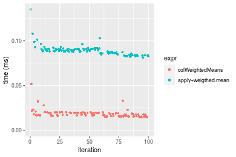
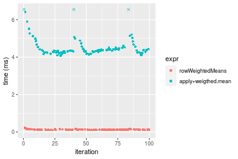
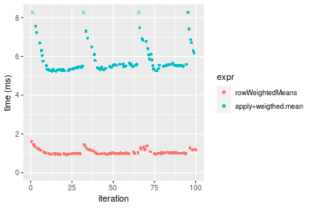
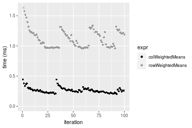

[matrixStats]: Benchmark report

---------------------------------------


# colWeightedMeans() and rowWeightedMeans() benchmarks

This report benchmark the performance of colWeightedMeans() and rowWeightedMeans() against alternative methods.

## Alternative methods

* apply() + weighted.mean()


## Data
```r
> rmatrix <- function(nrow, ncol, mode = c("logical", "double", "integer", "index"), range = c(-100, 
+     +100), na_prob = 0) {
+     mode <- match.arg(mode)
+     n <- nrow * ncol
+     if (mode == "logical") {
+         x <- sample(c(FALSE, TRUE), size = n, replace = TRUE)
+     }     else if (mode == "index") {
+         x <- seq_len(n)
+         mode <- "integer"
+     }     else {
+         x <- runif(n, min = range[1], max = range[2])
+     }
+     storage.mode(x) <- mode
+     if (na_prob > 0) 
+         x[sample(n, size = na_prob * n)] <- NA
+     dim(x) <- c(nrow, ncol)
+     x
+ }
> rmatrices <- function(scale = 10, seed = 1, ...) {
+     set.seed(seed)
+     data <- list()
+     data[[1]] <- rmatrix(nrow = scale * 1, ncol = scale * 1, ...)
+     data[[2]] <- rmatrix(nrow = scale * 10, ncol = scale * 10, ...)
+     data[[3]] <- rmatrix(nrow = scale * 100, ncol = scale * 1, ...)
+     data[[4]] <- t(data[[3]])
+     data[[5]] <- rmatrix(nrow = scale * 10, ncol = scale * 100, ...)
+     data[[6]] <- t(data[[5]])
+     names(data) <- sapply(data, FUN = function(x) paste(dim(x), collapse = "x"))
+     data
+ }
> data <- rmatrices(mode = "double")
```

## Results

### 10x10 matrix


```r
> X <- data[["10x10"]]
> w <- runif(nrow(X))
> gc()
           used  (Mb) gc trigger  (Mb) max used  (Mb)
Ncells  5331809 284.8    7916910 422.9  7916910 422.9
Vcells 10856214  82.9   33191153 253.3 53339345 407.0
> colStats <- microbenchmark(colWeightedMeans = colWeightedMeans(X, w = w, na.rm = FALSE), `apply+weigthed.mean` = apply(X, 
+     MARGIN = 2L, FUN = weighted.mean, w = w, na.rm = FALSE), unit = "ms")
> X <- t(X)
> gc()
           used  (Mb) gc trigger  (Mb) max used  (Mb)
Ncells  5331103 284.8    7916910 422.9  7916910 422.9
Vcells 10854208  82.9   33191153 253.3 53339345 407.0
> rowStats <- microbenchmark(rowWeightedMeans = rowWeightedMeans(X, w = w, na.rm = FALSE), `apply+weigthed.mean` = apply(X, 
+     MARGIN = 1L, FUN = weighted.mean, w = w, na.rm = FALSE), unit = "ms")
```

_Table: Benchmarking of colWeightedMeans() and apply+weigthed.mean() on 10x10 data. The top panel shows times in milliseconds and the bottom panel shows relative times._


|   |expr                |      min|        lq|      mean|    median|        uq|      max|
|:--|:-------------------|--------:|---------:|---------:|---------:|---------:|--------:|
|1  |colWeightedMeans    | 0.014514| 0.0158945| 0.0183756| 0.0173735| 0.0196270| 0.051723|
|2  |apply+weigthed.mean | 0.081258| 0.0862375| 0.0911114| 0.0889395| 0.0908155| 0.306399|


|   |expr                |      min|       lq|     mean|   median|      uq|      max|
|:--|:-------------------|--------:|--------:|--------:|--------:|-------:|--------:|
|1  |colWeightedMeans    | 1.000000| 1.000000| 1.000000| 1.000000| 1.00000| 1.000000|
|2  |apply+weigthed.mean | 5.598594| 5.425619| 4.958286| 5.119262| 4.62707| 5.923844|

_Table: Benchmarking of rowWeightedMeans() and apply+weigthed.mean() on 10x10 data (transposed). The top panel shows times in milliseconds and the bottom panel shows relative times._


|   |expr                |      min|        lq|      mean|    median|        uq|      max|
|:--|:-------------------|--------:|---------:|---------:|---------:|---------:|--------:|
|1  |rowWeightedMeans    | 0.020235| 0.0219355| 0.0248860| 0.0244995| 0.0253815| 0.066676|
|2  |apply+weigthed.mean | 0.081370| 0.0890960| 0.0923169| 0.0909045| 0.0918575| 0.171881|


|   |expr                |     min|       lq|     mean|   median|       uq|      max|
|:--|:-------------------|-------:|--------:|--------:|--------:|--------:|--------:|
|1  |rowWeightedMeans    | 1.00000| 1.000000| 1.000000| 1.000000| 1.000000| 1.000000|
|2  |apply+weigthed.mean | 4.02125| 4.061726| 3.709588| 3.710463| 3.619073| 2.577854|

_Figure: Benchmarking of colWeightedMeans() and apply+weigthed.mean() on 10x10 data  as well as rowWeightedMeans() and apply+weigthed.mean() on the same data transposed.  Outliers are displayed as crosses.  Times are in milliseconds._





_Table: Benchmarking of colWeightedMeans() and rowWeightedMeans() on 10x10 data (original and transposed).  The top panel shows times in milliseconds and the bottom panel shows relative times._


|   |expr             |    min|      lq|     mean|  median|      uq|    max|
|:--|:----------------|------:|-------:|--------:|-------:|-------:|------:|
|1  |colWeightedMeans | 14.514| 15.8945| 18.37558| 17.3735| 19.6270| 51.723|
|2  |rowWeightedMeans | 20.235| 21.9355| 24.88602| 24.4995| 25.3815| 66.676|


|   |expr             |      min|       lq|     mean|   median|       uq|      max|
|:--|:----------------|--------:|--------:|--------:|--------:|--------:|--------:|
|1  |colWeightedMeans | 1.000000| 1.000000| 1.000000| 1.000000| 1.000000| 1.000000|
|2  |rowWeightedMeans | 1.394171| 1.380069| 1.354299| 1.410165| 1.293193| 1.289098|

_Figure: Benchmarking of colWeightedMeans() and rowWeightedMeans() on 10x10 data (original and transposed).  Outliers are displayed as crosses. Times are in milliseconds._


### 100x100 matrix


```r
> X <- data[["100x100"]]
> w <- runif(nrow(X))
> gc()
           used  (Mb) gc trigger  (Mb) max used  (Mb)
Ncells  5329664 284.7    7916910 422.9  7916910 422.9
Vcells 10469040  79.9   33191153 253.3 53339345 407.0
> colStats <- microbenchmark(colWeightedMeans = colWeightedMeans(X, w = w, na.rm = FALSE), `apply+weigthed.mean` = apply(X, 
+     MARGIN = 2L, FUN = weighted.mean, w = w, na.rm = FALSE), unit = "ms")
> X <- t(X)
> gc()
           used  (Mb) gc trigger  (Mb) max used  (Mb)
Ncells  5329658 284.7    7916910 422.9  7916910 422.9
Vcells 10479083  80.0   33191153 253.3 53339345 407.0
> rowStats <- microbenchmark(rowWeightedMeans = rowWeightedMeans(X, w = w, na.rm = FALSE), `apply+weigthed.mean` = apply(X, 
+     MARGIN = 1L, FUN = weighted.mean, w = w, na.rm = FALSE), unit = "ms")
```

_Table: Benchmarking of colWeightedMeans() and apply+weigthed.mean() on 100x100 data. The top panel shows times in milliseconds and the bottom panel shows relative times._


|   |expr                |      min|       lq|      mean|  median|        uq|      max|
|:--|:-------------------|--------:|--------:|---------:|-------:|---------:|--------:|
|1  |colWeightedMeans    | 0.030195| 0.032921| 0.0382298| 0.03661| 0.0418240| 0.084657|
|2  |apply+weigthed.mean | 0.534847| 0.554290| 0.6471003| 0.63325| 0.7064345| 1.068205|


|   |expr                |     min|       lq|     mean|   median|       uq|      max|
|:--|:-------------------|-------:|--------:|--------:|--------:|--------:|--------:|
|1  |colWeightedMeans    |  1.0000|  1.00000|  1.00000|  1.00000|  1.00000|  1.00000|
|2  |apply+weigthed.mean | 17.7131| 16.83697| 16.92659| 17.29719| 16.89065| 12.61804|

_Table: Benchmarking of rowWeightedMeans() and apply+weigthed.mean() on 100x100 data (transposed). The top panel shows times in milliseconds and the bottom panel shows relative times._


|   |expr                |      min|       lq|      mean|    median|        uq|      max|
|:--|:-------------------|--------:|--------:|---------:|---------:|---------:|--------:|
|1  |rowWeightedMeans    | 0.108045| 0.114521| 0.1378237| 0.1341905| 0.1548515| 0.224745|
|2  |apply+weigthed.mean | 0.535381| 0.558136| 0.6648594| 0.6451205| 0.7158065| 1.127485|


|   |expr                |      min|       lq|     mean|   median|       uq|     max|
|:--|:-------------------|--------:|--------:|--------:|--------:|--------:|-------:|
|1  |rowWeightedMeans    | 1.000000| 1.000000| 1.000000| 1.000000| 1.000000| 1.00000|
|2  |apply+weigthed.mean | 4.955167| 4.873656| 4.823984| 4.807498| 4.622535| 5.01673|

_Figure: Benchmarking of colWeightedMeans() and apply+weigthed.mean() on 100x100 data  as well as rowWeightedMeans() and apply+weigthed.mean() on the same data transposed.  Outliers are displayed as crosses.  Times are in milliseconds._


_Table: Benchmarking of colWeightedMeans() and rowWeightedMeans() on 100x100 data (original and transposed).  The top panel shows times in milliseconds and the bottom panel shows relative times._


|   |expr             |     min|      lq|     mean|   median|       uq|     max|
|:--|:----------------|-------:|-------:|--------:|--------:|--------:|-------:|
|1  |colWeightedMeans |  30.195|  32.921|  38.2298|  36.6100|  41.8240|  84.657|
|2  |rowWeightedMeans | 108.045| 114.521| 137.8237| 134.1905| 154.8515| 224.745|


|   |expr             |      min|       lq|     mean|   median|       uq|      max|
|:--|:----------------|--------:|--------:|--------:|--------:|--------:|--------:|
|1  |colWeightedMeans | 1.000000| 1.000000| 1.000000| 1.000000| 1.000000| 1.000000|
|2  |rowWeightedMeans | 3.578241| 3.478661| 3.605138| 3.665406| 3.702456| 2.654772|

_Figure: Benchmarking of colWeightedMeans() and rowWeightedMeans() on 100x100 data (original and transposed).  Outliers are displayed as crosses. Times are in milliseconds._


### 1000x10 matrix


```r
> X <- data[["1000x10"]]
> w <- runif(nrow(X))
> gc()
           used  (Mb) gc trigger  (Mb) max used  (Mb)
Ncells  5330389 284.7    7916910 422.9  7916910 422.9
Vcells 10473445  80.0   33191153 253.3 53339345 407.0
> colStats <- microbenchmark(colWeightedMeans = colWeightedMeans(X, w = w, na.rm = FALSE), `apply+weigthed.mean` = apply(X, 
+     MARGIN = 2L, FUN = weighted.mean, w = w, na.rm = FALSE), unit = "ms")
> X <- t(X)
> gc()
           used  (Mb) gc trigger  (Mb) max used  (Mb)
Ncells  5330377 284.7    7916910 422.9  7916910 422.9
Vcells 10483478  80.0   33191153 253.3 53339345 407.0
> rowStats <- microbenchmark(rowWeightedMeans = rowWeightedMeans(X, w = w, na.rm = FALSE), `apply+weigthed.mean` = apply(X, 
+     MARGIN = 1L, FUN = weighted.mean, w = w, na.rm = FALSE), unit = "ms")
```

_Table: Benchmarking of colWeightedMeans() and apply+weigthed.mean() on 1000x10 data. The top panel shows times in milliseconds and the bottom panel shows relative times._


|   |expr                |      min|       lq|      mean|   median|        uq|      max|
|:--|:-------------------|--------:|--------:|---------:|--------:|---------:|--------:|
|1  |colWeightedMeans    | 0.050207| 0.052973| 0.0616090| 0.058177| 0.0663215| 0.159488|
|2  |apply+weigthed.mean | 0.207594| 0.215316| 0.2434847| 0.231619| 0.2656575| 0.379112|


|   |expr                |      min|       lq|     mean|   median|       uq|      max|
|:--|:-------------------|--------:|--------:|--------:|--------:|--------:|--------:|
|1  |colWeightedMeans    | 1.000000| 1.000000| 1.000000| 1.000000| 1.000000| 1.000000|
|2  |apply+weigthed.mean | 4.134762| 4.064637| 3.952096| 3.981281| 4.005602| 2.377057|

_Table: Benchmarking of rowWeightedMeans() and apply+weigthed.mean() on 1000x10 data (transposed). The top panel shows times in milliseconds and the bottom panel shows relative times._


|   |expr                |      min|        lq|      mean|   median|       uq|      max|
|:--|:-------------------|--------:|---------:|---------:|--------:|--------:|--------:|
|1  |rowWeightedMeans    | 0.142004| 0.1511195| 0.1673899| 0.160325| 0.179218| 0.262431|
|2  |apply+weigthed.mean | 0.202047| 0.2183060| 0.2437231| 0.236016| 0.261967| 0.353293|


|   |expr                |      min|       lq|    mean|  median|       uq|      max|
|:--|:-------------------|--------:|--------:|-------:|-------:|--------:|--------:|
|1  |rowWeightedMeans    | 1.000000| 1.000000| 1.00000| 1.00000| 1.000000| 1.000000|
|2  |apply+weigthed.mean | 1.422826| 1.444592| 1.45602| 1.47211| 1.461723| 1.346232|

_Figure: Benchmarking of colWeightedMeans() and apply+weigthed.mean() on 1000x10 data  as well as rowWeightedMeans() and apply+weigthed.mean() on the same data transposed.  Outliers are displayed as crosses.  Times are in milliseconds._


_Table: Benchmarking of colWeightedMeans() and rowWeightedMeans() on 1000x10 data (original and transposed).  The top panel shows times in milliseconds and the bottom panel shows relative times._


|   |expr             |     min|       lq|      mean|  median|       uq|     max|
|:--|:----------------|-------:|--------:|---------:|-------:|--------:|-------:|
|1  |colWeightedMeans |  50.207|  52.9730|  61.60899|  58.177|  66.3215| 159.488|
|2  |rowWeightedMeans | 142.004| 151.1195| 167.38994| 160.325| 179.2180| 262.431|


|   |expr             |      min|       lq|     mean|   median|       uq|      max|
|:--|:----------------|--------:|--------:|--------:|--------:|--------:|--------:|
|1  |colWeightedMeans | 1.000000| 1.000000| 1.000000| 1.000000| 1.000000| 1.000000|
|2  |rowWeightedMeans | 2.828371| 2.852765| 2.716973| 2.755814| 2.702261| 1.645459|

_Figure: Benchmarking of colWeightedMeans() and rowWeightedMeans() on 1000x10 data (original and transposed).  Outliers are displayed as crosses. Times are in milliseconds._


### 10x1000 matrix


```r
> X <- data[["10x1000"]]
> w <- runif(nrow(X))
> gc()
           used  (Mb) gc trigger  (Mb) max used  (Mb)
Ncells  5330581 284.7    7916910 422.9  7916910 422.9
Vcells 10473235  80.0   33191153 253.3 53339345 407.0
> colStats <- microbenchmark(colWeightedMeans = colWeightedMeans(X, w = w, na.rm = FALSE), `apply+weigthed.mean` = apply(X, 
+     MARGIN = 2L, FUN = weighted.mean, w = w, na.rm = FALSE), unit = "ms")
> X <- t(X)
> gc()
           used  (Mb) gc trigger  (Mb) max used  (Mb)
Ncells  5330575 284.7    7916910 422.9  7916910 422.9
Vcells 10483278  80.0   33191153 253.3 53339345 407.0
> rowStats <- microbenchmark(rowWeightedMeans = rowWeightedMeans(X, w = w, na.rm = FALSE), `apply+weigthed.mean` = apply(X, 
+     MARGIN = 1L, FUN = weighted.mean, w = w, na.rm = FALSE), unit = "ms")
```

_Table: Benchmarking of colWeightedMeans() and apply+weigthed.mean() on 10x1000 data. The top panel shows times in milliseconds and the bottom panel shows relative times._


|   |expr                |      min|       lq|      mean|    median|       uq|       max|
|:--|:-------------------|--------:|--------:|---------:|---------:|--------:|---------:|
|1  |colWeightedMeans    | 0.027890| 0.031472| 0.0402594| 0.0373785| 0.043889|  0.100983|
|2  |apply+weigthed.mean | 4.093371| 4.224227| 4.6551195| 4.3682620| 4.654880| 12.683915|


|   |expr                |      min|       lq|     mean|   median|       uq|      max|
|:--|:-------------------|--------:|--------:|--------:|--------:|--------:|--------:|
|1  |colWeightedMeans    |   1.0000|   1.0000|   1.0000|   1.0000|   1.0000|   1.0000|
|2  |apply+weigthed.mean | 146.7684| 134.2218| 115.6281| 116.8656| 106.0603| 125.6045|

_Table: Benchmarking of rowWeightedMeans() and apply+weigthed.mean() on 10x1000 data (transposed). The top panel shows times in milliseconds and the bottom panel shows relative times._


|   |expr                |      min|        lq|      mean|   median|        uq|       max|
|:--|:-------------------|--------:|---------:|---------:|--------:|---------:|---------:|
|1  |rowWeightedMeans    | 0.106895| 0.1135865| 0.1268637| 0.121555| 0.1352205|  0.223218|
|2  |apply+weigthed.mean | 4.066901| 4.2600495| 4.6186294| 4.353472| 4.5128765| 11.151535|


|   |expr                |      min|       lq|     mean|   median|      uq|      max|
|:--|:-------------------|--------:|--------:|--------:|--------:|-------:|--------:|
|1  |rowWeightedMeans    |  1.00000|  1.00000|  1.00000|  1.00000|  1.0000|  1.00000|
|2  |apply+weigthed.mean | 38.04576| 37.50489| 36.40624| 35.81484| 33.3742| 49.95805|

_Figure: Benchmarking of colWeightedMeans() and apply+weigthed.mean() on 10x1000 data  as well as rowWeightedMeans() and apply+weigthed.mean() on the same data transposed.  Outliers are displayed as crosses.  Times are in milliseconds._



_Table: Benchmarking of colWeightedMeans() and rowWeightedMeans() on 10x1000 data (original and transposed).  The top panel shows times in milliseconds and the bottom panel shows relative times._


|   |expr             |     min|       lq|      mean|   median|       uq|     max|
|:--|:----------------|-------:|--------:|---------:|--------:|--------:|-------:|
|1  |colWeightedMeans |  27.890|  31.4720|  40.25943|  37.3785|  43.8890| 100.983|
|2  |rowWeightedMeans | 106.895| 113.5865| 126.86366| 121.5550| 135.2205| 223.218|


|   |expr             |      min|       lq|     mean|   median|       uq|      max|
|:--|:----------------|--------:|--------:|--------:|--------:|--------:|--------:|
|1  |colWeightedMeans | 1.000000| 1.000000| 1.000000| 1.000000| 1.000000| 1.000000|
|2  |rowWeightedMeans | 3.832736| 3.609129| 3.151154| 3.252003| 3.080966| 2.210451|

_Figure: Benchmarking of colWeightedMeans() and rowWeightedMeans() on 10x1000 data (original and transposed).  Outliers are displayed as crosses. Times are in milliseconds._


### 100x1000 matrix


```r
> X <- data[["100x1000"]]
> w <- runif(nrow(X))
> gc()
           used  (Mb) gc trigger  (Mb) max used  (Mb)
Ncells  5330777 284.7    7916910 422.9  7916910 422.9
Vcells 10473841  80.0   33191153 253.3 53339345 407.0
> colStats <- microbenchmark(colWeightedMeans = colWeightedMeans(X, w = w, na.rm = FALSE), `apply+weigthed.mean` = apply(X, 
+     MARGIN = 2L, FUN = weighted.mean, w = w, na.rm = FALSE), unit = "ms")
> X <- t(X)
> gc()
           used  (Mb) gc trigger  (Mb) max used  (Mb)
Ncells  5330765 284.7    7916910 422.9  7916910 422.9
Vcells 10573874  80.7   33191153 253.3 53339345 407.0
> rowStats <- microbenchmark(rowWeightedMeans = rowWeightedMeans(X, w = w, na.rm = FALSE), `apply+weigthed.mean` = apply(X, 
+     MARGIN = 1L, FUN = weighted.mean, w = w, na.rm = FALSE), unit = "ms")
```

_Table: Benchmarking of colWeightedMeans() and apply+weigthed.mean() on 100x1000 data. The top panel shows times in milliseconds and the bottom panel shows relative times._


|   |expr                |      min|        lq|      mean|   median|       uq|      max|
|:--|:-------------------|--------:|---------:|---------:|--------:|--------:|--------:|
|1  |colWeightedMeans    | 0.176290| 0.2078795| 0.4456043| 0.234187| 0.270846| 20.88489|
|2  |apply+weigthed.mean | 5.194491| 5.3765175| 6.1930076| 5.488162| 5.870243| 27.26077|


|   |expr                |     min|       lq|   mean|   median|       uq|      max|
|:--|:-------------------|-------:|--------:|------:|--------:|--------:|--------:|
|1  |colWeightedMeans    |  1.0000|  1.00000|  1.000|  1.00000|  1.00000| 1.000000|
|2  |apply+weigthed.mean | 29.4656| 25.86363| 13.898| 23.43496| 21.67373| 1.305286|

_Table: Benchmarking of rowWeightedMeans() and apply+weigthed.mean() on 100x1000 data (transposed). The top panel shows times in milliseconds and the bottom panel shows relative times._


|   |expr                |      min|        lq|     mean|   median|       uq|      max|
|:--|:-------------------|--------:|---------:|--------:|--------:|--------:|--------:|
|1  |rowWeightedMeans    | 0.939194| 0.9811385| 1.280713| 1.007786| 1.164391| 22.33007|
|2  |apply+weigthed.mean | 5.244182| 5.3788310| 6.250966| 5.525034| 5.953479| 28.91215|


|   |expr                |      min|       lq|     mean|   median|       uq|      max|
|:--|:-------------------|--------:|--------:|--------:|--------:|--------:|--------:|
|1  |rowWeightedMeans    | 1.000000| 1.000000| 1.000000| 1.000000| 1.000000| 1.000000|
|2  |apply+weigthed.mean | 5.583705| 5.482234| 4.880847| 5.482348| 5.112957| 1.294763|

_Figure: Benchmarking of colWeightedMeans() and apply+weigthed.mean() on 100x1000 data  as well as rowWeightedMeans() and apply+weigthed.mean() on the same data transposed.  Outliers are displayed as crosses.  Times are in milliseconds._



_Table: Benchmarking of colWeightedMeans() and rowWeightedMeans() on 100x1000 data (original and transposed).  The top panel shows times in milliseconds and the bottom panel shows relative times._


|   |expr             |     min|       lq|      mean|   median|       uq|      max|
|:--|:----------------|-------:|--------:|---------:|--------:|--------:|--------:|
|1  |colWeightedMeans | 176.290| 207.8795|  445.6043|  234.187|  270.846| 20884.89|
|2  |rowWeightedMeans | 939.194| 981.1385| 1280.7132| 1007.786| 1164.390| 22330.07|


|   |expr             |      min|       lq|     mean|   median|       uq|      max|
|:--|:----------------|--------:|--------:|--------:|--------:|--------:|--------:|
|1  |colWeightedMeans | 1.000000| 1.000000| 1.000000| 1.000000| 1.000000| 1.000000|
|2  |rowWeightedMeans | 5.327551| 4.719746| 2.874104| 4.303339| 4.299087| 1.069197|

_Figure: Benchmarking of colWeightedMeans() and rowWeightedMeans() on 100x1000 data (original and transposed).  Outliers are displayed as crosses. Times are in milliseconds._


### 1000x100 matrix


```r
> X <- data[["1000x100"]]
> w <- runif(nrow(X))
> gc()
           used  (Mb) gc trigger  (Mb) max used  (Mb)
Ncells  5330958 284.8    7916910 422.9  7916910 422.9
Vcells 10475373  80.0   33191153 253.3 53339345 407.0
> colStats <- microbenchmark(colWeightedMeans = colWeightedMeans(X, w = w, na.rm = FALSE), `apply+weigthed.mean` = apply(X, 
+     MARGIN = 2L, FUN = weighted.mean, w = w, na.rm = FALSE), unit = "ms")
> X <- t(X)
> gc()
           used  (Mb) gc trigger  (Mb) max used  (Mb)
Ncells  5330952 284.8    7916910 422.9  7916910 422.9
Vcells 10575416  80.7   33191153 253.3 53339345 407.0
> rowStats <- microbenchmark(rowWeightedMeans = rowWeightedMeans(X, w = w, na.rm = FALSE), `apply+weigthed.mean` = apply(X, 
+     MARGIN = 1L, FUN = weighted.mean, w = w, na.rm = FALSE), unit = "ms")
```

_Table: Benchmarking of colWeightedMeans() and apply+weigthed.mean() on 1000x100 data. The top panel shows times in milliseconds and the bottom panel shows relative times._


|   |expr                |      min|        lq|      mean|    median|       uq|        max|
|:--|:-------------------|--------:|---------:|---------:|---------:|--------:|----------:|
|1  |colWeightedMeans    | 0.201873| 0.2324025| 0.2648283| 0.2548875| 0.281130|   0.443784|
|2  |apply+weigthed.mean | 1.514922| 1.6610620| 5.8543197| 1.8988915| 2.089488| 376.589480|


|   |expr                |      min|      lq|     mean|  median|       uq|      max|
|:--|:-------------------|--------:|-------:|--------:|-------:|--------:|--------:|
|1  |colWeightedMeans    | 1.000000| 1.00000|  1.00000| 1.00000| 1.000000|   1.0000|
|2  |apply+weigthed.mean | 7.504332| 7.14735| 22.10609| 7.44992| 7.432464| 848.5873|

_Table: Benchmarking of rowWeightedMeans() and apply+weigthed.mean() on 1000x100 data (transposed). The top panel shows times in milliseconds and the bottom panel shows relative times._


|   |expr                |      min|       lq|     mean|   median|       uq|       max|
|:--|:-------------------|--------:|--------:|--------:|--------:|--------:|---------:|
|1  |rowWeightedMeans    | 0.959981| 0.979435| 1.125434| 1.090402| 1.228889|  1.656196|
|2  |apply+weigthed.mean | 1.523706| 1.564525| 2.017792| 1.617954| 1.943826| 11.460256|


|   |expr                |      min|       lq|     mean|   median|       uq|      max|
|:--|:-------------------|--------:|--------:|--------:|--------:|--------:|--------:|
|1  |rowWeightedMeans    | 1.000000| 1.000000| 1.000000| 1.000000| 1.000000| 1.000000|
|2  |apply+weigthed.mean | 1.587225| 1.597374| 1.792902| 1.483814| 1.581775| 6.919626|

_Figure: Benchmarking of colWeightedMeans() and apply+weigthed.mean() on 1000x100 data  as well as rowWeightedMeans() and apply+weigthed.mean() on the same data transposed.  Outliers are displayed as crosses.  Times are in milliseconds._


_Table: Benchmarking of colWeightedMeans() and rowWeightedMeans() on 1000x100 data (original and transposed).  The top panel shows times in milliseconds and the bottom panel shows relative times._


|   |expr             |     min|       lq|      mean|    median|       uq|      max|
|:--|:----------------|-------:|--------:|---------:|---------:|--------:|--------:|
|1  |colWeightedMeans | 201.873| 232.4025|  264.8283|  254.8875|  281.130|  443.784|
|2  |rowWeightedMeans | 959.981| 979.4350| 1125.4340| 1090.4015| 1228.889| 1656.196|


|   |expr             |      min|       lq|     mean|   median|       uq|      max|
|:--|:----------------|--------:|--------:|--------:|--------:|--------:|--------:|
|1  |colWeightedMeans | 1.000000| 1.000000| 1.000000| 1.000000| 1.000000| 1.000000|
|2  |rowWeightedMeans | 4.755371| 4.214391| 4.249674| 4.277972| 4.371248| 3.731987|

_Figure: Benchmarking of colWeightedMeans() and rowWeightedMeans() on 1000x100 data (original and transposed).  Outliers are displayed as crosses. Times are in milliseconds._





## Appendix

### Session information
```r
R version 4.1.1 Patched (2021-08-10 r80727)
Platform: x86_64-pc-linux-gnu (64-bit)
Running under: Ubuntu 18.04.5 LTS

Matrix products: default
BLAS:   /home/hb/software/R-devel/R-4-1-branch/lib/R/lib/libRblas.so
LAPACK: /home/hb/software/R-devel/R-4-1-branch/lib/R/lib/libRlapack.so

locale:
 [1] LC_CTYPE=en_US.UTF-8       LC_NUMERIC=C              
 [3] LC_TIME=en_US.UTF-8        LC_COLLATE=en_US.UTF-8    
 [5] LC_MONETARY=en_US.UTF-8    LC_MESSAGES=en_US.UTF-8   
 [7] LC_PAPER=en_US.UTF-8       LC_NAME=C                 
 [9] LC_ADDRESS=C               LC_TELEPHONE=C            
[11] LC_MEASUREMENT=en_US.UTF-8 LC_IDENTIFICATION=C       

attached base packages:
[1] stats     graphics  grDevices utils     datasets  methods   base     

other attached packages:
[1] microbenchmark_1.4-7   matrixStats_0.60.0     ggplot2_3.3.5         
[4] knitr_1.33             R.devices_2.17.0       R.utils_2.10.1        
[7] R.oo_1.24.0            R.methodsS3_1.8.1-9001 history_0.0.1-9000    

loaded via a namespace (and not attached):
 [1] Biobase_2.52.0          httr_1.4.2              splines_4.1.1          
 [4] bit64_4.0.5             network_1.17.1          assertthat_0.2.1       
 [7] highr_0.9               stats4_4.1.1            blob_1.2.2             
[10] GenomeInfoDbData_1.2.6  robustbase_0.93-8       pillar_1.6.2           
[13] RSQLite_2.2.8           lattice_0.20-44         glue_1.4.2             
[16] digest_0.6.27           XVector_0.32.0          colorspace_2.0-2       
[19] Matrix_1.3-4            XML_3.99-0.7            pkgconfig_2.0.3        
[22] zlibbioc_1.38.0         genefilter_1.74.0       purrr_0.3.4            
[25] ergm_4.1.2              xtable_1.8-4            scales_1.1.1           
[28] tibble_3.1.4            annotate_1.70.0         KEGGREST_1.32.0        
[31] farver_2.1.0            generics_0.1.0          IRanges_2.26.0         
[34] ellipsis_0.3.2          cachem_1.0.6            withr_2.4.2            
[37] BiocGenerics_0.38.0     mime_0.11               survival_3.2-13        
[40] magrittr_2.0.1          crayon_1.4.1            statnet.common_4.5.0   
[43] memoise_2.0.0           laeken_0.5.1            fansi_0.5.0            
[46] R.cache_0.15.0          MASS_7.3-54             R.rsp_0.44.0           
[49] progressr_0.8.0         tools_4.1.1             lifecycle_1.0.0        
[52] S4Vectors_0.30.0        trust_0.1-8             munsell_0.5.0          
[55] tabby_0.0.1-9001        AnnotationDbi_1.54.1    Biostrings_2.60.2      
[58] compiler_4.1.1          GenomeInfoDb_1.28.1     rlang_0.4.11           
[61] grid_4.1.1              RCurl_1.98-1.4          cwhmisc_6.6            
[64] rstudioapi_0.13         rappdirs_0.3.3          startup_0.15.0         
[67] labeling_0.4.2          bitops_1.0-7            base64enc_0.1-3        
[70] boot_1.3-28             gtable_0.3.0            DBI_1.1.1              
[73] markdown_1.1            R6_2.5.1                lpSolveAPI_5.5.2.0-17.7
[76] rle_0.9.2               dplyr_1.0.7             fastmap_1.1.0          
[79] bit_4.0.4               utf8_1.2.2              parallel_4.1.1         
[82] Rcpp_1.0.7              vctrs_0.3.8             png_0.1-7              
[85] DEoptimR_1.0-9          tidyselect_1.1.1        xfun_0.25              
[88] coda_0.19-4            
```
Total processing time was 15.44 secs.


### Reproducibility
To reproduce this report, do:
```r
html <- matrixStats:::benchmark('colWeightedMeans')
```

[RSP]: https://cran.r-project.org/package=R.rsp
[matrixStats]: https://cran.r-project.org/package=matrixStats

[StackOverflow:colMins?]: https://stackoverflow.com/questions/13676878 "Stack Overflow: fastest way to get Min from every column in a matrix?"
[StackOverflow:colSds?]: https://stackoverflow.com/questions/17549762 "Stack Overflow: Is there such 'colsd' in R?"
[StackOverflow:rowProds?]: https://stackoverflow.com/questions/20198801/ "Stack Overflow: Row product of matrix and column sum of matrix"

---------------------------------------
Copyright Henrik Bengtsson. Last updated on 2021-08-25 22:32:10 (+0200 UTC). Powered by [RSP].

<script>
 var link = document.createElement('link');
 link.rel = 'icon';
 link.href = "data:image/png;base64,iVBORw0KGgoAAAANSUhEUgAAACAAAAAgCAMAAABEpIrGAAAA21BMVEUAAAAAAP8AAP8AAP8AAP8AAP8AAP8AAP8AAP8AAP8AAP8AAP8AAP8AAP8AAP8AAP8AAP8AAP8AAP8AAP8AAP8AAP8AAP8AAP8AAP8AAP8AAP8AAP8AAP8AAP8AAP8AAP8AAP8AAP8AAP8AAP8AAP8AAP8AAP8AAP8AAP8AAP8BAf4CAv0DA/wdHeIeHuEfH+AgIN8hId4lJdomJtknJ9g+PsE/P8BAQL9yco10dIt1dYp3d4h4eIeVlWqWlmmXl2iYmGeZmWabm2Tn5xjo6Bfp6Rb39wj4+Af//wA2M9hbAAAASXRSTlMAAQIJCgsMJSYnKD4/QGRlZmhpamtsbautrrCxuru8y8zN5ebn6Pn6+///////////////////////////////////////////LsUNcQAAAS9JREFUOI29k21XgkAQhVcFytdSMqMETU26UVqGmpaiFbL//xc1cAhhwVNf6n5i5z67M2dmYOyfJZUqlVLhkKucG7cgmUZTybDz6g0iDeq51PUr37Ds2cy2/C9NeES5puDjxuUk1xnToZsg8pfA3avHQ3lLIi7iWRrkv/OYtkScxBIMgDee0ALoyxHQBJ68JLCjOtQIMIANF7QG9G9fNnHvisCHBVMKgSJgiz7nE+AoBKrAPA3MgepvgR9TSCasrCKH0eB1wBGBFdCO+nAGjMVGPcQb5bd6mQRegN6+1axOs9nGfYcCtfi4NQosdtH7dB+txFIpXQqN1p9B/asRHToyS0jRgpV7nk4nwcq1BJ+x3Gl/v7S9Wmpp/aGquum7w3ZDyrADFYrl8vHBH+ev9AUASW1dmU4h4wAAAABJRU5ErkJggg=="
 document.getElementsByTagName('head')[0].appendChild(link);
</script>


