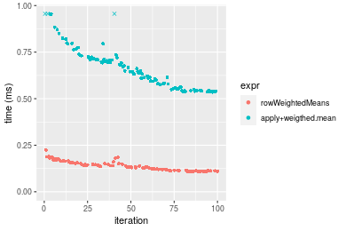
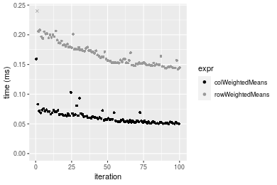

[matrixStats]: Benchmark report

---------------------------------------


# colWeightedMeans() and rowWeightedMeans() benchmarks

This report benchmark the performance of colWeightedMeans() and rowWeightedMeans() against alternative methods.

## Alternative methods

* apply() + weighted.mean()


## Data
```r
> rmatrix <- function(nrow, ncol, mode = c("logical", "double", "integer", "index"), range = c(-100, 
+     +100), na_prob = 0) {
+     mode <- match.arg(mode)
+     n <- nrow * ncol
+     if (mode == "logical") {
+         x <- sample(c(FALSE, TRUE), size = n, replace = TRUE)
+     }     else if (mode == "index") {
+         x <- seq_len(n)
+         mode <- "integer"
+     }     else {
+         x <- runif(n, min = range[1], max = range[2])
+     }
+     storage.mode(x) <- mode
+     if (na_prob > 0) 
+         x[sample(n, size = na_prob * n)] <- NA
+     dim(x) <- c(nrow, ncol)
+     x
+ }
> rmatrices <- function(scale = 10, seed = 1, ...) {
+     set.seed(seed)
+     data <- list()
+     data[[1]] <- rmatrix(nrow = scale * 1, ncol = scale * 1, ...)
+     data[[2]] <- rmatrix(nrow = scale * 10, ncol = scale * 10, ...)
+     data[[3]] <- rmatrix(nrow = scale * 100, ncol = scale * 1, ...)
+     data[[4]] <- t(data[[3]])
+     data[[5]] <- rmatrix(nrow = scale * 10, ncol = scale * 100, ...)
+     data[[6]] <- t(data[[5]])
+     names(data) <- sapply(data, FUN = function(x) paste(dim(x), collapse = "x"))
+     data
+ }
> data <- rmatrices(mode = "double")
```

## Results

### 10x10 matrix


```r
> X <- data[["10x10"]]
> w <- runif(nrow(X))
> gc()
           used  (Mb) gc trigger  (Mb) max used  (Mb)
Ncells  5279667 282.0   10014072 534.9 10014072 534.9
Vcells 10429870  79.6   18422267 140.6 18422267 140.6
> colStats <- microbenchmark(colWeightedMeans = colWeightedMeans(X, w = w, na.rm = FALSE), `apply+weigthed.mean` = apply(X, 
+     MARGIN = 2L, FUN = weighted.mean, w = w, na.rm = FALSE), unit = "ms")
> X <- t(X)
> gc()
           used  (Mb) gc trigger  (Mb) max used  (Mb)
Ncells  5264455 281.2   10014072 534.9 10014072 534.9
Vcells 10379587  79.2   18422267 140.6 18422267 140.6
> rowStats <- microbenchmark(rowWeightedMeans = rowWeightedMeans(X, w = w, na.rm = FALSE), `apply+weigthed.mean` = apply(X, 
+     MARGIN = 1L, FUN = weighted.mean, w = w, na.rm = FALSE), unit = "ms")
```

_Table: Benchmarking of colWeightedMeans() and apply+weigthed.mean() on 10x10 data. The top panel shows times in milliseconds and the bottom panel shows relative times._


|   |expr                |      min|        lq|      mean|    median|        uq|      max|
|:--|:-------------------|--------:|---------:|---------:|---------:|---------:|--------:|
|1  |colWeightedMeans    | 0.014690| 0.0158745| 0.0183404| 0.0178275| 0.0197725| 0.051019|
|2  |apply+weigthed.mean | 0.080117| 0.0847510| 0.0899068| 0.0876430| 0.0894295| 0.298599|


|   |expr                |      min|       lq|     mean|   median|       uq|      max|
|:--|:-------------------|--------:|--------:|--------:|--------:|--------:|--------:|
|1  |colWeightedMeans    | 1.000000| 1.000000| 1.000000| 1.000000| 1.000000| 1.000000|
|2  |apply+weigthed.mean | 5.453846| 5.338814| 4.902111| 4.916169| 4.522923| 5.852702|

_Table: Benchmarking of rowWeightedMeans() and apply+weigthed.mean() on 10x10 data (transposed). The top panel shows times in milliseconds and the bottom panel shows relative times._


|   |expr                |      min|        lq|      mean|    median|       uq|      max|
|:--|:-------------------|--------:|---------:|---------:|---------:|--------:|--------:|
|1  |rowWeightedMeans    | 0.020576| 0.0221925| 0.0246379| 0.0242320| 0.025526| 0.069836|
|2  |apply+weigthed.mean | 0.080148| 0.0841460| 0.0886985| 0.0864055| 0.090708| 0.179163|


|   |expr                |      min|       lq|     mean|  median|       uq|      max|
|:--|:-------------------|--------:|--------:|--------:|-------:|--------:|--------:|
|1  |rowWeightedMeans    | 1.000000| 1.000000| 1.000000| 1.00000| 1.000000| 1.000000|
|2  |apply+weigthed.mean | 3.895218| 3.791641| 3.600079| 3.56576| 3.553553| 2.565482|

_Figure: Benchmarking of colWeightedMeans() and apply+weigthed.mean() on 10x10 data  as well as rowWeightedMeans() and apply+weigthed.mean() on the same data transposed.  Outliers are displayed as crosses.  Times are in milliseconds._


_Table: Benchmarking of colWeightedMeans() and rowWeightedMeans() on 10x10 data (original and transposed).  The top panel shows times in milliseconds and the bottom panel shows relative times._


|   |expr             |    min|      lq|     mean|  median|      uq|    max|
|:--|:----------------|------:|-------:|--------:|-------:|-------:|------:|
|1  |colWeightedMeans | 14.690| 15.8745| 18.34042| 17.8275| 19.7725| 51.019|
|2  |rowWeightedMeans | 20.576| 22.1925| 24.63794| 24.2320| 25.5260| 69.836|


|   |expr             |      min|       lq|     mean|   median|       uq|      max|
|:--|:----------------|--------:|--------:|--------:|--------:|--------:|--------:|
|1  |colWeightedMeans | 1.000000| 1.000000| 1.000000| 1.000000| 1.000000| 1.000000|
|2  |rowWeightedMeans | 1.400681| 1.397997| 1.343368| 1.359248| 1.290985| 1.368823|

_Figure: Benchmarking of colWeightedMeans() and rowWeightedMeans() on 10x10 data (original and transposed).  Outliers are displayed as crosses. Times are in milliseconds._


### 100x100 matrix


```r
> X <- data[["100x100"]]
> w <- runif(nrow(X))
> gc()
          used  (Mb) gc trigger  (Mb) max used  (Mb)
Ncells 5263034 281.1   10014072 534.9 10014072 534.9
Vcells 9994449  76.3   18422267 140.6 18422267 140.6
> colStats <- microbenchmark(colWeightedMeans = colWeightedMeans(X, w = w, na.rm = FALSE), `apply+weigthed.mean` = apply(X, 
+     MARGIN = 2L, FUN = weighted.mean, w = w, na.rm = FALSE), unit = "ms")
> X <- t(X)
> gc()
           used  (Mb) gc trigger  (Mb) max used  (Mb)
Ncells  5263010 281.1   10014072 534.9 10014072 534.9
Vcells 10004462  76.4   18422267 140.6 18422267 140.6
> rowStats <- microbenchmark(rowWeightedMeans = rowWeightedMeans(X, w = w, na.rm = FALSE), `apply+weigthed.mean` = apply(X, 
+     MARGIN = 1L, FUN = weighted.mean, w = w, na.rm = FALSE), unit = "ms")
```

_Table: Benchmarking of colWeightedMeans() and apply+weigthed.mean() on 100x100 data. The top panel shows times in milliseconds and the bottom panel shows relative times._


|   |expr                |      min|        lq|      mean|    median|        uq|      max|
|:--|:-------------------|--------:|---------:|---------:|---------:|---------:|--------:|
|1  |colWeightedMeans    | 0.030385| 0.0365535| 0.0420789| 0.0401090| 0.0472445| 0.091637|
|2  |apply+weigthed.mean | 0.550954| 0.5987340| 0.6863913| 0.6692365| 0.7184725| 1.130328|


|   |expr                |      min|       lq|   mean|   median|       uq|      max|
|:--|:-------------------|--------:|--------:|------:|--------:|--------:|--------:|
|1  |colWeightedMeans    |  1.00000|  1.00000|  1.000|  1.00000|  1.00000|  1.00000|
|2  |apply+weigthed.mean | 18.13243| 16.37966| 16.312| 16.68544| 15.20754| 12.33484|

_Table: Benchmarking of rowWeightedMeans() and apply+weigthed.mean() on 100x100 data (transposed). The top panel shows times in milliseconds and the bottom panel shows relative times._


|   |expr                |      min|       lq|      mean|    median|        uq|      max|
|:--|:-------------------|--------:|--------:|---------:|---------:|---------:|--------:|
|1  |rowWeightedMeans    | 0.119238| 0.126456| 0.1514169| 0.1478485| 0.1661620| 0.247022|
|2  |apply+weigthed.mean | 0.536405| 0.576207| 0.6702919| 0.6524095| 0.7165685| 1.129828|


|   |expr                |      min|       lq|     mean|   median|       uq|      max|
|:--|:-------------------|--------:|--------:|--------:|--------:|--------:|--------:|
|1  |rowWeightedMeans    | 1.000000| 1.000000| 1.000000| 1.000000| 1.000000| 1.000000|
|2  |apply+weigthed.mean | 4.498608| 4.556581| 4.426798| 4.412689| 4.312469| 4.573795|

_Figure: Benchmarking of colWeightedMeans() and apply+weigthed.mean() on 100x100 data  as well as rowWeightedMeans() and apply+weigthed.mean() on the same data transposed.  Outliers are displayed as crosses.  Times are in milliseconds._



_Table: Benchmarking of colWeightedMeans() and rowWeightedMeans() on 100x100 data (original and transposed).  The top panel shows times in milliseconds and the bottom panel shows relative times._


|   |expr             |     min|       lq|      mean|   median|       uq|     max|
|:--|:----------------|-------:|--------:|---------:|--------:|--------:|-------:|
|1  |colWeightedMeans |  30.385|  36.5535|  42.07892|  40.1090|  47.2445|  91.637|
|2  |rowWeightedMeans | 119.238| 126.4560| 151.41687| 147.8485| 166.1620| 247.022|


|   |expr             |      min|       lq|     mean|   median|       uq|      max|
|:--|:----------------|--------:|--------:|--------:|--------:|--------:|--------:|
|1  |colWeightedMeans | 1.000000| 1.000000| 1.000000| 1.000000| 1.000000| 1.000000|
|2  |rowWeightedMeans | 3.924239| 3.459477| 3.598402| 3.686168| 3.517066| 2.695658|

_Figure: Benchmarking of colWeightedMeans() and rowWeightedMeans() on 100x100 data (original and transposed).  Outliers are displayed as crosses. Times are in milliseconds._


### 1000x10 matrix


```r
> X <- data[["1000x10"]]
> w <- runif(nrow(X))
> gc()
          used  (Mb) gc trigger  (Mb) max used  (Mb)
Ncells 5263735 281.2   10014072 534.9 10014072 534.9
Vcells 9998815  76.3   18422267 140.6 18422267 140.6
> colStats <- microbenchmark(colWeightedMeans = colWeightedMeans(X, w = w, na.rm = FALSE), `apply+weigthed.mean` = apply(X, 
+     MARGIN = 2L, FUN = weighted.mean, w = w, na.rm = FALSE), unit = "ms")
> X <- t(X)
> gc()
           used  (Mb) gc trigger  (Mb) max used  (Mb)
Ncells  5263729 281.2   10014072 534.9 10014072 534.9
Vcells 10008858  76.4   18422267 140.6 18422267 140.6
> rowStats <- microbenchmark(rowWeightedMeans = rowWeightedMeans(X, w = w, na.rm = FALSE), `apply+weigthed.mean` = apply(X, 
+     MARGIN = 1L, FUN = weighted.mean, w = w, na.rm = FALSE), unit = "ms")
```

_Table: Benchmarking of colWeightedMeans() and apply+weigthed.mean() on 1000x10 data. The top panel shows times in milliseconds and the bottom panel shows relative times._


|   |expr                |      min|        lq|      mean|    median|        uq|      max|
|:--|:-------------------|--------:|---------:|---------:|---------:|---------:|--------:|
|1  |colWeightedMeans    | 0.053542| 0.0578595| 0.0648666| 0.0632270| 0.0691820| 0.134685|
|2  |apply+weigthed.mean | 0.226459| 0.2372125| 0.2586568| 0.2520565| 0.2751085| 0.344581|


|   |expr                |      min|       lq|    mean|   median|       uq|      max|
|:--|:-------------------|--------:|--------:|-------:|--------:|--------:|--------:|
|1  |colWeightedMeans    | 1.000000| 1.000000| 1.00000| 1.000000| 1.000000| 1.000000|
|2  |apply+weigthed.mean | 4.229558| 4.099802| 3.98752| 3.986533| 3.976591| 2.558422|

_Table: Benchmarking of rowWeightedMeans() and apply+weigthed.mean() on 1000x10 data (transposed). The top panel shows times in milliseconds and the bottom panel shows relative times._


|   |expr                |      min|        lq|      mean|    median|        uq|      max|
|:--|:-------------------|--------:|---------:|---------:|---------:|---------:|--------:|
|1  |rowWeightedMeans    | 0.164435| 0.1765825| 0.1951785| 0.1850125| 0.2099875| 0.299780|
|2  |apply+weigthed.mean | 0.213646| 0.2294030| 0.2515278| 0.2433315| 0.2660050| 0.345468|


|   |expr                |      min|       lq|     mean|   median|       uq|      max|
|:--|:-------------------|--------:|--------:|--------:|--------:|--------:|--------:|
|1  |rowWeightedMeans    | 1.000000| 1.000000| 1.000000| 1.000000| 1.000000| 1.000000|
|2  |apply+weigthed.mean | 1.299273| 1.299127| 1.288707| 1.315217| 1.266766| 1.152405|

_Figure: Benchmarking of colWeightedMeans() and apply+weigthed.mean() on 1000x10 data  as well as rowWeightedMeans() and apply+weigthed.mean() on the same data transposed.  Outliers are displayed as crosses.  Times are in milliseconds._


_Table: Benchmarking of colWeightedMeans() and rowWeightedMeans() on 1000x10 data (original and transposed).  The top panel shows times in milliseconds and the bottom panel shows relative times._


|   |expr             |     min|       lq|      mean|   median|       uq|     max|
|:--|:----------------|-------:|--------:|---------:|--------:|--------:|-------:|
|1  |colWeightedMeans |  53.542|  57.8595|  64.86658|  63.2270|  69.1820| 134.685|
|2  |rowWeightedMeans | 164.435| 176.5825| 195.17846| 185.0125| 209.9875| 299.780|


|   |expr             |     min|       lq|     mean|   median|       uq|      max|
|:--|:----------------|-------:|--------:|--------:|--------:|--------:|--------:|
|1  |colWeightedMeans | 1.00000| 1.000000| 1.000000| 1.000000| 1.000000| 1.000000|
|2  |rowWeightedMeans | 3.07114| 3.051919| 3.008922| 2.926163| 3.035291| 2.225786|

_Figure: Benchmarking of colWeightedMeans() and rowWeightedMeans() on 1000x10 data (original and transposed).  Outliers are displayed as crosses. Times are in milliseconds._




### 10x1000 matrix


```r
> X <- data[["10x1000"]]
> w <- runif(nrow(X))
> gc()
          used  (Mb) gc trigger  (Mb) max used  (Mb)
Ncells 5263933 281.2   10014072 534.9 10014072 534.9
Vcells 9998611  76.3   18422267 140.6 18422267 140.6
> colStats <- microbenchmark(colWeightedMeans = colWeightedMeans(X, w = w, na.rm = FALSE), `apply+weigthed.mean` = apply(X, 
+     MARGIN = 2L, FUN = weighted.mean, w = w, na.rm = FALSE), unit = "ms")
> X <- t(X)
> gc()
           used  (Mb) gc trigger  (Mb) max used  (Mb)
Ncells  5263927 281.2   10014072 534.9 10014072 534.9
Vcells 10008654  76.4   18422267 140.6 18422267 140.6
> rowStats <- microbenchmark(rowWeightedMeans = rowWeightedMeans(X, w = w, na.rm = FALSE), `apply+weigthed.mean` = apply(X, 
+     MARGIN = 1L, FUN = weighted.mean, w = w, na.rm = FALSE), unit = "ms")
```

_Table: Benchmarking of colWeightedMeans() and apply+weigthed.mean() on 10x1000 data. The top panel shows times in milliseconds and the bottom panel shows relative times._


|   |expr                |      min|       lq|      mean|    median|        uq|       max|
|:--|:-------------------|--------:|--------:|---------:|---------:|---------:|---------:|
|1  |colWeightedMeans    | 0.029236| 0.031995| 0.0404603| 0.0370065| 0.0432085|  0.106513|
|2  |apply+weigthed.mean | 3.957823| 4.348457| 4.6348759| 4.5859350| 4.7427615| 10.562126|


|   |expr                |     min|       lq|     mean|   median|       uq|      max|
|:--|:-------------------|-------:|--------:|--------:|--------:|--------:|--------:|
|1  |colWeightedMeans    |   1.000|   1.0000|   1.0000|   1.0000|   1.0000|  1.00000|
|2  |apply+weigthed.mean | 135.375| 135.9105| 114.5538| 123.9224| 109.7645| 99.16279|

_Table: Benchmarking of rowWeightedMeans() and apply+weigthed.mean() on 10x1000 data (transposed). The top panel shows times in milliseconds and the bottom panel shows relative times._


|   |expr                |      min|       lq|      mean|   median|       uq|       max|
|:--|:-------------------|--------:|--------:|---------:|--------:|--------:|---------:|
|1  |rowWeightedMeans    | 0.118536| 0.129625| 0.1429275| 0.136098| 0.149408|  0.230407|
|2  |apply+weigthed.mean | 4.078078| 4.424132| 4.6910580| 4.539199| 4.729876| 10.125294|


|   |expr                |      min|       lq|     mean|   median|       uq|      max|
|:--|:-------------------|--------:|--------:|--------:|--------:|--------:|--------:|
|1  |rowWeightedMeans    |  1.00000|  1.00000|  1.00000|  1.00000|  1.00000|  1.00000|
|2  |apply+weigthed.mean | 34.40371| 34.13024| 32.82124| 33.35243| 31.65744| 43.94525|

_Figure: Benchmarking of colWeightedMeans() and apply+weigthed.mean() on 10x1000 data  as well as rowWeightedMeans() and apply+weigthed.mean() on the same data transposed.  Outliers are displayed as crosses.  Times are in milliseconds._


_Table: Benchmarking of colWeightedMeans() and rowWeightedMeans() on 10x1000 data (original and transposed).  The top panel shows times in milliseconds and the bottom panel shows relative times._


|   |expr             |     min|      lq|      mean|   median|       uq|     max|
|:--|:----------------|-------:|-------:|---------:|--------:|--------:|-------:|
|1  |colWeightedMeans |  29.236|  31.995|  40.46025|  37.0065|  43.2085| 106.513|
|2  |rowWeightedMeans | 118.536| 129.625| 142.92749| 136.0980| 149.4080| 230.407|


|   |expr             |      min|       lq|     mean|   median|       uq|      max|
|:--|:----------------|--------:|--------:|--------:|--------:|--------:|--------:|
|1  |colWeightedMeans | 1.000000| 1.000000| 1.000000| 1.000000| 1.000000| 1.000000|
|2  |rowWeightedMeans | 4.054453| 4.051414| 3.532541| 3.677678| 3.457838| 2.163182|

_Figure: Benchmarking of colWeightedMeans() and rowWeightedMeans() on 10x1000 data (original and transposed).  Outliers are displayed as crosses. Times are in milliseconds._


### 100x1000 matrix


```r
> X <- data[["100x1000"]]
> w <- runif(nrow(X))
> gc()
          used  (Mb) gc trigger  (Mb) max used  (Mb)
Ncells 5264141 281.2   10014072 534.9 10014072 534.9
Vcells 9999232  76.3   18422267 140.6 18422267 140.6
> colStats <- microbenchmark(colWeightedMeans = colWeightedMeans(X, w = w, na.rm = FALSE), `apply+weigthed.mean` = apply(X, 
+     MARGIN = 2L, FUN = weighted.mean, w = w, na.rm = FALSE), unit = "ms")
> X <- t(X)
> gc()
           used  (Mb) gc trigger  (Mb) max used  (Mb)
Ncells  5264117 281.2   10014072 534.9 10014072 534.9
Vcells 10099245  77.1   18422267 140.6 18422267 140.6
> rowStats <- microbenchmark(rowWeightedMeans = rowWeightedMeans(X, w = w, na.rm = FALSE), `apply+weigthed.mean` = apply(X, 
+     MARGIN = 1L, FUN = weighted.mean, w = w, na.rm = FALSE), unit = "ms")
```

_Table: Benchmarking of colWeightedMeans() and apply+weigthed.mean() on 100x1000 data. The top panel shows times in milliseconds and the bottom panel shows relative times._


|   |expr                |      min|       lq|      mean|   median|        uq|       max|
|:--|:-------------------|--------:|--------:|---------:|--------:|---------:|---------:|
|1  |colWeightedMeans    | 0.180754| 0.216558| 0.2519706| 0.244062| 0.2720775|  0.476509|
|2  |apply+weigthed.mean | 5.274757| 5.620457| 7.1698028| 6.087127| 6.7634730| 19.943412|


|   |expr                |      min|       lq|     mean|  median|       uq|      max|
|:--|:-------------------|--------:|--------:|--------:|-------:|--------:|--------:|
|1  |colWeightedMeans    |  1.00000|  1.00000|  1.00000|  1.0000|  1.00000|  1.00000|
|2  |apply+weigthed.mean | 29.18197| 25.95359| 28.45491| 24.9409| 24.85863| 41.85317|

_Table: Benchmarking of rowWeightedMeans() and apply+weigthed.mean() on 100x1000 data (transposed). The top panel shows times in milliseconds and the bottom panel shows relative times._


|   |expr                |      min|       lq|     mean|   median|       uq|      max|
|:--|:-------------------|--------:|--------:|--------:|--------:|--------:|--------:|
|1  |rowWeightedMeans    | 1.046808| 1.106279| 1.447603| 1.143368| 1.296322| 13.66081|
|2  |apply+weigthed.mean | 5.366046| 5.588311| 6.882910| 5.886255| 6.774345| 20.24445|


|   |expr                |      min|       lq|     mean|   median|      uq|      max|
|:--|:-------------------|--------:|--------:|--------:|--------:|-------:|--------:|
|1  |rowWeightedMeans    | 1.000000| 1.000000| 1.000000| 1.000000| 1.00000| 1.000000|
|2  |apply+weigthed.mean | 5.126103| 5.051449| 4.754696| 5.148172| 5.22582| 1.481937|

_Figure: Benchmarking of colWeightedMeans() and apply+weigthed.mean() on 100x1000 data  as well as rowWeightedMeans() and apply+weigthed.mean() on the same data transposed.  Outliers are displayed as crosses.  Times are in milliseconds._


_Table: Benchmarking of colWeightedMeans() and rowWeightedMeans() on 100x1000 data (original and transposed).  The top panel shows times in milliseconds and the bottom panel shows relative times._


|   |expr             |      min|       lq|      mean|   median|        uq|       max|
|:--|:----------------|--------:|--------:|---------:|--------:|---------:|---------:|
|1  |colWeightedMeans |  180.754|  216.558|  251.9706|  244.062|  272.0775|   476.509|
|2  |rowWeightedMeans | 1046.808| 1106.279| 1447.6026| 1143.368| 1296.3220| 13660.808|


|   |expr             |      min|       lq|     mean|   median|       uq|      max|
|:--|:----------------|--------:|--------:|--------:|--------:|--------:|--------:|
|1  |colWeightedMeans | 1.000000| 1.000000| 1.000000| 1.000000| 1.000000|  1.00000|
|2  |rowWeightedMeans | 5.791341| 5.108465| 5.745124| 4.684744| 4.764532| 28.66852|

_Figure: Benchmarking of colWeightedMeans() and rowWeightedMeans() on 100x1000 data (original and transposed).  Outliers are displayed as crosses. Times are in milliseconds._


### 1000x100 matrix


```r
> X <- data[["1000x100"]]
> w <- runif(nrow(X))
> gc()
           used  (Mb) gc trigger  (Mb) max used  (Mb)
Ncells  5264310 281.2   10014072 534.9 10014072 534.9
Vcells 10000755  76.3   18422267 140.6 18422267 140.6
> colStats <- microbenchmark(colWeightedMeans = colWeightedMeans(X, w = w, na.rm = FALSE), `apply+weigthed.mean` = apply(X, 
+     MARGIN = 2L, FUN = weighted.mean, w = w, na.rm = FALSE), unit = "ms")
> X <- t(X)
> gc()
           used  (Mb) gc trigger  (Mb) max used  (Mb)
Ncells  5264304 281.2   10014072 534.9 10014072 534.9
Vcells 10100798  77.1   18422267 140.6 18422267 140.6
> rowStats <- microbenchmark(rowWeightedMeans = rowWeightedMeans(X, w = w, na.rm = FALSE), `apply+weigthed.mean` = apply(X, 
+     MARGIN = 1L, FUN = weighted.mean, w = w, na.rm = FALSE), unit = "ms")
```

_Table: Benchmarking of colWeightedMeans() and apply+weigthed.mean() on 1000x100 data. The top panel shows times in milliseconds and the bottom panel shows relative times._


|   |expr                |      min|       lq|      mean|   median|       uq|      max|
|:--|:-------------------|--------:|--------:|---------:|--------:|--------:|--------:|
|1  |colWeightedMeans    | 0.249869| 0.271466| 0.5556434| 0.288713| 0.316416| 16.67137|
|2  |apply+weigthed.mean | 1.976495| 2.070725| 2.7413217| 2.233005| 2.467035| 10.55352|


|   |expr                |      min|       lq|     mean|   median|       uq|       max|
|:--|:-------------------|--------:|--------:|--------:|--------:|--------:|---------:|
|1  |colWeightedMeans    | 1.000000| 1.000000| 1.000000| 1.000000| 1.000000| 1.0000000|
|2  |apply+weigthed.mean | 7.910125| 7.627935| 4.933599| 7.734343| 7.796809| 0.6330324|

_Table: Benchmarking of rowWeightedMeans() and apply+weigthed.mean() on 1000x100 data (transposed). The top panel shows times in milliseconds and the bottom panel shows relative times._


|   |expr                |      min|       lq|     mean|   median|       uq|      max|
|:--|:-------------------|--------:|--------:|--------:|--------:|--------:|--------:|
|1  |rowWeightedMeans    | 1.105672| 1.193351| 1.296669| 1.276639| 1.361754| 1.821328|
|2  |apply+weigthed.mean | 1.727789| 1.857369| 2.499109| 1.988961| 2.086884| 8.776585|


|   |expr                |     min|       lq|     mean|   median|       uq|      max|
|:--|:-------------------|-------:|--------:|--------:|--------:|--------:|--------:|
|1  |rowWeightedMeans    | 1.00000| 1.000000| 1.000000| 1.000000| 1.000000| 1.000000|
|2  |apply+weigthed.mean | 1.56266| 1.556431| 1.927329| 1.557967| 1.532496| 4.818783|

_Figure: Benchmarking of colWeightedMeans() and apply+weigthed.mean() on 1000x100 data  as well as rowWeightedMeans() and apply+weigthed.mean() on the same data transposed.  Outliers are displayed as crosses.  Times are in milliseconds._


_Table: Benchmarking of colWeightedMeans() and rowWeightedMeans() on 1000x100 data (original and transposed).  The top panel shows times in milliseconds and the bottom panel shows relative times._


|   |expr             |      min|       lq|      mean|   median|       uq|       max|
|:--|:----------------|--------:|--------:|---------:|--------:|--------:|---------:|
|1  |colWeightedMeans |  249.869|  271.466|  555.6434|  288.713|  316.416| 16671.370|
|2  |rowWeightedMeans | 1105.672| 1193.351| 1296.6692| 1276.639| 1361.755|  1821.328|


|   |expr             |      min|      lq|     mean|   median|       uq|       max|
|:--|:----------------|--------:|-------:|--------:|--------:|--------:|---------:|
|1  |colWeightedMeans | 1.000000| 1.00000| 1.000000| 1.000000| 1.000000| 1.0000000|
|2  |rowWeightedMeans | 4.425007| 4.39595| 2.333635| 4.421825| 4.303684| 0.1092488|

_Figure: Benchmarking of colWeightedMeans() and rowWeightedMeans() on 1000x100 data (original and transposed).  Outliers are displayed as crosses. Times are in milliseconds._


## Appendix

### Session information
```r
R version 4.1.1 Patched (2021-08-10 r80727)
Platform: x86_64-pc-linux-gnu (64-bit)
Running under: Ubuntu 18.04.5 LTS

Matrix products: default
BLAS:   /home/hb/software/R-devel/R-4-1-branch/lib/R/lib/libRblas.so
LAPACK: /home/hb/software/R-devel/R-4-1-branch/lib/R/lib/libRlapack.so

locale:
 [1] LC_CTYPE=en_US.UTF-8       LC_NUMERIC=C              
 [3] LC_TIME=en_US.UTF-8        LC_COLLATE=en_US.UTF-8    
 [5] LC_MONETARY=en_US.UTF-8    LC_MESSAGES=en_US.UTF-8   
 [7] LC_PAPER=en_US.UTF-8       LC_NAME=C                 
 [9] LC_ADDRESS=C               LC_TELEPHONE=C            
[11] LC_MEASUREMENT=en_US.UTF-8 LC_IDENTIFICATION=C       

attached base packages:
[1] stats     graphics  grDevices utils     datasets  methods   base     

other attached packages:
[1] microbenchmark_1.4-7   matrixStats_0.60.1     ggplot2_3.3.5         
[4] knitr_1.33             R.devices_2.17.0       R.utils_2.10.1        
[7] R.oo_1.24.0            R.methodsS3_1.8.1-9001 history_0.0.1-9000    

loaded via a namespace (and not attached):
 [1] Biobase_2.52.0          httr_1.4.2              splines_4.1.1          
 [4] bit64_4.0.5             network_1.17.1          assertthat_0.2.1       
 [7] highr_0.9               stats4_4.1.1            blob_1.2.2             
[10] GenomeInfoDbData_1.2.6  robustbase_0.93-8       pillar_1.6.2           
[13] RSQLite_2.2.8           lattice_0.20-44         glue_1.4.2             
[16] digest_0.6.27           XVector_0.32.0          colorspace_2.0-2       
[19] Matrix_1.3-4            XML_3.99-0.7            pkgconfig_2.0.3        
[22] zlibbioc_1.38.0         genefilter_1.74.0       purrr_0.3.4            
[25] ergm_4.1.2              xtable_1.8-4            scales_1.1.1           
[28] tibble_3.1.4            annotate_1.70.0         KEGGREST_1.32.0        
[31] farver_2.1.0            generics_0.1.0          IRanges_2.26.0         
[34] ellipsis_0.3.2          cachem_1.0.6            withr_2.4.2            
[37] BiocGenerics_0.38.0     mime_0.11               survival_3.2-13        
[40] magrittr_2.0.1          crayon_1.4.1            statnet.common_4.5.0   
[43] memoise_2.0.0           laeken_0.5.1            fansi_0.5.0            
[46] R.cache_0.15.0          MASS_7.3-54             R.rsp_0.44.0           
[49] progressr_0.8.0         tools_4.1.1             lifecycle_1.0.0        
[52] S4Vectors_0.30.0        trust_0.1-8             munsell_0.5.0          
[55] tabby_0.0.1-9001        AnnotationDbi_1.54.1    Biostrings_2.60.2      
[58] compiler_4.1.1          GenomeInfoDb_1.28.1     rlang_0.4.11           
[61] grid_4.1.1              RCurl_1.98-1.4          cwhmisc_6.6            
[64] rappdirs_0.3.3          startup_0.15.0          labeling_0.4.2         
[67] bitops_1.0-7            base64enc_0.1-3         boot_1.3-28            
[70] gtable_0.3.0            DBI_1.1.1               markdown_1.1           
[73] R6_2.5.1                lpSolveAPI_5.5.2.0-17.7 rle_0.9.2              
[76] dplyr_1.0.7             fastmap_1.1.0           bit_4.0.4              
[79] utf8_1.2.2              parallel_4.1.1          Rcpp_1.0.7             
[82] vctrs_0.3.8             png_0.1-7               DEoptimR_1.0-9         
[85] tidyselect_1.1.1        xfun_0.25               coda_0.19-4            
```
Total processing time was 15.32 secs.


### Reproducibility
To reproduce this report, do:
```r
html <- matrixStats:::benchmark('colWeightedMeans')
```

[RSP]: https://cran.r-project.org/package=R.rsp
[matrixStats]: https://cran.r-project.org/package=matrixStats

[StackOverflow:colMins?]: https://stackoverflow.com/questions/13676878 "Stack Overflow: fastest way to get Min from every column in a matrix?"
[StackOverflow:colSds?]: https://stackoverflow.com/questions/17549762 "Stack Overflow: Is there such 'colsd' in R?"
[StackOverflow:rowProds?]: https://stackoverflow.com/questions/20198801/ "Stack Overflow: Row product of matrix and column sum of matrix"

---------------------------------------
Copyright Henrik Bengtsson. Last updated on 2021-08-25 18:18:22 (+0200 UTC). Powered by [RSP].

<script>
 var link = document.createElement('link');
 link.rel = 'icon';
 link.href = "data:image/png;base64,iVBORw0KGgoAAAANSUhEUgAAACAAAAAgCAMAAABEpIrGAAAA21BMVEUAAAAAAP8AAP8AAP8AAP8AAP8AAP8AAP8AAP8AAP8AAP8AAP8AAP8AAP8AAP8AAP8AAP8AAP8AAP8AAP8AAP8AAP8AAP8AAP8AAP8AAP8AAP8AAP8AAP8AAP8AAP8AAP8AAP8AAP8AAP8AAP8AAP8AAP8AAP8AAP8AAP8AAP8BAf4CAv0DA/wdHeIeHuEfH+AgIN8hId4lJdomJtknJ9g+PsE/P8BAQL9yco10dIt1dYp3d4h4eIeVlWqWlmmXl2iYmGeZmWabm2Tn5xjo6Bfp6Rb39wj4+Af//wA2M9hbAAAASXRSTlMAAQIJCgsMJSYnKD4/QGRlZmhpamtsbautrrCxuru8y8zN5ebn6Pn6+///////////////////////////////////////////LsUNcQAAAS9JREFUOI29k21XgkAQhVcFytdSMqMETU26UVqGmpaiFbL//xc1cAhhwVNf6n5i5z67M2dmYOyfJZUqlVLhkKucG7cgmUZTybDz6g0iDeq51PUr37Ds2cy2/C9NeES5puDjxuUk1xnToZsg8pfA3avHQ3lLIi7iWRrkv/OYtkScxBIMgDee0ALoyxHQBJ68JLCjOtQIMIANF7QG9G9fNnHvisCHBVMKgSJgiz7nE+AoBKrAPA3MgepvgR9TSCasrCKH0eB1wBGBFdCO+nAGjMVGPcQb5bd6mQRegN6+1axOs9nGfYcCtfi4NQosdtH7dB+txFIpXQqN1p9B/asRHToyS0jRgpV7nk4nwcq1BJ+x3Gl/v7S9Wmpp/aGquum7w3ZDyrADFYrl8vHBH+ev9AUASW1dmU4h4wAAAABJRU5ErkJggg=="
 document.getElementsByTagName('head')[0].appendChild(link);
</script>


