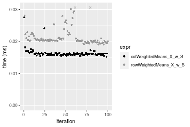
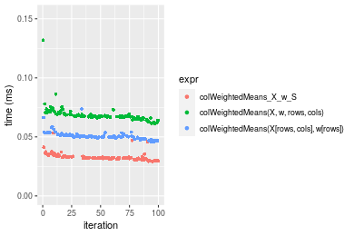

[matrixStats]: Benchmark report

---------------------------------------


# colWeightedMeans() and rowWeightedMeans() benchmarks on subsetted computation

This report benchmark the performance of colWeightedMeans() and rowWeightedMeans() on subsetted computation.


## Data
```r
> rmatrix <- function(nrow, ncol, mode = c("logical", "double", "integer", "index"), range = c(-100, 
+     +100), na_prob = 0) {
+     mode <- match.arg(mode)
+     n <- nrow * ncol
+     if (mode == "logical") {
+         x <- sample(c(FALSE, TRUE), size = n, replace = TRUE)
+     }     else if (mode == "index") {
+         x <- seq_len(n)
+         mode <- "integer"
+     }     else {
+         x <- runif(n, min = range[1], max = range[2])
+     }
+     storage.mode(x) <- mode
+     if (na_prob > 0) 
+         x[sample(n, size = na_prob * n)] <- NA
+     dim(x) <- c(nrow, ncol)
+     x
+ }
> rmatrices <- function(scale = 10, seed = 1, ...) {
+     set.seed(seed)
+     data <- list()
+     data[[1]] <- rmatrix(nrow = scale * 1, ncol = scale * 1, ...)
+     data[[2]] <- rmatrix(nrow = scale * 10, ncol = scale * 10, ...)
+     data[[3]] <- rmatrix(nrow = scale * 100, ncol = scale * 1, ...)
+     data[[4]] <- t(data[[3]])
+     data[[5]] <- rmatrix(nrow = scale * 10, ncol = scale * 100, ...)
+     data[[6]] <- t(data[[5]])
+     names(data) <- sapply(data, FUN = function(x) paste(dim(x), collapse = "x"))
+     data
+ }
> data <- rmatrices(mode = "double")
```

## Results

### 10x10 matrix


```r
> X <- data[["10x10"]]
> rows <- sample.int(nrow(X), size = nrow(X) * 0.7)
> cols <- sample.int(ncol(X), size = ncol(X) * 0.7)
> X_S <- X[rows, cols]
> w <- runif(nrow(X))
> w_S <- w[rows]
> gc()
           used  (Mb) gc trigger  (Mb) max used  (Mb)
Ncells  5327688 284.6    7916910 422.9  7916910 422.9
Vcells 10777907  82.3   33191153 253.3 53339345 407.0
> colStats <- microbenchmark(colWeightedMeans_X_w_S = colWeightedMeans(X_S, w = w_S, na.rm = FALSE), 
+     `colWeightedMeans(X, w, rows, cols)` = colWeightedMeans(X, w = w, rows = rows, cols = cols, na.rm = FALSE), 
+     `colWeightedMeans(X[rows, cols], w[rows])` = colWeightedMeans(X[rows, cols], w = w[rows], na.rm = FALSE), 
+     unit = "ms")
> X <- t(X)
> X_S <- t(X_S)
> gc()
           used  (Mb) gc trigger  (Mb) max used  (Mb)
Ncells  5328008 284.6    7916910 422.9  7916910 422.9
Vcells 10778913  82.3   33191153 253.3 53339345 407.0
> rowStats <- microbenchmark(rowWeightedMeans_X_w_S = rowWeightedMeans(X_S, w = w_S, na.rm = FALSE), 
+     `rowWeightedMeans(X, w, cols, rows)` = rowWeightedMeans(X, w = w, rows = cols, cols = rows, na.rm = FALSE), 
+     `rowWeightedMeans(X[cols, rows], w[rows])` = rowWeightedMeans(X[cols, rows], w = w[rows], na.rm = FALSE), 
+     unit = "ms")
```

_Table: Benchmarking of colWeightedMeans_X_w_S(), colWeightedMeans(X, w, rows, cols)() and colWeightedMeans(X[rows, cols], w[rows])() on 10x10 data. The top panel shows times in milliseconds and the bottom panel shows relative times._


|   |expr                                     |      min|        lq|      mean|    median|       uq|      max|
|:--|:----------------------------------------|--------:|---------:|---------:|---------:|--------:|--------:|
|1  |colWeightedMeans_X_w_S                   | 0.015171| 0.0158180| 0.0163423| 0.0160910| 0.016316| 0.027558|
|3  |colWeightedMeans(X[rows, cols], w[rows]) | 0.017381| 0.0179435| 0.0185034| 0.0181375| 0.018412| 0.034587|
|2  |colWeightedMeans(X, w, rows, cols)       | 0.018913| 0.0193955| 0.0246758| 0.0196560| 0.019909| 0.504739|


|   |expr                                     |      min|       lq|     mean|   median|       uq|       max|
|:--|:----------------------------------------|--------:|--------:|--------:|--------:|--------:|---------:|
|1  |colWeightedMeans_X_w_S                   | 1.000000| 1.000000| 1.000000| 1.000000| 1.000000|  1.000000|
|3  |colWeightedMeans(X[rows, cols], w[rows]) | 1.145673| 1.134372| 1.132238| 1.127183| 1.128463|  1.255062|
|2  |colWeightedMeans(X, w, rows, cols)       | 1.246655| 1.226166| 1.509933| 1.221552| 1.220213| 18.315516|

_Table: Benchmarking of rowWeightedMeans_X_w_S(), rowWeightedMeans(X, w, cols, rows)() and rowWeightedMeans(X[cols, rows], w[rows])() on 10x10 data (transposed). The top panel shows times in milliseconds and the bottom panel shows relative times._


|   |expr                                     |      min|        lq|      mean|    median|        uq|      max|
|:--|:----------------------------------------|--------:|---------:|---------:|---------:|---------:|--------:|
|1  |rowWeightedMeans_X_w_S                   | 0.019012| 0.0201135| 0.0215431| 0.0203670| 0.0214005| 0.034597|
|3  |rowWeightedMeans(X[cols, rows], w[rows]) | 0.020468| 0.0219490| 0.0247819| 0.0227865| 0.0261800| 0.057266|
|2  |rowWeightedMeans(X, w, cols, rows)       | 0.022483| 0.0239145| 0.0323603| 0.0243945| 0.0277340| 0.631384|


|   |expr                                     |      min|       lq|     mean|   median|       uq|      max|
|:--|:----------------------------------------|--------:|--------:|--------:|--------:|--------:|--------:|
|1  |rowWeightedMeans_X_w_S                   | 1.000000| 1.000000| 1.000000| 1.000000| 1.000000|  1.00000|
|3  |rowWeightedMeans(X[cols, rows], w[rows]) | 1.076583| 1.091257| 1.150340| 1.118795| 1.223336|  1.65523|
|2  |rowWeightedMeans(X, w, cols, rows)       | 1.182569| 1.188978| 1.502122| 1.197746| 1.295951| 18.24967|

_Figure: Benchmarking of colWeightedMeans_X_w_S(), colWeightedMeans(X, w, rows, cols)() and colWeightedMeans(X[rows, cols], w[rows])() on 10x10 data  as well as rowWeightedMeans_X_w_S(), rowWeightedMeans(X, w, cols, rows)() and rowWeightedMeans(X[cols, rows], w[rows])() on the same data transposed.  Outliers are displayed as crosses.  Times are in milliseconds._


_Table: Benchmarking of colWeightedMeans_X_w_S() and rowWeightedMeans_X_w_S() on 10x10 data (original and transposed).  The top panel shows times in milliseconds and the bottom panel shows relative times._


|   |expr                   |    min|      lq|     mean| median|      uq|    max|
|:--|:----------------------|------:|-------:|--------:|------:|-------:|------:|
|1  |colWeightedMeans_X_w_S | 15.171| 15.8180| 16.34232| 16.091| 16.3160| 27.558|
|2  |rowWeightedMeans_X_w_S | 19.012| 20.1135| 21.54308| 20.367| 21.4005| 34.597|


|   |expr                   |     min|       lq|     mean|   median|       uq|      max|
|:--|:----------------------|-------:|--------:|--------:|--------:|--------:|--------:|
|1  |colWeightedMeans_X_w_S | 1.00000| 1.000000| 1.000000| 1.000000| 1.000000| 1.000000|
|2  |rowWeightedMeans_X_w_S | 1.25318| 1.271558| 1.318239| 1.265739| 1.311627| 1.255425|

_Figure: Benchmarking of colWeightedMeans_X_w_S() and rowWeightedMeans_X_w_S() on 10x10 data (original and transposed).  Outliers are displayed as crosses. Times are in milliseconds._




### 100x100 matrix


```r
> X <- data[["100x100"]]
> rows <- sample.int(nrow(X), size = nrow(X) * 0.7)
> cols <- sample.int(ncol(X), size = ncol(X) * 0.7)
> X_S <- X[rows, cols]
> w <- runif(nrow(X))
> w_S <- w[rows]
> gc()
           used  (Mb) gc trigger  (Mb) max used  (Mb)
Ncells  5327177 284.6    7916910 422.9  7916910 422.9
Vcells 10449688  79.8   33191153 253.3 53339345 407.0
> colStats <- microbenchmark(colWeightedMeans_X_w_S = colWeightedMeans(X_S, w = w_S, na.rm = FALSE), 
+     `colWeightedMeans(X, w, rows, cols)` = colWeightedMeans(X, w = w, rows = rows, cols = cols, na.rm = FALSE), 
+     `colWeightedMeans(X[rows, cols], w[rows])` = colWeightedMeans(X[rows, cols], w = w[rows], na.rm = FALSE), 
+     unit = "ms")
> X <- t(X)
> X_S <- t(X_S)
> gc()
           used  (Mb) gc trigger  (Mb) max used  (Mb)
Ncells  5327171 284.6    7916910 422.9  7916910 422.9
Vcells 10459771  79.9   33191153 253.3 53339345 407.0
> rowStats <- microbenchmark(rowWeightedMeans_X_w_S = rowWeightedMeans(X_S, w = w_S, na.rm = FALSE), 
+     `rowWeightedMeans(X, w, cols, rows)` = rowWeightedMeans(X, w = w, rows = cols, cols = rows, na.rm = FALSE), 
+     `rowWeightedMeans(X[cols, rows], w[rows])` = rowWeightedMeans(X[cols, rows], w = w[rows], na.rm = FALSE), 
+     unit = "ms")
```

_Table: Benchmarking of colWeightedMeans_X_w_S(), colWeightedMeans(X, w, rows, cols)() and colWeightedMeans(X[rows, cols], w[rows])() on 100x100 data. The top panel shows times in milliseconds and the bottom panel shows relative times._


|   |expr                                     |      min|        lq|      mean|    median|       uq|      max|
|:--|:----------------------------------------|--------:|---------:|---------:|---------:|--------:|--------:|
|1  |colWeightedMeans_X_w_S                   | 0.029270| 0.0316210| 0.0329605| 0.0321040| 0.033290| 0.053265|
|3  |colWeightedMeans(X[rows, cols], w[rows]) | 0.046053| 0.0494960| 0.0507809| 0.0501865| 0.051381| 0.073676|
|2  |colWeightedMeans(X, w, rows, cols)       | 0.061366| 0.0665215| 0.0686374| 0.0674395| 0.069121| 0.131850|


|   |expr                                     |      min|       lq|     mean|   median|       uq|      max|
|:--|:----------------------------------------|--------:|--------:|--------:|--------:|--------:|--------:|
|1  |colWeightedMeans_X_w_S                   | 1.000000| 1.000000| 1.000000| 1.000000| 1.000000| 1.000000|
|3  |colWeightedMeans(X[rows, cols], w[rows]) | 1.573386| 1.565289| 1.540660| 1.563248| 1.543437| 1.383197|
|2  |colWeightedMeans(X, w, rows, cols)       | 2.096549| 2.103713| 2.082418| 2.100657| 2.076329| 2.475359|

_Table: Benchmarking of rowWeightedMeans_X_w_S(), rowWeightedMeans(X, w, cols, rows)() and rowWeightedMeans(X[cols, rows], w[rows])() on 100x100 data (transposed). The top panel shows times in milliseconds and the bottom panel shows relative times._


|   |expr                                     |      min|        lq|      mean|   median|       uq|      max|
|:--|:----------------------------------------|--------:|---------:|---------:|--------:|--------:|--------:|
|1  |rowWeightedMeans_X_w_S                   | 0.074601| 0.0780525| 0.0887749| 0.086913| 0.098268| 0.116026|
|3  |rowWeightedMeans(X[cols, rows], w[rows]) | 0.088196| 0.0930250| 0.1051482| 0.102477| 0.113152| 0.204930|
|2  |rowWeightedMeans(X, w, cols, rows)       | 0.102206| 0.1074345| 0.1196216| 0.116328| 0.130697| 0.159276|


|   |expr                                     |      min|       lq|     mean|   median|       uq|      max|
|:--|:----------------------------------------|--------:|--------:|--------:|--------:|--------:|--------:|
|1  |rowWeightedMeans_X_w_S                   | 1.000000| 1.000000| 1.000000| 1.000000| 1.000000| 1.000000|
|3  |rowWeightedMeans(X[cols, rows], w[rows]) | 1.182236| 1.191826| 1.184436| 1.179076| 1.151463| 1.766242|
|2  |rowWeightedMeans(X, w, cols, rows)       | 1.370035| 1.376439| 1.347472| 1.338442| 1.330006| 1.372761|

_Figure: Benchmarking of colWeightedMeans_X_w_S(), colWeightedMeans(X, w, rows, cols)() and colWeightedMeans(X[rows, cols], w[rows])() on 100x100 data  as well as rowWeightedMeans_X_w_S(), rowWeightedMeans(X, w, cols, rows)() and rowWeightedMeans(X[cols, rows], w[rows])() on the same data transposed.  Outliers are displayed as crosses.  Times are in milliseconds._





_Table: Benchmarking of colWeightedMeans_X_w_S() and rowWeightedMeans_X_w_S() on 100x100 data (original and transposed).  The top panel shows times in milliseconds and the bottom panel shows relative times._


|   |expr                   |    min|      lq|     mean| median|     uq|     max|
|:--|:----------------------|------:|-------:|--------:|------:|------:|-------:|
|1  |colWeightedMeans_X_w_S | 29.270| 31.6210| 32.96046| 32.104| 33.290|  53.265|
|2  |rowWeightedMeans_X_w_S | 74.601| 78.0525| 88.77487| 86.913| 98.268| 116.026|


|   |expr                   |      min|       lq|     mean|   median|       uq|      max|
|:--|:----------------------|--------:|--------:|--------:|--------:|--------:|--------:|
|1  |colWeightedMeans_X_w_S | 1.000000| 1.000000| 1.000000| 1.000000| 1.000000| 1.000000|
|2  |rowWeightedMeans_X_w_S | 2.548719| 2.468375| 2.693375| 2.707233| 2.951877| 2.178278|

_Figure: Benchmarking of colWeightedMeans_X_w_S() and rowWeightedMeans_X_w_S() on 100x100 data (original and transposed).  Outliers are displayed as crosses. Times are in milliseconds._


### 1000x10 matrix


```r
> X <- data[["1000x10"]]
> rows <- sample.int(nrow(X), size = nrow(X) * 0.7)
> cols <- sample.int(ncol(X), size = ncol(X) * 0.7)
> X_S <- X[rows, cols]
> w <- runif(nrow(X))
> w_S <- w[rows]
> gc()
           used  (Mb) gc trigger  (Mb) max used  (Mb)
Ncells  5327927 284.6    7916910 422.9  7916910 422.9
Vcells 10455614  79.8   33191153 253.3 53339345 407.0
> colStats <- microbenchmark(colWeightedMeans_X_w_S = colWeightedMeans(X_S, w = w_S, na.rm = FALSE), 
+     `colWeightedMeans(X, w, rows, cols)` = colWeightedMeans(X, w = w, rows = rows, cols = cols, na.rm = FALSE), 
+     `colWeightedMeans(X[rows, cols], w[rows])` = colWeightedMeans(X[rows, cols], w = w[rows], na.rm = FALSE), 
+     unit = "ms")
> X <- t(X)
> X_S <- t(X_S)
> gc()
           used  (Mb) gc trigger  (Mb) max used  (Mb)
Ncells  5327921 284.6    7916910 422.9  7916910 422.9
Vcells 10465697  79.9   33191153 253.3 53339345 407.0
> rowStats <- microbenchmark(rowWeightedMeans_X_w_S = rowWeightedMeans(X_S, w = w_S, na.rm = FALSE), 
+     `rowWeightedMeans(X, w, cols, rows)` = rowWeightedMeans(X, w = w, rows = cols, cols = rows, na.rm = FALSE), 
+     `rowWeightedMeans(X[cols, rows], w[rows])` = rowWeightedMeans(X[cols, rows], w = w[rows], na.rm = FALSE), 
+     unit = "ms")
```

_Table: Benchmarking of colWeightedMeans_X_w_S(), colWeightedMeans(X, w, rows, cols)() and colWeightedMeans(X[rows, cols], w[rows])() on 1000x10 data. The top panel shows times in milliseconds and the bottom panel shows relative times._


|   |expr                                     |      min|        lq|      mean|    median|        uq|      max|
|:--|:----------------------------------------|--------:|---------:|---------:|---------:|---------:|--------:|
|1  |colWeightedMeans_X_w_S                   | 0.038916| 0.0417615| 0.0443260| 0.0440560| 0.0466310| 0.058755|
|3  |colWeightedMeans(X[rows, cols], w[rows]) | 0.056890| 0.0600515| 0.0641121| 0.0636985| 0.0675890| 0.080929|
|2  |colWeightedMeans(X, w, rows, cols)       | 0.075096| 0.0796090| 0.0849957| 0.0845720| 0.0891025| 0.156608|


|   |expr                                     |      min|       lq|     mean|   median|       uq|      max|
|:--|:----------------------------------------|--------:|--------:|--------:|--------:|--------:|--------:|
|1  |colWeightedMeans_X_w_S                   | 1.000000| 1.000000| 1.000000| 1.000000| 1.000000| 1.000000|
|3  |colWeightedMeans(X[rows, cols], w[rows]) | 1.461867| 1.437963| 1.446378| 1.445853| 1.449444| 1.377398|
|2  |colWeightedMeans(X, w, rows, cols)       | 1.929695| 1.906277| 1.917515| 1.919648| 1.910800| 2.665441|

_Table: Benchmarking of rowWeightedMeans_X_w_S(), rowWeightedMeans(X, w, cols, rows)() and rowWeightedMeans(X[cols, rows], w[rows])() on 1000x10 data (transposed). The top panel shows times in milliseconds and the bottom panel shows relative times._


|   |expr                                     |      min|        lq|      mean|    median|        uq|      max|
|:--|:----------------------------------------|--------:|---------:|---------:|---------:|---------:|--------:|
|1  |rowWeightedMeans_X_w_S                   | 0.084563| 0.0883740| 0.0956230| 0.0913750| 0.1061175| 0.119929|
|3  |rowWeightedMeans(X[cols, rows], w[rows]) | 0.102313| 0.1069370| 0.1178380| 0.1142950| 0.1300995| 0.140903|
|2  |rowWeightedMeans(X, w, cols, rows)       | 0.119662| 0.1268015| 0.1400416| 0.1361275| 0.1521595| 0.237710|


|   |expr                                     |      min|       lq|     mean|   median|       uq|      max|
|:--|:----------------------------------------|--------:|--------:|--------:|--------:|--------:|--------:|
|1  |rowWeightedMeans_X_w_S                   | 1.000000| 1.000000| 1.000000| 1.000000| 1.000000| 1.000000|
|3  |rowWeightedMeans(X[cols, rows], w[rows]) | 1.209903| 1.210050| 1.232319| 1.250835| 1.225995| 1.174887|
|2  |rowWeightedMeans(X, w, cols, rows)       | 1.415063| 1.434828| 1.464517| 1.489767| 1.433877| 1.982089|

_Figure: Benchmarking of colWeightedMeans_X_w_S(), colWeightedMeans(X, w, rows, cols)() and colWeightedMeans(X[rows, cols], w[rows])() on 1000x10 data  as well as rowWeightedMeans_X_w_S(), rowWeightedMeans(X, w, cols, rows)() and rowWeightedMeans(X[cols, rows], w[rows])() on the same data transposed.  Outliers are displayed as crosses.  Times are in milliseconds._


_Table: Benchmarking of colWeightedMeans_X_w_S() and rowWeightedMeans_X_w_S() on 1000x10 data (original and transposed).  The top panel shows times in milliseconds and the bottom panel shows relative times._


|   |expr                   |    min|      lq|     mean| median|       uq|     max|
|:--|:----------------------|------:|-------:|--------:|------:|--------:|-------:|
|1  |colWeightedMeans_X_w_S | 38.916| 41.7615| 44.32595| 44.056|  46.6310|  58.755|
|2  |rowWeightedMeans_X_w_S | 84.563| 88.3740| 95.62305| 91.375| 106.1175| 119.929|


|   |expr                   |      min|      lq|    mean|   median|       uq|      max|
|:--|:----------------------|--------:|-------:|-------:|--------:|--------:|--------:|
|1  |colWeightedMeans_X_w_S | 1.000000| 1.00000| 1.00000| 1.000000| 1.000000| 1.000000|
|2  |rowWeightedMeans_X_w_S | 2.172962| 2.11616| 2.15727| 2.074065| 2.275686| 2.041171|

_Figure: Benchmarking of colWeightedMeans_X_w_S() and rowWeightedMeans_X_w_S() on 1000x10 data (original and transposed).  Outliers are displayed as crosses. Times are in milliseconds._


### 10x1000 matrix


```r
> X <- data[["10x1000"]]
> rows <- sample.int(nrow(X), size = nrow(X) * 0.7)
> cols <- sample.int(ncol(X), size = ncol(X) * 0.7)
> X_S <- X[rows, cols]
> w <- runif(nrow(X))
> w_S <- w[rows]
> gc()
           used  (Mb) gc trigger  (Mb) max used  (Mb)
Ncells  5328139 284.6    7916910 422.9  7916910 422.9
Vcells 10454903  79.8   33191153 253.3 53339345 407.0
> colStats <- microbenchmark(colWeightedMeans_X_w_S = colWeightedMeans(X_S, w = w_S, na.rm = FALSE), 
+     `colWeightedMeans(X, w, rows, cols)` = colWeightedMeans(X, w = w, rows = rows, cols = cols, na.rm = FALSE), 
+     `colWeightedMeans(X[rows, cols], w[rows])` = colWeightedMeans(X[rows, cols], w = w[rows], na.rm = FALSE), 
+     unit = "ms")
> X <- t(X)
> X_S <- t(X_S)
> gc()
           used  (Mb) gc trigger  (Mb) max used  (Mb)
Ncells  5328133 284.6    7916910 422.9  7916910 422.9
Vcells 10464986  79.9   33191153 253.3 53339345 407.0
> rowStats <- microbenchmark(rowWeightedMeans_X_w_S = rowWeightedMeans(X_S, w = w_S, na.rm = FALSE), 
+     `rowWeightedMeans(X, w, cols, rows)` = rowWeightedMeans(X, w = w, rows = cols, cols = rows, na.rm = FALSE), 
+     `rowWeightedMeans(X[cols, rows], w[rows])` = rowWeightedMeans(X[cols, rows], w = w[rows], na.rm = FALSE), 
+     unit = "ms")
```

_Table: Benchmarking of colWeightedMeans_X_w_S(), colWeightedMeans(X, w, rows, cols)() and colWeightedMeans(X[rows, cols], w[rows])() on 10x1000 data. The top panel shows times in milliseconds and the bottom panel shows relative times._


|   |expr                                     |      min|        lq|      mean|    median|       uq|      max|
|:--|:----------------------------------------|--------:|---------:|---------:|---------:|--------:|--------:|
|1  |colWeightedMeans_X_w_S                   | 0.027334| 0.0291200| 0.0317376| 0.0305235| 0.031303| 0.134176|
|3  |colWeightedMeans(X[rows, cols], w[rows]) | 0.045773| 0.0486295| 0.0515463| 0.0517670| 0.052761| 0.074724|
|2  |colWeightedMeans(X, w, rows, cols)       | 0.063654| 0.0672375| 0.0704083| 0.0716180| 0.072744| 0.080886|


|   |expr                                     |      min|       lq|     mean|   median|       uq|       max|
|:--|:----------------------------------------|--------:|--------:|--------:|--------:|--------:|---------:|
|1  |colWeightedMeans_X_w_S                   | 1.000000| 1.000000| 1.000000| 1.000000| 1.000000| 1.0000000|
|3  |colWeightedMeans(X[rows, cols], w[rows]) | 1.674581| 1.669969| 1.624137| 1.695972| 1.685493| 0.5569103|
|2  |colWeightedMeans(X, w, rows, cols)       | 2.328748| 2.308980| 2.218446| 2.346323| 2.323867| 0.6028351|

_Table: Benchmarking of rowWeightedMeans_X_w_S(), rowWeightedMeans(X, w, cols, rows)() and rowWeightedMeans(X[cols, rows], w[rows])() on 10x1000 data (transposed). The top panel shows times in milliseconds and the bottom panel shows relative times._


|   |expr                                     |      min|        lq|      mean|    median|        uq|      max|
|:--|:----------------------------------------|--------:|---------:|---------:|---------:|---------:|--------:|
|1  |rowWeightedMeans_X_w_S                   | 0.074186| 0.0777535| 0.0873818| 0.0880925| 0.0958035| 0.109595|
|3  |rowWeightedMeans(X[cols, rows], w[rows]) | 0.087743| 0.0916445| 0.1014660| 0.0984410| 0.1137795| 0.123370|
|2  |rowWeightedMeans(X, w, cols, rows)       | 0.101177| 0.1059545| 0.1182516| 0.1131520| 0.1313915| 0.207479|


|   |expr                                     |      min|       lq|     mean|   median|       uq|      max|
|:--|:----------------------------------------|--------:|--------:|--------:|--------:|--------:|--------:|
|1  |rowWeightedMeans_X_w_S                   | 1.000000| 1.000000| 1.000000| 1.000000| 1.000000| 1.000000|
|3  |rowWeightedMeans(X[cols, rows], w[rows]) | 1.182743| 1.178654| 1.161180| 1.117473| 1.187634| 1.125690|
|2  |rowWeightedMeans(X, w, cols, rows)       | 1.363829| 1.362697| 1.353274| 1.284468| 1.371469| 1.893143|

_Figure: Benchmarking of colWeightedMeans_X_w_S(), colWeightedMeans(X, w, rows, cols)() and colWeightedMeans(X[rows, cols], w[rows])() on 10x1000 data  as well as rowWeightedMeans_X_w_S(), rowWeightedMeans(X, w, cols, rows)() and rowWeightedMeans(X[cols, rows], w[rows])() on the same data transposed.  Outliers are displayed as crosses.  Times are in milliseconds._


_Table: Benchmarking of colWeightedMeans_X_w_S() and rowWeightedMeans_X_w_S() on 10x1000 data (original and transposed).  The top panel shows times in milliseconds and the bottom panel shows relative times._


|   |expr                   |    min|      lq|     mean|  median|      uq|     max|
|:--|:----------------------|------:|-------:|--------:|-------:|-------:|-------:|
|1  |colWeightedMeans_X_w_S | 27.334| 29.1200| 31.73765| 30.5235| 31.3030| 134.176|
|2  |rowWeightedMeans_X_w_S | 74.186| 77.7535| 87.38180| 88.0925| 95.8035| 109.595|


|   |expr                   |      min|       lq|     mean|   median|       uq|       max|
|:--|:----------------------|--------:|--------:|--------:|--------:|--------:|---------:|
|1  |colWeightedMeans_X_w_S | 1.000000| 1.000000| 1.000000| 1.000000| 1.000000| 1.0000000|
|2  |rowWeightedMeans_X_w_S | 2.714056| 2.670107| 2.753254| 2.886055| 3.060521| 0.8168003|

_Figure: Benchmarking of colWeightedMeans_X_w_S() and rowWeightedMeans_X_w_S() on 10x1000 data (original and transposed).  Outliers are displayed as crosses. Times are in milliseconds._


### 100x1000 matrix


```r
> X <- data[["100x1000"]]
> rows <- sample.int(nrow(X), size = nrow(X) * 0.7)
> cols <- sample.int(ncol(X), size = ncol(X) * 0.7)
> X_S <- X[rows, cols]
> w <- runif(nrow(X))
> w_S <- w[rows]
> gc()
           used  (Mb) gc trigger  (Mb) max used  (Mb)
Ncells  5328347 284.6    7916910 422.9  7916910 422.9
Vcells 10499858  80.2   33191153 253.3 53339345 407.0
> colStats <- microbenchmark(colWeightedMeans_X_w_S = colWeightedMeans(X_S, w = w_S, na.rm = FALSE), 
+     `colWeightedMeans(X, w, rows, cols)` = colWeightedMeans(X, w = w, rows = rows, cols = cols, na.rm = FALSE), 
+     `colWeightedMeans(X[rows, cols], w[rows])` = colWeightedMeans(X[rows, cols], w = w[rows], na.rm = FALSE), 
+     unit = "ms")
> X <- t(X)
> X_S <- t(X_S)
> gc()
           used  (Mb) gc trigger  (Mb) max used  (Mb)
Ncells  5328341 284.6    7916910 422.9  7916910 422.9
Vcells 10599941  80.9   33191153 253.3 53339345 407.0
> rowStats <- microbenchmark(rowWeightedMeans_X_w_S = rowWeightedMeans(X_S, w = w_S, na.rm = FALSE), 
+     `rowWeightedMeans(X, w, cols, rows)` = rowWeightedMeans(X, w = w, rows = cols, cols = rows, na.rm = FALSE), 
+     `rowWeightedMeans(X[cols, rows], w[rows])` = rowWeightedMeans(X[cols, rows], w = w[rows], na.rm = FALSE), 
+     unit = "ms")
```

_Table: Benchmarking of colWeightedMeans_X_w_S(), colWeightedMeans(X, w, rows, cols)() and colWeightedMeans(X[rows, cols], w[rows])() on 100x1000 data. The top panel shows times in milliseconds and the bottom panel shows relative times._


|   |expr                                     |      min|        lq|      mean|    median|        uq|       max|
|:--|:----------------------------------------|--------:|---------:|---------:|---------:|---------:|---------:|
|1  |colWeightedMeans_X_w_S                   | 0.108428| 0.1168360| 0.1528727| 0.1272540| 0.2098625|  0.259869|
|3  |colWeightedMeans(X[rows, cols], w[rows]) | 0.227391| 0.2393220| 0.3090473| 0.2617915| 0.4170575|  0.500458|
|2  |colWeightedMeans(X, w, rows, cols)       | 0.343611| 0.3620755| 0.5765176| 0.4073580| 0.6181440| 10.841309|


|   |expr                                     |      min|       lq|     mean|   median|       uq|       max|
|:--|:----------------------------------------|--------:|--------:|--------:|--------:|--------:|---------:|
|1  |colWeightedMeans_X_w_S                   | 1.000000| 1.000000| 1.000000| 1.000000| 1.000000|  1.000000|
|3  |colWeightedMeans(X[rows, cols], w[rows]) | 2.097161| 2.048358| 2.021600| 2.057236| 1.987289|  1.925809|
|2  |colWeightedMeans(X, w, rows, cols)       | 3.169025| 3.099006| 3.771227| 3.201141| 2.945471| 41.718362|

_Table: Benchmarking of rowWeightedMeans_X_w_S(), rowWeightedMeans(X, w, cols, rows)() and rowWeightedMeans(X[cols, rows], w[rows])() on 100x1000 data (transposed). The top panel shows times in milliseconds and the bottom panel shows relative times._


|   |expr                                     |      min|        lq|      mean|    median|        uq|       max|
|:--|:----------------------------------------|--------:|---------:|---------:|---------:|---------:|---------:|
|1  |rowWeightedMeans_X_w_S                   | 0.467192| 0.5749695| 0.7012377| 0.5907415| 0.6168725| 10.128518|
|3  |rowWeightedMeans(X[cols, rows], w[rows]) | 0.560519| 0.7025095| 0.7616442| 0.7902015| 0.8076905|  1.122994|
|2  |rowWeightedMeans(X, w, cols, rows)       | 0.655268| 0.8022210| 0.9124271| 0.9097415| 1.0074615|  1.574210|


|   |expr                                     |      min|       lq|     mean|   median|       uq|       max|
|:--|:----------------------------------------|--------:|--------:|--------:|--------:|--------:|---------:|
|1  |rowWeightedMeans_X_w_S                   | 1.000000| 1.000000| 1.000000| 1.000000| 1.000000| 1.0000000|
|3  |rowWeightedMeans(X[cols, rows], w[rows]) | 1.199762| 1.221820| 1.086143| 1.337643| 1.309331| 0.1108745|
|2  |rowWeightedMeans(X, w, cols, rows)       | 1.402567| 1.395241| 1.301167| 1.539999| 1.633176| 0.1554235|

_Figure: Benchmarking of colWeightedMeans_X_w_S(), colWeightedMeans(X, w, rows, cols)() and colWeightedMeans(X[rows, cols], w[rows])() on 100x1000 data  as well as rowWeightedMeans_X_w_S(), rowWeightedMeans(X, w, cols, rows)() and rowWeightedMeans(X[cols, rows], w[rows])() on the same data transposed.  Outliers are displayed as crosses.  Times are in milliseconds._


_Table: Benchmarking of colWeightedMeans_X_w_S() and rowWeightedMeans_X_w_S() on 100x1000 data (original and transposed).  The top panel shows times in milliseconds and the bottom panel shows relative times._


|   |expr                   |     min|       lq|     mean|   median|       uq|       max|
|:--|:----------------------|-------:|--------:|--------:|--------:|--------:|---------:|
|1  |colWeightedMeans_X_w_S | 108.428| 116.8360| 152.8727| 127.2540| 209.8625|   259.869|
|2  |rowWeightedMeans_X_w_S | 467.192| 574.9695| 701.2377| 590.7415| 616.8725| 10128.518|


|   |expr                   |      min|       lq|    mean|   median|       uq|      max|
|:--|:----------------------|--------:|--------:|-------:|--------:|--------:|--------:|
|1  |colWeightedMeans_X_w_S | 1.000000| 1.000000| 1.00000| 1.000000| 1.000000|  1.00000|
|2  |rowWeightedMeans_X_w_S | 4.308776| 4.921167| 4.58707| 4.642223| 2.939413| 38.97548|

_Figure: Benchmarking of colWeightedMeans_X_w_S() and rowWeightedMeans_X_w_S() on 100x1000 data (original and transposed).  Outliers are displayed as crosses. Times are in milliseconds._


### 1000x100 matrix


```r
> X <- data[["1000x100"]]
> rows <- sample.int(nrow(X), size = nrow(X) * 0.7)
> cols <- sample.int(ncol(X), size = ncol(X) * 0.7)
> X_S <- X[rows, cols]
> w <- runif(nrow(X))
> w_S <- w[rows]
> gc()
           used  (Mb) gc trigger  (Mb) max used  (Mb)
Ncells  5328553 284.6    7916910 422.9  7916910 422.9
Vcells 10502170  80.2   33191153 253.3 53339345 407.0
> colStats <- microbenchmark(colWeightedMeans_X_w_S = colWeightedMeans(X_S, w = w_S, na.rm = FALSE), 
+     `colWeightedMeans(X, w, rows, cols)` = colWeightedMeans(X, w = w, rows = rows, cols = cols, na.rm = FALSE), 
+     `colWeightedMeans(X[rows, cols], w[rows])` = colWeightedMeans(X[rows, cols], w = w[rows], na.rm = FALSE), 
+     unit = "ms")
> X <- t(X)
> X_S <- t(X_S)
> gc()
           used  (Mb) gc trigger  (Mb) max used  (Mb)
Ncells  5328547 284.6    7916910 422.9  7916910 422.9
Vcells 10602253  80.9   33191153 253.3 53339345 407.0
> rowStats <- microbenchmark(rowWeightedMeans_X_w_S = rowWeightedMeans(X_S, w = w_S, na.rm = FALSE), 
+     `rowWeightedMeans(X, w, cols, rows)` = rowWeightedMeans(X, w = w, rows = cols, cols = rows, na.rm = FALSE), 
+     `rowWeightedMeans(X[cols, rows], w[rows])` = rowWeightedMeans(X[cols, rows], w = w[rows], na.rm = FALSE), 
+     unit = "ms")
```

_Table: Benchmarking of colWeightedMeans_X_w_S(), colWeightedMeans(X, w, rows, cols)() and colWeightedMeans(X[rows, cols], w[rows])() on 1000x100 data. The top panel shows times in milliseconds and the bottom panel shows relative times._


|   |expr                                     |      min|        lq|      mean|   median|        uq|       max|
|:--|:----------------------------------------|--------:|---------:|---------:|--------:|---------:|---------:|
|1  |colWeightedMeans_X_w_S                   | 0.135671| 0.1487570| 0.1959958| 0.171817| 0.2450590|  0.324342|
|3  |colWeightedMeans(X[rows, cols], w[rows]) | 0.257533| 0.2677835| 0.4755548| 0.315645| 0.4969675| 10.618271|
|2  |colWeightedMeans(X, w, rows, cols)       | 0.380244| 0.4110905| 0.5569525| 0.481159| 0.7341595|  0.925653|


|   |expr                                     |      min|       lq|     mean|   median|       uq|       max|
|:--|:----------------------------------------|--------:|--------:|--------:|--------:|--------:|---------:|
|1  |colWeightedMeans_X_w_S                   | 1.000000| 1.000000| 1.000000| 1.000000| 1.000000|  1.000000|
|3  |colWeightedMeans(X[rows, cols], w[rows]) | 1.898217| 1.800140| 2.426353| 1.837100| 2.027950| 32.737885|
|2  |colWeightedMeans(X, w, rows, cols)       | 2.802692| 2.763504| 2.841656| 2.800416| 2.995848|  2.853941|

_Table: Benchmarking of rowWeightedMeans_X_w_S(), rowWeightedMeans(X, w, cols, rows)() and rowWeightedMeans(X[cols, rows], w[rows])() on 1000x100 data (transposed). The top panel shows times in milliseconds and the bottom panel shows relative times._


|   |expr                                     |      min|        lq|      mean|   median|        uq|      max|
|:--|:----------------------------------------|--------:|---------:|---------:|--------:|---------:|--------:|
|1  |rowWeightedMeans_X_w_S                   | 0.472588| 0.5570490| 0.5858299| 0.591656| 0.6018410| 0.793143|
|3  |rowWeightedMeans(X[cols, rows], w[rows]) | 0.570157| 0.6293985| 0.7271596| 0.721855| 0.8063925| 1.541236|
|2  |rowWeightedMeans(X, w, cols, rows)       | 0.668604| 0.7962930| 0.9796982| 0.917700| 1.0258700| 7.592066|


|   |expr                                     |      min|       lq|     mean|   median|       uq|      max|
|:--|:----------------------------------------|--------:|--------:|--------:|--------:|--------:|--------:|
|1  |rowWeightedMeans_X_w_S                   | 1.000000| 1.000000| 1.000000| 1.000000| 1.000000| 1.000000|
|3  |rowWeightedMeans(X[cols, rows], w[rows]) | 1.206457| 1.129880| 1.241247| 1.220059| 1.339876| 1.943201|
|2  |rowWeightedMeans(X, w, cols, rows)       | 1.414771| 1.429485| 1.672325| 1.551070| 1.704553| 9.572128|

_Figure: Benchmarking of colWeightedMeans_X_w_S(), colWeightedMeans(X, w, rows, cols)() and colWeightedMeans(X[rows, cols], w[rows])() on 1000x100 data  as well as rowWeightedMeans_X_w_S(), rowWeightedMeans(X, w, cols, rows)() and rowWeightedMeans(X[cols, rows], w[rows])() on the same data transposed.  Outliers are displayed as crosses.  Times are in milliseconds._


_Table: Benchmarking of colWeightedMeans_X_w_S() and rowWeightedMeans_X_w_S() on 1000x100 data (original and transposed).  The top panel shows times in milliseconds and the bottom panel shows relative times._


|   |expr                   |     min|      lq|     mean|  median|      uq|     max|
|:--|:----------------------|-------:|-------:|--------:|-------:|-------:|-------:|
|1  |colWeightedMeans_X_w_S | 135.671| 148.757| 195.9958| 171.817| 245.059| 324.342|
|2  |rowWeightedMeans_X_w_S | 472.588| 557.049| 585.8299| 591.656| 601.841| 793.143|


|   |expr                   |      min|       lq|     mean|   median|       uq|      max|
|:--|:----------------------|--------:|--------:|--------:|--------:|--------:|--------:|
|1  |colWeightedMeans_X_w_S | 1.000000| 1.000000| 1.000000| 1.000000| 1.000000| 1.000000|
|2  |rowWeightedMeans_X_w_S | 3.483338| 3.744691| 2.988993| 3.443524| 2.455903| 2.445391|

_Figure: Benchmarking of colWeightedMeans_X_w_S() and rowWeightedMeans_X_w_S() on 1000x100 data (original and transposed).  Outliers are displayed as crosses. Times are in milliseconds._


## Appendix

### Session information
```r
R version 4.1.1 Patched (2021-08-10 r80727)
Platform: x86_64-pc-linux-gnu (64-bit)
Running under: Ubuntu 18.04.5 LTS

Matrix products: default
BLAS:   /home/hb/software/R-devel/R-4-1-branch/lib/R/lib/libRblas.so
LAPACK: /home/hb/software/R-devel/R-4-1-branch/lib/R/lib/libRlapack.so

locale:
 [1] LC_CTYPE=en_US.UTF-8       LC_NUMERIC=C              
 [3] LC_TIME=en_US.UTF-8        LC_COLLATE=en_US.UTF-8    
 [5] LC_MONETARY=en_US.UTF-8    LC_MESSAGES=en_US.UTF-8   
 [7] LC_PAPER=en_US.UTF-8       LC_NAME=C                 
 [9] LC_ADDRESS=C               LC_TELEPHONE=C            
[11] LC_MEASUREMENT=en_US.UTF-8 LC_IDENTIFICATION=C       

attached base packages:
[1] stats     graphics  grDevices utils     datasets  methods   base     

other attached packages:
[1] microbenchmark_1.4-7   matrixStats_0.60.0     ggplot2_3.3.5         
[4] knitr_1.33             R.devices_2.17.0       R.utils_2.10.1        
[7] R.oo_1.24.0            R.methodsS3_1.8.1-9001 history_0.0.1-9000    

loaded via a namespace (and not attached):
 [1] Biobase_2.52.0          httr_1.4.2              splines_4.1.1          
 [4] bit64_4.0.5             network_1.17.1          assertthat_0.2.1       
 [7] highr_0.9               stats4_4.1.1            blob_1.2.2             
[10] GenomeInfoDbData_1.2.6  robustbase_0.93-8       pillar_1.6.2           
[13] RSQLite_2.2.8           lattice_0.20-44         glue_1.4.2             
[16] digest_0.6.27           XVector_0.32.0          colorspace_2.0-2       
[19] Matrix_1.3-4            XML_3.99-0.7            pkgconfig_2.0.3        
[22] zlibbioc_1.38.0         genefilter_1.74.0       purrr_0.3.4            
[25] ergm_4.1.2              xtable_1.8-4            scales_1.1.1           
[28] tibble_3.1.4            annotate_1.70.0         KEGGREST_1.32.0        
[31] farver_2.1.0            generics_0.1.0          IRanges_2.26.0         
[34] ellipsis_0.3.2          cachem_1.0.6            withr_2.4.2            
[37] BiocGenerics_0.38.0     mime_0.11               survival_3.2-13        
[40] magrittr_2.0.1          crayon_1.4.1            statnet.common_4.5.0   
[43] memoise_2.0.0           laeken_0.5.1            fansi_0.5.0            
[46] R.cache_0.15.0          MASS_7.3-54             R.rsp_0.44.0           
[49] progressr_0.8.0         tools_4.1.1             lifecycle_1.0.0        
[52] S4Vectors_0.30.0        trust_0.1-8             munsell_0.5.0          
[55] tabby_0.0.1-9001        AnnotationDbi_1.54.1    Biostrings_2.60.2      
[58] compiler_4.1.1          GenomeInfoDb_1.28.1     rlang_0.4.11           
[61] grid_4.1.1              RCurl_1.98-1.4          cwhmisc_6.6            
[64] rstudioapi_0.13         rappdirs_0.3.3          startup_0.15.0         
[67] labeling_0.4.2          bitops_1.0-7            base64enc_0.1-3        
[70] boot_1.3-28             gtable_0.3.0            DBI_1.1.1              
[73] markdown_1.1            R6_2.5.1                lpSolveAPI_5.5.2.0-17.7
[76] rle_0.9.2               dplyr_1.0.7             fastmap_1.1.0          
[79] bit_4.0.4               utf8_1.2.2              parallel_4.1.1         
[82] Rcpp_1.0.7              vctrs_0.3.8             png_0.1-7              
[85] DEoptimR_1.0-9          tidyselect_1.1.1        xfun_0.25              
[88] coda_0.19-4            
```
Total processing time was 13.02 secs.


### Reproducibility
To reproduce this report, do:
```r
html <- matrixStats:::benchmark('colRowWeightedMeans_subset')
```

[RSP]: https://cran.r-project.org/package=R.rsp
[matrixStats]: https://cran.r-project.org/package=matrixStats

[StackOverflow:colMins?]: https://stackoverflow.com/questions/13676878 "Stack Overflow: fastest way to get Min from every column in a matrix?"
[StackOverflow:colSds?]: https://stackoverflow.com/questions/17549762 "Stack Overflow: Is there such 'colsd' in R?"
[StackOverflow:rowProds?]: https://stackoverflow.com/questions/20198801/ "Stack Overflow: Row product of matrix and column sum of matrix"

---------------------------------------
Copyright Dongcan Jiang. Last updated on 2021-08-25 22:31:53 (+0200 UTC). Powered by [RSP].

<script>
 var link = document.createElement('link');
 link.rel = 'icon';
 link.href = "data:image/png;base64,iVBORw0KGgoAAAANSUhEUgAAACAAAAAgCAMAAABEpIrGAAAA21BMVEUAAAAAAP8AAP8AAP8AAP8AAP8AAP8AAP8AAP8AAP8AAP8AAP8AAP8AAP8AAP8AAP8AAP8AAP8AAP8AAP8AAP8AAP8AAP8AAP8AAP8AAP8AAP8AAP8AAP8AAP8AAP8AAP8AAP8AAP8AAP8AAP8AAP8AAP8AAP8AAP8AAP8AAP8BAf4CAv0DA/wdHeIeHuEfH+AgIN8hId4lJdomJtknJ9g+PsE/P8BAQL9yco10dIt1dYp3d4h4eIeVlWqWlmmXl2iYmGeZmWabm2Tn5xjo6Bfp6Rb39wj4+Af//wA2M9hbAAAASXRSTlMAAQIJCgsMJSYnKD4/QGRlZmhpamtsbautrrCxuru8y8zN5ebn6Pn6+///////////////////////////////////////////LsUNcQAAAS9JREFUOI29k21XgkAQhVcFytdSMqMETU26UVqGmpaiFbL//xc1cAhhwVNf6n5i5z67M2dmYOyfJZUqlVLhkKucG7cgmUZTybDz6g0iDeq51PUr37Ds2cy2/C9NeES5puDjxuUk1xnToZsg8pfA3avHQ3lLIi7iWRrkv/OYtkScxBIMgDee0ALoyxHQBJ68JLCjOtQIMIANF7QG9G9fNnHvisCHBVMKgSJgiz7nE+AoBKrAPA3MgepvgR9TSCasrCKH0eB1wBGBFdCO+nAGjMVGPcQb5bd6mQRegN6+1axOs9nGfYcCtfi4NQosdtH7dB+txFIpXQqN1p9B/asRHToyS0jRgpV7nk4nwcq1BJ+x3Gl/v7S9Wmpp/aGquum7w3ZDyrADFYrl8vHBH+ev9AUASW1dmU4h4wAAAABJRU5ErkJggg=="
 document.getElementsByTagName('head')[0].appendChild(link);
</script>


