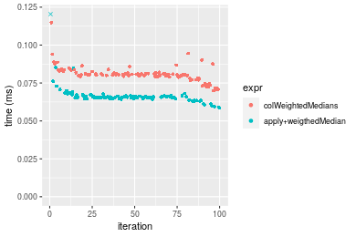
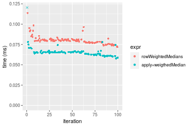
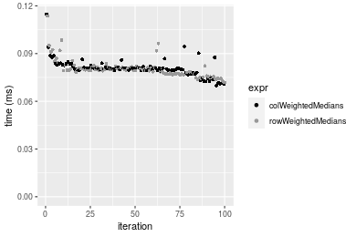
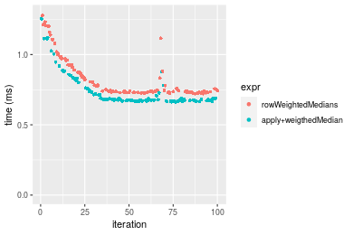
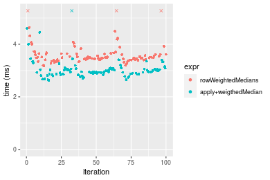
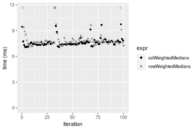

[matrixStats]: Benchmark report

---------------------------------------


# colWeightedMedians() and rowWeightedMedians() benchmarks

This report benchmark the performance of colWeightedMedians() and rowWeightedMedians() against alternative methods.

## Alternative methods

* apply() + weightedMedian()


## Data
```r
> rmatrix <- function(nrow, ncol, mode = c("logical", "double", "integer", "index"), range = c(-100, 
+     +100), na_prob = 0) {
+     mode <- match.arg(mode)
+     n <- nrow * ncol
+     if (mode == "logical") {
+         x <- sample(c(FALSE, TRUE), size = n, replace = TRUE)
+     }     else if (mode == "index") {
+         x <- seq_len(n)
+         mode <- "integer"
+     }     else {
+         x <- runif(n, min = range[1], max = range[2])
+     }
+     storage.mode(x) <- mode
+     if (na_prob > 0) 
+         x[sample(n, size = na_prob * n)] <- NA
+     dim(x) <- c(nrow, ncol)
+     x
+ }
> rmatrices <- function(scale = 10, seed = 1, ...) {
+     set.seed(seed)
+     data <- list()
+     data[[1]] <- rmatrix(nrow = scale * 1, ncol = scale * 1, ...)
+     data[[2]] <- rmatrix(nrow = scale * 10, ncol = scale * 10, ...)
+     data[[3]] <- rmatrix(nrow = scale * 100, ncol = scale * 1, ...)
+     data[[4]] <- t(data[[3]])
+     data[[5]] <- rmatrix(nrow = scale * 10, ncol = scale * 100, ...)
+     data[[6]] <- t(data[[5]])
+     names(data) <- sapply(data, FUN = function(x) paste(dim(x), collapse = "x"))
+     data
+ }
> data <- rmatrices(mode = "double")
```

## Results

### 10x10 matrix


```r
> X <- data[["10x10"]]
> w <- runif(nrow(X))
> gc()
           used  (Mb) gc trigger  (Mb) max used  (Mb)
Ncells  5338373 285.1    7916910 422.9  7916910 422.9
Vcells 10912022  83.3   33191153 253.3 53339345 407.0
> colStats <- microbenchmark(colWeightedMedians = colWeightedMedians(X, w = w, na.rm = FALSE), `apply+weigthedMedian` = apply(X, 
+     MARGIN = 2L, FUN = weightedMedian, w = w, na.rm = FALSE), unit = "ms")
> X <- t(X)
> gc()
           used  (Mb) gc trigger  (Mb) max used  (Mb)
Ncells  5337341 285.1    7916910 422.9  7916910 422.9
Vcells 10909019  83.3   33191153 253.3 53339345 407.0
> rowStats <- microbenchmark(rowWeightedMedians = rowWeightedMedians(X, w = w, na.rm = FALSE), `apply+weigthedMedian` = apply(X, 
+     MARGIN = 1L, FUN = weightedMedian, w = w, na.rm = FALSE), unit = "ms")
```

_Table: Benchmarking of colWeightedMedians() and apply+weigthedMedian() on 10x10 data. The top panel shows times in milliseconds and the bottom panel shows relative times._


|   |expr                 |      min|        lq|     mean|    median|        uq|      max|
|:--|:--------------------|--------:|---------:|--------:|---------:|---------:|--------:|
|2  |apply+weigthedMedian | 0.058618| 0.0649075| 0.066852| 0.0656505| 0.0663995| 0.155059|
|1  |colWeightedMedians   | 0.069945| 0.0793620| 0.080739| 0.0805175| 0.0817440| 0.114797|


|   |expr                 |      min|       lq|     mean|   median|       uq|      max|
|:--|:--------------------|--------:|--------:|--------:|--------:|--------:|--------:|
|2  |apply+weigthedMedian | 1.000000| 1.000000| 1.000000| 1.000000| 1.000000| 1.000000|
|1  |colWeightedMedians   | 1.193234| 1.222694| 1.207728| 1.226457| 1.231094| 0.740344|

_Table: Benchmarking of rowWeightedMedians() and apply+weigthedMedian() on 10x10 data (transposed). The top panel shows times in milliseconds and the bottom panel shows relative times._


|   |expr                 |      min|        lq|      mean|    median|        uq|      max|
|:--|:--------------------|--------:|---------:|---------:|---------:|---------:|--------:|
|2  |apply+weigthedMedian | 0.057798| 0.0626545| 0.0657444| 0.0651835| 0.0657595| 0.149053|
|1  |rowWeightedMedians   | 0.071850| 0.0772715| 0.0803987| 0.0796075| 0.0811340| 0.113690|


|   |expr                 |      min|       lq|     mean|   median|       uq|       max|
|:--|:--------------------|--------:|--------:|--------:|--------:|--------:|---------:|
|2  |apply+weigthedMedian | 1.000000| 1.000000| 1.000000| 1.000000| 1.000000| 1.0000000|
|1  |rowWeightedMedians   | 1.243123| 1.233295| 1.222897| 1.221283| 1.233799| 0.7627488|

_Figure: Benchmarking of colWeightedMedians() and apply+weigthedMedian() on 10x10 data  as well as rowWeightedMedians() and apply+weigthedMedian() on the same data transposed.  Outliers are displayed as crosses.  Times are in milliseconds._





_Table: Benchmarking of colWeightedMedians() and rowWeightedMedians() on 10x10 data (original and transposed).  The top panel shows times in milliseconds and the bottom panel shows relative times._


|   |expr               |    min|      lq|     mean|  median|     uq|     max|
|:--|:------------------|------:|-------:|--------:|-------:|------:|-------:|
|2  |rowWeightedMedians | 71.850| 77.2715| 80.39870| 79.6075| 81.134| 113.690|
|1  |colWeightedMedians | 69.945| 79.3620| 80.73899| 80.5175| 81.744| 114.797|


|   |expr               |       min|       lq|     mean|   median|       uq|      max|
|:--|:------------------|---------:|--------:|--------:|--------:|--------:|--------:|
|2  |rowWeightedMedians | 1.0000000| 1.000000| 1.000000| 1.000000| 1.000000| 1.000000|
|1  |colWeightedMedians | 0.9734864| 1.027054| 1.004233| 1.011431| 1.007518| 1.009737|

_Figure: Benchmarking of colWeightedMedians() and rowWeightedMedians() on 10x10 data (original and transposed).  Outliers are displayed as crosses. Times are in milliseconds._




### 100x100 matrix


```r
> X <- data[["100x100"]]
> w <- runif(nrow(X))
> gc()
           used  (Mb) gc trigger  (Mb) max used  (Mb)
Ncells  5335902 285.0    7916910 422.9  7916910 422.9
Vcells 10523851  80.3   33191153 253.3 53339345 407.0
> colStats <- microbenchmark(colWeightedMedians = colWeightedMedians(X, w = w, na.rm = FALSE), `apply+weigthedMedian` = apply(X, 
+     MARGIN = 2L, FUN = weightedMedian, w = w, na.rm = FALSE), unit = "ms")
> X <- t(X)
> gc()
           used  (Mb) gc trigger  (Mb) max used  (Mb)
Ncells  5335896 285.0    7916910 422.9  7916910 422.9
Vcells 10533894  80.4   33191153 253.3 53339345 407.0
> rowStats <- microbenchmark(rowWeightedMedians = rowWeightedMedians(X, w = w, na.rm = FALSE), `apply+weigthedMedian` = apply(X, 
+     MARGIN = 1L, FUN = weightedMedian, w = w, na.rm = FALSE), unit = "ms")
```

_Table: Benchmarking of colWeightedMedians() and apply+weigthedMedian() on 100x100 data. The top panel shows times in milliseconds and the bottom panel shows relative times._


|   |expr                 |      min|        lq|      mean|    median|        uq|      max|
|:--|:--------------------|--------:|---------:|---------:|---------:|---------:|--------:|
|2  |apply+weigthedMedian | 0.666541| 0.6816655| 0.7668511| 0.7063770| 0.8279125| 1.268180|
|1  |colWeightedMedians   | 0.723570| 0.7469600| 0.8814077| 0.8105625| 0.9538670| 1.617107|


|   |expr                 |     min|       lq|     mean|   median|       uq|     max|
|:--|:--------------------|-------:|--------:|--------:|--------:|--------:|-------:|
|2  |apply+weigthedMedian | 1.00000| 1.000000| 1.000000| 1.000000| 1.000000| 1.00000|
|1  |colWeightedMedians   | 1.08556| 1.095787| 1.149386| 1.147493| 1.152135| 1.27514|

_Table: Benchmarking of rowWeightedMedians() and apply+weigthedMedian() on 100x100 data (transposed). The top panel shows times in milliseconds and the bottom panel shows relative times._


|   |expr                 |      min|        lq|      mean|   median|       uq|      max|
|:--|:--------------------|--------:|---------:|---------:|--------:|--------:|--------:|
|2  |apply+weigthedMedian | 0.662943| 0.6722950| 0.7338995| 0.679953| 0.737635| 1.254176|
|1  |rowWeightedMedians   | 0.721027| 0.7318395| 0.8291074| 0.743418| 0.885740| 1.276855|


|   |expr                 |      min|       lq|     mean|   median|       uq|      max|
|:--|:--------------------|--------:|--------:|--------:|--------:|--------:|--------:|
|2  |apply+weigthedMedian | 1.000000| 1.000000| 1.000000| 1.000000| 1.000000| 1.000000|
|1  |rowWeightedMedians   | 1.087615| 1.088569| 1.129729| 1.093337| 1.200784| 1.018083|

_Figure: Benchmarking of colWeightedMedians() and apply+weigthedMedian() on 100x100 data  as well as rowWeightedMedians() and apply+weigthedMedian() on the same data transposed.  Outliers are displayed as crosses.  Times are in milliseconds._



_Table: Benchmarking of colWeightedMedians() and rowWeightedMedians() on 100x100 data (original and transposed).  The top panel shows times in milliseconds and the bottom panel shows relative times._


|   |expr               |     min|       lq|     mean|   median|      uq|      max|
|:--|:------------------|-------:|--------:|--------:|--------:|-------:|--------:|
|2  |rowWeightedMedians | 721.027| 731.8395| 829.1074| 743.4180| 885.740| 1276.855|
|1  |colWeightedMedians | 723.570| 746.9600| 881.4077| 810.5625| 953.867| 1617.107|


|   |expr               |      min|       lq|    mean|   median|       uq|      max|
|:--|:------------------|--------:|--------:|-------:|--------:|--------:|--------:|
|2  |rowWeightedMedians | 1.000000| 1.000000| 1.00000| 1.000000| 1.000000| 1.000000|
|1  |colWeightedMedians | 1.003527| 1.020661| 1.06308| 1.090319| 1.076915| 1.266477|

_Figure: Benchmarking of colWeightedMedians() and rowWeightedMedians() on 100x100 data (original and transposed).  Outliers are displayed as crosses. Times are in milliseconds._


### 1000x10 matrix


```r
> X <- data[["1000x10"]]
> w <- runif(nrow(X))
> gc()
           used  (Mb) gc trigger  (Mb) max used  (Mb)
Ncells  5336627 285.1    7916910 422.9  7916910 422.9
Vcells 10528265  80.4   33191153 253.3 53339345 407.0
> colStats <- microbenchmark(colWeightedMedians = colWeightedMedians(X, w = w, na.rm = FALSE), `apply+weigthedMedian` = apply(X, 
+     MARGIN = 2L, FUN = weightedMedian, w = w, na.rm = FALSE), unit = "ms")
> X <- t(X)
> gc()
           used  (Mb) gc trigger  (Mb) max used  (Mb)
Ncells  5336615 285.1    7916910 422.9  7916910 422.9
Vcells 10538298  80.5   33191153 253.3 53339345 407.0
> rowStats <- microbenchmark(rowWeightedMedians = rowWeightedMedians(X, w = w, na.rm = FALSE), `apply+weigthedMedian` = apply(X, 
+     MARGIN = 1L, FUN = weightedMedian, w = w, na.rm = FALSE), unit = "ms")
```

_Table: Benchmarking of colWeightedMedians() and apply+weigthedMedian() on 1000x10 data. The top panel shows times in milliseconds and the bottom panel shows relative times._


|   |expr                 |      min|        lq|      mean|   median|        uq|      max|
|:--|:--------------------|--------:|---------:|---------:|--------:|---------:|--------:|
|2  |apply+weigthedMedian | 0.558770| 0.6110875| 0.6854559| 0.684275| 0.7321420| 0.964007|
|1  |colWeightedMedians   | 0.574385| 0.6210990| 0.7070122| 0.699900| 0.7542415| 1.130088|


|   |expr                 |      min|       lq|     mean|   median|       uq|      max|
|:--|:--------------------|--------:|--------:|--------:|--------:|--------:|--------:|
|2  |apply+weigthedMedian | 1.000000| 1.000000| 1.000000| 1.000000| 1.000000| 1.000000|
|1  |colWeightedMedians   | 1.027945| 1.016383| 1.031448| 1.022834| 1.030185| 1.172282|

_Table: Benchmarking of rowWeightedMedians() and apply+weigthedMedian() on 1000x10 data (transposed). The top panel shows times in milliseconds and the bottom panel shows relative times._


|   |expr                 |      min|        lq|      mean|    median|        uq|      max|
|:--|:--------------------|--------:|---------:|---------:|---------:|---------:|--------:|
|2  |apply+weigthedMedian | 0.557595| 0.5607195| 0.6269260| 0.5652330| 0.6619825| 0.937099|
|1  |rowWeightedMedians   | 0.575496| 0.5814740| 0.6520714| 0.5866085| 0.7192995| 1.051900|


|   |expr                 |      min|       lq|     mean|   median|       uq|      max|
|:--|:--------------------|--------:|--------:|--------:|--------:|--------:|--------:|
|2  |apply+weigthedMedian | 1.000000| 1.000000| 1.000000| 1.000000| 1.000000| 1.000000|
|1  |rowWeightedMedians   | 1.032104| 1.037014| 1.040109| 1.037817| 1.086584| 1.122507|

_Figure: Benchmarking of colWeightedMedians() and apply+weigthedMedian() on 1000x10 data  as well as rowWeightedMedians() and apply+weigthedMedian() on the same data transposed.  Outliers are displayed as crosses.  Times are in milliseconds._


_Table: Benchmarking of colWeightedMedians() and rowWeightedMedians() on 1000x10 data (original and transposed).  The top panel shows times in milliseconds and the bottom panel shows relative times._


|   |expr               |     min|      lq|     mean|   median|       uq|      max|
|:--|:------------------|-------:|-------:|--------:|--------:|--------:|--------:|
|2  |rowWeightedMedians | 575.496| 581.474| 652.0714| 586.6085| 719.2995| 1051.900|
|1  |colWeightedMedians | 574.385| 621.099| 707.0122| 699.9000| 754.2415| 1130.088|


|   |expr               |       min|       lq|     mean|  median|       uq|     max|
|:--|:------------------|---------:|--------:|--------:|-------:|--------:|-------:|
|2  |rowWeightedMedians | 1.0000000| 1.000000| 1.000000| 1.00000| 1.000000| 1.00000|
|1  |colWeightedMedians | 0.9980695| 1.068146| 1.084256| 1.19313| 1.048578| 1.07433|

_Figure: Benchmarking of colWeightedMedians() and rowWeightedMedians() on 1000x10 data (original and transposed).  Outliers are displayed as crosses. Times are in milliseconds._


### 10x1000 matrix


```r
> X <- data[["10x1000"]]
> w <- runif(nrow(X))
> gc()
           used  (Mb) gc trigger  (Mb) max used  (Mb)
Ncells  5336819 285.1    7916910 422.9  7916910 422.9
Vcells 10528074  80.4   33191153 253.3 53339345 407.0
> colStats <- microbenchmark(colWeightedMedians = colWeightedMedians(X, w = w, na.rm = FALSE), `apply+weigthedMedian` = apply(X, 
+     MARGIN = 2L, FUN = weightedMedian, w = w, na.rm = FALSE), unit = "ms")
> X <- t(X)
> gc()
           used  (Mb) gc trigger  (Mb) max used  (Mb)
Ncells  5336813 285.1    7916910 422.9  7916910 422.9
Vcells 10538117  80.4   33191153 253.3 53339345 407.0
> rowStats <- microbenchmark(rowWeightedMedians = rowWeightedMedians(X, w = w, na.rm = FALSE), `apply+weigthedMedian` = apply(X, 
+     MARGIN = 1L, FUN = weightedMedian, w = w, na.rm = FALSE), unit = "ms")
```

_Table: Benchmarking of colWeightedMedians() and apply+weigthedMedian() on 10x1000 data. The top panel shows times in milliseconds and the bottom panel shows relative times._


|   |expr                 |      min|       lq|     mean|   median|       uq|      max|
|:--|:--------------------|--------:|--------:|--------:|--------:|--------:|--------:|
|2  |apply+weigthedMedian | 2.638999| 2.811646| 3.145791| 2.922781| 3.055063| 9.457205|
|1  |colWeightedMedians   | 3.171310| 3.395751| 3.607023| 3.513560| 3.689402| 5.259681|


|   |expr                 |      min|       lq|     mean|   median|       uq|      max|
|:--|:--------------------|--------:|--------:|--------:|--------:|--------:|--------:|
|2  |apply+weigthedMedian | 1.000000| 1.000000| 1.000000| 1.000000| 1.000000| 1.000000|
|1  |colWeightedMedians   | 1.201709| 1.207745| 1.146619| 1.202129| 1.207636| 0.556156|

_Table: Benchmarking of rowWeightedMedians() and apply+weigthedMedian() on 10x1000 data (transposed). The top panel shows times in milliseconds and the bottom panel shows relative times._


|   |expr                 |      min|       lq|     mean|   median|       uq|       max|
|:--|:--------------------|--------:|--------:|--------:|--------:|--------:|---------:|
|2  |apply+weigthedMedian | 2.632101| 2.873942| 3.086753| 2.957736| 3.065488|  9.281187|
|1  |rowWeightedMedians   | 3.181512| 3.416350| 3.716918| 3.491299| 3.641147| 10.598747|


|   |expr                 |      min|       lq|     mean|   median|       uq|     max|
|:--|:--------------------|--------:|--------:|--------:|--------:|--------:|-------:|
|2  |apply+weigthedMedian | 1.000000| 1.000000| 1.000000| 1.000000| 1.000000| 1.00000|
|1  |rowWeightedMedians   | 1.208735| 1.188733| 1.204151| 1.180396| 1.187787| 1.14196|

_Figure: Benchmarking of colWeightedMedians() and apply+weigthedMedian() on 10x1000 data  as well as rowWeightedMedians() and apply+weigthedMedian() on the same data transposed.  Outliers are displayed as crosses.  Times are in milliseconds._



_Table: Benchmarking of colWeightedMedians() and rowWeightedMedians() on 10x1000 data (original and transposed).  The top panel shows times in milliseconds and the bottom panel shows relative times._


|   |expr               |      min|       lq|     mean|   median|       uq|       max|
|:--|:------------------|--------:|--------:|--------:|--------:|--------:|---------:|
|2  |rowWeightedMedians | 3.181512| 3.416350| 3.716918| 3.491299| 3.641147| 10.598747|
|1  |colWeightedMedians | 3.171310| 3.395751| 3.607023| 3.513560| 3.689402|  5.259681|


|   |expr               |       min|        lq|      mean|   median|       uq|      max|
|:--|:------------------|---------:|---------:|---------:|--------:|--------:|--------:|
|2  |rowWeightedMedians | 1.0000000| 1.0000000| 1.0000000| 1.000000| 1.000000| 1.000000|
|1  |colWeightedMedians | 0.9967933| 0.9939703| 0.9704339| 1.006376| 1.013253| 0.496255|

_Figure: Benchmarking of colWeightedMedians() and rowWeightedMedians() on 10x1000 data (original and transposed).  Outliers are displayed as crosses. Times are in milliseconds._


### 100x1000 matrix


```r
> X <- data[["100x1000"]]
> w <- runif(nrow(X))
> gc()
           used  (Mb) gc trigger  (Mb) max used  (Mb)
Ncells  5337009 285.1    7916910 422.9  7916910 422.9
Vcells 10528669  80.4   33191153 253.3 53339345 407.0
> colStats <- microbenchmark(colWeightedMedians = colWeightedMedians(X, w = w, na.rm = FALSE), `apply+weigthedMedian` = apply(X, 
+     MARGIN = 2L, FUN = weightedMedian, w = w, na.rm = FALSE), unit = "ms")
> X <- t(X)
> gc()
           used  (Mb) gc trigger  (Mb) max used  (Mb)
Ncells  5337003 285.1    7916910 422.9  7916910 422.9
Vcells 10628712  81.1   33191153 253.3 53339345 407.0
> rowStats <- microbenchmark(rowWeightedMedians = rowWeightedMedians(X, w = w, na.rm = FALSE), `apply+weigthedMedian` = apply(X, 
+     MARGIN = 1L, FUN = weightedMedian, w = w, na.rm = FALSE), unit = "ms")
```

_Table: Benchmarking of colWeightedMedians() and apply+weigthedMedian() on 100x1000 data. The top panel shows times in milliseconds and the bottom panel shows relative times._


|   |expr                 |      min|       lq|     mean|   median|       uq|      max|
|:--|:--------------------|--------:|--------:|--------:|--------:|--------:|--------:|
|2  |apply+weigthedMedian | 6.520031| 6.851844| 7.541683| 7.009149| 7.251044| 24.63903|
|1  |colWeightedMedians   | 7.072074| 7.387505| 7.805397| 7.489342| 7.701308| 24.78461|


|   |expr                 |      min|       lq|     mean|  median|       uq|      max|
|:--|:--------------------|--------:|--------:|--------:|-------:|--------:|--------:|
|2  |apply+weigthedMedian | 1.000000| 1.000000| 1.000000| 1.00000| 1.000000| 1.000000|
|1  |colWeightedMedians   | 1.084669| 1.078178| 1.034968| 1.06851| 1.062096| 1.005908|

_Table: Benchmarking of rowWeightedMedians() and apply+weigthedMedian() on 100x1000 data (transposed). The top panel shows times in milliseconds and the bottom panel shows relative times._


|   |expr                 |      min|       lq|     mean|   median|       uq|      max|
|:--|:--------------------|--------:|--------:|--------:|--------:|--------:|--------:|
|2  |apply+weigthedMedian | 6.601629| 6.941376| 7.357366| 7.084605| 7.260865| 22.26618|
|1  |rowWeightedMedians   | 7.124855| 7.522170| 8.146047| 7.674877| 7.864806| 25.21561|


|   |expr                 |      min|       lq|     mean|   median|       uq|      max|
|:--|:--------------------|--------:|--------:|--------:|--------:|--------:|--------:|
|2  |apply+weigthedMedian | 1.000000| 1.000000| 1.000000| 1.000000| 1.000000| 1.000000|
|1  |rowWeightedMedians   | 1.079257| 1.083671| 1.107196| 1.083318| 1.083178| 1.132462|

_Figure: Benchmarking of colWeightedMedians() and apply+weigthedMedian() on 100x1000 data  as well as rowWeightedMedians() and apply+weigthedMedian() on the same data transposed.  Outliers are displayed as crosses.  Times are in milliseconds._


_Table: Benchmarking of colWeightedMedians() and rowWeightedMedians() on 100x1000 data (original and transposed).  The top panel shows times in milliseconds and the bottom panel shows relative times._


|   |expr               |      min|       lq|     mean|   median|       uq|      max|
|:--|:------------------|--------:|--------:|--------:|--------:|--------:|--------:|
|1  |colWeightedMedians | 7.072074| 7.387505| 7.805397| 7.489342| 7.701308| 24.78461|
|2  |rowWeightedMedians | 7.124855| 7.522170| 8.146047| 7.674877| 7.864806| 25.21561|


|   |expr               |      min|       lq|     mean|   median|      uq|     max|
|:--|:------------------|--------:|--------:|--------:|--------:|-------:|-------:|
|1  |colWeightedMedians | 1.000000| 1.000000| 1.000000| 1.000000| 1.00000| 1.00000|
|2  |rowWeightedMedians | 1.007463| 1.018229| 1.043643| 1.024773| 1.02123| 1.01739|

_Figure: Benchmarking of colWeightedMedians() and rowWeightedMedians() on 100x1000 data (original and transposed).  Outliers are displayed as crosses. Times are in milliseconds._




### 1000x100 matrix


```r
> X <- data[["1000x100"]]
> w <- runif(nrow(X))
> gc()
           used  (Mb) gc trigger  (Mb) max used  (Mb)
Ncells  5337196 285.1    7916910 422.9  7916910 422.9
Vcells 10530235  80.4   33191153 253.3 53339345 407.0
> colStats <- microbenchmark(colWeightedMedians = colWeightedMedians(X, w = w, na.rm = FALSE), `apply+weigthedMedian` = apply(X, 
+     MARGIN = 2L, FUN = weightedMedian, w = w, na.rm = FALSE), unit = "ms")
> X <- t(X)
> gc()
           used  (Mb) gc trigger  (Mb) max used  (Mb)
Ncells  5337190 285.1    7916910 422.9  7916910 422.9
Vcells 10630278  81.2   33191153 253.3 53339345 407.0
> rowStats <- microbenchmark(rowWeightedMedians = rowWeightedMedians(X, w = w, na.rm = FALSE), `apply+weigthedMedian` = apply(X, 
+     MARGIN = 1L, FUN = weightedMedian, w = w, na.rm = FALSE), unit = "ms")
```

_Table: Benchmarking of colWeightedMedians() and apply+weigthedMedian() on 1000x100 data. The top panel shows times in milliseconds and the bottom panel shows relative times._


|   |expr                 |      min|       lq|     mean|   median|       uq|      max|
|:--|:--------------------|--------:|--------:|--------:|--------:|--------:|--------:|
|2  |apply+weigthedMedian | 5.402375| 5.643393| 5.845511| 5.670750| 5.723949| 15.49405|
|1  |colWeightedMedians   | 5.484320| 5.708277| 5.979079| 5.750507| 5.839806| 14.18323|


|   |expr                 |      min|       lq|    mean|   median|       uq|       max|
|:--|:--------------------|--------:|--------:|-------:|--------:|--------:|---------:|
|2  |apply+weigthedMedian | 1.000000| 1.000000| 1.00000| 1.000000| 1.000000| 1.0000000|
|1  |colWeightedMedians   | 1.015168| 1.011497| 1.02285| 1.014065| 1.020241| 0.9153984|

_Table: Benchmarking of rowWeightedMedians() and apply+weigthedMedian() on 1000x100 data (transposed). The top panel shows times in milliseconds and the bottom panel shows relative times._


|   |expr                 |      min|       lq|     mean|   median|       uq|       max|
|:--|:--------------------|--------:|--------:|--------:|--------:|--------:|---------:|
|2  |apply+weigthedMedian | 5.409707| 5.660353| 5.975777| 5.687883| 5.770017| 15.738789|
|1  |rowWeightedMedians   | 5.479955| 5.721429| 5.949951| 5.765739| 5.817060|  9.323769|


|   |expr                 |      min|      lq|      mean|   median|       uq|      max|
|:--|:--------------------|--------:|-------:|---------:|--------:|--------:|--------:|
|2  |apply+weigthedMedian | 1.000000| 1.00000| 1.0000000| 1.000000| 1.000000| 1.000000|
|1  |rowWeightedMedians   | 1.012986| 1.01079| 0.9956781| 1.013688| 1.008153| 0.592407|

_Figure: Benchmarking of colWeightedMedians() and apply+weigthedMedian() on 1000x100 data  as well as rowWeightedMedians() and apply+weigthedMedian() on the same data transposed.  Outliers are displayed as crosses.  Times are in milliseconds._


_Table: Benchmarking of colWeightedMedians() and rowWeightedMedians() on 1000x100 data (original and transposed).  The top panel shows times in milliseconds and the bottom panel shows relative times._


|   |expr               |      min|       lq|     mean|   median|       uq|       max|
|:--|:------------------|--------:|--------:|--------:|--------:|--------:|---------:|
|1  |colWeightedMedians | 5.484320| 5.708277| 5.979079| 5.750507| 5.839806| 14.183225|
|2  |rowWeightedMedians | 5.479955| 5.721429| 5.949951| 5.765739| 5.817060|  9.323769|


|   |expr               |       min|       lq|      mean|   median|        uq|     max|
|:--|:------------------|---------:|--------:|---------:|--------:|---------:|-------:|
|1  |colWeightedMedians | 1.0000000| 1.000000| 1.0000000| 1.000000| 1.0000000| 1.00000|
|2  |rowWeightedMedians | 0.9992041| 1.002304| 0.9951283| 1.002649| 0.9961049| 0.65738|

_Figure: Benchmarking of colWeightedMedians() and rowWeightedMedians() on 1000x100 data (original and transposed).  Outliers are displayed as crosses. Times are in milliseconds._


## Appendix

### Session information
```r
R version 4.1.1 Patched (2021-08-10 r80727)
Platform: x86_64-pc-linux-gnu (64-bit)
Running under: Ubuntu 18.04.5 LTS

Matrix products: default
BLAS:   /home/hb/software/R-devel/R-4-1-branch/lib/R/lib/libRblas.so
LAPACK: /home/hb/software/R-devel/R-4-1-branch/lib/R/lib/libRlapack.so

locale:
 [1] LC_CTYPE=en_US.UTF-8       LC_NUMERIC=C              
 [3] LC_TIME=en_US.UTF-8        LC_COLLATE=en_US.UTF-8    
 [5] LC_MONETARY=en_US.UTF-8    LC_MESSAGES=en_US.UTF-8   
 [7] LC_PAPER=en_US.UTF-8       LC_NAME=C                 
 [9] LC_ADDRESS=C               LC_TELEPHONE=C            
[11] LC_MEASUREMENT=en_US.UTF-8 LC_IDENTIFICATION=C       

attached base packages:
[1] stats     graphics  grDevices utils     datasets  methods   base     

other attached packages:
[1] microbenchmark_1.4-7   matrixStats_0.60.0     ggplot2_3.3.5         
[4] knitr_1.33             R.devices_2.17.0       R.utils_2.10.1        
[7] R.oo_1.24.0            R.methodsS3_1.8.1-9001 history_0.0.1-9000    

loaded via a namespace (and not attached):
 [1] Biobase_2.52.0          httr_1.4.2              splines_4.1.1          
 [4] bit64_4.0.5             network_1.17.1          assertthat_0.2.1       
 [7] highr_0.9               stats4_4.1.1            blob_1.2.2             
[10] GenomeInfoDbData_1.2.6  robustbase_0.93-8       pillar_1.6.2           
[13] RSQLite_2.2.8           lattice_0.20-44         glue_1.4.2             
[16] digest_0.6.27           XVector_0.32.0          colorspace_2.0-2       
[19] Matrix_1.3-4            XML_3.99-0.7            pkgconfig_2.0.3        
[22] zlibbioc_1.38.0         genefilter_1.74.0       purrr_0.3.4            
[25] ergm_4.1.2              xtable_1.8-4            scales_1.1.1           
[28] tibble_3.1.4            annotate_1.70.0         KEGGREST_1.32.0        
[31] farver_2.1.0            generics_0.1.0          IRanges_2.26.0         
[34] ellipsis_0.3.2          cachem_1.0.6            withr_2.4.2            
[37] BiocGenerics_0.38.0     mime_0.11               survival_3.2-13        
[40] magrittr_2.0.1          crayon_1.4.1            statnet.common_4.5.0   
[43] memoise_2.0.0           laeken_0.5.1            fansi_0.5.0            
[46] R.cache_0.15.0          MASS_7.3-54             R.rsp_0.44.0           
[49] progressr_0.8.0         tools_4.1.1             lifecycle_1.0.0        
[52] S4Vectors_0.30.0        trust_0.1-8             munsell_0.5.0          
[55] tabby_0.0.1-9001        AnnotationDbi_1.54.1    Biostrings_2.60.2      
[58] compiler_4.1.1          GenomeInfoDb_1.28.1     rlang_0.4.11           
[61] grid_4.1.1              RCurl_1.98-1.4          cwhmisc_6.6            
[64] rstudioapi_0.13         rappdirs_0.3.3          startup_0.15.0         
[67] labeling_0.4.2          bitops_1.0-7            base64enc_0.1-3        
[70] boot_1.3-28             gtable_0.3.0            DBI_1.1.1              
[73] markdown_1.1            R6_2.5.1                lpSolveAPI_5.5.2.0-17.7
[76] rle_0.9.2               dplyr_1.0.7             fastmap_1.1.0          
[79] bit_4.0.4               utf8_1.2.2              parallel_4.1.1         
[82] Rcpp_1.0.7              vctrs_0.3.8             png_0.1-7              
[85] DEoptimR_1.0-9          tidyselect_1.1.1        xfun_0.25              
[88] coda_0.19-4            
```
Total processing time was 19.7 secs.


### Reproducibility
To reproduce this report, do:
```r
html <- matrixStats:::benchmark('colWeightedMedians')
```

[RSP]: https://cran.r-project.org/package=R.rsp
[matrixStats]: https://cran.r-project.org/package=matrixStats

[StackOverflow:colMins?]: https://stackoverflow.com/questions/13676878 "Stack Overflow: fastest way to get Min from every column in a matrix?"
[StackOverflow:colSds?]: https://stackoverflow.com/questions/17549762 "Stack Overflow: Is there such 'colsd' in R?"
[StackOverflow:rowProds?]: https://stackoverflow.com/questions/20198801/ "Stack Overflow: Row product of matrix and column sum of matrix"

---------------------------------------
Copyright Henrik Bengtsson. Last updated on 2021-08-25 22:32:51 (+0200 UTC). Powered by [RSP].

<script>
 var link = document.createElement('link');
 link.rel = 'icon';
 link.href = "data:image/png;base64,iVBORw0KGgoAAAANSUhEUgAAACAAAAAgCAMAAABEpIrGAAAA21BMVEUAAAAAAP8AAP8AAP8AAP8AAP8AAP8AAP8AAP8AAP8AAP8AAP8AAP8AAP8AAP8AAP8AAP8AAP8AAP8AAP8AAP8AAP8AAP8AAP8AAP8AAP8AAP8AAP8AAP8AAP8AAP8AAP8AAP8AAP8AAP8AAP8AAP8AAP8AAP8AAP8AAP8AAP8BAf4CAv0DA/wdHeIeHuEfH+AgIN8hId4lJdomJtknJ9g+PsE/P8BAQL9yco10dIt1dYp3d4h4eIeVlWqWlmmXl2iYmGeZmWabm2Tn5xjo6Bfp6Rb39wj4+Af//wA2M9hbAAAASXRSTlMAAQIJCgsMJSYnKD4/QGRlZmhpamtsbautrrCxuru8y8zN5ebn6Pn6+///////////////////////////////////////////LsUNcQAAAS9JREFUOI29k21XgkAQhVcFytdSMqMETU26UVqGmpaiFbL//xc1cAhhwVNf6n5i5z67M2dmYOyfJZUqlVLhkKucG7cgmUZTybDz6g0iDeq51PUr37Ds2cy2/C9NeES5puDjxuUk1xnToZsg8pfA3avHQ3lLIi7iWRrkv/OYtkScxBIMgDee0ALoyxHQBJ68JLCjOtQIMIANF7QG9G9fNnHvisCHBVMKgSJgiz7nE+AoBKrAPA3MgepvgR9TSCasrCKH0eB1wBGBFdCO+nAGjMVGPcQb5bd6mQRegN6+1axOs9nGfYcCtfi4NQosdtH7dB+txFIpXQqN1p9B/asRHToyS0jRgpV7nk4nwcq1BJ+x3Gl/v7S9Wmpp/aGquum7w3ZDyrADFYrl8vHBH+ev9AUASW1dmU4h4wAAAABJRU5ErkJggg=="
 document.getElementsByTagName('head')[0].appendChild(link);
</script>


