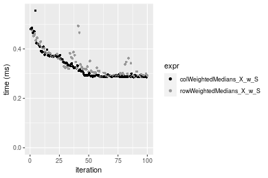

[matrixStats]: Benchmark report

---------------------------------------


# colWeightedMedians() and rowWeightedMedians() benchmarks on subsetted computation

This report benchmark the performance of colWeightedMedians() and rowWeightedMedians on subsetted computation.


## Data
```r
> rmatrix <- function(nrow, ncol, mode = c("logical", "double", "integer", "index"), range = c(-100, 
+     +100), na_prob = 0) {
+     mode <- match.arg(mode)
+     n <- nrow * ncol
+     if (mode == "logical") {
+         x <- sample(c(FALSE, TRUE), size = n, replace = TRUE)
+     }     else if (mode == "index") {
+         x <- seq_len(n)
+         mode <- "integer"
+     }     else {
+         x <- runif(n, min = range[1], max = range[2])
+     }
+     storage.mode(x) <- mode
+     if (na_prob > 0) 
+         x[sample(n, size = na_prob * n)] <- NA
+     dim(x) <- c(nrow, ncol)
+     x
+ }
> rmatrices <- function(scale = 10, seed = 1, ...) {
+     set.seed(seed)
+     data <- list()
+     data[[1]] <- rmatrix(nrow = scale * 1, ncol = scale * 1, ...)
+     data[[2]] <- rmatrix(nrow = scale * 10, ncol = scale * 10, ...)
+     data[[3]] <- rmatrix(nrow = scale * 100, ncol = scale * 1, ...)
+     data[[4]] <- t(data[[3]])
+     data[[5]] <- rmatrix(nrow = scale * 10, ncol = scale * 100, ...)
+     data[[6]] <- t(data[[5]])
+     names(data) <- sapply(data, FUN = function(x) paste(dim(x), collapse = "x"))
+     data
+ }
> data <- rmatrices(mode = "double")
```

## Results

### 10x10 matrix


```r
> X <- data[["10x10"]]
> rows <- sample.int(nrow(X), size = nrow(X) * 0.7)
> cols <- sample.int(ncol(X), size = ncol(X) * 0.7)
> X_S <- X[rows, cols]
> w <- runif(nrow(X))
> w_S <- w[rows]
> gc()
           used  (Mb) gc trigger  (Mb) max used  (Mb)
Ncells  5281408 282.1   10014072 534.9 10014072 534.9
Vcells 10403782  79.4   18422267 140.6 18422267 140.6
> colStats <- microbenchmark(colWeightedMedians_X_w_S = colWeightedMedians(X_S, w = w_S, na.rm = FALSE), 
+     `colWeightedMedians(X, w, rows, cols)` = colWeightedMedians(X, w = w, rows = rows, cols = cols, 
+         na.rm = FALSE), `colWeightedMedians(X[rows, cols], w[rows])` = colWeightedMedians(X[rows, 
+         cols], w = w[rows], na.rm = FALSE), unit = "ms")
> X <- t(X)
> X_S <- t(X_S)
> gc()
           used  (Mb) gc trigger  (Mb) max used  (Mb)
Ncells  5267902 281.4   10014072 534.9 10014072 534.9
Vcells 10358858  79.1   18422267 140.6 18422267 140.6
> rowStats <- microbenchmark(rowWeightedMedians_X_w_S = rowWeightedMedians(X_S, w = w_S, na.rm = FALSE), 
+     `rowWeightedMedians(X, w, cols, rows)` = rowWeightedMedians(X, w = w, rows = cols, cols = rows, 
+         na.rm = FALSE), `rowWeightedMedians(X[cols, rows], w[rows])` = rowWeightedMedians(X[cols, 
+         rows], w = w[rows], na.rm = FALSE), unit = "ms")
```

_Table: Benchmarking of colWeightedMedians_X_w_S(), colWeightedMedians(X, w, rows, cols)() and colWeightedMedians(X[rows, cols], w[rows])() on 10x10 data. The top panel shows times in milliseconds and the bottom panel shows relative times._


|   |expr                                       |      min|        lq|      mean|    median|        uq|      max|
|:--|:------------------------------------------|--------:|---------:|---------:|---------:|---------:|--------:|
|1  |colWeightedMedians_X_w_S                   | 0.050829| 0.0528200| 0.0555234| 0.0548125| 0.0567685| 0.083788|
|2  |colWeightedMedians(X, w, rows, cols)       | 0.052469| 0.0540435| 0.0636130| 0.0561085| 0.0595915| 0.624757|
|3  |colWeightedMedians(X[rows, cols], w[rows]) | 0.052374| 0.0545955| 0.0570340| 0.0566105| 0.0589900| 0.077963|


|   |expr                                       |      min|       lq|     mean|   median|       uq|       max|
|:--|:------------------------------------------|--------:|--------:|--------:|--------:|--------:|---------:|
|1  |colWeightedMedians_X_w_S                   | 1.000000| 1.000000| 1.000000| 1.000000| 1.000000| 1.0000000|
|2  |colWeightedMedians(X, w, rows, cols)       | 1.032265| 1.023164| 1.145697| 1.023644| 1.049728| 7.4564019|
|3  |colWeightedMedians(X[rows, cols], w[rows]) | 1.030396| 1.033614| 1.027207| 1.032803| 1.039133| 0.9304793|

_Table: Benchmarking of rowWeightedMedians_X_w_S(), rowWeightedMedians(X, w, cols, rows)() and rowWeightedMedians(X[cols, rows], w[rows])() on 10x10 data (transposed). The top panel shows times in milliseconds and the bottom panel shows relative times._


|   |expr                                       |      min|       lq|      mean|    median|        uq|      max|
|:--|:------------------------------------------|--------:|--------:|---------:|---------:|---------:|--------:|
|3  |rowWeightedMedians(X[cols, rows], w[rows]) | 0.056872| 0.059960| 0.0631338| 0.0625620| 0.0667555| 0.080480|
|1  |rowWeightedMedians_X_w_S                   | 0.053318| 0.058909| 0.0621722| 0.0632810| 0.0650240| 0.077203|
|2  |rowWeightedMedians(X, w, cols, rows)       | 0.056866| 0.059767| 0.0673038| 0.0642025| 0.0669820| 0.399986|


|   |expr                                       |       min|        lq|      mean|   median|        uq|       max|
|:--|:------------------------------------------|---------:|---------:|---------:|--------:|---------:|---------:|
|3  |rowWeightedMedians(X[cols, rows], w[rows]) | 1.0000000| 1.0000000| 1.0000000| 1.000000| 1.0000000| 1.0000000|
|1  |rowWeightedMedians_X_w_S                   | 0.9375088| 0.9824716| 0.9847701| 1.011493| 0.9740621| 0.9592818|
|2  |rowWeightedMedians(X, w, cols, rows)       | 0.9998945| 0.9967812| 1.0660506| 1.026222| 1.0033930| 4.9700050|

_Figure: Benchmarking of colWeightedMedians_X_w_S(), colWeightedMedians(X, w, rows, cols)() and colWeightedMedians(X[rows, cols], w[rows])() on 10x10 data  as well as rowWeightedMedians_X_w_S(), rowWeightedMedians(X, w, cols, rows)() and rowWeightedMedians(X[cols, rows], w[rows])() on the same data transposed.  Outliers are displayed as crosses.  Times are in milliseconds._


_Table: Benchmarking of colWeightedMedians_X_w_S() and rowWeightedMedians_X_w_S() on 10x10 data (original and transposed).  The top panel shows times in milliseconds and the bottom panel shows relative times._


|   |expr                     |    min|     lq|     mean|  median|      uq|    max|
|:--|:------------------------|------:|------:|--------:|-------:|-------:|------:|
|1  |colWeightedMedians_X_w_S | 50.829| 52.820| 55.52337| 54.8125| 56.7685| 83.788|
|2  |rowWeightedMedians_X_w_S | 53.318| 58.909| 62.17224| 63.2810| 65.0240| 77.203|


|   |expr                     |      min|       lq|     mean|   median|       uq|       max|
|:--|:------------------------|--------:|--------:|--------:|--------:|--------:|---------:|
|1  |colWeightedMedians_X_w_S | 1.000000| 1.000000| 1.000000| 1.000000| 1.000000| 1.0000000|
|2  |rowWeightedMedians_X_w_S | 1.048968| 1.115278| 1.119749| 1.154499| 1.145424| 0.9214088|

_Figure: Benchmarking of colWeightedMedians_X_w_S() and rowWeightedMedians_X_w_S() on 10x10 data (original and transposed).  Outliers are displayed as crosses. Times are in milliseconds._


### 100x100 matrix


```r
> X <- data[["100x100"]]
> rows <- sample.int(nrow(X), size = nrow(X) * 0.7)
> cols <- sample.int(ncol(X), size = ncol(X) * 0.7)
> X_S <- X[rows, cols]
> w <- runif(nrow(X))
> w_S <- w[rows]
> gc()
           used  (Mb) gc trigger  (Mb) max used  (Mb)
Ncells  5266901 281.3   10014072 534.9 10014072 534.9
Vcells 10030228  76.6   18422267 140.6 18422267 140.6
> colStats <- microbenchmark(colWeightedMedians_X_w_S = colWeightedMedians(X_S, w = w_S, na.rm = FALSE), 
+     `colWeightedMedians(X, w, rows, cols)` = colWeightedMedians(X, w = w, rows = rows, cols = cols, 
+         na.rm = FALSE), `colWeightedMedians(X[rows, cols], w[rows])` = colWeightedMedians(X[rows, 
+         cols], w = w[rows], na.rm = FALSE), unit = "ms")
> X <- t(X)
> X_S <- t(X_S)
> gc()
           used  (Mb) gc trigger  (Mb) max used  (Mb)
Ncells  5266877 281.3   10014072 534.9 10014072 534.9
Vcells 10040281  76.7   18422267 140.6 18422267 140.6
> rowStats <- microbenchmark(rowWeightedMedians_X_w_S = rowWeightedMedians(X_S, w = w_S, na.rm = FALSE), 
+     `rowWeightedMedians(X, w, cols, rows)` = rowWeightedMedians(X, w = w, rows = cols, cols = rows, 
+         na.rm = FALSE), `rowWeightedMedians(X[cols, rows], w[rows])` = rowWeightedMedians(X[cols, 
+         rows], w = w[rows], na.rm = FALSE), unit = "ms")
```

_Table: Benchmarking of colWeightedMedians_X_w_S(), colWeightedMedians(X, w, rows, cols)() and colWeightedMedians(X[rows, cols], w[rows])() on 100x100 data. The top panel shows times in milliseconds and the bottom panel shows relative times._


|   |expr                                       |      min|        lq|      mean|    median|        uq|      max|
|:--|:------------------------------------------|--------:|---------:|---------:|---------:|---------:|--------:|
|1  |colWeightedMedians_X_w_S                   | 0.447483| 0.4547550| 0.4974749| 0.4686000| 0.4998105| 0.748450|
|3  |colWeightedMedians(X[rows, cols], w[rows]) | 0.459658| 0.4638575| 0.5001885| 0.4747145| 0.4985705| 0.775742|
|2  |colWeightedMedians(X, w, rows, cols)       | 0.460638| 0.4673170| 0.5138790| 0.4826210| 0.5250180| 0.882974|


|   |expr                                       |      min|       lq|     mean|   median|        uq|      max|
|:--|:------------------------------------------|--------:|--------:|--------:|--------:|---------:|--------:|
|1  |colWeightedMedians_X_w_S                   | 1.000000| 1.000000| 1.000000| 1.000000| 1.0000000| 1.000000|
|3  |colWeightedMedians(X[rows, cols], w[rows]) | 1.027208| 1.020016| 1.005455| 1.013048| 0.9975191| 1.036465|
|2  |colWeightedMedians(X, w, rows, cols)       | 1.029398| 1.027624| 1.032975| 1.029921| 1.0504341| 1.179737|

_Table: Benchmarking of rowWeightedMedians_X_w_S(), rowWeightedMedians(X, w, cols, rows)() and rowWeightedMedians(X[cols, rows], w[rows])() on 100x100 data (transposed). The top panel shows times in milliseconds and the bottom panel shows relative times._


|   |expr                                       |      min|        lq|      mean|    median|        uq|      max|
|:--|:------------------------------------------|--------:|---------:|---------:|---------:|---------:|--------:|
|1  |rowWeightedMedians_X_w_S                   | 0.451761| 0.4608505| 0.5186162| 0.4807300| 0.5652655| 0.772082|
|2  |rowWeightedMedians(X, w, cols, rows)       | 0.461235| 0.4703835| 0.5061263| 0.4841350| 0.5054310| 0.710209|
|3  |rowWeightedMedians(X[cols, rows], w[rows]) | 0.462043| 0.4696800| 0.5187395| 0.4876935| 0.5103305| 0.888062|


|   |expr                                       |      min|       lq|      mean|   median|        uq|       max|
|:--|:------------------------------------------|--------:|--------:|---------:|--------:|---------:|---------:|
|1  |rowWeightedMedians_X_w_S                   | 1.000000| 1.000000| 1.0000000| 1.000000| 1.0000000| 1.0000000|
|2  |rowWeightedMedians(X, w, cols, rows)       | 1.020971| 1.020686| 0.9759169| 1.007083| 0.8941480| 0.9198621|
|3  |rowWeightedMedians(X[cols, rows], w[rows]) | 1.022760| 1.019159| 1.0002377| 1.014485| 0.9028156| 1.1502172|

_Figure: Benchmarking of colWeightedMedians_X_w_S(), colWeightedMedians(X, w, rows, cols)() and colWeightedMedians(X[rows, cols], w[rows])() on 100x100 data  as well as rowWeightedMedians_X_w_S(), rowWeightedMedians(X, w, cols, rows)() and rowWeightedMedians(X[cols, rows], w[rows])() on the same data transposed.  Outliers are displayed as crosses.  Times are in milliseconds._


_Table: Benchmarking of colWeightedMedians_X_w_S() and rowWeightedMedians_X_w_S() on 100x100 data (original and transposed).  The top panel shows times in milliseconds and the bottom panel shows relative times._


|   |expr                     |     min|       lq|     mean| median|       uq|     max|
|:--|:------------------------|-------:|--------:|--------:|------:|--------:|-------:|
|1  |colWeightedMedians_X_w_S | 447.483| 454.7550| 497.4749| 468.60| 499.8105| 748.450|
|2  |rowWeightedMedians_X_w_S | 451.761| 460.8505| 518.6162| 480.73| 565.2655| 772.082|


|   |expr                     |     min|       lq|     mean|   median|      uq|      max|
|:--|:------------------------|-------:|--------:|--------:|--------:|-------:|--------:|
|1  |colWeightedMedians_X_w_S | 1.00000| 1.000000| 1.000000| 1.000000| 1.00000| 1.000000|
|2  |rowWeightedMedians_X_w_S | 1.00956| 1.013404| 1.042497| 1.025886| 1.13096| 1.031575|

_Figure: Benchmarking of colWeightedMedians_X_w_S() and rowWeightedMedians_X_w_S() on 100x100 data (original and transposed).  Outliers are displayed as crosses. Times are in milliseconds._


### 1000x10 matrix


```r
> X <- data[["1000x10"]]
> rows <- sample.int(nrow(X), size = nrow(X) * 0.7)
> cols <- sample.int(ncol(X), size = ncol(X) * 0.7)
> X_S <- X[rows, cols]
> w <- runif(nrow(X))
> w_S <- w[rows]
> gc()
           used  (Mb) gc trigger  (Mb) max used  (Mb)
Ncells  5267651 281.4   10014072 534.9 10014072 534.9
Vcells 10036192  76.6   18422267 140.6 18422267 140.6
> colStats <- microbenchmark(colWeightedMedians_X_w_S = colWeightedMedians(X_S, w = w_S, na.rm = FALSE), 
+     `colWeightedMedians(X, w, rows, cols)` = colWeightedMedians(X, w = w, rows = rows, cols = cols, 
+         na.rm = FALSE), `colWeightedMedians(X[rows, cols], w[rows])` = colWeightedMedians(X[rows, 
+         cols], w = w[rows], na.rm = FALSE), unit = "ms")
> X <- t(X)
> X_S <- t(X_S)
> gc()
           used  (Mb) gc trigger  (Mb) max used  (Mb)
Ncells  5267627 281.4   10014072 534.9 10014072 534.9
Vcells 10046245  76.7   18422267 140.6 18422267 140.6
> rowStats <- microbenchmark(rowWeightedMedians_X_w_S = rowWeightedMedians(X_S, w = w_S, na.rm = FALSE), 
+     `rowWeightedMedians(X, w, cols, rows)` = rowWeightedMedians(X, w = w, rows = cols, cols = rows, 
+         na.rm = FALSE), `rowWeightedMedians(X[cols, rows], w[rows])` = rowWeightedMedians(X[cols, 
+         rows], w = w[rows], na.rm = FALSE), unit = "ms")
```

_Table: Benchmarking of colWeightedMedians_X_w_S(), colWeightedMedians(X, w, rows, cols)() and colWeightedMedians(X[rows, cols], w[rows])() on 1000x10 data. The top panel shows times in milliseconds and the bottom panel shows relative times._


|   |expr                                       |      min|       lq|      mean|    median|        uq|      max|
|:--|:------------------------------------------|--------:|--------:|---------:|---------:|---------:|--------:|
|1  |colWeightedMedians_X_w_S                   | 0.293178| 0.300125| 0.3406710| 0.3099800| 0.3778240| 0.490857|
|3  |colWeightedMedians(X[rows, cols], w[rows]) | 0.306584| 0.313500| 0.3524457| 0.3228645| 0.3951145| 0.493350|
|2  |colWeightedMedians(X, w, rows, cols)       | 0.309191| 0.316675| 0.3642799| 0.3276640| 0.3967995| 0.625541|


|   |expr                                       |      min|       lq|     mean|   median|       uq|      max|
|:--|:------------------------------------------|--------:|--------:|--------:|--------:|--------:|--------:|
|1  |colWeightedMedians_X_w_S                   | 1.000000| 1.000000| 1.000000| 1.000000| 1.000000| 1.000000|
|3  |colWeightedMedians(X[rows, cols], w[rows]) | 1.045727| 1.044565| 1.034563| 1.041566| 1.045763| 1.005079|
|2  |colWeightedMedians(X, w, rows, cols)       | 1.054619| 1.055144| 1.069301| 1.057049| 1.050223| 1.274385|

_Table: Benchmarking of rowWeightedMedians_X_w_S(), rowWeightedMedians(X, w, cols, rows)() and rowWeightedMedians(X[cols, rows], w[rows])() on 1000x10 data (transposed). The top panel shows times in milliseconds and the bottom panel shows relative times._


|   |expr                                       |      min|        lq|      mean|   median|        uq|      max|
|:--|:------------------------------------------|--------:|---------:|---------:|--------:|---------:|--------:|
|1  |rowWeightedMedians_X_w_S                   | 0.292822| 0.2993400| 0.3320012| 0.302578| 0.3672340| 0.492606|
|2  |rowWeightedMedians(X, w, cols, rows)       | 0.310707| 0.3182255| 0.3591823| 0.326469| 0.3956495| 0.627458|
|3  |rowWeightedMedians(X[cols, rows], w[rows]) | 0.308374| 0.3155865| 0.3589709| 0.333672| 0.3984650| 0.512956|


|   |expr                                       |      min|       lq|     mean|   median|       uq|      max|
|:--|:------------------------------------------|--------:|--------:|--------:|--------:|--------:|--------:|
|1  |rowWeightedMedians_X_w_S                   | 1.000000| 1.000000| 1.000000| 1.000000| 1.000000| 1.000000|
|2  |rowWeightedMedians(X, w, cols, rows)       | 1.061078| 1.063090| 1.081871| 1.078958| 1.077377| 1.273752|
|3  |rowWeightedMedians(X[cols, rows], w[rows]) | 1.053111| 1.054274| 1.081234| 1.102764| 1.085044| 1.041311|

_Figure: Benchmarking of colWeightedMedians_X_w_S(), colWeightedMedians(X, w, rows, cols)() and colWeightedMedians(X[rows, cols], w[rows])() on 1000x10 data  as well as rowWeightedMedians_X_w_S(), rowWeightedMedians(X, w, cols, rows)() and rowWeightedMedians(X[cols, rows], w[rows])() on the same data transposed.  Outliers are displayed as crosses.  Times are in milliseconds._


_Table: Benchmarking of colWeightedMedians_X_w_S() and rowWeightedMedians_X_w_S() on 1000x10 data (original and transposed).  The top panel shows times in milliseconds and the bottom panel shows relative times._


|   |expr                     |     min|      lq|     mean|  median|      uq|     max|
|:--|:------------------------|-------:|-------:|--------:|-------:|-------:|-------:|
|2  |rowWeightedMedians_X_w_S | 292.822| 299.340| 332.0011| 302.578| 367.234| 492.606|
|1  |colWeightedMedians_X_w_S | 293.178| 300.125| 340.6710| 309.980| 377.824| 490.857|


|   |expr                     |      min|       lq|     mean|   median|       uq|       max|
|:--|:------------------------|--------:|--------:|--------:|--------:|--------:|---------:|
|2  |rowWeightedMedians_X_w_S | 1.000000| 1.000000| 1.000000| 1.000000| 1.000000| 1.0000000|
|1  |colWeightedMedians_X_w_S | 1.001216| 1.002622| 1.026114| 1.024463| 1.028837| 0.9964495|

_Figure: Benchmarking of colWeightedMedians_X_w_S() and rowWeightedMedians_X_w_S() on 1000x10 data (original and transposed).  Outliers are displayed as crosses. Times are in milliseconds._




### 10x1000 matrix


```r
> X <- data[["10x1000"]]
> rows <- sample.int(nrow(X), size = nrow(X) * 0.7)
> cols <- sample.int(ncol(X), size = ncol(X) * 0.7)
> X_S <- X[rows, cols]
> w <- runif(nrow(X))
> w_S <- w[rows]
> gc()
           used  (Mb) gc trigger  (Mb) max used  (Mb)
Ncells  5267863 281.4   10014072 534.9 10014072 534.9
Vcells 10035499  76.6   18422267 140.6 18422267 140.6
> colStats <- microbenchmark(colWeightedMedians_X_w_S = colWeightedMedians(X_S, w = w_S, na.rm = FALSE), 
+     `colWeightedMedians(X, w, rows, cols)` = colWeightedMedians(X, w = w, rows = rows, cols = cols, 
+         na.rm = FALSE), `colWeightedMedians(X[rows, cols], w[rows])` = colWeightedMedians(X[rows, 
+         cols], w = w[rows], na.rm = FALSE), unit = "ms")
> X <- t(X)
> X_S <- t(X_S)
> gc()
           used  (Mb) gc trigger  (Mb) max used  (Mb)
Ncells  5267839 281.4   10014072 534.9 10014072 534.9
Vcells 10045552  76.7   18422267 140.6 18422267 140.6
> rowStats <- microbenchmark(rowWeightedMedians_X_w_S = rowWeightedMedians(X_S, w = w_S, na.rm = FALSE), 
+     `rowWeightedMedians(X, w, cols, rows)` = rowWeightedMedians(X, w = w, rows = cols, cols = rows, 
+         na.rm = FALSE), `rowWeightedMedians(X[cols, rows], w[rows])` = rowWeightedMedians(X[cols, 
+         rows], w = w[rows], na.rm = FALSE), unit = "ms")
```

_Table: Benchmarking of colWeightedMedians_X_w_S(), colWeightedMedians(X, w, rows, cols)() and colWeightedMedians(X[rows, cols], w[rows])() on 10x1000 data. The top panel shows times in milliseconds and the bottom panel shows relative times._


|   |expr                                       |      min|       lq|     mean|   median|       uq|      max|
|:--|:------------------------------------------|--------:|--------:|--------:|--------:|--------:|--------:|
|1  |colWeightedMedians_X_w_S                   | 2.201013| 2.417495| 2.593482| 2.491919| 2.604604| 8.832573|
|3  |colWeightedMedians(X[rows, cols], w[rows]) | 2.202206| 2.446620| 2.541535| 2.542342| 2.612931| 3.329534|
|2  |colWeightedMedians(X, w, rows, cols)       | 2.206915| 2.430130| 2.541338| 2.556154| 2.641874| 3.204952|


|   |expr                                       |      min|       lq|      mean|   median|       uq|       max|
|:--|:------------------------------------------|--------:|--------:|---------:|--------:|--------:|---------:|
|1  |colWeightedMedians_X_w_S                   | 1.000000| 1.000000| 1.0000000| 1.000000| 1.000000| 1.0000000|
|3  |colWeightedMedians(X[rows, cols], w[rows]) | 1.000542| 1.012047| 0.9799703| 1.020235| 1.003197| 0.3769608|
|2  |colWeightedMedians(X, w, rows, cols)       | 1.002682| 1.005226| 0.9798942| 1.025777| 1.014309| 0.3628560|

_Table: Benchmarking of rowWeightedMedians_X_w_S(), rowWeightedMedians(X, w, cols, rows)() and rowWeightedMedians(X[cols, rows], w[rows])() on 10x1000 data (transposed). The top panel shows times in milliseconds and the bottom panel shows relative times._


|   |expr                                       |      min|       lq|     mean|   median|       uq|      max|
|:--|:------------------------------------------|--------:|--------:|--------:|--------:|--------:|--------:|
|1  |rowWeightedMedians_X_w_S                   | 2.184918| 2.387371| 2.546418| 2.531273| 2.627922| 3.590255|
|2  |rowWeightedMedians(X, w, cols, rows)       | 2.209392| 2.419683| 2.558368| 2.542559| 2.628599| 3.632920|
|3  |rowWeightedMedians(X[cols, rows], w[rows]) | 2.207785| 2.442488| 2.663619| 2.551611| 2.634828| 9.147984|


|   |expr                                       |      min|       lq|     mean|   median|       uq|      max|
|:--|:------------------------------------------|--------:|--------:|--------:|--------:|--------:|--------:|
|1  |rowWeightedMedians_X_w_S                   | 1.000000| 1.000000| 1.000000| 1.000000| 1.000000| 1.000000|
|2  |rowWeightedMedians(X, w, cols, rows)       | 1.011201| 1.013535| 1.004693| 1.004459| 1.000257| 1.011884|
|3  |rowWeightedMedians(X[cols, rows], w[rows]) | 1.010466| 1.023087| 1.046026| 1.008035| 1.002628| 2.548004|

_Figure: Benchmarking of colWeightedMedians_X_w_S(), colWeightedMedians(X, w, rows, cols)() and colWeightedMedians(X[rows, cols], w[rows])() on 10x1000 data  as well as rowWeightedMedians_X_w_S(), rowWeightedMedians(X, w, cols, rows)() and rowWeightedMedians(X[cols, rows], w[rows])() on the same data transposed.  Outliers are displayed as crosses.  Times are in milliseconds._


_Table: Benchmarking of colWeightedMedians_X_w_S() and rowWeightedMedians_X_w_S() on 10x1000 data (original and transposed).  The top panel shows times in milliseconds and the bottom panel shows relative times._


|   |expr                     |      min|       lq|     mean|   median|       uq|      max|
|:--|:------------------------|--------:|--------:|--------:|--------:|--------:|--------:|
|1  |colWeightedMedians_X_w_S | 2.201013| 2.417495| 2.593482| 2.491919| 2.604604| 8.832573|
|2  |rowWeightedMedians_X_w_S | 2.184918| 2.387371| 2.546418| 2.531273| 2.627922| 3.590255|


|   |expr                     |       min|       lq|      mean|   median|       uq|      max|
|:--|:------------------------|---------:|--------:|---------:|--------:|--------:|--------:|
|1  |colWeightedMedians_X_w_S | 1.0000000| 1.000000| 1.0000000| 1.000000| 1.000000| 1.000000|
|2  |rowWeightedMedians_X_w_S | 0.9926875| 0.987539| 0.9818528| 1.015793| 1.008953| 0.406479|

_Figure: Benchmarking of colWeightedMedians_X_w_S() and rowWeightedMedians_X_w_S() on 10x1000 data (original and transposed).  Outliers are displayed as crosses. Times are in milliseconds._


### 100x1000 matrix


```r
> X <- data[["100x1000"]]
> rows <- sample.int(nrow(X), size = nrow(X) * 0.7)
> cols <- sample.int(ncol(X), size = ncol(X) * 0.7)
> X_S <- X[rows, cols]
> w <- runif(nrow(X))
> w_S <- w[rows]
> gc()
           used  (Mb) gc trigger  (Mb) max used  (Mb)
Ncells  5268065 281.4   10014072 534.9 10014072 534.9
Vcells 10080454  77.0   18422267 140.6 18422267 140.6
> colStats <- microbenchmark(colWeightedMedians_X_w_S = colWeightedMedians(X_S, w = w_S, na.rm = FALSE), 
+     `colWeightedMedians(X, w, rows, cols)` = colWeightedMedians(X, w = w, rows = rows, cols = cols, 
+         na.rm = FALSE), `colWeightedMedians(X[rows, cols], w[rows])` = colWeightedMedians(X[rows, 
+         cols], w = w[rows], na.rm = FALSE), unit = "ms")
> X <- t(X)
> X_S <- t(X_S)
> gc()
           used  (Mb) gc trigger  (Mb) max used  (Mb)
Ncells  5268047 281.4   10014072 534.9 10014072 534.9
Vcells 10180517  77.7   18422267 140.6 18422267 140.6
> rowStats <- microbenchmark(rowWeightedMedians_X_w_S = rowWeightedMedians(X_S, w = w_S, na.rm = FALSE), 
+     `rowWeightedMedians(X, w, cols, rows)` = rowWeightedMedians(X, w = w, rows = cols, cols = rows, 
+         na.rm = FALSE), `rowWeightedMedians(X[cols, rows], w[rows])` = rowWeightedMedians(X[cols, 
+         rows], w = w[rows], na.rm = FALSE), unit = "ms")
```

_Table: Benchmarking of colWeightedMedians_X_w_S(), colWeightedMedians(X, w, rows, cols)() and colWeightedMedians(X[rows, cols], w[rows])() on 100x1000 data. The top panel shows times in milliseconds and the bottom panel shows relative times._


|   |expr                                       |      min|       lq|     mean|   median|       uq|      max|
|:--|:------------------------------------------|--------:|--------:|--------:|--------:|--------:|--------:|
|1  |colWeightedMedians_X_w_S                   | 4.249057| 4.692742| 5.002921| 4.769292| 4.935816| 16.91380|
|3  |colWeightedMedians(X[rows, cols], w[rows]) | 4.415882| 4.820049| 5.131698| 4.945157| 5.106540| 17.52312|
|2  |colWeightedMedians(X, w, rows, cols)       | 4.432296| 4.841537| 5.542818| 4.993206| 5.367240| 19.26342|


|   |expr                                       |      min|       lq|     mean|   median|       uq|      max|
|:--|:------------------------------------------|--------:|--------:|--------:|--------:|--------:|--------:|
|1  |colWeightedMedians_X_w_S                   | 1.000000| 1.000000| 1.000000| 1.000000| 1.000000| 1.000000|
|3  |colWeightedMedians(X[rows, cols], w[rows]) | 1.039262| 1.027129| 1.025740| 1.036875| 1.034589| 1.036025|
|2  |colWeightedMedians(X, w, rows, cols)       | 1.043125| 1.031708| 1.107916| 1.046949| 1.087407| 1.138917|

_Table: Benchmarking of rowWeightedMedians_X_w_S(), rowWeightedMedians(X, w, cols, rows)() and rowWeightedMedians(X[cols, rows], w[rows])() on 100x1000 data (transposed). The top panel shows times in milliseconds and the bottom panel shows relative times._


|   |expr                                       |      min|       lq|     mean|   median|       uq|       max|
|:--|:------------------------------------------|--------:|--------:|--------:|--------:|--------:|---------:|
|1  |rowWeightedMedians_X_w_S                   | 4.297511| 4.749719| 9.128033| 4.902266| 5.125572| 403.49043|
|3  |rowWeightedMedians(X[cols, rows], w[rows]) | 4.486833| 4.832968| 5.300757| 4.965299| 5.209800|  18.08760|
|2  |rowWeightedMedians(X, w, cols, rows)       | 4.481163| 4.838499| 5.196451| 4.984084| 5.117889|  16.73102|


|   |expr                                       |      min|       lq|      mean|   median|        uq|       max|
|:--|:------------------------------------------|--------:|--------:|---------:|--------:|---------:|---------:|
|1  |rowWeightedMedians_X_w_S                   | 1.000000| 1.000000| 1.0000000| 1.000000| 1.0000000| 1.0000000|
|3  |rowWeightedMedians(X[cols, rows], w[rows]) | 1.044054| 1.017527| 0.5807119| 1.012858| 1.0164330| 0.0448278|
|2  |rowWeightedMedians(X, w, cols, rows)       | 1.042734| 1.018692| 0.5692849| 1.016690| 0.9985011| 0.0414657|

_Figure: Benchmarking of colWeightedMedians_X_w_S(), colWeightedMedians(X, w, rows, cols)() and colWeightedMedians(X[rows, cols], w[rows])() on 100x1000 data  as well as rowWeightedMedians_X_w_S(), rowWeightedMedians(X, w, cols, rows)() and rowWeightedMedians(X[cols, rows], w[rows])() on the same data transposed.  Outliers are displayed as crosses.  Times are in milliseconds._


_Table: Benchmarking of colWeightedMedians_X_w_S() and rowWeightedMedians_X_w_S() on 100x1000 data (original and transposed).  The top panel shows times in milliseconds and the bottom panel shows relative times._


|   |expr                     |      min|       lq|     mean|   median|       uq|      max|
|:--|:------------------------|--------:|--------:|--------:|--------:|--------:|--------:|
|1  |colWeightedMedians_X_w_S | 4.249057| 4.692742| 5.002921| 4.769292| 4.935816|  16.9138|
|2  |rowWeightedMedians_X_w_S | 4.297511| 4.749719| 9.128033| 4.902266| 5.125572| 403.4904|


|   |expr                     |      min|       lq|     mean|   median|       uq|      max|
|:--|:------------------------|--------:|--------:|--------:|--------:|--------:|--------:|
|1  |colWeightedMedians_X_w_S | 1.000000| 1.000000| 1.000000| 1.000000| 1.000000|  1.00000|
|2  |rowWeightedMedians_X_w_S | 1.011403| 1.012142| 1.824541| 1.027881| 1.038445| 23.85569|

_Figure: Benchmarking of colWeightedMedians_X_w_S() and rowWeightedMedians_X_w_S() on 100x1000 data (original and transposed).  Outliers are displayed as crosses. Times are in milliseconds._


### 1000x100 matrix


```r
> X <- data[["1000x100"]]
> rows <- sample.int(nrow(X), size = nrow(X) * 0.7)
> cols <- sample.int(ncol(X), size = ncol(X) * 0.7)
> X_S <- X[rows, cols]
> w <- runif(nrow(X))
> w_S <- w[rows]
> gc()
           used  (Mb) gc trigger  (Mb) max used  (Mb)
Ncells  5268277 281.4   10014072 534.9 10014072 534.9
Vcells 10082796  77.0   18422267 140.6 18422267 140.6
> colStats <- microbenchmark(colWeightedMedians_X_w_S = colWeightedMedians(X_S, w = w_S, na.rm = FALSE), 
+     `colWeightedMedians(X, w, rows, cols)` = colWeightedMedians(X, w = w, rows = rows, cols = cols, 
+         na.rm = FALSE), `colWeightedMedians(X[rows, cols], w[rows])` = colWeightedMedians(X[rows, 
+         cols], w = w[rows], na.rm = FALSE), unit = "ms")
> X <- t(X)
> X_S <- t(X_S)
> gc()
           used  (Mb) gc trigger  (Mb) max used  (Mb)
Ncells  5268253 281.4   10014072 534.9 10014072 534.9
Vcells 10182849  77.7   18422267 140.6 18422267 140.6
> rowStats <- microbenchmark(rowWeightedMedians_X_w_S = rowWeightedMedians(X_S, w = w_S, na.rm = FALSE), 
+     `rowWeightedMedians(X, w, cols, rows)` = rowWeightedMedians(X, w = w, rows = cols, cols = rows, 
+         na.rm = FALSE), `rowWeightedMedians(X[cols, rows], w[rows])` = rowWeightedMedians(X[cols, 
+         rows], w = w[rows], na.rm = FALSE), unit = "ms")
```

_Table: Benchmarking of colWeightedMedians_X_w_S(), colWeightedMedians(X, w, rows, cols)() and colWeightedMedians(X[rows, cols], w[rows])() on 1000x100 data. The top panel shows times in milliseconds and the bottom panel shows relative times._


|   |expr                                       |      min|       lq|     mean|   median|       uq|      max|
|:--|:------------------------------------------|--------:|--------:|--------:|--------:|--------:|--------:|
|1  |colWeightedMedians_X_w_S                   | 2.725670| 2.945342| 3.224492| 3.016415| 3.219382| 10.91412|
|2  |colWeightedMedians(X, w, rows, cols)       | 2.813531| 3.037615| 3.286290| 3.129804| 3.280016| 10.18602|
|3  |colWeightedMedians(X[rows, cols], w[rows]) | 2.832511| 3.070335| 3.461064| 3.140223| 3.397943| 10.73141|


|   |expr                                       |      min|       lq|     mean|   median|       uq|       max|
|:--|:------------------------------------------|--------:|--------:|--------:|--------:|--------:|---------:|
|1  |colWeightedMedians_X_w_S                   | 1.000000| 1.000000| 1.000000| 1.000000| 1.000000| 1.0000000|
|2  |colWeightedMedians(X, w, rows, cols)       | 1.032235| 1.031329| 1.019165| 1.037591| 1.018834| 0.9332883|
|3  |colWeightedMedians(X[rows, cols], w[rows]) | 1.039198| 1.042437| 1.073367| 1.041045| 1.055464| 0.9832595|

_Table: Benchmarking of rowWeightedMedians_X_w_S(), rowWeightedMedians(X, w, cols, rows)() and rowWeightedMedians(X[cols, rows], w[rows])() on 1000x100 data (transposed). The top panel shows times in milliseconds and the bottom panel shows relative times._


|   |expr                                       |      min|       lq|     mean|   median|       uq|      max|
|:--|:------------------------------------------|--------:|--------:|--------:|--------:|--------:|--------:|
|1  |rowWeightedMedians_X_w_S                   | 2.757434| 2.958683| 3.143959| 3.016621| 3.061132| 10.24216|
|3  |rowWeightedMedians(X[cols, rows], w[rows]) | 2.844631| 3.095747| 3.273927| 3.145472| 3.217727| 10.50007|
|2  |rowWeightedMedians(X, w, cols, rows)       | 2.854816| 3.067892| 3.455716| 3.164632| 3.353404| 10.82664|


|   |expr                                       |      min|       lq|     mean|   median|       uq|      max|
|:--|:------------------------------------------|--------:|--------:|--------:|--------:|--------:|--------:|
|1  |rowWeightedMedians_X_w_S                   | 1.000000| 1.000000| 1.000000| 1.000000| 1.000000| 1.000000|
|3  |rowWeightedMedians(X[cols, rows], w[rows]) | 1.031623| 1.046326| 1.041339| 1.042714| 1.051156| 1.025182|
|2  |rowWeightedMedians(X, w, cols, rows)       | 1.035316| 1.036911| 1.099161| 1.049065| 1.095479| 1.057066|

_Figure: Benchmarking of colWeightedMedians_X_w_S(), colWeightedMedians(X, w, rows, cols)() and colWeightedMedians(X[rows, cols], w[rows])() on 1000x100 data  as well as rowWeightedMedians_X_w_S(), rowWeightedMedians(X, w, cols, rows)() and rowWeightedMedians(X[cols, rows], w[rows])() on the same data transposed.  Outliers are displayed as crosses.  Times are in milliseconds._


_Table: Benchmarking of colWeightedMedians_X_w_S() and rowWeightedMedians_X_w_S() on 1000x100 data (original and transposed).  The top panel shows times in milliseconds and the bottom panel shows relative times._


|   |expr                     |      min|       lq|     mean|   median|       uq|      max|
|:--|:------------------------|--------:|--------:|--------:|--------:|--------:|--------:|
|1  |colWeightedMedians_X_w_S | 2.725670| 2.945342| 3.224492| 3.016415| 3.219382| 10.91412|
|2  |rowWeightedMedians_X_w_S | 2.757434| 2.958683| 3.143959| 3.016621| 3.061132| 10.24216|


|   |expr                     |      min|      lq|      mean|   median|        uq|       max|
|:--|:------------------------|--------:|-------:|---------:|--------:|---------:|---------:|
|1  |colWeightedMedians_X_w_S | 1.000000| 1.00000| 1.0000000| 1.000000| 1.0000000| 1.0000000|
|2  |rowWeightedMedians_X_w_S | 1.011654| 1.00453| 0.9750245| 1.000069| 0.9508444| 0.9384318|

_Figure: Benchmarking of colWeightedMedians_X_w_S() and rowWeightedMedians_X_w_S() on 1000x100 data (original and transposed).  Outliers are displayed as crosses. Times are in milliseconds._


## Appendix

### Session information
```r
R version 4.1.1 Patched (2021-08-10 r80727)
Platform: x86_64-pc-linux-gnu (64-bit)
Running under: Ubuntu 18.04.5 LTS

Matrix products: default
BLAS:   /home/hb/software/R-devel/R-4-1-branch/lib/R/lib/libRblas.so
LAPACK: /home/hb/software/R-devel/R-4-1-branch/lib/R/lib/libRlapack.so

locale:
 [1] LC_CTYPE=en_US.UTF-8       LC_NUMERIC=C              
 [3] LC_TIME=en_US.UTF-8        LC_COLLATE=en_US.UTF-8    
 [5] LC_MONETARY=en_US.UTF-8    LC_MESSAGES=en_US.UTF-8   
 [7] LC_PAPER=en_US.UTF-8       LC_NAME=C                 
 [9] LC_ADDRESS=C               LC_TELEPHONE=C            
[11] LC_MEASUREMENT=en_US.UTF-8 LC_IDENTIFICATION=C       

attached base packages:
[1] stats     graphics  grDevices utils     datasets  methods   base     

other attached packages:
[1] microbenchmark_1.4-7   matrixStats_0.60.1     ggplot2_3.3.5         
[4] knitr_1.33             R.devices_2.17.0       R.utils_2.10.1        
[7] R.oo_1.24.0            R.methodsS3_1.8.1-9001 history_0.0.1-9000    

loaded via a namespace (and not attached):
 [1] Biobase_2.52.0          httr_1.4.2              splines_4.1.1          
 [4] bit64_4.0.5             network_1.17.1          assertthat_0.2.1       
 [7] highr_0.9               stats4_4.1.1            blob_1.2.2             
[10] GenomeInfoDbData_1.2.6  robustbase_0.93-8       pillar_1.6.2           
[13] RSQLite_2.2.8           lattice_0.20-44         glue_1.4.2             
[16] digest_0.6.27           XVector_0.32.0          colorspace_2.0-2       
[19] Matrix_1.3-4            XML_3.99-0.7            pkgconfig_2.0.3        
[22] zlibbioc_1.38.0         genefilter_1.74.0       purrr_0.3.4            
[25] ergm_4.1.2              xtable_1.8-4            scales_1.1.1           
[28] tibble_3.1.4            annotate_1.70.0         KEGGREST_1.32.0        
[31] farver_2.1.0            generics_0.1.0          IRanges_2.26.0         
[34] ellipsis_0.3.2          cachem_1.0.6            withr_2.4.2            
[37] BiocGenerics_0.38.0     mime_0.11               survival_3.2-13        
[40] magrittr_2.0.1          crayon_1.4.1            statnet.common_4.5.0   
[43] memoise_2.0.0           laeken_0.5.1            fansi_0.5.0            
[46] R.cache_0.15.0          MASS_7.3-54             R.rsp_0.44.0           
[49] progressr_0.8.0         tools_4.1.1             lifecycle_1.0.0        
[52] S4Vectors_0.30.0        trust_0.1-8             munsell_0.5.0          
[55] tabby_0.0.1-9001        AnnotationDbi_1.54.1    Biostrings_2.60.2      
[58] compiler_4.1.1          GenomeInfoDb_1.28.1     rlang_0.4.11           
[61] grid_4.1.1              RCurl_1.98-1.4          cwhmisc_6.6            
[64] rappdirs_0.3.3          startup_0.15.0          labeling_0.4.2         
[67] bitops_1.0-7            base64enc_0.1-3         boot_1.3-28            
[70] gtable_0.3.0            DBI_1.1.1               markdown_1.1           
[73] R6_2.5.1                lpSolveAPI_5.5.2.0-17.7 rle_0.9.2              
[76] dplyr_1.0.7             fastmap_1.1.0           bit_4.0.4              
[79] utf8_1.2.2              parallel_4.1.1          Rcpp_1.0.7             
[82] vctrs_0.3.8             png_0.1-7               DEoptimR_1.0-9         
[85] tidyselect_1.1.1        xfun_0.25               coda_0.19-4            
```
Total processing time was 19.68 secs.


### Reproducibility
To reproduce this report, do:
```r
html <- matrixStats:::benchmark('colRowWeightedMedians_subset')
```

[RSP]: https://cran.r-project.org/package=R.rsp
[matrixStats]: https://cran.r-project.org/package=matrixStats

[StackOverflow:colMins?]: https://stackoverflow.com/questions/13676878 "Stack Overflow: fastest way to get Min from every column in a matrix?"
[StackOverflow:colSds?]: https://stackoverflow.com/questions/17549762 "Stack Overflow: Is there such 'colsd' in R?"
[StackOverflow:rowProds?]: https://stackoverflow.com/questions/20198801/ "Stack Overflow: Row product of matrix and column sum of matrix"

---------------------------------------
Copyright Dongcan Jiang. Last updated on 2021-08-25 18:18:43 (+0200 UTC). Powered by [RSP].

<script>
 var link = document.createElement('link');
 link.rel = 'icon';
 link.href = "data:image/png;base64,iVBORw0KGgoAAAANSUhEUgAAACAAAAAgCAMAAABEpIrGAAAA21BMVEUAAAAAAP8AAP8AAP8AAP8AAP8AAP8AAP8AAP8AAP8AAP8AAP8AAP8AAP8AAP8AAP8AAP8AAP8AAP8AAP8AAP8AAP8AAP8AAP8AAP8AAP8AAP8AAP8AAP8AAP8AAP8AAP8AAP8AAP8AAP8AAP8AAP8AAP8AAP8AAP8AAP8AAP8BAf4CAv0DA/wdHeIeHuEfH+AgIN8hId4lJdomJtknJ9g+PsE/P8BAQL9yco10dIt1dYp3d4h4eIeVlWqWlmmXl2iYmGeZmWabm2Tn5xjo6Bfp6Rb39wj4+Af//wA2M9hbAAAASXRSTlMAAQIJCgsMJSYnKD4/QGRlZmhpamtsbautrrCxuru8y8zN5ebn6Pn6+///////////////////////////////////////////LsUNcQAAAS9JREFUOI29k21XgkAQhVcFytdSMqMETU26UVqGmpaiFbL//xc1cAhhwVNf6n5i5z67M2dmYOyfJZUqlVLhkKucG7cgmUZTybDz6g0iDeq51PUr37Ds2cy2/C9NeES5puDjxuUk1xnToZsg8pfA3avHQ3lLIi7iWRrkv/OYtkScxBIMgDee0ALoyxHQBJ68JLCjOtQIMIANF7QG9G9fNnHvisCHBVMKgSJgiz7nE+AoBKrAPA3MgepvgR9TSCasrCKH0eB1wBGBFdCO+nAGjMVGPcQb5bd6mQRegN6+1axOs9nGfYcCtfi4NQosdtH7dB+txFIpXQqN1p9B/asRHToyS0jRgpV7nk4nwcq1BJ+x3Gl/v7S9Wmpp/aGquum7w3ZDyrADFYrl8vHBH+ev9AUASW1dmU4h4wAAAABJRU5ErkJggg=="
 document.getElementsByTagName('head')[0].appendChild(link);
</script>


