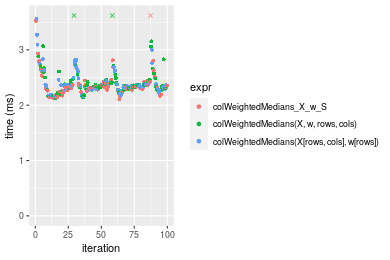
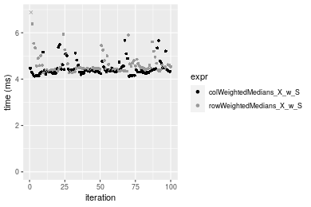

[matrixStats]: Benchmark report

---------------------------------------


# colWeightedMedians() and rowWeightedMedians() benchmarks on subsetted computation

This report benchmark the performance of colWeightedMedians() and rowWeightedMedians on subsetted computation.


## Data
```r
> rmatrix <- function(nrow, ncol, mode = c("logical", "double", "integer", "index"), range = c(-100, 
+     +100), na_prob = 0) {
+     mode <- match.arg(mode)
+     n <- nrow * ncol
+     if (mode == "logical") {
+         x <- sample(c(FALSE, TRUE), size = n, replace = TRUE)
+     }     else if (mode == "index") {
+         x <- seq_len(n)
+         mode <- "integer"
+     }     else {
+         x <- runif(n, min = range[1], max = range[2])
+     }
+     storage.mode(x) <- mode
+     if (na_prob > 0) 
+         x[sample(n, size = na_prob * n)] <- NA
+     dim(x) <- c(nrow, ncol)
+     x
+ }
> rmatrices <- function(scale = 10, seed = 1, ...) {
+     set.seed(seed)
+     data <- list()
+     data[[1]] <- rmatrix(nrow = scale * 1, ncol = scale * 1, ...)
+     data[[2]] <- rmatrix(nrow = scale * 10, ncol = scale * 10, ...)
+     data[[3]] <- rmatrix(nrow = scale * 100, ncol = scale * 1, ...)
+     data[[4]] <- t(data[[3]])
+     data[[5]] <- rmatrix(nrow = scale * 10, ncol = scale * 100, ...)
+     data[[6]] <- t(data[[5]])
+     names(data) <- sapply(data, FUN = function(x) paste(dim(x), collapse = "x"))
+     data
+ }
> data <- rmatrices(mode = "double")
```

## Results

### 10x10 matrix


```r
> X <- data[["10x10"]]
> rows <- sample.int(nrow(X), size = nrow(X) * 0.7)
> cols <- sample.int(ncol(X), size = ncol(X) * 0.7)
> X_S <- X[rows, cols]
> w <- runif(nrow(X))
> w_S <- w[rows]
> gc()
           used  (Mb) gc trigger  (Mb) max used  (Mb)
Ncells  5334344 284.9    7916910 422.9  7916910 422.9
Vcells 10832800  82.7   33191153 253.3 53339345 407.0
> colStats <- microbenchmark(colWeightedMedians_X_w_S = colWeightedMedians(X_S, w = w_S, na.rm = FALSE), 
+     `colWeightedMedians(X, w, rows, cols)` = colWeightedMedians(X, w = w, rows = rows, cols = cols, 
+         na.rm = FALSE), `colWeightedMedians(X[rows, cols], w[rows])` = colWeightedMedians(X[rows, 
+         cols], w = w[rows], na.rm = FALSE), unit = "ms")
> X <- t(X)
> X_S <- t(X_S)
> gc()
           used  (Mb) gc trigger  (Mb) max used  (Mb)
Ncells  5334550 284.9    7916910 422.9  7916910 422.9
Vcells 10833479  82.7   33191153 253.3 53339345 407.0
> rowStats <- microbenchmark(rowWeightedMedians_X_w_S = rowWeightedMedians(X_S, w = w_S, na.rm = FALSE), 
+     `rowWeightedMedians(X, w, cols, rows)` = rowWeightedMedians(X, w = w, rows = cols, cols = rows, 
+         na.rm = FALSE), `rowWeightedMedians(X[cols, rows], w[rows])` = rowWeightedMedians(X[cols, 
+         rows], w = w[rows], na.rm = FALSE), unit = "ms")
```

_Table: Benchmarking of colWeightedMedians_X_w_S(), colWeightedMedians(X, w, rows, cols)() and colWeightedMedians(X[rows, cols], w[rows])() on 10x10 data. The top panel shows times in milliseconds and the bottom panel shows relative times._


|   |expr                                       |      min|       lq|      mean|    median|        uq|      max|
|:--|:------------------------------------------|--------:|--------:|---------:|---------:|---------:|--------:|
|1  |colWeightedMedians_X_w_S                   | 0.052626| 0.055492| 0.0598032| 0.0591955| 0.0639175| 0.086218|
|3  |colWeightedMedians(X[rows, cols], w[rows]) | 0.054190| 0.057296| 0.0610951| 0.0607215| 0.0636040| 0.078173|
|2  |colWeightedMedians(X, w, rows, cols)       | 0.054722| 0.057221| 0.0661582| 0.0607790| 0.0654960| 0.520724|


|   |expr                                       |      min|       lq|     mean|   median|        uq|     max|
|:--|:------------------------------------------|--------:|--------:|--------:|--------:|---------:|-------:|
|1  |colWeightedMedians_X_w_S                   | 1.000000| 1.000000| 1.000000| 1.000000| 1.0000000| 1.00000|
|3  |colWeightedMedians(X[rows, cols], w[rows]) | 1.029719| 1.032509| 1.021602| 1.025779| 0.9950952| 0.90669|
|2  |colWeightedMedians(X, w, rows, cols)       | 1.039828| 1.031158| 1.106266| 1.026750| 1.0246959| 6.03962|

_Table: Benchmarking of rowWeightedMedians_X_w_S(), rowWeightedMedians(X, w, cols, rows)() and rowWeightedMedians(X[cols, rows], w[rows])() on 10x10 data (transposed). The top panel shows times in milliseconds and the bottom panel shows relative times._


|   |expr                                       |      min|        lq|      mean|    median|        uq|      max|
|:--|:------------------------------------------|--------:|---------:|---------:|---------:|---------:|--------:|
|3  |rowWeightedMedians(X[cols, rows], w[rows]) | 0.055853| 0.0590680| 0.0625646| 0.0623145| 0.0657520| 0.074729|
|1  |rowWeightedMedians_X_w_S                   | 0.054368| 0.0577385| 0.0617549| 0.0633800| 0.0640265| 0.076940|
|2  |rowWeightedMedians(X, w, cols, rows)       | 0.056337| 0.0591865| 0.0674016| 0.0634800| 0.0662600| 0.444226|


|   |expr                                       |       min|       lq|      mean|   median|        uq|      max|
|:--|:------------------------------------------|---------:|--------:|---------:|--------:|---------:|--------:|
|3  |rowWeightedMedians(X[cols, rows], w[rows]) | 1.0000000| 1.000000| 1.0000000| 1.000000| 1.0000000| 1.000000|
|1  |rowWeightedMedians_X_w_S                   | 0.9734124| 0.977492| 0.9870577| 1.017099| 0.9737575| 1.029587|
|2  |rowWeightedMedians(X, w, cols, rows)       | 1.0086656| 1.002006| 1.0773124| 1.018703| 1.0077260| 5.944493|

_Figure: Benchmarking of colWeightedMedians_X_w_S(), colWeightedMedians(X, w, rows, cols)() and colWeightedMedians(X[rows, cols], w[rows])() on 10x10 data  as well as rowWeightedMedians_X_w_S(), rowWeightedMedians(X, w, cols, rows)() and rowWeightedMedians(X[cols, rows], w[rows])() on the same data transposed.  Outliers are displayed as crosses.  Times are in milliseconds._


_Table: Benchmarking of colWeightedMedians_X_w_S() and rowWeightedMedians_X_w_S() on 10x10 data (original and transposed).  The top panel shows times in milliseconds and the bottom panel shows relative times._


|   |expr                     |    min|      lq|     mean|  median|      uq|    max|
|:--|:------------------------|------:|-------:|--------:|-------:|-------:|------:|
|1  |colWeightedMedians_X_w_S | 52.626| 55.4920| 59.80320| 59.1955| 63.9175| 86.218|
|2  |rowWeightedMedians_X_w_S | 54.368| 57.7385| 61.75488| 63.3800| 64.0265| 76.940|


|   |expr                     |      min|       lq|     mean|  median|       uq|       max|
|:--|:------------------------|--------:|--------:|--------:|-------:|--------:|---------:|
|1  |colWeightedMedians_X_w_S | 1.000000| 1.000000| 1.000000| 1.00000| 1.000000| 1.0000000|
|2  |rowWeightedMedians_X_w_S | 1.033101| 1.040483| 1.032635| 1.07069| 1.001705| 0.8923891|

_Figure: Benchmarking of colWeightedMedians_X_w_S() and rowWeightedMedians_X_w_S() on 10x10 data (original and transposed).  Outliers are displayed as crosses. Times are in milliseconds._


### 100x100 matrix


```r
> X <- data[["100x100"]]
> rows <- sample.int(nrow(X), size = nrow(X) * 0.7)
> cols <- sample.int(ncol(X), size = ncol(X) * 0.7)
> X_S <- X[rows, cols]
> w <- runif(nrow(X))
> w_S <- w[rows]
> gc()
           used  (Mb) gc trigger  (Mb) max used  (Mb)
Ncells  5333531 284.9    7916910 422.9  7916910 422.9
Vcells 10504819  80.2   33191153 253.3 53339345 407.0
> colStats <- microbenchmark(colWeightedMedians_X_w_S = colWeightedMedians(X_S, w = w_S, na.rm = FALSE), 
+     `colWeightedMedians(X, w, rows, cols)` = colWeightedMedians(X, w = w, rows = rows, cols = cols, 
+         na.rm = FALSE), `colWeightedMedians(X[rows, cols], w[rows])` = colWeightedMedians(X[rows, 
+         cols], w = w[rows], na.rm = FALSE), unit = "ms")
> X <- t(X)
> X_S <- t(X_S)
> gc()
           used  (Mb) gc trigger  (Mb) max used  (Mb)
Ncells  5333525 284.9    7916910 422.9  7916910 422.9
Vcells 10514902  80.3   33191153 253.3 53339345 407.0
> rowStats <- microbenchmark(rowWeightedMedians_X_w_S = rowWeightedMedians(X_S, w = w_S, na.rm = FALSE), 
+     `rowWeightedMedians(X, w, cols, rows)` = rowWeightedMedians(X, w = w, rows = cols, cols = rows, 
+         na.rm = FALSE), `rowWeightedMedians(X[cols, rows], w[rows])` = rowWeightedMedians(X[cols, 
+         rows], w = w[rows], na.rm = FALSE), unit = "ms")
```

_Table: Benchmarking of colWeightedMedians_X_w_S(), colWeightedMedians(X, w, rows, cols)() and colWeightedMedians(X[rows, cols], w[rows])() on 100x100 data. The top panel shows times in milliseconds and the bottom panel shows relative times._


|   |expr                                       |      min|        lq|      mean|    median|        uq|      max|
|:--|:------------------------------------------|--------:|---------:|---------:|---------:|---------:|--------:|
|1  |colWeightedMedians_X_w_S                   | 0.434137| 0.4463780| 0.5403734| 0.4713315| 0.5911655| 1.070444|
|2  |colWeightedMedians(X, w, rows, cols)       | 0.447466| 0.4619700| 0.5517239| 0.5006270| 0.5818170| 1.107663|
|3  |colWeightedMedians(X[rows, cols], w[rows]) | 0.440669| 0.4654005| 0.5546191| 0.5054815| 0.5816365| 1.110276|


|   |expr                                       |      min|       lq|     mean|   median|        uq|      max|
|:--|:------------------------------------------|--------:|--------:|--------:|--------:|---------:|--------:|
|1  |colWeightedMedians_X_w_S                   | 1.000000| 1.000000| 1.000000| 1.000000| 1.0000000| 1.000000|
|2  |colWeightedMedians(X, w, rows, cols)       | 1.030702| 1.034930| 1.021005| 1.062155| 0.9841863| 1.034770|
|3  |colWeightedMedians(X[rows, cols], w[rows]) | 1.015046| 1.042615| 1.026363| 1.072454| 0.9838810| 1.037211|

_Table: Benchmarking of rowWeightedMedians_X_w_S(), rowWeightedMedians(X, w, cols, rows)() and rowWeightedMedians(X[cols, rows], w[rows])() on 100x100 data (transposed). The top panel shows times in milliseconds and the bottom panel shows relative times._


|   |expr                                       |      min|        lq|      mean|    median|        uq|      max|
|:--|:------------------------------------------|--------:|---------:|---------:|---------:|---------:|--------:|
|1  |rowWeightedMedians_X_w_S                   | 0.430554| 0.4348235| 0.4951498| 0.4388405| 0.5456995| 0.750884|
|2  |rowWeightedMedians(X, w, cols, rows)       | 0.440696| 0.4455005| 0.4825449| 0.4496595| 0.4980810| 0.704190|
|3  |rowWeightedMedians(X[cols, rows], w[rows]) | 0.437534| 0.4445915| 0.4939047| 0.4497360| 0.4921610| 0.860468|


|   |expr                                       |      min|       lq|      mean|   median|        uq|       max|
|:--|:------------------------------------------|--------:|--------:|---------:|--------:|---------:|---------:|
|1  |rowWeightedMedians_X_w_S                   | 1.000000| 1.000000| 1.0000000| 1.000000| 1.0000000| 1.0000000|
|2  |rowWeightedMedians(X, w, cols, rows)       | 1.023556| 1.024555| 0.9745433| 1.024654| 0.9127386| 0.9378146|
|3  |rowWeightedMedians(X[cols, rows], w[rows]) | 1.016212| 1.022464| 0.9974855| 1.024828| 0.9018901| 1.1459400|

_Figure: Benchmarking of colWeightedMedians_X_w_S(), colWeightedMedians(X, w, rows, cols)() and colWeightedMedians(X[rows, cols], w[rows])() on 100x100 data  as well as rowWeightedMedians_X_w_S(), rowWeightedMedians(X, w, cols, rows)() and rowWeightedMedians(X[cols, rows], w[rows])() on the same data transposed.  Outliers are displayed as crosses.  Times are in milliseconds._


_Table: Benchmarking of colWeightedMedians_X_w_S() and rowWeightedMedians_X_w_S() on 100x100 data (original and transposed).  The top panel shows times in milliseconds and the bottom panel shows relative times._


|   |expr                     |     min|       lq|     mean|   median|       uq|      max|
|:--|:------------------------|-------:|--------:|--------:|--------:|--------:|--------:|
|2  |rowWeightedMedians_X_w_S | 430.554| 434.8235| 495.1498| 438.8405| 545.6995|  750.884|
|1  |colWeightedMedians_X_w_S | 434.137| 446.3780| 540.3734| 471.3315| 591.1655| 1070.444|


|   |expr                     |      min|       lq|     mean|   median|       uq|      max|
|:--|:------------------------|--------:|--------:|--------:|--------:|--------:|--------:|
|2  |rowWeightedMedians_X_w_S | 1.000000| 1.000000| 1.000000| 1.000000| 1.000000| 1.000000|
|1  |colWeightedMedians_X_w_S | 1.008322| 1.026573| 1.091333| 1.074038| 1.083317| 1.425578|

_Figure: Benchmarking of colWeightedMedians_X_w_S() and rowWeightedMedians_X_w_S() on 100x100 data (original and transposed).  Outliers are displayed as crosses. Times are in milliseconds._


### 1000x10 matrix


```r
> X <- data[["1000x10"]]
> rows <- sample.int(nrow(X), size = nrow(X) * 0.7)
> cols <- sample.int(ncol(X), size = ncol(X) * 0.7)
> X_S <- X[rows, cols]
> w <- runif(nrow(X))
> w_S <- w[rows]
> gc()
           used  (Mb) gc trigger  (Mb) max used  (Mb)
Ncells  5334287 284.9    7916910 422.9  7916910 422.9
Vcells 10510793  80.2   33191153 253.3 53339345 407.0
> colStats <- microbenchmark(colWeightedMedians_X_w_S = colWeightedMedians(X_S, w = w_S, na.rm = FALSE), 
+     `colWeightedMedians(X, w, rows, cols)` = colWeightedMedians(X, w = w, rows = rows, cols = cols, 
+         na.rm = FALSE), `colWeightedMedians(X[rows, cols], w[rows])` = colWeightedMedians(X[rows, 
+         cols], w = w[rows], na.rm = FALSE), unit = "ms")
> X <- t(X)
> X_S <- t(X_S)
> gc()
           used  (Mb) gc trigger  (Mb) max used  (Mb)
Ncells  5334275 284.9    7916910 422.9  7916910 422.9
Vcells 10520866  80.3   33191153 253.3 53339345 407.0
> rowStats <- microbenchmark(rowWeightedMedians_X_w_S = rowWeightedMedians(X_S, w = w_S, na.rm = FALSE), 
+     `rowWeightedMedians(X, w, cols, rows)` = rowWeightedMedians(X, w = w, rows = cols, cols = rows, 
+         na.rm = FALSE), `rowWeightedMedians(X[cols, rows], w[rows])` = rowWeightedMedians(X[cols, 
+         rows], w = w[rows], na.rm = FALSE), unit = "ms")
```

_Table: Benchmarking of colWeightedMedians_X_w_S(), colWeightedMedians(X, w, rows, cols)() and colWeightedMedians(X[rows, cols], w[rows])() on 1000x10 data. The top panel shows times in milliseconds and the bottom panel shows relative times._


|   |expr                                       |      min|        lq|      mean|    median|        uq|      max|
|:--|:------------------------------------------|--------:|---------:|---------:|---------:|---------:|--------:|
|1  |colWeightedMedians_X_w_S                   | 0.285904| 0.2884800| 0.3284488| 0.2955405| 0.3679635| 0.555002|
|3  |colWeightedMedians(X[rows, cols], w[rows]) | 0.299357| 0.3028875| 0.3375220| 0.3071975| 0.3751100| 0.446226|
|2  |colWeightedMedians(X, w, rows, cols)       | 0.300769| 0.3049490| 0.3497215| 0.3093395| 0.3873910| 0.633478|


|   |expr                                       |      min|       lq|     mean|   median|       uq|       max|
|:--|:------------------------------------------|--------:|--------:|--------:|--------:|--------:|---------:|
|1  |colWeightedMedians_X_w_S                   | 1.000000| 1.000000| 1.000000| 1.000000| 1.000000| 1.0000000|
|3  |colWeightedMedians(X[rows, cols], w[rows]) | 1.047054| 1.049943| 1.027625| 1.039443| 1.019422| 0.8040079|
|2  |colWeightedMedians(X, w, rows, cols)       | 1.051993| 1.057089| 1.064767| 1.046691| 1.052797| 1.1413977|

_Table: Benchmarking of rowWeightedMedians_X_w_S(), rowWeightedMedians(X, w, cols, rows)() and rowWeightedMedians(X[cols, rows], w[rows])() on 1000x10 data (transposed). The top panel shows times in milliseconds and the bottom panel shows relative times._


|   |expr                                       |      min|        lq|      mean|    median|        uq|      max|
|:--|:------------------------------------------|--------:|---------:|---------:|---------:|---------:|--------:|
|1  |rowWeightedMedians_X_w_S                   | 0.286450| 0.2940310| 0.3394324| 0.3209085| 0.3723010| 0.492944|
|3  |rowWeightedMedians(X[cols, rows], w[rows]) | 0.303695| 0.3103895| 0.3630336| 0.3476785| 0.3924645| 0.547230|
|2  |rowWeightedMedians(X, w, cols, rows)       | 0.304607| 0.3098190| 0.3631793| 0.3479245| 0.3922800| 0.634940|


|   |expr                                       |      min|       lq|     mean|   median|       uq|      max|
|:--|:------------------------------------------|--------:|--------:|--------:|--------:|--------:|--------:|
|1  |rowWeightedMedians_X_w_S                   | 1.000000| 1.000000| 1.000000| 1.000000| 1.000000| 1.000000|
|3  |rowWeightedMedians(X[cols, rows], w[rows]) | 1.060202| 1.055635| 1.069531| 1.083419| 1.054159| 1.110126|
|2  |rowWeightedMedians(X, w, cols, rows)       | 1.063386| 1.053695| 1.069961| 1.084186| 1.053664| 1.288057|

_Figure: Benchmarking of colWeightedMedians_X_w_S(), colWeightedMedians(X, w, rows, cols)() and colWeightedMedians(X[rows, cols], w[rows])() on 1000x10 data  as well as rowWeightedMedians_X_w_S(), rowWeightedMedians(X, w, cols, rows)() and rowWeightedMedians(X[cols, rows], w[rows])() on the same data transposed.  Outliers are displayed as crosses.  Times are in milliseconds._


_Table: Benchmarking of colWeightedMedians_X_w_S() and rowWeightedMedians_X_w_S() on 1000x10 data (original and transposed).  The top panel shows times in milliseconds and the bottom panel shows relative times._


|   |expr                     |     min|      lq|     mean|   median|       uq|     max|
|:--|:------------------------|-------:|-------:|--------:|--------:|--------:|-------:|
|1  |colWeightedMedians_X_w_S | 285.904| 288.480| 328.4488| 295.5405| 367.9635| 555.002|
|2  |rowWeightedMedians_X_w_S | 286.450| 294.031| 339.4324| 320.9085| 372.3010| 492.944|


|   |expr                     |     min|       lq|     mean|   median|       uq|       max|
|:--|:------------------------|-------:|--------:|--------:|--------:|--------:|---------:|
|1  |colWeightedMedians_X_w_S | 1.00000| 1.000000| 1.000000| 1.000000| 1.000000| 1.0000000|
|2  |rowWeightedMedians_X_w_S | 1.00191| 1.019242| 1.033441| 1.085836| 1.011788| 0.8881842|

_Figure: Benchmarking of colWeightedMedians_X_w_S() and rowWeightedMedians_X_w_S() on 1000x10 data (original and transposed).  Outliers are displayed as crosses. Times are in milliseconds._


### 10x1000 matrix


```r
> X <- data[["10x1000"]]
> rows <- sample.int(nrow(X), size = nrow(X) * 0.7)
> cols <- sample.int(ncol(X), size = ncol(X) * 0.7)
> X_S <- X[rows, cols]
> w <- runif(nrow(X))
> w_S <- w[rows]
> gc()
           used  (Mb) gc trigger  (Mb) max used  (Mb)
Ncells  5334493 284.9    7916910 422.9  7916910 422.9
Vcells 10510094  80.2   33191153 253.3 53339345 407.0
> colStats <- microbenchmark(colWeightedMedians_X_w_S = colWeightedMedians(X_S, w = w_S, na.rm = FALSE), 
+     `colWeightedMedians(X, w, rows, cols)` = colWeightedMedians(X, w = w, rows = rows, cols = cols, 
+         na.rm = FALSE), `colWeightedMedians(X[rows, cols], w[rows])` = colWeightedMedians(X[rows, 
+         cols], w = w[rows], na.rm = FALSE), unit = "ms")
> X <- t(X)
> X_S <- t(X_S)
> gc()
           used  (Mb) gc trigger  (Mb) max used  (Mb)
Ncells  5334487 284.9    7916910 422.9  7916910 422.9
Vcells 10520177  80.3   33191153 253.3 53339345 407.0
> rowStats <- microbenchmark(rowWeightedMedians_X_w_S = rowWeightedMedians(X_S, w = w_S, na.rm = FALSE), 
+     `rowWeightedMedians(X, w, cols, rows)` = rowWeightedMedians(X, w = w, rows = cols, cols = rows, 
+         na.rm = FALSE), `rowWeightedMedians(X[cols, rows], w[rows])` = rowWeightedMedians(X[cols, 
+         rows], w = w[rows], na.rm = FALSE), unit = "ms")
```

_Table: Benchmarking of colWeightedMedians_X_w_S(), colWeightedMedians(X, w, rows, cols)() and colWeightedMedians(X[rows, cols], w[rows])() on 10x1000 data. The top panel shows times in milliseconds and the bottom panel shows relative times._


|   |expr                                       |      min|       lq|     mean|   median|       uq|      max|
|:--|:------------------------------------------|--------:|--------:|--------:|--------:|--------:|--------:|
|1  |colWeightedMedians_X_w_S                   | 2.105473| 2.268289| 2.430364| 2.317800| 2.390839| 8.856974|
|3  |colWeightedMedians(X[rows, cols], w[rows]) | 2.137962| 2.283279| 2.407698| 2.335170| 2.419733| 3.559363|
|2  |colWeightedMedians(X, w, rows, cols)       | 2.125799| 2.309067| 2.517231| 2.347761| 2.425774| 8.769117|


|   |expr                                       |      min|       lq|      mean|   median|       uq|       max|
|:--|:------------------------------------------|--------:|--------:|---------:|--------:|--------:|---------:|
|1  |colWeightedMedians_X_w_S                   | 1.000000| 1.000000| 1.0000000| 1.000000| 1.000000| 1.0000000|
|3  |colWeightedMedians(X[rows, cols], w[rows]) | 1.015431| 1.006608| 0.9906738| 1.007494| 1.012085| 0.4018712|
|2  |colWeightedMedians(X, w, rows, cols)       | 1.009654| 1.017977| 1.0357421| 1.012927| 1.014612| 0.9900805|

_Table: Benchmarking of rowWeightedMedians_X_w_S(), rowWeightedMedians(X, w, cols, rows)() and rowWeightedMedians(X[cols, rows], w[rows])() on 10x1000 data (transposed). The top panel shows times in milliseconds and the bottom panel shows relative times._


|   |expr                                       |      min|       lq|     mean|   median|       uq|      max|
|:--|:------------------------------------------|--------:|--------:|--------:|--------:|--------:|--------:|
|1  |rowWeightedMedians_X_w_S                   | 2.121931| 2.233299| 2.465462| 2.321854| 2.464652| 8.613723|
|3  |rowWeightedMedians(X[cols, rows], w[rows]) | 2.137454| 2.259781| 2.473130| 2.333979| 2.424936| 8.783698|
|2  |rowWeightedMedians(X, w, cols, rows)       | 2.112333| 2.248140| 2.424102| 2.335499| 2.375852| 8.750414|


|   |expr                                       |       min|       lq|      mean|   median|        uq|      max|
|:--|:------------------------------------------|---------:|--------:|---------:|--------:|---------:|--------:|
|1  |rowWeightedMedians_X_w_S                   | 1.0000000| 1.000000| 1.0000000| 1.000000| 1.0000000| 1.000000|
|3  |rowWeightedMedians(X[cols, rows], w[rows]) | 1.0073155| 1.011858| 1.0031104| 1.005222| 0.9838856| 1.019733|
|2  |rowWeightedMedians(X, w, cols, rows)       | 0.9954768| 1.006646| 0.9832243| 1.005877| 0.9639704| 1.015869|

_Figure: Benchmarking of colWeightedMedians_X_w_S(), colWeightedMedians(X, w, rows, cols)() and colWeightedMedians(X[rows, cols], w[rows])() on 10x1000 data  as well as rowWeightedMedians_X_w_S(), rowWeightedMedians(X, w, cols, rows)() and rowWeightedMedians(X[cols, rows], w[rows])() on the same data transposed.  Outliers are displayed as crosses.  Times are in milliseconds._





_Table: Benchmarking of colWeightedMedians_X_w_S() and rowWeightedMedians_X_w_S() on 10x1000 data (original and transposed).  The top panel shows times in milliseconds and the bottom panel shows relative times._


|   |expr                     |      min|       lq|     mean|   median|       uq|      max|
|:--|:------------------------|--------:|--------:|--------:|--------:|--------:|--------:|
|1  |colWeightedMedians_X_w_S | 2.105473| 2.268289| 2.430364| 2.317800| 2.390839| 8.856974|
|2  |rowWeightedMedians_X_w_S | 2.121931| 2.233299| 2.465462| 2.321854| 2.464652| 8.613723|


|   |expr                     |      min|        lq|     mean|   median|       uq|       max|
|:--|:------------------------|--------:|---------:|--------:|--------:|--------:|---------:|
|1  |colWeightedMedians_X_w_S | 1.000000| 1.0000000| 1.000000| 1.000000| 1.000000| 1.0000000|
|2  |rowWeightedMedians_X_w_S | 1.007817| 0.9845741| 1.014441| 1.001749| 1.030873| 0.9725357|

_Figure: Benchmarking of colWeightedMedians_X_w_S() and rowWeightedMedians_X_w_S() on 10x1000 data (original and transposed).  Outliers are displayed as crosses. Times are in milliseconds._


### 100x1000 matrix


```r
> X <- data[["100x1000"]]
> rows <- sample.int(nrow(X), size = nrow(X) * 0.7)
> cols <- sample.int(ncol(X), size = ncol(X) * 0.7)
> X_S <- X[rows, cols]
> w <- runif(nrow(X))
> w_S <- w[rows]
> gc()
           used  (Mb) gc trigger  (Mb) max used  (Mb)
Ncells  5334707 285.0    7916910 422.9  7916910 422.9
Vcells 10555068  80.6   33191153 253.3 53339345 407.0
> colStats <- microbenchmark(colWeightedMedians_X_w_S = colWeightedMedians(X_S, w = w_S, na.rm = FALSE), 
+     `colWeightedMedians(X, w, rows, cols)` = colWeightedMedians(X, w = w, rows = rows, cols = cols, 
+         na.rm = FALSE), `colWeightedMedians(X[rows, cols], w[rows])` = colWeightedMedians(X[rows, 
+         cols], w = w[rows], na.rm = FALSE), unit = "ms")
> X <- t(X)
> X_S <- t(X_S)
> gc()
           used  (Mb) gc trigger  (Mb) max used  (Mb)
Ncells  5334695 285.0    7916910 422.9  7916910 422.9
Vcells 10655141  81.3   33191153 253.3 53339345 407.0
> rowStats <- microbenchmark(rowWeightedMedians_X_w_S = rowWeightedMedians(X_S, w = w_S, na.rm = FALSE), 
+     `rowWeightedMedians(X, w, cols, rows)` = rowWeightedMedians(X, w = w, rows = cols, cols = rows, 
+         na.rm = FALSE), `rowWeightedMedians(X[cols, rows], w[rows])` = rowWeightedMedians(X[cols, 
+         rows], w = w[rows], na.rm = FALSE), unit = "ms")
```

_Table: Benchmarking of colWeightedMedians_X_w_S(), colWeightedMedians(X, w, rows, cols)() and colWeightedMedians(X[rows, cols], w[rows])() on 100x1000 data. The top panel shows times in milliseconds and the bottom panel shows relative times._


|   |expr                                       |      min|       lq|     mean|   median|       uq|       max|
|:--|:------------------------------------------|--------:|--------:|--------:|--------:|--------:|---------:|
|1  |colWeightedMedians_X_w_S                   | 4.126185| 4.298798| 4.468813| 4.359743| 4.464126|  5.675724|
|2  |colWeightedMedians(X, w, rows, cols)       | 4.211187| 4.397105| 4.890707| 4.463831| 4.581053| 19.973439|
|3  |colWeightedMedians(X[rows, cols], w[rows]) | 4.231171| 4.395156| 4.712517| 4.474814| 4.583891| 19.211726|


|   |expr                                       |      min|       lq|     mean|   median|       uq|      max|
|:--|:------------------------------------------|--------:|--------:|--------:|--------:|--------:|--------:|
|1  |colWeightedMedians_X_w_S                   | 1.000000| 1.000000| 1.000000| 1.000000| 1.000000| 1.000000|
|2  |colWeightedMedians(X, w, rows, cols)       | 1.020601| 1.022868| 1.094408| 1.023875| 1.026193| 3.519100|
|3  |colWeightedMedians(X[rows, cols], w[rows]) | 1.025444| 1.022415| 1.054534| 1.026394| 1.026828| 3.384894|

_Table: Benchmarking of rowWeightedMedians_X_w_S(), rowWeightedMedians(X, w, cols, rows)() and rowWeightedMedians(X[cols, rows], w[rows])() on 100x1000 data (transposed). The top panel shows times in milliseconds and the bottom panel shows relative times._


|   |expr                                       |      min|       lq|     mean|   median|       uq|       max|
|:--|:------------------------------------------|--------:|--------:|--------:|--------:|--------:|---------:|
|1  |rowWeightedMedians_X_w_S                   | 4.231641| 4.399703| 4.631424| 4.461740| 4.635045|  6.997573|
|3  |rowWeightedMedians(X[cols, rows], w[rows]) | 4.256076| 4.479400| 4.771082| 4.530139| 4.653082| 19.360516|
|2  |rowWeightedMedians(X, w, cols, rows)       | 4.239604| 4.451703| 4.947578| 4.550002| 4.693646| 21.368131|


|   |expr                                       |      min|       lq|     mean|   median|       uq|      max|
|:--|:------------------------------------------|--------:|--------:|--------:|--------:|--------:|--------:|
|1  |rowWeightedMedians_X_w_S                   | 1.000000| 1.000000| 1.000000| 1.000000| 1.000000| 1.000000|
|3  |rowWeightedMedians(X[cols, rows], w[rows]) | 1.005774| 1.018114| 1.030154| 1.015330| 1.003891| 2.766747|
|2  |rowWeightedMedians(X, w, cols, rows)       | 1.001882| 1.011819| 1.068263| 1.019782| 1.012643| 3.053649|

_Figure: Benchmarking of colWeightedMedians_X_w_S(), colWeightedMedians(X, w, rows, cols)() and colWeightedMedians(X[rows, cols], w[rows])() on 100x1000 data  as well as rowWeightedMedians_X_w_S(), rowWeightedMedians(X, w, cols, rows)() and rowWeightedMedians(X[cols, rows], w[rows])() on the same data transposed.  Outliers are displayed as crosses.  Times are in milliseconds._


_Table: Benchmarking of colWeightedMedians_X_w_S() and rowWeightedMedians_X_w_S() on 100x1000 data (original and transposed).  The top panel shows times in milliseconds and the bottom panel shows relative times._


|   |expr                     |      min|       lq|     mean|   median|       uq|      max|
|:--|:------------------------|--------:|--------:|--------:|--------:|--------:|--------:|
|1  |colWeightedMedians_X_w_S | 4.126185| 4.298798| 4.468813| 4.359743| 4.464126| 5.675724|
|2  |rowWeightedMedians_X_w_S | 4.231641| 4.399703| 4.631424| 4.461740| 4.635045| 6.997573|


|   |expr                     |      min|       lq|     mean|   median|       uq|      max|
|:--|:------------------------|--------:|--------:|--------:|--------:|--------:|--------:|
|1  |colWeightedMedians_X_w_S | 1.000000| 1.000000| 1.000000| 1.000000| 1.000000| 1.000000|
|2  |rowWeightedMedians_X_w_S | 1.025558| 1.023473| 1.036388| 1.023395| 1.038287| 1.232895|

_Figure: Benchmarking of colWeightedMedians_X_w_S() and rowWeightedMedians_X_w_S() on 100x1000 data (original and transposed).  Outliers are displayed as crosses. Times are in milliseconds._




### 1000x100 matrix


```r
> X <- data[["1000x100"]]
> rows <- sample.int(nrow(X), size = nrow(X) * 0.7)
> cols <- sample.int(ncol(X), size = ncol(X) * 0.7)
> X_S <- X[rows, cols]
> w <- runif(nrow(X))
> w_S <- w[rows]
> gc()
           used  (Mb) gc trigger  (Mb) max used  (Mb)
Ncells  5334913 285.0    7916910 422.9  7916910 422.9
Vcells 10557403  80.6   33191153 253.3 53339345 407.0
> colStats <- microbenchmark(colWeightedMedians_X_w_S = colWeightedMedians(X_S, w = w_S, na.rm = FALSE), 
+     `colWeightedMedians(X, w, rows, cols)` = colWeightedMedians(X, w = w, rows = rows, cols = cols, 
+         na.rm = FALSE), `colWeightedMedians(X[rows, cols], w[rows])` = colWeightedMedians(X[rows, 
+         cols], w = w[rows], na.rm = FALSE), unit = "ms")
> X <- t(X)
> X_S <- t(X_S)
> gc()
           used  (Mb) gc trigger  (Mb) max used  (Mb)
Ncells  5334901 285.0    7916910 422.9  7916910 422.9
Vcells 10657476  81.4   33191153 253.3 53339345 407.0
> rowStats <- microbenchmark(rowWeightedMedians_X_w_S = rowWeightedMedians(X_S, w = w_S, na.rm = FALSE), 
+     `rowWeightedMedians(X, w, cols, rows)` = rowWeightedMedians(X, w = w, rows = cols, cols = rows, 
+         na.rm = FALSE), `rowWeightedMedians(X[cols, rows], w[rows])` = rowWeightedMedians(X[cols, 
+         rows], w = w[rows], na.rm = FALSE), unit = "ms")
```

_Table: Benchmarking of colWeightedMedians_X_w_S(), colWeightedMedians(X, w, rows, cols)() and colWeightedMedians(X[rows, cols], w[rows])() on 1000x100 data. The top panel shows times in milliseconds and the bottom panel shows relative times._


|   |expr                                       |      min|       lq|     mean|   median|       uq|       max|
|:--|:------------------------------------------|--------:|--------:|--------:|--------:|--------:|---------:|
|1  |colWeightedMedians_X_w_S                   | 2.633460| 2.727588| 2.900070| 2.792244| 2.879844|  4.390126|
|2  |colWeightedMedians(X, w, rows, cols)       | 2.745008| 2.824676| 3.107675| 2.888164| 2.921382| 12.395477|
|3  |colWeightedMedians(X[rows, cols], w[rows]) | 2.750645| 2.834135| 2.966980| 2.897008| 2.933892|  4.522327|


|   |expr                                       |      min|       lq|     mean|   median|       uq|      max|
|:--|:------------------------------------------|--------:|--------:|--------:|--------:|--------:|--------:|
|1  |colWeightedMedians_X_w_S                   | 1.000000| 1.000000| 1.000000| 1.000000| 1.000000| 1.000000|
|2  |colWeightedMedians(X, w, rows, cols)       | 1.042358| 1.035595| 1.071586| 1.034353| 1.014424| 2.823490|
|3  |colWeightedMedians(X[rows, cols], w[rows]) | 1.044498| 1.039063| 1.023072| 1.037520| 1.018768| 1.030113|

_Table: Benchmarking of rowWeightedMedians_X_w_S(), rowWeightedMedians(X, w, cols, rows)() and rowWeightedMedians(X[cols, rows], w[rows])() on 1000x100 data (transposed). The top panel shows times in milliseconds and the bottom panel shows relative times._


|   |expr                                       |      min|       lq|     mean|   median|       uq|       max|
|:--|:------------------------------------------|--------:|--------:|--------:|--------:|--------:|---------:|
|1  |rowWeightedMedians_X_w_S                   | 2.663706| 2.772612| 2.986389| 2.811904| 2.910218| 11.293295|
|2  |rowWeightedMedians(X, w, cols, rows)       | 2.779964| 2.864292| 3.134994| 2.936345| 3.064936| 11.821283|
|3  |rowWeightedMedians(X[cols, rows], w[rows]) | 2.768421| 2.876955| 3.035010| 2.948023| 3.041638|  4.027716|


|   |expr                                       |      min|       lq|     mean|   median|       uq|       max|
|:--|:------------------------------------------|--------:|--------:|--------:|--------:|--------:|---------:|
|1  |rowWeightedMedians_X_w_S                   | 1.000000| 1.000000| 1.000000| 1.000000| 1.000000| 1.0000000|
|2  |rowWeightedMedians(X, w, cols, rows)       | 1.043645| 1.033066| 1.049761| 1.044255| 1.053164| 1.0467523|
|3  |rowWeightedMedians(X[cols, rows], w[rows]) | 1.039312| 1.037634| 1.016281| 1.048408| 1.045158| 0.3566467|

_Figure: Benchmarking of colWeightedMedians_X_w_S(), colWeightedMedians(X, w, rows, cols)() and colWeightedMedians(X[rows, cols], w[rows])() on 1000x100 data  as well as rowWeightedMedians_X_w_S(), rowWeightedMedians(X, w, cols, rows)() and rowWeightedMedians(X[cols, rows], w[rows])() on the same data transposed.  Outliers are displayed as crosses.  Times are in milliseconds._


_Table: Benchmarking of colWeightedMedians_X_w_S() and rowWeightedMedians_X_w_S() on 1000x100 data (original and transposed).  The top panel shows times in milliseconds and the bottom panel shows relative times._


|   |expr                     |      min|       lq|     mean|   median|       uq|       max|
|:--|:------------------------|--------:|--------:|--------:|--------:|--------:|---------:|
|1  |colWeightedMedians_X_w_S | 2.633460| 2.727588| 2.900070| 2.792244| 2.879844|  4.390126|
|2  |rowWeightedMedians_X_w_S | 2.663706| 2.772612| 2.986389| 2.811904| 2.910218| 11.293295|


|   |expr                     |      min|       lq|     mean|   median|       uq|      max|
|:--|:------------------------|--------:|--------:|--------:|--------:|--------:|--------:|
|1  |colWeightedMedians_X_w_S | 1.000000| 1.000000| 1.000000| 1.000000| 1.000000| 1.000000|
|2  |rowWeightedMedians_X_w_S | 1.011485| 1.016507| 1.029764| 1.007041| 1.010547| 2.572431|

_Figure: Benchmarking of colWeightedMedians_X_w_S() and rowWeightedMedians_X_w_S() on 1000x100 data (original and transposed).  Outliers are displayed as crosses. Times are in milliseconds._


## Appendix

### Session information
```r
R version 4.1.1 Patched (2021-08-10 r80727)
Platform: x86_64-pc-linux-gnu (64-bit)
Running under: Ubuntu 18.04.5 LTS

Matrix products: default
BLAS:   /home/hb/software/R-devel/R-4-1-branch/lib/R/lib/libRblas.so
LAPACK: /home/hb/software/R-devel/R-4-1-branch/lib/R/lib/libRlapack.so

locale:
 [1] LC_CTYPE=en_US.UTF-8       LC_NUMERIC=C              
 [3] LC_TIME=en_US.UTF-8        LC_COLLATE=en_US.UTF-8    
 [5] LC_MONETARY=en_US.UTF-8    LC_MESSAGES=en_US.UTF-8   
 [7] LC_PAPER=en_US.UTF-8       LC_NAME=C                 
 [9] LC_ADDRESS=C               LC_TELEPHONE=C            
[11] LC_MEASUREMENT=en_US.UTF-8 LC_IDENTIFICATION=C       

attached base packages:
[1] stats     graphics  grDevices utils     datasets  methods   base     

other attached packages:
[1] microbenchmark_1.4-7   matrixStats_0.60.0     ggplot2_3.3.5         
[4] knitr_1.33             R.devices_2.17.0       R.utils_2.10.1        
[7] R.oo_1.24.0            R.methodsS3_1.8.1-9001 history_0.0.1-9000    

loaded via a namespace (and not attached):
 [1] Biobase_2.52.0          httr_1.4.2              splines_4.1.1          
 [4] bit64_4.0.5             network_1.17.1          assertthat_0.2.1       
 [7] highr_0.9               stats4_4.1.1            blob_1.2.2             
[10] GenomeInfoDbData_1.2.6  robustbase_0.93-8       pillar_1.6.2           
[13] RSQLite_2.2.8           lattice_0.20-44         glue_1.4.2             
[16] digest_0.6.27           XVector_0.32.0          colorspace_2.0-2       
[19] Matrix_1.3-4            XML_3.99-0.7            pkgconfig_2.0.3        
[22] zlibbioc_1.38.0         genefilter_1.74.0       purrr_0.3.4            
[25] ergm_4.1.2              xtable_1.8-4            scales_1.1.1           
[28] tibble_3.1.4            annotate_1.70.0         KEGGREST_1.32.0        
[31] farver_2.1.0            generics_0.1.0          IRanges_2.26.0         
[34] ellipsis_0.3.2          cachem_1.0.6            withr_2.4.2            
[37] BiocGenerics_0.38.0     mime_0.11               survival_3.2-13        
[40] magrittr_2.0.1          crayon_1.4.1            statnet.common_4.5.0   
[43] memoise_2.0.0           laeken_0.5.1            fansi_0.5.0            
[46] R.cache_0.15.0          MASS_7.3-54             R.rsp_0.44.0           
[49] progressr_0.8.0         tools_4.1.1             lifecycle_1.0.0        
[52] S4Vectors_0.30.0        trust_0.1-8             munsell_0.5.0          
[55] tabby_0.0.1-9001        AnnotationDbi_1.54.1    Biostrings_2.60.2      
[58] compiler_4.1.1          GenomeInfoDb_1.28.1     rlang_0.4.11           
[61] grid_4.1.1              RCurl_1.98-1.4          cwhmisc_6.6            
[64] rstudioapi_0.13         rappdirs_0.3.3          startup_0.15.0         
[67] labeling_0.4.2          bitops_1.0-7            base64enc_0.1-3        
[70] boot_1.3-28             gtable_0.3.0            DBI_1.1.1              
[73] markdown_1.1            R6_2.5.1                lpSolveAPI_5.5.2.0-17.7
[76] rle_0.9.2               dplyr_1.0.7             fastmap_1.1.0          
[79] bit_4.0.4               utf8_1.2.2              parallel_4.1.1         
[82] Rcpp_1.0.7              vctrs_0.3.8             png_0.1-7              
[85] DEoptimR_1.0-9          tidyselect_1.1.1        xfun_0.25              
[88] coda_0.19-4            
```
Total processing time was 18.9 secs.


### Reproducibility
To reproduce this report, do:
```r
html <- matrixStats:::benchmark('colRowWeightedMedians_subset')
```

[RSP]: https://cran.r-project.org/package=R.rsp
[matrixStats]: https://cran.r-project.org/package=matrixStats

[StackOverflow:colMins?]: https://stackoverflow.com/questions/13676878 "Stack Overflow: fastest way to get Min from every column in a matrix?"
[StackOverflow:colSds?]: https://stackoverflow.com/questions/17549762 "Stack Overflow: Is there such 'colsd' in R?"
[StackOverflow:rowProds?]: https://stackoverflow.com/questions/20198801/ "Stack Overflow: Row product of matrix and column sum of matrix"

---------------------------------------
Copyright Dongcan Jiang. Last updated on 2021-08-25 22:32:30 (+0200 UTC). Powered by [RSP].

<script>
 var link = document.createElement('link');
 link.rel = 'icon';
 link.href = "data:image/png;base64,iVBORw0KGgoAAAANSUhEUgAAACAAAAAgCAMAAABEpIrGAAAA21BMVEUAAAAAAP8AAP8AAP8AAP8AAP8AAP8AAP8AAP8AAP8AAP8AAP8AAP8AAP8AAP8AAP8AAP8AAP8AAP8AAP8AAP8AAP8AAP8AAP8AAP8AAP8AAP8AAP8AAP8AAP8AAP8AAP8AAP8AAP8AAP8AAP8AAP8AAP8AAP8AAP8AAP8AAP8BAf4CAv0DA/wdHeIeHuEfH+AgIN8hId4lJdomJtknJ9g+PsE/P8BAQL9yco10dIt1dYp3d4h4eIeVlWqWlmmXl2iYmGeZmWabm2Tn5xjo6Bfp6Rb39wj4+Af//wA2M9hbAAAASXRSTlMAAQIJCgsMJSYnKD4/QGRlZmhpamtsbautrrCxuru8y8zN5ebn6Pn6+///////////////////////////////////////////LsUNcQAAAS9JREFUOI29k21XgkAQhVcFytdSMqMETU26UVqGmpaiFbL//xc1cAhhwVNf6n5i5z67M2dmYOyfJZUqlVLhkKucG7cgmUZTybDz6g0iDeq51PUr37Ds2cy2/C9NeES5puDjxuUk1xnToZsg8pfA3avHQ3lLIi7iWRrkv/OYtkScxBIMgDee0ALoyxHQBJ68JLCjOtQIMIANF7QG9G9fNnHvisCHBVMKgSJgiz7nE+AoBKrAPA3MgepvgR9TSCasrCKH0eB1wBGBFdCO+nAGjMVGPcQb5bd6mQRegN6+1axOs9nGfYcCtfi4NQosdtH7dB+txFIpXQqN1p9B/asRHToyS0jRgpV7nk4nwcq1BJ+x3Gl/v7S9Wmpp/aGquum7w3ZDyrADFYrl8vHBH+ev9AUASW1dmU4h4wAAAABJRU5ErkJggg=="
 document.getElementsByTagName('head')[0].appendChild(link);
</script>


