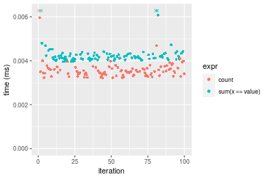
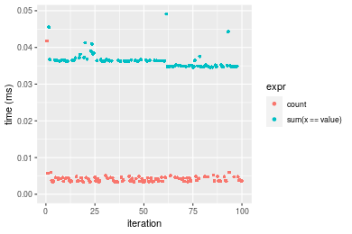
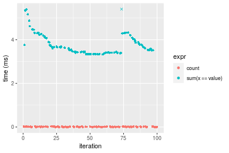

[matrixStats]: Benchmark report

---------------------------------------


# count() benchmarks

This report benchmark the performance of count() against alternative methods.

## Alternative methods

* sum(x == value)


## Data type "integer"
### Data
```r
> rvector <- function(n, mode = c("logical", "double", "integer"), range = c(-100, +100), na_prob = 0) {
+     mode <- match.arg(mode)
+     if (mode == "logical") {
+         x <- sample(c(FALSE, TRUE), size = n, replace = TRUE)
+     }     else {
+         x <- runif(n, min = range[1], max = range[2])
+     }
+     storage.mode(x) <- mode
+     if (na_prob > 0) 
+         x[sample(n, size = na_prob * n)] <- NA
+     x
+ }
> rvectors <- function(scale = 10, seed = 1, ...) {
+     set.seed(seed)
+     data <- list()
+     data[[1]] <- rvector(n = scale * 100, ...)
+     data[[2]] <- rvector(n = scale * 1000, ...)
+     data[[3]] <- rvector(n = scale * 10000, ...)
+     data[[4]] <- rvector(n = scale * 1e+05, ...)
+     data[[5]] <- rvector(n = scale * 1e+06, ...)
+     names(data) <- sprintf("n = %d", sapply(data, FUN = length))
+     data
+ }
> data <- rvectors(mode = mode)
```

### Results

### n = 1000 vector

```r
> x <- data[["n = 1000"]]
> gc()
           used  (Mb) gc trigger  (Mb) max used  (Mb)
Ncells  5340860 285.3    7916910 422.9  7916910 422.9
Vcells 37506549 286.2   57645510 439.9 53339345 407.0
> stats <- microbenchmark(count = count(x, value), `sum(x == value)` = sum(x == value), unit = "ms")
```

_Table: Benchmarking of count() and sum(x == value)() on integer+n = 1000 data. The top panel shows times in milliseconds and the bottom panel shows relative times._


|   |expr            |      min|        lq|      mean|    median|        uq|      max|
|:--|:---------------|--------:|---------:|---------:|---------:|---------:|--------:|
|1  |count           | 0.003120| 0.0032720| 0.0036362| 0.0034155| 0.0035445| 0.023587|
|2  |sum(x == value) | 0.004364| 0.0044715| 0.0046578| 0.0045425| 0.0046575| 0.013465|


|   |expr            |      min|       lq|     mean|   median|       uq|       max|
|:--|:---------------|--------:|--------:|--------:|--------:|--------:|---------:|
|1  |count           | 1.000000| 1.000000| 1.000000| 1.000000| 1.000000| 1.0000000|
|2  |sum(x == value) | 1.398718| 1.366595| 1.280956| 1.329966| 1.314008| 0.5708653|

_Figure: Benchmarking of count() and sum(x == value)() on integer+n = 1000 data.  Outliers are displayed as crosses.  Times are in milliseconds._


### n = 10000 vector

```r
> x <- data[["n = 10000"]]
> gc()
           used  (Mb) gc trigger  (Mb) max used  (Mb)
Ncells  5338627 285.2    7916910 422.9  7916910 422.9
Vcells 15871293 121.1   57645510 439.9 53339345 407.0
> stats <- microbenchmark(count = count(x, value), `sum(x == value)` = sum(x == value), unit = "ms")
```

_Table: Benchmarking of count() and sum(x == value)() on integer+n = 10000 data. The top panel shows times in milliseconds and the bottom panel shows relative times._


|   |expr            |      min|        lq|      mean|   median|        uq|      max|
|:--|:---------------|--------:|---------:|---------:|--------:|---------:|--------:|
|1  |count           | 0.003210| 0.0034375| 0.0043672| 0.003896| 0.0042845| 0.024847|
|2  |sum(x == value) | 0.038699| 0.0389085| 0.0401716| 0.039055| 0.0392785| 0.057316|


|   |expr            |      min|       lq|     mean|   median|       uq|      max|
|:--|:---------------|--------:|--------:|--------:|--------:|--------:|--------:|
|1  |count           |  1.00000|  1.00000| 1.000000|  1.00000| 1.000000| 1.000000|
|2  |sum(x == value) | 12.05576| 11.31884| 9.198576| 10.02438| 9.167581| 2.306757|

_Figure: Benchmarking of count() and sum(x == value)() on integer+n = 10000 data.  Outliers are displayed as crosses.  Times are in milliseconds._


### n = 100000 vector

```r
> x <- data[["n = 100000"]]
> gc()
           used  (Mb) gc trigger  (Mb) max used  (Mb)
Ncells  5338690 285.2    7916910 422.9  7916910 422.9
Vcells 15871335 121.1   57645510 439.9 53339345 407.0
> stats <- microbenchmark(count = count(x, value), `sum(x == value)` = sum(x == value), unit = "ms")
```

_Table: Benchmarking of count() and sum(x == value)() on integer+n = 100000 data. The top panel shows times in milliseconds and the bottom panel shows relative times._


|   |expr            |      min|        lq|      mean|    median|        uq|     max|
|:--|:---------------|--------:|---------:|---------:|---------:|---------:|-------:|
|1  |count           | 0.002458| 0.0028375| 0.0039312| 0.0036480| 0.0044205| 0.02412|
|2  |sum(x == value) | 0.293736| 0.3039170| 0.3315467| 0.3196135| 0.3615910| 0.40162|


|   |expr            |     min|       lq|     mean|   median|       uq|      max|
|:--|:---------------|-------:|--------:|--------:|--------:|--------:|--------:|
|1  |count           |   1.000|   1.0000|  1.00000|  1.00000|  1.00000|  1.00000|
|2  |sum(x == value) | 119.502| 107.1073| 84.33685| 87.61335| 81.79867| 16.65091|

_Figure: Benchmarking of count() and sum(x == value)() on integer+n = 100000 data.  Outliers are displayed as crosses.  Times are in milliseconds._


### n = 1000000 vector

```r
> x <- data[["n = 1000000"]]
> gc()
           used  (Mb) gc trigger  (Mb) max used  (Mb)
Ncells  5338753 285.2    7916910 422.9  7916910 422.9
Vcells 15871890 121.1   57645510 439.9 53339345 407.0
> stats <- microbenchmark(count = count(x, value), `sum(x == value)` = sum(x == value), unit = "ms")
```

_Table: Benchmarking of count() and sum(x == value)() on integer+n = 1000000 data. The top panel shows times in milliseconds and the bottom panel shows relative times._


|   |expr            |      min|        lq|      mean|    median|        uq|      max|
|:--|:---------------|--------:|---------:|---------:|---------:|---------:|--------:|
|1  |count           | 0.001994| 0.0024515| 0.0110779| 0.0095445| 0.0191595|  0.03722|
|2  |sum(x == value) | 3.525143| 3.5498585| 4.0291448| 3.6116965| 3.9686680| 21.94083|


|   |expr            |      min|       lq|     mean|  median|       uq|      max|
|:--|:---------------|--------:|--------:|--------:|-------:|--------:|--------:|
|1  |count           |    1.000|    1.000|   1.0000|   1.000|   1.0000|   1.0000|
|2  |sum(x == value) | 1767.875| 1448.035| 363.7111| 378.406| 207.1384| 589.4904|

_Figure: Benchmarking of count() and sum(x == value)() on integer+n = 1000000 data.  Outliers are displayed as crosses.  Times are in milliseconds._


### n = 10000000 vector

```r
> x <- data[["n = 10000000"]]
> gc()
           used  (Mb) gc trigger  (Mb) max used  (Mb)
Ncells  5338816 285.2    7916910 422.9  7916910 422.9
Vcells 15871932 121.1   57645510 439.9 57374079 437.8
> stats <- microbenchmark(count = count(x, value), `sum(x == value)` = sum(x == value), unit = "ms")
```

_Table: Benchmarking of count() and sum(x == value)() on integer+n = 10000000 data. The top panel shows times in milliseconds and the bottom panel shows relative times._


|   |expr            |       min|        lq|       mean|    median|         uq|        max|
|:--|:---------------|---------:|---------:|----------:|---------:|----------:|----------:|
|1  |count           |  0.001994|  0.002471|  0.0145752|  0.003806|  0.0284725|   0.033778|
|2  |sum(x == value) | 35.821991| 36.044041| 43.5296509| 36.527983| 37.7079685| 448.575286|


|   |expr            |      min|       lq|     mean|   median|       uq|     max|
|:--|:---------------|--------:|--------:|--------:|--------:|--------:|-------:|
|1  |count           |     1.00|     1.00|    1.000|    1.000|    1.000|     1.0|
|2  |sum(x == value) | 17964.89| 14586.82| 2986.562| 9597.473| 1324.365| 13280.1|

_Figure: Benchmarking of count() and sum(x == value)() on integer+n = 10000000 data.  Outliers are displayed as crosses.  Times are in milliseconds._


## Data type "double"
### Data
```r
> rvector <- function(n, mode = c("logical", "double", "integer"), range = c(-100, +100), na_prob = 0) {
+     mode <- match.arg(mode)
+     if (mode == "logical") {
+         x <- sample(c(FALSE, TRUE), size = n, replace = TRUE)
+     }     else {
+         x <- runif(n, min = range[1], max = range[2])
+     }
+     storage.mode(x) <- mode
+     if (na_prob > 0) 
+         x[sample(n, size = na_prob * n)] <- NA
+     x
+ }
> rvectors <- function(scale = 10, seed = 1, ...) {
+     set.seed(seed)
+     data <- list()
+     data[[1]] <- rvector(n = scale * 100, ...)
+     data[[2]] <- rvector(n = scale * 1000, ...)
+     data[[3]] <- rvector(n = scale * 10000, ...)
+     data[[4]] <- rvector(n = scale * 1e+05, ...)
+     data[[5]] <- rvector(n = scale * 1e+06, ...)
+     names(data) <- sprintf("n = %d", sapply(data, FUN = length))
+     data
+ }
> data <- rvectors(mode = mode)
```

### Results

### n = 1000 vector

```r
> x <- data[["n = 1000"]]
> gc()
           used  (Mb) gc trigger  (Mb) max used  (Mb)
Ncells  5338879 285.2    7916910 422.9  7916910 422.9
Vcells 21427804 163.5   57645510 439.9 57374079 437.8
> stats <- microbenchmark(count = count(x, value), `sum(x == value)` = sum(x == value), unit = "ms")
```

_Table: Benchmarking of count() and sum(x == value)() on double+n = 1000 data. The top panel shows times in milliseconds and the bottom panel shows relative times._


|   |expr            |      min|       lq|      mean|   median|        uq|      max|
|:--|:---------------|--------:|--------:|---------:|--------:|---------:|--------:|
|1  |count           | 0.003213| 0.003367| 0.0038157| 0.003506| 0.0036730| 0.028853|
|2  |sum(x == value) | 0.003962| 0.004087| 0.0044005| 0.004177| 0.0043135| 0.014167|


|   |expr            |      min|      lq|     mean|   median|       uq|       max|
|:--|:---------------|--------:|-------:|--------:|--------:|--------:|---------:|
|1  |count           | 1.000000| 1.00000| 1.000000| 1.000000| 1.000000| 1.0000000|
|2  |sum(x == value) | 1.233116| 1.21384| 1.153242| 1.191386| 1.174381| 0.4910061|

_Figure: Benchmarking of count() and sum(x == value)() on double+n = 1000 data.  Outliers are displayed as crosses.  Times are in milliseconds._



### n = 10000 vector

```r
> x <- data[["n = 10000"]]
> gc()
           used  (Mb) gc trigger  (Mb) max used  (Mb)
Ncells  5338942 285.2    7916910 422.9  7916910 422.9
Vcells 21427845 163.5   57645510 439.9 57374079 437.8
> stats <- microbenchmark(count = count(x, value), `sum(x == value)` = sum(x == value), unit = "ms")
```

_Table: Benchmarking of count() and sum(x == value)() on double+n = 10000 data. The top panel shows times in milliseconds and the bottom panel shows relative times._


|   |expr            |      min|        lq|      mean|    median|       uq|      max|
|:--|:---------------|--------:|---------:|---------:|---------:|--------:|--------:|
|1  |count           | 0.003353| 0.0035805| 0.0044607| 0.0039775| 0.004524| 0.041792|
|2  |sum(x == value) | 0.034566| 0.0348665| 0.0362590| 0.0362600| 0.036475| 0.049126|


|   |expr            |      min|       lq|     mean|   median|       uq|      max|
|:--|:---------------|--------:|--------:|--------:|--------:|--------:|--------:|
|1  |count           |  1.00000| 1.000000| 1.000000| 1.000000| 1.000000| 1.000000|
|2  |sum(x == value) | 10.30898| 9.737886| 8.128577| 9.116279| 8.062555| 1.175488|

_Figure: Benchmarking of count() and sum(x == value)() on double+n = 10000 data.  Outliers are displayed as crosses.  Times are in milliseconds._



### n = 100000 vector

```r
> x <- data[["n = 100000"]]
> gc()
           used  (Mb) gc trigger  (Mb) max used  (Mb)
Ncells  5339005 285.2    7916910 422.9  7916910 422.9
Vcells 21428169 163.5   57645510 439.9 57374079 437.8
> stats <- microbenchmark(count = count(x, value), `sum(x == value)` = sum(x == value), unit = "ms")
```

_Table: Benchmarking of count() and sum(x == value)() on double+n = 100000 data. The top panel shows times in milliseconds and the bottom panel shows relative times._


|   |expr            |      min|       lq|      mean|   median|        uq|      max|
|:--|:---------------|--------:|--------:|---------:|--------:|---------:|--------:|
|1  |count           | 0.002589| 0.003010| 0.0041296| 0.003672| 0.0046585| 0.024336|
|2  |sum(x == value) | 0.262221| 0.271943| 0.3024479| 0.299344| 0.3333360| 0.369890|


|   |expr            |      min|       lq|     mean|  median|       uq|      max|
|:--|:---------------|--------:|--------:|--------:|-------:|--------:|--------:|
|1  |count           |   1.0000|  1.00000|  1.00000|  1.0000|  1.00000|  1.00000|
|2  |sum(x == value) | 101.2827| 90.34651| 73.23974| 81.5207| 71.55436| 15.19929|

_Figure: Benchmarking of count() and sum(x == value)() on double+n = 100000 data.  Outliers are displayed as crosses.  Times are in milliseconds._


### n = 1000000 vector

```r
> x <- data[["n = 1000000"]]
> gc()
           used  (Mb) gc trigger  (Mb) max used  (Mb)
Ncells  5339068 285.2    7916910 422.9  7916910 422.9
Vcells 21428541 163.5   57645510 439.9 57374079 437.8
> stats <- microbenchmark(count = count(x, value), `sum(x == value)` = sum(x == value), unit = "ms")
```

_Table: Benchmarking of count() and sum(x == value)() on double+n = 1000000 data. The top panel shows times in milliseconds and the bottom panel shows relative times._


|   |expr            |      min|       lq|      mean|   median|       uq|       max|
|:--|:---------------|--------:|--------:|---------:|--------:|--------:|---------:|
|1  |count           | 0.001974| 0.002463| 0.0101218| 0.009207| 0.016290|  0.033455|
|2  |sum(x == value) | 3.327507| 3.421146| 3.9162957| 3.604121| 4.058308| 19.164505|


|   |expr            |      min|       lq|     mean|   median|       uq|      max|
|:--|:---------------|--------:|--------:|--------:|--------:|--------:|--------:|
|1  |count           |    1.000|    1.000|   1.0000|   1.0000|   1.0000|   1.0000|
|2  |sum(x == value) | 1685.667| 1389.016| 386.9173| 391.4544| 249.1288| 572.8443|

_Figure: Benchmarking of count() and sum(x == value)() on double+n = 1000000 data.  Outliers are displayed as crosses.  Times are in milliseconds._



### n = 10000000 vector

```r
> x <- data[["n = 10000000"]]
> gc()
           used  (Mb) gc trigger  (Mb) max used  (Mb)
Ncells  5339131 285.2    7916910 422.9  7916910 422.9
Vcells 21428583 163.5   57645510 439.9 57430649 438.2
> stats <- microbenchmark(count = count(x, value), `sum(x == value)` = sum(x == value), unit = "ms")
```

_Table: Benchmarking of count() and sum(x == value)() on double+n = 10000000 data. The top panel shows times in milliseconds and the bottom panel shows relative times._


|   |expr            |       min|         lq|      mean|     median|        uq|       max|
|:--|:---------------|---------:|----------:|---------:|----------:|---------:|---------:|
|1  |count           |  0.001941|  0.0024535|  0.013511|  0.0037645|  0.025913|  0.031865|
|2  |sum(x == value) | 32.971714| 33.0920835| 37.258351| 33.4237675| 35.454502| 66.968885|


|   |expr            |      min|      lq|     mean|   median|       uq|      max|
|:--|:---------------|--------:|-------:|--------:|--------:|--------:|--------:|
|1  |count           |     1.00|     1.0|    1.000|    1.000|    1.000|    1.000|
|2  |sum(x == value) | 16986.97| 13487.7| 2757.623| 8878.674| 1368.213| 2101.644|

_Figure: Benchmarking of count() and sum(x == value)() on double+n = 10000000 data.  Outliers are displayed as crosses.  Times are in milliseconds._


## Appendix

### Session information
```r
R version 4.1.1 Patched (2021-08-10 r80727)
Platform: x86_64-pc-linux-gnu (64-bit)
Running under: Ubuntu 18.04.5 LTS

Matrix products: default
BLAS:   /home/hb/software/R-devel/R-4-1-branch/lib/R/lib/libRblas.so
LAPACK: /home/hb/software/R-devel/R-4-1-branch/lib/R/lib/libRlapack.so

locale:
 [1] LC_CTYPE=en_US.UTF-8       LC_NUMERIC=C              
 [3] LC_TIME=en_US.UTF-8        LC_COLLATE=en_US.UTF-8    
 [5] LC_MONETARY=en_US.UTF-8    LC_MESSAGES=en_US.UTF-8   
 [7] LC_PAPER=en_US.UTF-8       LC_NAME=C                 
 [9] LC_ADDRESS=C               LC_TELEPHONE=C            
[11] LC_MEASUREMENT=en_US.UTF-8 LC_IDENTIFICATION=C       

attached base packages:
[1] stats     graphics  grDevices utils     datasets  methods   base     

other attached packages:
[1] microbenchmark_1.4-7   matrixStats_0.60.0     ggplot2_3.3.5         
[4] knitr_1.33             R.devices_2.17.0       R.utils_2.10.1        
[7] R.oo_1.24.0            R.methodsS3_1.8.1-9001 history_0.0.1-9000    

loaded via a namespace (and not attached):
 [1] Biobase_2.52.0          httr_1.4.2              splines_4.1.1          
 [4] bit64_4.0.5             network_1.17.1          assertthat_0.2.1       
 [7] highr_0.9               stats4_4.1.1            blob_1.2.2             
[10] GenomeInfoDbData_1.2.6  robustbase_0.93-8       pillar_1.6.2           
[13] RSQLite_2.2.8           lattice_0.20-44         glue_1.4.2             
[16] digest_0.6.27           XVector_0.32.0          colorspace_2.0-2       
[19] Matrix_1.3-4            XML_3.99-0.7            pkgconfig_2.0.3        
[22] zlibbioc_1.38.0         genefilter_1.74.0       purrr_0.3.4            
[25] ergm_4.1.2              xtable_1.8-4            scales_1.1.1           
[28] tibble_3.1.4            annotate_1.70.0         KEGGREST_1.32.0        
[31] farver_2.1.0            generics_0.1.0          IRanges_2.26.0         
[34] ellipsis_0.3.2          cachem_1.0.6            withr_2.4.2            
[37] BiocGenerics_0.38.0     mime_0.11               survival_3.2-13        
[40] magrittr_2.0.1          crayon_1.4.1            statnet.common_4.5.0   
[43] memoise_2.0.0           laeken_0.5.1            fansi_0.5.0            
[46] R.cache_0.15.0          MASS_7.3-54             R.rsp_0.44.0           
[49] progressr_0.8.0         tools_4.1.1             lifecycle_1.0.0        
[52] S4Vectors_0.30.0        trust_0.1-8             munsell_0.5.0          
[55] tabby_0.0.1-9001        AnnotationDbi_1.54.1    Biostrings_2.60.2      
[58] compiler_4.1.1          GenomeInfoDb_1.28.1     rlang_0.4.11           
[61] grid_4.1.1              RCurl_1.98-1.4          cwhmisc_6.6            
[64] rstudioapi_0.13         rappdirs_0.3.3          startup_0.15.0-9000    
[67] labeling_0.4.2          bitops_1.0-7            base64enc_0.1-3        
[70] boot_1.3-28             gtable_0.3.0            DBI_1.1.1              
[73] markdown_1.1            R6_2.5.1                lpSolveAPI_5.5.2.0-17.7
[76] rle_0.9.2               dplyr_1.0.7             fastmap_1.1.0          
[79] bit_4.0.4               utf8_1.2.2              parallel_4.1.1         
[82] Rcpp_1.0.7              vctrs_0.3.8             png_0.1-7              
[85] DEoptimR_1.0-9          tidyselect_1.1.1        xfun_0.25              
[88] coda_0.19-4            
```
Total processing time was 23.11 secs.


### Reproducibility
To reproduce this report, do:
```r
html <- matrixStats:::benchmark('count')
```

[RSP]: https://cran.r-project.org/package=R.rsp
[matrixStats]: https://cran.r-project.org/package=matrixStats

[StackOverflow:colMins?]: https://stackoverflow.com/questions/13676878 "Stack Overflow: fastest way to get Min from every column in a matrix?"
[StackOverflow:colSds?]: https://stackoverflow.com/questions/17549762 "Stack Overflow: Is there such 'colsd' in R?"
[StackOverflow:rowProds?]: https://stackoverflow.com/questions/20198801/ "Stack Overflow: Row product of matrix and column sum of matrix"

---------------------------------------
Copyright Henrik Bengtsson. Last updated on 2021-08-25 22:34:41 (+0200 UTC). Powered by [RSP].

<script>
 var link = document.createElement('link');
 link.rel = 'icon';
 link.href = "data:image/png;base64,iVBORw0KGgoAAAANSUhEUgAAACAAAAAgCAMAAABEpIrGAAAA21BMVEUAAAAAAP8AAP8AAP8AAP8AAP8AAP8AAP8AAP8AAP8AAP8AAP8AAP8AAP8AAP8AAP8AAP8AAP8AAP8AAP8AAP8AAP8AAP8AAP8AAP8AAP8AAP8AAP8AAP8AAP8AAP8AAP8AAP8AAP8AAP8AAP8AAP8AAP8AAP8AAP8AAP8AAP8BAf4CAv0DA/wdHeIeHuEfH+AgIN8hId4lJdomJtknJ9g+PsE/P8BAQL9yco10dIt1dYp3d4h4eIeVlWqWlmmXl2iYmGeZmWabm2Tn5xjo6Bfp6Rb39wj4+Af//wA2M9hbAAAASXRSTlMAAQIJCgsMJSYnKD4/QGRlZmhpamtsbautrrCxuru8y8zN5ebn6Pn6+///////////////////////////////////////////LsUNcQAAAS9JREFUOI29k21XgkAQhVcFytdSMqMETU26UVqGmpaiFbL//xc1cAhhwVNf6n5i5z67M2dmYOyfJZUqlVLhkKucG7cgmUZTybDz6g0iDeq51PUr37Ds2cy2/C9NeES5puDjxuUk1xnToZsg8pfA3avHQ3lLIi7iWRrkv/OYtkScxBIMgDee0ALoyxHQBJ68JLCjOtQIMIANF7QG9G9fNnHvisCHBVMKgSJgiz7nE+AoBKrAPA3MgepvgR9TSCasrCKH0eB1wBGBFdCO+nAGjMVGPcQb5bd6mQRegN6+1axOs9nGfYcCtfi4NQosdtH7dB+txFIpXQqN1p9B/asRHToyS0jRgpV7nk4nwcq1BJ+x3Gl/v7S9Wmpp/aGquum7w3ZDyrADFYrl8vHBH+ev9AUASW1dmU4h4wAAAABJRU5ErkJggg=="
 document.getElementsByTagName('head')[0].appendChild(link);
</script>


