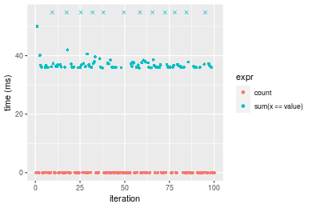
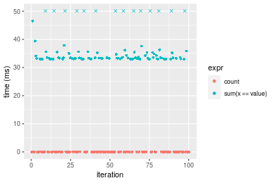

[matrixStats]: Benchmark report

---------------------------------------


# count() benchmarks

This report benchmark the performance of count() against alternative methods.

## Alternative methods

* sum(x == value)


## Data type "integer"
### Data
```r
> rvector <- function(n, mode = c("logical", "double", "integer"), range = c(-100, +100), na_prob = 0) {
+     mode <- match.arg(mode)
+     if (mode == "logical") {
+         x <- sample(c(FALSE, TRUE), size = n, replace = TRUE)
+     }     else {
+         x <- runif(n, min = range[1], max = range[2])
+     }
+     storage.mode(x) <- mode
+     if (na_prob > 0) 
+         x[sample(n, size = na_prob * n)] <- NA
+     x
+ }
> rvectors <- function(scale = 10, seed = 1, ...) {
+     set.seed(seed)
+     data <- list()
+     data[[1]] <- rvector(n = scale * 100, ...)
+     data[[2]] <- rvector(n = scale * 1000, ...)
+     data[[3]] <- rvector(n = scale * 10000, ...)
+     data[[4]] <- rvector(n = scale * 1e+05, ...)
+     data[[5]] <- rvector(n = scale * 1e+06, ...)
+     names(data) <- sprintf("n = %d", sapply(data, FUN = length))
+     data
+ }
> data <- rvectors(mode = mode)
```

### Results

### n = 1000 vector

```r
> x <- data[["n = 1000"]]
> gc()
           used  (Mb) gc trigger  (Mb) max used  (Mb)
Ncells  5274240 281.7   10014072 534.9 10014072 534.9
Vcells 37031976 282.6   56374685 430.2 52456991 400.3
> stats <- microbenchmark(count = count(x, value), `sum(x == value)` = sum(x == value), unit = "ms")
```

_Table: Benchmarking of count() and sum(x == value)() on integer+n = 1000 data. The top panel shows times in milliseconds and the bottom panel shows relative times._


|   |expr            |      min|       lq|      mean|    median|        uq|      max|
|:--|:---------------|--------:|--------:|---------:|---------:|---------:|--------:|
|1  |count           | 0.003118| 0.003270| 0.0036467| 0.0034130| 0.0035765| 0.023930|
|2  |sum(x == value) | 0.004409| 0.004524| 0.0047229| 0.0046015| 0.0047110| 0.013909|


|   |expr            |      min|       lq|     mean|   median|      uq|       max|
|:--|:---------------|--------:|--------:|--------:|--------:|-------:|---------:|
|1  |count           | 1.000000| 1.000000| 1.000000| 1.000000| 1.00000| 1.0000000|
|2  |sum(x == value) | 1.414047| 1.383486| 1.295104| 1.348227| 1.31721| 0.5812369|

_Figure: Benchmarking of count() and sum(x == value)() on integer+n = 1000 data.  Outliers are displayed as crosses.  Times are in milliseconds._


### n = 10000 vector

```r
> x <- data[["n = 10000"]]
> gc()
           used  (Mb) gc trigger  (Mb) max used  (Mb)
Ncells  5272004 281.6   10014072 534.9 10014072 534.9
Vcells 15396708 117.5   56374685 430.2 52456991 400.3
> stats <- microbenchmark(count = count(x, value), `sum(x == value)` = sum(x == value), unit = "ms")
```

_Table: Benchmarking of count() and sum(x == value)() on integer+n = 10000 data. The top panel shows times in milliseconds and the bottom panel shows relative times._


|   |expr            |      min|        lq|      mean|    median|       uq|      max|
|:--|:---------------|--------:|---------:|---------:|---------:|--------:|--------:|
|1  |count           | 0.003139| 0.0033745| 0.0040944| 0.0036925| 0.004353| 0.023147|
|2  |sum(x == value) | 0.038632| 0.0390080| 0.0395326| 0.0392225| 0.039380| 0.050216|


|   |expr            |     min|       lq|     mean|   median|       uq|      max|
|:--|:---------------|-------:|--------:|--------:|--------:|--------:|--------:|
|1  |count           |  1.0000|  1.00000| 1.000000|  1.00000| 1.000000| 1.000000|
|2  |sum(x == value) | 12.3071| 11.55964| 9.655377| 10.62221| 9.046634| 2.169439|

_Figure: Benchmarking of count() and sum(x == value)() on integer+n = 10000 data.  Outliers are displayed as crosses.  Times are in milliseconds._


### n = 100000 vector

```r
> x <- data[["n = 100000"]]
> gc()
           used  (Mb) gc trigger  (Mb) max used  (Mb)
Ncells  5272067 281.6   10014072 534.9 10014072 534.9
Vcells 15396750 117.5   56374685 430.2 52456991 400.3
> stats <- microbenchmark(count = count(x, value), `sum(x == value)` = sum(x == value), unit = "ms")
```

_Table: Benchmarking of count() and sum(x == value)() on integer+n = 100000 data. The top panel shows times in milliseconds and the bottom panel shows relative times._


|   |expr            |      min|        lq|      mean|    median|        uq|      max|
|:--|:---------------|--------:|---------:|---------:|---------:|---------:|--------:|
|1  |count           | 0.002263| 0.0028120| 0.0044868| 0.0037615| 0.0046915| 0.039745|
|2  |sum(x == value) | 0.303394| 0.3393075| 0.3923716| 0.4079745| 0.4396080| 0.484555|


|   |expr            |      min|       lq|     mean|   median|       uq|     max|
|:--|:---------------|--------:|--------:|--------:|--------:|--------:|-------:|
|1  |count           |   1.0000|   1.0000|  1.00000|   1.0000|  1.00000|  1.0000|
|2  |sum(x == value) | 134.0672| 120.6641| 87.45098| 108.4606| 93.70308| 12.1916|

_Figure: Benchmarking of count() and sum(x == value)() on integer+n = 100000 data.  Outliers are displayed as crosses.  Times are in milliseconds._


### n = 1000000 vector

```r
> x <- data[["n = 1000000"]]
> gc()
           used  (Mb) gc trigger  (Mb) max used  (Mb)
Ncells  5272130 281.6   10014072 534.9 10014072 534.9
Vcells 15397305 117.5   56374685 430.2 52456991 400.3
> stats <- microbenchmark(count = count(x, value), `sum(x == value)` = sum(x == value), unit = "ms")
```

_Table: Benchmarking of count() and sum(x == value)() on integer+n = 1000000 data. The top panel shows times in milliseconds and the bottom panel shows relative times._


|   |expr            |      min|        lq|      mean|   median|       uq|       max|
|:--|:---------------|--------:|---------:|---------:|--------:|--------:|---------:|
|1  |count           | 0.001953| 0.0023275| 0.0098711| 0.008268| 0.015683|  0.032828|
|2  |sum(x == value) | 3.414393| 3.5548685| 3.9045726| 3.611772| 3.749227| 22.020614|


|   |expr            |      min|       lq|     mean|   median|       uq|      max|
|:--|:---------------|--------:|--------:|--------:|--------:|--------:|--------:|
|1  |count           |    1.000|    1.000|   1.0000|   1.0000|   1.0000|   1.0000|
|2  |sum(x == value) | 1748.281| 1527.333| 395.5552| 436.8374| 239.0632| 670.7876|

_Figure: Benchmarking of count() and sum(x == value)() on integer+n = 1000000 data.  Outliers are displayed as crosses.  Times are in milliseconds._


### n = 10000000 vector

```r
> x <- data[["n = 10000000"]]
> gc()
           used  (Mb) gc trigger  (Mb) max used  (Mb)
Ncells  5272193 281.6   10014072 534.9 10014072 534.9
Vcells 15397347 117.5   56374685 430.2 55899660 426.5
> stats <- microbenchmark(count = count(x, value), `sum(x == value)` = sum(x == value), unit = "ms")
```

_Table: Benchmarking of count() and sum(x == value)() on integer+n = 10000000 data. The top panel shows times in milliseconds and the bottom panel shows relative times._


|   |expr            |       min|         lq|       mean|     median|         uq|       max|
|:--|:---------------|---------:|----------:|----------:|----------:|----------:|---------:|
|1  |count           |  0.001992|  0.0024975|  0.0147433|  0.0037145|  0.0276605|  0.088028|
|2  |sum(x == value) | 34.627272| 36.7752280| 39.6182004| 37.1369675| 37.6467285| 58.548260|


|   |expr            |      min|       lq|     mean|   median|       uq|      max|
|:--|:---------------|--------:|--------:|--------:|--------:|--------:|--------:|
|1  |count           |     1.00|     1.00|    1.000|    1.000|    1.000|   1.0000|
|2  |sum(x == value) | 17383.17| 14724.82| 2687.206| 9997.838| 1361.028| 665.1095|

_Figure: Benchmarking of count() and sum(x == value)() on integer+n = 10000000 data.  Outliers are displayed as crosses.  Times are in milliseconds._




## Data type "double"
### Data
```r
> rvector <- function(n, mode = c("logical", "double", "integer"), range = c(-100, +100), na_prob = 0) {
+     mode <- match.arg(mode)
+     if (mode == "logical") {
+         x <- sample(c(FALSE, TRUE), size = n, replace = TRUE)
+     }     else {
+         x <- runif(n, min = range[1], max = range[2])
+     }
+     storage.mode(x) <- mode
+     if (na_prob > 0) 
+         x[sample(n, size = na_prob * n)] <- NA
+     x
+ }
> rvectors <- function(scale = 10, seed = 1, ...) {
+     set.seed(seed)
+     data <- list()
+     data[[1]] <- rvector(n = scale * 100, ...)
+     data[[2]] <- rvector(n = scale * 1000, ...)
+     data[[3]] <- rvector(n = scale * 10000, ...)
+     data[[4]] <- rvector(n = scale * 1e+05, ...)
+     data[[5]] <- rvector(n = scale * 1e+06, ...)
+     names(data) <- sprintf("n = %d", sapply(data, FUN = length))
+     data
+ }
> data <- rvectors(mode = mode)
```

### Results

### n = 1000 vector

```r
> x <- data[["n = 1000"]]
> gc()
           used  (Mb) gc trigger  (Mb) max used  (Mb)
Ncells  5272256 281.6   10014072 534.9 10014072 534.9
Vcells 20953219 159.9   56374685 430.2 55899660 426.5
> stats <- microbenchmark(count = count(x, value), `sum(x == value)` = sum(x == value), unit = "ms")
```

_Table: Benchmarking of count() and sum(x == value)() on double+n = 1000 data. The top panel shows times in milliseconds and the bottom panel shows relative times._


|   |expr            |      min|       lq|      mean|   median|        uq|      max|
|:--|:---------------|--------:|--------:|---------:|--------:|---------:|--------:|
|1  |count           | 0.003071| 0.003191| 0.0036095| 0.003400| 0.0035095| 0.024533|
|2  |sum(x == value) | 0.003962| 0.004108| 0.0043238| 0.004187| 0.0043090| 0.013816|


|   |expr            |      min|       lq|     mean|   median|      uq|       max|
|:--|:---------------|--------:|--------:|--------:|--------:|-------:|---------:|
|1  |count           | 1.000000| 1.000000| 1.000000| 1.000000| 1.00000| 1.0000000|
|2  |sum(x == value) | 1.290134| 1.287371| 1.197915| 1.231471| 1.22781| 0.5631598|

_Figure: Benchmarking of count() and sum(x == value)() on double+n = 1000 data.  Outliers are displayed as crosses.  Times are in milliseconds._


### n = 10000 vector

```r
> x <- data[["n = 10000"]]
> gc()
           used  (Mb) gc trigger  (Mb) max used  (Mb)
Ncells  5272319 281.6   10014072 534.9 10014072 534.9
Vcells 20953260 159.9   56374685 430.2 55899660 426.5
> stats <- microbenchmark(count = count(x, value), `sum(x == value)` = sum(x == value), unit = "ms")
```

_Table: Benchmarking of count() and sum(x == value)() on double+n = 10000 data. The top panel shows times in milliseconds and the bottom panel shows relative times._


|   |expr            |      min|        lq|      mean|    median|       uq|      max|
|:--|:---------------|--------:|---------:|---------:|---------:|--------:|--------:|
|1  |count           | 0.003125| 0.0033260| 0.0040976| 0.0036220| 0.004325| 0.028168|
|2  |sum(x == value) | 0.034449| 0.0348505| 0.0353574| 0.0350945| 0.035276| 0.046724|


|   |expr            |      min|      lq|    mean|  median|       uq|      max|
|:--|:---------------|--------:|-------:|-------:|-------:|--------:|--------:|
|1  |count           |  1.00000|  1.0000| 1.00000| 1.00000| 1.000000| 1.000000|
|2  |sum(x == value) | 11.02368| 10.4782| 8.62872| 9.68926| 8.156301| 1.658762|

_Figure: Benchmarking of count() and sum(x == value)() on double+n = 10000 data.  Outliers are displayed as crosses.  Times are in milliseconds._


### n = 100000 vector

```r
> x <- data[["n = 100000"]]
> gc()
           used  (Mb) gc trigger  (Mb) max used  (Mb)
Ncells  5272382 281.6   10014072 534.9 10014072 534.9
Vcells 20953584 159.9   56374685 430.2 55899660 426.5
> stats <- microbenchmark(count = count(x, value), `sum(x == value)` = sum(x == value), unit = "ms")
```

_Table: Benchmarking of count() and sum(x == value)() on double+n = 100000 data. The top panel shows times in milliseconds and the bottom panel shows relative times._


|   |expr            |      min|        lq|      mean|    median|        uq|      max|
|:--|:---------------|--------:|---------:|---------:|---------:|---------:|--------:|
|1  |count           | 0.002403| 0.0028275| 0.0040434| 0.0035590| 0.0046065| 0.023956|
|2  |sum(x == value) | 0.279619| 0.3045800| 0.3559442| 0.3501445| 0.4059805| 0.449880|


|   |expr            |      min|       lq|     mean|   median|      uq|      max|
|:--|:---------------|--------:|--------:|--------:|--------:|-------:|--------:|
|1  |count           |   1.0000|   1.0000|  1.00000|  1.00000|  1.0000|  1.00000|
|2  |sum(x == value) | 116.3625| 107.7206| 88.03156| 98.38283| 88.1321| 18.77943|

_Figure: Benchmarking of count() and sum(x == value)() on double+n = 100000 data.  Outliers are displayed as crosses.  Times are in milliseconds._


### n = 1000000 vector

```r
> x <- data[["n = 1000000"]]
> gc()
           used  (Mb) gc trigger  (Mb) max used  (Mb)
Ncells  5272445 281.6   10014072 534.9 10014072 534.9
Vcells 20953955 159.9   56374685 430.2 55899660 426.5
> stats <- microbenchmark(count = count(x, value), `sum(x == value)` = sum(x == value), unit = "ms")
```

_Table: Benchmarking of count() and sum(x == value)() on double+n = 1000000 data. The top panel shows times in milliseconds and the bottom panel shows relative times._


|   |expr            |      min|        lq|      mean|   median|        uq|       max|
|:--|:---------------|--------:|---------:|---------:|--------:|---------:|---------:|
|1  |count           | 0.001925| 0.0023275| 0.0101983| 0.009331| 0.0173095|  0.034838|
|2  |sum(x == value) | 3.203372| 3.4179615| 3.7580135| 3.466082| 3.7748140| 18.754039|


|   |expr            |      min|       lq|     mean|   median|       uq|      max|
|:--|:---------------|--------:|--------:|--------:|--------:|--------:|--------:|
|1  |count           |    1.000|    1.000|   1.0000|   1.0000|   1.0000|   1.0000|
|2  |sum(x == value) | 1664.089| 1468.512| 368.4927| 371.4587| 218.0776| 538.3213|

_Figure: Benchmarking of count() and sum(x == value)() on double+n = 1000000 data.  Outliers are displayed as crosses.  Times are in milliseconds._


### n = 10000000 vector

```r
> x <- data[["n = 10000000"]]
> gc()
           used  (Mb) gc trigger  (Mb) max used  (Mb)
Ncells  5272508 281.6   10014072 534.9 10014072 534.9
Vcells 20953997 159.9   56374685 430.2 55956209 427.0
> stats <- microbenchmark(count = count(x, value), `sum(x == value)` = sum(x == value), unit = "ms")
```

_Table: Benchmarking of count() and sum(x == value)() on double+n = 10000000 data. The top panel shows times in milliseconds and the bottom panel shows relative times._


|   |expr            |       min|        lq|       mean|     median|        uq|       max|
|:--|:---------------|---------:|---------:|----------:|----------:|---------:|---------:|
|1  |count           |  0.002007|  0.002486|  0.0137447|  0.0038345|  0.026847|  0.034247|
|2  |sum(x == value) | 32.953386| 33.892199| 37.2655222| 34.2938075| 34.918139| 57.909918|


|   |expr            |      min|       lq|     mean|   median|       uq|      max|
|:--|:---------------|--------:|--------:|--------:|--------:|--------:|--------:|
|1  |count           |     1.00|     1.00|    1.000|    1.000|    1.000|    1.000|
|2  |sum(x == value) | 16419.23| 13633.23| 2711.271| 8943.489| 1300.635| 1690.949|

_Figure: Benchmarking of count() and sum(x == value)() on double+n = 10000000 data.  Outliers are displayed as crosses.  Times are in milliseconds._




## Appendix

### Session information
```r
R version 4.1.1 Patched (2021-08-10 r80727)
Platform: x86_64-pc-linux-gnu (64-bit)
Running under: Ubuntu 18.04.5 LTS

Matrix products: default
BLAS:   /home/hb/software/R-devel/R-4-1-branch/lib/R/lib/libRblas.so
LAPACK: /home/hb/software/R-devel/R-4-1-branch/lib/R/lib/libRlapack.so

locale:
 [1] LC_CTYPE=en_US.UTF-8       LC_NUMERIC=C              
 [3] LC_TIME=en_US.UTF-8        LC_COLLATE=en_US.UTF-8    
 [5] LC_MONETARY=en_US.UTF-8    LC_MESSAGES=en_US.UTF-8   
 [7] LC_PAPER=en_US.UTF-8       LC_NAME=C                 
 [9] LC_ADDRESS=C               LC_TELEPHONE=C            
[11] LC_MEASUREMENT=en_US.UTF-8 LC_IDENTIFICATION=C       

attached base packages:
[1] stats     graphics  grDevices utils     datasets  methods   base     

other attached packages:
[1] microbenchmark_1.4-7   matrixStats_0.60.1     ggplot2_3.3.5         
[4] knitr_1.33             R.devices_2.17.0       R.utils_2.10.1        
[7] R.oo_1.24.0            R.methodsS3_1.8.1-9001 history_0.0.1-9000    

loaded via a namespace (and not attached):
 [1] Biobase_2.52.0          httr_1.4.2              splines_4.1.1          
 [4] bit64_4.0.5             network_1.17.1          assertthat_0.2.1       
 [7] highr_0.9               stats4_4.1.1            blob_1.2.2             
[10] GenomeInfoDbData_1.2.6  robustbase_0.93-8       pillar_1.6.2           
[13] RSQLite_2.2.8           lattice_0.20-44         glue_1.4.2             
[16] digest_0.6.27           XVector_0.32.0          colorspace_2.0-2       
[19] Matrix_1.3-4            XML_3.99-0.7            pkgconfig_2.0.3        
[22] zlibbioc_1.38.0         genefilter_1.74.0       purrr_0.3.4            
[25] ergm_4.1.2              xtable_1.8-4            scales_1.1.1           
[28] tibble_3.1.4            annotate_1.70.0         KEGGREST_1.32.0        
[31] farver_2.1.0            generics_0.1.0          IRanges_2.26.0         
[34] ellipsis_0.3.2          cachem_1.0.6            withr_2.4.2            
[37] BiocGenerics_0.38.0     mime_0.11               survival_3.2-13        
[40] magrittr_2.0.1          crayon_1.4.1            statnet.common_4.5.0   
[43] memoise_2.0.0           laeken_0.5.1            fansi_0.5.0            
[46] R.cache_0.15.0          MASS_7.3-54             R.rsp_0.44.0           
[49] progressr_0.8.0         tools_4.1.1             lifecycle_1.0.0        
[52] S4Vectors_0.30.0        trust_0.1-8             munsell_0.5.0          
[55] tabby_0.0.1-9001        AnnotationDbi_1.54.1    Biostrings_2.60.2      
[58] compiler_4.1.1          GenomeInfoDb_1.28.1     rlang_0.4.11           
[61] grid_4.1.1              RCurl_1.98-1.4          cwhmisc_6.6            
[64] rappdirs_0.3.3          startup_0.15.0          labeling_0.4.2         
[67] bitops_1.0-7            base64enc_0.1-3         boot_1.3-28            
[70] gtable_0.3.0            DBI_1.1.1               markdown_1.1           
[73] R6_2.5.1                lpSolveAPI_5.5.2.0-17.7 rle_0.9.2              
[76] dplyr_1.0.7             fastmap_1.1.0           bit_4.0.4              
[79] utf8_1.2.2              parallel_4.1.1          Rcpp_1.0.7             
[82] vctrs_0.3.8             png_0.1-7               DEoptimR_1.0-9         
[85] tidyselect_1.1.1        xfun_0.25               coda_0.19-4            
```
Total processing time was 22.11 secs.


### Reproducibility
To reproduce this report, do:
```r
html <- matrixStats:::benchmark('count')
```

[RSP]: https://cran.r-project.org/package=R.rsp
[matrixStats]: https://cran.r-project.org/package=matrixStats

[StackOverflow:colMins?]: https://stackoverflow.com/questions/13676878 "Stack Overflow: fastest way to get Min from every column in a matrix?"
[StackOverflow:colSds?]: https://stackoverflow.com/questions/17549762 "Stack Overflow: Is there such 'colsd' in R?"
[StackOverflow:rowProds?]: https://stackoverflow.com/questions/20198801/ "Stack Overflow: Row product of matrix and column sum of matrix"

---------------------------------------
Copyright Henrik Bengtsson. Last updated on 2021-08-25 18:20:57 (+0200 UTC). Powered by [RSP].

<script>
 var link = document.createElement('link');
 link.rel = 'icon';
 link.href = "data:image/png;base64,iVBORw0KGgoAAAANSUhEUgAAACAAAAAgCAMAAABEpIrGAAAA21BMVEUAAAAAAP8AAP8AAP8AAP8AAP8AAP8AAP8AAP8AAP8AAP8AAP8AAP8AAP8AAP8AAP8AAP8AAP8AAP8AAP8AAP8AAP8AAP8AAP8AAP8AAP8AAP8AAP8AAP8AAP8AAP8AAP8AAP8AAP8AAP8AAP8AAP8AAP8AAP8AAP8AAP8AAP8BAf4CAv0DA/wdHeIeHuEfH+AgIN8hId4lJdomJtknJ9g+PsE/P8BAQL9yco10dIt1dYp3d4h4eIeVlWqWlmmXl2iYmGeZmWabm2Tn5xjo6Bfp6Rb39wj4+Af//wA2M9hbAAAASXRSTlMAAQIJCgsMJSYnKD4/QGRlZmhpamtsbautrrCxuru8y8zN5ebn6Pn6+///////////////////////////////////////////LsUNcQAAAS9JREFUOI29k21XgkAQhVcFytdSMqMETU26UVqGmpaiFbL//xc1cAhhwVNf6n5i5z67M2dmYOyfJZUqlVLhkKucG7cgmUZTybDz6g0iDeq51PUr37Ds2cy2/C9NeES5puDjxuUk1xnToZsg8pfA3avHQ3lLIi7iWRrkv/OYtkScxBIMgDee0ALoyxHQBJ68JLCjOtQIMIANF7QG9G9fNnHvisCHBVMKgSJgiz7nE+AoBKrAPA3MgepvgR9TSCasrCKH0eB1wBGBFdCO+nAGjMVGPcQb5bd6mQRegN6+1axOs9nGfYcCtfi4NQosdtH7dB+txFIpXQqN1p9B/asRHToyS0jRgpV7nk4nwcq1BJ+x3Gl/v7S9Wmpp/aGquum7w3ZDyrADFYrl8vHBH+ev9AUASW1dmU4h4wAAAABJRU5ErkJggg=="
 document.getElementsByTagName('head')[0].appendChild(link);
</script>


