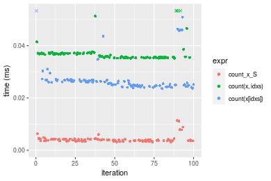
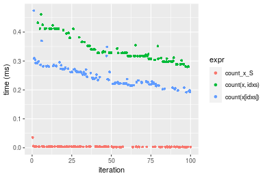

[matrixStats]: Benchmark report

---------------------------------------


# count() benchmarks on subsetted computation

This report benchmark the performance of count() on subsetted computation.


## Data type "integer"
### Data
```r
> rvector <- function(n, mode = c("logical", "double", "integer"), range = c(-100, +100), na_prob = 0) {
+     mode <- match.arg(mode)
+     if (mode == "logical") {
+         x <- sample(c(FALSE, TRUE), size = n, replace = TRUE)
+     }     else {
+         x <- runif(n, min = range[1], max = range[2])
+     }
+     storage.mode(x) <- mode
+     if (na_prob > 0) 
+         x[sample(n, size = na_prob * n)] <- NA
+     x
+ }
> rvectors <- function(scale = 10, seed = 1, ...) {
+     set.seed(seed)
+     data <- list()
+     data[[1]] <- rvector(n = scale * 100, ...)
+     data[[2]] <- rvector(n = scale * 1000, ...)
+     data[[3]] <- rvector(n = scale * 10000, ...)
+     data[[4]] <- rvector(n = scale * 1e+05, ...)
+     data[[5]] <- rvector(n = scale * 1e+06, ...)
+     names(data) <- sprintf("n = %d", sapply(data, FUN = length))
+     data
+ }
> data <- rvectors(mode = mode)
```

### Results

### n = 1000 vector

```r
> x <- data[["n = 1000"]]
> idxs <- sample.int(length(x), size = length(x) * 0.7)
> x_S <- x[idxs]
> gc()
           used  (Mb) gc trigger  (Mb) max used  (Mb)
Ncells  5340542 285.3    7916910 422.9  7916910 422.9
Vcells 16210635 123.7   33191153 253.3 53339345 407.0
> stats <- microbenchmark(count_x_S = count(x_S, value), `count(x, idxs)` = count(x, idxs = idxs, value), 
+     `count(x[idxs])` = count(x[idxs], value), unit = "ms")
```

_Table: Benchmarking of count_x_S(), count(x, idxs)() and count(x[idxs])() on integer+n = 1000 data. The top panel shows times in milliseconds and the bottom panel shows relative times._


|   |expr           |      min|        lq|      mean|    median|        uq|      max|
|:--|:--------------|--------:|---------:|---------:|---------:|---------:|--------:|
|1  |count_x_S      | 0.003165| 0.0032770| 0.0034036| 0.0033775| 0.0034830| 0.004430|
|3  |count(x[idxs]) | 0.006003| 0.0061900| 0.0083801| 0.0063200| 0.0064515| 0.208297|
|2  |count(x, idxs) | 0.006669| 0.0068015| 0.0069492| 0.0068695| 0.0070325| 0.009120|


|   |expr           |      min|       lq|     mean|   median|       uq|       max|
|:--|:--------------|--------:|--------:|--------:|--------:|--------:|---------:|
|1  |count_x_S      | 1.000000| 1.000000| 1.000000| 1.000000| 1.000000|  1.000000|
|3  |count(x[idxs]) | 1.896683| 1.888923| 2.462111| 1.871206| 1.852283| 47.019639|
|2  |count(x, idxs) | 2.107109| 2.075526| 2.041711| 2.033901| 2.019093|  2.058691|

_Figure: Benchmarking of count_x_S(), count(x, idxs)() and count(x[idxs])() on integer+n = 1000 data.  Outliers are displayed as crosses.  Times are in milliseconds._


### n = 10000 vector

```r
> x <- data[["n = 10000"]]
> idxs <- sample.int(length(x), size = length(x) * 0.7)
> x_S <- x[idxs]
> gc()
           used  (Mb) gc trigger  (Mb) max used  (Mb)
Ncells  5337927 285.1    7916910 422.9  7916910 422.9
Vcells 15878804 121.2   33191153 253.3 53339345 407.0
> stats <- microbenchmark(count_x_S = count(x_S, value), `count(x, idxs)` = count(x, idxs = idxs, value), 
+     `count(x[idxs])` = count(x[idxs], value), unit = "ms")
```

_Table: Benchmarking of count_x_S(), count(x, idxs)() and count(x[idxs])() on integer+n = 10000 data. The top panel shows times in milliseconds and the bottom panel shows relative times._


|   |expr           |      min|       lq|      mean|    median|        uq|      max|
|:--|:--------------|--------:|--------:|---------:|---------:|---------:|--------:|
|1  |count_x_S      | 0.003288| 0.003550| 0.0038011| 0.0037305| 0.0040240| 0.006466|
|3  |count(x[idxs]) | 0.026106| 0.026514| 0.0273560| 0.0268175| 0.0271175| 0.063253|
|2  |count(x, idxs) | 0.036846| 0.037067| 0.0373741| 0.0372410| 0.0374300| 0.044914|


|   |expr           |       min|        lq|     mean|   median|       uq|     max|
|:--|:--------------|---------:|---------:|--------:|--------:|--------:|-------:|
|1  |count_x_S      |  1.000000|  1.000000| 1.000000| 1.000000| 1.000000| 1.00000|
|3  |count(x[idxs]) |  7.939781|  7.468732| 7.196872| 7.188715| 6.738941| 9.78240|
|2  |count(x, idxs) | 11.206204| 10.441408| 9.832472| 9.982844| 9.301690| 6.94618|

_Figure: Benchmarking of count_x_S(), count(x, idxs)() and count(x[idxs])() on integer+n = 10000 data.  Outliers are displayed as crosses.  Times are in milliseconds._


### n = 100000 vector

```r
> x <- data[["n = 100000"]]
> idxs <- sample.int(length(x), size = length(x) * 0.7)
> x_S <- x[idxs]
> gc()
           used  (Mb) gc trigger  (Mb) max used  (Mb)
Ncells  5337999 285.1    7916910 422.9  7916910 422.9
Vcells 15942364 121.7   33191153 253.3 53339345 407.0
> stats <- microbenchmark(count_x_S = count(x_S, value), `count(x, idxs)` = count(x, idxs = idxs, value), 
+     `count(x[idxs])` = count(x[idxs], value), unit = "ms")
```

_Table: Benchmarking of count_x_S(), count(x, idxs)() and count(x[idxs])() on integer+n = 100000 data. The top panel shows times in milliseconds and the bottom panel shows relative times._


|   |expr           |      min|       lq|      mean|    median|        uq|      max|
|:--|:--------------|--------:|--------:|---------:|---------:|---------:|--------:|
|1  |count_x_S      | 0.002166| 0.002836| 0.0036747| 0.0032695| 0.0036805| 0.040622|
|3  |count(x[idxs]) | 0.158212| 0.183114| 0.2053036| 0.1953910| 0.2246385| 0.344744|
|2  |count(x, idxs) | 0.250821| 0.267656| 0.3021490| 0.2930675| 0.3256455| 0.394210|


|   |expr           |      min|      lq|     mean|   median|       uq|      max|
|:--|:--------------|--------:|-------:|--------:|--------:|--------:|--------:|
|1  |count_x_S      |   1.0000|  1.0000|  1.00000|  1.00000|  1.00000| 1.000000|
|3  |count(x[idxs]) |  73.0434| 64.5677| 55.86933| 59.76174| 61.03478| 8.486633|
|2  |count(x, idxs) | 115.7992| 94.3780| 82.22391| 89.63679| 88.47860| 9.704347|

_Figure: Benchmarking of count_x_S(), count(x, idxs)() and count(x[idxs])() on integer+n = 100000 data.  Outliers are displayed as crosses.  Times are in milliseconds._


### n = 1000000 vector

```r
> x <- data[["n = 1000000"]]
> idxs <- sample.int(length(x), size = length(x) * 0.7)
> x_S <- x[idxs]
> gc()
           used  (Mb) gc trigger  (Mb) max used  (Mb)
Ncells  5338071 285.1    7916910 422.9  7916910 422.9
Vcells 16572413 126.5   33191153 253.3 53339345 407.0
> stats <- microbenchmark(count_x_S = count(x_S, value), `count(x, idxs)` = count(x, idxs = idxs, value), 
+     `count(x[idxs])` = count(x[idxs], value), unit = "ms")
```

_Table: Benchmarking of count_x_S(), count(x, idxs)() and count(x[idxs])() on integer+n = 1000000 data. The top panel shows times in milliseconds and the bottom panel shows relative times._


|   |expr           |      min|       lq|      mean|    median|       uq|       max|
|:--|:--------------|--------:|--------:|---------:|---------:|--------:|---------:|
|1  |count_x_S      | 0.002164| 0.002808| 0.0070946| 0.0052395| 0.011412|  0.021826|
|2  |count(x, idxs) | 2.882016| 3.146648| 3.4423735| 3.3550120| 3.551007|  6.371150|
|3  |count(x[idxs]) | 2.515649| 3.430789| 3.9598751| 3.6643235| 3.978525| 15.244591|


|   |expr           |    min|       lq|     mean|   median|       uq|      max|
|:--|:--------------|------:|--------:|--------:|--------:|--------:|--------:|
|1  |count_x_S      |    1.0|    1.000|   1.0000|   1.0000|   1.0000|   1.0000|
|2  |count(x, idxs) | 1331.8| 1120.601| 485.2124| 640.3306| 311.1643| 291.9064|
|3  |count(x[idxs]) | 1162.5| 1221.791| 558.1558| 699.3651| 348.6264| 698.4601|

_Figure: Benchmarking of count_x_S(), count(x, idxs)() and count(x[idxs])() on integer+n = 1000000 data.  Outliers are displayed as crosses.  Times are in milliseconds._


### n = 10000000 vector

```r
> x <- data[["n = 10000000"]]
> idxs <- sample.int(length(x), size = length(x) * 0.7)
> x_S <- x[idxs]
> gc()
           used  (Mb) gc trigger  (Mb) max used  (Mb)
Ncells  5338143 285.1    7916910 422.9  7916910 422.9
Vcells 22872461 174.6   39909383 304.5 53339345 407.0
> stats <- microbenchmark(count_x_S = count(x_S, value), `count(x, idxs)` = count(x, idxs = idxs, value), 
+     `count(x[idxs])` = count(x[idxs], value), unit = "ms")
```

_Table: Benchmarking of count_x_S(), count(x, idxs)() and count(x[idxs])() on integer+n = 10000000 data. The top panel shows times in milliseconds and the bottom panel shows relative times._


|   |expr           |        min|          lq|        mean|      median|        uq|        max|
|:--|:--------------|----------:|-----------:|-----------:|-----------:|---------:|----------:|
|1  |count_x_S      |   0.004851|   0.0108875|   0.0291995|   0.0147685|   0.05003|   0.096594|
|3  |count(x[idxs]) | 112.695468| 144.0791635| 151.8691124| 151.5446780| 161.92704| 185.375112|
|2  |count(x, idxs) | 143.218317| 171.7195710| 178.0571528| 178.0768070| 186.00374| 202.085918|


|   |expr           |      min|       lq|     mean|   median|       uq|      max|
|:--|:--------------|--------:|--------:|--------:|--------:|--------:|--------:|
|1  |count_x_S      |     1.00|     1.00|    1.000|     1.00|    1.000|    1.000|
|3  |count(x[idxs]) | 23231.39| 13233.45| 5201.084| 10261.35| 3236.599| 1919.116|
|2  |count(x, idxs) | 29523.46| 15772.18| 6097.950| 12057.88| 3717.844| 2092.117|

_Figure: Benchmarking of count_x_S(), count(x, idxs)() and count(x[idxs])() on integer+n = 10000000 data.  Outliers are displayed as crosses.  Times are in milliseconds._


## Data type "double"
### Data
```r
> rvector <- function(n, mode = c("logical", "double", "integer"), range = c(-100, +100), na_prob = 0) {
+     mode <- match.arg(mode)
+     if (mode == "logical") {
+         x <- sample(c(FALSE, TRUE), size = n, replace = TRUE)
+     }     else {
+         x <- runif(n, min = range[1], max = range[2])
+     }
+     storage.mode(x) <- mode
+     if (na_prob > 0) 
+         x[sample(n, size = na_prob * n)] <- NA
+     x
+ }
> rvectors <- function(scale = 10, seed = 1, ...) {
+     set.seed(seed)
+     data <- list()
+     data[[1]] <- rvector(n = scale * 100, ...)
+     data[[2]] <- rvector(n = scale * 1000, ...)
+     data[[3]] <- rvector(n = scale * 10000, ...)
+     data[[4]] <- rvector(n = scale * 1e+05, ...)
+     data[[5]] <- rvector(n = scale * 1e+06, ...)
+     names(data) <- sprintf("n = %d", sapply(data, FUN = length))
+     data
+ }
> data <- rvectors(mode = mode)
```

### Results

### n = 1000 vector

```r
> x <- data[["n = 1000"]]
> idxs <- sample.int(length(x), size = length(x) * 0.7)
> x_S <- x[idxs]
> gc()
           used  (Mb) gc trigger  (Mb) max used  (Mb)
Ncells  5338218 285.1    7916910 422.9  7916910 422.9
Vcells 21429654 163.5   39909383 304.5 53339345 407.0
> stats <- microbenchmark(count_x_S = count(x_S, value), `count(x, idxs)` = count(x, idxs = idxs, value), 
+     `count(x[idxs])` = count(x[idxs], value), unit = "ms")
```

_Table: Benchmarking of count_x_S(), count(x, idxs)() and count(x[idxs])() on double+n = 1000 data. The top panel shows times in milliseconds and the bottom panel shows relative times._


|   |expr           |      min|        lq|      mean|    median|       uq|      max|
|:--|:--------------|--------:|---------:|---------:|---------:|--------:|--------:|
|1  |count_x_S      | 0.003317| 0.0034820| 0.0036153| 0.0035745| 0.003704| 0.004397|
|3  |count(x[idxs]) | 0.005992| 0.0062655| 0.0067630| 0.0064005| 0.006526| 0.038887|
|2  |count(x, idxs) | 0.006709| 0.0068305| 0.0069903| 0.0069360| 0.007085| 0.009212|


|   |expr           |      min|       lq|     mean|   median|       uq|      max|
|:--|:--------------|--------:|--------:|--------:|--------:|--------:|--------:|
|1  |count_x_S      | 1.000000| 1.000000| 1.000000| 1.000000| 1.000000| 1.000000|
|3  |count(x[idxs]) | 1.806452| 1.799397| 1.870666| 1.790600| 1.761879| 8.843984|
|2  |count(x, idxs) | 2.022611| 1.961660| 1.933532| 1.940411| 1.912797| 2.095065|

_Figure: Benchmarking of count_x_S(), count(x, idxs)() and count(x[idxs])() on double+n = 1000 data.  Outliers are displayed as crosses.  Times are in milliseconds._


### n = 10000 vector

```r
> x <- data[["n = 10000"]]
> idxs <- sample.int(length(x), size = length(x) * 0.7)
> x_S <- x[idxs]
> gc()
           used  (Mb) gc trigger  (Mb) max used  (Mb)
Ncells  5338287 285.1    7916910 422.9  7916910 422.9
Vcells 21439146 163.6   39909383 304.5 53339345 407.0
> stats <- microbenchmark(count_x_S = count(x_S, value), `count(x, idxs)` = count(x, idxs = idxs, value), 
+     `count(x[idxs])` = count(x[idxs], value), unit = "ms")
```

_Table: Benchmarking of count_x_S(), count(x, idxs)() and count(x[idxs])() on double+n = 10000 data. The top panel shows times in milliseconds and the bottom panel shows relative times._


|   |expr           |      min|        lq|      mean|    median|        uq|      max|
|:--|:--------------|--------:|---------:|---------:|---------:|---------:|--------:|
|1  |count_x_S      | 0.003151| 0.0035635| 0.0041511| 0.0038425| 0.0041575| 0.011320|
|3  |count(x[idxs]) | 0.023584| 0.0247065| 0.0274833| 0.0257360| 0.0267605| 0.075453|
|2  |count(x, idxs) | 0.035118| 0.0354355| 0.0376289| 0.0358800| 0.0370940| 0.068346|


|   |expr           |       min|       lq|     mean|   median|       uq|      max|
|:--|:--------------|---------:|--------:|--------:|--------:|--------:|--------:|
|1  |count_x_S      |  1.000000| 1.000000| 1.000000| 1.000000| 1.000000| 1.000000|
|3  |count(x[idxs]) |  7.484608| 6.933212| 6.620754| 6.697723| 6.436681| 6.665459|
|2  |count(x, idxs) | 11.145033| 9.944016| 9.064855| 9.337671| 8.922189| 6.037632|

_Figure: Benchmarking of count_x_S(), count(x, idxs)() and count(x[idxs])() on double+n = 10000 data.  Outliers are displayed as crosses.  Times are in milliseconds._



### n = 100000 vector

```r
> x <- data[["n = 100000"]]
> idxs <- sample.int(length(x), size = length(x) * 0.7)
> x_S <- x[idxs]
> gc()
           used  (Mb) gc trigger  (Mb) max used  (Mb)
Ncells  5338359 285.1    7916910 422.9  7916910 422.9
Vcells 21534023 164.3   39909383 304.5 53339345 407.0
> stats <- microbenchmark(count_x_S = count(x_S, value), `count(x, idxs)` = count(x, idxs = idxs, value), 
+     `count(x[idxs])` = count(x[idxs], value), unit = "ms")
```

_Table: Benchmarking of count_x_S(), count(x, idxs)() and count(x[idxs])() on double+n = 100000 data. The top panel shows times in milliseconds and the bottom panel shows relative times._


|   |expr           |      min|        lq|      mean|    median|        uq|      max|
|:--|:--------------|--------:|---------:|---------:|---------:|---------:|--------:|
|1  |count_x_S      | 0.002219| 0.0028765| 0.0037454| 0.0033735| 0.0038955| 0.035660|
|3  |count(x[idxs]) | 0.192243| 0.2214380| 0.2501830| 0.2423070| 0.2730920| 0.474254|
|2  |count(x, idxs) | 0.279887| 0.3079120| 0.3381529| 0.3278245| 0.3537045| 0.460792|


|   |expr           |       min|        lq|     mean|   median|       uq|      max|
|:--|:--------------|---------:|---------:|--------:|--------:|--------:|--------:|
|1  |count_x_S      |   1.00000|   1.00000|  1.00000|  1.00000|  1.00000|  1.00000|
|3  |count(x[idxs]) |  86.63497|  76.98175| 66.79706| 71.82659| 70.10448| 13.29933|
|2  |count(x, idxs) | 126.13204| 107.04398| 90.28437| 97.17637| 90.79823| 12.92182|

_Figure: Benchmarking of count_x_S(), count(x, idxs)() and count(x[idxs])() on double+n = 100000 data.  Outliers are displayed as crosses.  Times are in milliseconds._



### n = 1000000 vector

```r
> x <- data[["n = 1000000"]]
> idxs <- sample.int(length(x), size = length(x) * 0.7)
> x_S <- x[idxs]
> gc()
           used  (Mb) gc trigger  (Mb) max used  (Mb)
Ncells  5338431 285.2    7916910 422.9  7916910 422.9
Vcells 22479464 171.6   39909383 304.5 53339345 407.0
> stats <- microbenchmark(count_x_S = count(x_S, value), `count(x, idxs)` = count(x, idxs = idxs, value), 
+     `count(x[idxs])` = count(x[idxs], value), unit = "ms")
```

_Table: Benchmarking of count_x_S(), count(x, idxs)() and count(x[idxs])() on double+n = 1000000 data. The top panel shows times in milliseconds and the bottom panel shows relative times._


|   |expr           |      min|        lq|       mean|     median|        uq|       max|
|:--|:--------------|--------:|---------:|----------:|----------:|---------:|---------:|
|1  |count_x_S      | 0.003358| 0.0046975|  0.0118247|  0.0076075|  0.018096|  0.037861|
|3  |count(x[idxs]) | 6.494840| 7.1722630|  8.7430606|  7.8965485|  9.554908| 24.940945|
|2  |count(x, idxs) | 8.969797| 9.7236765| 10.2345820| 10.1592825| 10.562421| 13.599753|


|   |expr           |      min|       lq|    mean|   median|       uq|      max|
|:--|:--------------|--------:|--------:|-------:|--------:|--------:|--------:|
|1  |count_x_S      |    1.000|    1.000|   1.000|    1.000|   1.0000|   1.0000|
|3  |count(x[idxs]) | 1934.139| 1526.826| 739.389| 1037.995| 528.0121| 658.7503|
|2  |count(x, idxs) | 2671.172| 2069.968| 865.525| 1335.430| 583.6882| 359.2022|

_Figure: Benchmarking of count_x_S(), count(x, idxs)() and count(x[idxs])() on double+n = 1000000 data.  Outliers are displayed as crosses.  Times are in milliseconds._


### n = 10000000 vector

```r
> x <- data[["n = 10000000"]]
> idxs <- sample.int(length(x), size = length(x) * 0.7)
> x_S <- x[idxs]
> gc()
           used  (Mb) gc trigger  (Mb) max used  (Mb)
Ncells  5338503 285.2    7916910 422.9  7916910 422.9
Vcells 31929512 243.7   47971259 366.0 53339345 407.0
> stats <- microbenchmark(count_x_S = count(x_S, value), `count(x, idxs)` = count(x, idxs = idxs, value), 
+     `count(x[idxs])` = count(x[idxs], value), unit = "ms")
```

_Table: Benchmarking of count_x_S(), count(x, idxs)() and count(x[idxs])() on double+n = 10000000 data. The top panel shows times in milliseconds and the bottom panel shows relative times._


|   |expr           |        min|         lq|      mean|      median|          uq|        max|
|:--|:--------------|----------:|----------:|---------:|-----------:|-----------:|----------:|
|1  |count_x_S      |   0.004903|   0.009593|   0.02584|   0.0150285|   0.0476205|   0.066755|
|2  |count(x, idxs) | 140.951914| 174.227388| 180.13970| 182.2514195| 190.8318915| 221.118312|
|3  |count(x[idxs]) | 134.423825| 168.759013| 180.41713| 183.2259105| 196.5229235| 237.595894|


|   |expr           |      min|       lq|     mean|   median|       uq|      max|
|:--|:--------------|--------:|--------:|--------:|--------:|--------:|--------:|
|1  |count_x_S      |     1.00|     1.00|    1.000|     1.00|    1.000|    1.000|
|2  |count(x, idxs) | 28748.10| 18161.93| 6971.343| 12127.05| 4007.347| 3312.386|
|3  |count(x[idxs]) | 27416.65| 17591.89| 6982.079| 12191.90| 4126.856| 3559.222|

_Figure: Benchmarking of count_x_S(), count(x, idxs)() and count(x[idxs])() on double+n = 10000000 data.  Outliers are displayed as crosses.  Times are in milliseconds._


## Appendix

### Session information
```r
R version 4.1.1 Patched (2021-08-10 r80727)
Platform: x86_64-pc-linux-gnu (64-bit)
Running under: Ubuntu 18.04.5 LTS

Matrix products: default
BLAS:   /home/hb/software/R-devel/R-4-1-branch/lib/R/lib/libRblas.so
LAPACK: /home/hb/software/R-devel/R-4-1-branch/lib/R/lib/libRlapack.so

locale:
 [1] LC_CTYPE=en_US.UTF-8       LC_NUMERIC=C              
 [3] LC_TIME=en_US.UTF-8        LC_COLLATE=en_US.UTF-8    
 [5] LC_MONETARY=en_US.UTF-8    LC_MESSAGES=en_US.UTF-8   
 [7] LC_PAPER=en_US.UTF-8       LC_NAME=C                 
 [9] LC_ADDRESS=C               LC_TELEPHONE=C            
[11] LC_MEASUREMENT=en_US.UTF-8 LC_IDENTIFICATION=C       

attached base packages:
[1] stats     graphics  grDevices utils     datasets  methods   base     

other attached packages:
[1] microbenchmark_1.4-7   matrixStats_0.60.0     ggplot2_3.3.5         
[4] knitr_1.33             R.devices_2.17.0       R.utils_2.10.1        
[7] R.oo_1.24.0            R.methodsS3_1.8.1-9001 history_0.0.1-9000    

loaded via a namespace (and not attached):
 [1] Biobase_2.52.0          httr_1.4.2              splines_4.1.1          
 [4] bit64_4.0.5             network_1.17.1          assertthat_0.2.1       
 [7] highr_0.9               stats4_4.1.1            blob_1.2.2             
[10] GenomeInfoDbData_1.2.6  robustbase_0.93-8       pillar_1.6.2           
[13] RSQLite_2.2.8           lattice_0.20-44         glue_1.4.2             
[16] digest_0.6.27           XVector_0.32.0          colorspace_2.0-2       
[19] Matrix_1.3-4            XML_3.99-0.7            pkgconfig_2.0.3        
[22] zlibbioc_1.38.0         genefilter_1.74.0       purrr_0.3.4            
[25] ergm_4.1.2              xtable_1.8-4            scales_1.1.1           
[28] tibble_3.1.4            annotate_1.70.0         KEGGREST_1.32.0        
[31] farver_2.1.0            generics_0.1.0          IRanges_2.26.0         
[34] ellipsis_0.3.2          cachem_1.0.6            withr_2.4.2            
[37] BiocGenerics_0.38.0     mime_0.11               survival_3.2-13        
[40] magrittr_2.0.1          crayon_1.4.1            statnet.common_4.5.0   
[43] memoise_2.0.0           laeken_0.5.1            fansi_0.5.0            
[46] R.cache_0.15.0          MASS_7.3-54             R.rsp_0.44.0           
[49] progressr_0.8.0         tools_4.1.1             lifecycle_1.0.0        
[52] S4Vectors_0.30.0        trust_0.1-8             munsell_0.5.0          
[55] tabby_0.0.1-9001        AnnotationDbi_1.54.1    Biostrings_2.60.2      
[58] compiler_4.1.1          GenomeInfoDb_1.28.1     rlang_0.4.11           
[61] grid_4.1.1              RCurl_1.98-1.4          cwhmisc_6.6            
[64] rstudioapi_0.13         rappdirs_0.3.3          startup_0.15.0-9000    
[67] labeling_0.4.2          bitops_1.0-7            base64enc_0.1-3        
[70] boot_1.3-28             gtable_0.3.0            DBI_1.1.1              
[73] markdown_1.1            R6_2.5.1                lpSolveAPI_5.5.2.0-17.7
[76] rle_0.9.2               dplyr_1.0.7             fastmap_1.1.0          
[79] bit_4.0.4               utf8_1.2.2              parallel_4.1.1         
[82] Rcpp_1.0.7              vctrs_0.3.8             png_0.1-7              
[85] DEoptimR_1.0-9          tidyselect_1.1.1        xfun_0.25              
[88] coda_0.19-4            
```
Total processing time was 1.42 mins.


### Reproducibility
To reproduce this report, do:
```r
html <- matrixStats:::benchmark('count_subset')
```

[RSP]: https://cran.r-project.org/package=R.rsp
[matrixStats]: https://cran.r-project.org/package=matrixStats

[StackOverflow:colMins?]: https://stackoverflow.com/questions/13676878 "Stack Overflow: fastest way to get Min from every column in a matrix?"
[StackOverflow:colSds?]: https://stackoverflow.com/questions/17549762 "Stack Overflow: Is there such 'colsd' in R?"
[StackOverflow:rowProds?]: https://stackoverflow.com/questions/20198801/ "Stack Overflow: Row product of matrix and column sum of matrix"

---------------------------------------
Copyright Dongcan Jiang. Last updated on 2021-08-25 22:34:17 (+0200 UTC). Powered by [RSP].

<script>
 var link = document.createElement('link');
 link.rel = 'icon';
 link.href = "data:image/png;base64,iVBORw0KGgoAAAANSUhEUgAAACAAAAAgCAMAAABEpIrGAAAA21BMVEUAAAAAAP8AAP8AAP8AAP8AAP8AAP8AAP8AAP8AAP8AAP8AAP8AAP8AAP8AAP8AAP8AAP8AAP8AAP8AAP8AAP8AAP8AAP8AAP8AAP8AAP8AAP8AAP8AAP8AAP8AAP8AAP8AAP8AAP8AAP8AAP8AAP8AAP8AAP8AAP8AAP8AAP8BAf4CAv0DA/wdHeIeHuEfH+AgIN8hId4lJdomJtknJ9g+PsE/P8BAQL9yco10dIt1dYp3d4h4eIeVlWqWlmmXl2iYmGeZmWabm2Tn5xjo6Bfp6Rb39wj4+Af//wA2M9hbAAAASXRSTlMAAQIJCgsMJSYnKD4/QGRlZmhpamtsbautrrCxuru8y8zN5ebn6Pn6+///////////////////////////////////////////LsUNcQAAAS9JREFUOI29k21XgkAQhVcFytdSMqMETU26UVqGmpaiFbL//xc1cAhhwVNf6n5i5z67M2dmYOyfJZUqlVLhkKucG7cgmUZTybDz6g0iDeq51PUr37Ds2cy2/C9NeES5puDjxuUk1xnToZsg8pfA3avHQ3lLIi7iWRrkv/OYtkScxBIMgDee0ALoyxHQBJ68JLCjOtQIMIANF7QG9G9fNnHvisCHBVMKgSJgiz7nE+AoBKrAPA3MgepvgR9TSCasrCKH0eB1wBGBFdCO+nAGjMVGPcQb5bd6mQRegN6+1axOs9nGfYcCtfi4NQosdtH7dB+txFIpXQqN1p9B/asRHToyS0jRgpV7nk4nwcq1BJ+x3Gl/v7S9Wmpp/aGquum7w3ZDyrADFYrl8vHBH+ev9AUASW1dmU4h4wAAAABJRU5ErkJggg=="
 document.getElementsByTagName('head')[0].appendChild(link);
</script>


