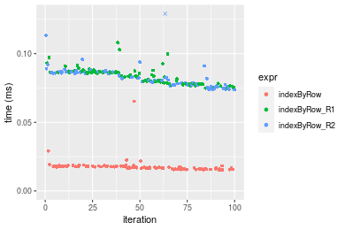
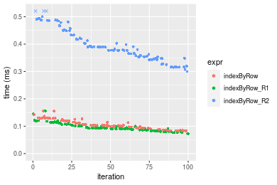
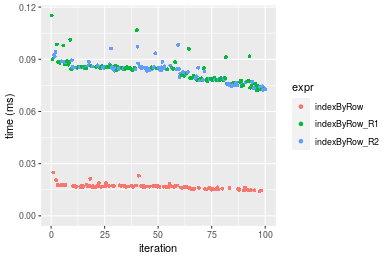
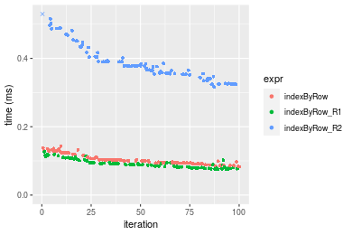
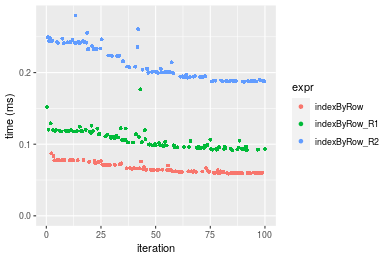
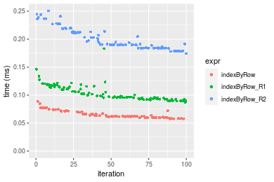
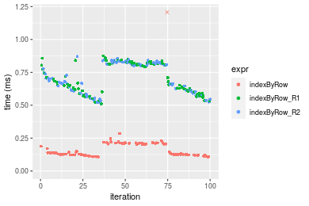

[matrixStats]: Benchmark report

---------------------------------------


# indexByRow() benchmarks

This report benchmark the performance of `indexByRow()` against alternative methods:

* `indexByRow_R1()` based in `matrix(..., byrow = TRUE)`
* `indexByRow_R2()` is a modified version of `indexByRow_R1()`

where `indexByRow_R1()` and `indexByRow_R2()` are defined as in the Appendix.


## Data

```r
> data <- rmatrices(mode = "index")
```
where `rmatrices()` is defined in the Appendix.


## Results

### 10x10 matrix


```r
> X <- data[["10x10"]]
> dim <- dim(X)
> idxsList <- list(`all-by-NULL` = NULL, all = seq_len(prod(dim)), odd = seq(from = 1, to = prod(dim), 
+     by = 2L))
> str(idxsList)
List of 3
 $ all-by-NULL: NULL
 $ all        : int [1:100] 1 2 3 4 5 6 7 8 9 10 ...
 $ odd        : num [1:50] 1 3 5 7 9 11 13 15 17 19 ...
```


#### Index set 'all-by-NULL'

```r
> stats <- microbenchmark(indexByRow = indexByRow(dim, idxs = idxs), indexByRow_R1 = indexByRow_R1(dim, 
+     idxs = idxs), indexByRow_R2 = indexByRow_R2(dim, idxs = idxs), unit = "ms")
```

_Table: Benchmarking of indexByRow(), indexByRow_R1() and indexByRow_R2() on 10x10+all-by-NULL data. The top panel shows times in milliseconds and the bottom panel shows relative times._


|   |expr          |      min|        lq|      mean|    median|       uq|      max|
|:--|:-------------|--------:|---------:|---------:|---------:|--------:|--------:|
|1  |indexByRow    | 0.001282| 0.0016435| 0.0018852| 0.0017985| 0.001945| 0.009008|
|3  |indexByRow_R2 | 0.006167| 0.0068870| 0.0071962| 0.0071035| 0.007310| 0.013159|
|2  |indexByRow_R1 | 0.006154| 0.0069255| 0.0074135| 0.0071710| 0.007465| 0.028892|


|   |expr          |      min|       lq|     mean|   median|       uq|      max|
|:--|:-------------|--------:|--------:|--------:|--------:|--------:|--------:|
|1  |indexByRow    | 1.000000| 1.000000| 1.000000| 1.000000| 1.000000| 1.000000|
|3  |indexByRow_R2 | 4.810452| 4.190447| 3.817218| 3.949680| 3.758355| 1.460813|
|2  |indexByRow_R1 | 4.800312| 4.213873| 3.932485| 3.987212| 3.838046| 3.207371|

_Figure: Benchmarking of indexByRow(), indexByRow_R1() and indexByRow_R2() on 10x10+all-by-NULL data.  Outliers are displayed as crosses.  Times are in milliseconds._


#### Index set 'all'

```r
> stats <- microbenchmark(indexByRow = indexByRow(dim, idxs = idxs), indexByRow_R1 = indexByRow_R1(dim, 
+     idxs = idxs), indexByRow_R2 = indexByRow_R2(dim, idxs = idxs), unit = "ms")
```

_Table: Benchmarking of indexByRow(), indexByRow_R1() and indexByRow_R2() on 10x10+all data. The top panel shows times in milliseconds and the bottom panel shows relative times._


|   |expr          |      min|        lq|      mean|    median|        uq|      max|
|:--|:-------------|--------:|---------:|---------:|---------:|---------:|--------:|
|1  |indexByRow    | 0.002608| 0.0028595| 0.0030970| 0.0030175| 0.0031545| 0.010545|
|2  |indexByRow_R1 | 0.006912| 0.0074970| 0.0080785| 0.0077735| 0.0081135| 0.025745|
|3  |indexByRow_R2 | 0.008396| 0.0090915| 0.0096742| 0.0093155| 0.0096055| 0.032637|


|   |expr          |      min|       lq|     mean|   median|       uq|      max|
|:--|:-------------|--------:|--------:|--------:|--------:|--------:|--------:|
|1  |indexByRow    | 1.000000| 1.000000| 1.000000| 1.000000| 1.000000| 1.000000|
|2  |indexByRow_R1 | 2.650307| 2.621787| 2.608511| 2.576139| 2.572040| 2.441441|
|3  |indexByRow_R2 | 3.219325| 3.179402| 3.123750| 3.087158| 3.045015| 3.095021|

_Figure: Benchmarking of indexByRow(), indexByRow_R1() and indexByRow_R2() on 10x10+all data.  Outliers are displayed as crosses.  Times are in milliseconds._


#### Index set 'odd'

```r
> stats <- microbenchmark(indexByRow = indexByRow(dim, idxs = idxs), indexByRow_R1 = indexByRow_R1(dim, 
+     idxs = idxs), indexByRow_R2 = indexByRow_R2(dim, idxs = idxs), unit = "ms")
```

_Table: Benchmarking of indexByRow(), indexByRow_R1() and indexByRow_R2() on 10x10+odd data. The top panel shows times in milliseconds and the bottom panel shows relative times._


|   |expr          |      min|        lq|      mean|    median|        uq|      max|
|:--|:-------------|--------:|---------:|---------:|---------:|---------:|--------:|
|1  |indexByRow    | 0.002114| 0.0024910| 0.0028393| 0.0026600| 0.0028180| 0.018345|
|3  |indexByRow_R2 | 0.005747| 0.0066405| 0.0069985| 0.0068935| 0.0071700| 0.016073|
|2  |indexByRow_R1 | 0.006692| 0.0075480| 0.0081590| 0.0078975| 0.0082915| 0.028833|


|   |expr          |      min|       lq|     mean|   median|       uq|       max|
|:--|:-------------|--------:|--------:|--------:|--------:|--------:|---------:|
|1  |indexByRow    | 1.000000| 1.000000| 1.000000| 1.000000| 1.000000| 1.0000000|
|3  |indexByRow_R2 | 2.718543| 2.665797| 2.464875| 2.591541| 2.544358| 0.8761515|
|2  |indexByRow_R1 | 3.165563| 3.030108| 2.873589| 2.968985| 2.942335| 1.5717089|

_Figure: Benchmarking of indexByRow(), indexByRow_R1() and indexByRow_R2() on 10x10+odd data.  Outliers are displayed as crosses.  Times are in milliseconds._


### 100x100 matrix


```r
> X <- data[["100x100"]]
> dim <- dim(X)
> idxsList <- list(`all-by-NULL` = NULL, all = seq_len(prod(dim)), odd = seq(from = 1, to = prod(dim), 
+     by = 2L))
> str(idxsList)
List of 3
 $ all-by-NULL: NULL
 $ all        : int [1:10000] 1 2 3 4 5 6 7 8 9 10 ...
 $ odd        : num [1:5000] 1 3 5 7 9 11 13 15 17 19 ...
```


#### Index set 'all-by-NULL'

```r
> stats <- microbenchmark(indexByRow = indexByRow(dim, idxs = idxs), indexByRow_R1 = indexByRow_R1(dim, 
+     idxs = idxs), indexByRow_R2 = indexByRow_R2(dim, idxs = idxs), unit = "ms")
```

_Table: Benchmarking of indexByRow(), indexByRow_R1() and indexByRow_R2() on 100x100+all-by-NULL data. The top panel shows times in milliseconds and the bottom panel shows relative times._


|   |expr          |      min|        lq|      mean|    median|        uq|      max|
|:--|:-------------|--------:|---------:|---------:|---------:|---------:|--------:|
|1  |indexByRow    | 0.015252| 0.0161600| 0.0177820| 0.0172175| 0.0179435| 0.065262|
|3  |indexByRow_R2 | 0.073665| 0.0769315| 0.0826033| 0.0819060| 0.0866595| 0.153746|
|2  |indexByRow_R1 | 0.074657| 0.0783730| 0.0837017| 0.0844410| 0.0866765| 0.108103|


|   |expr          |      min|       lq|     mean|   median|       uq|      max|
|:--|:-------------|--------:|--------:|--------:|--------:|--------:|--------:|
|1  |indexByRow    | 1.000000| 1.000000| 1.000000| 1.000000| 1.000000| 1.000000|
|3  |indexByRow_R2 | 4.829858| 4.760613| 4.645338| 4.757137| 4.829576| 2.355827|
|2  |indexByRow_R1 | 4.894899| 4.849814| 4.707109| 4.904371| 4.830524| 1.656446|

_Figure: Benchmarking of indexByRow(), indexByRow_R1() and indexByRow_R2() on 100x100+all-by-NULL data.  Outliers are displayed as crosses.  Times are in milliseconds._




#### Index set 'all'

```r
> stats <- microbenchmark(indexByRow = indexByRow(dim, idxs = idxs), indexByRow_R1 = indexByRow_R1(dim, 
+     idxs = idxs), indexByRow_R2 = indexByRow_R2(dim, idxs = idxs), unit = "ms")
```

_Table: Benchmarking of indexByRow(), indexByRow_R1() and indexByRow_R2() on 100x100+all data. The top panel shows times in milliseconds and the bottom panel shows relative times._


|   |expr          |      min|        lq|      mean|    median|       uq|      max|
|:--|:-------------|--------:|---------:|---------:|---------:|--------:|--------:|
|2  |indexByRow_R1 | 0.073030| 0.0864855| 0.0963237| 0.0928365| 0.104936| 0.156011|
|1  |indexByRow    | 0.081498| 0.0924100| 0.1052432| 0.1017470| 0.119113| 0.155555|
|3  |indexByRow_R2 | 0.299841| 0.3473715| 0.3912514| 0.3782655| 0.427674| 0.531842|


|   |expr          |      min|       lq|     mean|   median|       uq|       max|
|:--|:-------------|--------:|--------:|--------:|--------:|--------:|---------:|
|2  |indexByRow_R1 | 1.000000| 1.000000| 1.000000| 1.000000| 1.000000| 1.0000000|
|1  |indexByRow    | 1.115952| 1.068503| 1.092599| 1.095981| 1.135101| 0.9970771|
|3  |indexByRow_R2 | 4.105724| 4.016529| 4.061838| 4.074534| 4.075570| 3.4090032|

_Figure: Benchmarking of indexByRow(), indexByRow_R1() and indexByRow_R2() on 100x100+all data.  Outliers are displayed as crosses.  Times are in milliseconds._




#### Index set 'odd'

```r
> stats <- microbenchmark(indexByRow = indexByRow(dim, idxs = idxs), indexByRow_R1 = indexByRow_R1(dim, 
+     idxs = idxs), indexByRow_R2 = indexByRow_R2(dim, idxs = idxs), unit = "ms")
```

_Table: Benchmarking of indexByRow(), indexByRow_R1() and indexByRow_R2() on 100x100+odd data. The top panel shows times in milliseconds and the bottom panel shows relative times._


|   |expr          |      min|        lq|      mean|    median|        uq|      max|
|:--|:-------------|--------:|---------:|---------:|---------:|---------:|--------:|
|1  |indexByRow    | 0.055356| 0.0599685| 0.0660457| 0.0620160| 0.0713825| 0.090670|
|2  |indexByRow_R1 | 0.087818| 0.0946170| 0.1042238| 0.0997865| 0.1118695| 0.135953|
|3  |indexByRow_R2 | 0.177048| 0.1883325| 0.2090049| 0.1999050| 0.2248520| 0.280346|


|   |expr          |      min|       lq|     mean|   median|       uq|      max|
|:--|:-------------|--------:|--------:|--------:|--------:|--------:|--------:|
|1  |indexByRow    | 1.000000| 1.000000| 1.000000| 1.000000| 1.000000| 1.000000|
|2  |indexByRow_R1 | 1.586422| 1.577778| 1.578057| 1.609044| 1.567184| 1.499426|
|3  |indexByRow_R2 | 3.198352| 3.140524| 3.164550| 3.223442| 3.149960| 3.091938|

_Figure: Benchmarking of indexByRow(), indexByRow_R1() and indexByRow_R2() on 100x100+odd data.  Outliers are displayed as crosses.  Times are in milliseconds._


### 1000x10 matrix


```r
> X <- data[["1000x10"]]
> dim <- dim(X)
> idxsList <- list(`all-by-NULL` = NULL, all = seq_len(prod(dim)), odd = seq(from = 1, to = prod(dim), 
+     by = 2L))
> str(idxsList)
List of 3
 $ all-by-NULL: NULL
 $ all        : int [1:10000] 1 2 3 4 5 6 7 8 9 10 ...
 $ odd        : num [1:5000] 1 3 5 7 9 11 13 15 17 19 ...
```


#### Index set 'all-by-NULL'

```r
> stats <- microbenchmark(indexByRow = indexByRow(dim, idxs = idxs), indexByRow_R1 = indexByRow_R1(dim, 
+     idxs = idxs), indexByRow_R2 = indexByRow_R2(dim, idxs = idxs), unit = "ms")
```

_Table: Benchmarking of indexByRow(), indexByRow_R1() and indexByRow_R2() on 1000x10+all-by-NULL data. The top panel shows times in milliseconds and the bottom panel shows relative times._


|   |expr          |      min|        lq|      mean|    median|        uq|      max|
|:--|:-------------|--------:|---------:|---------:|---------:|---------:|--------:|
|1  |indexByRow    | 0.014092| 0.0159260| 0.0167545| 0.0167715| 0.0172140| 0.024884|
|3  |indexByRow_R2 | 0.072366| 0.0781810| 0.0828228| 0.0843585| 0.0854785| 0.098342|
|2  |indexByRow_R1 | 0.072171| 0.0780595| 0.0832589| 0.0845390| 0.0856575| 0.115141|


|   |expr          |      min|       lq|     mean|   median|       uq|      max|
|:--|:-------------|--------:|--------:|--------:|--------:|--------:|--------:|
|1  |indexByRow    | 1.000000| 1.000000| 1.000000| 1.000000| 1.000000| 1.000000|
|3  |indexByRow_R2 | 5.135254| 4.909017| 4.943302| 5.029872| 4.965638| 3.952017|
|2  |indexByRow_R1 | 5.121416| 4.901388| 4.969332| 5.040634| 4.976037| 4.627110|

_Figure: Benchmarking of indexByRow(), indexByRow_R1() and indexByRow_R2() on 1000x10+all-by-NULL data.  Outliers are displayed as crosses.  Times are in milliseconds._




#### Index set 'all'

```r
> stats <- microbenchmark(indexByRow = indexByRow(dim, idxs = idxs), indexByRow_R1 = indexByRow_R1(dim, 
+     idxs = idxs), indexByRow_R2 = indexByRow_R2(dim, idxs = idxs), unit = "ms")
```

_Table: Benchmarking of indexByRow(), indexByRow_R1() and indexByRow_R2() on 1000x10+all data. The top panel shows times in milliseconds and the bottom panel shows relative times._


|   |expr          |      min|        lq|      mean|    median|        uq|      max|
|:--|:-------------|--------:|---------:|---------:|---------:|---------:|--------:|
|2  |indexByRow_R1 | 0.074761| 0.0810275| 0.0915757| 0.0891510| 0.0978105| 0.127025|
|1  |indexByRow    | 0.083101| 0.0937025| 0.1042172| 0.1002460| 0.1129245| 0.143002|
|3  |indexByRow_R2 | 0.316553| 0.3533775| 0.3849551| 0.3771155| 0.4034030| 0.546913|


|   |expr          |      min|       lq|     mean|   median|       uq|      max|
|:--|:-------------|--------:|--------:|--------:|--------:|--------:|--------:|
|2  |indexByRow_R1 | 1.000000| 1.000000| 1.000000| 1.000000| 1.000000| 1.000000|
|1  |indexByRow    | 1.111555| 1.156428| 1.138045| 1.124452| 1.154523| 1.125778|
|3  |indexByRow_R2 | 4.234200| 4.361205| 4.203683| 4.230076| 4.124332| 4.305554|

_Figure: Benchmarking of indexByRow(), indexByRow_R1() and indexByRow_R2() on 1000x10+all data.  Outliers are displayed as crosses.  Times are in milliseconds._




#### Index set 'odd'

```r
> stats <- microbenchmark(indexByRow = indexByRow(dim, idxs = idxs), indexByRow_R1 = indexByRow_R1(dim, 
+     idxs = idxs), indexByRow_R2 = indexByRow_R2(dim, idxs = idxs), unit = "ms")
```

_Table: Benchmarking of indexByRow(), indexByRow_R1() and indexByRow_R2() on 1000x10+odd data. The top panel shows times in milliseconds and the bottom panel shows relative times._


|   |expr          |      min|        lq|      mean|    median|        uq|      max|
|:--|:-------------|--------:|---------:|---------:|---------:|---------:|--------:|
|1  |indexByRow    | 0.058981| 0.0608665| 0.0665945| 0.0641555| 0.0715370| 0.087223|
|2  |indexByRow_R1 | 0.091585| 0.0955840| 0.1065472| 0.1032885| 0.1176660| 0.176565|
|3  |indexByRow_R2 | 0.187444| 0.1895135| 0.2122267| 0.2009670| 0.2389775| 0.279790|


|   |expr          |      min|       lq|     mean|   median|       uq|      max|
|:--|:-------------|--------:|--------:|--------:|--------:|--------:|--------:|
|1  |indexByRow    | 1.000000| 1.000000| 1.000000| 1.000000| 1.000000| 1.000000|
|2  |indexByRow_R1 | 1.552788| 1.570388| 1.599940| 1.609971| 1.644827| 2.024294|
|3  |indexByRow_R2 | 3.178040| 3.113593| 3.186852| 3.132498| 3.340614| 3.207755|

_Figure: Benchmarking of indexByRow(), indexByRow_R1() and indexByRow_R2() on 1000x10+odd data.  Outliers are displayed as crosses.  Times are in milliseconds._




### 10x1000 matrix


```r
> X <- data[["10x1000"]]
> dim <- dim(X)
> idxsList <- list(`all-by-NULL` = NULL, all = seq_len(prod(dim)), odd = seq(from = 1, to = prod(dim), 
+     by = 2L))
> str(idxsList)
List of 3
 $ all-by-NULL: NULL
 $ all        : int [1:10000] 1 2 3 4 5 6 7 8 9 10 ...
 $ odd        : num [1:5000] 1 3 5 7 9 11 13 15 17 19 ...
```


#### Index set 'all-by-NULL'

```r
> stats <- microbenchmark(indexByRow = indexByRow(dim, idxs = idxs), indexByRow_R1 = indexByRow_R1(dim, 
+     idxs = idxs), indexByRow_R2 = indexByRow_R2(dim, idxs = idxs), unit = "ms")
```

_Table: Benchmarking of indexByRow(), indexByRow_R1() and indexByRow_R2() on 10x1000+all-by-NULL data. The top panel shows times in milliseconds and the bottom panel shows relative times._


|   |expr          |      min|        lq|      mean|    median|        uq|      max|
|:--|:-------------|--------:|---------:|---------:|---------:|---------:|--------:|
|1  |indexByRow    | 0.014967| 0.0160025| 0.0167037| 0.0165680| 0.0169950| 0.032126|
|3  |indexByRow_R2 | 0.076358| 0.0782465| 0.0830444| 0.0822775| 0.0857780| 0.103863|
|2  |indexByRow_R1 | 0.076306| 0.0795235| 0.0835379| 0.0830110| 0.0857735| 0.112211|


|   |expr          |      min|       lq|     mean|   median|       uq|      max|
|:--|:-------------|--------:|--------:|--------:|--------:|--------:|--------:|
|1  |indexByRow    | 1.000000| 1.000000| 1.000000| 1.000000| 1.000000| 1.000000|
|3  |indexByRow_R2 | 5.101757| 4.889642| 4.971619| 4.966049| 5.047249| 3.232989|
|2  |indexByRow_R1 | 5.098283| 4.969442| 5.001164| 5.010321| 5.046984| 3.492841|

_Figure: Benchmarking of indexByRow(), indexByRow_R1() and indexByRow_R2() on 10x1000+all-by-NULL data.  Outliers are displayed as crosses.  Times are in milliseconds._


#### Index set 'all'

```r
> stats <- microbenchmark(indexByRow = indexByRow(dim, idxs = idxs), indexByRow_R1 = indexByRow_R1(dim, 
+     idxs = idxs), indexByRow_R2 = indexByRow_R2(dim, idxs = idxs), unit = "ms")
```

_Table: Benchmarking of indexByRow(), indexByRow_R1() and indexByRow_R2() on 10x1000+all data. The top panel shows times in milliseconds and the bottom panel shows relative times._


|   |expr          |      min|        lq|      mean|    median|        uq|      max|
|:--|:-------------|--------:|---------:|---------:|---------:|---------:|--------:|
|2  |indexByRow_R1 | 0.072936| 0.0834525| 0.0937125| 0.0920540| 0.1014270| 0.130469|
|1  |indexByRow    | 0.084448| 0.0916775| 0.1042213| 0.1025965| 0.1112685| 0.142197|
|3  |indexByRow_R2 | 0.307719| 0.3373145| 0.3758221| 0.3685620| 0.4040380| 0.494355|


|   |expr          |      min|       lq|     mean|   median|       uq|      max|
|:--|:-------------|--------:|--------:|--------:|--------:|--------:|--------:|
|2  |indexByRow_R1 | 1.000000| 1.000000| 1.000000| 1.000000| 1.000000| 1.000000|
|1  |indexByRow    | 1.157837| 1.098559| 1.112139| 1.114525| 1.097030| 1.089891|
|3  |indexByRow_R2 | 4.219028| 4.041994| 4.010373| 4.003759| 3.983535| 3.789061|

_Figure: Benchmarking of indexByRow(), indexByRow_R1() and indexByRow_R2() on 10x1000+all data.  Outliers are displayed as crosses.  Times are in milliseconds._


#### Index set 'odd'

```r
> stats <- microbenchmark(indexByRow = indexByRow(dim, idxs = idxs), indexByRow_R1 = indexByRow_R1(dim, 
+     idxs = idxs), indexByRow_R2 = indexByRow_R2(dim, idxs = idxs), unit = "ms")
```

_Table: Benchmarking of indexByRow(), indexByRow_R1() and indexByRow_R2() on 10x1000+odd data. The top panel shows times in milliseconds and the bottom panel shows relative times._


|   |expr          |      min|        lq|      mean|    median|        uq|      max|
|:--|:-------------|--------:|---------:|---------:|---------:|---------:|--------:|
|1  |indexByRow    | 0.057493| 0.0612405| 0.0653401| 0.0621600| 0.0701970| 0.088982|
|2  |indexByRow_R1 | 0.087120| 0.0938180| 0.1042518| 0.0985685| 0.1142000| 0.183106|
|3  |indexByRow_R2 | 0.174264| 0.1841790| 0.1988696| 0.1904060| 0.2120615| 0.250581|


|   |expr          |      min|       lq|     mean|   median|       uq|      max|
|:--|:-------------|--------:|--------:|--------:|--------:|--------:|--------:|
|1  |indexByRow    | 1.000000| 1.000000| 1.000000| 1.000000| 1.000000| 1.000000|
|2  |indexByRow_R1 | 1.515315| 1.531960| 1.595525| 1.585722| 1.626850| 2.057787|
|3  |indexByRow_R2 | 3.031047| 3.007471| 3.043607| 3.063160| 3.020948| 2.816086|

_Figure: Benchmarking of indexByRow(), indexByRow_R1() and indexByRow_R2() on 10x1000+odd data.  Outliers are displayed as crosses.  Times are in milliseconds._




### 100x1000 matrix


```r
> X <- data[["100x1000"]]
> dim <- dim(X)
> idxsList <- list(`all-by-NULL` = NULL, all = seq_len(prod(dim)), odd = seq(from = 1, to = prod(dim), 
+     by = 2L))
> str(idxsList)
List of 3
 $ all-by-NULL: NULL
 $ all        : int [1:100000] 1 2 3 4 5 6 7 8 9 10 ...
 $ odd        : num [1:50000] 1 3 5 7 9 11 13 15 17 19 ...
```


#### Index set 'all-by-NULL'

```r
> stats <- microbenchmark(indexByRow = indexByRow(dim, idxs = idxs), indexByRow_R1 = indexByRow_R1(dim, 
+     idxs = idxs), indexByRow_R2 = indexByRow_R2(dim, idxs = idxs), unit = "ms")
```

_Table: Benchmarking of indexByRow(), indexByRow_R1() and indexByRow_R2() on 100x1000+all-by-NULL data. The top panel shows times in milliseconds and the bottom panel shows relative times._


|   |expr          |      min|        lq|      mean|    median|        uq|       max|
|:--|:-------------|--------:|---------:|---------:|---------:|---------:|---------:|
|1  |indexByRow    | 0.099124| 0.1175865| 0.1505342| 0.1324315| 0.2031230|  0.220248|
|3  |indexByRow_R2 | 0.525359| 0.6359585| 0.8410909| 0.6781020| 0.8273405| 12.569268|
|2  |indexByRow_R1 | 0.524381| 0.6389070| 0.7295728| 0.7045310| 0.8274250|  1.127695|


|   |expr          |      min|       lq|     mean|   median|       uq|       max|
|:--|:-------------|--------:|--------:|--------:|--------:|--------:|---------:|
|1  |indexByRow    | 1.000000| 1.000000| 1.000000| 1.000000| 1.000000|  1.000000|
|3  |indexByRow_R2 | 5.300018| 5.408431| 5.587372| 5.120398| 4.073101| 57.068704|
|2  |indexByRow_R1 | 5.290152| 5.433506| 4.846557| 5.319965| 4.073517|  5.120115|

_Figure: Benchmarking of indexByRow(), indexByRow_R1() and indexByRow_R2() on 100x1000+all-by-NULL data.  Outliers are displayed as crosses.  Times are in milliseconds._


#### Index set 'all'

```r
> stats <- microbenchmark(indexByRow = indexByRow(dim, idxs = idxs), indexByRow_R1 = indexByRow_R1(dim, 
+     idxs = idxs), indexByRow_R2 = indexByRow_R2(dim, idxs = idxs), unit = "ms")
```

_Table: Benchmarking of indexByRow(), indexByRow_R1() and indexByRow_R2() on 100x1000+all data. The top panel shows times in milliseconds and the bottom panel shows relative times._


|   |expr          |      min|       lq|      mean|    median|        uq|      max|
|:--|:-------------|--------:|--------:|---------:|---------:|---------:|--------:|
|2  |indexByRow_R1 | 0.676463| 0.684153| 0.9069105| 0.6973605| 0.9944955| 7.065740|
|1  |indexByRow    | 0.779384| 0.782105| 0.8616909| 0.8484975| 0.9002355| 1.303930|
|3  |indexByRow_R2 | 3.012132| 3.031932| 3.4665338| 3.2426560| 3.9203275| 5.297835|


|   |expr          |      min|       lq|      mean|   median|        uq|       max|
|:--|:-------------|--------:|--------:|---------:|--------:|---------:|---------:|
|2  |indexByRow_R1 | 1.000000| 1.000000| 1.0000000| 1.000000| 1.0000000| 1.0000000|
|1  |indexByRow    | 1.152146| 1.143173| 0.9501388| 1.216727| 0.9052183| 0.1845426|
|3  |indexByRow_R2 | 4.452767| 4.431658| 3.8223547| 4.649899| 3.9420264| 0.7497920|

_Figure: Benchmarking of indexByRow(), indexByRow_R1() and indexByRow_R2() on 100x1000+all data.  Outliers are displayed as crosses.  Times are in milliseconds._


#### Index set 'odd'

```r
> stats <- microbenchmark(indexByRow = indexByRow(dim, idxs = idxs), indexByRow_R1 = indexByRow_R1(dim, 
+     idxs = idxs), indexByRow_R2 = indexByRow_R2(dim, idxs = idxs), unit = "ms")
```

_Table: Benchmarking of indexByRow(), indexByRow_R1() and indexByRow_R2() on 100x1000+odd data. The top panel shows times in milliseconds and the bottom panel shows relative times._


|   |expr          |      min|        lq|      mean|   median|       uq|      max|
|:--|:-------------|--------:|---------:|---------:|--------:|--------:|--------:|
|1  |indexByRow    | 0.458584| 0.4633480| 0.5287863| 0.529181| 0.579864| 0.710381|
|2  |indexByRow_R1 | 0.691888| 0.7261385| 0.8803531| 0.865033| 1.029082| 1.513058|
|3  |indexByRow_R2 | 1.469839| 1.4964135| 1.8339744| 1.828790| 1.928001| 8.186444|


|   |expr          |      min|       lq|     mean|   median|       uq|       max|
|:--|:-------------|--------:|--------:|--------:|--------:|--------:|---------:|
|1  |indexByRow    | 1.000000| 1.000000| 1.000000| 1.000000| 1.000000|  1.000000|
|2  |indexByRow_R1 | 1.508749| 1.567156| 1.664856| 1.634664| 1.774695|  2.129925|
|3  |indexByRow_R2 | 3.205169| 3.229567| 3.468271| 3.455887| 3.324919| 11.524019|

_Figure: Benchmarking of indexByRow(), indexByRow_R1() and indexByRow_R2() on 100x1000+odd data.  Outliers are displayed as crosses.  Times are in milliseconds._


### 1000x100 matrix


```r
> X <- data[["1000x100"]]
> dim <- dim(X)
> idxsList <- list(`all-by-NULL` = NULL, all = seq_len(prod(dim)), odd = seq(from = 1, to = prod(dim), 
+     by = 2L))
> str(idxsList)
List of 3
 $ all-by-NULL: NULL
 $ all        : int [1:100000] 1 2 3 4 5 6 7 8 9 10 ...
 $ odd        : num [1:50000] 1 3 5 7 9 11 13 15 17 19 ...
```


#### Index set 'all-by-NULL'

```r
> stats <- microbenchmark(indexByRow = indexByRow(dim, idxs = idxs), indexByRow_R1 = indexByRow_R1(dim, 
+     idxs = idxs), indexByRow_R2 = indexByRow_R2(dim, idxs = idxs), unit = "ms")
```

_Table: Benchmarking of indexByRow(), indexByRow_R1() and indexByRow_R2() on 1000x100+all-by-NULL data. The top panel shows times in milliseconds and the bottom panel shows relative times._


|   |expr          |      min|        lq|      mean|    median|        uq|       max|
|:--|:-------------|--------:|---------:|---------:|---------:|---------:|---------:|
|1  |indexByRow    | 0.108854| 0.1236085| 0.2695321| 0.1354835| 0.2066770| 11.379597|
|2  |indexByRow_R1 | 0.510801| 0.6014975| 0.6972782| 0.6633375| 0.8146630|  0.875310|
|3  |indexByRow_R2 | 0.511998| 0.6085370| 0.7112154| 0.7047580| 0.8220385|  0.870048|


|   |expr          |      min|      lq|     mean|   median|       uq|       max|
|:--|:-------------|--------:|-------:|--------:|--------:|--------:|---------:|
|1  |indexByRow    | 1.000000| 1.00000| 1.000000| 1.000000| 1.000000| 1.0000000|
|2  |indexByRow_R1 | 4.692533| 4.86615| 2.586995| 4.896076| 3.941721| 0.0769192|
|3  |indexByRow_R2 | 4.703530| 4.92310| 2.638704| 5.201799| 3.977407| 0.0764568|

_Figure: Benchmarking of indexByRow(), indexByRow_R1() and indexByRow_R2() on 1000x100+all-by-NULL data.  Outliers are displayed as crosses.  Times are in milliseconds._




#### Index set 'all'

```r
> stats <- microbenchmark(indexByRow = indexByRow(dim, idxs = idxs), indexByRow_R1 = indexByRow_R1(dim, 
+     idxs = idxs), indexByRow_R2 = indexByRow_R2(dim, idxs = idxs), unit = "ms")
```

_Table: Benchmarking of indexByRow(), indexByRow_R1() and indexByRow_R2() on 1000x100+all data. The top panel shows times in milliseconds and the bottom panel shows relative times._


|   |expr          |      min|       lq|      mean|   median|       uq|       max|
|:--|:-------------|--------:|--------:|---------:|--------:|--------:|---------:|
|1  |indexByRow    | 0.779206| 0.797280| 0.8907752| 0.894966| 0.910122|  1.359681|
|2  |indexByRow_R1 | 0.659909| 0.714930| 0.8888209| 0.965549| 1.003583|  1.629828|
|3  |indexByRow_R2 | 2.993995| 3.138649| 3.8375815| 3.901712| 3.962118| 15.189870|


|   |expr          |       min|        lq|      mean|   median|       uq|       max|
|:--|:-------------|---------:|---------:|---------:|--------:|--------:|---------:|
|1  |indexByRow    | 1.0000000| 1.0000000| 1.0000000| 1.000000| 1.000000|  1.000000|
|2  |indexByRow_R1 | 0.8468993| 0.8967113| 0.9978061| 1.078867| 1.102691|  1.198684|
|3  |indexByRow_R2 | 3.8423665| 3.9366960| 4.3081367| 4.359621| 4.353392| 11.171643|

_Figure: Benchmarking of indexByRow(), indexByRow_R1() and indexByRow_R2() on 1000x100+all data.  Outliers are displayed as crosses.  Times are in milliseconds._


#### Index set 'odd'

```r
> stats <- microbenchmark(indexByRow = indexByRow(dim, idxs = idxs), indexByRow_R1 = indexByRow_R1(dim, 
+     idxs = idxs), indexByRow_R2 = indexByRow_R2(dim, idxs = idxs), unit = "ms")
```

_Table: Benchmarking of indexByRow(), indexByRow_R1() and indexByRow_R2() on 1000x100+odd data. The top panel shows times in milliseconds and the bottom panel shows relative times._


|   |expr          |      min|        lq|      mean|    median|        uq|      max|
|:--|:-------------|--------:|---------:|---------:|---------:|---------:|--------:|
|1  |indexByRow    | 0.459075| 0.4646340| 0.5462618| 0.5710475| 0.5814035| 0.942403|
|2  |indexByRow_R1 | 0.703373| 0.7178475| 0.8790656| 0.8398025| 1.0195915| 2.193599|
|3  |indexByRow_R2 | 1.489537| 1.4968780| 1.7872100| 1.6315585| 1.9249515| 8.194279|


|   |expr          |      min|       lq|     mean|   median|       uq|      max|
|:--|:-------------|--------:|--------:|--------:|--------:|--------:|--------:|
|1  |indexByRow    | 1.000000| 1.000000| 1.000000| 1.000000| 1.000000| 1.000000|
|2  |indexByRow_R1 | 1.532153| 1.544974| 1.609239| 1.470635| 1.753673| 2.327666|
|3  |indexByRow_R2 | 3.244648| 3.221628| 3.271710| 2.857133| 3.310870| 8.695090|

_Figure: Benchmarking of indexByRow(), indexByRow_R1() and indexByRow_R2() on 1000x100+odd data.  Outliers are displayed as crosses.  Times are in milliseconds._


## Appendix

### Session information
```r
R version 4.1.1 Patched (2021-08-10 r80727)
Platform: x86_64-pc-linux-gnu (64-bit)
Running under: Ubuntu 18.04.5 LTS

Matrix products: default
BLAS:   /home/hb/software/R-devel/R-4-1-branch/lib/R/lib/libRblas.so
LAPACK: /home/hb/software/R-devel/R-4-1-branch/lib/R/lib/libRlapack.so

locale:
 [1] LC_CTYPE=en_US.UTF-8       LC_NUMERIC=C              
 [3] LC_TIME=en_US.UTF-8        LC_COLLATE=en_US.UTF-8    
 [5] LC_MONETARY=en_US.UTF-8    LC_MESSAGES=en_US.UTF-8   
 [7] LC_PAPER=en_US.UTF-8       LC_NAME=C                 
 [9] LC_ADDRESS=C               LC_TELEPHONE=C            
[11] LC_MEASUREMENT=en_US.UTF-8 LC_IDENTIFICATION=C       

attached base packages:
[1] stats     graphics  grDevices utils     datasets  methods   base     

other attached packages:
[1] microbenchmark_1.4-7   matrixStats_0.60.0     ggplot2_3.3.5         
[4] knitr_1.33             R.devices_2.17.0       R.utils_2.10.1        
[7] R.oo_1.24.0            R.methodsS3_1.8.1-9001 history_0.0.1-9000    

loaded via a namespace (and not attached):
 [1] Biobase_2.52.0          httr_1.4.2              splines_4.1.1          
 [4] bit64_4.0.5             network_1.17.1          assertthat_0.2.1       
 [7] highr_0.9               stats4_4.1.1            blob_1.2.2             
[10] GenomeInfoDbData_1.2.6  robustbase_0.93-8       pillar_1.6.2           
[13] RSQLite_2.2.8           lattice_0.20-44         glue_1.4.2             
[16] digest_0.6.27           XVector_0.32.0          colorspace_2.0-2       
[19] Matrix_1.3-4            XML_3.99-0.7            pkgconfig_2.0.3        
[22] zlibbioc_1.38.0         genefilter_1.74.0       purrr_0.3.4            
[25] ergm_4.1.2              xtable_1.8-4            scales_1.1.1           
[28] tibble_3.1.4            annotate_1.70.0         KEGGREST_1.32.0        
[31] farver_2.1.0            generics_0.1.0          IRanges_2.26.0         
[34] ellipsis_0.3.2          cachem_1.0.6            withr_2.4.2            
[37] BiocGenerics_0.38.0     mime_0.11               survival_3.2-13        
[40] magrittr_2.0.1          crayon_1.4.1            statnet.common_4.5.0   
[43] memoise_2.0.0           laeken_0.5.1            fansi_0.5.0            
[46] R.cache_0.15.0          MASS_7.3-54             R.rsp_0.44.0           
[49] progressr_0.8.0         tools_4.1.1             lifecycle_1.0.0        
[52] S4Vectors_0.30.0        trust_0.1-8             munsell_0.5.0          
[55] tabby_0.0.1-9001        AnnotationDbi_1.54.1    Biostrings_2.60.2      
[58] compiler_4.1.1          GenomeInfoDb_1.28.1     rlang_0.4.11           
[61] grid_4.1.1              RCurl_1.98-1.4          cwhmisc_6.6            
[64] rstudioapi_0.13         rappdirs_0.3.3          startup_0.15.0-9000    
[67] labeling_0.4.2          bitops_1.0-7            base64enc_0.1-3        
[70] boot_1.3-28             gtable_0.3.0            DBI_1.1.1              
[73] markdown_1.1            R6_2.5.1                lpSolveAPI_5.5.2.0-17.7
[76] rle_0.9.2               dplyr_1.0.7             fastmap_1.1.0          
[79] bit_4.0.4               utf8_1.2.2              parallel_4.1.1         
[82] Rcpp_1.0.7              vctrs_0.3.8             png_0.1-7              
[85] DEoptimR_1.0-9          tidyselect_1.1.1        xfun_0.25              
[88] coda_0.19-4            
```
Total processing time was 19.77 secs.


### Reproducibility
To reproduce this report, do:
```r
html <- matrixStats:::benchmark('indexByRow')
```

[RSP]: https://cran.r-project.org/package=R.rsp
[matrixStats]: https://cran.r-project.org/package=matrixStats

[StackOverflow:colMins?]: https://stackoverflow.com/questions/13676878 "Stack Overflow: fastest way to get Min from every column in a matrix?"
[StackOverflow:colSds?]: https://stackoverflow.com/questions/17549762 "Stack Overflow: Is there such 'colsd' in R?"
[StackOverflow:rowProds?]: https://stackoverflow.com/questions/20198801/ "Stack Overflow: Row product of matrix and column sum of matrix"

---------------------------------------
Copyright Henrik Bengtsson. Last updated on 2021-08-25 22:35:02 (+0200 UTC). Powered by [RSP].

<script>
 var link = document.createElement('link');
 link.rel = 'icon';
 link.href = "data:image/png;base64,iVBORw0KGgoAAAANSUhEUgAAACAAAAAgCAMAAABEpIrGAAAA21BMVEUAAAAAAP8AAP8AAP8AAP8AAP8AAP8AAP8AAP8AAP8AAP8AAP8AAP8AAP8AAP8AAP8AAP8AAP8AAP8AAP8AAP8AAP8AAP8AAP8AAP8AAP8AAP8AAP8AAP8AAP8AAP8AAP8AAP8AAP8AAP8AAP8AAP8AAP8AAP8AAP8AAP8AAP8BAf4CAv0DA/wdHeIeHuEfH+AgIN8hId4lJdomJtknJ9g+PsE/P8BAQL9yco10dIt1dYp3d4h4eIeVlWqWlmmXl2iYmGeZmWabm2Tn5xjo6Bfp6Rb39wj4+Af//wA2M9hbAAAASXRSTlMAAQIJCgsMJSYnKD4/QGRlZmhpamtsbautrrCxuru8y8zN5ebn6Pn6+///////////////////////////////////////////LsUNcQAAAS9JREFUOI29k21XgkAQhVcFytdSMqMETU26UVqGmpaiFbL//xc1cAhhwVNf6n5i5z67M2dmYOyfJZUqlVLhkKucG7cgmUZTybDz6g0iDeq51PUr37Ds2cy2/C9NeES5puDjxuUk1xnToZsg8pfA3avHQ3lLIi7iWRrkv/OYtkScxBIMgDee0ALoyxHQBJ68JLCjOtQIMIANF7QG9G9fNnHvisCHBVMKgSJgiz7nE+AoBKrAPA3MgepvgR9TSCasrCKH0eB1wBGBFdCO+nAGjMVGPcQb5bd6mQRegN6+1axOs9nGfYcCtfi4NQosdtH7dB+txFIpXQqN1p9B/asRHToyS0jRgpV7nk4nwcq1BJ+x3Gl/v7S9Wmpp/aGquum7w3ZDyrADFYrl8vHBH+ev9AUASW1dmU4h4wAAAABJRU5ErkJggg=="
 document.getElementsByTagName('head')[0].appendChild(link);
</script>


### Local functions
```r
> indexByRow_R1 <- function(dim, idxs = NULL, ...) {
+     n <- prod(dim)
+     x <- matrix(seq_len(n), nrow = dim[2L], ncol = dim[1L], byrow = TRUE)
+     if (!is.null(idxs)) 
+         x <- x[idxs]
+     as.vector(x)
+ }
```
```r
> indexByRow_R2 <- function(dim, idxs = NULL, ...) {
+     n <- prod(dim)
+     if (is.null(idxs)) {
+         x <- matrix(seq_len(n), nrow = dim[2L], ncol = dim[1L], byrow = TRUE)
+         as.vector(x)
+     }     else {
+         idxs <- idxs - 1
+         cols <- idxs%/%dim[2L]
+         rows <- idxs%%dim[2L]
+         cols + dim[1L] * rows + 1L
+     }
+ }
```
```r
> rmatrix <- function(nrow, ncol, mode = c("logical", "double", "integer", "index"), range = c(-100, 
+     +100), na_prob = 0) {
+     mode <- match.arg(mode)
+     n <- nrow * ncol
+     if (mode == "logical") {
+         x <- sample(c(FALSE, TRUE), size = n, replace = TRUE)
+     }     else if (mode == "index") {
+         x <- seq_len(n)
+         mode <- "integer"
+     }     else {
+         x <- runif(n, min = range[1], max = range[2])
+     }
+     storage.mode(x) <- mode
+     if (na_prob > 0) 
+         x[sample(n, size = na_prob * n)] <- NA
+     dim(x) <- c(nrow, ncol)
+     x
+ }
> rmatrices <- function(scale = 10, seed = 1, ...) {
+     set.seed(seed)
+     data <- list()
+     data[[1]] <- rmatrix(nrow = scale * 1, ncol = scale * 1, ...)
+     data[[2]] <- rmatrix(nrow = scale * 10, ncol = scale * 10, ...)
+     data[[3]] <- rmatrix(nrow = scale * 100, ncol = scale * 1, ...)
+     data[[4]] <- t(data[[3]])
+     data[[5]] <- rmatrix(nrow = scale * 10, ncol = scale * 100, ...)
+     data[[6]] <- t(data[[5]])
+     names(data) <- sapply(data, FUN = function(x) paste(dim(x), collapse = "x"))
+     data
+ }
```


