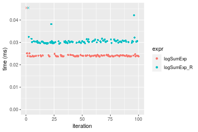
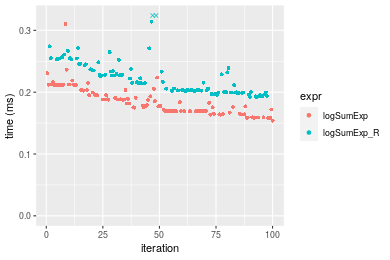
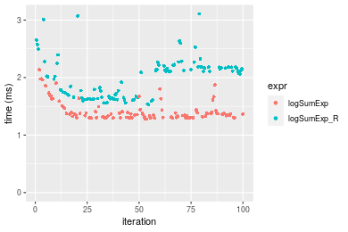
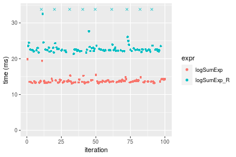

[matrixStats]: Benchmark report

---------------------------------------


# logSumExp() benchmarks

This report benchmark the performance of logSumExp() against alternative methods.

## Alternative methods

* logSumExp_R()

where

```r
> logSumExp_R <- function(lx, ...) {
+     iMax <- which.max(lx)
+     log1p(sum(exp(lx[-iMax] - lx[iMax]))) + lx[iMax]
+ }
```


## Data
```r
> rvector <- function(n, mode = c("logical", "double", "integer"), range = c(-100, +100), na_prob = 0) {
+     mode <- match.arg(mode)
+     if (mode == "logical") {
+         x <- sample(c(FALSE, TRUE), size = n, replace = TRUE)
+     }     else {
+         x <- runif(n, min = range[1], max = range[2])
+     }
+     storage.mode(x) <- mode
+     if (na_prob > 0) 
+         x[sample(n, size = na_prob * n)] <- NA
+     x
+ }
> rvectors <- function(scale = 10, seed = 1, ...) {
+     set.seed(seed)
+     data <- list()
+     data[[1]] <- rvector(n = scale * 100, ...)
+     data[[2]] <- rvector(n = scale * 1000, ...)
+     data[[3]] <- rvector(n = scale * 10000, ...)
+     data[[4]] <- rvector(n = scale * 1e+05, ...)
+     data[[5]] <- rvector(n = scale * 1e+06, ...)
+     names(data) <- sprintf("n = %d", sapply(data, FUN = length))
+     data
+ }
> data <- rvectors(mode = "double")
> data <- data[1:4]
```

## Results

### n = 1000 vector

```r
> x <- data[["n = 1000"]]
> gc()
           used  (Mb) gc trigger  (Mb) max used  (Mb)
Ncells  5343460 285.4    7916910 422.9  7916910 422.9
Vcells 13614354 103.9   36893127 281.5 57430649 438.2
> stats <- microbenchmark(logSumExp = logSumExp(x), logSumExp_R = logSumExp_R(x), unit = "ms")
```

_Table: Benchmarking of logSumExp() and logSumExp_R() on n = 1000 data. The top panel shows times in milliseconds and the bottom panel shows relative times._


|   |expr        |      min|        lq|      mean|    median|       uq|      max|
|:--|:-----------|--------:|---------:|---------:|---------:|--------:|--------:|
|1  |logSumExp   | 0.022266| 0.0225450| 0.0230288| 0.0227255| 0.022914| 0.046002|
|2  |logSumExp_R | 0.028683| 0.0294105| 0.0308637| 0.0299415| 0.030497| 0.064713|


|   |expr        |      min|       lq|    mean|   median|       uq|      max|
|:--|:-----------|--------:|--------:|-------:|--------:|--------:|--------:|
|1  |logSumExp   | 1.000000| 1.000000| 1.00000| 1.000000| 1.000000| 1.000000|
|2  |logSumExp_R | 1.288197| 1.304524| 1.34022| 1.317529| 1.330933| 1.406743|

_Figure: Benchmarking of logSumExp() and logSumExp_R() on n = 1000 data.  Outliers are displayed as crosses.  Times are in milliseconds._



### n = 10000 vector

```r
> x <- data[["n = 10000"]]
> gc()
           used  (Mb) gc trigger  (Mb) max used  (Mb)
Ncells  5341232 285.3    7916910 422.9  7916910 422.9
Vcells 11429405  87.2   36893127 281.5 57430649 438.2
> stats <- microbenchmark(logSumExp = logSumExp(x), logSumExp_R = logSumExp_R(x), unit = "ms")
```

_Table: Benchmarking of logSumExp() and logSumExp_R() on n = 10000 data. The top panel shows times in milliseconds and the bottom panel shows relative times._


|   |expr        |      min|        lq|      mean|    median|        uq|      max|
|:--|:-----------|--------:|---------:|---------:|---------:|---------:|--------:|
|1  |logSumExp   | 0.154077| 0.1691225| 0.1852944| 0.1789375| 0.2009460| 0.310048|
|2  |logSumExp_R | 0.192103| 0.2000760| 0.2222996| 0.2145080| 0.2367025| 0.353637|


|   |expr        |      min|       lq|    mean|   median|       uq|      max|
|:--|:-----------|--------:|--------:|-------:|--------:|--------:|--------:|
|1  |logSumExp   | 1.000000| 1.000000| 1.00000| 1.000000| 1.000000| 1.000000|
|2  |logSumExp_R | 1.246799| 1.183024| 1.19971| 1.198787| 1.177941| 1.140588|

_Figure: Benchmarking of logSumExp() and logSumExp_R() on n = 10000 data.  Outliers are displayed as crosses.  Times are in milliseconds._



### n = 100000 vector

```r
> x <- data[["n = 100000"]]
> gc()
           used  (Mb) gc trigger  (Mb) max used  (Mb)
Ncells  5341295 285.3    7916910 422.9  7916910 422.9
Vcells 11429447  87.2   36893127 281.5 57430649 438.2
> stats <- microbenchmark(logSumExp = logSumExp(x), logSumExp_R = logSumExp_R(x), unit = "ms")
```

_Table: Benchmarking of logSumExp() and logSumExp_R() on n = 100000 data. The top panel shows times in milliseconds and the bottom panel shows relative times._


|   |expr        |      min|       lq|     mean|   median|       uq|      max|
|:--|:-----------|--------:|--------:|--------:|--------:|--------:|--------:|
|1  |logSumExp   | 1.279054| 1.306963| 1.428666| 1.364008| 1.431050| 2.133753|
|2  |logSumExp_R | 1.528733| 1.656939| 1.996871| 2.083162| 2.181539| 3.109036|


|   |expr        |      min|       lq|     mean|   median|       uq|      max|
|:--|:-----------|--------:|--------:|--------:|--------:|--------:|--------:|
|1  |logSumExp   | 1.000000| 1.000000| 1.000000| 1.000000| 1.000000| 1.000000|
|2  |logSumExp_R | 1.195206| 1.267778| 1.397717| 1.527235| 1.524433| 1.457074|

_Figure: Benchmarking of logSumExp() and logSumExp_R() on n = 100000 data.  Outliers are displayed as crosses.  Times are in milliseconds._



### n = 1000000 vector

```r
> x <- data[["n = 1000000"]]
> gc()
           used  (Mb) gc trigger  (Mb) max used  (Mb)
Ncells  5341358 285.3    7916910 422.9  7916910 422.9
Vcells 11430002  87.3   36893127 281.5 57430649 438.2
> stats <- microbenchmark(logSumExp = logSumExp(x), logSumExp_R = logSumExp_R(x), unit = "ms")
```

_Table: Benchmarking of logSumExp() and logSumExp_R() on n = 1000000 data. The top panel shows times in milliseconds and the bottom panel shows relative times._


|   |expr        |      min|       lq|     mean|   median|       uq|      max|
|:--|:-----------|--------:|--------:|--------:|--------:|--------:|--------:|
|1  |logSumExp   | 13.13373| 13.41856| 13.84355| 13.64258| 13.93897| 19.88573|
|2  |logSumExp_R | 21.35258| 22.24761| 24.18817| 22.52311| 23.08262| 45.37122|


|   |expr        |      min|       lq|     mean|   median|       uq|      max|
|:--|:-----------|--------:|--------:|--------:|--------:|--------:|--------:|
|1  |logSumExp   | 1.000000| 1.000000| 1.000000| 1.000000| 1.000000| 1.000000|
|2  |logSumExp_R | 1.625782| 1.657973| 1.747252| 1.650942| 1.655978| 2.281597|

_Figure: Benchmarking of logSumExp() and logSumExp_R() on n = 1000000 data.  Outliers are displayed as crosses.  Times are in milliseconds._




## Appendix

### Session information
```r
R version 4.1.1 Patched (2021-08-10 r80727)
Platform: x86_64-pc-linux-gnu (64-bit)
Running under: Ubuntu 18.04.5 LTS

Matrix products: default
BLAS:   /home/hb/software/R-devel/R-4-1-branch/lib/R/lib/libRblas.so
LAPACK: /home/hb/software/R-devel/R-4-1-branch/lib/R/lib/libRlapack.so

locale:
 [1] LC_CTYPE=en_US.UTF-8       LC_NUMERIC=C              
 [3] LC_TIME=en_US.UTF-8        LC_COLLATE=en_US.UTF-8    
 [5] LC_MONETARY=en_US.UTF-8    LC_MESSAGES=en_US.UTF-8   
 [7] LC_PAPER=en_US.UTF-8       LC_NAME=C                 
 [9] LC_ADDRESS=C               LC_TELEPHONE=C            
[11] LC_MEASUREMENT=en_US.UTF-8 LC_IDENTIFICATION=C       

attached base packages:
[1] stats     graphics  grDevices utils     datasets  methods   base     

other attached packages:
[1] microbenchmark_1.4-7   matrixStats_0.60.0     ggplot2_3.3.5         
[4] knitr_1.33             R.devices_2.17.0       R.utils_2.10.1        
[7] R.oo_1.24.0            R.methodsS3_1.8.1-9001 history_0.0.1-9000    

loaded via a namespace (and not attached):
 [1] Biobase_2.52.0          httr_1.4.2              splines_4.1.1          
 [4] bit64_4.0.5             network_1.17.1          assertthat_0.2.1       
 [7] highr_0.9               stats4_4.1.1            blob_1.2.2             
[10] GenomeInfoDbData_1.2.6  robustbase_0.93-8       pillar_1.6.2           
[13] RSQLite_2.2.8           lattice_0.20-44         glue_1.4.2             
[16] digest_0.6.27           XVector_0.32.0          colorspace_2.0-2       
[19] Matrix_1.3-4            XML_3.99-0.7            pkgconfig_2.0.3        
[22] zlibbioc_1.38.0         genefilter_1.74.0       purrr_0.3.4            
[25] ergm_4.1.2              xtable_1.8-4            scales_1.1.1           
[28] tibble_3.1.4            annotate_1.70.0         KEGGREST_1.32.0        
[31] farver_2.1.0            generics_0.1.0          IRanges_2.26.0         
[34] ellipsis_0.3.2          cachem_1.0.6            withr_2.4.2            
[37] BiocGenerics_0.38.0     mime_0.11               survival_3.2-13        
[40] magrittr_2.0.1          crayon_1.4.1            statnet.common_4.5.0   
[43] memoise_2.0.0           laeken_0.5.1            fansi_0.5.0            
[46] R.cache_0.15.0          MASS_7.3-54             R.rsp_0.44.0           
[49] progressr_0.8.0         tools_4.1.1             lifecycle_1.0.0        
[52] S4Vectors_0.30.0        trust_0.1-8             munsell_0.5.0          
[55] tabby_0.0.1-9001        AnnotationDbi_1.54.1    Biostrings_2.60.2      
[58] compiler_4.1.1          GenomeInfoDb_1.28.1     rlang_0.4.11           
[61] grid_4.1.1              RCurl_1.98-1.4          cwhmisc_6.6            
[64] rstudioapi_0.13         rappdirs_0.3.3          startup_0.15.0-9000    
[67] labeling_0.4.2          bitops_1.0-7            base64enc_0.1-3        
[70] boot_1.3-28             gtable_0.3.0            DBI_1.1.1              
[73] markdown_1.1            R6_2.5.1                lpSolveAPI_5.5.2.0-17.7
[76] rle_0.9.2               dplyr_1.0.7             fastmap_1.1.0          
[79] bit_4.0.4               utf8_1.2.2              parallel_4.1.1         
[82] Rcpp_1.0.7              vctrs_0.3.8             png_0.1-7              
[85] DEoptimR_1.0-9          tidyselect_1.1.1        xfun_0.25              
[88] coda_0.19-4            
```
Total processing time was 9.79 secs.


### Reproducibility
To reproduce this report, do:
```r
html <- matrixStats:::benchmark('logSumExp')
```

[RSP]: https://cran.r-project.org/package=R.rsp
[matrixStats]: https://cran.r-project.org/package=matrixStats

[StackOverflow:colMins?]: https://stackoverflow.com/questions/13676878 "Stack Overflow: fastest way to get Min from every column in a matrix?"
[StackOverflow:colSds?]: https://stackoverflow.com/questions/17549762 "Stack Overflow: Is there such 'colsd' in R?"
[StackOverflow:rowProds?]: https://stackoverflow.com/questions/20198801/ "Stack Overflow: Row product of matrix and column sum of matrix"

---------------------------------------
Copyright Henrik Bengtsson. Last updated on 2021-08-25 22:35:28 (+0200 UTC). Powered by [RSP].

<script>
 var link = document.createElement('link');
 link.rel = 'icon';
 link.href = "data:image/png;base64,iVBORw0KGgoAAAANSUhEUgAAACAAAAAgCAMAAABEpIrGAAAA21BMVEUAAAAAAP8AAP8AAP8AAP8AAP8AAP8AAP8AAP8AAP8AAP8AAP8AAP8AAP8AAP8AAP8AAP8AAP8AAP8AAP8AAP8AAP8AAP8AAP8AAP8AAP8AAP8AAP8AAP8AAP8AAP8AAP8AAP8AAP8AAP8AAP8AAP8AAP8AAP8AAP8AAP8AAP8BAf4CAv0DA/wdHeIeHuEfH+AgIN8hId4lJdomJtknJ9g+PsE/P8BAQL9yco10dIt1dYp3d4h4eIeVlWqWlmmXl2iYmGeZmWabm2Tn5xjo6Bfp6Rb39wj4+Af//wA2M9hbAAAASXRSTlMAAQIJCgsMJSYnKD4/QGRlZmhpamtsbautrrCxuru8y8zN5ebn6Pn6+///////////////////////////////////////////LsUNcQAAAS9JREFUOI29k21XgkAQhVcFytdSMqMETU26UVqGmpaiFbL//xc1cAhhwVNf6n5i5z67M2dmYOyfJZUqlVLhkKucG7cgmUZTybDz6g0iDeq51PUr37Ds2cy2/C9NeES5puDjxuUk1xnToZsg8pfA3avHQ3lLIi7iWRrkv/OYtkScxBIMgDee0ALoyxHQBJ68JLCjOtQIMIANF7QG9G9fNnHvisCHBVMKgSJgiz7nE+AoBKrAPA3MgepvgR9TSCasrCKH0eB1wBGBFdCO+nAGjMVGPcQb5bd6mQRegN6+1axOs9nGfYcCtfi4NQosdtH7dB+txFIpXQqN1p9B/asRHToyS0jRgpV7nk4nwcq1BJ+x3Gl/v7S9Wmpp/aGquum7w3ZDyrADFYrl8vHBH+ev9AUASW1dmU4h4wAAAABJRU5ErkJggg=="
 document.getElementsByTagName('head')[0].appendChild(link);
</script>


