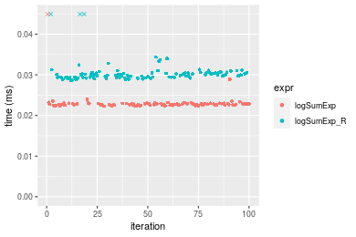

[matrixStats]: Benchmark report

---------------------------------------


# logSumExp() benchmarks

This report benchmark the performance of logSumExp() against alternative methods.

## Alternative methods

* logSumExp_R()

where

```r
> logSumExp_R <- function(lx, ...) {
+     iMax <- which.max(lx)
+     log1p(sum(exp(lx[-iMax] - lx[iMax]))) + lx[iMax]
+ }
```


## Data
```r
> rvector <- function(n, mode = c("logical", "double", "integer"), range = c(-100, +100), na_prob = 0) {
+     mode <- match.arg(mode)
+     if (mode == "logical") {
+         x <- sample(c(FALSE, TRUE), size = n, replace = TRUE)
+     }     else {
+         x <- runif(n, min = range[1], max = range[2])
+     }
+     storage.mode(x) <- mode
+     if (na_prob > 0) 
+         x[sample(n, size = na_prob * n)] <- NA
+     x
+ }
> rvectors <- function(scale = 10, seed = 1, ...) {
+     set.seed(seed)
+     data <- list()
+     data[[1]] <- rvector(n = scale * 100, ...)
+     data[[2]] <- rvector(n = scale * 1000, ...)
+     data[[3]] <- rvector(n = scale * 10000, ...)
+     data[[4]] <- rvector(n = scale * 1e+05, ...)
+     data[[5]] <- rvector(n = scale * 1e+06, ...)
+     names(data) <- sprintf("n = %d", sapply(data, FUN = length))
+     data
+ }
> data <- rvectors(mode = "double")
> data <- data[1:4]
```

## Results

### n = 1000 vector

```r
> x <- data[["n = 1000"]]
> gc()
           used  (Mb) gc trigger  (Mb) max used  (Mb)
Ncells  5276853 281.9   10014072 534.9 10014072 534.9
Vcells 13139797 100.3   36079799 275.3 55956209 427.0
> stats <- microbenchmark(logSumExp = logSumExp(x), logSumExp_R = logSumExp_R(x), unit = "ms")
```

_Table: Benchmarking of logSumExp() and logSumExp_R() on n = 1000 data. The top panel shows times in milliseconds and the bottom panel shows relative times._


|   |expr        |     min|        lq|      mean|   median|        uq|      max|
|:--|:-----------|-------:|---------:|---------:|--------:|---------:|--------:|
|1  |logSumExp   | 0.02363| 0.0238150| 0.0242594| 0.023959| 0.0241820| 0.047487|
|2  |logSumExp_R | 0.02937| 0.0299205| 0.0308444| 0.030275| 0.0306215| 0.062950|


|   |expr        |      min|       lq|     mean|   median|       uq|      max|
|:--|:-----------|--------:|--------:|--------:|--------:|--------:|--------:|
|1  |logSumExp   | 1.000000| 1.000000| 1.000000| 1.000000| 1.000000| 1.000000|
|2  |logSumExp_R | 1.242912| 1.256372| 1.271439| 1.263617| 1.266293| 1.325626|

_Figure: Benchmarking of logSumExp() and logSumExp_R() on n = 1000 data.  Outliers are displayed as crosses.  Times are in milliseconds._



### n = 10000 vector

```r
> x <- data[["n = 10000"]]
> gc()
           used  (Mb) gc trigger  (Mb) max used  (Mb)
Ncells  5274622 281.7   10014072 534.9 10014072 534.9
Vcells 10954836  83.6   36079799 275.3 55956209 427.0
> stats <- microbenchmark(logSumExp = logSumExp(x), logSumExp_R = logSumExp_R(x), unit = "ms")
```

_Table: Benchmarking of logSumExp() and logSumExp_R() on n = 10000 data. The top panel shows times in milliseconds and the bottom panel shows relative times._


|   |expr        |      min|        lq|      mean|   median|        uq|      max|
|:--|:-----------|--------:|---------:|---------:|--------:|---------:|--------:|
|1  |logSumExp   | 0.164073| 0.1756005| 0.1926990| 0.186173| 0.2090055| 0.241616|
|2  |logSumExp_R | 0.188733| 0.2052210| 0.2224624| 0.214844| 0.2403720| 0.284412|


|   |expr        |      min|       lq|     mean|   median|       uq|      max|
|:--|:-----------|--------:|--------:|--------:|--------:|--------:|--------:|
|1  |logSumExp   | 1.000000| 1.000000| 1.000000| 1.000000| 1.000000| 1.000000|
|2  |logSumExp_R | 1.150299| 1.168681| 1.154455| 1.154002| 1.150075| 1.177124|

_Figure: Benchmarking of logSumExp() and logSumExp_R() on n = 10000 data.  Outliers are displayed as crosses.  Times are in milliseconds._


### n = 100000 vector

```r
> x <- data[["n = 100000"]]
> gc()
           used  (Mb) gc trigger  (Mb) max used  (Mb)
Ncells  5274685 281.7   10014072 534.9 10014072 534.9
Vcells 10954878  83.6   36079799 275.3 55956209 427.0
> stats <- microbenchmark(logSumExp = logSumExp(x), logSumExp_R = logSumExp_R(x), unit = "ms")
```

_Table: Benchmarking of logSumExp() and logSumExp_R() on n = 100000 data. The top panel shows times in milliseconds and the bottom panel shows relative times._


|   |expr        |      min|       lq|     mean|   median|       uq|      max|
|:--|:-----------|--------:|--------:|--------:|--------:|--------:|--------:|
|1  |logSumExp   | 1.383647| 1.494358| 1.554475| 1.507747| 1.547846| 2.147978|
|2  |logSumExp_R | 1.922449| 2.233416| 2.279514| 2.284849| 2.305359| 2.829940|


|   |expr        |      min|       lq|     mean|   median|       uq|     max|
|:--|:-----------|--------:|--------:|--------:|--------:|--------:|-------:|
|1  |logSumExp   | 1.000000| 1.000000| 1.000000| 1.000000| 1.000000| 1.00000|
|2  |logSumExp_R | 1.389407| 1.494565| 1.466421| 1.515407| 1.489398| 1.31749|

_Figure: Benchmarking of logSumExp() and logSumExp_R() on n = 100000 data.  Outliers are displayed as crosses.  Times are in milliseconds._


### n = 1000000 vector

```r
> x <- data[["n = 1000000"]]
> gc()
           used  (Mb) gc trigger  (Mb) max used  (Mb)
Ncells  5274748 281.8   10014072 534.9 10014072 534.9
Vcells 10955433  83.6   36079799 275.3 55956209 427.0
> stats <- microbenchmark(logSumExp = logSumExp(x), logSumExp_R = logSumExp_R(x), unit = "ms")
```

_Table: Benchmarking of logSumExp() and logSumExp_R() on n = 1000000 data. The top panel shows times in milliseconds and the bottom panel shows relative times._


|   |expr        |      min|       lq|     mean|   median|       uq|       max|
|:--|:-----------|--------:|--------:|--------:|--------:|--------:|---------:|
|1  |logSumExp   | 14.11827| 15.43141| 15.58049| 15.55832| 15.66653|  21.07568|
|2  |logSumExp_R | 22.65165| 23.66279| 28.87874| 23.96369| 24.34453| 412.61758|


|   |expr        |      min|       lq|     mean|   median|       uq|     max|
|:--|:-----------|--------:|--------:|--------:|--------:|--------:|-------:|
|1  |logSumExp   | 1.000000| 1.000000| 1.000000| 1.000000| 1.000000|  1.0000|
|2  |logSumExp_R | 1.604421| 1.533418| 1.853519| 1.540249| 1.553919| 19.5779|

_Figure: Benchmarking of logSumExp() and logSumExp_R() on n = 1000000 data.  Outliers are displayed as crosses.  Times are in milliseconds._


## Appendix

### Session information
```r
R version 4.1.1 Patched (2021-08-10 r80727)
Platform: x86_64-pc-linux-gnu (64-bit)
Running under: Ubuntu 18.04.5 LTS

Matrix products: default
BLAS:   /home/hb/software/R-devel/R-4-1-branch/lib/R/lib/libRblas.so
LAPACK: /home/hb/software/R-devel/R-4-1-branch/lib/R/lib/libRlapack.so

locale:
 [1] LC_CTYPE=en_US.UTF-8       LC_NUMERIC=C              
 [3] LC_TIME=en_US.UTF-8        LC_COLLATE=en_US.UTF-8    
 [5] LC_MONETARY=en_US.UTF-8    LC_MESSAGES=en_US.UTF-8   
 [7] LC_PAPER=en_US.UTF-8       LC_NAME=C                 
 [9] LC_ADDRESS=C               LC_TELEPHONE=C            
[11] LC_MEASUREMENT=en_US.UTF-8 LC_IDENTIFICATION=C       

attached base packages:
[1] stats     graphics  grDevices utils     datasets  methods   base     

other attached packages:
[1] microbenchmark_1.4-7   matrixStats_0.60.1     ggplot2_3.3.5         
[4] knitr_1.33             R.devices_2.17.0       R.utils_2.10.1        
[7] R.oo_1.24.0            R.methodsS3_1.8.1-9001 history_0.0.1-9000    

loaded via a namespace (and not attached):
 [1] Biobase_2.52.0          httr_1.4.2              splines_4.1.1          
 [4] bit64_4.0.5             network_1.17.1          assertthat_0.2.1       
 [7] highr_0.9               stats4_4.1.1            blob_1.2.2             
[10] GenomeInfoDbData_1.2.6  robustbase_0.93-8       pillar_1.6.2           
[13] RSQLite_2.2.8           lattice_0.20-44         glue_1.4.2             
[16] digest_0.6.27           XVector_0.32.0          colorspace_2.0-2       
[19] Matrix_1.3-4            XML_3.99-0.7            pkgconfig_2.0.3        
[22] zlibbioc_1.38.0         genefilter_1.74.0       purrr_0.3.4            
[25] ergm_4.1.2              xtable_1.8-4            scales_1.1.1           
[28] tibble_3.1.4            annotate_1.70.0         KEGGREST_1.32.0        
[31] farver_2.1.0            generics_0.1.0          IRanges_2.26.0         
[34] ellipsis_0.3.2          cachem_1.0.6            withr_2.4.2            
[37] BiocGenerics_0.38.0     mime_0.11               survival_3.2-13        
[40] magrittr_2.0.1          crayon_1.4.1            statnet.common_4.5.0   
[43] memoise_2.0.0           laeken_0.5.1            fansi_0.5.0            
[46] R.cache_0.15.0          MASS_7.3-54             R.rsp_0.44.0           
[49] progressr_0.8.0         tools_4.1.1             lifecycle_1.0.0        
[52] S4Vectors_0.30.0        trust_0.1-8             munsell_0.5.0          
[55] tabby_0.0.1-9001        AnnotationDbi_1.54.1    Biostrings_2.60.2      
[58] compiler_4.1.1          GenomeInfoDb_1.28.1     rlang_0.4.11           
[61] grid_4.1.1              RCurl_1.98-1.4          cwhmisc_6.6            
[64] rappdirs_0.3.3          startup_0.15.0          labeling_0.4.2         
[67] bitops_1.0-7            base64enc_0.1-3         boot_1.3-28            
[70] gtable_0.3.0            DBI_1.1.1               markdown_1.1           
[73] R6_2.5.1                lpSolveAPI_5.5.2.0-17.7 rle_0.9.2              
[76] dplyr_1.0.7             fastmap_1.1.0           bit_4.0.4              
[79] utf8_1.2.2              parallel_4.1.1          Rcpp_1.0.7             
[82] vctrs_0.3.8             png_0.1-7               DEoptimR_1.0-9         
[85] tidyselect_1.1.1        xfun_0.25               coda_0.19-4            
```
Total processing time was 10.55 secs.


### Reproducibility
To reproduce this report, do:
```r
html <- matrixStats:::benchmark('logSumExp')
```

[RSP]: https://cran.r-project.org/package=R.rsp
[matrixStats]: https://cran.r-project.org/package=matrixStats

[StackOverflow:colMins?]: https://stackoverflow.com/questions/13676878 "Stack Overflow: fastest way to get Min from every column in a matrix?"
[StackOverflow:colSds?]: https://stackoverflow.com/questions/17549762 "Stack Overflow: Is there such 'colsd' in R?"
[StackOverflow:rowProds?]: https://stackoverflow.com/questions/20198801/ "Stack Overflow: Row product of matrix and column sum of matrix"

---------------------------------------
Copyright Henrik Bengtsson. Last updated on 2021-08-25 18:21:43 (+0200 UTC). Powered by [RSP].

<script>
 var link = document.createElement('link');
 link.rel = 'icon';
 link.href = "data:image/png;base64,iVBORw0KGgoAAAANSUhEUgAAACAAAAAgCAMAAABEpIrGAAAA21BMVEUAAAAAAP8AAP8AAP8AAP8AAP8AAP8AAP8AAP8AAP8AAP8AAP8AAP8AAP8AAP8AAP8AAP8AAP8AAP8AAP8AAP8AAP8AAP8AAP8AAP8AAP8AAP8AAP8AAP8AAP8AAP8AAP8AAP8AAP8AAP8AAP8AAP8AAP8AAP8AAP8AAP8AAP8BAf4CAv0DA/wdHeIeHuEfH+AgIN8hId4lJdomJtknJ9g+PsE/P8BAQL9yco10dIt1dYp3d4h4eIeVlWqWlmmXl2iYmGeZmWabm2Tn5xjo6Bfp6Rb39wj4+Af//wA2M9hbAAAASXRSTlMAAQIJCgsMJSYnKD4/QGRlZmhpamtsbautrrCxuru8y8zN5ebn6Pn6+///////////////////////////////////////////LsUNcQAAAS9JREFUOI29k21XgkAQhVcFytdSMqMETU26UVqGmpaiFbL//xc1cAhhwVNf6n5i5z67M2dmYOyfJZUqlVLhkKucG7cgmUZTybDz6g0iDeq51PUr37Ds2cy2/C9NeES5puDjxuUk1xnToZsg8pfA3avHQ3lLIi7iWRrkv/OYtkScxBIMgDee0ALoyxHQBJ68JLCjOtQIMIANF7QG9G9fNnHvisCHBVMKgSJgiz7nE+AoBKrAPA3MgepvgR9TSCasrCKH0eB1wBGBFdCO+nAGjMVGPcQb5bd6mQRegN6+1axOs9nGfYcCtfi4NQosdtH7dB+txFIpXQqN1p9B/asRHToyS0jRgpV7nk4nwcq1BJ+x3Gl/v7S9Wmpp/aGquum7w3ZDyrADFYrl8vHBH+ev9AUASW1dmU4h4wAAAABJRU5ErkJggg=="
 document.getElementsByTagName('head')[0].appendChild(link);
</script>


