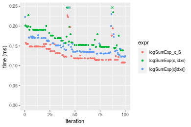

[matrixStats]: Benchmark report

---------------------------------------


# logSumExp() benchmarks on subsetted computation

This report benchmark the performance of logSumExp() on subsetted computation.


## Data
```r
> rvector <- function(n, mode = c("logical", "double", "integer"), range = c(-100, +100), na_prob = 0) {
+     mode <- match.arg(mode)
+     if (mode == "logical") {
+         x <- sample(c(FALSE, TRUE), size = n, replace = TRUE)
+     }     else {
+         x <- runif(n, min = range[1], max = range[2])
+     }
+     storage.mode(x) <- mode
+     if (na_prob > 0) 
+         x[sample(n, size = na_prob * n)] <- NA
+     x
+ }
> rvectors <- function(scale = 10, seed = 1, ...) {
+     set.seed(seed)
+     data <- list()
+     data[[1]] <- rvector(n = scale * 100, ...)
+     data[[2]] <- rvector(n = scale * 1000, ...)
+     data[[3]] <- rvector(n = scale * 10000, ...)
+     data[[4]] <- rvector(n = scale * 1e+05, ...)
+     data[[5]] <- rvector(n = scale * 1e+06, ...)
+     names(data) <- sprintf("n = %d", sapply(data, FUN = length))
+     data
+ }
> data <- rvectors(mode = "double")
> data <- data[1:4]
```

## Results

### n = 1000 vector

```r
> x <- data[["n = 1000"]]
> idxs <- sample.int(length(x), size = length(x) * 0.7)
> x_S <- x[idxs]
> gc()
           used  (Mb) gc trigger  (Mb) max used  (Mb)
Ncells  5344003 285.5    7916910 422.9  7916910 422.9
Vcells 11773401  89.9   36893127 281.5 57430649 438.2
> stats <- microbenchmark(logSumExp_x_S = logSumExp(x_S), `logSumExp(x, idxs)` = logSumExp(x, idxs = idxs), 
+     `logSumExp(x[idxs])` = logSumExp(x[idxs]), unit = "ms")
```

_Table: Benchmarking of logSumExp_x_S(), logSumExp(x, idxs)() and logSumExp(x[idxs])() on n = 1000 data. The top panel shows times in milliseconds and the bottom panel shows relative times._


|   |expr               |      min|        lq|      mean|    median|        uq|      max|
|:--|:------------------|--------:|---------:|---------:|---------:|---------:|--------:|
|1  |logSumExp_x_S      | 0.015992| 0.0167825| 0.0173882| 0.0168795| 0.0169820| 0.037199|
|3  |logSumExp(x[idxs]) | 0.018401| 0.0193560| 0.0214968| 0.0195630| 0.0197525| 0.119437|
|2  |logSumExp(x, idxs) | 0.019504| 0.0203955| 0.0205936| 0.0205040| 0.0206095| 0.030093|


|   |expr               |      min|       lq|     mean|   median|       uq|       max|
|:--|:------------------|--------:|--------:|--------:|--------:|--------:|---------:|
|1  |logSumExp_x_S      | 1.000000| 1.000000| 1.000000| 1.000000| 1.000000| 1.0000000|
|3  |logSumExp(x[idxs]) | 1.150638| 1.153344| 1.236287| 1.158980| 1.163143| 3.2107584|
|2  |logSumExp(x, idxs) | 1.219610| 1.215284| 1.184344| 1.214728| 1.213609| 0.8089734|

_Figure: Benchmarking of logSumExp_x_S(), logSumExp(x, idxs)() and logSumExp(x[idxs])() on n = 1000 data.  Outliers are displayed as crosses.  Times are in milliseconds._


### n = 10000 vector

```r
> x <- data[["n = 10000"]]
> idxs <- sample.int(length(x), size = length(x) * 0.7)
> x_S <- x[idxs]
> gc()
           used  (Mb) gc trigger  (Mb) max used  (Mb)
Ncells  5340765 285.3    7916910 422.9  7916910 422.9
Vcells 11439488  87.3   36893127 281.5 57430649 438.2
> stats <- microbenchmark(logSumExp_x_S = logSumExp(x_S), `logSumExp(x, idxs)` = logSumExp(x, idxs = idxs), 
+     `logSumExp(x[idxs])` = logSumExp(x[idxs]), unit = "ms")
```

_Table: Benchmarking of logSumExp_x_S(), logSumExp(x, idxs)() and logSumExp(x[idxs])() on n = 10000 data. The top panel shows times in milliseconds and the bottom panel shows relative times._


|   |expr               |      min|        lq|      mean|    median|       uq|      max|
|:--|:------------------|--------:|---------:|---------:|---------:|--------:|--------:|
|1  |logSumExp_x_S      | 0.107942| 0.1155185| 0.1326706| 0.1234485| 0.148291| 0.227294|
|3  |logSumExp(x[idxs]) | 0.122316| 0.1346590| 0.1504823| 0.1405490| 0.163293| 0.267099|
|2  |logSumExp(x, idxs) | 0.138869| 0.1499025| 0.1718531| 0.1632120| 0.190533| 0.282027|


|   |expr               |      min|       lq|     mean|   median|       uq|      max|
|:--|:------------------|--------:|--------:|--------:|--------:|--------:|--------:|
|1  |logSumExp_x_S      | 1.000000| 1.000000| 1.000000| 1.000000| 1.000000| 1.000000|
|3  |logSumExp(x[idxs]) | 1.133164| 1.165692| 1.134256| 1.138523| 1.101166| 1.175126|
|2  |logSumExp(x, idxs) | 1.286515| 1.297649| 1.295337| 1.322106| 1.284859| 1.240803|

_Figure: Benchmarking of logSumExp_x_S(), logSumExp(x, idxs)() and logSumExp(x[idxs])() on n = 10000 data.  Outliers are displayed as crosses.  Times are in milliseconds._



### n = 100000 vector

```r
> x <- data[["n = 100000"]]
> idxs <- sample.int(length(x), size = length(x) * 0.7)
> x_S <- x[idxs]
> gc()
           used  (Mb) gc trigger  (Mb) max used  (Mb)
Ncells  5340837 285.3    7916910 422.9  7916910 422.9
Vcells 11534548  88.1   36893127 281.5 57430649 438.2
> stats <- microbenchmark(logSumExp_x_S = logSumExp(x_S), `logSumExp(x, idxs)` = logSumExp(x, idxs = idxs), 
+     `logSumExp(x[idxs])` = logSumExp(x[idxs]), unit = "ms")
```

_Table: Benchmarking of logSumExp_x_S(), logSumExp(x, idxs)() and logSumExp(x[idxs])() on n = 100000 data. The top panel shows times in milliseconds and the bottom panel shows relative times._


|   |expr               |      min|        lq|      mean|    median|       uq|      max|
|:--|:------------------|--------:|---------:|---------:|---------:|--------:|--------:|
|1  |logSumExp_x_S      | 0.905993| 0.9066275| 0.9577668| 0.9084235| 0.921494| 1.597944|
|3  |logSumExp(x[idxs]) | 1.085253| 1.0978600| 1.1642811| 1.1007840| 1.109797| 1.930893|
|2  |logSumExp(x, idxs) | 1.463108| 1.4638735| 1.5068310| 1.4664320| 1.468910| 2.205679|


|   |expr               |      min|       lq|     mean|   median|       uq|      max|
|:--|:------------------|--------:|--------:|--------:|--------:|--------:|--------:|
|1  |logSumExp_x_S      | 1.000000| 1.000000| 1.000000| 1.000000| 1.000000| 1.000000|
|3  |logSumExp(x[idxs]) | 1.197860| 1.210927| 1.215621| 1.211752| 1.204346| 1.208361|
|2  |logSumExp(x, idxs) | 1.614922| 1.614636| 1.573276| 1.614260| 1.594053| 1.380323|

_Figure: Benchmarking of logSumExp_x_S(), logSumExp(x, idxs)() and logSumExp(x[idxs])() on n = 100000 data.  Outliers are displayed as crosses.  Times are in milliseconds._


### n = 1000000 vector

```r
> x <- data[["n = 1000000"]]
> idxs <- sample.int(length(x), size = length(x) * 0.7)
> x_S <- x[idxs]
> gc()
           used  (Mb) gc trigger  (Mb) max used  (Mb)
Ncells  5340909 285.3    7916910 422.9  7916910 422.9
Vcells 12479597  95.3   36893127 281.5 57430649 438.2
> stats <- microbenchmark(logSumExp_x_S = logSumExp(x_S), `logSumExp(x, idxs)` = logSumExp(x, idxs = idxs), 
+     `logSumExp(x[idxs])` = logSumExp(x[idxs]), unit = "ms")
```

_Table: Benchmarking of logSumExp_x_S(), logSumExp(x, idxs)() and logSumExp(x[idxs])() on n = 1000000 data. The top panel shows times in milliseconds and the bottom panel shows relative times._


|   |expr               |       min|       lq|     mean|   median|       uq|      max|
|:--|:------------------|---------:|--------:|--------:|--------:|--------:|--------:|
|1  |logSumExp_x_S      |  9.222615| 11.48087| 12.64326| 12.42652| 13.75433| 16.48410|
|3  |logSumExp(x[idxs]) | 18.627014| 21.55948| 23.33542| 22.88887| 24.69123| 38.75325|
|2  |logSumExp(x, idxs) | 34.404055| 40.45209| 46.56888| 46.82454| 51.61983| 66.48265|


|   |expr               |      min|       lq|     mean|   median|       uq|      max|
|:--|:------------------|--------:|--------:|--------:|--------:|--------:|--------:|
|1  |logSumExp_x_S      | 1.000000| 1.000000| 1.000000| 1.000000| 1.000000| 1.000000|
|3  |logSumExp(x[idxs]) | 2.019711| 1.877861| 1.845681| 1.841938| 1.795161| 2.350947|
|2  |logSumExp(x, idxs) | 3.730401| 3.523433| 3.683296| 3.768114| 3.752988| 4.033137|

_Figure: Benchmarking of logSumExp_x_S(), logSumExp(x, idxs)() and logSumExp(x[idxs])() on n = 1000000 data.  Outliers are displayed as crosses.  Times are in milliseconds._


## Appendix

### Session information
```r
R version 4.1.1 Patched (2021-08-10 r80727)
Platform: x86_64-pc-linux-gnu (64-bit)
Running under: Ubuntu 18.04.5 LTS

Matrix products: default
BLAS:   /home/hb/software/R-devel/R-4-1-branch/lib/R/lib/libRblas.so
LAPACK: /home/hb/software/R-devel/R-4-1-branch/lib/R/lib/libRlapack.so

locale:
 [1] LC_CTYPE=en_US.UTF-8       LC_NUMERIC=C              
 [3] LC_TIME=en_US.UTF-8        LC_COLLATE=en_US.UTF-8    
 [5] LC_MONETARY=en_US.UTF-8    LC_MESSAGES=en_US.UTF-8   
 [7] LC_PAPER=en_US.UTF-8       LC_NAME=C                 
 [9] LC_ADDRESS=C               LC_TELEPHONE=C            
[11] LC_MEASUREMENT=en_US.UTF-8 LC_IDENTIFICATION=C       

attached base packages:
[1] stats     graphics  grDevices utils     datasets  methods   base     

other attached packages:
[1] microbenchmark_1.4-7   matrixStats_0.60.0     ggplot2_3.3.5         
[4] knitr_1.33             R.devices_2.17.0       R.utils_2.10.1        
[7] R.oo_1.24.0            R.methodsS3_1.8.1-9001 history_0.0.1-9000    

loaded via a namespace (and not attached):
 [1] Biobase_2.52.0          httr_1.4.2              splines_4.1.1          
 [4] bit64_4.0.5             network_1.17.1          assertthat_0.2.1       
 [7] highr_0.9               stats4_4.1.1            blob_1.2.2             
[10] GenomeInfoDbData_1.2.6  robustbase_0.93-8       pillar_1.6.2           
[13] RSQLite_2.2.8           lattice_0.20-44         glue_1.4.2             
[16] digest_0.6.27           XVector_0.32.0          colorspace_2.0-2       
[19] Matrix_1.3-4            XML_3.99-0.7            pkgconfig_2.0.3        
[22] zlibbioc_1.38.0         genefilter_1.74.0       purrr_0.3.4            
[25] ergm_4.1.2              xtable_1.8-4            scales_1.1.1           
[28] tibble_3.1.4            annotate_1.70.0         KEGGREST_1.32.0        
[31] farver_2.1.0            generics_0.1.0          IRanges_2.26.0         
[34] ellipsis_0.3.2          cachem_1.0.6            withr_2.4.2            
[37] BiocGenerics_0.38.0     mime_0.11               survival_3.2-13        
[40] magrittr_2.0.1          crayon_1.4.1            statnet.common_4.5.0   
[43] memoise_2.0.0           laeken_0.5.1            fansi_0.5.0            
[46] R.cache_0.15.0          MASS_7.3-54             R.rsp_0.44.0           
[49] progressr_0.8.0         tools_4.1.1             lifecycle_1.0.0        
[52] S4Vectors_0.30.0        trust_0.1-8             munsell_0.5.0          
[55] tabby_0.0.1-9001        AnnotationDbi_1.54.1    Biostrings_2.60.2      
[58] compiler_4.1.1          GenomeInfoDb_1.28.1     rlang_0.4.11           
[61] grid_4.1.1              RCurl_1.98-1.4          cwhmisc_6.6            
[64] rstudioapi_0.13         rappdirs_0.3.3          startup_0.15.0-9000    
[67] labeling_0.4.2          bitops_1.0-7            base64enc_0.1-3        
[70] boot_1.3-28             gtable_0.3.0            DBI_1.1.1              
[73] markdown_1.1            R6_2.5.1                lpSolveAPI_5.5.2.0-17.7
[76] rle_0.9.2               dplyr_1.0.7             fastmap_1.1.0          
[79] bit_4.0.4               utf8_1.2.2              parallel_4.1.1         
[82] Rcpp_1.0.7              vctrs_0.3.8             png_0.1-7              
[85] DEoptimR_1.0-9          tidyselect_1.1.1        xfun_0.25              
[88] coda_0.19-4            
```
Total processing time was 12.95 secs.


### Reproducibility
To reproduce this report, do:
```r
html <- matrixStats:::benchmark('logSumExp_subset')
```

[RSP]: https://cran.r-project.org/package=R.rsp
[matrixStats]: https://cran.r-project.org/package=matrixStats

[StackOverflow:colMins?]: https://stackoverflow.com/questions/13676878 "Stack Overflow: fastest way to get Min from every column in a matrix?"
[StackOverflow:colSds?]: https://stackoverflow.com/questions/17549762 "Stack Overflow: Is there such 'colsd' in R?"
[StackOverflow:rowProds?]: https://stackoverflow.com/questions/20198801/ "Stack Overflow: Row product of matrix and column sum of matrix"

---------------------------------------
Copyright Dongcan Jiang. Last updated on 2021-08-25 22:35:17 (+0200 UTC). Powered by [RSP].

<script>
 var link = document.createElement('link');
 link.rel = 'icon';
 link.href = "data:image/png;base64,iVBORw0KGgoAAAANSUhEUgAAACAAAAAgCAMAAABEpIrGAAAA21BMVEUAAAAAAP8AAP8AAP8AAP8AAP8AAP8AAP8AAP8AAP8AAP8AAP8AAP8AAP8AAP8AAP8AAP8AAP8AAP8AAP8AAP8AAP8AAP8AAP8AAP8AAP8AAP8AAP8AAP8AAP8AAP8AAP8AAP8AAP8AAP8AAP8AAP8AAP8AAP8AAP8AAP8AAP8BAf4CAv0DA/wdHeIeHuEfH+AgIN8hId4lJdomJtknJ9g+PsE/P8BAQL9yco10dIt1dYp3d4h4eIeVlWqWlmmXl2iYmGeZmWabm2Tn5xjo6Bfp6Rb39wj4+Af//wA2M9hbAAAASXRSTlMAAQIJCgsMJSYnKD4/QGRlZmhpamtsbautrrCxuru8y8zN5ebn6Pn6+///////////////////////////////////////////LsUNcQAAAS9JREFUOI29k21XgkAQhVcFytdSMqMETU26UVqGmpaiFbL//xc1cAhhwVNf6n5i5z67M2dmYOyfJZUqlVLhkKucG7cgmUZTybDz6g0iDeq51PUr37Ds2cy2/C9NeES5puDjxuUk1xnToZsg8pfA3avHQ3lLIi7iWRrkv/OYtkScxBIMgDee0ALoyxHQBJ68JLCjOtQIMIANF7QG9G9fNnHvisCHBVMKgSJgiz7nE+AoBKrAPA3MgepvgR9TSCasrCKH0eB1wBGBFdCO+nAGjMVGPcQb5bd6mQRegN6+1axOs9nGfYcCtfi4NQosdtH7dB+txFIpXQqN1p9B/asRHToyS0jRgpV7nk4nwcq1BJ+x3Gl/v7S9Wmpp/aGquum7w3ZDyrADFYrl8vHBH+ev9AUASW1dmU4h4wAAAABJRU5ErkJggg=="
 document.getElementsByTagName('head')[0].appendChild(link);
</script>


