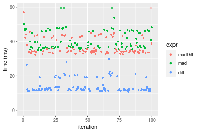
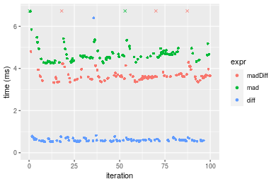

[matrixStats]: Benchmark report

---------------------------------------


# madDiff() benchmarks

This report benchmark the performance of madDiff() against alternative methods.

## Alternative methods

* N/A


## Data type "integer"
### Data
```r
> rvector <- function(n, mode = c("logical", "double", "integer"), range = c(-100, +100), na_prob = 0) {
+     mode <- match.arg(mode)
+     if (mode == "logical") {
+         x <- sample(c(FALSE, TRUE), size = n, replace = TRUE)
+     }     else {
+         x <- runif(n, min = range[1], max = range[2])
+     }
+     storage.mode(x) <- mode
+     if (na_prob > 0) 
+         x[sample(n, size = na_prob * n)] <- NA
+     x
+ }
> rvectors <- function(scale = 10, seed = 1, ...) {
+     set.seed(seed)
+     data <- list()
+     data[[1]] <- rvector(n = scale * 100, ...)
+     data[[2]] <- rvector(n = scale * 1000, ...)
+     data[[3]] <- rvector(n = scale * 10000, ...)
+     data[[4]] <- rvector(n = scale * 1e+05, ...)
+     data[[5]] <- rvector(n = scale * 1e+06, ...)
+     names(data) <- sprintf("n = %d", sapply(data, FUN = length))
+     data
+ }
> data <- rvectors(mode = mode)
> data <- data[1:4]
```

### Results

### n = 1000 vector

#### All elements
```r
> x <- data[["n = 1000"]]
> stats <- microbenchmark(madDiff = madDiff(x), mad = mad(x), diff = diff(x), unit = "ms")
```

_Table: Benchmarking of madDiff(), mad() and diff() on integer+n = 1000 data. The top panel shows times in milliseconds and the bottom panel shows relative times._


|   |expr    |      min|        lq|      mean|    median|        uq|      max|
|:--|:-------|--------:|---------:|---------:|---------:|---------:|--------:|
|3  |diff    | 0.018767| 0.0231650| 0.0253068| 0.0248335| 0.0273700| 0.040044|
|1  |madDiff | 0.092016| 0.0986185| 0.1110708| 0.1105605| 0.1231885| 0.151665|
|2  |mad     | 0.107037| 0.1189425| 0.1308682| 0.1291255| 0.1400280| 0.275417|


|   |expr    |      min|       lq|     mean|   median|       uq|      max|
|:--|:-------|--------:|--------:|--------:|--------:|--------:|--------:|
|3  |diff    | 1.000000| 1.000000| 1.000000| 1.000000| 1.000000| 1.000000|
|1  |madDiff | 4.903074| 4.257220| 4.388962| 4.452071| 4.500859| 3.787459|
|2  |mad     | 5.703469| 5.134578| 5.171258| 5.199650| 5.116112| 6.877859|

_Figure: Benchmarking of madDiff(), mad() and diff() on integer+n = 1000 data.  Outliers are displayed as crosses.  Times are in milliseconds._


### n = 10000 vector

#### All elements
```r
> x <- data[["n = 10000"]]
> stats <- microbenchmark(madDiff = madDiff(x), mad = mad(x), diff = diff(x), unit = "ms")
```

_Table: Benchmarking of madDiff(), mad() and diff() on integer+n = 10000 data. The top panel shows times in milliseconds and the bottom panel shows relative times._


|   |expr    |      min|        lq|      mean|   median|        uq|      max|
|:--|:-------|--------:|---------:|---------:|--------:|---------:|--------:|
|3  |diff    | 0.112008| 0.1190410| 0.1346192| 0.126125| 0.1444330| 0.211025|
|1  |madDiff | 0.327303| 0.3328905| 0.3857618| 0.338831| 0.4275240| 0.655837|
|2  |mad     | 0.411850| 0.4206475| 0.4807517| 0.431365| 0.5258605| 0.746280|


|   |expr    |      min|       lq|     mean|   median|       uq|      max|
|:--|:-------|--------:|--------:|--------:|--------:|--------:|--------:|
|3  |diff    | 1.000000| 1.000000| 1.000000| 1.000000| 1.000000| 1.000000|
|1  |madDiff | 2.922140| 2.796436| 2.865578| 2.686470| 2.960016| 3.107864|
|2  |mad     | 3.676969| 3.533635| 3.571197| 3.420139| 3.640861| 3.536453|

_Figure: Benchmarking of madDiff(), mad() and diff() on integer+n = 10000 data.  Outliers are displayed as crosses.  Times are in milliseconds._


### n = 100000 vector

#### All elements
```r
> x <- data[["n = 100000"]]
> stats <- microbenchmark(madDiff = madDiff(x), mad = mad(x), diff = diff(x), unit = "ms")
```

_Table: Benchmarking of madDiff(), mad() and diff() on integer+n = 100000 data. The top panel shows times in milliseconds and the bottom panel shows relative times._


|   |expr    |      min|       lq|     mean|   median|       uq|       max|
|:--|:-------|--------:|--------:|--------:|--------:|--------:|---------:|
|3  |diff    | 1.109217| 1.178817| 1.601809| 1.249338| 1.996576|  8.068402|
|1  |madDiff | 2.608344| 2.893647| 3.187560| 2.967735| 3.629499|  4.456352|
|2  |mad     | 3.370880| 3.716534| 4.424291| 4.195974| 4.606384| 17.683648|


|   |expr    |      min|       lq|     mean|   median|       uq|       max|
|:--|:-------|--------:|--------:|--------:|--------:|--------:|---------:|
|3  |diff    | 1.000000| 1.000000| 1.000000| 1.000000| 1.000000| 1.0000000|
|1  |madDiff | 2.351518| 2.454704| 1.989975| 2.375445| 1.817862| 0.5523215|
|2  |mad     | 3.038972| 3.152766| 2.762058| 3.358557| 2.307143| 2.1917163|

_Figure: Benchmarking of madDiff(), mad() and diff() on integer+n = 100000 data.  Outliers are displayed as crosses.  Times are in milliseconds._


### n = 1000000 vector

#### All elements
```r
> x <- data[["n = 1000000"]]
> stats <- microbenchmark(madDiff = madDiff(x), mad = mad(x), diff = diff(x), unit = "ms")
```

_Table: Benchmarking of madDiff(), mad() and diff() on integer+n = 1000000 data. The top panel shows times in milliseconds and the bottom panel shows relative times._


|   |expr    |      min|       lq|     mean|   median|       uq|       max|
|:--|:-------|--------:|--------:|--------:|--------:|--------:|---------:|
|3  |diff    | 11.04763| 11.81992| 14.44155| 12.34955| 16.62525|  29.71610|
|1  |madDiff | 32.44946| 33.97319| 41.23050| 34.63759| 42.31104| 444.32295|
|2  |mad     | 35.01356| 36.80087| 41.85479| 38.95332| 46.30287|  81.67478|


|   |expr    |      min|       lq|     mean|   median|       uq|       max|
|:--|:-------|--------:|--------:|--------:|--------:|--------:|---------:|
|3  |diff    | 1.000000| 1.000000| 1.000000| 1.000000| 1.000000|  1.000000|
|1  |madDiff | 2.937234| 2.874232| 2.854992| 2.804765| 2.544986| 14.952261|
|2  |mad     | 3.169329| 3.113462| 2.898221| 3.154229| 2.785093|  2.748502|

_Figure: Benchmarking of madDiff(), mad() and diff() on integer+n = 1000000 data.  Outliers are displayed as crosses.  Times are in milliseconds._




## Data type "double"
### Data
```r
> rvector <- function(n, mode = c("logical", "double", "integer"), range = c(-100, +100), na_prob = 0) {
+     mode <- match.arg(mode)
+     if (mode == "logical") {
+         x <- sample(c(FALSE, TRUE), size = n, replace = TRUE)
+     }     else {
+         x <- runif(n, min = range[1], max = range[2])
+     }
+     storage.mode(x) <- mode
+     if (na_prob > 0) 
+         x[sample(n, size = na_prob * n)] <- NA
+     x
+ }
> rvectors <- function(scale = 10, seed = 1, ...) {
+     set.seed(seed)
+     data <- list()
+     data[[1]] <- rvector(n = scale * 100, ...)
+     data[[2]] <- rvector(n = scale * 1000, ...)
+     data[[3]] <- rvector(n = scale * 10000, ...)
+     data[[4]] <- rvector(n = scale * 1e+05, ...)
+     data[[5]] <- rvector(n = scale * 1e+06, ...)
+     names(data) <- sprintf("n = %d", sapply(data, FUN = length))
+     data
+ }
> data <- rvectors(mode = mode)
> data <- data[1:4]
```

### Results

### n = 1000 vector

#### All elements
```r
> x <- data[["n = 1000"]]
> stats <- microbenchmark(madDiff = madDiff(x), mad = mad(x), diff = diff(x), unit = "ms")
```

_Table: Benchmarking of madDiff(), mad() and diff() on double+n = 1000 data. The top panel shows times in milliseconds and the bottom panel shows relative times._


|   |expr    |      min|        lq|      mean|   median|       uq|      max|
|:--|:-------|--------:|---------:|---------:|--------:|--------:|--------:|
|3  |diff    | 0.013108| 0.0156105| 0.0175863| 0.016575| 0.018627| 0.035798|
|1  |madDiff | 0.110005| 0.1140300| 0.1274836| 0.124992| 0.139961| 0.174583|
|2  |mad     | 0.117293| 0.1291395| 0.1404472| 0.141437| 0.148812| 0.293020|


|   |expr    |      min|       lq|     mean|   median|       uq|      max|
|:--|:-------|--------:|--------:|--------:|--------:|--------:|--------:|
|3  |diff    | 1.000000| 1.000000| 1.000000| 1.000000| 1.000000| 1.000000|
|1  |madDiff | 8.392203| 7.304699| 7.249051| 7.540996| 7.513878| 4.876893|
|2  |mad     | 8.948200| 8.272605| 7.986194| 8.533152| 7.989048| 8.185374|

_Figure: Benchmarking of madDiff(), mad() and diff() on double+n = 1000 data.  Outliers are displayed as crosses.  Times are in milliseconds._


### n = 10000 vector

#### All elements
```r
> x <- data[["n = 10000"]]
> stats <- microbenchmark(madDiff = madDiff(x), mad = mad(x), diff = diff(x), unit = "ms")
```

_Table: Benchmarking of madDiff(), mad() and diff() on double+n = 10000 data. The top panel shows times in milliseconds and the bottom panel shows relative times._


|   |expr    |      min|        lq|      mean|    median|        uq|      max|
|:--|:-------|--------:|---------:|---------:|---------:|---------:|--------:|
|3  |diff    | 0.052420| 0.0657780| 0.0711756| 0.0684290| 0.0757170| 0.108527|
|2  |mad     | 0.436525| 0.4495135| 0.5078273| 0.4580255| 0.5511330| 0.792393|
|1  |madDiff | 0.488370| 0.5050310| 0.5750690| 0.5110170| 0.6329265| 0.945029|


|   |expr    |      min|       lq|     mean|   median|       uq|      max|
|:--|:-------|--------:|--------:|--------:|--------:|--------:|--------:|
|3  |diff    | 1.000000| 1.000000| 1.000000| 1.000000| 1.000000| 1.000000|
|2  |mad     | 8.327451| 6.833797| 7.134849| 6.693441| 7.278854| 7.301344|
|1  |madDiff | 9.316482| 7.677810| 8.079578| 7.467843| 8.359107| 8.707778|

_Figure: Benchmarking of madDiff(), mad() and diff() on double+n = 10000 data.  Outliers are displayed as crosses.  Times are in milliseconds._


### n = 100000 vector

#### All elements
```r
> x <- data[["n = 100000"]]
> stats <- microbenchmark(madDiff = madDiff(x), mad = mad(x), diff = diff(x), unit = "ms")
```

_Table: Benchmarking of madDiff(), mad() and diff() on double+n = 100000 data. The top panel shows times in milliseconds and the bottom panel shows relative times._


|   |expr    |      min|        lq|      mean|   median|        uq|       max|
|:--|:-------|--------:|---------:|---------:|--------:|---------:|---------:|
|3  |diff    | 0.517747| 0.5573075| 0.6635397| 0.584073| 0.6394385|  6.394521|
|1  |madDiff | 3.331675| 3.5211060| 3.8442516| 3.611360| 3.7046145| 10.335326|
|2  |mad     | 4.246693| 4.4425925| 4.7458903| 4.604933| 4.7732830| 10.507083|


|   |expr    |      min|       lq|     mean|   median|       uq|      max|
|:--|:-------|--------:|--------:|--------:|--------:|--------:|--------:|
|3  |diff    | 1.000000| 1.000000| 1.000000| 1.000000| 1.000000| 1.000000|
|1  |madDiff | 6.434948| 6.318067| 5.793552| 6.183064| 5.793543| 1.616278|
|2  |mad     | 8.202255| 7.971528| 7.152384| 7.884175| 7.464804| 1.643138|

_Figure: Benchmarking of madDiff(), mad() and diff() on double+n = 100000 data.  Outliers are displayed as crosses.  Times are in milliseconds._



### n = 1000000 vector

#### All elements
```r
> x <- data[["n = 1000000"]]
> stats <- microbenchmark(madDiff = madDiff(x), mad = mad(x), diff = diff(x), unit = "ms")
```

_Table: Benchmarking of madDiff(), mad() and diff() on double+n = 1000000 data. The top panel shows times in milliseconds and the bottom panel shows relative times._


|   |expr    |       min|        lq|     mean|    median|       uq|       max|
|:--|:-------|---------:|---------:|--------:|---------:|--------:|---------:|
|3  |diff    |  6.467412|  7.319129| 10.30967|  7.688428| 13.78460|  25.29299|
|2  |mad     | 35.638038| 38.530104| 42.55627| 41.443557| 44.88876|  62.42188|
|1  |madDiff | 36.931001| 39.894058| 47.82656| 42.899650| 47.32208| 438.69708|


|   |expr    |      min|       lq|     mean|   median|       uq|       max|
|:--|:-------|--------:|--------:|--------:|--------:|--------:|---------:|
|3  |diff    | 1.000000| 1.000000| 1.000000| 1.000000| 1.000000|  1.000000|
|2  |mad     | 5.510402| 5.264302| 4.127803| 5.390381| 3.256442|  2.467952|
|1  |madDiff | 5.710321| 5.450657| 4.639003| 5.579768| 3.432966| 17.344613|

_Figure: Benchmarking of madDiff(), mad() and diff() on double+n = 1000000 data.  Outliers are displayed as crosses.  Times are in milliseconds._


## Appendix

### Session information
```r
R version 4.1.1 Patched (2021-08-10 r80727)
Platform: x86_64-pc-linux-gnu (64-bit)
Running under: Ubuntu 18.04.5 LTS

Matrix products: default
BLAS:   /home/hb/software/R-devel/R-4-1-branch/lib/R/lib/libRblas.so
LAPACK: /home/hb/software/R-devel/R-4-1-branch/lib/R/lib/libRlapack.so

locale:
 [1] LC_CTYPE=en_US.UTF-8       LC_NUMERIC=C              
 [3] LC_TIME=en_US.UTF-8        LC_COLLATE=en_US.UTF-8    
 [5] LC_MONETARY=en_US.UTF-8    LC_MESSAGES=en_US.UTF-8   
 [7] LC_PAPER=en_US.UTF-8       LC_NAME=C                 
 [9] LC_ADDRESS=C               LC_TELEPHONE=C            
[11] LC_MEASUREMENT=en_US.UTF-8 LC_IDENTIFICATION=C       

attached base packages:
[1] stats     graphics  grDevices utils     datasets  methods   base     

other attached packages:
[1] microbenchmark_1.4-7   matrixStats_0.60.0     ggplot2_3.3.5         
[4] knitr_1.33             R.devices_2.17.0       R.utils_2.10.1        
[7] R.oo_1.24.0            R.methodsS3_1.8.1-9001 history_0.0.1-9000    

loaded via a namespace (and not attached):
 [1] Biobase_2.52.0          httr_1.4.2              splines_4.1.1          
 [4] bit64_4.0.5             network_1.17.1          assertthat_0.2.1       
 [7] highr_0.9               stats4_4.1.1            blob_1.2.2             
[10] GenomeInfoDbData_1.2.6  robustbase_0.93-8       pillar_1.6.2           
[13] RSQLite_2.2.8           lattice_0.20-44         glue_1.4.2             
[16] digest_0.6.27           XVector_0.32.0          colorspace_2.0-2       
[19] Matrix_1.3-4            XML_3.99-0.7            pkgconfig_2.0.3        
[22] zlibbioc_1.38.0         genefilter_1.74.0       purrr_0.3.4            
[25] ergm_4.1.2              xtable_1.8-4            scales_1.1.1           
[28] tibble_3.1.4            annotate_1.70.0         KEGGREST_1.32.0        
[31] farver_2.1.0            generics_0.1.0          IRanges_2.26.0         
[34] ellipsis_0.3.2          cachem_1.0.6            withr_2.4.2            
[37] BiocGenerics_0.38.0     mime_0.11               survival_3.2-13        
[40] magrittr_2.0.1          crayon_1.4.1            statnet.common_4.5.0   
[43] memoise_2.0.0           laeken_0.5.1            fansi_0.5.0            
[46] R.cache_0.15.0          MASS_7.3-54             R.rsp_0.44.0           
[49] progressr_0.8.0         tools_4.1.1             lifecycle_1.0.0        
[52] S4Vectors_0.30.0        trust_0.1-8             munsell_0.5.0          
[55] tabby_0.0.1-9001        AnnotationDbi_1.54.1    Biostrings_2.60.2      
[58] compiler_4.1.1          GenomeInfoDb_1.28.1     rlang_0.4.11           
[61] grid_4.1.1              RCurl_1.98-1.4          cwhmisc_6.6            
[64] rstudioapi_0.13         rappdirs_0.3.3          startup_0.15.0-9000    
[67] labeling_0.4.2          bitops_1.0-7            base64enc_0.1-3        
[70] boot_1.3-28             gtable_0.3.0            DBI_1.1.1              
[73] markdown_1.1            R6_2.5.1                lpSolveAPI_5.5.2.0-17.7
[76] rle_0.9.2               dplyr_1.0.7             fastmap_1.1.0          
[79] bit_4.0.4               utf8_1.2.2              parallel_4.1.1         
[82] Rcpp_1.0.7              vctrs_0.3.8             png_0.1-7              
[85] DEoptimR_1.0-9          tidyselect_1.1.1        xfun_0.25              
[88] coda_0.19-4            
```
Total processing time was 30.23 secs.


### Reproducibility
To reproduce this report, do:
```r
html <- matrixStats:::benchmark('madDiff')
```

[RSP]: https://cran.r-project.org/package=R.rsp
[matrixStats]: https://cran.r-project.org/package=matrixStats

[StackOverflow:colMins?]: https://stackoverflow.com/questions/13676878 "Stack Overflow: fastest way to get Min from every column in a matrix?"
[StackOverflow:colSds?]: https://stackoverflow.com/questions/17549762 "Stack Overflow: Is there such 'colsd' in R?"
[StackOverflow:rowProds?]: https://stackoverflow.com/questions/20198801/ "Stack Overflow: Row product of matrix and column sum of matrix"

---------------------------------------
Copyright Henrik Bengtsson. Last updated on 2021-08-25 22:40:59 (+0200 UTC). Powered by [RSP].

<script>
 var link = document.createElement('link');
 link.rel = 'icon';
 link.href = "data:image/png;base64,iVBORw0KGgoAAAANSUhEUgAAACAAAAAgCAMAAABEpIrGAAAA21BMVEUAAAAAAP8AAP8AAP8AAP8AAP8AAP8AAP8AAP8AAP8AAP8AAP8AAP8AAP8AAP8AAP8AAP8AAP8AAP8AAP8AAP8AAP8AAP8AAP8AAP8AAP8AAP8AAP8AAP8AAP8AAP8AAP8AAP8AAP8AAP8AAP8AAP8AAP8AAP8AAP8AAP8AAP8BAf4CAv0DA/wdHeIeHuEfH+AgIN8hId4lJdomJtknJ9g+PsE/P8BAQL9yco10dIt1dYp3d4h4eIeVlWqWlmmXl2iYmGeZmWabm2Tn5xjo6Bfp6Rb39wj4+Af//wA2M9hbAAAASXRSTlMAAQIJCgsMJSYnKD4/QGRlZmhpamtsbautrrCxuru8y8zN5ebn6Pn6+///////////////////////////////////////////LsUNcQAAAS9JREFUOI29k21XgkAQhVcFytdSMqMETU26UVqGmpaiFbL//xc1cAhhwVNf6n5i5z67M2dmYOyfJZUqlVLhkKucG7cgmUZTybDz6g0iDeq51PUr37Ds2cy2/C9NeES5puDjxuUk1xnToZsg8pfA3avHQ3lLIi7iWRrkv/OYtkScxBIMgDee0ALoyxHQBJ68JLCjOtQIMIANF7QG9G9fNnHvisCHBVMKgSJgiz7nE+AoBKrAPA3MgepvgR9TSCasrCKH0eB1wBGBFdCO+nAGjMVGPcQb5bd6mQRegN6+1axOs9nGfYcCtfi4NQosdtH7dB+txFIpXQqN1p9B/asRHToyS0jRgpV7nk4nwcq1BJ+x3Gl/v7S9Wmpp/aGquum7w3ZDyrADFYrl8vHBH+ev9AUASW1dmU4h4wAAAABJRU5ErkJggg=="
 document.getElementsByTagName('head')[0].appendChild(link);
</script>


