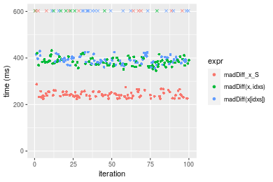

[matrixStats]: Benchmark report

---------------------------------------


# madDiff() benchmarks on subsetted computation

This report benchmark the performance of madDiff() on subsetted computation.


## Data type "integer"
### Data
```r
> rvector <- function(n, mode = c("logical", "double", "integer"), range = c(-100, +100), na_prob = 0) {
+     mode <- match.arg(mode)
+     if (mode == "logical") {
+         x <- sample(c(FALSE, TRUE), size = n, replace = TRUE)
+     }     else {
+         x <- runif(n, min = range[1], max = range[2])
+     }
+     storage.mode(x) <- mode
+     if (na_prob > 0) 
+         x[sample(n, size = na_prob * n)] <- NA
+     x
+ }
> rvectors <- function(scale = 10, seed = 1, ...) {
+     set.seed(seed)
+     data <- list()
+     data[[1]] <- rvector(n = scale * 100, ...)
+     data[[2]] <- rvector(n = scale * 1000, ...)
+     data[[3]] <- rvector(n = scale * 10000, ...)
+     data[[4]] <- rvector(n = scale * 1e+05, ...)
+     data[[5]] <- rvector(n = scale * 1e+06, ...)
+     names(data) <- sprintf("n = %d", sapply(data, FUN = length))
+     data
+ }
> data <- rvectors(mode = mode)
```

### Results

### n = 1000 vector


```r
> x <- data[["n = 1000"]]
> idxs <- sample.int(length(x), size = length(x) * 0.7)
> x_S <- x[idxs]
> gc()
           used  (Mb) gc trigger  (Mb) max used  (Mb)
Ncells  5344253 285.5    7916910 422.9  7916910 422.9
Vcells 17011428 129.8   36893127 281.5 57430649 438.2
> stats <- microbenchmark(madDiff_x_S = madDiff(x_S), `madDiff(x, idxs)` = madDiff(x, idxs = idxs), 
+     `madDiff(x[idxs])` = madDiff(x[idxs]), unit = "ms")
```

_Table: Benchmarking of madDiff_x_S(), madDiff(x, idxs)() and madDiff(x[idxs])() on integer+n = 1000 data. The top panel shows times in milliseconds and the bottom panel shows relative times._


|   |expr             |      min|        lq|      mean|   median|        uq|      max|
|:--|:----------------|--------:|---------:|---------:|--------:|---------:|--------:|
|1  |madDiff_x_S      | 0.076442| 0.0799290| 0.0881440| 0.084452| 0.0942640| 0.146663|
|2  |madDiff(x, idxs) | 0.079360| 0.0860325| 0.0954273| 0.092769| 0.1014305| 0.166170|
|3  |madDiff(x[idxs]) | 0.079384| 0.0846570| 0.1001273| 0.092774| 0.1021840| 0.528362|


|   |expr             |      min|       lq|     mean|   median|       uq|      max|
|:--|:----------------|--------:|--------:|--------:|--------:|--------:|--------:|
|1  |madDiff_x_S      | 1.000000| 1.000000| 1.000000| 1.000000| 1.000000| 1.000000|
|2  |madDiff(x, idxs) | 1.038173| 1.076361| 1.082629| 1.098482| 1.076026| 1.133006|
|3  |madDiff(x[idxs]) | 1.038487| 1.059152| 1.135951| 1.098541| 1.084019| 3.602558|

_Figure: Benchmarking of madDiff_x_S(), madDiff(x, idxs)() and madDiff(x[idxs])() on integer+n = 1000 data.  Outliers are displayed as crosses.  Times are in milliseconds._


### n = 10000 vector


```r
> x <- data[["n = 10000"]]
> idxs <- sample.int(length(x), size = length(x) * 0.7)
> x_S <- x[idxs]
> gc()
           used  (Mb) gc trigger  (Mb) max used  (Mb)
Ncells  5341851 285.3    7916910 422.9  7916910 422.9
Vcells 15882129 121.2   36893127 281.5 57430649 438.2
> stats <- microbenchmark(madDiff_x_S = madDiff(x_S), `madDiff(x, idxs)` = madDiff(x, idxs = idxs), 
+     `madDiff(x[idxs])` = madDiff(x[idxs]), unit = "ms")
```

_Table: Benchmarking of madDiff_x_S(), madDiff(x, idxs)() and madDiff(x[idxs])() on integer+n = 10000 data. The top panel shows times in milliseconds and the bottom panel shows relative times._


|   |expr             |      min|        lq|      mean|    median|        uq|      max|
|:--|:----------------|--------:|---------:|---------:|---------:|---------:|--------:|
|1  |madDiff_x_S      | 0.241986| 0.2458525| 0.2896286| 0.2729940| 0.3160605| 0.421982|
|3  |madDiff(x[idxs]) | 0.255741| 0.2593270| 0.2991417| 0.2801310| 0.3266175| 0.555078|
|2  |madDiff(x, idxs) | 0.256148| 0.2596000| 0.3065501| 0.2874185| 0.3367050| 0.453426|


|   |expr             |      min|       lq|     mean|   median|       uq|      max|
|:--|:----------------|--------:|--------:|--------:|--------:|--------:|--------:|
|1  |madDiff_x_S      | 1.000000| 1.000000| 1.000000| 1.000000| 1.000000| 1.000000|
|3  |madDiff(x[idxs]) | 1.056842| 1.054807| 1.032846| 1.026143| 1.033402| 1.315407|
|2  |madDiff(x, idxs) | 1.058524| 1.055918| 1.058425| 1.052838| 1.065318| 1.074515|

_Figure: Benchmarking of madDiff_x_S(), madDiff(x, idxs)() and madDiff(x[idxs])() on integer+n = 10000 data.  Outliers are displayed as crosses.  Times are in milliseconds._


### n = 100000 vector


```r
> x <- data[["n = 100000"]]
> idxs <- sample.int(length(x), size = length(x) * 0.7)
> x_S <- x[idxs]
> gc()
           used  (Mb) gc trigger  (Mb) max used  (Mb)
Ncells  5341923 285.3    7916910 422.9  7916910 422.9
Vcells 15945689 121.7   36893127 281.5 57430649 438.2
> stats <- microbenchmark(madDiff_x_S = madDiff(x_S), `madDiff(x, idxs)` = madDiff(x, idxs = idxs), 
+     `madDiff(x[idxs])` = madDiff(x[idxs]), unit = "ms")
```

_Table: Benchmarking of madDiff_x_S(), madDiff(x, idxs)() and madDiff(x[idxs])() on integer+n = 100000 data. The top panel shows times in milliseconds and the bottom panel shows relative times._


|   |expr             |      min|       lq|     mean|   median|       uq|      max|
|:--|:----------------|--------:|--------:|--------:|--------:|--------:|--------:|
|1  |madDiff_x_S      | 2.129314| 2.160170| 2.517114| 2.199688| 2.609695| 9.828779|
|2  |madDiff(x, idxs) | 2.286819| 2.313893| 2.534705| 2.338712| 2.615870| 8.736546|
|3  |madDiff(x[idxs]) | 2.284914| 2.316596| 2.636846| 2.380107| 2.775296| 8.292508|


|   |expr             |      min|       lq|     mean|   median|       uq|       max|
|:--|:----------------|--------:|--------:|--------:|--------:|--------:|---------:|
|1  |madDiff_x_S      | 1.000000| 1.000000| 1.000000| 1.000000| 1.000000| 1.0000000|
|2  |madDiff(x, idxs) | 1.073970| 1.071162| 1.006988| 1.063202| 1.002366| 0.8888740|
|3  |madDiff(x[idxs]) | 1.073075| 1.072413| 1.047567| 1.082021| 1.063456| 0.8436967|

_Figure: Benchmarking of madDiff_x_S(), madDiff(x, idxs)() and madDiff(x[idxs])() on integer+n = 100000 data.  Outliers are displayed as crosses.  Times are in milliseconds._


### n = 1000000 vector


```r
> x <- data[["n = 1000000"]]
> idxs <- sample.int(length(x), size = length(x) * 0.7)
> x_S <- x[idxs]
> gc()
           used  (Mb) gc trigger  (Mb) max used  (Mb)
Ncells  5341995 285.3    7916910 422.9  7916910 422.9
Vcells 16575738 126.5   36893127 281.5 57430649 438.2
> stats <- microbenchmark(madDiff_x_S = madDiff(x_S), `madDiff(x, idxs)` = madDiff(x, idxs = idxs), 
+     `madDiff(x[idxs])` = madDiff(x[idxs]), unit = "ms")
```

_Table: Benchmarking of madDiff_x_S(), madDiff(x, idxs)() and madDiff(x[idxs])() on integer+n = 1000000 data. The top panel shows times in milliseconds and the bottom panel shows relative times._


|   |expr             |      min|       lq|     mean|   median|       uq|       max|
|:--|:----------------|--------:|--------:|--------:|--------:|--------:|---------:|
|1  |madDiff_x_S      | 19.21814| 20.16101| 23.29995| 21.41715| 26.30154|  40.84189|
|3  |madDiff(x[idxs]) | 22.07896| 23.91887| 31.53210| 26.59459| 30.84588| 417.09725|
|2  |madDiff(x, idxs) | 22.23748| 23.95018| 27.84580| 26.91693| 31.03340|  44.13918|


|   |expr             |      min|       lq|     mean|   median|       uq|       max|
|:--|:----------------|--------:|--------:|--------:|--------:|--------:|---------:|
|1  |madDiff_x_S      | 1.000000| 1.000000| 1.000000| 1.000000| 1.000000|  1.000000|
|3  |madDiff(x[idxs]) | 1.148860| 1.186392| 1.353312| 1.241743| 1.172778| 10.212487|
|2  |madDiff(x, idxs) | 1.157109| 1.187945| 1.195101| 1.256793| 1.179908|  1.080733|

_Figure: Benchmarking of madDiff_x_S(), madDiff(x, idxs)() and madDiff(x[idxs])() on integer+n = 1000000 data.  Outliers are displayed as crosses.  Times are in milliseconds._


### n = 10000000 vector


```r
> x <- data[["n = 10000000"]]
> idxs <- sample.int(length(x), size = length(x) * 0.7)
> x_S <- x[idxs]
> gc()
           used  (Mb) gc trigger  (Mb) max used  (Mb)
Ncells  5342067 285.3    7916910 422.9  7916910 422.9
Vcells 22875786 174.6   36893127 281.5 57430649 438.2
> stats <- microbenchmark(madDiff_x_S = madDiff(x_S), `madDiff(x, idxs)` = madDiff(x, idxs = idxs), 
+     `madDiff(x[idxs])` = madDiff(x[idxs]), unit = "ms")
```

_Table: Benchmarking of madDiff_x_S(), madDiff(x, idxs)() and madDiff(x[idxs])() on integer+n = 10000000 data. The top panel shows times in milliseconds and the bottom panel shows relative times._


|   |expr             |      min|       lq|     mean|   median|       uq|      max|
|:--|:----------------|--------:|--------:|--------:|--------:|--------:|--------:|
|1  |madDiff_x_S      | 223.9843| 235.0427| 281.9048| 241.0282| 255.6912| 658.2526|
|2  |madDiff(x, idxs) | 346.1576| 371.1629| 416.0227| 383.7330| 400.6054| 805.2715|
|3  |madDiff(x[idxs]) | 356.6291| 382.9311| 461.8421| 394.5892| 420.1714| 818.3962|


|   |expr             |      min|       lq|     mean|   median|       uq|      max|
|:--|:----------------|--------:|--------:|--------:|--------:|--------:|--------:|
|1  |madDiff_x_S      | 1.000000| 1.000000| 1.000000| 1.000000| 1.000000| 1.000000|
|2  |madDiff(x, idxs) | 1.545455| 1.579130| 1.475756| 1.592067| 1.566755| 1.223347|
|3  |madDiff(x[idxs]) | 1.592206| 1.629198| 1.638291| 1.637108| 1.643277| 1.243286|

_Figure: Benchmarking of madDiff_x_S(), madDiff(x, idxs)() and madDiff(x[idxs])() on integer+n = 10000000 data.  Outliers are displayed as crosses.  Times are in milliseconds._




## Data type "double"
### Data
```r
> rvector <- function(n, mode = c("logical", "double", "integer"), range = c(-100, +100), na_prob = 0) {
+     mode <- match.arg(mode)
+     if (mode == "logical") {
+         x <- sample(c(FALSE, TRUE), size = n, replace = TRUE)
+     }     else {
+         x <- runif(n, min = range[1], max = range[2])
+     }
+     storage.mode(x) <- mode
+     if (na_prob > 0) 
+         x[sample(n, size = na_prob * n)] <- NA
+     x
+ }
> rvectors <- function(scale = 10, seed = 1, ...) {
+     set.seed(seed)
+     data <- list()
+     data[[1]] <- rvector(n = scale * 100, ...)
+     data[[2]] <- rvector(n = scale * 1000, ...)
+     data[[3]] <- rvector(n = scale * 10000, ...)
+     data[[4]] <- rvector(n = scale * 1e+05, ...)
+     data[[5]] <- rvector(n = scale * 1e+06, ...)
+     names(data) <- sprintf("n = %d", sapply(data, FUN = length))
+     data
+ }
> data <- rvectors(mode = mode)
```

### Results

### n = 1000 vector


```r
> x <- data[["n = 1000"]]
> idxs <- sample.int(length(x), size = length(x) * 0.7)
> x_S <- x[idxs]
> gc()
           used  (Mb) gc trigger  (Mb) max used  (Mb)
Ncells  5342148 285.4    7916910 422.9  7916910 422.9
Vcells 21432997 163.6   66913630 510.6 65932233 503.1
> stats <- microbenchmark(madDiff_x_S = madDiff(x_S), `madDiff(x, idxs)` = madDiff(x, idxs = idxs), 
+     `madDiff(x[idxs])` = madDiff(x[idxs]), unit = "ms")
```

_Table: Benchmarking of madDiff_x_S(), madDiff(x, idxs)() and madDiff(x[idxs])() on double+n = 1000 data. The top panel shows times in milliseconds and the bottom panel shows relative times._


|   |expr             |      min|       lq|      mean|    median|        uq|      max|
|:--|:----------------|--------:|--------:|---------:|---------:|---------:|--------:|
|1  |madDiff_x_S      | 0.084334| 0.089016| 0.0934545| 0.0923530| 0.0964715| 0.131338|
|3  |madDiff(x[idxs]) | 0.087137| 0.091671| 0.0992167| 0.0970800| 0.1033340| 0.227260|
|2  |madDiff(x, idxs) | 0.088080| 0.093526| 0.0981428| 0.0974065| 0.1023410| 0.121016|


|   |expr             |      min|       lq|     mean|   median|       uq|       max|
|:--|:----------------|--------:|--------:|--------:|--------:|--------:|---------:|
|1  |madDiff_x_S      | 1.000000| 1.000000| 1.000000| 1.000000| 1.000000| 1.0000000|
|3  |madDiff(x[idxs]) | 1.033237| 1.029826| 1.061659| 1.051184| 1.071135| 1.7303446|
|2  |madDiff(x, idxs) | 1.044419| 1.050665| 1.050167| 1.054719| 1.060842| 0.9214089|

_Figure: Benchmarking of madDiff_x_S(), madDiff(x, idxs)() and madDiff(x[idxs])() on double+n = 1000 data.  Outliers are displayed as crosses.  Times are in milliseconds._


### n = 10000 vector


```r
> x <- data[["n = 10000"]]
> idxs <- sample.int(length(x), size = length(x) * 0.7)
> x_S <- x[idxs]
> gc()
           used  (Mb) gc trigger  (Mb) max used  (Mb)
Ncells  5342211 285.4    7916910 422.9  7916910 422.9
Vcells 21442479 163.6   66913630 510.6 65932233 503.1
> stats <- microbenchmark(madDiff_x_S = madDiff(x_S), `madDiff(x, idxs)` = madDiff(x, idxs = idxs), 
+     `madDiff(x[idxs])` = madDiff(x[idxs]), unit = "ms")
```

_Table: Benchmarking of madDiff_x_S(), madDiff(x, idxs)() and madDiff(x[idxs])() on double+n = 10000 data. The top panel shows times in milliseconds and the bottom panel shows relative times._


|   |expr             |      min|        lq|      mean|    median|        uq|      max|
|:--|:----------------|--------:|---------:|---------:|---------:|---------:|--------:|
|1  |madDiff_x_S      | 0.276932| 0.2947845| 0.3392882| 0.3269570| 0.3602870| 0.532405|
|3  |madDiff(x[idxs]) | 0.289242| 0.3073325| 0.3624250| 0.3411220| 0.3887430| 0.615523|
|2  |madDiff(x, idxs) | 0.289653| 0.3109800| 0.3649975| 0.3464645| 0.4050515| 0.652488|


|   |expr             |      min|       lq|     mean|   median|       uq|      max|
|:--|:----------------|--------:|--------:|--------:|--------:|--------:|--------:|
|1  |madDiff_x_S      | 1.000000| 1.000000| 1.000000| 1.000000| 1.000000| 1.000000|
|3  |madDiff(x[idxs]) | 1.044451| 1.042567| 1.068192| 1.043324| 1.078982| 1.156118|
|2  |madDiff(x, idxs) | 1.045935| 1.054940| 1.075774| 1.059664| 1.124247| 1.225548|

_Figure: Benchmarking of madDiff_x_S(), madDiff(x, idxs)() and madDiff(x[idxs])() on double+n = 10000 data.  Outliers are displayed as crosses.  Times are in milliseconds._


### n = 100000 vector


```r
> x <- data[["n = 100000"]]
> idxs <- sample.int(length(x), size = length(x) * 0.7)
> x_S <- x[idxs]
> gc()
           used  (Mb) gc trigger  (Mb) max used  (Mb)
Ncells  5342283 285.4    7916910 422.9  7916910 422.9
Vcells 21537360 164.4   66913630 510.6 65932233 503.1
> stats <- microbenchmark(madDiff_x_S = madDiff(x_S), `madDiff(x, idxs)` = madDiff(x, idxs = idxs), 
+     `madDiff(x[idxs])` = madDiff(x[idxs]), unit = "ms")
```

_Table: Benchmarking of madDiff_x_S(), madDiff(x, idxs)() and madDiff(x[idxs])() on double+n = 100000 data. The top panel shows times in milliseconds and the bottom panel shows relative times._


|   |expr             |      min|       lq|     mean|   median|       uq|       max|
|:--|:----------------|--------:|--------:|--------:|--------:|--------:|---------:|
|1  |madDiff_x_S      | 2.769695| 2.946010| 3.229999| 3.038127| 3.485053|  5.296025|
|2  |madDiff(x, idxs) | 2.929154| 3.088465| 3.437747| 3.206155| 3.358687|  9.822420|
|3  |madDiff(x[idxs]) | 2.930527| 3.164171| 3.544953| 3.267368| 3.988570| 10.072499|


|   |expr             |      min|       lq|     mean|   median|        uq|      max|
|:--|:----------------|--------:|--------:|--------:|--------:|---------:|--------:|
|1  |madDiff_x_S      | 1.000000| 1.000000| 1.000000| 1.000000| 1.0000000| 1.000000|
|2  |madDiff(x, idxs) | 1.057573| 1.048355| 1.064318| 1.055307| 0.9637404| 1.854678|
|3  |madDiff(x[idxs]) | 1.058069| 1.074053| 1.097509| 1.075455| 1.1444787| 1.901898|

_Figure: Benchmarking of madDiff_x_S(), madDiff(x, idxs)() and madDiff(x[idxs])() on double+n = 100000 data.  Outliers are displayed as crosses.  Times are in milliseconds._


### n = 1000000 vector


```r
> x <- data[["n = 1000000"]]
> idxs <- sample.int(length(x), size = length(x) * 0.7)
> x_S <- x[idxs]
> gc()
           used  (Mb) gc trigger  (Mb) max used  (Mb)
Ncells  5342355 285.4    7916910 422.9  7916910 422.9
Vcells 22482804 171.6   66913630 510.6 66909510 510.5
> stats <- microbenchmark(madDiff_x_S = madDiff(x_S), `madDiff(x, idxs)` = madDiff(x, idxs = idxs), 
+     `madDiff(x[idxs])` = madDiff(x[idxs]), unit = "ms")
```

_Table: Benchmarking of madDiff_x_S(), madDiff(x, idxs)() and madDiff(x[idxs])() on double+n = 1000000 data. The top panel shows times in milliseconds and the bottom panel shows relative times._


|   |expr             |      min|       lq|     mean|   median|       uq|      max|
|:--|:----------------|--------:|--------:|--------:|--------:|--------:|--------:|
|1  |madDiff_x_S      | 27.67178| 29.77384| 31.77019| 30.72146| 32.80154| 46.24240|
|3  |madDiff(x[idxs]) | 37.20858| 39.89259| 42.56868| 40.85085| 43.18691| 55.18924|
|2  |madDiff(x, idxs) | 37.59856| 40.26422| 43.08320| 41.20645| 44.43903| 54.45280|


|   |expr             |      min|       lq|     mean|   median|       uq|      max|
|:--|:----------------|--------:|--------:|--------:|--------:|--------:|--------:|
|1  |madDiff_x_S      | 1.000000| 1.000000| 1.000000| 1.000000| 1.000000| 1.000000|
|3  |madDiff(x[idxs]) | 1.344640| 1.339854| 1.339894| 1.329717| 1.316612| 1.193477|
|2  |madDiff(x, idxs) | 1.358733| 1.352335| 1.356089| 1.341292| 1.354785| 1.177551|

_Figure: Benchmarking of madDiff_x_S(), madDiff(x, idxs)() and madDiff(x[idxs])() on double+n = 1000000 data.  Outliers are displayed as crosses.  Times are in milliseconds._


### n = 10000000 vector


```r
> x <- data[["n = 10000000"]]
> idxs <- sample.int(length(x), size = length(x) * 0.7)
> x_S <- x[idxs]
> gc()
           used  (Mb) gc trigger  (Mb) max used  (Mb)
Ncells  5342427 285.4    7916910 422.9  7916910 422.9
Vcells 31932852 243.7   66913630 510.6 66909510 510.5
> stats <- microbenchmark(madDiff_x_S = madDiff(x_S), `madDiff(x, idxs)` = madDiff(x, idxs = idxs), 
+     `madDiff(x[idxs])` = madDiff(x[idxs]), unit = "ms")
```

_Table: Benchmarking of madDiff_x_S(), madDiff(x, idxs)() and madDiff(x[idxs])() on double+n = 10000000 data. The top panel shows times in milliseconds and the bottom panel shows relative times._


|   |expr             |      min|       lq|     mean|   median|       uq|      max|
|:--|:----------------|--------:|--------:|--------:|--------:|--------:|--------:|
|1  |madDiff_x_S      | 295.2065| 315.0181| 378.5460| 324.6075| 339.9018| 770.2836|
|2  |madDiff(x, idxs) | 437.4005| 488.3774| 536.7878| 506.2254| 519.6453| 920.3717|
|3  |madDiff(x[idxs]) | 439.6459| 493.2539| 561.7259| 508.0569| 529.1599| 940.5145|


|   |expr             |      min|       lq|     mean|   median|       uq|      max|
|:--|:----------------|--------:|--------:|--------:|--------:|--------:|--------:|
|1  |madDiff_x_S      | 1.000000| 1.000000| 1.000000| 1.000000| 1.000000| 1.000000|
|2  |madDiff(x, idxs) | 1.481677| 1.550315| 1.418025| 1.559500| 1.528810| 1.194848|
|3  |madDiff(x[idxs]) | 1.489283| 1.565795| 1.483904| 1.565142| 1.556802| 1.220998|

_Figure: Benchmarking of madDiff_x_S(), madDiff(x, idxs)() and madDiff(x[idxs])() on double+n = 10000000 data.  Outliers are displayed as crosses.  Times are in milliseconds._


## Appendix

### Session information
```r
R version 4.1.1 Patched (2021-08-10 r80727)
Platform: x86_64-pc-linux-gnu (64-bit)
Running under: Ubuntu 18.04.5 LTS

Matrix products: default
BLAS:   /home/hb/software/R-devel/R-4-1-branch/lib/R/lib/libRblas.so
LAPACK: /home/hb/software/R-devel/R-4-1-branch/lib/R/lib/libRlapack.so

locale:
 [1] LC_CTYPE=en_US.UTF-8       LC_NUMERIC=C              
 [3] LC_TIME=en_US.UTF-8        LC_COLLATE=en_US.UTF-8    
 [5] LC_MONETARY=en_US.UTF-8    LC_MESSAGES=en_US.UTF-8   
 [7] LC_PAPER=en_US.UTF-8       LC_NAME=C                 
 [9] LC_ADDRESS=C               LC_TELEPHONE=C            
[11] LC_MEASUREMENT=en_US.UTF-8 LC_IDENTIFICATION=C       

attached base packages:
[1] stats     graphics  grDevices utils     datasets  methods   base     

other attached packages:
[1] microbenchmark_1.4-7   matrixStats_0.60.0     ggplot2_3.3.5         
[4] knitr_1.33             R.devices_2.17.0       R.utils_2.10.1        
[7] R.oo_1.24.0            R.methodsS3_1.8.1-9001 history_0.0.1-9000    

loaded via a namespace (and not attached):
 [1] Biobase_2.52.0          httr_1.4.2              splines_4.1.1          
 [4] bit64_4.0.5             network_1.17.1          assertthat_0.2.1       
 [7] highr_0.9               stats4_4.1.1            blob_1.2.2             
[10] GenomeInfoDbData_1.2.6  robustbase_0.93-8       pillar_1.6.2           
[13] RSQLite_2.2.8           lattice_0.20-44         glue_1.4.2             
[16] digest_0.6.27           XVector_0.32.0          colorspace_2.0-2       
[19] Matrix_1.3-4            XML_3.99-0.7            pkgconfig_2.0.3        
[22] zlibbioc_1.38.0         genefilter_1.74.0       purrr_0.3.4            
[25] ergm_4.1.2              xtable_1.8-4            scales_1.1.1           
[28] tibble_3.1.4            annotate_1.70.0         KEGGREST_1.32.0        
[31] farver_2.1.0            generics_0.1.0          IRanges_2.26.0         
[34] ellipsis_0.3.2          cachem_1.0.6            withr_2.4.2            
[37] BiocGenerics_0.38.0     mime_0.11               survival_3.2-13        
[40] magrittr_2.0.1          crayon_1.4.1            statnet.common_4.5.0   
[43] memoise_2.0.0           laeken_0.5.1            fansi_0.5.0            
[46] R.cache_0.15.0          MASS_7.3-54             R.rsp_0.44.0           
[49] progressr_0.8.0         tools_4.1.1             lifecycle_1.0.0        
[52] S4Vectors_0.30.0        trust_0.1-8             munsell_0.5.0          
[55] tabby_0.0.1-9001        AnnotationDbi_1.54.1    Biostrings_2.60.2      
[58] compiler_4.1.1          GenomeInfoDb_1.28.1     rlang_0.4.11           
[61] grid_4.1.1              RCurl_1.98-1.4          cwhmisc_6.6            
[64] rstudioapi_0.13         rappdirs_0.3.3          startup_0.15.0-9000    
[67] labeling_0.4.2          bitops_1.0-7            base64enc_0.1-3        
[70] boot_1.3-28             gtable_0.3.0            DBI_1.1.1              
[73] markdown_1.1            R6_2.5.1                lpSolveAPI_5.5.2.0-17.7
[76] rle_0.9.2               dplyr_1.0.7             fastmap_1.1.0          
[79] bit_4.0.4               utf8_1.2.2              parallel_4.1.1         
[82] Rcpp_1.0.7              vctrs_0.3.8             png_0.1-7              
[85] DEoptimR_1.0-9          tidyselect_1.1.1        xfun_0.25              
[88] coda_0.19-4            
```
Total processing time was 4.98 mins.


### Reproducibility
To reproduce this report, do:
```r
html <- matrixStats:::benchmark('madDiff_subset')
```

[RSP]: https://cran.r-project.org/package=R.rsp
[matrixStats]: https://cran.r-project.org/package=matrixStats

[StackOverflow:colMins?]: https://stackoverflow.com/questions/13676878 "Stack Overflow: fastest way to get Min from every column in a matrix?"
[StackOverflow:colSds?]: https://stackoverflow.com/questions/17549762 "Stack Overflow: Is there such 'colsd' in R?"
[StackOverflow:rowProds?]: https://stackoverflow.com/questions/20198801/ "Stack Overflow: Row product of matrix and column sum of matrix"

---------------------------------------
Copyright Dongcan Jiang. Last updated on 2021-08-25 22:40:28 (+0200 UTC). Powered by [RSP].

<script>
 var link = document.createElement('link');
 link.rel = 'icon';
 link.href = "data:image/png;base64,iVBORw0KGgoAAAANSUhEUgAAACAAAAAgCAMAAABEpIrGAAAA21BMVEUAAAAAAP8AAP8AAP8AAP8AAP8AAP8AAP8AAP8AAP8AAP8AAP8AAP8AAP8AAP8AAP8AAP8AAP8AAP8AAP8AAP8AAP8AAP8AAP8AAP8AAP8AAP8AAP8AAP8AAP8AAP8AAP8AAP8AAP8AAP8AAP8AAP8AAP8AAP8AAP8AAP8AAP8BAf4CAv0DA/wdHeIeHuEfH+AgIN8hId4lJdomJtknJ9g+PsE/P8BAQL9yco10dIt1dYp3d4h4eIeVlWqWlmmXl2iYmGeZmWabm2Tn5xjo6Bfp6Rb39wj4+Af//wA2M9hbAAAASXRSTlMAAQIJCgsMJSYnKD4/QGRlZmhpamtsbautrrCxuru8y8zN5ebn6Pn6+///////////////////////////////////////////LsUNcQAAAS9JREFUOI29k21XgkAQhVcFytdSMqMETU26UVqGmpaiFbL//xc1cAhhwVNf6n5i5z67M2dmYOyfJZUqlVLhkKucG7cgmUZTybDz6g0iDeq51PUr37Ds2cy2/C9NeES5puDjxuUk1xnToZsg8pfA3avHQ3lLIi7iWRrkv/OYtkScxBIMgDee0ALoyxHQBJ68JLCjOtQIMIANF7QG9G9fNnHvisCHBVMKgSJgiz7nE+AoBKrAPA3MgepvgR9TSCasrCKH0eB1wBGBFdCO+nAGjMVGPcQb5bd6mQRegN6+1axOs9nGfYcCtfi4NQosdtH7dB+txFIpXQqN1p9B/asRHToyS0jRgpV7nk4nwcq1BJ+x3Gl/v7S9Wmpp/aGquum7w3ZDyrADFYrl8vHBH+ev9AUASW1dmU4h4wAAAABJRU5ErkJggg=="
 document.getElementsByTagName('head')[0].appendChild(link);
</script>


