[matrixStats]: Benchmark report

---------------------------------------


# mean2() benchmarks

This report benchmark the performance of mean2() against alternative methods.

## Alternative methods

* mean() + [()
* mean.default() + [() - avoids method dispatching

as below

```r
> mean2_R_v1 <- function(x, na.rm = FALSE, idxs) {
+     mean(x[idxs], na.rm = na.rm)
+ }
```
and
```r
> mean2_R_v2 <- function(x, na.rm = FALSE, idxs) {
+     mean.default(x[idxs], na.rm = na.rm)
+ }
```


## Data type "integer"
### Data
```r
> rvector <- function(n, mode = c("logical", "double", "integer"), range = c(-100, +100), na_prob = 0) {
+     mode <- match.arg(mode)
+     if (mode == "logical") {
+         x <- sample(c(FALSE, TRUE), size = n, replace = TRUE)
+     }     else {
+         x <- runif(n, min = range[1], max = range[2])
+     }
+     storage.mode(x) <- mode
+     if (na_prob > 0) 
+         x[sample(n, size = na_prob * n)] <- NA
+     x
+ }
> rvectors <- function(scale = 10, seed = 1, ...) {
+     set.seed(seed)
+     data <- list()
+     data[[1]] <- rvector(n = scale * 100, ...)
+     data[[2]] <- rvector(n = scale * 1000, ...)
+     data[[3]] <- rvector(n = scale * 10000, ...)
+     data[[4]] <- rvector(n = scale * 1e+05, ...)
+     data[[5]] <- rvector(n = scale * 1e+06, ...)
+     names(data) <- sprintf("n = %d", sapply(data, FUN = length))
+     data
+ }
> data <- rvectors(mode = mode)
```

### Results

### n = 1000 vector


#### All elements
```r
> x <- data[["n = 1000"]]
> gc()
           used  (Mb) gc trigger  (Mb) max used  (Mb)
Ncells  5347263 285.6    7916910 422.9  7916910 422.9
Vcells 37517075 286.3   68615206 523.5 94934136 724.3
> stats <- microbenchmark(mean2 = mean2(x, refine = TRUE), mean2_no_refine = mean2(x, refine = FALSE), 
+     mean = mean(x), mean.default = mean.default(x), unit = "ms")
```

_Table: Benchmarking of mean2(), mean2_no_refine(), mean() and mean.default() on n = 1000+all data. The top panel shows times in milliseconds and the bottom panel shows relative times._


|   |expr            |      min|        lq|      mean|    median|        uq|      max|
|:--|:---------------|--------:|---------:|---------:|---------:|---------:|--------:|
|4  |mean.default    | 0.002799| 0.0029020| 0.0030745| 0.0029335| 0.0030210| 0.012954|
|2  |mean2_no_refine | 0.003068| 0.0031415| 0.0033200| 0.0032090| 0.0033545| 0.007081|
|1  |mean2           | 0.003065| 0.0031340| 0.0034238| 0.0032610| 0.0033640| 0.016945|
|3  |mean            | 0.004613| 0.0047810| 0.0050974| 0.0048745| 0.0050025| 0.020661|


|   |expr            |      min|       lq|     mean|   median|       uq|       max|
|:--|:---------------|--------:|--------:|--------:|--------:|--------:|---------:|
|4  |mean.default    | 1.000000| 1.000000| 1.000000| 1.000000| 1.000000| 1.0000000|
|2  |mean2_no_refine | 1.096106| 1.082529| 1.079844| 1.093915| 1.110394| 0.5466265|
|1  |mean2           | 1.095034| 1.079945| 1.113599| 1.111641| 1.113539| 1.3080902|
|3  |mean            | 1.648089| 1.647485| 1.657973| 1.661667| 1.655909| 1.5949514|

_Figure: Benchmarking of mean2(), mean2_no_refine(), mean() and mean.default() on n = 1000+all data.  Outliers are displayed as crosses.  Times are in milliseconds._


#### A 20% subset
```r
> x <- data[["n = 1000"]]
> subset
[1] 0.2
> idxs <- sort(sample(length(x), size = subset * length(x), replace = FALSE))
> gc()
           used  (Mb) gc trigger  (Mb) max used  (Mb)
Ncells  5345120 285.5    7916910 422.9  7916910 422.9
Vcells 15881619 121.2   54892165 418.8 94934136 724.3
> stats <- microbenchmark(mean2 = mean2(x, idxs = idxs, refine = TRUE), mean2_no_refine = mean2(x, 
+     idxs = idxs, refine = FALSE), `mean+[()` = mean2_R_v1(x, idxs = idxs), `mean.default+[()` = mean2_R_v2(x, 
+     idxs = idxs), unit = "ms")
```

_Table: Benchmarking of mean2(), mean2_no_refine(), mean+[()() and mean.default+[()() on integer+n = 1000+0.2 data. The top panel shows times in milliseconds and the bottom panel shows relative times._


|   |expr             |      min|        lq|      mean|   median|        uq|      max|
|:--|:----------------|--------:|---------:|---------:|--------:|---------:|--------:|
|2  |mean2_no_refine  | 0.002064| 0.0021475| 0.0024638| 0.002225| 0.0023215| 0.022281|
|1  |mean2            | 0.002059| 0.0021525| 0.0022641| 0.002227| 0.0023335| 0.002860|
|4  |mean.default+[() | 0.003339| 0.0036365| 0.0039478| 0.003760| 0.0039260| 0.018079|
|3  |mean+[()         | 0.005438| 0.0057050| 0.0061576| 0.005895| 0.0061545| 0.025670|


|   |expr             |       min|       lq|      mean|   median|       uq|       max|
|:--|:----------------|---------:|--------:|---------:|--------:|--------:|---------:|
|2  |mean2_no_refine  | 1.0000000| 1.000000| 1.0000000| 1.000000| 1.000000| 1.0000000|
|1  |mean2            | 0.9975775| 1.002328| 0.9189186| 1.000899| 1.005169| 0.1283605|
|4  |mean.default+[() | 1.6177326| 1.693364| 1.6022924| 1.689888| 1.691148| 0.8114088|
|3  |mean+[()         | 2.6346899| 2.656577| 2.4992248| 2.649438| 2.651088| 1.1521027|

_Figure: Benchmarking of mean2(), mean2_no_refine(), mean+[()() and mean.default+[()() on integer+n = 1000+0.2 data.  Outliers are displayed as crosses.  Times are in milliseconds._


#### A 40% subset
```r
> x <- data[["n = 1000"]]
> subset
[1] 0.4
> idxs <- sort(sample(length(x), size = subset * length(x), replace = FALSE))
> gc()
           used  (Mb) gc trigger  (Mb) max used  (Mb)
Ncells  5345204 285.5    7916910 422.9  7916910 422.9
Vcells 15882295 121.2   54892165 418.8 94934136 724.3
> stats <- microbenchmark(mean2 = mean2(x, idxs = idxs, refine = TRUE), mean2_no_refine = mean2(x, 
+     idxs = idxs, refine = FALSE), `mean+[()` = mean2_R_v1(x, idxs = idxs), `mean.default+[()` = mean2_R_v2(x, 
+     idxs = idxs), unit = "ms")
```

_Table: Benchmarking of mean2(), mean2_no_refine(), mean+[()() and mean.default+[()() on integer+n = 1000+0.4 data. The top panel shows times in milliseconds and the bottom panel shows relative times._


|   |expr             |      min|        lq|      mean|    median|        uq|      max|
|:--|:----------------|--------:|---------:|---------:|---------:|---------:|--------:|
|2  |mean2_no_refine  | 0.002315| 0.0024935| 0.0034461| 0.0026655| 0.0044160| 0.016416|
|1  |mean2            | 0.002319| 0.0024495| 0.0035524| 0.0026815| 0.0045770| 0.017283|
|4  |mean.default+[() | 0.003571| 0.0040185| 0.0057829| 0.0058445| 0.0070055| 0.029692|
|3  |mean+[()         | 0.005303| 0.0056080| 0.0077779| 0.0060660| 0.0102080| 0.031665|


|   |expr             |      min|        lq|     mean|   median|       uq|      max|
|:--|:----------------|--------:|---------:|--------:|--------:|--------:|--------:|
|2  |mean2_no_refine  | 1.000000| 1.0000000| 1.000000| 1.000000| 1.000000| 1.000000|
|1  |mean2            | 1.001728| 0.9823541| 1.030855| 1.006003| 1.036458| 1.052814|
|4  |mean.default+[() | 1.542549| 1.6115901| 1.678105| 2.192647| 1.586390| 1.808723|
|3  |mean+[()         | 2.290713| 2.2490475| 2.257027| 2.275746| 2.311594| 1.928911|

_Figure: Benchmarking of mean2(), mean2_no_refine(), mean+[()() and mean.default+[()() on integer+n = 1000+0.4 data.  Outliers are displayed as crosses.  Times are in milliseconds._

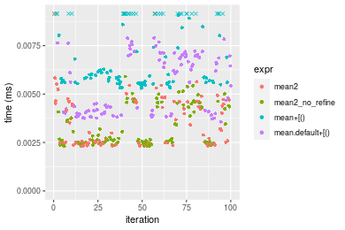

#### A 80% subset
```r
> x <- data[["n = 1000"]]
> subset
[1] 0.8
> idxs <- sort(sample(length(x), size = subset * length(x), replace = FALSE))
> gc()
           used  (Mb) gc trigger  (Mb) max used  (Mb)
Ncells  5345285 285.5    7916910 422.9  7916910 422.9
Vcells 15882549 121.2   54892165 418.8 94934136 724.3
> stats <- microbenchmark(mean2 = mean2(x, idxs = idxs, refine = TRUE), mean2_no_refine = mean2(x, 
+     idxs = idxs, refine = FALSE), `mean+[()` = mean2_R_v1(x, idxs = idxs), `mean.default+[()` = mean2_R_v2(x, 
+     idxs = idxs), unit = "ms")
```

_Table: Benchmarking of mean2(), mean2_no_refine(), mean+[()() and mean.default+[()() on integer+n = 1000+0.8 data. The top panel shows times in milliseconds and the bottom panel shows relative times._


|   |expr             |      min|        lq|      mean|    median|        uq|      max|
|:--|:----------------|--------:|---------:|---------:|---------:|---------:|--------:|
|1  |mean2            | 0.003677| 0.0038805| 0.0046441| 0.0039715| 0.0041005| 0.036367|
|2  |mean2_no_refine  | 0.003715| 0.0038585| 0.0041854| 0.0039775| 0.0041675| 0.009074|
|4  |mean.default+[() | 0.005256| 0.0055545| 0.0060895| 0.0057035| 0.0059990| 0.019459|
|3  |mean+[()         | 0.007326| 0.0075905| 0.0086258| 0.0078090| 0.0081560| 0.049528|


|   |expr             |      min|        lq|      mean|   median|       uq|       max|
|:--|:----------------|--------:|---------:|---------:|--------:|--------:|---------:|
|1  |mean2            | 1.000000| 1.0000000| 1.0000000| 1.000000| 1.000000| 1.0000000|
|2  |mean2_no_refine  | 1.010334| 0.9943306| 0.9012131| 1.001511| 1.016339| 0.2495119|
|4  |mean.default+[() | 1.429426| 1.4313877| 1.3112266| 1.436107| 1.462992| 0.5350730|
|3  |mean+[()         | 1.992385| 1.9560624| 1.8573406| 1.966260| 1.989026| 1.3618940|

_Figure: Benchmarking of mean2(), mean2_no_refine(), mean+[()() and mean.default+[()() on integer+n = 1000+0.8 data.  Outliers are displayed as crosses.  Times are in milliseconds._


### n = 10000 vector


#### All elements
```r
> x <- data[["n = 10000"]]
> gc()
           used  (Mb) gc trigger  (Mb) max used  (Mb)
Ncells  5345295 285.5    7916910 422.9  7916910 422.9
Vcells 15882329 121.2   54892165 418.8 94934136 724.3
> stats <- microbenchmark(mean2 = mean2(x, refine = TRUE), mean2_no_refine = mean2(x, refine = FALSE), 
+     mean = mean(x), mean.default = mean.default(x), unit = "ms")
```

_Table: Benchmarking of mean2(), mean2_no_refine(), mean() and mean.default() on n = 10000+all data. The top panel shows times in milliseconds and the bottom panel shows relative times._


|   |expr            |      min|        lq|      mean|    median|        uq|      max|
|:--|:---------------|--------:|---------:|---------:|---------:|---------:|--------:|
|4  |mean.default    | 0.012779| 0.0133225| 0.0138461| 0.0135730| 0.0141105| 0.028004|
|3  |mean            | 0.014545| 0.0152885| 0.0161326| 0.0157375| 0.0162270| 0.040861|
|1  |mean2           | 0.016360| 0.0170340| 0.0178260| 0.0172390| 0.0178105| 0.044082|
|2  |mean2_no_refine | 0.016388| 0.0170300| 0.0177870| 0.0172665| 0.0179135| 0.032551|


|   |expr            |      min|       lq|     mean|   median|       uq|      max|
|:--|:---------------|--------:|--------:|--------:|--------:|--------:|--------:|
|4  |mean.default    | 1.000000| 1.000000| 1.000000| 1.000000| 1.000000| 1.000000|
|3  |mean            | 1.138195| 1.147570| 1.165137| 1.159471| 1.149995| 1.459113|
|1  |mean2           | 1.280225| 1.278589| 1.287436| 1.270095| 1.262216| 1.574132|
|2  |mean2_no_refine | 1.282417| 1.278289| 1.284619| 1.272121| 1.269516| 1.162370|

_Figure: Benchmarking of mean2(), mean2_no_refine(), mean() and mean.default() on n = 10000+all data.  Outliers are displayed as crosses.  Times are in milliseconds._

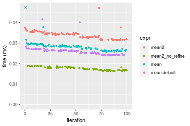


#### A 20% subset
```r
> x <- data[["n = 10000"]]
> subset
[1] 0.2
> idxs <- sort(sample(length(x), size = subset * length(x), replace = FALSE))
> gc()
           used  (Mb) gc trigger  (Mb) max used  (Mb)
Ncells  5345447 285.5    7916910 422.9  7916910 422.9
Vcells 15883722 121.2   54892165 418.8 94934136 724.3
> stats <- microbenchmark(mean2 = mean2(x, idxs = idxs, refine = TRUE), mean2_no_refine = mean2(x, 
+     idxs = idxs, refine = FALSE), `mean+[()` = mean2_R_v1(x, idxs = idxs), `mean.default+[()` = mean2_R_v2(x, 
+     idxs = idxs), unit = "ms")
```

_Table: Benchmarking of mean2(), mean2_no_refine(), mean+[()() and mean.default+[()() on integer+n = 10000+0.2 data. The top panel shows times in milliseconds and the bottom panel shows relative times._


|   |expr             |      min|        lq|      mean|    median|        uq|      max|
|:--|:----------------|--------:|---------:|---------:|---------:|---------:|--------:|
|1  |mean2            | 0.007452| 0.0076215| 0.0079020| 0.0077615| 0.0079765| 0.012544|
|2  |mean2_no_refine  | 0.007461| 0.0076190| 0.0082991| 0.0077965| 0.0080595| 0.022231|
|4  |mean.default+[() | 0.009629| 0.0098760| 0.0104579| 0.0101015| 0.0105330| 0.015865|
|3  |mean+[()         | 0.011588| 0.0121195| 0.0137225| 0.0123370| 0.0130215| 0.072490|


|   |expr             |      min|       lq|     mean|   median|       uq|      max|
|:--|:----------------|--------:|--------:|--------:|--------:|--------:|--------:|
|1  |mean2            | 1.000000| 1.000000| 1.000000| 1.000000| 1.000000| 1.000000|
|2  |mean2_no_refine  | 1.001208| 0.999672| 1.050253| 1.004509| 1.010406| 1.772242|
|4  |mean.default+[() | 1.292136| 1.295808| 1.323447| 1.301488| 1.320504| 1.264748|
|3  |mean+[()         | 1.555019| 1.590172| 1.736573| 1.589512| 1.632483| 5.778858|

_Figure: Benchmarking of mean2(), mean2_no_refine(), mean+[()() and mean.default+[()() on integer+n = 10000+0.2 data.  Outliers are displayed as crosses.  Times are in milliseconds._


#### A 40% subset
```r
> x <- data[["n = 10000"]]
> subset
[1] 0.4
> idxs <- sort(sample(length(x), size = subset * length(x), replace = FALSE))
> gc()
           used  (Mb) gc trigger  (Mb) max used  (Mb)
Ncells  5345528 285.5    7916910 422.9  7916910 422.9
Vcells 15885078 121.2   54892165 418.8 94934136 724.3
> stats <- microbenchmark(mean2 = mean2(x, idxs = idxs, refine = TRUE), mean2_no_refine = mean2(x, 
+     idxs = idxs, refine = FALSE), `mean+[()` = mean2_R_v1(x, idxs = idxs), `mean.default+[()` = mean2_R_v2(x, 
+     idxs = idxs), unit = "ms")
```

_Table: Benchmarking of mean2(), mean2_no_refine(), mean+[()() and mean.default+[()() on integer+n = 10000+0.4 data. The top panel shows times in milliseconds and the bottom panel shows relative times._


|   |expr             |      min|        lq|      mean|    median|        uq|      max|
|:--|:----------------|--------:|---------:|---------:|---------:|---------:|--------:|
|1  |mean2            | 0.015590| 0.0159015| 0.0165469| 0.0164185| 0.0170750| 0.018352|
|2  |mean2_no_refine  | 0.015607| 0.0160440| 0.0168530| 0.0165460| 0.0171715| 0.027121|
|4  |mean.default+[() | 0.018600| 0.0202175| 0.0213759| 0.0208940| 0.0217700| 0.039835|
|3  |mean+[()         | 0.021621| 0.0226610| 0.0245148| 0.0236765| 0.0247240| 0.070578|


|   |expr             |      min|       lq|     mean|   median|       uq|      max|
|:--|:----------------|--------:|--------:|--------:|--------:|--------:|--------:|
|1  |mean2            | 1.000000| 1.000000| 1.000000| 1.000000| 1.000000| 1.000000|
|2  |mean2_no_refine  | 1.001090| 1.008961| 1.018500| 1.007766| 1.005651| 1.477823|
|4  |mean.default+[() | 1.193072| 1.271421| 1.291837| 1.272589| 1.274963| 2.170608|
|3  |mean+[()         | 1.386850| 1.425086| 1.481530| 1.442062| 1.447965| 3.845793|

_Figure: Benchmarking of mean2(), mean2_no_refine(), mean+[()() and mean.default+[()() on integer+n = 10000+0.4 data.  Outliers are displayed as crosses.  Times are in milliseconds._


#### A 80% subset
```r
> x <- data[["n = 10000"]]
> subset
[1] 0.8
> idxs <- sort(sample(length(x), size = subset * length(x), replace = FALSE))
> gc()
           used  (Mb) gc trigger  (Mb) max used  (Mb)
Ncells  5345609 285.5    7916910 422.9  7916910 422.9
Vcells 15887496 121.3   54892165 418.8 94934136 724.3
> stats <- microbenchmark(mean2 = mean2(x, idxs = idxs, refine = TRUE), mean2_no_refine = mean2(x, 
+     idxs = idxs, refine = FALSE), `mean+[()` = mean2_R_v1(x, idxs = idxs), `mean.default+[()` = mean2_R_v2(x, 
+     idxs = idxs), unit = "ms")
```

_Table: Benchmarking of mean2(), mean2_no_refine(), mean+[()() and mean.default+[()() on integer+n = 10000+0.8 data. The top panel shows times in milliseconds and the bottom panel shows relative times._


|   |expr             |      min|        lq|      mean|    median|        uq|      max|
|:--|:----------------|--------:|---------:|---------:|---------:|---------:|--------:|
|2  |mean2_no_refine  | 0.026708| 0.0278605| 0.0301429| 0.0289540| 0.0312570| 0.056221|
|1  |mean2            | 0.026650| 0.0285610| 0.0305719| 0.0297945| 0.0318585| 0.052113|
|4  |mean.default+[() | 0.032061| 0.0337195| 0.0363694| 0.0358005| 0.0379250| 0.064048|
|3  |mean+[()         | 0.034290| 0.0362305| 0.0397354| 0.0377100| 0.0406250| 0.075920|


|   |expr             |       min|       lq|     mean|   median|       uq|       max|
|:--|:----------------|---------:|--------:|--------:|--------:|--------:|---------:|
|2  |mean2_no_refine  | 1.0000000| 1.000000| 1.000000| 1.000000| 1.000000| 1.0000000|
|1  |mean2            | 0.9978284| 1.025143| 1.014232| 1.029029| 1.019244| 0.9269312|
|4  |mean.default+[() | 1.2004268| 1.210298| 1.206564| 1.236461| 1.213328| 1.1392184|
|3  |mean+[()         | 1.2838850| 1.300425| 1.318234| 1.302411| 1.299709| 1.3503851|

_Figure: Benchmarking of mean2(), mean2_no_refine(), mean+[()() and mean.default+[()() on integer+n = 10000+0.8 data.  Outliers are displayed as crosses.  Times are in milliseconds._


### n = 100000 vector


#### All elements
```r
> x <- data[["n = 100000"]]
> gc()
           used  (Mb) gc trigger  (Mb) max used  (Mb)
Ncells  5345619 285.5    7916910 422.9  7916910 422.9
Vcells 15887501 121.3   54892165 418.8 94934136 724.3
> stats <- microbenchmark(mean2 = mean2(x, refine = TRUE), mean2_no_refine = mean2(x, refine = FALSE), 
+     mean = mean(x), mean.default = mean.default(x), unit = "ms")
```

_Table: Benchmarking of mean2(), mean2_no_refine(), mean() and mean.default() on n = 100000+all data. The top panel shows times in milliseconds and the bottom panel shows relative times._


|   |expr            |      min|        lq|      mean|    median|        uq|      max|
|:--|:---------------|--------:|---------:|---------:|---------:|---------:|--------:|
|4  |mean.default    | 0.093988| 0.1040215| 0.1243721| 0.1183500| 0.1426235| 0.186819|
|3  |mean            | 0.095835| 0.1036230| 0.1306482| 0.1200370| 0.1551335| 0.199532|
|2  |mean2_no_refine | 0.123333| 0.1349320| 0.1474210| 0.1413460| 0.1628710| 0.185379|
|1  |mean2           | 0.123388| 0.1362255| 0.1490978| 0.1456175| 0.1605965| 0.206744|


|   |expr            |      min|        lq|     mean|   median|       uq|      max|
|:--|:---------------|--------:|---------:|--------:|--------:|--------:|--------:|
|4  |mean.default    | 1.000000| 1.0000000| 1.000000| 1.000000| 1.000000| 1.000000|
|3  |mean            | 1.019651| 0.9961691| 1.050462| 1.014254| 1.087713| 1.068050|
|2  |mean2_no_refine | 1.312221| 1.2971549| 1.185322| 1.194305| 1.141965| 0.992292|
|1  |mean2           | 1.312806| 1.3095898| 1.198804| 1.230397| 1.126017| 1.106654|

_Figure: Benchmarking of mean2(), mean2_no_refine(), mean() and mean.default() on n = 100000+all data.  Outliers are displayed as crosses.  Times are in milliseconds._


#### A 20% subset
```r
> x <- data[["n = 100000"]]
> subset
[1] 0.2
> idxs <- sort(sample(length(x), size = subset * length(x), replace = FALSE))
> gc()
           used  (Mb) gc trigger  (Mb) max used  (Mb)
Ncells  5345771 285.5    7916910 422.9  7916910 422.9
Vcells 15894040 121.3   54892165 418.8 94934136 724.3
> stats <- microbenchmark(mean2 = mean2(x, idxs = idxs, refine = TRUE), mean2_no_refine = mean2(x, 
+     idxs = idxs, refine = FALSE), `mean+[()` = mean2_R_v1(x, idxs = idxs), `mean.default+[()` = mean2_R_v2(x, 
+     idxs = idxs), unit = "ms")
```

_Table: Benchmarking of mean2(), mean2_no_refine(), mean+[()() and mean.default+[()() on integer+n = 100000+0.2 data. The top panel shows times in milliseconds and the bottom panel shows relative times._


|   |expr             |      min|        lq|      mean|    median|        uq|      max|
|:--|:----------------|--------:|---------:|---------:|---------:|---------:|--------:|
|2  |mean2_no_refine  | 0.062371| 0.0669800| 0.0760080| 0.0720105| 0.0797415| 0.135274|
|1  |mean2            | 0.062362| 0.0670355| 0.0786025| 0.0749805| 0.0827105| 0.145381|
|4  |mean.default+[() | 0.073925| 0.0800490| 0.0908226| 0.0867730| 0.0961165| 0.141635|
|3  |mean+[()         | 0.076271| 0.0821560| 0.0944314| 0.0905120| 0.1003580| 0.184158|


|   |expr             |       min|       lq|     mean|   median|       uq|      max|
|:--|:----------------|---------:|--------:|--------:|--------:|--------:|--------:|
|2  |mean2_no_refine  | 1.0000000| 1.000000| 1.000000| 1.000000| 1.000000| 1.000000|
|1  |mean2            | 0.9998557| 1.000829| 1.034136| 1.041244| 1.037233| 1.074715|
|4  |mean.default+[() | 1.1852463| 1.195118| 1.194909| 1.205005| 1.205351| 1.047023|
|3  |mean+[()         | 1.2228600| 1.226575| 1.242388| 1.256928| 1.258542| 1.361370|

_Figure: Benchmarking of mean2(), mean2_no_refine(), mean+[()() and mean.default+[()() on integer+n = 100000+0.2 data.  Outliers are displayed as crosses.  Times are in milliseconds._


#### A 40% subset
```r
> x <- data[["n = 100000"]]
> subset
[1] 0.4
> idxs <- sort(sample(length(x), size = subset * length(x), replace = FALSE))
> gc()
           used  (Mb) gc trigger  (Mb) max used  (Mb)
Ncells  5345852 285.5    7916910 422.9  7916910 422.9
Vcells 15904619 121.4   54892165 418.8 94934136 724.3
> stats <- microbenchmark(mean2 = mean2(x, idxs = idxs, refine = TRUE), mean2_no_refine = mean2(x, 
+     idxs = idxs, refine = FALSE), `mean+[()` = mean2_R_v1(x, idxs = idxs), `mean.default+[()` = mean2_R_v2(x, 
+     idxs = idxs), unit = "ms")
```

_Table: Benchmarking of mean2(), mean2_no_refine(), mean+[()() and mean.default+[()() on integer+n = 100000+0.4 data. The top panel shows times in milliseconds and the bottom panel shows relative times._


|   |expr             |      min|        lq|      mean|    median|        uq|      max|
|:--|:----------------|--------:|---------:|---------:|---------:|---------:|--------:|
|2  |mean2_no_refine  | 0.105058| 0.1114755| 0.1712444| 0.1299190| 0.2306875| 0.295112|
|4  |mean.default+[() | 0.122963| 0.1348490| 0.1886266| 0.1453550| 0.2508830| 0.339519|
|3  |mean+[()         | 0.124876| 0.1355110| 0.1864570| 0.1475750| 0.2502520| 0.335273|
|1  |mean2            | 0.105087| 0.1115920| 0.1750653| 0.1669525| 0.2318520| 0.281113|


|   |expr             |      min|       lq|     mean|   median|       uq|       max|
|:--|:----------------|--------:|--------:|--------:|--------:|--------:|---------:|
|2  |mean2_no_refine  | 1.000000| 1.000000| 1.000000| 1.000000| 1.000000| 1.0000000|
|4  |mean.default+[() | 1.170430| 1.209674| 1.101505| 1.118812| 1.087545| 1.1504751|
|3  |mean+[()         | 1.188639| 1.215612| 1.088836| 1.135900| 1.084809| 1.1360873|
|1  |mean2            | 1.000276| 1.001045| 1.022312| 1.285051| 1.005048| 0.9525638|

_Figure: Benchmarking of mean2(), mean2_no_refine(), mean+[()() and mean.default+[()() on integer+n = 100000+0.4 data.  Outliers are displayed as crosses.  Times are in milliseconds._


#### A 80% subset
```r
> x <- data[["n = 100000"]]
> subset
[1] 0.8
> idxs <- sort(sample(length(x), size = subset * length(x), replace = FALSE))
> gc()
           used  (Mb) gc trigger  (Mb) max used  (Mb)
Ncells  5345933 285.6    7916910 422.9  7916910 422.9
Vcells 15924673 121.5   54892165 418.8 94934136 724.3
> stats <- microbenchmark(mean2 = mean2(x, idxs = idxs, refine = TRUE), mean2_no_refine = mean2(x, 
+     idxs = idxs, refine = FALSE), `mean+[()` = mean2_R_v1(x, idxs = idxs), `mean.default+[()` = mean2_R_v2(x, 
+     idxs = idxs), unit = "ms")
```

_Table: Benchmarking of mean2(), mean2_no_refine(), mean+[()() and mean.default+[()() on integer+n = 100000+0.8 data. The top panel shows times in milliseconds and the bottom panel shows relative times._


|   |expr             |      min|        lq|      mean|    median|        uq|      max|
|:--|:----------------|--------:|---------:|---------:|---------:|---------:|--------:|
|2  |mean2_no_refine  | 0.186719| 0.1871585| 0.2345470| 0.1984955| 0.2757345| 0.406197|
|1  |mean2            | 0.186731| 0.1896190| 0.2519452| 0.2321785| 0.2970505| 0.458958|
|3  |mean+[()         | 0.221482| 0.2258150| 0.2820589| 0.2483130| 0.3293260| 0.593510|
|4  |mean.default+[() | 0.218936| 0.2217100| 0.2793557| 0.2508805| 0.3262965| 0.533550|


|   |expr             |      min|       lq|     mean|   median|       uq|      max|
|:--|:----------------|--------:|--------:|--------:|--------:|--------:|--------:|
|2  |mean2_no_refine  | 1.000000| 1.000000| 1.000000| 1.000000| 1.000000| 1.000000|
|1  |mean2            | 1.000064| 1.013147| 1.074178| 1.169692| 1.077306| 1.129890|
|3  |mean+[()         | 1.186178| 1.206544| 1.202569| 1.250976| 1.194359| 1.461138|
|4  |mean.default+[() | 1.172543| 1.184611| 1.191044| 1.263910| 1.183372| 1.313525|

_Figure: Benchmarking of mean2(), mean2_no_refine(), mean+[()() and mean.default+[()() on integer+n = 100000+0.8 data.  Outliers are displayed as crosses.  Times are in milliseconds._


### n = 1000000 vector


#### All elements
```r
> x <- data[["n = 1000000"]]
> gc()
           used  (Mb) gc trigger  (Mb) max used  (Mb)
Ncells  5345943 285.6    7916910 422.9  7916910 422.9
Vcells 15924869 121.5   54892165 418.8 94934136 724.3
> stats <- microbenchmark(mean2 = mean2(x, refine = TRUE), mean2_no_refine = mean2(x, refine = FALSE), 
+     mean = mean(x), mean.default = mean.default(x), unit = "ms")
```

_Table: Benchmarking of mean2(), mean2_no_refine(), mean() and mean.default() on n = 1000000+all data. The top panel shows times in milliseconds and the bottom panel shows relative times._


|   |expr            |      min|       lq|     mean|   median|       uq|      max|
|:--|:---------------|--------:|--------:|--------:|--------:|--------:|--------:|
|4  |mean.default    | 0.907361| 0.995682| 1.150988| 1.074253| 1.325117| 1.567060|
|3  |mean            | 0.943019| 1.025310| 1.198732| 1.117517| 1.373515| 1.566173|
|2  |mean2_no_refine | 1.178194| 1.253573| 1.325687| 1.315514| 1.384903| 1.706064|
|1  |mean2           | 1.171185| 1.263374| 1.338025| 1.321410| 1.402878| 1.619958|


|   |expr            |      min|       lq|     mean|   median|       uq|      max|
|:--|:---------------|--------:|--------:|--------:|--------:|--------:|--------:|
|4  |mean.default    | 1.000000| 1.000000| 1.000000| 1.000000| 1.000000| 1.000000|
|3  |mean            | 1.039299| 1.029756| 1.041481| 1.040274| 1.036524| 0.999434|
|2  |mean2_no_refine | 1.298484| 1.259010| 1.151782| 1.224585| 1.045117| 1.088704|
|1  |mean2           | 1.290760| 1.268853| 1.162502| 1.230074| 1.058683| 1.033756|

_Figure: Benchmarking of mean2(), mean2_no_refine(), mean() and mean.default() on n = 1000000+all data.  Outliers are displayed as crosses.  Times are in milliseconds._


#### A 20% subset
```r
> x <- data[["n = 1000000"]]
> subset
[1] 0.2
> idxs <- sort(sample(length(x), size = subset * length(x), replace = FALSE))
> gc()
           used  (Mb) gc trigger  (Mb) max used  (Mb)
Ncells  5346095 285.6    7916910 422.9  7916910 422.9
Vcells 15985407 122.0   54892165 418.8 94934136 724.3
> stats <- microbenchmark(mean2 = mean2(x, idxs = idxs, refine = TRUE), mean2_no_refine = mean2(x, 
+     idxs = idxs, refine = FALSE), `mean+[()` = mean2_R_v1(x, idxs = idxs), `mean.default+[()` = mean2_R_v2(x, 
+     idxs = idxs), unit = "ms")
```

_Table: Benchmarking of mean2(), mean2_no_refine(), mean+[()() and mean.default+[()() on integer+n = 1000000+0.2 data. The top panel shows times in milliseconds and the bottom panel shows relative times._


|   |expr             |      min|        lq|      mean|    median|        uq|      max|
|:--|:----------------|--------:|---------:|---------:|---------:|---------:|--------:|
|1  |mean2            | 0.533091| 0.5941275| 0.6773973| 0.6582845| 0.7374295| 1.032028|
|2  |mean2_no_refine  | 0.544434| 0.5959685| 0.7081223| 0.6618695| 0.8063780| 1.126720|
|4  |mean.default+[() | 0.664087| 0.8367260| 0.9719835| 0.9699980| 1.0899330| 1.356483|
|3  |mean+[()         | 0.659317| 0.9135430| 1.0246188| 1.0231725| 1.1581980| 1.425969|


|   |expr             |      min|       lq|     mean|   median|       uq|      max|
|:--|:----------------|--------:|--------:|--------:|--------:|--------:|--------:|
|1  |mean2            | 1.000000| 1.000000| 1.000000| 1.000000| 1.000000| 1.000000|
|2  |mean2_no_refine  | 1.021278| 1.003099| 1.045357| 1.005446| 1.093498| 1.091753|
|4  |mean.default+[() | 1.245729| 1.408327| 1.434880| 1.473524| 1.478017| 1.314386|
|3  |mean+[()         | 1.236781| 1.537621| 1.512582| 1.554301| 1.570588| 1.381715|

_Figure: Benchmarking of mean2(), mean2_no_refine(), mean+[()() and mean.default+[()() on integer+n = 1000000+0.2 data.  Outliers are displayed as crosses.  Times are in milliseconds._

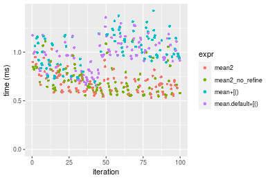

#### A 40% subset
```r
> x <- data[["n = 1000000"]]
> subset
[1] 0.4
> idxs <- sort(sample(length(x), size = subset * length(x), replace = FALSE))
> gc()
           used  (Mb) gc trigger  (Mb) max used  (Mb)
Ncells  5346176 285.6    7916910 422.9  7916910 422.9
Vcells 16085463 122.8   54892165 418.8 94934136 724.3
> stats <- microbenchmark(mean2 = mean2(x, idxs = idxs, refine = TRUE), mean2_no_refine = mean2(x, 
+     idxs = idxs, refine = FALSE), `mean+[()` = mean2_R_v1(x, idxs = idxs), `mean.default+[()` = mean2_R_v2(x, 
+     idxs = idxs), unit = "ms")
```

_Table: Benchmarking of mean2(), mean2_no_refine(), mean+[()() and mean.default+[()() on integer+n = 1000000+0.4 data. The top panel shows times in milliseconds and the bottom panel shows relative times._


|   |expr             |      min|       lq|     mean|   median|       uq|       max|
|:--|:----------------|--------:|--------:|--------:|--------:|--------:|---------:|
|2  |mean2_no_refine  | 1.072838| 1.193715| 1.377496| 1.285649| 1.462301|  2.575293|
|1  |mean2            | 1.023994| 1.187117| 1.352711| 1.301637| 1.433191|  2.157889|
|3  |mean+[()         | 1.291677| 1.613168| 2.064294| 1.884502| 2.140823| 16.232211|
|4  |mean.default+[() | 1.255464| 1.675893| 1.925433| 1.909858| 2.174402|  2.917143|


|   |expr             |       min|        lq|      mean|   median|       uq|       max|
|:--|:----------------|---------:|---------:|---------:|--------:|--------:|---------:|
|2  |mean2_no_refine  | 1.0000000| 1.0000000| 1.0000000| 1.000000| 1.000000| 1.0000000|
|1  |mean2            | 0.9544722| 0.9944727| 0.9820072| 1.012435| 0.980093| 0.8379198|
|3  |mean+[()         | 1.2039814| 1.3513845| 1.4985847| 1.465799| 1.464009| 6.3030541|
|4  |mean.default+[() | 1.1702270| 1.4039306| 1.3977775| 1.485521| 1.486973| 1.1327422|

_Figure: Benchmarking of mean2(), mean2_no_refine(), mean+[()() and mean.default+[()() on integer+n = 1000000+0.4 data.  Outliers are displayed as crosses.  Times are in milliseconds._


#### A 80% subset
```r
> x <- data[["n = 1000000"]]
> subset
[1] 0.8
> idxs <- sort(sample(length(x), size = subset * length(x), replace = FALSE))
> gc()
           used  (Mb) gc trigger  (Mb) max used  (Mb)
Ncells  5346257 285.6    7916910 422.9  7916910 422.9
Vcells 16286272 124.3   54892165 418.8 94934136 724.3
> stats <- microbenchmark(mean2 = mean2(x, idxs = idxs, refine = TRUE), mean2_no_refine = mean2(x, 
+     idxs = idxs, refine = FALSE), `mean+[()` = mean2_R_v1(x, idxs = idxs), `mean.default+[()` = mean2_R_v2(x, 
+     idxs = idxs), unit = "ms")
```

_Table: Benchmarking of mean2(), mean2_no_refine(), mean+[()() and mean.default+[()() on integer+n = 1000000+0.8 data. The top panel shows times in milliseconds and the bottom panel shows relative times._


|   |expr             |      min|       lq|     mean|   median|       uq|       max|
|:--|:----------------|--------:|--------:|--------:|--------:|--------:|---------:|
|2  |mean2_no_refine  | 1.901145| 1.982795| 2.191301| 2.085029| 2.325310|  3.499716|
|1  |mean2            | 1.921770| 2.022821| 2.215527| 2.117431| 2.338416|  3.516379|
|4  |mean.default+[() | 2.843862| 3.268609| 3.629056| 3.378196| 3.546221| 18.510310|
|3  |mean+[()         | 2.787402| 3.267502| 3.634881| 3.415418| 3.694373| 18.642724|


|   |expr             |      min|       lq|     mean|   median|       uq|      max|
|:--|:----------------|--------:|--------:|--------:|--------:|--------:|--------:|
|2  |mean2_no_refine  | 1.000000| 1.000000| 1.000000| 1.000000| 1.000000| 1.000000|
|1  |mean2            | 1.010849| 1.020187| 1.011055| 1.015540| 1.005636| 1.004761|
|4  |mean.default+[() | 1.495868| 1.648485| 1.656119| 1.620215| 1.525053| 5.289089|
|3  |mean+[()         | 1.466170| 1.647927| 1.658778| 1.638067| 1.588766| 5.326925|

_Figure: Benchmarking of mean2(), mean2_no_refine(), mean+[()() and mean.default+[()() on integer+n = 1000000+0.8 data.  Outliers are displayed as crosses.  Times are in milliseconds._


### n = 10000000 vector


#### All elements
```r
> x <- data[["n = 10000000"]]
> gc()
           used  (Mb) gc trigger  (Mb) max used  (Mb)
Ncells  5346267 285.6    7916910 422.9  7916910 422.9
Vcells 16285840 124.3   54892165 418.8 94934136 724.3
> stats <- microbenchmark(mean2 = mean2(x, refine = TRUE), mean2_no_refine = mean2(x, refine = FALSE), 
+     mean = mean(x), mean.default = mean.default(x), unit = "ms")
```

_Table: Benchmarking of mean2(), mean2_no_refine(), mean() and mean.default() on n = 10000000+all data. The top panel shows times in milliseconds and the bottom panel shows relative times._


|   |expr            |       min|        lq|     mean|    median|       uq|      max|
|:--|:---------------|---------:|---------:|--------:|---------:|--------:|--------:|
|3  |mean            |  8.910474|  9.316434| 10.18797|  9.749757| 10.53794| 14.44465|
|4  |mean.default    |  8.853049|  9.314250| 10.17287|  9.864505| 10.78925| 15.27491|
|2  |mean2_no_refine | 11.009040| 11.300674| 12.30224| 11.951052| 13.04010| 15.03995|
|1  |mean2           | 11.026848| 11.407820| 12.44913| 12.280653| 13.33792| 15.53697|


|   |expr            |       min|        lq|      mean|   median|       uq|      max|
|:--|:---------------|---------:|---------:|---------:|--------:|--------:|--------:|
|3  |mean            | 1.0000000| 1.0000000| 1.0000000| 1.000000| 1.000000| 1.000000|
|4  |mean.default    | 0.9935553| 0.9997655| 0.9985174| 1.011769| 1.023848| 1.057478|
|2  |mean2_no_refine | 1.2355168| 1.2129828| 1.2075257| 1.225780| 1.237443| 1.041212|
|1  |mean2           | 1.2375153| 1.2244835| 1.2219439| 1.259586| 1.265704| 1.075621|

_Figure: Benchmarking of mean2(), mean2_no_refine(), mean() and mean.default() on n = 10000000+all data.  Outliers are displayed as crosses.  Times are in milliseconds._

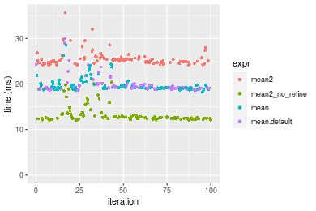


#### A 20% subset
```r
> x <- data[["n = 10000000"]]
> subset
[1] 0.2
> idxs <- sort(sample(length(x), size = subset * length(x), replace = FALSE))
> gc()
           used  (Mb) gc trigger  (Mb) max used  (Mb)
Ncells  5346419 285.6    7916910 422.9  7916910 422.9
Vcells 16886378 128.9   54892165 418.8 94934136 724.3
> stats <- microbenchmark(mean2 = mean2(x, idxs = idxs, refine = TRUE), mean2_no_refine = mean2(x, 
+     idxs = idxs, refine = FALSE), `mean+[()` = mean2_R_v1(x, idxs = idxs), `mean.default+[()` = mean2_R_v2(x, 
+     idxs = idxs), unit = "ms")
```

_Table: Benchmarking of mean2(), mean2_no_refine(), mean+[()() and mean.default+[()() on integer+n = 10000000+0.2 data. The top panel shows times in milliseconds and the bottom panel shows relative times._


|   |expr             |      min|        lq|      mean|    median|        uq|       max|
|:--|:----------------|--------:|---------:|---------:|---------:|---------:|---------:|
|1  |mean2            | 6.629129|  6.857459|  7.449166|  7.100306|  7.651725| 12.641119|
|2  |mean2_no_refine  | 6.644606|  6.830097|  7.348730|  7.105475|  7.594907|  9.892778|
|4  |mean.default+[() | 8.861437| 10.966095| 12.014368| 11.263540| 11.826247| 38.922241|
|3  |mean+[()         | 8.804789| 10.971579| 12.019712| 11.351643| 11.954465| 26.449184|


|   |expr             |      min|        lq|      mean|   median|        uq|       max|
|:--|:----------------|--------:|---------:|---------:|--------:|---------:|---------:|
|1  |mean2            | 1.000000| 1.0000000| 1.0000000| 1.000000| 1.0000000| 1.0000000|
|2  |mean2_no_refine  | 1.002335| 0.9960099| 0.9865171| 1.000728| 0.9925745| 0.7825872|
|4  |mean.default+[() | 1.336742| 1.5991485| 1.6128474| 1.586346| 1.5455662| 3.0790186|
|3  |mean+[()         | 1.328197| 1.5999482| 1.6135648| 1.598754| 1.5623228| 2.0923135|

_Figure: Benchmarking of mean2(), mean2_no_refine(), mean+[()() and mean.default+[()() on integer+n = 10000000+0.2 data.  Outliers are displayed as crosses.  Times are in milliseconds._

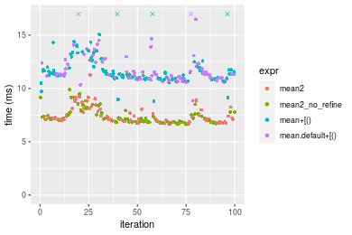

#### A 40% subset
```r
> x <- data[["n = 10000000"]]
> subset
[1] 0.4
> idxs <- sort(sample(length(x), size = subset * length(x), replace = FALSE))
> gc()
           used  (Mb) gc trigger  (Mb) max used  (Mb)
Ncells  5346500 285.6    7916910 422.9  7916910 422.9
Vcells 17887347 136.5   54892165 418.8 94934136 724.3
> stats <- microbenchmark(mean2 = mean2(x, idxs = idxs, refine = TRUE), mean2_no_refine = mean2(x, 
+     idxs = idxs, refine = FALSE), `mean+[()` = mean2_R_v1(x, idxs = idxs), `mean.default+[()` = mean2_R_v2(x, 
+     idxs = idxs), unit = "ms")
```

_Table: Benchmarking of mean2(), mean2_no_refine(), mean+[()() and mean.default+[()() on integer+n = 10000000+0.4 data. The top panel shows times in milliseconds and the bottom panel shows relative times._


|   |expr             |      min|       lq|     mean|   median|       uq|      max|
|:--|:----------------|--------:|--------:|--------:|--------:|--------:|--------:|
|1  |mean2            | 10.95015| 11.65684| 12.38789| 11.96634| 12.88033| 19.96879|
|2  |mean2_no_refine  | 11.08275| 11.69462| 12.39908| 12.06658| 12.58402| 20.05557|
|3  |mean+[()         | 13.71837| 15.81739| 18.95038| 18.84776| 20.14947| 31.91055|
|4  |mean.default+[() | 13.72225| 16.84050| 19.07589| 19.07357| 20.53107| 29.24286|


|   |expr             |      min|       lq|     mean|   median|        uq|      max|
|:--|:----------------|--------:|--------:|--------:|--------:|---------:|--------:|
|1  |mean2            | 1.000000| 1.000000| 1.000000| 1.000000| 1.0000000| 1.000000|
|2  |mean2_no_refine  | 1.012109| 1.003242| 1.000903| 1.008376| 0.9769958| 1.004346|
|3  |mean+[()         | 1.252802| 1.356919| 1.529750| 1.575064| 1.5643604| 1.598021|
|4  |mean.default+[() | 1.253156| 1.444689| 1.539881| 1.593935| 1.5939868| 1.464428|

_Figure: Benchmarking of mean2(), mean2_no_refine(), mean+[()() and mean.default+[()() on integer+n = 10000000+0.4 data.  Outliers are displayed as crosses.  Times are in milliseconds._

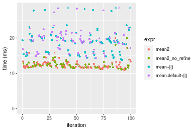

#### A 80% subset
```r
> x <- data[["n = 10000000"]]
> subset
[1] 0.8
> idxs <- sort(sample(length(x), size = subset * length(x), replace = FALSE))
> gc()
           used  (Mb) gc trigger  (Mb) max used  (Mb)
Ncells  5346581 285.6    7916910 422.9  7916910 422.9
Vcells 19887401 151.8   54892165 418.8 94934136 724.3
> stats <- microbenchmark(mean2 = mean2(x, idxs = idxs, refine = TRUE), mean2_no_refine = mean2(x, 
+     idxs = idxs, refine = FALSE), `mean+[()` = mean2_R_v1(x, idxs = idxs), `mean.default+[()` = mean2_R_v2(x, 
+     idxs = idxs), unit = "ms")
```

_Table: Benchmarking of mean2(), mean2_no_refine(), mean+[()() and mean.default+[()() on integer+n = 10000000+0.8 data. The top panel shows times in milliseconds and the bottom panel shows relative times._


|   |expr             |      min|       lq|     mean|   median|       uq|      max|
|:--|:----------------|--------:|--------:|--------:|--------:|--------:|--------:|
|1  |mean2            | 20.66110| 21.83599| 22.60181| 22.26913| 23.00120| 33.34457|
|2  |mean2_no_refine  | 20.68084| 21.81241| 22.77915| 22.50213| 23.14509| 28.56826|
|4  |mean.default+[() | 34.11083| 35.55587| 39.38754| 36.83349| 38.44051| 64.57649|
|3  |mean+[()         | 33.82848| 35.73351| 39.98734| 37.33651| 38.96290| 63.50868|


|   |expr             |      min|        lq|     mean|   median|       uq|       max|
|:--|:----------------|--------:|---------:|--------:|--------:|--------:|---------:|
|1  |mean2            | 1.000000| 1.0000000| 1.000000| 1.000000| 1.000000| 1.0000000|
|2  |mean2_no_refine  | 1.000955| 0.9989203| 1.007847| 1.010463| 1.006256| 0.8567588|
|4  |mean.default+[() | 1.650968| 1.6283150| 1.742672| 1.654016| 1.671239| 1.9366417|
|3  |mean+[()         | 1.637303| 1.6364503| 1.769210| 1.676604| 1.693951| 1.9046181|

_Figure: Benchmarking of mean2(), mean2_no_refine(), mean+[()() and mean.default+[()() on integer+n = 10000000+0.8 data.  Outliers are displayed as crosses.  Times are in milliseconds._


## Data type "double"
### Data
```r
> rvector <- function(n, mode = c("logical", "double", "integer"), range = c(-100, +100), na_prob = 0) {
+     mode <- match.arg(mode)
+     if (mode == "logical") {
+         x <- sample(c(FALSE, TRUE), size = n, replace = TRUE)
+     }     else {
+         x <- runif(n, min = range[1], max = range[2])
+     }
+     storage.mode(x) <- mode
+     if (na_prob > 0) 
+         x[sample(n, size = na_prob * n)] <- NA
+     x
+ }
> rvectors <- function(scale = 10, seed = 1, ...) {
+     set.seed(seed)
+     data <- list()
+     data[[1]] <- rvector(n = scale * 100, ...)
+     data[[2]] <- rvector(n = scale * 1000, ...)
+     data[[3]] <- rvector(n = scale * 10000, ...)
+     data[[4]] <- rvector(n = scale * 1e+05, ...)
+     data[[5]] <- rvector(n = scale * 1e+06, ...)
+     names(data) <- sprintf("n = %d", sapply(data, FUN = length))
+     data
+ }
> data <- rvectors(mode = mode)
```

### Results

### n = 1000 vector


#### All elements
```r
> x <- data[["n = 1000"]]
> gc()
           used  (Mb) gc trigger  (Mb) max used  (Mb)
Ncells  5346591 285.6    7916910 422.9  7916910 422.9
Vcells 25442469 194.2   54892165 418.8 94934136 724.3
> stats <- microbenchmark(mean2 = mean2(x, refine = TRUE), mean2_no_refine = mean2(x, refine = FALSE), 
+     mean = mean(x), mean.default = mean.default(x), unit = "ms")
```

_Table: Benchmarking of mean2(), mean2_no_refine(), mean() and mean.default() on n = 1000+all data. The top panel shows times in milliseconds and the bottom panel shows relative times._


|   |expr            |      min|        lq|      mean|    median|        uq|      max|
|:--|:---------------|--------:|---------:|---------:|---------:|---------:|--------:|
|2  |mean2_no_refine | 0.002933| 0.0031125| 0.0032647| 0.0032385| 0.0033290| 0.006978|
|4  |mean.default    | 0.003917| 0.0041370| 0.0044087| 0.0042170| 0.0043200| 0.018609|
|1  |mean2           | 0.004567| 0.0047790| 0.0051201| 0.0048695| 0.0050135| 0.023907|
|3  |mean            | 0.005680| 0.0060120| 0.0063855| 0.0061355| 0.0063200| 0.025811|


|   |expr            |      min|       lq|     mean|   median|       uq|      max|
|:--|:---------------|--------:|--------:|--------:|--------:|--------:|--------:|
|2  |mean2_no_refine | 1.000000| 1.000000| 1.000000| 1.000000| 1.000000| 1.000000|
|4  |mean.default    | 1.335493| 1.329157| 1.350441| 1.302146| 1.297687| 2.666810|
|1  |mean2           | 1.557109| 1.535422| 1.568353| 1.503628| 1.506008| 3.426053|
|3  |mean            | 1.936584| 1.931566| 1.955950| 1.894550| 1.898468| 3.698911|

_Figure: Benchmarking of mean2(), mean2_no_refine(), mean() and mean.default() on n = 1000+all data.  Outliers are displayed as crosses.  Times are in milliseconds._


#### A 20% subset
```r
> x <- data[["n = 1000"]]
> subset
[1] 0.2
> idxs <- sort(sample(length(x), size = subset * length(x), replace = FALSE))
> gc()
           used  (Mb) gc trigger  (Mb) max used  (Mb)
Ncells  5346740 285.6    7916910 422.9  7916910 422.9
Vcells 21444195 163.7   54892165 418.8 94934136 724.3
> stats <- microbenchmark(mean2 = mean2(x, idxs = idxs, refine = TRUE), mean2_no_refine = mean2(x, 
+     idxs = idxs, refine = FALSE), `mean+[()` = mean2_R_v1(x, idxs = idxs), `mean.default+[()` = mean2_R_v2(x, 
+     idxs = idxs), unit = "ms")
```

_Table: Benchmarking of mean2(), mean2_no_refine(), mean+[()() and mean.default+[()() on double+n = 1000+0.2 data. The top panel shows times in milliseconds and the bottom panel shows relative times._


|   |expr             |      min|        lq|      mean|    median|        uq|      max|
|:--|:----------------|--------:|---------:|---------:|---------:|---------:|--------:|
|2  |mean2_no_refine  | 0.002334| 0.0024905| 0.0031571| 0.0026165| 0.0027885| 0.024405|
|1  |mean2            | 0.002784| 0.0029205| 0.0033334| 0.0030745| 0.0032765| 0.006376|
|4  |mean.default+[() | 0.003939| 0.0042665| 0.0050883| 0.0044880| 0.0047995| 0.019943|
|3  |mean+[()         | 0.006492| 0.0067825| 0.0084807| 0.0069955| 0.0076530| 0.038641|


|   |expr             |      min|       lq|     mean|   median|       uq|       max|
|:--|:----------------|--------:|--------:|--------:|--------:|--------:|---------:|
|2  |mean2_no_refine  | 1.000000| 1.000000| 1.000000| 1.000000| 1.000000| 1.0000000|
|1  |mean2            | 1.192802| 1.172656| 1.055823| 1.175043| 1.175005| 0.2612579|
|4  |mean.default+[() | 1.687661| 1.713110| 1.611671| 1.715269| 1.721176| 0.8171686|
|3  |mean+[()         | 2.781491| 2.723349| 2.686184| 2.673610| 2.744486| 1.5833231|

_Figure: Benchmarking of mean2(), mean2_no_refine(), mean+[()() and mean.default+[()() on double+n = 1000+0.2 data.  Outliers are displayed as crosses.  Times are in milliseconds._

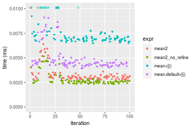

#### A 40% subset
```r
> x <- data[["n = 1000"]]
> subset
[1] 0.4
> idxs <- sort(sample(length(x), size = subset * length(x), replace = FALSE))
> gc()
           used  (Mb) gc trigger  (Mb) max used  (Mb)
Ncells  5346824 285.6    7916910 422.9  7916910 422.9
Vcells 21444356 163.7   54892165 418.8 94934136 724.3
> stats <- microbenchmark(mean2 = mean2(x, idxs = idxs, refine = TRUE), mean2_no_refine = mean2(x, 
+     idxs = idxs, refine = FALSE), `mean+[()` = mean2_R_v1(x, idxs = idxs), `mean.default+[()` = mean2_R_v2(x, 
+     idxs = idxs), unit = "ms")
```

_Table: Benchmarking of mean2(), mean2_no_refine(), mean+[()() and mean.default+[()() on double+n = 1000+0.4 data. The top panel shows times in milliseconds and the bottom panel shows relative times._


|   |expr             |      min|        lq|      mean|    median|        uq|      max|
|:--|:----------------|--------:|---------:|---------:|---------:|---------:|--------:|
|2  |mean2_no_refine  | 0.003106| 0.0031965| 0.0035391| 0.0033355| 0.0034855| 0.014889|
|1  |mean2            | 0.003909| 0.0040290| 0.0045060| 0.0041685| 0.0043615| 0.010720|
|4  |mean.default+[() | 0.004986| 0.0053090| 0.0061101| 0.0055230| 0.0059350| 0.033285|
|3  |mean+[()         | 0.007438| 0.0078490| 0.0086463| 0.0080190| 0.0083450| 0.031917|


|   |expr             |      min|       lq|     mean|   median|       uq|       max|
|:--|:----------------|--------:|--------:|--------:|--------:|--------:|---------:|
|2  |mean2_no_refine  | 1.000000| 1.000000| 1.000000| 1.000000| 1.000000| 1.0000000|
|1  |mean2            | 1.258532| 1.260441| 1.273204| 1.249738| 1.251327| 0.7199946|
|4  |mean.default+[() | 1.605280| 1.660879| 1.726457| 1.655824| 1.702769| 2.2355430|
|3  |mean+[()         | 2.394720| 2.455498| 2.443101| 2.404137| 2.394205| 2.1436631|

_Figure: Benchmarking of mean2(), mean2_no_refine(), mean+[()() and mean.default+[()() on double+n = 1000+0.4 data.  Outliers are displayed as crosses.  Times are in milliseconds._

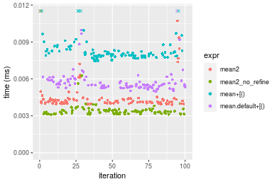

#### A 80% subset
```r
> x <- data[["n = 1000"]]
> subset
[1] 0.8
> idxs <- sort(sample(length(x), size = subset * length(x), replace = FALSE))
> gc()
           used  (Mb) gc trigger  (Mb) max used  (Mb)
Ncells  5346905 285.6    7916910 422.9  7916910 422.9
Vcells 21444610 163.7   54892165 418.8 94934136 724.3
> stats <- microbenchmark(mean2 = mean2(x, idxs = idxs, refine = TRUE), mean2_no_refine = mean2(x, 
+     idxs = idxs, refine = FALSE), `mean+[()` = mean2_R_v1(x, idxs = idxs), `mean.default+[()` = mean2_R_v2(x, 
+     idxs = idxs), unit = "ms")
```

_Table: Benchmarking of mean2(), mean2_no_refine(), mean+[()() and mean.default+[()() on double+n = 1000+0.8 data. The top panel shows times in milliseconds and the bottom panel shows relative times._


|   |expr             |      min|        lq|      mean|    median|        uq|      max|
|:--|:----------------|--------:|---------:|---------:|---------:|---------:|--------:|
|2  |mean2_no_refine  | 0.004601| 0.0047285| 0.0048831| 0.0048230| 0.0049595| 0.006286|
|1  |mean2            | 0.006301| 0.0064380| 0.0067323| 0.0065425| 0.0066785| 0.021662|
|4  |mean.default+[() | 0.006837| 0.0073140| 0.0076880| 0.0074800| 0.0076455| 0.015266|
|3  |mean+[()         | 0.009484| 0.0098535| 0.0106035| 0.0100335| 0.0102700| 0.038918|


|   |expr             |      min|       lq|     mean|   median|       uq|      max|
|:--|:----------------|--------:|--------:|--------:|--------:|--------:|--------:|
|2  |mean2_no_refine  | 1.000000| 1.000000| 1.000000| 1.000000| 1.000000| 1.000000|
|1  |mean2            | 1.369485| 1.361531| 1.378692| 1.356521| 1.346607| 3.446071|
|4  |mean.default+[() | 1.485981| 1.546791| 1.574410| 1.550902| 1.541587| 2.428571|
|3  |mean+[()         | 2.061291| 2.083853| 2.171469| 2.080344| 2.070773| 6.191219|

_Figure: Benchmarking of mean2(), mean2_no_refine(), mean+[()() and mean.default+[()() on double+n = 1000+0.8 data.  Outliers are displayed as crosses.  Times are in milliseconds._

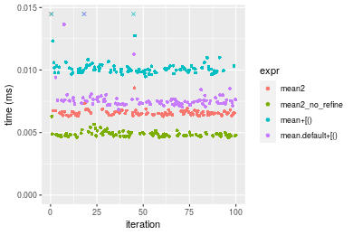


### n = 10000 vector


#### All elements
```r
> x <- data[["n = 10000"]]
> gc()
           used  (Mb) gc trigger  (Mb) max used  (Mb)
Ncells  5346915 285.6    7916910 422.9  7916910 422.9
Vcells 21444178 163.7   54892165 418.8 94934136 724.3
> stats <- microbenchmark(mean2 = mean2(x, refine = TRUE), mean2_no_refine = mean2(x, refine = FALSE), 
+     mean = mean(x), mean.default = mean.default(x), unit = "ms")
```

_Table: Benchmarking of mean2(), mean2_no_refine(), mean() and mean.default() on n = 10000+all data. The top panel shows times in milliseconds and the bottom panel shows relative times._


|   |expr            |      min|        lq|      mean|    median|        uq|      max|
|:--|:---------------|--------:|---------:|---------:|---------:|---------:|--------:|
|2  |mean2_no_refine | 0.016343| 0.0168855| 0.0176837| 0.0178010| 0.0181985| 0.025474|
|4  |mean.default    | 0.024008| 0.0246560| 0.0259579| 0.0259465| 0.0265315| 0.041457|
|3  |mean            | 0.025674| 0.0264595| 0.0282590| 0.0282540| 0.0288150| 0.056288|
|1  |mean2           | 0.031372| 0.0326195| 0.0340836| 0.0340820| 0.0348160| 0.059319|


|   |expr            |      min|       lq|     mean|   median|       uq|      max|
|:--|:---------------|--------:|--------:|--------:|--------:|--------:|--------:|
|2  |mean2_no_refine | 1.000000| 1.000000| 1.000000| 1.000000| 1.000000| 1.000000|
|4  |mean.default    | 1.469008| 1.460188| 1.467901| 1.457587| 1.457895| 1.627424|
|3  |mean            | 1.570948| 1.566995| 1.598030| 1.587214| 1.583372| 2.209626|
|1  |mean2           | 1.919599| 1.931805| 1.927404| 1.914611| 1.913125| 2.328610|

_Figure: Benchmarking of mean2(), mean2_no_refine(), mean() and mean.default() on n = 10000+all data.  Outliers are displayed as crosses.  Times are in milliseconds._


#### A 20% subset
```r
> x <- data[["n = 10000"]]
> subset
[1] 0.2
> idxs <- sort(sample(length(x), size = subset * length(x), replace = FALSE))
> gc()
           used  (Mb) gc trigger  (Mb) max used  (Mb)
Ncells  5347064 285.6    7916910 422.9  7916910 422.9
Vcells 21446619 163.7   54892165 418.8 94934136 724.3
> stats <- microbenchmark(mean2 = mean2(x, idxs = idxs, refine = TRUE), mean2_no_refine = mean2(x, 
+     idxs = idxs, refine = FALSE), `mean+[()` = mean2_R_v1(x, idxs = idxs), `mean.default+[()` = mean2_R_v2(x, 
+     idxs = idxs), unit = "ms")
```

_Table: Benchmarking of mean2(), mean2_no_refine(), mean+[()() and mean.default+[()() on double+n = 10000+0.2 data. The top panel shows times in milliseconds and the bottom panel shows relative times._


|   |expr             |      min|        lq|      mean|    median|        uq|      max|
|:--|:----------------|--------:|---------:|---------:|---------:|---------:|--------:|
|2  |mean2_no_refine  | 0.008969| 0.0093850| 0.0100392| 0.0096345| 0.0097975| 0.023925|
|1  |mean2            | 0.013063| 0.0135375| 0.0137817| 0.0137670| 0.0140580| 0.014790|
|4  |mean.default+[() | 0.013210| 0.0140580| 0.0146024| 0.0144055| 0.0147235| 0.019816|
|3  |mean+[()         | 0.016091| 0.0170300| 0.0181583| 0.0173760| 0.0176285| 0.062644|


|   |expr             |      min|       lq|     mean|   median|       uq|       max|
|:--|:----------------|--------:|--------:|--------:|--------:|--------:|---------:|
|2  |mean2_no_refine  | 1.000000| 1.000000| 1.000000| 1.000000| 1.000000| 1.0000000|
|1  |mean2            | 1.456461| 1.442461| 1.372791| 1.428927| 1.434856| 0.6181818|
|4  |mean.default+[() | 1.472851| 1.497922| 1.454544| 1.495200| 1.502781| 0.8282550|
|3  |mean+[()         | 1.794069| 1.814598| 1.808751| 1.803519| 1.799286| 2.6183490|

_Figure: Benchmarking of mean2(), mean2_no_refine(), mean+[()() and mean.default+[()() on double+n = 10000+0.2 data.  Outliers are displayed as crosses.  Times are in milliseconds._


#### A 40% subset
```r
> x <- data[["n = 10000"]]
> subset
[1] 0.4
> idxs <- sort(sample(length(x), size = subset * length(x), replace = FALSE))
> gc()
           used  (Mb) gc trigger  (Mb) max used  (Mb)
Ncells  5347148 285.6    7916910 422.9  7916910 422.9
Vcells 21447680 163.7   54892165 418.8 94934136 724.3
> stats <- microbenchmark(mean2 = mean2(x, idxs = idxs, refine = TRUE), mean2_no_refine = mean2(x, 
+     idxs = idxs, refine = FALSE), `mean+[()` = mean2_R_v1(x, idxs = idxs), `mean.default+[()` = mean2_R_v2(x, 
+     idxs = idxs), unit = "ms")
```

_Table: Benchmarking of mean2(), mean2_no_refine(), mean+[()() and mean.default+[()() on double+n = 10000+0.4 data. The top panel shows times in milliseconds and the bottom panel shows relative times._


|   |expr             |      min|        lq|      mean|    median|        uq|      max|
|:--|:----------------|--------:|---------:|---------:|---------:|---------:|--------:|
|2  |mean2_no_refine  | 0.015054| 0.0157015| 0.0165805| 0.0164360| 0.0170095| 0.028136|
|4  |mean.default+[() | 0.021503| 0.0226135| 0.0239531| 0.0235040| 0.0244930| 0.038894|
|1  |mean2            | 0.022561| 0.0232685| 0.0243081| 0.0244435| 0.0250640| 0.028230|
|3  |mean+[()         | 0.024111| 0.0254995| 0.0271320| 0.0264410| 0.0274415| 0.067673|


|   |expr             |      min|       lq|     mean|   median|       uq|      max|
|:--|:----------------|--------:|--------:|--------:|--------:|--------:|--------:|
|2  |mean2_no_refine  | 1.000000| 1.000000| 1.000000| 1.000000| 1.000000| 1.000000|
|4  |mean.default+[() | 1.428391| 1.440213| 1.444656| 1.430032| 1.439960| 1.382357|
|1  |mean2            | 1.498671| 1.481928| 1.466069| 1.487193| 1.473529| 1.003341|
|3  |mean+[()         | 1.601634| 1.624017| 1.636382| 1.608725| 1.613304| 2.405210|

_Figure: Benchmarking of mean2(), mean2_no_refine(), mean+[()() and mean.default+[()() on double+n = 10000+0.4 data.  Outliers are displayed as crosses.  Times are in milliseconds._

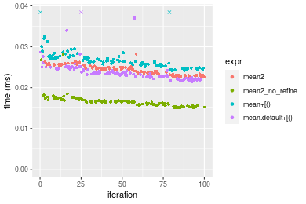

#### A 80% subset
```r
> x <- data[["n = 10000"]]
> subset
[1] 0.8
> idxs <- sort(sample(length(x), size = subset * length(x), replace = FALSE))
> gc()
           used  (Mb) gc trigger  (Mb) max used  (Mb)
Ncells  5347229 285.6    7916910 422.9  7916910 422.9
Vcells 21449734 163.7   54892165 418.8 94934136 724.3
> stats <- microbenchmark(mean2 = mean2(x, idxs = idxs, refine = TRUE), mean2_no_refine = mean2(x, 
+     idxs = idxs, refine = FALSE), `mean+[()` = mean2_R_v1(x, idxs = idxs), `mean.default+[()` = mean2_R_v2(x, 
+     idxs = idxs), unit = "ms")
```

_Table: Benchmarking of mean2(), mean2_no_refine(), mean+[()() and mean.default+[()() on double+n = 10000+0.8 data. The top panel shows times in milliseconds and the bottom panel shows relative times._


|   |expr             |      min|        lq|      mean|    median|        uq|      max|
|:--|:----------------|--------:|---------:|---------:|---------:|---------:|--------:|
|2  |mean2_no_refine  | 0.027086| 0.0279495| 0.0301745| 0.0298760| 0.0319795| 0.048777|
|4  |mean.default+[() | 0.037885| 0.0402285| 0.0425009| 0.0421915| 0.0451705| 0.052830|
|3  |mean+[()         | 0.040519| 0.0423820| 0.0455732| 0.0449230| 0.0477910| 0.082372|
|1  |mean2            | 0.040718| 0.0436405| 0.0465917| 0.0465470| 0.0491415| 0.064083|


|   |expr             |      min|       lq|     mean|   median|       uq|      max|
|:--|:----------------|--------:|--------:|--------:|--------:|--------:|--------:|
|2  |mean2_no_refine  | 1.000000| 1.000000| 1.000000| 1.000000| 1.000000| 1.000000|
|4  |mean.default+[() | 1.398693| 1.439328| 1.408501| 1.412221| 1.412483| 1.083092|
|3  |mean+[()         | 1.495939| 1.516378| 1.510320| 1.503648| 1.494426| 1.688747|
|1  |mean2            | 1.503286| 1.561405| 1.544073| 1.558006| 1.536656| 1.313795|

_Figure: Benchmarking of mean2(), mean2_no_refine(), mean+[()() and mean.default+[()() on double+n = 10000+0.8 data.  Outliers are displayed as crosses.  Times are in milliseconds._


### n = 100000 vector


#### All elements
```r
> x <- data[["n = 100000"]]
> gc()
           used  (Mb) gc trigger  (Mb) max used  (Mb)
Ncells  5347239 285.6    7916910 422.9  7916910 422.9
Vcells 21449302 163.7   54892165 418.8 94934136 724.3
> stats <- microbenchmark(mean2 = mean2(x, refine = TRUE), mean2_no_refine = mean2(x, refine = FALSE), 
+     mean = mean(x), mean.default = mean.default(x), unit = "ms")
```

_Table: Benchmarking of mean2(), mean2_no_refine(), mean() and mean.default() on n = 100000+all data. The top panel shows times in milliseconds and the bottom panel shows relative times._


|   |expr            |      min|        lq|      mean|    median|        uq|      max|
|:--|:---------------|--------:|---------:|---------:|---------:|---------:|--------:|
|2  |mean2_no_refine | 0.104291| 0.1071575| 0.1249470| 0.1194430| 0.1360095| 0.175672|
|3  |mean            | 0.157285| 0.1614785| 0.1849504| 0.1726970| 0.2045740| 0.287513|
|4  |mean.default    | 0.155755| 0.1607070| 0.1874724| 0.1840785| 0.2026845| 0.265754|
|1  |mean2           | 0.207217| 0.2150335| 0.2530091| 0.2455205| 0.2737330| 0.377974|


|   |expr            |      min|       lq|     mean|   median|       uq|      max|
|:--|:---------------|--------:|--------:|--------:|--------:|--------:|--------:|
|2  |mean2_no_refine | 1.000000| 1.000000| 1.000000| 1.000000| 1.000000| 1.000000|
|3  |mean            | 1.508136| 1.506927| 1.480231| 1.445853| 1.504115| 1.636647|
|4  |mean.default    | 1.493465| 1.499727| 1.500416| 1.541141| 1.490223| 1.512785|
|1  |mean2           | 1.986912| 2.006705| 2.024932| 2.055545| 2.012602| 2.151589|

_Figure: Benchmarking of mean2(), mean2_no_refine(), mean() and mean.default() on n = 100000+all data.  Outliers are displayed as crosses.  Times are in milliseconds._


#### A 20% subset
```r
> x <- data[["n = 100000"]]
> subset
[1] 0.2
> idxs <- sort(sample(length(x), size = subset * length(x), replace = FALSE))
> gc()
           used  (Mb) gc trigger  (Mb) max used  (Mb)
Ncells  5347388 285.6    7916910 422.9  7916910 422.9
Vcells 21455836 163.7   54892165 418.8 94934136 724.3
> stats <- microbenchmark(mean2 = mean2(x, idxs = idxs, refine = TRUE), mean2_no_refine = mean2(x, 
+     idxs = idxs, refine = FALSE), `mean+[()` = mean2_R_v1(x, idxs = idxs), `mean.default+[()` = mean2_R_v2(x, 
+     idxs = idxs), unit = "ms")
```

_Table: Benchmarking of mean2(), mean2_no_refine(), mean+[()() and mean.default+[()() on double+n = 100000+0.2 data. The top panel shows times in milliseconds and the bottom panel shows relative times._


|   |expr             |      min|        lq|      mean|    median|        uq|      max|
|:--|:----------------|--------:|---------:|---------:|---------:|---------:|--------:|
|2  |mean2_no_refine  | 0.059471| 0.0631450| 0.0687657| 0.0655690| 0.0753455| 0.088766|
|4  |mean.default+[() | 0.090426| 0.0922270| 0.1025668| 0.0971795| 0.1126480| 0.133103|
|1  |mean2            | 0.090747| 0.0966125| 0.1064545| 0.1007720| 0.1162475| 0.186528|
|3  |mean+[()         | 0.090600| 0.0966045| 0.1069094| 0.1043795| 0.1136130| 0.163617|


|   |expr             |      min|       lq|     mean|   median|       uq|      max|
|:--|:----------------|--------:|--------:|--------:|--------:|--------:|--------:|
|2  |mean2_no_refine  | 1.000000| 1.000000| 1.000000| 1.000000| 1.000000| 1.000000|
|4  |mean.default+[() | 1.520506| 1.460559| 1.491541| 1.482095| 1.495086| 1.499482|
|1  |mean2            | 1.525903| 1.530010| 1.548077| 1.536885| 1.542859| 2.101345|
|3  |mean+[()         | 1.523432| 1.529884| 1.554692| 1.591903| 1.507894| 1.843239|

_Figure: Benchmarking of mean2(), mean2_no_refine(), mean+[()() and mean.default+[()() on double+n = 100000+0.2 data.  Outliers are displayed as crosses.  Times are in milliseconds._


#### A 40% subset
```r
> x <- data[["n = 100000"]]
> subset
[1] 0.4
> idxs <- sort(sample(length(x), size = subset * length(x), replace = FALSE))
> gc()
           used  (Mb) gc trigger  (Mb) max used  (Mb)
Ncells  5347472 285.6    7916910 422.9  7916910 422.9
Vcells 21465897 163.8   54892165 418.8 94934136 724.3
> stats <- microbenchmark(mean2 = mean2(x, idxs = idxs, refine = TRUE), mean2_no_refine = mean2(x, 
+     idxs = idxs, refine = FALSE), `mean+[()` = mean2_R_v1(x, idxs = idxs), `mean.default+[()` = mean2_R_v2(x, 
+     idxs = idxs), unit = "ms")
```

_Table: Benchmarking of mean2(), mean2_no_refine(), mean+[()() and mean.default+[()() on double+n = 100000+0.4 data. The top panel shows times in milliseconds and the bottom panel shows relative times._


|   |expr             |      min|        lq|      mean|    median|        uq|      max|
|:--|:----------------|--------:|---------:|---------:|---------:|---------:|--------:|
|2  |mean2_no_refine  | 0.099580| 0.1041280| 0.1186855| 0.1152010| 0.1273065| 0.168712|
|4  |mean.default+[() | 0.145084| 0.1554260| 0.1761674| 0.1684695| 0.1887120| 0.292940|
|3  |mean+[()         | 0.146749| 0.1533735| 0.1742661| 0.1712600| 0.1863825| 0.243424|
|1  |mean2            | 0.153840| 0.1629160| 0.1847121| 0.1836745| 0.1970805| 0.248477|


|   |expr             |      min|       lq|     mean|   median|       uq|      max|
|:--|:----------------|--------:|--------:|--------:|--------:|--------:|--------:|
|2  |mean2_no_refine  | 1.000000| 1.000000| 1.000000| 1.000000| 1.000000| 1.000000|
|4  |mean.default+[() | 1.456959| 1.492644| 1.484322| 1.462396| 1.482344| 1.736332|
|3  |mean+[()         | 1.473680| 1.472932| 1.468302| 1.486619| 1.464045| 1.442837|
|1  |mean2            | 1.544889| 1.564574| 1.556316| 1.594383| 1.548079| 1.472788|

_Figure: Benchmarking of mean2(), mean2_no_refine(), mean+[()() and mean.default+[()() on double+n = 100000+0.4 data.  Outliers are displayed as crosses.  Times are in milliseconds._

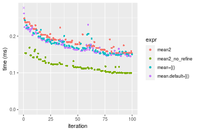

#### A 80% subset
```r
> x <- data[["n = 100000"]]
> subset
[1] 0.8
> idxs <- sort(sample(length(x), size = subset * length(x), replace = FALSE))
> gc()
           used  (Mb) gc trigger  (Mb) max used  (Mb)
Ncells  5347553 285.6    7916910 422.9  7916910 422.9
Vcells 21487559 164.0   54892165 418.8 94934136 724.3
> stats <- microbenchmark(mean2 = mean2(x, idxs = idxs, refine = TRUE), mean2_no_refine = mean2(x, 
+     idxs = idxs, refine = FALSE), `mean+[()` = mean2_R_v1(x, idxs = idxs), `mean.default+[()` = mean2_R_v2(x, 
+     idxs = idxs), unit = "ms")
```

_Table: Benchmarking of mean2(), mean2_no_refine(), mean+[()() and mean.default+[()() on double+n = 100000+0.8 data. The top panel shows times in milliseconds and the bottom panel shows relative times._


|   |expr             |      min|        lq|      mean|    median|       uq|      max|
|:--|:----------------|--------:|---------:|---------:|---------:|--------:|--------:|
|2  |mean2_no_refine  | 0.186943| 0.1875200| 0.2121366| 0.2025785| 0.228860| 0.317327|
|4  |mean.default+[() | 0.261512| 0.2683015| 0.3235838| 0.3020175| 0.370536| 0.520009|
|3  |mean+[()         | 0.264410| 0.2786960| 0.3385849| 0.3165955| 0.384946| 0.625382|
|1  |mean2            | 0.289844| 0.2908345| 0.3382736| 0.3217065| 0.376748| 0.515944|


|   |expr             |      min|       lq|     mean|   median|       uq|      max|
|:--|:----------------|--------:|--------:|--------:|--------:|--------:|--------:|
|2  |mean2_no_refine  | 1.000000| 1.000000| 1.000000| 1.000000| 1.000000| 1.000000|
|4  |mean.default+[() | 1.398886| 1.430789| 1.525355| 1.490867| 1.619051| 1.638716|
|3  |mean+[()         | 1.414388| 1.486220| 1.596070| 1.562829| 1.682015| 1.970781|
|1  |mean2            | 1.550441| 1.550952| 1.594602| 1.588059| 1.646194| 1.625906|

_Figure: Benchmarking of mean2(), mean2_no_refine(), mean+[()() and mean.default+[()() on double+n = 100000+0.8 data.  Outliers are displayed as crosses.  Times are in milliseconds._


### n = 1000000 vector


#### All elements
```r
> x <- data[["n = 1000000"]]
> gc()
           used  (Mb) gc trigger  (Mb) max used  (Mb)
Ncells  5347563 285.6    7916910 422.9  7916910 422.9
Vcells 21487127 164.0   54892165 418.8 94934136 724.3
> stats <- microbenchmark(mean2 = mean2(x, refine = TRUE), mean2_no_refine = mean2(x, refine = FALSE), 
+     mean = mean(x), mean.default = mean.default(x), unit = "ms")
```

_Table: Benchmarking of mean2(), mean2_no_refine(), mean() and mean.default() on n = 1000000+all data. The top panel shows times in milliseconds and the bottom panel shows relative times._


|   |expr            |      min|       lq|     mean|   median|       uq|      max|
|:--|:---------------|--------:|--------:|--------:|--------:|--------:|--------:|
|2  |mean2_no_refine | 1.084968| 1.119546| 1.200236| 1.165453| 1.203855| 1.870008|
|4  |mean.default    | 1.647657| 1.705947| 1.806631| 1.756751| 1.837757| 2.478214|
|3  |mean            | 1.644539| 1.731426| 1.818524| 1.800603| 1.869951| 2.495900|
|1  |mean2           | 2.172183| 2.227528| 2.346593| 2.291418| 2.377251| 3.759157|


|   |expr            |      min|       lq|     mean|   median|       uq|      max|
|:--|:---------------|--------:|--------:|--------:|--------:|--------:|--------:|
|2  |mean2_no_refine | 1.000000| 1.000000| 1.000000| 1.000000| 1.000000| 1.000000|
|4  |mean.default    | 1.518623| 1.523784| 1.505229| 1.507355| 1.526560| 1.325243|
|3  |mean            | 1.515749| 1.546542| 1.515138| 1.544981| 1.553302| 1.334700|
|1  |mean2           | 2.002071| 1.989670| 1.955109| 1.966118| 1.974698| 2.010236|

_Figure: Benchmarking of mean2(), mean2_no_refine(), mean() and mean.default() on n = 1000000+all data.  Outliers are displayed as crosses.  Times are in milliseconds._


#### A 20% subset
```r
> x <- data[["n = 1000000"]]
> subset
[1] 0.2
> idxs <- sort(sample(length(x), size = subset * length(x), replace = FALSE))
> gc()
           used  (Mb) gc trigger  (Mb) max used  (Mb)
Ncells  5347712 285.6    7916910 422.9  7916910 422.9
Vcells 21547660 164.4   54892165 418.8 94934136 724.3
> stats <- microbenchmark(mean2 = mean2(x, idxs = idxs, refine = TRUE), mean2_no_refine = mean2(x, 
+     idxs = idxs, refine = FALSE), `mean+[()` = mean2_R_v1(x, idxs = idxs), `mean.default+[()` = mean2_R_v2(x, 
+     idxs = idxs), unit = "ms")
```

_Table: Benchmarking of mean2(), mean2_no_refine(), mean+[()() and mean.default+[()() on double+n = 1000000+0.2 data. The top panel shows times in milliseconds and the bottom panel shows relative times._


|   |expr             |      min|       lq|      mean|    median|        uq|       max|
|:--|:----------------|--------:|--------:|---------:|---------:|---------:|---------:|
|2  |mean2_no_refine  | 0.745584| 0.830596| 0.9484822| 0.8859205| 0.9779515|  1.575263|
|1  |mean2            | 1.194177| 1.343805| 1.5391119| 1.4253620| 1.6089785|  2.834571|
|3  |mean+[()         | 1.130618| 1.383927| 1.7654041| 1.6769295| 1.7737485| 17.628140|
|4  |mean.default+[() | 1.166562| 1.474412| 1.7155767| 1.7129150| 1.7970410|  3.548100|


|   |expr             |      min|       lq|     mean|   median|       uq|       max|
|:--|:----------------|--------:|--------:|--------:|--------:|--------:|---------:|
|2  |mean2_no_refine  | 1.000000| 1.000000| 1.000000| 1.000000| 1.000000|  1.000000|
|1  |mean2            | 1.601667| 1.617880| 1.622710| 1.608905| 1.645254|  1.799427|
|3  |mean+[()         | 1.516419| 1.666186| 1.861294| 1.892867| 1.813739| 11.190601|
|4  |mean.default+[() | 1.564628| 1.775126| 1.808760| 1.933486| 1.837556|  2.252386|

_Figure: Benchmarking of mean2(), mean2_no_refine(), mean+[()() and mean.default+[()() on double+n = 1000000+0.2 data.  Outliers are displayed as crosses.  Times are in milliseconds._

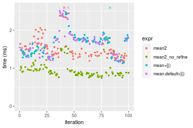

#### A 40% subset
```r
> x <- data[["n = 1000000"]]
> subset
[1] 0.4
> idxs <- sort(sample(length(x), size = subset * length(x), replace = FALSE))
> gc()
           used  (Mb) gc trigger  (Mb) max used  (Mb)
Ncells  5347796 285.7    7916910 422.9  7916910 422.9
Vcells 21647721 165.2   54892165 418.8 94934136 724.3
> stats <- microbenchmark(mean2 = mean2(x, idxs = idxs, refine = TRUE), mean2_no_refine = mean2(x, 
+     idxs = idxs, refine = FALSE), `mean+[()` = mean2_R_v1(x, idxs = idxs), `mean.default+[()` = mean2_R_v2(x, 
+     idxs = idxs), unit = "ms")
```

_Table: Benchmarking of mean2(), mean2_no_refine(), mean+[()() and mean.default+[()() on double+n = 1000000+0.4 data. The top panel shows times in milliseconds and the bottom panel shows relative times._


|   |expr             |      min|       lq|     mean|   median|       uq|       max|
|:--|:----------------|--------:|--------:|--------:|--------:|--------:|---------:|
|2  |mean2_no_refine  | 1.154667| 1.240007| 1.312643| 1.307033| 1.363352|  1.644477|
|1  |mean2            | 1.836903| 1.970395| 2.083372| 2.049998| 2.167930|  2.531606|
|3  |mean+[()         | 1.992156| 2.686151| 2.723728| 2.758100| 2.895196|  3.356348|
|4  |mean.default+[() | 1.926728| 2.680360| 3.070589| 2.786370| 2.896028| 23.352091|


|   |expr             |      min|       lq|     mean|   median|       uq|       max|
|:--|:----------------|--------:|--------:|--------:|--------:|--------:|---------:|
|2  |mean2_no_refine  | 1.000000| 1.000000| 1.000000| 1.000000| 1.000000|  1.000000|
|1  |mean2            | 1.590851| 1.589020| 1.587158| 1.568436| 1.590147|  1.539460|
|3  |mean+[()         | 1.725308| 2.166240| 2.074994| 2.110199| 2.123587|  2.040982|
|4  |mean.default+[() | 1.668644| 2.161569| 2.339240| 2.131828| 2.124197| 14.200315|

_Figure: Benchmarking of mean2(), mean2_no_refine(), mean+[()() and mean.default+[()() on double+n = 1000000+0.4 data.  Outliers are displayed as crosses.  Times are in milliseconds._


#### A 80% subset
```r
> x <- data[["n = 1000000"]]
> subset
[1] 0.8
> idxs <- sort(sample(length(x), size = subset * length(x), replace = FALSE))
> gc()
           used  (Mb) gc trigger  (Mb) max used  (Mb)
Ncells  5347877 285.7    7916910 422.9  7916910 422.9
Vcells 21847775 166.7   54892165 418.8 94934136 724.3
> stats <- microbenchmark(mean2 = mean2(x, idxs = idxs, refine = TRUE), mean2_no_refine = mean2(x, 
+     idxs = idxs, refine = FALSE), `mean+[()` = mean2_R_v1(x, idxs = idxs), `mean.default+[()` = mean2_R_v2(x, 
+     idxs = idxs), unit = "ms")
```

_Table: Benchmarking of mean2(), mean2_no_refine(), mean+[()() and mean.default+[()() on double+n = 1000000+0.8 data. The top panel shows times in milliseconds and the bottom panel shows relative times._


|   |expr             |      min|       lq|     mean|   median|       uq|       max|
|:--|:----------------|--------:|--------:|--------:|--------:|--------:|---------:|
|2  |mean2_no_refine  | 2.076573| 2.159642| 2.322205| 2.228099| 2.392206|  3.587241|
|1  |mean2            | 3.217868| 3.366200| 3.584199| 3.503211| 3.727764|  5.057597|
|4  |mean.default+[() | 3.248398| 3.635093| 4.665304| 4.763008| 4.861496| 14.865250|
|3  |mean+[()         | 3.260758| 3.620653| 4.530265| 4.822929| 4.913578| 14.827025|


|   |expr             |      min|       lq|     mean|   median|       uq|      max|
|:--|:----------------|--------:|--------:|--------:|--------:|--------:|--------:|
|2  |mean2_no_refine  | 1.000000| 1.000000| 1.000000| 1.000000| 1.000000| 1.000000|
|1  |mean2            | 1.549605| 1.558684| 1.543446| 1.572288| 1.558296| 1.409885|
|4  |mean.default+[() | 1.564307| 1.683193| 2.008998| 2.137701| 2.032223| 4.143923|
|3  |mean+[()         | 1.570259| 1.676506| 1.950847| 2.164594| 2.053995| 4.133267|

_Figure: Benchmarking of mean2(), mean2_no_refine(), mean+[()() and mean.default+[()() on double+n = 1000000+0.8 data.  Outliers are displayed as crosses.  Times are in milliseconds._

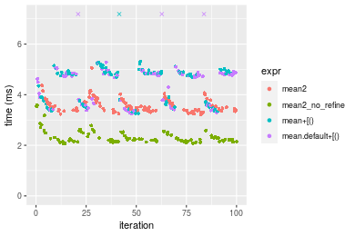


### n = 10000000 vector


#### All elements
```r
> x <- data[["n = 10000000"]]
> gc()
           used  (Mb) gc trigger  (Mb) max used  (Mb)
Ncells  5347887 285.7    7916910 422.9  7916910 422.9
Vcells 21847343 166.7   54892165 418.8 94934136 724.3
> stats <- microbenchmark(mean2 = mean2(x, refine = TRUE), mean2_no_refine = mean2(x, refine = FALSE), 
+     mean = mean(x), mean.default = mean.default(x), unit = "ms")
```

_Table: Benchmarking of mean2(), mean2_no_refine(), mean() and mean.default() on n = 10000000+all data. The top panel shows times in milliseconds and the bottom panel shows relative times._


|   |expr            |      min|       lq|     mean|   median|       uq|      max|
|:--|:---------------|--------:|--------:|--------:|--------:|--------:|--------:|
|2  |mean2_no_refine | 12.05742| 12.34299| 13.30771| 12.61662| 13.12648| 20.39061|
|3  |mean            | 18.26289| 19.06504| 19.89328| 19.20690| 19.90218| 28.48310|
|4  |mean.default    | 18.55781| 19.05214| 19.81446| 19.20971| 19.67350| 29.96884|
|1  |mean2           | 24.13884| 24.60549| 25.54137| 25.15560| 25.70356| 35.64816|


|   |expr            |      min|       lq|     mean|   median|       uq|      max|
|:--|:---------------|--------:|--------:|--------:|--------:|--------:|--------:|
|2  |mean2_no_refine | 1.000000| 1.000000| 1.000000| 1.000000| 1.000000| 1.000000|
|3  |mean            | 1.514659| 1.544605| 1.494869| 1.522349| 1.516186| 1.396874|
|4  |mean.default    | 1.539119| 1.543560| 1.488946| 1.522572| 1.498765| 1.469737|
|1  |mean2           | 2.001990| 1.993480| 1.919291| 1.993846| 1.958146| 1.748264|

_Figure: Benchmarking of mean2(), mean2_no_refine(), mean() and mean.default() on n = 10000000+all data.  Outliers are displayed as crosses.  Times are in milliseconds._


#### A 20% subset
```r
> x <- data[["n = 10000000"]]
> subset
[1] 0.2
> idxs <- sort(sample(length(x), size = subset * length(x), replace = FALSE))
> gc()
           used  (Mb) gc trigger  (Mb) max used  (Mb)
Ncells  5348036 285.7    7916910 422.9  7916910 422.9
Vcells 22449766 171.3   54892165 418.8 94934136 724.3
> stats <- microbenchmark(mean2 = mean2(x, idxs = idxs, refine = TRUE), mean2_no_refine = mean2(x, 
+     idxs = idxs, refine = FALSE), `mean+[()` = mean2_R_v1(x, idxs = idxs), `mean.default+[()` = mean2_R_v2(x, 
+     idxs = idxs), unit = "ms")
```

_Table: Benchmarking of mean2(), mean2_no_refine(), mean+[()() and mean.default+[()() on double+n = 10000000+0.2 data. The top panel shows times in milliseconds and the bottom panel shows relative times._


|   |expr             |       min|        lq|     mean|    median|        uq|      max|
|:--|:----------------|---------:|---------:|--------:|---------:|---------:|--------:|
|2  |mean2_no_refine  |  8.842612|  9.108199|  9.70163|  9.385096|  9.876549| 14.74497|
|1  |mean2            | 14.343695| 14.947731| 15.79439| 15.359806| 16.088828| 22.05634|
|3  |mean+[()         | 14.026245| 18.405489| 19.39216| 18.930086| 20.034273| 31.86399|
|4  |mean.default+[() | 13.649966| 18.462709| 19.51494| 19.329358| 20.303463| 30.02308|


|   |expr             |      min|       lq|     mean|   median|       uq|      max|
|:--|:----------------|--------:|--------:|--------:|--------:|--------:|--------:|
|2  |mean2_no_refine  | 1.000000| 1.000000| 1.000000| 1.000000| 1.000000| 1.000000|
|1  |mean2            | 1.622111| 1.641129| 1.628014| 1.636617| 1.628993| 1.495855|
|3  |mean+[()         | 1.586211| 2.020761| 1.998856| 2.017037| 2.028469| 2.161008|
|4  |mean.default+[() | 1.543658| 2.027043| 2.011511| 2.059580| 2.055724| 2.036158|

_Figure: Benchmarking of mean2(), mean2_no_refine(), mean+[()() and mean.default+[()() on double+n = 10000000+0.2 data.  Outliers are displayed as crosses.  Times are in milliseconds._


#### A 40% subset
```r
> x <- data[["n = 10000000"]]
> subset
[1] 0.4
> idxs <- sort(sample(length(x), size = subset * length(x), replace = FALSE))
> gc()
           used  (Mb) gc trigger  (Mb) max used  (Mb)
Ncells  5348120 285.7    7916910 422.9  7916910 422.9
Vcells 23449827 179.0   54892165 418.8 94934136 724.3
> stats <- microbenchmark(mean2 = mean2(x, idxs = idxs, refine = TRUE), mean2_no_refine = mean2(x, 
+     idxs = idxs, refine = FALSE), `mean+[()` = mean2_R_v1(x, idxs = idxs), `mean.default+[()` = mean2_R_v2(x, 
+     idxs = idxs), unit = "ms")
```

_Table: Benchmarking of mean2(), mean2_no_refine(), mean+[()() and mean.default+[()() on double+n = 10000000+0.4 data. The top panel shows times in milliseconds and the bottom panel shows relative times._


|   |expr             |      min|       lq|     mean|   median|       uq|      max|
|:--|:----------------|--------:|--------:|--------:|--------:|--------:|--------:|
|2  |mean2_no_refine  | 13.38557| 14.22482| 14.60752| 14.46934| 14.89307| 17.41966|
|1  |mean2            | 21.57257| 22.66196| 23.39498| 23.16886| 23.73333| 28.22251|
|4  |mean.default+[() | 21.93596| 22.43135| 26.86379| 23.67327| 31.90814| 38.55702|
|3  |mean+[()         | 22.01277| 22.68463| 27.24690| 23.78662| 32.35292| 41.31454|


|   |expr             |      min|       lq|     mean|   median|       uq|      max|
|:--|:----------------|--------:|--------:|--------:|--------:|--------:|--------:|
|2  |mean2_no_refine  | 1.000000| 1.000000| 1.000000| 1.000000| 1.000000| 1.000000|
|1  |mean2            | 1.611628| 1.593128| 1.601571| 1.601238| 1.593582| 1.620153|
|4  |mean.default+[() | 1.638776| 1.576916| 1.839038| 1.636099| 2.142482| 2.213419|
|3  |mean+[()         | 1.644515| 1.594722| 1.865265| 1.643933| 2.172347| 2.371719|

_Figure: Benchmarking of mean2(), mean2_no_refine(), mean+[()() and mean.default+[()() on double+n = 10000000+0.4 data.  Outliers are displayed as crosses.  Times are in milliseconds._

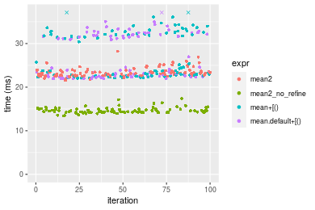

#### A 80% subset
```r
> x <- data[["n = 10000000"]]
> subset
[1] 0.8
> idxs <- sort(sample(length(x), size = subset * length(x), replace = FALSE))
> gc()
           used  (Mb) gc trigger  (Mb) max used  (Mb)
Ncells  5348195 285.7    7916910 422.9  7916910 422.9
Vcells 25449871 194.2   54892165 418.8 94934136 724.3
> stats <- microbenchmark(mean2 = mean2(x, idxs = idxs, refine = TRUE), mean2_no_refine = mean2(x, 
+     idxs = idxs, refine = FALSE), `mean+[()` = mean2_R_v1(x, idxs = idxs), `mean.default+[()` = mean2_R_v2(x, 
+     idxs = idxs), unit = "ms")
```

_Table: Benchmarking of mean2(), mean2_no_refine(), mean+[()() and mean.default+[()() on double+n = 10000000+0.8 data. The top panel shows times in milliseconds and the bottom panel shows relative times._


|   |expr             |      min|       lq|     mean|   median|       uq|       max|
|:--|:----------------|--------:|--------:|--------:|--------:|--------:|---------:|
|2  |mean2_no_refine  | 22.57832| 23.60605| 24.70810| 24.29803| 25.13072|  33.07540|
|1  |mean2            | 35.72502| 37.29216| 38.70859| 38.23601| 39.48672|  45.97980|
|4  |mean.default+[() | 51.40088| 54.59220| 62.16602| 56.73165| 73.34072|  86.73393|
|3  |mean+[()         | 50.37513| 54.05168| 65.55149| 57.02706| 73.28914| 421.26474|


|   |expr             |      min|       lq|     mean|   median|       uq|       max|
|:--|:----------------|--------:|--------:|--------:|--------:|--------:|---------:|
|2  |mean2_no_refine  | 1.000000| 1.000000| 1.000000| 1.000000| 1.000000|  1.000000|
|1  |mean2            | 1.582271| 1.579771| 1.566636| 1.573626| 1.571253|  1.390151|
|4  |mean.default+[() | 2.276559| 2.312636| 2.516018| 2.334825| 2.918369|  2.622309|
|3  |mean+[()         | 2.231129| 2.289738| 2.653037| 2.346983| 2.916316| 12.736498|

_Figure: Benchmarking of mean2(), mean2_no_refine(), mean+[()() and mean.default+[()() on double+n = 10000000+0.8 data.  Outliers are displayed as crosses.  Times are in milliseconds._


## Appendix

### Session information
```r
R version 4.1.1 Patched (2021-08-10 r80727)
Platform: x86_64-pc-linux-gnu (64-bit)
Running under: Ubuntu 18.04.5 LTS

Matrix products: default
BLAS:   /home/hb/software/R-devel/R-4-1-branch/lib/R/lib/libRblas.so
LAPACK: /home/hb/software/R-devel/R-4-1-branch/lib/R/lib/libRlapack.so

locale:
 [1] LC_CTYPE=en_US.UTF-8       LC_NUMERIC=C              
 [3] LC_TIME=en_US.UTF-8        LC_COLLATE=en_US.UTF-8    
 [5] LC_MONETARY=en_US.UTF-8    LC_MESSAGES=en_US.UTF-8   
 [7] LC_PAPER=en_US.UTF-8       LC_NAME=C                 
 [9] LC_ADDRESS=C               LC_TELEPHONE=C            
[11] LC_MEASUREMENT=en_US.UTF-8 LC_IDENTIFICATION=C       

attached base packages:
[1] stats     graphics  grDevices utils     datasets  methods   base     

other attached packages:
[1] microbenchmark_1.4-7   matrixStats_0.60.0     ggplot2_3.3.5         
[4] knitr_1.33             R.devices_2.17.0       R.utils_2.10.1        
[7] R.oo_1.24.0            R.methodsS3_1.8.1-9001 history_0.0.1-9000    

loaded via a namespace (and not attached):
 [1] Biobase_2.52.0          httr_1.4.2              splines_4.1.1          
 [4] bit64_4.0.5             network_1.17.1          assertthat_0.2.1       
 [7] highr_0.9               stats4_4.1.1            blob_1.2.2             
[10] GenomeInfoDbData_1.2.6  robustbase_0.93-8       pillar_1.6.2           
[13] RSQLite_2.2.8           lattice_0.20-44         glue_1.4.2             
[16] digest_0.6.27           XVector_0.32.0          colorspace_2.0-2       
[19] Matrix_1.3-4            XML_3.99-0.7            pkgconfig_2.0.3        
[22] zlibbioc_1.38.0         genefilter_1.74.0       purrr_0.3.4            
[25] ergm_4.1.2              xtable_1.8-4            scales_1.1.1           
[28] tibble_3.1.4            annotate_1.70.0         KEGGREST_1.32.0        
[31] farver_2.1.0            generics_0.1.0          IRanges_2.26.0         
[34] ellipsis_0.3.2          cachem_1.0.6            withr_2.4.2            
[37] BiocGenerics_0.38.0     mime_0.11               survival_3.2-13        
[40] magrittr_2.0.1          crayon_1.4.1            statnet.common_4.5.0   
[43] memoise_2.0.0           laeken_0.5.1            fansi_0.5.0            
[46] R.cache_0.15.0          MASS_7.3-54             R.rsp_0.44.0           
[49] progressr_0.8.0         tools_4.1.1             lifecycle_1.0.0        
[52] S4Vectors_0.30.0        trust_0.1-8             munsell_0.5.0          
[55] tabby_0.0.1-9001        AnnotationDbi_1.54.1    Biostrings_2.60.2      
[58] compiler_4.1.1          GenomeInfoDb_1.28.1     rlang_0.4.11           
[61] grid_4.1.1              RCurl_1.98-1.4          cwhmisc_6.6            
[64] rstudioapi_0.13         rappdirs_0.3.3          startup_0.15.0-9000    
[67] labeling_0.4.2          bitops_1.0-7            base64enc_0.1-3        
[70] boot_1.3-28             gtable_0.3.0            DBI_1.1.1              
[73] markdown_1.1            R6_2.5.1                lpSolveAPI_5.5.2.0-17.7
[76] rle_0.9.2               dplyr_1.0.7             fastmap_1.1.0          
[79] bit_4.0.4               utf8_1.2.2              parallel_4.1.1         
[82] Rcpp_1.0.7              vctrs_0.3.8             png_0.1-7              
[85] DEoptimR_1.0-9          tidyselect_1.1.1        xfun_0.25              
[88] coda_0.19-4            
```
Total processing time was 2.12 mins.


### Reproducibility
To reproduce this report, do:
```r
html <- matrixStats:::benchmark('mean2')
```

[RSP]: https://cran.r-project.org/package=R.rsp
[matrixStats]: https://cran.r-project.org/package=matrixStats

[StackOverflow:colMins?]: https://stackoverflow.com/questions/13676878 "Stack Overflow: fastest way to get Min from every column in a matrix?"
[StackOverflow:colSds?]: https://stackoverflow.com/questions/17549762 "Stack Overflow: Is there such 'colsd' in R?"
[StackOverflow:rowProds?]: https://stackoverflow.com/questions/20198801/ "Stack Overflow: Row product of matrix and column sum of matrix"

---------------------------------------
Copyright Henrik Bengtsson. Last updated on 2021-08-25 22:45:58 (+0200 UTC). Powered by [RSP].

<script>
 var link = document.createElement('link');
 link.rel = 'icon';
 link.href = "data:image/png;base64,iVBORw0KGgoAAAANSUhEUgAAACAAAAAgCAMAAABEpIrGAAAA21BMVEUAAAAAAP8AAP8AAP8AAP8AAP8AAP8AAP8AAP8AAP8AAP8AAP8AAP8AAP8AAP8AAP8AAP8AAP8AAP8AAP8AAP8AAP8AAP8AAP8AAP8AAP8AAP8AAP8AAP8AAP8AAP8AAP8AAP8AAP8AAP8AAP8AAP8AAP8AAP8AAP8AAP8AAP8BAf4CAv0DA/wdHeIeHuEfH+AgIN8hId4lJdomJtknJ9g+PsE/P8BAQL9yco10dIt1dYp3d4h4eIeVlWqWlmmXl2iYmGeZmWabm2Tn5xjo6Bfp6Rb39wj4+Af//wA2M9hbAAAASXRSTlMAAQIJCgsMJSYnKD4/QGRlZmhpamtsbautrrCxuru8y8zN5ebn6Pn6+///////////////////////////////////////////LsUNcQAAAS9JREFUOI29k21XgkAQhVcFytdSMqMETU26UVqGmpaiFbL//xc1cAhhwVNf6n5i5z67M2dmYOyfJZUqlVLhkKucG7cgmUZTybDz6g0iDeq51PUr37Ds2cy2/C9NeES5puDjxuUk1xnToZsg8pfA3avHQ3lLIi7iWRrkv/OYtkScxBIMgDee0ALoyxHQBJ68JLCjOtQIMIANF7QG9G9fNnHvisCHBVMKgSJgiz7nE+AoBKrAPA3MgepvgR9TSCasrCKH0eB1wBGBFdCO+nAGjMVGPcQb5bd6mQRegN6+1axOs9nGfYcCtfi4NQosdtH7dB+txFIpXQqN1p9B/asRHToyS0jRgpV7nk4nwcq1BJ+x3Gl/v7S9Wmpp/aGquum7w3ZDyrADFYrl8vHBH+ev9AUASW1dmU4h4wAAAABJRU5ErkJggg=="
 document.getElementsByTagName('head')[0].appendChild(link);
</script>


