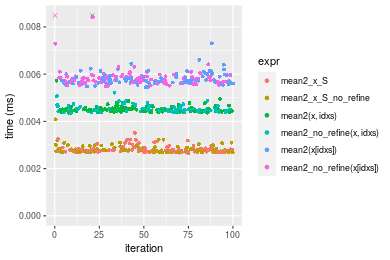
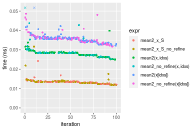
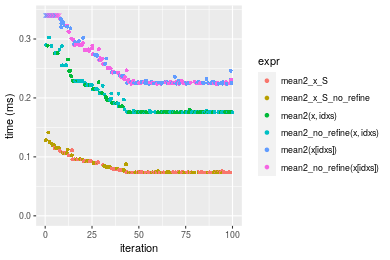
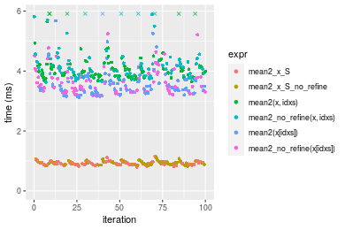
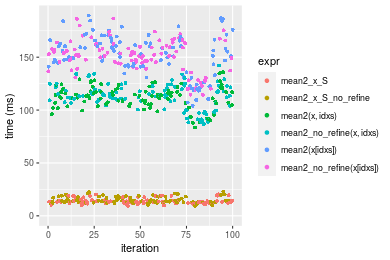
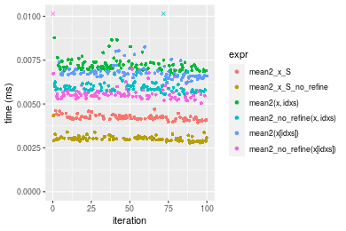
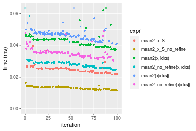
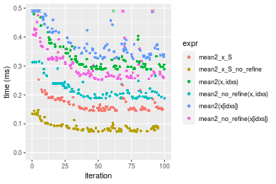
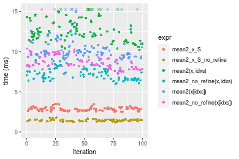
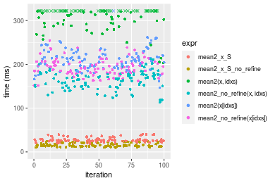

[matrixStats]: Benchmark report

---------------------------------------


# mean2() benchmarks on subsetted computation

This report benchmark the performance of mean2() on subsetted computation.


## Data type "integer"
### Data
```r
> rvector <- function(n, mode = c("logical", "double", "integer"), range = c(-100, +100), na_prob = 0) {
+     mode <- match.arg(mode)
+     if (mode == "logical") {
+         x <- sample(c(FALSE, TRUE), size = n, replace = TRUE)
+     }     else {
+         x <- runif(n, min = range[1], max = range[2])
+     }
+     storage.mode(x) <- mode
+     if (na_prob > 0) 
+         x[sample(n, size = na_prob * n)] <- NA
+     x
+ }
> rvectors <- function(scale = 10, seed = 1, ...) {
+     set.seed(seed)
+     data <- list()
+     data[[1]] <- rvector(n = scale * 100, ...)
+     data[[2]] <- rvector(n = scale * 1000, ...)
+     data[[3]] <- rvector(n = scale * 10000, ...)
+     data[[4]] <- rvector(n = scale * 1e+05, ...)
+     data[[5]] <- rvector(n = scale * 1e+06, ...)
+     names(data) <- sprintf("n = %d", sapply(data, FUN = length))
+     data
+ }
> data <- rvectors(mode = mode)
```

### Results

### n = 1000 vector


```r
> x <- data[["n = 1000"]]
> idxs <- sample.int(length(x), size = length(x) * 0.7)
> x_S <- x[idxs]
> gc()
           used  (Mb) gc trigger  (Mb) max used  (Mb)
Ncells  5346229 285.6    7916910 422.9  7916910 422.9
Vcells 17014748 129.9   39539356 301.7 94934136 724.3
> stats <- microbenchmark(mean2_x_S = mean2(x_S, refine = TRUE), mean2_x_S_no_refine = mean2(x_S, refine = FALSE), 
+     `mean2(x, idxs)` = mean2(x, idxs = idxs, refine = TRUE), `mean2_no_refine(x, idxs)` = mean2(x, 
+         idxs = idxs, refine = FALSE), `mean2(x[idxs])` = mean2(x[idxs], refine = TRUE), `mean2_no_refine(x[idxs])` = mean2(x[idxs], 
+         refine = FALSE), unit = "ms")
```

_Table: Benchmarking of mean2_x_S(), mean2_x_S_no_refine(), mean2(x, idxs)(), mean2_no_refine(x, idxs)(), mean2(x[idxs])() and mean2_no_refine(x[idxs])() on integer+n = 1000 data. The top panel shows times in milliseconds and the bottom panel shows relative times._


|   |expr                     |      min|        lq|      mean|    median|        uq|      max|
|:--|:------------------------|--------:|---------:|---------:|---------:|---------:|--------:|
|2  |mean2_x_S_no_refine      | 0.002679| 0.0027150| 0.0028934| 0.0027715| 0.0028810| 0.009689|
|1  |mean2_x_S                | 0.002662| 0.0027160| 0.0028218| 0.0027740| 0.0028430| 0.003517|
|4  |mean2_no_refine(x, idxs) | 0.004343| 0.0044340| 0.0045670| 0.0044755| 0.0045800| 0.008436|
|3  |mean2(x, idxs)           | 0.004358| 0.0044315| 0.0045226| 0.0044845| 0.0045545| 0.005723|
|5  |mean2(x[idxs])           | 0.005448| 0.0056455| 0.0058082| 0.0057385| 0.0059025| 0.007304|
|6  |mean2_no_refine(x[idxs]) | 0.005491| 0.0056645| 0.0075553| 0.0057805| 0.0059085| 0.177777|


|   |expr                     |       min|       lq|      mean|   median|        uq|        max|
|:--|:------------------------|---------:|--------:|---------:|--------:|---------:|----------:|
|2  |mean2_x_S_no_refine      | 1.0000000| 1.000000| 1.0000000| 1.000000| 1.0000000|  1.0000000|
|1  |mean2_x_S                | 0.9936543| 1.000368| 0.9752813| 1.000902| 0.9868101|  0.3629890|
|4  |mean2_no_refine(x, idxs) | 1.6211273| 1.633149| 1.5784486| 1.614829| 1.5897258|  0.8706781|
|3  |mean2(x, idxs)           | 1.6267264| 1.632228| 1.5630996| 1.618077| 1.5808747|  0.5906698|
|5  |mean2(x[idxs])           | 2.0335946| 2.079374| 2.0074274| 2.070539| 2.0487678|  0.7538446|
|6  |mean2_no_refine(x[idxs]) | 2.0496454| 2.086372| 2.6112513| 2.085694| 2.0508504| 18.3483332|

_Figure: Benchmarking of mean2_x_S(), mean2_x_S_no_refine(), mean2(x, idxs)(), mean2_no_refine(x, idxs)(), mean2(x[idxs])() and mean2_no_refine(x[idxs])() on integer+n = 1000 data.  Outliers are displayed as crosses.  Times are in milliseconds._



### n = 10000 vector


```r
> x <- data[["n = 10000"]]
> idxs <- sample.int(length(x), size = length(x) * 0.7)
> x_S <- x[idxs]
> gc()
           used  (Mb) gc trigger  (Mb) max used  (Mb)
Ncells  5343562 285.4    7916910 422.9  7916910 422.9
Vcells 15885751 121.2   39539356 301.7 94934136 724.3
> stats <- microbenchmark(mean2_x_S = mean2(x_S, refine = TRUE), mean2_x_S_no_refine = mean2(x_S, refine = FALSE), 
+     `mean2(x, idxs)` = mean2(x, idxs = idxs, refine = TRUE), `mean2_no_refine(x, idxs)` = mean2(x, 
+         idxs = idxs, refine = FALSE), `mean2(x[idxs])` = mean2(x[idxs], refine = TRUE), `mean2_no_refine(x[idxs])` = mean2(x[idxs], 
+         refine = FALSE), unit = "ms")
```

_Table: Benchmarking of mean2_x_S(), mean2_x_S_no_refine(), mean2(x, idxs)(), mean2_no_refine(x, idxs)(), mean2(x[idxs])() and mean2_no_refine(x[idxs])() on integer+n = 10000 data. The top panel shows times in milliseconds and the bottom panel shows relative times._


|   |expr                     |      min|        lq|      mean|    median|        uq|      max|
|:--|:------------------------|--------:|---------:|---------:|---------:|---------:|--------:|
|1  |mean2_x_S                | 0.011806| 0.0128000| 0.0133537| 0.0133305| 0.0135930| 0.024226|
|2  |mean2_x_S_no_refine      | 0.011800| 0.0128075| 0.0135270| 0.0134160| 0.0136760| 0.031628|
|4  |mean2_no_refine(x, idxs) | 0.025117| 0.0271390| 0.0287798| 0.0283000| 0.0285155| 0.079392|
|3  |mean2(x, idxs)           | 0.024984| 0.0267295| 0.0279374| 0.0283230| 0.0286770| 0.039879|
|6  |mean2_no_refine(x[idxs]) | 0.031601| 0.0341050| 0.0358402| 0.0356755| 0.0362440| 0.048649|
|5  |mean2(x[idxs])           | 0.032194| 0.0345280| 0.0359147| 0.0358030| 0.0364095| 0.054310|


|   |expr                     |       min|       lq|     mean|   median|       uq|      max|
|:--|:------------------------|---------:|--------:|--------:|--------:|--------:|--------:|
|1  |mean2_x_S                | 1.0000000| 1.000000| 1.000000| 1.000000| 1.000000| 1.000000|
|2  |mean2_x_S_no_refine      | 0.9994918| 1.000586| 1.012974| 1.006414| 1.006106| 1.305540|
|4  |mean2_no_refine(x, idxs) | 2.1274776| 2.120234| 2.155192| 2.122951| 2.097808| 3.277140|
|3  |mean2(x, idxs)           | 2.1162121| 2.088242| 2.092106| 2.124677| 2.109689| 1.646124|
|6  |mean2_no_refine(x[idxs]) | 2.6766898| 2.664453| 2.683917| 2.676231| 2.666372| 2.008132|
|5  |mean2(x[idxs])           | 2.7269185| 2.697500| 2.689494| 2.685796| 2.678548| 2.241806|

_Figure: Benchmarking of mean2_x_S(), mean2_x_S_no_refine(), mean2(x, idxs)(), mean2_no_refine(x, idxs)(), mean2(x[idxs])() and mean2_no_refine(x[idxs])() on integer+n = 10000 data.  Outliers are displayed as crosses.  Times are in milliseconds._



### n = 100000 vector


```r
> x <- data[["n = 100000"]]
> idxs <- sample.int(length(x), size = length(x) * 0.7)
> x_S <- x[idxs]
> gc()
           used  (Mb) gc trigger  (Mb) max used  (Mb)
Ncells  5343661 285.4    7916910 422.9  7916910 422.9
Vcells 15949329 121.7   39539356 301.7 94934136 724.3
> stats <- microbenchmark(mean2_x_S = mean2(x_S, refine = TRUE), mean2_x_S_no_refine = mean2(x_S, refine = FALSE), 
+     `mean2(x, idxs)` = mean2(x, idxs = idxs, refine = TRUE), `mean2_no_refine(x, idxs)` = mean2(x, 
+         idxs = idxs, refine = FALSE), `mean2(x[idxs])` = mean2(x[idxs], refine = TRUE), `mean2_no_refine(x[idxs])` = mean2(x[idxs], 
+         refine = FALSE), unit = "ms")
```

_Table: Benchmarking of mean2_x_S(), mean2_x_S_no_refine(), mean2(x, idxs)(), mean2_no_refine(x, idxs)(), mean2(x[idxs])() and mean2_no_refine(x[idxs])() on integer+n = 100000 data. The top panel shows times in milliseconds and the bottom panel shows relative times._


|   |expr                     |      min|        lq|      mean|    median|        uq|      max|
|:--|:------------------------|--------:|---------:|---------:|---------:|---------:|--------:|
|2  |mean2_x_S_no_refine      | 0.073474| 0.0735800| 0.0841975| 0.0737455| 0.0915115| 0.141297|
|1  |mean2_x_S                | 0.073487| 0.0735915| 0.0813215| 0.0737755| 0.0917265| 0.115134|
|3  |mean2(x, idxs)           | 0.175472| 0.1757280| 0.1931086| 0.1758890| 0.2018180| 0.288645|
|4  |mean2_no_refine(x, idxs) | 0.175481| 0.1757460| 0.1985619| 0.1760840| 0.2210415| 0.302460|
|5  |mean2(x[idxs])           | 0.223684| 0.2252090| 0.2606633| 0.2270950| 0.2903330| 0.479048|
|6  |mean2_no_refine(x[idxs]) | 0.223673| 0.2251325| 0.2644887| 0.2372160| 0.2899310| 0.435036|


|   |expr                     |      min|       lq|      mean|   median|       uq|       max|
|:--|:------------------------|--------:|--------:|---------:|--------:|--------:|---------:|
|2  |mean2_x_S_no_refine      | 1.000000| 1.000000| 1.0000000| 1.000000| 1.000000| 1.0000000|
|1  |mean2_x_S                | 1.000177| 1.000156| 0.9658427| 1.000407| 1.002349| 0.8148368|
|3  |mean2(x, idxs)           | 2.388219| 2.388258| 2.2935192| 2.385081| 2.205384| 2.0428247|
|4  |mean2_no_refine(x, idxs) | 2.388342| 2.388502| 2.3582876| 2.387725| 2.415450| 2.1405975|
|5  |mean2(x[idxs])           | 3.044397| 3.060737| 3.0958559| 3.079442| 3.172639| 3.3903621|
|6  |mean2_no_refine(x[idxs]) | 3.044247| 3.059697| 3.1412896| 3.216684| 3.168247| 3.0788764|

_Figure: Benchmarking of mean2_x_S(), mean2_x_S_no_refine(), mean2(x, idxs)(), mean2_no_refine(x, idxs)(), mean2(x[idxs])() and mean2_no_refine(x[idxs])() on integer+n = 100000 data.  Outliers are displayed as crosses.  Times are in milliseconds._



### n = 1000000 vector


```r
> x <- data[["n = 1000000"]]
> idxs <- sample.int(length(x), size = length(x) * 0.7)
> x_S <- x[idxs]
> gc()
           used  (Mb) gc trigger  (Mb) max used  (Mb)
Ncells  5343760 285.4    7916910 422.9  7916910 422.9
Vcells 16579615 126.5   39539356 301.7 94934136 724.3
> stats <- microbenchmark(mean2_x_S = mean2(x_S, refine = TRUE), mean2_x_S_no_refine = mean2(x_S, refine = FALSE), 
+     `mean2(x, idxs)` = mean2(x, idxs = idxs, refine = TRUE), `mean2_no_refine(x, idxs)` = mean2(x, 
+         idxs = idxs, refine = FALSE), `mean2(x[idxs])` = mean2(x[idxs], refine = TRUE), `mean2_no_refine(x[idxs])` = mean2(x[idxs], 
+         refine = FALSE), unit = "ms")
```

_Table: Benchmarking of mean2_x_S(), mean2_x_S_no_refine(), mean2(x, idxs)(), mean2_no_refine(x, idxs)(), mean2(x[idxs])() and mean2_no_refine(x[idxs])() on integer+n = 1000000 data. The top panel shows times in milliseconds and the bottom panel shows relative times._


|   |expr                     |      min|        lq|      mean|   median|       uq|       max|
|:--|:------------------------|--------:|---------:|---------:|--------:|--------:|---------:|
|1  |mean2_x_S                | 0.797124| 0.8867120| 0.9276662| 0.921480| 0.964449|  1.208392|
|2  |mean2_x_S_no_refine      | 0.792487| 0.8909325| 0.9344205| 0.930534| 0.974582|  1.108519|
|3  |mean2(x, idxs)           | 2.304069| 2.5442640| 2.8272858| 2.739886| 2.932145|  6.009656|
|4  |mean2_no_refine(x, idxs) | 2.330342| 2.5830600| 2.9430296| 2.748366| 3.006038|  6.111460|
|5  |mean2(x[idxs])           | 3.028176| 3.5891290| 4.5712891| 4.148489| 5.073321| 15.984561|
|6  |mean2_no_refine(x[idxs]) | 3.049728| 3.5750345| 4.3986760| 4.232615| 4.926449| 14.930561|


|   |expr                     |       min|       lq|     mean|   median|       uq|        max|
|:--|:------------------------|---------:|--------:|--------:|--------:|--------:|----------:|
|1  |mean2_x_S                | 1.0000000| 1.000000| 1.000000| 1.000000| 1.000000|  1.0000000|
|2  |mean2_x_S_no_refine      | 0.9941828| 1.004760| 1.007281| 1.009826| 1.010506|  0.9173505|
|3  |mean2(x, idxs)           | 2.8904775| 2.869324| 3.047740| 2.973354| 3.040228|  4.9732670|
|4  |mean2_no_refine(x, idxs) | 2.9234373| 2.913077| 3.172509| 2.982557| 3.116844|  5.0575144|
|5  |mean2(x[idxs])           | 3.7988770| 4.047683| 4.927731| 4.501985| 5.260331| 13.2279600|
|6  |mean2_no_refine(x[idxs]) | 3.8259142| 4.031788| 4.741658| 4.593280| 5.108045| 12.3557265|

_Figure: Benchmarking of mean2_x_S(), mean2_x_S_no_refine(), mean2(x, idxs)(), mean2_no_refine(x, idxs)(), mean2(x[idxs])() and mean2_no_refine(x[idxs])() on integer+n = 1000000 data.  Outliers are displayed as crosses.  Times are in milliseconds._



### n = 10000000 vector


```r
> x <- data[["n = 10000000"]]
> idxs <- sample.int(length(x), size = length(x) * 0.7)
> x_S <- x[idxs]
> gc()
           used  (Mb) gc trigger  (Mb) max used  (Mb)
Ncells  5343859 285.4    7916910 422.9  7916910 422.9
Vcells 22880280 174.6   39539356 301.7 94934136 724.3
> stats <- microbenchmark(mean2_x_S = mean2(x_S, refine = TRUE), mean2_x_S_no_refine = mean2(x_S, refine = FALSE), 
+     `mean2(x, idxs)` = mean2(x, idxs = idxs, refine = TRUE), `mean2_no_refine(x, idxs)` = mean2(x, 
+         idxs = idxs, refine = FALSE), `mean2(x[idxs])` = mean2(x[idxs], refine = TRUE), `mean2_no_refine(x[idxs])` = mean2(x[idxs], 
+         refine = FALSE), unit = "ms")
```

_Table: Benchmarking of mean2_x_S(), mean2_x_S_no_refine(), mean2(x, idxs)(), mean2_no_refine(x, idxs)(), mean2(x[idxs])() and mean2_no_refine(x[idxs])() on integer+n = 10000000 data. The top panel shows times in milliseconds and the bottom panel shows relative times._


|   |expr                     |        min|        lq|     mean|    median|        uq|       max|
|:--|:------------------------|----------:|---------:|--------:|---------:|---------:|---------:|
|1  |mean2_x_S                |   9.392315|  12.13718|  13.8573|  13.22215|  14.70686|  20.28899|
|2  |mean2_x_S_no_refine      |   9.473921|  12.62147|  14.8040|  13.91564|  17.32832|  22.79262|
|3  |mean2(x, idxs)           |  83.504952| 106.03663| 112.2134| 113.38030| 118.42927| 135.76966|
|4  |mean2_no_refine(x, idxs) |  86.889893| 104.18003| 112.2513| 113.50355| 121.66386| 142.11418|
|6  |mean2_no_refine(x[idxs]) | 114.336552| 144.33245| 151.0674| 152.17082| 161.03930| 186.60792|
|5  |mean2(x[idxs])           | 104.054642| 141.70683| 152.4366| 155.60037| 165.71799| 189.46797|


|   |expr                     |       min|        lq|      mean|    median|        uq|      max|
|:--|:------------------------|---------:|---------:|---------:|---------:|---------:|--------:|
|1  |mean2_x_S                |  1.000000|  1.000000|  1.000000|  1.000000|  1.000000| 1.000000|
|2  |mean2_x_S_no_refine      |  1.008689|  1.039901|  1.068318|  1.052449|  1.178247| 1.123398|
|3  |mean2(x, idxs)           |  8.890774|  8.736510|  8.097789|  8.575025|  8.052657| 6.691789|
|4  |mean2_no_refine(x, idxs) |  9.251169|  8.583542|  8.100524|  8.584346|  8.272594| 7.004497|
|6  |mean2_no_refine(x[idxs]) | 12.173415| 11.891758| 10.901648| 11.508776| 10.949947| 9.197496|
|5  |mean2(x[idxs])           | 11.078700| 11.675429| 11.000457| 11.768156| 11.268077| 9.338462|

_Figure: Benchmarking of mean2_x_S(), mean2_x_S_no_refine(), mean2(x, idxs)(), mean2_no_refine(x, idxs)(), mean2(x[idxs])() and mean2_no_refine(x[idxs])() on integer+n = 10000000 data.  Outliers are displayed as crosses.  Times are in milliseconds._




## Data type "double"
### Data
```r
> rvector <- function(n, mode = c("logical", "double", "integer"), range = c(-100, +100), na_prob = 0) {
+     mode <- match.arg(mode)
+     if (mode == "logical") {
+         x <- sample(c(FALSE, TRUE), size = n, replace = TRUE)
+     }     else {
+         x <- runif(n, min = range[1], max = range[2])
+     }
+     storage.mode(x) <- mode
+     if (na_prob > 0) 
+         x[sample(n, size = na_prob * n)] <- NA
+     x
+ }
> rvectors <- function(scale = 10, seed = 1, ...) {
+     set.seed(seed)
+     data <- list()
+     data[[1]] <- rvector(n = scale * 100, ...)
+     data[[2]] <- rvector(n = scale * 1000, ...)
+     data[[3]] <- rvector(n = scale * 10000, ...)
+     data[[4]] <- rvector(n = scale * 1e+05, ...)
+     data[[5]] <- rvector(n = scale * 1e+06, ...)
+     names(data) <- sprintf("n = %d", sapply(data, FUN = length))
+     data
+ }
> data <- rvectors(mode = mode)
```

### Results

### n = 1000 vector


```r
> x <- data[["n = 1000"]]
> idxs <- sample.int(length(x), size = length(x) * 0.7)
> x_S <- x[idxs]
> gc()
           used  (Mb) gc trigger  (Mb) max used  (Mb)
Ncells  5343961 285.4    7916910 422.9  7916910 422.9
Vcells 21437275 163.6   39539356 301.7 94934136 724.3
> stats <- microbenchmark(mean2_x_S = mean2(x_S, refine = TRUE), mean2_x_S_no_refine = mean2(x_S, refine = FALSE), 
+     `mean2(x, idxs)` = mean2(x, idxs = idxs, refine = TRUE), `mean2_no_refine(x, idxs)` = mean2(x, 
+         idxs = idxs, refine = FALSE), `mean2(x[idxs])` = mean2(x[idxs], refine = TRUE), `mean2_no_refine(x[idxs])` = mean2(x[idxs], 
+         refine = FALSE), unit = "ms")
```

_Table: Benchmarking of mean2_x_S(), mean2_x_S_no_refine(), mean2(x, idxs)(), mean2_no_refine(x, idxs)(), mean2(x[idxs])() and mean2_no_refine(x[idxs])() on double+n = 1000 data. The top panel shows times in milliseconds and the bottom panel shows relative times._


|   |expr                     |      min|        lq|      mean|    median|        uq|      max|
|:--|:------------------------|--------:|---------:|---------:|---------:|---------:|--------:|
|2  |mean2_x_S_no_refine      | 0.002568| 0.0026230| 0.0027211| 0.0026865| 0.0027715| 0.004095|
|1  |mean2_x_S                | 0.003718| 0.0037865| 0.0038905| 0.0038435| 0.0039230| 0.004834|
|4  |mean2_no_refine(x, idxs) | 0.004207| 0.0042835| 0.0043910| 0.0043495| 0.0044375| 0.005166|
|6  |mean2_no_refine(x[idxs]) | 0.004932| 0.0051495| 0.0056211| 0.0052980| 0.0055275| 0.029869|
|3  |mean2(x, idxs)           | 0.005676| 0.0057890| 0.0060261| 0.0058575| 0.0059915| 0.013501|
|5  |mean2(x[idxs])           | 0.006182| 0.0063395| 0.0065188| 0.0064440| 0.0066095| 0.008110|


|   |expr                     |      min|       lq|     mean|   median|       uq|      max|
|:--|:------------------------|--------:|--------:|--------:|--------:|--------:|--------:|
|2  |mean2_x_S_no_refine      | 1.000000| 1.000000| 1.000000| 1.000000| 1.000000| 1.000000|
|1  |mean2_x_S                | 1.447819| 1.443576| 1.429779| 1.430672| 1.415479| 1.180464|
|4  |mean2_no_refine(x, idxs) | 1.638240| 1.633054| 1.613703| 1.619021| 1.601118| 1.261538|
|6  |mean2_no_refine(x[idxs]) | 1.920561| 1.963210| 2.065761| 1.972083| 1.994407| 7.294017|
|3  |mean2(x, idxs)           | 2.210280| 2.207015| 2.214621| 2.180346| 2.161826| 3.296947|
|5  |mean2(x[idxs])           | 2.407321| 2.416889| 2.395683| 2.398660| 2.384810| 1.980464|

_Figure: Benchmarking of mean2_x_S(), mean2_x_S_no_refine(), mean2(x, idxs)(), mean2_no_refine(x, idxs)(), mean2(x[idxs])() and mean2_no_refine(x[idxs])() on double+n = 1000 data.  Outliers are displayed as crosses.  Times are in milliseconds._



### n = 10000 vector


```r
> x <- data[["n = 10000"]]
> idxs <- sample.int(length(x), size = length(x) * 0.7)
> x_S <- x[idxs]
> gc()
           used  (Mb) gc trigger  (Mb) max used  (Mb)
Ncells  5344057 285.5    7916910 422.9  7916910 422.9
Vcells 21447233 163.7   39539356 301.7 94934136 724.3
> stats <- microbenchmark(mean2_x_S = mean2(x_S, refine = TRUE), mean2_x_S_no_refine = mean2(x_S, refine = FALSE), 
+     `mean2(x, idxs)` = mean2(x, idxs = idxs, refine = TRUE), `mean2_no_refine(x, idxs)` = mean2(x, 
+         idxs = idxs, refine = FALSE), `mean2(x[idxs])` = mean2(x[idxs], refine = TRUE), `mean2_no_refine(x[idxs])` = mean2(x[idxs], 
+         refine = FALSE), unit = "ms")
```

_Table: Benchmarking of mean2_x_S(), mean2_x_S_no_refine(), mean2(x, idxs)(), mean2_no_refine(x, idxs)(), mean2(x[idxs])() and mean2_no_refine(x[idxs])() on double+n = 10000 data. The top panel shows times in milliseconds and the bottom panel shows relative times._


|   |expr                     |      min|        lq|      mean|    median|        uq|      max|
|:--|:------------------------|--------:|---------:|---------:|---------:|---------:|--------:|
|2  |mean2_x_S_no_refine      | 0.011529| 0.0124345| 0.0131386| 0.0134575| 0.0137425| 0.016491|
|1  |mean2_x_S                | 0.021683| 0.0232830| 0.0247345| 0.0246010| 0.0255325| 0.039620|
|4  |mean2_no_refine(x, idxs) | 0.024507| 0.0265645| 0.0285094| 0.0278905| 0.0290310| 0.063720|
|6  |mean2_no_refine(x[idxs]) | 0.030129| 0.0328290| 0.0350074| 0.0347835| 0.0355420| 0.048748|
|3  |mean2(x, idxs)           | 0.037147| 0.0400865| 0.0426263| 0.0434240| 0.0437385| 0.067930|
|5  |mean2(x[idxs])           | 0.040544| 0.0441535| 0.0467372| 0.0469495| 0.0478245| 0.077817|


|   |expr                     |      min|       lq|     mean|   median|       uq|      max|
|:--|:------------------------|--------:|--------:|--------:|--------:|--------:|--------:|
|2  |mean2_x_S_no_refine      | 1.000000| 1.000000| 1.000000| 1.000000| 1.000000| 1.000000|
|1  |mean2_x_S                | 1.880735| 1.872452| 1.882578| 1.828051| 1.857922| 2.402523|
|4  |mean2_no_refine(x, idxs) | 2.125683| 2.136354| 2.169896| 2.072487| 2.112498| 3.863926|
|6  |mean2_no_refine(x[idxs]) | 2.613323| 2.640154| 2.664471| 2.584693| 2.586283| 2.956037|
|3  |mean2(x, idxs)           | 3.222049| 3.223813| 3.244352| 3.226751| 3.182718| 4.119217|
|5  |mean2(x[idxs])           | 3.516697| 3.550887| 3.557239| 3.488724| 3.480044| 4.718756|

_Figure: Benchmarking of mean2_x_S(), mean2_x_S_no_refine(), mean2(x, idxs)(), mean2_no_refine(x, idxs)(), mean2(x[idxs])() and mean2_no_refine(x[idxs])() on double+n = 10000 data.  Outliers are displayed as crosses.  Times are in milliseconds._



### n = 100000 vector


```r
> x <- data[["n = 100000"]]
> idxs <- sample.int(length(x), size = length(x) * 0.7)
> x_S <- x[idxs]
> gc()
           used  (Mb) gc trigger  (Mb) max used  (Mb)
Ncells  5344156 285.5    7916910 422.9  7916910 422.9
Vcells 21542339 164.4   39539356 301.7 94934136 724.3
> stats <- microbenchmark(mean2_x_S = mean2(x_S, refine = TRUE), mean2_x_S_no_refine = mean2(x_S, refine = FALSE), 
+     `mean2(x, idxs)` = mean2(x, idxs = idxs, refine = TRUE), `mean2_no_refine(x, idxs)` = mean2(x, 
+         idxs = idxs, refine = FALSE), `mean2(x[idxs])` = mean2(x[idxs], refine = TRUE), `mean2_no_refine(x[idxs])` = mean2(x[idxs], 
+         refine = FALSE), unit = "ms")
```

_Table: Benchmarking of mean2_x_S(), mean2_x_S_no_refine(), mean2(x, idxs)(), mean2_no_refine(x, idxs)(), mean2(x[idxs])() and mean2_no_refine(x[idxs])() on double+n = 100000 data. The top panel shows times in milliseconds and the bottom panel shows relative times._


|   |expr                     |      min|       lq|      mean|    median|        uq|      max|
|:--|:------------------------|--------:|--------:|---------:|---------:|---------:|--------:|
|2  |mean2_x_S_no_refine      | 0.073473| 0.076329| 0.0895030| 0.0841105| 0.0935915| 0.147389|
|1  |mean2_x_S                | 0.145473| 0.149827| 0.1702611| 0.1551085| 0.1838625| 0.520770|
|4  |mean2_no_refine(x, idxs) | 0.188426| 0.193833| 0.2180048| 0.2058290| 0.2375080| 0.315463|
|6  |mean2_no_refine(x[idxs]) | 0.252566| 0.266935| 0.3164315| 0.2964040| 0.3314100| 0.582847|
|3  |mean2(x, idxs)           | 0.288981| 0.296944| 0.3267770| 0.3055625| 0.3333595| 0.540610|
|5  |mean2(x[idxs])           | 0.322798| 0.337867| 0.3950561| 0.3620625| 0.4264285| 0.829984|


|   |expr                     |      min|       lq|     mean|   median|       uq|      max|
|:--|:------------------------|--------:|--------:|--------:|--------:|--------:|--------:|
|2  |mean2_x_S_no_refine      | 1.000000| 1.000000| 1.000000| 1.000000| 1.000000| 1.000000|
|1  |mean2_x_S                | 1.979952| 1.962911| 1.902294| 1.844104| 1.964521| 3.533303|
|4  |mean2_no_refine(x, idxs) | 2.564561| 2.539441| 2.435725| 2.447126| 2.537709| 2.140343|
|6  |mean2_no_refine(x[idxs]) | 3.437535| 3.497164| 3.535428| 3.523983| 3.541027| 3.954481|
|3  |mean2(x, idxs)           | 3.933159| 3.890317| 3.651016| 3.632870| 3.561857| 3.667913|
|5  |mean2(x[idxs])           | 4.393423| 4.426456| 4.413886| 4.304605| 4.556274| 5.631248|

_Figure: Benchmarking of mean2_x_S(), mean2_x_S_no_refine(), mean2(x, idxs)(), mean2_no_refine(x, idxs)(), mean2(x[idxs])() and mean2_no_refine(x[idxs])() on double+n = 100000 data.  Outliers are displayed as crosses.  Times are in milliseconds._



### n = 1000000 vector


```r
> x <- data[["n = 1000000"]]
> idxs <- sample.int(length(x), size = length(x) * 0.7)
> x_S <- x[idxs]
> gc()
           used  (Mb) gc trigger  (Mb) max used  (Mb)
Ncells  5344255 285.5    7916910 422.9  7916910 422.9
Vcells 22487406 171.6   39539356 301.7 94934136 724.3
> stats <- microbenchmark(mean2_x_S = mean2(x_S, refine = TRUE), mean2_x_S_no_refine = mean2(x_S, refine = FALSE), 
+     `mean2(x, idxs)` = mean2(x, idxs = idxs, refine = TRUE), `mean2_no_refine(x, idxs)` = mean2(x, 
+         idxs = idxs, refine = FALSE), `mean2(x[idxs])` = mean2(x[idxs], refine = TRUE), `mean2_no_refine(x[idxs])` = mean2(x[idxs], 
+         refine = FALSE), unit = "ms")
```

_Table: Benchmarking of mean2_x_S(), mean2_x_S_no_refine(), mean2(x, idxs)(), mean2_no_refine(x, idxs)(), mean2(x[idxs])() and mean2_no_refine(x[idxs])() on double+n = 1000000 data. The top panel shows times in milliseconds and the bottom panel shows relative times._


|   |expr                     |       min|        lq|      mean|    median|        uq|       max|
|:--|:------------------------|---------:|---------:|---------:|---------:|---------:|---------:|
|2  |mean2_x_S_no_refine      |  1.230885|  1.343892|  1.439630|  1.437428|  1.522612|  1.797705|
|1  |mean2_x_S                |  2.489166|  2.652147|  2.842999|  2.835109|  2.960653|  3.524161|
|4  |mean2_no_refine(x, idxs) |  5.964255|  6.614252|  7.457118|  7.203841|  7.824255| 12.777483|
|6  |mean2_no_refine(x[idxs]) |  7.221800|  8.150077|  9.065001|  8.576329|  9.560261| 16.890504|
|5  |mean2(x[idxs])           |  8.529981|  9.520125| 10.625877|  9.909907| 10.849048| 28.367464|
|3  |mean2(x, idxs)           | 10.193729| 11.444287| 13.008162| 12.409895| 14.001493| 21.960129|


|   |expr                     |      min|       lq|     mean|   median|       uq|       max|
|:--|:------------------------|--------:|--------:|--------:|--------:|--------:|---------:|
|2  |mean2_x_S_no_refine      | 1.000000| 1.000000| 1.000000| 1.000000| 1.000000|  1.000000|
|1  |mean2_x_S                | 2.022257| 1.973483| 1.974812| 1.972349| 1.944457|  1.960367|
|4  |mean2_no_refine(x, idxs) | 4.845501| 4.921716| 5.179884| 5.011618| 5.138705|  7.107664|
|6  |mean2_no_refine(x[idxs]) | 5.867161| 6.064535| 6.296756| 5.966440| 6.278856|  9.395593|
|5  |mean2(x[idxs])           | 6.929958| 7.083998| 7.380976| 6.894194| 7.125287| 15.779822|
|3  |mean2(x, idxs)           | 8.281626| 8.515782| 9.035765| 8.633403| 9.195707| 12.215647|

_Figure: Benchmarking of mean2_x_S(), mean2_x_S_no_refine(), mean2(x, idxs)(), mean2_no_refine(x, idxs)(), mean2(x[idxs])() and mean2_no_refine(x[idxs])() on double+n = 1000000 data.  Outliers are displayed as crosses.  Times are in milliseconds._



### n = 10000000 vector


```r
> x <- data[["n = 10000000"]]
> idxs <- sample.int(length(x), size = length(x) * 0.7)
> x_S <- x[idxs]
> gc()
           used  (Mb) gc trigger  (Mb) max used  (Mb)
Ncells  5344354 285.5    7916910 422.9  7916910 422.9
Vcells 31938122 243.7   47527227 362.7 94934136 724.3
> stats <- microbenchmark(mean2_x_S = mean2(x_S, refine = TRUE), mean2_x_S_no_refine = mean2(x_S, refine = FALSE), 
+     `mean2(x, idxs)` = mean2(x, idxs = idxs, refine = TRUE), `mean2_no_refine(x, idxs)` = mean2(x, 
+         idxs = idxs, refine = FALSE), `mean2(x[idxs])` = mean2(x[idxs], refine = TRUE), `mean2_no_refine(x[idxs])` = mean2(x[idxs], 
+         refine = FALSE), unit = "ms")
```

_Table: Benchmarking of mean2_x_S(), mean2_x_S_no_refine(), mean2(x, idxs)(), mean2_no_refine(x, idxs)(), mean2(x[idxs])() and mean2_no_refine(x[idxs])() on double+n = 10000000 data. The top panel shows times in milliseconds and the bottom panel shows relative times._


|   |expr                     |        min|        lq|      mean|    median|        uq|       max|
|:--|:------------------------|----------:|---------:|---------:|---------:|---------:|---------:|
|2  |mean2_x_S_no_refine      |   9.945101|  13.01269|  15.49916|  14.25683|  18.21093|  24.03539|
|1  |mean2_x_S                |  18.255518|  24.04461|  27.35695|  25.87535|  29.05412|  40.64428|
|4  |mean2_no_refine(x, idxs) | 113.465042| 149.09081| 163.52154| 167.07174| 177.39111| 211.85577|
|6  |mean2_no_refine(x[idxs]) | 151.800584| 181.34268| 194.35322| 192.54680| 205.41341| 254.45399|
|5  |mean2(x[idxs])           | 146.893860| 196.24733| 214.24513| 211.35711| 223.84974| 576.89962|
|3  |mean2(x, idxs)           | 203.682130| 300.38533| 323.19607| 328.22621| 350.22217| 395.24234|


|   |expr                     |       min|        lq|     mean|    median|        uq|       max|
|:--|:------------------------|---------:|---------:|--------:|---------:|---------:|---------:|
|2  |mean2_x_S_no_refine      |  1.000000|  1.000000|  1.00000|  1.000000|  1.000000|  1.000000|
|1  |mean2_x_S                |  1.835629|  1.847782|  1.76506|  1.814945|  1.595423|  1.691018|
|4  |mean2_no_refine(x, idxs) | 11.409139| 11.457341| 10.55035| 11.718719|  9.740917|  8.814325|
|6  |mean2_no_refine(x[idxs]) | 15.263855| 13.935835| 12.53960| 13.505586| 11.279680| 10.586638|
|5  |mean2(x[idxs])           | 14.770474| 15.081229| 13.82302| 14.824976| 12.292057| 24.002088|
|3  |mean2(x, idxs)           | 20.480650| 23.084033| 20.85249| 23.022390| 19.231431| 16.444181|

_Figure: Benchmarking of mean2_x_S(), mean2_x_S_no_refine(), mean2(x, idxs)(), mean2_no_refine(x, idxs)(), mean2(x[idxs])() and mean2_no_refine(x[idxs])() on double+n = 10000000 data.  Outliers are displayed as crosses.  Times are in milliseconds._




## Appendix

### Session information
```r
R version 4.1.1 Patched (2021-08-10 r80727)
Platform: x86_64-pc-linux-gnu (64-bit)
Running under: Ubuntu 18.04.5 LTS

Matrix products: default
BLAS:   /home/hb/software/R-devel/R-4-1-branch/lib/R/lib/libRblas.so
LAPACK: /home/hb/software/R-devel/R-4-1-branch/lib/R/lib/libRlapack.so

locale:
 [1] LC_CTYPE=en_US.UTF-8       LC_NUMERIC=C              
 [3] LC_TIME=en_US.UTF-8        LC_COLLATE=en_US.UTF-8    
 [5] LC_MONETARY=en_US.UTF-8    LC_MESSAGES=en_US.UTF-8   
 [7] LC_PAPER=en_US.UTF-8       LC_NAME=C                 
 [9] LC_ADDRESS=C               LC_TELEPHONE=C            
[11] LC_MEASUREMENT=en_US.UTF-8 LC_IDENTIFICATION=C       

attached base packages:
[1] stats     graphics  grDevices utils     datasets  methods   base     

other attached packages:
[1] microbenchmark_1.4-7   matrixStats_0.60.0     ggplot2_3.3.5         
[4] knitr_1.33             R.devices_2.17.0       R.utils_2.10.1        
[7] R.oo_1.24.0            R.methodsS3_1.8.1-9001 history_0.0.1-9000    

loaded via a namespace (and not attached):
 [1] Biobase_2.52.0          httr_1.4.2              splines_4.1.1          
 [4] bit64_4.0.5             network_1.17.1          assertthat_0.2.1       
 [7] highr_0.9               stats4_4.1.1            blob_1.2.2             
[10] GenomeInfoDbData_1.2.6  robustbase_0.93-8       pillar_1.6.2           
[13] RSQLite_2.2.8           lattice_0.20-44         glue_1.4.2             
[16] digest_0.6.27           XVector_0.32.0          colorspace_2.0-2       
[19] Matrix_1.3-4            XML_3.99-0.7            pkgconfig_2.0.3        
[22] zlibbioc_1.38.0         genefilter_1.74.0       purrr_0.3.4            
[25] ergm_4.1.2              xtable_1.8-4            scales_1.1.1           
[28] tibble_3.1.4            annotate_1.70.0         KEGGREST_1.32.0        
[31] farver_2.1.0            generics_0.1.0          IRanges_2.26.0         
[34] ellipsis_0.3.2          cachem_1.0.6            withr_2.4.2            
[37] BiocGenerics_0.38.0     mime_0.11               survival_3.2-13        
[40] magrittr_2.0.1          crayon_1.4.1            statnet.common_4.5.0   
[43] memoise_2.0.0           laeken_0.5.1            fansi_0.5.0            
[46] R.cache_0.15.0          MASS_7.3-54             R.rsp_0.44.0           
[49] progressr_0.8.0         tools_4.1.1             lifecycle_1.0.0        
[52] S4Vectors_0.30.0        trust_0.1-8             munsell_0.5.0          
[55] tabby_0.0.1-9001        AnnotationDbi_1.54.1    Biostrings_2.60.2      
[58] compiler_4.1.1          GenomeInfoDb_1.28.1     rlang_0.4.11           
[61] grid_4.1.1              RCurl_1.98-1.4          cwhmisc_6.6            
[64] rstudioapi_0.13         rappdirs_0.3.3          startup_0.15.0-9000    
[67] labeling_0.4.2          bitops_1.0-7            base64enc_0.1-3        
[70] boot_1.3-28             gtable_0.3.0            DBI_1.1.1              
[73] markdown_1.1            R6_2.5.1                lpSolveAPI_5.5.2.0-17.7
[76] rle_0.9.2               dplyr_1.0.7             fastmap_1.1.0          
[79] bit_4.0.4               utf8_1.2.2              parallel_4.1.1         
[82] Rcpp_1.0.7              vctrs_0.3.8             png_0.1-7              
[85] DEoptimR_1.0-9          tidyselect_1.1.1        xfun_0.25              
[88] coda_0.19-4            
```
Total processing time was 2.82 mins.


### Reproducibility
To reproduce this report, do:
```r
html <- matrixStats:::benchmark('mean2_subset')
```

[RSP]: https://cran.r-project.org/package=R.rsp
[matrixStats]: https://cran.r-project.org/package=matrixStats

[StackOverflow:colMins?]: https://stackoverflow.com/questions/13676878 "Stack Overflow: fastest way to get Min from every column in a matrix?"
[StackOverflow:colSds?]: https://stackoverflow.com/questions/17549762 "Stack Overflow: Is there such 'colsd' in R?"
[StackOverflow:rowProds?]: https://stackoverflow.com/questions/20198801/ "Stack Overflow: Row product of matrix and column sum of matrix"

---------------------------------------
Copyright Dongcan Jiang. Last updated on 2021-08-25 22:43:50 (+0200 UTC). Powered by [RSP].

<script>
 var link = document.createElement('link');
 link.rel = 'icon';
 link.href = "data:image/png;base64,iVBORw0KGgoAAAANSUhEUgAAACAAAAAgCAMAAABEpIrGAAAA21BMVEUAAAAAAP8AAP8AAP8AAP8AAP8AAP8AAP8AAP8AAP8AAP8AAP8AAP8AAP8AAP8AAP8AAP8AAP8AAP8AAP8AAP8AAP8AAP8AAP8AAP8AAP8AAP8AAP8AAP8AAP8AAP8AAP8AAP8AAP8AAP8AAP8AAP8AAP8AAP8AAP8AAP8AAP8BAf4CAv0DA/wdHeIeHuEfH+AgIN8hId4lJdomJtknJ9g+PsE/P8BAQL9yco10dIt1dYp3d4h4eIeVlWqWlmmXl2iYmGeZmWabm2Tn5xjo6Bfp6Rb39wj4+Af//wA2M9hbAAAASXRSTlMAAQIJCgsMJSYnKD4/QGRlZmhpamtsbautrrCxuru8y8zN5ebn6Pn6+///////////////////////////////////////////LsUNcQAAAS9JREFUOI29k21XgkAQhVcFytdSMqMETU26UVqGmpaiFbL//xc1cAhhwVNf6n5i5z67M2dmYOyfJZUqlVLhkKucG7cgmUZTybDz6g0iDeq51PUr37Ds2cy2/C9NeES5puDjxuUk1xnToZsg8pfA3avHQ3lLIi7iWRrkv/OYtkScxBIMgDee0ALoyxHQBJ68JLCjOtQIMIANF7QG9G9fNnHvisCHBVMKgSJgiz7nE+AoBKrAPA3MgepvgR9TSCasrCKH0eB1wBGBFdCO+nAGjMVGPcQb5bd6mQRegN6+1axOs9nGfYcCtfi4NQosdtH7dB+txFIpXQqN1p9B/asRHToyS0jRgpV7nk4nwcq1BJ+x3Gl/v7S9Wmpp/aGquum7w3ZDyrADFYrl8vHBH+ev9AUASW1dmU4h4wAAAABJRU5ErkJggg=="
 document.getElementsByTagName('head')[0].appendChild(link);
</script>


