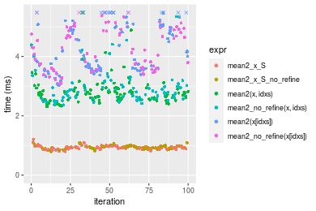
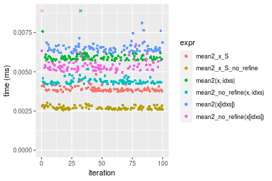

[matrixStats]: Benchmark report

---------------------------------------


# mean2() benchmarks on subsetted computation

This report benchmark the performance of mean2() on subsetted computation.


## Data type "integer"
### Data
```r
> rvector <- function(n, mode = c("logical", "double", "integer"), range = c(-100, +100), na_prob = 0) {
+     mode <- match.arg(mode)
+     if (mode == "logical") {
+         x <- sample(c(FALSE, TRUE), size = n, replace = TRUE)
+     }     else {
+         x <- runif(n, min = range[1], max = range[2])
+     }
+     storage.mode(x) <- mode
+     if (na_prob > 0) 
+         x[sample(n, size = na_prob * n)] <- NA
+     x
+ }
> rvectors <- function(scale = 10, seed = 1, ...) {
+     set.seed(seed)
+     data <- list()
+     data[[1]] <- rvector(n = scale * 100, ...)
+     data[[2]] <- rvector(n = scale * 1000, ...)
+     data[[3]] <- rvector(n = scale * 10000, ...)
+     data[[4]] <- rvector(n = scale * 1e+05, ...)
+     data[[5]] <- rvector(n = scale * 1e+06, ...)
+     names(data) <- sprintf("n = %d", sapply(data, FUN = length))
+     data
+ }
> data <- rvectors(mode = mode)
```

### Results

### n = 1000 vector


```r
> x <- data[["n = 1000"]]
> idxs <- sample.int(length(x), size = length(x) * 0.7)
> x_S <- x[idxs]
> gc()
           used  (Mb) gc trigger  (Mb) max used  (Mb)
Ncells  5279770 282.0   10014072 534.9 10014072 534.9
Vcells 16540530 126.2   38196803 291.5 90959857 694.0
> stats <- microbenchmark(mean2_x_S = mean2(x_S, refine = TRUE), mean2_x_S_no_refine = mean2(x_S, refine = FALSE), 
+     `mean2(x, idxs)` = mean2(x, idxs = idxs, refine = TRUE), `mean2_no_refine(x, idxs)` = mean2(x, 
+         idxs = idxs, refine = FALSE), `mean2(x[idxs])` = mean2(x[idxs], refine = TRUE), `mean2_no_refine(x[idxs])` = mean2(x[idxs], 
+         refine = FALSE), unit = "ms")
```

_Table: Benchmarking of mean2_x_S(), mean2_x_S_no_refine(), mean2(x, idxs)(), mean2_no_refine(x, idxs)(), mean2(x[idxs])() and mean2_no_refine(x[idxs])() on integer+n = 1000 data. The top panel shows times in milliseconds and the bottom panel shows relative times._


|   |expr                     |      min|        lq|      mean|    median|        uq|      max|
|:--|:------------------------|--------:|---------:|---------:|---------:|---------:|--------:|
|2  |mean2_x_S_no_refine      | 0.002584| 0.0026400| 0.0028178| 0.0026860| 0.0028035| 0.009385|
|1  |mean2_x_S                | 0.002568| 0.0026475| 0.0027518| 0.0027070| 0.0027910| 0.003299|
|6  |mean2_no_refine(x[idxs]) | 0.005264| 0.0054185| 0.0068952| 0.0055255| 0.0056345| 0.139587|
|5  |mean2(x[idxs])           | 0.005316| 0.0054550| 0.0055987| 0.0055325| 0.0056425| 0.006519|
|3  |mean2(x, idxs)           | 0.005359| 0.0055205| 0.0057462| 0.0057080| 0.0058795| 0.008364|
|4  |mean2_no_refine(x, idxs) | 0.005362| 0.0055775| 0.0057283| 0.0057280| 0.0058405| 0.006882|


|   |expr                     |      min|       lq|      mean|   median|        uq|        max|
|:--|:------------------------|--------:|--------:|---------:|--------:|---------:|----------:|
|2  |mean2_x_S_no_refine      | 1.000000| 1.000000| 1.0000000| 1.000000| 1.0000000|  1.0000000|
|1  |mean2_x_S                | 0.993808| 1.002841| 0.9765844| 1.007818| 0.9955413|  0.3515184|
|6  |mean2_no_refine(x[idxs]) | 2.037152| 2.052462| 2.4470257| 2.057148| 2.0098092| 14.8734150|
|5  |mean2(x[idxs])           | 2.057275| 2.066288| 1.9869152| 2.059754| 2.0126627|  0.6946191|
|3  |mean2(x, idxs)           | 2.073916| 2.091099| 2.0392543| 2.125093| 2.0971999|  0.8912094|
|4  |mean2_no_refine(x, idxs) | 2.075077| 2.112689| 2.0329018| 2.132539| 2.0832887|  0.7332978|

_Figure: Benchmarking of mean2_x_S(), mean2_x_S_no_refine(), mean2(x, idxs)(), mean2_no_refine(x, idxs)(), mean2(x[idxs])() and mean2_no_refine(x[idxs])() on integer+n = 1000 data.  Outliers are displayed as crosses.  Times are in milliseconds._


### n = 10000 vector


```r
> x <- data[["n = 10000"]]
> idxs <- sample.int(length(x), size = length(x) * 0.7)
> x_S <- x[idxs]
> gc()
           used  (Mb) gc trigger  (Mb) max used  (Mb)
Ncells  5277064 281.9   10014072 534.9 10014072 534.9
Vcells 15411490 117.6   38196803 291.5 90959857 694.0
> stats <- microbenchmark(mean2_x_S = mean2(x_S, refine = TRUE), mean2_x_S_no_refine = mean2(x_S, refine = FALSE), 
+     `mean2(x, idxs)` = mean2(x, idxs = idxs, refine = TRUE), `mean2_no_refine(x, idxs)` = mean2(x, 
+         idxs = idxs, refine = FALSE), `mean2(x[idxs])` = mean2(x[idxs], refine = TRUE), `mean2_no_refine(x[idxs])` = mean2(x[idxs], 
+         refine = FALSE), unit = "ms")
```

_Table: Benchmarking of mean2_x_S(), mean2_x_S_no_refine(), mean2(x, idxs)(), mean2_no_refine(x, idxs)(), mean2(x[idxs])() and mean2_no_refine(x[idxs])() on integer+n = 10000 data. The top panel shows times in milliseconds and the bottom panel shows relative times._


|   |expr                     |      min|        lq|      mean|    median|        uq|      max|
|:--|:------------------------|--------:|---------:|---------:|---------:|---------:|--------:|
|1  |mean2_x_S                | 0.011079| 0.0119855| 0.0126333| 0.0126225| 0.0133525| 0.014033|
|2  |mean2_x_S_no_refine      | 0.011047| 0.0120720| 0.0129918| 0.0128020| 0.0135585| 0.027217|
|6  |mean2_no_refine(x[idxs]) | 0.029988| 0.0322355| 0.0343411| 0.0336790| 0.0362130| 0.051221|
|5  |mean2(x[idxs])           | 0.029608| 0.0326595| 0.0350127| 0.0344035| 0.0364060| 0.059205|
|4  |mean2_no_refine(x, idxs) | 0.031501| 0.0342180| 0.0372017| 0.0357025| 0.0399250| 0.077750|
|3  |mean2(x, idxs)           | 0.031710| 0.0340190| 0.0366801| 0.0359035| 0.0399210| 0.044657|


|   |expr                     |       min|       lq|     mean|   median|       uq|      max|
|:--|:------------------------|---------:|--------:|--------:|--------:|--------:|--------:|
|1  |mean2_x_S                | 1.0000000| 1.000000| 1.000000| 1.000000| 1.000000| 1.000000|
|2  |mean2_x_S_no_refine      | 0.9971117| 1.007217| 1.028377| 1.014221| 1.015428| 1.939500|
|6  |mean2_no_refine(x[idxs]) | 2.7067425| 2.689541| 2.718305| 2.668172| 2.712076| 3.650039|
|5  |mean2(x[idxs])           | 2.6724434| 2.724918| 2.771463| 2.725569| 2.726531| 4.218984|
|4  |mean2_no_refine(x, idxs) | 2.8433072| 2.854950| 2.944732| 2.828481| 2.990077| 5.540512|
|3  |mean2(x, idxs)           | 2.8621717| 2.838346| 2.903450| 2.844405| 2.989777| 3.182285|

_Figure: Benchmarking of mean2_x_S(), mean2_x_S_no_refine(), mean2(x, idxs)(), mean2_no_refine(x, idxs)(), mean2(x[idxs])() and mean2_no_refine(x[idxs])() on integer+n = 10000 data.  Outliers are displayed as crosses.  Times are in milliseconds._


### n = 100000 vector


```r
> x <- data[["n = 100000"]]
> idxs <- sample.int(length(x), size = length(x) * 0.7)
> x_S <- x[idxs]
> gc()
           used  (Mb) gc trigger  (Mb) max used  (Mb)
Ncells  5277163 281.9   10014072 534.9 10014072 534.9
Vcells 15475068 118.1   38196803 291.5 90959857 694.0
> stats <- microbenchmark(mean2_x_S = mean2(x_S, refine = TRUE), mean2_x_S_no_refine = mean2(x_S, refine = FALSE), 
+     `mean2(x, idxs)` = mean2(x, idxs = idxs, refine = TRUE), `mean2_no_refine(x, idxs)` = mean2(x, 
+         idxs = idxs, refine = FALSE), `mean2(x[idxs])` = mean2(x[idxs], refine = TRUE), `mean2_no_refine(x[idxs])` = mean2(x[idxs], 
+         refine = FALSE), unit = "ms")
```

_Table: Benchmarking of mean2_x_S(), mean2_x_S_no_refine(), mean2(x, idxs)(), mean2_no_refine(x, idxs)(), mean2(x[idxs])() and mean2_no_refine(x[idxs])() on integer+n = 100000 data. The top panel shows times in milliseconds and the bottom panel shows relative times._


|   |expr                     |      min|        lq|      mean|   median|        uq|      max|
|:--|:------------------------|--------:|---------:|---------:|--------:|---------:|--------:|
|1  |mean2_x_S                | 0.073574| 0.0742460| 0.0819748| 0.077983| 0.0872790| 0.111330|
|2  |mean2_x_S_no_refine      | 0.073581| 0.0755855| 0.0841658| 0.078266| 0.0893580| 0.130393|
|6  |mean2_no_refine(x[idxs]) | 0.222380| 0.2298200| 0.2802514| 0.280103| 0.3198590| 0.367880|
|5  |mean2(x[idxs])           | 0.222670| 0.2302390| 0.2890823| 0.300284| 0.3238540| 0.465949|
|4  |mean2_no_refine(x, idxs) | 0.248947| 0.2577230| 0.3355481| 0.306960| 0.4230625| 0.445932|
|3  |mean2(x, idxs)           | 0.248918| 0.2613590| 0.3370496| 0.313191| 0.4236015| 0.472057|


|   |expr                     |      min|       lq|     mean|   median|       uq|      max|
|:--|:------------------------|--------:|--------:|--------:|--------:|--------:|--------:|
|1  |mean2_x_S                | 1.000000| 1.000000| 1.000000| 1.000000| 1.000000| 1.000000|
|2  |mean2_x_S_no_refine      | 1.000095| 1.018041| 1.026727| 1.003629| 1.023820| 1.171230|
|6  |mean2_no_refine(x[idxs]) | 3.022535| 3.095386| 3.418751| 3.591847| 3.664788| 3.304410|
|5  |mean2(x[idxs])           | 3.026477| 3.101029| 3.526477| 3.850634| 3.710560| 4.185296|
|4  |mean2_no_refine(x, idxs) | 3.383627| 3.471204| 4.093307| 3.936243| 4.847243| 4.005497|
|3  |mean2(x, idxs)           | 3.383233| 3.520176| 4.111625| 4.016145| 4.853418| 4.240160|

_Figure: Benchmarking of mean2_x_S(), mean2_x_S_no_refine(), mean2(x, idxs)(), mean2_no_refine(x, idxs)(), mean2(x[idxs])() and mean2_no_refine(x[idxs])() on integer+n = 100000 data.  Outliers are displayed as crosses.  Times are in milliseconds._


### n = 1000000 vector


```r
> x <- data[["n = 1000000"]]
> idxs <- sample.int(length(x), size = length(x) * 0.7)
> x_S <- x[idxs]
> gc()
           used  (Mb) gc trigger  (Mb) max used  (Mb)
Ncells  5277262 281.9   10014072 534.9 10014072 534.9
Vcells 16105352 122.9   38196803 291.5 90959857 694.0
> stats <- microbenchmark(mean2_x_S = mean2(x_S, refine = TRUE), mean2_x_S_no_refine = mean2(x_S, refine = FALSE), 
+     `mean2(x, idxs)` = mean2(x, idxs = idxs, refine = TRUE), `mean2_no_refine(x, idxs)` = mean2(x, 
+         idxs = idxs, refine = FALSE), `mean2(x[idxs])` = mean2(x[idxs], refine = TRUE), `mean2_no_refine(x[idxs])` = mean2(x[idxs], 
+         refine = FALSE), unit = "ms")
```

_Table: Benchmarking of mean2_x_S(), mean2_x_S_no_refine(), mean2(x, idxs)(), mean2_no_refine(x, idxs)(), mean2(x[idxs])() and mean2_no_refine(x[idxs])() on integer+n = 1000000 data. The top panel shows times in milliseconds and the bottom panel shows relative times._


|   |expr                     |      min|        lq|      mean|   median|       uq|       max|
|:--|:------------------------|--------:|---------:|---------:|--------:|--------:|---------:|
|1  |mean2_x_S                | 0.800223| 0.8768930| 0.9257178| 0.917053| 0.968961|  1.155232|
|2  |mean2_x_S_no_refine      | 0.831181| 0.8829845| 0.9352793| 0.930980| 0.971657|  1.112803|
|5  |mean2(x[idxs])           | 3.125231| 3.3050970| 3.6332724| 3.438257| 3.696915|  9.531705|
|6  |mean2_no_refine(x[idxs]) | 3.165263| 3.3073390| 3.6310909| 3.480693| 3.793775|  5.241537|
|3  |mean2(x, idxs)           | 3.645651| 3.8381175| 4.3185546| 4.013608| 4.223869| 10.431115|
|4  |mean2_no_refine(x, idxs) | 3.625075| 3.8226610| 4.3646127| 4.056315| 4.293566| 10.750564|


|   |expr                     |      min|       lq|     mean|   median|       uq|       max|
|:--|:------------------------|--------:|--------:|--------:|--------:|--------:|---------:|
|1  |mean2_x_S                | 1.000000| 1.000000| 1.000000| 1.000000| 1.000000| 1.0000000|
|2  |mean2_x_S_no_refine      | 1.038687| 1.006947| 1.010329| 1.015187| 1.002782| 0.9632723|
|5  |mean2(x[idxs])           | 3.905450| 3.769099| 3.924816| 3.749246| 3.815339| 8.2509011|
|6  |mean2_no_refine(x[idxs]) | 3.955476| 3.771656| 3.922460| 3.795520| 3.915302| 4.5372159|
|3  |mean2(x, idxs)           | 4.555794| 4.376951| 4.665087| 4.376637| 4.359173| 9.0294547|
|4  |mean2_no_refine(x, idxs) | 4.530081| 4.359324| 4.714841| 4.423206| 4.431103| 9.3059784|

_Figure: Benchmarking of mean2_x_S(), mean2_x_S_no_refine(), mean2(x, idxs)(), mean2_no_refine(x, idxs)(), mean2(x[idxs])() and mean2_no_refine(x[idxs])() on integer+n = 1000000 data.  Outliers are displayed as crosses.  Times are in milliseconds._



### n = 10000000 vector


```r
> x <- data[["n = 10000000"]]
> idxs <- sample.int(length(x), size = length(x) * 0.7)
> x_S <- x[idxs]
> gc()
           used  (Mb) gc trigger  (Mb) max used  (Mb)
Ncells  5277355 281.9   10014072 534.9 10014072 534.9
Vcells 22406003 171.0   38196803 291.5 90959857 694.0
> stats <- microbenchmark(mean2_x_S = mean2(x_S, refine = TRUE), mean2_x_S_no_refine = mean2(x_S, refine = FALSE), 
+     `mean2(x, idxs)` = mean2(x, idxs = idxs, refine = TRUE), `mean2_no_refine(x, idxs)` = mean2(x, 
+         idxs = idxs, refine = FALSE), `mean2(x[idxs])` = mean2(x[idxs], refine = TRUE), `mean2_no_refine(x[idxs])` = mean2(x[idxs], 
+         refine = FALSE), unit = "ms")
```

_Table: Benchmarking of mean2_x_S(), mean2_x_S_no_refine(), mean2(x, idxs)(), mean2_no_refine(x, idxs)(), mean2(x[idxs])() and mean2_no_refine(x[idxs])() on integer+n = 10000000 data. The top panel shows times in milliseconds and the bottom panel shows relative times._


|   |expr                     |        min|        lq|      mean|    median|        uq|       max|
|:--|:------------------------|----------:|---------:|---------:|---------:|---------:|---------:|
|1  |mean2_x_S                |   9.115439|  12.17078|  13.50109|  13.17884|  14.45016|  18.15385|
|2  |mean2_x_S_no_refine      |   9.432651|  12.67380|  13.97650|  13.22429|  16.46898|  18.25121|
|3  |mean2(x, idxs)           | 114.586250| 136.41926| 143.91092| 143.64755| 151.88777| 165.91152|
|4  |mean2_no_refine(x, idxs) | 119.324511| 137.71016| 148.54318| 143.79196| 150.95445| 535.25255|
|5  |mean2(x[idxs])           | 119.712398| 144.49309| 150.99159| 149.27698| 157.52226| 180.39091|
|6  |mean2_no_refine(x[idxs]) | 116.602669| 145.88058| 151.67426| 151.35528| 157.82635| 177.04008|


|   |expr                     |       min|       lq|      mean|    median|        uq|       max|
|:--|:------------------------|---------:|--------:|---------:|---------:|---------:|---------:|
|1  |mean2_x_S                |  1.000000|  1.00000|  1.000000|  1.000000|  1.000000|  1.000000|
|2  |mean2_x_S_no_refine      |  1.034799|  1.04133|  1.035213|  1.003449|  1.139709|  1.005363|
|3  |mean2(x, idxs)           | 12.570569| 11.20875| 10.659208| 10.899865| 10.511149|  9.139192|
|4  |mean2_no_refine(x, idxs) | 13.090375| 11.31481| 11.002311| 10.910823| 10.446560| 29.484244|
|5  |mean2(x[idxs])           | 13.132927| 11.87213| 11.183660| 11.327022| 10.901075|  9.936785|
|6  |mean2_no_refine(x[idxs]) | 12.791778| 11.98613| 11.234223| 11.484721| 10.922119|  9.752206|

_Figure: Benchmarking of mean2_x_S(), mean2_x_S_no_refine(), mean2(x, idxs)(), mean2_no_refine(x, idxs)(), mean2(x[idxs])() and mean2_no_refine(x[idxs])() on integer+n = 10000000 data.  Outliers are displayed as crosses.  Times are in milliseconds._


## Data type "double"
### Data
```r
> rvector <- function(n, mode = c("logical", "double", "integer"), range = c(-100, +100), na_prob = 0) {
+     mode <- match.arg(mode)
+     if (mode == "logical") {
+         x <- sample(c(FALSE, TRUE), size = n, replace = TRUE)
+     }     else {
+         x <- runif(n, min = range[1], max = range[2])
+     }
+     storage.mode(x) <- mode
+     if (na_prob > 0) 
+         x[sample(n, size = na_prob * n)] <- NA
+     x
+ }
> rvectors <- function(scale = 10, seed = 1, ...) {
+     set.seed(seed)
+     data <- list()
+     data[[1]] <- rvector(n = scale * 100, ...)
+     data[[2]] <- rvector(n = scale * 1000, ...)
+     data[[3]] <- rvector(n = scale * 10000, ...)
+     data[[4]] <- rvector(n = scale * 1e+05, ...)
+     data[[5]] <- rvector(n = scale * 1e+06, ...)
+     names(data) <- sprintf("n = %d", sapply(data, FUN = length))
+     data
+ }
> data <- rvectors(mode = mode)
```

### Results

### n = 1000 vector


```r
> x <- data[["n = 1000"]]
> idxs <- sample.int(length(x), size = length(x) * 0.7)
> x_S <- x[idxs]
> gc()
           used  (Mb) gc trigger  (Mb) max used  (Mb)
Ncells  5277469 281.9   10014072 534.9 10014072 534.9
Vcells 20963018 160.0   45916163 350.4 90959857 694.0
> stats <- microbenchmark(mean2_x_S = mean2(x_S, refine = TRUE), mean2_x_S_no_refine = mean2(x_S, refine = FALSE), 
+     `mean2(x, idxs)` = mean2(x, idxs = idxs, refine = TRUE), `mean2_no_refine(x, idxs)` = mean2(x, 
+         idxs = idxs, refine = FALSE), `mean2(x[idxs])` = mean2(x[idxs], refine = TRUE), `mean2_no_refine(x[idxs])` = mean2(x[idxs], 
+         refine = FALSE), unit = "ms")
```

_Table: Benchmarking of mean2_x_S(), mean2_x_S_no_refine(), mean2(x, idxs)(), mean2_no_refine(x, idxs)(), mean2(x[idxs])() and mean2_no_refine(x[idxs])() on double+n = 1000 data. The top panel shows times in milliseconds and the bottom panel shows relative times._


|   |expr                     |      min|        lq|      mean|    median|        uq|      max|
|:--|:------------------------|--------:|---------:|---------:|---------:|---------:|--------:|
|2  |mean2_x_S_no_refine      | 0.002783| 0.0029465| 0.0030364| 0.0030090| 0.0030950| 0.004337|
|1  |mean2_x_S                | 0.003952| 0.0041525| 0.0042298| 0.0042095| 0.0043150| 0.004706|
|6  |mean2_no_refine(x[idxs]) | 0.005046| 0.0054265| 0.0057719| 0.0055255| 0.0056915| 0.022871|
|4  |mean2_no_refine(x, idxs) | 0.005541| 0.0057865| 0.0061004| 0.0058505| 0.0060590| 0.021482|
|5  |mean2(x[idxs])           | 0.006217| 0.0065995| 0.0068118| 0.0067460| 0.0069210| 0.008251|
|3  |mean2(x, idxs)           | 0.006708| 0.0070085| 0.0072422| 0.0071410| 0.0073440| 0.008773|


|   |expr                     |      min|       lq|     mean|   median|       uq|      max|
|:--|:------------------------|--------:|--------:|--------:|--------:|--------:|--------:|
|2  |mean2_x_S_no_refine      | 1.000000| 1.000000| 1.000000| 1.000000| 1.000000| 1.000000|
|1  |mean2_x_S                | 1.420050| 1.409299| 1.393032| 1.398970| 1.394184| 1.085082|
|6  |mean2_no_refine(x[idxs]) | 1.813151| 1.841677| 1.900911| 1.836324| 1.838934| 5.273461|
|4  |mean2_no_refine(x, idxs) | 1.991017| 1.963855| 2.009110| 1.944334| 1.957674| 4.953194|
|5  |mean2(x[idxs])           | 2.233920| 2.239776| 2.243409| 2.241941| 2.236187| 1.902467|
|3  |mean2(x, idxs)           | 2.410349| 2.378585| 2.385137| 2.373214| 2.372860| 2.022827|

_Figure: Benchmarking of mean2_x_S(), mean2_x_S_no_refine(), mean2(x, idxs)(), mean2_no_refine(x, idxs)(), mean2(x[idxs])() and mean2_no_refine(x[idxs])() on double+n = 1000 data.  Outliers are displayed as crosses.  Times are in milliseconds._



### n = 10000 vector


```r
> x <- data[["n = 10000"]]
> idxs <- sample.int(length(x), size = length(x) * 0.7)
> x_S <- x[idxs]
> gc()
           used  (Mb) gc trigger  (Mb) max used  (Mb)
Ncells  5277559 281.9   10014072 534.9 10014072 534.9
Vcells 20972966 160.1   45916163 350.4 90959857 694.0
> stats <- microbenchmark(mean2_x_S = mean2(x_S, refine = TRUE), mean2_x_S_no_refine = mean2(x_S, refine = FALSE), 
+     `mean2(x, idxs)` = mean2(x, idxs = idxs, refine = TRUE), `mean2_no_refine(x, idxs)` = mean2(x, 
+         idxs = idxs, refine = FALSE), `mean2(x[idxs])` = mean2(x[idxs], refine = TRUE), `mean2_no_refine(x[idxs])` = mean2(x[idxs], 
+         refine = FALSE), unit = "ms")
```

_Table: Benchmarking of mean2_x_S(), mean2_x_S_no_refine(), mean2(x, idxs)(), mean2_no_refine(x, idxs)(), mean2(x[idxs])() and mean2_no_refine(x[idxs])() on double+n = 10000 data. The top panel shows times in milliseconds and the bottom panel shows relative times._


|   |expr                     |      min|        lq|      mean|    median|        uq|      max|
|:--|:------------------------|--------:|---------:|---------:|---------:|---------:|--------:|
|2  |mean2_x_S_no_refine      | 0.013104| 0.0138395| 0.0152112| 0.0149405| 0.0162385| 0.029107|
|1  |mean2_x_S                | 0.022620| 0.0238370| 0.0259145| 0.0255755| 0.0275315| 0.031517|
|6  |mean2_no_refine(x[idxs]) | 0.029470| 0.0326830| 0.0352870| 0.0340785| 0.0373650| 0.054438|
|4  |mean2_no_refine(x, idxs) | 0.032458| 0.0344565| 0.0383638| 0.0369570| 0.0409640| 0.082936|
|5  |mean2(x[idxs])           | 0.038884| 0.0433605| 0.0460765| 0.0451465| 0.0499420| 0.061984|
|3  |mean2(x, idxs)           | 0.043161| 0.0454250| 0.0502614| 0.0490820| 0.0556790| 0.069219|


|   |expr                     |      min|       lq|     mean|   median|       uq|      max|
|:--|:------------------------|--------:|--------:|--------:|--------:|--------:|--------:|
|2  |mean2_x_S_no_refine      | 1.000000| 1.000000| 1.000000| 1.000000| 1.000000| 1.000000|
|1  |mean2_x_S                | 1.726190| 1.722389| 1.703645| 1.711824| 1.695446| 1.082798|
|6  |mean2_no_refine(x[idxs]) | 2.248932| 2.361574| 2.319808| 2.280948| 2.301013| 1.870272|
|4  |mean2_no_refine(x, idxs) | 2.476954| 2.489721| 2.522077| 2.473612| 2.522647| 2.849349|
|5  |mean2(x[idxs])           | 2.967338| 3.133097| 3.029120| 3.021753| 3.075530| 2.129522|
|3  |mean2(x, idxs)           | 3.293727| 3.282272| 3.304235| 3.285165| 3.428827| 2.378088|

_Figure: Benchmarking of mean2_x_S(), mean2_x_S_no_refine(), mean2(x, idxs)(), mean2_no_refine(x, idxs)(), mean2(x[idxs])() and mean2_no_refine(x[idxs])() on double+n = 10000 data.  Outliers are displayed as crosses.  Times are in milliseconds._


### n = 100000 vector


```r
> x <- data[["n = 100000"]]
> idxs <- sample.int(length(x), size = length(x) * 0.7)
> x_S <- x[idxs]
> gc()
           used  (Mb) gc trigger  (Mb) max used  (Mb)
Ncells  5277658 281.9   10014072 534.9 10014072 534.9
Vcells 21068072 160.8   45916163 350.4 90959857 694.0
> stats <- microbenchmark(mean2_x_S = mean2(x_S, refine = TRUE), mean2_x_S_no_refine = mean2(x_S, refine = FALSE), 
+     `mean2(x, idxs)` = mean2(x, idxs = idxs, refine = TRUE), `mean2_no_refine(x, idxs)` = mean2(x, 
+         idxs = idxs, refine = FALSE), `mean2(x[idxs])` = mean2(x[idxs], refine = TRUE), `mean2_no_refine(x[idxs])` = mean2(x[idxs], 
+         refine = FALSE), unit = "ms")
```

_Table: Benchmarking of mean2_x_S(), mean2_x_S_no_refine(), mean2(x, idxs)(), mean2_no_refine(x, idxs)(), mean2(x[idxs])() and mean2_no_refine(x[idxs])() on double+n = 100000 data. The top panel shows times in milliseconds and the bottom panel shows relative times._


|   |expr                     |      min|        lq|      mean|    median|        uq|       max|
|:--|:------------------------|--------:|---------:|---------:|---------:|---------:|---------:|
|2  |mean2_x_S_no_refine      | 0.091510| 0.0923535| 0.1028489| 0.0960915| 0.1151690|  0.158737|
|1  |mean2_x_S                | 0.163534| 0.1648135| 0.1782193| 0.1688740| 0.1885585|  0.221112|
|6  |mean2_no_refine(x[idxs]) | 0.281568| 0.3185360| 0.3729368| 0.3789195| 0.4259985|  0.481383|
|4  |mean2_no_refine(x, idxs) | 0.271287| 0.3004080| 0.3750246| 0.4196975| 0.4294930|  0.517126|
|5  |mean2(x[idxs])           | 0.354540| 0.4322925| 0.5714829| 0.4917675| 0.4992230| 11.298244|
|3  |mean2(x, idxs)           | 0.395053| 0.4435315| 0.5095535| 0.5460865| 0.5577705|  0.626365|


|   |expr                     |      min|       lq|     mean|   median|       uq|       max|
|:--|:------------------------|--------:|--------:|--------:|--------:|--------:|---------:|
|2  |mean2_x_S_no_refine      | 1.000000| 1.000000| 1.000000| 1.000000| 1.000000|  1.000000|
|1  |mean2_x_S                | 1.787062| 1.784594| 1.732826| 1.757429| 1.637233|  1.392946|
|6  |mean2_no_refine(x[idxs]) | 3.076910| 3.449095| 3.626064| 3.943320| 3.698899|  3.032582|
|4  |mean2_no_refine(x, idxs) | 2.964561| 3.252806| 3.646363| 4.367686| 3.729241|  3.257753|
|5  |mean2(x[idxs])           | 3.874331| 4.680846| 5.556528| 5.117700| 4.334699| 71.175870|
|3  |mean2(x, idxs)           | 4.317047| 4.802541| 4.954388| 5.682984| 4.843061|  3.945929|

_Figure: Benchmarking of mean2_x_S(), mean2_x_S_no_refine(), mean2(x, idxs)(), mean2_no_refine(x, idxs)(), mean2(x[idxs])() and mean2_no_refine(x[idxs])() on double+n = 100000 data.  Outliers are displayed as crosses.  Times are in milliseconds._


### n = 1000000 vector


```r
> x <- data[["n = 1000000"]]
> idxs <- sample.int(length(x), size = length(x) * 0.7)
> x_S <- x[idxs]
> gc()
           used  (Mb) gc trigger  (Mb) max used  (Mb)
Ncells  5277757 281.9   10014072 534.9 10014072 534.9
Vcells 22013139 168.0   45916163 350.4 90959857 694.0
> stats <- microbenchmark(mean2_x_S = mean2(x_S, refine = TRUE), mean2_x_S_no_refine = mean2(x_S, refine = FALSE), 
+     `mean2(x, idxs)` = mean2(x, idxs = idxs, refine = TRUE), `mean2_no_refine(x, idxs)` = mean2(x, 
+         idxs = idxs, refine = FALSE), `mean2(x[idxs])` = mean2(x[idxs], refine = TRUE), `mean2_no_refine(x[idxs])` = mean2(x[idxs], 
+         refine = FALSE), unit = "ms")
```

_Table: Benchmarking of mean2_x_S(), mean2_x_S_no_refine(), mean2(x, idxs)(), mean2_no_refine(x, idxs)(), mean2(x[idxs])() and mean2_no_refine(x[idxs])() on double+n = 1000000 data. The top panel shows times in milliseconds and the bottom panel shows relative times._


|   |expr                     |       min|        lq|      mean|    median|        uq|       max|
|:--|:------------------------|---------:|---------:|---------:|---------:|---------:|---------:|
|2  |mean2_x_S_no_refine      |  1.477661|  1.575087|  1.633903|  1.631600|  1.656597|  1.867379|
|1  |mean2_x_S                |  2.534683|  2.841464|  2.964222|  2.939654|  3.038778|  4.777919|
|6  |mean2_no_refine(x[idxs]) |  7.537258|  8.351640|  9.990158| 10.487177| 10.730048| 20.595505|
|4  |mean2_no_refine(x, idxs) |  8.028536|  8.630729| 10.446133| 10.601287| 10.845863| 22.903064|
|5  |mean2(x[idxs])           |  8.912549| 10.792512| 11.803058| 11.802599| 12.172413| 23.492860|
|3  |mean2(x, idxs)           | 13.486971| 15.233434| 15.997093| 16.025139| 16.335349| 26.914936|


|   |expr                     |      min|       lq|     mean|   median|       uq|       max|
|:--|:------------------------|--------:|--------:|--------:|--------:|--------:|---------:|
|2  |mean2_x_S_no_refine      | 1.000000| 1.000000| 1.000000| 1.000000| 1.000000|  1.000000|
|1  |mean2_x_S                | 1.715335| 1.804005| 1.814196| 1.801700| 1.834350|  2.558623|
|6  |mean2_no_refine(x[idxs]) | 5.100803| 5.302337| 6.114289| 6.427541| 6.477164| 11.029098|
|4  |mean2_no_refine(x, idxs) | 5.433273| 5.479527| 6.393360| 6.497479| 6.547076| 12.264818|
|5  |mean2(x[idxs])           | 6.031525| 6.852012| 7.223841| 7.233758| 7.347844| 12.580660|
|3  |mean2(x, idxs)           | 9.127243| 9.671491| 9.790721| 9.821732| 9.860790| 14.413215|

_Figure: Benchmarking of mean2_x_S(), mean2_x_S_no_refine(), mean2(x, idxs)(), mean2_no_refine(x, idxs)(), mean2(x[idxs])() and mean2_no_refine(x[idxs])() on double+n = 1000000 data.  Outliers are displayed as crosses.  Times are in milliseconds._


### n = 10000000 vector


```r
> x <- data[["n = 10000000"]]
> idxs <- sample.int(length(x), size = length(x) * 0.7)
> x_S <- x[idxs]
> gc()
           used  (Mb) gc trigger  (Mb) max used  (Mb)
Ncells  5277856 281.9   10014072 534.9 10014072 534.9
Vcells 31463859 240.1   55179395 421.0 90959857 694.0
> stats <- microbenchmark(mean2_x_S = mean2(x_S, refine = TRUE), mean2_x_S_no_refine = mean2(x_S, refine = FALSE), 
+     `mean2(x, idxs)` = mean2(x, idxs = idxs, refine = TRUE), `mean2_no_refine(x, idxs)` = mean2(x, 
+         idxs = idxs, refine = FALSE), `mean2(x[idxs])` = mean2(x[idxs], refine = TRUE), `mean2_no_refine(x[idxs])` = mean2(x[idxs], 
+         refine = FALSE), unit = "ms")
```

_Table: Benchmarking of mean2_x_S(), mean2_x_S_no_refine(), mean2(x, idxs)(), mean2_no_refine(x, idxs)(), mean2(x[idxs])() and mean2_no_refine(x[idxs])() on double+n = 10000000 data. The top panel shows times in milliseconds and the bottom panel shows relative times._


|   |expr                     |       min|        lq|      mean|    median|        uq|       max|
|:--|:------------------------|---------:|---------:|---------:|---------:|---------:|---------:|
|2  |mean2_x_S_no_refine      |  10.74784|  14.47782|  17.38639|  16.08184|  21.63463|  25.68445|
|1  |mean2_x_S                |  18.57804|  23.61760|  27.82255|  26.69878|  30.62300|  39.31992|
|4  |mean2_no_refine(x, idxs) | 141.85819| 166.82857| 174.61681| 172.25525| 185.52016| 201.06477|
|6  |mean2_no_refine(x[idxs]) | 165.48392| 176.18327| 183.52897| 181.21058| 190.86392| 214.69692|
|5  |mean2(x[idxs])           | 175.56016| 189.54142| 203.03708| 197.70490| 207.18428| 590.36083|
|3  |mean2(x, idxs)           | 277.77005| 306.04679| 315.07886| 313.98737| 327.89649| 352.42674|


|   |expr                     |       min|        lq|      mean|    median|        uq|       max|
|:--|:------------------------|---------:|---------:|---------:|---------:|---------:|---------:|
|2  |mean2_x_S_no_refine      |  1.000000|  1.000000|  1.000000|  1.000000|  1.000000|  1.000000|
|1  |mean2_x_S                |  1.728538|  1.631295|  1.600249|  1.660182|  1.415462|  1.530884|
|4  |mean2_no_refine(x, idxs) | 13.198765| 11.523042| 10.043307| 10.711163|  8.575150|  7.828268|
|6  |mean2_no_refine(x[idxs]) | 15.396949| 12.169182| 10.555901| 11.268023|  8.822150|  8.359022|
|5  |mean2(x[idxs])           | 16.334463| 13.091845| 11.677934| 12.293671|  9.576513| 22.985143|
|3  |mean2(x, idxs)           | 25.844272| 21.139005| 18.122159| 19.524339| 15.156097| 13.721404|

_Figure: Benchmarking of mean2_x_S(), mean2_x_S_no_refine(), mean2(x, idxs)(), mean2_no_refine(x, idxs)(), mean2(x[idxs])() and mean2_no_refine(x[idxs])() on double+n = 10000000 data.  Outliers are displayed as crosses.  Times are in milliseconds._


## Appendix

### Session information
```r
R version 4.1.1 Patched (2021-08-10 r80727)
Platform: x86_64-pc-linux-gnu (64-bit)
Running under: Ubuntu 18.04.5 LTS

Matrix products: default
BLAS:   /home/hb/software/R-devel/R-4-1-branch/lib/R/lib/libRblas.so
LAPACK: /home/hb/software/R-devel/R-4-1-branch/lib/R/lib/libRlapack.so

locale:
 [1] LC_CTYPE=en_US.UTF-8       LC_NUMERIC=C              
 [3] LC_TIME=en_US.UTF-8        LC_COLLATE=en_US.UTF-8    
 [5] LC_MONETARY=en_US.UTF-8    LC_MESSAGES=en_US.UTF-8   
 [7] LC_PAPER=en_US.UTF-8       LC_NAME=C                 
 [9] LC_ADDRESS=C               LC_TELEPHONE=C            
[11] LC_MEASUREMENT=en_US.UTF-8 LC_IDENTIFICATION=C       

attached base packages:
[1] stats     graphics  grDevices utils     datasets  methods   base     

other attached packages:
[1] microbenchmark_1.4-7   matrixStats_0.60.1     ggplot2_3.3.5         
[4] knitr_1.33             R.devices_2.17.0       R.utils_2.10.1        
[7] R.oo_1.24.0            R.methodsS3_1.8.1-9001 history_0.0.1-9000    

loaded via a namespace (and not attached):
 [1] Biobase_2.52.0          httr_1.4.2              splines_4.1.1          
 [4] bit64_4.0.5             network_1.17.1          assertthat_0.2.1       
 [7] highr_0.9               stats4_4.1.1            blob_1.2.2             
[10] GenomeInfoDbData_1.2.6  robustbase_0.93-8       pillar_1.6.2           
[13] RSQLite_2.2.8           lattice_0.20-44         glue_1.4.2             
[16] digest_0.6.27           XVector_0.32.0          colorspace_2.0-2       
[19] Matrix_1.3-4            XML_3.99-0.7            pkgconfig_2.0.3        
[22] zlibbioc_1.38.0         genefilter_1.74.0       purrr_0.3.4            
[25] ergm_4.1.2              xtable_1.8-4            scales_1.1.1           
[28] tibble_3.1.4            annotate_1.70.0         KEGGREST_1.32.0        
[31] farver_2.1.0            generics_0.1.0          IRanges_2.26.0         
[34] ellipsis_0.3.2          cachem_1.0.6            withr_2.4.2            
[37] BiocGenerics_0.38.0     mime_0.11               survival_3.2-13        
[40] magrittr_2.0.1          crayon_1.4.1            statnet.common_4.5.0   
[43] memoise_2.0.0           laeken_0.5.1            fansi_0.5.0            
[46] R.cache_0.15.0          MASS_7.3-54             R.rsp_0.44.0           
[49] progressr_0.8.0         tools_4.1.1             lifecycle_1.0.0        
[52] S4Vectors_0.30.0        trust_0.1-8             munsell_0.5.0          
[55] tabby_0.0.1-9001        AnnotationDbi_1.54.1    Biostrings_2.60.2      
[58] compiler_4.1.1          GenomeInfoDb_1.28.1     rlang_0.4.11           
[61] grid_4.1.1              RCurl_1.98-1.4          cwhmisc_6.6            
[64] rappdirs_0.3.3          startup_0.15.0          labeling_0.4.2         
[67] bitops_1.0-7            base64enc_0.1-3         boot_1.3-28            
[70] gtable_0.3.0            DBI_1.1.1               markdown_1.1           
[73] R6_2.5.1                lpSolveAPI_5.5.2.0-17.7 rle_0.9.2              
[76] dplyr_1.0.7             fastmap_1.1.0           bit_4.0.4              
[79] utf8_1.2.2              parallel_4.1.1          Rcpp_1.0.7             
[82] vctrs_0.3.8             png_0.1-7               DEoptimR_1.0-9         
[85] tidyselect_1.1.1        xfun_0.25               coda_0.19-4            
```
Total processing time was 2.91 mins.


### Reproducibility
To reproduce this report, do:
```r
html <- matrixStats:::benchmark('mean2_subset')
```

[RSP]: https://cran.r-project.org/package=R.rsp
[matrixStats]: https://cran.r-project.org/package=matrixStats

[StackOverflow:colMins?]: https://stackoverflow.com/questions/13676878 "Stack Overflow: fastest way to get Min from every column in a matrix?"
[StackOverflow:colSds?]: https://stackoverflow.com/questions/17549762 "Stack Overflow: Is there such 'colsd' in R?"
[StackOverflow:rowProds?]: https://stackoverflow.com/questions/20198801/ "Stack Overflow: Row product of matrix and column sum of matrix"

---------------------------------------
Copyright Dongcan Jiang. Last updated on 2021-08-25 18:30:12 (+0200 UTC). Powered by [RSP].

<script>
 var link = document.createElement('link');
 link.rel = 'icon';
 link.href = "data:image/png;base64,iVBORw0KGgoAAAANSUhEUgAAACAAAAAgCAMAAABEpIrGAAAA21BMVEUAAAAAAP8AAP8AAP8AAP8AAP8AAP8AAP8AAP8AAP8AAP8AAP8AAP8AAP8AAP8AAP8AAP8AAP8AAP8AAP8AAP8AAP8AAP8AAP8AAP8AAP8AAP8AAP8AAP8AAP8AAP8AAP8AAP8AAP8AAP8AAP8AAP8AAP8AAP8AAP8AAP8AAP8BAf4CAv0DA/wdHeIeHuEfH+AgIN8hId4lJdomJtknJ9g+PsE/P8BAQL9yco10dIt1dYp3d4h4eIeVlWqWlmmXl2iYmGeZmWabm2Tn5xjo6Bfp6Rb39wj4+Af//wA2M9hbAAAASXRSTlMAAQIJCgsMJSYnKD4/QGRlZmhpamtsbautrrCxuru8y8zN5ebn6Pn6+///////////////////////////////////////////LsUNcQAAAS9JREFUOI29k21XgkAQhVcFytdSMqMETU26UVqGmpaiFbL//xc1cAhhwVNf6n5i5z67M2dmYOyfJZUqlVLhkKucG7cgmUZTybDz6g0iDeq51PUr37Ds2cy2/C9NeES5puDjxuUk1xnToZsg8pfA3avHQ3lLIi7iWRrkv/OYtkScxBIMgDee0ALoyxHQBJ68JLCjOtQIMIANF7QG9G9fNnHvisCHBVMKgSJgiz7nE+AoBKrAPA3MgepvgR9TSCasrCKH0eB1wBGBFdCO+nAGjMVGPcQb5bd6mQRegN6+1axOs9nGfYcCtfi4NQosdtH7dB+txFIpXQqN1p9B/asRHToyS0jRgpV7nk4nwcq1BJ+x3Gl/v7S9Wmpp/aGquum7w3ZDyrADFYrl8vHBH+ev9AUASW1dmU4h4wAAAABJRU5ErkJggg=="
 document.getElementsByTagName('head')[0].appendChild(link);
</script>


