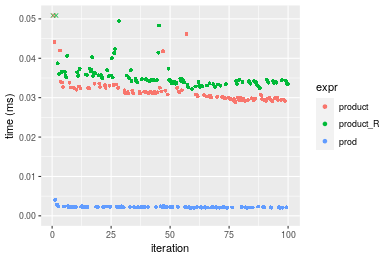
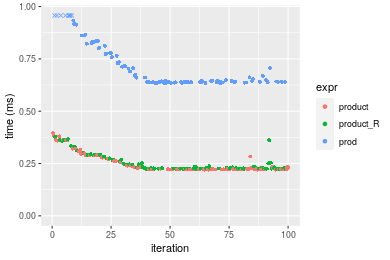
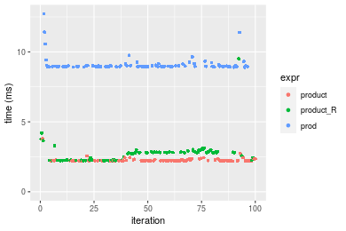
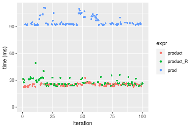

[matrixStats]: Benchmark report

---------------------------------------


# product() benchmarks

This report benchmark the performance of product() against alternative methods.

## Alternative methods

* product_R()
* prod()

where

```r
> product_R <- function(x, na.rm = FALSE, ...) {
+     if (length(x) == 0L) 
+         return(0)
+     if (na.rm) {
+         x <- x[!is.na(x)]
+     }
+     if (is.integer(x) && any(x == 0)) 
+         return(0)
+     sign <- if (sum(x < 0)%%2 == 0) 
+         +1     else -1
+     x <- abs(x)
+     x <- log(x)
+     x <- sum(x, na.rm = FALSE)
+     x <- exp(x)
+     y <- sign * x
+     y
+ }
```


## Data
```r
> rvector <- function(n, mode = c("logical", "double", "integer"), range = c(-100, +100), na_prob = 0) {
+     mode <- match.arg(mode)
+     if (mode == "logical") {
+         x <- sample(c(FALSE, TRUE), size = n, replace = TRUE)
+     }     else {
+         x <- runif(n, min = range[1], max = range[2])
+     }
+     storage.mode(x) <- mode
+     if (na_prob > 0) 
+         x[sample(n, size = na_prob * n)] <- NA
+     x
+ }
> rvectors <- function(scale = 10, seed = 1, ...) {
+     set.seed(seed)
+     data <- list()
+     data[[1]] <- rvector(n = scale * 100, ...)
+     data[[2]] <- rvector(n = scale * 1000, ...)
+     data[[3]] <- rvector(n = scale * 10000, ...)
+     data[[4]] <- rvector(n = scale * 1e+05, ...)
+     data[[5]] <- rvector(n = scale * 1e+06, ...)
+     names(data) <- sprintf("n = %d", sapply(data, FUN = length))
+     data
+ }
> data <- rvectors(mode = "double")
> data <- data[1:4]
```

## Results

### n = 1000 vector

```r
> x <- data[["n = 1000"]]
> gc()
           used  (Mb) gc trigger  (Mb) max used  (Mb)
Ncells  5284283 282.3   10014072 534.9 10014072 534.9
Vcells 13148294 100.4   33943181 259.0 90959857 694.0
> stats <- microbenchmark(product = product(x, na.rm = FALSE), product_R = product_R(x, na.rm = FALSE), 
+     prod = prod(x, na.rm = FALSE), unit = "ms")
```

_Table: Benchmarking of product(), product_R() and prod() on n = 1000 data. The top panel shows times in milliseconds and the bottom panel shows relative times._


|   |expr      |      min|        lq|      mean|   median|        uq|       max|
|:--|:---------|--------:|---------:|---------:|--------:|---------:|---------:|
|3  |prod      | 0.001913| 0.0020620| 0.0021911| 0.002138| 0.0022470|  0.003927|
|1  |product   | 0.028385| 0.0297085| 0.0320490| 0.031291| 0.0326775|  0.049714|
|2  |product_R | 0.030976| 0.0330980| 0.1608030| 0.033549| 0.0340340| 12.669122|


|   |expr      |      min|       lq|     mean|   median|       uq|        max|
|:--|:---------|--------:|--------:|--------:|--------:|--------:|----------:|
|3  |prod      |  1.00000|  1.00000|  1.00000|  1.00000|  1.00000|    1.00000|
|1  |product   | 14.83795| 14.40761| 14.62717| 14.63564| 14.54272|   12.65954|
|2  |product_R | 16.19237| 16.05141| 73.39051| 15.69177| 15.14642| 3226.15788|

_Figure: Benchmarking of product(), product_R() and prod() on n = 1000 data.  Outliers are displayed as crosses.  Times are in milliseconds._



### n = 10000 vector

```r
> x <- data[["n = 10000"]]
> gc()
           used  (Mb) gc trigger  (Mb) max used  (Mb)
Ncells  5282109 282.1   10014072 534.9 10014072 534.9
Vcells 10964093  83.7   33943181 259.0 90959857 694.0
> stats <- microbenchmark(product = product(x, na.rm = FALSE), product_R = product_R(x, na.rm = FALSE), 
+     prod = prod(x, na.rm = FALSE), unit = "ms")
```

_Table: Benchmarking of product(), product_R() and prod() on n = 10000 data. The top panel shows times in milliseconds and the bottom panel shows relative times._


|   |expr      |      min|        lq|      mean|    median|        uq|      max|
|:--|:---------|--------:|---------:|---------:|---------:|---------:|--------:|
|2  |product_R | 0.223911| 0.2264545| 0.2536524| 0.2312485| 0.2703475| 0.383890|
|1  |product   | 0.229893| 0.2312665| 0.2617688| 0.2320340| 0.2900090| 0.392095|
|3  |prod      | 0.634558| 0.6381710| 0.7162277| 0.6427165| 0.7803675| 1.090236|


|   |expr      |      min|       lq|     mean|   median|       uq|      max|
|:--|:---------|--------:|--------:|--------:|--------:|--------:|--------:|
|2  |product_R | 1.000000| 1.000000| 1.000000| 1.000000| 1.000000| 1.000000|
|1  |product   | 1.026716| 1.021249| 1.031998| 1.003397| 1.072727| 1.021373|
|3  |prod      | 2.833974| 2.818098| 2.823659| 2.779333| 2.886535| 2.839970|

_Figure: Benchmarking of product(), product_R() and prod() on n = 10000 data.  Outliers are displayed as crosses.  Times are in milliseconds._



### n = 100000 vector

```r
> x <- data[["n = 100000"]]
> gc()
           used  (Mb) gc trigger  (Mb) max used  (Mb)
Ncells  5282181 282.1   10014072 534.9 10014072 534.9
Vcells 10964653  83.7   33943181 259.0 90959857 694.0
> stats <- microbenchmark(product = product(x, na.rm = FALSE), product_R = product_R(x, na.rm = FALSE), 
+     prod = prod(x, na.rm = FALSE), unit = "ms")
```

_Table: Benchmarking of product(), product_R() and prod() on n = 100000 data. The top panel shows times in milliseconds and the bottom panel shows relative times._


|   |expr      |      min|       lq|     mean|   median|       uq|       max|
|:--|:---------|--------:|--------:|--------:|--------:|--------:|---------:|
|2  |product_R | 2.211631| 2.235046| 2.551025| 2.285462| 2.815228|  8.544144|
|1  |product   | 2.300934| 2.308839| 2.368022| 2.315355| 2.374199|  3.589991|
|3  |prod      | 8.882275| 8.943593| 9.110176| 8.985100| 9.129256| 11.786194|


|   |expr      |      min|       lq|     mean|   median|        uq|       max|
|:--|:---------|--------:|--------:|--------:|--------:|---------:|---------:|
|2  |product_R | 1.000000| 1.000000| 1.000000| 1.000000| 1.0000000| 1.0000000|
|1  |product   | 1.040379| 1.033016| 0.928263| 1.013080| 0.8433416| 0.4201698|
|3  |prod      | 4.016165| 4.001525| 3.571182| 3.931414| 3.2428123| 1.3794470|

_Figure: Benchmarking of product(), product_R() and prod() on n = 100000 data.  Outliers are displayed as crosses.  Times are in milliseconds._



### n = 1000000 vector

```r
> x <- data[["n = 1000000"]]
> gc()
           used  (Mb) gc trigger  (Mb) max used  (Mb)
Ncells  5282253 282.2   10014072 534.9 10014072 534.9
Vcells 10964702  83.7   33943181 259.0 90959857 694.0
> stats <- microbenchmark(product = product(x, na.rm = FALSE), product_R = product_R(x, na.rm = FALSE), 
+     prod = prod(x, na.rm = FALSE), unit = "ms")
```

_Table: Benchmarking of product(), product_R() and prod() on n = 1000000 data. The top panel shows times in milliseconds and the bottom panel shows relative times._


|   |expr      |      min|       lq|     mean|   median|       uq|      max|
|:--|:---------|--------:|--------:|--------:|--------:|--------:|--------:|
|1  |product   | 23.81908| 24.62308| 26.04617| 26.53572| 26.72891|  31.8131|
|2  |product_R | 22.98549| 25.33717| 28.59033| 28.65764| 31.66010|  45.7754|
|3  |prod      | 90.87081| 92.27975| 92.80046| 92.65868| 93.01210| 100.0587|


|   |expr      |       min|       lq|     mean|   median|       uq|      max|
|:--|:---------|---------:|--------:|--------:|--------:|--------:|--------:|
|1  |product   | 1.0000000| 1.000000| 1.000000| 1.000000| 1.000000| 1.000000|
|2  |product_R | 0.9650032| 1.029001| 1.097679| 1.079965| 1.184489| 1.438885|
|3  |prod      | 3.8150430| 3.747693| 3.562922| 3.491847| 3.479832| 3.145203|

_Figure: Benchmarking of product(), product_R() and prod() on n = 1000000 data.  Outliers are displayed as crosses.  Times are in milliseconds._




## Appendix

### Session information
```r
R version 4.1.1 Patched (2021-08-10 r80727)
Platform: x86_64-pc-linux-gnu (64-bit)
Running under: Ubuntu 18.04.5 LTS

Matrix products: default
BLAS:   /home/hb/software/R-devel/R-4-1-branch/lib/R/lib/libRblas.so
LAPACK: /home/hb/software/R-devel/R-4-1-branch/lib/R/lib/libRlapack.so

locale:
 [1] LC_CTYPE=en_US.UTF-8       LC_NUMERIC=C              
 [3] LC_TIME=en_US.UTF-8        LC_COLLATE=en_US.UTF-8    
 [5] LC_MONETARY=en_US.UTF-8    LC_MESSAGES=en_US.UTF-8   
 [7] LC_PAPER=en_US.UTF-8       LC_NAME=C                 
 [9] LC_ADDRESS=C               LC_TELEPHONE=C            
[11] LC_MEASUREMENT=en_US.UTF-8 LC_IDENTIFICATION=C       

attached base packages:
[1] stats     graphics  grDevices utils     datasets  methods   base     

other attached packages:
[1] microbenchmark_1.4-7   matrixStats_0.60.1     ggplot2_3.3.5         
[4] knitr_1.33             R.devices_2.17.0       R.utils_2.10.1        
[7] R.oo_1.24.0            R.methodsS3_1.8.1-9001 history_0.0.1-9000    

loaded via a namespace (and not attached):
 [1] Biobase_2.52.0          httr_1.4.2              splines_4.1.1          
 [4] bit64_4.0.5             network_1.17.1          assertthat_0.2.1       
 [7] highr_0.9               stats4_4.1.1            blob_1.2.2             
[10] GenomeInfoDbData_1.2.6  robustbase_0.93-8       pillar_1.6.2           
[13] RSQLite_2.2.8           lattice_0.20-44         glue_1.4.2             
[16] digest_0.6.27           XVector_0.32.0          colorspace_2.0-2       
[19] Matrix_1.3-4            XML_3.99-0.7            pkgconfig_2.0.3        
[22] zlibbioc_1.38.0         genefilter_1.74.0       purrr_0.3.4            
[25] ergm_4.1.2              xtable_1.8-4            scales_1.1.1           
[28] tibble_3.1.4            annotate_1.70.0         KEGGREST_1.32.0        
[31] farver_2.1.0            generics_0.1.0          IRanges_2.26.0         
[34] ellipsis_0.3.2          cachem_1.0.6            withr_2.4.2            
[37] BiocGenerics_0.38.0     mime_0.11               survival_3.2-13        
[40] magrittr_2.0.1          crayon_1.4.1            statnet.common_4.5.0   
[43] memoise_2.0.0           laeken_0.5.1            fansi_0.5.0            
[46] R.cache_0.15.0          MASS_7.3-54             R.rsp_0.44.0           
[49] progressr_0.8.0         tools_4.1.1             lifecycle_1.0.0        
[52] S4Vectors_0.30.0        trust_0.1-8             munsell_0.5.0          
[55] tabby_0.0.1-9001        AnnotationDbi_1.54.1    Biostrings_2.60.2      
[58] compiler_4.1.1          GenomeInfoDb_1.28.1     rlang_0.4.11           
[61] grid_4.1.1              RCurl_1.98-1.4          cwhmisc_6.6            
[64] rappdirs_0.3.3          startup_0.15.0          labeling_0.4.2         
[67] bitops_1.0-7            base64enc_0.1-3         boot_1.3-28            
[70] gtable_0.3.0            DBI_1.1.1               markdown_1.1           
[73] R6_2.5.1                lpSolveAPI_5.5.2.0-17.7 rle_0.9.2              
[76] dplyr_1.0.7             fastmap_1.1.0           bit_4.0.4              
[79] utf8_1.2.2              parallel_4.1.1          Rcpp_1.0.7             
[82] vctrs_0.3.8             png_0.1-7               DEoptimR_1.0-9         
[85] tidyselect_1.1.1        xfun_0.25               coda_0.19-4            
```
Total processing time was 21.86 secs.


### Reproducibility
To reproduce this report, do:
```r
html <- matrixStats:::benchmark('product')
```

[RSP]: https://cran.r-project.org/package=R.rsp
[matrixStats]: https://cran.r-project.org/package=matrixStats

[StackOverflow:colMins?]: https://stackoverflow.com/questions/13676878 "Stack Overflow: fastest way to get Min from every column in a matrix?"
[StackOverflow:colSds?]: https://stackoverflow.com/questions/17549762 "Stack Overflow: Is there such 'colsd' in R?"
[StackOverflow:rowProds?]: https://stackoverflow.com/questions/20198801/ "Stack Overflow: Row product of matrix and column sum of matrix"

---------------------------------------
Copyright Henrik Bengtsson. Last updated on 2021-08-25 18:33:10 (+0200 UTC). Powered by [RSP].

<script>
 var link = document.createElement('link');
 link.rel = 'icon';
 link.href = "data:image/png;base64,iVBORw0KGgoAAAANSUhEUgAAACAAAAAgCAMAAABEpIrGAAAA21BMVEUAAAAAAP8AAP8AAP8AAP8AAP8AAP8AAP8AAP8AAP8AAP8AAP8AAP8AAP8AAP8AAP8AAP8AAP8AAP8AAP8AAP8AAP8AAP8AAP8AAP8AAP8AAP8AAP8AAP8AAP8AAP8AAP8AAP8AAP8AAP8AAP8AAP8AAP8AAP8AAP8AAP8AAP8BAf4CAv0DA/wdHeIeHuEfH+AgIN8hId4lJdomJtknJ9g+PsE/P8BAQL9yco10dIt1dYp3d4h4eIeVlWqWlmmXl2iYmGeZmWabm2Tn5xjo6Bfp6Rb39wj4+Af//wA2M9hbAAAASXRSTlMAAQIJCgsMJSYnKD4/QGRlZmhpamtsbautrrCxuru8y8zN5ebn6Pn6+///////////////////////////////////////////LsUNcQAAAS9JREFUOI29k21XgkAQhVcFytdSMqMETU26UVqGmpaiFbL//xc1cAhhwVNf6n5i5z67M2dmYOyfJZUqlVLhkKucG7cgmUZTybDz6g0iDeq51PUr37Ds2cy2/C9NeES5puDjxuUk1xnToZsg8pfA3avHQ3lLIi7iWRrkv/OYtkScxBIMgDee0ALoyxHQBJ68JLCjOtQIMIANF7QG9G9fNnHvisCHBVMKgSJgiz7nE+AoBKrAPA3MgepvgR9TSCasrCKH0eB1wBGBFdCO+nAGjMVGPcQb5bd6mQRegN6+1axOs9nGfYcCtfi4NQosdtH7dB+txFIpXQqN1p9B/asRHToyS0jRgpV7nk4nwcq1BJ+x3Gl/v7S9Wmpp/aGquum7w3ZDyrADFYrl8vHBH+ev9AUASW1dmU4h4wAAAABJRU5ErkJggg=="
 document.getElementsByTagName('head')[0].appendChild(link);
</script>


