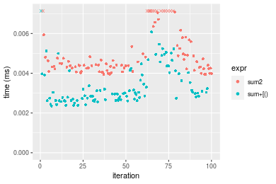
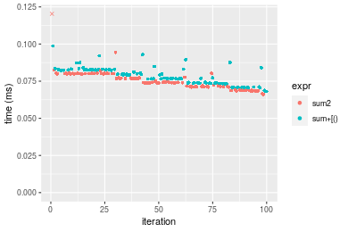
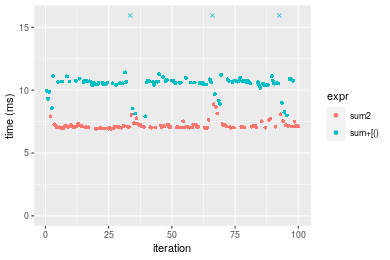
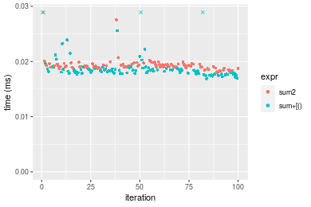
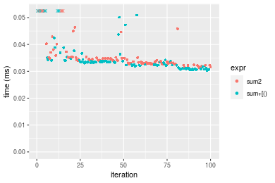

[matrixStats]: Benchmark report

---------------------------------------


# sum2() benchmarks

This report benchmark the performance of sum2() against alternative methods.

## Alternative methods

* sum() + [()

as below

```r
> sum2_R <- function(x, na.rm = FALSE, idxs) {
+     sum(x[idxs], na.rm = na.rm)
+ }
```


## Data type "integer"
### Data
```r
> rvector <- function(n, mode = c("logical", "double", "integer"), range = c(-100, +100), na_prob = 0) {
+     mode <- match.arg(mode)
+     if (mode == "logical") {
+         x <- sample(c(FALSE, TRUE), size = n, replace = TRUE)
+     }     else {
+         x <- runif(n, min = range[1], max = range[2])
+     }
+     storage.mode(x) <- mode
+     if (na_prob > 0) 
+         x[sample(n, size = na_prob * n)] <- NA
+     x
+ }
> rvectors <- function(scale = 10, seed = 1, ...) {
+     set.seed(seed)
+     data <- list()
+     data[[1]] <- rvector(n = scale * 100, ...)
+     data[[2]] <- rvector(n = scale * 1000, ...)
+     data[[3]] <- rvector(n = scale * 10000, ...)
+     data[[4]] <- rvector(n = scale * 1e+05, ...)
+     data[[5]] <- rvector(n = scale * 1e+06, ...)
+     names(data) <- sprintf("n = %d", sapply(data, FUN = length))
+     data
+ }
> data <- rvectors(mode = mode)
```

### Results

### n = 1000 vector


#### All elements
```r
> x <- data[["n = 1000"]]
> gc()
           used  (Mb) gc trigger  (Mb) max used  (Mb)
Ncells  5352391 285.9    7916910 422.9  7916910 422.9
Vcells 37519670 286.3   60997542 465.4 94934136 724.3
> stats <- microbenchmark(sum2 = sum2(x), sum = sum(x), unit = "ms")
```

_Table: Benchmarking of sum2() and sum() on n = 1000+all data. The top panel shows times in milliseconds and the bottom panel shows relative times._


|   |expr |      min|       lq|      mean|    median|        uq|      max|
|:--|:----|--------:|--------:|---------:|---------:|---------:|--------:|
|2  |sum  | 0.001168| 0.001216| 0.0013982| 0.0012895| 0.0013475| 0.004206|
|1  |sum2 | 0.004819| 0.004942| 0.0059565| 0.0050265| 0.0052650| 0.029968|


|   |expr |      min|       lq|     mean|   median|       uq|      max|
|:--|:----|--------:|--------:|--------:|--------:|--------:|--------:|
|2  |sum  | 1.000000| 1.000000| 1.000000| 1.000000| 1.000000| 1.000000|
|1  |sum2 | 4.125856| 4.064145| 4.260034| 3.898023| 3.907236| 7.125059|

_Figure: Benchmarking of sum2() and sum() on n = 1000+all data.  Outliers are displayed as crosses.  Times are in milliseconds._


#### A 20% subset
```r
> x <- data[["n = 1000"]]
> subset
[1] 0.2
> idxs <- sort(sample(length(x), size = subset * length(x), replace = FALSE))
> gc()
           used  (Mb) gc trigger  (Mb) max used  (Mb)
Ncells  5350229 285.8    7916910 422.9  7916910 422.9
Vcells 15884915 121.2   48798034 372.3 94934136 724.3
> stats <- microbenchmark(sum2 = sum2(x, idxs = idxs), `sum+[()` = sum2_R(x, idxs = idxs), unit = "ms")
```

_Table: Benchmarking of sum2() and sum+[()() on integer+n = 1000+0.2 data. The top panel shows times in milliseconds and the bottom panel shows relative times._


|   |expr    |      min|        lq|      mean|    median|        uq|      max|
|:--|:-------|--------:|---------:|---------:|---------:|---------:|--------:|
|2  |sum+[() | 0.002353| 0.0026730| 0.0035542| 0.0029875| 0.0039720| 0.025916|
|1  |sum2    | 0.003939| 0.0042425| 0.0052645| 0.0044535| 0.0054965| 0.025251|


|   |expr    |      min|       lq|     mean|   median|       uq|       max|
|:--|:-------|--------:|--------:|--------:|--------:|--------:|---------:|
|2  |sum+[() | 1.000000| 1.000000| 1.000000| 1.000000| 1.000000| 1.0000000|
|1  |sum2    | 1.674033| 1.587168| 1.481204| 1.490711| 1.383812| 0.9743402|

_Figure: Benchmarking of sum2() and sum+[()() on integer+n = 1000+0.2 data.  Outliers are displayed as crosses.  Times are in milliseconds._



#### A 40% subset
```r
> x <- data[["n = 1000"]]
> subset
[1] 0.4
> idxs <- sort(sample(length(x), size = subset * length(x), replace = FALSE))
> gc()
           used  (Mb) gc trigger  (Mb) max used  (Mb)
Ncells  5350295 285.8    7916910 422.9  7916910 422.9
Vcells 15885067 121.2   48798034 372.3 94934136 724.3
> stats <- microbenchmark(sum2 = sum2(x, idxs = idxs), `sum+[()` = sum2_R(x, idxs = idxs), unit = "ms")
```

_Table: Benchmarking of sum2() and sum+[()() on integer+n = 1000+0.4 data. The top panel shows times in milliseconds and the bottom panel shows relative times._


|   |expr    |      min|       lq|      mean|    median|        uq|      max|
|:--|:-------|--------:|--------:|---------:|---------:|---------:|--------:|
|2  |sum+[() | 0.003277| 0.003511| 0.0039569| 0.0036315| 0.0038375| 0.025466|
|1  |sum2    | 0.004710| 0.004900| 0.0053899| 0.0050465| 0.0053270| 0.024170|


|   |expr    |     min|       lq|     mean|   median|       uq|       max|
|:--|:-------|-------:|--------:|--------:|--------:|--------:|---------:|
|2  |sum+[() | 1.00000| 1.000000| 1.000000| 1.000000| 1.000000| 1.0000000|
|1  |sum2    | 1.43729| 1.395614| 1.362148| 1.389646| 1.388143| 0.9491086|

_Figure: Benchmarking of sum2() and sum+[()() on integer+n = 1000+0.4 data.  Outliers are displayed as crosses.  Times are in milliseconds._


#### A 80% subset
```r
> x <- data[["n = 1000"]]
> subset
[1] 0.8
> idxs <- sort(sample(length(x), size = subset * length(x), replace = FALSE))
> gc()
           used  (Mb) gc trigger  (Mb) max used  (Mb)
Ncells  5350358 285.8    7916910 422.9  7916910 422.9
Vcells 15885821 121.2   48798034 372.3 94934136 724.3
> stats <- microbenchmark(sum2 = sum2(x, idxs = idxs), `sum+[()` = sum2_R(x, idxs = idxs), unit = "ms")
```

_Table: Benchmarking of sum2() and sum+[()() on integer+n = 1000+0.8 data. The top panel shows times in milliseconds and the bottom panel shows relative times._


|   |expr    |      min|        lq|      mean|    median|       uq|      max|
|:--|:-------|--------:|---------:|---------:|---------:|--------:|--------:|
|2  |sum+[() | 0.004771| 0.0050155| 0.0053266| 0.0051910| 0.005371| 0.017107|
|1  |sum2    | 0.006047| 0.0062185| 0.0066067| 0.0064505| 0.006628| 0.020971|


|   |expr    |      min|       lq|    mean|   median|       uq|      max|
|:--|:-------|--------:|--------:|-------:|--------:|--------:|--------:|
|2  |sum+[() | 1.000000| 1.000000| 1.00000| 1.000000| 1.000000| 1.000000|
|1  |sum2    | 1.267449| 1.239856| 1.24032| 1.242632| 1.234035| 1.225872|

_Figure: Benchmarking of sum2() and sum+[()() on integer+n = 1000+0.8 data.  Outliers are displayed as crosses.  Times are in milliseconds._


### n = 10000 vector


#### All elements
```r
> x <- data[["n = 10000"]]
> gc()
           used  (Mb) gc trigger  (Mb) max used  (Mb)
Ncells  5350356 285.8    7916910 422.9  7916910 422.9
Vcells 15885445 121.2   48798034 372.3 94934136 724.3
> stats <- microbenchmark(sum2 = sum2(x), sum = sum(x), unit = "ms")
```

_Table: Benchmarking of sum2() and sum() on n = 10000+all data. The top panel shows times in milliseconds and the bottom panel shows relative times._


|   |expr |      min|        lq|      mean|    median|       uq|      max|
|:--|:----|--------:|---------:|---------:|---------:|--------:|--------:|
|2  |sum  | 0.008725| 0.0087605| 0.0089259| 0.0088635| 0.008942| 0.014956|
|1  |sum2 | 0.019954| 0.0201270| 0.0204627| 0.0202520| 0.020422| 0.036140|


|   |expr |      min|       lq|     mean|   median|       uq|      max|
|:--|:----|--------:|--------:|--------:|--------:|--------:|--------:|
|2  |sum  | 1.000000| 1.000000| 1.000000| 1.000000| 1.000000| 1.000000|
|1  |sum2 | 2.286991| 2.297472| 2.292511| 2.284876| 2.283829| 2.416422|

_Figure: Benchmarking of sum2() and sum() on n = 10000+all data.  Outliers are displayed as crosses.  Times are in milliseconds._


#### A 20% subset
```r
> x <- data[["n = 10000"]]
> subset
[1] 0.2
> idxs <- sort(sample(length(x), size = subset * length(x), replace = FALSE))
> gc()
           used  (Mb) gc trigger  (Mb) max used  (Mb)
Ncells  5350484 285.8    7916910 422.9  7916910 422.9
Vcells 15886503 121.3   48798034 372.3 94934136 724.3
> stats <- microbenchmark(sum2 = sum2(x, idxs = idxs), `sum+[()` = sum2_R(x, idxs = idxs), unit = "ms")
```

_Table: Benchmarking of sum2() and sum+[()() on integer+n = 10000+0.2 data. The top panel shows times in milliseconds and the bottom panel shows relative times._


|   |expr    |      min|        lq|      mean|    median|        uq|      max|
|:--|:-------|--------:|---------:|---------:|---------:|---------:|--------:|
|2  |sum+[() | 0.009582| 0.0100370| 0.0107898| 0.0102045| 0.0107000| 0.028421|
|1  |sum2    | 0.010930| 0.0111795| 0.0115658| 0.0113155| 0.0114935| 0.027050|


|   |expr    |     min|       lq|     mean|   median|       uq|      max|
|:--|:-------|-------:|--------:|--------:|--------:|--------:|--------:|
|2  |sum+[() | 1.00000| 1.000000| 1.000000| 1.000000| 1.000000| 1.000000|
|1  |sum2    | 1.14068| 1.113829| 1.071919| 1.108874| 1.074159| 0.951761|

_Figure: Benchmarking of sum2() and sum+[()() on integer+n = 10000+0.2 data.  Outliers are displayed as crosses.  Times are in milliseconds._


#### A 40% subset
```r
> x <- data[["n = 10000"]]
> subset
[1] 0.4
> idxs <- sort(sample(length(x), size = subset * length(x), replace = FALSE))
> gc()
           used  (Mb) gc trigger  (Mb) max used  (Mb)
Ncells  5350547 285.8    7916910 422.9  7916910 422.9
Vcells 15887775 121.3   48798034 372.3 94934136 724.3
> stats <- microbenchmark(sum2 = sum2(x, idxs = idxs), `sum+[()` = sum2_R(x, idxs = idxs), unit = "ms")
```

_Table: Benchmarking of sum2() and sum+[()() on integer+n = 10000+0.4 data. The top panel shows times in milliseconds and the bottom panel shows relative times._


|   |expr    |      min|       lq|      mean|    median|        uq|      max|
|:--|:-------|--------:|--------:|---------:|---------:|---------:|--------:|
|2  |sum+[() | 0.017435| 0.018203| 0.0194375| 0.0184870| 0.0191675| 0.051430|
|1  |sum2    | 0.018530| 0.018993| 0.0199242| 0.0193585| 0.0197810| 0.046702|


|   |expr    |      min|       lq|    mean|   median|       uq|       max|
|:--|:-------|--------:|--------:|-------:|--------:|--------:|---------:|
|2  |sum+[() | 1.000000| 1.000000| 1.00000| 1.000000| 1.000000| 1.0000000|
|1  |sum2    | 1.062805| 1.043399| 1.02504| 1.047141| 1.032007| 0.9080692|

_Figure: Benchmarking of sum2() and sum+[()() on integer+n = 10000+0.4 data.  Outliers are displayed as crosses.  Times are in milliseconds._


#### A 80% subset
```r
> x <- data[["n = 10000"]]
> subset
[1] 0.8
> idxs <- sort(sample(length(x), size = subset * length(x), replace = FALSE))
> gc()
           used  (Mb) gc trigger  (Mb) max used  (Mb)
Ncells  5350610 285.8    7916910 422.9  7916910 422.9
Vcells 15890076 121.3   48798034 372.3 94934136 724.3
> stats <- microbenchmark(sum2 = sum2(x, idxs = idxs), `sum+[()` = sum2_R(x, idxs = idxs), unit = "ms")
```

_Table: Benchmarking of sum2() and sum+[()() on integer+n = 10000+0.8 data. The top panel shows times in milliseconds and the bottom panel shows relative times._


|   |expr    |      min|       lq|      mean|    median|        uq|      max|
|:--|:-------|--------:|--------:|---------:|---------:|---------:|--------:|
|2  |sum+[() | 0.032296| 0.033896| 0.0344275| 0.0341810| 0.0344325| 0.046596|
|1  |sum2    | 0.032661| 0.034108| 0.0347426| 0.0343965| 0.0346050| 0.049085|


|   |expr    |      min|       lq|     mean|   median|      uq|      max|
|:--|:-------|--------:|--------:|--------:|--------:|-------:|--------:|
|2  |sum+[() | 1.000000| 1.000000| 1.000000| 1.000000| 1.00000| 1.000000|
|1  |sum2    | 1.011302| 1.006254| 1.009151| 1.006305| 1.00501| 1.053417|

_Figure: Benchmarking of sum2() and sum+[()() on integer+n = 10000+0.8 data.  Outliers are displayed as crosses.  Times are in milliseconds._


### n = 100000 vector


#### All elements
```r
> x <- data[["n = 100000"]]
> gc()
           used  (Mb) gc trigger  (Mb) max used  (Mb)
Ncells  5350608 285.8    7916910 422.9  7916910 422.9
Vcells 15890007 121.3   48798034 372.3 94934136 724.3
> stats <- microbenchmark(sum2 = sum2(x), sum = sum(x), unit = "ms")
```

_Table: Benchmarking of sum2() and sum() on n = 100000+all data. The top panel shows times in milliseconds and the bottom panel shows relative times._


|   |expr |      min|        lq|      mean|    median|       uq|      max|
|:--|:----|--------:|---------:|---------:|---------:|--------:|--------:|
|2  |sum  | 0.068167| 0.0718690| 0.0790733| 0.0786455| 0.085223| 0.130131|
|1  |sum2 | 0.137269| 0.1470985| 0.1563849| 0.1554880| 0.171551| 0.199221|


|   |expr |      min|       lq|     mean|   median|       uq|      max|
|:--|:----|--------:|--------:|--------:|--------:|--------:|--------:|
|2  |sum  | 1.000000| 1.000000| 1.000000| 1.000000| 1.000000| 1.000000|
|1  |sum2 | 2.013716| 2.046759| 1.977721| 1.977074| 2.012966| 1.530927|

_Figure: Benchmarking of sum2() and sum() on n = 100000+all data.  Outliers are displayed as crosses.  Times are in milliseconds._


#### A 20% subset
```r
> x <- data[["n = 100000"]]
> subset
[1] 0.2
> idxs <- sort(sample(length(x), size = subset * length(x), replace = FALSE))
> gc()
           used  (Mb) gc trigger  (Mb) max used  (Mb)
Ncells  5350736 285.8    7916910 422.9  7916910 422.9
Vcells 15896466 121.3   48798034 372.3 94934136 724.3
> stats <- microbenchmark(sum2 = sum2(x, idxs = idxs), `sum+[()` = sum2_R(x, idxs = idxs), unit = "ms")
```

_Table: Benchmarking of sum2() and sum+[()() on integer+n = 100000+0.2 data. The top panel shows times in milliseconds and the bottom panel shows relative times._


|   |expr    |      min|        lq|      mean|   median|        uq|      max|
|:--|:-------|--------:|---------:|---------:|--------:|---------:|--------:|
|1  |sum2    | 0.066175| 0.0712885| 0.0755466| 0.074185| 0.0799685| 0.124713|
|2  |sum+[() | 0.068085| 0.0735490| 0.0782850| 0.078106| 0.0826760| 0.098722|


|   |expr    |      min|       lq|     mean|   median|       uq|       max|
|:--|:-------|--------:|--------:|--------:|--------:|--------:|---------:|
|1  |sum2    | 1.000000| 1.000000| 1.000000| 1.000000| 1.000000| 1.0000000|
|2  |sum+[() | 1.028863| 1.031709| 1.036247| 1.052854| 1.033857| 0.7915935|

_Figure: Benchmarking of sum2() and sum+[()() on integer+n = 100000+0.2 data.  Outliers are displayed as crosses.  Times are in milliseconds._



#### A 40% subset
```r
> x <- data[["n = 100000"]]
> subset
[1] 0.4
> idxs <- sort(sample(length(x), size = subset * length(x), replace = FALSE))
> gc()
           used  (Mb) gc trigger  (Mb) max used  (Mb)
Ncells  5350799 285.8    7916910 422.9  7916910 422.9
Vcells 15906878 121.4   48798034 372.3 94934136 724.3
> stats <- microbenchmark(sum2 = sum2(x, idxs = idxs), `sum+[()` = sum2_R(x, idxs = idxs), unit = "ms")
```

_Table: Benchmarking of sum2() and sum+[()() on integer+n = 100000+0.4 data. The top panel shows times in milliseconds and the bottom panel shows relative times._


|   |expr    |      min|        lq|      mean|    median|        uq|      max|
|:--|:-------|--------:|---------:|---------:|---------:|---------:|--------:|
|1  |sum2    | 0.120044| 0.1245475| 0.1370164| 0.1291520| 0.1539495| 0.173473|
|2  |sum+[() | 0.126368| 0.1331820| 0.1463841| 0.1445065| 0.1594265| 0.197184|


|   |expr    |      min|       lq|     mean|   median|       uq|      max|
|:--|:-------|--------:|--------:|--------:|--------:|--------:|--------:|
|1  |sum2    | 1.000000| 1.000000| 1.000000| 1.000000| 1.000000| 1.000000|
|2  |sum+[() | 1.052681| 1.069327| 1.068369| 1.118887| 1.035577| 1.136684|

_Figure: Benchmarking of sum2() and sum+[()() on integer+n = 100000+0.4 data.  Outliers are displayed as crosses.  Times are in milliseconds._


#### A 80% subset
```r
> x <- data[["n = 100000"]]
> subset
[1] 0.8
> idxs <- sort(sample(length(x), size = subset * length(x), replace = FALSE))
> gc()
           used  (Mb) gc trigger  (Mb) max used  (Mb)
Ncells  5350862 285.8    7916910 422.9  7916910 422.9
Vcells 15926920 121.6   48798034 372.3 94934136 724.3
> stats <- microbenchmark(sum2 = sum2(x, idxs = idxs), `sum+[()` = sum2_R(x, idxs = idxs), unit = "ms")
```

_Table: Benchmarking of sum2() and sum+[()() on integer+n = 100000+0.8 data. The top panel shows times in milliseconds and the bottom panel shows relative times._


|   |expr    |      min|        lq|      mean|    median|        uq|      max|
|:--|:-------|--------:|---------:|---------:|---------:|---------:|--------:|
|1  |sum2    | 0.203559| 0.2181945| 0.2489740| 0.2394055| 0.2719680| 0.447498|
|2  |sum+[() | 0.213236| 0.2318810| 0.2650346| 0.2562470| 0.2939635| 0.429438|


|   |expr    |      min|       lq|     mean|   median|       uq|       max|
|:--|:-------|--------:|--------:|--------:|--------:|--------:|---------:|
|1  |sum2    | 1.000000| 1.000000| 1.000000| 1.000000| 1.000000| 1.0000000|
|2  |sum+[() | 1.047539| 1.062726| 1.064507| 1.070347| 1.080875| 0.9596423|

_Figure: Benchmarking of sum2() and sum+[()() on integer+n = 100000+0.8 data.  Outliers are displayed as crosses.  Times are in milliseconds._


### n = 1000000 vector


#### All elements
```r
> x <- data[["n = 1000000"]]
> gc()
           used  (Mb) gc trigger  (Mb) max used  (Mb)
Ncells  5350860 285.8    7916910 422.9  7916910 422.9
Vcells 15926988 121.6   48798034 372.3 94934136 724.3
> stats <- microbenchmark(sum2 = sum2(x), sum = sum(x), unit = "ms")
```

_Table: Benchmarking of sum2() and sum() on n = 1000000+all data. The top panel shows times in milliseconds and the bottom panel shows relative times._


|   |expr |      min|        lq|      mean|    median|       uq|      max|
|:--|:----|--------:|---------:|---------:|---------:|--------:|--------:|
|2  |sum  | 0.520624| 0.5218835| 0.5805353| 0.5332435| 0.635164| 0.894909|
|1  |sum2 | 1.030878| 1.0325495| 1.1229403| 1.0373390| 1.153496| 1.780989|


|   |expr |      min|       lq|     mean|   median|      uq|      max|
|:--|:----|--------:|--------:|--------:|--------:|-------:|--------:|
|2  |sum  | 1.000000| 1.000000| 1.000000| 1.000000| 1.00000| 1.000000|
|1  |sum2 | 1.980082| 1.978506| 1.934319| 1.945338| 1.81606| 1.990134|

_Figure: Benchmarking of sum2() and sum() on n = 1000000+all data.  Outliers are displayed as crosses.  Times are in milliseconds._


#### A 20% subset
```r
> x <- data[["n = 1000000"]]
> subset
[1] 0.2
> idxs <- sort(sample(length(x), size = subset * length(x), replace = FALSE))
> gc()
           used  (Mb) gc trigger  (Mb) max used  (Mb)
Ncells  5350988 285.8    7916910 422.9  7916910 422.9
Vcells 15987446 122.0   48798034 372.3 94934136 724.3
> stats <- microbenchmark(sum2 = sum2(x, idxs = idxs), `sum+[()` = sum2_R(x, idxs = idxs), unit = "ms")
```

_Table: Benchmarking of sum2() and sum+[()() on integer+n = 1000000+0.2 data. The top panel shows times in milliseconds and the bottom panel shows relative times._


|   |expr    |      min|        lq|      mean|    median|        uq|      max|
|:--|:-------|--------:|---------:|---------:|---------:|---------:|--------:|
|1  |sum2    | 0.469893| 0.4836925| 0.5713289| 0.5306825| 0.6128710| 0.991029|
|2  |sum+[() | 0.516228| 0.5354775| 0.6459817| 0.5947250| 0.7353905| 0.966928|


|   |expr    |      min|       lq|     mean|  median|       uq|       max|
|:--|:-------|--------:|--------:|--------:|-------:|--------:|---------:|
|1  |sum2    | 1.000000| 1.000000| 1.000000| 1.00000| 1.000000| 1.0000000|
|2  |sum+[() | 1.098608| 1.107062| 1.130665| 1.12068| 1.199911| 0.9756808|

_Figure: Benchmarking of sum2() and sum+[()() on integer+n = 1000000+0.2 data.  Outliers are displayed as crosses.  Times are in milliseconds._


#### A 40% subset
```r
> x <- data[["n = 1000000"]]
> subset
[1] 0.4
> idxs <- sort(sample(length(x), size = subset * length(x), replace = FALSE))
> gc()
           used  (Mb) gc trigger  (Mb) max used  (Mb)
Ncells  5351051 285.8    7916910 422.9  7916910 422.9
Vcells 16087490 122.8   48798034 372.3 94934136 724.3
> stats <- microbenchmark(sum2 = sum2(x, idxs = idxs), `sum+[()` = sum2_R(x, idxs = idxs), unit = "ms")
```

_Table: Benchmarking of sum2() and sum+[()() on integer+n = 1000000+0.4 data. The top panel shows times in milliseconds and the bottom panel shows relative times._


|   |expr    |      min|        lq|     mean|   median|       uq|      max|
|:--|:-------|--------:|---------:|--------:|--------:|--------:|--------:|
|1  |sum2    | 0.944178| 0.9681965| 1.064035| 1.001398| 1.084610| 1.674459|
|2  |sum+[() | 1.024512| 1.0728995| 1.338005| 1.327036| 1.568442| 2.334691|


|   |expr    |      min|       lq|     mean|   median|       uq|      max|
|:--|:-------|--------:|--------:|--------:|--------:|--------:|--------:|
|1  |sum2    | 1.000000| 1.000000| 1.000000| 1.000000| 1.000000| 1.000000|
|2  |sum+[() | 1.085084| 1.108142| 1.257483| 1.325183| 1.446087| 1.394296|

_Figure: Benchmarking of sum2() and sum+[()() on integer+n = 1000000+0.4 data.  Outliers are displayed as crosses.  Times are in milliseconds._


#### A 80% subset
```r
> x <- data[["n = 1000000"]]
> subset
[1] 0.8
> idxs <- sort(sample(length(x), size = subset * length(x), replace = FALSE))
> gc()
           used  (Mb) gc trigger  (Mb) max used  (Mb)
Ncells  5351114 285.8    7916910 422.9  7916910 422.9
Vcells 16288062 124.3   48798034 372.3 94934136 724.3
> stats <- microbenchmark(sum2 = sum2(x, idxs = idxs), `sum+[()` = sum2_R(x, idxs = idxs), unit = "ms")
```

_Table: Benchmarking of sum2() and sum+[()() on integer+n = 1000000+0.8 data. The top panel shows times in milliseconds and the bottom panel shows relative times._


|   |expr    |      min|       lq|     mean|   median|       uq|       max|
|:--|:-------|--------:|--------:|--------:|--------:|--------:|---------:|
|1  |sum2    | 1.892380| 1.932612| 2.074628| 1.960306| 2.137136|  3.298452|
|2  |sum+[() | 2.062795| 2.120582| 2.656786| 2.400110| 3.044909| 12.688548|


|   |expr    |      min|       lq|     mean|   median|       uq|      max|
|:--|:-------|--------:|--------:|--------:|--------:|--------:|--------:|
|1  |sum2    | 1.000000| 1.000000| 1.000000| 1.000000| 1.000000| 1.000000|
|2  |sum+[() | 1.090053| 1.097262| 1.280609| 1.224355| 1.424761| 3.846819|

_Figure: Benchmarking of sum2() and sum+[()() on integer+n = 1000000+0.8 data.  Outliers are displayed as crosses.  Times are in milliseconds._


### n = 10000000 vector


#### All elements
```r
> x <- data[["n = 10000000"]]
> gc()
           used  (Mb) gc trigger  (Mb) max used  (Mb)
Ncells  5351112 285.8    7916910 422.9  7916910 422.9
Vcells 16287686 124.3   48798034 372.3 94934136 724.3
> stats <- microbenchmark(sum2 = sum2(x), sum = sum(x), unit = "ms")
```

_Table: Benchmarking of sum2() and sum() on n = 10000000+all data. The top panel shows times in milliseconds and the bottom panel shows relative times._


|   |expr |       min|        lq|      mean|    median|       uq|      max|
|:--|:----|---------:|---------:|---------:|---------:|--------:|--------:|
|2  |sum  |  6.009179|  6.159402|  6.451626|  6.263462|  6.50239| 10.22468|
|1  |sum2 | 10.978285| 11.118918| 11.571511| 11.308272| 11.66396| 15.89741|


|   |expr |      min|       lq|     mean|   median|       uq|      max|
|:--|:----|--------:|--------:|--------:|--------:|--------:|--------:|
|2  |sum  | 1.000000| 1.000000| 1.000000| 1.000000| 1.000000| 1.000000|
|1  |sum2 | 1.826919| 1.805195| 1.793581| 1.805435| 1.793796| 1.554808|

_Figure: Benchmarking of sum2() and sum() on n = 10000000+all data.  Outliers are displayed as crosses.  Times are in milliseconds._


#### A 20% subset
```r
> x <- data[["n = 10000000"]]
> subset
[1] 0.2
> idxs <- sort(sample(length(x), size = subset * length(x), replace = FALSE))
> gc()
           used  (Mb) gc trigger  (Mb) max used  (Mb)
Ncells  5351240 285.8    7916910 422.9  7916910 422.9
Vcells 16888144 128.9   48798034 372.3 94934136 724.3
> stats <- microbenchmark(sum2 = sum2(x, idxs = idxs), `sum+[()` = sum2_R(x, idxs = idxs), unit = "ms")
```

_Table: Benchmarking of sum2() and sum+[()() on integer+n = 10000000+0.2 data. The top panel shows times in milliseconds and the bottom panel shows relative times._


|   |expr    |      min|        lq|      mean|   median|        uq|      max|
|:--|:-------|--------:|---------:|---------:|--------:|---------:|--------:|
|1  |sum2    | 6.931383|  7.039096|  7.208666|  7.09559|  7.221058|  8.88509|
|2  |sum+[() | 7.915536| 10.491024| 10.942090| 10.62573| 10.741666| 32.37583|


|   |expr    |      min|       lq|     mean|   median|       uq|      max|
|:--|:-------|--------:|--------:|--------:|--------:|--------:|--------:|
|1  |sum2    | 1.000000| 1.000000| 1.000000| 1.000000| 1.000000| 1.000000|
|2  |sum+[() | 1.141985| 1.490394| 1.517908| 1.497511| 1.487547| 3.643838|

_Figure: Benchmarking of sum2() and sum+[()() on integer+n = 10000000+0.2 data.  Outliers are displayed as crosses.  Times are in milliseconds._



#### A 40% subset
```r
> x <- data[["n = 10000000"]]
> subset
[1] 0.4
> idxs <- sort(sample(length(x), size = subset * length(x), replace = FALSE))
> gc()
           used  (Mb) gc trigger  (Mb) max used  (Mb)
Ncells  5351303 285.8    7916910 422.9  7916910 422.9
Vcells 17888820 136.5   48798034 372.3 94934136 724.3
> stats <- microbenchmark(sum2 = sum2(x, idxs = idxs), `sum+[()` = sum2_R(x, idxs = idxs), unit = "ms")
```

_Table: Benchmarking of sum2() and sum+[()() on integer+n = 10000000+0.4 data. The top panel shows times in milliseconds and the bottom panel shows relative times._


|   |expr    |      min|       lq|     mean|   median|       uq|      max|
|:--|:-------|--------:|--------:|--------:|--------:|--------:|--------:|
|1  |sum2    | 11.47321| 12.05348| 12.52430| 12.37598| 12.80797| 16.59144|
|2  |sum+[() | 14.05279| 15.26082| 18.46393| 18.81510| 19.21084| 33.62563|


|   |expr    |      min|       lq|     mean|   median|       uq|      max|
|:--|:-------|--------:|--------:|--------:|--------:|--------:|--------:|
|1  |sum2    | 1.000000| 1.000000| 1.000000| 1.000000| 1.000000| 1.000000|
|2  |sum+[() | 1.224835| 1.266092| 1.474248| 1.520292| 1.499913| 2.026685|

_Figure: Benchmarking of sum2() and sum+[()() on integer+n = 10000000+0.4 data.  Outliers are displayed as crosses.  Times are in milliseconds._


#### A 80% subset
```r
> x <- data[["n = 10000000"]]
> subset
[1] 0.8
> idxs <- sort(sample(length(x), size = subset * length(x), replace = FALSE))
> gc()
           used  (Mb) gc trigger  (Mb) max used  (Mb)
Ncells  5351366 285.8    7916910 422.9  7916910 422.9
Vcells 19888862 151.8   48798034 372.3 94934136 724.3
> stats <- microbenchmark(sum2 = sum2(x, idxs = idxs), `sum+[()` = sum2_R(x, idxs = idxs), unit = "ms")
```

_Table: Benchmarking of sum2() and sum+[()() on integer+n = 10000000+0.8 data. The top panel shows times in milliseconds and the bottom panel shows relative times._


|   |expr    |      min|       lq|     mean|   median|       uq|      max|
|:--|:-------|--------:|--------:|--------:|--------:|--------:|--------:|
|1  |sum2    | 20.58196| 21.19114| 22.11400| 21.82266| 22.46726| 26.19977|
|2  |sum+[() | 31.80743| 33.68354| 36.16748| 35.12630| 38.10734| 45.52142|


|   |expr    |      min|      lq|     mean|   median|       uq|      max|
|:--|:-------|--------:|-------:|--------:|--------:|--------:|--------:|
|1  |sum2    | 1.000000| 1.00000| 1.000000| 1.000000| 1.000000| 1.000000|
|2  |sum+[() | 1.545404| 1.58951| 1.635502| 1.609625| 1.696128| 1.737474|

_Figure: Benchmarking of sum2() and sum+[()() on integer+n = 10000000+0.8 data.  Outliers are displayed as crosses.  Times are in milliseconds._


## Data type "double"
### Data
```r
> rvector <- function(n, mode = c("logical", "double", "integer"), range = c(-100, +100), na_prob = 0) {
+     mode <- match.arg(mode)
+     if (mode == "logical") {
+         x <- sample(c(FALSE, TRUE), size = n, replace = TRUE)
+     }     else {
+         x <- runif(n, min = range[1], max = range[2])
+     }
+     storage.mode(x) <- mode
+     if (na_prob > 0) 
+         x[sample(n, size = na_prob * n)] <- NA
+     x
+ }
> rvectors <- function(scale = 10, seed = 1, ...) {
+     set.seed(seed)
+     data <- list()
+     data[[1]] <- rvector(n = scale * 100, ...)
+     data[[2]] <- rvector(n = scale * 1000, ...)
+     data[[3]] <- rvector(n = scale * 10000, ...)
+     data[[4]] <- rvector(n = scale * 1e+05, ...)
+     data[[5]] <- rvector(n = scale * 1e+06, ...)
+     names(data) <- sprintf("n = %d", sapply(data, FUN = length))
+     data
+ }
> data <- rvectors(mode = mode)
```

### Results

### n = 1000 vector


#### All elements
```r
> x <- data[["n = 1000"]]
> gc()
           used  (Mb) gc trigger  (Mb) max used  (Mb)
Ncells  5351364 285.8    7916910 422.9  7916910 422.9
Vcells 25443986 194.2   48798034 372.3 94934136 724.3
> stats <- microbenchmark(sum2 = sum2(x), sum = sum(x), unit = "ms")
```

_Table: Benchmarking of sum2() and sum() on n = 1000+all data. The top panel shows times in milliseconds and the bottom panel shows relative times._


|   |expr |      min|        lq|      mean|   median|       uq|      max|
|:--|:----|--------:|---------:|---------:|--------:|--------:|--------:|
|2  |sum  | 0.001648| 0.0021740| 0.0023646| 0.002207| 0.002557| 0.006714|
|1  |sum2 | 0.005059| 0.0059845| 0.0071861| 0.006402| 0.007165| 0.033659|


|   |expr |      min|      lq|     mean|  median|       uq|      max|
|:--|:----|--------:|-------:|--------:|-------:|--------:|--------:|
|2  |sum  | 1.000000| 1.00000| 1.000000| 1.00000| 1.000000| 1.000000|
|1  |sum2 | 3.069782| 2.75276| 3.039051| 2.90077| 2.802112| 5.013256|

_Figure: Benchmarking of sum2() and sum() on n = 1000+all data.  Outliers are displayed as crosses.  Times are in milliseconds._


#### A 20% subset
```r
> x <- data[["n = 1000"]]
> subset
[1] 0.2
> idxs <- sort(sample(length(x), size = subset * length(x), replace = FALSE))
> gc()
           used  (Mb) gc trigger  (Mb) max used  (Mb)
Ncells  5351489 285.9    7916910 422.9  7916910 422.9
Vcells 21445299 163.7   48798034 372.3 94934136 724.3
> stats <- microbenchmark(sum2 = sum2(x, idxs = idxs), `sum+[()` = sum2_R(x, idxs = idxs), unit = "ms")
```

_Table: Benchmarking of sum2() and sum+[()() on double+n = 1000+0.2 data. The top panel shows times in milliseconds and the bottom panel shows relative times._


|   |expr    |     min|        lq|      mean|   median|        uq|      max|
|:--|:-------|-------:|---------:|---------:|--------:|---------:|--------:|
|2  |sum+[() | 0.00247| 0.0027035| 0.0030827| 0.002908| 0.0030575| 0.016484|
|1  |sum2    | 0.00400| 0.0042025| 0.0045563| 0.004350| 0.0045815| 0.019722|


|   |expr    |      min|       lq|     mean|   median|       uq|      max|
|:--|:-------|--------:|--------:|--------:|--------:|--------:|--------:|
|2  |sum+[() | 1.000000| 1.000000| 1.000000| 1.000000| 1.000000| 1.000000|
|1  |sum2    | 1.619433| 1.554466| 1.478048| 1.495874| 1.498446| 1.196433|

_Figure: Benchmarking of sum2() and sum+[()() on double+n = 1000+0.2 data.  Outliers are displayed as crosses.  Times are in milliseconds._


#### A 40% subset
```r
> x <- data[["n = 1000"]]
> subset
[1] 0.4
> idxs <- sort(sample(length(x), size = subset * length(x), replace = FALSE))
> gc()
           used  (Mb) gc trigger  (Mb) max used  (Mb)
Ncells  5351555 285.9    7916910 422.9  7916910 422.9
Vcells 21445448 163.7   48798034 372.3 94934136 724.3
> stats <- microbenchmark(sum2 = sum2(x, idxs = idxs), `sum+[()` = sum2_R(x, idxs = idxs), unit = "ms")
```

_Table: Benchmarking of sum2() and sum+[()() on double+n = 1000+0.4 data. The top panel shows times in milliseconds and the bottom panel shows relative times._


|   |expr    |      min|        lq|      mean|    median|        uq|      max|
|:--|:-------|--------:|---------:|---------:|---------:|---------:|--------:|
|2  |sum+[() | 0.003078| 0.0033810| 0.0037168| 0.0035325| 0.0037015| 0.019633|
|1  |sum2    | 0.004574| 0.0047675| 0.0051189| 0.0048660| 0.0051105| 0.021225|


|   |expr    |     min|       lq|     mean|   median|       uq|      max|
|:--|:-------|-------:|--------:|--------:|--------:|--------:|--------:|
|2  |sum+[() | 1.00000| 1.000000| 1.000000| 1.000000| 1.000000| 1.000000|
|1  |sum2    | 1.48603| 1.410086| 1.377209| 1.377495| 1.380656| 1.081088|

_Figure: Benchmarking of sum2() and sum+[()() on double+n = 1000+0.4 data.  Outliers are displayed as crosses.  Times are in milliseconds._


#### A 80% subset
```r
> x <- data[["n = 1000"]]
> subset
[1] 0.8
> idxs <- sort(sample(length(x), size = subset * length(x), replace = FALSE))
> gc()
           used  (Mb) gc trigger  (Mb) max used  (Mb)
Ncells  5351618 285.9    7916910 422.9  7916910 422.9
Vcells 21445690 163.7   48798034 372.3 94934136 724.3
> stats <- microbenchmark(sum2 = sum2(x, idxs = idxs), `sum+[()` = sum2_R(x, idxs = idxs), unit = "ms")
```

_Table: Benchmarking of sum2() and sum+[()() on double+n = 1000+0.8 data. The top panel shows times in milliseconds and the bottom panel shows relative times._


|   |expr    |      min|        lq|      mean|    median|        uq|      max|
|:--|:-------|--------:|---------:|---------:|---------:|---------:|--------:|
|2  |sum+[() | 0.004654| 0.0049445| 0.0054997| 0.0051455| 0.0053420| 0.022807|
|1  |sum2    | 0.006135| 0.0063190| 0.0068996| 0.0065230| 0.0067945| 0.022205|


|   |expr    |      min|       lq|     mean|  median|       uq|       max|
|:--|:-------|--------:|--------:|--------:|-------:|--------:|---------:|
|2  |sum+[() | 1.000000| 1.000000| 1.000000| 1.00000| 1.000000| 1.0000000|
|1  |sum2    | 1.318221| 1.277986| 1.254544| 1.26771| 1.271902| 0.9736046|

_Figure: Benchmarking of sum2() and sum+[()() on double+n = 1000+0.8 data.  Outliers are displayed as crosses.  Times are in milliseconds._


### n = 10000 vector


#### All elements
```r
> x <- data[["n = 10000"]]
> gc()
           used  (Mb) gc trigger  (Mb) max used  (Mb)
Ncells  5351616 285.9    7916910 422.9  7916910 422.9
Vcells 21445314 163.7   48798034 372.3 94934136 724.3
> stats <- microbenchmark(sum2 = sum2(x), sum = sum(x), unit = "ms")
```

_Table: Benchmarking of sum2() and sum() on n = 10000+all data. The top panel shows times in milliseconds and the bottom panel shows relative times._


|   |expr |      min|        lq|      mean|    median|        uq|      max|
|:--|:----|--------:|---------:|---------:|---------:|---------:|--------:|
|2  |sum  | 0.012993| 0.0131210| 0.0135548| 0.0131995| 0.0133225| 0.026639|
|1  |sum2 | 0.020162| 0.0205545| 0.0211470| 0.0207250| 0.0209640| 0.050766|


|   |expr |      min|       lq|     mean|   median|       uq|      max|
|:--|:----|--------:|--------:|--------:|--------:|--------:|--------:|
|2  |sum  | 1.000000| 1.000000| 1.000000| 1.000000| 1.000000| 1.000000|
|1  |sum2 | 1.551759| 1.566535| 1.560108| 1.570135| 1.573578| 1.905702|

_Figure: Benchmarking of sum2() and sum() on n = 10000+all data.  Outliers are displayed as crosses.  Times are in milliseconds._


#### A 20% subset
```r
> x <- data[["n = 10000"]]
> subset
[1] 0.2
> idxs <- sort(sample(length(x), size = subset * length(x), replace = FALSE))
> gc()
           used  (Mb) gc trigger  (Mb) max used  (Mb)
Ncells  5351741 285.9    7916910 422.9  7916910 422.9
Vcells 21446367 163.7   48798034 372.3 94934136 724.3
> stats <- microbenchmark(sum2 = sum2(x, idxs = idxs), `sum+[()` = sum2_R(x, idxs = idxs), unit = "ms")
```

_Table: Benchmarking of sum2() and sum+[()() on double+n = 10000+0.2 data. The top panel shows times in milliseconds and the bottom panel shows relative times._


|   |expr    |      min|       lq|      mean|   median|       uq|      max|
|:--|:-------|--------:|--------:|---------:|--------:|--------:|--------:|
|2  |sum+[() | 0.010247| 0.010542| 0.0113332| 0.010767| 0.011137| 0.030083|
|1  |sum2    | 0.011082| 0.011336| 0.0118216| 0.011512| 0.011732| 0.027191|


|   |expr    |      min|       lq|     mean|   median|       uq|      max|
|:--|:-------|--------:|--------:|--------:|--------:|--------:|--------:|
|2  |sum+[() | 1.000000| 1.000000| 1.000000| 1.000000| 1.000000| 1.000000|
|1  |sum2    | 1.081487| 1.075318| 1.043093| 1.069193| 1.053425| 0.903866|

_Figure: Benchmarking of sum2() and sum+[()() on double+n = 10000+0.2 data.  Outliers are displayed as crosses.  Times are in milliseconds._


#### A 40% subset
```r
> x <- data[["n = 10000"]]
> subset
[1] 0.4
> idxs <- sort(sample(length(x), size = subset * length(x), replace = FALSE))
> gc()
           used  (Mb) gc trigger  (Mb) max used  (Mb)
Ncells  5351807 285.9    7916910 422.9  7916910 422.9
Vcells 21448339 163.7   48798034 372.3 94934136 724.3
> stats <- microbenchmark(sum2 = sum2(x, idxs = idxs), `sum+[()` = sum2_R(x, idxs = idxs), unit = "ms")
```

_Table: Benchmarking of sum2() and sum+[()() on double+n = 10000+0.4 data. The top panel shows times in milliseconds and the bottom panel shows relative times._


|   |expr    |      min|        lq|      mean|    median|        uq|      max|
|:--|:-------|--------:|---------:|---------:|---------:|---------:|--------:|
|2  |sum+[() | 0.016896| 0.0178635| 0.0191040| 0.0183035| 0.0186710| 0.041301|
|1  |sum2    | 0.017940| 0.0189610| 0.0194224| 0.0191360| 0.0194785| 0.036391|


|   |expr    |     min|       lq|     mean|   median|       uq|       max|
|:--|:-------|-------:|--------:|--------:|--------:|--------:|---------:|
|2  |sum+[() | 1.00000| 1.000000| 1.000000| 1.000000| 1.000000| 1.0000000|
|1  |sum2    | 1.06179| 1.061438| 1.016666| 1.045483| 1.043249| 0.8811167|

_Figure: Benchmarking of sum2() and sum+[()() on double+n = 10000+0.4 data.  Outliers are displayed as crosses.  Times are in milliseconds._



#### A 80% subset
```r
> x <- data[["n = 10000"]]
> subset
[1] 0.8
> idxs <- sort(sample(length(x), size = subset * length(x), replace = FALSE))
> gc()
           used  (Mb) gc trigger  (Mb) max used  (Mb)
Ncells  5351870 285.9    7916910 422.9  7916910 422.9
Vcells 21450381 163.7   48798034 372.3 94934136 724.3
> stats <- microbenchmark(sum2 = sum2(x, idxs = idxs), `sum+[()` = sum2_R(x, idxs = idxs), unit = "ms")
```

_Table: Benchmarking of sum2() and sum+[()() on double+n = 10000+0.8 data. The top panel shows times in milliseconds and the bottom panel shows relative times._


|   |expr    |      min|        lq|      mean|   median|       uq|      max|
|:--|:-------|--------:|---------:|---------:|--------:|--------:|--------:|
|2  |sum+[() | 0.030358| 0.0317435| 0.0362270| 0.033332| 0.034177| 0.129086|
|1  |sum2    | 0.031400| 0.0329395| 0.0370038| 0.034093| 0.035166| 0.088019|


|   |expr    |      min|       lq|     mean|   median|       uq|       max|
|:--|:-------|--------:|--------:|--------:|--------:|--------:|---------:|
|2  |sum+[() | 1.000000| 1.000000| 1.000000| 1.000000| 1.000000| 1.0000000|
|1  |sum2    | 1.034324| 1.037677| 1.021443| 1.022831| 1.028938| 0.6818633|

_Figure: Benchmarking of sum2() and sum+[()() on double+n = 10000+0.8 data.  Outliers are displayed as crosses.  Times are in milliseconds._




### n = 100000 vector


#### All elements
```r
> x <- data[["n = 100000"]]
> gc()
           used  (Mb) gc trigger  (Mb) max used  (Mb)
Ncells  5351868 285.9    7916910 422.9  7916910 422.9
Vcells 21450005 163.7   48798034 372.3 94934136 724.3
> stats <- microbenchmark(sum2 = sum2(x), sum = sum(x), unit = "ms")
```

_Table: Benchmarking of sum2() and sum() on n = 100000+all data. The top panel shows times in milliseconds and the bottom panel shows relative times._


|   |expr |      min|       lq|      mean|    median|        uq|      max|
|:--|:----|--------:|--------:|---------:|---------:|---------:|--------:|
|2  |sum  | 0.101184| 0.108809| 0.1201335| 0.1248855| 0.1269145| 0.153317|
|1  |sum2 | 0.137283| 0.147335| 0.1597881| 0.1585900| 0.1717430| 0.212284|


|   |expr |      min|      lq|     mean|   median|       uq|      max|
|:--|:----|--------:|-------:|--------:|--------:|--------:|--------:|
|2  |sum  | 1.000000| 1.00000| 1.000000| 1.000000| 1.000000| 1.000000|
|1  |sum2 | 1.356766| 1.35407| 1.330088| 1.269883| 1.353218| 1.384608|

_Figure: Benchmarking of sum2() and sum() on n = 100000+all data.  Outliers are displayed as crosses.  Times are in milliseconds._


#### A 20% subset
```r
> x <- data[["n = 100000"]]
> subset
[1] 0.2
> idxs <- sort(sample(length(x), size = subset * length(x), replace = FALSE))
> gc()
           used  (Mb) gc trigger  (Mb) max used  (Mb)
Ncells  5351993 285.9    7916910 422.9  7916910 422.9
Vcells 21456459 163.7   48798034 372.3 94934136 724.3
> stats <- microbenchmark(sum2 = sum2(x, idxs = idxs), `sum+[()` = sum2_R(x, idxs = idxs), unit = "ms")
```

_Table: Benchmarking of sum2() and sum+[()() on double+n = 100000+0.2 data. The top panel shows times in milliseconds and the bottom panel shows relative times._


|   |expr    |      min|        lq|      mean|    median|        uq|      max|
|:--|:-------|--------:|---------:|---------:|---------:|---------:|--------:|
|1  |sum2    | 0.071794| 0.0780115| 0.0814247| 0.0811285| 0.0815925| 0.143911|
|2  |sum+[() | 0.080814| 0.0856615| 0.0901845| 0.0904820| 0.0918645| 0.126215|


|   |expr    |      min|       lq|     mean|   median|       uq|       max|
|:--|:-------|--------:|--------:|--------:|--------:|--------:|---------:|
|1  |sum2    | 1.000000| 1.000000| 1.000000| 1.000000| 1.000000| 1.0000000|
|2  |sum+[() | 1.125637| 1.098062| 1.107582| 1.115292| 1.125894| 0.8770351|

_Figure: Benchmarking of sum2() and sum+[()() on double+n = 100000+0.2 data.  Outliers are displayed as crosses.  Times are in milliseconds._


#### A 40% subset
```r
> x <- data[["n = 100000"]]
> subset
[1] 0.4
> idxs <- sort(sample(length(x), size = subset * length(x), replace = FALSE))
> gc()
           used  (Mb) gc trigger  (Mb) max used  (Mb)
Ncells  5352059 285.9    7916910 422.9  7916910 422.9
Vcells 21466508 163.8   48798034 372.3 94934136 724.3
> stats <- microbenchmark(sum2 = sum2(x, idxs = idxs), `sum+[()` = sum2_R(x, idxs = idxs), unit = "ms")
```

_Table: Benchmarking of sum2() and sum+[()() on double+n = 100000+0.4 data. The top panel shows times in milliseconds and the bottom panel shows relative times._


|   |expr    |      min|        lq|      mean|    median|        uq|      max|
|:--|:-------|--------:|---------:|---------:|---------:|---------:|--------:|
|1  |sum2    | 0.120250| 0.1247415| 0.1349471| 0.1294015| 0.1442605| 0.179994|
|2  |sum+[() | 0.132394| 0.1378225| 0.1531807| 0.1513765| 0.1619370| 0.260184|


|   |expr    |     min|       lq|     mean|  median|       uq|      max|
|:--|:-------|-------:|--------:|--------:|-------:|--------:|--------:|
|1  |sum2    | 1.00000| 1.000000| 1.000000| 1.00000| 1.000000| 1.000000|
|2  |sum+[() | 1.10099| 1.104865| 1.135117| 1.16982| 1.122532| 1.445515|

_Figure: Benchmarking of sum2() and sum+[()() on double+n = 100000+0.4 data.  Outliers are displayed as crosses.  Times are in milliseconds._


#### A 80% subset
```r
> x <- data[["n = 100000"]]
> subset
[1] 0.8
> idxs <- sort(sample(length(x), size = subset * length(x), replace = FALSE))
> gc()
           used  (Mb) gc trigger  (Mb) max used  (Mb)
Ncells  5352122 285.9    7916910 422.9  7916910 422.9
Vcells 21487648 164.0   48798034 372.3 94934136 724.3
> stats <- microbenchmark(sum2 = sum2(x, idxs = idxs), `sum+[()` = sum2_R(x, idxs = idxs), unit = "ms")
```

_Table: Benchmarking of sum2() and sum+[()() on double+n = 100000+0.8 data. The top panel shows times in milliseconds and the bottom panel shows relative times._


|   |expr    |      min|        lq|      mean|    median|        uq|      max|
|:--|:-------|--------:|---------:|---------:|---------:|---------:|--------:|
|1  |sum2    | 0.209682| 0.2303455| 0.2523607| 0.2447505| 0.2637385| 0.356900|
|2  |sum+[() | 0.228803| 0.2502210| 0.2763647| 0.2705405| 0.3052540| 0.336282|


|   |expr    |     min|       lq|     mean|   median|       uq|       max|
|:--|:-------|-------:|--------:|--------:|--------:|--------:|---------:|
|1  |sum2    | 1.00000| 1.000000| 1.000000| 1.000000| 1.000000| 1.0000000|
|2  |sum+[() | 1.09119| 1.086286| 1.095118| 1.105373| 1.157412| 0.9422303|

_Figure: Benchmarking of sum2() and sum+[()() on double+n = 100000+0.8 data.  Outliers are displayed as crosses.  Times are in milliseconds._


### n = 1000000 vector


#### All elements
```r
> x <- data[["n = 1000000"]]
> gc()
           used  (Mb) gc trigger  (Mb) max used  (Mb)
Ncells  5352120 285.9    7916910 422.9  7916910 422.9
Vcells 21487272 164.0   48798034 372.3 94934136 724.3
> stats <- microbenchmark(sum2 = sum2(x), sum = sum(x), unit = "ms")
```

_Table: Benchmarking of sum2() and sum() on n = 1000000+all data. The top panel shows times in milliseconds and the bottom panel shows relative times._


|   |expr |      min|       lq|     mean|   median|       uq|      max|
|:--|:----|--------:|--------:|--------:|--------:|--------:|--------:|
|2  |sum  | 1.090260| 1.131690| 1.181509| 1.158953| 1.215558| 1.369708|
|1  |sum2 | 1.376677| 1.434922| 1.489486| 1.452148| 1.506457| 1.923593|


|   |expr |      min|       lq|     mean|   median|       uq|      max|
|:--|:----|--------:|--------:|--------:|--------:|--------:|--------:|
|2  |sum  | 1.000000| 1.000000| 1.000000| 1.000000| 1.000000| 1.000000|
|1  |sum2 | 1.262705| 1.267946| 1.260664| 1.252982| 1.239313| 1.404382|

_Figure: Benchmarking of sum2() and sum() on n = 1000000+all data.  Outliers are displayed as crosses.  Times are in milliseconds._


#### A 20% subset
```r
> x <- data[["n = 1000000"]]
> subset
[1] 0.2
> idxs <- sort(sample(length(x), size = subset * length(x), replace = FALSE))
> gc()
           used  (Mb) gc trigger  (Mb) max used  (Mb)
Ncells  5352245 285.9    7916910 422.9  7916910 422.9
Vcells 21547725 164.4   48798034 372.3 94934136 724.3
> stats <- microbenchmark(sum2 = sum2(x, idxs = idxs), `sum+[()` = sum2_R(x, idxs = idxs), unit = "ms")
```

_Table: Benchmarking of sum2() and sum+[()() on double+n = 1000000+0.2 data. The top panel shows times in milliseconds and the bottom panel shows relative times._


|   |expr    |      min|       lq|     mean|   median|       uq|      max|
|:--|:-------|--------:|--------:|--------:|--------:|--------:|--------:|
|1  |sum2    | 0.814006| 0.916464| 1.007555| 0.948396| 1.015804| 1.891452|
|2  |sum+[() | 1.023710| 1.203260| 1.506603| 1.574297| 1.667591| 2.364770|


|   |expr    |     min|       lq|     mean|   median|       uq|      max|
|:--|:-------|-------:|--------:|--------:|--------:|--------:|--------:|
|1  |sum2    | 1.00000| 1.000000| 1.000000| 1.000000| 1.000000| 1.000000|
|2  |sum+[() | 1.25762| 1.312938| 1.495306| 1.659957| 1.641646| 1.250241|

_Figure: Benchmarking of sum2() and sum+[()() on double+n = 1000000+0.2 data.  Outliers are displayed as crosses.  Times are in milliseconds._


#### A 40% subset
```r
> x <- data[["n = 1000000"]]
> subset
[1] 0.4
> idxs <- sort(sample(length(x), size = subset * length(x), replace = FALSE))
> gc()
           used  (Mb) gc trigger  (Mb) max used  (Mb)
Ncells  5352311 285.9    7916910 422.9  7916910 422.9
Vcells 21647774 165.2   48798034 372.3 94934136 724.3
> stats <- microbenchmark(sum2 = sum2(x, idxs = idxs), `sum+[()` = sum2_R(x, idxs = idxs), unit = "ms")
```

_Table: Benchmarking of sum2() and sum+[()() on double+n = 1000000+0.4 data. The top panel shows times in milliseconds and the bottom panel shows relative times._


|   |expr    |      min|       lq|     mean|   median|       uq|       max|
|:--|:-------|--------:|--------:|--------:|--------:|--------:|---------:|
|1  |sum2    | 1.224094| 1.352000| 1.403731| 1.377432| 1.420805|  1.810562|
|2  |sum+[() | 1.549871| 1.596701| 1.961652| 1.666648| 2.086470| 10.645034|


|   |expr    |      min|       lq|     mean|   median|       uq|      max|
|:--|:-------|--------:|--------:|--------:|--------:|--------:|--------:|
|1  |sum2    | 1.000000| 1.000000| 1.000000| 1.000000| 1.000000| 1.000000|
|2  |sum+[() | 1.266137| 1.180992| 1.397456| 1.209968| 1.468512| 5.879409|

_Figure: Benchmarking of sum2() and sum+[()() on double+n = 1000000+0.4 data.  Outliers are displayed as crosses.  Times are in milliseconds._


#### A 80% subset
```r
> x <- data[["n = 1000000"]]
> subset
[1] 0.8
> idxs <- sort(sample(length(x), size = subset * length(x), replace = FALSE))
> gc()
           used  (Mb) gc trigger  (Mb) max used  (Mb)
Ncells  5352374 285.9    7916910 422.9  7916910 422.9
Vcells 21847816 166.7   48798034 372.3 94934136 724.3
> stats <- microbenchmark(sum2 = sum2(x, idxs = idxs), `sum+[()` = sum2_R(x, idxs = idxs), unit = "ms")
```

_Table: Benchmarking of sum2() and sum+[()() on double+n = 1000000+0.8 data. The top panel shows times in milliseconds and the bottom panel shows relative times._


|   |expr    |      min|       lq|     mean|   median|       uq|       max|
|:--|:-------|--------:|--------:|--------:|--------:|--------:|---------:|
|1  |sum2    | 2.118721| 2.237180| 2.406776| 2.318640| 2.551486|  3.524042|
|2  |sum+[() | 2.552412| 2.872447| 3.884592| 4.032706| 4.226303| 14.348704|


|   |expr    |      min|       lq|     mean|   median|       uq|      max|
|:--|:-------|--------:|--------:|--------:|--------:|--------:|--------:|
|1  |sum2    | 1.000000| 1.000000| 1.000000| 1.000000| 1.000000| 1.000000|
|2  |sum+[() | 1.204695| 1.283959| 1.614023| 1.739255| 1.656409| 4.071661|

_Figure: Benchmarking of sum2() and sum+[()() on double+n = 1000000+0.8 data.  Outliers are displayed as crosses.  Times are in milliseconds._


### n = 10000000 vector


#### All elements
```r
> x <- data[["n = 10000000"]]
> gc()
           used  (Mb) gc trigger  (Mb) max used  (Mb)
Ncells  5352372 285.9    7916910 422.9  7916910 422.9
Vcells 21847440 166.7   48798034 372.3 94934136 724.3
> stats <- microbenchmark(sum2 = sum2(x), sum = sum(x), unit = "ms")
```

_Table: Benchmarking of sum2() and sum() on n = 10000000+all data. The top panel shows times in milliseconds and the bottom panel shows relative times._


|   |expr |       min|       lq|     mean|   median|       uq|      max|
|:--|:----|---------:|--------:|--------:|--------:|--------:|--------:|
|2  |sum  |  9.602826| 10.47414| 11.06585| 10.90738| 11.30738| 15.02775|
|1  |sum2 | 12.078122| 12.80481| 13.35954| 13.19347| 13.74669| 16.41842|


|   |expr |      min|       lq|     mean|   median|       uq|     max|
|:--|:----|--------:|--------:|--------:|--------:|--------:|-------:|
|2  |sum  | 1.000000| 1.000000| 1.000000| 1.000000| 1.000000| 1.00000|
|1  |sum2 | 1.257767| 1.222516| 1.207276| 1.209591| 1.215727| 1.09254|

_Figure: Benchmarking of sum2() and sum() on n = 10000000+all data.  Outliers are displayed as crosses.  Times are in milliseconds._


#### A 20% subset
```r
> x <- data[["n = 10000000"]]
> subset
[1] 0.2
> idxs <- sort(sample(length(x), size = subset * length(x), replace = FALSE))
> gc()
           used  (Mb) gc trigger  (Mb) max used  (Mb)
Ncells  5352497 285.9    7916910 422.9  7916910 422.9
Vcells 22447893 171.3   48798034 372.3 94934136 724.3
> stats <- microbenchmark(sum2 = sum2(x, idxs = idxs), `sum+[()` = sum2_R(x, idxs = idxs), unit = "ms")
```

_Table: Benchmarking of sum2() and sum+[()() on double+n = 10000000+0.2 data. The top panel shows times in milliseconds and the bottom panel shows relative times._


|   |expr    |       min|        lq|      mean|    median|        uq|      max|
|:--|:-------|---------:|---------:|---------:|---------:|---------:|--------:|
|1  |sum2    |  8.969557|  9.379087|  9.792749|  9.581693|  9.960026| 11.55101|
|2  |sum+[() | 13.421488| 17.261918| 18.552058| 17.725341| 18.571745| 31.79983|


|   |expr    |      min|       lq|     mean|   median|       uq|      max|
|:--|:-------|--------:|--------:|--------:|--------:|--------:|--------:|
|1  |sum2    | 1.000000| 1.000000| 1.000000| 1.000000| 1.000000| 1.000000|
|2  |sum+[() | 1.496338| 1.840469| 1.894469| 1.849918| 1.864628| 2.752992|

_Figure: Benchmarking of sum2() and sum+[()() on double+n = 10000000+0.2 data.  Outliers are displayed as crosses.  Times are in milliseconds._


#### A 40% subset
```r
> x <- data[["n = 10000000"]]
> subset
[1] 0.4
> idxs <- sort(sample(length(x), size = subset * length(x), replace = FALSE))
> gc()
           used  (Mb) gc trigger  (Mb) max used  (Mb)
Ncells  5352563 285.9    7916910 422.9  7916910 422.9
Vcells 23449287 179.0   48798034 372.3 94934136 724.3
> stats <- microbenchmark(sum2 = sum2(x, idxs = idxs), `sum+[()` = sum2_R(x, idxs = idxs), unit = "ms")
```

_Table: Benchmarking of sum2() and sum+[()() on double+n = 10000000+0.4 data. The top panel shows times in milliseconds and the bottom panel shows relative times._


|   |expr    |      min|       lq|     mean|   median|       uq|      max|
|:--|:-------|--------:|--------:|--------:|--------:|--------:|--------:|
|1  |sum2    | 13.63601| 13.99001| 14.51047| 14.35626| 14.83623| 17.38676|
|2  |sum+[() | 20.06319| 27.97003| 29.21771| 28.61166| 29.74101| 35.96571|


|   |expr    |      min|       lq|    mean|   median|      uq|      max|
|:--|:-------|--------:|--------:|-------:|--------:|-------:|--------:|
|1  |sum2    | 1.000000| 1.000000| 1.00000| 1.000000| 1.00000| 1.000000|
|2  |sum+[() | 1.471339| 1.999287| 2.01356| 1.992975| 2.00462| 2.068569|

_Figure: Benchmarking of sum2() and sum+[()() on double+n = 10000000+0.4 data.  Outliers are displayed as crosses.  Times are in milliseconds._


#### A 80% subset
```r
> x <- data[["n = 10000000"]]
> subset
[1] 0.8
> idxs <- sort(sample(length(x), size = subset * length(x), replace = FALSE))
> gc()
           used  (Mb) gc trigger  (Mb) max used  (Mb)
Ncells  5352626 285.9    7916910 422.9  7916910 422.9
Vcells 25449329 194.2   48798034 372.3 94934136 724.3
> stats <- microbenchmark(sum2 = sum2(x, idxs = idxs), `sum+[()` = sum2_R(x, idxs = idxs), unit = "ms")
```

_Table: Benchmarking of sum2() and sum+[()() on double+n = 10000000+0.8 data. The top panel shows times in milliseconds and the bottom panel shows relative times._


|   |expr    |      min|       lq|     mean|   median|       uq|      max|
|:--|:-------|--------:|--------:|--------:|--------:|--------:|--------:|
|1  |sum2    | 23.31134| 23.79229| 24.42539| 24.23359| 24.95218| 27.04734|
|2  |sum+[() | 44.67206| 48.05749| 55.42160| 52.91522| 62.69120| 73.59090|


|   |expr    |      min|       lq|     mean|   median|       uq|      max|
|:--|:-------|--------:|--------:|--------:|--------:|--------:|--------:|
|1  |sum2    | 1.000000| 1.000000| 1.000000| 1.000000| 1.000000| 1.000000|
|2  |sum+[() | 1.916323| 2.019877| 2.269016| 2.183548| 2.512453| 2.720819|

_Figure: Benchmarking of sum2() and sum+[()() on double+n = 10000000+0.8 data.  Outliers are displayed as crosses.  Times are in milliseconds._


## Appendix

### Session information
```r
R version 4.1.1 Patched (2021-08-10 r80727)
Platform: x86_64-pc-linux-gnu (64-bit)
Running under: Ubuntu 18.04.5 LTS

Matrix products: default
BLAS:   /home/hb/software/R-devel/R-4-1-branch/lib/R/lib/libRblas.so
LAPACK: /home/hb/software/R-devel/R-4-1-branch/lib/R/lib/libRlapack.so

locale:
 [1] LC_CTYPE=en_US.UTF-8       LC_NUMERIC=C              
 [3] LC_TIME=en_US.UTF-8        LC_COLLATE=en_US.UTF-8    
 [5] LC_MONETARY=en_US.UTF-8    LC_MESSAGES=en_US.UTF-8   
 [7] LC_PAPER=en_US.UTF-8       LC_NAME=C                 
 [9] LC_ADDRESS=C               LC_TELEPHONE=C            
[11] LC_MEASUREMENT=en_US.UTF-8 LC_IDENTIFICATION=C       

attached base packages:
[1] stats     graphics  grDevices utils     datasets  methods   base     

other attached packages:
[1] microbenchmark_1.4-7   matrixStats_0.60.0     ggplot2_3.3.5         
[4] knitr_1.33             R.devices_2.17.0       R.utils_2.10.1        
[7] R.oo_1.24.0            R.methodsS3_1.8.1-9001 history_0.0.1-9000    

loaded via a namespace (and not attached):
 [1] Biobase_2.52.0          httr_1.4.2              splines_4.1.1          
 [4] bit64_4.0.5             network_1.17.1          assertthat_0.2.1       
 [7] highr_0.9               stats4_4.1.1            blob_1.2.2             
[10] GenomeInfoDbData_1.2.6  robustbase_0.93-8       pillar_1.6.2           
[13] RSQLite_2.2.8           lattice_0.20-44         glue_1.4.2             
[16] digest_0.6.27           XVector_0.32.0          colorspace_2.0-2       
[19] Matrix_1.3-4            XML_3.99-0.7            pkgconfig_2.0.3        
[22] zlibbioc_1.38.0         genefilter_1.74.0       purrr_0.3.4            
[25] ergm_4.1.2              xtable_1.8-4            scales_1.1.1           
[28] tibble_3.1.4            annotate_1.70.0         KEGGREST_1.32.0        
[31] farver_2.1.0            generics_0.1.0          IRanges_2.26.0         
[34] ellipsis_0.3.2          cachem_1.0.6            withr_2.4.2            
[37] BiocGenerics_0.38.0     mime_0.11               survival_3.2-13        
[40] magrittr_2.0.1          crayon_1.4.1            statnet.common_4.5.0   
[43] memoise_2.0.0           laeken_0.5.1            fansi_0.5.0            
[46] R.cache_0.15.0          MASS_7.3-54             R.rsp_0.44.0           
[49] progressr_0.8.0         tools_4.1.1             lifecycle_1.0.0        
[52] S4Vectors_0.30.0        trust_0.1-8             munsell_0.5.0          
[55] tabby_0.0.1-9001        AnnotationDbi_1.54.1    Biostrings_2.60.2      
[58] compiler_4.1.1          GenomeInfoDb_1.28.1     rlang_0.4.11           
[61] grid_4.1.1              RCurl_1.98-1.4          cwhmisc_6.6            
[64] rstudioapi_0.13         rappdirs_0.3.3          startup_0.15.0-9000    
[67] labeling_0.4.2          bitops_1.0-7            base64enc_0.1-3        
[70] boot_1.3-28             gtable_0.3.0            DBI_1.1.1              
[73] markdown_1.1            R6_2.5.1                lpSolveAPI_5.5.2.0-17.7
[76] rle_0.9.2               dplyr_1.0.7             fastmap_1.1.0          
[79] bit_4.0.4               utf8_1.2.2              parallel_4.1.1         
[82] Rcpp_1.0.7              vctrs_0.3.8             png_0.1-7              
[85] DEoptimR_1.0-9          tidyselect_1.1.1        xfun_0.25              
[88] coda_0.19-4            
```
Total processing time was 1.39 mins.


### Reproducibility
To reproduce this report, do:
```r
html <- matrixStats:::benchmark('sum2')
```

[RSP]: https://cran.r-project.org/package=R.rsp
[matrixStats]: https://cran.r-project.org/package=matrixStats

[StackOverflow:colMins?]: https://stackoverflow.com/questions/13676878 "Stack Overflow: fastest way to get Min from every column in a matrix?"
[StackOverflow:colSds?]: https://stackoverflow.com/questions/17549762 "Stack Overflow: Is there such 'colsd' in R?"
[StackOverflow:rowProds?]: https://stackoverflow.com/questions/20198801/ "Stack Overflow: Row product of matrix and column sum of matrix"

---------------------------------------
Copyright Henrik Bengtsson. Last updated on 2021-08-25 22:49:31 (+0200 UTC). Powered by [RSP].

<script>
 var link = document.createElement('link');
 link.rel = 'icon';
 link.href = "data:image/png;base64,iVBORw0KGgoAAAANSUhEUgAAACAAAAAgCAMAAABEpIrGAAAA21BMVEUAAAAAAP8AAP8AAP8AAP8AAP8AAP8AAP8AAP8AAP8AAP8AAP8AAP8AAP8AAP8AAP8AAP8AAP8AAP8AAP8AAP8AAP8AAP8AAP8AAP8AAP8AAP8AAP8AAP8AAP8AAP8AAP8AAP8AAP8AAP8AAP8AAP8AAP8AAP8AAP8AAP8AAP8BAf4CAv0DA/wdHeIeHuEfH+AgIN8hId4lJdomJtknJ9g+PsE/P8BAQL9yco10dIt1dYp3d4h4eIeVlWqWlmmXl2iYmGeZmWabm2Tn5xjo6Bfp6Rb39wj4+Af//wA2M9hbAAAASXRSTlMAAQIJCgsMJSYnKD4/QGRlZmhpamtsbautrrCxuru8y8zN5ebn6Pn6+///////////////////////////////////////////LsUNcQAAAS9JREFUOI29k21XgkAQhVcFytdSMqMETU26UVqGmpaiFbL//xc1cAhhwVNf6n5i5z67M2dmYOyfJZUqlVLhkKucG7cgmUZTybDz6g0iDeq51PUr37Ds2cy2/C9NeES5puDjxuUk1xnToZsg8pfA3avHQ3lLIi7iWRrkv/OYtkScxBIMgDee0ALoyxHQBJ68JLCjOtQIMIANF7QG9G9fNnHvisCHBVMKgSJgiz7nE+AoBKrAPA3MgepvgR9TSCasrCKH0eB1wBGBFdCO+nAGjMVGPcQb5bd6mQRegN6+1axOs9nGfYcCtfi4NQosdtH7dB+txFIpXQqN1p9B/asRHToyS0jRgpV7nk4nwcq1BJ+x3Gl/v7S9Wmpp/aGquum7w3ZDyrADFYrl8vHBH+ev9AUASW1dmU4h4wAAAABJRU5ErkJggg=="
 document.getElementsByTagName('head')[0].appendChild(link);
</script>


