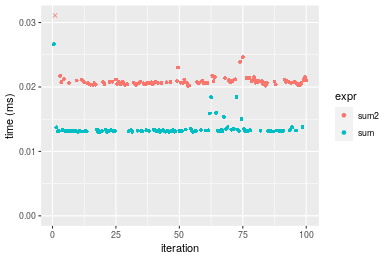
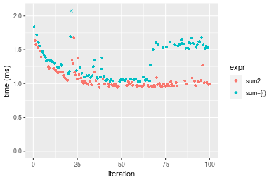
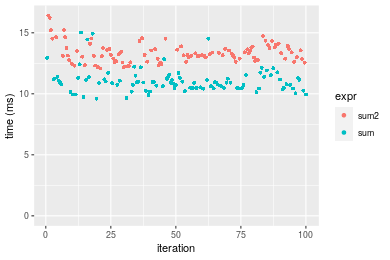
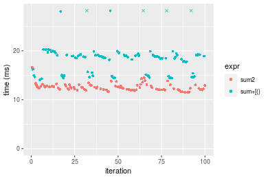
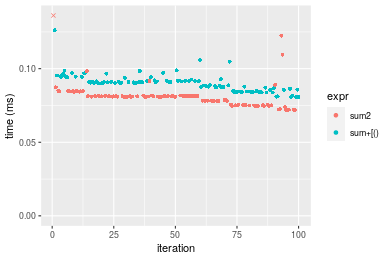
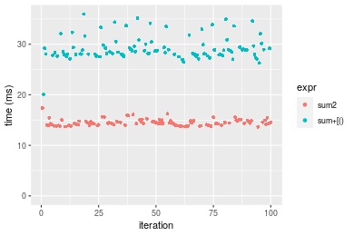

[matrixStats]: Benchmark report

---------------------------------------


# sum2() benchmarks

This report benchmark the performance of sum2() against alternative methods.

## Alternative methods

* sum() + [()

as below

```r
> sum2_R <- function(x, na.rm = FALSE, idxs) {
+     sum(x[idxs], na.rm = na.rm)
+ }
```


## Data type "integer"
### Data
```r
> rvector <- function(n, mode = c("logical", "double", "integer"), range = c(-100, +100), na_prob = 0) {
+     mode <- match.arg(mode)
+     if (mode == "logical") {
+         x <- sample(c(FALSE, TRUE), size = n, replace = TRUE)
+     }     else {
+         x <- runif(n, min = range[1], max = range[2])
+     }
+     storage.mode(x) <- mode
+     if (na_prob > 0) 
+         x[sample(n, size = na_prob * n)] <- NA
+     x
+ }
> rvectors <- function(scale = 10, seed = 1, ...) {
+     set.seed(seed)
+     data <- list()
+     data[[1]] <- rvector(n = scale * 100, ...)
+     data[[2]] <- rvector(n = scale * 1000, ...)
+     data[[3]] <- rvector(n = scale * 10000, ...)
+     data[[4]] <- rvector(n = scale * 1e+05, ...)
+     data[[5]] <- rvector(n = scale * 1e+06, ...)
+     names(data) <- sprintf("n = %d", sapply(data, FUN = length))
+     data
+ }
> data <- rvectors(mode = mode)
```

### Results

### n = 1000 vector


#### All elements
```r
> x <- data[["n = 1000"]]
> gc()
           used  (Mb) gc trigger  (Mb) max used  (Mb)
Ncells  5285898 282.3   10014072 534.9 10014072 534.9
Vcells 37045416 282.7   58945016 449.8 90959857 694.0
> stats <- microbenchmark(sum2 = sum2(x), sum = sum(x), unit = "ms")
```

_Table: Benchmarking of sum2() and sum() on n = 1000+all data. The top panel shows times in milliseconds and the bottom panel shows relative times._


|   |expr |      min|       lq|      mean|    median|       uq|      max|
|:--|:----|--------:|--------:|---------:|---------:|--------:|--------:|
|2  |sum  | 0.001119| 0.001141| 0.0012235| 0.0011955| 0.001232| 0.003760|
|1  |sum2 | 0.004984| 0.005041| 0.0053416| 0.0050985| 0.005272| 0.022475|


|   |expr |      min|       lq|     mean|   median|       uq|      max|
|:--|:----|--------:|--------:|--------:|--------:|--------:|--------:|
|2  |sum  | 1.000000| 1.000000| 1.000000| 1.000000| 1.000000| 1.000000|
|1  |sum2 | 4.453977| 4.418054| 4.365984| 4.264743| 4.279221| 5.977394|

_Figure: Benchmarking of sum2() and sum() on n = 1000+all data.  Outliers are displayed as crosses.  Times are in milliseconds._


#### A 20% subset
```r
> x <- data[["n = 1000"]]
> subset
[1] 0.2
> idxs <- sort(sample(length(x), size = subset * length(x), replace = FALSE))
> gc()
           used  (Mb) gc trigger  (Mb) max used  (Mb)
Ncells  5283732 282.2   10014072 534.9 10014072 534.9
Vcells 15410641 117.6   47156013 359.8 90959857 694.0
> stats <- microbenchmark(sum2 = sum2(x, idxs = idxs), `sum+[()` = sum2_R(x, idxs = idxs), unit = "ms")
```

_Table: Benchmarking of sum2() and sum+[()() on integer+n = 1000+0.2 data. The top panel shows times in milliseconds and the bottom panel shows relative times._


|   |expr    |      min|        lq|      mean|    median|        uq|      max|
|:--|:-------|--------:|---------:|---------:|---------:|---------:|--------:|
|2  |sum+[() | 0.002260| 0.0025265| 0.0028729| 0.0026320| 0.0028675| 0.015109|
|1  |sum2    | 0.004457| 0.0047370| 0.0050891| 0.0048975| 0.0050645| 0.021819|


|   |expr    |      min|       lq|     mean|   median|       uq|      max|
|:--|:-------|--------:|--------:|--------:|--------:|--------:|--------:|
|2  |sum+[() | 1.000000| 1.000000| 1.000000| 1.000000| 1.000000| 1.000000|
|1  |sum2    | 1.972124| 1.874926| 1.771432| 1.860752| 1.766173| 1.444106|

_Figure: Benchmarking of sum2() and sum+[()() on integer+n = 1000+0.2 data.  Outliers are displayed as crosses.  Times are in milliseconds._


#### A 40% subset
```r
> x <- data[["n = 1000"]]
> subset
[1] 0.4
> idxs <- sort(sample(length(x), size = subset * length(x), replace = FALSE))
> gc()
           used  (Mb) gc trigger  (Mb) max used  (Mb)
Ncells  5283798 282.2   10014072 534.9 10014072 534.9
Vcells 15410793 117.6   47156013 359.8 90959857 694.0
> stats <- microbenchmark(sum2 = sum2(x, idxs = idxs), `sum+[()` = sum2_R(x, idxs = idxs), unit = "ms")
```

_Table: Benchmarking of sum2() and sum+[()() on integer+n = 1000+0.4 data. The top panel shows times in milliseconds and the bottom panel shows relative times._


|   |expr    |      min|        lq|      mean|    median|        uq|      max|
|:--|:-------|--------:|---------:|---------:|---------:|---------:|--------:|
|2  |sum+[() | 0.003205| 0.0033685| 0.0036921| 0.0035035| 0.0036435| 0.015403|
|1  |sum2    | 0.005639| 0.0059140| 0.0063060| 0.0060625| 0.0063215| 0.023978|


|   |expr    |      min|       lq|     mean|   median|       uq|     max|
|:--|:-------|--------:|--------:|--------:|--------:|--------:|-------:|
|2  |sum+[() | 1.000000| 1.000000| 1.000000| 1.000000| 1.000000| 1.00000|
|1  |sum2    | 1.759438| 1.755678| 1.707994| 1.730412| 1.735008| 1.55671|

_Figure: Benchmarking of sum2() and sum+[()() on integer+n = 1000+0.4 data.  Outliers are displayed as crosses.  Times are in milliseconds._


#### A 80% subset
```r
> x <- data[["n = 1000"]]
> subset
[1] 0.8
> idxs <- sort(sample(length(x), size = subset * length(x), replace = FALSE))
> gc()
           used  (Mb) gc trigger  (Mb) max used  (Mb)
Ncells  5283861 282.2   10014072 534.9 10014072 534.9
Vcells 15411547 117.6   47156013 359.8 90959857 694.0
> stats <- microbenchmark(sum2 = sum2(x, idxs = idxs), `sum+[()` = sum2_R(x, idxs = idxs), unit = "ms")
```

_Table: Benchmarking of sum2() and sum+[()() on integer+n = 1000+0.8 data. The top panel shows times in milliseconds and the bottom panel shows relative times._


|   |expr    |      min|       lq|      mean|    median|        uq|      max|
|:--|:-------|--------:|--------:|---------:|---------:|---------:|--------:|
|2  |sum+[() | 0.004796| 0.005037| 0.0053913| 0.0052775| 0.0054270| 0.019443|
|1  |sum2    | 0.007811| 0.008228| 0.0086706| 0.0084785| 0.0086505| 0.027825|


|   |expr    |      min|       lq|     mean|   median|       uq|      max|
|:--|:-------|--------:|--------:|--------:|--------:|--------:|--------:|
|2  |sum+[() | 1.000000| 1.000000| 1.000000| 1.000000| 1.000000| 1.000000|
|1  |sum2    | 1.628649| 1.633512| 1.608267| 1.606537| 1.593975| 1.431106|

_Figure: Benchmarking of sum2() and sum+[()() on integer+n = 1000+0.8 data.  Outliers are displayed as crosses.  Times are in milliseconds._


### n = 10000 vector


#### All elements
```r
> x <- data[["n = 10000"]]
> gc()
           used  (Mb) gc trigger  (Mb) max used  (Mb)
Ncells  5283859 282.2   10014072 534.9 10014072 534.9
Vcells 15411171 117.6   47156013 359.8 90959857 694.0
> stats <- microbenchmark(sum2 = sum2(x), sum = sum(x), unit = "ms")
```

_Table: Benchmarking of sum2() and sum() on n = 10000+all data. The top panel shows times in milliseconds and the bottom panel shows relative times._


|   |expr |      min|        lq|      mean|    median|       uq|      max|
|:--|:----|--------:|---------:|---------:|---------:|--------:|--------:|
|2  |sum  | 0.008359| 0.0084920| 0.0087336| 0.0087300| 0.008890| 0.013520|
|1  |sum2 | 0.023246| 0.0234935| 0.0243467| 0.0242645| 0.024508| 0.038936|


|   |expr |      min|       lq|     mean|   median|       uq|      max|
|:--|:----|--------:|--------:|--------:|--------:|--------:|--------:|
|2  |sum  | 1.000000| 1.000000| 1.000000| 1.000000| 1.000000| 1.000000|
|1  |sum2 | 2.780955| 2.766545| 2.787707| 2.779439| 2.756805| 2.879882|

_Figure: Benchmarking of sum2() and sum() on n = 10000+all data.  Outliers are displayed as crosses.  Times are in milliseconds._




#### A 20% subset
```r
> x <- data[["n = 10000"]]
> subset
[1] 0.2
> idxs <- sort(sample(length(x), size = subset * length(x), replace = FALSE))
> gc()
           used  (Mb) gc trigger  (Mb) max used  (Mb)
Ncells  5283987 282.2   10014072 534.9 10014072 534.9
Vcells 15412229 117.6   47156013 359.8 90959857 694.0
> stats <- microbenchmark(sum2 = sum2(x, idxs = idxs), `sum+[()` = sum2_R(x, idxs = idxs), unit = "ms")
```

_Table: Benchmarking of sum2() and sum+[()() on integer+n = 10000+0.2 data. The top panel shows times in milliseconds and the bottom panel shows relative times._


|   |expr    |      min|        lq|      mean|    median|       uq|      max|
|:--|:-------|--------:|---------:|---------:|---------:|--------:|--------:|
|2  |sum+[() | 0.009381| 0.0098160| 0.0104215| 0.0101070| 0.010366| 0.026156|
|1  |sum2    | 0.014412| 0.0151175| 0.0158846| 0.0154295| 0.016011| 0.047106|


|   |expr    |      min|       lq|     mean|   median|       uq|      max|
|:--|:-------|--------:|--------:|--------:|--------:|--------:|--------:|
|2  |sum+[() | 1.000000| 1.000000| 1.000000| 1.000000| 1.000000| 1.000000|
|1  |sum2    | 1.536297| 1.540088| 1.524217| 1.526615| 1.544569| 1.800963|

_Figure: Benchmarking of sum2() and sum+[()() on integer+n = 10000+0.2 data.  Outliers are displayed as crosses.  Times are in milliseconds._


#### A 40% subset
```r
> x <- data[["n = 10000"]]
> subset
[1] 0.4
> idxs <- sort(sample(length(x), size = subset * length(x), replace = FALSE))
> gc()
           used  (Mb) gc trigger  (Mb) max used  (Mb)
Ncells  5284050 282.2   10014072 534.9 10014072 534.9
Vcells 15413500 117.6   47156013 359.8 90959857 694.0
> stats <- microbenchmark(sum2 = sum2(x, idxs = idxs), `sum+[()` = sum2_R(x, idxs = idxs), unit = "ms")
```

_Table: Benchmarking of sum2() and sum+[()() on integer+n = 10000+0.4 data. The top panel shows times in milliseconds and the bottom panel shows relative times._


|   |expr    |      min|        lq|      mean|    median|        uq|      max|
|:--|:-------|--------:|---------:|---------:|---------:|---------:|--------:|
|2  |sum+[() | 0.016520| 0.0173035| 0.0185803| 0.0177755| 0.0186300| 0.047761|
|1  |sum2    | 0.025237| 0.0256790| 0.0265971| 0.0259685| 0.0267315| 0.047665|


|   |expr    |      min|       lq|     mean|   median|       uq|     max|
|:--|:-------|--------:|--------:|--------:|--------:|--------:|-------:|
|2  |sum+[() | 1.000000| 1.000000| 1.000000| 1.000000| 1.000000| 1.00000|
|1  |sum2    | 1.527663| 1.484035| 1.431468| 1.460915| 1.434863| 0.99799|

_Figure: Benchmarking of sum2() and sum+[()() on integer+n = 10000+0.4 data.  Outliers are displayed as crosses.  Times are in milliseconds._


#### A 80% subset
```r
> x <- data[["n = 10000"]]
> subset
[1] 0.8
> idxs <- sort(sample(length(x), size = subset * length(x), replace = FALSE))
> gc()
           used  (Mb) gc trigger  (Mb) max used  (Mb)
Ncells  5284113 282.3   10014072 534.9 10014072 534.9
Vcells 15415801 117.7   47156013 359.8 90959857 694.0
> stats <- microbenchmark(sum2 = sum2(x, idxs = idxs), `sum+[()` = sum2_R(x, idxs = idxs), unit = "ms")
```

_Table: Benchmarking of sum2() and sum+[()() on integer+n = 10000+0.8 data. The top panel shows times in milliseconds and the bottom panel shows relative times._


|   |expr    |      min|        lq|      mean|    median|        uq|      max|
|:--|:-------|--------:|---------:|---------:|---------:|---------:|--------:|
|2  |sum+[() | 0.030125| 0.0311480| 0.0324510| 0.0319985| 0.0330070| 0.053185|
|1  |sum2    | 0.043065| 0.0447205| 0.0463941| 0.0451745| 0.0466175| 0.086259|


|   |expr    |      min|       lq|     mean|   median|       uq|      max|
|:--|:-------|--------:|--------:|--------:|--------:|--------:|--------:|
|2  |sum+[() | 1.000000| 1.000000| 1.000000| 1.000000| 1.000000| 1.000000|
|1  |sum2    | 1.429544| 1.435742| 1.429667| 1.411769| 1.412352| 1.621867|

_Figure: Benchmarking of sum2() and sum+[()() on integer+n = 10000+0.8 data.  Outliers are displayed as crosses.  Times are in milliseconds._


### n = 100000 vector


#### All elements
```r
> x <- data[["n = 100000"]]
> gc()
           used  (Mb) gc trigger  (Mb) max used  (Mb)
Ncells  5284111 282.3   10014072 534.9 10014072 534.9
Vcells 15415734 117.7   47156013 359.8 90959857 694.0
> stats <- microbenchmark(sum2 = sum2(x), sum = sum(x), unit = "ms")
```

_Table: Benchmarking of sum2() and sum() on n = 100000+all data. The top panel shows times in milliseconds and the bottom panel shows relative times._


|   |expr |      min|        lq|      mean|    median|       uq|      max|
|:--|:----|--------:|---------:|---------:|---------:|--------:|--------:|
|2  |sum  | 0.063881| 0.0680950| 0.0733152| 0.0729955| 0.078838| 0.090616|
|1  |sum2 | 0.160387| 0.1707445| 0.1822474| 0.1750475| 0.192853| 0.266294|


|   |expr |      min|       lq|     mean|   median|       uq|      max|
|:--|:----|--------:|--------:|--------:|--------:|--------:|--------:|
|2  |sum  | 1.000000| 1.000000| 1.000000| 1.000000| 1.000000| 1.000000|
|1  |sum2 | 2.510715| 2.507446| 2.485808| 2.398059| 2.446194| 2.938708|

_Figure: Benchmarking of sum2() and sum() on n = 100000+all data.  Outliers are displayed as crosses.  Times are in milliseconds._


#### A 20% subset
```r
> x <- data[["n = 100000"]]
> subset
[1] 0.2
> idxs <- sort(sample(length(x), size = subset * length(x), replace = FALSE))
> gc()
           used  (Mb) gc trigger  (Mb) max used  (Mb)
Ncells  5284239 282.3   10014072 534.9 10014072 534.9
Vcells 15422193 117.7   47156013 359.8 90959857 694.0
> stats <- microbenchmark(sum2 = sum2(x, idxs = idxs), `sum+[()` = sum2_R(x, idxs = idxs), unit = "ms")
```

_Table: Benchmarking of sum2() and sum+[()() on integer+n = 100000+0.2 data. The top panel shows times in milliseconds and the bottom panel shows relative times._


|   |expr    |      min|       lq|      mean|    median|        uq|      max|
|:--|:-------|--------:|--------:|---------:|---------:|---------:|--------:|
|2  |sum+[() | 0.066354| 0.069639| 0.0753954| 0.0746885| 0.0796145| 0.106737|
|1  |sum2    | 0.091711| 0.098280| 0.1046967| 0.1032705| 0.1101540| 0.148418|


|   |expr    |      min|       lq|     mean|   median|       uq|      max|
|:--|:-------|--------:|--------:|--------:|--------:|--------:|--------:|
|2  |sum+[() | 1.000000| 1.000000| 1.000000| 1.000000| 1.000000| 1.000000|
|1  |sum2    | 1.382147| 1.411278| 1.388634| 1.382683| 1.383592| 1.390502|

_Figure: Benchmarking of sum2() and sum+[()() on integer+n = 100000+0.2 data.  Outliers are displayed as crosses.  Times are in milliseconds._


#### A 40% subset
```r
> x <- data[["n = 100000"]]
> subset
[1] 0.4
> idxs <- sort(sample(length(x), size = subset * length(x), replace = FALSE))
> gc()
           used  (Mb) gc trigger  (Mb) max used  (Mb)
Ncells  5284302 282.3   10014072 534.9 10014072 534.9
Vcells 15432604 117.8   47156013 359.8 90959857 694.0
> stats <- microbenchmark(sum2 = sum2(x, idxs = idxs), `sum+[()` = sum2_R(x, idxs = idxs), unit = "ms")
```

_Table: Benchmarking of sum2() and sum+[()() on integer+n = 100000+0.4 data. The top panel shows times in milliseconds and the bottom panel shows relative times._


|   |expr    |      min|       lq|      mean|    median|        uq|      max|
|:--|:-------|--------:|--------:|---------:|---------:|---------:|--------:|
|2  |sum+[() | 0.117490| 0.125675| 0.1370252| 0.1338885| 0.1439435| 0.198406|
|1  |sum2    | 0.162947| 0.173521| 0.1864323| 0.1796390| 0.1997535| 0.242362|


|   |expr    |      min|       lq|    mean|   median|       uq|      max|
|:--|:-------|--------:|--------:|-------:|--------:|--------:|--------:|
|2  |sum+[() | 1.000000| 1.000000| 1.00000| 1.000000| 1.000000| 1.000000|
|1  |sum2    | 1.386901| 1.380712| 1.36057| 1.341706| 1.387722| 1.221546|

_Figure: Benchmarking of sum2() and sum+[()() on integer+n = 100000+0.4 data.  Outliers are displayed as crosses.  Times are in milliseconds._


#### A 80% subset
```r
> x <- data[["n = 100000"]]
> subset
[1] 0.8
> idxs <- sort(sample(length(x), size = subset * length(x), replace = FALSE))
> gc()
           used  (Mb) gc trigger  (Mb) max used  (Mb)
Ncells  5284365 282.3   10014072 534.9 10014072 534.9
Vcells 15452646 117.9   47156013 359.8 90959857 694.0
> stats <- microbenchmark(sum2 = sum2(x, idxs = idxs), `sum+[()` = sum2_R(x, idxs = idxs), unit = "ms")
```

_Table: Benchmarking of sum2() and sum+[()() on integer+n = 100000+0.8 data. The top panel shows times in milliseconds and the bottom panel shows relative times._


|   |expr    |      min|        lq|      mean|    median|        uq|      max|
|:--|:-------|--------:|---------:|---------:|---------:|---------:|--------:|
|2  |sum+[() | 0.212844| 0.2478245| 0.2739784| 0.2853315| 0.2996865| 0.330411|
|1  |sum2    | 0.296554| 0.3357550| 0.3879250| 0.3594785| 0.4611125| 0.526610|


|   |expr    |      min|      lq|     mean|   median|      uq|      max|
|:--|:-------|--------:|-------:|--------:|--------:|-------:|--------:|
|2  |sum+[() | 1.000000| 1.00000| 1.000000| 1.000000| 1.00000| 1.000000|
|1  |sum2    | 1.393293| 1.35481| 1.415896| 1.259863| 1.53865| 1.593803|

_Figure: Benchmarking of sum2() and sum+[()() on integer+n = 100000+0.8 data.  Outliers are displayed as crosses.  Times are in milliseconds._


### n = 1000000 vector


#### All elements
```r
> x <- data[["n = 1000000"]]
> gc()
           used  (Mb) gc trigger  (Mb) max used  (Mb)
Ncells  5284363 282.3   10014072 534.9 10014072 534.9
Vcells 15452711 117.9   47156013 359.8 90959857 694.0
> stats <- microbenchmark(sum2 = sum2(x), sum = sum(x), unit = "ms")
```

_Table: Benchmarking of sum2() and sum() on n = 1000000+all data. The top panel shows times in milliseconds and the bottom panel shows relative times._


|   |expr |      min|        lq|      mean|    median|       uq|      max|
|:--|:----|--------:|---------:|---------:|---------:|--------:|--------:|
|2  |sum  | 0.521083| 0.5320005| 0.5701767| 0.5496415| 0.576922| 0.823035|
|1  |sum2 | 1.288003| 1.3036955| 1.3888050| 1.3578260| 1.364872| 2.159972|


|   |expr |      min|       lq|     mean|   median|       uq|      max|
|:--|:----|--------:|--------:|--------:|--------:|--------:|--------:|
|2  |sum  | 1.000000| 1.000000| 1.000000| 1.000000| 1.000000| 1.000000|
|1  |sum2 | 2.471781| 2.450553| 2.435745| 2.470385| 2.365783| 2.624399|

_Figure: Benchmarking of sum2() and sum() on n = 1000000+all data.  Outliers are displayed as crosses.  Times are in milliseconds._


#### A 20% subset
```r
> x <- data[["n = 1000000"]]
> subset
[1] 0.2
> idxs <- sort(sample(length(x), size = subset * length(x), replace = FALSE))
> gc()
           used  (Mb) gc trigger  (Mb) max used  (Mb)
Ncells  5284491 282.3   10014072 534.9 10014072 534.9
Vcells 15513169 118.4   47156013 359.8 90959857 694.0
> stats <- microbenchmark(sum2 = sum2(x, idxs = idxs), `sum+[()` = sum2_R(x, idxs = idxs), unit = "ms")
```

_Table: Benchmarking of sum2() and sum+[()() on integer+n = 1000000+0.2 data. The top panel shows times in milliseconds and the bottom panel shows relative times._


|   |expr    |      min|        lq|      mean|    median|        uq|      max|
|:--|:-------|--------:|---------:|---------:|---------:|---------:|--------:|
|2  |sum+[() | 0.714451| 0.8014775| 0.8624878| 0.8448635| 0.9042715| 1.105876|
|1  |sum2    | 1.084261| 1.2269625| 1.3056103| 1.2767335| 1.3636405| 1.653814|


|   |expr    |      min|       lq|     mean|   median|       uq|      max|
|:--|:-------|--------:|--------:|--------:|--------:|--------:|--------:|
|2  |sum+[() | 1.000000| 1.000000| 1.000000| 1.000000| 1.000000| 1.000000|
|1  |sum2    | 1.517614| 1.530876| 1.513772| 1.511171| 1.507999| 1.495479|

_Figure: Benchmarking of sum2() and sum+[()() on integer+n = 1000000+0.2 data.  Outliers are displayed as crosses.  Times are in milliseconds._


#### A 40% subset
```r
> x <- data[["n = 1000000"]]
> subset
[1] 0.4
> idxs <- sort(sample(length(x), size = subset * length(x), replace = FALSE))
> gc()
           used  (Mb) gc trigger  (Mb) max used  (Mb)
Ncells  5284554 282.3   10014072 534.9 10014072 534.9
Vcells 15613213 119.2   47156013 359.8 90959857 694.0
> stats <- microbenchmark(sum2 = sum2(x, idxs = idxs), `sum+[()` = sum2_R(x, idxs = idxs), unit = "ms")
```

_Table: Benchmarking of sum2() and sum+[()() on integer+n = 1000000+0.4 data. The top panel shows times in milliseconds and the bottom panel shows relative times._


|   |expr    |      min|       lq|     mean|   median|       uq|      max|
|:--|:-------|--------:|--------:|--------:|--------:|--------:|--------:|
|2  |sum+[() | 1.043881| 1.099131| 1.191024| 1.136103| 1.223502| 1.807013|
|1  |sum2    | 1.444731| 1.505727| 1.633820| 1.553992| 1.584235| 6.847922|


|   |expr    |   min|       lq|     mean|   median|       uq|      max|
|:--|:-------|-----:|--------:|--------:|--------:|--------:|--------:|
|2  |sum+[() | 1.000| 1.000000| 1.000000| 1.000000| 1.000000| 1.000000|
|1  |sum2    | 1.384| 1.369926| 1.371778| 1.367826| 1.294836| 3.789636|

_Figure: Benchmarking of sum2() and sum+[()() on integer+n = 1000000+0.4 data.  Outliers are displayed as crosses.  Times are in milliseconds._



#### A 80% subset
```r
> x <- data[["n = 1000000"]]
> subset
[1] 0.8
> idxs <- sort(sample(length(x), size = subset * length(x), replace = FALSE))
> gc()
           used  (Mb) gc trigger  (Mb) max used  (Mb)
Ncells  5284617 282.3   10014072 534.9 10014072 534.9
Vcells 15813785 120.7   47156013 359.8 90959857 694.0
> stats <- microbenchmark(sum2 = sum2(x, idxs = idxs), `sum+[()` = sum2_R(x, idxs = idxs), unit = "ms")
```

_Table: Benchmarking of sum2() and sum+[()() on integer+n = 1000000+0.8 data. The top panel shows times in milliseconds and the bottom panel shows relative times._


|   |expr    |      min|       lq|     mean|   median|       uq|      max|
|:--|:-------|--------:|--------:|--------:|--------:|--------:|--------:|
|2  |sum+[() | 2.106396| 2.243083| 2.367009| 2.274287| 2.332871| 7.591631|
|1  |sum2    | 2.890362| 3.057860| 3.306450| 3.133010| 3.217300| 8.729541|


|   |expr    |      min|      lq|     mean|   median|       uq|     max|
|:--|:-------|--------:|-------:|--------:|--------:|--------:|-------:|
|2  |sum+[() | 1.000000| 1.00000| 1.000000| 1.000000| 1.000000| 1.00000|
|1  |sum2    | 1.372184| 1.36324| 1.396889| 1.377579| 1.379116| 1.14989|

_Figure: Benchmarking of sum2() and sum+[()() on integer+n = 1000000+0.8 data.  Outliers are displayed as crosses.  Times are in milliseconds._


### n = 10000000 vector


#### All elements
```r
> x <- data[["n = 10000000"]]
> gc()
           used  (Mb) gc trigger  (Mb) max used  (Mb)
Ncells  5284615 282.3   10014072 534.9 10014072 534.9
Vcells 15813409 120.7   47156013 359.8 90959857 694.0
> stats <- microbenchmark(sum2 = sum2(x), sum = sum(x), unit = "ms")
```

_Table: Benchmarking of sum2() and sum() on n = 10000000+all data. The top panel shows times in milliseconds and the bottom panel shows relative times._


|   |expr |       min|       lq|     mean|    median|        uq|       max|
|:--|:----|---------:|--------:|--------:|---------:|---------:|---------:|
|2  |sum  |  6.011622|  6.43525|  6.53022|  6.502597|  6.595218|  9.190804|
|1  |sum2 | 13.629251| 14.55810| 14.75445| 14.783079| 14.854335| 18.384923|


|   |expr |     min|       lq|     mean|   median|       uq|      max|
|:--|:----|-------:|--------:|--------:|--------:|--------:|--------:|
|2  |sum  | 1.00000| 1.000000| 1.000000| 1.000000| 1.000000| 1.000000|
|1  |sum2 | 2.26715| 2.262243| 2.259411| 2.273412| 2.252289| 2.000361|

_Figure: Benchmarking of sum2() and sum() on n = 10000000+all data.  Outliers are displayed as crosses.  Times are in milliseconds._




#### A 20% subset
```r
> x <- data[["n = 10000000"]]
> subset
[1] 0.2
> idxs <- sort(sample(length(x), size = subset * length(x), replace = FALSE))
> gc()
           used  (Mb) gc trigger  (Mb) max used  (Mb)
Ncells  5284743 282.3   10014072 534.9 10014072 534.9
Vcells 16413867 125.3   47156013 359.8 90959857 694.0
> stats <- microbenchmark(sum2 = sum2(x, idxs = idxs), `sum+[()` = sum2_R(x, idxs = idxs), unit = "ms")
```

_Table: Benchmarking of sum2() and sum+[()() on integer+n = 10000000+0.2 data. The top panel shows times in milliseconds and the bottom panel shows relative times._


|   |expr    |      min|        lq|      mean|    median|       uq|      max|
|:--|:-------|--------:|---------:|---------:|---------:|--------:|--------:|
|2  |sum+[() | 7.314241|  9.419828|  9.966503|  9.799765| 10.03223| 21.90145|
|1  |sum2    | 9.949639| 13.301965| 14.147249| 13.825064| 14.52792| 23.94363|


|   |expr    |     min|       lq|    mean|   median|       uq|      max|
|:--|:-------|-------:|--------:|-------:|--------:|--------:|--------:|
|2  |sum+[() | 1.00000| 1.000000| 1.00000| 1.000000| 1.000000| 1.000000|
|1  |sum2    | 1.36031| 1.412124| 1.41948| 1.410755| 1.448125| 1.093244|

_Figure: Benchmarking of sum2() and sum+[()() on integer+n = 10000000+0.2 data.  Outliers are displayed as crosses.  Times are in milliseconds._


#### A 40% subset
```r
> x <- data[["n = 10000000"]]
> subset
[1] 0.4
> idxs <- sort(sample(length(x), size = subset * length(x), replace = FALSE))
> gc()
           used  (Mb) gc trigger  (Mb) max used  (Mb)
Ncells  5284806 282.3   10014072 534.9 10014072 534.9
Vcells 17414550 132.9   47156013 359.8 90959857 694.0
> stats <- microbenchmark(sum2 = sum2(x, idxs = idxs), `sum+[()` = sum2_R(x, idxs = idxs), unit = "ms")
```

_Table: Benchmarking of sum2() and sum+[()() on integer+n = 10000000+0.4 data. The top panel shows times in milliseconds and the bottom panel shows relative times._


|   |expr    |      min|       lq|     mean|   median|       uq|      max|
|:--|:-------|--------:|--------:|--------:|--------:|--------:|--------:|
|2  |sum+[() | 12.55466| 14.48667| 17.16335| 17.14016| 17.78849| 26.72905|
|1  |sum2    | 17.85022| 25.15459| 25.78433| 25.73430| 27.01727| 39.47177|


|   |expr    |      min|       lq|    mean|   median|       uq|      max|
|:--|:-------|--------:|--------:|-------:|--------:|--------:|--------:|
|2  |sum+[() | 1.000000| 1.000000| 1.00000| 1.000000| 1.000000| 1.000000|
|1  |sum2    | 1.421801| 1.736396| 1.50229| 1.501404| 1.518806| 1.476736|

_Figure: Benchmarking of sum2() and sum+[()() on integer+n = 10000000+0.4 data.  Outliers are displayed as crosses.  Times are in milliseconds._



#### A 80% subset
```r
> x <- data[["n = 10000000"]]
> subset
[1] 0.8
> idxs <- sort(sample(length(x), size = subset * length(x), replace = FALSE))
> gc()
           used  (Mb) gc trigger  (Mb) max used  (Mb)
Ncells  5284869 282.3   10014072 534.9 10014072 534.9
Vcells 19414592 148.2   47156013 359.8 90959857 694.0
> stats <- microbenchmark(sum2 = sum2(x, idxs = idxs), `sum+[()` = sum2_R(x, idxs = idxs), unit = "ms")
```

_Table: Benchmarking of sum2() and sum+[()() on integer+n = 10000000+0.8 data. The top panel shows times in milliseconds and the bottom panel shows relative times._


|   |expr    |      min|       lq|     mean|   median|       uq|      max|
|:--|:-------|--------:|--------:|--------:|--------:|--------:|--------:|
|2  |sum+[() | 24.21368| 29.69736| 32.57814| 34.04261| 34.83274| 47.32989|
|1  |sum2    | 43.24212| 45.98824| 49.12330| 51.14857| 51.94686| 54.11252|


|   |expr    |      min|       lq|     mean|   median|       uq|      max|
|:--|:-------|--------:|--------:|--------:|--------:|--------:|--------:|
|2  |sum+[() | 1.000000| 1.000000| 1.000000| 1.000000| 1.000000| 1.000000|
|1  |sum2    | 1.785855| 1.548563| 1.507861| 1.502487| 1.491323| 1.143306|

_Figure: Benchmarking of sum2() and sum+[()() on integer+n = 10000000+0.8 data.  Outliers are displayed as crosses.  Times are in milliseconds._


## Data type "double"
### Data
```r
> rvector <- function(n, mode = c("logical", "double", "integer"), range = c(-100, +100), na_prob = 0) {
+     mode <- match.arg(mode)
+     if (mode == "logical") {
+         x <- sample(c(FALSE, TRUE), size = n, replace = TRUE)
+     }     else {
+         x <- runif(n, min = range[1], max = range[2])
+     }
+     storage.mode(x) <- mode
+     if (na_prob > 0) 
+         x[sample(n, size = na_prob * n)] <- NA
+     x
+ }
> rvectors <- function(scale = 10, seed = 1, ...) {
+     set.seed(seed)
+     data <- list()
+     data[[1]] <- rvector(n = scale * 100, ...)
+     data[[2]] <- rvector(n = scale * 1000, ...)
+     data[[3]] <- rvector(n = scale * 10000, ...)
+     data[[4]] <- rvector(n = scale * 1e+05, ...)
+     data[[5]] <- rvector(n = scale * 1e+06, ...)
+     names(data) <- sprintf("n = %d", sapply(data, FUN = length))
+     data
+ }
> data <- rvectors(mode = mode)
```

### Results

### n = 1000 vector


#### All elements
```r
> x <- data[["n = 1000"]]
> gc()
           used  (Mb) gc trigger  (Mb) max used  (Mb)
Ncells  5284867 282.3   10014072 534.9 10014072 534.9
Vcells 24969716 190.6   47156013 359.8 90959857 694.0
> stats <- microbenchmark(sum2 = sum2(x), sum = sum(x), unit = "ms")
```

_Table: Benchmarking of sum2() and sum() on n = 1000+all data. The top panel shows times in milliseconds and the bottom panel shows relative times._


|   |expr |      min|        lq|      mean|    median|        uq|      max|
|:--|:----|--------:|---------:|---------:|---------:|---------:|--------:|
|2  |sum  | 0.001531| 0.0015765| 0.0016532| 0.0016220| 0.0016525| 0.004144|
|1  |sum2 | 0.004587| 0.0046945| 0.0049569| 0.0047675| 0.0048755| 0.019813|


|   |expr |      min|       lq|     mean|   median|       uq|      max|
|:--|:----|--------:|--------:|--------:|--------:|--------:|--------:|
|2  |sum  | 1.000000| 1.000000| 1.000000| 1.000000| 1.000000| 1.000000|
|1  |sum2 | 2.996081| 2.977799| 2.998318| 2.939272| 2.950378| 4.781129|

_Figure: Benchmarking of sum2() and sum() on n = 1000+all data.  Outliers are displayed as crosses.  Times are in milliseconds._


#### A 20% subset
```r
> x <- data[["n = 1000"]]
> subset
[1] 0.2
> idxs <- sort(sample(length(x), size = subset * length(x), replace = FALSE))
> gc()
           used  (Mb) gc trigger  (Mb) max used  (Mb)
Ncells  5284992 282.3   10014072 534.9 10014072 534.9
Vcells 20971029 160.0   47156013 359.8 90959857 694.0
> stats <- microbenchmark(sum2 = sum2(x, idxs = idxs), `sum+[()` = sum2_R(x, idxs = idxs), unit = "ms")
```

_Table: Benchmarking of sum2() and sum+[()() on double+n = 1000+0.2 data. The top panel shows times in milliseconds and the bottom panel shows relative times._


|   |expr    |      min|        lq|      mean|    median|        uq|      max|
|:--|:-------|--------:|---------:|---------:|---------:|---------:|--------:|
|2  |sum+[() | 0.002419| 0.0025985| 0.0028787| 0.0027255| 0.0028575| 0.015057|
|1  |sum2    | 0.004512| 0.0047965| 0.0050846| 0.0049025| 0.0050295| 0.019761|


|   |expr    |      min|       lq|     mean|   median|       uq|      max|
|:--|:-------|--------:|--------:|--------:|--------:|--------:|--------:|
|2  |sum+[() | 1.000000| 1.000000| 1.000000| 1.000000| 1.000000| 1.000000|
|1  |sum2    | 1.865234| 1.845873| 1.766273| 1.798752| 1.760105| 1.312413|

_Figure: Benchmarking of sum2() and sum+[()() on double+n = 1000+0.2 data.  Outliers are displayed as crosses.  Times are in milliseconds._


#### A 40% subset
```r
> x <- data[["n = 1000"]]
> subset
[1] 0.4
> idxs <- sort(sample(length(x), size = subset * length(x), replace = FALSE))
> gc()
           used  (Mb) gc trigger  (Mb) max used  (Mb)
Ncells  5285058 282.3   10014072 534.9 10014072 534.9
Vcells 20971178 160.0   47156013 359.8 90959857 694.0
> stats <- microbenchmark(sum2 = sum2(x, idxs = idxs), `sum+[()` = sum2_R(x, idxs = idxs), unit = "ms")
```

_Table: Benchmarking of sum2() and sum+[()() on double+n = 1000+0.4 data. The top panel shows times in milliseconds and the bottom panel shows relative times._


|   |expr    |      min|       lq|      mean|    median|        uq|      max|
|:--|:-------|--------:|--------:|---------:|---------:|---------:|--------:|
|2  |sum+[() | 0.003181| 0.003371| 0.0036848| 0.0034885| 0.0036545| 0.018744|
|1  |sum2    | 0.005737| 0.006082| 0.0064582| 0.0062275| 0.0064965| 0.022366|


|   |expr    |      min|       lq|     mean|   median|       uq|      max|
|:--|:-------|--------:|--------:|--------:|--------:|--------:|--------:|
|2  |sum+[() | 1.000000| 1.000000| 1.000000| 1.000000| 1.000000| 1.000000|
|1  |sum2    | 1.803521| 1.804212| 1.752686| 1.785151| 1.777671| 1.193235|

_Figure: Benchmarking of sum2() and sum+[()() on double+n = 1000+0.4 data.  Outliers are displayed as crosses.  Times are in milliseconds._


#### A 80% subset
```r
> x <- data[["n = 1000"]]
> subset
[1] 0.8
> idxs <- sort(sample(length(x), size = subset * length(x), replace = FALSE))
> gc()
           used  (Mb) gc trigger  (Mb) max used  (Mb)
Ncells  5285121 282.3   10014072 534.9 10014072 534.9
Vcells 20971420 160.0   47156013 359.8 90959857 694.0
> stats <- microbenchmark(sum2 = sum2(x, idxs = idxs), `sum+[()` = sum2_R(x, idxs = idxs), unit = "ms")
```

_Table: Benchmarking of sum2() and sum+[()() on double+n = 1000+0.8 data. The top panel shows times in milliseconds and the bottom panel shows relative times._


|   |expr    |      min|       lq|      mean|   median|        uq|      max|
|:--|:-------|--------:|--------:|---------:|--------:|---------:|--------:|
|2  |sum+[() | 0.004437| 0.004741| 0.0052337| 0.004875| 0.0050265| 0.022275|
|1  |sum2    | 0.007661| 0.008263| 0.0086313| 0.008441| 0.0086600| 0.023283|


|   |expr    |      min|       lq|     mean|   median|       uq|      max|
|:--|:-------|--------:|--------:|--------:|--------:|--------:|--------:|
|2  |sum+[() | 1.000000| 1.000000| 1.000000| 1.000000| 1.000000| 1.000000|
|1  |sum2    | 1.726617| 1.742881| 1.649199| 1.731487| 1.722869| 1.045252|

_Figure: Benchmarking of sum2() and sum+[()() on double+n = 1000+0.8 data.  Outliers are displayed as crosses.  Times are in milliseconds._


### n = 10000 vector


#### All elements
```r
> x <- data[["n = 10000"]]
> gc()
           used  (Mb) gc trigger  (Mb) max used  (Mb)
Ncells  5285119 282.3   10014072 534.9 10014072 534.9
Vcells 20971044 160.0   47156013 359.8 90959857 694.0
> stats <- microbenchmark(sum2 = sum2(x), sum = sum(x), unit = "ms")
```

_Table: Benchmarking of sum2() and sum() on n = 10000+all data. The top panel shows times in milliseconds and the bottom panel shows relative times._


|   |expr |     min|       lq|      mean|   median|       uq|      max|
|:--|:----|-------:|--------:|---------:|--------:|--------:|--------:|
|2  |sum  | 0.01245| 0.012975| 0.0130618| 0.013061| 0.013142| 0.019014|
|1  |sum2 | 0.01938| 0.019759| 0.0205490| 0.020372| 0.020553| 0.035907|


|   |expr |      min|       lq|     mean|   median|       uq|      max|
|:--|:----|--------:|--------:|--------:|--------:|--------:|--------:|
|2  |sum  | 1.000000| 1.000000| 1.000000| 1.000000| 1.000000| 1.000000|
|1  |sum2 | 1.556626| 1.522852| 1.573223| 1.559758| 1.563917| 1.888451|

_Figure: Benchmarking of sum2() and sum() on n = 10000+all data.  Outliers are displayed as crosses.  Times are in milliseconds._


#### A 20% subset
```r
> x <- data[["n = 10000"]]
> subset
[1] 0.2
> idxs <- sort(sample(length(x), size = subset * length(x), replace = FALSE))
> gc()
           used  (Mb) gc trigger  (Mb) max used  (Mb)
Ncells  5285244 282.3   10014072 534.9 10014072 534.9
Vcells 20972097 160.1   47156013 359.8 90959857 694.0
> stats <- microbenchmark(sum2 = sum2(x, idxs = idxs), `sum+[()` = sum2_R(x, idxs = idxs), unit = "ms")
```

_Table: Benchmarking of sum2() and sum+[()() on double+n = 10000+0.2 data. The top panel shows times in milliseconds and the bottom panel shows relative times._


|   |expr    |      min|        lq|      mean|    median|        uq|      max|
|:--|:-------|--------:|---------:|---------:|---------:|---------:|--------:|
|2  |sum+[() | 0.009791| 0.0102445| 0.0112660| 0.0105070| 0.0111005| 0.041983|
|1  |sum2    | 0.015937| 0.0163620| 0.0169763| 0.0165925| 0.0169615| 0.032312|


|   |expr    |      min|      lq|     mean|   median|       uq|       max|
|:--|:-------|--------:|-------:|--------:|--------:|--------:|---------:|
|2  |sum+[() | 1.000000| 1.00000| 1.000000| 1.000000| 1.000000| 1.0000000|
|1  |sum2    | 1.627719| 1.59715| 1.506863| 1.579185| 1.527994| 0.7696449|

_Figure: Benchmarking of sum2() and sum+[()() on double+n = 10000+0.2 data.  Outliers are displayed as crosses.  Times are in milliseconds._


#### A 40% subset
```r
> x <- data[["n = 10000"]]
> subset
[1] 0.4
> idxs <- sort(sample(length(x), size = subset * length(x), replace = FALSE))
> gc()
           used  (Mb) gc trigger  (Mb) max used  (Mb)
Ncells  5285310 282.3   10014072 534.9 10014072 534.9
Vcells 20974061 160.1   47156013 359.8 90959857 694.0
> stats <- microbenchmark(sum2 = sum2(x, idxs = idxs), `sum+[()` = sum2_R(x, idxs = idxs), unit = "ms")
```

_Table: Benchmarking of sum2() and sum+[()() on double+n = 10000+0.4 data. The top panel shows times in milliseconds and the bottom panel shows relative times._


|   |expr    |      min|        lq|      mean|    median|        uq|      max|
|:--|:-------|--------:|---------:|---------:|---------:|---------:|--------:|
|2  |sum+[() | 0.017026| 0.0178370| 0.0187920| 0.0181555| 0.0185335| 0.041306|
|1  |sum2    | 0.026892| 0.0274085| 0.0286044| 0.0285305| 0.0290305| 0.042820|


|   |expr    |      min|       lq|     mean|   median|      uq|      max|
|:--|:-------|--------:|--------:|--------:|--------:|-------:|--------:|
|2  |sum+[() | 1.000000| 1.000000| 1.000000| 1.000000| 1.00000| 1.000000|
|1  |sum2    | 1.579467| 1.536609| 1.522163| 1.571452| 1.56638| 1.036653|

_Figure: Benchmarking of sum2() and sum+[()() on double+n = 10000+0.4 data.  Outliers are displayed as crosses.  Times are in milliseconds._


#### A 80% subset
```r
> x <- data[["n = 10000"]]
> subset
[1] 0.8
> idxs <- sort(sample(length(x), size = subset * length(x), replace = FALSE))
> gc()
           used  (Mb) gc trigger  (Mb) max used  (Mb)
Ncells  5285373 282.3   10014072 534.9 10014072 534.9
Vcells 20976103 160.1   47156013 359.8 90959857 694.0
> stats <- microbenchmark(sum2 = sum2(x, idxs = idxs), `sum+[()` = sum2_R(x, idxs = idxs), unit = "ms")
```

_Table: Benchmarking of sum2() and sum+[()() on double+n = 10000+0.8 data. The top panel shows times in milliseconds and the bottom panel shows relative times._


|   |expr    |      min|        lq|      mean|    median|       uq|      max|
|:--|:-------|--------:|---------:|---------:|---------:|--------:|--------:|
|2  |sum+[() | 0.027775| 0.0295830| 0.0427377| 0.0321220| 0.049970| 0.324094|
|1  |sum2    | 0.043930| 0.0464865| 0.0664115| 0.0493125| 0.077513| 0.365197|


|   |expr    |      min|       lq|     mean|   median|       uq|      max|
|:--|:-------|--------:|--------:|--------:|--------:|--------:|--------:|
|2  |sum+[() | 1.000000| 1.000000| 1.000000| 1.000000| 1.000000| 1.000000|
|1  |sum2    | 1.581638| 1.571392| 1.553932| 1.535163| 1.551191| 1.126824|

_Figure: Benchmarking of sum2() and sum+[()() on double+n = 10000+0.8 data.  Outliers are displayed as crosses.  Times are in milliseconds._


### n = 100000 vector


#### All elements
```r
> x <- data[["n = 100000"]]
> gc()
           used  (Mb) gc trigger  (Mb) max used  (Mb)
Ncells  5285371 282.3   10014072 534.9 10014072 534.9
Vcells 20975727 160.1   47156013 359.8 90959857 694.0
> stats <- microbenchmark(sum2 = sum2(x), sum = sum(x), unit = "ms")
```

_Table: Benchmarking of sum2() and sum() on n = 100000+all data. The top panel shows times in milliseconds and the bottom panel shows relative times._


|   |expr |      min|       lq|      mean|   median|        uq|      max|
|:--|:----|--------:|--------:|---------:|--------:|---------:|--------:|
|2  |sum  | 0.094780| 0.098565| 0.1075561| 0.104930| 0.1130135| 0.140206|
|1  |sum2 | 0.128716| 0.133412| 0.1452161| 0.139195| 0.1529955| 0.206819|


|   |expr |     min|       lq|     mean|   median|       uq|      max|
|:--|:----|-------:|--------:|--------:|--------:|--------:|--------:|
|2  |sum  | 1.00000| 1.000000| 1.000000| 1.000000| 1.000000| 1.000000|
|1  |sum2 | 1.35805| 1.353543| 1.350143| 1.326551| 1.353781| 1.475108|

_Figure: Benchmarking of sum2() and sum() on n = 100000+all data.  Outliers are displayed as crosses.  Times are in milliseconds._


#### A 20% subset
```r
> x <- data[["n = 100000"]]
> subset
[1] 0.2
> idxs <- sort(sample(length(x), size = subset * length(x), replace = FALSE))
> gc()
           used  (Mb) gc trigger  (Mb) max used  (Mb)
Ncells  5285496 282.3   10014072 534.9 10014072 534.9
Vcells 20982181 160.1   47156013 359.8 90959857 694.0
> stats <- microbenchmark(sum2 = sum2(x, idxs = idxs), `sum+[()` = sum2_R(x, idxs = idxs), unit = "ms")
```

_Table: Benchmarking of sum2() and sum+[()() on double+n = 100000+0.2 data. The top panel shows times in milliseconds and the bottom panel shows relative times._


|   |expr    |      min|        lq|      mean|    median|        uq|      max|
|:--|:-------|--------:|---------:|---------:|---------:|---------:|--------:|
|2  |sum+[() | 0.074931| 0.0776945| 0.0842740| 0.0827955| 0.0898935| 0.134197|
|1  |sum2    | 0.098437| 0.1019860| 0.1103848| 0.1096140| 0.1172700| 0.178788|


|   |expr    |      min|       lq|     mean|   median|       uq|     max|
|:--|:-------|--------:|--------:|--------:|--------:|--------:|-------:|
|2  |sum+[() | 1.000000| 1.000000| 1.000000| 1.000000| 1.000000| 1.00000|
|1  |sum2    | 1.313702| 1.312654| 1.309832| 1.323913| 1.304544| 1.33228|

_Figure: Benchmarking of sum2() and sum+[()() on double+n = 100000+0.2 data.  Outliers are displayed as crosses.  Times are in milliseconds._



#### A 40% subset
```r
> x <- data[["n = 100000"]]
> subset
[1] 0.4
> idxs <- sort(sample(length(x), size = subset * length(x), replace = FALSE))
> gc()
           used  (Mb) gc trigger  (Mb) max used  (Mb)
Ncells  5285562 282.3   10014072 534.9 10014072 534.9
Vcells 20992230 160.2   47156013 359.8 90959857 694.0
> stats <- microbenchmark(sum2 = sum2(x, idxs = idxs), `sum+[()` = sum2_R(x, idxs = idxs), unit = "ms")
```

_Table: Benchmarking of sum2() and sum+[()() on double+n = 100000+0.4 data. The top panel shows times in milliseconds and the bottom panel shows relative times._


|   |expr    |      min|        lq|      mean|    median|        uq|      max|
|:--|:-------|--------:|---------:|---------:|---------:|---------:|--------:|
|2  |sum+[() | 0.122919| 0.1332805| 0.1434866| 0.1375625| 0.1471465| 0.242858|
|1  |sum2    | 0.170248| 0.1810130| 0.1938263| 0.1876185| 0.2056520| 0.247134|


|   |expr    |      min|       lq|     mean|   median|     uq|      max|
|:--|:-------|--------:|--------:|--------:|--------:|------:|--------:|
|2  |sum+[() | 1.000000| 1.000000| 1.000000| 1.000000| 1.0000| 1.000000|
|1  |sum2    | 1.385042| 1.358136| 1.350832| 1.363878| 1.3976| 1.017607|

_Figure: Benchmarking of sum2() and sum+[()() on double+n = 100000+0.4 data.  Outliers are displayed as crosses.  Times are in milliseconds._


#### A 80% subset
```r
> x <- data[["n = 100000"]]
> subset
[1] 0.8
> idxs <- sort(sample(length(x), size = subset * length(x), replace = FALSE))
> gc()
           used  (Mb) gc trigger  (Mb) max used  (Mb)
Ncells  5285625 282.3   10014072 534.9 10014072 534.9
Vcells 21013376 160.4   47156013 359.8 90959857 694.0
> stats <- microbenchmark(sum2 = sum2(x, idxs = idxs), `sum+[()` = sum2_R(x, idxs = idxs), unit = "ms")
```

_Table: Benchmarking of sum2() and sum+[()() on double+n = 100000+0.8 data. The top panel shows times in milliseconds and the bottom panel shows relative times._


|   |expr    |      min|        lq|      mean|    median|        uq|      max|
|:--|:-------|--------:|---------:|---------:|---------:|---------:|--------:|
|2  |sum+[() | 0.200907| 0.2049795| 0.2430657| 0.2304685| 0.2710590| 0.381346|
|1  |sum2    | 0.294714| 0.3037645| 0.3536334| 0.3444330| 0.3837955| 0.505304|


|   |expr    |      min|       lq|     mean|   median|       uq|      max|
|:--|:-------|--------:|--------:|--------:|--------:|--------:|--------:|
|2  |sum+[() | 1.000000| 1.000000| 1.000000| 1.000000| 1.000000| 1.000000|
|1  |sum2    | 1.466918| 1.481926| 1.454889| 1.494491| 1.415911| 1.325054|

_Figure: Benchmarking of sum2() and sum+[()() on double+n = 100000+0.8 data.  Outliers are displayed as crosses.  Times are in milliseconds._


### n = 1000000 vector


#### All elements
```r
> x <- data[["n = 1000000"]]
> gc()
           used  (Mb) gc trigger  (Mb) max used  (Mb)
Ncells  5285623 282.3   10014072 534.9 10014072 534.9
Vcells 21013000 160.4   47156013 359.8 90959857 694.0
> stats <- microbenchmark(sum2 = sum2(x), sum = sum(x), unit = "ms")
```

_Table: Benchmarking of sum2() and sum() on n = 1000000+all data. The top panel shows times in milliseconds and the bottom panel shows relative times._


|   |expr |      min|       lq|      mean|    median|       uq|      max|
|:--|:----|--------:|--------:|---------:|---------:|--------:|--------:|
|2  |sum  | 0.840542| 0.879559| 0.9531875| 0.9141775| 0.971534| 1.434754|
|1  |sum2 | 1.094986| 1.141694| 1.2144403| 1.1695140| 1.218933| 1.886511|


|   |expr |      min|      lq|     mean|   median|       uq|      max|
|:--|:----|--------:|-------:|--------:|--------:|--------:|--------:|
|2  |sum  | 1.000000| 1.00000| 1.000000| 1.000000| 1.000000| 1.000000|
|1  |sum2 | 1.302714| 1.29803| 1.274083| 1.279307| 1.254648| 1.314867|

_Figure: Benchmarking of sum2() and sum() on n = 1000000+all data.  Outliers are displayed as crosses.  Times are in milliseconds._


#### A 20% subset
```r
> x <- data[["n = 1000000"]]
> subset
[1] 0.2
> idxs <- sort(sample(length(x), size = subset * length(x), replace = FALSE))
> gc()
           used  (Mb) gc trigger  (Mb) max used  (Mb)
Ncells  5285748 282.3   10014072 534.9 10014072 534.9
Vcells 21073453 160.8   47156013 359.8 90959857 694.0
> stats <- microbenchmark(sum2 = sum2(x, idxs = idxs), `sum+[()` = sum2_R(x, idxs = idxs), unit = "ms")
```

_Table: Benchmarking of sum2() and sum+[()() on double+n = 1000000+0.2 data. The top panel shows times in milliseconds and the bottom panel shows relative times._


|   |expr    |      min|       lq|     mean|   median|       uq|       max|
|:--|:-------|--------:|--------:|--------:|--------:|--------:|---------:|
|2  |sum+[() | 0.941601| 0.973291| 1.318922| 1.065950| 1.484930| 12.968698|
|1  |sum2    | 1.093633| 1.132885| 1.358048| 1.261791| 1.613638|  1.696689|


|   |expr    |      min|       lq|     mean|   median|       uq|       max|
|:--|:-------|--------:|--------:|--------:|--------:|--------:|---------:|
|2  |sum+[() | 1.000000| 1.000000| 1.000000| 1.000000| 1.000000| 1.0000000|
|1  |sum2    | 1.161461| 1.163974| 1.029665| 1.183725| 1.086676| 0.1308296|

_Figure: Benchmarking of sum2() and sum+[()() on double+n = 1000000+0.2 data.  Outliers are displayed as crosses.  Times are in milliseconds._


#### A 40% subset
```r
> x <- data[["n = 1000000"]]
> subset
[1] 0.4
> idxs <- sort(sample(length(x), size = subset * length(x), replace = FALSE))
> gc()
           used  (Mb) gc trigger  (Mb) max used  (Mb)
Ncells  5285814 282.3   10014072 534.9 10014072 534.9
Vcells 21173502 161.6   47156013 359.8 90959857 694.0
> stats <- microbenchmark(sum2 = sum2(x, idxs = idxs), `sum+[()` = sum2_R(x, idxs = idxs), unit = "ms")
```

_Table: Benchmarking of sum2() and sum+[()() on double+n = 1000000+0.4 data. The top panel shows times in milliseconds and the bottom panel shows relative times._


|   |expr    |      min|       lq|     mean|  median|       uq|       max|
|:--|:-------|--------:|--------:|--------:|-------:|--------:|---------:|
|1  |sum2    | 1.836883| 1.983291| 2.334697| 2.16177| 2.678529|  3.605998|
|2  |sum+[() | 1.464862| 1.627438| 2.264823| 2.20644| 2.405063| 10.886105|


|   |expr    |       min|        lq|      mean|   median|        uq|      max|
|:--|:-------|---------:|---------:|---------:|--------:|---------:|--------:|
|1  |sum2    | 1.0000000| 1.0000000| 1.0000000| 1.000000| 1.0000000| 1.000000|
|2  |sum+[() | 0.7974716| 0.8205744| 0.9700717| 1.020663| 0.8979044| 3.018888|

_Figure: Benchmarking of sum2() and sum+[()() on double+n = 1000000+0.4 data.  Outliers are displayed as crosses.  Times are in milliseconds._


#### A 80% subset
```r
> x <- data[["n = 1000000"]]
> subset
[1] 0.8
> idxs <- sort(sample(length(x), size = subset * length(x), replace = FALSE))
> gc()
           used  (Mb) gc trigger  (Mb) max used  (Mb)
Ncells  5285877 282.3   10014072 534.9 10014072 534.9
Vcells 21373544 163.1   47156013 359.8 90959857 694.0
> stats <- microbenchmark(sum2 = sum2(x, idxs = idxs), `sum+[()` = sum2_R(x, idxs = idxs), unit = "ms")
```

_Table: Benchmarking of sum2() and sum+[()() on double+n = 1000000+0.8 data. The top panel shows times in milliseconds and the bottom panel shows relative times._


|   |expr    |      min|       lq|     mean|   median|       uq|      max|
|:--|:-------|--------:|--------:|--------:|--------:|--------:|--------:|
|2  |sum+[() | 2.498542| 2.801975| 3.806862| 3.986315| 4.251293| 12.90702|
|1  |sum2    | 3.335579| 3.785414| 4.869589| 5.051364| 5.205932| 13.96770|


|   |expr    |     min|       lq|     mean|   median|       uq|      max|
|:--|:-------|-------:|--------:|--------:|--------:|--------:|--------:|
|2  |sum+[() | 1.00000| 1.000000| 1.000000| 1.000000| 1.000000| 1.000000|
|1  |sum2    | 1.33501| 1.350981| 1.279161| 1.267176| 1.224552| 1.082178|

_Figure: Benchmarking of sum2() and sum+[()() on double+n = 1000000+0.8 data.  Outliers are displayed as crosses.  Times are in milliseconds._


### n = 10000000 vector


#### All elements
```r
> x <- data[["n = 10000000"]]
> gc()
           used  (Mb) gc trigger  (Mb) max used  (Mb)
Ncells  5285875 282.3   10014072 534.9 10014072 534.9
Vcells 21373168 163.1   47156013 359.8 90959857 694.0
> stats <- microbenchmark(sum2 = sum2(x), sum = sum(x), unit = "ms")
```

_Table: Benchmarking of sum2() and sum() on n = 10000000+all data. The top panel shows times in milliseconds and the bottom panel shows relative times._


|   |expr |       min|        lq|     mean|    median|        uq|      max|
|:--|:----|---------:|---------:|--------:|---------:|---------:|--------:|
|2  |sum  |  9.468093|  9.690777| 10.09193|  9.815535|  9.972428| 16.23264|
|1  |sum2 | 11.913958| 12.179799| 12.45315| 12.343016| 12.478671| 15.74856|


|   |expr |      min|       lq|    mean|   median|       uq|       max|
|:--|:----|--------:|--------:|-------:|--------:|--------:|---------:|
|2  |sum  | 1.000000| 1.000000| 1.00000| 1.000000| 1.000000| 1.0000000|
|1  |sum2 | 1.258327| 1.256844| 1.23397| 1.257498| 1.251317| 0.9701783|

_Figure: Benchmarking of sum2() and sum() on n = 10000000+all data.  Outliers are displayed as crosses.  Times are in milliseconds._


#### A 20% subset
```r
> x <- data[["n = 10000000"]]
> subset
[1] 0.2
> idxs <- sort(sample(length(x), size = subset * length(x), replace = FALSE))
> gc()
           used  (Mb) gc trigger  (Mb) max used  (Mb)
Ncells  5286000 282.4   10014072 534.9 10014072 534.9
Vcells 21973621 167.7   47156013 359.8 90959857 694.0
> stats <- microbenchmark(sum2 = sum2(x, idxs = idxs), `sum+[()` = sum2_R(x, idxs = idxs), unit = "ms")
```

_Table: Benchmarking of sum2() and sum+[()() on double+n = 10000000+0.2 data. The top panel shows times in milliseconds and the bottom panel shows relative times._


|   |expr    |      min|       lq|     mean|   median|       uq|       max|
|:--|:-------|--------:|--------:|--------:|--------:|--------:|---------:|
|2  |sum+[() | 11.57273| 15.95823| 20.20550| 16.33830| 16.74091| 371.38775|
|1  |sum2    | 12.36590| 16.86605| 17.60888| 17.45341| 18.03776|  25.32309|


|   |expr    |      min|       lq|      mean|   median|       uq|      max|
|:--|:-------|--------:|--------:|---------:|--------:|--------:|--------:|
|2  |sum+[() | 1.000000| 1.000000| 1.0000000| 1.000000| 1.000000| 1.000000|
|1  |sum2    | 1.068539| 1.056887| 0.8714894| 1.068252| 1.077466| 0.068185|

_Figure: Benchmarking of sum2() and sum+[()() on double+n = 10000000+0.2 data.  Outliers are displayed as crosses.  Times are in milliseconds._


#### A 40% subset
```r
> x <- data[["n = 10000000"]]
> subset
[1] 0.4
> idxs <- sort(sample(length(x), size = subset * length(x), replace = FALSE))
> gc()
           used  (Mb) gc trigger  (Mb) max used  (Mb)
Ncells  5286066 282.4   10014072 534.9 10014072 534.9
Vcells 22975010 175.3   47156013 359.8 90959857 694.0
> stats <- microbenchmark(sum2 = sum2(x, idxs = idxs), `sum+[()` = sum2_R(x, idxs = idxs), unit = "ms")
```

_Table: Benchmarking of sum2() and sum+[()() on double+n = 10000000+0.4 data. The top panel shows times in milliseconds and the bottom panel shows relative times._


|   |expr    |      min|       lq|     mean|   median|       uq|      max|
|:--|:-------|--------:|--------:|--------:|--------:|--------:|--------:|
|2  |sum+[() | 24.24469| 25.12204| 28.08517| 26.06423| 27.20822| 42.71805|
|1  |sum2    | 26.42340| 27.71908| 32.14471| 29.45709| 30.90727| 54.88753|


|   |expr    |      min|       lq|     mean|   median|       uq|      max|
|:--|:-------|--------:|--------:|--------:|--------:|--------:|--------:|
|2  |sum+[() | 1.000000| 1.000000| 1.000000| 1.000000| 1.000000| 1.000000|
|1  |sum2    | 1.089864| 1.103377| 1.144544| 1.130173| 1.135954| 1.284879|

_Figure: Benchmarking of sum2() and sum+[()() on double+n = 10000000+0.4 data.  Outliers are displayed as crosses.  Times are in milliseconds._



#### A 80% subset
```r
> x <- data[["n = 10000000"]]
> subset
[1] 0.8
> idxs <- sort(sample(length(x), size = subset * length(x), replace = FALSE))
> gc()
           used  (Mb) gc trigger  (Mb) max used  (Mb)
Ncells  5286123 282.4   10014072 534.9 10014072 534.9
Vcells 24975042 190.6   47156013 359.8 90959857 694.0
> stats <- microbenchmark(sum2 = sum2(x, idxs = idxs), `sum+[()` = sum2_R(x, idxs = idxs), unit = "ms")
```

_Table: Benchmarking of sum2() and sum+[()() on double+n = 10000000+0.8 data. The top panel shows times in milliseconds and the bottom panel shows relative times._


|   |expr    |      min|       lq|     mean|   median|       uq|       max|
|:--|:-------|--------:|--------:|--------:|--------:|--------:|---------:|
|2  |sum+[() | 34.26886| 38.35344| 43.67921| 46.08772| 48.48639|  55.77299|
|1  |sum2    | 46.05692| 46.85997| 54.80666| 51.45627| 54.98157| 411.68036|


|   |expr    |      min|       lq|     mean|   median|       uq|      max|
|:--|:-------|--------:|--------:|--------:|--------:|--------:|--------:|
|2  |sum+[() | 1.000000| 1.000000| 1.000000| 1.000000| 1.000000| 1.000000|
|1  |sum2    | 1.343988| 1.221793| 1.254754| 1.116486| 1.133959| 7.381357|

_Figure: Benchmarking of sum2() and sum+[()() on double+n = 10000000+0.8 data.  Outliers are displayed as crosses.  Times are in milliseconds._


## Appendix

### Session information
```r
R version 4.1.1 Patched (2021-08-10 r80727)
Platform: x86_64-pc-linux-gnu (64-bit)
Running under: Ubuntu 18.04.5 LTS

Matrix products: default
BLAS:   /home/hb/software/R-devel/R-4-1-branch/lib/R/lib/libRblas.so
LAPACK: /home/hb/software/R-devel/R-4-1-branch/lib/R/lib/libRlapack.so

locale:
 [1] LC_CTYPE=en_US.UTF-8       LC_NUMERIC=C              
 [3] LC_TIME=en_US.UTF-8        LC_COLLATE=en_US.UTF-8    
 [5] LC_MONETARY=en_US.UTF-8    LC_MESSAGES=en_US.UTF-8   
 [7] LC_PAPER=en_US.UTF-8       LC_NAME=C                 
 [9] LC_ADDRESS=C               LC_TELEPHONE=C            
[11] LC_MEASUREMENT=en_US.UTF-8 LC_IDENTIFICATION=C       

attached base packages:
[1] stats     graphics  grDevices utils     datasets  methods   base     

other attached packages:
[1] microbenchmark_1.4-7   matrixStats_0.60.1     ggplot2_3.3.5         
[4] knitr_1.33             R.devices_2.17.0       R.utils_2.10.1        
[7] R.oo_1.24.0            R.methodsS3_1.8.1-9001 history_0.0.1-9000    

loaded via a namespace (and not attached):
 [1] Biobase_2.52.0          httr_1.4.2              splines_4.1.1          
 [4] bit64_4.0.5             network_1.17.1          assertthat_0.2.1       
 [7] highr_0.9               stats4_4.1.1            blob_1.2.2             
[10] GenomeInfoDbData_1.2.6  robustbase_0.93-8       pillar_1.6.2           
[13] RSQLite_2.2.8           lattice_0.20-44         glue_1.4.2             
[16] digest_0.6.27           XVector_0.32.0          colorspace_2.0-2       
[19] Matrix_1.3-4            XML_3.99-0.7            pkgconfig_2.0.3        
[22] zlibbioc_1.38.0         genefilter_1.74.0       purrr_0.3.4            
[25] ergm_4.1.2              xtable_1.8-4            scales_1.1.1           
[28] tibble_3.1.4            annotate_1.70.0         KEGGREST_1.32.0        
[31] farver_2.1.0            generics_0.1.0          IRanges_2.26.0         
[34] ellipsis_0.3.2          cachem_1.0.6            withr_2.4.2            
[37] BiocGenerics_0.38.0     mime_0.11               survival_3.2-13        
[40] magrittr_2.0.1          crayon_1.4.1            statnet.common_4.5.0   
[43] memoise_2.0.0           laeken_0.5.1            fansi_0.5.0            
[46] R.cache_0.15.0          MASS_7.3-54             R.rsp_0.44.0           
[49] progressr_0.8.0         tools_4.1.1             lifecycle_1.0.0        
[52] S4Vectors_0.30.0        trust_0.1-8             munsell_0.5.0          
[55] tabby_0.0.1-9001        AnnotationDbi_1.54.1    Biostrings_2.60.2      
[58] compiler_4.1.1          GenomeInfoDb_1.28.1     rlang_0.4.11           
[61] grid_4.1.1              RCurl_1.98-1.4          cwhmisc_6.6            
[64] rappdirs_0.3.3          startup_0.15.0          labeling_0.4.2         
[67] bitops_1.0-7            base64enc_0.1-3         boot_1.3-28            
[70] gtable_0.3.0            DBI_1.1.1               markdown_1.1           
[73] R6_2.5.1                lpSolveAPI_5.5.2.0-17.7 rle_0.9.2              
[76] dplyr_1.0.7             fastmap_1.1.0           bit_4.0.4              
[79] utf8_1.2.2              parallel_4.1.1          Rcpp_1.0.7             
[82] vctrs_0.3.8             png_0.1-7               DEoptimR_1.0-9         
[85] tidyselect_1.1.1        xfun_0.25               coda_0.19-4            
```
Total processing time was 1.49 mins.


### Reproducibility
To reproduce this report, do:
```r
html <- matrixStats:::benchmark('sum2')
```

[RSP]: https://cran.r-project.org/package=R.rsp
[matrixStats]: https://cran.r-project.org/package=matrixStats

[StackOverflow:colMins?]: https://stackoverflow.com/questions/13676878 "Stack Overflow: fastest way to get Min from every column in a matrix?"
[StackOverflow:colSds?]: https://stackoverflow.com/questions/17549762 "Stack Overflow: Is there such 'colsd' in R?"
[StackOverflow:rowProds?]: https://stackoverflow.com/questions/20198801/ "Stack Overflow: Row product of matrix and column sum of matrix"

---------------------------------------
Copyright Henrik Bengtsson. Last updated on 2021-08-25 18:36:11 (+0200 UTC). Powered by [RSP].

<script>
 var link = document.createElement('link');
 link.rel = 'icon';
 link.href = "data:image/png;base64,iVBORw0KGgoAAAANSUhEUgAAACAAAAAgCAMAAABEpIrGAAAA21BMVEUAAAAAAP8AAP8AAP8AAP8AAP8AAP8AAP8AAP8AAP8AAP8AAP8AAP8AAP8AAP8AAP8AAP8AAP8AAP8AAP8AAP8AAP8AAP8AAP8AAP8AAP8AAP8AAP8AAP8AAP8AAP8AAP8AAP8AAP8AAP8AAP8AAP8AAP8AAP8AAP8AAP8AAP8BAf4CAv0DA/wdHeIeHuEfH+AgIN8hId4lJdomJtknJ9g+PsE/P8BAQL9yco10dIt1dYp3d4h4eIeVlWqWlmmXl2iYmGeZmWabm2Tn5xjo6Bfp6Rb39wj4+Af//wA2M9hbAAAASXRSTlMAAQIJCgsMJSYnKD4/QGRlZmhpamtsbautrrCxuru8y8zN5ebn6Pn6+///////////////////////////////////////////LsUNcQAAAS9JREFUOI29k21XgkAQhVcFytdSMqMETU26UVqGmpaiFbL//xc1cAhhwVNf6n5i5z67M2dmYOyfJZUqlVLhkKucG7cgmUZTybDz6g0iDeq51PUr37Ds2cy2/C9NeES5puDjxuUk1xnToZsg8pfA3avHQ3lLIi7iWRrkv/OYtkScxBIMgDee0ALoyxHQBJ68JLCjOtQIMIANF7QG9G9fNnHvisCHBVMKgSJgiz7nE+AoBKrAPA3MgepvgR9TSCasrCKH0eB1wBGBFdCO+nAGjMVGPcQb5bd6mQRegN6+1axOs9nGfYcCtfi4NQosdtH7dB+txFIpXQqN1p9B/asRHToyS0jRgpV7nk4nwcq1BJ+x3Gl/v7S9Wmpp/aGquum7w3ZDyrADFYrl8vHBH+ev9AUASW1dmU4h4wAAAABJRU5ErkJggg=="
 document.getElementsByTagName('head')[0].appendChild(link);
</script>


