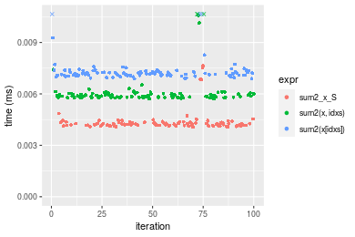
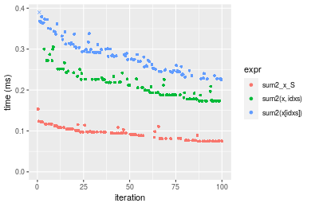
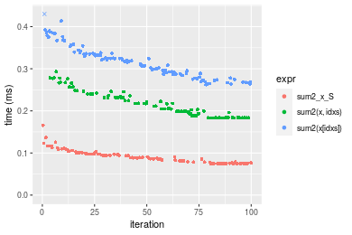

[matrixStats]: Benchmark report

---------------------------------------


# sum2() benchmarks on subsetted computation

This report benchmark the performance of sum2() on subsetted computation.


## Data type "integer"
### Data
```r
> rvector <- function(n, mode = c("logical", "double", "integer"), range = c(-100, +100), na_prob = 0) {
+     mode <- match.arg(mode)
+     if (mode == "logical") {
+         x <- sample(c(FALSE, TRUE), size = n, replace = TRUE)
+     }     else {
+         x <- runif(n, min = range[1], max = range[2])
+     }
+     storage.mode(x) <- mode
+     if (na_prob > 0) 
+         x[sample(n, size = na_prob * n)] <- NA
+     x
+ }
> rvectors <- function(scale = 10, seed = 1, ...) {
+     set.seed(seed)
+     data <- list()
+     data[[1]] <- rvector(n = scale * 100, ...)
+     data[[2]] <- rvector(n = scale * 1000, ...)
+     data[[3]] <- rvector(n = scale * 10000, ...)
+     data[[4]] <- rvector(n = scale * 1e+05, ...)
+     data[[5]] <- rvector(n = scale * 1e+06, ...)
+     names(data) <- sprintf("n = %d", sapply(data, FUN = length))
+     data
+ }
> data <- rvectors(mode = mode)
```

### Results

### n = 1000 vector


```r
> x <- data[["n = 1000"]]
> idxs <- sample.int(length(x), size = length(x) * 0.7)
> x_S <- x[idxs]
> gc()
           used  (Mb) gc trigger  (Mb) max used  (Mb)
Ncells  5351096 285.8    7916910 422.9  7916910 422.9
Vcells 17018782 129.9   35130986 268.1 94934136 724.3
> stats <- microbenchmark(sum2_x_S = sum2(x_S), `sum2(x, idxs)` = sum2(x, idxs = idxs), `sum2(x[idxs])` = sum2(x[idxs]), 
+     unit = "ms")
```


_Table: Benchmarking of sum2_x_S(), sum2(x, idxs)() and sum2(x[idxs])() on integer+n = 1000 data. The top panel shows times in milliseconds and the bottom panel shows relative times._


|   |expr          |      min|       lq|      mean|    median|        uq|      max|
|:--|:-------------|--------:|--------:|---------:|---------:|---------:|--------:|
|1  |sum2_x_S      | 0.004058| 0.004164| 0.0043724| 0.0042300| 0.0043345| 0.007633|
|2  |sum2(x, idxs) | 0.005715| 0.005797| 0.0062388| 0.0058745| 0.0060165| 0.015764|
|3  |sum2(x[idxs]) | 0.006886| 0.007081| 0.0093681| 0.0071920| 0.0072985| 0.212567|


|   |expr          |      min|       lq|     mean|   median|       uq|       max|
|:--|:-------------|--------:|--------:|--------:|--------:|--------:|---------:|
|1  |sum2_x_S      | 1.000000| 1.000000| 1.000000| 1.000000| 1.000000|  1.000000|
|2  |sum2(x, idxs) | 1.408329| 1.392171| 1.426875| 1.388771| 1.388049|  2.065243|
|3  |sum2(x[idxs]) | 1.696895| 1.700528| 2.142571| 1.700236| 1.683816| 27.848421|

_Figure: Benchmarking of sum2_x_S(), sum2(x, idxs)() and sum2(x[idxs])() on integer+n = 1000 data.  Outliers are displayed as crosses.  Times are in milliseconds._



### n = 10000 vector


```r
> x <- data[["n = 10000"]]
> idxs <- sample.int(length(x), size = length(x) * 0.7)
> x_S <- x[idxs]
> gc()
           used  (Mb) gc trigger  (Mb) max used  (Mb)
Ncells  5349070 285.7    7916910 422.9  7916910 422.9
Vcells 15889485 121.3   35130986 268.1 94934136 724.3
> stats <- microbenchmark(sum2_x_S = sum2(x_S), `sum2(x, idxs)` = sum2(x, idxs = idxs), `sum2(x[idxs])` = sum2(x[idxs]), 
+     unit = "ms")
```


_Table: Benchmarking of sum2_x_S(), sum2(x, idxs)() and sum2(x[idxs])() on integer+n = 10000 data. The top panel shows times in milliseconds and the bottom panel shows relative times._


|   |expr          |      min|        lq|      mean|   median|        uq|      max|
|:--|:-------------|--------:|---------:|---------:|--------:|---------:|--------:|
|1  |sum2_x_S      | 0.014937| 0.0150565| 0.0157990| 0.015211| 0.0155210| 0.036959|
|2  |sum2(x, idxs) | 0.029887| 0.0301085| 0.0312808| 0.030231| 0.0307245| 0.052853|
|3  |sum2(x[idxs]) | 0.037243| 0.0377700| 0.0395601| 0.038266| 0.0392410| 0.073865|


|   |expr          |      min|       lq|     mean|   median|       uq|      max|
|:--|:-------------|--------:|--------:|--------:|--------:|--------:|--------:|
|1  |sum2_x_S      | 1.000000| 1.000000| 1.000000| 1.000000| 1.000000| 1.000000|
|2  |sum2(x, idxs) | 2.000870| 1.999701| 1.979917| 1.987443| 1.979544| 1.430044|
|3  |sum2(x[idxs]) | 2.493339| 2.508551| 2.503953| 2.515679| 2.528252| 1.998566|

_Figure: Benchmarking of sum2_x_S(), sum2(x, idxs)() and sum2(x[idxs])() on integer+n = 10000 data.  Outliers are displayed as crosses.  Times are in milliseconds._


### n = 100000 vector


```r
> x <- data[["n = 100000"]]
> idxs <- sample.int(length(x), size = length(x) * 0.7)
> x_S <- x[idxs]
> gc()
           used  (Mb) gc trigger  (Mb) max used  (Mb)
Ncells  5349142 285.7    7916910 422.9  7916910 422.9
Vcells 15953045 121.8   35130986 268.1 94934136 724.3
> stats <- microbenchmark(sum2_x_S = sum2(x_S), `sum2(x, idxs)` = sum2(x, idxs = idxs), `sum2(x[idxs])` = sum2(x[idxs]), 
+     unit = "ms")
```


_Table: Benchmarking of sum2_x_S(), sum2(x, idxs)() and sum2(x[idxs])() on integer+n = 100000 data. The top panel shows times in milliseconds and the bottom panel shows relative times._


|   |expr          |      min|        lq|      mean|    median|        uq|      max|
|:--|:-------------|--------:|---------:|---------:|---------:|---------:|--------:|
|1  |sum2_x_S      | 0.074582| 0.0770210| 0.0935544| 0.0942520| 0.1041050| 0.153356|
|2  |sum2(x, idxs) | 0.173005| 0.1877705| 0.2107951| 0.2054650| 0.2262850| 0.305723|
|3  |sum2(x[idxs]) | 0.225503| 0.2491455| 0.2874428| 0.2861915| 0.3112985| 0.453296|


|   |expr          |      min|       lq|     mean|   median|       uq|      max|
|:--|:-------------|--------:|--------:|--------:|--------:|--------:|--------:|
|1  |sum2_x_S      | 1.000000| 1.000000| 1.000000| 1.000000| 1.000000| 1.000000|
|2  |sum2(x, idxs) | 2.319662| 2.437913| 2.253183| 2.179954| 2.173623| 1.993551|
|3  |sum2(x[idxs]) | 3.023558| 3.234774| 3.072468| 3.036450| 2.990236| 2.955841|

_Figure: Benchmarking of sum2_x_S(), sum2(x, idxs)() and sum2(x[idxs])() on integer+n = 100000 data.  Outliers are displayed as crosses.  Times are in milliseconds._



### n = 1000000 vector


```r
> x <- data[["n = 1000000"]]
> idxs <- sample.int(length(x), size = length(x) * 0.7)
> x_S <- x[idxs]
> gc()
           used  (Mb) gc trigger  (Mb) max used  (Mb)
Ncells  5349214 285.7    7916910 422.9  7916910 422.9
Vcells 16583094 126.6   35130986 268.1 94934136 724.3
> stats <- microbenchmark(sum2_x_S = sum2(x_S), `sum2(x, idxs)` = sum2(x, idxs = idxs), `sum2(x[idxs])` = sum2(x[idxs]), 
+     unit = "ms")
```


_Table: Benchmarking of sum2_x_S(), sum2(x, idxs)() and sum2(x[idxs])() on integer+n = 1000000 data. The top panel shows times in milliseconds and the bottom panel shows relative times._


|   |expr          |      min|       lq|      mean|    median|        uq|       max|
|:--|:-------------|--------:|--------:|---------:|---------:|---------:|---------:|
|1  |sum2_x_S      | 0.899186| 0.955913| 0.9781089| 0.9745195| 0.9910775|  1.247664|
|2  |sum2(x, idxs) | 2.484263| 2.729147| 2.9763069| 2.9132910| 3.0965315|  5.170635|
|3  |sum2(x[idxs]) | 3.485286| 4.653993| 5.0484895| 5.0643155| 5.2687700| 18.574634|


|   |expr          |      min|       lq|    mean|   median|       uq|       max|
|:--|:-------------|--------:|--------:|-------:|--------:|--------:|---------:|
|1  |sum2_x_S      | 1.000000| 1.000000| 1.00000| 1.000000| 1.000000|  1.000000|
|2  |sum2(x, idxs) | 2.762791| 2.855016| 3.04292| 2.989464| 3.124409|  4.144253|
|3  |sum2(x[idxs]) | 3.876046| 4.868637| 5.16148| 5.196731| 5.316204| 14.887529|

_Figure: Benchmarking of sum2_x_S(), sum2(x, idxs)() and sum2(x[idxs])() on integer+n = 1000000 data.  Outliers are displayed as crosses.  Times are in milliseconds._


### n = 10000000 vector


```r
> x <- data[["n = 10000000"]]
> idxs <- sample.int(length(x), size = length(x) * 0.7)
> x_S <- x[idxs]
> gc()
           used  (Mb) gc trigger  (Mb) max used  (Mb)
Ncells  5349286 285.7    7916910 422.9  7916910 422.9
Vcells 22883142 174.6   35130986 268.1 94934136 724.3
> stats <- microbenchmark(sum2_x_S = sum2(x_S), `sum2(x, idxs)` = sum2(x, idxs = idxs), `sum2(x[idxs])` = sum2(x[idxs]), 
+     unit = "ms")
```


_Table: Benchmarking of sum2_x_S(), sum2(x, idxs)() and sum2(x[idxs])() on integer+n = 10000000 data. The top panel shows times in milliseconds and the bottom panel shows relative times._


|   |expr          |       min|        lq|      mean|    median|        uq|       max|
|:--|:-------------|---------:|---------:|---------:|---------:|---------:|---------:|
|1  |sum2_x_S      |  10.12059|  12.52840|  14.53045|  13.35103|  15.23759|  21.53914|
|2  |sum2(x, idxs) |  84.54040|  99.31616| 112.45785| 113.54498| 123.88016| 146.49164|
|3  |sum2(x[idxs]) | 121.28929| 133.40567| 149.59686| 148.72843| 164.35145| 190.94653|


|   |expr          |      min|        lq|     mean|    median|        uq|      max|
|:--|:-------------|--------:|---------:|--------:|---------:|---------:|--------:|
|1  |sum2_x_S      |  1.00000|  1.000000|  1.00000|  1.000000|  1.000000| 1.000000|
|2  |sum2(x, idxs) |  8.35331|  7.927284|  7.73946|  8.504586|  8.129906| 6.801184|
|3  |sum2(x[idxs]) | 11.98441| 10.648263| 10.29540| 11.139848| 10.785922| 8.865096|

_Figure: Benchmarking of sum2_x_S(), sum2(x, idxs)() and sum2(x[idxs])() on integer+n = 10000000 data.  Outliers are displayed as crosses.  Times are in milliseconds._


## Data type "double"
### Data
```r
> rvector <- function(n, mode = c("logical", "double", "integer"), range = c(-100, +100), na_prob = 0) {
+     mode <- match.arg(mode)
+     if (mode == "logical") {
+         x <- sample(c(FALSE, TRUE), size = n, replace = TRUE)
+     }     else {
+         x <- runif(n, min = range[1], max = range[2])
+     }
+     storage.mode(x) <- mode
+     if (na_prob > 0) 
+         x[sample(n, size = na_prob * n)] <- NA
+     x
+ }
> rvectors <- function(scale = 10, seed = 1, ...) {
+     set.seed(seed)
+     data <- list()
+     data[[1]] <- rvector(n = scale * 100, ...)
+     data[[2]] <- rvector(n = scale * 1000, ...)
+     data[[3]] <- rvector(n = scale * 10000, ...)
+     data[[4]] <- rvector(n = scale * 1e+05, ...)
+     data[[5]] <- rvector(n = scale * 1e+06, ...)
+     names(data) <- sprintf("n = %d", sapply(data, FUN = length))
+     data
+ }
> data <- rvectors(mode = mode)
```

### Results

### n = 1000 vector


```r
> x <- data[["n = 1000"]]
> idxs <- sample.int(length(x), size = length(x) * 0.7)
> x_S <- x[idxs]
> gc()
           used  (Mb) gc trigger  (Mb) max used  (Mb)
Ncells  5349358 285.7    7916910 422.9  7916910 422.9
Vcells 21440297 163.6   42237183 322.3 94934136 724.3
> stats <- microbenchmark(sum2_x_S = sum2(x_S), `sum2(x, idxs)` = sum2(x, idxs = idxs), `sum2(x[idxs])` = sum2(x[idxs]), 
+     unit = "ms")
```


_Table: Benchmarking of sum2_x_S(), sum2(x, idxs)() and sum2(x[idxs])() on double+n = 1000 data. The top panel shows times in milliseconds and the bottom panel shows relative times._


|   |expr          |      min|        lq|      mean|    median|        uq|      max|
|:--|:-------------|--------:|---------:|---------:|---------:|---------:|--------:|
|1  |sum2_x_S      | 0.004073| 0.0041675| 0.0043044| 0.0042630| 0.0043295| 0.005104|
|2  |sum2(x, idxs) | 0.005691| 0.0058320| 0.0060248| 0.0059345| 0.0060655| 0.011282|
|3  |sum2(x[idxs]) | 0.006600| 0.0067975| 0.0072208| 0.0069115| 0.0070985| 0.030047|


|   |expr          |      min|       lq|     mean|   median|       uq|      max|
|:--|:-------------|--------:|--------:|--------:|--------:|--------:|--------:|
|1  |sum2_x_S      | 1.000000| 1.000000| 1.000000| 1.000000| 1.000000| 1.000000|
|2  |sum2(x, idxs) | 1.397250| 1.399400| 1.399687| 1.392095| 1.400970| 2.210423|
|3  |sum2(x[idxs]) | 1.620427| 1.631074| 1.677545| 1.621276| 1.639566| 5.886951|

_Figure: Benchmarking of sum2_x_S(), sum2(x, idxs)() and sum2(x[idxs])() on double+n = 1000 data.  Outliers are displayed as crosses.  Times are in milliseconds._


### n = 10000 vector


```r
> x <- data[["n = 10000"]]
> idxs <- sample.int(length(x), size = length(x) * 0.7)
> x_S <- x[idxs]
> gc()
           used  (Mb) gc trigger  (Mb) max used  (Mb)
Ncells  5349430 285.7    7916910 422.9  7916910 422.9
Vcells 21449794 163.7   42237183 322.3 94934136 724.3
> stats <- microbenchmark(sum2_x_S = sum2(x_S), `sum2(x, idxs)` = sum2(x, idxs = idxs), `sum2(x[idxs])` = sum2(x[idxs]), 
+     unit = "ms")
```


_Table: Benchmarking of sum2_x_S(), sum2(x, idxs)() and sum2(x[idxs])() on double+n = 10000 data. The top panel shows times in milliseconds and the bottom panel shows relative times._


|   |expr          |      min|        lq|      mean|    median|        uq|      max|
|:--|:-------------|--------:|---------:|---------:|---------:|---------:|--------:|
|1  |sum2_x_S      | 0.014450| 0.0151475| 0.0155525| 0.0153985| 0.0156285| 0.030081|
|2  |sum2(x, idxs) | 0.028984| 0.0294010| 0.0301643| 0.0304145| 0.0305615| 0.032902|
|3  |sum2(x[idxs]) | 0.033606| 0.0353325| 0.0364819| 0.0360850| 0.0366540| 0.074489|


|   |expr          |      min|       lq|     mean|  median|       uq|      max|
|:--|:-------------|--------:|--------:|--------:|-------:|--------:|--------:|
|1  |sum2_x_S      | 1.000000| 1.000000| 1.000000| 1.00000| 1.000000| 1.000000|
|2  |sum2(x, idxs) | 2.005813| 1.940980| 1.939518| 1.97516| 1.955498| 1.093780|
|3  |sum2(x[idxs]) | 2.325675| 2.332563| 2.345728| 2.34341| 2.345331| 2.476281|

_Figure: Benchmarking of sum2_x_S(), sum2(x, idxs)() and sum2(x[idxs])() on double+n = 10000 data.  Outliers are displayed as crosses.  Times are in milliseconds._


### n = 100000 vector


```r
> x <- data[["n = 100000"]]
> idxs <- sample.int(length(x), size = length(x) * 0.7)
> x_S <- x[idxs]
> gc()
           used  (Mb) gc trigger  (Mb) max used  (Mb)
Ncells  5349502 285.7    7916910 422.9  7916910 422.9
Vcells 21544662 164.4   42237183 322.3 94934136 724.3
> stats <- microbenchmark(sum2_x_S = sum2(x_S), `sum2(x, idxs)` = sum2(x, idxs = idxs), `sum2(x[idxs])` = sum2(x[idxs]), 
+     unit = "ms")
```


_Table: Benchmarking of sum2_x_S(), sum2(x, idxs)() and sum2(x[idxs])() on double+n = 100000 data. The top panel shows times in milliseconds and the bottom panel shows relative times._


|   |expr          |      min|        lq|      mean|    median|        uq|      max|
|:--|:-------------|--------:|---------:|---------:|---------:|---------:|--------:|
|1  |sum2_x_S      | 0.074623| 0.0772380| 0.0908662| 0.0887490| 0.0977030| 0.165804|
|2  |sum2(x, idxs) | 0.183186| 0.1884210| 0.2149429| 0.2049695| 0.2333605| 0.293395|
|3  |sum2(x[idxs]) | 0.262342| 0.2864695| 0.3175127| 0.3174385| 0.3360615| 0.568722|


|   |expr          |      min|       lq|     mean|   median|       uq|      max|
|:--|:-------------|--------:|--------:|--------:|--------:|--------:|--------:|
|1  |sum2_x_S      | 1.000000| 1.000000| 1.000000| 1.000000| 1.000000| 1.000000|
|2  |sum2(x, idxs) | 2.454820| 2.439486| 2.365488| 2.309541| 2.388468| 1.769529|
|3  |sum2(x[idxs]) | 3.515565| 3.708919| 3.494289| 3.576812| 3.439623| 3.430086|

_Figure: Benchmarking of sum2_x_S(), sum2(x, idxs)() and sum2(x[idxs])() on double+n = 100000 data.  Outliers are displayed as crosses.  Times are in milliseconds._



### n = 1000000 vector


```r
> x <- data[["n = 1000000"]]
> idxs <- sample.int(length(x), size = length(x) * 0.7)
> x_S <- x[idxs]
> gc()
           used  (Mb) gc trigger  (Mb) max used  (Mb)
Ncells  5349574 285.7    7916910 422.9  7916910 422.9
Vcells 22490092 171.6   42237183 322.3 94934136 724.3
> stats <- microbenchmark(sum2_x_S = sum2(x_S), `sum2(x, idxs)` = sum2(x, idxs = idxs), `sum2(x[idxs])` = sum2(x[idxs]), 
+     unit = "ms")
```


_Table: Benchmarking of sum2_x_S(), sum2(x, idxs)() and sum2(x[idxs])() on double+n = 1000000 data. The top panel shows times in milliseconds and the bottom panel shows relative times._


|   |expr          |      min|       lq|     mean|    median|        uq|       max|
|:--|:-------------|--------:|--------:|--------:|---------:|---------:|---------:|
|1  |sum2_x_S      | 1.237533| 1.342108| 1.439008|  1.437491|  1.507708|  1.864939|
|2  |sum2(x, idxs) | 5.983188| 6.391203| 6.724696|  6.551378|  6.876295|  9.803509|
|3  |sum2(x[idxs]) | 7.418274| 8.139433| 9.955356| 10.303071| 10.981101| 20.978886|


|   |expr          |      min|       lq|     mean|   median|       uq|       max|
|:--|:-------------|--------:|--------:|--------:|--------:|--------:|---------:|
|1  |sum2_x_S      | 1.000000| 1.000000| 1.000000| 1.000000| 1.000000|  1.000000|
|2  |sum2(x, idxs) | 4.834771| 4.762065| 4.673146| 4.557510| 4.560760|  5.256745|
|3  |sum2(x[idxs]) | 5.994405| 6.064666| 6.918207| 7.167402| 7.283308| 11.249100|

_Figure: Benchmarking of sum2_x_S(), sum2(x, idxs)() and sum2(x[idxs])() on double+n = 1000000 data.  Outliers are displayed as crosses.  Times are in milliseconds._


### n = 10000000 vector


```r
> x <- data[["n = 10000000"]]
> idxs <- sample.int(length(x), size = length(x) * 0.7)
> x_S <- x[idxs]
> gc()
           used  (Mb) gc trigger  (Mb) max used  (Mb)
Ncells  5349646 285.8    7916910 422.9  7916910 422.9
Vcells 31940140 243.7   50764619 387.4 94934136 724.3
> stats <- microbenchmark(sum2_x_S = sum2(x_S), `sum2(x, idxs)` = sum2(x, idxs = idxs), `sum2(x[idxs])` = sum2(x[idxs]), 
+     unit = "ms")
```


_Table: Benchmarking of sum2_x_S(), sum2(x, idxs)() and sum2(x[idxs])() on double+n = 10000000 data. The top panel shows times in milliseconds and the bottom panel shows relative times._


|   |expr          |       min|        lq|      mean|    median|        uq|       max|
|:--|:-------------|---------:|---------:|---------:|---------:|---------:|---------:|
|1  |sum2_x_S      |  10.43411|  13.53736|  16.58253|  14.54233|  20.96135|  26.28596|
|2  |sum2(x, idxs) | 103.56397| 145.32464| 161.57033| 164.40443| 180.04523| 221.33732|
|3  |sum2(x[idxs]) | 147.64456| 184.61754| 200.38570| 194.71552| 207.89210| 586.47072|


|   |expr          |      min|       lq|      mean|   median|       uq|       max|
|:--|:-------------|--------:|--------:|---------:|--------:|--------:|---------:|
|1  |sum2_x_S      |  1.00000|  1.00000|  1.000000|  1.00000| 1.000000|  1.000000|
|2  |sum2(x, idxs) |  9.92552| 10.73508|  9.743407| 11.30523| 8.589392|  8.420363|
|3  |sum2(x[idxs]) | 14.15018| 13.63763| 12.084146| 13.38957| 9.917879| 22.311177|

_Figure: Benchmarking of sum2_x_S(), sum2(x, idxs)() and sum2(x[idxs])() on double+n = 10000000 data.  Outliers are displayed as crosses.  Times are in milliseconds._


## Appendix

### Session information
```r
R version 4.1.1 Patched (2021-08-10 r80727)
Platform: x86_64-pc-linux-gnu (64-bit)
Running under: Ubuntu 18.04.5 LTS

Matrix products: default
BLAS:   /home/hb/software/R-devel/R-4-1-branch/lib/R/lib/libRblas.so
LAPACK: /home/hb/software/R-devel/R-4-1-branch/lib/R/lib/libRlapack.so

locale:
 [1] LC_CTYPE=en_US.UTF-8       LC_NUMERIC=C              
 [3] LC_TIME=en_US.UTF-8        LC_COLLATE=en_US.UTF-8    
 [5] LC_MONETARY=en_US.UTF-8    LC_MESSAGES=en_US.UTF-8   
 [7] LC_PAPER=en_US.UTF-8       LC_NAME=C                 
 [9] LC_ADDRESS=C               LC_TELEPHONE=C            
[11] LC_MEASUREMENT=en_US.UTF-8 LC_IDENTIFICATION=C       

attached base packages:
[1] stats     graphics  grDevices utils     datasets  methods   base     

other attached packages:
[1] microbenchmark_1.4-7   matrixStats_0.60.0     ggplot2_3.3.5         
[4] knitr_1.33             R.devices_2.17.0       R.utils_2.10.1        
[7] R.oo_1.24.0            R.methodsS3_1.8.1-9001 history_0.0.1-9000    

loaded via a namespace (and not attached):
 [1] Biobase_2.52.0          httr_1.4.2              splines_4.1.1          
 [4] bit64_4.0.5             network_1.17.1          assertthat_0.2.1       
 [7] highr_0.9               stats4_4.1.1            blob_1.2.2             
[10] GenomeInfoDbData_1.2.6  robustbase_0.93-8       pillar_1.6.2           
[13] RSQLite_2.2.8           lattice_0.20-44         glue_1.4.2             
[16] digest_0.6.27           XVector_0.32.0          colorspace_2.0-2       
[19] Matrix_1.3-4            XML_3.99-0.7            pkgconfig_2.0.3        
[22] zlibbioc_1.38.0         genefilter_1.74.0       purrr_0.3.4            
[25] ergm_4.1.2              xtable_1.8-4            scales_1.1.1           
[28] tibble_3.1.4            annotate_1.70.0         KEGGREST_1.32.0        
[31] farver_2.1.0            generics_0.1.0          IRanges_2.26.0         
[34] ellipsis_0.3.2          cachem_1.0.6            withr_2.4.2            
[37] BiocGenerics_0.38.0     mime_0.11               survival_3.2-13        
[40] magrittr_2.0.1          crayon_1.4.1            statnet.common_4.5.0   
[43] memoise_2.0.0           laeken_0.5.1            fansi_0.5.0            
[46] R.cache_0.15.0          MASS_7.3-54             R.rsp_0.44.0           
[49] progressr_0.8.0         tools_4.1.1             lifecycle_1.0.0        
[52] S4Vectors_0.30.0        trust_0.1-8             munsell_0.5.0          
[55] tabby_0.0.1-9001        AnnotationDbi_1.54.1    Biostrings_2.60.2      
[58] compiler_4.1.1          GenomeInfoDb_1.28.1     rlang_0.4.11           
[61] grid_4.1.1              RCurl_1.98-1.4          cwhmisc_6.6            
[64] rstudioapi_0.13         rappdirs_0.3.3          startup_0.15.0-9000    
[67] labeling_0.4.2          bitops_1.0-7            base64enc_0.1-3        
[70] boot_1.3-28             gtable_0.3.0            DBI_1.1.1              
[73] markdown_1.1            R6_2.5.1                lpSolveAPI_5.5.2.0-17.7
[76] rle_0.9.2               dplyr_1.0.7             fastmap_1.1.0          
[79] bit_4.0.4               utf8_1.2.2              parallel_4.1.1         
[82] Rcpp_1.0.7              vctrs_0.3.8             png_0.1-7              
[85] DEoptimR_1.0-9          tidyselect_1.1.1        xfun_0.25              
[88] coda_0.19-4            
```
Total processing time was 1.42 mins.


### Reproducibility
To reproduce this report, do:
```r
html <- matrixStats:::benchmark('sum2_subset')
```

[RSP]: https://cran.r-project.org/package=R.rsp
[matrixStats]: https://cran.r-project.org/package=matrixStats

[StackOverflow:colMins?]: https://stackoverflow.com/questions/13676878 "Stack Overflow: fastest way to get Min from every column in a matrix?"
[StackOverflow:colSds?]: https://stackoverflow.com/questions/17549762 "Stack Overflow: Is there such 'colsd' in R?"
[StackOverflow:rowProds?]: https://stackoverflow.com/questions/20198801/ "Stack Overflow: Row product of matrix and column sum of matrix"

---------------------------------------
Copyright Dongcan Jiang. Last updated on 2021-08-25 22:48:06 (+0200 UTC). Powered by [RSP].

<script>
 var link = document.createElement('link');
 link.rel = 'icon';
 link.href = "data:image/png;base64,iVBORw0KGgoAAAANSUhEUgAAACAAAAAgCAMAAABEpIrGAAAA21BMVEUAAAAAAP8AAP8AAP8AAP8AAP8AAP8AAP8AAP8AAP8AAP8AAP8AAP8AAP8AAP8AAP8AAP8AAP8AAP8AAP8AAP8AAP8AAP8AAP8AAP8AAP8AAP8AAP8AAP8AAP8AAP8AAP8AAP8AAP8AAP8AAP8AAP8AAP8AAP8AAP8AAP8AAP8BAf4CAv0DA/wdHeIeHuEfH+AgIN8hId4lJdomJtknJ9g+PsE/P8BAQL9yco10dIt1dYp3d4h4eIeVlWqWlmmXl2iYmGeZmWabm2Tn5xjo6Bfp6Rb39wj4+Af//wA2M9hbAAAASXRSTlMAAQIJCgsMJSYnKD4/QGRlZmhpamtsbautrrCxuru8y8zN5ebn6Pn6+///////////////////////////////////////////LsUNcQAAAS9JREFUOI29k21XgkAQhVcFytdSMqMETU26UVqGmpaiFbL//xc1cAhhwVNf6n5i5z67M2dmYOyfJZUqlVLhkKucG7cgmUZTybDz6g0iDeq51PUr37Ds2cy2/C9NeES5puDjxuUk1xnToZsg8pfA3avHQ3lLIi7iWRrkv/OYtkScxBIMgDee0ALoyxHQBJ68JLCjOtQIMIANF7QG9G9fNnHvisCHBVMKgSJgiz7nE+AoBKrAPA3MgepvgR9TSCasrCKH0eB1wBGBFdCO+nAGjMVGPcQb5bd6mQRegN6+1axOs9nGfYcCtfi4NQosdtH7dB+txFIpXQqN1p9B/asRHToyS0jRgpV7nk4nwcq1BJ+x3Gl/v7S9Wmpp/aGquum7w3ZDyrADFYrl8vHBH+ev9AUASW1dmU4h4wAAAABJRU5ErkJggg=="
 document.getElementsByTagName('head')[0].appendChild(link);
</script>


