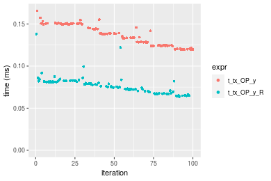
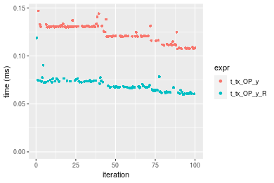
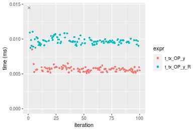
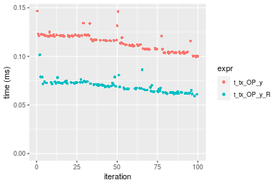

[matrixStats]: Benchmark report

---------------------------------------


# t_tx_OP_y() benchmarks

This report benchmark the performance of t_tx_OP_y() against alternative methods.

## Alternative methods

* t_tx_OP_y_R()

as below

```r
> t_tx_OP_y_R <- function(x, y, OP, na.rm = FALSE) {
+     x <- t(x)
+     if (na.rm) {
+         xnok <- is.na(x)
+         ynok <- is.na(y)
+         anok <- xnok & ynok
+         unit <- switch(OP, `+` = 0, `-` = NA_real_, `*` = 1, `/` = NA_real_, stop("Unknown 'OP' operator: ", 
+             OP))
+         x[xnok] <- unit
+         y[ynok] <- unit
+     }
+     ans <- switch(OP, `+` = x + y, `-` = x - y, `*` = x * y, `/` = x/y, stop("Unknown 'OP' operator: ", 
+         OP))
+     if (na.rm) {
+         ans[anok] <- NA_real_
+     }
+     t(ans)
+ }
```


## Data type "integer"
### Data
```r
> rmatrix <- function(nrow, ncol, mode = c("logical", "double", "integer", "index"), range = c(-100, 
+     +100), na_prob = 0) {
+     mode <- match.arg(mode)
+     n <- nrow * ncol
+     if (mode == "logical") {
+         x <- sample(c(FALSE, TRUE), size = n, replace = TRUE)
+     }     else if (mode == "index") {
+         x <- seq_len(n)
+         mode <- "integer"
+     }     else {
+         x <- runif(n, min = range[1], max = range[2])
+     }
+     storage.mode(x) <- mode
+     if (na_prob > 0) 
+         x[sample(n, size = na_prob * n)] <- NA
+     dim(x) <- c(nrow, ncol)
+     x
+ }
> rmatrices <- function(scale = 10, seed = 1, ...) {
+     set.seed(seed)
+     data <- list()
+     data[[1]] <- rmatrix(nrow = scale * 1, ncol = scale * 1, ...)
+     data[[2]] <- rmatrix(nrow = scale * 10, ncol = scale * 10, ...)
+     data[[3]] <- rmatrix(nrow = scale * 100, ncol = scale * 1, ...)
+     data[[4]] <- t(data[[3]])
+     data[[5]] <- rmatrix(nrow = scale * 10, ncol = scale * 100, ...)
+     data[[6]] <- t(data[[5]])
+     names(data) <- sapply(data, FUN = function(x) paste(dim(x), collapse = "x"))
+     data
+ }
> data <- rmatrices(mode = mode)
```

### Results

### 10x10 vector

#### All elements
```r
> x <- data[["10x10"]]
> y <- x[, 1L]
```

```r
> OP
[1] "+"
> stats <- microbenchmark(t_tx_OP_y = t_tx_OP_y(x, y, OP = OP, na.rm = FALSE), t_tx_OP_y_R = t_tx_OP_y_R(x, 
+     y, OP = OP, na.rm = FALSE), unit = "ms")
> gc()
           used  (Mb) gc trigger  (Mb) max used  (Mb)
Ncells  5359480 286.3    7916910 422.9  7916910 422.9
Vcells 10761999  82.2   39038428 297.9 94934136 724.3
```

_Table: Benchmarking of t_tx_OP_y() and t_tx_OP_y_R() on integer+10x10+add data. The top panel shows times in milliseconds and the bottom panel shows relative times._


|   |expr        |      min|        lq|      mean|    median|        uq|      max|
|:--|:-----------|--------:|---------:|---------:|---------:|---------:|--------:|
|1  |t_tx_OP_y   | 0.004792| 0.0051140| 0.0054643| 0.0052340| 0.0054775|  0.01856|
|2  |t_tx_OP_y_R | 0.007577| 0.0083995| 0.1354860| 0.0086735| 0.0089250| 12.63440|


|   |expr        |      min|       lq|     mean|   median|       uq|      max|
|:--|:-----------|--------:|--------:|--------:|--------:|--------:|--------:|
|1  |t_tx_OP_y   | 1.000000| 1.000000|  1.00000| 1.000000| 1.000000|   1.0000|
|2  |t_tx_OP_y_R | 1.581177| 1.642452| 24.79498| 1.657146| 1.629393| 680.7329|

_Figure: Benchmarking of t_tx_OP_y() and t_tx_OP_y_R() on integer+10x10+add data.  Outliers are displayed as crosses.  Times are in milliseconds._


```r
> OP
[1] "-"
> stats <- microbenchmark(t_tx_OP_y = t_tx_OP_y(x, y, OP = OP, na.rm = FALSE), t_tx_OP_y_R = t_tx_OP_y_R(x, 
+     y, OP = OP, na.rm = FALSE), unit = "ms")
> gc()
           used  (Mb) gc trigger  (Mb) max used  (Mb)
Ncells  5357091 286.1    7916910 422.9  7916910 422.9
Vcells 10453134  79.8   39038428 297.9 94934136 724.3
```

_Table: Benchmarking of t_tx_OP_y() and t_tx_OP_y_R() on integer+10x10+sub data. The top panel shows times in milliseconds and the bottom panel shows relative times._


|   |expr        |      min|        lq|      mean|    median|        uq|      max|
|:--|:-----------|--------:|---------:|---------:|---------:|---------:|--------:|
|1  |t_tx_OP_y   | 0.005238| 0.0056280| 0.0061111| 0.0059095| 0.0061535| 0.022069|
|2  |t_tx_OP_y_R | 0.008658| 0.0093775| 0.0100597| 0.0097130| 0.0099820| 0.043773|


|   |expr        |      min|       lq|     mean|   median|       uq|      max|
|:--|:-----------|--------:|--------:|--------:|--------:|--------:|--------:|
|1  |t_tx_OP_y   | 1.000000| 1.000000| 1.000000| 1.000000| 1.000000| 1.000000|
|2  |t_tx_OP_y_R | 1.652921| 1.666222| 1.646131| 1.643625| 1.622166| 1.983461|

_Figure: Benchmarking of t_tx_OP_y() and t_tx_OP_y_R() on integer+10x10+sub data.  Outliers are displayed as crosses.  Times are in milliseconds._


```r
> OP
[1] "*"
> stats <- microbenchmark(t_tx_OP_y = t_tx_OP_y(x, y, OP = OP, na.rm = FALSE), t_tx_OP_y_R = t_tx_OP_y_R(x, 
+     y, OP = OP, na.rm = FALSE), unit = "ms")
> gc()
           used  (Mb) gc trigger  (Mb) max used  (Mb)
Ncells  5357154 286.2    7916910 422.9  7916910 422.9
Vcells 10453688  79.8   39038428 297.9 94934136 724.3
```

_Table: Benchmarking of t_tx_OP_y() and t_tx_OP_y_R() on integer+10x10+mul data. The top panel shows times in milliseconds and the bottom panel shows relative times._


|   |expr        |      min|        lq|      mean|    median|       uq|      max|
|:--|:-----------|--------:|---------:|---------:|---------:|--------:|--------:|
|1  |t_tx_OP_y   | 0.005433| 0.0057350| 0.0062027| 0.0059305| 0.006092| 0.026583|
|2  |t_tx_OP_y_R | 0.008626| 0.0096415| 0.0102577| 0.0099605| 0.010307| 0.039747|


|   |expr        |      min|       lq|     mean|   median|       uq|      max|
|:--|:-----------|--------:|--------:|--------:|--------:|--------:|--------:|
|1  |t_tx_OP_y   | 1.000000| 1.000000| 1.000000| 1.000000| 1.000000| 1.000000|
|2  |t_tx_OP_y_R | 1.587705| 1.681168| 1.653738| 1.679538| 1.691891| 1.495204|

_Figure: Benchmarking of t_tx_OP_y() and t_tx_OP_y_R() on integer+10x10+mul data.  Outliers are displayed as crosses.  Times are in milliseconds._


```r
> OP
[1] "/"
> stats <- microbenchmark(t_tx_OP_y = t_tx_OP_y(x, y, OP = OP, na.rm = FALSE), t_tx_OP_y_R = t_tx_OP_y_R(x, 
+     y, OP = OP, na.rm = FALSE), unit = "ms")
> gc()
           used  (Mb) gc trigger  (Mb) max used  (Mb)
Ncells  5357217 286.2    7916910 422.9  7916910 422.9
Vcells 10453730  79.8   39038428 297.9 94934136 724.3
```

_Table: Benchmarking of t_tx_OP_y() and t_tx_OP_y_R() on integer+10x10+div data. The top panel shows times in milliseconds and the bottom panel shows relative times._


|   |expr        |      min|        lq|      mean|    median|        uq|      max|
|:--|:-----------|--------:|---------:|---------:|---------:|---------:|--------:|
|1  |t_tx_OP_y   | 0.005268| 0.0054985| 0.0059865| 0.0056980| 0.0058640| 0.023809|
|2  |t_tx_OP_y_R | 0.008787| 0.0091925| 0.0101256| 0.0094775| 0.0098445| 0.056867|


|   |expr        |      min|      lq|     mean|   median|       uq|      max|
|:--|:-----------|--------:|-------:|--------:|--------:|--------:|--------:|
|1  |t_tx_OP_y   | 1.000000| 1.00000| 1.000000| 1.000000| 1.000000| 1.000000|
|2  |t_tx_OP_y_R | 1.667995| 1.67182| 1.691408| 1.663303| 1.678803| 2.388466|

_Figure: Benchmarking of t_tx_OP_y() and t_tx_OP_y_R() on integer+10x10+div data.  Outliers are displayed as crosses.  Times are in milliseconds._


### 100x100 vector

#### All elements
```r
> x <- data[["100x100"]]
> y <- x[, 1L]
```

```r
> OP
[1] "+"
> stats <- microbenchmark(t_tx_OP_y = t_tx_OP_y(x, y, OP = OP, na.rm = FALSE), t_tx_OP_y_R = t_tx_OP_y_R(x, 
+     y, OP = OP, na.rm = FALSE), unit = "ms")
> gc()
           used  (Mb) gc trigger  (Mb) max used  (Mb)
Ncells  5357280 286.2    7916910 422.9  7916910 422.9
Vcells 10453814  79.8   39038428 297.9 94934136 724.3
```

_Table: Benchmarking of t_tx_OP_y() and t_tx_OP_y_R() on integer+100x100+add data. The top panel shows times in milliseconds and the bottom panel shows relative times._


|   |expr        |     min|       lq|      mean|    median|       uq|      max|
|:--|:-----------|-------:|--------:|---------:|---------:|--------:|--------:|
|2  |t_tx_OP_y_R | 0.06765| 0.074104| 0.0854342| 0.0795530| 0.083400| 0.167465|
|1  |t_tx_OP_y   | 0.12826| 0.139470| 0.1523180| 0.1506835| 0.153984| 0.276345|


|   |expr        |      min|       lq|    mean|   median|       uq|      max|
|:--|:-----------|--------:|--------:|-------:|--------:|--------:|--------:|
|2  |t_tx_OP_y_R | 1.000000| 1.000000| 1.00000| 1.000000| 1.000000| 1.000000|
|1  |t_tx_OP_y   | 1.895935| 1.882085| 1.78287| 1.894127| 1.846331| 1.650166|

_Figure: Benchmarking of t_tx_OP_y() and t_tx_OP_y_R() on integer+100x100+add data.  Outliers are displayed as crosses.  Times are in milliseconds._


```r
> OP
[1] "-"
> stats <- microbenchmark(t_tx_OP_y = t_tx_OP_y(x, y, OP = OP, na.rm = FALSE), t_tx_OP_y_R = t_tx_OP_y_R(x, 
+     y, OP = OP, na.rm = FALSE), unit = "ms")
> gc()
           used  (Mb) gc trigger  (Mb) max used  (Mb)
Ncells  5357343 286.2    7916910 422.9  7916910 422.9
Vcells 10454064  79.8   39038428 297.9 94934136 724.3
```

_Table: Benchmarking of t_tx_OP_y() and t_tx_OP_y_R() on integer+100x100+sub data. The top panel shows times in milliseconds and the bottom panel shows relative times._


|   |expr        |      min|       lq|      mean|   median|        uq|      max|
|:--|:-----------|--------:|--------:|---------:|--------:|---------:|--------:|
|2  |t_tx_OP_y_R | 0.063773| 0.071118| 0.0766773| 0.077736| 0.0795685| 0.132571|
|1  |t_tx_OP_y   | 0.124079| 0.139019| 0.1490000| 0.150793| 0.1544910| 0.205799|


|   |expr        |      min|       lq|     mean|   median|      uq|      max|
|:--|:-----------|--------:|--------:|--------:|--------:|-------:|--------:|
|2  |t_tx_OP_y_R | 1.000000| 1.000000| 1.000000| 1.000000| 1.00000| 1.000000|
|1  |t_tx_OP_y   | 1.945635| 1.954765| 1.943209| 1.939809| 1.94161| 1.552368|

_Figure: Benchmarking of t_tx_OP_y() and t_tx_OP_y_R() on integer+100x100+sub data.  Outliers are displayed as crosses.  Times are in milliseconds._


```r
> OP
[1] "*"
> stats <- microbenchmark(t_tx_OP_y = t_tx_OP_y(x, y, OP = OP, na.rm = FALSE), t_tx_OP_y_R = t_tx_OP_y_R(x, 
+     y, OP = OP, na.rm = FALSE), unit = "ms")
> gc()
           used  (Mb) gc trigger  (Mb) max used  (Mb)
Ncells  5357406 286.2    7916910 422.9  7916910 422.9
Vcells 10454360  79.8   39038428 297.9 94934136 724.3
```

_Table: Benchmarking of t_tx_OP_y() and t_tx_OP_y_R() on integer+100x100+mul data. The top panel shows times in milliseconds and the bottom panel shows relative times._


|   |expr        |      min|        lq|      mean|    median|        uq|      max|
|:--|:-----------|--------:|---------:|---------:|---------:|---------:|--------:|
|2  |t_tx_OP_y_R | 0.076390| 0.0802205| 0.0881573| 0.0865500| 0.0935110| 0.135884|
|1  |t_tx_OP_y   | 0.119564| 0.1269280| 0.1353920| 0.1361675| 0.1454525| 0.164303|


|   |expr        |      min|       lq|   mean|   median|       uq|      max|
|:--|:-----------|--------:|--------:|------:|--------:|--------:|--------:|
|2  |t_tx_OP_y_R | 1.000000| 1.000000| 1.0000| 1.000000| 1.000000| 1.000000|
|1  |t_tx_OP_y   | 1.565179| 1.582239| 1.5358| 1.573281| 1.555459| 1.209142|

_Figure: Benchmarking of t_tx_OP_y() and t_tx_OP_y_R() on integer+100x100+mul data.  Outliers are displayed as crosses.  Times are in milliseconds._


```r
> OP
[1] "/"
> stats <- microbenchmark(t_tx_OP_y = t_tx_OP_y(x, y, OP = OP, na.rm = FALSE), t_tx_OP_y_R = t_tx_OP_y_R(x, 
+     y, OP = OP, na.rm = FALSE), unit = "ms")
> gc()
           used  (Mb) gc trigger  (Mb) max used  (Mb)
Ncells  5357469 286.2    7916910 422.9  7916910 422.9
Vcells 10454402  79.8   39038428 297.9 94934136 724.3
```

_Table: Benchmarking of t_tx_OP_y() and t_tx_OP_y_R() on integer+100x100+div data. The top panel shows times in milliseconds and the bottom panel shows relative times._


|   |expr        |      min|        lq|      mean|    median|        uq|      max|
|:--|:-----------|--------:|---------:|---------:|---------:|---------:|--------:|
|2  |t_tx_OP_y_R | 0.061477| 0.0648335| 0.0695980| 0.0680330| 0.0735405| 0.116895|
|1  |t_tx_OP_y   | 0.108692| 0.1169385| 0.1243425| 0.1222795| 0.1314875| 0.147169|


|   |expr        |      min|       lq|     mean|   median|      uq|      max|
|:--|:-----------|--------:|--------:|--------:|--------:|-------:|--------:|
|2  |t_tx_OP_y_R | 1.000000| 1.000000| 1.000000| 1.000000| 1.00000| 1.000000|
|1  |t_tx_OP_y   | 1.768011| 1.803674| 1.786581| 1.797356| 1.78796| 1.258985|

_Figure: Benchmarking of t_tx_OP_y() and t_tx_OP_y_R() on integer+100x100+div data.  Outliers are displayed as crosses.  Times are in milliseconds._


### 1000x10 vector

#### All elements
```r
> x <- data[["1000x10"]]
> y <- x[, 1L]
```

```r
> OP
[1] "+"
> stats <- microbenchmark(t_tx_OP_y = t_tx_OP_y(x, y, OP = OP, na.rm = FALSE), t_tx_OP_y_R = t_tx_OP_y_R(x, 
+     y, OP = OP, na.rm = FALSE), unit = "ms")
> gc()
           used  (Mb) gc trigger  (Mb) max used  (Mb)
Ncells  5357532 286.2    7916910 422.9  7916910 422.9
Vcells 10455229  79.8   39038428 297.9 94934136 724.3
```

_Table: Benchmarking of t_tx_OP_y() and t_tx_OP_y_R() on integer+1000x10+add data. The top panel shows times in milliseconds and the bottom panel shows relative times._


|   |expr        |      min|        lq|      mean|    median|        uq|      max|
|:--|:-----------|--------:|---------:|---------:|---------:|---------:|--------:|
|2  |t_tx_OP_y_R | 0.061979| 0.0649495| 0.0723678| 0.0708370| 0.0769835| 0.137807|
|1  |t_tx_OP_y   | 0.119178| 0.1262600| 0.1368965| 0.1355065| 0.1491560| 0.167211|


|   |expr        |      min|       lq|     mean|   median|       uq|      max|
|:--|:-----------|--------:|--------:|--------:|--------:|--------:|--------:|
|2  |t_tx_OP_y_R | 1.000000| 1.000000| 1.000000| 1.000000| 1.000000| 1.000000|
|1  |t_tx_OP_y   | 1.922877| 1.943972| 1.891677| 1.912934| 1.937506| 1.213371|

_Figure: Benchmarking of t_tx_OP_y() and t_tx_OP_y_R() on integer+1000x10+add data.  Outliers are displayed as crosses.  Times are in milliseconds._


```r
> OP
[1] "-"
> stats <- microbenchmark(t_tx_OP_y = t_tx_OP_y(x, y, OP = OP, na.rm = FALSE), t_tx_OP_y_R = t_tx_OP_y_R(x, 
+     y, OP = OP, na.rm = FALSE), unit = "ms")
> gc()
           used  (Mb) gc trigger  (Mb) max used  (Mb)
Ncells  5357595 286.2    7916910 422.9  7916910 422.9
Vcells 10455637  79.8   39038428 297.9 94934136 724.3
```

_Table: Benchmarking of t_tx_OP_y() and t_tx_OP_y_R() on integer+1000x10+sub data. The top panel shows times in milliseconds and the bottom panel shows relative times._


|   |expr        |      min|       lq|      mean|    median|       uq|      max|
|:--|:-----------|--------:|--------:|---------:|---------:|--------:|--------:|
|2  |t_tx_OP_y_R | 0.063738| 0.069978| 0.0769204| 0.0759065| 0.081626| 0.138153|
|1  |t_tx_OP_y   | 0.119379| 0.124481| 0.1366055| 0.1379715| 0.149750| 0.165708|


|   |expr        |      min|       lq|     mean|   median|       uq|      max|
|:--|:-----------|--------:|--------:|--------:|--------:|--------:|--------:|
|2  |t_tx_OP_y_R | 1.000000| 1.000000| 1.000000| 1.000000| 1.000000| 1.000000|
|1  |t_tx_OP_y   | 1.872964| 1.778859| 1.775934| 1.817651| 1.834587| 1.199453|

_Figure: Benchmarking of t_tx_OP_y() and t_tx_OP_y_R() on integer+1000x10+sub data.  Outliers are displayed as crosses.  Times are in milliseconds._



```r
> OP
[1] "*"
> stats <- microbenchmark(t_tx_OP_y = t_tx_OP_y(x, y, OP = OP, na.rm = FALSE), t_tx_OP_y_R = t_tx_OP_y_R(x, 
+     y, OP = OP, na.rm = FALSE), unit = "ms")
> gc()
           used  (Mb) gc trigger  (Mb) max used  (Mb)
Ncells  5357658 286.2    7916910 422.9  7916910 422.9
Vcells 10455679  79.8   39038428 297.9 94934136 724.3
```

_Table: Benchmarking of t_tx_OP_y() and t_tx_OP_y_R() on integer+1000x10+mul data. The top panel shows times in milliseconds and the bottom panel shows relative times._


|   |expr        |      min|        lq|      mean|    median|       uq|      max|
|:--|:-----------|--------:|---------:|---------:|---------:|--------:|--------:|
|2  |t_tx_OP_y_R | 0.076391| 0.0823275| 0.0995711| 0.0960780| 0.100821| 0.164063|
|1  |t_tx_OP_y   | 0.118877| 0.1275075| 0.1473376| 0.1447075| 0.153880| 0.230046|


|   |expr        |      min|       lq|     mean|   median|       uq|      max|
|:--|:-----------|--------:|--------:|--------:|--------:|--------:|--------:|
|2  |t_tx_OP_y_R | 1.000000| 1.000000| 1.000000| 1.000000| 1.000000| 1.000000|
|1  |t_tx_OP_y   | 1.556165| 1.548784| 1.479723| 1.506146| 1.526269| 1.402181|

_Figure: Benchmarking of t_tx_OP_y() and t_tx_OP_y_R() on integer+1000x10+mul data.  Outliers are displayed as crosses.  Times are in milliseconds._


```r
> OP
[1] "/"
> stats <- microbenchmark(t_tx_OP_y = t_tx_OP_y(x, y, OP = OP, na.rm = FALSE), t_tx_OP_y_R = t_tx_OP_y_R(x, 
+     y, OP = OP, na.rm = FALSE), unit = "ms")
> gc()
           used  (Mb) gc trigger  (Mb) max used  (Mb)
Ncells  5357721 286.2    7916910 422.9  7916910 422.9
Vcells 10455721  79.8   39038428 297.9 94934136 724.3
```

_Table: Benchmarking of t_tx_OP_y() and t_tx_OP_y_R() on integer+1000x10+div data. The top panel shows times in milliseconds and the bottom panel shows relative times._


|   |expr        |      min|        lq|      mean|    median|        uq|      max|
|:--|:-----------|--------:|---------:|---------:|---------:|---------:|--------:|
|2  |t_tx_OP_y_R | 0.059949| 0.0641515| 0.0692316| 0.0676975| 0.0735645| 0.118778|
|1  |t_tx_OP_y   | 0.107295| 0.1198800| 0.1238901| 0.1249830| 0.1306315| 0.146916|


|   |expr        |      min|       lq|     mean|   median|       uq|      max|
|:--|:-----------|--------:|--------:|--------:|--------:|--------:|--------:|
|2  |t_tx_OP_y_R | 1.000000| 1.000000| 1.000000| 1.000000| 1.000000| 1.000000|
|1  |t_tx_OP_y   | 1.789771| 1.868701| 1.789503| 1.846198| 1.775741| 1.236896|

_Figure: Benchmarking of t_tx_OP_y() and t_tx_OP_y_R() on integer+1000x10+div data.  Outliers are displayed as crosses.  Times are in milliseconds._




### 10x1000 vector

#### All elements
```r
> x <- data[["10x1000"]]
> y <- x[, 1L]
```

```r
> OP
[1] "+"
> stats <- microbenchmark(t_tx_OP_y = t_tx_OP_y(x, y, OP = OP, na.rm = FALSE), t_tx_OP_y_R = t_tx_OP_y_R(x, 
+     y, OP = OP, na.rm = FALSE), unit = "ms")
> gc()
           used  (Mb) gc trigger  (Mb) max used  (Mb)
Ncells  5357784 286.2    7916910 422.9  7916910 422.9
Vcells 10455743  79.8   39038428 297.9 94934136 724.3
```

_Table: Benchmarking of t_tx_OP_y() and t_tx_OP_y_R() on integer+10x1000+add data. The top panel shows times in milliseconds and the bottom panel shows relative times._


|   |expr        |      min|        lq|      mean|   median|        uq|      max|
|:--|:-----------|--------:|---------:|---------:|--------:|---------:|--------:|
|2  |t_tx_OP_y_R | 0.061975| 0.0647750| 0.0712675| 0.069769| 0.0767525| 0.107036|
|1  |t_tx_OP_y   | 0.120295| 0.1253595| 0.1375982| 0.134508| 0.1506860| 0.211431|


|   |expr        |      min|       lq|     mean|   median|       uq|      max|
|:--|:-----------|--------:|--------:|--------:|--------:|--------:|--------:|
|2  |t_tx_OP_y_R | 1.000000| 1.000000| 1.000000| 1.000000| 1.000000| 1.000000|
|1  |t_tx_OP_y   | 1.941025| 1.935307| 1.930729| 1.927905| 1.963272| 1.975326|

_Figure: Benchmarking of t_tx_OP_y() and t_tx_OP_y_R() on integer+10x1000+add data.  Outliers are displayed as crosses.  Times are in milliseconds._


```r
> OP
[1] "-"
> stats <- microbenchmark(t_tx_OP_y = t_tx_OP_y(x, y, OP = OP, na.rm = FALSE), t_tx_OP_y_R = t_tx_OP_y_R(x, 
+     y, OP = OP, na.rm = FALSE), unit = "ms")
> gc()
           used  (Mb) gc trigger  (Mb) max used  (Mb)
Ncells  5357847 286.2    7916910 422.9  7916910 422.9
Vcells 10455785  79.8   39038428 297.9 94934136 724.3
```

_Table: Benchmarking of t_tx_OP_y() and t_tx_OP_y_R() on integer+10x1000+sub data. The top panel shows times in milliseconds and the bottom panel shows relative times._


|   |expr        |      min|        lq|      mean|    median|        uq|      max|
|:--|:-----------|--------:|---------:|---------:|---------:|---------:|--------:|
|2  |t_tx_OP_y_R | 0.072982| 0.0771935| 0.0821623| 0.0794455| 0.0848795| 0.131850|
|1  |t_tx_OP_y   | 0.124240| 0.1338980| 0.1440777| 0.1481265| 0.1509870| 0.182203|


|   |expr        |      min|       lq|     mean|   median|       uq|      max|
|:--|:-----------|--------:|--------:|--------:|--------:|--------:|--------:|
|2  |t_tx_OP_y_R | 1.000000| 1.000000| 1.000000| 1.000000| 1.000000| 1.000000|
|1  |t_tx_OP_y   | 1.702338| 1.734576| 1.753574| 1.864505| 1.778839| 1.381896|

_Figure: Benchmarking of t_tx_OP_y() and t_tx_OP_y_R() on integer+10x1000+sub data.  Outliers are displayed as crosses.  Times are in milliseconds._


```r
> OP
[1] "*"
> stats <- microbenchmark(t_tx_OP_y = t_tx_OP_y(x, y, OP = OP, na.rm = FALSE), t_tx_OP_y_R = t_tx_OP_y_R(x, 
+     y, OP = OP, na.rm = FALSE), unit = "ms")
> gc()
           used  (Mb) gc trigger  (Mb) max used  (Mb)
Ncells  5357910 286.2    7916910 422.9  7916910 422.9
Vcells 10456366  79.8   39038428 297.9 94934136 724.3
```

_Table: Benchmarking of t_tx_OP_y() and t_tx_OP_y_R() on integer+10x1000+mul data. The top panel shows times in milliseconds and the bottom panel shows relative times._


|   |expr        |      min|       lq|      mean|    median|       uq|      max|
|:--|:-----------|--------:|--------:|---------:|---------:|--------:|--------:|
|2  |t_tx_OP_y_R | 0.076394| 0.082199| 0.0891491| 0.0888070| 0.096378| 0.127886|
|1  |t_tx_OP_y   | 0.120029| 0.125068| 0.1373506| 0.1347325| 0.150713| 0.178859|


|   |expr        |      min|       lq|     mean|   median|      uq|      max|
|:--|:-----------|--------:|--------:|--------:|--------:|-------:|--------:|
|2  |t_tx_OP_y_R | 1.000000| 1.000000| 1.000000| 1.000000| 1.00000| 1.000000|
|1  |t_tx_OP_y   | 1.571184| 1.521527| 1.540684| 1.517138| 1.56377| 1.398581|

_Figure: Benchmarking of t_tx_OP_y() and t_tx_OP_y_R() on integer+10x1000+mul data.  Outliers are displayed as crosses.  Times are in milliseconds._


```r
> OP
[1] "/"
> stats <- microbenchmark(t_tx_OP_y = t_tx_OP_y(x, y, OP = OP, na.rm = FALSE), t_tx_OP_y_R = t_tx_OP_y_R(x, 
+     y, OP = OP, na.rm = FALSE), unit = "ms")
> gc()
           used  (Mb) gc trigger  (Mb) max used  (Mb)
Ncells  5357973 286.2    7916910 422.9  7916910 422.9
Vcells 10456408  79.8   39038428 297.9 94934136 724.3
```

_Table: Benchmarking of t_tx_OP_y() and t_tx_OP_y_R() on integer+10x1000+div data. The top panel shows times in milliseconds and the bottom panel shows relative times._


|   |expr        |      min|        lq|      mean|    median|        uq|     max|
|:--|:-----------|--------:|---------:|---------:|---------:|---------:|-------:|
|2  |t_tx_OP_y_R | 0.063549| 0.0700900| 0.0772890| 0.0731640| 0.0757885| 0.13497|
|1  |t_tx_OP_y   | 0.114001| 0.1267145| 0.1355822| 0.1326015| 0.1368990| 0.22090|


|   |expr        |      min|       lq|     mean|   median|       uq|     max|
|:--|:-----------|--------:|--------:|--------:|--------:|--------:|-------:|
|2  |t_tx_OP_y_R | 1.000000| 1.000000| 1.000000| 1.000000| 1.000000| 1.00000|
|1  |t_tx_OP_y   | 1.793907| 1.807883| 1.754225| 1.812387| 1.806329| 1.63666|

_Figure: Benchmarking of t_tx_OP_y() and t_tx_OP_y_R() on integer+10x1000+div data.  Outliers are displayed as crosses.  Times are in milliseconds._


### 100x1000 vector

#### All elements
```r
> x <- data[["100x1000"]]
> y <- x[, 1L]
```

```r
> OP
[1] "+"
> stats <- microbenchmark(t_tx_OP_y = t_tx_OP_y(x, y, OP = OP, na.rm = FALSE), t_tx_OP_y_R = t_tx_OP_y_R(x, 
+     y, OP = OP, na.rm = FALSE), unit = "ms")
> gc()
           used  (Mb) gc trigger  (Mb) max used  (Mb)
Ncells  5358036 286.2    7916910 422.9  7916910 422.9
Vcells 10456492  79.8   39038428 297.9 94934136 724.3
```

_Table: Benchmarking of t_tx_OP_y() and t_tx_OP_y_R() on integer+100x1000+add data. The top panel shows times in milliseconds and the bottom panel shows relative times._


|   |expr        |      min|        lq|      mean|    median|       uq|      max|
|:--|:-----------|--------:|---------:|---------:|---------:|--------:|--------:|
|2  |t_tx_OP_y_R | 0.443026| 0.5529485| 0.7070996| 0.7927105| 0.802601| 1.467060|
|1  |t_tx_OP_y   | 0.895442| 1.0111895| 1.0821621| 1.0394900| 1.133057| 1.492148|


|   |expr        |      min|       lq|     mean|   median|       uq|      max|
|:--|:-----------|--------:|--------:|--------:|--------:|--------:|--------:|
|2  |t_tx_OP_y_R | 1.000000| 1.000000| 1.000000| 1.000000| 1.000000| 1.000000|
|1  |t_tx_OP_y   | 2.021195| 1.828723| 1.530424| 1.311311| 1.411731| 1.017101|

_Figure: Benchmarking of t_tx_OP_y() and t_tx_OP_y_R() on integer+100x1000+add data.  Outliers are displayed as crosses.  Times are in milliseconds._


```r
> OP
[1] "-"
> stats <- microbenchmark(t_tx_OP_y = t_tx_OP_y(x, y, OP = OP, na.rm = FALSE), t_tx_OP_y_R = t_tx_OP_y_R(x, 
+     y, OP = OP, na.rm = FALSE), unit = "ms")
> gc()
           used  (Mb) gc trigger  (Mb) max used  (Mb)
Ncells  5358099 286.2    7916910 422.9  7916910 422.9
Vcells 10457177  79.8   39038428 297.9 94934136 724.3
```

_Table: Benchmarking of t_tx_OP_y() and t_tx_OP_y_R() on integer+100x1000+sub data. The top panel shows times in milliseconds and the bottom panel shows relative times._


|   |expr        |      min|        lq|      mean|   median|       uq|      max|
|:--|:-----------|--------:|---------:|---------:|--------:|--------:|--------:|
|2  |t_tx_OP_y_R | 0.437097| 0.4859820| 0.6621817| 0.744716| 0.794876| 0.983471|
|1  |t_tx_OP_y   | 0.895992| 0.9679345| 1.0380734| 1.015048| 1.057953| 1.490787|


|   |expr        |     min|       lq|     mean|   median|       uq|      max|
|:--|:-----------|-------:|--------:|--------:|--------:|--------:|--------:|
|2  |t_tx_OP_y_R | 1.00000| 1.000000| 1.000000| 1.000000| 1.000000| 1.000000|
|1  |t_tx_OP_y   | 2.04987| 1.991709| 1.567656| 1.362999| 1.330966| 1.515842|

_Figure: Benchmarking of t_tx_OP_y() and t_tx_OP_y_R() on integer+100x1000+sub data.  Outliers are displayed as crosses.  Times are in milliseconds._


```r
> OP
[1] "*"
> stats <- microbenchmark(t_tx_OP_y = t_tx_OP_y(x, y, OP = OP, na.rm = FALSE), t_tx_OP_y_R = t_tx_OP_y_R(x, 
+     y, OP = OP, na.rm = FALSE), unit = "ms")
> gc()
           used  (Mb) gc trigger  (Mb) max used  (Mb)
Ncells  5358162 286.2    7916910 422.9  7916910 422.9
Vcells 10457219  79.8   39038428 297.9 94934136 724.3
```

_Table: Benchmarking of t_tx_OP_y() and t_tx_OP_y_R() on integer+100x1000+mul data. The top panel shows times in milliseconds and the bottom panel shows relative times._


|   |expr        |      min|        lq|      mean|   median|       uq|      max|
|:--|:-----------|--------:|---------:|---------:|--------:|--------:|--------:|
|2  |t_tx_OP_y_R | 0.545843| 0.5728210| 0.7725055| 0.862313| 0.910431| 1.019358|
|1  |t_tx_OP_y   | 0.895545| 0.9563165| 1.0121836| 1.013592| 1.025589| 1.389407|


|   |expr        |      min|       lq|     mean|   median|       uq|      max|
|:--|:-----------|--------:|--------:|--------:|--------:|--------:|--------:|
|2  |t_tx_OP_y_R | 1.000000| 1.000000| 1.000000| 1.000000| 1.000000| 1.000000|
|1  |t_tx_OP_y   | 1.640664| 1.669486| 1.310261| 1.175434| 1.126488| 1.363022|

_Figure: Benchmarking of t_tx_OP_y() and t_tx_OP_y_R() on integer+100x1000+mul data.  Outliers are displayed as crosses.  Times are in milliseconds._


```r
> OP
[1] "/"
> stats <- microbenchmark(t_tx_OP_y = t_tx_OP_y(x, y, OP = OP, na.rm = FALSE), t_tx_OP_y_R = t_tx_OP_y_R(x, 
+     y, OP = OP, na.rm = FALSE), unit = "ms")
> gc()
           used  (Mb) gc trigger  (Mb) max used  (Mb)
Ncells  5358225 286.2    7916910 422.9  7916910 422.9
Vcells 10457261  79.8   39038428 297.9 94934136 724.3
```

_Table: Benchmarking of t_tx_OP_y() and t_tx_OP_y_R() on integer+100x1000+div data. The top panel shows times in milliseconds and the bottom panel shows relative times._


|   |expr        |      min|        lq|     mean|   median|       uq|       max|
|:--|:-----------|--------:|---------:|--------:|--------:|--------:|---------:|
|2  |t_tx_OP_y_R | 0.483148| 0.6532375| 4.822539| 0.866531| 0.982403| 401.82914|
|1  |t_tx_OP_y   | 0.955124| 1.0097195| 1.094749| 1.041548| 1.144797|   1.60297|


|   |expr        |      min|       lq|      mean|   median|       uq|       max|
|:--|:-----------|--------:|--------:|---------:|--------:|--------:|---------:|
|2  |t_tx_OP_y_R | 1.000000| 1.000000| 1.0000000| 1.000000| 1.000000| 1.0000000|
|1  |t_tx_OP_y   | 1.976877| 1.545716| 0.2270068| 1.201974| 1.165303| 0.0039892|

_Figure: Benchmarking of t_tx_OP_y() and t_tx_OP_y_R() on integer+100x1000+div data.  Outliers are displayed as crosses.  Times are in milliseconds._


### 1000x100 vector

#### All elements
```r
> x <- data[["1000x100"]]
> y <- x[, 1L]
```

```r
> OP
[1] "+"
> stats <- microbenchmark(t_tx_OP_y = t_tx_OP_y(x, y, OP = OP, na.rm = FALSE), t_tx_OP_y_R = t_tx_OP_y_R(x, 
+     y, OP = OP, na.rm = FALSE), unit = "ms")
> gc()
           used  (Mb) gc trigger  (Mb) max used  (Mb)
Ncells  5358288 286.2    7916910 422.9  7916910 422.9
Vcells 10457753  79.8   39038428 297.9 94934136 724.3
```

_Table: Benchmarking of t_tx_OP_y() and t_tx_OP_y_R() on integer+1000x100+add data. The top panel shows times in milliseconds and the bottom panel shows relative times._


|   |expr        |      min|        lq|      mean|   median|        uq|      max|
|:--|:-----------|--------:|---------:|---------:|--------:|---------:|--------:|
|2  |t_tx_OP_y_R | 0.436198| 0.4904155| 0.6640799| 0.704767| 0.8130565| 0.903118|
|1  |t_tx_OP_y   | 0.889954| 0.9941670| 1.0387363| 1.010934| 1.0500310| 1.481849|


|   |expr        |      min|       lq|     mean|   median|       uq|      max|
|:--|:-----------|--------:|--------:|--------:|--------:|--------:|--------:|
|2  |t_tx_OP_y_R | 1.000000| 1.000000| 1.000000| 1.000000| 1.000000| 1.000000|
|1  |t_tx_OP_y   | 2.040252| 2.027193| 1.564174| 1.434423| 1.291461| 1.640814|

_Figure: Benchmarking of t_tx_OP_y() and t_tx_OP_y_R() on integer+1000x100+add data.  Outliers are displayed as crosses.  Times are in milliseconds._


```r
> OP
[1] "-"
> stats <- microbenchmark(t_tx_OP_y = t_tx_OP_y(x, y, OP = OP, na.rm = FALSE), t_tx_OP_y_R = t_tx_OP_y_R(x, 
+     y, OP = OP, na.rm = FALSE), unit = "ms")
> gc()
           used  (Mb) gc trigger  (Mb) max used  (Mb)
Ncells  5358351 286.2    7916910 422.9  7916910 422.9
Vcells 10458574  79.8   39038428 297.9 94934136 724.3
```

_Table: Benchmarking of t_tx_OP_y() and t_tx_OP_y_R() on integer+1000x100+sub data. The top panel shows times in milliseconds and the bottom panel shows relative times._


|   |expr        |      min|        lq|      mean|    median|        uq|      max|
|:--|:-----------|--------:|---------:|---------:|---------:|---------:|--------:|
|2  |t_tx_OP_y_R | 0.465795| 0.5016255| 0.6928661| 0.7519325| 0.8368415| 0.967820|
|1  |t_tx_OP_y   | 0.892380| 0.9707000| 1.0395785| 1.0130905| 1.0733240| 1.478113|


|   |expr        |      min|       lq|     mean|   median|       uq|     max|
|:--|:-----------|--------:|--------:|--------:|--------:|--------:|-------:|
|2  |t_tx_OP_y_R | 1.000000| 1.000000| 1.000000| 1.000000| 1.000000| 1.00000|
|1  |t_tx_OP_y   | 1.915821| 1.935109| 1.500403| 1.347316| 1.282589| 1.52726|

_Figure: Benchmarking of t_tx_OP_y() and t_tx_OP_y_R() on integer+1000x100+sub data.  Outliers are displayed as crosses.  Times are in milliseconds._


```r
> OP
[1] "*"
> stats <- microbenchmark(t_tx_OP_y = t_tx_OP_y(x, y, OP = OP, na.rm = FALSE), t_tx_OP_y_R = t_tx_OP_y_R(x, 
+     y, OP = OP, na.rm = FALSE), unit = "ms")
> gc()
           used  (Mb) gc trigger  (Mb) max used  (Mb)
Ncells  5358414 286.2    7916910 422.9  7916910 422.9
Vcells 10458616  79.8   39038428 297.9 94934136 724.3
```

_Table: Benchmarking of t_tx_OP_y() and t_tx_OP_y_R() on integer+1000x100+mul data. The top panel shows times in milliseconds and the bottom panel shows relative times._


|   |expr        |      min|        lq|      mean|   median|        uq|      max|
|:--|:-----------|--------:|---------:|---------:|--------:|---------:|--------:|
|2  |t_tx_OP_y_R | 0.542607| 0.6073425| 0.7908243| 0.903643| 0.9144905| 1.250930|
|1  |t_tx_OP_y   | 0.874097| 0.9193765| 1.0101588| 1.005931| 1.0205115| 1.780452|


|   |expr        |      min|       lq|     mean|   median|       uq|      max|
|:--|:-----------|--------:|--------:|--------:|--------:|--------:|--------:|
|2  |t_tx_OP_y_R | 1.000000| 1.000000| 1.000000| 1.000000| 1.000000| 1.000000|
|1  |t_tx_OP_y   | 1.610921| 1.513769| 1.277349| 1.113195| 1.115935| 1.423303|

_Figure: Benchmarking of t_tx_OP_y() and t_tx_OP_y_R() on integer+1000x100+mul data.  Outliers are displayed as crosses.  Times are in milliseconds._


```r
> OP
[1] "/"
> stats <- microbenchmark(t_tx_OP_y = t_tx_OP_y(x, y, OP = OP, na.rm = FALSE), t_tx_OP_y_R = t_tx_OP_y_R(x, 
+     y, OP = OP, na.rm = FALSE), unit = "ms")
> gc()
           used  (Mb) gc trigger  (Mb) max used  (Mb)
Ncells  5358477 286.2    7916910 422.9  7916910 422.9
Vcells 10458658  79.8   39038428 297.9 94934136 724.3
```

_Table: Benchmarking of t_tx_OP_y() and t_tx_OP_y_R() on integer+1000x100+div data. The top panel shows times in milliseconds and the bottom panel shows relative times._


|   |expr        |      min|        lq|     mean|   median|        uq|      max|
|:--|:-----------|--------:|---------:|--------:|--------:|---------:|--------:|
|2  |t_tx_OP_y_R | 0.455946| 0.5099905| 0.835676| 0.895682| 0.9866875| 7.273645|
|1  |t_tx_OP_y   | 0.859561| 0.9779945| 1.022629| 1.007275| 1.0417695| 1.377401|


|   |expr        |      min|       lq|     mean|   median|       uq|       max|
|:--|:-----------|--------:|--------:|--------:|--------:|--------:|---------:|
|2  |t_tx_OP_y_R | 1.000000| 1.000000| 1.000000| 1.000000| 1.000000| 1.0000000|
|1  |t_tx_OP_y   | 1.885225| 1.917672| 1.223714| 1.124591| 1.055825| 0.1893687|

_Figure: Benchmarking of t_tx_OP_y() and t_tx_OP_y_R() on integer+1000x100+div data.  Outliers are displayed as crosses.  Times are in milliseconds._


## Data type "double"
### Data
```r
> rmatrix <- function(nrow, ncol, mode = c("logical", "double", "integer", "index"), range = c(-100, 
+     +100), na_prob = 0) {
+     mode <- match.arg(mode)
+     n <- nrow * ncol
+     if (mode == "logical") {
+         x <- sample(c(FALSE, TRUE), size = n, replace = TRUE)
+     }     else if (mode == "index") {
+         x <- seq_len(n)
+         mode <- "integer"
+     }     else {
+         x <- runif(n, min = range[1], max = range[2])
+     }
+     storage.mode(x) <- mode
+     if (na_prob > 0) 
+         x[sample(n, size = na_prob * n)] <- NA
+     dim(x) <- c(nrow, ncol)
+     x
+ }
> rmatrices <- function(scale = 10, seed = 1, ...) {
+     set.seed(seed)
+     data <- list()
+     data[[1]] <- rmatrix(nrow = scale * 1, ncol = scale * 1, ...)
+     data[[2]] <- rmatrix(nrow = scale * 10, ncol = scale * 10, ...)
+     data[[3]] <- rmatrix(nrow = scale * 100, ncol = scale * 1, ...)
+     data[[4]] <- t(data[[3]])
+     data[[5]] <- rmatrix(nrow = scale * 10, ncol = scale * 100, ...)
+     data[[6]] <- t(data[[5]])
+     names(data) <- sapply(data, FUN = function(x) paste(dim(x), collapse = "x"))
+     data
+ }
> data <- rmatrices(mode = mode)
```

### Results

### 10x10 vector

#### All elements
```r
> x <- data[["10x10"]]
> y <- x[, 1L]
```

```r
> OP
[1] "+"
> stats <- microbenchmark(t_tx_OP_y = t_tx_OP_y(x, y, OP = OP, na.rm = FALSE), t_tx_OP_y_R = t_tx_OP_y_R(x, 
+     y, OP = OP, na.rm = FALSE), unit = "ms")
> gc()
           used  (Mb) gc trigger  (Mb) max used  (Mb)
Ncells  5358540 286.2    7916910 422.9  7916910 422.9
Vcells 10573266  80.7   39038428 297.9 94934136 724.3
```

_Table: Benchmarking of t_tx_OP_y() and t_tx_OP_y_R() on double+10x10+add data. The top panel shows times in milliseconds and the bottom panel shows relative times._


|   |expr        |      min|        lq|      mean|    median|        uq|      max|
|:--|:-----------|--------:|---------:|---------:|---------:|---------:|--------:|
|1  |t_tx_OP_y   | 0.005035| 0.0053740| 0.0057734| 0.0055370| 0.0057795| 0.021347|
|2  |t_tx_OP_y_R | 0.008818| 0.0092995| 0.0100136| 0.0095395| 0.0098020| 0.047716|


|   |expr        |      min|       lq|     mean|   median|       uq|      max|
|:--|:-----------|--------:|--------:|--------:|--------:|--------:|--------:|
|1  |t_tx_OP_y   | 1.000000| 1.000000| 1.000000| 1.000000| 1.000000| 1.000000|
|2  |t_tx_OP_y_R | 1.751341| 1.730462| 1.734433| 1.722864| 1.695995| 2.235256|

_Figure: Benchmarking of t_tx_OP_y() and t_tx_OP_y_R() on double+10x10+add data.  Outliers are displayed as crosses.  Times are in milliseconds._


```r
> OP
[1] "-"
> stats <- microbenchmark(t_tx_OP_y = t_tx_OP_y(x, y, OP = OP, na.rm = FALSE), t_tx_OP_y_R = t_tx_OP_y_R(x, 
+     y, OP = OP, na.rm = FALSE), unit = "ms")
> gc()
           used  (Mb) gc trigger  (Mb) max used  (Mb)
Ncells  5358603 286.2    7916910 422.9  7916910 422.9
Vcells 10574268  80.7   39038428 297.9 94934136 724.3
```

_Table: Benchmarking of t_tx_OP_y() and t_tx_OP_y_R() on double+10x10+sub data. The top panel shows times in milliseconds and the bottom panel shows relative times._


|   |expr        |      min|       lq|      mean|    median|        uq|      max|
|:--|:-----------|--------:|--------:|---------:|---------:|---------:|--------:|
|1  |t_tx_OP_y   | 0.004835| 0.005356| 0.0057907| 0.0055375| 0.0058005| 0.024568|
|2  |t_tx_OP_y_R | 0.008984| 0.009386| 0.0100435| 0.0096180| 0.0099385| 0.045135|


|   |expr        |      min|       lq|     mean|   median|       uq|      max|
|:--|:-----------|--------:|--------:|--------:|--------:|--------:|--------:|
|1  |t_tx_OP_y   | 1.000000| 1.000000| 1.000000| 1.000000| 1.000000| 1.000000|
|2  |t_tx_OP_y_R | 1.858118| 1.752427| 1.734414| 1.736885| 1.713387| 1.837146|

_Figure: Benchmarking of t_tx_OP_y() and t_tx_OP_y_R() on double+10x10+sub data.  Outliers are displayed as crosses.  Times are in milliseconds._


```r
> OP
[1] "*"
> stats <- microbenchmark(t_tx_OP_y = t_tx_OP_y(x, y, OP = OP, na.rm = FALSE), t_tx_OP_y_R = t_tx_OP_y_R(x, 
+     y, OP = OP, na.rm = FALSE), unit = "ms")
> gc()
           used  (Mb) gc trigger  (Mb) max used  (Mb)
Ncells  5358666 286.2    7916910 422.9  7916910 422.9
Vcells 10574310  80.7   39038428 297.9 94934136 724.3
```

_Table: Benchmarking of t_tx_OP_y() and t_tx_OP_y_R() on double+10x10+mul data. The top panel shows times in milliseconds and the bottom panel shows relative times._


|   |expr        |      min|       lq|      mean|    median|       uq|      max|
|:--|:-----------|--------:|--------:|---------:|---------:|--------:|--------:|
|1  |t_tx_OP_y   | 0.005113| 0.005387| 0.0059391| 0.0056490| 0.005853| 0.031680|
|2  |t_tx_OP_y_R | 0.008733| 0.009420| 0.0100366| 0.0096425| 0.009924| 0.042358|


|   |expr        |      min|       lq|     mean|   median|       uq|      max|
|:--|:-----------|--------:|--------:|--------:|--------:|--------:|--------:|
|1  |t_tx_OP_y   | 1.000000| 1.000000| 1.000000| 1.000000| 1.000000| 1.000000|
|2  |t_tx_OP_y_R | 1.707999| 1.748654| 1.689915| 1.706939| 1.695541| 1.337058|

_Figure: Benchmarking of t_tx_OP_y() and t_tx_OP_y_R() on double+10x10+mul data.  Outliers are displayed as crosses.  Times are in milliseconds._



```r
> OP
[1] "/"
> stats <- microbenchmark(t_tx_OP_y = t_tx_OP_y(x, y, OP = OP, na.rm = FALSE), t_tx_OP_y_R = t_tx_OP_y_R(x, 
+     y, OP = OP, na.rm = FALSE), unit = "ms")
> gc()
           used  (Mb) gc trigger  (Mb) max used  (Mb)
Ncells  5358729 286.2    7916910 422.9  7916910 422.9
Vcells 10574352  80.7   39038428 297.9 94934136 724.3
```

_Table: Benchmarking of t_tx_OP_y() and t_tx_OP_y_R() on double+10x10+div data. The top panel shows times in milliseconds and the bottom panel shows relative times._


|   |expr        |      min|        lq|      mean|    median|        uq|      max|
|:--|:-----------|--------:|---------:|---------:|---------:|---------:|--------:|
|1  |t_tx_OP_y   | 0.005270| 0.0055515| 0.0059585| 0.0057480| 0.0059570| 0.023098|
|2  |t_tx_OP_y_R | 0.009214| 0.0098395| 0.0105604| 0.0101205| 0.0104115| 0.046769|


|   |expr        |      min|       lq|     mean|   median|       uq|      max|
|:--|:-----------|--------:|--------:|--------:|--------:|--------:|--------:|
|1  |t_tx_OP_y   | 1.000000| 1.000000| 1.000000| 1.000000| 1.000000| 1.000000|
|2  |t_tx_OP_y_R | 1.748387| 1.772404| 1.772329| 1.760699| 1.747776| 2.024807|

_Figure: Benchmarking of t_tx_OP_y() and t_tx_OP_y_R() on double+10x10+div data.  Outliers are displayed as crosses.  Times are in milliseconds._


### 100x100 vector

#### All elements
```r
> x <- data[["100x100"]]
> y <- x[, 1L]
```

```r
> OP
[1] "+"
> stats <- microbenchmark(t_tx_OP_y = t_tx_OP_y(x, y, OP = OP, na.rm = FALSE), t_tx_OP_y_R = t_tx_OP_y_R(x, 
+     y, OP = OP, na.rm = FALSE), unit = "ms")
> gc()
           used  (Mb) gc trigger  (Mb) max used  (Mb)
Ncells  5358792 286.2    7916910 422.9  7916910 422.9
Vcells 10574478  80.7   39038428 297.9 94934136 724.3
```

_Table: Benchmarking of t_tx_OP_y() and t_tx_OP_y_R() on double+100x100+add data. The top panel shows times in milliseconds and the bottom panel shows relative times._


|   |expr        |      min|       lq|      mean|   median|        uq|      max|
|:--|:-----------|--------:|--------:|---------:|--------:|---------:|--------:|
|2  |t_tx_OP_y_R | 0.059767| 0.063104| 0.0694316| 0.069792| 0.0719580| 0.111210|
|1  |t_tx_OP_y   | 0.103714| 0.108578| 0.1184819| 0.119837| 0.1221485| 0.168989|


|   |expr        |      min|      lq|     mean|   median|       uq|      max|
|:--|:-----------|--------:|-------:|--------:|--------:|--------:|--------:|
|2  |t_tx_OP_y_R | 1.000000| 1.00000| 1.000000| 1.000000| 1.000000| 1.000000|
|1  |t_tx_OP_y   | 1.735305| 1.72062| 1.706454| 1.717059| 1.697497| 1.519549|

_Figure: Benchmarking of t_tx_OP_y() and t_tx_OP_y_R() on double+100x100+add data.  Outliers are displayed as crosses.  Times are in milliseconds._


```r
> OP
[1] "-"
> stats <- microbenchmark(t_tx_OP_y = t_tx_OP_y(x, y, OP = OP, na.rm = FALSE), t_tx_OP_y_R = t_tx_OP_y_R(x, 
+     y, OP = OP, na.rm = FALSE), unit = "ms")
> gc()
           used  (Mb) gc trigger  (Mb) max used  (Mb)
Ncells  5358855 286.2    7916910 422.9  7916910 422.9
Vcells 10574520  80.7   39038428 297.9 94934136 724.3
```

_Table: Benchmarking of t_tx_OP_y() and t_tx_OP_y_R() on double+100x100+sub data. The top panel shows times in milliseconds and the bottom panel shows relative times._


|   |expr        |      min|        lq|      mean|    median|       uq|      max|
|:--|:-----------|--------:|---------:|---------:|---------:|--------:|--------:|
|2  |t_tx_OP_y_R | 0.059237| 0.0638345| 0.0690666| 0.0691460| 0.072659| 0.101505|
|1  |t_tx_OP_y   | 0.099537| 0.1073610| 0.1149339| 0.1160625| 0.121194| 0.146602|


|   |expr        |      min|       lq|     mean|   median|       uq|      max|
|:--|:-----------|--------:|--------:|--------:|--------:|--------:|--------:|
|2  |t_tx_OP_y_R | 1.000000| 1.000000| 1.000000| 1.000000| 1.000000| 1.000000|
|1  |t_tx_OP_y   | 1.680318| 1.681865| 1.664104| 1.678514| 1.667983| 1.444284|

_Figure: Benchmarking of t_tx_OP_y() and t_tx_OP_y_R() on double+100x100+sub data.  Outliers are displayed as crosses.  Times are in milliseconds._



```r
> OP
[1] "*"
> stats <- microbenchmark(t_tx_OP_y = t_tx_OP_y(x, y, OP = OP, na.rm = FALSE), t_tx_OP_y_R = t_tx_OP_y_R(x, 
+     y, OP = OP, na.rm = FALSE), unit = "ms")
> gc()
           used  (Mb) gc trigger  (Mb) max used  (Mb)
Ncells  5358918 286.2    7916910 422.9  7916910 422.9
Vcells 10575688  80.7   39038428 297.9 94934136 724.3
```

_Table: Benchmarking of t_tx_OP_y() and t_tx_OP_y_R() on double+100x100+mul data. The top panel shows times in milliseconds and the bottom panel shows relative times._


|   |expr        |      min|        lq|      mean|   median|        uq|      max|
|:--|:-----------|--------:|---------:|---------:|--------:|---------:|--------:|
|2  |t_tx_OP_y_R | 0.055158| 0.0579820| 0.0633623| 0.061923| 0.0652885| 0.121917|
|1  |t_tx_OP_y   | 0.096552| 0.0996905| 0.1068064| 0.104457| 0.1126995| 0.133660|


|   |expr        |      min|       lq|     mean|   median|       uq|     max|
|:--|:-----------|--------:|--------:|--------:|--------:|--------:|-------:|
|2  |t_tx_OP_y_R | 1.000000| 1.000000| 1.000000| 1.000000| 1.000000| 1.00000|
|1  |t_tx_OP_y   | 1.750462| 1.719335| 1.685647| 1.686885| 1.726177| 1.09632|

_Figure: Benchmarking of t_tx_OP_y() and t_tx_OP_y_R() on double+100x100+mul data.  Outliers are displayed as crosses.  Times are in milliseconds._


```r
> OP
[1] "/"
> stats <- microbenchmark(t_tx_OP_y = t_tx_OP_y(x, y, OP = OP, na.rm = FALSE), t_tx_OP_y_R = t_tx_OP_y_R(x, 
+     y, OP = OP, na.rm = FALSE), unit = "ms")
> gc()
           used  (Mb) gc trigger  (Mb) max used  (Mb)
Ncells  5358981 286.3    7916910 422.9  7916910 422.9
Vcells 10575730  80.7   39038428 297.9 94934136 724.3
```

_Table: Benchmarking of t_tx_OP_y() and t_tx_OP_y_R() on double+100x100+div data. The top panel shows times in milliseconds and the bottom panel shows relative times._


|   |expr        |      min|       lq|      mean|    median|       uq|      max|
|:--|:-----------|--------:|--------:|---------:|---------:|--------:|--------:|
|2  |t_tx_OP_y_R | 0.061108| 0.065382| 0.0895766| 0.0763640| 0.114400| 0.153698|
|1  |t_tx_OP_y   | 0.096898| 0.104231| 0.1284784| 0.1179155| 0.156531| 0.181925|


|   |expr        |      min|       lq|     mean|   median|       uq|      max|
|:--|:-----------|--------:|--------:|--------:|--------:|--------:|--------:|
|2  |t_tx_OP_y_R | 1.000000| 1.000000| 1.000000| 1.000000| 1.000000| 1.000000|
|1  |t_tx_OP_y   | 1.585684| 1.594185| 1.434285| 1.544124| 1.368278| 1.183652|

_Figure: Benchmarking of t_tx_OP_y() and t_tx_OP_y_R() on double+100x100+div data.  Outliers are displayed as crosses.  Times are in milliseconds._


### 1000x10 vector

#### All elements
```r
> x <- data[["1000x10"]]
> y <- x[, 1L]
```

```r
> OP
[1] "+"
> stats <- microbenchmark(t_tx_OP_y = t_tx_OP_y(x, y, OP = OP, na.rm = FALSE), t_tx_OP_y_R = t_tx_OP_y_R(x, 
+     y, OP = OP, na.rm = FALSE), unit = "ms")
> gc()
           used  (Mb) gc trigger  (Mb) max used  (Mb)
Ncells  5359044 286.3    7916910 422.9  7916910 422.9
Vcells 10576672  80.7   39038428 297.9 94934136 724.3
```

_Table: Benchmarking of t_tx_OP_y() and t_tx_OP_y_R() on double+1000x10+add data. The top panel shows times in milliseconds and the bottom panel shows relative times._


|   |expr        |      min|        lq|      mean|    median|        uq|      max|
|:--|:-----------|--------:|---------:|---------:|---------:|---------:|--------:|
|2  |t_tx_OP_y_R | 0.058142| 0.0615020| 0.0672183| 0.0679220| 0.0709270| 0.112063|
|1  |t_tx_OP_y   | 0.099063| 0.1069205| 0.1136465| 0.1119715| 0.1207585| 0.137365|


|   |expr        |      min|       lq|     mean|   median|       uq|      max|
|:--|:-----------|--------:|--------:|--------:|--------:|--------:|--------:|
|2  |t_tx_OP_y_R | 1.000000| 1.000000| 1.000000| 1.000000| 1.000000| 1.000000|
|1  |t_tx_OP_y   | 1.703811| 1.738488| 1.690708| 1.648531| 1.702575| 1.225784|

_Figure: Benchmarking of t_tx_OP_y() and t_tx_OP_y_R() on double+1000x10+add data.  Outliers are displayed as crosses.  Times are in milliseconds._


```r
> OP
[1] "-"
> stats <- microbenchmark(t_tx_OP_y = t_tx_OP_y(x, y, OP = OP, na.rm = FALSE), t_tx_OP_y_R = t_tx_OP_y_R(x, 
+     y, OP = OP, na.rm = FALSE), unit = "ms")
> gc()
           used  (Mb) gc trigger  (Mb) max used  (Mb)
Ncells  5359107 286.3    7916910 422.9  7916910 422.9
Vcells 10576714  80.7   39038428 297.9 94934136 724.3
```

_Table: Benchmarking of t_tx_OP_y() and t_tx_OP_y_R() on double+1000x10+sub data. The top panel shows times in milliseconds and the bottom panel shows relative times._


|   |expr        |      min|       lq|      mean|    median|        uq|      max|
|:--|:-----------|--------:|--------:|---------:|---------:|---------:|--------:|
|2  |t_tx_OP_y_R | 0.061490| 0.066353| 0.0718577| 0.0721585| 0.0746045| 0.116601|
|1  |t_tx_OP_y   | 0.102235| 0.106723| 0.1144989| 0.1152975| 0.1206185| 0.136569|


|   |expr        |      min|       lq|     mean|   median|       uq|      max|
|:--|:-----------|--------:|--------:|--------:|--------:|--------:|--------:|
|2  |t_tx_OP_y_R | 1.000000| 1.000000| 1.000000| 1.000000| 1.000000| 1.000000|
|1  |t_tx_OP_y   | 1.662628| 1.608413| 1.593412| 1.597837| 1.616772| 1.171251|

_Figure: Benchmarking of t_tx_OP_y() and t_tx_OP_y_R() on double+1000x10+sub data.  Outliers are displayed as crosses.  Times are in milliseconds._


```r
> OP
[1] "*"
> stats <- microbenchmark(t_tx_OP_y = t_tx_OP_y(x, y, OP = OP, na.rm = FALSE), t_tx_OP_y_R = t_tx_OP_y_R(x, 
+     y, OP = OP, na.rm = FALSE), unit = "ms")
> gc()
           used  (Mb) gc trigger  (Mb) max used  (Mb)
Ncells  5359170 286.3    7916910 422.9  7916910 422.9
Vcells 10576756  80.7   39038428 297.9 94934136 724.3
```

_Table: Benchmarking of t_tx_OP_y() and t_tx_OP_y_R() on double+1000x10+mul data. The top panel shows times in milliseconds and the bottom panel shows relative times._


|   |expr        |      min|        lq|      mean|    median|      uq|      max|
|:--|:-----------|--------:|---------:|---------:|---------:|-------:|--------:|
|2  |t_tx_OP_y_R | 0.059454| 0.0630695| 0.0683460| 0.0662105| 0.07064| 0.110499|
|1  |t_tx_OP_y   | 0.102572| 0.1067415| 0.1129202| 0.1114085| 0.11782| 0.146247|


|   |expr        |      min|       lq|     mean|   median|       uq|      max|
|:--|:-----------|--------:|--------:|--------:|--------:|--------:|--------:|
|2  |t_tx_OP_y_R | 1.000000| 1.000000| 1.000000| 1.000000| 1.000000| 1.000000|
|1  |t_tx_OP_y   | 1.725233| 1.692443| 1.652186| 1.682641| 1.667893| 1.323514|

_Figure: Benchmarking of t_tx_OP_y() and t_tx_OP_y_R() on double+1000x10+mul data.  Outliers are displayed as crosses.  Times are in milliseconds._


```r
> OP
[1] "/"
> stats <- microbenchmark(t_tx_OP_y = t_tx_OP_y(x, y, OP = OP, na.rm = FALSE), t_tx_OP_y_R = t_tx_OP_y_R(x, 
+     y, OP = OP, na.rm = FALSE), unit = "ms")
> gc()
           used  (Mb) gc trigger  (Mb) max used  (Mb)
Ncells  5359233 286.3    7916910 422.9  7916910 422.9
Vcells 10576798  80.7   39038428 297.9 94934136 724.3
```

_Table: Benchmarking of t_tx_OP_y() and t_tx_OP_y_R() on double+1000x10+div data. The top panel shows times in milliseconds and the bottom panel shows relative times._


|   |expr        |      min|        lq|      mean|    median|        uq|      max|
|:--|:-----------|--------:|---------:|---------:|---------:|---------:|--------:|
|2  |t_tx_OP_y_R | 0.061076| 0.0652675| 0.0700300| 0.0683380| 0.0733110| 0.125911|
|1  |t_tx_OP_y   | 0.095999| 0.1031375| 0.1110227| 0.1117705| 0.1163545| 0.144348|


|   |expr        |      min|       lq|     mean|   median|       uq|      max|
|:--|:-----------|--------:|--------:|--------:|--------:|--------:|--------:|
|2  |t_tx_OP_y_R | 1.000000| 1.000000| 1.000000| 1.000000| 1.000000| 1.000000|
|1  |t_tx_OP_y   | 1.571796| 1.580227| 1.585361| 1.635554| 1.587136| 1.146429|

_Figure: Benchmarking of t_tx_OP_y() and t_tx_OP_y_R() on double+1000x10+div data.  Outliers are displayed as crosses.  Times are in milliseconds._


### 10x1000 vector

#### All elements
```r
> x <- data[["10x1000"]]
> y <- x[, 1L]
```

```r
> OP
[1] "+"
> stats <- microbenchmark(t_tx_OP_y = t_tx_OP_y(x, y, OP = OP, na.rm = FALSE), t_tx_OP_y_R = t_tx_OP_y_R(x, 
+     y, OP = OP, na.rm = FALSE), unit = "ms")
> gc()
           used  (Mb) gc trigger  (Mb) max used  (Mb)
Ncells  5359296 286.3    7916910 422.9  7916910 422.9
Vcells 10575856  80.7   39038428 297.9 94934136 724.3
```

_Table: Benchmarking of t_tx_OP_y() and t_tx_OP_y_R() on double+10x1000+add data. The top panel shows times in milliseconds and the bottom panel shows relative times._


|   |expr        |      min|        lq|      mean|    median|        uq|      max|
|:--|:-----------|--------:|---------:|---------:|---------:|---------:|--------:|
|2  |t_tx_OP_y_R | 0.060446| 0.0635905| 0.0687139| 0.0682480| 0.0717065| 0.099246|
|1  |t_tx_OP_y   | 0.100012| 0.1046020| 0.1121239| 0.1124885| 0.1178660| 0.141207|


|   |expr        |      min|       lq|     mean|   median|       uq|      max|
|:--|:-----------|--------:|--------:|--------:|--------:|--------:|--------:|
|2  |t_tx_OP_y_R | 1.000000| 1.000000| 1.000000| 1.000000| 1.000000| 1.000000|
|1  |t_tx_OP_y   | 1.654568| 1.644931| 1.631751| 1.648232| 1.643728| 1.422798|

_Figure: Benchmarking of t_tx_OP_y() and t_tx_OP_y_R() on double+10x1000+add data.  Outliers are displayed as crosses.  Times are in milliseconds._


```r
> OP
[1] "-"
> stats <- microbenchmark(t_tx_OP_y = t_tx_OP_y(x, y, OP = OP, na.rm = FALSE), t_tx_OP_y_R = t_tx_OP_y_R(x, 
+     y, OP = OP, na.rm = FALSE), unit = "ms")
> gc()
           used  (Mb) gc trigger  (Mb) max used  (Mb)
Ncells  5359359 286.3    7916910 422.9  7916910 422.9
Vcells 10577276  80.7   39038428 297.9 94934136 724.3
```

_Table: Benchmarking of t_tx_OP_y() and t_tx_OP_y_R() on double+10x1000+sub data. The top panel shows times in milliseconds and the bottom panel shows relative times._


|   |expr        |      min|        lq|      mean|    median|       uq|      max|
|:--|:-----------|--------:|---------:|---------:|---------:|--------:|--------:|
|2  |t_tx_OP_y_R | 0.059049| 0.0632165| 0.0691208| 0.0675185| 0.073197| 0.114610|
|1  |t_tx_OP_y   | 0.096025| 0.1031365| 0.1092506| 0.1079440| 0.115923| 0.132524|


|   |expr        |      min|       lq|     mean|   median|       uq|      max|
|:--|:-----------|--------:|--------:|--------:|--------:|--------:|--------:|
|2  |t_tx_OP_y_R | 1.000000| 1.000000| 1.000000| 1.000000| 1.000000| 1.000000|
|1  |t_tx_OP_y   | 1.626192| 1.631481| 1.580576| 1.598732| 1.583712| 1.156304|

_Figure: Benchmarking of t_tx_OP_y() and t_tx_OP_y_R() on double+10x1000+sub data.  Outliers are displayed as crosses.  Times are in milliseconds._


```r
> OP
[1] "*"
> stats <- microbenchmark(t_tx_OP_y = t_tx_OP_y(x, y, OP = OP, na.rm = FALSE), t_tx_OP_y_R = t_tx_OP_y_R(x, 
+     y, OP = OP, na.rm = FALSE), unit = "ms")
> gc()
           used  (Mb) gc trigger  (Mb) max used  (Mb)
Ncells  5359422 286.3    7916910 422.9  7916910 422.9
Vcells 10577318  80.7   39038428 297.9 94934136 724.3
```

_Table: Benchmarking of t_tx_OP_y() and t_tx_OP_y_R() on double+10x1000+mul data. The top panel shows times in milliseconds and the bottom panel shows relative times._


|   |expr        |      min|       lq|      mean|    median|        uq|      max|
|:--|:-----------|--------:|--------:|---------:|---------:|---------:|--------:|
|2  |t_tx_OP_y_R | 0.058980| 0.063851| 0.0685217| 0.0683940| 0.0716965| 0.099835|
|1  |t_tx_OP_y   | 0.097612| 0.105664| 0.1129154| 0.1137595| 0.1192080| 0.142361|


|   |expr        |      min|       lq|     mean|   median|       uq|      max|
|:--|:-----------|--------:|--------:|--------:|--------:|--------:|--------:|
|2  |t_tx_OP_y_R | 1.000000| 1.000000| 1.000000| 1.000000| 1.000000| 1.000000|
|1  |t_tx_OP_y   | 1.655002| 1.654853| 1.647878| 1.663296| 1.662675| 1.425963|

_Figure: Benchmarking of t_tx_OP_y() and t_tx_OP_y_R() on double+10x1000+mul data.  Outliers are displayed as crosses.  Times are in milliseconds._


```r
> OP
[1] "/"
> stats <- microbenchmark(t_tx_OP_y = t_tx_OP_y(x, y, OP = OP, na.rm = FALSE), t_tx_OP_y_R = t_tx_OP_y_R(x, 
+     y, OP = OP, na.rm = FALSE), unit = "ms")
> gc()
           used  (Mb) gc trigger  (Mb) max used  (Mb)
Ncells  5359485 286.3    7916910 422.9  7916910 422.9
Vcells 10577360  80.7   39038428 297.9 94934136 724.3
```

_Table: Benchmarking of t_tx_OP_y() and t_tx_OP_y_R() on double+10x1000+div data. The top panel shows times in milliseconds and the bottom panel shows relative times._


|   |expr        |      min|        lq|      mean|    median|        uq|      max|
|:--|:-----------|--------:|---------:|---------:|---------:|---------:|--------:|
|2  |t_tx_OP_y_R | 0.060063| 0.0649055| 0.0696192| 0.0704220| 0.0732225| 0.102117|
|1  |t_tx_OP_y   | 0.095896| 0.0988145| 0.1077506| 0.1075465| 0.1167190| 0.141481|


|   |expr        |     min|       lq|     mean|   median|       uq|      max|
|:--|:-----------|-------:|--------:|--------:|--------:|--------:|--------:|
|2  |t_tx_OP_y_R | 1.00000| 1.000000| 1.000000| 1.000000| 1.000000| 1.000000|
|1  |t_tx_OP_y   | 1.59659| 1.522436| 1.547714| 1.527172| 1.594032| 1.385479|

_Figure: Benchmarking of t_tx_OP_y() and t_tx_OP_y_R() on double+10x1000+div data.  Outliers are displayed as crosses.  Times are in milliseconds._


### 100x1000 vector

#### All elements
```r
> x <- data[["100x1000"]]
> y <- x[, 1L]
```

```r
> OP
[1] "+"
> stats <- microbenchmark(t_tx_OP_y = t_tx_OP_y(x, y, OP = OP, na.rm = FALSE), t_tx_OP_y_R = t_tx_OP_y_R(x, 
+     y, OP = OP, na.rm = FALSE), unit = "ms")
> gc()
           used  (Mb) gc trigger  (Mb) max used  (Mb)
Ncells  5359548 286.3    7916910 422.9  7916910 422.9
Vcells 10577486  80.7   39038428 297.9 94934136 724.3
```

_Table: Benchmarking of t_tx_OP_y() and t_tx_OP_y_R() on double+100x1000+add data. The top panel shows times in milliseconds and the bottom panel shows relative times._


|   |expr        |      min|        lq|     mean|   median|       uq|       max|
|:--|:-----------|--------:|---------:|--------:|--------:|--------:|---------:|
|1  |t_tx_OP_y   | 0.901792| 0.9497850| 1.041943| 1.014856| 1.131563|  1.276441|
|2  |t_tx_OP_y_R | 0.484047| 0.5728035| 1.073689| 1.091916| 1.212484| 14.009955|


|   |expr        |       min|        lq|     mean|   median|       uq|     max|
|:--|:-----------|---------:|---------:|--------:|--------:|--------:|-------:|
|1  |t_tx_OP_y   | 1.0000000| 1.0000000| 1.000000| 1.000000| 1.000000|  1.0000|
|2  |t_tx_OP_y_R | 0.5367612| 0.6030875| 1.030468| 1.075932| 1.071514| 10.9758|

_Figure: Benchmarking of t_tx_OP_y() and t_tx_OP_y_R() on double+100x1000+add data.  Outliers are displayed as crosses.  Times are in milliseconds._


```r
> OP
[1] "-"
> stats <- microbenchmark(t_tx_OP_y = t_tx_OP_y(x, y, OP = OP, na.rm = FALSE), t_tx_OP_y_R = t_tx_OP_y_R(x, 
+     y, OP = OP, na.rm = FALSE), unit = "ms")
> gc()
           used  (Mb) gc trigger  (Mb) max used  (Mb)
Ncells  5359611 286.3    7916910 422.9  7916910 422.9
Vcells 10577528  80.8   39038428 297.9 94934136 724.3
```

_Table: Benchmarking of t_tx_OP_y() and t_tx_OP_y_R() on double+100x1000+sub data. The top panel shows times in milliseconds and the bottom panel shows relative times._


|   |expr        |      min|        lq|      mean|    median|       uq|       max|
|:--|:-----------|--------:|---------:|---------:|---------:|--------:|---------:|
|1  |t_tx_OP_y   | 0.795778| 0.9272400| 1.1092133| 0.9519695| 1.004517| 14.771763|
|2  |t_tx_OP_y_R | 0.473895| 0.5243275| 0.8600482| 1.0775025| 1.113700|  1.339528|


|   |expr        |       min|        lq|      mean|   median|       uq|       max|
|:--|:-----------|---------:|---------:|---------:|--------:|--------:|---------:|
|1  |t_tx_OP_y   | 1.0000000| 1.0000000| 1.0000000| 1.000000| 1.000000| 1.0000000|
|2  |t_tx_OP_y_R | 0.5955116| 0.5654712| 0.7753678| 1.131867| 1.108692| 0.0906817|

_Figure: Benchmarking of t_tx_OP_y() and t_tx_OP_y_R() on double+100x1000+sub data.  Outliers are displayed as crosses.  Times are in milliseconds._


```r
> OP
[1] "*"
> stats <- microbenchmark(t_tx_OP_y = t_tx_OP_y(x, y, OP = OP, na.rm = FALSE), t_tx_OP_y_R = t_tx_OP_y_R(x, 
+     y, OP = OP, na.rm = FALSE), unit = "ms")
> gc()
           used  (Mb) gc trigger  (Mb) max used  (Mb)
Ncells  5359674 286.3    7916910 422.9  7916910 422.9
Vcells 10577570  80.8   39038428 297.9 94934136 724.3
```

_Table: Benchmarking of t_tx_OP_y() and t_tx_OP_y_R() on double+100x1000+mul data. The top panel shows times in milliseconds and the bottom panel shows relative times._


|   |expr        |      min|        lq|      mean|   median|       uq|      max|
|:--|:-----------|--------:|---------:|---------:|--------:|--------:|--------:|
|2  |t_tx_OP_y_R | 0.419482| 0.5275785| 0.9564862| 0.883330| 1.189644| 6.896142|
|1  |t_tx_OP_y   | 0.776520| 0.9042240| 0.9880226| 0.955963| 1.063478| 1.504890|


|   |expr        |     min|       lq|     mean|   median|        uq|      max|
|:--|:-----------|-------:|--------:|--------:|--------:|---------:|--------:|
|2  |t_tx_OP_y_R | 1.00000| 1.000000| 1.000000| 1.000000| 1.0000000| 1.000000|
|1  |t_tx_OP_y   | 1.85114| 1.713914| 1.032971| 1.082226| 0.8939456| 0.218222|

_Figure: Benchmarking of t_tx_OP_y() and t_tx_OP_y_R() on double+100x1000+mul data.  Outliers are displayed as crosses.  Times are in milliseconds._


```r
> OP
[1] "/"
> stats <- microbenchmark(t_tx_OP_y = t_tx_OP_y(x, y, OP = OP, na.rm = FALSE), t_tx_OP_y_R = t_tx_OP_y_R(x, 
+     y, OP = OP, na.rm = FALSE), unit = "ms")
> gc()
           used  (Mb) gc trigger  (Mb) max used  (Mb)
Ncells  5359737 286.3    7916910 422.9  7916910 422.9
Vcells 10577612  80.8   39038428 297.9 94934136 724.3
```

_Table: Benchmarking of t_tx_OP_y() and t_tx_OP_y_R() on double+100x1000+div data. The top panel shows times in milliseconds and the bottom panel shows relative times._


|   |expr        |      min|        lq|      mean|    median|       uq|      max|
|:--|:-----------|--------:|---------:|---------:|---------:|--------:|--------:|
|2  |t_tx_OP_y_R | 0.437299| 0.5197425| 0.8910695| 0.6303440| 1.163025| 7.809049|
|1  |t_tx_OP_y   | 0.760480| 0.8857180| 0.9497605| 0.9507415| 1.019939| 1.138997|


|   |expr        |      min|       lq|     mean|  median|        uq|      max|
|:--|:-----------|--------:|--------:|--------:|-------:|---------:|--------:|
|2  |t_tx_OP_y_R | 1.000000| 1.000000| 1.000000| 1.00000| 1.0000000| 1.000000|
|1  |t_tx_OP_y   | 1.739039| 1.704148| 1.065866| 1.50829| 0.8769713| 0.145856|

_Figure: Benchmarking of t_tx_OP_y() and t_tx_OP_y_R() on double+100x1000+div data.  Outliers are displayed as crosses.  Times are in milliseconds._


### 1000x100 vector

#### All elements
```r
> x <- data[["1000x100"]]
> y <- x[, 1L]
```

```r
> OP
[1] "+"
> stats <- microbenchmark(t_tx_OP_y = t_tx_OP_y(x, y, OP = OP, na.rm = FALSE), t_tx_OP_y_R = t_tx_OP_y_R(x, 
+     y, OP = OP, na.rm = FALSE), unit = "ms")
> gc()
           used  (Mb) gc trigger  (Mb) max used  (Mb)
Ncells  5359800 286.3    7916910 422.9  7916910 422.9
Vcells 10580175  80.8   39038428 297.9 94934136 724.3
```

_Table: Benchmarking of t_tx_OP_y() and t_tx_OP_y_R() on double+1000x100+add data. The top panel shows times in milliseconds and the bottom panel shows relative times._


|   |expr        |      min|       lq|     mean|   median|       uq|       max|
|:--|:-----------|--------:|--------:|--------:|--------:|--------:|---------:|
|1  |t_tx_OP_y   | 0.866190| 0.927667| 1.004176| 0.979614| 1.071657|  1.274754|
|2  |t_tx_OP_y_R | 0.461338| 0.508870| 1.032630| 1.088598| 1.201562| 14.663678|


|   |expr        |      min|        lq|     mean|   median|       uq|      max|
|:--|:-----------|--------:|---------:|--------:|--------:|--------:|--------:|
|1  |t_tx_OP_y   | 1.000000| 1.0000000| 1.000000| 1.000000| 1.000000|  1.00000|
|2  |t_tx_OP_y_R | 0.532606| 0.5485481| 1.028336| 1.111252| 1.121218| 11.50314|

_Figure: Benchmarking of t_tx_OP_y() and t_tx_OP_y_R() on double+1000x100+add data.  Outliers are displayed as crosses.  Times are in milliseconds._


```r
> OP
[1] "-"
> stats <- microbenchmark(t_tx_OP_y = t_tx_OP_y(x, y, OP = OP, na.rm = FALSE), t_tx_OP_y_R = t_tx_OP_y_R(x, 
+     y, OP = OP, na.rm = FALSE), unit = "ms")
> gc()
           used  (Mb) gc trigger  (Mb) max used  (Mb)
Ncells  5359863 286.3    7916910 422.9  7916910 422.9
Vcells 10580217  80.8   39038428 297.9 94934136 724.3
```

_Table: Benchmarking of t_tx_OP_y() and t_tx_OP_y_R() on double+1000x100+sub data. The top panel shows times in milliseconds and the bottom panel shows relative times._


|   |expr        |      min|       lq|      mean|    median|        uq|      max|
|:--|:-----------|--------:|--------:|---------:|---------:|---------:|--------:|
|2  |t_tx_OP_y_R | 0.425795| 0.497865| 0.8521543| 0.6009190| 1.1347170| 7.188615|
|1  |t_tx_OP_y   | 0.767195| 0.891814| 0.9380264| 0.9376575| 0.9555995| 1.440594|


|   |expr        |      min|       lq|     mean|   median|        uq|       max|
|:--|:-----------|--------:|--------:|--------:|--------:|---------:|---------:|
|2  |t_tx_OP_y_R | 1.000000| 1.000000| 1.000000| 1.000000| 1.0000000| 1.0000000|
|1  |t_tx_OP_y   | 1.801794| 1.791277| 1.100771| 1.560372| 0.8421479| 0.2003994|

_Figure: Benchmarking of t_tx_OP_y() and t_tx_OP_y_R() on double+1000x100+sub data.  Outliers are displayed as crosses.  Times are in milliseconds._


```r
> OP
[1] "*"
> stats <- microbenchmark(t_tx_OP_y = t_tx_OP_y(x, y, OP = OP, na.rm = FALSE), t_tx_OP_y_R = t_tx_OP_y_R(x, 
+     y, OP = OP, na.rm = FALSE), unit = "ms")
> gc()
           used  (Mb) gc trigger  (Mb) max used  (Mb)
Ncells  5359926 286.3    7916910 422.9  7916910 422.9
Vcells 10580259  80.8   39038428 297.9 94934136 724.3
```

_Table: Benchmarking of t_tx_OP_y() and t_tx_OP_y_R() on double+1000x100+mul data. The top panel shows times in milliseconds and the bottom panel shows relative times._


|   |expr        |      min|        lq|      mean|    median|       uq|       max|
|:--|:-----------|--------:|---------:|---------:|---------:|--------:|---------:|
|1  |t_tx_OP_y   | 0.814675| 0.9195295| 0.9680476| 0.9577365| 1.021850|  1.191257|
|2  |t_tx_OP_y_R | 0.467949| 0.5359960| 1.0360612| 1.1002600| 1.189913| 14.779634|


|   |expr        |       min|        lq|     mean|   median|      uq|      max|
|:--|:-----------|---------:|---------:|--------:|--------:|-------:|--------:|
|1  |t_tx_OP_y   | 1.0000000| 1.0000000| 1.000000| 1.000000| 1.00000|  1.00000|
|2  |t_tx_OP_y_R | 0.5743996| 0.5829025| 1.070259| 1.148813| 1.16447| 12.40676|

_Figure: Benchmarking of t_tx_OP_y() and t_tx_OP_y_R() on double+1000x100+mul data.  Outliers are displayed as crosses.  Times are in milliseconds._


```r
> OP
[1] "/"
> stats <- microbenchmark(t_tx_OP_y = t_tx_OP_y(x, y, OP = OP, na.rm = FALSE), t_tx_OP_y_R = t_tx_OP_y_R(x, 
+     y, OP = OP, na.rm = FALSE), unit = "ms")
> gc()
           used  (Mb) gc trigger  (Mb) max used  (Mb)
Ncells  5359989 286.3    7916910 422.9  7916910 422.9
Vcells 10580301  80.8   39038428 297.9 94934136 724.3
```

_Table: Benchmarking of t_tx_OP_y() and t_tx_OP_y_R() on double+1000x100+div data. The top panel shows times in milliseconds and the bottom panel shows relative times._


|   |expr        |      min|        lq|      mean|   median|       uq|       max|
|:--|:-----------|--------:|---------:|---------:|--------:|--------:|---------:|
|1  |t_tx_OP_y   | 0.830898| 0.9044995| 0.9589714| 0.920863| 1.021394|  1.207078|
|2  |t_tx_OP_y_R | 0.482380| 0.5420260| 1.0161272| 1.052486| 1.147881| 14.691195|


|   |expr        |       min|        lq|     mean|   median|       uq|      max|
|:--|:-----------|---------:|---------:|--------:|--------:|--------:|--------:|
|1  |t_tx_OP_y   | 1.0000000| 1.0000000| 1.000000| 1.000000| 1.000000|  1.00000|
|2  |t_tx_OP_y_R | 0.5805526| 0.5992552| 1.059601| 1.142934| 1.123838| 12.17087|

_Figure: Benchmarking of t_tx_OP_y() and t_tx_OP_y_R() on double+1000x100+div data.  Outliers are displayed as crosses.  Times are in milliseconds._


## Appendix

### Session information
```r
R version 4.1.1 Patched (2021-08-10 r80727)
Platform: x86_64-pc-linux-gnu (64-bit)
Running under: Ubuntu 18.04.5 LTS

Matrix products: default
BLAS:   /home/hb/software/R-devel/R-4-1-branch/lib/R/lib/libRblas.so
LAPACK: /home/hb/software/R-devel/R-4-1-branch/lib/R/lib/libRlapack.so

locale:
 [1] LC_CTYPE=en_US.UTF-8       LC_NUMERIC=C              
 [3] LC_TIME=en_US.UTF-8        LC_COLLATE=en_US.UTF-8    
 [5] LC_MONETARY=en_US.UTF-8    LC_MESSAGES=en_US.UTF-8   
 [7] LC_PAPER=en_US.UTF-8       LC_NAME=C                 
 [9] LC_ADDRESS=C               LC_TELEPHONE=C            
[11] LC_MEASUREMENT=en_US.UTF-8 LC_IDENTIFICATION=C       

attached base packages:
[1] stats     graphics  grDevices utils     datasets  methods   base     

other attached packages:
[1] microbenchmark_1.4-7   matrixStats_0.60.0     ggplot2_3.3.5         
[4] knitr_1.33             R.devices_2.17.0       R.utils_2.10.1        
[7] R.oo_1.24.0            R.methodsS3_1.8.1-9001 history_0.0.1-9000    

loaded via a namespace (and not attached):
 [1] Biobase_2.52.0          httr_1.4.2              splines_4.1.1          
 [4] bit64_4.0.5             network_1.17.1          assertthat_0.2.1       
 [7] highr_0.9               stats4_4.1.1            blob_1.2.2             
[10] GenomeInfoDbData_1.2.6  robustbase_0.93-8       pillar_1.6.2           
[13] RSQLite_2.2.8           lattice_0.20-44         glue_1.4.2             
[16] digest_0.6.27           XVector_0.32.0          colorspace_2.0-2       
[19] Matrix_1.3-4            XML_3.99-0.7            pkgconfig_2.0.3        
[22] zlibbioc_1.38.0         genefilter_1.74.0       purrr_0.3.4            
[25] ergm_4.1.2              xtable_1.8-4            scales_1.1.1           
[28] tibble_3.1.4            annotate_1.70.0         KEGGREST_1.32.0        
[31] farver_2.1.0            generics_0.1.0          IRanges_2.26.0         
[34] ellipsis_0.3.2          cachem_1.0.6            withr_2.4.2            
[37] BiocGenerics_0.38.0     mime_0.11               survival_3.2-13        
[40] magrittr_2.0.1          crayon_1.4.1            statnet.common_4.5.0   
[43] memoise_2.0.0           laeken_0.5.1            fansi_0.5.0            
[46] R.cache_0.15.0          MASS_7.3-54             R.rsp_0.44.0           
[49] progressr_0.8.0         tools_4.1.1             lifecycle_1.0.0        
[52] S4Vectors_0.30.0        trust_0.1-8             munsell_0.5.0          
[55] tabby_0.0.1-9001        AnnotationDbi_1.54.1    Biostrings_2.60.2      
[58] compiler_4.1.1          GenomeInfoDb_1.28.1     rlang_0.4.11           
[61] grid_4.1.1              RCurl_1.98-1.4          cwhmisc_6.6            
[64] rstudioapi_0.13         rappdirs_0.3.3          startup_0.15.0-9000    
[67] labeling_0.4.2          bitops_1.0-7            base64enc_0.1-3        
[70] boot_1.3-28             gtable_0.3.0            DBI_1.1.1              
[73] markdown_1.1            R6_2.5.1                lpSolveAPI_5.5.2.0-17.7
[76] rle_0.9.2               dplyr_1.0.7             fastmap_1.1.0          
[79] bit_4.0.4               utf8_1.2.2              parallel_4.1.1         
[82] Rcpp_1.0.7              vctrs_0.3.8             png_0.1-7              
[85] DEoptimR_1.0-9          tidyselect_1.1.1        xfun_0.25              
[88] coda_0.19-4            
```
Total processing time was 1.24 mins.


### Reproducibility
To reproduce this report, do:
```r
html <- matrixStats:::benchmark('t_tx_OP_y')
```

[RSP]: https://cran.r-project.org/package=R.rsp
[matrixStats]: https://cran.r-project.org/package=matrixStats

[StackOverflow:colMins?]: https://stackoverflow.com/questions/13676878 "Stack Overflow: fastest way to get Min from every column in a matrix?"
[StackOverflow:colSds?]: https://stackoverflow.com/questions/17549762 "Stack Overflow: Is there such 'colsd' in R?"
[StackOverflow:rowProds?]: https://stackoverflow.com/questions/20198801/ "Stack Overflow: Row product of matrix and column sum of matrix"

---------------------------------------
Copyright Henrik Bengtsson. Last updated on 2021-08-25 22:51:37 (+0200 UTC). Powered by [RSP].

<script>
 var link = document.createElement('link');
 link.rel = 'icon';
 link.href = "data:image/png;base64,iVBORw0KGgoAAAANSUhEUgAAACAAAAAgCAMAAABEpIrGAAAA21BMVEUAAAAAAP8AAP8AAP8AAP8AAP8AAP8AAP8AAP8AAP8AAP8AAP8AAP8AAP8AAP8AAP8AAP8AAP8AAP8AAP8AAP8AAP8AAP8AAP8AAP8AAP8AAP8AAP8AAP8AAP8AAP8AAP8AAP8AAP8AAP8AAP8AAP8AAP8AAP8AAP8AAP8AAP8BAf4CAv0DA/wdHeIeHuEfH+AgIN8hId4lJdomJtknJ9g+PsE/P8BAQL9yco10dIt1dYp3d4h4eIeVlWqWlmmXl2iYmGeZmWabm2Tn5xjo6Bfp6Rb39wj4+Af//wA2M9hbAAAASXRSTlMAAQIJCgsMJSYnKD4/QGRlZmhpamtsbautrrCxuru8y8zN5ebn6Pn6+///////////////////////////////////////////LsUNcQAAAS9JREFUOI29k21XgkAQhVcFytdSMqMETU26UVqGmpaiFbL//xc1cAhhwVNf6n5i5z67M2dmYOyfJZUqlVLhkKucG7cgmUZTybDz6g0iDeq51PUr37Ds2cy2/C9NeES5puDjxuUk1xnToZsg8pfA3avHQ3lLIi7iWRrkv/OYtkScxBIMgDee0ALoyxHQBJ68JLCjOtQIMIANF7QG9G9fNnHvisCHBVMKgSJgiz7nE+AoBKrAPA3MgepvgR9TSCasrCKH0eB1wBGBFdCO+nAGjMVGPcQb5bd6mQRegN6+1axOs9nGfYcCtfi4NQosdtH7dB+txFIpXQqN1p9B/asRHToyS0jRgpV7nk4nwcq1BJ+x3Gl/v7S9Wmpp/aGquum7w3ZDyrADFYrl8vHBH+ev9AUASW1dmU4h4wAAAABJRU5ErkJggg=="
 document.getElementsByTagName('head')[0].appendChild(link);
</script>


