[matrixStats]: Benchmark report

---------------------------------------


# t_tx_OP_y() benchmarks

This report benchmark the performance of t_tx_OP_y() against alternative methods.

## Alternative methods

* t_tx_OP_y_R()

as below

```r
> t_tx_OP_y_R <- function(x, y, OP, na.rm = FALSE) {
+     x <- t(x)
+     if (na.rm) {
+         xnok <- is.na(x)
+         ynok <- is.na(y)
+         anok <- xnok & ynok
+         unit <- switch(OP, `+` = 0, `-` = NA_real_, `*` = 1, `/` = NA_real_, stop("Unknown 'OP' operator: ", 
+             OP))
+         x[xnok] <- unit
+         y[ynok] <- unit
+     }
+     ans <- switch(OP, `+` = x + y, `-` = x - y, `*` = x * y, `/` = x/y, stop("Unknown 'OP' operator: ", 
+         OP))
+     if (na.rm) {
+         ans[anok] <- NA_real_
+     }
+     t(ans)
+ }
```


## Data type "integer"
### Data
```r
> rmatrix <- function(nrow, ncol, mode = c("logical", "double", "integer", "index"), range = c(-100, 
+     +100), na_prob = 0) {
+     mode <- match.arg(mode)
+     n <- nrow * ncol
+     if (mode == "logical") {
+         x <- sample(c(FALSE, TRUE), size = n, replace = TRUE)
+     }     else if (mode == "index") {
+         x <- seq_len(n)
+         mode <- "integer"
+     }     else {
+         x <- runif(n, min = range[1], max = range[2])
+     }
+     storage.mode(x) <- mode
+     if (na_prob > 0) 
+         x[sample(n, size = na_prob * n)] <- NA
+     dim(x) <- c(nrow, ncol)
+     x
+ }
> rmatrices <- function(scale = 10, seed = 1, ...) {
+     set.seed(seed)
+     data <- list()
+     data[[1]] <- rmatrix(nrow = scale * 1, ncol = scale * 1, ...)
+     data[[2]] <- rmatrix(nrow = scale * 10, ncol = scale * 10, ...)
+     data[[3]] <- rmatrix(nrow = scale * 100, ncol = scale * 1, ...)
+     data[[4]] <- t(data[[3]])
+     data[[5]] <- rmatrix(nrow = scale * 10, ncol = scale * 100, ...)
+     data[[6]] <- t(data[[5]])
+     names(data) <- sapply(data, FUN = function(x) paste(dim(x), collapse = "x"))
+     data
+ }
> data <- rmatrices(mode = mode)
```

### Results

### 10x10 vector

#### All elements
```r
> x <- data[["10x10"]]
> y <- x[, 1L]
```

```r
> OP
[1] "+"
> stats <- microbenchmark(t_tx_OP_y = t_tx_OP_y(x, y, OP = OP, na.rm = FALSE), t_tx_OP_y_R = t_tx_OP_y_R(x, 
+     y, OP = OP, na.rm = FALSE), unit = "ms")
> gc()
           used  (Mb) gc trigger  (Mb) max used  (Mb)
Ncells  5292996 282.7   10014072 534.9 10014072 534.9
Vcells 10287747  78.5   36267018 276.7 90959857 694.0
```

_Table: Benchmarking of t_tx_OP_y() and t_tx_OP_y_R() on integer+10x10+add data. The top panel shows times in milliseconds and the bottom panel shows relative times._


|   |expr        |      min|        lq|      mean|   median|       uq|       max|
|:--|:-----------|--------:|---------:|---------:|--------:|--------:|---------:|
|1  |t_tx_OP_y   | 0.004893| 0.0051250| 0.0055949| 0.005380| 0.005574|  0.020227|
|2  |t_tx_OP_y_R | 0.007761| 0.0082715| 0.1319603| 0.008579| 0.008845| 12.277547|


|   |expr        |      min|       lq|     mean|  median|       uq|     max|
|:--|:-----------|--------:|--------:|--------:|-------:|--------:|-------:|
|1  |t_tx_OP_y   | 1.000000| 1.000000|  1.00000| 1.00000| 1.000000|   1.000|
|2  |t_tx_OP_y_R | 1.586143| 1.613951| 23.58599| 1.59461| 1.586832| 606.988|

_Figure: Benchmarking of t_tx_OP_y() and t_tx_OP_y_R() on integer+10x10+add data.  Outliers are displayed as crosses.  Times are in milliseconds._


```r
> OP
[1] "-"
> stats <- microbenchmark(t_tx_OP_y = t_tx_OP_y(x, y, OP = OP, na.rm = FALSE), t_tx_OP_y_R = t_tx_OP_y_R(x, 
+     y, OP = OP, na.rm = FALSE), unit = "ms")
> gc()
          used  (Mb) gc trigger  (Mb) max used  (Mb)
Ncells 5290606 282.6   10014072 534.9 10014072 534.9
Vcells 9978880  76.2   36267018 276.7 90959857 694.0
```

_Table: Benchmarking of t_tx_OP_y() and t_tx_OP_y_R() on integer+10x10+sub data. The top panel shows times in milliseconds and the bottom panel shows relative times._


|   |expr        |      min|       lq|      mean|    median|        uq|      max|
|:--|:-----------|--------:|--------:|---------:|---------:|---------:|--------:|
|1  |t_tx_OP_y   | 0.005375| 0.005902| 0.0065088| 0.0060295| 0.0062255| 0.022721|
|2  |t_tx_OP_y_R | 0.008303| 0.009244| 0.0101094| 0.0095920| 0.0098565| 0.040462|


|   |expr        |      min|       lq|    mean|   median|       uq|      max|
|:--|:-----------|--------:|--------:|-------:|--------:|--------:|--------:|
|1  |t_tx_OP_y   | 1.000000| 1.000000| 1.00000| 1.000000| 1.000000| 1.000000|
|2  |t_tx_OP_y_R | 1.544744| 1.566249| 1.55318| 1.590845| 1.583246| 1.780819|

_Figure: Benchmarking of t_tx_OP_y() and t_tx_OP_y_R() on integer+10x10+sub data.  Outliers are displayed as crosses.  Times are in milliseconds._


```r
> OP
[1] "*"
> stats <- microbenchmark(t_tx_OP_y = t_tx_OP_y(x, y, OP = OP, na.rm = FALSE), t_tx_OP_y_R = t_tx_OP_y_R(x, 
+     y, OP = OP, na.rm = FALSE), unit = "ms")
> gc()
          used  (Mb) gc trigger  (Mb) max used  (Mb)
Ncells 5290669 282.6   10014072 534.9 10014072 534.9
Vcells 9979434  76.2   36267018 276.7 90959857 694.0
```

_Table: Benchmarking of t_tx_OP_y() and t_tx_OP_y_R() on integer+10x10+mul data. The top panel shows times in milliseconds and the bottom panel shows relative times._


|   |expr        |      min|        lq|      mean|    median|        uq|      max|
|:--|:-----------|--------:|---------:|---------:|---------:|---------:|--------:|
|1  |t_tx_OP_y   | 0.005634| 0.0059330| 0.0065475| 0.0061160| 0.0063485| 0.028394|
|2  |t_tx_OP_y_R | 0.008547| 0.0097195| 0.0104746| 0.0100545| 0.0103505| 0.037618|


|   |expr        |      min|      lq|     mean|   median|       uq|      max|
|:--|:-----------|--------:|-------:|--------:|--------:|--------:|--------:|
|1  |t_tx_OP_y   | 1.000000| 1.00000| 1.000000| 1.000000| 1.000000| 1.000000|
|2  |t_tx_OP_y_R | 1.517039| 1.63821| 1.599801| 1.643967| 1.630385| 1.324857|

_Figure: Benchmarking of t_tx_OP_y() and t_tx_OP_y_R() on integer+10x10+mul data.  Outliers are displayed as crosses.  Times are in milliseconds._


```r
> OP
[1] "/"
> stats <- microbenchmark(t_tx_OP_y = t_tx_OP_y(x, y, OP = OP, na.rm = FALSE), t_tx_OP_y_R = t_tx_OP_y_R(x, 
+     y, OP = OP, na.rm = FALSE), unit = "ms")
> gc()
          used  (Mb) gc trigger  (Mb) max used  (Mb)
Ncells 5290732 282.6   10014072 534.9 10014072 534.9
Vcells 9979476  76.2   36267018 276.7 90959857 694.0
```

_Table: Benchmarking of t_tx_OP_y() and t_tx_OP_y_R() on integer+10x10+div data. The top panel shows times in milliseconds and the bottom panel shows relative times._


|   |expr        |      min|       lq|      mean|   median|       uq|      max|
|:--|:-----------|--------:|--------:|---------:|--------:|--------:|--------:|
|1  |t_tx_OP_y   | 0.005169| 0.005675| 0.0061174| 0.005964| 0.006108| 0.021857|
|2  |t_tx_OP_y_R | 0.008525| 0.009144| 0.0098708| 0.009503| 0.009847| 0.041917|


|   |expr        |      min|       lq|     mean|   median|       uq|      max|
|:--|:-----------|--------:|--------:|--------:|--------:|--------:|--------:|
|1  |t_tx_OP_y   | 1.000000| 1.000000| 1.000000| 1.000000| 1.000000| 1.000000|
|2  |t_tx_OP_y_R | 1.649255| 1.611277| 1.613559| 1.593394| 1.612148| 1.917784|

_Figure: Benchmarking of t_tx_OP_y() and t_tx_OP_y_R() on integer+10x10+div data.  Outliers are displayed as crosses.  Times are in milliseconds._


### 100x100 vector

#### All elements
```r
> x <- data[["100x100"]]
> y <- x[, 1L]
```

```r
> OP
[1] "+"
> stats <- microbenchmark(t_tx_OP_y = t_tx_OP_y(x, y, OP = OP, na.rm = FALSE), t_tx_OP_y_R = t_tx_OP_y_R(x, 
+     y, OP = OP, na.rm = FALSE), unit = "ms")
> gc()
          used  (Mb) gc trigger  (Mb) max used  (Mb)
Ncells 5290795 282.6   10014072 534.9 10014072 534.9
Vcells 9979560  76.2   36267018 276.7 90959857 694.0
```

_Table: Benchmarking of t_tx_OP_y() and t_tx_OP_y_R() on integer+100x100+add data. The top panel shows times in milliseconds and the bottom panel shows relative times._


|   |expr        |      min|       lq|      mean|    median|        uq|      max|
|:--|:-----------|--------:|--------:|---------:|---------:|---------:|--------:|
|2  |t_tx_OP_y_R | 0.061794| 0.063821| 0.0698694| 0.0680040| 0.0737905| 0.107678|
|1  |t_tx_OP_y   | 0.131849| 0.136732| 0.1486454| 0.1462815| 0.1578300| 0.199495|


|   |expr        |      min|      lq|     mean|   median|       uq|    max|
|:--|:-----------|--------:|-------:|--------:|--------:|--------:|------:|
|2  |t_tx_OP_y_R | 1.000000| 1.00000| 1.000000| 1.000000| 1.000000| 1.0000|
|1  |t_tx_OP_y   | 2.133686| 2.14243| 2.127476| 2.151072| 2.138893| 1.8527|

_Figure: Benchmarking of t_tx_OP_y() and t_tx_OP_y_R() on integer+100x100+add data.  Outliers are displayed as crosses.  Times are in milliseconds._


```r
> OP
[1] "-"
> stats <- microbenchmark(t_tx_OP_y = t_tx_OP_y(x, y, OP = OP, na.rm = FALSE), t_tx_OP_y_R = t_tx_OP_y_R(x, 
+     y, OP = OP, na.rm = FALSE), unit = "ms")
> gc()
          used  (Mb) gc trigger  (Mb) max used  (Mb)
Ncells 5290858 282.6   10014072 534.9 10014072 534.9
Vcells 9979817  76.2   36267018 276.7 90959857 694.0
```

_Table: Benchmarking of t_tx_OP_y() and t_tx_OP_y_R() on integer+100x100+sub data. The top panel shows times in milliseconds and the bottom panel shows relative times._


|   |expr        |      min|        lq|      mean|    median|       uq|      max|
|:--|:-----------|--------:|---------:|---------:|---------:|--------:|--------:|
|2  |t_tx_OP_y_R | 0.062323| 0.0668945| 0.0878894| 0.0757170| 0.115134| 0.139638|
|1  |t_tx_OP_y   | 0.136619| 0.1511690| 0.1754274| 0.1644465| 0.206363| 0.253056|


|   |expr        |      min|       lq|     mean|   median|       uq|      max|
|:--|:-----------|--------:|--------:|--------:|--------:|--------:|--------:|
|2  |t_tx_OP_y_R | 1.000000| 1.000000| 1.000000| 1.000000| 1.000000| 1.000000|
|1  |t_tx_OP_y   | 2.192112| 2.259812| 1.996002| 2.171857| 1.792372| 1.812229|

_Figure: Benchmarking of t_tx_OP_y() and t_tx_OP_y_R() on integer+100x100+sub data.  Outliers are displayed as crosses.  Times are in milliseconds._

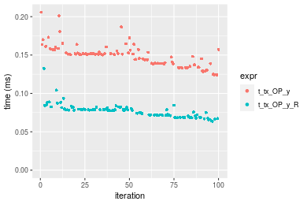

```r
> OP
[1] "*"
> stats <- microbenchmark(t_tx_OP_y = t_tx_OP_y(x, y, OP = OP, na.rm = FALSE), t_tx_OP_y_R = t_tx_OP_y_R(x, 
+     y, OP = OP, na.rm = FALSE), unit = "ms")
> gc()
          used  (Mb) gc trigger  (Mb) max used  (Mb)
Ncells 5290921 282.6   10014072 534.9 10014072 534.9
Vcells 9980112  76.2   36267018 276.7 90959857 694.0
```

_Table: Benchmarking of t_tx_OP_y() and t_tx_OP_y_R() on integer+100x100+mul data. The top panel shows times in milliseconds and the bottom panel shows relative times._


|   |expr        |      min|        lq|      mean|   median|        uq|      max|
|:--|:-----------|--------:|---------:|---------:|--------:|---------:|--------:|
|2  |t_tx_OP_y_R | 0.075049| 0.0780170| 0.0836270| 0.083004| 0.0869730| 0.138637|
|1  |t_tx_OP_y   | 0.123698| 0.1278725| 0.1363635| 0.132793| 0.1430075| 0.170506|


|   |expr        |     min|       lq|     mean|   median|       uq|      max|
|:--|:-----------|-------:|--------:|--------:|--------:|--------:|--------:|
|2  |t_tx_OP_y_R | 1.00000| 1.000000| 1.000000| 1.000000| 1.000000| 1.000000|
|1  |t_tx_OP_y   | 1.64823| 1.639034| 1.630615| 1.599839| 1.644275| 1.229874|

_Figure: Benchmarking of t_tx_OP_y() and t_tx_OP_y_R() on integer+100x100+mul data.  Outliers are displayed as crosses.  Times are in milliseconds._


```r
> OP
[1] "/"
> stats <- microbenchmark(t_tx_OP_y = t_tx_OP_y(x, y, OP = OP, na.rm = FALSE), t_tx_OP_y_R = t_tx_OP_y_R(x, 
+     y, OP = OP, na.rm = FALSE), unit = "ms")
> gc()
          used  (Mb) gc trigger  (Mb) max used  (Mb)
Ncells 5290984 282.6   10014072 534.9 10014072 534.9
Vcells 9980154  76.2   36267018 276.7 90959857 694.0
```

_Table: Benchmarking of t_tx_OP_y() and t_tx_OP_y_R() on integer+100x100+div data. The top panel shows times in milliseconds and the bottom panel shows relative times._


|   |expr        |      min|       lq|      mean|    median|        uq|      max|
|:--|:-----------|--------:|--------:|---------:|---------:|---------:|--------:|
|2  |t_tx_OP_y_R | 0.057641| 0.061931| 0.0676382| 0.0661510| 0.0716425| 0.122955|
|1  |t_tx_OP_y   | 0.128877| 0.131437| 0.1439090| 0.1437985| 0.1532990| 0.179167|


|   |expr        |      min|       lq|     mean|   median|       uq|      max|
|:--|:-----------|--------:|--------:|--------:|--------:|--------:|--------:|
|2  |t_tx_OP_y_R | 1.000000| 1.000000| 1.000000| 1.000000| 1.000000| 1.000000|
|1  |t_tx_OP_y   | 2.235856| 2.122314| 2.127629| 2.173792| 2.139777| 1.457175|

_Figure: Benchmarking of t_tx_OP_y() and t_tx_OP_y_R() on integer+100x100+div data.  Outliers are displayed as crosses.  Times are in milliseconds._


### 1000x10 vector

#### All elements
```r
> x <- data[["1000x10"]]
> y <- x[, 1L]
```

```r
> OP
[1] "+"
> stats <- microbenchmark(t_tx_OP_y = t_tx_OP_y(x, y, OP = OP, na.rm = FALSE), t_tx_OP_y_R = t_tx_OP_y_R(x, 
+     y, OP = OP, na.rm = FALSE), unit = "ms")
> gc()
          used  (Mb) gc trigger  (Mb) max used  (Mb)
Ncells 5291047 282.6   10014072 534.9 10014072 534.9
Vcells 9980969  76.2   36267018 276.7 90959857 694.0
```

_Table: Benchmarking of t_tx_OP_y() and t_tx_OP_y_R() on integer+1000x10+add data. The top panel shows times in milliseconds and the bottom panel shows relative times._


|   |expr        |      min|       lq|      mean|   median|        uq|      max|
|:--|:-----------|--------:|--------:|---------:|--------:|---------:|--------:|
|2  |t_tx_OP_y_R | 0.061916| 0.064563| 0.0719416| 0.070745| 0.0767110| 0.141617|
|1  |t_tx_OP_y   | 0.131551| 0.136435| 0.1501816| 0.147376| 0.1623095| 0.186067|


|   |expr        |      min|       lq|     mean| median|       uq|      max|
|:--|:-----------|--------:|--------:|--------:|------:|--------:|--------:|
|2  |t_tx_OP_y_R | 1.000000| 1.000000| 1.000000| 1.0000| 1.000000| 1.000000|
|1  |t_tx_OP_y   | 2.124669| 2.113207| 2.087548| 2.0832| 2.115857| 1.313875|

_Figure: Benchmarking of t_tx_OP_y() and t_tx_OP_y_R() on integer+1000x10+add data.  Outliers are displayed as crosses.  Times are in milliseconds._


```r
> OP
[1] "-"
> stats <- microbenchmark(t_tx_OP_y = t_tx_OP_y(x, y, OP = OP, na.rm = FALSE), t_tx_OP_y_R = t_tx_OP_y_R(x, 
+     y, OP = OP, na.rm = FALSE), unit = "ms")
> gc()
          used  (Mb) gc trigger  (Mb) max used  (Mb)
Ncells 5291110 282.6   10014072 534.9 10014072 534.9
Vcells 9981374  76.2   36267018 276.7 90959857 694.0
```

_Table: Benchmarking of t_tx_OP_y() and t_tx_OP_y_R() on integer+1000x10+sub data. The top panel shows times in milliseconds and the bottom panel shows relative times._


|   |expr        |      min|        lq|      mean|    median|        uq|      max|
|:--|:-----------|--------:|---------:|---------:|---------:|---------:|--------:|
|2  |t_tx_OP_y_R | 0.065759| 0.0672365| 0.0748377| 0.0736940| 0.0803015| 0.144263|
|1  |t_tx_OP_y   | 0.131068| 0.1359315| 0.1478672| 0.1449465| 0.1571250| 0.186074|


|   |expr        |      min|       lq|     mean|  median|       uq|      max|
|:--|:-----------|--------:|--------:|--------:|-------:|--------:|--------:|
|2  |t_tx_OP_y_R | 1.000000| 1.000000| 1.000000| 1.00000| 1.000000| 1.000000|
|1  |t_tx_OP_y   | 1.993157| 2.021692| 1.975838| 1.96687| 1.956688| 1.289825|

_Figure: Benchmarking of t_tx_OP_y() and t_tx_OP_y_R() on integer+1000x10+sub data.  Outliers are displayed as crosses.  Times are in milliseconds._


```r
> OP
[1] "*"
> stats <- microbenchmark(t_tx_OP_y = t_tx_OP_y(x, y, OP = OP, na.rm = FALSE), t_tx_OP_y_R = t_tx_OP_y_R(x, 
+     y, OP = OP, na.rm = FALSE), unit = "ms")
> gc()
          used  (Mb) gc trigger  (Mb) max used  (Mb)
Ncells 5291173 282.6   10014072 534.9 10014072 534.9
Vcells 9981416  76.2   36267018 276.7 90959857 694.0
```

_Table: Benchmarking of t_tx_OP_y() and t_tx_OP_y_R() on integer+1000x10+mul data. The top panel shows times in milliseconds and the bottom panel shows relative times._


|   |expr        |      min|       lq|      mean|    median|       uq|      max|
|:--|:-----------|--------:|--------:|---------:|---------:|--------:|--------:|
|2  |t_tx_OP_y_R | 0.074768| 0.078103| 0.0864285| 0.0862105| 0.092687| 0.125020|
|1  |t_tx_OP_y   | 0.122608| 0.127432| 0.1387926| 0.1361835| 0.147010| 0.190821|


|   |expr        |      min|       lq|     mean|   median|       uq|      max|
|:--|:-----------|--------:|--------:|--------:|--------:|--------:|--------:|
|2  |t_tx_OP_y_R | 1.000000| 1.000000| 1.000000| 1.000000| 1.000000| 1.000000|
|1  |t_tx_OP_y   | 1.639846| 1.631589| 1.605867| 1.579663| 1.586091| 1.526324|

_Figure: Benchmarking of t_tx_OP_y() and t_tx_OP_y_R() on integer+1000x10+mul data.  Outliers are displayed as crosses.  Times are in milliseconds._

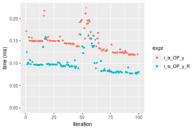

```r
> OP
[1] "/"
> stats <- microbenchmark(t_tx_OP_y = t_tx_OP_y(x, y, OP = OP, na.rm = FALSE), t_tx_OP_y_R = t_tx_OP_y_R(x, 
+     y, OP = OP, na.rm = FALSE), unit = "ms")
> gc()
          used  (Mb) gc trigger  (Mb) max used  (Mb)
Ncells 5291236 282.6   10014072 534.9 10014072 534.9
Vcells 9981458  76.2   36267018 276.7 90959857 694.0
```

_Table: Benchmarking of t_tx_OP_y() and t_tx_OP_y_R() on integer+1000x10+div data. The top panel shows times in milliseconds and the bottom panel shows relative times._


|   |expr        |      min|        lq|      mean|    median|        uq|      max|
|:--|:-----------|--------:|---------:|---------:|---------:|---------:|--------:|
|2  |t_tx_OP_y_R | 0.057550| 0.0597210| 0.0660414| 0.0639010| 0.0695470| 0.121472|
|1  |t_tx_OP_y   | 0.127905| 0.1294255| 0.1417488| 0.1385355| 0.1486265| 0.185048|


|   |expr        |      min|       lq|     mean|   median|       uq|     max|
|:--|:-----------|--------:|--------:|--------:|--------:|--------:|-------:|
|2  |t_tx_OP_y_R | 1.000000| 1.000000| 1.000000| 1.000000| 1.000000| 1.00000|
|1  |t_tx_OP_y   | 2.222502| 2.167169| 2.146365| 2.167971| 2.137066| 1.52338|

_Figure: Benchmarking of t_tx_OP_y() and t_tx_OP_y_R() on integer+1000x10+div data.  Outliers are displayed as crosses.  Times are in milliseconds._


### 10x1000 vector

#### All elements
```r
> x <- data[["10x1000"]]
> y <- x[, 1L]
```

```r
> OP
[1] "+"
> stats <- microbenchmark(t_tx_OP_y = t_tx_OP_y(x, y, OP = OP, na.rm = FALSE), t_tx_OP_y_R = t_tx_OP_y_R(x, 
+     y, OP = OP, na.rm = FALSE), unit = "ms")
> gc()
          used  (Mb) gc trigger  (Mb) max used  (Mb)
Ncells 5291299 282.6   10014072 534.9 10014072 534.9
Vcells 9981479  76.2   36267018 276.7 90959857 694.0
```

_Table: Benchmarking of t_tx_OP_y() and t_tx_OP_y_R() on integer+10x1000+add data. The top panel shows times in milliseconds and the bottom panel shows relative times._


|   |expr        |      min|        lq|      mean|    median|       uq|      max|
|:--|:-----------|--------:|---------:|---------:|---------:|--------:|--------:|
|2  |t_tx_OP_y_R | 0.060965| 0.0637830| 0.0709238| 0.0696655| 0.076628| 0.113823|
|1  |t_tx_OP_y   | 0.135065| 0.1400085| 0.1539279| 0.1524240| 0.161180| 0.217492|


|   |expr        |      min|       lq|     mean|   median|       uq|      max|
|:--|:-----------|--------:|--------:|--------:|--------:|--------:|--------:|
|2  |t_tx_OP_y_R | 1.000000| 1.000000| 1.000000| 1.000000| 1.000000| 1.000000|
|1  |t_tx_OP_y   | 2.215451| 2.195076| 2.170327| 2.187941| 2.103409| 1.910791|

_Figure: Benchmarking of t_tx_OP_y() and t_tx_OP_y_R() on integer+10x1000+add data.  Outliers are displayed as crosses.  Times are in milliseconds._

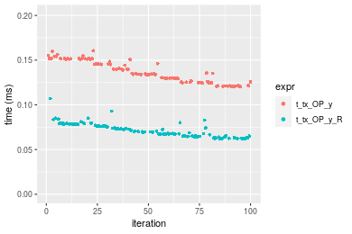

```r
> OP
[1] "-"
> stats <- microbenchmark(t_tx_OP_y = t_tx_OP_y(x, y, OP = OP, na.rm = FALSE), t_tx_OP_y_R = t_tx_OP_y_R(x, 
+     y, OP = OP, na.rm = FALSE), unit = "ms")
> gc()
          used  (Mb) gc trigger  (Mb) max used  (Mb)
Ncells 5291362 282.6   10014072 534.9 10014072 534.9
Vcells 9981521  76.2   36267018 276.7 90959857 694.0
```

_Table: Benchmarking of t_tx_OP_y() and t_tx_OP_y_R() on integer+10x1000+sub data. The top panel shows times in milliseconds and the bottom panel shows relative times._


|   |expr        |      min|        lq|      mean|    median|        uq|      max|
|:--|:-----------|--------:|---------:|---------:|---------:|---------:|--------:|
|2  |t_tx_OP_y_R | 0.061995| 0.0631965| 0.0688535| 0.0674940| 0.0723905| 0.120225|
|1  |t_tx_OP_y   | 0.135096| 0.1398520| 0.1535268| 0.1512175| 0.1637835| 0.190017|


|   |expr        |      min|       lq|    mean|   median|     uq|      max|
|:--|:-----------|--------:|--------:|-------:|--------:|------:|--------:|
|2  |t_tx_OP_y_R | 1.000000| 1.000000| 1.00000| 1.000000| 1.0000| 1.000000|
|1  |t_tx_OP_y   | 2.179143| 2.212971| 2.22976| 2.240458| 2.2625| 1.580512|

_Figure: Benchmarking of t_tx_OP_y() and t_tx_OP_y_R() on integer+10x1000+sub data.  Outliers are displayed as crosses.  Times are in milliseconds._


```r
> OP
[1] "*"
> stats <- microbenchmark(t_tx_OP_y = t_tx_OP_y(x, y, OP = OP, na.rm = FALSE), t_tx_OP_y_R = t_tx_OP_y_R(x, 
+     y, OP = OP, na.rm = FALSE), unit = "ms")
> gc()
          used  (Mb) gc trigger  (Mb) max used  (Mb)
Ncells 5291425 282.6   10014072 534.9 10014072 534.9
Vcells 9982099  76.2   36267018 276.7 90959857 694.0
```

_Table: Benchmarking of t_tx_OP_y() and t_tx_OP_y_R() on integer+10x1000+mul data. The top panel shows times in milliseconds and the bottom panel shows relative times._


|   |expr        |      min|        lq|      mean|    median|        uq|      max|
|:--|:-----------|--------:|---------:|---------:|---------:|---------:|--------:|
|2  |t_tx_OP_y_R | 0.074940| 0.0781035| 0.0852828| 0.0835265| 0.0902225| 0.125107|
|1  |t_tx_OP_y   | 0.125368| 0.1300945| 0.1398572| 0.1389755| 0.1495995| 0.192529|


|   |expr        |      min|       lq|     mean|   median|       uq|      max|
|:--|:-----------|--------:|--------:|--------:|--------:|--------:|--------:|
|2  |t_tx_OP_y_R | 1.000000| 1.000000| 1.000000| 1.000000| 1.000000| 1.000000|
|1  |t_tx_OP_y   | 1.672912| 1.665668| 1.639923| 1.663849| 1.658117| 1.538915|

_Figure: Benchmarking of t_tx_OP_y() and t_tx_OP_y_R() on integer+10x1000+mul data.  Outliers are displayed as crosses.  Times are in milliseconds._


```r
> OP
[1] "/"
> stats <- microbenchmark(t_tx_OP_y = t_tx_OP_y(x, y, OP = OP, na.rm = FALSE), t_tx_OP_y_R = t_tx_OP_y_R(x, 
+     y, OP = OP, na.rm = FALSE), unit = "ms")
> gc()
          used  (Mb) gc trigger  (Mb) max used  (Mb)
Ncells 5291488 282.6   10014072 534.9 10014072 534.9
Vcells 9982141  76.2   36267018 276.7 90959857 694.0
```

_Table: Benchmarking of t_tx_OP_y() and t_tx_OP_y_R() on integer+10x1000+div data. The top panel shows times in milliseconds and the bottom panel shows relative times._


|   |expr        |      min|        lq|      mean|    median|        uq|      max|
|:--|:-----------|--------:|---------:|---------:|---------:|---------:|--------:|
|2  |t_tx_OP_y_R | 0.057147| 0.0610815| 0.0669874| 0.0654775| 0.0710215| 0.105807|
|1  |t_tx_OP_y   | 0.132414| 0.1372405| 0.1470380| 0.1433890| 0.1545440| 0.192542|


|   |expr        |      min|       lq|    mean|   median|       uq|      max|
|:--|:-----------|--------:|--------:|-------:|--------:|--------:|--------:|
|2  |t_tx_OP_y_R | 1.000000| 1.000000| 1.00000| 1.000000| 1.000000| 1.000000|
|1  |t_tx_OP_y   | 2.317077| 2.246842| 2.19501| 2.189897| 2.176017| 1.819747|

_Figure: Benchmarking of t_tx_OP_y() and t_tx_OP_y_R() on integer+10x1000+div data.  Outliers are displayed as crosses.  Times are in milliseconds._

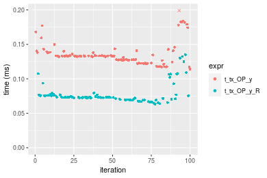


### 100x1000 vector

#### All elements
```r
> x <- data[["100x1000"]]
> y <- x[, 1L]
```

```r
> OP
[1] "+"
> stats <- microbenchmark(t_tx_OP_y = t_tx_OP_y(x, y, OP = OP, na.rm = FALSE), t_tx_OP_y_R = t_tx_OP_y_R(x, 
+     y, OP = OP, na.rm = FALSE), unit = "ms")
> gc()
          used  (Mb) gc trigger  (Mb) max used  (Mb)
Ncells 5291551 282.6   10014072 534.9 10014072 534.9
Vcells 9982225  76.2   36267018 276.7 90959857 694.0
```

_Table: Benchmarking of t_tx_OP_y() and t_tx_OP_y_R() on integer+100x1000+add data. The top panel shows times in milliseconds and the bottom panel shows relative times._


|   |expr        |      min|       lq|      mean|    median|       uq|      max|
|:--|:-----------|--------:|--------:|---------:|---------:|--------:|--------:|
|2  |t_tx_OP_y_R | 0.547081| 0.802572| 0.8033662| 0.8184115| 0.838781| 0.980576|
|1  |t_tx_OP_y   | 1.130320| 1.138276| 1.1985955| 1.1633335| 1.200806| 1.622577|


|   |expr        |      min|       lq|     mean|   median|       uq|      max|
|:--|:-----------|--------:|--------:|--------:|--------:|--------:|--------:|
|2  |t_tx_OP_y_R | 1.000000| 1.000000| 1.000000| 1.000000| 1.000000| 1.000000|
|1  |t_tx_OP_y   | 2.066093| 1.418285| 1.491966| 1.421453| 1.431609| 1.654718|

_Figure: Benchmarking of t_tx_OP_y() and t_tx_OP_y_R() on integer+100x1000+add data.  Outliers are displayed as crosses.  Times are in milliseconds._


```r
> OP
[1] "-"
> stats <- microbenchmark(t_tx_OP_y = t_tx_OP_y(x, y, OP = OP, na.rm = FALSE), t_tx_OP_y_R = t_tx_OP_y_R(x, 
+     y, OP = OP, na.rm = FALSE), unit = "ms")
> gc()
          used  (Mb) gc trigger  (Mb) max used  (Mb)
Ncells 5291614 282.7   10014072 534.9 10014072 534.9
Vcells 9982909  76.2   36267018 276.7 90959857 694.0
```

_Table: Benchmarking of t_tx_OP_y() and t_tx_OP_y_R() on integer+100x1000+sub data. The top panel shows times in milliseconds and the bottom panel shows relative times._


|   |expr        |      min|       lq|      mean|    median|       uq|      max|
|:--|:-----------|--------:|--------:|---------:|---------:|--------:|--------:|
|2  |t_tx_OP_y_R | 0.556599| 0.795062| 0.7951066| 0.8161395| 0.835446| 0.949660|
|1  |t_tx_OP_y   | 1.132699| 1.144545| 1.2169768| 1.1789450| 1.243999| 1.671573|


|   |expr        |      min|       lq|     mean|   median|       uq|     max|
|:--|:-----------|--------:|--------:|--------:|--------:|--------:|-------:|
|2  |t_tx_OP_y_R | 1.000000| 1.000000| 1.000000| 1.000000| 1.000000| 1.00000|
|1  |t_tx_OP_y   | 2.035036| 1.439566| 1.530583| 1.444539| 1.489024| 1.76018|

_Figure: Benchmarking of t_tx_OP_y() and t_tx_OP_y_R() on integer+100x1000+sub data.  Outliers are displayed as crosses.  Times are in milliseconds._


```r
> OP
[1] "*"
> stats <- microbenchmark(t_tx_OP_y = t_tx_OP_y(x, y, OP = OP, na.rm = FALSE), t_tx_OP_y_R = t_tx_OP_y_R(x, 
+     y, OP = OP, na.rm = FALSE), unit = "ms")
> gc()
          used  (Mb) gc trigger  (Mb) max used  (Mb)
Ncells 5291677 282.7   10014072 534.9 10014072 534.9
Vcells 9982951  76.2   36267018 276.7 90959857 694.0
```

_Table: Benchmarking of t_tx_OP_y() and t_tx_OP_y_R() on integer+100x1000+mul data. The top panel shows times in milliseconds and the bottom panel shows relative times._


|   |expr        |      min|        lq|      mean|    median|       uq|      max|
|:--|:-----------|--------:|---------:|---------:|---------:|--------:|--------:|
|2  |t_tx_OP_y_R | 0.707459| 0.9093505| 0.9188162| 0.9135955| 0.948633| 1.142451|
|1  |t_tx_OP_y   | 1.067257| 1.0747030| 1.1349440| 1.0988435| 1.132918| 1.510337|


|   |expr        |      min|       lq|     mean|   median|       uq|      max|
|:--|:-----------|--------:|--------:|--------:|--------:|--------:|--------:|
|2  |t_tx_OP_y_R | 1.000000| 1.000000| 1.000000| 1.000000| 1.000000| 1.000000|
|1  |t_tx_OP_y   | 1.508578| 1.181836| 1.235224| 1.202768| 1.194264| 1.322015|

_Figure: Benchmarking of t_tx_OP_y() and t_tx_OP_y_R() on integer+100x1000+mul data.  Outliers are displayed as crosses.  Times are in milliseconds._


```r
> OP
[1] "/"
> stats <- microbenchmark(t_tx_OP_y = t_tx_OP_y(x, y, OP = OP, na.rm = FALSE), t_tx_OP_y_R = t_tx_OP_y_R(x, 
+     y, OP = OP, na.rm = FALSE), unit = "ms")
> gc()
          used  (Mb) gc trigger  (Mb) max used  (Mb)
Ncells 5291740 282.7   10014072 534.9 10014072 534.9
Vcells 9982993  76.2   36267018 276.7 90959857 694.0
```

_Table: Benchmarking of t_tx_OP_y() and t_tx_OP_y_R() on integer+100x1000+div data. The top panel shows times in milliseconds and the bottom panel shows relative times._


|   |expr        |      min|       lq|      mean|    median|       uq|      max|
|:--|:-----------|--------:|--------:|---------:|---------:|--------:|--------:|
|2  |t_tx_OP_y_R | 0.399837| 0.563174| 0.9280632| 0.9933045| 1.051646| 6.957053|
|1  |t_tx_OP_y   | 0.962732| 1.193785| 1.2230060| 1.2022095| 1.239683| 1.711065|


|   |expr        |      min|       lq|     mean|   median|       uq|       max|
|:--|:-----------|--------:|--------:|--------:|--------:|--------:|---------:|
|2  |t_tx_OP_y_R | 1.000000| 1.000000| 1.000000| 1.000000| 1.000000| 1.0000000|
|1  |t_tx_OP_y   | 2.407811| 2.119744| 1.317805| 1.210313| 1.178803| 0.2459468|

_Figure: Benchmarking of t_tx_OP_y() and t_tx_OP_y_R() on integer+100x1000+div data.  Outliers are displayed as crosses.  Times are in milliseconds._


### 1000x100 vector

#### All elements
```r
> x <- data[["1000x100"]]
> y <- x[, 1L]
```

```r
> OP
[1] "+"
> stats <- microbenchmark(t_tx_OP_y = t_tx_OP_y(x, y, OP = OP, na.rm = FALSE), t_tx_OP_y_R = t_tx_OP_y_R(x, 
+     y, OP = OP, na.rm = FALSE), unit = "ms")
> gc()
          used  (Mb) gc trigger  (Mb) max used  (Mb)
Ncells 5291803 282.7   10014072 534.9 10014072 534.9
Vcells 9983485  76.2   36267018 276.7 90959857 694.0
```

_Table: Benchmarking of t_tx_OP_y() and t_tx_OP_y_R() on integer+1000x100+add data. The top panel shows times in milliseconds and the bottom panel shows relative times._


|   |expr        |      min|        lq|      mean|   median|        uq|      max|
|:--|:-----------|--------:|---------:|---------:|--------:|---------:|--------:|
|2  |t_tx_OP_y_R | 0.435006| 0.4904645| 0.7087333| 0.811866| 0.8388005| 1.388148|
|1  |t_tx_OP_y   | 1.010078| 1.1264635| 1.1710936| 1.150591| 1.1946165| 1.697329|


|   |expr        |      min|       lq|     mean|   median|       uq|      max|
|:--|:-----------|--------:|--------:|--------:|--------:|--------:|--------:|
|2  |t_tx_OP_y_R | 1.000000| 1.000000| 1.000000| 1.000000| 1.000000| 1.000000|
|1  |t_tx_OP_y   | 2.321986| 2.296728| 1.652376| 1.417217| 1.424196| 1.222729|

_Figure: Benchmarking of t_tx_OP_y() and t_tx_OP_y_R() on integer+1000x100+add data.  Outliers are displayed as crosses.  Times are in milliseconds._


```r
> OP
[1] "-"
> stats <- microbenchmark(t_tx_OP_y = t_tx_OP_y(x, y, OP = OP, na.rm = FALSE), t_tx_OP_y_R = t_tx_OP_y_R(x, 
+     y, OP = OP, na.rm = FALSE), unit = "ms")
> gc()
          used  (Mb) gc trigger  (Mb) max used  (Mb)
Ncells 5291866 282.7   10014072 534.9 10014072 534.9
Vcells 9984293  76.2   36267018 276.7 90959857 694.0
```

_Table: Benchmarking of t_tx_OP_y() and t_tx_OP_y_R() on integer+1000x100+sub data. The top panel shows times in milliseconds and the bottom panel shows relative times._


|   |expr        |      min|       lq|      mean|    median|        uq|      max|
|:--|:-----------|--------:|--------:|---------:|---------:|---------:|--------:|
|2  |t_tx_OP_y_R | 0.581748| 0.833911| 0.8367381| 0.8450375| 0.8634935| 0.993181|
|1  |t_tx_OP_y   | 1.125348| 1.133260| 1.1971683| 1.1596005| 1.2038365| 1.681759|


|   |expr        |      min|       lq|     mean|   median|       uq|      max|
|:--|:-----------|--------:|--------:|--------:|--------:|--------:|--------:|
|2  |t_tx_OP_y_R | 1.000000| 1.000000| 1.000000| 1.000000| 1.000000| 1.000000|
|1  |t_tx_OP_y   | 1.934425| 1.358969| 1.430756| 1.372247| 1.394147| 1.693306|

_Figure: Benchmarking of t_tx_OP_y() and t_tx_OP_y_R() on integer+1000x100+sub data.  Outliers are displayed as crosses.  Times are in milliseconds._


```r
> OP
[1] "*"
> stats <- microbenchmark(t_tx_OP_y = t_tx_OP_y(x, y, OP = OP, na.rm = FALSE), t_tx_OP_y_R = t_tx_OP_y_R(x, 
+     y, OP = OP, na.rm = FALSE), unit = "ms")
> gc()
          used  (Mb) gc trigger  (Mb) max used  (Mb)
Ncells 5291929 282.7   10014072 534.9 10014072 534.9
Vcells 9984335  76.2   36267018 276.7 90959857 694.0
```

_Table: Benchmarking of t_tx_OP_y() and t_tx_OP_y_R() on integer+1000x100+mul data. The top panel shows times in milliseconds and the bottom panel shows relative times._


|   |expr        |      min|        lq|      mean|    median|       uq|      max|
|:--|:-----------|--------:|---------:|---------:|---------:|--------:|--------:|
|2  |t_tx_OP_y_R | 0.686383| 0.9134165| 0.9357729| 0.9301375| 0.965165| 1.410055|
|1  |t_tx_OP_y   | 1.057461| 1.0678375| 1.1335807| 1.0950785| 1.145684| 1.600068|


|   |expr        |      min|       lq|     mean|  median|       uq|      max|
|:--|:-----------|--------:|--------:|--------:|-------:|--------:|--------:|
|2  |t_tx_OP_y_R | 1.000000| 1.000000| 1.000000| 1.00000| 1.000000| 1.000000|
|1  |t_tx_OP_y   | 1.540628| 1.169059| 1.211384| 1.17733| 1.187034| 1.134756|

_Figure: Benchmarking of t_tx_OP_y() and t_tx_OP_y_R() on integer+1000x100+mul data.  Outliers are displayed as crosses.  Times are in milliseconds._

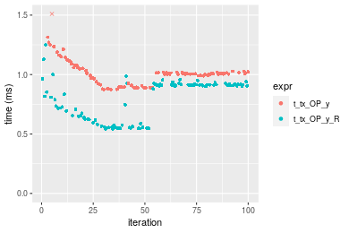

```r
> OP
[1] "/"
> stats <- microbenchmark(t_tx_OP_y = t_tx_OP_y(x, y, OP = OP, na.rm = FALSE), t_tx_OP_y_R = t_tx_OP_y_R(x, 
+     y, OP = OP, na.rm = FALSE), unit = "ms")
> gc()
          used  (Mb) gc trigger  (Mb) max used  (Mb)
Ncells 5291992 282.7   10014072 534.9 10014072 534.9
Vcells 9984377  76.2   36267018 276.7 90959857 694.0
```

_Table: Benchmarking of t_tx_OP_y() and t_tx_OP_y_R() on integer+1000x100+div data. The top panel shows times in milliseconds and the bottom panel shows relative times._


|   |expr        |      min|        lq|      mean|   median|       uq|      max|
|:--|:-----------|--------:|---------:|---------:|--------:|--------:|--------:|
|2  |t_tx_OP_y_R | 0.493628| 0.9763605| 0.9565321| 0.997191| 1.040187|  1.20637|
|1  |t_tx_OP_y   | 1.176944| 1.1909865| 1.4112220| 1.203760| 1.336966| 15.49384|


|   |expr        |      min|       lq|     mean|   median|       uq|      max|
|:--|:-----------|--------:|--------:|--------:|--------:|--------:|--------:|
|2  |t_tx_OP_y_R | 1.000000| 1.000000| 1.000000| 1.000000| 1.000000|  1.00000|
|1  |t_tx_OP_y   | 2.384273| 1.219823| 1.475353| 1.207151| 1.285313| 12.84335|

_Figure: Benchmarking of t_tx_OP_y() and t_tx_OP_y_R() on integer+1000x100+div data.  Outliers are displayed as crosses.  Times are in milliseconds._


## Data type "double"
### Data
```r
> rmatrix <- function(nrow, ncol, mode = c("logical", "double", "integer", "index"), range = c(-100, 
+     +100), na_prob = 0) {
+     mode <- match.arg(mode)
+     n <- nrow * ncol
+     if (mode == "logical") {
+         x <- sample(c(FALSE, TRUE), size = n, replace = TRUE)
+     }     else if (mode == "index") {
+         x <- seq_len(n)
+         mode <- "integer"
+     }     else {
+         x <- runif(n, min = range[1], max = range[2])
+     }
+     storage.mode(x) <- mode
+     if (na_prob > 0) 
+         x[sample(n, size = na_prob * n)] <- NA
+     dim(x) <- c(nrow, ncol)
+     x
+ }
> rmatrices <- function(scale = 10, seed = 1, ...) {
+     set.seed(seed)
+     data <- list()
+     data[[1]] <- rmatrix(nrow = scale * 1, ncol = scale * 1, ...)
+     data[[2]] <- rmatrix(nrow = scale * 10, ncol = scale * 10, ...)
+     data[[3]] <- rmatrix(nrow = scale * 100, ncol = scale * 1, ...)
+     data[[4]] <- t(data[[3]])
+     data[[5]] <- rmatrix(nrow = scale * 10, ncol = scale * 100, ...)
+     data[[6]] <- t(data[[5]])
+     names(data) <- sapply(data, FUN = function(x) paste(dim(x), collapse = "x"))
+     data
+ }
> data <- rmatrices(mode = mode)
```

### Results

### 10x10 vector

#### All elements
```r
> x <- data[["10x10"]]
> y <- x[, 1L]
```

```r
> OP
[1] "+"
> stats <- microbenchmark(t_tx_OP_y = t_tx_OP_y(x, y, OP = OP, na.rm = FALSE), t_tx_OP_y_R = t_tx_OP_y_R(x, 
+     y, OP = OP, na.rm = FALSE), unit = "ms")
> gc()
           used  (Mb) gc trigger  (Mb) max used  (Mb)
Ncells  5292055 282.7   10014072 534.9 10014072 534.9
Vcells 10099904  77.1   36267018 276.7 90959857 694.0
```

_Table: Benchmarking of t_tx_OP_y() and t_tx_OP_y_R() on double+10x10+add data. The top panel shows times in milliseconds and the bottom panel shows relative times._


|   |expr        |      min|        lq|      mean|    median|        uq|      max|
|:--|:-----------|--------:|---------:|---------:|---------:|---------:|--------:|
|1  |t_tx_OP_y   | 0.005170| 0.0054790| 0.0059115| 0.0057095| 0.0059425| 0.021918|
|2  |t_tx_OP_y_R | 0.008699| 0.0091105| 0.0097323| 0.0093695| 0.0096685| 0.042900|


|   |expr        |      min|       lq|     mean|   median|       uq|      max|
|:--|:-----------|--------:|--------:|--------:|--------:|--------:|--------:|
|1  |t_tx_OP_y   | 1.000000| 1.000000| 1.000000| 1.000000| 1.000000| 1.000000|
|2  |t_tx_OP_y_R | 1.682592| 1.662803| 1.646329| 1.641037| 1.627009| 1.957295|

_Figure: Benchmarking of t_tx_OP_y() and t_tx_OP_y_R() on double+10x10+add data.  Outliers are displayed as crosses.  Times are in milliseconds._


```r
> OP
[1] "-"
> stats <- microbenchmark(t_tx_OP_y = t_tx_OP_y(x, y, OP = OP, na.rm = FALSE), t_tx_OP_y_R = t_tx_OP_y_R(x, 
+     y, OP = OP, na.rm = FALSE), unit = "ms")
> gc()
           used  (Mb) gc trigger  (Mb) max used  (Mb)
Ncells  5292118 282.7   10014072 534.9 10014072 534.9
Vcells 10099946  77.1   36267018 276.7 90959857 694.0
```

_Table: Benchmarking of t_tx_OP_y() and t_tx_OP_y_R() on double+10x10+sub data. The top panel shows times in milliseconds and the bottom panel shows relative times._


|   |expr        |      min|        lq|      mean|    median|        uq|      max|
|:--|:-----------|--------:|---------:|---------:|---------:|---------:|--------:|
|1  |t_tx_OP_y   | 0.005287| 0.0057885| 0.0061921| 0.0059825| 0.0061635| 0.024564|
|2  |t_tx_OP_y_R | 0.009001| 0.0096350| 0.0102238| 0.0098850| 0.0101620| 0.044542|


|   |expr        |      min|       lq|     mean|   median|       uq|      max|
|:--|:-----------|--------:|--------:|--------:|--------:|--------:|--------:|
|1  |t_tx_OP_y   | 1.000000| 1.000000| 1.000000| 1.000000| 1.000000| 1.000000|
|2  |t_tx_OP_y_R | 1.702478| 1.664507| 1.651113| 1.652319| 1.648739| 1.813304|

_Figure: Benchmarking of t_tx_OP_y() and t_tx_OP_y_R() on double+10x10+sub data.  Outliers are displayed as crosses.  Times are in milliseconds._


```r
> OP
[1] "*"
> stats <- microbenchmark(t_tx_OP_y = t_tx_OP_y(x, y, OP = OP, na.rm = FALSE), t_tx_OP_y_R = t_tx_OP_y_R(x, 
+     y, OP = OP, na.rm = FALSE), unit = "ms")
> gc()
           used  (Mb) gc trigger  (Mb) max used  (Mb)
Ncells  5292181 282.7   10014072 534.9 10014072 534.9
Vcells 10099988  77.1   36267018 276.7 90959857 694.0
```

_Table: Benchmarking of t_tx_OP_y() and t_tx_OP_y_R() on double+10x10+mul data. The top panel shows times in milliseconds and the bottom panel shows relative times._


|   |expr        |      min|       lq|      mean|    median|       uq|      max|
|:--|:-----------|--------:|--------:|---------:|---------:|--------:|--------:|
|1  |t_tx_OP_y   | 0.005565| 0.005770| 0.0062904| 0.0060235| 0.006259| 0.027703|
|2  |t_tx_OP_y_R | 0.008516| 0.009535| 0.0101537| 0.0098530| 0.010120| 0.039229|


|   |expr        |      min|       lq|     mean|  median|       uq|      max|
|:--|:-----------|--------:|--------:|--------:|-------:|--------:|--------:|
|1  |t_tx_OP_y   | 1.000000| 1.000000| 1.000000| 1.00000| 1.000000| 1.000000|
|2  |t_tx_OP_y_R | 1.530279| 1.652513| 1.614163| 1.63576| 1.616872| 1.416056|

_Figure: Benchmarking of t_tx_OP_y() and t_tx_OP_y_R() on double+10x10+mul data.  Outliers are displayed as crosses.  Times are in milliseconds._


```r
> OP
[1] "/"
> stats <- microbenchmark(t_tx_OP_y = t_tx_OP_y(x, y, OP = OP, na.rm = FALSE), t_tx_OP_y_R = t_tx_OP_y_R(x, 
+     y, OP = OP, na.rm = FALSE), unit = "ms")
> gc()
           used  (Mb) gc trigger  (Mb) max used  (Mb)
Ncells  5292244 282.7   10014072 534.9 10014072 534.9
Vcells 10100030  77.1   36267018 276.7 90959857 694.0
```

_Table: Benchmarking of t_tx_OP_y() and t_tx_OP_y_R() on double+10x10+div data. The top panel shows times in milliseconds and the bottom panel shows relative times._


|   |expr        |      min|       lq|      mean|   median|        uq|      max|
|:--|:-----------|--------:|--------:|---------:|--------:|---------:|--------:|
|1  |t_tx_OP_y   | 0.005151| 0.005450| 0.0061366| 0.005643| 0.0059755| 0.035947|
|2  |t_tx_OP_y_R | 0.008537| 0.009242| 0.0100247| 0.009490| 0.0097800| 0.042974|


|   |expr        |      min|      lq|    mean|  median|       uq|      max|
|:--|:-----------|--------:|-------:|-------:|-------:|--------:|--------:|
|1  |t_tx_OP_y   | 1.000000| 1.00000| 1.00000| 1.00000| 1.000000| 1.000000|
|2  |t_tx_OP_y_R | 1.657348| 1.69578| 1.63358| 1.68173| 1.636683| 1.195482|

_Figure: Benchmarking of t_tx_OP_y() and t_tx_OP_y_R() on double+10x10+div data.  Outliers are displayed as crosses.  Times are in milliseconds._


### 100x100 vector

#### All elements
```r
> x <- data[["100x100"]]
> y <- x[, 1L]
```

```r
> OP
[1] "+"
> stats <- microbenchmark(t_tx_OP_y = t_tx_OP_y(x, y, OP = OP, na.rm = FALSE), t_tx_OP_y_R = t_tx_OP_y_R(x, 
+     y, OP = OP, na.rm = FALSE), unit = "ms")
> gc()
           used  (Mb) gc trigger  (Mb) max used  (Mb)
Ncells  5292307 282.7   10014072 534.9 10014072 534.9
Vcells 10100156  77.1   36267018 276.7 90959857 694.0
```

_Table: Benchmarking of t_tx_OP_y() and t_tx_OP_y_R() on double+100x100+add data. The top panel shows times in milliseconds and the bottom panel shows relative times._


|   |expr        |      min|        lq|      mean|   median|        uq|      max|
|:--|:-----------|--------:|---------:|---------:|--------:|---------:|--------:|
|2  |t_tx_OP_y_R | 0.055820| 0.0582320| 0.0641362| 0.062110| 0.0676405| 0.094304|
|1  |t_tx_OP_y   | 0.116893| 0.1180295| 0.1283789| 0.125795| 0.1356665| 0.174069|


|   |expr        |      min|       lq|     mean|   median|       uq|      max|
|:--|:-----------|--------:|--------:|--------:|--------:|--------:|--------:|
|2  |t_tx_OP_y_R | 1.000000| 1.000000| 1.000000| 1.000000| 1.000000| 1.000000|
|1  |t_tx_OP_y   | 2.094106| 2.026884| 2.001662| 2.025358| 2.005699| 1.845828|

_Figure: Benchmarking of t_tx_OP_y() and t_tx_OP_y_R() on double+100x100+add data.  Outliers are displayed as crosses.  Times are in milliseconds._


```r
> OP
[1] "-"
> stats <- microbenchmark(t_tx_OP_y = t_tx_OP_y(x, y, OP = OP, na.rm = FALSE), t_tx_OP_y_R = t_tx_OP_y_R(x, 
+     y, OP = OP, na.rm = FALSE), unit = "ms")
> gc()
           used  (Mb) gc trigger  (Mb) max used  (Mb)
Ncells  5292370 282.7   10014072 534.9 10014072 534.9
Vcells 10100198  77.1   36267018 276.7 90959857 694.0
```

_Table: Benchmarking of t_tx_OP_y() and t_tx_OP_y_R() on double+100x100+sub data. The top panel shows times in milliseconds and the bottom panel shows relative times._


|   |expr        |      min|        lq|      mean|    median|        uq|      max|
|:--|:-----------|--------:|---------:|---------:|---------:|---------:|--------:|
|2  |t_tx_OP_y_R | 0.055898| 0.0594585| 0.0650139| 0.0640050| 0.0682595| 0.100651|
|1  |t_tx_OP_y   | 0.113932| 0.1185070| 0.1293919| 0.1264145| 0.1365655| 0.180330|


|   |expr        |      min|       lq|     mean|   median|       uq|      max|
|:--|:-----------|--------:|--------:|--------:|--------:|--------:|--------:|
|2  |t_tx_OP_y_R | 1.000000| 1.000000| 1.000000| 1.000000| 1.000000| 1.000000|
|1  |t_tx_OP_y   | 2.038213| 1.993104| 1.990219| 1.975072| 2.000681| 1.791636|

_Figure: Benchmarking of t_tx_OP_y() and t_tx_OP_y_R() on double+100x100+sub data.  Outliers are displayed as crosses.  Times are in milliseconds._


```r
> OP
[1] "*"
> stats <- microbenchmark(t_tx_OP_y = t_tx_OP_y(x, y, OP = OP, na.rm = FALSE), t_tx_OP_y_R = t_tx_OP_y_R(x, 
+     y, OP = OP, na.rm = FALSE), unit = "ms")
> gc()
           used  (Mb) gc trigger  (Mb) max used  (Mb)
Ncells  5292433 282.7   10014072 534.9 10014072 534.9
Vcells 10101353  77.1   36267018 276.7 90959857 694.0
```

_Table: Benchmarking of t_tx_OP_y() and t_tx_OP_y_R() on double+100x100+mul data. The top panel shows times in milliseconds and the bottom panel shows relative times._


|   |expr        |      min|        lq|      mean|    median|       uq|      max|
|:--|:-----------|--------:|---------:|---------:|---------:|--------:|--------:|
|2  |t_tx_OP_y_R | 0.055549| 0.0583840| 0.0640600| 0.0622705| 0.066751| 0.115801|
|1  |t_tx_OP_y   | 0.110732| 0.1150755| 0.1248535| 0.1236700| 0.133867| 0.156507|


|   |expr        |      min|       lq|     mean|   median|       uq|      max|
|:--|:-----------|--------:|--------:|--------:|--------:|--------:|--------:|
|2  |t_tx_OP_y_R | 1.000000| 1.000000| 1.000000| 1.000000| 1.000000| 1.000000|
|1  |t_tx_OP_y   | 1.993411| 1.971011| 1.949008| 1.986013| 2.005468| 1.351517|

_Figure: Benchmarking of t_tx_OP_y() and t_tx_OP_y_R() on double+100x100+mul data.  Outliers are displayed as crosses.  Times are in milliseconds._


```r
> OP
[1] "/"
> stats <- microbenchmark(t_tx_OP_y = t_tx_OP_y(x, y, OP = OP, na.rm = FALSE), t_tx_OP_y_R = t_tx_OP_y_R(x, 
+     y, OP = OP, na.rm = FALSE), unit = "ms")
> gc()
           used  (Mb) gc trigger  (Mb) max used  (Mb)
Ncells  5292496 282.7   10014072 534.9 10014072 534.9
Vcells 10101395  77.1   36267018 276.7 90959857 694.0
```

_Table: Benchmarking of t_tx_OP_y() and t_tx_OP_y_R() on double+100x100+div data. The top panel shows times in milliseconds and the bottom panel shows relative times._


|   |expr        |      min|        lq|      mean|   median|        uq|      max|
|:--|:-----------|--------:|---------:|---------:|--------:|---------:|--------:|
|2  |t_tx_OP_y_R | 0.057221| 0.0612845| 0.0671699| 0.066314| 0.0707330| 0.117547|
|1  |t_tx_OP_y   | 0.110859| 0.1155560| 0.1253547| 0.123659| 0.1338715| 0.194706|


|   |expr        |      min|       lq|     mean|  median|       uq|     max|
|:--|:-----------|--------:|--------:|--------:|-------:|--------:|-------:|
|2  |t_tx_OP_y_R | 1.000000| 1.000000| 1.000000| 1.00000| 1.000000| 1.00000|
|1  |t_tx_OP_y   | 1.937383| 1.885566| 1.866232| 1.86475| 1.892631| 1.65641|

_Figure: Benchmarking of t_tx_OP_y() and t_tx_OP_y_R() on double+100x100+div data.  Outliers are displayed as crosses.  Times are in milliseconds._

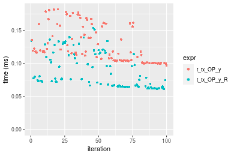


### 1000x10 vector

#### All elements
```r
> x <- data[["1000x10"]]
> y <- x[, 1L]
```

```r
> OP
[1] "+"
> stats <- microbenchmark(t_tx_OP_y = t_tx_OP_y(x, y, OP = OP, na.rm = FALSE), t_tx_OP_y_R = t_tx_OP_y_R(x, 
+     y, OP = OP, na.rm = FALSE), unit = "ms")
> gc()
           used  (Mb) gc trigger  (Mb) max used  (Mb)
Ncells  5292559 282.7   10014072 534.9 10014072 534.9
Vcells 10102337  77.1   36267018 276.7 90959857 694.0
```

_Table: Benchmarking of t_tx_OP_y() and t_tx_OP_y_R() on double+1000x10+add data. The top panel shows times in milliseconds and the bottom panel shows relative times._


|   |expr        |      min|        lq|      mean|   median|        uq|      max|
|:--|:-----------|--------:|---------:|---------:|--------:|---------:|--------:|
|2  |t_tx_OP_y_R | 0.055217| 0.0579725| 0.0653365| 0.063514| 0.0691375| 0.111867|
|1  |t_tx_OP_y   | 0.115818| 0.1202970| 0.1304538| 0.129438| 0.1398200| 0.175489|


|   |expr        |      min|      lq|     mean|   median|       uq|      max|
|:--|:-----------|--------:|-------:|--------:|--------:|--------:|--------:|
|2  |t_tx_OP_y_R | 1.000000| 1.00000| 1.000000| 1.000000| 1.000000| 1.000000|
|1  |t_tx_OP_y   | 2.097506| 2.07507| 1.996647| 2.037944| 2.022347| 1.568729|

_Figure: Benchmarking of t_tx_OP_y() and t_tx_OP_y_R() on double+1000x10+add data.  Outliers are displayed as crosses.  Times are in milliseconds._


```r
> OP
[1] "-"
> stats <- microbenchmark(t_tx_OP_y = t_tx_OP_y(x, y, OP = OP, na.rm = FALSE), t_tx_OP_y_R = t_tx_OP_y_R(x, 
+     y, OP = OP, na.rm = FALSE), unit = "ms")
> gc()
           used  (Mb) gc trigger  (Mb) max used  (Mb)
Ncells  5292622 282.7   10014072 534.9 10014072 534.9
Vcells 10102379  77.1   36267018 276.7 90959857 694.0
```

_Table: Benchmarking of t_tx_OP_y() and t_tx_OP_y_R() on double+1000x10+sub data. The top panel shows times in milliseconds and the bottom panel shows relative times._


|   |expr        |      min|        lq|      mean|    median|        uq|      max|
|:--|:-----------|--------:|---------:|---------:|---------:|---------:|--------:|
|2  |t_tx_OP_y_R | 0.056671| 0.0616480| 0.0674824| 0.0658635| 0.0719705| 0.111006|
|1  |t_tx_OP_y   | 0.116523| 0.1191095| 0.1292006| 0.1272605| 0.1357340| 0.163179|


|   |expr        |      min|      lq|     mean|   median|       uq|      max|
|:--|:-----------|--------:|-------:|--------:|--------:|--------:|--------:|
|2  |t_tx_OP_y_R | 1.000000| 1.00000| 1.000000| 1.000000| 1.000000| 1.000000|
|1  |t_tx_OP_y   | 2.056131| 1.93209| 1.914582| 1.932185| 1.885967| 1.470002|

_Figure: Benchmarking of t_tx_OP_y() and t_tx_OP_y_R() on double+1000x10+sub data.  Outliers are displayed as crosses.  Times are in milliseconds._

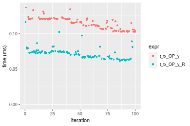

```r
> OP
[1] "*"
> stats <- microbenchmark(t_tx_OP_y = t_tx_OP_y(x, y, OP = OP, na.rm = FALSE), t_tx_OP_y_R = t_tx_OP_y_R(x, 
+     y, OP = OP, na.rm = FALSE), unit = "ms")
> gc()
           used  (Mb) gc trigger  (Mb) max used  (Mb)
Ncells  5292685 282.7   10014072 534.9 10014072 534.9
Vcells 10102421  77.1   36267018 276.7 90959857 694.0
```

_Table: Benchmarking of t_tx_OP_y() and t_tx_OP_y_R() on double+1000x10+mul data. The top panel shows times in milliseconds and the bottom panel shows relative times._


|   |expr        |      min|        lq|      mean|    median|        uq|      max|
|:--|:-----------|--------:|---------:|---------:|---------:|---------:|--------:|
|2  |t_tx_OP_y_R | 0.055379| 0.0596955| 0.0656327| 0.0652370| 0.0701980| 0.098667|
|1  |t_tx_OP_y   | 0.109798| 0.1152035| 0.1242441| 0.1232995| 0.1289555| 0.169866|


|   |expr        |      min|       lq|     mean|   median|       uq|      max|
|:--|:-----------|--------:|--------:|--------:|--------:|--------:|--------:|
|2  |t_tx_OP_y_R | 1.000000| 1.000000| 1.000000| 1.000000| 1.000000| 1.000000|
|1  |t_tx_OP_y   | 1.982665| 1.929852| 1.893022| 1.890024| 1.837025| 1.721609|

_Figure: Benchmarking of t_tx_OP_y() and t_tx_OP_y_R() on double+1000x10+mul data.  Outliers are displayed as crosses.  Times are in milliseconds._

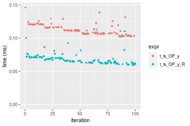

```r
> OP
[1] "/"
> stats <- microbenchmark(t_tx_OP_y = t_tx_OP_y(x, y, OP = OP, na.rm = FALSE), t_tx_OP_y_R = t_tx_OP_y_R(x, 
+     y, OP = OP, na.rm = FALSE), unit = "ms")
> gc()
           used  (Mb) gc trigger  (Mb) max used  (Mb)
Ncells  5292748 282.7   10014072 534.9 10014072 534.9
Vcells 10102463  77.1   36267018 276.7 90959857 694.0
```

_Table: Benchmarking of t_tx_OP_y() and t_tx_OP_y_R() on double+1000x10+div data. The top panel shows times in milliseconds and the bottom panel shows relative times._


|   |expr        |      min|       lq|      mean|    median|        uq|      max|
|:--|:-----------|--------:|--------:|---------:|---------:|---------:|--------:|
|2  |t_tx_OP_y_R | 0.056926| 0.061680| 0.0728971| 0.0664675| 0.0737335| 0.204071|
|1  |t_tx_OP_y   | 0.110082| 0.117875| 0.1300239| 0.1273955| 0.1329800| 0.245013|


|   |expr        |      min|       lq|     mean|   median|       uq|      max|
|:--|:-----------|--------:|--------:|--------:|--------:|--------:|--------:|
|2  |t_tx_OP_y_R | 1.000000| 1.000000| 1.000000| 1.000000| 1.000000| 1.000000|
|1  |t_tx_OP_y   | 1.933774| 1.911073| 1.783665| 1.916659| 1.803522| 1.200626|

_Figure: Benchmarking of t_tx_OP_y() and t_tx_OP_y_R() on double+1000x10+div data.  Outliers are displayed as crosses.  Times are in milliseconds._


### 10x1000 vector

#### All elements
```r
> x <- data[["10x1000"]]
> y <- x[, 1L]
```

```r
> OP
[1] "+"
> stats <- microbenchmark(t_tx_OP_y = t_tx_OP_y(x, y, OP = OP, na.rm = FALSE), t_tx_OP_y_R = t_tx_OP_y_R(x, 
+     y, OP = OP, na.rm = FALSE), unit = "ms")
> gc()
           used  (Mb) gc trigger  (Mb) max used  (Mb)
Ncells  5292811 282.7   10014072 534.9 10014072 534.9
Vcells 10102853  77.1   36267018 276.7 90959857 694.0
```

_Table: Benchmarking of t_tx_OP_y() and t_tx_OP_y_R() on double+10x1000+add data. The top panel shows times in milliseconds and the bottom panel shows relative times._


|   |expr        |      min|        lq|      mean|    median|        uq|      max|
|:--|:-----------|--------:|---------:|---------:|---------:|---------:|--------:|
|2  |t_tx_OP_y_R | 0.055696| 0.0581625| 0.0645796| 0.0622690| 0.0685770| 0.102755|
|1  |t_tx_OP_y   | 0.118386| 0.1194045| 0.1313824| 0.1302415| 0.1380105| 0.176610|


|   |expr        |      min|       lq|     mean|   median|      uq|      max|
|:--|:-----------|--------:|--------:|--------:|--------:|-------:|--------:|
|2  |t_tx_OP_y_R | 1.000000| 1.000000| 1.000000| 1.000000| 1.00000| 1.000000|
|1  |t_tx_OP_y   | 2.125574| 2.052947| 2.034426| 2.091594| 2.01249| 1.718749|

_Figure: Benchmarking of t_tx_OP_y() and t_tx_OP_y_R() on double+10x1000+add data.  Outliers are displayed as crosses.  Times are in milliseconds._


```r
> OP
[1] "-"
> stats <- microbenchmark(t_tx_OP_y = t_tx_OP_y(x, y, OP = OP, na.rm = FALSE), t_tx_OP_y_R = t_tx_OP_y_R(x, 
+     y, OP = OP, na.rm = FALSE), unit = "ms")
> gc()
           used  (Mb) gc trigger  (Mb) max used  (Mb)
Ncells  5292874 282.7   10014072 534.9 10014072 534.9
Vcells 10102895  77.1   36267018 276.7 90959857 694.0
```

_Table: Benchmarking of t_tx_OP_y() and t_tx_OP_y_R() on double+10x1000+sub data. The top panel shows times in milliseconds and the bottom panel shows relative times._


|   |expr        |      min|        lq|      mean|    median|        uq|      max|
|:--|:-----------|--------:|---------:|---------:|---------:|---------:|--------:|
|2  |t_tx_OP_y_R | 0.057224| 0.0622605| 0.0690725| 0.0656115| 0.0711975| 0.124194|
|1  |t_tx_OP_y   | 0.118505| 0.1268810| 0.1357894| 0.1328080| 0.1434655| 0.167404|


|   |expr        |      min|       lq|     mean|   median|       uq|      max|
|:--|:-----------|--------:|--------:|--------:|--------:|--------:|--------:|
|2  |t_tx_OP_y_R | 1.000000| 1.000000| 1.000000| 1.000000| 1.000000| 1.000000|
|1  |t_tx_OP_y   | 2.070897| 2.037905| 1.965896| 2.024157| 2.015036| 1.347923|

_Figure: Benchmarking of t_tx_OP_y() and t_tx_OP_y_R() on double+10x1000+sub data.  Outliers are displayed as crosses.  Times are in milliseconds._


```r
> OP
[1] "*"
> stats <- microbenchmark(t_tx_OP_y = t_tx_OP_y(x, y, OP = OP, na.rm = FALSE), t_tx_OP_y_R = t_tx_OP_y_R(x, 
+     y, OP = OP, na.rm = FALSE), unit = "ms")
> gc()
           used  (Mb) gc trigger  (Mb) max used  (Mb)
Ncells  5292937 282.7   10014072 534.9 10014072 534.9
Vcells 10102937  77.1   36267018 276.7 90959857 694.0
```

_Table: Benchmarking of t_tx_OP_y() and t_tx_OP_y_R() on double+10x1000+mul data. The top panel shows times in milliseconds and the bottom panel shows relative times._


|   |expr        |      min|       lq|      mean|    median|        uq|      max|
|:--|:-----------|--------:|--------:|---------:|---------:|---------:|--------:|
|2  |t_tx_OP_y_R | 0.055401| 0.058528| 0.0653018| 0.0631275| 0.0686185| 0.098911|
|1  |t_tx_OP_y   | 0.118503| 0.120201| 0.1313330| 0.1281300| 0.1379270| 0.190066|


|   |expr        |      min|       lq|     mean|   median|       uq|      max|
|:--|:-----------|--------:|--------:|--------:|--------:|--------:|--------:|
|2  |t_tx_OP_y_R | 1.000000| 1.000000| 1.000000| 1.000000| 1.000000| 1.000000|
|1  |t_tx_OP_y   | 2.139005| 2.053735| 2.011169| 2.029702| 2.010056| 1.921586|

_Figure: Benchmarking of t_tx_OP_y() and t_tx_OP_y_R() on double+10x1000+mul data.  Outliers are displayed as crosses.  Times are in milliseconds._


```r
> OP
[1] "/"
> stats <- microbenchmark(t_tx_OP_y = t_tx_OP_y(x, y, OP = OP, na.rm = FALSE), t_tx_OP_y_R = t_tx_OP_y_R(x, 
+     y, OP = OP, na.rm = FALSE), unit = "ms")
> gc()
           used  (Mb) gc trigger  (Mb) max used  (Mb)
Ncells  5293000 282.7   10014072 534.9 10014072 534.9
Vcells 10102979  77.1   36267018 276.7 90959857 694.0
```

_Table: Benchmarking of t_tx_OP_y() and t_tx_OP_y_R() on double+10x1000+div data. The top panel shows times in milliseconds and the bottom panel shows relative times._


|   |expr        |      min|       lq|      mean|    median|        uq|      max|
|:--|:-----------|--------:|--------:|---------:|---------:|---------:|--------:|
|2  |t_tx_OP_y_R | 0.057674| 0.062297| 0.0676082| 0.0664890| 0.0718875| 0.100557|
|1  |t_tx_OP_y   | 0.112147| 0.116464| 0.1263189| 0.1254625| 0.1353710| 0.166379|


|   |expr        |      min|       lq|     mean|   median|       uq|      max|
|:--|:-----------|--------:|--------:|--------:|--------:|--------:|--------:|
|2  |t_tx_OP_y_R | 1.000000| 1.000000| 1.000000| 1.000000| 1.000000| 1.000000|
|1  |t_tx_OP_y   | 1.944498| 1.869496| 1.868395| 1.886966| 1.883095| 1.654574|

_Figure: Benchmarking of t_tx_OP_y() and t_tx_OP_y_R() on double+10x1000+div data.  Outliers are displayed as crosses.  Times are in milliseconds._

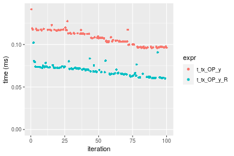


### 100x1000 vector

#### All elements
```r
> x <- data[["100x1000"]]
> y <- x[, 1L]
```

```r
> OP
[1] "+"
> stats <- microbenchmark(t_tx_OP_y = t_tx_OP_y(x, y, OP = OP, na.rm = FALSE), t_tx_OP_y_R = t_tx_OP_y_R(x, 
+     y, OP = OP, na.rm = FALSE), unit = "ms")
> gc()
           used  (Mb) gc trigger  (Mb) max used  (Mb)
Ncells  5293063 282.7   10014072 534.9 10014072 534.9
Vcells 10103105  77.1   36267018 276.7 90959857 694.0
```

_Table: Benchmarking of t_tx_OP_y() and t_tx_OP_y_R() on double+100x1000+add data. The top panel shows times in milliseconds and the bottom panel shows relative times._


|   |expr        |      min|       lq|      mean|   median|       uq|      max|
|:--|:-----------|--------:|--------:|---------:|--------:|--------:|--------:|
|2  |t_tx_OP_y_R | 0.394635| 0.459406| 0.7980544| 0.555506| 1.097263| 6.640199|
|1  |t_tx_OP_y   | 0.873951| 1.086709| 1.1028629| 1.101984| 1.134424| 1.492926|


|   |expr        |      min|       lq|     mean|   median|       uq|       max|
|:--|:-----------|--------:|--------:|--------:|--------:|--------:|---------:|
|2  |t_tx_OP_y_R | 1.000000| 1.000000| 1.000000| 1.000000| 1.000000| 1.0000000|
|1  |t_tx_OP_y   | 2.214581| 2.365465| 1.381939| 1.983747| 1.033867| 0.2248315|

_Figure: Benchmarking of t_tx_OP_y() and t_tx_OP_y_R() on double+100x1000+add data.  Outliers are displayed as crosses.  Times are in milliseconds._


```r
> OP
[1] "-"
> stats <- microbenchmark(t_tx_OP_y = t_tx_OP_y(x, y, OP = OP, na.rm = FALSE), t_tx_OP_y_R = t_tx_OP_y_R(x, 
+     y, OP = OP, na.rm = FALSE), unit = "ms")
> gc()
           used  (Mb) gc trigger  (Mb) max used  (Mb)
Ncells  5293126 282.7   10014072 534.9 10014072 534.9
Vcells 10103147  77.1   36267018 276.7 90959857 694.0
```

_Table: Benchmarking of t_tx_OP_y() and t_tx_OP_y_R() on double+100x1000+sub data. The top panel shows times in milliseconds and the bottom panel shows relative times._


|   |expr        |      min|       lq|     mean|   median|       uq|       max|
|:--|:-----------|--------:|--------:|--------:|--------:|--------:|---------:|
|2  |t_tx_OP_y_R | 0.515622| 1.087922| 1.109897| 1.115750| 1.175299|  1.543329|
|1  |t_tx_OP_y   | 1.098751| 1.111568| 1.347120| 1.139444| 1.282924| 15.810939|


|   |expr        |      min|       lq|     mean|   median|       uq|     max|
|:--|:-----------|--------:|--------:|--------:|--------:|--------:|-------:|
|2  |t_tx_OP_y_R | 1.000000| 1.000000| 1.000000| 1.000000| 1.000000|  1.0000|
|1  |t_tx_OP_y   | 2.130923| 1.021735| 1.213735| 1.021236| 1.091573| 10.2447|

_Figure: Benchmarking of t_tx_OP_y() and t_tx_OP_y_R() on double+100x1000+sub data.  Outliers are displayed as crosses.  Times are in milliseconds._

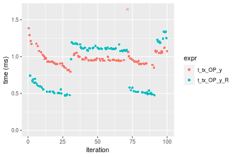

```r
> OP
[1] "*"
> stats <- microbenchmark(t_tx_OP_y = t_tx_OP_y(x, y, OP = OP, na.rm = FALSE), t_tx_OP_y_R = t_tx_OP_y_R(x, 
+     y, OP = OP, na.rm = FALSE), unit = "ms")
> gc()
           used  (Mb) gc trigger  (Mb) max used  (Mb)
Ncells  5293189 282.7   10014072 534.9 10014072 534.9
Vcells 10103189  77.1   36267018 276.7 90959857 694.0
```

_Table: Benchmarking of t_tx_OP_y() and t_tx_OP_y_R() on double+100x1000+mul data. The top panel shows times in milliseconds and the bottom panel shows relative times._


|   |expr        |      min|       lq|      mean|   median|       uq|      max|
|:--|:-----------|--------:|--------:|---------:|--------:|--------:|--------:|
|1  |t_tx_OP_y   | 0.822896| 0.909452| 1.0363168| 1.058459| 1.082197| 1.523167|
|2  |t_tx_OP_y_R | 0.396978| 0.453721| 0.9693659| 1.071308| 1.114192| 6.838393|


|   |expr        |       min|        lq|      mean|   median|       uq|      max|
|:--|:-----------|---------:|---------:|---------:|--------:|--------:|--------:|
|1  |t_tx_OP_y   | 1.0000000| 1.0000000| 1.0000000| 1.000000| 1.000000| 1.000000|
|2  |t_tx_OP_y_R | 0.4824158| 0.4988949| 0.9353954| 1.012139| 1.029565| 4.489588|

_Figure: Benchmarking of t_tx_OP_y() and t_tx_OP_y_R() on double+100x1000+mul data.  Outliers are displayed as crosses.  Times are in milliseconds._


```r
> OP
[1] "/"
> stats <- microbenchmark(t_tx_OP_y = t_tx_OP_y(x, y, OP = OP, na.rm = FALSE), t_tx_OP_y_R = t_tx_OP_y_R(x, 
+     y, OP = OP, na.rm = FALSE), unit = "ms")
> gc()
           used  (Mb) gc trigger  (Mb) max used  (Mb)
Ncells  5293252 282.7   10014072 534.9 10014072 534.9
Vcells 10103231  77.1   36267018 276.7 90959857 694.0
```

_Table: Benchmarking of t_tx_OP_y() and t_tx_OP_y_R() on double+100x1000+div data. The top panel shows times in milliseconds and the bottom panel shows relative times._


|   |expr        |      min|        lq|      mean|   median|       uq|      max|
|:--|:-----------|--------:|---------:|---------:|--------:|--------:|--------:|
|1  |t_tx_OP_y   | 0.823841| 0.9431475| 1.0536097| 1.058170| 1.090976| 1.544265|
|2  |t_tx_OP_y_R | 0.406507| 0.4834595| 0.9999926| 1.082212| 1.195323| 7.036569|


|   |expr        |      min|        lq|     mean|  median|       uq|      max|
|:--|:-----------|--------:|---------:|--------:|-------:|--------:|--------:|
|1  |t_tx_OP_y   | 1.000000| 1.0000000| 1.000000| 1.00000| 1.000000| 1.000000|
|2  |t_tx_OP_y_R | 0.493429| 0.5126022| 0.949111| 1.02272| 1.095645| 4.556581|

_Figure: Benchmarking of t_tx_OP_y() and t_tx_OP_y_R() on double+100x1000+div data.  Outliers are displayed as crosses.  Times are in milliseconds._

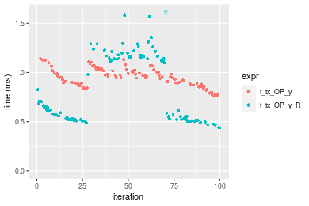


### 1000x100 vector

#### All elements
```r
> x <- data[["1000x100"]]
> y <- x[, 1L]
```

```r
> OP
[1] "+"
> stats <- microbenchmark(t_tx_OP_y = t_tx_OP_y(x, y, OP = OP, na.rm = FALSE), t_tx_OP_y_R = t_tx_OP_y_R(x, 
+     y, OP = OP, na.rm = FALSE), unit = "ms")
> gc()
           used  (Mb) gc trigger  (Mb) max used  (Mb)
Ncells  5293315 282.7   10014072 534.9 10014072 534.9
Vcells 10105774  77.2   36267018 276.7 90959857 694.0
```

_Table: Benchmarking of t_tx_OP_y() and t_tx_OP_y_R() on double+1000x100+add data. The top panel shows times in milliseconds and the bottom panel shows relative times._


|   |expr        |      min|       lq|     mean|   median|       uq|       max|
|:--|:-----------|--------:|--------:|--------:|--------:|--------:|---------:|
|1  |t_tx_OP_y   | 1.084206| 1.097982| 1.183662| 1.126426| 1.262721|  1.494472|
|2  |t_tx_OP_y_R | 0.524204| 1.097052| 1.284235| 1.132399| 1.217124| 15.066552|


|   |expr        |       min|        lq|     mean|   median|        uq|      max|
|:--|:-----------|---------:|---------:|--------:|--------:|---------:|--------:|
|1  |t_tx_OP_y   | 1.0000000| 1.0000000| 1.000000| 1.000000| 1.0000000|  1.00000|
|2  |t_tx_OP_y_R | 0.4834911| 0.9991534| 1.084967| 1.005302| 0.9638895| 10.08152|

_Figure: Benchmarking of t_tx_OP_y() and t_tx_OP_y_R() on double+1000x100+add data.  Outliers are displayed as crosses.  Times are in milliseconds._


```r
> OP
[1] "-"
> stats <- microbenchmark(t_tx_OP_y = t_tx_OP_y(x, y, OP = OP, na.rm = FALSE), t_tx_OP_y_R = t_tx_OP_y_R(x, 
+     y, OP = OP, na.rm = FALSE), unit = "ms")
> gc()
           used  (Mb) gc trigger  (Mb) max used  (Mb)
Ncells  5293378 282.7   10014072 534.9 10014072 534.9
Vcells 10105816  77.2   36267018 276.7 90959857 694.0
```

_Table: Benchmarking of t_tx_OP_y() and t_tx_OP_y_R() on double+1000x100+sub data. The top panel shows times in milliseconds and the bottom panel shows relative times._


|   |expr        |      min|       lq|     mean|   median|       uq|       max|
|:--|:-----------|--------:|--------:|--------:|--------:|--------:|---------:|
|1  |t_tx_OP_y   | 1.090263| 1.104310| 1.328920| 1.126655| 1.261911| 15.526608|
|2  |t_tx_OP_y_R | 0.503983| 1.117252| 1.126946| 1.142030| 1.169239|  1.490993|


|   |expr        |       min|      lq|      mean|   median|        uq|       max|
|:--|:-----------|---------:|-------:|---------:|--------:|---------:|---------:|
|1  |t_tx_OP_y   | 1.0000000| 1.00000| 1.0000000| 1.000000| 1.0000000| 1.0000000|
|2  |t_tx_OP_y_R | 0.4622582| 1.01172| 0.8480166| 1.013647| 0.9265626| 0.0960283|

_Figure: Benchmarking of t_tx_OP_y() and t_tx_OP_y_R() on double+1000x100+sub data.  Outliers are displayed as crosses.  Times are in milliseconds._


```r
> OP
[1] "*"
> stats <- microbenchmark(t_tx_OP_y = t_tx_OP_y(x, y, OP = OP, na.rm = FALSE), t_tx_OP_y_R = t_tx_OP_y_R(x, 
+     y, OP = OP, na.rm = FALSE), unit = "ms")
> gc()
           used  (Mb) gc trigger  (Mb) max used  (Mb)
Ncells  5293441 282.8   10014072 534.9 10014072 534.9
Vcells 10105858  77.2   36267018 276.7 90959857 694.0
```

_Table: Benchmarking of t_tx_OP_y() and t_tx_OP_y_R() on double+1000x100+mul data. The top panel shows times in milliseconds and the bottom panel shows relative times._


|   |expr        |      min|       lq|     mean|   median|       uq|       max|
|:--|:-----------|--------:|--------:|--------:|--------:|--------:|---------:|
|1  |t_tx_OP_y   | 1.028304| 1.055557| 1.283200| 1.073894| 1.222173| 15.488947|
|2  |t_tx_OP_y_R | 0.517574| 1.102770| 1.146682| 1.129544| 1.239586|  1.801588|


|   |expr        |       min|       lq|      mean|   median|       uq|       max|
|:--|:-----------|---------:|--------:|---------:|--------:|--------:|---------:|
|1  |t_tx_OP_y   | 1.0000000| 1.000000| 1.0000000| 1.000000| 1.000000| 1.0000000|
|2  |t_tx_OP_y_R | 0.5033278| 1.044728| 0.8936114| 1.051821| 1.014247| 0.1163144|

_Figure: Benchmarking of t_tx_OP_y() and t_tx_OP_y_R() on double+1000x100+mul data.  Outliers are displayed as crosses.  Times are in milliseconds._


```r
> OP
[1] "/"
> stats <- microbenchmark(t_tx_OP_y = t_tx_OP_y(x, y, OP = OP, na.rm = FALSE), t_tx_OP_y_R = t_tx_OP_y_R(x, 
+     y, OP = OP, na.rm = FALSE), unit = "ms")
> gc()
           used  (Mb) gc trigger  (Mb) max used  (Mb)
Ncells  5293504 282.8   10014072 534.9 10014072 534.9
Vcells 10105900  77.2   36267018 276.7 90959857 694.0
```

_Table: Benchmarking of t_tx_OP_y() and t_tx_OP_y_R() on double+1000x100+div data. The top panel shows times in milliseconds and the bottom panel shows relative times._


|   |expr        |      min|       lq|     mean|  median|       uq|       max|
|:--|:-----------|--------:|--------:|--------:|-------:|--------:|---------:|
|1  |t_tx_OP_y   | 1.041177| 1.056377| 1.277681| 1.07736| 1.196338| 15.306895|
|2  |t_tx_OP_y_R | 0.515055| 1.118289| 1.145821| 1.14259| 1.259680|  1.570179|


|   |expr        |       min|       lq|      mean|   median|       uq|       max|
|:--|:-----------|---------:|--------:|---------:|--------:|--------:|---------:|
|1  |t_tx_OP_y   | 1.0000000| 1.000000| 1.0000000| 1.000000| 1.000000| 1.0000000|
|2  |t_tx_OP_y_R | 0.4946853| 1.058609| 0.8967975| 1.060547| 1.052946| 0.1025799|

_Figure: Benchmarking of t_tx_OP_y() and t_tx_OP_y_R() on double+1000x100+div data.  Outliers are displayed as crosses.  Times are in milliseconds._


## Appendix

### Session information
```r
R version 4.1.1 Patched (2021-08-10 r80727)
Platform: x86_64-pc-linux-gnu (64-bit)
Running under: Ubuntu 18.04.5 LTS

Matrix products: default
BLAS:   /home/hb/software/R-devel/R-4-1-branch/lib/R/lib/libRblas.so
LAPACK: /home/hb/software/R-devel/R-4-1-branch/lib/R/lib/libRlapack.so

locale:
 [1] LC_CTYPE=en_US.UTF-8       LC_NUMERIC=C              
 [3] LC_TIME=en_US.UTF-8        LC_COLLATE=en_US.UTF-8    
 [5] LC_MONETARY=en_US.UTF-8    LC_MESSAGES=en_US.UTF-8   
 [7] LC_PAPER=en_US.UTF-8       LC_NAME=C                 
 [9] LC_ADDRESS=C               LC_TELEPHONE=C            
[11] LC_MEASUREMENT=en_US.UTF-8 LC_IDENTIFICATION=C       

attached base packages:
[1] stats     graphics  grDevices utils     datasets  methods   base     

other attached packages:
[1] microbenchmark_1.4-7   matrixStats_0.60.1     ggplot2_3.3.5         
[4] knitr_1.33             R.devices_2.17.0       R.utils_2.10.1        
[7] R.oo_1.24.0            R.methodsS3_1.8.1-9001 history_0.0.1-9000    

loaded via a namespace (and not attached):
 [1] Biobase_2.52.0          httr_1.4.2              splines_4.1.1          
 [4] bit64_4.0.5             network_1.17.1          assertthat_0.2.1       
 [7] highr_0.9               stats4_4.1.1            blob_1.2.2             
[10] GenomeInfoDbData_1.2.6  robustbase_0.93-8       pillar_1.6.2           
[13] RSQLite_2.2.8           lattice_0.20-44         glue_1.4.2             
[16] digest_0.6.27           XVector_0.32.0          colorspace_2.0-2       
[19] Matrix_1.3-4            XML_3.99-0.7            pkgconfig_2.0.3        
[22] zlibbioc_1.38.0         genefilter_1.74.0       purrr_0.3.4            
[25] ergm_4.1.2              xtable_1.8-4            scales_1.1.1           
[28] tibble_3.1.4            annotate_1.70.0         KEGGREST_1.32.0        
[31] farver_2.1.0            generics_0.1.0          IRanges_2.26.0         
[34] ellipsis_0.3.2          cachem_1.0.6            withr_2.4.2            
[37] BiocGenerics_0.38.0     mime_0.11               survival_3.2-13        
[40] magrittr_2.0.1          crayon_1.4.1            statnet.common_4.5.0   
[43] memoise_2.0.0           laeken_0.5.1            fansi_0.5.0            
[46] R.cache_0.15.0          MASS_7.3-54             R.rsp_0.44.0           
[49] progressr_0.8.0         tools_4.1.1             lifecycle_1.0.0        
[52] S4Vectors_0.30.0        trust_0.1-8             munsell_0.5.0          
[55] tabby_0.0.1-9001        AnnotationDbi_1.54.1    Biostrings_2.60.2      
[58] compiler_4.1.1          GenomeInfoDb_1.28.1     rlang_0.4.11           
[61] grid_4.1.1              RCurl_1.98-1.4          cwhmisc_6.6            
[64] rappdirs_0.3.3          startup_0.15.0          labeling_0.4.2         
[67] bitops_1.0-7            base64enc_0.1-3         boot_1.3-28            
[70] gtable_0.3.0            DBI_1.1.1               markdown_1.1           
[73] R6_2.5.1                lpSolveAPI_5.5.2.0-17.7 rle_0.9.2              
[76] dplyr_1.0.7             fastmap_1.1.0           bit_4.0.4              
[79] utf8_1.2.2              parallel_4.1.1          Rcpp_1.0.7             
[82] vctrs_0.3.8             png_0.1-7               DEoptimR_1.0-9         
[85] tidyselect_1.1.1        xfun_0.25               coda_0.19-4            
```
Total processing time was 1.17 mins.


### Reproducibility
To reproduce this report, do:
```r
html <- matrixStats:::benchmark('t_tx_OP_y')
```

[RSP]: https://cran.r-project.org/package=R.rsp
[matrixStats]: https://cran.r-project.org/package=matrixStats

[StackOverflow:colMins?]: https://stackoverflow.com/questions/13676878 "Stack Overflow: fastest way to get Min from every column in a matrix?"
[StackOverflow:colSds?]: https://stackoverflow.com/questions/17549762 "Stack Overflow: Is there such 'colsd' in R?"
[StackOverflow:rowProds?]: https://stackoverflow.com/questions/20198801/ "Stack Overflow: Row product of matrix and column sum of matrix"

---------------------------------------
Copyright Henrik Bengtsson. Last updated on 2021-08-25 18:38:10 (+0200 UTC). Powered by [RSP].

<script>
 var link = document.createElement('link');
 link.rel = 'icon';
 link.href = "data:image/png;base64,iVBORw0KGgoAAAANSUhEUgAAACAAAAAgCAMAAABEpIrGAAAA21BMVEUAAAAAAP8AAP8AAP8AAP8AAP8AAP8AAP8AAP8AAP8AAP8AAP8AAP8AAP8AAP8AAP8AAP8AAP8AAP8AAP8AAP8AAP8AAP8AAP8AAP8AAP8AAP8AAP8AAP8AAP8AAP8AAP8AAP8AAP8AAP8AAP8AAP8AAP8AAP8AAP8AAP8AAP8BAf4CAv0DA/wdHeIeHuEfH+AgIN8hId4lJdomJtknJ9g+PsE/P8BAQL9yco10dIt1dYp3d4h4eIeVlWqWlmmXl2iYmGeZmWabm2Tn5xjo6Bfp6Rb39wj4+Af//wA2M9hbAAAASXRSTlMAAQIJCgsMJSYnKD4/QGRlZmhpamtsbautrrCxuru8y8zN5ebn6Pn6+///////////////////////////////////////////LsUNcQAAAS9JREFUOI29k21XgkAQhVcFytdSMqMETU26UVqGmpaiFbL//xc1cAhhwVNf6n5i5z67M2dmYOyfJZUqlVLhkKucG7cgmUZTybDz6g0iDeq51PUr37Ds2cy2/C9NeES5puDjxuUk1xnToZsg8pfA3avHQ3lLIi7iWRrkv/OYtkScxBIMgDee0ALoyxHQBJ68JLCjOtQIMIANF7QG9G9fNnHvisCHBVMKgSJgiz7nE+AoBKrAPA3MgepvgR9TSCasrCKH0eB1wBGBFdCO+nAGjMVGPcQb5bd6mQRegN6+1axOs9nGfYcCtfi4NQosdtH7dB+txFIpXQqN1p9B/asRHToyS0jRgpV7nk4nwcq1BJ+x3Gl/v7S9Wmpp/aGquum7w3ZDyrADFYrl8vHBH+ev9AUASW1dmU4h4wAAAABJRU5ErkJggg=="
 document.getElementsByTagName('head')[0].appendChild(link);
</script>


