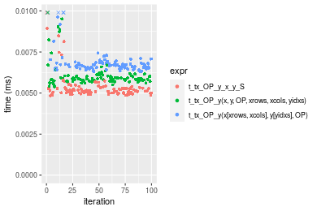
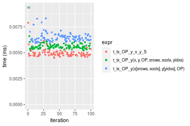
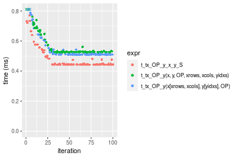
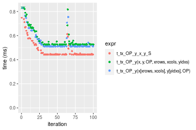
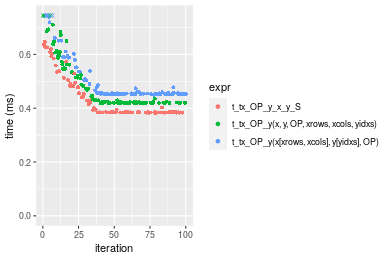
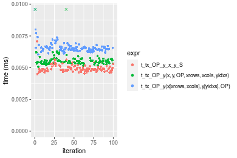
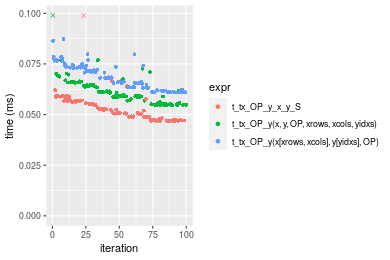
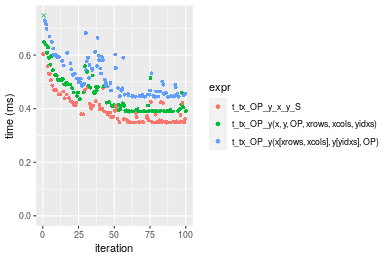

[matrixStats]: Benchmark report

---------------------------------------


# t_tx_OP_y() benchmarks on subsetted computation

This report benchmark the performance of t_tx_OP_y() on subsetted computation.


## Data type "integer"
### Data
```r
> rmatrix <- function(nrow, ncol, mode = c("logical", "double", "integer", "index"), range = c(-100, 
+     +100), na_prob = 0) {
+     mode <- match.arg(mode)
+     n <- nrow * ncol
+     if (mode == "logical") {
+         x <- sample(c(FALSE, TRUE), size = n, replace = TRUE)
+     }     else if (mode == "index") {
+         x <- seq_len(n)
+         mode <- "integer"
+     }     else {
+         x <- runif(n, min = range[1], max = range[2])
+     }
+     storage.mode(x) <- mode
+     if (na_prob > 0) 
+         x[sample(n, size = na_prob * n)] <- NA
+     dim(x) <- c(nrow, ncol)
+     x
+ }
> rmatrices <- function(scale = 10, seed = 1, ...) {
+     set.seed(seed)
+     data <- list()
+     data[[1]] <- rmatrix(nrow = scale * 1, ncol = scale * 1, ...)
+     data[[2]] <- rmatrix(nrow = scale * 10, ncol = scale * 10, ...)
+     data[[3]] <- rmatrix(nrow = scale * 100, ncol = scale * 1, ...)
+     data[[4]] <- t(data[[3]])
+     data[[5]] <- rmatrix(nrow = scale * 10, ncol = scale * 100, ...)
+     data[[6]] <- t(data[[5]])
+     names(data) <- sapply(data, FUN = function(x) paste(dim(x), collapse = "x"))
+     data
+ }
> data <- rmatrices(mode = mode)
```

### Results

### 10x10 vector


```r
> x <- data[["10x10"]]
> y <- x[, 1L]
> xrows <- sample.int(nrow(x), size = nrow(x) * 0.7)
> xcols <- sample.int(ncol(x), size = ncol(x) * 0.7)
> x_S <- x[xrows, xcols]
> yidxs <- xrows
> y_S <- y[yidxs]
```

```r
> OP
[1] "+"
> stats <- microbenchmark(t_tx_OP_y_x_y_S = t_tx_OP_y(x_S, y_S, OP = OP, na.rm = FALSE), `t_tx_OP_y(x, y, OP, xrows, xcols, yidxs)` = t_tx_OP_y(x, 
+     y, OP = OP, xrows = xrows, xcols = xcols, yidxs = yidxs, na.rm = FALSE), `t_tx_OP_y(x[xrows, xcols], y[yidxs], OP)` = t_tx_OP_y(x[xrows, 
+     xcols], y[yidxs], OP = OP, na.rm = FALSE), unit = "ms")
```

_Table: Benchmarking of t_tx_OP_y_x_y_S(), t_tx_OP_y(x, y, OP, xrows, xcols, yidxs)() and t_tx_OP_y(x[xrows, xcols], y[yidxs], OP)() on integer+10x10+add data. The top panel shows times in milliseconds and the bottom panel shows relative times._


|   |expr                                     |      min|        lq|      mean|   median|        uq|      max|
|:--|:----------------------------------------|--------:|---------:|---------:|--------:|---------:|--------:|
|1  |t_tx_OP_y_x_y_S                          | 0.004839| 0.0050135| 0.0058614| 0.005122| 0.0052830| 0.060994|
|2  |t_tx_OP_y(x, y, OP, xrows, xcols, yidxs) | 0.005389| 0.0057385| 0.0061359| 0.005862| 0.0060440| 0.014533|
|3  |t_tx_OP_y(x[xrows, xcols], y[yidxs], OP) | 0.006309| 0.0065325| 0.0069614| 0.006675| 0.0068355| 0.015305|


|   |expr                                     |      min|       lq|     mean|   median|       uq|       max|
|:--|:----------------------------------------|--------:|--------:|--------:|--------:|--------:|---------:|
|1  |t_tx_OP_y_x_y_S                          | 1.000000| 1.000000| 1.000000| 1.000000| 1.000000| 1.0000000|
|2  |t_tx_OP_y(x, y, OP, xrows, xcols, yidxs) | 1.113660| 1.144610| 1.046836| 1.144475| 1.144047| 0.2382693|
|3  |t_tx_OP_y(x[xrows, xcols], y[yidxs], OP) | 1.303782| 1.302982| 1.187681| 1.303202| 1.293867| 0.2509263|

_Figure: Benchmarking of t_tx_OP_y_x_y_S(), t_tx_OP_y(x, y, OP, xrows, xcols, yidxs)() and t_tx_OP_y(x[xrows, xcols], y[yidxs], OP)() on integer+10x10+add data.  Outliers are displayed as crosses.  Times are in milliseconds._



```r
> OP
[1] "-"
> stats <- microbenchmark(t_tx_OP_y_x_y_S = t_tx_OP_y(x_S, y_S, OP = OP, na.rm = FALSE), `t_tx_OP_y(x, y, OP, xrows, xcols, yidxs)` = t_tx_OP_y(x, 
+     y, OP = OP, xrows = xrows, xcols = xcols, yidxs = yidxs, na.rm = FALSE), `t_tx_OP_y(x[xrows, xcols], y[yidxs], OP)` = t_tx_OP_y(x[xrows, 
+     xcols], y[yidxs], OP = OP, na.rm = FALSE), unit = "ms")
```

_Table: Benchmarking of t_tx_OP_y_x_y_S(), t_tx_OP_y(x, y, OP, xrows, xcols, yidxs)() and t_tx_OP_y(x[xrows, xcols], y[yidxs], OP)() on integer+10x10+sub data. The top panel shows times in milliseconds and the bottom panel shows relative times._


|   |expr                                     |      min|        lq|      mean|   median|        uq|      max|
|:--|:----------------------------------------|--------:|---------:|---------:|--------:|---------:|--------:|
|1  |t_tx_OP_y_x_y_S                          | 0.004527| 0.0048295| 0.0051050| 0.004960| 0.0051625| 0.014021|
|2  |t_tx_OP_y(x, y, OP, xrows, xcols, yidxs) | 0.005220| 0.0055485| 0.0062074| 0.005671| 0.0058415| 0.046896|
|3  |t_tx_OP_y(x[xrows, xcols], y[yidxs], OP) | 0.005886| 0.0063725| 0.0066266| 0.006511| 0.0066830| 0.010664|


|   |expr                                     |      min|       lq|     mean|   median|       uq|       max|
|:--|:----------------------------------------|--------:|--------:|--------:|--------:|--------:|---------:|
|1  |t_tx_OP_y_x_y_S                          | 1.000000| 1.000000| 1.000000| 1.000000| 1.000000| 1.0000000|
|2  |t_tx_OP_y(x, y, OP, xrows, xcols, yidxs) | 1.153082| 1.148877| 1.215937| 1.143347| 1.131525| 3.3446972|
|3  |t_tx_OP_y(x[xrows, xcols], y[yidxs], OP) | 1.300199| 1.319495| 1.298040| 1.312702| 1.294528| 0.7605734|

_Figure: Benchmarking of t_tx_OP_y_x_y_S(), t_tx_OP_y(x, y, OP, xrows, xcols, yidxs)() and t_tx_OP_y(x[xrows, xcols], y[yidxs], OP)() on integer+10x10+sub data.  Outliers are displayed as crosses.  Times are in milliseconds._


```r
> OP
[1] "*"
> stats <- microbenchmark(t_tx_OP_y_x_y_S = t_tx_OP_y(x_S, y_S, OP = OP, na.rm = FALSE), `t_tx_OP_y(x, y, OP, xrows, xcols, yidxs)` = t_tx_OP_y(x, 
+     y, OP = OP, xrows = xrows, xcols = xcols, yidxs = yidxs, na.rm = FALSE), `t_tx_OP_y(x[xrows, xcols], y[yidxs], OP)` = t_tx_OP_y(x[xrows, 
+     xcols], y[yidxs], OP = OP, na.rm = FALSE), unit = "ms")
```

_Table: Benchmarking of t_tx_OP_y_x_y_S(), t_tx_OP_y(x, y, OP, xrows, xcols, yidxs)() and t_tx_OP_y(x[xrows, xcols], y[yidxs], OP)() on integer+10x10+mul data. The top panel shows times in milliseconds and the bottom panel shows relative times._


|   |expr                                     |      min|        lq|      mean|    median|        uq|      max|
|:--|:----------------------------------------|--------:|---------:|---------:|---------:|---------:|--------:|
|1  |t_tx_OP_y_x_y_S                          | 0.004579| 0.0048560| 0.0050149| 0.0049370| 0.0051145| 0.006377|
|2  |t_tx_OP_y(x, y, OP, xrows, xcols, yidxs) | 0.005224| 0.0055665| 0.0058959| 0.0056700| 0.0058600| 0.022449|
|3  |t_tx_OP_y(x[xrows, xcols], y[yidxs], OP) | 0.006011| 0.0064075| 0.0069095| 0.0066025| 0.0067895| 0.032793|


|   |expr                                     |      min|       lq|     mean|   median|       uq|      max|
|:--|:----------------------------------------|--------:|--------:|--------:|--------:|--------:|--------:|
|1  |t_tx_OP_y_x_y_S                          | 1.000000| 1.000000| 1.000000| 1.000000| 1.000000| 1.000000|
|2  |t_tx_OP_y(x, y, OP, xrows, xcols, yidxs) | 1.140860| 1.146314| 1.175682| 1.148471| 1.145762| 3.520307|
|3  |t_tx_OP_y(x[xrows, xcols], y[yidxs], OP) | 1.312732| 1.319502| 1.377814| 1.337351| 1.327500| 5.142387|

_Figure: Benchmarking of t_tx_OP_y_x_y_S(), t_tx_OP_y(x, y, OP, xrows, xcols, yidxs)() and t_tx_OP_y(x[xrows, xcols], y[yidxs], OP)() on integer+10x10+mul data.  Outliers are displayed as crosses.  Times are in milliseconds._


```r
> OP
[1] "/"
> stats <- microbenchmark(t_tx_OP_y_x_y_S = t_tx_OP_y(x_S, y_S, OP = OP, na.rm = FALSE), `t_tx_OP_y(x, y, OP, xrows, xcols, yidxs)` = t_tx_OP_y(x, 
+     y, OP = OP, xrows = xrows, xcols = xcols, yidxs = yidxs, na.rm = FALSE), `t_tx_OP_y(x[xrows, xcols], y[yidxs], OP)` = t_tx_OP_y(x[xrows, 
+     xcols], y[yidxs], OP = OP, na.rm = FALSE), unit = "ms")
```

_Table: Benchmarking of t_tx_OP_y_x_y_S(), t_tx_OP_y(x, y, OP, xrows, xcols, yidxs)() and t_tx_OP_y(x[xrows, xcols], y[yidxs], OP)() on integer+10x10+div data. The top panel shows times in milliseconds and the bottom panel shows relative times._


|   |expr                                     |      min|        lq|      mean|    median|        uq|      max|
|:--|:----------------------------------------|--------:|---------:|---------:|---------:|---------:|--------:|
|1  |t_tx_OP_y_x_y_S                          | 0.004506| 0.0047470| 0.0053508| 0.0048385| 0.0050400| 0.043999|
|2  |t_tx_OP_y(x, y, OP, xrows, xcols, yidxs) | 0.005184| 0.0054690| 0.0057309| 0.0055745| 0.0057585| 0.016683|
|3  |t_tx_OP_y(x[xrows, xcols], y[yidxs], OP) | 0.005945| 0.0062255| 0.0065504| 0.0064080| 0.0066550| 0.011993|


|   |expr                                     |      min|       lq|     mean|   median|       uq|       max|
|:--|:----------------------------------------|--------:|--------:|--------:|--------:|--------:|---------:|
|1  |t_tx_OP_y_x_y_S                          | 1.000000| 1.000000| 1.000000| 1.000000| 1.000000| 1.0000000|
|2  |t_tx_OP_y(x, y, OP, xrows, xcols, yidxs) | 1.150466| 1.152096| 1.071028| 1.152113| 1.142559| 0.3791677|
|3  |t_tx_OP_y(x[xrows, xcols], y[yidxs], OP) | 1.319352| 1.311460| 1.224190| 1.324377| 1.320437| 0.2725744|

_Figure: Benchmarking of t_tx_OP_y_x_y_S(), t_tx_OP_y(x, y, OP, xrows, xcols, yidxs)() and t_tx_OP_y(x[xrows, xcols], y[yidxs], OP)() on integer+10x10+div data.  Outliers are displayed as crosses.  Times are in milliseconds._




### 100x100 vector


```r
> x <- data[["100x100"]]
> y <- x[, 1L]
> xrows <- sample.int(nrow(x), size = nrow(x) * 0.7)
> xcols <- sample.int(ncol(x), size = ncol(x) * 0.7)
> x_S <- x[xrows, xcols]
> yidxs <- xrows
> y_S <- y[yidxs]
```

```r
> OP
[1] "+"
> stats <- microbenchmark(t_tx_OP_y_x_y_S = t_tx_OP_y(x_S, y_S, OP = OP, na.rm = FALSE), `t_tx_OP_y(x, y, OP, xrows, xcols, yidxs)` = t_tx_OP_y(x, 
+     y, OP = OP, xrows = xrows, xcols = xcols, yidxs = yidxs, na.rm = FALSE), `t_tx_OP_y(x[xrows, xcols], y[yidxs], OP)` = t_tx_OP_y(x[xrows, 
+     xcols], y[yidxs], OP = OP, na.rm = FALSE), unit = "ms")
```

_Table: Benchmarking of t_tx_OP_y_x_y_S(), t_tx_OP_y(x, y, OP, xrows, xcols, yidxs)() and t_tx_OP_y(x[xrows, xcols], y[yidxs], OP)() on integer+100x100+add data. The top panel shows times in milliseconds and the bottom panel shows relative times._


|   |expr                                     |      min|        lq|      mean|    median|       uq|      max|
|:--|:----------------------------------------|--------:|---------:|---------:|---------:|--------:|--------:|
|1  |t_tx_OP_y_x_y_S                          | 0.060427| 0.0652495| 0.0705450| 0.0701415| 0.076292| 0.109903|
|2  |t_tx_OP_y(x, y, OP, xrows, xcols, yidxs) | 0.071748| 0.0770135| 0.0834709| 0.0835965| 0.090464| 0.107146|
|3  |t_tx_OP_y(x[xrows, xcols], y[yidxs], OP) | 0.070509| 0.0758355| 0.0836503| 0.0846060| 0.088866| 0.116212|


|   |expr                                     |      min|       lq|     mean|   median|       uq|       max|
|:--|:----------------------------------------|--------:|--------:|--------:|--------:|--------:|---------:|
|1  |t_tx_OP_y_x_y_S                          | 1.000000| 1.000000| 1.000000| 1.000000| 1.000000| 1.0000000|
|2  |t_tx_OP_y(x, y, OP, xrows, xcols, yidxs) | 1.187350| 1.180293| 1.183230| 1.191826| 1.185760| 0.9749142|
|3  |t_tx_OP_y(x[xrows, xcols], y[yidxs], OP) | 1.166846| 1.162239| 1.185773| 1.206219| 1.164814| 1.0574052|

_Figure: Benchmarking of t_tx_OP_y_x_y_S(), t_tx_OP_y(x, y, OP, xrows, xcols, yidxs)() and t_tx_OP_y(x[xrows, xcols], y[yidxs], OP)() on integer+100x100+add data.  Outliers are displayed as crosses.  Times are in milliseconds._


```r
> OP
[1] "-"
> stats <- microbenchmark(t_tx_OP_y_x_y_S = t_tx_OP_y(x_S, y_S, OP = OP, na.rm = FALSE), `t_tx_OP_y(x, y, OP, xrows, xcols, yidxs)` = t_tx_OP_y(x, 
+     y, OP = OP, xrows = xrows, xcols = xcols, yidxs = yidxs, na.rm = FALSE), `t_tx_OP_y(x[xrows, xcols], y[yidxs], OP)` = t_tx_OP_y(x[xrows, 
+     xcols], y[yidxs], OP = OP, na.rm = FALSE), unit = "ms")
```

_Table: Benchmarking of t_tx_OP_y_x_y_S(), t_tx_OP_y(x, y, OP, xrows, xcols, yidxs)() and t_tx_OP_y(x[xrows, xcols], y[yidxs], OP)() on integer+100x100+sub data. The top panel shows times in milliseconds and the bottom panel shows relative times._


|   |expr                                     |      min|        lq|      mean|    median|        uq|      max|
|:--|:----------------------------------------|--------:|---------:|---------:|---------:|---------:|--------:|
|1  |t_tx_OP_y_x_y_S                          | 0.062553| 0.0673105| 0.0735584| 0.0733085| 0.0767820| 0.118695|
|3  |t_tx_OP_y(x[xrows, xcols], y[yidxs], OP) | 0.072739| 0.0783500| 0.0868394| 0.0855715| 0.0924540| 0.139485|
|2  |t_tx_OP_y(x, y, OP, xrows, xcols, yidxs) | 0.074338| 0.0805200| 0.0888135| 0.0904030| 0.0935005| 0.116683|


|   |expr                                     |      min|       lq|     mean|   median|      uq|      max|
|:--|:----------------------------------------|--------:|--------:|--------:|--------:|-------:|--------:|
|1  |t_tx_OP_y_x_y_S                          | 1.000000| 1.000000| 1.000000| 1.000000| 1.00000| 1.000000|
|3  |t_tx_OP_y(x[xrows, xcols], y[yidxs], OP) | 1.162838| 1.164009| 1.180551| 1.167279| 1.20411| 1.175155|
|2  |t_tx_OP_y(x, y, OP, xrows, xcols, yidxs) | 1.188400| 1.196247| 1.207388| 1.233186| 1.21774| 0.983049|

_Figure: Benchmarking of t_tx_OP_y_x_y_S(), t_tx_OP_y(x, y, OP, xrows, xcols, yidxs)() and t_tx_OP_y(x[xrows, xcols], y[yidxs], OP)() on integer+100x100+sub data.  Outliers are displayed as crosses.  Times are in milliseconds._


```r
> OP
[1] "*"
> stats <- microbenchmark(t_tx_OP_y_x_y_S = t_tx_OP_y(x_S, y_S, OP = OP, na.rm = FALSE), `t_tx_OP_y(x, y, OP, xrows, xcols, yidxs)` = t_tx_OP_y(x, 
+     y, OP = OP, xrows = xrows, xcols = xcols, yidxs = yidxs, na.rm = FALSE), `t_tx_OP_y(x[xrows, xcols], y[yidxs], OP)` = t_tx_OP_y(x[xrows, 
+     xcols], y[yidxs], OP = OP, na.rm = FALSE), unit = "ms")
```

_Table: Benchmarking of t_tx_OP_y_x_y_S(), t_tx_OP_y(x, y, OP, xrows, xcols, yidxs)() and t_tx_OP_y(x[xrows, xcols], y[yidxs], OP)() on integer+100x100+mul data. The top panel shows times in milliseconds and the bottom panel shows relative times._


|   |expr                                     |      min|        lq|      mean|   median|        uq|      max|
|:--|:----------------------------------------|--------:|---------:|---------:|--------:|---------:|--------:|
|1  |t_tx_OP_y_x_y_S                          | 0.062556| 0.0672915| 0.0737330| 0.073308| 0.0770635| 0.117408|
|2  |t_tx_OP_y(x, y, OP, xrows, xcols, yidxs) | 0.074174| 0.0799835| 0.0878412| 0.086875| 0.0933550| 0.145132|
|3  |t_tx_OP_y(x[xrows, xcols], y[yidxs], OP) | 0.072942| 0.0757775| 0.0844021| 0.087412| 0.0900125| 0.101134|


|   |expr                                     |      min|       lq|     mean|   median|       uq|       max|
|:--|:----------------------------------------|--------:|--------:|--------:|--------:|--------:|---------:|
|1  |t_tx_OP_y_x_y_S                          | 1.000000| 1.000000| 1.000000| 1.000000| 1.000000| 1.0000000|
|2  |t_tx_OP_y(x, y, OP, xrows, xcols, yidxs) | 1.185722| 1.188612| 1.191342| 1.185069| 1.211404| 1.2361338|
|3  |t_tx_OP_y(x[xrows, xcols], y[yidxs], OP) | 1.166027| 1.126108| 1.144699| 1.192394| 1.168030| 0.8613893|

_Figure: Benchmarking of t_tx_OP_y_x_y_S(), t_tx_OP_y(x, y, OP, xrows, xcols, yidxs)() and t_tx_OP_y(x[xrows, xcols], y[yidxs], OP)() on integer+100x100+mul data.  Outliers are displayed as crosses.  Times are in milliseconds._


```r
> OP
[1] "/"
> stats <- microbenchmark(t_tx_OP_y_x_y_S = t_tx_OP_y(x_S, y_S, OP = OP, na.rm = FALSE), `t_tx_OP_y(x, y, OP, xrows, xcols, yidxs)` = t_tx_OP_y(x, 
+     y, OP = OP, xrows = xrows, xcols = xcols, yidxs = yidxs, na.rm = FALSE), `t_tx_OP_y(x[xrows, xcols], y[yidxs], OP)` = t_tx_OP_y(x[xrows, 
+     xcols], y[yidxs], OP = OP, na.rm = FALSE), unit = "ms")
```

_Table: Benchmarking of t_tx_OP_y_x_y_S(), t_tx_OP_y(x, y, OP, xrows, xcols, yidxs)() and t_tx_OP_y(x[xrows, xcols], y[yidxs], OP)() on integer+100x100+div data. The top panel shows times in milliseconds and the bottom panel shows relative times._


|   |expr                                     |      min|        lq|      mean|    median|        uq|      max|
|:--|:----------------------------------------|--------:|---------:|---------:|---------:|---------:|--------:|
|1  |t_tx_OP_y_x_y_S                          | 0.056433| 0.0591840| 0.0630156| 0.0616570| 0.0667595| 0.079457|
|2  |t_tx_OP_y(x, y, OP, xrows, xcols, yidxs) | 0.062022| 0.0651985| 0.0697508| 0.0679340| 0.0735220| 0.104592|
|3  |t_tx_OP_y(x[xrows, xcols], y[yidxs], OP) | 0.068090| 0.0712085| 0.0761739| 0.0762635| 0.0797580| 0.095559|


|   |expr                                     |      min|       lq|     mean|   median|       uq|      max|
|:--|:----------------------------------------|--------:|--------:|--------:|--------:|--------:|--------:|
|1  |t_tx_OP_y_x_y_S                          | 1.000000| 1.000000| 1.000000| 1.000000| 1.000000| 1.000000|
|2  |t_tx_OP_y(x, y, OP, xrows, xcols, yidxs) | 1.099038| 1.101624| 1.106883| 1.101805| 1.101296| 1.316335|
|3  |t_tx_OP_y(x[xrows, xcols], y[yidxs], OP) | 1.206563| 1.203172| 1.208811| 1.236899| 1.194706| 1.202651|

_Figure: Benchmarking of t_tx_OP_y_x_y_S(), t_tx_OP_y(x, y, OP, xrows, xcols, yidxs)() and t_tx_OP_y(x[xrows, xcols], y[yidxs], OP)() on integer+100x100+div data.  Outliers are displayed as crosses.  Times are in milliseconds._


### 1000x10 vector


```r
> x <- data[["1000x10"]]
> y <- x[, 1L]
> xrows <- sample.int(nrow(x), size = nrow(x) * 0.7)
> xcols <- sample.int(ncol(x), size = ncol(x) * 0.7)
> x_S <- x[xrows, xcols]
> yidxs <- xrows
> y_S <- y[yidxs]
```

```r
> OP
[1] "+"
> stats <- microbenchmark(t_tx_OP_y_x_y_S = t_tx_OP_y(x_S, y_S, OP = OP, na.rm = FALSE), `t_tx_OP_y(x, y, OP, xrows, xcols, yidxs)` = t_tx_OP_y(x, 
+     y, OP = OP, xrows = xrows, xcols = xcols, yidxs = yidxs, na.rm = FALSE), `t_tx_OP_y(x[xrows, xcols], y[yidxs], OP)` = t_tx_OP_y(x[xrows, 
+     xcols], y[yidxs], OP = OP, na.rm = FALSE), unit = "ms")
```

_Table: Benchmarking of t_tx_OP_y_x_y_S(), t_tx_OP_y(x, y, OP, xrows, xcols, yidxs)() and t_tx_OP_y(x[xrows, xcols], y[yidxs], OP)() on integer+1000x10+add data. The top panel shows times in milliseconds and the bottom panel shows relative times._


|   |expr                                     |      min|        lq|      mean|   median|        uq|      max|
|:--|:----------------------------------------|--------:|---------:|---------:|--------:|---------:|--------:|
|1  |t_tx_OP_y_x_y_S                          | 0.059878| 0.0642155| 0.0692556| 0.067222| 0.0753045| 0.107632|
|2  |t_tx_OP_y(x, y, OP, xrows, xcols, yidxs) | 0.073212| 0.0739040| 0.0816868| 0.079216| 0.0887145| 0.100477|
|3  |t_tx_OP_y(x[xrows, xcols], y[yidxs], OP) | 0.072088| 0.0736580| 0.0827625| 0.080639| 0.0903600| 0.139024|


|   |expr                                     |      min|       lq|     mean|   median|       uq|       max|
|:--|:----------------------------------------|--------:|--------:|--------:|--------:|--------:|---------:|
|1  |t_tx_OP_y_x_y_S                          | 1.000000| 1.000000| 1.000000| 1.000000| 1.000000| 1.0000000|
|2  |t_tx_OP_y(x, y, OP, xrows, xcols, yidxs) | 1.222686| 1.150875| 1.179498| 1.178424| 1.178077| 0.9335235|
|3  |t_tx_OP_y(x[xrows, xcols], y[yidxs], OP) | 1.203915| 1.147044| 1.195030| 1.199592| 1.199928| 1.2916605|

_Figure: Benchmarking of t_tx_OP_y_x_y_S(), t_tx_OP_y(x, y, OP, xrows, xcols, yidxs)() and t_tx_OP_y(x[xrows, xcols], y[yidxs], OP)() on integer+1000x10+add data.  Outliers are displayed as crosses.  Times are in milliseconds._


```r
> OP
[1] "-"
> stats <- microbenchmark(t_tx_OP_y_x_y_S = t_tx_OP_y(x_S, y_S, OP = OP, na.rm = FALSE), `t_tx_OP_y(x, y, OP, xrows, xcols, yidxs)` = t_tx_OP_y(x, 
+     y, OP = OP, xrows = xrows, xcols = xcols, yidxs = yidxs, na.rm = FALSE), `t_tx_OP_y(x[xrows, xcols], y[yidxs], OP)` = t_tx_OP_y(x[xrows, 
+     xcols], y[yidxs], OP = OP, na.rm = FALSE), unit = "ms")
```

_Table: Benchmarking of t_tx_OP_y_x_y_S(), t_tx_OP_y(x, y, OP, xrows, xcols, yidxs)() and t_tx_OP_y(x[xrows, xcols], y[yidxs], OP)() on integer+1000x10+sub data. The top panel shows times in milliseconds and the bottom panel shows relative times._


|   |expr                                     |      min|        lq|      mean|   median|        uq|      max|
|:--|:----------------------------------------|--------:|---------:|---------:|--------:|---------:|--------:|
|1  |t_tx_OP_y_x_y_S                          | 0.060138| 0.0624440| 0.0683734| 0.065976| 0.0743690| 0.095672|
|2  |t_tx_OP_y(x, y, OP, xrows, xcols, yidxs) | 0.073439| 0.0761675| 0.0838160| 0.080469| 0.0922065| 0.123136|
|3  |t_tx_OP_y(x[xrows, xcols], y[yidxs], OP) | 0.072243| 0.0755750| 0.0838730| 0.082303| 0.0910575| 0.137714|


|   |expr                                     |      min|       lq|     mean|   median|       uq|      max|
|:--|:----------------------------------------|--------:|--------:|--------:|--------:|--------:|--------:|
|1  |t_tx_OP_y_x_y_S                          | 1.000000| 1.000000| 1.000000| 1.000000| 1.000000| 1.000000|
|2  |t_tx_OP_y(x, y, OP, xrows, xcols, yidxs) | 1.221175| 1.219773| 1.225858| 1.219671| 1.239851| 1.287064|
|3  |t_tx_OP_y(x[xrows, xcols], y[yidxs], OP) | 1.201287| 1.210284| 1.226691| 1.247469| 1.224401| 1.439439|

_Figure: Benchmarking of t_tx_OP_y_x_y_S(), t_tx_OP_y(x, y, OP, xrows, xcols, yidxs)() and t_tx_OP_y(x[xrows, xcols], y[yidxs], OP)() on integer+1000x10+sub data.  Outliers are displayed as crosses.  Times are in milliseconds._


```r
> OP
[1] "*"
> stats <- microbenchmark(t_tx_OP_y_x_y_S = t_tx_OP_y(x_S, y_S, OP = OP, na.rm = FALSE), `t_tx_OP_y(x, y, OP, xrows, xcols, yidxs)` = t_tx_OP_y(x, 
+     y, OP = OP, xrows = xrows, xcols = xcols, yidxs = yidxs, na.rm = FALSE), `t_tx_OP_y(x[xrows, xcols], y[yidxs], OP)` = t_tx_OP_y(x[xrows, 
+     xcols], y[yidxs], OP = OP, na.rm = FALSE), unit = "ms")
```

_Table: Benchmarking of t_tx_OP_y_x_y_S(), t_tx_OP_y(x, y, OP, xrows, xcols, yidxs)() and t_tx_OP_y(x[xrows, xcols], y[yidxs], OP)() on integer+1000x10+mul data. The top panel shows times in milliseconds and the bottom panel shows relative times._


|   |expr                                     |      min|        lq|      mean|    median|        uq|      max|
|:--|:----------------------------------------|--------:|---------:|---------:|---------:|---------:|--------:|
|1  |t_tx_OP_y_x_y_S                          | 0.060141| 0.0659525| 0.0691196| 0.0678685| 0.0725495| 0.083481|
|2  |t_tx_OP_y(x, y, OP, xrows, xcols, yidxs) | 0.073878| 0.0816365| 0.0855777| 0.0851410| 0.0922085| 0.098057|
|3  |t_tx_OP_y(x[xrows, xcols], y[yidxs], OP) | 0.073009| 0.0808140| 0.0863548| 0.0873230| 0.0908820| 0.128391|


|   |expr                                     |      min|       lq|     mean|  median|       uq|      max|
|:--|:----------------------------------------|--------:|--------:|--------:|-------:|--------:|--------:|
|1  |t_tx_OP_y_x_y_S                          | 1.000000| 1.000000| 1.000000| 1.00000| 1.000000| 1.000000|
|2  |t_tx_OP_y(x, y, OP, xrows, xcols, yidxs) | 1.228413| 1.237807| 1.238111| 1.25450| 1.270974| 1.174603|
|3  |t_tx_OP_y(x[xrows, xcols], y[yidxs], OP) | 1.213964| 1.225336| 1.249354| 1.28665| 1.252690| 1.537967|

_Figure: Benchmarking of t_tx_OP_y_x_y_S(), t_tx_OP_y(x, y, OP, xrows, xcols, yidxs)() and t_tx_OP_y(x[xrows, xcols], y[yidxs], OP)() on integer+1000x10+mul data.  Outliers are displayed as crosses.  Times are in milliseconds._


```r
> OP
[1] "/"
> stats <- microbenchmark(t_tx_OP_y_x_y_S = t_tx_OP_y(x_S, y_S, OP = OP, na.rm = FALSE), `t_tx_OP_y(x, y, OP, xrows, xcols, yidxs)` = t_tx_OP_y(x, 
+     y, OP = OP, xrows = xrows, xcols = xcols, yidxs = yidxs, na.rm = FALSE), `t_tx_OP_y(x[xrows, xcols], y[yidxs], OP)` = t_tx_OP_y(x[xrows, 
+     xcols], y[yidxs], OP = OP, na.rm = FALSE), unit = "ms")
```

_Table: Benchmarking of t_tx_OP_y_x_y_S(), t_tx_OP_y(x, y, OP, xrows, xcols, yidxs)() and t_tx_OP_y(x[xrows, xcols], y[yidxs], OP)() on integer+1000x10+div data. The top panel shows times in milliseconds and the bottom panel shows relative times._


|   |expr                                     |      min|        lq|      mean|   median|        uq|      max|
|:--|:----------------------------------------|--------:|---------:|---------:|--------:|---------:|--------:|
|1  |t_tx_OP_y_x_y_S                          | 0.052509| 0.0548175| 0.0602619| 0.060235| 0.0658810| 0.071399|
|2  |t_tx_OP_y(x, y, OP, xrows, xcols, yidxs) | 0.060365| 0.0648260| 0.0699844| 0.069716| 0.0746405| 0.112055|
|3  |t_tx_OP_y(x[xrows, xcols], y[yidxs], OP) | 0.064654| 0.0697945| 0.0759714| 0.075630| 0.0816635| 0.090867|


|   |expr                                     |      min|       lq|     mean|   median|       uq|      max|
|:--|:----------------------------------------|--------:|--------:|--------:|--------:|--------:|--------:|
|1  |t_tx_OP_y_x_y_S                          | 1.000000| 1.000000| 1.000000| 1.000000| 1.000000| 1.000000|
|2  |t_tx_OP_y(x, y, OP, xrows, xcols, yidxs) | 1.149612| 1.182579| 1.161336| 1.157400| 1.132959| 1.569420|
|3  |t_tx_OP_y(x[xrows, xcols], y[yidxs], OP) | 1.231294| 1.273216| 1.260687| 1.255582| 1.239561| 1.272665|

_Figure: Benchmarking of t_tx_OP_y_x_y_S(), t_tx_OP_y(x, y, OP, xrows, xcols, yidxs)() and t_tx_OP_y(x[xrows, xcols], y[yidxs], OP)() on integer+1000x10+div data.  Outliers are displayed as crosses.  Times are in milliseconds._


### 10x1000 vector


```r
> x <- data[["10x1000"]]
> y <- x[, 1L]
> xrows <- sample.int(nrow(x), size = nrow(x) * 0.7)
> xcols <- sample.int(ncol(x), size = ncol(x) * 0.7)
> x_S <- x[xrows, xcols]
> yidxs <- xrows
> y_S <- y[yidxs]
```

```r
> OP
[1] "+"
> stats <- microbenchmark(t_tx_OP_y_x_y_S = t_tx_OP_y(x_S, y_S, OP = OP, na.rm = FALSE), `t_tx_OP_y(x, y, OP, xrows, xcols, yidxs)` = t_tx_OP_y(x, 
+     y, OP = OP, xrows = xrows, xcols = xcols, yidxs = yidxs, na.rm = FALSE), `t_tx_OP_y(x[xrows, xcols], y[yidxs], OP)` = t_tx_OP_y(x[xrows, 
+     xcols], y[yidxs], OP = OP, na.rm = FALSE), unit = "ms")
```

_Table: Benchmarking of t_tx_OP_y_x_y_S(), t_tx_OP_y(x, y, OP, xrows, xcols, yidxs)() and t_tx_OP_y(x[xrows, xcols], y[yidxs], OP)() on integer+10x1000+add data. The top panel shows times in milliseconds and the bottom panel shows relative times._


|   |expr                                     |      min|        lq|      mean|    median|        uq|      max|
|:--|:----------------------------------------|--------:|---------:|---------:|---------:|---------:|--------:|
|1  |t_tx_OP_y_x_y_S                          | 0.061382| 0.0644760| 0.0708796| 0.0703615| 0.0775525| 0.088531|
|3  |t_tx_OP_y(x[xrows, xcols], y[yidxs], OP) | 0.072925| 0.0762790| 0.0834276| 0.0815495| 0.0916125| 0.130821|
|2  |t_tx_OP_y(x, y, OP, xrows, xcols, yidxs) | 0.073532| 0.0752435| 0.0833186| 0.0824880| 0.0899710| 0.104942|


|   |expr                                     |      min|      lq|     mean|   median|       uq|      max|
|:--|:----------------------------------------|--------:|-------:|--------:|--------:|--------:|--------:|
|1  |t_tx_OP_y_x_y_S                          | 1.000000| 1.00000| 1.000000| 1.000000| 1.000000| 1.000000|
|3  |t_tx_OP_y(x[xrows, xcols], y[yidxs], OP) | 1.188052| 1.18306| 1.177033| 1.159007| 1.181296| 1.477686|
|2  |t_tx_OP_y(x, y, OP, xrows, xcols, yidxs) | 1.197941| 1.16700| 1.175495| 1.172346| 1.160130| 1.185370|

_Figure: Benchmarking of t_tx_OP_y_x_y_S(), t_tx_OP_y(x, y, OP, xrows, xcols, yidxs)() and t_tx_OP_y(x[xrows, xcols], y[yidxs], OP)() on integer+10x1000+add data.  Outliers are displayed as crosses.  Times are in milliseconds._


```r
> OP
[1] "-"
> stats <- microbenchmark(t_tx_OP_y_x_y_S = t_tx_OP_y(x_S, y_S, OP = OP, na.rm = FALSE), `t_tx_OP_y(x, y, OP, xrows, xcols, yidxs)` = t_tx_OP_y(x, 
+     y, OP = OP, xrows = xrows, xcols = xcols, yidxs = yidxs, na.rm = FALSE), `t_tx_OP_y(x[xrows, xcols], y[yidxs], OP)` = t_tx_OP_y(x[xrows, 
+     xcols], y[yidxs], OP = OP, na.rm = FALSE), unit = "ms")
```

_Table: Benchmarking of t_tx_OP_y_x_y_S(), t_tx_OP_y(x, y, OP, xrows, xcols, yidxs)() and t_tx_OP_y(x[xrows, xcols], y[yidxs], OP)() on integer+10x1000+sub data. The top panel shows times in milliseconds and the bottom panel shows relative times._


|   |expr                                     |      min|        lq|      mean|    median|        uq|      max|
|:--|:----------------------------------------|--------:|---------:|---------:|---------:|---------:|--------:|
|1  |t_tx_OP_y_x_y_S                          | 0.060560| 0.0630490| 0.0691737| 0.0679595| 0.0749940| 0.099520|
|3  |t_tx_OP_y(x[xrows, xcols], y[yidxs], OP) | 0.071770| 0.0744840| 0.0816013| 0.0809460| 0.0900350| 0.095746|
|2  |t_tx_OP_y(x, y, OP, xrows, xcols, yidxs) | 0.073676| 0.0769405| 0.0856078| 0.0856040| 0.0929025| 0.109123|


|   |expr                                     |      min|       lq|     mean|   median|       uq|      max|
|:--|:----------------------------------------|--------:|--------:|--------:|--------:|--------:|--------:|
|1  |t_tx_OP_y_x_y_S                          | 1.000000| 1.000000| 1.000000| 1.000000| 1.000000| 1.000000|
|3  |t_tx_OP_y(x[xrows, xcols], y[yidxs], OP) | 1.185106| 1.181367| 1.179658| 1.191092| 1.200563| 0.962078|
|2  |t_tx_OP_y(x, y, OP, xrows, xcols, yidxs) | 1.216579| 1.220329| 1.237577| 1.259633| 1.238799| 1.096493|

_Figure: Benchmarking of t_tx_OP_y_x_y_S(), t_tx_OP_y(x, y, OP, xrows, xcols, yidxs)() and t_tx_OP_y(x[xrows, xcols], y[yidxs], OP)() on integer+10x1000+sub data.  Outliers are displayed as crosses.  Times are in milliseconds._


```r
> OP
[1] "*"
> stats <- microbenchmark(t_tx_OP_y_x_y_S = t_tx_OP_y(x_S, y_S, OP = OP, na.rm = FALSE), `t_tx_OP_y(x, y, OP, xrows, xcols, yidxs)` = t_tx_OP_y(x, 
+     y, OP = OP, xrows = xrows, xcols = xcols, yidxs = yidxs, na.rm = FALSE), `t_tx_OP_y(x[xrows, xcols], y[yidxs], OP)` = t_tx_OP_y(x[xrows, 
+     xcols], y[yidxs], OP = OP, na.rm = FALSE), unit = "ms")
```

_Table: Benchmarking of t_tx_OP_y_x_y_S(), t_tx_OP_y(x, y, OP, xrows, xcols, yidxs)() and t_tx_OP_y(x[xrows, xcols], y[yidxs], OP)() on integer+10x1000+mul data. The top panel shows times in milliseconds and the bottom panel shows relative times._


|   |expr                                     |      min|        lq|      mean|    median|        uq|      max|
|:--|:----------------------------------------|--------:|---------:|---------:|---------:|---------:|--------:|
|1  |t_tx_OP_y_x_y_S                          | 0.061695| 0.0663655| 0.0717965| 0.0694425| 0.0775190| 0.112296|
|3  |t_tx_OP_y(x[xrows, xcols], y[yidxs], OP) | 0.073594| 0.0786705| 0.0885077| 0.0849105| 0.0923745| 0.139794|
|2  |t_tx_OP_y(x, y, OP, xrows, xcols, yidxs) | 0.074083| 0.0798530| 0.0901737| 0.0891080| 0.0931750| 0.140563|


|   |expr                                     |      min|       lq|     mean|   median|       uq|      max|
|:--|:----------------------------------------|--------:|--------:|--------:|--------:|--------:|--------:|
|1  |t_tx_OP_y_x_y_S                          | 1.000000| 1.000000| 1.000000| 1.000000| 1.000000| 1.000000|
|3  |t_tx_OP_y(x[xrows, xcols], y[yidxs], OP) | 1.192868| 1.185413| 1.232758| 1.222745| 1.191637| 1.244871|
|2  |t_tx_OP_y(x, y, OP, xrows, xcols, yidxs) | 1.200794| 1.203231| 1.255962| 1.283191| 1.201963| 1.251719|

_Figure: Benchmarking of t_tx_OP_y_x_y_S(), t_tx_OP_y(x, y, OP, xrows, xcols, yidxs)() and t_tx_OP_y(x[xrows, xcols], y[yidxs], OP)() on integer+10x1000+mul data.  Outliers are displayed as crosses.  Times are in milliseconds._


```r
> OP
[1] "/"
> stats <- microbenchmark(t_tx_OP_y_x_y_S = t_tx_OP_y(x_S, y_S, OP = OP, na.rm = FALSE), `t_tx_OP_y(x, y, OP, xrows, xcols, yidxs)` = t_tx_OP_y(x, 
+     y, OP = OP, xrows = xrows, xcols = xcols, yidxs = yidxs, na.rm = FALSE), `t_tx_OP_y(x[xrows, xcols], y[yidxs], OP)` = t_tx_OP_y(x[xrows, 
+     xcols], y[yidxs], OP = OP, na.rm = FALSE), unit = "ms")
```

_Table: Benchmarking of t_tx_OP_y_x_y_S(), t_tx_OP_y(x, y, OP, xrows, xcols, yidxs)() and t_tx_OP_y(x[xrows, xcols], y[yidxs], OP)() on integer+10x1000+div data. The top panel shows times in milliseconds and the bottom panel shows relative times._


|   |expr                                     |      min|        lq|      mean|   median|        uq|      max|
|:--|:----------------------------------------|--------:|---------:|---------:|--------:|---------:|--------:|
|1  |t_tx_OP_y_x_y_S                          | 0.053779| 0.0580065| 0.0628827| 0.062581| 0.0674460| 0.079259|
|2  |t_tx_OP_y(x, y, OP, xrows, xcols, yidxs) | 0.060473| 0.0645585| 0.0702413| 0.070128| 0.0756015| 0.088779|
|3  |t_tx_OP_y(x[xrows, xcols], y[yidxs], OP) | 0.065780| 0.0707940| 0.0777507| 0.077749| 0.0824990| 0.122063|


|   |expr                                     |      min|       lq|    mean|   median|       uq|      max|
|:--|:----------------------------------------|--------:|--------:|-------:|--------:|--------:|--------:|
|1  |t_tx_OP_y_x_y_S                          | 1.000000| 1.000000| 1.00000| 1.000000| 1.000000| 1.000000|
|2  |t_tx_OP_y(x, y, OP, xrows, xcols, yidxs) | 1.124472| 1.112953| 1.11702| 1.120596| 1.120919| 1.120113|
|3  |t_tx_OP_y(x[xrows, xcols], y[yidxs], OP) | 1.223154| 1.220449| 1.23644| 1.242374| 1.223186| 1.540052|

_Figure: Benchmarking of t_tx_OP_y_x_y_S(), t_tx_OP_y(x, y, OP, xrows, xcols, yidxs)() and t_tx_OP_y(x[xrows, xcols], y[yidxs], OP)() on integer+10x1000+div data.  Outliers are displayed as crosses.  Times are in milliseconds._


### 100x1000 vector


```r
> x <- data[["100x1000"]]
> y <- x[, 1L]
> xrows <- sample.int(nrow(x), size = nrow(x) * 0.7)
> xcols <- sample.int(ncol(x), size = ncol(x) * 0.7)
> x_S <- x[xrows, xcols]
> yidxs <- xrows
> y_S <- y[yidxs]
```

```r
> OP
[1] "+"
> stats <- microbenchmark(t_tx_OP_y_x_y_S = t_tx_OP_y(x_S, y_S, OP = OP, na.rm = FALSE), `t_tx_OP_y(x, y, OP, xrows, xcols, yidxs)` = t_tx_OP_y(x, 
+     y, OP = OP, xrows = xrows, xcols = xcols, yidxs = yidxs, na.rm = FALSE), `t_tx_OP_y(x[xrows, xcols], y[yidxs], OP)` = t_tx_OP_y(x[xrows, 
+     xcols], y[yidxs], OP = OP, na.rm = FALSE), unit = "ms")
```

_Table: Benchmarking of t_tx_OP_y_x_y_S(), t_tx_OP_y(x, y, OP, xrows, xcols, yidxs)() and t_tx_OP_y(x[xrows, xcols], y[yidxs], OP)() on integer+100x1000+add data. The top panel shows times in milliseconds and the bottom panel shows relative times._


|   |expr                                     |      min|        lq|      mean|    median|        uq|      max|
|:--|:----------------------------------------|--------:|---------:|---------:|---------:|---------:|--------:|
|1  |t_tx_OP_y_x_y_S                          | 0.442223| 0.4427690| 0.4864545| 0.4439255| 0.4951345| 0.770633|
|3  |t_tx_OP_y(x[xrows, xcols], y[yidxs], OP) | 0.508559| 0.5098095| 0.5628570| 0.5113210| 0.5531765| 0.965419|
|2  |t_tx_OP_y(x, y, OP, xrows, xcols, yidxs) | 0.525689| 0.5263810| 0.5673450| 0.5274805| 0.5439225| 0.914107|


|   |expr                                     |      min|       lq|     mean|   median|       uq|      max|
|:--|:----------------------------------------|--------:|--------:|--------:|--------:|--------:|--------:|
|1  |t_tx_OP_y_x_y_S                          | 1.000000| 1.000000| 1.000000| 1.000000| 1.000000| 1.000000|
|3  |t_tx_OP_y(x[xrows, xcols], y[yidxs], OP) | 1.150006| 1.151412| 1.157060| 1.151817| 1.117225| 1.252761|
|2  |t_tx_OP_y(x, y, OP, xrows, xcols, yidxs) | 1.188742| 1.188839| 1.166286| 1.188219| 1.098535| 1.186177|

_Figure: Benchmarking of t_tx_OP_y_x_y_S(), t_tx_OP_y(x, y, OP, xrows, xcols, yidxs)() and t_tx_OP_y(x[xrows, xcols], y[yidxs], OP)() on integer+100x1000+add data.  Outliers are displayed as crosses.  Times are in milliseconds._



```r
> OP
[1] "-"
> stats <- microbenchmark(t_tx_OP_y_x_y_S = t_tx_OP_y(x_S, y_S, OP = OP, na.rm = FALSE), `t_tx_OP_y(x, y, OP, xrows, xcols, yidxs)` = t_tx_OP_y(x, 
+     y, OP = OP, xrows = xrows, xcols = xcols, yidxs = yidxs, na.rm = FALSE), `t_tx_OP_y(x[xrows, xcols], y[yidxs], OP)` = t_tx_OP_y(x[xrows, 
+     xcols], y[yidxs], OP = OP, na.rm = FALSE), unit = "ms")
```

_Table: Benchmarking of t_tx_OP_y_x_y_S(), t_tx_OP_y(x, y, OP, xrows, xcols, yidxs)() and t_tx_OP_y(x[xrows, xcols], y[yidxs], OP)() on integer+100x1000+sub data. The top panel shows times in milliseconds and the bottom panel shows relative times._


|   |expr                                     |      min|        lq|      mean|    median|        uq|      max|
|:--|:----------------------------------------|--------:|---------:|---------:|---------:|---------:|--------:|
|1  |t_tx_OP_y_x_y_S                          | 0.440894| 0.4418335| 0.4831281| 0.4423455| 0.5070895| 0.731417|
|3  |t_tx_OP_y(x[xrows, xcols], y[yidxs], OP) | 0.507351| 0.5090810| 0.5607251| 0.5109395| 0.5757610| 0.920984|
|2  |t_tx_OP_y(x, y, OP, xrows, xcols, yidxs) | 0.525975| 0.5266600| 0.5697822| 0.5286300| 0.5528420| 0.905270|


|   |expr                                     |      min|       lq|     mean|   median|       uq|      max|
|:--|:----------------------------------------|--------:|--------:|--------:|--------:|--------:|--------:|
|1  |t_tx_OP_y_x_y_S                          | 1.000000| 1.000000| 1.000000| 1.000000| 1.000000| 1.000000|
|3  |t_tx_OP_y(x[xrows, xcols], y[yidxs], OP) | 1.150732| 1.152201| 1.160614| 1.155069| 1.135423| 1.259178|
|2  |t_tx_OP_y(x, y, OP, xrows, xcols, yidxs) | 1.192974| 1.191987| 1.179360| 1.195061| 1.090226| 1.237693|

_Figure: Benchmarking of t_tx_OP_y_x_y_S(), t_tx_OP_y(x, y, OP, xrows, xcols, yidxs)() and t_tx_OP_y(x[xrows, xcols], y[yidxs], OP)() on integer+100x1000+sub data.  Outliers are displayed as crosses.  Times are in milliseconds._


```r
> OP
[1] "*"
> stats <- microbenchmark(t_tx_OP_y_x_y_S = t_tx_OP_y(x_S, y_S, OP = OP, na.rm = FALSE), `t_tx_OP_y(x, y, OP, xrows, xcols, yidxs)` = t_tx_OP_y(x, 
+     y, OP = OP, xrows = xrows, xcols = xcols, yidxs = yidxs, na.rm = FALSE), `t_tx_OP_y(x[xrows, xcols], y[yidxs], OP)` = t_tx_OP_y(x[xrows, 
+     xcols], y[yidxs], OP = OP, na.rm = FALSE), unit = "ms")
```

_Table: Benchmarking of t_tx_OP_y_x_y_S(), t_tx_OP_y(x, y, OP, xrows, xcols, yidxs)() and t_tx_OP_y(x[xrows, xcols], y[yidxs], OP)() on integer+100x1000+mul data. The top panel shows times in milliseconds and the bottom panel shows relative times._


|   |expr                                     |      min|        lq|      mean|    median|        uq|      max|
|:--|:----------------------------------------|--------:|---------:|---------:|---------:|---------:|--------:|
|1  |t_tx_OP_y_x_y_S                          | 0.442185| 0.4427660| 0.4812746| 0.4433905| 0.4879385| 0.748343|
|3  |t_tx_OP_y(x[xrows, xcols], y[yidxs], OP) | 0.508983| 0.5102655| 0.5544187| 0.5122305| 0.5475920| 0.834952|
|2  |t_tx_OP_y(x, y, OP, xrows, xcols, yidxs) | 0.525674| 0.5264160| 0.5887506| 0.5289195| 0.6425875| 0.925014|


|   |expr                                     |      min|       lq|     mean|   median|       uq|      max|
|:--|:----------------------------------------|--------:|--------:|--------:|--------:|--------:|--------:|
|1  |t_tx_OP_y_x_y_S                          | 1.000000| 1.000000| 1.000000| 1.000000| 1.000000| 1.000000|
|3  |t_tx_OP_y(x[xrows, xcols], y[yidxs], OP) | 1.151064| 1.152450| 1.151980| 1.155258| 1.122256| 1.115734|
|2  |t_tx_OP_y(x, y, OP, xrows, xcols, yidxs) | 1.188810| 1.188926| 1.223315| 1.192898| 1.316944| 1.236083|

_Figure: Benchmarking of t_tx_OP_y_x_y_S(), t_tx_OP_y(x, y, OP, xrows, xcols, yidxs)() and t_tx_OP_y(x[xrows, xcols], y[yidxs], OP)() on integer+100x1000+mul data.  Outliers are displayed as crosses.  Times are in milliseconds._



```r
> OP
[1] "/"
> stats <- microbenchmark(t_tx_OP_y_x_y_S = t_tx_OP_y(x_S, y_S, OP = OP, na.rm = FALSE), `t_tx_OP_y(x, y, OP, xrows, xcols, yidxs)` = t_tx_OP_y(x, 
+     y, OP = OP, xrows = xrows, xcols = xcols, yidxs = yidxs, na.rm = FALSE), `t_tx_OP_y(x[xrows, xcols], y[yidxs], OP)` = t_tx_OP_y(x[xrows, 
+     xcols], y[yidxs], OP = OP, na.rm = FALSE), unit = "ms")
```

_Table: Benchmarking of t_tx_OP_y_x_y_S(), t_tx_OP_y(x, y, OP, xrows, xcols, yidxs)() and t_tx_OP_y(x[xrows, xcols], y[yidxs], OP)() on integer+100x1000+div data. The top panel shows times in milliseconds and the bottom panel shows relative times._


|   |expr                                     |      min|        lq|      mean|    median|        uq|      max|
|:--|:----------------------------------------|--------:|---------:|---------:|---------:|---------:|--------:|
|1  |t_tx_OP_y_x_y_S                          | 0.383379| 0.3840575| 0.4303420| 0.3852235| 0.4552010| 0.647047|
|2  |t_tx_OP_y(x, y, OP, xrows, xcols, yidxs) | 0.419385| 0.4201300| 0.4853537| 0.4243440| 0.5397575| 0.787023|
|3  |t_tx_OP_y(x[xrows, xcols], y[yidxs], OP) | 0.450225| 0.4522365| 0.5021044| 0.4543885| 0.5049700| 1.003035|


|   |expr                                     |      min|       lq|     mean|   median|       uq|      max|
|:--|:----------------------------------------|--------:|--------:|--------:|--------:|--------:|--------:|
|1  |t_tx_OP_y_x_y_S                          | 1.000000| 1.000000| 1.000000| 1.000000| 1.000000| 1.000000|
|2  |t_tx_OP_y(x, y, OP, xrows, xcols, yidxs) | 1.093918| 1.093925| 1.127833| 1.101553| 1.185756| 1.216330|
|3  |t_tx_OP_y(x[xrows, xcols], y[yidxs], OP) | 1.174360| 1.177523| 1.166757| 1.179545| 1.109334| 1.550173|

_Figure: Benchmarking of t_tx_OP_y_x_y_S(), t_tx_OP_y(x, y, OP, xrows, xcols, yidxs)() and t_tx_OP_y(x[xrows, xcols], y[yidxs], OP)() on integer+100x1000+div data.  Outliers are displayed as crosses.  Times are in milliseconds._




### 1000x100 vector


```r
> x <- data[["1000x100"]]
> y <- x[, 1L]
> xrows <- sample.int(nrow(x), size = nrow(x) * 0.7)
> xcols <- sample.int(ncol(x), size = ncol(x) * 0.7)
> x_S <- x[xrows, xcols]
> yidxs <- xrows
> y_S <- y[yidxs]
```

```r
> OP
[1] "+"
> stats <- microbenchmark(t_tx_OP_y_x_y_S = t_tx_OP_y(x_S, y_S, OP = OP, na.rm = FALSE), `t_tx_OP_y(x, y, OP, xrows, xcols, yidxs)` = t_tx_OP_y(x, 
+     y, OP = OP, xrows = xrows, xcols = xcols, yidxs = yidxs, na.rm = FALSE), `t_tx_OP_y(x[xrows, xcols], y[yidxs], OP)` = t_tx_OP_y(x[xrows, 
+     xcols], y[yidxs], OP = OP, na.rm = FALSE), unit = "ms")
```

_Table: Benchmarking of t_tx_OP_y_x_y_S(), t_tx_OP_y(x, y, OP, xrows, xcols, yidxs)() and t_tx_OP_y(x[xrows, xcols], y[yidxs], OP)() on integer+1000x100+add data. The top panel shows times in milliseconds and the bottom panel shows relative times._


|   |expr                                     |      min|        lq|      mean|    median|        uq|      max|
|:--|:----------------------------------------|--------:|---------:|---------:|---------:|---------:|--------:|
|1  |t_tx_OP_y_x_y_S                          | 0.437524| 0.4381080| 0.4810173| 0.4394085| 0.4904385| 0.750611|
|3  |t_tx_OP_y(x[xrows, xcols], y[yidxs], OP) | 0.502471| 0.5036705| 0.5574160| 0.5052555| 0.5718145| 1.009826|
|2  |t_tx_OP_y(x, y, OP, xrows, xcols, yidxs) | 0.521555| 0.5223940| 0.5713188| 0.5253230| 0.5842815| 0.853970|


|   |expr                                     |      min|       lq|     mean|   median|       uq|      max|
|:--|:----------------------------------------|--------:|--------:|--------:|--------:|--------:|--------:|
|1  |t_tx_OP_y_x_y_S                          | 1.000000| 1.000000| 1.000000| 1.000000| 1.000000| 1.000000|
|3  |t_tx_OP_y(x[xrows, xcols], y[yidxs], OP) | 1.148442| 1.149649| 1.158827| 1.149854| 1.165925| 1.345339|
|2  |t_tx_OP_y(x, y, OP, xrows, xcols, yidxs) | 1.192060| 1.192386| 1.187730| 1.195523| 1.191345| 1.137700|

_Figure: Benchmarking of t_tx_OP_y_x_y_S(), t_tx_OP_y(x, y, OP, xrows, xcols, yidxs)() and t_tx_OP_y(x[xrows, xcols], y[yidxs], OP)() on integer+1000x100+add data.  Outliers are displayed as crosses.  Times are in milliseconds._


```r
> OP
[1] "-"
> stats <- microbenchmark(t_tx_OP_y_x_y_S = t_tx_OP_y(x_S, y_S, OP = OP, na.rm = FALSE), `t_tx_OP_y(x, y, OP, xrows, xcols, yidxs)` = t_tx_OP_y(x, 
+     y, OP = OP, xrows = xrows, xcols = xcols, yidxs = yidxs, na.rm = FALSE), `t_tx_OP_y(x[xrows, xcols], y[yidxs], OP)` = t_tx_OP_y(x[xrows, 
+     xcols], y[yidxs], OP = OP, na.rm = FALSE), unit = "ms")
```

_Table: Benchmarking of t_tx_OP_y_x_y_S(), t_tx_OP_y(x, y, OP, xrows, xcols, yidxs)() and t_tx_OP_y(x[xrows, xcols], y[yidxs], OP)() on integer+1000x100+sub data. The top panel shows times in milliseconds and the bottom panel shows relative times._


|   |expr                                     |      min|        lq|      mean|    median|        uq|      max|
|:--|:----------------------------------------|--------:|---------:|---------:|---------:|---------:|--------:|
|1  |t_tx_OP_y_x_y_S                          | 0.439078| 0.4401030| 0.4928529| 0.4509720| 0.5241445| 0.764198|
|3  |t_tx_OP_y(x[xrows, xcols], y[yidxs], OP) | 0.504546| 0.5088070| 0.5583792| 0.5228385| 0.5694745| 0.845744|
|2  |t_tx_OP_y(x, y, OP, xrows, xcols, yidxs) | 0.521569| 0.5229075| 0.5759360| 0.5340430| 0.6095910| 0.927927|


|   |expr                                     |      min|       lq|     mean|   median|       uq|      max|
|:--|:----------------------------------------|--------:|--------:|--------:|--------:|--------:|--------:|
|1  |t_tx_OP_y_x_y_S                          | 1.000000| 1.000000| 1.000000| 1.000000| 1.000000| 1.000000|
|3  |t_tx_OP_y(x[xrows, xcols], y[yidxs], OP) | 1.149103| 1.156109| 1.132953| 1.159359| 1.086484| 1.106708|
|2  |t_tx_OP_y(x, y, OP, xrows, xcols, yidxs) | 1.187873| 1.188148| 1.168576| 1.184204| 1.163021| 1.214249|

_Figure: Benchmarking of t_tx_OP_y_x_y_S(), t_tx_OP_y(x, y, OP, xrows, xcols, yidxs)() and t_tx_OP_y(x[xrows, xcols], y[yidxs], OP)() on integer+1000x100+sub data.  Outliers are displayed as crosses.  Times are in milliseconds._


```r
> OP
[1] "*"
> stats <- microbenchmark(t_tx_OP_y_x_y_S = t_tx_OP_y(x_S, y_S, OP = OP, na.rm = FALSE), `t_tx_OP_y(x, y, OP, xrows, xcols, yidxs)` = t_tx_OP_y(x, 
+     y, OP = OP, xrows = xrows, xcols = xcols, yidxs = yidxs, na.rm = FALSE), `t_tx_OP_y(x[xrows, xcols], y[yidxs], OP)` = t_tx_OP_y(x[xrows, 
+     xcols], y[yidxs], OP = OP, na.rm = FALSE), unit = "ms")
```

_Table: Benchmarking of t_tx_OP_y_x_y_S(), t_tx_OP_y(x, y, OP, xrows, xcols, yidxs)() and t_tx_OP_y(x[xrows, xcols], y[yidxs], OP)() on integer+1000x100+mul data. The top panel shows times in milliseconds and the bottom panel shows relative times._


|   |expr                                     |      min|        lq|      mean|    median|        uq|      max|
|:--|:----------------------------------------|--------:|---------:|---------:|---------:|---------:|--------:|
|1  |t_tx_OP_y_x_y_S                          | 0.437606| 0.4383500| 0.4813024| 0.4434955| 0.5029225| 0.682179|
|3  |t_tx_OP_y(x[xrows, xcols], y[yidxs], OP) | 0.502695| 0.5040935| 0.5559664| 0.5091195| 0.5495360| 1.228836|
|2  |t_tx_OP_y(x, y, OP, xrows, xcols, yidxs) | 0.521664| 0.5222845| 0.5634080| 0.5237945| 0.5644675| 0.936265|


|   |expr                                     |      min|       lq|     mean|   median|       uq|      max|
|:--|:----------------------------------------|--------:|--------:|--------:|--------:|--------:|--------:|
|1  |t_tx_OP_y_x_y_S                          | 1.000000| 1.000000| 1.000000| 1.000000| 1.000000| 1.000000|
|3  |t_tx_OP_y(x[xrows, xcols], y[yidxs], OP) | 1.148739| 1.149979| 1.155129| 1.147970| 1.092685| 1.801340|
|2  |t_tx_OP_y(x, y, OP, xrows, xcols, yidxs) | 1.192086| 1.191478| 1.170591| 1.181059| 1.122375| 1.372462|

_Figure: Benchmarking of t_tx_OP_y_x_y_S(), t_tx_OP_y(x, y, OP, xrows, xcols, yidxs)() and t_tx_OP_y(x[xrows, xcols], y[yidxs], OP)() on integer+1000x100+mul data.  Outliers are displayed as crosses.  Times are in milliseconds._


```r
> OP
[1] "/"
> stats <- microbenchmark(t_tx_OP_y_x_y_S = t_tx_OP_y(x_S, y_S, OP = OP, na.rm = FALSE), `t_tx_OP_y(x, y, OP, xrows, xcols, yidxs)` = t_tx_OP_y(x, 
+     y, OP = OP, xrows = xrows, xcols = xcols, yidxs = yidxs, na.rm = FALSE), `t_tx_OP_y(x[xrows, xcols], y[yidxs], OP)` = t_tx_OP_y(x[xrows, 
+     xcols], y[yidxs], OP = OP, na.rm = FALSE), unit = "ms")
```

_Table: Benchmarking of t_tx_OP_y_x_y_S(), t_tx_OP_y(x, y, OP, xrows, xcols, yidxs)() and t_tx_OP_y(x[xrows, xcols], y[yidxs], OP)() on integer+1000x100+div data. The top panel shows times in milliseconds and the bottom panel shows relative times._


|   |expr                                     |      min|        lq|      mean|    median|        uq|      max|
|:--|:----------------------------------------|--------:|---------:|---------:|---------:|---------:|--------:|
|1  |t_tx_OP_y_x_y_S                          | 0.379070| 0.3796205| 0.4160531| 0.3814415| 0.4359155| 0.625866|
|2  |t_tx_OP_y(x, y, OP, xrows, xcols, yidxs) | 0.418130| 0.4204610| 0.4630495| 0.4233355| 0.4629240| 0.895336|
|3  |t_tx_OP_y(x[xrows, xcols], y[yidxs], OP) | 0.444949| 0.4464470| 0.5019800| 0.4488990| 0.5313185| 0.835814|


|   |expr                                     |      min|       lq|     mean|   median|       uq|      max|
|:--|:----------------------------------------|--------:|--------:|--------:|--------:|--------:|--------:|
|1  |t_tx_OP_y_x_y_S                          | 1.000000| 1.000000| 1.000000| 1.000000| 1.000000| 1.000000|
|2  |t_tx_OP_y(x, y, OP, xrows, xcols, yidxs) | 1.103042| 1.107582| 1.112958| 1.109831| 1.061958| 1.430555|
|3  |t_tx_OP_y(x[xrows, xcols], y[yidxs], OP) | 1.173791| 1.176035| 1.206529| 1.176849| 1.218857| 1.335452|

_Figure: Benchmarking of t_tx_OP_y_x_y_S(), t_tx_OP_y(x, y, OP, xrows, xcols, yidxs)() and t_tx_OP_y(x[xrows, xcols], y[yidxs], OP)() on integer+1000x100+div data.  Outliers are displayed as crosses.  Times are in milliseconds._


## Data type "double"
### Data
```r
> rmatrix <- function(nrow, ncol, mode = c("logical", "double", "integer", "index"), range = c(-100, 
+     +100), na_prob = 0) {
+     mode <- match.arg(mode)
+     n <- nrow * ncol
+     if (mode == "logical") {
+         x <- sample(c(FALSE, TRUE), size = n, replace = TRUE)
+     }     else if (mode == "index") {
+         x <- seq_len(n)
+         mode <- "integer"
+     }     else {
+         x <- runif(n, min = range[1], max = range[2])
+     }
+     storage.mode(x) <- mode
+     if (na_prob > 0) 
+         x[sample(n, size = na_prob * n)] <- NA
+     dim(x) <- c(nrow, ncol)
+     x
+ }
> rmatrices <- function(scale = 10, seed = 1, ...) {
+     set.seed(seed)
+     data <- list()
+     data[[1]] <- rmatrix(nrow = scale * 1, ncol = scale * 1, ...)
+     data[[2]] <- rmatrix(nrow = scale * 10, ncol = scale * 10, ...)
+     data[[3]] <- rmatrix(nrow = scale * 100, ncol = scale * 1, ...)
+     data[[4]] <- t(data[[3]])
+     data[[5]] <- rmatrix(nrow = scale * 10, ncol = scale * 100, ...)
+     data[[6]] <- t(data[[5]])
+     names(data) <- sapply(data, FUN = function(x) paste(dim(x), collapse = "x"))
+     data
+ }
> data <- rmatrices(mode = mode)
```

### Results

### 10x10 vector


```r
> x <- data[["10x10"]]
> y <- x[, 1L]
> xrows <- sample.int(nrow(x), size = nrow(x) * 0.7)
> xcols <- sample.int(ncol(x), size = ncol(x) * 0.7)
> x_S <- x[xrows, xcols]
> yidxs <- xrows
> y_S <- y[yidxs]
```

```r
> OP
[1] "+"
> stats <- microbenchmark(t_tx_OP_y_x_y_S = t_tx_OP_y(x_S, y_S, OP = OP, na.rm = FALSE), `t_tx_OP_y(x, y, OP, xrows, xcols, yidxs)` = t_tx_OP_y(x, 
+     y, OP = OP, xrows = xrows, xcols = xcols, yidxs = yidxs, na.rm = FALSE), `t_tx_OP_y(x[xrows, xcols], y[yidxs], OP)` = t_tx_OP_y(x[xrows, 
+     xcols], y[yidxs], OP = OP, na.rm = FALSE), unit = "ms")
```

_Table: Benchmarking of t_tx_OP_y_x_y_S(), t_tx_OP_y(x, y, OP, xrows, xcols, yidxs)() and t_tx_OP_y(x[xrows, xcols], y[yidxs], OP)() on double+10x10+add data. The top panel shows times in milliseconds and the bottom panel shows relative times._


|   |expr                                     |      min|        lq|      mean|    median|        uq|      max|
|:--|:----------------------------------------|--------:|---------:|---------:|---------:|---------:|--------:|
|1  |t_tx_OP_y_x_y_S                          | 0.004546| 0.0046730| 0.0054554| 0.0048110| 0.0049995| 0.059004|
|2  |t_tx_OP_y(x, y, OP, xrows, xcols, yidxs) | 0.005079| 0.0053370| 0.0055913| 0.0054765| 0.0056645| 0.012999|
|3  |t_tx_OP_y(x[xrows, xcols], y[yidxs], OP) | 0.006036| 0.0062855| 0.0066550| 0.0064445| 0.0066555| 0.015726|


|   |expr                                     |      min|       lq|     mean|   median|       uq|       max|
|:--|:----------------------------------------|--------:|--------:|--------:|--------:|--------:|---------:|
|1  |t_tx_OP_y_x_y_S                          | 1.000000| 1.000000| 1.000000| 1.000000| 1.000000| 1.0000000|
|2  |t_tx_OP_y(x, y, OP, xrows, xcols, yidxs) | 1.117246| 1.142093| 1.024904| 1.138329| 1.133013| 0.2203071|
|3  |t_tx_OP_y(x[xrows, xcols], y[yidxs], OP) | 1.327761| 1.345067| 1.219878| 1.339534| 1.331233| 0.2665243|

_Figure: Benchmarking of t_tx_OP_y_x_y_S(), t_tx_OP_y(x, y, OP, xrows, xcols, yidxs)() and t_tx_OP_y(x[xrows, xcols], y[yidxs], OP)() on double+10x10+add data.  Outliers are displayed as crosses.  Times are in milliseconds._


```r
> OP
[1] "-"
> stats <- microbenchmark(t_tx_OP_y_x_y_S = t_tx_OP_y(x_S, y_S, OP = OP, na.rm = FALSE), `t_tx_OP_y(x, y, OP, xrows, xcols, yidxs)` = t_tx_OP_y(x, 
+     y, OP = OP, xrows = xrows, xcols = xcols, yidxs = yidxs, na.rm = FALSE), `t_tx_OP_y(x[xrows, xcols], y[yidxs], OP)` = t_tx_OP_y(x[xrows, 
+     xcols], y[yidxs], OP = OP, na.rm = FALSE), unit = "ms")
```

_Table: Benchmarking of t_tx_OP_y_x_y_S(), t_tx_OP_y(x, y, OP, xrows, xcols, yidxs)() and t_tx_OP_y(x[xrows, xcols], y[yidxs], OP)() on double+10x10+sub data. The top panel shows times in milliseconds and the bottom panel shows relative times._


|   |expr                                     |      min|        lq|      mean|    median|       uq|      max|
|:--|:----------------------------------------|--------:|---------:|---------:|---------:|--------:|--------:|
|1  |t_tx_OP_y_x_y_S                          | 0.004282| 0.0046900| 0.0049209| 0.0048355| 0.005007| 0.008101|
|2  |t_tx_OP_y(x, y, OP, xrows, xcols, yidxs) | 0.005003| 0.0053220| 0.0059091| 0.0054285| 0.005598| 0.040806|
|3  |t_tx_OP_y(x[xrows, xcols], y[yidxs], OP) | 0.005994| 0.0062415| 0.0064669| 0.0064105| 0.006593| 0.009215|


|   |expr                                     |      min|       lq|     mean|   median|       uq|      max|
|:--|:----------------------------------------|--------:|--------:|--------:|--------:|--------:|--------:|
|1  |t_tx_OP_y_x_y_S                          | 1.000000| 1.000000| 1.000000| 1.000000| 1.000000| 1.000000|
|2  |t_tx_OP_y(x, y, OP, xrows, xcols, yidxs) | 1.168379| 1.134755| 1.200820| 1.122635| 1.118035| 5.037156|
|3  |t_tx_OP_y(x[xrows, xcols], y[yidxs], OP) | 1.399813| 1.330810| 1.314182| 1.325716| 1.316757| 1.137514|

_Figure: Benchmarking of t_tx_OP_y_x_y_S(), t_tx_OP_y(x, y, OP, xrows, xcols, yidxs)() and t_tx_OP_y(x[xrows, xcols], y[yidxs], OP)() on double+10x10+sub data.  Outliers are displayed as crosses.  Times are in milliseconds._


```r
> OP
[1] "*"
> stats <- microbenchmark(t_tx_OP_y_x_y_S = t_tx_OP_y(x_S, y_S, OP = OP, na.rm = FALSE), `t_tx_OP_y(x, y, OP, xrows, xcols, yidxs)` = t_tx_OP_y(x, 
+     y, OP = OP, xrows = xrows, xcols = xcols, yidxs = yidxs, na.rm = FALSE), `t_tx_OP_y(x[xrows, xcols], y[yidxs], OP)` = t_tx_OP_y(x[xrows, 
+     xcols], y[yidxs], OP = OP, na.rm = FALSE), unit = "ms")
```

_Table: Benchmarking of t_tx_OP_y_x_y_S(), t_tx_OP_y(x, y, OP, xrows, xcols, yidxs)() and t_tx_OP_y(x[xrows, xcols], y[yidxs], OP)() on double+10x10+mul data. The top panel shows times in milliseconds and the bottom panel shows relative times._


|   |expr                                     |      min|       lq|      mean|    median|        uq|      max|
|:--|:----------------------------------------|--------:|--------:|---------:|---------:|---------:|--------:|
|1  |t_tx_OP_y_x_y_S                          | 0.004493| 0.004758| 0.0049441| 0.0048735| 0.0050790| 0.007074|
|2  |t_tx_OP_y(x, y, OP, xrows, xcols, yidxs) | 0.005050| 0.005377| 0.0056373| 0.0054865| 0.0056775| 0.010517|
|3  |t_tx_OP_y(x[xrows, xcols], y[yidxs], OP) | 0.006039| 0.006376| 0.0068678| 0.0065060| 0.0066445| 0.036697|


|   |expr                                     |      min|       lq|     mean|   median|       uq|      max|
|:--|:----------------------------------------|--------:|--------:|--------:|--------:|--------:|--------:|
|1  |t_tx_OP_y_x_y_S                          | 1.000000| 1.000000| 1.000000| 1.000000| 1.000000| 1.000000|
|2  |t_tx_OP_y(x, y, OP, xrows, xcols, yidxs) | 1.123971| 1.130097| 1.140192| 1.125782| 1.117838| 1.486712|
|3  |t_tx_OP_y(x[xrows, xcols], y[yidxs], OP) | 1.344091| 1.340059| 1.389077| 1.334975| 1.308230| 5.187588|

_Figure: Benchmarking of t_tx_OP_y_x_y_S(), t_tx_OP_y(x, y, OP, xrows, xcols, yidxs)() and t_tx_OP_y(x[xrows, xcols], y[yidxs], OP)() on double+10x10+mul data.  Outliers are displayed as crosses.  Times are in milliseconds._



```r
> OP
[1] "/"
> stats <- microbenchmark(t_tx_OP_y_x_y_S = t_tx_OP_y(x_S, y_S, OP = OP, na.rm = FALSE), `t_tx_OP_y(x, y, OP, xrows, xcols, yidxs)` = t_tx_OP_y(x, 
+     y, OP = OP, xrows = xrows, xcols = xcols, yidxs = yidxs, na.rm = FALSE), `t_tx_OP_y(x[xrows, xcols], y[yidxs], OP)` = t_tx_OP_y(x[xrows, 
+     xcols], y[yidxs], OP = OP, na.rm = FALSE), unit = "ms")
```

_Table: Benchmarking of t_tx_OP_y_x_y_S(), t_tx_OP_y(x, y, OP, xrows, xcols, yidxs)() and t_tx_OP_y(x[xrows, xcols], y[yidxs], OP)() on double+10x10+div data. The top panel shows times in milliseconds and the bottom panel shows relative times._


|   |expr                                     |      min|        lq|     mean|    median|        uq|      max|
|:--|:----------------------------------------|--------:|---------:|--------:|---------:|---------:|--------:|
|1  |t_tx_OP_y_x_y_S                          | 0.004433| 0.0046670| 0.005219| 0.0047800| 0.0049890| 0.040087|
|2  |t_tx_OP_y(x, y, OP, xrows, xcols, yidxs) | 0.005074| 0.0053285| 0.005565| 0.0054275| 0.0056280| 0.011366|
|3  |t_tx_OP_y(x[xrows, xcols], y[yidxs], OP) | 0.005773| 0.0062325| 0.006485| 0.0063995| 0.0066275| 0.011076|


|   |expr                                     |      min|      lq|     mean|   median|       uq|       max|
|:--|:----------------------------------------|--------:|-------:|--------:|--------:|--------:|---------:|
|1  |t_tx_OP_y_x_y_S                          | 1.000000| 1.00000| 1.000000| 1.000000| 1.000000| 1.0000000|
|2  |t_tx_OP_y(x, y, OP, xrows, xcols, yidxs) | 1.144597| 1.14174| 1.066298| 1.135460| 1.128082| 0.2835333|
|3  |t_tx_OP_y(x[xrows, xcols], y[yidxs], OP) | 1.302278| 1.33544| 1.242568| 1.338807| 1.328423| 0.2762990|

_Figure: Benchmarking of t_tx_OP_y_x_y_S(), t_tx_OP_y(x, y, OP, xrows, xcols, yidxs)() and t_tx_OP_y(x[xrows, xcols], y[yidxs], OP)() on double+10x10+div data.  Outliers are displayed as crosses.  Times are in milliseconds._


### 100x100 vector


```r
> x <- data[["100x100"]]
> y <- x[, 1L]
> xrows <- sample.int(nrow(x), size = nrow(x) * 0.7)
> xcols <- sample.int(ncol(x), size = ncol(x) * 0.7)
> x_S <- x[xrows, xcols]
> yidxs <- xrows
> y_S <- y[yidxs]
```

```r
> OP
[1] "+"
> stats <- microbenchmark(t_tx_OP_y_x_y_S = t_tx_OP_y(x_S, y_S, OP = OP, na.rm = FALSE), `t_tx_OP_y(x, y, OP, xrows, xcols, yidxs)` = t_tx_OP_y(x, 
+     y, OP = OP, xrows = xrows, xcols = xcols, yidxs = yidxs, na.rm = FALSE), `t_tx_OP_y(x[xrows, xcols], y[yidxs], OP)` = t_tx_OP_y(x[xrows, 
+     xcols], y[yidxs], OP = OP, na.rm = FALSE), unit = "ms")
```

_Table: Benchmarking of t_tx_OP_y_x_y_S(), t_tx_OP_y(x, y, OP, xrows, xcols, yidxs)() and t_tx_OP_y(x[xrows, xcols], y[yidxs], OP)() on double+100x100+add data. The top panel shows times in milliseconds and the bottom panel shows relative times._


|   |expr                                     |      min|        lq|      mean|    median|        uq|      max|
|:--|:----------------------------------------|--------:|---------:|---------:|---------:|---------:|--------:|
|1  |t_tx_OP_y_x_y_S                          | 0.049975| 0.0538255| 0.0568394| 0.0561895| 0.0609210| 0.093189|
|2  |t_tx_OP_y(x, y, OP, xrows, xcols, yidxs) | 0.056273| 0.0603410| 0.0643460| 0.0633030| 0.0686910| 0.101200|
|3  |t_tx_OP_y(x[xrows, xcols], y[yidxs], OP) | 0.064552| 0.0697275| 0.0746775| 0.0732195| 0.0787125| 0.103356|


|   |expr                                     |      min|       lq|     mean|   median|       uq|      max|
|:--|:----------------------------------------|--------:|--------:|--------:|--------:|--------:|--------:|
|1  |t_tx_OP_y_x_y_S                          | 1.000000| 1.000000| 1.000000| 1.000000| 1.000000| 1.000000|
|2  |t_tx_OP_y(x, y, OP, xrows, xcols, yidxs) | 1.126023| 1.121049| 1.132066| 1.126598| 1.127542| 1.085965|
|3  |t_tx_OP_y(x[xrows, xcols], y[yidxs], OP) | 1.291686| 1.295436| 1.313832| 1.303082| 1.292042| 1.109101|

_Figure: Benchmarking of t_tx_OP_y_x_y_S(), t_tx_OP_y(x, y, OP, xrows, xcols, yidxs)() and t_tx_OP_y(x[xrows, xcols], y[yidxs], OP)() on double+100x100+add data.  Outliers are displayed as crosses.  Times are in milliseconds._


```r
> OP
[1] "-"
> stats <- microbenchmark(t_tx_OP_y_x_y_S = t_tx_OP_y(x_S, y_S, OP = OP, na.rm = FALSE), `t_tx_OP_y(x, y, OP, xrows, xcols, yidxs)` = t_tx_OP_y(x, 
+     y, OP = OP, xrows = xrows, xcols = xcols, yidxs = yidxs, na.rm = FALSE), `t_tx_OP_y(x[xrows, xcols], y[yidxs], OP)` = t_tx_OP_y(x[xrows, 
+     xcols], y[yidxs], OP = OP, na.rm = FALSE), unit = "ms")
```

_Table: Benchmarking of t_tx_OP_y_x_y_S(), t_tx_OP_y(x, y, OP, xrows, xcols, yidxs)() and t_tx_OP_y(x[xrows, xcols], y[yidxs], OP)() on double+100x100+sub data. The top panel shows times in milliseconds and the bottom panel shows relative times._


|   |expr                                     |      min|        lq|      mean|    median|        uq|      max|
|:--|:----------------------------------------|--------:|---------:|---------:|---------:|---------:|--------:|
|1  |t_tx_OP_y_x_y_S                          | 0.048161| 0.0501965| 0.0546075| 0.0539135| 0.0585470| 0.072487|
|2  |t_tx_OP_y(x, y, OP, xrows, xcols, yidxs) | 0.054366| 0.0586430| 0.0626809| 0.0630715| 0.0663705| 0.076306|
|3  |t_tx_OP_y(x[xrows, xcols], y[yidxs], OP) | 0.062291| 0.0647715| 0.0711381| 0.0692065| 0.0756895| 0.114205|


|   |expr                                     |      min|       lq|     mean|   median|       uq|      max|
|:--|:----------------------------------------|--------:|--------:|--------:|--------:|--------:|--------:|
|1  |t_tx_OP_y_x_y_S                          | 1.000000| 1.000000| 1.000000| 1.000000| 1.000000| 1.000000|
|2  |t_tx_OP_y(x, y, OP, xrows, xcols, yidxs) | 1.128839| 1.168269| 1.147845| 1.169865| 1.133628| 1.052685|
|3  |t_tx_OP_y(x[xrows, xcols], y[yidxs], OP) | 1.293391| 1.290359| 1.302717| 1.283658| 1.292799| 1.575524|

_Figure: Benchmarking of t_tx_OP_y_x_y_S(), t_tx_OP_y(x, y, OP, xrows, xcols, yidxs)() and t_tx_OP_y(x[xrows, xcols], y[yidxs], OP)() on double+100x100+sub data.  Outliers are displayed as crosses.  Times are in milliseconds._


```r
> OP
[1] "*"
> stats <- microbenchmark(t_tx_OP_y_x_y_S = t_tx_OP_y(x_S, y_S, OP = OP, na.rm = FALSE), `t_tx_OP_y(x, y, OP, xrows, xcols, yidxs)` = t_tx_OP_y(x, 
+     y, OP = OP, xrows = xrows, xcols = xcols, yidxs = yidxs, na.rm = FALSE), `t_tx_OP_y(x[xrows, xcols], y[yidxs], OP)` = t_tx_OP_y(x[xrows, 
+     xcols], y[yidxs], OP = OP, na.rm = FALSE), unit = "ms")
```

_Table: Benchmarking of t_tx_OP_y_x_y_S(), t_tx_OP_y(x, y, OP, xrows, xcols, yidxs)() and t_tx_OP_y(x[xrows, xcols], y[yidxs], OP)() on double+100x100+mul data. The top panel shows times in milliseconds and the bottom panel shows relative times._


|   |expr                                     |      min|        lq|      mean|   median|        uq|      max|
|:--|:----------------------------------------|--------:|---------:|---------:|--------:|---------:|--------:|
|1  |t_tx_OP_y_x_y_S                          | 0.048450| 0.0518955| 0.0559085| 0.054417| 0.0589170| 0.102610|
|2  |t_tx_OP_y(x, y, OP, xrows, xcols, yidxs) | 0.054456| 0.0585370| 0.0628715| 0.061106| 0.0676395| 0.095720|
|3  |t_tx_OP_y(x[xrows, xcols], y[yidxs], OP) | 0.062415| 0.0652145| 0.0721070| 0.072196| 0.0773345| 0.132028|


|   |expr                                     |      min|       lq|     mean|   median|       uq|       max|
|:--|:----------------------------------------|--------:|--------:|--------:|--------:|--------:|---------:|
|1  |t_tx_OP_y_x_y_S                          | 1.000000| 1.000000| 1.000000| 1.000000| 1.000000| 1.0000000|
|2  |t_tx_OP_y(x, y, OP, xrows, xcols, yidxs) | 1.123963| 1.127978| 1.124543| 1.122921| 1.148047| 0.9328525|
|3  |t_tx_OP_y(x[xrows, xcols], y[yidxs], OP) | 1.288235| 1.256650| 1.289731| 1.326718| 1.312601| 1.2866972|

_Figure: Benchmarking of t_tx_OP_y_x_y_S(), t_tx_OP_y(x, y, OP, xrows, xcols, yidxs)() and t_tx_OP_y(x[xrows, xcols], y[yidxs], OP)() on double+100x100+mul data.  Outliers are displayed as crosses.  Times are in milliseconds._


```r
> OP
[1] "/"
> stats <- microbenchmark(t_tx_OP_y_x_y_S = t_tx_OP_y(x_S, y_S, OP = OP, na.rm = FALSE), `t_tx_OP_y(x, y, OP, xrows, xcols, yidxs)` = t_tx_OP_y(x, 
+     y, OP = OP, xrows = xrows, xcols = xcols, yidxs = yidxs, na.rm = FALSE), `t_tx_OP_y(x[xrows, xcols], y[yidxs], OP)` = t_tx_OP_y(x[xrows, 
+     xcols], y[yidxs], OP = OP, na.rm = FALSE), unit = "ms")
```

_Table: Benchmarking of t_tx_OP_y_x_y_S(), t_tx_OP_y(x, y, OP, xrows, xcols, yidxs)() and t_tx_OP_y(x[xrows, xcols], y[yidxs], OP)() on double+100x100+div data. The top panel shows times in milliseconds and the bottom panel shows relative times._


|   |expr                                     |      min|        lq|      mean|    median|        uq|      max|
|:--|:----------------------------------------|--------:|---------:|---------:|---------:|---------:|--------:|
|1  |t_tx_OP_y_x_y_S                          | 0.046763| 0.0474120| 0.0526433| 0.0507770| 0.0564300| 0.102233|
|2  |t_tx_OP_y(x, y, OP, xrows, xcols, yidxs) | 0.054534| 0.0556715| 0.0612684| 0.0592955| 0.0644155| 0.118173|
|3  |t_tx_OP_y(x[xrows, xcols], y[yidxs], OP) | 0.060906| 0.0632220| 0.0686207| 0.0679985| 0.0733440| 0.087320|


|   |expr                                     |      min|       lq|     mean|   median|       uq|       max|
|:--|:----------------------------------------|--------:|--------:|--------:|--------:|--------:|---------:|
|1  |t_tx_OP_y_x_y_S                          | 1.000000| 1.000000| 1.000000| 1.000000| 1.000000| 1.0000000|
|2  |t_tx_OP_y(x, y, OP, xrows, xcols, yidxs) | 1.166178| 1.174207| 1.163841| 1.167763| 1.141512| 1.1559183|
|3  |t_tx_OP_y(x[xrows, xcols], y[yidxs], OP) | 1.302440| 1.333460| 1.303503| 1.339160| 1.299734| 0.8541273|

_Figure: Benchmarking of t_tx_OP_y_x_y_S(), t_tx_OP_y(x, y, OP, xrows, xcols, yidxs)() and t_tx_OP_y(x[xrows, xcols], y[yidxs], OP)() on double+100x100+div data.  Outliers are displayed as crosses.  Times are in milliseconds._




### 1000x10 vector


```r
> x <- data[["1000x10"]]
> y <- x[, 1L]
> xrows <- sample.int(nrow(x), size = nrow(x) * 0.7)
> xcols <- sample.int(ncol(x), size = ncol(x) * 0.7)
> x_S <- x[xrows, xcols]
> yidxs <- xrows
> y_S <- y[yidxs]
```

```r
> OP
[1] "+"
> stats <- microbenchmark(t_tx_OP_y_x_y_S = t_tx_OP_y(x_S, y_S, OP = OP, na.rm = FALSE), `t_tx_OP_y(x, y, OP, xrows, xcols, yidxs)` = t_tx_OP_y(x, 
+     y, OP = OP, xrows = xrows, xcols = xcols, yidxs = yidxs, na.rm = FALSE), `t_tx_OP_y(x[xrows, xcols], y[yidxs], OP)` = t_tx_OP_y(x[xrows, 
+     xcols], y[yidxs], OP = OP, na.rm = FALSE), unit = "ms")
```

_Table: Benchmarking of t_tx_OP_y_x_y_S(), t_tx_OP_y(x, y, OP, xrows, xcols, yidxs)() and t_tx_OP_y(x[xrows, xcols], y[yidxs], OP)() on double+1000x10+add data. The top panel shows times in milliseconds and the bottom panel shows relative times._


|   |expr                                     |      min|        lq|      mean|    median|        uq|     max|
|:--|:----------------------------------------|--------:|---------:|---------:|---------:|---------:|-------:|
|1  |t_tx_OP_y_x_y_S                          | 0.048505| 0.0505245| 0.0538257| 0.0526055| 0.0569635| 0.06867|
|2  |t_tx_OP_y(x, y, OP, xrows, xcols, yidxs) | 0.056467| 0.0569990| 0.0615247| 0.0609280| 0.0656010| 0.07920|
|3  |t_tx_OP_y(x[xrows, xcols], y[yidxs], OP) | 0.064554| 0.0664695| 0.0726736| 0.0698965| 0.0755860| 0.14476|


|   |expr                                     |      min|       lq|     mean|   median|       uq|      max|
|:--|:----------------------------------------|--------:|--------:|--------:|--------:|--------:|--------:|
|1  |t_tx_OP_y_x_y_S                          | 1.000000| 1.000000| 1.000000| 1.000000| 1.000000| 1.000000|
|2  |t_tx_OP_y(x, y, OP, xrows, xcols, yidxs) | 1.164148| 1.128146| 1.143035| 1.158206| 1.151632| 1.153342|
|3  |t_tx_OP_y(x[xrows, xcols], y[yidxs], OP) | 1.330873| 1.315589| 1.350165| 1.328692| 1.326920| 2.108053|

_Figure: Benchmarking of t_tx_OP_y_x_y_S(), t_tx_OP_y(x, y, OP, xrows, xcols, yidxs)() and t_tx_OP_y(x[xrows, xcols], y[yidxs], OP)() on double+1000x10+add data.  Outliers are displayed as crosses.  Times are in milliseconds._


```r
> OP
[1] "-"
> stats <- microbenchmark(t_tx_OP_y_x_y_S = t_tx_OP_y(x_S, y_S, OP = OP, na.rm = FALSE), `t_tx_OP_y(x, y, OP, xrows, xcols, yidxs)` = t_tx_OP_y(x, 
+     y, OP = OP, xrows = xrows, xcols = xcols, yidxs = yidxs, na.rm = FALSE), `t_tx_OP_y(x[xrows, xcols], y[yidxs], OP)` = t_tx_OP_y(x[xrows, 
+     xcols], y[yidxs], OP = OP, na.rm = FALSE), unit = "ms")
```

_Table: Benchmarking of t_tx_OP_y_x_y_S(), t_tx_OP_y(x, y, OP, xrows, xcols, yidxs)() and t_tx_OP_y(x[xrows, xcols], y[yidxs], OP)() on double+1000x10+sub data. The top panel shows times in milliseconds and the bottom panel shows relative times._


|   |expr                                     |      min|        lq|      mean|    median|        uq|      max|
|:--|:----------------------------------------|--------:|---------:|---------:|---------:|---------:|--------:|
|1  |t_tx_OP_y_x_y_S                          | 0.049263| 0.0515310| 0.0557748| 0.0543810| 0.0584720| 0.099491|
|2  |t_tx_OP_y(x, y, OP, xrows, xcols, yidxs) | 0.056536| 0.0588565| 0.0638625| 0.0631425| 0.0680310| 0.106728|
|3  |t_tx_OP_y(x[xrows, xcols], y[yidxs], OP) | 0.064634| 0.0694685| 0.0762673| 0.0750755| 0.0797465| 0.146635|


|   |expr                                     |      min|       lq|     mean|   median|       uq|      max|
|:--|:----------------------------------------|--------:|--------:|--------:|--------:|--------:|--------:|
|1  |t_tx_OP_y_x_y_S                          | 1.000000| 1.000000| 1.000000| 1.000000| 1.000000| 1.000000|
|2  |t_tx_OP_y(x, y, OP, xrows, xcols, yidxs) | 1.147636| 1.142157| 1.145007| 1.161113| 1.163480| 1.072740|
|3  |t_tx_OP_y(x[xrows, xcols], y[yidxs], OP) | 1.312019| 1.348091| 1.367416| 1.380546| 1.363841| 1.473852|

_Figure: Benchmarking of t_tx_OP_y_x_y_S(), t_tx_OP_y(x, y, OP, xrows, xcols, yidxs)() and t_tx_OP_y(x[xrows, xcols], y[yidxs], OP)() on double+1000x10+sub data.  Outliers are displayed as crosses.  Times are in milliseconds._


```r
> OP
[1] "*"
> stats <- microbenchmark(t_tx_OP_y_x_y_S = t_tx_OP_y(x_S, y_S, OP = OP, na.rm = FALSE), `t_tx_OP_y(x, y, OP, xrows, xcols, yidxs)` = t_tx_OP_y(x, 
+     y, OP = OP, xrows = xrows, xcols = xcols, yidxs = yidxs, na.rm = FALSE), `t_tx_OP_y(x[xrows, xcols], y[yidxs], OP)` = t_tx_OP_y(x[xrows, 
+     xcols], y[yidxs], OP = OP, na.rm = FALSE), unit = "ms")
```

_Table: Benchmarking of t_tx_OP_y_x_y_S(), t_tx_OP_y(x, y, OP, xrows, xcols, yidxs)() and t_tx_OP_y(x[xrows, xcols], y[yidxs], OP)() on double+1000x10+mul data. The top panel shows times in milliseconds and the bottom panel shows relative times._


|   |expr                                     |      min|        lq|      mean|    median|       uq|      max|
|:--|:----------------------------------------|--------:|---------:|---------:|---------:|--------:|--------:|
|1  |t_tx_OP_y_x_y_S                          | 0.056095| 0.0589065| 0.0722649| 0.0626245| 0.090119| 0.105123|
|2  |t_tx_OP_y(x, y, OP, xrows, xcols, yidxs) | 0.065214| 0.0700645| 0.0867841| 0.0721105| 0.110586| 0.164214|
|3  |t_tx_OP_y(x[xrows, xcols], y[yidxs], OP) | 0.074760| 0.0813580| 0.0964002| 0.0823595| 0.120177| 0.159534|


|   |expr                                     |      min|       lq|     mean|   median|       uq|      max|
|:--|:----------------------------------------|--------:|--------:|--------:|--------:|--------:|--------:|
|1  |t_tx_OP_y_x_y_S                          | 1.000000| 1.000000| 1.000000| 1.000000| 1.000000| 1.000000|
|2  |t_tx_OP_y(x, y, OP, xrows, xcols, yidxs) | 1.162564| 1.189419| 1.200916| 1.151474| 1.227111| 1.562113|
|3  |t_tx_OP_y(x[xrows, xcols], y[yidxs], OP) | 1.332739| 1.381138| 1.333983| 1.315132| 1.333537| 1.517594|

_Figure: Benchmarking of t_tx_OP_y_x_y_S(), t_tx_OP_y(x, y, OP, xrows, xcols, yidxs)() and t_tx_OP_y(x[xrows, xcols], y[yidxs], OP)() on double+1000x10+mul data.  Outliers are displayed as crosses.  Times are in milliseconds._


```r
> OP
[1] "/"
> stats <- microbenchmark(t_tx_OP_y_x_y_S = t_tx_OP_y(x_S, y_S, OP = OP, na.rm = FALSE), `t_tx_OP_y(x, y, OP, xrows, xcols, yidxs)` = t_tx_OP_y(x, 
+     y, OP = OP, xrows = xrows, xcols = xcols, yidxs = yidxs, na.rm = FALSE), `t_tx_OP_y(x[xrows, xcols], y[yidxs], OP)` = t_tx_OP_y(x[xrows, 
+     xcols], y[yidxs], OP = OP, na.rm = FALSE), unit = "ms")
```

_Table: Benchmarking of t_tx_OP_y_x_y_S(), t_tx_OP_y(x, y, OP, xrows, xcols, yidxs)() and t_tx_OP_y(x[xrows, xcols], y[yidxs], OP)() on double+1000x10+div data. The top panel shows times in milliseconds and the bottom panel shows relative times._


|   |expr                                     |      min|        lq|      mean|    median|        uq|      max|
|:--|:----------------------------------------|--------:|---------:|---------:|---------:|---------:|--------:|
|1  |t_tx_OP_y_x_y_S                          | 0.048422| 0.0505580| 0.0545313| 0.0542715| 0.0587155| 0.078138|
|2  |t_tx_OP_y(x, y, OP, xrows, xcols, yidxs) | 0.058706| 0.0615925| 0.0678611| 0.0659500| 0.0714640| 0.112189|
|3  |t_tx_OP_y(x[xrows, xcols], y[yidxs], OP) | 0.064829| 0.0694390| 0.0750699| 0.0748480| 0.0790660| 0.102173|


|   |expr                                     |      min|       lq|     mean|   median|       uq|      max|
|:--|:----------------------------------------|--------:|--------:|--------:|--------:|--------:|--------:|
|1  |t_tx_OP_y_x_y_S                          | 1.000000| 1.000000| 1.000000| 1.000000| 1.000000| 1.000000|
|2  |t_tx_OP_y(x, y, OP, xrows, xcols, yidxs) | 1.212383| 1.218254| 1.244444| 1.215187| 1.217123| 1.435780|
|3  |t_tx_OP_y(x[xrows, xcols], y[yidxs], OP) | 1.338834| 1.373452| 1.376640| 1.379140| 1.346595| 1.307597|

_Figure: Benchmarking of t_tx_OP_y_x_y_S(), t_tx_OP_y(x, y, OP, xrows, xcols, yidxs)() and t_tx_OP_y(x[xrows, xcols], y[yidxs], OP)() on double+1000x10+div data.  Outliers are displayed as crosses.  Times are in milliseconds._


### 10x1000 vector


```r
> x <- data[["10x1000"]]
> y <- x[, 1L]
> xrows <- sample.int(nrow(x), size = nrow(x) * 0.7)
> xcols <- sample.int(ncol(x), size = ncol(x) * 0.7)
> x_S <- x[xrows, xcols]
> yidxs <- xrows
> y_S <- y[yidxs]
```

```r
> OP
[1] "+"
> stats <- microbenchmark(t_tx_OP_y_x_y_S = t_tx_OP_y(x_S, y_S, OP = OP, na.rm = FALSE), `t_tx_OP_y(x, y, OP, xrows, xcols, yidxs)` = t_tx_OP_y(x, 
+     y, OP = OP, xrows = xrows, xcols = xcols, yidxs = yidxs, na.rm = FALSE), `t_tx_OP_y(x[xrows, xcols], y[yidxs], OP)` = t_tx_OP_y(x[xrows, 
+     xcols], y[yidxs], OP = OP, na.rm = FALSE), unit = "ms")
```

_Table: Benchmarking of t_tx_OP_y_x_y_S(), t_tx_OP_y(x, y, OP, xrows, xcols, yidxs)() and t_tx_OP_y(x[xrows, xcols], y[yidxs], OP)() on double+10x1000+add data. The top panel shows times in milliseconds and the bottom panel shows relative times._


|   |expr                                     |      min|        lq|      mean|    median|        uq|      max|
|:--|:----------------------------------------|--------:|---------:|---------:|---------:|---------:|--------:|
|1  |t_tx_OP_y_x_y_S                          | 0.047245| 0.0525450| 0.0553080| 0.0548110| 0.0593315| 0.071047|
|2  |t_tx_OP_y(x, y, OP, xrows, xcols, yidxs) | 0.056300| 0.0606885| 0.0656068| 0.0656490| 0.0710595| 0.093333|
|3  |t_tx_OP_y(x[xrows, xcols], y[yidxs], OP) | 0.063640| 0.0697045| 0.0745843| 0.0737315| 0.0797685| 0.118465|


|   |expr                                     |      min|       lq|     mean|   median|       uq|      max|
|:--|:----------------------------------------|--------:|--------:|--------:|--------:|--------:|--------:|
|1  |t_tx_OP_y_x_y_S                          | 1.000000| 1.000000| 1.000000| 1.000000| 1.000000| 1.000000|
|2  |t_tx_OP_y(x, y, OP, xrows, xcols, yidxs) | 1.191661| 1.154981| 1.186208| 1.197734| 1.197669| 1.313680|
|3  |t_tx_OP_y(x[xrows, xcols], y[yidxs], OP) | 1.347021| 1.326568| 1.348527| 1.345195| 1.344455| 1.667417|

_Figure: Benchmarking of t_tx_OP_y_x_y_S(), t_tx_OP_y(x, y, OP, xrows, xcols, yidxs)() and t_tx_OP_y(x[xrows, xcols], y[yidxs], OP)() on double+10x1000+add data.  Outliers are displayed as crosses.  Times are in milliseconds._


```r
> OP
[1] "-"
> stats <- microbenchmark(t_tx_OP_y_x_y_S = t_tx_OP_y(x_S, y_S, OP = OP, na.rm = FALSE), `t_tx_OP_y(x, y, OP, xrows, xcols, yidxs)` = t_tx_OP_y(x, 
+     y, OP = OP, xrows = xrows, xcols = xcols, yidxs = yidxs, na.rm = FALSE), `t_tx_OP_y(x[xrows, xcols], y[yidxs], OP)` = t_tx_OP_y(x[xrows, 
+     xcols], y[yidxs], OP = OP, na.rm = FALSE), unit = "ms")
```

_Table: Benchmarking of t_tx_OP_y_x_y_S(), t_tx_OP_y(x, y, OP, xrows, xcols, yidxs)() and t_tx_OP_y(x[xrows, xcols], y[yidxs], OP)() on double+10x1000+sub data. The top panel shows times in milliseconds and the bottom panel shows relative times._


|   |expr                                     |      min|        lq|      mean|    median|        uq|      max|
|:--|:----------------------------------------|--------:|---------:|---------:|---------:|---------:|--------:|
|1  |t_tx_OP_y_x_y_S                          | 0.047104| 0.0518165| 0.0550787| 0.0544565| 0.0588840| 0.085060|
|2  |t_tx_OP_y(x, y, OP, xrows, xcols, yidxs) | 0.057113| 0.0617175| 0.0675463| 0.0665635| 0.0718080| 0.095088|
|3  |t_tx_OP_y(x[xrows, xcols], y[yidxs], OP) | 0.063323| 0.0679205| 0.0734536| 0.0731165| 0.0791765| 0.092179|


|   |expr                                     |      min|       lq|     mean|   median|       uq|      max|
|:--|:----------------------------------------|--------:|--------:|--------:|--------:|--------:|--------:|
|1  |t_tx_OP_y_x_y_S                          | 1.000000| 1.000000| 1.000000| 1.000000| 1.000000| 1.000000|
|2  |t_tx_OP_y(x, y, OP, xrows, xcols, yidxs) | 1.212487| 1.191078| 1.226361| 1.222324| 1.219482| 1.117893|
|3  |t_tx_OP_y(x[xrows, xcols], y[yidxs], OP) | 1.344323| 1.310789| 1.333612| 1.342659| 1.344618| 1.083694|

_Figure: Benchmarking of t_tx_OP_y_x_y_S(), t_tx_OP_y(x, y, OP, xrows, xcols, yidxs)() and t_tx_OP_y(x[xrows, xcols], y[yidxs], OP)() on double+10x1000+sub data.  Outliers are displayed as crosses.  Times are in milliseconds._


```r
> OP
[1] "*"
> stats <- microbenchmark(t_tx_OP_y_x_y_S = t_tx_OP_y(x_S, y_S, OP = OP, na.rm = FALSE), `t_tx_OP_y(x, y, OP, xrows, xcols, yidxs)` = t_tx_OP_y(x, 
+     y, OP = OP, xrows = xrows, xcols = xcols, yidxs = yidxs, na.rm = FALSE), `t_tx_OP_y(x[xrows, xcols], y[yidxs], OP)` = t_tx_OP_y(x[xrows, 
+     xcols], y[yidxs], OP = OP, na.rm = FALSE), unit = "ms")
```

_Table: Benchmarking of t_tx_OP_y_x_y_S(), t_tx_OP_y(x, y, OP, xrows, xcols, yidxs)() and t_tx_OP_y(x[xrows, xcols], y[yidxs], OP)() on double+10x1000+mul data. The top panel shows times in milliseconds and the bottom panel shows relative times._


|   |expr                                     |      min|        lq|      mean|    median|        uq|      max|
|:--|:----------------------------------------|--------:|---------:|---------:|---------:|---------:|--------:|
|1  |t_tx_OP_y_x_y_S                          | 0.050613| 0.0536790| 0.0581531| 0.0572785| 0.0608260| 0.088474|
|2  |t_tx_OP_y(x, y, OP, xrows, xcols, yidxs) | 0.059709| 0.0633380| 0.0672023| 0.0657980| 0.0699665| 0.111949|
|3  |t_tx_OP_y(x[xrows, xcols], y[yidxs], OP) | 0.068367| 0.0732195| 0.0777656| 0.0751085| 0.0801315| 0.124477|


|   |expr                                     |      min|       lq|     mean|   median|       uq|      max|
|:--|:----------------------------------------|--------:|--------:|--------:|--------:|--------:|--------:|
|1  |t_tx_OP_y_x_y_S                          | 1.000000| 1.000000| 1.000000| 1.000000| 1.000000| 1.000000|
|2  |t_tx_OP_y(x, y, OP, xrows, xcols, yidxs) | 1.179717| 1.179940| 1.155610| 1.148738| 1.150273| 1.265332|
|3  |t_tx_OP_y(x[xrows, xcols], y[yidxs], OP) | 1.350779| 1.364025| 1.337257| 1.311286| 1.317389| 1.406933|

_Figure: Benchmarking of t_tx_OP_y_x_y_S(), t_tx_OP_y(x, y, OP, xrows, xcols, yidxs)() and t_tx_OP_y(x[xrows, xcols], y[yidxs], OP)() on double+10x1000+mul data.  Outliers are displayed as crosses.  Times are in milliseconds._


```r
> OP
[1] "/"
> stats <- microbenchmark(t_tx_OP_y_x_y_S = t_tx_OP_y(x_S, y_S, OP = OP, na.rm = FALSE), `t_tx_OP_y(x, y, OP, xrows, xcols, yidxs)` = t_tx_OP_y(x, 
+     y, OP = OP, xrows = xrows, xcols = xcols, yidxs = yidxs, na.rm = FALSE), `t_tx_OP_y(x[xrows, xcols], y[yidxs], OP)` = t_tx_OP_y(x[xrows, 
+     xcols], y[yidxs], OP = OP, na.rm = FALSE), unit = "ms")
```

_Table: Benchmarking of t_tx_OP_y_x_y_S(), t_tx_OP_y(x, y, OP, xrows, xcols, yidxs)() and t_tx_OP_y(x[xrows, xcols], y[yidxs], OP)() on double+10x1000+div data. The top panel shows times in milliseconds and the bottom panel shows relative times._


|   |expr                                     |      min|        lq|      mean|    median|        uq|      max|
|:--|:----------------------------------------|--------:|---------:|---------:|---------:|---------:|--------:|
|1  |t_tx_OP_y_x_y_S                          | 0.047106| 0.0508545| 0.0542101| 0.0532610| 0.0574825| 0.072643|
|2  |t_tx_OP_y(x, y, OP, xrows, xcols, yidxs) | 0.055514| 0.0597390| 0.0641426| 0.0645310| 0.0685245| 0.074930|
|3  |t_tx_OP_y(x[xrows, xcols], y[yidxs], OP) | 0.063844| 0.0682475| 0.0741906| 0.0738605| 0.0799115| 0.120184|


|   |expr                                     |      min|       lq|     mean|   median|       uq|      max|
|:--|:----------------------------------------|--------:|--------:|--------:|--------:|--------:|--------:|
|1  |t_tx_OP_y_x_y_S                          | 1.000000| 1.000000| 1.000000| 1.000000| 1.000000| 1.000000|
|2  |t_tx_OP_y(x, y, OP, xrows, xcols, yidxs) | 1.178491| 1.174704| 1.183224| 1.211599| 1.192093| 1.031483|
|3  |t_tx_OP_y(x[xrows, xcols], y[yidxs], OP) | 1.355326| 1.342015| 1.368576| 1.386765| 1.390188| 1.654447|

_Figure: Benchmarking of t_tx_OP_y_x_y_S(), t_tx_OP_y(x, y, OP, xrows, xcols, yidxs)() and t_tx_OP_y(x[xrows, xcols], y[yidxs], OP)() on double+10x1000+div data.  Outliers are displayed as crosses.  Times are in milliseconds._


### 100x1000 vector


```r
> x <- data[["100x1000"]]
> y <- x[, 1L]
> xrows <- sample.int(nrow(x), size = nrow(x) * 0.7)
> xcols <- sample.int(ncol(x), size = ncol(x) * 0.7)
> x_S <- x[xrows, xcols]
> yidxs <- xrows
> y_S <- y[yidxs]
```

```r
> OP
[1] "+"
> stats <- microbenchmark(t_tx_OP_y_x_y_S = t_tx_OP_y(x_S, y_S, OP = OP, na.rm = FALSE), `t_tx_OP_y(x, y, OP, xrows, xcols, yidxs)` = t_tx_OP_y(x, 
+     y, OP = OP, xrows = xrows, xcols = xcols, yidxs = yidxs, na.rm = FALSE), `t_tx_OP_y(x[xrows, xcols], y[yidxs], OP)` = t_tx_OP_y(x[xrows, 
+     xcols], y[yidxs], OP = OP, na.rm = FALSE), unit = "ms")
```

_Table: Benchmarking of t_tx_OP_y_x_y_S(), t_tx_OP_y(x, y, OP, xrows, xcols, yidxs)() and t_tx_OP_y(x[xrows, xcols], y[yidxs], OP)() on double+100x1000+add data. The top panel shows times in milliseconds and the bottom panel shows relative times._


|   |expr                                     |      min|        lq|      mean|    median|        uq|      max|
|:--|:----------------------------------------|--------:|---------:|---------:|---------:|---------:|--------:|
|1  |t_tx_OP_y_x_y_S                          | 0.348075| 0.3490700| 0.4104105| 0.4004995| 0.4625495| 0.578555|
|2  |t_tx_OP_y(x, y, OP, xrows, xcols, yidxs) | 0.390028| 0.3906425| 0.4435472| 0.4014530| 0.5053280| 0.646086|
|3  |t_tx_OP_y(x[xrows, xcols], y[yidxs], OP) | 0.444624| 0.4471725| 0.5472265| 0.4964975| 0.6781905| 0.846435|


|   |expr                                     |      min|       lq|     mean|   median|       uq|      max|
|:--|:----------------------------------------|--------:|--------:|--------:|--------:|--------:|--------:|
|1  |t_tx_OP_y_x_y_S                          | 1.000000| 1.000000| 1.000000| 1.000000| 1.000000| 1.000000|
|2  |t_tx_OP_y(x, y, OP, xrows, xcols, yidxs) | 1.120529| 1.119095| 1.080740| 1.002381| 1.092484| 1.116724|
|3  |t_tx_OP_y(x[xrows, xcols], y[yidxs], OP) | 1.277380| 1.281040| 1.333364| 1.239696| 1.466201| 1.463016|

_Figure: Benchmarking of t_tx_OP_y_x_y_S(), t_tx_OP_y(x, y, OP, xrows, xcols, yidxs)() and t_tx_OP_y(x[xrows, xcols], y[yidxs], OP)() on double+100x1000+add data.  Outliers are displayed as crosses.  Times are in milliseconds._


```r
> OP
[1] "-"
> stats <- microbenchmark(t_tx_OP_y_x_y_S = t_tx_OP_y(x_S, y_S, OP = OP, na.rm = FALSE), `t_tx_OP_y(x, y, OP, xrows, xcols, yidxs)` = t_tx_OP_y(x, 
+     y, OP = OP, xrows = xrows, xcols = xcols, yidxs = yidxs, na.rm = FALSE), `t_tx_OP_y(x[xrows, xcols], y[yidxs], OP)` = t_tx_OP_y(x[xrows, 
+     xcols], y[yidxs], OP = OP, na.rm = FALSE), unit = "ms")
```

_Table: Benchmarking of t_tx_OP_y_x_y_S(), t_tx_OP_y(x, y, OP, xrows, xcols, yidxs)() and t_tx_OP_y(x[xrows, xcols], y[yidxs], OP)() on double+100x1000+sub data. The top panel shows times in milliseconds and the bottom panel shows relative times._


|   |expr                                     |      min|        lq|      mean|    median|        uq|      max|
|:--|:----------------------------------------|--------:|---------:|---------:|---------:|---------:|--------:|
|1  |t_tx_OP_y_x_y_S                          | 0.346338| 0.3471270| 0.3979004| 0.3557510| 0.4362555| 0.673924|
|2  |t_tx_OP_y(x, y, OP, xrows, xcols, yidxs) | 0.388846| 0.3905450| 0.4434977| 0.4073530| 0.4566925| 0.798883|
|3  |t_tx_OP_y(x[xrows, xcols], y[yidxs], OP) | 0.442589| 0.4456995| 0.5112246| 0.4690385| 0.5371475| 0.966125|


|   |expr                                     |      min|       lq|     mean|   median|       uq|      max|
|:--|:----------------------------------------|--------:|--------:|--------:|--------:|--------:|--------:|
|1  |t_tx_OP_y_x_y_S                          | 1.000000| 1.000000| 1.000000| 1.000000| 1.000000| 1.000000|
|2  |t_tx_OP_y(x, y, OP, xrows, xcols, yidxs) | 1.122736| 1.125078| 1.114595| 1.145051| 1.046846| 1.185420|
|3  |t_tx_OP_y(x[xrows, xcols], y[yidxs], OP) | 1.277911| 1.283967| 1.284806| 1.318446| 1.231268| 1.433582|

_Figure: Benchmarking of t_tx_OP_y_x_y_S(), t_tx_OP_y(x, y, OP, xrows, xcols, yidxs)() and t_tx_OP_y(x[xrows, xcols], y[yidxs], OP)() on double+100x1000+sub data.  Outliers are displayed as crosses.  Times are in milliseconds._


```r
> OP
[1] "*"
> stats <- microbenchmark(t_tx_OP_y_x_y_S = t_tx_OP_y(x_S, y_S, OP = OP, na.rm = FALSE), `t_tx_OP_y(x, y, OP, xrows, xcols, yidxs)` = t_tx_OP_y(x, 
+     y, OP = OP, xrows = xrows, xcols = xcols, yidxs = yidxs, na.rm = FALSE), `t_tx_OP_y(x[xrows, xcols], y[yidxs], OP)` = t_tx_OP_y(x[xrows, 
+     xcols], y[yidxs], OP = OP, na.rm = FALSE), unit = "ms")
```

_Table: Benchmarking of t_tx_OP_y_x_y_S(), t_tx_OP_y(x, y, OP, xrows, xcols, yidxs)() and t_tx_OP_y(x[xrows, xcols], y[yidxs], OP)() on double+100x1000+mul data. The top panel shows times in milliseconds and the bottom panel shows relative times._


|   |expr                                     |      min|        lq|      mean|    median|        uq|      max|
|:--|:----------------------------------------|--------:|---------:|---------:|---------:|---------:|--------:|
|1  |t_tx_OP_y_x_y_S                          | 0.348064| 0.3511070| 0.3956803| 0.3781955| 0.4232820| 0.603475|
|2  |t_tx_OP_y(x, y, OP, xrows, xcols, yidxs) | 0.389184| 0.3909575| 0.4518263| 0.4174880| 0.4910790| 0.772586|
|3  |t_tx_OP_y(x[xrows, xcols], y[yidxs], OP) | 0.444185| 0.4525845| 0.5180124| 0.4967265| 0.5661515| 0.729619|


|   |expr                                     |      min|       lq|     mean|   median|       uq|      max|
|:--|:----------------------------------------|--------:|--------:|--------:|--------:|--------:|--------:|
|1  |t_tx_OP_y_x_y_S                          | 1.000000| 1.000000| 1.000000| 1.000000| 1.000000| 1.000000|
|2  |t_tx_OP_y(x, y, OP, xrows, xcols, yidxs) | 1.118139| 1.113500| 1.141897| 1.103895| 1.160170| 1.280229|
|3  |t_tx_OP_y(x[xrows, xcols], y[yidxs], OP) | 1.276159| 1.289022| 1.309169| 1.313412| 1.337528| 1.209029|

_Figure: Benchmarking of t_tx_OP_y_x_y_S(), t_tx_OP_y(x, y, OP, xrows, xcols, yidxs)() and t_tx_OP_y(x[xrows, xcols], y[yidxs], OP)() on double+100x1000+mul data.  Outliers are displayed as crosses.  Times are in milliseconds._



```r
> OP
[1] "/"
> stats <- microbenchmark(t_tx_OP_y_x_y_S = t_tx_OP_y(x_S, y_S, OP = OP, na.rm = FALSE), `t_tx_OP_y(x, y, OP, xrows, xcols, yidxs)` = t_tx_OP_y(x, 
+     y, OP = OP, xrows = xrows, xcols = xcols, yidxs = yidxs, na.rm = FALSE), `t_tx_OP_y(x[xrows, xcols], y[yidxs], OP)` = t_tx_OP_y(x[xrows, 
+     xcols], y[yidxs], OP = OP, na.rm = FALSE), unit = "ms")
```

_Table: Benchmarking of t_tx_OP_y_x_y_S(), t_tx_OP_y(x, y, OP, xrows, xcols, yidxs)() and t_tx_OP_y(x[xrows, xcols], y[yidxs], OP)() on double+100x1000+div data. The top panel shows times in milliseconds and the bottom panel shows relative times._


|   |expr                                     |      min|        lq|      mean|    median|        uq|      max|
|:--|:----------------------------------------|--------:|---------:|---------:|---------:|---------:|--------:|
|1  |t_tx_OP_y_x_y_S                          | 0.335606| 0.3373330| 0.3706286| 0.3445740| 0.3954670| 0.547959|
|2  |t_tx_OP_y(x, y, OP, xrows, xcols, yidxs) | 0.390150| 0.3921210| 0.4387449| 0.3996455| 0.4724825| 1.165456|
|3  |t_tx_OP_y(x[xrows, xcols], y[yidxs], OP) | 0.431103| 0.4344625| 0.4735624| 0.4445845| 0.4867870| 0.690457|


|   |expr                                     |      min|       lq|     mean|   median|       uq|      max|
|:--|:----------------------------------------|--------:|--------:|--------:|--------:|--------:|--------:|
|1  |t_tx_OP_y_x_y_S                          | 1.000000| 1.000000| 1.000000| 1.000000| 1.000000| 1.000000|
|2  |t_tx_OP_y(x, y, OP, xrows, xcols, yidxs) | 1.162524| 1.162415| 1.183786| 1.159825| 1.194746| 2.126904|
|3  |t_tx_OP_y(x[xrows, xcols], y[yidxs], OP) | 1.284551| 1.287934| 1.277728| 1.290244| 1.230917| 1.260052|

_Figure: Benchmarking of t_tx_OP_y_x_y_S(), t_tx_OP_y(x, y, OP, xrows, xcols, yidxs)() and t_tx_OP_y(x[xrows, xcols], y[yidxs], OP)() on double+100x1000+div data.  Outliers are displayed as crosses.  Times are in milliseconds._


### 1000x100 vector


```r
> x <- data[["1000x100"]]
> y <- x[, 1L]
> xrows <- sample.int(nrow(x), size = nrow(x) * 0.7)
> xcols <- sample.int(ncol(x), size = ncol(x) * 0.7)
> x_S <- x[xrows, xcols]
> yidxs <- xrows
> y_S <- y[yidxs]
```

```r
> OP
[1] "+"
> stats <- microbenchmark(t_tx_OP_y_x_y_S = t_tx_OP_y(x_S, y_S, OP = OP, na.rm = FALSE), `t_tx_OP_y(x, y, OP, xrows, xcols, yidxs)` = t_tx_OP_y(x, 
+     y, OP = OP, xrows = xrows, xcols = xcols, yidxs = yidxs, na.rm = FALSE), `t_tx_OP_y(x[xrows, xcols], y[yidxs], OP)` = t_tx_OP_y(x[xrows, 
+     xcols], y[yidxs], OP = OP, na.rm = FALSE), unit = "ms")
```

_Table: Benchmarking of t_tx_OP_y_x_y_S(), t_tx_OP_y(x, y, OP, xrows, xcols, yidxs)() and t_tx_OP_y(x[xrows, xcols], y[yidxs], OP)() on double+1000x100+add data. The top panel shows times in milliseconds and the bottom panel shows relative times._


|   |expr                                     |      min|        lq|      mean|    median|        uq|      max|
|:--|:----------------------------------------|--------:|---------:|---------:|---------:|---------:|--------:|
|1  |t_tx_OP_y_x_y_S                          | 0.349554| 0.3501865| 0.3918041| 0.3557000| 0.4271525| 0.582189|
|2  |t_tx_OP_y(x, y, OP, xrows, xcols, yidxs) | 0.390369| 0.3910525| 0.4379990| 0.3942280| 0.4689600| 0.654227|
|3  |t_tx_OP_y(x[xrows, xcols], y[yidxs], OP) | 0.446108| 0.4480705| 0.5040946| 0.4582485| 0.5452200| 0.866499|


|   |expr                                     |      min|       lq|     mean|   median|       uq|      max|
|:--|:----------------------------------------|--------:|--------:|--------:|--------:|--------:|--------:|
|1  |t_tx_OP_y_x_y_S                          | 1.000000| 1.000000| 1.000000| 1.000000| 1.000000| 1.000000|
|2  |t_tx_OP_y(x, y, OP, xrows, xcols, yidxs) | 1.116763| 1.116698| 1.117903| 1.108316| 1.097875| 1.123736|
|3  |t_tx_OP_y(x[xrows, xcols], y[yidxs], OP) | 1.276221| 1.279520| 1.286598| 1.288301| 1.276406| 1.488347|

_Figure: Benchmarking of t_tx_OP_y_x_y_S(), t_tx_OP_y(x, y, OP, xrows, xcols, yidxs)() and t_tx_OP_y(x[xrows, xcols], y[yidxs], OP)() on double+1000x100+add data.  Outliers are displayed as crosses.  Times are in milliseconds._


```r
> OP
[1] "-"
> stats <- microbenchmark(t_tx_OP_y_x_y_S = t_tx_OP_y(x_S, y_S, OP = OP, na.rm = FALSE), `t_tx_OP_y(x, y, OP, xrows, xcols, yidxs)` = t_tx_OP_y(x, 
+     y, OP = OP, xrows = xrows, xcols = xcols, yidxs = yidxs, na.rm = FALSE), `t_tx_OP_y(x[xrows, xcols], y[yidxs], OP)` = t_tx_OP_y(x[xrows, 
+     xcols], y[yidxs], OP = OP, na.rm = FALSE), unit = "ms")
```

_Table: Benchmarking of t_tx_OP_y_x_y_S(), t_tx_OP_y(x, y, OP, xrows, xcols, yidxs)() and t_tx_OP_y(x[xrows, xcols], y[yidxs], OP)() on double+1000x100+sub data. The top panel shows times in milliseconds and the bottom panel shows relative times._


|   |expr                                     |      min|        lq|      mean|    median|        uq|      max|
|:--|:----------------------------------------|--------:|---------:|---------:|---------:|---------:|--------:|
|1  |t_tx_OP_y_x_y_S                          | 0.347878| 0.3488850| 0.3868300| 0.3511655| 0.4058795| 0.602526|
|2  |t_tx_OP_y(x, y, OP, xrows, xcols, yidxs) | 0.388801| 0.3896885| 0.4300424| 0.3904860| 0.4603555| 0.786687|
|3  |t_tx_OP_y(x[xrows, xcols], y[yidxs], OP) | 0.444393| 0.4467095| 0.4968690| 0.4541630| 0.5267485| 0.775208|


|   |expr                                     |      min|       lq|     mean|   median|       uq|      max|
|:--|:----------------------------------------|--------:|--------:|--------:|--------:|--------:|--------:|
|1  |t_tx_OP_y_x_y_S                          | 1.000000| 1.000000| 1.000000| 1.000000| 1.000000| 1.000000|
|2  |t_tx_OP_y(x, y, OP, xrows, xcols, yidxs) | 1.117636| 1.116954| 1.111709| 1.111971| 1.134217| 1.305648|
|3  |t_tx_OP_y(x[xrows, xcols], y[yidxs], OP) | 1.277439| 1.280392| 1.284463| 1.293302| 1.297795| 1.286597|

_Figure: Benchmarking of t_tx_OP_y_x_y_S(), t_tx_OP_y(x, y, OP, xrows, xcols, yidxs)() and t_tx_OP_y(x[xrows, xcols], y[yidxs], OP)() on double+1000x100+sub data.  Outliers are displayed as crosses.  Times are in milliseconds._


```r
> OP
[1] "*"
> stats <- microbenchmark(t_tx_OP_y_x_y_S = t_tx_OP_y(x_S, y_S, OP = OP, na.rm = FALSE), `t_tx_OP_y(x, y, OP, xrows, xcols, yidxs)` = t_tx_OP_y(x, 
+     y, OP = OP, xrows = xrows, xcols = xcols, yidxs = yidxs, na.rm = FALSE), `t_tx_OP_y(x[xrows, xcols], y[yidxs], OP)` = t_tx_OP_y(x[xrows, 
+     xcols], y[yidxs], OP = OP, na.rm = FALSE), unit = "ms")
```

_Table: Benchmarking of t_tx_OP_y_x_y_S(), t_tx_OP_y(x, y, OP, xrows, xcols, yidxs)() and t_tx_OP_y(x[xrows, xcols], y[yidxs], OP)() on double+1000x100+mul data. The top panel shows times in milliseconds and the bottom panel shows relative times._


|   |expr                                     |      min|        lq|      mean|    median|        uq|      max|
|:--|:----------------------------------------|--------:|---------:|---------:|---------:|---------:|--------:|
|1  |t_tx_OP_y_x_y_S                          | 0.349571| 0.3502475| 0.3975803| 0.3543405| 0.4407550| 0.587000|
|2  |t_tx_OP_y(x, y, OP, xrows, xcols, yidxs) | 0.390430| 0.3909675| 0.4274288| 0.3916075| 0.4306250| 0.641149|
|3  |t_tx_OP_y(x[xrows, xcols], y[yidxs], OP) | 0.446028| 0.4476725| 0.5011140| 0.4494010| 0.5286215| 0.883178|


|   |expr                                     |      min|       lq|     mean|   median|        uq|      max|
|:--|:----------------------------------------|--------:|--------:|--------:|--------:|---------:|--------:|
|1  |t_tx_OP_y_x_y_S                          | 1.000000| 1.000000| 1.000000| 1.000000| 1.0000000| 1.000000|
|2  |t_tx_OP_y(x, y, OP, xrows, xcols, yidxs) | 1.116883| 1.116261| 1.075075| 1.105173| 0.9770167| 1.092247|
|3  |t_tx_OP_y(x[xrows, xcols], y[yidxs], OP) | 1.275930| 1.278160| 1.260409| 1.268274| 1.1993545| 1.504562|

_Figure: Benchmarking of t_tx_OP_y_x_y_S(), t_tx_OP_y(x, y, OP, xrows, xcols, yidxs)() and t_tx_OP_y(x[xrows, xcols], y[yidxs], OP)() on double+1000x100+mul data.  Outliers are displayed as crosses.  Times are in milliseconds._


```r
> OP
[1] "/"
> stats <- microbenchmark(t_tx_OP_y_x_y_S = t_tx_OP_y(x_S, y_S, OP = OP, na.rm = FALSE), `t_tx_OP_y(x, y, OP, xrows, xcols, yidxs)` = t_tx_OP_y(x, 
+     y, OP = OP, xrows = xrows, xcols = xcols, yidxs = yidxs, na.rm = FALSE), `t_tx_OP_y(x[xrows, xcols], y[yidxs], OP)` = t_tx_OP_y(x[xrows, 
+     xcols], y[yidxs], OP = OP, na.rm = FALSE), unit = "ms")
```

_Table: Benchmarking of t_tx_OP_y_x_y_S(), t_tx_OP_y(x, y, OP, xrows, xcols, yidxs)() and t_tx_OP_y(x[xrows, xcols], y[yidxs], OP)() on double+1000x100+div data. The top panel shows times in milliseconds and the bottom panel shows relative times._


|   |expr                                     |      min|        lq|      mean|    median|        uq|      max|
|:--|:----------------------------------------|--------:|---------:|---------:|---------:|---------:|--------:|
|1  |t_tx_OP_y_x_y_S                          | 0.335548| 0.3363205| 0.3718342| 0.3383650| 0.3981345| 0.567639|
|2  |t_tx_OP_y(x, y, OP, xrows, xcols, yidxs) | 0.391730| 0.3924750| 0.4355149| 0.3932025| 0.4458760| 0.735393|
|3  |t_tx_OP_y(x[xrows, xcols], y[yidxs], OP) | 0.432729| 0.4339990| 0.4899861| 0.4365980| 0.5369700| 0.853674|


|   |expr                                     |      min|       lq|     mean|   median|       uq|      max|
|:--|:----------------------------------------|--------:|--------:|--------:|--------:|--------:|--------:|
|1  |t_tx_OP_y_x_y_S                          | 1.000000| 1.000000| 1.000000| 1.000000| 1.000000| 1.000000|
|2  |t_tx_OP_y(x, y, OP, xrows, xcols, yidxs) | 1.167434| 1.166967| 1.171261| 1.162066| 1.119913| 1.295529|
|3  |t_tx_OP_y(x[xrows, xcols], y[yidxs], OP) | 1.289619| 1.290433| 1.317754| 1.290317| 1.348715| 1.503903|

_Figure: Benchmarking of t_tx_OP_y_x_y_S(), t_tx_OP_y(x, y, OP, xrows, xcols, yidxs)() and t_tx_OP_y(x[xrows, xcols], y[yidxs], OP)() on double+1000x100+div data.  Outliers are displayed as crosses.  Times are in milliseconds._


## Appendix

### Session information
```r
R version 4.1.1 Patched (2021-08-10 r80727)
Platform: x86_64-pc-linux-gnu (64-bit)
Running under: Ubuntu 18.04.5 LTS

Matrix products: default
BLAS:   /home/hb/software/R-devel/R-4-1-branch/lib/R/lib/libRblas.so
LAPACK: /home/hb/software/R-devel/R-4-1-branch/lib/R/lib/libRlapack.so

locale:
 [1] LC_CTYPE=en_US.UTF-8       LC_NUMERIC=C              
 [3] LC_TIME=en_US.UTF-8        LC_COLLATE=en_US.UTF-8    
 [5] LC_MONETARY=en_US.UTF-8    LC_MESSAGES=en_US.UTF-8   
 [7] LC_PAPER=en_US.UTF-8       LC_NAME=C                 
 [9] LC_ADDRESS=C               LC_TELEPHONE=C            
[11] LC_MEASUREMENT=en_US.UTF-8 LC_IDENTIFICATION=C       

attached base packages:
[1] stats     graphics  grDevices utils     datasets  methods   base     

other attached packages:
[1] microbenchmark_1.4-7   matrixStats_0.60.0     ggplot2_3.3.5         
[4] knitr_1.33             R.devices_2.17.0       R.utils_2.10.1        
[7] R.oo_1.24.0            R.methodsS3_1.8.1-9001 history_0.0.1-9000    

loaded via a namespace (and not attached):
 [1] Biobase_2.52.0          httr_1.4.2              splines_4.1.1          
 [4] bit64_4.0.5             network_1.17.1          assertthat_0.2.1       
 [7] highr_0.9               stats4_4.1.1            blob_1.2.2             
[10] GenomeInfoDbData_1.2.6  robustbase_0.93-8       pillar_1.6.2           
[13] RSQLite_2.2.8           lattice_0.20-44         glue_1.4.2             
[16] digest_0.6.27           XVector_0.32.0          colorspace_2.0-2       
[19] Matrix_1.3-4            XML_3.99-0.7            pkgconfig_2.0.3        
[22] zlibbioc_1.38.0         genefilter_1.74.0       purrr_0.3.4            
[25] ergm_4.1.2              xtable_1.8-4            scales_1.1.1           
[28] tibble_3.1.4            annotate_1.70.0         KEGGREST_1.32.0        
[31] farver_2.1.0            generics_0.1.0          IRanges_2.26.0         
[34] ellipsis_0.3.2          cachem_1.0.6            withr_2.4.2            
[37] BiocGenerics_0.38.0     mime_0.11               survival_3.2-13        
[40] magrittr_2.0.1          crayon_1.4.1            statnet.common_4.5.0   
[43] memoise_2.0.0           laeken_0.5.1            fansi_0.5.0            
[46] R.cache_0.15.0          MASS_7.3-54             R.rsp_0.44.0           
[49] progressr_0.8.0         tools_4.1.1             lifecycle_1.0.0        
[52] S4Vectors_0.30.0        trust_0.1-8             munsell_0.5.0          
[55] tabby_0.0.1-9001        AnnotationDbi_1.54.1    Biostrings_2.60.2      
[58] compiler_4.1.1          GenomeInfoDb_1.28.1     rlang_0.4.11           
[61] grid_4.1.1              RCurl_1.98-1.4          cwhmisc_6.6            
[64] rstudioapi_0.13         rappdirs_0.3.3          startup_0.15.0-9000    
[67] labeling_0.4.2          bitops_1.0-7            base64enc_0.1-3        
[70] boot_1.3-28             gtable_0.3.0            DBI_1.1.1              
[73] markdown_1.1            R6_2.5.1                lpSolveAPI_5.5.2.0-17.7
[76] rle_0.9.2               dplyr_1.0.7             fastmap_1.1.0          
[79] bit_4.0.4               utf8_1.2.2              parallel_4.1.1         
[82] Rcpp_1.0.7              vctrs_0.3.8             png_0.1-7              
[85] DEoptimR_1.0-9          tidyselect_1.1.1        xfun_0.25              
[88] coda_0.19-4            
```
Total processing time was 48.79 secs.


### Reproducibility
To reproduce this report, do:
```r
html <- matrixStats:::benchmark('t_tx_OP_y_subset')
```

[RSP]: https://cran.r-project.org/package=R.rsp
[matrixStats]: https://cran.r-project.org/package=matrixStats

[StackOverflow:colMins?]: https://stackoverflow.com/questions/13676878 "Stack Overflow: fastest way to get Min from every column in a matrix?"
[StackOverflow:colSds?]: https://stackoverflow.com/questions/17549762 "Stack Overflow: Is there such 'colsd' in R?"
[StackOverflow:rowProds?]: https://stackoverflow.com/questions/20198801/ "Stack Overflow: Row product of matrix and column sum of matrix"

---------------------------------------
Copyright Dongcan Jiang. Last updated on 2021-08-25 22:50:21 (+0200 UTC). Powered by [RSP].

<script>
 var link = document.createElement('link');
 link.rel = 'icon';
 link.href = "data:image/png;base64,iVBORw0KGgoAAAANSUhEUgAAACAAAAAgCAMAAABEpIrGAAAA21BMVEUAAAAAAP8AAP8AAP8AAP8AAP8AAP8AAP8AAP8AAP8AAP8AAP8AAP8AAP8AAP8AAP8AAP8AAP8AAP8AAP8AAP8AAP8AAP8AAP8AAP8AAP8AAP8AAP8AAP8AAP8AAP8AAP8AAP8AAP8AAP8AAP8AAP8AAP8AAP8AAP8AAP8AAP8BAf4CAv0DA/wdHeIeHuEfH+AgIN8hId4lJdomJtknJ9g+PsE/P8BAQL9yco10dIt1dYp3d4h4eIeVlWqWlmmXl2iYmGeZmWabm2Tn5xjo6Bfp6Rb39wj4+Af//wA2M9hbAAAASXRSTlMAAQIJCgsMJSYnKD4/QGRlZmhpamtsbautrrCxuru8y8zN5ebn6Pn6+///////////////////////////////////////////LsUNcQAAAS9JREFUOI29k21XgkAQhVcFytdSMqMETU26UVqGmpaiFbL//xc1cAhhwVNf6n5i5z67M2dmYOyfJZUqlVLhkKucG7cgmUZTybDz6g0iDeq51PUr37Ds2cy2/C9NeES5puDjxuUk1xnToZsg8pfA3avHQ3lLIi7iWRrkv/OYtkScxBIMgDee0ALoyxHQBJ68JLCjOtQIMIANF7QG9G9fNnHvisCHBVMKgSJgiz7nE+AoBKrAPA3MgepvgR9TSCasrCKH0eB1wBGBFdCO+nAGjMVGPcQb5bd6mQRegN6+1axOs9nGfYcCtfi4NQosdtH7dB+txFIpXQqN1p9B/asRHToyS0jRgpV7nk4nwcq1BJ+x3Gl/v7S9Wmpp/aGquum7w3ZDyrADFYrl8vHBH+ev9AUASW1dmU4h4wAAAABJRU5ErkJggg=="
 document.getElementsByTagName('head')[0].appendChild(link);
</script>


