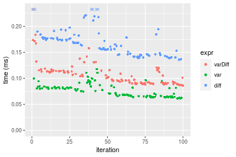
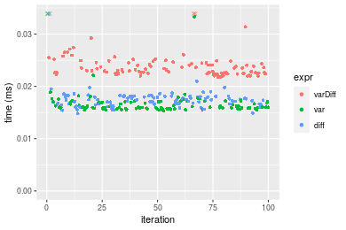
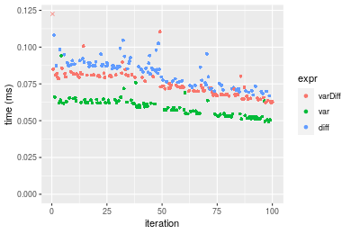

[matrixStats]: Benchmark report

---------------------------------------


# varDiff() benchmarks

This report benchmark the performance of varDiff() against alternative methods.

## Alternative methods

* N/A


## Data type "integer"
### Data
```r
> rvector <- function(n, mode = c("logical", "double", "integer"), range = c(-100, +100), na_prob = 0) {
+     mode <- match.arg(mode)
+     if (mode == "logical") {
+         x <- sample(c(FALSE, TRUE), size = n, replace = TRUE)
+     }     else {
+         x <- runif(n, min = range[1], max = range[2])
+     }
+     storage.mode(x) <- mode
+     if (na_prob > 0) 
+         x[sample(n, size = na_prob * n)] <- NA
+     x
+ }
> rvectors <- function(scale = 10, seed = 1, ...) {
+     set.seed(seed)
+     data <- list()
+     data[[1]] <- rvector(n = scale * 100, ...)
+     data[[2]] <- rvector(n = scale * 1000, ...)
+     data[[3]] <- rvector(n = scale * 10000, ...)
+     data[[4]] <- rvector(n = scale * 1e+05, ...)
+     data[[5]] <- rvector(n = scale * 1e+06, ...)
+     names(data) <- sprintf("n = %d", sapply(data, FUN = length))
+     data
+ }
> data <- rvectors(mode = mode)
> data <- data[1:4]
```

### Results

### n = 1000 vector

#### All elements
```r
> x <- data[["n = 1000"]]
> stats <- microbenchmark(varDiff = varDiff(x), var = var(x), diff = diff(x), unit = "ms")
```

_Table: Benchmarking of varDiff(), var() and diff() on integer+n = 1000 data. The top panel shows times in milliseconds and the bottom panel shows relative times._


|   |expr    |      min|        lq|      mean|    median|        uq|      max|
|:--|:-------|--------:|---------:|---------:|---------:|---------:|--------:|
|2  |var     | 0.017263| 0.0178385| 0.0188864| 0.0182005| 0.0189145| 0.059060|
|3  |diff    | 0.018631| 0.0198580| 0.0213724| 0.0207305| 0.0216830| 0.048038|
|1  |varDiff | 0.025264| 0.0258230| 0.0272910| 0.0269710| 0.0279700| 0.050698|


|   |expr    |      min|       lq|     mean|   median|       uq|       max|
|:--|:-------|--------:|--------:|--------:|--------:|--------:|---------:|
|2  |var     | 1.000000| 1.000000| 1.000000| 1.000000| 1.000000| 1.0000000|
|3  |diff    | 1.079245| 1.113210| 1.131626| 1.139007| 1.146369| 0.8133762|
|1  |varDiff | 1.463477| 1.447599| 1.445007| 1.481882| 1.478760| 0.8584152|

_Figure: Benchmarking of varDiff(), var() and diff() on integer+n = 1000 data.  Outliers are displayed as crosses.  Times are in milliseconds._


### n = 10000 vector

#### All elements
```r
> x <- data[["n = 10000"]]
> stats <- microbenchmark(varDiff = varDiff(x), var = var(x), diff = diff(x), unit = "ms")
```

_Table: Benchmarking of varDiff(), var() and diff() on integer+n = 10000 data. The top panel shows times in milliseconds and the bottom panel shows relative times._


|   |expr    |      min|        lq|      mean|    median|        uq|      max|
|:--|:-------|--------:|---------:|---------:|---------:|---------:|--------:|
|2  |var     | 0.061549| 0.0658010| 0.0772253| 0.0771285| 0.0829330| 0.117829|
|1  |varDiff | 0.086036| 0.0914765| 0.1084281| 0.1030400| 0.1145355| 0.270556|
|3  |diff    | 0.136121| 0.1465270| 0.1715013| 0.1679355| 0.1787390| 0.288329|


|   |expr    |      min|       lq|     mean|   median|       uq|      max|
|:--|:-------|--------:|--------:|--------:|--------:|--------:|--------:|
|2  |var     | 1.000000| 1.000000| 1.000000| 1.000000| 1.000000| 1.000000|
|1  |varDiff | 1.397846| 1.390199| 1.404049| 1.335952| 1.381061| 2.296175|
|3  |diff    | 2.211587| 2.226820| 2.220791| 2.177347| 2.155222| 2.447012|

_Figure: Benchmarking of varDiff(), var() and diff() on integer+n = 10000 data.  Outliers are displayed as crosses.  Times are in milliseconds._



### n = 100000 vector

#### All elements
```r
> x <- data[["n = 100000"]]
> stats <- microbenchmark(varDiff = varDiff(x), var = var(x), diff = diff(x), unit = "ms")
```

_Table: Benchmarking of varDiff(), var() and diff() on integer+n = 100000 data. The top panel shows times in milliseconds and the bottom panel shows relative times._


|   |expr    |      min|       lq|      mean|    median|       uq|      max|
|:--|:-------|--------:|--------:|---------:|---------:|--------:|--------:|
|2  |var     | 0.431308| 0.462691| 0.5831113| 0.5545305| 0.713080| 1.008892|
|1  |varDiff | 0.586627| 0.604608| 0.8273098| 0.7255340| 0.858775| 7.446869|
|3  |diff    | 1.033404| 1.195533| 1.5823960| 1.3441620| 2.049228| 7.357465|


|   |expr    |      min|       lq|     mean|   median|       uq|      max|
|:--|:-------|--------:|--------:|--------:|--------:|--------:|--------:|
|2  |var     | 1.000000| 1.000000| 1.000000| 1.000000| 1.000000| 1.000000|
|1  |varDiff | 1.360112| 1.306721| 1.418785| 1.308375| 1.204318| 7.381235|
|3  |diff    | 2.395977| 2.583868| 2.713712| 2.423964| 2.873769| 7.292619|

_Figure: Benchmarking of varDiff(), var() and diff() on integer+n = 100000 data.  Outliers are displayed as crosses.  Times are in milliseconds._


### n = 1000000 vector

#### All elements
```r
> x <- data[["n = 1000000"]]
> stats <- microbenchmark(varDiff = varDiff(x), var = var(x), diff = diff(x), unit = "ms")
```

_Table: Benchmarking of varDiff(), var() and diff() on integer+n = 1000000 data. The top panel shows times in milliseconds and the bottom panel shows relative times._


|   |expr    |       min|        lq|      mean|    median|        uq|      max|
|:--|:-------|---------:|---------:|---------:|---------:|---------:|--------:|
|2  |var     |  4.750307|  5.166704|  5.893678|  5.490694|  5.815732| 13.54519|
|1  |varDiff |  6.524512|  6.974064|  8.068979|  7.444474|  7.972615| 30.54505|
|3  |diff    | 11.344527| 12.450922| 15.369838| 13.484686| 19.657373| 25.57203|


|   |expr    |      min|       lq|     mean|   median|       uq|      max|
|:--|:-------|--------:|--------:|--------:|--------:|--------:|--------:|
|2  |var     | 1.000000| 1.000000| 1.000000| 1.000000| 1.000000| 1.000000|
|1  |varDiff | 1.373493| 1.349809| 1.369091| 1.355835| 1.370871| 2.255048|
|3  |diff    | 2.388167| 2.409839| 2.607852| 2.455916| 3.380034| 1.887905|

_Figure: Benchmarking of varDiff(), var() and diff() on integer+n = 1000000 data.  Outliers are displayed as crosses.  Times are in milliseconds._


## Data type "double"
### Data
```r
> rvector <- function(n, mode = c("logical", "double", "integer"), range = c(-100, +100), na_prob = 0) {
+     mode <- match.arg(mode)
+     if (mode == "logical") {
+         x <- sample(c(FALSE, TRUE), size = n, replace = TRUE)
+     }     else {
+         x <- runif(n, min = range[1], max = range[2])
+     }
+     storage.mode(x) <- mode
+     if (na_prob > 0) 
+         x[sample(n, size = na_prob * n)] <- NA
+     x
+ }
> rvectors <- function(scale = 10, seed = 1, ...) {
+     set.seed(seed)
+     data <- list()
+     data[[1]] <- rvector(n = scale * 100, ...)
+     data[[2]] <- rvector(n = scale * 1000, ...)
+     data[[3]] <- rvector(n = scale * 10000, ...)
+     data[[4]] <- rvector(n = scale * 1e+05, ...)
+     data[[5]] <- rvector(n = scale * 1e+06, ...)
+     names(data) <- sprintf("n = %d", sapply(data, FUN = length))
+     data
+ }
> data <- rvectors(mode = mode)
> data <- data[1:4]
```

### Results

### n = 1000 vector

#### All elements
```r
> x <- data[["n = 1000"]]
> stats <- microbenchmark(varDiff = varDiff(x), var = var(x), diff = diff(x), unit = "ms")
```

_Table: Benchmarking of varDiff(), var() and diff() on double+n = 1000 data. The top panel shows times in milliseconds and the bottom panel shows relative times._


|   |expr    |      min|       lq|      mean|    median|       uq|      max|
|:--|:-------|--------:|--------:|---------:|---------:|--------:|--------:|
|2  |var     | 0.015324| 0.015781| 0.0169349| 0.0159940| 0.017029| 0.054035|
|3  |diff    | 0.014798| 0.016656| 0.0176397| 0.0174040| 0.018085| 0.046717|
|1  |varDiff | 0.021714| 0.022524| 0.0241851| 0.0231655| 0.024547| 0.045064|


|   |expr    |       min|       lq|     mean|   median|       uq|       max|
|:--|:-------|---------:|--------:|--------:|--------:|--------:|---------:|
|2  |var     | 1.0000000| 1.000000| 1.000000| 1.000000| 1.000000| 1.0000000|
|3  |diff    | 0.9656748| 1.055446| 1.041621| 1.088158| 1.062012| 0.8645693|
|1  |varDiff | 1.4169930| 1.427286| 1.428122| 1.448387| 1.441482| 0.8339780|

_Figure: Benchmarking of varDiff(), var() and diff() on double+n = 1000 data.  Outliers are displayed as crosses.  Times are in milliseconds._



### n = 10000 vector

#### All elements
```r
> x <- data[["n = 10000"]]
> stats <- microbenchmark(varDiff = varDiff(x), var = var(x), diff = diff(x), unit = "ms")
```

_Table: Benchmarking of varDiff(), var() and diff() on double+n = 10000 data. The top panel shows times in milliseconds and the bottom panel shows relative times._


|   |expr    |      min|        lq|      mean|    median|        uq|      max|
|:--|:-------|--------:|---------:|---------:|---------:|---------:|--------:|
|2  |var     | 0.049441| 0.0533505| 0.0588828| 0.0590235| 0.0622830| 0.094233|
|1  |varDiff | 0.062076| 0.0679135| 0.0754562| 0.0729925| 0.0807265| 0.167566|
|3  |diff    | 0.066900| 0.0747475| 0.0830154| 0.0850790| 0.0883370| 0.108227|


|   |expr    |      min|       lq|     mean|   median|       uq|      max|
|:--|:-------|--------:|--------:|--------:|--------:|--------:|--------:|
|2  |var     | 1.000000| 1.000000| 1.000000| 1.000000| 1.000000| 1.000000|
|1  |varDiff | 1.255557| 1.272968| 1.281465| 1.236668| 1.296124| 1.778209|
|3  |diff    | 1.353128| 1.401065| 1.409842| 1.441443| 1.418316| 1.148504|

_Figure: Benchmarking of varDiff(), var() and diff() on double+n = 10000 data.  Outliers are displayed as crosses.  Times are in milliseconds._



### n = 100000 vector

#### All elements
```r
> x <- data[["n = 100000"]]
> stats <- microbenchmark(varDiff = varDiff(x), var = var(x), diff = diff(x), unit = "ms")
```

_Table: Benchmarking of varDiff(), var() and diff() on double+n = 100000 data. The top panel shows times in milliseconds and the bottom panel shows relative times._


|   |expr    |      min|       lq|      mean|    median|        uq|      max|
|:--|:-------|--------:|--------:|---------:|---------:|---------:|--------:|
|2  |var     | 0.326733| 0.353135| 0.4040287| 0.4083090| 0.4307145| 0.598747|
|1  |varDiff | 0.411866| 0.474849| 0.5457040| 0.5212120| 0.5764060| 0.812143|
|3  |diff    | 0.515145| 0.615211| 1.0233537| 0.6881855| 0.8975840| 7.984266|


|   |expr    |      min|       lq|     mean|   median|       uq|       max|
|:--|:-------|--------:|--------:|--------:|--------:|--------:|---------:|
|2  |var     | 1.000000| 1.000000| 1.000000| 1.000000| 1.000000|  1.000000|
|1  |varDiff | 1.260558| 1.344667| 1.350656| 1.276514| 1.338255|  1.356404|
|3  |diff    | 1.576654| 1.742141| 2.532874| 1.685453| 2.083942| 13.334958|

_Figure: Benchmarking of varDiff(), var() and diff() on double+n = 100000 data.  Outliers are displayed as crosses.  Times are in milliseconds._


### n = 1000000 vector

#### All elements
```r
> x <- data[["n = 1000000"]]
> stats <- microbenchmark(varDiff = varDiff(x), var = var(x), diff = diff(x), unit = "ms")
```

_Table: Benchmarking of varDiff(), var() and diff() on double+n = 1000000 data. The top panel shows times in milliseconds and the bottom panel shows relative times._


|   |expr    |      min|       lq|     mean|   median|        uq|       max|
|:--|:-------|--------:|--------:|--------:|--------:|---------:|---------:|
|2  |var     | 3.667983| 4.397274|  4.62480| 4.560160|  4.844445|  5.584471|
|1  |varDiff | 5.217178| 5.504392|  6.41692| 5.689897|  6.244734| 21.075055|
|3  |diff    | 7.226720| 7.597451| 10.51134| 8.235660| 14.475874| 21.908809|


|   |expr    |      min|       lq|     mean|   median|       uq|      max|
|:--|:-------|--------:|--------:|--------:|--------:|--------:|--------:|
|2  |var     | 1.000000| 1.000000| 1.000000| 1.000000| 1.000000| 1.000000|
|1  |varDiff | 1.422356| 1.251774| 1.387502| 1.247741| 1.289050| 3.773868|
|3  |diff    | 1.970216| 1.727764| 2.272821| 1.806002| 2.988138| 3.923166|

_Figure: Benchmarking of varDiff(), var() and diff() on double+n = 1000000 data.  Outliers are displayed as crosses.  Times are in milliseconds._


## Appendix

### Session information
```r
R version 4.1.1 Patched (2021-08-10 r80727)
Platform: x86_64-pc-linux-gnu (64-bit)
Running under: Ubuntu 18.04.5 LTS

Matrix products: default
BLAS:   /home/hb/software/R-devel/R-4-1-branch/lib/R/lib/libRblas.so
LAPACK: /home/hb/software/R-devel/R-4-1-branch/lib/R/lib/libRlapack.so

locale:
 [1] LC_CTYPE=en_US.UTF-8       LC_NUMERIC=C              
 [3] LC_TIME=en_US.UTF-8        LC_COLLATE=en_US.UTF-8    
 [5] LC_MONETARY=en_US.UTF-8    LC_MESSAGES=en_US.UTF-8   
 [7] LC_PAPER=en_US.UTF-8       LC_NAME=C                 
 [9] LC_ADDRESS=C               LC_TELEPHONE=C            
[11] LC_MEASUREMENT=en_US.UTF-8 LC_IDENTIFICATION=C       

attached base packages:
[1] stats     graphics  grDevices utils     datasets  methods   base     

other attached packages:
[1] microbenchmark_1.4-7   matrixStats_0.60.0     ggplot2_3.3.5         
[4] knitr_1.33             R.devices_2.17.0       R.utils_2.10.1        
[7] R.oo_1.24.0            R.methodsS3_1.8.1-9001 history_0.0.1-9000    

loaded via a namespace (and not attached):
 [1] Biobase_2.52.0          httr_1.4.2              splines_4.1.1          
 [4] bit64_4.0.5             network_1.17.1          assertthat_0.2.1       
 [7] highr_0.9               stats4_4.1.1            blob_1.2.2             
[10] GenomeInfoDbData_1.2.6  robustbase_0.93-8       pillar_1.6.2           
[13] RSQLite_2.2.8           lattice_0.20-44         glue_1.4.2             
[16] digest_0.6.27           XVector_0.32.0          colorspace_2.0-2       
[19] Matrix_1.3-4            XML_3.99-0.7            pkgconfig_2.0.3        
[22] zlibbioc_1.38.0         genefilter_1.74.0       purrr_0.3.4            
[25] ergm_4.1.2              xtable_1.8-4            scales_1.1.1           
[28] tibble_3.1.4            annotate_1.70.0         KEGGREST_1.32.0        
[31] farver_2.1.0            generics_0.1.0          IRanges_2.26.0         
[34] ellipsis_0.3.2          cachem_1.0.6            withr_2.4.2            
[37] BiocGenerics_0.38.0     mime_0.11               survival_3.2-13        
[40] magrittr_2.0.1          crayon_1.4.1            statnet.common_4.5.0   
[43] memoise_2.0.0           laeken_0.5.1            fansi_0.5.0            
[46] R.cache_0.15.0          MASS_7.3-54             R.rsp_0.44.0           
[49] progressr_0.8.0         tools_4.1.1             lifecycle_1.0.0        
[52] S4Vectors_0.30.0        trust_0.1-8             munsell_0.5.0          
[55] tabby_0.0.1-9001        AnnotationDbi_1.54.1    Biostrings_2.60.2      
[58] compiler_4.1.1          GenomeInfoDb_1.28.1     rlang_0.4.11           
[61] grid_4.1.1              RCurl_1.98-1.4          cwhmisc_6.6            
[64] rstudioapi_0.13         rappdirs_0.3.3          startup_0.15.0-9000    
[67] labeling_0.4.2          bitops_1.0-7            base64enc_0.1-3        
[70] boot_1.3-28             gtable_0.3.0            DBI_1.1.1              
[73] markdown_1.1            R6_2.5.1                lpSolveAPI_5.5.2.0-17.7
[76] rle_0.9.2               dplyr_1.0.7             fastmap_1.1.0          
[79] bit_4.0.4               utf8_1.2.2              parallel_4.1.1         
[82] Rcpp_1.0.7              vctrs_0.3.8             png_0.1-7              
[85] DEoptimR_1.0-9          tidyselect_1.1.1        xfun_0.25              
[88] coda_0.19-4            
```
Total processing time was 14.04 secs.


### Reproducibility
To reproduce this report, do:
```r
html <- matrixStats:::benchmark('varDiff')
```

[RSP]: https://cran.r-project.org/package=R.rsp
[matrixStats]: https://cran.r-project.org/package=matrixStats

[StackOverflow:colMins?]: https://stackoverflow.com/questions/13676878 "Stack Overflow: fastest way to get Min from every column in a matrix?"
[StackOverflow:colSds?]: https://stackoverflow.com/questions/17549762 "Stack Overflow: Is there such 'colsd' in R?"
[StackOverflow:rowProds?]: https://stackoverflow.com/questions/20198801/ "Stack Overflow: Row product of matrix and column sum of matrix"

---------------------------------------
Copyright Henrik Bengtsson. Last updated on 2021-08-25 22:52:08 (+0200 UTC). Powered by [RSP].

<script>
 var link = document.createElement('link');
 link.rel = 'icon';
 link.href = "data:image/png;base64,iVBORw0KGgoAAAANSUhEUgAAACAAAAAgCAMAAABEpIrGAAAA21BMVEUAAAAAAP8AAP8AAP8AAP8AAP8AAP8AAP8AAP8AAP8AAP8AAP8AAP8AAP8AAP8AAP8AAP8AAP8AAP8AAP8AAP8AAP8AAP8AAP8AAP8AAP8AAP8AAP8AAP8AAP8AAP8AAP8AAP8AAP8AAP8AAP8AAP8AAP8AAP8AAP8AAP8AAP8BAf4CAv0DA/wdHeIeHuEfH+AgIN8hId4lJdomJtknJ9g+PsE/P8BAQL9yco10dIt1dYp3d4h4eIeVlWqWlmmXl2iYmGeZmWabm2Tn5xjo6Bfp6Rb39wj4+Af//wA2M9hbAAAASXRSTlMAAQIJCgsMJSYnKD4/QGRlZmhpamtsbautrrCxuru8y8zN5ebn6Pn6+///////////////////////////////////////////LsUNcQAAAS9JREFUOI29k21XgkAQhVcFytdSMqMETU26UVqGmpaiFbL//xc1cAhhwVNf6n5i5z67M2dmYOyfJZUqlVLhkKucG7cgmUZTybDz6g0iDeq51PUr37Ds2cy2/C9NeES5puDjxuUk1xnToZsg8pfA3avHQ3lLIi7iWRrkv/OYtkScxBIMgDee0ALoyxHQBJ68JLCjOtQIMIANF7QG9G9fNnHvisCHBVMKgSJgiz7nE+AoBKrAPA3MgepvgR9TSCasrCKH0eB1wBGBFdCO+nAGjMVGPcQb5bd6mQRegN6+1axOs9nGfYcCtfi4NQosdtH7dB+txFIpXQqN1p9B/asRHToyS0jRgpV7nk4nwcq1BJ+x3Gl/v7S9Wmpp/aGquum7w3ZDyrADFYrl8vHBH+ev9AUASW1dmU4h4wAAAABJRU5ErkJggg=="
 document.getElementsByTagName('head')[0].appendChild(link);
</script>


