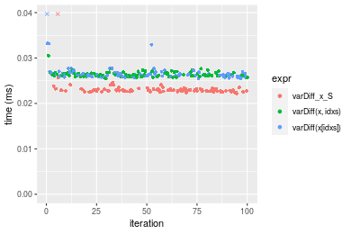
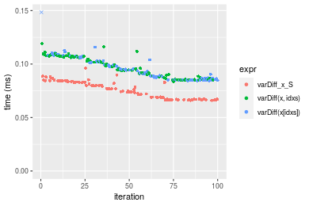

[matrixStats]: Benchmark report

---------------------------------------


# varDiff() benchmarks on subsetted computation

This report benchmark the performance of varDiff() on subsetted computation.


## Data type "integer"
### Data
```r
> rvector <- function(n, mode = c("logical", "double", "integer"), range = c(-100, +100), na_prob = 0) {
+     mode <- match.arg(mode)
+     if (mode == "logical") {
+         x <- sample(c(FALSE, TRUE), size = n, replace = TRUE)
+     }     else {
+         x <- runif(n, min = range[1], max = range[2])
+     }
+     storage.mode(x) <- mode
+     if (na_prob > 0) 
+         x[sample(n, size = na_prob * n)] <- NA
+     x
+ }
> rvectors <- function(scale = 10, seed = 1, ...) {
+     set.seed(seed)
+     data <- list()
+     data[[1]] <- rvector(n = scale * 100, ...)
+     data[[2]] <- rvector(n = scale * 1000, ...)
+     data[[3]] <- rvector(n = scale * 10000, ...)
+     data[[4]] <- rvector(n = scale * 1e+05, ...)
+     data[[5]] <- rvector(n = scale * 1e+06, ...)
+     names(data) <- sprintf("n = %d", sapply(data, FUN = length))
+     data
+ }
> data <- rvectors(mode = mode)
> data <- data[1:4]
```

### Results

### n = 1000 vector

#### All elements
```r
> x <- data[["n = 1000"]]
> idxs <- sample.int(length(x), size = length(x) * 0.7)
> x_S <- x[idxs]
> gc()
           used  (Mb) gc trigger  (Mb) max used  (Mb)
Ncells  5362844 286.5    7916910 422.9  7916910 422.9
Vcells 11153947  85.1   39038428 297.9 94934136 724.3
> stats <- microbenchmark(varDiff_x_S = varDiff(x_S), `varDiff(x, idxs)` = varDiff(x, idxs = idxs), 
+     `varDiff(x[idxs])` = varDiff(x[idxs]), unit = "ms")
```

_Table: Benchmarking of varDiff_x_S(), varDiff(x, idxs)() and varDiff(x[idxs])() on integer+n = 1000 data. The top panel shows times in milliseconds and the bottom panel shows relative times._


|   |expr             |      min|        lq|      mean|    median|       uq|      max|
|:--|:----------------|--------:|---------:|---------:|---------:|--------:|--------:|
|1  |varDiff_x_S      | 0.022212| 0.0226885| 0.0236181| 0.0228800| 0.023157| 0.087388|
|3  |varDiff(x[idxs]) | 0.025511| 0.0260000| 0.0290972| 0.0262840| 0.026625| 0.281070|
|2  |varDiff(x, idxs) | 0.025429| 0.0260535| 0.0264321| 0.0263085| 0.026717| 0.030500|


|   |expr             |      min|       lq|     mean|   median|       uq|       max|
|:--|:----------------|--------:|--------:|--------:|--------:|--------:|---------:|
|1  |varDiff_x_S      | 1.000000| 1.000000| 1.000000| 1.000000| 1.000000| 1.0000000|
|3  |varDiff(x[idxs]) | 1.148523| 1.145955| 1.231988| 1.148776| 1.149760| 3.2163455|
|2  |varDiff(x, idxs) | 1.144832| 1.148313| 1.119146| 1.149847| 1.153733| 0.3490182|

_Figure: Benchmarking of varDiff_x_S(), varDiff(x, idxs)() and varDiff(x[idxs])() on integer+n = 1000 data.  Outliers are displayed as crosses.  Times are in milliseconds._



### n = 10000 vector

#### All elements
```r
> x <- data[["n = 10000"]]
> idxs <- sample.int(length(x), size = length(x) * 0.7)
> x_S <- x[idxs]
> gc()
           used  (Mb) gc trigger  (Mb) max used  (Mb)
Ncells  5359912 286.3    7916910 422.9  7916910 422.9
Vcells 10899708  83.2   39038428 297.9 94934136 724.3
> stats <- microbenchmark(varDiff_x_S = varDiff(x_S), `varDiff(x, idxs)` = varDiff(x, idxs = idxs), 
+     `varDiff(x[idxs])` = varDiff(x[idxs]), unit = "ms")
```

_Table: Benchmarking of varDiff_x_S(), varDiff(x, idxs)() and varDiff(x[idxs])() on integer+n = 10000 data. The top panel shows times in milliseconds and the bottom panel shows relative times._


|   |expr             |      min|        lq|      mean|    median|        uq|      max|
|:--|:----------------|--------:|---------:|---------:|---------:|---------:|--------:|
|1  |varDiff_x_S      | 0.066079| 0.0671120| 0.0757118| 0.0753615| 0.0830735| 0.096079|
|3  |varDiff(x[idxs]) | 0.084400| 0.0867175| 0.0959805| 0.0942560| 0.1029010| 0.181812|
|2  |varDiff(x, idxs) | 0.083807| 0.0856580| 0.0961852| 0.0946705| 0.1064495| 0.119259|


|   |expr             |      min|       lq|     mean|   median|       uq|      max|
|:--|:----------------|--------:|--------:|--------:|--------:|--------:|--------:|
|1  |varDiff_x_S      | 1.000000| 1.000000| 1.000000| 1.000000| 1.000000| 1.000000|
|3  |varDiff(x[idxs]) | 1.277259| 1.292131| 1.267709| 1.250718| 1.238674| 1.892318|
|2  |varDiff(x, idxs) | 1.268285| 1.276344| 1.270412| 1.256218| 1.281389| 1.241260|

_Figure: Benchmarking of varDiff_x_S(), varDiff(x, idxs)() and varDiff(x[idxs])() on integer+n = 10000 data.  Outliers are displayed as crosses.  Times are in milliseconds._



### n = 100000 vector

#### All elements
```r
> x <- data[["n = 100000"]]
> idxs <- sample.int(length(x), size = length(x) * 0.7)
> x_S <- x[idxs]
> gc()
           used  (Mb) gc trigger  (Mb) max used  (Mb)
Ncells  5359984 286.3    7916910 422.9  7916910 422.9
Vcells 10963268  83.7   39038428 297.9 94934136 724.3
> stats <- microbenchmark(varDiff_x_S = varDiff(x_S), `varDiff(x, idxs)` = varDiff(x, idxs = idxs), 
+     `varDiff(x[idxs])` = varDiff(x[idxs]), unit = "ms")
```

_Table: Benchmarking of varDiff_x_S(), varDiff(x, idxs)() and varDiff(x[idxs])() on integer+n = 100000 data. The top panel shows times in milliseconds and the bottom panel shows relative times._


|   |expr             |      min|        lq|      mean|   median|        uq|       max|
|:--|:----------------|--------:|---------:|---------:|--------:|---------:|---------:|
|1  |varDiff_x_S      | 0.413811| 0.5045290| 0.5857393| 0.544012| 0.6621690|  1.213714|
|3  |varDiff(x[idxs]) | 0.561553| 0.6705570| 0.9228240| 0.789193| 0.8980275| 13.785594|
|2  |varDiff(x, idxs) | 0.560413| 0.7139785| 0.7980298| 0.835218| 0.8945030|  0.995830|


|   |expr             |      min|       lq|     mean|   median|       uq|        max|
|:--|:----------------|--------:|--------:|--------:|--------:|--------:|----------:|
|1  |varDiff_x_S      | 1.000000| 1.000000| 1.000000| 1.000000| 1.000000|  1.0000000|
|3  |varDiff(x[idxs]) | 1.357028| 1.329075| 1.575486| 1.450690| 1.356191| 11.3581898|
|2  |varDiff(x, idxs) | 1.354273| 1.415139| 1.362432| 1.535293| 1.350868|  0.8204816|

_Figure: Benchmarking of varDiff_x_S(), varDiff(x, idxs)() and varDiff(x[idxs])() on integer+n = 100000 data.  Outliers are displayed as crosses.  Times are in milliseconds._


### n = 1000000 vector

#### All elements
```r
> x <- data[["n = 1000000"]]
> idxs <- sample.int(length(x), size = length(x) * 0.7)
> x_S <- x[idxs]
> gc()
           used  (Mb) gc trigger  (Mb) max used  (Mb)
Ncells  5360056 286.3    7916910 422.9  7916910 422.9
Vcells 11593317  88.5   39038428 297.9 94934136 724.3
> stats <- microbenchmark(varDiff_x_S = varDiff(x_S), `varDiff(x, idxs)` = varDiff(x, idxs = idxs), 
+     `varDiff(x[idxs])` = varDiff(x[idxs]), unit = "ms")
```

_Table: Benchmarking of varDiff_x_S(), varDiff(x, idxs)() and varDiff(x[idxs])() on integer+n = 1000000 data. The top panel shows times in milliseconds and the bottom panel shows relative times._


|   |expr             |      min|       lq|      mean|   median|       uq|      max|
|:--|:----------------|--------:|--------:|---------:|--------:|--------:|--------:|
|1  |varDiff_x_S      | 4.635450| 5.266083|  5.782645| 5.402392|  5.53224| 12.76769|
|2  |varDiff(x, idxs) | 8.392257| 8.700843| 10.176747| 8.977796| 10.06822| 36.72024|
|3  |varDiff(x[idxs]) | 8.040496| 8.723145| 10.411642| 9.023121| 11.38572| 18.65386|


|   |expr             |      min|       lq|     mean|   median|       uq|      max|
|:--|:----------------|--------:|--------:|--------:|--------:|--------:|--------:|
|1  |varDiff_x_S      | 1.000000| 1.000000| 1.000000| 1.000000| 1.000000| 1.000000|
|2  |varDiff(x, idxs) | 1.810451| 1.652242| 1.759878| 1.661819| 1.819917| 2.876029|
|3  |varDiff(x[idxs]) | 1.734566| 1.656477| 1.800498| 1.670209| 2.058066| 1.461021|

_Figure: Benchmarking of varDiff_x_S(), varDiff(x, idxs)() and varDiff(x[idxs])() on integer+n = 1000000 data.  Outliers are displayed as crosses.  Times are in milliseconds._


## Data type "double"
### Data
```r
> rvector <- function(n, mode = c("logical", "double", "integer"), range = c(-100, +100), na_prob = 0) {
+     mode <- match.arg(mode)
+     if (mode == "logical") {
+         x <- sample(c(FALSE, TRUE), size = n, replace = TRUE)
+     }     else {
+         x <- runif(n, min = range[1], max = range[2])
+     }
+     storage.mode(x) <- mode
+     if (na_prob > 0) 
+         x[sample(n, size = na_prob * n)] <- NA
+     x
+ }
> rvectors <- function(scale = 10, seed = 1, ...) {
+     set.seed(seed)
+     data <- list()
+     data[[1]] <- rvector(n = scale * 100, ...)
+     data[[2]] <- rvector(n = scale * 1000, ...)
+     data[[3]] <- rvector(n = scale * 10000, ...)
+     data[[4]] <- rvector(n = scale * 1e+05, ...)
+     data[[5]] <- rvector(n = scale * 1e+06, ...)
+     names(data) <- sprintf("n = %d", sapply(data, FUN = length))
+     data
+ }
> data <- rvectors(mode = mode)
> data <- data[1:4]
```

### Results

### n = 1000 vector

#### All elements
```r
> x <- data[["n = 1000"]]
> idxs <- sample.int(length(x), size = length(x) * 0.7)
> x_S <- x[idxs]
> gc()
           used  (Mb) gc trigger  (Mb) max used  (Mb)
Ncells  5360131 286.3    7916910 422.9  7916910 422.9
Vcells 11450125  87.4   39038428 297.9 94934136 724.3
> stats <- microbenchmark(varDiff_x_S = varDiff(x_S), `varDiff(x, idxs)` = varDiff(x, idxs = idxs), 
+     `varDiff(x[idxs])` = varDiff(x[idxs]), unit = "ms")
```

_Table: Benchmarking of varDiff_x_S(), varDiff(x, idxs)() and varDiff(x[idxs])() on double+n = 1000 data. The top panel shows times in milliseconds and the bottom panel shows relative times._


|   |expr             |      min|        lq|      mean|    median|        uq|      max|
|:--|:----------------|--------:|---------:|---------:|---------:|---------:|--------:|
|1  |varDiff_x_S      | 0.019873| 0.0202375| 0.0205991| 0.0204165| 0.0208305| 0.022106|
|2  |varDiff(x, idxs) | 0.022824| 0.0232165| 0.0238168| 0.0234755| 0.0237265| 0.040249|
|3  |varDiff(x[idxs]) | 0.022967| 0.0233720| 0.0242683| 0.0236040| 0.0238445| 0.080263|


|   |expr             |      min|       lq|     mean|   median|       uq|      max|
|:--|:----------------|--------:|--------:|--------:|--------:|--------:|--------:|
|1  |varDiff_x_S      | 1.000000| 1.000000| 1.000000| 1.000000| 1.000000| 1.000000|
|2  |varDiff(x, idxs) | 1.148493| 1.147202| 1.156203| 1.149830| 1.139027| 1.820727|
|3  |varDiff(x[idxs]) | 1.155689| 1.154886| 1.178122| 1.156124| 1.144692| 3.630824|

_Figure: Benchmarking of varDiff_x_S(), varDiff(x, idxs)() and varDiff(x[idxs])() on double+n = 1000 data.  Outliers are displayed as crosses.  Times are in milliseconds._


### n = 10000 vector

#### All elements
```r
> x <- data[["n = 10000"]]
> idxs <- sample.int(length(x), size = length(x) * 0.7)
> x_S <- x[idxs]
> gc()
           used  (Mb) gc trigger  (Mb) max used  (Mb)
Ncells  5360200 286.3    7916910 422.9  7916910 422.9
Vcells 11459871  87.5   39038428 297.9 94934136 724.3
> stats <- microbenchmark(varDiff_x_S = varDiff(x_S), `varDiff(x, idxs)` = varDiff(x, idxs = idxs), 
+     `varDiff(x[idxs])` = varDiff(x[idxs]), unit = "ms")
```

_Table: Benchmarking of varDiff_x_S(), varDiff(x, idxs)() and varDiff(x[idxs])() on double+n = 10000 data. The top panel shows times in milliseconds and the bottom panel shows relative times._


|   |expr             |      min|        lq|      mean|    median|        uq|      max|
|:--|:----------------|--------:|---------:|---------:|---------:|---------:|--------:|
|1  |varDiff_x_S      | 0.051286| 0.0566970| 0.0604725| 0.0604575| 0.0612570| 0.119799|
|2  |varDiff(x, idxs) | 0.070962| 0.0764785| 0.0825251| 0.0808835| 0.0832660| 0.159821|
|3  |varDiff(x[idxs]) | 0.068973| 0.0763860| 0.0826795| 0.0809315| 0.0841145| 0.157204|


|   |expr             |      min|       lq|     mean|   median|       uq|      max|
|:--|:----------------|--------:|--------:|--------:|--------:|--------:|--------:|
|1  |varDiff_x_S      | 1.000000| 1.000000| 1.000000| 1.000000| 1.000000| 1.000000|
|2  |varDiff(x, idxs) | 1.383652| 1.348899| 1.364672| 1.337857| 1.359290| 1.334076|
|3  |varDiff(x[idxs]) | 1.344870| 1.347267| 1.367225| 1.338651| 1.373141| 1.312231|

_Figure: Benchmarking of varDiff_x_S(), varDiff(x, idxs)() and varDiff(x[idxs])() on double+n = 10000 data.  Outliers are displayed as crosses.  Times are in milliseconds._


### n = 100000 vector

#### All elements
```r
> x <- data[["n = 100000"]]
> idxs <- sample.int(length(x), size = length(x) * 0.7)
> x_S <- x[idxs]
> gc()
           used  (Mb) gc trigger  (Mb) max used  (Mb)
Ncells  5360272 286.3    7916910 422.9  7916910 422.9
Vcells 11554724  88.2   39038428 297.9 94934136 724.3
> stats <- microbenchmark(varDiff_x_S = varDiff(x_S), `varDiff(x, idxs)` = varDiff(x, idxs = idxs), 
+     `varDiff(x[idxs])` = varDiff(x[idxs]), unit = "ms")
```

_Table: Benchmarking of varDiff_x_S(), varDiff(x, idxs)() and varDiff(x[idxs])() on double+n = 100000 data. The top panel shows times in milliseconds and the bottom panel shows relative times._


|   |expr             |      min|        lq|      mean|    median|        uq|      max|
|:--|:----------------|--------:|---------:|---------:|---------:|---------:|--------:|
|1  |varDiff_x_S      | 0.288761| 0.3207845| 0.4215957| 0.3459820| 0.3860495| 6.478759|
|2  |varDiff(x, idxs) | 0.462206| 0.4887105| 0.5596582| 0.5506450| 0.5942060| 0.767178|
|3  |varDiff(x[idxs]) | 0.462960| 0.5058240| 0.5859137| 0.5544025| 0.6596335| 0.924736|


|   |expr             |      min|       lq|     mean|   median|       uq|       max|
|:--|:----------------|--------:|--------:|--------:|--------:|--------:|---------:|
|1  |varDiff_x_S      | 1.000000| 1.000000| 1.000000| 1.000000| 1.000000| 1.0000000|
|2  |varDiff(x, idxs) | 1.600652| 1.523485| 1.327476| 1.591542| 1.539196| 0.1184143|
|3  |varDiff(x[idxs]) | 1.603264| 1.576834| 1.389752| 1.602403| 1.708676| 0.1427335|

_Figure: Benchmarking of varDiff_x_S(), varDiff(x, idxs)() and varDiff(x[idxs])() on double+n = 100000 data.  Outliers are displayed as crosses.  Times are in milliseconds._


### n = 1000000 vector

#### All elements
```r
> x <- data[["n = 1000000"]]
> idxs <- sample.int(length(x), size = length(x) * 0.7)
> x_S <- x[idxs]
> gc()
           used  (Mb) gc trigger  (Mb) max used  (Mb)
Ncells  5360344 286.3    7916910 422.9  7916910 422.9
Vcells 12500132  95.4   39038428 297.9 94934136 724.3
> stats <- microbenchmark(varDiff_x_S = varDiff(x_S), `varDiff(x, idxs)` = varDiff(x, idxs = idxs), 
+     `varDiff(x[idxs])` = varDiff(x[idxs]), unit = "ms")
```

_Table: Benchmarking of varDiff_x_S(), varDiff(x, idxs)() and varDiff(x[idxs])() on double+n = 1000000 data. The top panel shows times in milliseconds and the bottom panel shows relative times._


|   |expr             |       min|        lq|     mean|    median|        uq|      max|
|:--|:----------------|---------:|---------:|--------:|---------:|---------:|--------:|
|1  |varDiff_x_S      |  3.927409|  4.711675|  5.06201|  4.806298|  4.896624| 13.03601|
|3  |varDiff(x[idxs]) | 10.176256| 11.106651| 12.07334| 11.327246| 11.979828| 20.81063|
|2  |varDiff(x, idxs) | 10.679407| 11.178492| 12.12324| 11.399456| 11.807109| 23.43775|


|   |expr             |      min|       lq|     mean|   median|       uq|      max|
|:--|:----------------|--------:|--------:|--------:|--------:|--------:|--------:|
|1  |varDiff_x_S      | 1.000000| 1.000000| 1.000000| 1.000000| 1.000000| 1.000000|
|3  |varDiff(x[idxs]) | 2.591086| 2.357262| 2.385088| 2.356750| 2.446548| 1.596395|
|2  |varDiff(x, idxs) | 2.719199| 2.372509| 2.394945| 2.371774| 2.411275| 1.797923|

_Figure: Benchmarking of varDiff_x_S(), varDiff(x, idxs)() and varDiff(x[idxs])() on double+n = 1000000 data.  Outliers are displayed as crosses.  Times are in milliseconds._


## Appendix

### Session information
```r
R version 4.1.1 Patched (2021-08-10 r80727)
Platform: x86_64-pc-linux-gnu (64-bit)
Running under: Ubuntu 18.04.5 LTS

Matrix products: default
BLAS:   /home/hb/software/R-devel/R-4-1-branch/lib/R/lib/libRblas.so
LAPACK: /home/hb/software/R-devel/R-4-1-branch/lib/R/lib/libRlapack.so

locale:
 [1] LC_CTYPE=en_US.UTF-8       LC_NUMERIC=C              
 [3] LC_TIME=en_US.UTF-8        LC_COLLATE=en_US.UTF-8    
 [5] LC_MONETARY=en_US.UTF-8    LC_MESSAGES=en_US.UTF-8   
 [7] LC_PAPER=en_US.UTF-8       LC_NAME=C                 
 [9] LC_ADDRESS=C               LC_TELEPHONE=C            
[11] LC_MEASUREMENT=en_US.UTF-8 LC_IDENTIFICATION=C       

attached base packages:
[1] stats     graphics  grDevices utils     datasets  methods   base     

other attached packages:
[1] microbenchmark_1.4-7   matrixStats_0.60.0     ggplot2_3.3.5         
[4] knitr_1.33             R.devices_2.17.0       R.utils_2.10.1        
[7] R.oo_1.24.0            R.methodsS3_1.8.1-9001 history_0.0.1-9000    

loaded via a namespace (and not attached):
 [1] Biobase_2.52.0          httr_1.4.2              splines_4.1.1          
 [4] bit64_4.0.5             network_1.17.1          assertthat_0.2.1       
 [7] highr_0.9               stats4_4.1.1            blob_1.2.2             
[10] GenomeInfoDbData_1.2.6  robustbase_0.93-8       pillar_1.6.2           
[13] RSQLite_2.2.8           lattice_0.20-44         glue_1.4.2             
[16] digest_0.6.27           XVector_0.32.0          colorspace_2.0-2       
[19] Matrix_1.3-4            XML_3.99-0.7            pkgconfig_2.0.3        
[22] zlibbioc_1.38.0         genefilter_1.74.0       purrr_0.3.4            
[25] ergm_4.1.2              xtable_1.8-4            scales_1.1.1           
[28] tibble_3.1.4            annotate_1.70.0         KEGGREST_1.32.0        
[31] farver_2.1.0            generics_0.1.0          IRanges_2.26.0         
[34] ellipsis_0.3.2          cachem_1.0.6            withr_2.4.2            
[37] BiocGenerics_0.38.0     mime_0.11               survival_3.2-13        
[40] magrittr_2.0.1          crayon_1.4.1            statnet.common_4.5.0   
[43] memoise_2.0.0           laeken_0.5.1            fansi_0.5.0            
[46] R.cache_0.15.0          MASS_7.3-54             R.rsp_0.44.0           
[49] progressr_0.8.0         tools_4.1.1             lifecycle_1.0.0        
[52] S4Vectors_0.30.0        trust_0.1-8             munsell_0.5.0          
[55] tabby_0.0.1-9001        AnnotationDbi_1.54.1    Biostrings_2.60.2      
[58] compiler_4.1.1          GenomeInfoDb_1.28.1     rlang_0.4.11           
[61] grid_4.1.1              RCurl_1.98-1.4          cwhmisc_6.6            
[64] rstudioapi_0.13         rappdirs_0.3.3          startup_0.15.0-9000    
[67] labeling_0.4.2          bitops_1.0-7            base64enc_0.1-3        
[70] boot_1.3-28             gtable_0.3.0            DBI_1.1.1              
[73] markdown_1.1            R6_2.5.1                lpSolveAPI_5.5.2.0-17.7
[76] rle_0.9.2               dplyr_1.0.7             fastmap_1.1.0          
[79] bit_4.0.4               utf8_1.2.2              parallel_4.1.1         
[82] Rcpp_1.0.7              vctrs_0.3.8             png_0.1-7              
[85] DEoptimR_1.0-9          tidyselect_1.1.1        xfun_0.25              
[88] coda_0.19-4            
```
Total processing time was 14.48 secs.


### Reproducibility
To reproduce this report, do:
```r
html <- matrixStats:::benchmark('varDiff_subset')
```

[RSP]: https://cran.r-project.org/package=R.rsp
[matrixStats]: https://cran.r-project.org/package=matrixStats

[StackOverflow:colMins?]: https://stackoverflow.com/questions/13676878 "Stack Overflow: fastest way to get Min from every column in a matrix?"
[StackOverflow:colSds?]: https://stackoverflow.com/questions/17549762 "Stack Overflow: Is there such 'colsd' in R?"
[StackOverflow:rowProds?]: https://stackoverflow.com/questions/20198801/ "Stack Overflow: Row product of matrix and column sum of matrix"

---------------------------------------
Copyright Dongcan Jiang. Last updated on 2021-08-25 22:51:52 (+0200 UTC). Powered by [RSP].

<script>
 var link = document.createElement('link');
 link.rel = 'icon';
 link.href = "data:image/png;base64,iVBORw0KGgoAAAANSUhEUgAAACAAAAAgCAMAAABEpIrGAAAA21BMVEUAAAAAAP8AAP8AAP8AAP8AAP8AAP8AAP8AAP8AAP8AAP8AAP8AAP8AAP8AAP8AAP8AAP8AAP8AAP8AAP8AAP8AAP8AAP8AAP8AAP8AAP8AAP8AAP8AAP8AAP8AAP8AAP8AAP8AAP8AAP8AAP8AAP8AAP8AAP8AAP8AAP8AAP8BAf4CAv0DA/wdHeIeHuEfH+AgIN8hId4lJdomJtknJ9g+PsE/P8BAQL9yco10dIt1dYp3d4h4eIeVlWqWlmmXl2iYmGeZmWabm2Tn5xjo6Bfp6Rb39wj4+Af//wA2M9hbAAAASXRSTlMAAQIJCgsMJSYnKD4/QGRlZmhpamtsbautrrCxuru8y8zN5ebn6Pn6+///////////////////////////////////////////LsUNcQAAAS9JREFUOI29k21XgkAQhVcFytdSMqMETU26UVqGmpaiFbL//xc1cAhhwVNf6n5i5z67M2dmYOyfJZUqlVLhkKucG7cgmUZTybDz6g0iDeq51PUr37Ds2cy2/C9NeES5puDjxuUk1xnToZsg8pfA3avHQ3lLIi7iWRrkv/OYtkScxBIMgDee0ALoyxHQBJ68JLCjOtQIMIANF7QG9G9fNnHvisCHBVMKgSJgiz7nE+AoBKrAPA3MgepvgR9TSCasrCKH0eB1wBGBFdCO+nAGjMVGPcQb5bd6mQRegN6+1axOs9nGfYcCtfi4NQosdtH7dB+txFIpXQqN1p9B/asRHToyS0jRgpV7nk4nwcq1BJ+x3Gl/v7S9Wmpp/aGquum7w3ZDyrADFYrl8vHBH+ev9AUASW1dmU4h4wAAAABJRU5ErkJggg=="
 document.getElementsByTagName('head')[0].appendChild(link);
</script>


